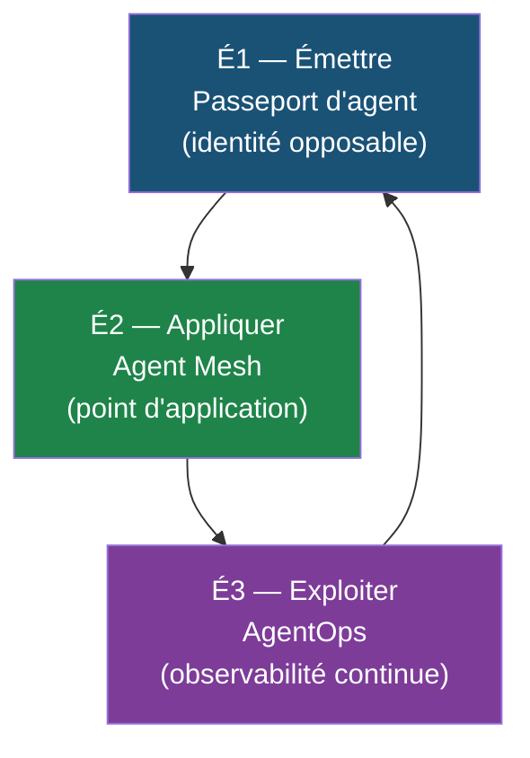
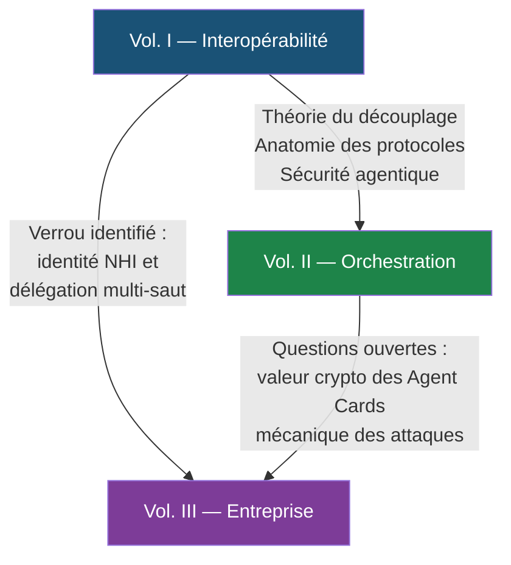

# Le corpus agentique — synthèse consolidée des trois monographies

> **Auteur :** André-Guy Bruneau, M.Sc. IT — Juin–Juillet 2026
>
> ⚠ **Dépôt clos et final le 8 août 2026** — décision d'auteur **D-13** ([`2 - Compendium/PRD/PRD.md`](../2%20-%20Compendium/PRD/PRD.md) v0.17 §16). Aucune passe n'est plus prévue, sur aucun des cinq livrables que le dépôt portait alors ; ce document décrit un état **définitif** pour les trois volumes qu'il couvre. *Clore n'est ni terminer ni publier.* ⚠ **La clôture a été rouverte quatre fois depuis, hors du triptyque** : la veille (8 août), un **sixième livrable** — la [revue de littérature](../4%20-%20Veille/Revue%20de%20litt%C3%A9rature.md), 9 août —, le **calage du compendium à mille pages** (9 août, appareil de rendu du Vol. IV seul) et un **septième livrable** — le [traité sur les systèmes multiagents en essaim](../3%20-%20Trait%C3%A9/Trait%C3%A9.md), 10 août. ⚠ **Une cinquième réouverture a suivi le 14 août 2026** : le traité passe sous [`3 - Traité/`](../3%20-%20Trait%C3%A9/) et **du code exécutable entre au dépôt** — un simulateur d'essaims en Rust qui transpose ce traité et **contredit trois de ses énoncés par la mesure**. ⚠ **Une sixième le 15 août 2026**, de rangement seul : la veille et la revue passent sous [`4 - Veille/`](../4%20-%20Veille/), **quatrième dossier numéroté** — *créé sous le nom `4 - Revue et Veille/` et **renommé `4 - Veille/` le jour même**, commit `71d5388`* —, et `SEBoK.pdf` passe du Vol. IV à [`0 - Références/`](0%20-%20R%C3%A9f%C3%A9rences/) sous le nom `2026 - SystemEngineeringBoK.pdf` — *les cinq fichiers inchangés au bit près*. ⚠ **Une septième les 15-16 août 2026** : les deux livrables de `4 - Veille/` sont **rouverts et re-vérifiés intégralement** — la veille passe à **144 p. / 342 références**, la revue à **59 p. / 192 références**, les deux formats fermes étant levés —, le traité reçoit sa **troisième édition** (15 août, 143 p.), et un **cinquième dossier numéroté** naît le 16 août, [`5 - Recension/`](../5%20-%20Recension/), qui porte le *Rapport de l'art* — ⚠ **un rapport dérivé, et non un huitième livrable**. *Aucune des sept ne touche aux Vol. I, II ou III.*
>
> Ce document est la **synthèse consolidée** des trois monographies du corpus. Il en articule les
> thèses, les concepts et les apports en un seul document de synthèse. Pour le détail, se reporter
> à chaque volume ; pour l'état de l'art le plus récent et la veille technologique, voir le
> [README du dépôt](../README.md).

---

## Vue d'ensemble

Le corpus réunit trois monographies conçues en progression — des protocoles à la réglementation,
puis à l'organisation — qui, ensemble, répondent à une question unique :

> **Comment une entreprise de services financiers peut-elle déployer, gouverner et exploiter des
> agents d'IA autonomes dans un écosystème réglementé, de manière sécurisée, traçable et
> pérenne ?**

Chaque volume éclaire une facette de cette question et porte sa propre thèse. Les trois thèses
sont complémentaires et forment un triptyque cohérent :

| | **Vol. I — Interopérabilité** | **Vol. II — Orchestration** | **Vol. III — Entreprise** |
|---|---|---|---|
| **Titre** | Interopérabilité agentique en entreprise dans le domaine des services financiers | Orchestration agentique | L'entreprise agentique — la fabrique de confiance |
| **Dossier** | [`1 - InteroperabiliteAgentique/`](1%20-%20InteroperabiliteAgentique/) | [`2 - OrchestrationAgentique/`](2%20-%20OrchestrationAgentique/) | [`3 - EntrepriseAgentique/`](3%20-%20EntrepriseAgentique/) |
| **Thèse** | *Autonomie graduée sous contrôle de finalité* | *Autonomie encadrée (framed autonomy)* | *La confiance ne se décrète pas, elle se fabrique* |
| **Portée** | Mondiale (UE, É.-U., R.-U., Asie) | Canada-Québec (cadre réglementaire) | Organisation et cycle de vie (NHI, AgentOps) |
| **Volumétrie** | **569 p.** (7 chapitres + Annexe B, **233 257 mots**) | **387 p.** (29 pièces, 92 056 mots) | **427 p.** (34 pièces, **160 890 mots**) |
| **Méthode** | Formalisme d'ingénierie (ArchiMate 4, ADS) | Socle factuel F-01…F-48, niveaux de preuve [A]/[B]/[C] | Double héritage codifié + socle propre (98 entrées) |
| **Gel** | Juin 2026 | 16–17 juillet 2026 | Hérite des deux gels + pièces propres |

---

## Le fil conducteur : du protocole à la confiance


> [!NOTE]
> **Progression du corpus**
> - **Vol. I** pose les fondations théoriques et architecturales : comment les agents interopèrent (protocoles, sémantique, sécurité).
> - **Vol. II** instruit ce cadre au grain du droit canadien : comment les orchestrer sous contrainte réglementaire stricte.
> - **Vol. III** ferme la boucle : comment l'organisation fabrique, applique et exploite la confiance nécessaire à leur déploiement.

---

## Vol. I — Interopérabilité agentique en entreprise

📖 **Documents sources :** [`1 - InteroperabiliteAgentique/Monographie.pdf`](1%20-%20InteroperabiliteAgentique/Monographie.pdf) (**569 p.**) · [`Monographie.md`](1%20-%20InteroperabiliteAgentique/Monographie.md)

### Thèse

Les systèmes agentiques fondés sur les LLM ne rendent pas obsolètes les principes d'intégration
classiques : ils les **réinstancient à un niveau d'abstraction supérieur**. L'invariant
transversal — *découplage, contrat, évolution* — reste le socle de tout déploiement pérenne.
L'autonomie des agents doit être **graduée** et placée **sous contrôle de finalité** : l'agent
prépare, l'humain ou le processus déterministe autorise.

### Les sept chapitres en spirale

| # | Chapitre | Objet & Concepts clés |
|---|----------|-----------------------|
| 1 | **Théorie de l'interopérabilité des SI** | Fondements et intégration d'entreprise : SOA, microservices, messagerie événementielle, niveaux d'intégration conceptuels. |
| 2 | **Ingénierie des systèmes agentiques** | Agents fondés sur LLM : boucle ReAct, mémoire, invocation d'outils, taxonomie des modes d'échec (MAST). |
| 3 | **Protocoles d'interopérabilité agentique** | Convergence : MCP (outils), A2A (délégation pair-à-pair), ANP ; découverte dynamique, commerce inter-agents, identité, sécurité des frontières. |
| 4 | **Intégration à l'échelle de l'entreprise** | Déploiement : modernisation de l'héritage applicatif, identités non humaines (NHI), plan de contrôle de sécurité, gouvernance, maturité. |
| 5 | **Domaine financier & maillage réglementaire** | Cinq sous-domaines sous quatre « durcisseurs » : irréversibilité du règlement, risque systémique, risque-modèle, double qualification (tiers TIC + modèle). |
| 6 | **Blueprint ArchiMate** | Formalisation (ArchiMate 4) : patrons réutilisables (`<<Agent>>`, `<<MCP Server>>`), traçabilité verticale de l'intention métier aux couches logicielles. |
| 7 | **Prospective 2027-2032** | Chapitre *capstone* : tri épistémique (Programmé / Projeté / Spéculatif) ; échéancier 2027 ; fragmentation des normes ; migration post-quantique. |

### Architecture détaillée de solution (Annexe B)

L'Annexe B projette la monographie sur une entreprise fictive — la **Coopérative financière
Boréalis** — sous forme d'architecture de solution prête au déploiement, consolidée sur la pile **IBM**
(watsonx Orchestrate/Governance, API Connect + DataPower, Confluent, MQ, z/OS Connect, Sovereign Core).
Elle comprend **18 sections, 6 sous-annexes et 28 diagrammes Mermaid**, couvrant :
architecture logique et physique, contrats d'interface, sécurité, NFR/SLO, modèle opérationnel,
stratégie de test et plan de déploiement par plateaux.

### Apports distinctifs du Vol. I

- **Formalisme ArchiMate 4** appliqué à l'IA agentique — premier blueprint d'architecture
  d'entreprise complet pour les systèmes multi-agents en finance.
- **Principe d'autonomie graduée** : séparation structurelle entre la phase de préparation
  (agent probabiliste) et la phase d'engagement (processus déterministe).
- **Double qualification** sectorielle : l'agent doit figurer simultanément au registre des
  modèles (risque-modèle) et au registre des tiers TIC (résilience).
- **Taxonomie MAST** des modes d'échec des systèmes agentiques.

---

## Vol. II — Orchestration agentique

⚠ **Renommé le 8 août 2026** : *« L'autonomie encadrée »* du 17 juillet au 8 août 2026,
**« Orchestration agentique »** depuis. *Le titre change, la thèse ne change pas* — l'**autonomie
encadrée** (*framed autonomy*) reste la thèse du volume, et c'est elle que la ligne « Thèse » du
tableau ci-dessus porte.

📖 **Documents sources :** [`2 - OrchestrationAgentique/Monographie.pdf`](2%20-%20OrchestrationAgentique/Monographie.pdf) (**387 p.**) · [`Monographie.md`](2%20-%20OrchestrationAgentique/Monographie.md)

### Thèse

Dans le secteur financier canadien, sous exigence réglementaire stricte, **le cadre déterministe
invoque les agents, jamais l'inverse**. L'agent est un exécutant encadré (*framed autonomy*) :
les processus soumis à la réglementation s'exécutent dans des workflows déterministes qui
orchestrent les agents, et non l'inverse — parce que le cadre est la seule pièce dont l'exploitant
puisse démontrer la teneur devant un tiers.

### Structure en sept parties

| Partie | Titre & Contenu | Chapitres |
|--------|-----------------|-----------|
| **I** | **Fondements : les protocoles d'interopérabilité agentique** — Consolidation en 17 mois (MCP, A2A, AP2, AGNTCY) ; complémentarité, identité d'agent, taxonomie des risques protocolaires. | Ch. 1-4 |
| **II** | **L'orchestration multi-agents en entreprise** — Options d'orchestration OO1–OO4, autonomie encadrée (paradigme APM), frameworks, identité et registres d'agents. | Ch. 5-8 |
| **III** | **Le cadre réglementaire canadien** — E-23 (BSIF), AMF, Loi 25, ACVM ; applicabilité implicite à l'IA agentique. | Ch. 9-13 |
| **IV** | **L'interopérabilité financière canadienne** — Migration Lynx vers ISO 20022, RTR, interaction prospective avec AP2. | Ch. 14-16 |
| **V** | **L'adoption par les institutions financières canadiennes** — Études de cas sur dix institutions : TD (hypothécaire en <3 min), Scotiabank (AIDox), CIBC, Manuvie. | Ch. 17 |
| **VI** | **Synthèse : l'architecture de référence** — Matrice protocoles × réglementation, architecture par couches, instrumentation, puis la frontière de la connaissance vérifiable (onze lacunes assumées et exposées). | Ch. 18-21 |
| **VII** | **Le blueprint d'intégration d'entreprise** — 6 principes directeurs, vue en couches C1–C8, instanciation sur la pile IBM (watsonx, App Connect, API Connect, Confluent). | Ch. 22-24 |

> [!IMPORTANT]
> **Contribution la plus citable — un résultat négatif**
> En croisant **trois protocoles** (MCP, A2A, AP2) et **cinq corpus de textes canadiens**, **aucun lien documenté par source primaire** n'a été trouvé — quinze croisements, zéro lien. Ce résultat démontre que sous exigence réglementaire stricte, le cadre déterministe doit régir les agents.

### Rigueur méthodologique

- **Socle factuel** de 46 entrées (F-01 à F-48 ; F-12 à F-14 non attribués ; plus F-23b), cotées par niveau de preuve :
  **[A]** vote adversarial 3-0 > **[B]** source primaire extraite > **[C]** repérage.
- **Huit garde-fous** de formulation (R-1 à R-8).
- **Onze lacunes** exposées plutôt que comblées.
- **Grille de conformité** CA-1 à CA-8.

### Apports distinctifs du Vol. II

- **Résultat négatif systématique** (15 croisements protocoles × réglementation = 0 lien documenté), fondamental pour l'architecture réglementée.
- **Méthode de vérification adverse** à niveaux de preuve, transposables à d'autres domaines régulés.
- **Cas d'adoption réels** en institutions financières canadiennes (TD, Scotiabank, CIBC, Manuvie).
- **Options d'orchestration OO1–OO4** : taxonomie des modes d'intégration agents-processus (ABPM).

---

## Vol. III — L'entreprise agentique

📖 **Documents sources :** [`3 - EntrepriseAgentique/Monographie.pdf`](3%20-%20EntrepriseAgentique/Monographie.pdf) (**427 p.**) · [`Monographie.md`](3%20-%20EntrepriseAgentique/Monographie.md)

⚠ **L'appareil de vérification du volume a été supprimé le 8 août 2026** (commit `659241b`, postérieur
à la clôture) : le répertoire `verification/` et ses **30 rapports** — 15 lots d'instruction,
11 relectures, 2 revalidations, la confrontation des thèses et `remontees-gouvernance.md` — **ne se
lisent plus qu'à l'historique git**. ⚠ *Rien de ce qu'ils portaient n'est soldé* : les quinze
remontées R-G-43 à R-G-57 et la dette de vote sur F-92 et F-96 restent ouvertes à titre définitif, et
**le registre qui les détaillait n'est plus sur l'arbre.** *La dette survit à son inventaire.*

### Thèse

L'entreprise agentique — celle qui délègue des tâches engageant sa responsabilité à des agents
logiciels — doit se construire sur une **fondation identitaire**. L'identité non humaine est le
**nouveau plan de contrôle** (*identity as the new control plane*). La confiance ne se décrète pas :
elle se **fabrique** par trois capacités — *émettre* une identité opposable, l'*appliquer* au
maillage d'agents, l'*exploiter* dans la durée — sous l'horloge post-quantique.

### Structure en neuf parties

| Partie | Capacité | Objet & Contenu |
|--------|----------|-----------------|
| **I — L'héritage** | — | Évolution de l'identité machine depuis OAuth 2012, identité de charge de travail (SPIFFE/SPIRE), écart de gouvernance NHI. |
| **II — Émettre** | Identité | Le **passeport d'agent** : carte signée (A2A v1.0) + inscription au registre + chaîne de mandat + attestations de conformité. |
| **III — Délégation** | Mandat | Le « problème des deux sauts » : au-delà de deux sauts, aucun mécanisme actuel ne trace la délégation de bout en bout. |
| **IV — Menaces** | Défense | Menaces architecturales sur la chaîne d'identité ; absence de réduction de portée entre mandant et mandataire (MITRE ATLAS). |
| **V — Horloge PQ** | Cryptographie | Migration vers ML-KEM/ML-DSA (FIPS 203/204) ; crypto-agilité comme exigence de conception ; fenêtre critique 2026-2029. |
| **VI — Droit** | Conformité | E-23, AMF, Loi 25 : obligation implicite de registre d'agents et de traçabilité ; droit de révision humaine. |
| **VII — Appliquer** | Maillage | Le *maillage d'agents* (Agent Mesh) comme point d'application des politiques de sécurité. |
| **VIII — Exploiter** | AgentOps | Observabilité, évaluation continue, cycle de vie, réponse aux incidents. |
| **IX — Blueprint** | Organisation | Modèle de maturité (assistance → copilote → orchestration sous revue → autonomie bornée). |

### La fabrique de confiance — boucle continue



### Apports distinctifs du Vol. III

- **Le passeport d'agent** : objet de synthèse unifiant identité, mandat, conformité et enregistrement — concept original de la monographie.
- **Le problème des deux sauts** : démonstration que la délégation multi-saut actuelle perd sa traçabilité opposable au-delà du premier saut.
- **L'horloge post-quantique** comme contrainte de conception architecturale (et non comme problème futur), avec fenêtre d'action critique 2026-2029.
- **AgentOps** : formalisation des pratiques d'observabilité et de gestion du cycle de vie spécifiques aux agents.

---

## Les trois monographies en dialogue

### Convergence des thèses

Les trois thèses ne se contredisent pas : elles sont **trois coupes d'un même objet**.

| Dimension | Vol. I | Vol. II | Vol. III |
|-----------|--------|---------|----------|
| **Qui contrôle ?** | Le contrôle de finalité (humain ou processus déterministe) | Le cadre réglementaire (workflow déterministe) | L'identité vérifiable (passeport d'agent) |
| **Quel invariant ?** | Découplage, contrat, évolution | Cadre ⊃ agent (jamais l'inverse) | Émettre → Appliquer → Exploiter |
| **Quel horizon ?** | Architecture mondiale 2027-2032 | Échéancier réglementaire canadien (mai 2027) | Migration post-quantique 2030-2035 |

### Héritage et filiation



- **Vol. II présuppose Vol. I** pour la théorie du découplage, l'ingénierie des agents LLM et l'anatomie des protocoles.
- **Vol. I illustre mondialement** ce que **Vol. II instruit au grain du droit canadien**.
- **Vol. III prolonge les deux** sur leur verrou commun : l'identité non humaine et son exploitation.

---

## Protocoles et standards structurants

Les trois monographies convergent sur un socle commun de protocoles et standards :

### Protocoles agentiques

| Protocole | Rôle | Volumes |
|-----------|------|---------|
| **MCP** (Model Context Protocol) | Accès client-serveur aux outils et données (JSON-RPC 2.0) | I, II, III |
| **A2A** (Agent2Agent) | Délégation de tâches de pair à pair ; Agent Cards signées | I, II, III |
| **AP2** (Agent Payments Protocol) | Transactions financières agentiques | I, II |
| **ANP** (Agent Network Protocol) | Réseau d'agents décentralisé | I |
| **AGNTCY** | Couche d'infrastructure agentique | II |

### Standards d'identité et de sécurité

| Standard | Rôle | Volumes |
|----------|------|---------|
| **OAuth 2.0 / OIDC** | Autorisation et identité fédérée (RFC 6749, RFC 8693) | I, II, III |
| **SCIM 2.0** (RFC 7643) | Annuaire d'entreprise, extension pour profils d'agents | II, III |
| **SPIFFE / SPIRE** | Identité des charges de travail (CNCF) | I, III |
| **WIMSE** (IETF) | Identité en environnements multi-systèmes ; jetons de transaction | III |
| **VC / DID** (W3C) | Accréditations vérifiables, identité décentralisée | III |
| **FIPS 203 / 204** (NIST) | Cryptographie post-quantique (ML-KEM, ML-DSA) | I, III |

### Standards financiers et réglementaires

| Standard / Texte | Rôle | Volumes |
|------------------|------|---------|
| **ISO 20022** | Messagerie financière sémantique (Lynx, RTR) | I, II |
| **E-23** (BSIF) | Risque de modèle — entrée en vigueur 1er mai 2027 | I, II, III |
| **Loi 25** (Québec) | Renseignements personnels, droit de révision humaine | I, II, III |
| **AMF** (ligne directrice IA) | Encadrement sectoriel québécois | I, II, III |
| **DORA / AI Act** (UE) | Résilience opérationnelle et encadrement de l'IA | I |

---

## Concepts transversaux

Sept concepts traversent les trois monographies et forment le vocabulaire commun du corpus :

1. **Autonomie graduée / encadrée** — L'agent prépare, l'humain ou le processus déterministe autorise. L'autonomie n'est pas binaire : elle progresse par paliers de maturité vérifiables, de l'assistance au copilote puis à l'autonomie bornée.
2. **Découplage, contrat, évolution** — L'invariant architectural : les composants interagissent par contrat (et non par couplage direct), ce qui permet l'évolution indépendante de chaque partie.
3. **Identité non humaine (NHI)** — L'identité de l'agent est le nouveau plan de contrôle. Sans identité propre et gouvernée, le principe du moindre privilège est inapplicable.
4. **Passeport d'agent** — Objet de synthèse combinant carte signée, inscription au registre, chaîne de mandat et attestations de conformité — concept original du Vol. III.
5. **Maillage d'agents (Agent Mesh)** — Architecture d'intégration appliquant les politiques de sécurité à chaque interaction inter-agents ; le point d'application de l'identité.
6. **Crypto-agilité** — Capacité de remplacer rapidement les algorithmes cryptographiques, exigence de conception face à la fenêtre de migration post-quantique 2026-2035.
7. **Traçabilité de bout en bout** — Chaque action d'agent doit pouvoir être imputée, auditée et rejouée — exigence réglementaire (E-23, Loi 25) autant qu'architecturale.

---

## Recommandations consolidées

Les trois volumes convergent sur un ensemble de recommandations pratiques pour les institutions financières :

### Architecture et déploiement

- **Séparer préparation et engagement** : l'agent probabiliste prépare ; le processus déterministe engage. Aucun accès transactionnel non contraint pour les agents.
- **Gouverner le MCP** : imposer un *Control Plane* (passerelle d'API / AI Gateway) pour intercepter, valider et journaliser chaque action sortante des agents.
- **Encapsuler les agents dans des workflows stricts** (BPMN/BPEL) avec traçabilité intégrée pour respecter les exigences d'auditabilité.
- **Réutiliser les contrats existants** : les accès des agents aux systèmes *legacy* doivent se faire par les APIs et événements déjà en place.

### Identité et sécurité

- **Passer des identités statiques aux identités dynamiques** : remplacer les clés d'API par des identités avec mandat vérifiable et durée de vie bornée.
- **Superviser chaque arête du maillage** : les protocoles actuels perdent la trace au-delà du premier saut de délégation ; une supervision stricte est requise.
- **Intégrer des points d'arrêt humains auditables** sous forme d'actes de délégation signés cryptographiquement.
- **Concevoir pour la cryptographie post-quantique dès maintenant** : fenêtre d'action critique 2026-2029, jalons NIST 2030/2035.

### Conformité et gouvernance

- **Tenir un registre centralisé et vérifiable** des modèles et des agents — obligation implicite d'E-23 et de la Loi 25.
- **Démontrer l'anti-collusion** (*maker-checker*) dans l'architecture elle-même.
- **Exposer les lacunes plutôt que les combler** par des sources de moindre qualité — discipline méthodologique du corpus.
- **Adopter de manière incrémentale** selon des paliers de maturité vérifiables.

---

## Ordre de lecture

**Vol. I → Vol. II → Vol. III**, la [veille technologique](../4%20-%20Veille/Veille%20Technologique.md) servant d'entrée rapide ou de mise à jour.

| Profil du lecteur | Point d'entrée recommandé |
|---|---|
| **Pressé** | La [veille technologique](../4%20-%20Veille/Veille%20Technologique.md) (**144 p.**, état de l'art le plus récent — **édition du 15 août 2026**, **342 références** ; *162 p. jusqu'au 8 août 2026, puis 100 p. fermes jusqu'au 15, format ferme levé à la re-vérification intégrale*) — ⚠ *à la racine du dépôt jusqu'au 15 août 2026, sous [`4 - Veille/`](../4%20-%20Veille/) depuis* |
| **Architecte / chercheur** | Vol. I, chapitre 1 — lecture séquentielle en spirale |
| **Praticien canadien** | Vol. II, chapitre 13 — « le pont : des contraintes réglementaires aux *frames* déterministes » |
| **RSSI / responsable identité** | Vol. III, Partie II — le passeport d'agent et la chaîne de mandat |
| **Décideur** | Ce README, puis la veille technologique |
| **Académique** | La [revue de littérature](../4%20-%20Veille/Revue%20de%20litt%C3%A9rature.md) (**59 p.**, **192 références**, **dix fronts**, gel du **15 août 2026** ; *40 p. fermes et 176 références jusque-là, cible de pagination levée à la re-vérification intégrale*) — ⚠ *sixième livrable du dépôt, entré après la clôture ; elle ne couvre aucun des trois volumes, elle mesure le champ savant qu'ils citent.* ⚠ **À la racine du dépôt jusqu'au 15 août 2026**, sous [`4 - Veille/`](../4%20-%20Veille/) depuis, avec la veille |
| **Le contrepoint** | Le [traité sur les systèmes multiagents en essaim](../3%20-%20Trait%C3%A9/Trait%C3%A9.md) (**143 p.**, **123 notices**, déposé le **10 août 2026**, **deuxième édition le 13 août**, **troisième le 15** — ⚠ *le format ferme de cent pages est levé à cette troisième édition, et sa pagination ne coïncide donc avec aucun renvoi antérieur*) — ⚠ *septième livrable, et le seul qui ne cite aucun autre : il prend l'objet par l'autre bout, ce qu'une population d'agents gagne à ne pas s'accorder. Aucun des trois volumes ne le cite, et il n'en cite aucun.* ⚠ **À la racine du dépôt jusqu'au 14 août 2026**, sous [`3 - Traité/`](../3%20-%20Trait%C3%A9/) depuis, où il est accompagné de sa **transposition exécutable** — un simulateur Rust qui rejoue ses mécanismes et **réfute trois de ses énoncés par la mesure** |

---

## Volumétrie du corpus

| | Vol. I | Vol. II | Vol. III | **Total du corpus** |
|---|---|---|---|---|
| **Pages** | 569 | 387 | 427 | **1 383 p.** |
| **Mots** | 233 257 | 92 056 | 160 890 | **486 203** |
| **Pièces** | 8 (7 chap. + Annexe B) | 29 (24 chap. + annexes) | 34 (28 chap. + annexes) | **71 pièces rédigées** |
| **Socle factuel** | Vérification adverse | 46 entrées (F-01–F-48) | 98 entrées (F-01–F-98) + 33 héritées | **144 entrées codifiées (46 + 98)** |
| **Diagrammes** | 28 Mermaid | 0 | 0 | **28 diagrammes** |

⚠ **La ligne « Mots » additionne trois commandes différentes, et il faut le savoir avant de citer son
total.** Vol. I : `wc -w` sur `Monographie.md` — le volume n'a pas fixé de commande de référence, et
c'est ce chiffre qui sert de point d'ancrage au dépôt. Vol. II : commande de référence de
[PRDPlan §4.2](2%20-%20OrchestrationAgentique/prd/PRDPlan.md) (corps borné, jetons alphanumériques,
locale C). Vol. III : commande de référence de
[PRDPlan §1.5](3%20-%20EntrepriseAgentique/prd/PRDPlan.md). *Mesuré par une commande **unique** sur les
trois corpus — `bash "../2 - Compendium/PRD/decompte.sh" --verifier` —, l'agrégat vaut **479 387** mots
sur l'arbre courant : il n'est pas comparable au total ci-dessus, et aucun des deux n'est faux.*

⚠ **Et cette commande ÉCHOUE désormais — sortie 1, relevée le 8 août 2026, seconde relecture.** Elle
attend **93 242** mots au Vol. II et en mesure **93 239** ; l'agrégat tombe de **479 390** à
**479 387**. La cause est le renommage du volume : le commit `659241b` a récrit, dans **trois pièces
de `2 - OrchestrationAgentique/monographie/`** (§ 6.2, § 13.2, glossaire de l'annexe D), les formules
qui appelaient l'autonomie encadrée le *titre* de l'ouvrage pour en faire sa *thèse*, et **trois
jetons sont tombés**. *(Le script mesure les pièces, non le `Monographie.md` assemblé.)* ⚠ *Le script a
raison ; c'est sa valeur d'ancrage qui est périmée d'un renommage, et personne ne la remettra à jour
— le dépôt est clos.*

⚠ **Et la ligne « Mots » ci-dessus bouge du même écart — ce paragraphe affirmait le contraire, et il
avait tort.** Les trois jetons sont tombés **dans le corps des pièces**, que les **deux** commandes
mesurent : rejouée sur les 29 pièces le 10 août 2026, la commande de référence de
[PRDPlan §4.2](2%20-%20OrchestrationAgentique/prd/PRDPlan.md) rend **92 056**, non les **92 059**
publiés au 17 juillet 2026 ; le total du corpus passe de 486 206 à **486 203**. *Ce qui sépare les
deux commandes est une définition du jeton, pas un périmètre de texte : un écart pris dans le corps
les touche donc toutes les deux, et « pris par une autre commande » n'a jamais mis un chiffre à
l'abri.*

---

## Avertissements

> [!WARNING]
> - **Aucun avis juridique ni conseil d'investissement.** Ces ouvrages rapportent des textes et en proposent des lectures d'architecture qui engagent leur auteur seul.
> - **Aucune recommandation de fournisseur.** Les instanciations sur une pile d'éditeur (IBM notamment) sont des cas documentés, pas des verdicts comparatifs.
> - **Le domaine se périme par trimestres.** Chaque volume porte sa date de gel ; les échéances de revalidation sont suivies dans le [README du dépôt](../README.md).
> - **Assistance par agents.** Ces travaux ont été produits avec l'assistance de pipelines de recherche multi-agents ; la responsabilité éditoriale est celle de l'auteur.

---

## Structure du dossier

```
1 - Corpus/
├── README.md                                ← ce fichier (synthèse consolidée)
├── 0 - Références/                          ⚠ 4 PDF de littérature source (46,5 Mio) — 3 déposés le 8 août 2026,
│                                              le 4ᵉ venu de `2 - Compendium/SEBoK.pdf` le 15 août, renommé
│                                              `2026 - SystemEngineeringBoK.pdf`
│                                              — cités par AUCUN document du dépôt, sans README ni régime déclaré
├── 1 - InteroperabiliteAgentique/           Vol. I (569 p., 233 257 mots)
│   ├── README.md                              présentation du volume
│   ├── Chapitres/                             7 chapitres + 7 bibliographies + Annexe B (ADS) + TOC.md
│   ├── Monographie.md / .pdf                  assemblage
│   ├── build/                                 pipeline FESP (Mermaid → Pandoc → Typst)
│   └── LICENSE, .gitignore                    seul `LICENSE` du dépôt — il ne vaut que pour ce volume
├── 2 - OrchestrationAgentique/              Vol. II (387 p., 92 056 mots)
│   ├── README.md                              présentation du volume
│   ├── monographie/                           29 pièces (parties I-VII, annexes, registre des gels)
│   │                                          + README.md, l'index de lecture des 29 pièces
│   ├── prd/                                   PRD, PRDPlan, TOC, audit + 2 PDF sources — gouvernance
│   ├── verification/                          revalidations et grille de conformité
│   ├── build/                                 assemblage + pipeline Pandoc → Typst
│   ├── Monographie.md / .pdf                  assemblage
│   └── .gitignore
└── 3 - EntrepriseAgentique/                 Vol. III (427 p., 160 890 mots)
    ├── README.md                              présentation du volume (déposée le 29 juill. 2026)
    ├── monographie/                           34 pièces rédigées + registre des gels
    ├── prd/                                   PRD v1.3, TOC v0.8, PRDPlan v0.5 — gouvernance
    │                                          ⚠ verification/ (30 rapports) SUPPRIMÉ le 8 août 2026 — historique git seul
    ├── build/                                 pipeline FESP
    └── Monographie.md / .pdf                  assemblage
```

---

## Décomptes du dépôt final

☑ **Toute la volumétrie de ce document a été re-mesurée sur pièce le 8 août 2026**, et **trois chiffres
qu'elle publiait étaient faux** — la passe du 29 juillet 2026 les avait déclarés « inchangés » sans les
reprendre à la source. Ce qui tient : **1 383 p.** (569 + 387 + 427, `/Count` de l'objet `/Type /Pages`
de chaque PDF), les **29 et 34 pièces** des Vol. II et III (`find monographie -name '*.md'`, index de
lecture et registre de gel exclus — *31 − 2 au Vol. II, 35 − 1 au Vol. III, dont le `monographie/` ne
porte pas d'index de lecture*), les **28 diagrammes** du Vol. I (motif ancré `grep -c '^```mermaid'`), les
**144 entrées de socle codifiées** (46 + 98, lignes d'entrée du PRD de chaque volume). Ce qui a été
corrigé : la volumétrie du Vol. I — **233 257 mots**, non « ≈ 263 600 », chiffre qu'aucune commande du
dépôt ne produit ; le **total en mots** qui en dérivait, ramené de « ≈ 516 500 » à **486 206** — et
à **486 203** depuis la re-mesure du 10 août 2026, note de volumétrie ci-dessus —, ce qui
retire au corpus le seuil des 500 000 mots qu'il s'attribuait ; et le **cardinal des pièces**, porté de
70 à **71**, la ligne comptant l'Annexe B du Vol. I sans l'additionner. ⚠ **Une re-mesure, qu'elle
confirme ou qu'elle corrige, ne change aucun état** : le Vol. III demeure **rédigé et non publiable**.

⚠ **La pagination n'a pas été relevée avec `pypdf`** à la passe du 8 août 2026, que les passes
antérieures citaient : il n'était pas installé sur le poste de cette passe-là. Elle a été lue dans le
`/Count` de l'unique objet `/Type /Pages` de chaque PDF, qui est l'autorité de la pagination au format.
☑ **`pypdf` est installé depuis la passe du 9 août 2026** (**6.15.0**, [README du dépôt](../README.md))
et **rend les mêmes valeurs** — 569, 387 et 427 : *le relevé de repli n'était pas un pis-aller, c'était
la même mesure prise à la main.* ⚠ *La première rédaction de cette note
mettait en garde contre le motif `grep -c '/Type /Page'` en lui prêtant un décompte doublé (1 138, 774,
854) : la mise en garde était fausse en trois points, et un critique l'a reprise en réexécutant la
commande.* Avec l'espace, le motif rend **0** — Typst écrit `/Type/Page` sans espace. Le doublement
observé venait d'une **classe d'exclusion trop étroite**, qui écartait `/Type/Pages` mais laissait
passer `/Type/PageLabel`, dont il existe **un objet par page**. Et un motif correctement ancré rend la
pagination juste du premier coup : `grep -aoP '/Type/Page(?![sL])' | wc -l` donne **569, 387 et 427**.

⚠ **Ce document ne couvre pas le Vol. IV**, et c'est délibéré : la synthèse porte sur le **triptyque**.
Le compendium — *Interopérabilité et Orchestration Agentiques en Entreprise* (titre du 8 août 2026 ; *« La somme agentique »* jusque-là), **arrêté en révision finale le 29 juillet 2026, arrêt rouvert le 30, puis clos le 8 août 2026 sans que la passe de révision ait été exécutée — non publiable** —
se situe au [README du dépôt](../README.md) et vit sous
[`2 - Compendium/`](../2%20-%20Compendium/). **Il ne se substitue pas à ces trois volumes tant qu'il
n'est pas recevable, et il ne l'est pas — ni ne le deviendra, le dépôt étant clos** : les trois
volumes sources font foi. ⚠ **Sa pagination
n'est plus celle qu'annonçait le 29 juillet** : `Compendium.pdf` mesure **1 000 p.** au dépôt courant,
non 810 — **cible d'auteur du 9 août 2026, calée sur le seul gabarit et vérifiée au build** ; le
volume en a mesuré 1 114 du 31 juillet au 9 août. Chiffre relevé ici pour mémoire, le volume relevant
de sa propre charge éditoriale.

---

*Synthèse consolidée — juillet 2026 · décomptes des trois volumes re-mesurés sur pièce le 8 août 2026 ;
pagination du compendium et volumétrie de la revue relevées le 9 août 2026 ; renvois hors triptyque
réalignés le 17 août 2026 sur l'arbre courant — dossier `4 - Veille/`, éditions du 15 août de la
veille, de la revue et du traité, entrée de `5 - Recension/`. ⚠ **Rien des trois volumes n'est touché
par ce réalignement** : leurs décomptes sont ceux du 8 août 2026, inchangés*
