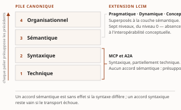

# Chapitre 1 — L'interopérabilité comme problème d'intégration d'entreprise

*Livre I — Coopérer : fondements de l'interopérabilité et couche protocolaire agentique.
Premier mouvement — les fondements (ch. 1-6).*

| Champ | Valeur |
|---|---|
| **Statut** | **Brouillon de rédaction, non publiable** — rédigé sur instruction d'auteur du 27 juillet 2026, **avant** le franchissement des portes G-1 (gel unique), G-2 (commande de décompte) et G-3 (refonte du socle) du [PRD](../PRD/PRD.md) §5. La règle cardinale du volume — *un chapitre écrit sur un socle vide n'est pas un chapitre en avance, c'est une inférence longue* — n'est pas levée ; elle est **déclarée enfreinte**, avec ses conséquences énumérées en note de clôture (§ 1.8). ⚠ **Deux mises à jour postérieures à la rédaction.** *(27 juillet 2026)* — **G-2 et le volet Livre I de G-1 sont franchis** (PRD v0.8), et les **remontées de cette pièce sont closes**. *(28 juillet 2026)* — **G-3 est franchie à son tour** (PRD v0.14) : le socle consolidé existe, **159 entrées `S-001`…`S-159`**. ⚠ **La pièce reste un brouillon non publiable, pour des motifs que ce franchissement ne touche pas** : les **dix-sept entrées héritées du Vol. I sont toutes en `[C]`** — *une entrée `[C]` ne porte jamais un fait central* —, **aucun vote adversarial n'a été conduit**, et **CA-IV-13 demeure insatisfaite**, D-6 ne fournissant pas de relecteur distinct du rédacteur. **Aucun énoncé de ce chapitre n'est donc central au sens de CA-IV-01.** |
| **Date de gel** | **27 juillet 2026** — gel unique du compendium, **décision d'auteur D-1 prise** ce jour (registre : [`gel-2026-07-27.md`](../PRD/gel-2026-07-27.md)). ⚠ **Ce gel n'efface pas ceux des sources**, qui restent portés ci-dessous : il date la reprise de chaque fait périssable à sa source primaire, non la matière elle-même. La matière condensée ici porte le gel de sa source — **juin 2026** (Vol. I) —, qui n'est pas le gel de la somme et ne peut en tenir lieu |
| **Socle mobilisé** | **Deux entrées de l'Annexe B, et le reste hors socle.** `S-153` — *l'invariant à quatre termes*, en **`[C]`** — est l'appui du ⚠ du § 1.0.2 ; ⚠ *elle est portée **☐ non établie** au volet résiduel de G-1, sa source étant un fichier du Vol. I retiré du dépôt le 22 juillet 2026 : une citation non rejouable n'est pas fautive, elle cesse d'être opposable* (décision **D-5**). `S-001` — *la révision protocolaire agent-outil*, en **`[A]`** — est touchée par le seul § 1.1.4.1, où elle porte une illustration et non un énoncé central ; ⚠ son état a **changé le 28 juillet 2026**, et l'écart est porté à la section. **Pour tout le reste, les énoncés factuels résolvent contre le Vol. I *Monographie* §1.0-1.6**, dont le régime d'héritage est **[C]** (PRD §7.1 : les faits du Vol. I entrent en [C], sa vérification portant sur les références et non sur le contenu des affirmations). ⚠ **Aucune autre entrée de l'Annexe B n'a été trouvée porteuse de cette matière pré-agentique** — *absence de documentation (degré 3), non fait négatif vérifié* : le balayage a porté sur les intitulés des 159 entrées, non sur leur corps. **Aucun énoncé de ce chapitre n'est central au sens de CA-IV-01** tant que l'élévation en [B] par lecture des sources primaires citées par le Vol. I n'est pas faite |
| **Garde-fous balayés** | **Séries héritées, balayées intégralement, y compris à zéro occurrence.** ⚠ **Règle de décompte, et les cardinaux ci-dessous ont été re-mesurés sous elle le 28 juillet 2026** : un décompte d'occurrences porte sur le **marqueur littéral de l'identifiant** dans le **corps** de la pièce — en-tête et note de statut exclus —, et il se re-mesure au commit ; un garde-fou appliqué **sans identifiant écrit** se déclare par son **domaine balayé, sans cardinal**. Vol. II — R-1 à R-8 : **zéro marqueur littéral** dans le corps — aucune matière réglementaire canadienne, aucune métrique d'adoption, aucun énoncé sur E-23 ni sur le RTR. ⚠ **MCP fait exception, et le domaine s'y déclare plutôt que le cardinal** : le protocole est nommé aux § 1.1.2, § 1.1.4.1 et § 1.2.1, **jamais qualifié de « sécurisé »** — le chapitre ne dit rien de ses propriétés de sécurité, et la seule chose qu'il en retienne est l'existence d'une politique de dépréciation (§ 1.1.4.1). Vol. III — R-01 à R-14 : **zéro marqueur littéral** pour R-01 à R-13 (aucune qualification cryptographique, aucun emploi d'« AgentMesh », de « control plane », d'« ACP » ni d'« autonomie graduée » ; ⚠ « plan de contrôle » y figure **deux fois** — § 1.3.4, puis son rappel au § 1.7 — au sens du maillage de services **pré-agentique**, où il n'est pas un terme de la série) ; **R-14 (trois degrés d'absence) : deux occurrences**, § 1.2.2.3 et § 1.3.1.2, marquées en toutes lettres |
| **Volumétrie cible** | ≈ 11 000 mots de corps (§ 1.0 à § 1.7). Enveloppe **dérivée, non prescrite** : le TOC ne donne d'enveloppe qu'au Livre (~65 000 mots pour onze chapitres) ; le présent chapitre étant le socle pré-agentique que les chapitres aval citent sans le reconstruire, il pèse plus que la moyenne — le solde reste ≈ 54 000 pour les ch. 2-11. ☑ **Décompte publiable depuis le franchissement de G-2** (27 juillet 2026). **Réel : 10 859 mots** de corps, mesurés par [`PRD/decompte.sh`](../PRD/decompte.sh), seule autorité de décompte du volume, **re-mesurés à la seconde passe de relecture du 28 juillet 2026** (10 724 à la rédaction, 10 829 à la première passe) — **−1,3 %** de la cible. ⚠ **L'écart individuel ne se lit pas seul** : la somme des onze cibles dérivées atteint **93 000 mots** pour une enveloppe de Livre de **65 000** — chaque pièce a dérivé sa cible de l'enveloppe sans que personne n'additionne les dérivations. Le réel du Livre valait **64 750 mots, soit −0,4 % de l'enveloppe** à sa mesure du 27 juillet 2026 : c'est la cible dérivée qui était fausse, non la pièce qui est courte. ⚠ **Ce cardinal de Livre n'est pas re-mesuré ici et ne peut pas l'être** — les onze pièces sont relues en parallèle, et *un cardinal mesuré pendant que d'autres pièces changent est faux à la seconde où on le publie* ; il se re-mesure à la clôture de la passe (décision 16 du TOC). *Un écart se documente ; il ne se corrige ni par amputation ni par gonflement* |

> **Thèse** *(citée depuis le [`TOC.md`](../PRD/TOC.md) v0.23, entrée du chapitre 1)* — l'interopérabilité n'est pas un attribut mais une propriété à maintenir dans le temps ; la dette d'intégration et le coût de la non-interopérabilité en font un problème économique avant d'être technique.

---

## § 1.0 — Introduction : l'interopérabilité comme problème d'intégration d'entreprise

L'interopérabilité se traite le plus souvent comme une question technique close par le choix d'un protocole ou d'un format. Le présent chapitre retient un parti pris différent, qu'il conserve jusqu'à sa clôture : la traiter comme un problème d'**intégration des systèmes d'entreprise**, c'est-à-dire comme une propriété d'ensemble que l'organisation acquiert, puis maintient, au fil de l'évolution conjointe de ses applications, de ses données et de ses processus. Ce déplacement n'est pas rhétorique. Il commande la suite de la somme : si l'interopérabilité est une propriété à maintenir, alors elle a un coût récurrent, une gouvernance, des instruments de mesure — et les protocoles agentiques des chapitres 7 à 11 en hériteront la charge sans la résoudre.

Ce chapitre est le socle **pré-agentique** du Livre I, et il est posé une seule fois. Ce qu'il établit — vocabulaire, taxonomie des niveaux, théorie du couplage, styles d'intégration, contrats d'API, messagerie, patrons de coordination — n'est reconstruit dans aucun chapitre aval : les chapitres agentiques y renvoient. Trois matières que le lecteur pourrait attendre ici en sont explicitement absentes, et leur absence est un arbitrage, non un oubli : la **sémantique** et les ontologies partent au ch. 2 ; l'**héritage IAM** — identité fédérée, autorisation déléguée, *zero trust* — part au ch. 3 ; l'**exécution durable, les pipelines et l'orchestration agentique** partent en entier au ch. 22 (Livre III), où l'autonomie encadrée les reprend dans son propre régime.

### 1.0.1 Coût de la non-interopérabilité et dette d'intégration : l'enjeu économique et le périmètre du chapitre

L'absence d'interopérabilité n'est pas une gêne opérationnelle : c'est un coût continu, supporté par l'organisation, qu'elle le mesure ou non. Lorsque les systèmes d'information se constituent en silos, chaque besoin d'échange impose de tisser une liaison dédiée entre deux applications. Cette intégration point-à-point engendre une croissance combinatoire du nombre de connexions : raccorder *N* systèmes susceptibles de dialoguer deux à deux peut requérir jusqu'à *N*(*N*−1)/2 liaisons, chacune avec sa logique de transport, de format et de correspondance. S'accumule alors une **dette d'intégration** : couplages rigides, transformations dupliquées, connaissances enfouies dans des adaptateurs ponctuels que plus personne n'ose modifier.

Cette dette est précisément ce que le langage des patrons d'intégration cherche à résorber, notamment par l'introduction d'un intermédiaire et d'un format pivot qui ramènent la complexité de *N*×*N* à un ordre linéaire (voir § 1.6.1). Le constat est donc autant économique qu'architectural : toute décision d'intégration met en balance le coût total de possession sur le cycle de vie complet — développement, exploitation, maintenance, dépréciation — et non le seul coût d'acquisition. C'est dans ce cadre que se pose l'arbitrage *build-vs-buy*, et c'est là que se loge le piège le plus fréquent : un échange réalisé à bas coût immédiat mais fortement couplé **reporte sa facture** sur l'évolution future, lorsqu'un changement unilatéral d'un côté brisera l'autre.

Le périmètre du chapitre découle de ce constat. L'angle dominant est l'intégration des systèmes d'entreprise : la capacité de systèmes hétérogènes, autonomes et distribués à coopérer. Les couches y sont parcourues du transport jusqu'à la coordination de processus. Sont délibérément exclus l'interopérabilité matérielle de bas niveau et les protocoles réseau étudiés pour eux-mêmes, retenus seulement comme socle dont les couches supérieures dépendent.

### 1.0.2 L'invariant transversal — découplage, contrat, évolution

Un invariant traverse la somme entière et sera rappelé à chaque couche : l'interopérabilité durable repose sur trois notions solidaires — le **découplage**, le **contrat**, l'**évolution**.

Le *découplage* est la réduction des dépendances mutuelles entre systèmes : dépendances de technologie, de format, de localisation, de temporalité et de modèle d'interaction (voir § 1.1.3). Il conditionne la mise à l'échelle, puisqu'un système faiblement couplé peut être déployé, remplacé ou modifié sans coordination synchrone avec ses partenaires. Le principe trouve sa racine dans la décomposition modulaire par masquage de l'information : un module n'expose qu'une interface stable et dissimule ses choix internes susceptibles de changer.

Le *contrat* est le support qui rend ce découplage opérationnel. C'est l'interface explicite — syntaxique, sémantique ou comportementale — sur laquelle deux parties s'accordent et qui leur permet d'évoluer indépendamment tant qu'elles la respectent (voir § 1.1.3.2). À chaque couche, le contrat prend une forme concrète : description d'API (voir § 1.4.2), schéma de message, contrat d'événement, contrat de données.

L'*évolution*, enfin, est la dimension temporelle : un contrat doit pouvoir changer sans rompre les consommateurs existants, par des règles de compatibilité ascendante et descendante, le versionnement et les lecteurs tolérants (voir § 1.1.4.1).

⚠ **Trois termes ici, quatre à l'avant-propos.** L'invariant de la somme compte **quatre** termes — découplage, contrat, évolution et **exploitation** —, posé en entier à l'avant-propos. Le présent chapitre en éprouve les **trois premiers** sur la matière pré-agentique ; le quatrième n'a pas d'objet ici, faute d'agent à exploiter, et se referme au Livre IV (ch. 38-40). Invoquer le « quatrième terme » dans ce chapitre serait sans antécédent : il n'y est pas éprouvé, il y est seulement annoncé.

### 1.0.3 Parcours différenciés : lecture recherche et lecture praticien-architecte

La somme s'adresse à deux lectorats dont les attentes diffèrent, et le présent chapitre est conçu pour être lu selon deux parcours. Le *parcours recherche* privilégie les modèles, les taxonomies, les formalismes et les questions ouvertes ; il s'attardera sur la définition opérationnelle de l'interopérabilité, sur les modèles de maturité conceptuelle et sur les formalismes de compatibilité comportementale. Le *parcours praticien-architecte* privilégie les normes, les protocoles, les technologies et les décisions de mise en œuvre ; il suivra plus volontiers les styles d'API, les courtiers de messages et les patrons d'intégration.

Deux dispositifs, hérités du Vol. I et reconduits par la somme, servent ces deux lectures sans cloisonner le propos. Les encadrés **« Perspective recherche »** isolent les apports théoriques — formalismes, résultats d'impossibilité — que le praticien pressé peut survoler sans perdre le fil. Les encadrés **« Mise en œuvre »** isolent à l'inverse les normes datées, les outils et les considérations de déploiement, que le lecteur recherche peut traiter comme des illustrations. Le dispositif est reconduit dans tout le Livre I ; il cesse au Livre III, dont la matière réglementaire ne s'y prête pas.

---

## § 1.1 — Fondements et théorie de l'interopérabilité

Avant d'aborder les cadres de référence (voir § 1.2) et les architectures d'intégration (voir § 1.3), il faut fixer un vocabulaire rigoureux. Cette section pose les définitions, les taxonomies de niveaux, la théorie du couplage et les formalismes qui justifient l'ensemble des mécanismes traités plus loin — et, au-delà, les protocoles agentiques des ch. 7 à 11, qui n'en changent pas les termes.

### 1.1.1 Définir l'interopérabilité : échanger **et** utiliser

L'interopérabilité se définit comme la capacité de deux systèmes ou plus à échanger de l'information **et à utiliser mutuellement l'information échangée**. Cette formulation distingue deux moments souvent confondus : l'échange (l'information transite) et l'usage (le destinataire interprète et exploite effectivement ce qu'il reçoit). Un transfert d'octets réussi ne garantit pas l'interopérabilité ; encore faut-il que la sémantique du message soit comprise et que l'action attendue s'ensuive. C'est cette distinction, et elle seule, qui rend intelligible l'écart que le ch. 2 nommera *accord de protocole contre compréhension* — deux agents peuvent négocier correctement un échange sans s'entendre sur ce qu'ils échangent.

Il convient également de séparer la **capacité** de l'**acte** : l'interopérabilité comme propriété d'un système (son aptitude à coopérer) ne se confond pas avec l'acte d'interopérer (une interaction effective et réussie à un instant donné). La portée est pratique : un système peut être interopérable en principe sans qu'aucun échange concret ne soit en cours, et un échange ponctuel peut réussir par accident sans propriété stable sous-jacente.

Quatre concepts voisins, fréquemment employés comme synonymes, recouvrent des relations distinctes. L'**intégration** désigne un assemblage fortement couplé où les composants sont réunis en un tout cohérent, souvent au prix d'une dépendance mutuelle élevée. L'**interopérabilité** vise au contraire une coopération faiblement couplée : les systèmes restent autonomes et coopèrent par contrats explicites, sans fusionner. La **compatibilité** renvoie à une coexistence — deux systèmes fonctionnent côte à côte sans se nuire, sans nécessairement coopérer. La **portabilité** concerne la migration : l'aptitude d'un artefact à être transféré d'un environnement vers un autre.

| Concept | Relation | Couplage | Finalité |
| --- | --- | --- | --- |
| Intégration | Assemblage | Fort | Constituer un tout unifié |
| Interopérabilité | Coopération | Faible | Échanger et utiliser l'information entre systèmes autonomes |
| Compatibilité | Coexistence | Nul à faible | Fonctionner sans interférence |
| Portabilité | Migration | — | Transférer vers un autre environnement |

: Tableau 1.1 — Quatre relations entre systèmes, distinguées par le couplage qu'elles supposent.

La distinction est structurante : l'angle dominant retenu est l'intégration des systèmes d'entreprise, mais l'objectif visé demeure l'interopérabilité au sens fort — une coopération qui préserve l'autonomie des systèmes et minimise leur couplage.

Le modèle de qualité produit SQuaRE érige enfin l'interopérabilité en sous-caractéristique **mesurable**, rattachée à la compatibilité (ISO/IEC 25010:2023), aux côtés de la coexistence. L'inscription dans un référentiel normatif a une conséquence méthodologique décisive : l'interopérabilité cesse d'être un mot d'ordre pour devenir une exigence non fonctionnelle, spécifiable, vérifiable et opposable lors de l'évaluation d'un produit logiciel. C'est ce qui permet, plus loin, de la relier au test et à la certification (ch. 3 § 3.4) plutôt qu'à une appréciation globale.

> **Mise en œuvre.** Inscrire l'interopérabilité dans un modèle de qualité produit invite à la décliner en exigences testables dès la spécification : conformité à un contrat d'interface, tolérance aux versions, sémantique partagée. Ces exigences se transposent en contrôles automatisés dans la chaîne d'intégration continue, où elles deviennent des portes de qualité plutôt que des intentions.

### 1.1.2 Taxonomie des niveaux : la pile canonique et le LCIM

L'interopérabilité s'analyse en niveaux superposés formant une hiérarchie **cumulative**, où chaque palier présuppose les précédents. Le niveau **technique** assure le transport des bits et l'établissement de la connexion. Le niveau **syntaxique** garantit que les structures de données échangées partagent une grammaire commune. Le niveau **sémantique** établit que les parties attribuent le même sens aux données. Le niveau **organisationnel** aligne processus métier, responsabilités et règles entre organisations. La cumulativité est essentielle : un accord sémantique est sans effet si la syntaxe diffère, et un accord syntaxique reste vain si le transport échoue.

Cette pile fournit la grille de lecture de la somme entière. Chaque mécanisme étudié plus loin se situe sur l'un de ces paliers — les formats, les schémas, la sémantique et les ontologies au ch. 2, la coordination organisationnelle des processus ici même (§ 1.6), les protocoles agentiques au ch. 8. ⚠ **Elle prépare aussi le constat le plus important du Livre I** : MCP et A2A opèrent au niveau syntaxique et, partiellement, technique ; ils ne fournissent aucun mécanisme d'accord sémantique, qu'ils **présupposent**. Ce constat est établi au ch. 8 et au ch. 9 ; il est ici seulement rendu formulable.

Le *Levels of Conceptual Interoperability Model* (LCIM) approfondit la couche sémantique en distinguant des degrés de maturité conceptuelle de l'échange. À la pile technique-syntaxique-sémantique, il superpose les niveaux pragmatique, dynamique et conceptuel, articulés autour de trois notions : l'*integratability* (compatibilité des réseaux et plateformes), l'*interoperability* (échange et usage des données) et la *composability* (alignement des modèles conceptuels sous-jacents). Le modèle a été raffiné en une échelle à sept niveaux, du niveau 0 — absence d'interopérabilité — jusqu'à l'interopérabilité conceptuelle, où les hypothèses et abstractions des modèles sont elles-mêmes documentées et alignées.

L'apport décisif du LCIM est de montrer qu'un échange syntaxiquement **et** sémantiquement correct ne suffit pas : tant que les modèles conceptuels et les présupposés des systèmes ne sont pas explicités, des incompréhensions subsistent, invisibles au plan technique.

> **Perspective recherche.** Le LCIM déplace la question de l'interopérabilité du transport vers la composabilité des modèles. Cette hiérarchie conceptuelle reste un cadre d'analyse plutôt qu'un protocole opérationnel : elle qualifie ce qui manque à un échange pour être pleinement signifiant, mais ne prescrit pas comment combler l'écart — outil de diagnostic davantage qu'instrument de mesure rigoureux (limites discutées en § 1.2.2.3).

### 1.1.3 Couplage, découplage et conception orientée contrat

#### 1.1.3.1 Les facettes du couplage

Le couplage n'est pas une grandeur unique mais un **faisceau de dépendances**, chacune réductible séparément. La décomposition retenue est celle de Hohpe, qui distingue **notamment** — la liste n'est pas donnée pour close — le couplage de **technologie** (dépendance à une plateforme ou un langage communs), de **format** (dépendance à une représentation précise des données), de **localisation** (dépendance à l'adresse physique du correspondant), de **temporalité** (nécessité que les deux parties soient disponibles simultanément) et d'**interaction** (rigidité du protocole de conversation).

Chaque facette appelle un mécanisme de découplage spécifique : l'**indirection** — un intermédiaire dissociant l'appelant de la localisation et de l'identité du destinataire — traite le couplage de localisation ; l'**asynchronisme** lève le couplage temporel ; les **schémas tolérants**, qui ignorent les champs inconnus et tolèrent les ajouts, atténuent le couplage de format. Le découplage est la condition même du passage à l'échelle : plus les dépendances entre systèmes sont nombreuses et rigides, plus chaque évolution propage des ruptures.

Cette décomposition en facettes vaut d'être retenue pour une raison qui excède ce chapitre. Lecture de l'auteur — les protocoles agentiques ne réduisent pas le couplage de manière uniforme : ils traitent avec vigueur le couplage de format et d'interaction, laissent largement ouvert le couplage de localisation (d'où les registres du ch. 9) et **rétablissent** un couplage de confiance que la pile pré-agentique ne connaissait pas sous cette forme (d'où le Livre II). Ce que le socle établit ici, c'est la grille ; le classement des protocoles dans cette grille est instruit aux chapitres nommés, non ici.

#### 1.1.3.2 Le contrat comme support formel

Si le découplage isole les systèmes, le contrat est ce qui leur permet malgré tout de coopérer. Un contrat est une interface explicite : il publie ce qu'un système offre et ce qu'il exige, sans dévoiler sa réalisation interne. L'idée prolonge directement le principe du masquage de l'information : un module ne doit exposer que ce qui est nécessaire à son usage, selon une règle de moindre connaissance qui limite ce que chaque partie présume de l'autre.

On distingue trois ordres de contrats, de portée croissante. Le contrat **syntaxique** fixe la structure des messages (types, champs, formats). Le contrat **sémantique** fixe le sens des données et des opérations. Le contrat **comportemental** fixe l'ordre admissible des interactions — quelles séquences d'échanges sont valides. Cette gradation structure toute la somme : les contrats syntaxiques se réalisent dans les descriptions d'API (§ 1.4.2), les contrats sémantiques dans les ontologies et schémas (ch. 2), et la vérification de leur respect relève du test de conformité (ch. 3 § 3.4).

⚠ **La gradation est aussi un instrument de diagnostic pour la suite de la somme.** Les Agent Cards du ch. 8 et le passeport d'agent du ch. 16 sont des contrats **syntaxiques** dotés d'une intention sémantique ; aucun des deux n'est un contrat comportemental. C'est cette absence qui rend possible le problème des deux sauts du ch. 17 — un contrat qui déclare *ce qu'un agent est* ne dit rien de *l'ordre légitime des délégations*.

#### 1.1.3.3 Hétérogénéité, autonomie, distribution : les problèmes irréductibles

Trois sources de difficulté rendent l'interopérabilité non triviale et résistent à toute solution purement technique. L'**hétérogénéité** désigne la diversité des représentations, des modèles et des sens entre systèmes conçus indépendamment ; elle s'analyse en une taxonomie distinguant l'hétérogénéité de système, de syntaxe, de structure et de sémantique, cette dernière étant la plus difficile à réduire. L'**autonomie** désigne le fait que chaque système reste maître de ses décisions, de son évolution et de ses règles : il ne peut être contraint de se conformer unilatéralement à un autre, ce qui interdit les solutions par autorité centrale. La **distribution** introduit la séparation spatiale, la latence et la possibilité de pannes partielles.

Le caractère irréductible de ces trois propriétés explique pourquoi l'interopérabilité ne se résout pas une fois pour toutes mais **se maintient** : ces tensions persistent et imposent des compromis permanents, que les mécanismes des sections suivantes n'éliminent pas mais arbitrent. C'est le contenu technique de la thèse du chapitre.

### 1.1.4 L'interopérabilité dans le temps

#### 1.1.4.1 Évolution et versionnement

L'interopérabilité n'est pas un état acquis mais une propriété à maintenir tandis que les systèmes évoluent à des rythmes différents. La notion clé est la compatibilité : un changement est **ascendant** (rétrocompatible) lorsqu'un consommateur ancien continue de fonctionner avec un producteur nouveau, et **descendant** lorsqu'un consommateur nouveau fonctionne avec un producteur ancien. Le versionnement sémantique fournit une convention de signalement distinguant les évolutions compatibles des ruptures.

Le principe du *tolerant reader* est central : un consommateur robuste ignore ce qu'il ne connaît pas et ne dépend que des éléments dont il a réellement besoin, ce qui lui permet de survivre aux extensions du producteur. Ce principe est lui-même une déclinaison du découplage de format appliquée au temps.

L'évolution constitue le troisième terme de l'invariant, et c'est celui que la couche agentique met le plus rudement à l'épreuve. Lecture de l'auteur — une spécification protocolaire dont la politique de dépréciation n'est pas écrite ne satisfait pas ce troisième terme, quel que soit le soin apporté aux deux premiers. Le point est repris au ch. 7, où la gouvernance des spécifications est instruite, et il porte une échéance : la révision MCP dont la ratification était **annoncée** pour le 28 juillet 2026 comporte une politique de dépréciation, et c'est à ce titre — non à celui de ses fonctions — qu'elle intéresse le présent invariant. ⚠ **L'annonce a été exécutée à la date dite** : le registre du volet résiduel de G-1 constate, le 28 juillet 2026, que la spécification sert désormais cette révision — entrée `S-001` du socle consolidé, portée ☑ **changée**. *Le constat porte sur la bascule, non sur le texte* — la revalidation en bloc que le registre du gel avait ouverte pour cette échéance **n'est pas exécutée**, et ce que le présent chapitre retient de la politique de dépréciation vaut pour la révision candidate telle qu'elle était gelée, non pour le texte ratifié.

#### 1.1.4.2 Formalismes de la compatibilité comportementale

Au-delà des conventions pratiques, des formalismes permettent de raisonner rigoureusement sur la compatibilité des protocoles d'échange. La théorie des **types de session** fournit une discipline de typage des communications structurées : un type de session décrit la séquence légale des messages d'une conversation, de sorte qu'un compilateur peut garantir qu'un participant respecte le protocole. D'abord binaire, l'approche a été étendue aux interactions à plusieurs parties par les types de session asynchrones multipartites, qui spécifient globalement un protocole puis le **projettent** sur chaque participant. En parallèle, les **automates d'interface** modélisent les composants comme des automates dont les actions d'entrée et de sortie doivent s'accorder ; deux composants sont compatibles s'il existe un environnement où leurs interactions ne mènent jamais à un blocage, et leur composition se calcule par un produit optimiste.

Ces formalismes donnent un contenu précis à la notion de contrat comportemental : la compatibilité de protocole y devient une propriété **décidable** plutôt qu'une intuition.

> **Perspective recherche.** Leur portée pratique reste limitée par l'écart entre les protocoles spécifiés formellement et les contrats d'API industriels, généralement décrits en termes structurels plutôt que comportementaux. Cet écart n'est pas comblé par la couche agentique — il s'y creuse : un agent dont le plan est produit à l'exécution ne se laisse pas typer par une session décrite à l'avance. Le rapprochement des deux mondes reste un front de recherche ouvert, repris au ch. 49.

---

## § 1.2 — Cadres de référence et modèles de maturité

Là où la section précédente a établi le vocabulaire, celle-ci fournit les **grilles de lecture partagées** : des cadres conceptuels qui découpent le problème en dimensions, des modèles de maturité qui en jaugent l'atteinte, et un dispositif réglementaire européen qui a fait basculer l'interopérabilité du statut de bonne pratique recommandée à celui d'obligation juridique. Ces référentiels jouent, à l'échelle organisationnelle, le rôle que le contrat joue à l'échelle technique.

### 1.2.1 Dimensions canoniques et ISO 11354

Les cadres conceptuels dominants structurent l'interopérabilité en couches superposées. L'articulation canonique retient quatre niveaux : **juridique** (alignement des bases légales et des régimes de responsabilité entre organisations qui échangent), **organisationnel** (coordination des processus métier, des rôles et des accords de service), **sémantique** (préservation du sens des données échangées) et **technique** (protocoles, interfaces et formats d'acheminement). Chaque couche supérieure suppose les couches inférieures résolues : un échange techniquement parfait reste inopérant si le sens diverge ou si le cadre juridique interdit le partage.

L'apport décisif de ce cadre tient à son traitement de la **gouvernance** non comme une cinquième couche, mais comme une dimension **transversale** qui traverse les quatre niveaux : décisions de partage, propriété des données et règles d'évolution des interfaces relèvent d'un pilotage qui conditionne l'interopérabilité à chaque palier.

Le *Framework for Enterprise Interoperability*, normalisé sous ISO 11354-1:2011, propose une lecture orthogonale et complémentaire. Il organise le problème selon un cube à trois axes : les *préoccupations* d'interopérabilité (données, services, processus, affaires), les *barrières* qui l'entravent (conceptuelles, technologiques, organisationnelles) et les *approches* pour les lever. L'intérêt du modèle est de croiser systématiquement chaque préoccupation avec chaque type de barrière, produisant une matrice de diagnostic qui localise le point où l'interopérabilité achoppe — un défaut de sens (barrière conceptuelle) au niveau des données ne se traite pas comme une incompatibilité de protocole (barrière technologique) au niveau des services.

L'apport le plus structurant tient à la typologie des trois **approches** de mise en relation. L'approche **intégrée** impose un format commun unique à tous les participants ; l'approche **unifiée** définit un méta-modèle pivot de référence sans imposer son adoption interne ; l'approche **fédérée** n'exige aucun format imposé et repose sur une adaptation dynamique à l'exécution. Cette dernière constitue l'idéal du couplage faible : elle préserve pleinement l'autonomie de chaque système en n'imposant ni format partagé ni connaissance mutuelle a priori, au prix d'une complexité d'adaptation reportée à l'exécution.

⚠ **Cette typologie est l'un des instruments les plus réutilisés de la somme, et le plus exposé au contresens.** L'ambition affichée des protocoles agentiques relève du registre **fédéré** — adaptation à l'exécution, découverte dynamique, aucune imposition de modèle interne. Leur réalisation de 2026 relève, elle, du registre **unifié** : un méta-modèle pivot de référence (le schéma d'Agent Card, le schéma d'outil MCP) auquel chaque participant se conforme. L'écart entre les deux registres n'est pas un défaut de mise en œuvre : c'est le prix de la vérifiabilité, et il est instruit au ch. 9. Le présent chapitre pose la distinction ; il ne tranche pas le classement.

> **Perspective recherche.** La lignée du cube ISO 11354 alimente une littérature soutenue sur la mesure de la maturité fédérée, dont une variante ultérieure introduit des métriques floues pour traiter le caractère graduel et incertain de l'atteinte de l'interopérabilité — déplacement de l'évaluation discrète par paliers vers une mesure continue, repris en § 1.2.2.3.

### 1.2.2 Modèles de maturité : LISI, EIMM, IMM/IMAPS et les limites des modèles à niveaux

#### 1.2.2.1 La lignée militaire et son héritage

Les premiers modèles de maturité opérationnels sont nés du besoin militaire d'évaluer la capacité de systèmes hétérogènes à se coordonner. Le modèle *Levels of Information Systems Interoperability* (LISI) définit cinq niveaux croissants, d'isolé à universel, caractérisés selon quatre attributs regroupés sous l'acronyme PAID : procédures, applications, infrastructure et données. La force de LISI est d'avoir lié chaque niveau de maturité à des artefacts **concrets et vérifiables** — sans procédures partagées, sans infrastructure commune, sans données alignées, la prétention à interopérer reste théorique. Cette discipline de l'évaluation par preuves plutôt que par déclaration d'intention demeure l'héritage le plus durable de cette lignée, et la somme la reprend à son compte : c'est la même exigence qui, au Livre II, distinguera un mécanisme d'identité qui **démontre** de celui qui **promet**.

Le modèle souffrait d'un angle mort : centré sur les systèmes techniques, il négligeait la dimension humaine et organisationnelle. L'*Organisational Interoperability Maturity Model* comble ce manque en ajoutant une couche organisationnelle distincte, évaluant l'aptitude des organisations elles-mêmes — préparation, compréhension partagée, commandement, éthique — à coopérer au-delà de la connexion de leurs systèmes. L'interopérabilité demeure, à son terme, une propriété **sociotechnique**.

#### 1.2.2.2 Le déplacement vers l'entreprise et les services publics

Le besoin d'évaluation s'est ensuite déplacé du domaine militaire vers l'entreprise et l'administration. L'*Enterprise Interoperability Maturity Model* (EIMM) transpose la logique de maturité au monde de l'entreprise, couvrant les processus métier, l'organisation, les services, l'information et les outils, chacun évalué selon des paliers croissants. Contrairement aux modèles de défense, l'EIMM met l'accent sur la **modélisation d'entreprise** comme préalable à l'interopérabilité : on ne peut aligner des processus qu'on n'a pas d'abord explicités. Cette exigence rejoint directement la démarche de formalisation architecturale du ch. 44.

Cette famille s'est déclinée en outils d'audit destinés au secteur public — l'*Interoperability Maturity Model* (IMM) et son questionnaire d'auto-évaluation IMAPS en sont les représentants les plus diffusés : l'évaluation de la maturité d'un service public y est structurée selon les couches du cadre européen et débouche sur un score et des recommandations.

#### 1.2.2.3 Limites des modèles à niveaux face aux architectures dynamiques

Les modèles de maturité à paliers présentent des limites structurelles que les architectures contemporaines rendent saillantes.

Leur premier défaut est le **statisme** : ils photographient un état de maturité à un instant donné, alors que l'interopérabilité d'un système composé d'API versionnées, de microservices déployés indépendamment et de flux événementiels est une propriété continûment renégociée à chaque changement de contrat. Leur deuxième écueil est la **conformité de façade** : un système peut satisfaire les critères formels d'un niveau — disposer des procédures, des interfaces, des formats requis — sans interopérer effectivement, l'évaluation par cases cochées se substituant à la vérification du comportement réel. Leur troisième faiblesse tient à une prise en compte insuffisante de la dimension sémantique et, plus encore, de l'irruption de composants pilotés par l'intelligence artificielle : conçus pour des systèmes au comportement déterministe et stable, ces modèles peinent à qualifier la maturité d'interactions médiées par des agents dont la planification est dynamique et le comportement non déterministe.

⚠ **Ce troisième point est une *absence de documentation*, non un fait négatif vérifié** (degré 3 de l'échelle R-14 du Vol. III) : aucun balayage documenté n'établit ici qu'aucun modèle de maturité ne traite le non-déterminisme agentique — seulement qu'aucun de ceux qui sont recensés au socle hérité ne le fait. La formulation « ces modèles peinent à qualifier » est donc à lire au sens d'une insuffisance constatée sur le corpus consulté, non d'une impossibilité établie.

Une piste de dépassement consiste à substituer à l'échelle discrète une logique de **maturité continue**, où l'interopérabilité se mesure en permanence par observation du système en production — par le *contract testing* piloté par le consommateur et l'observabilité opérationnelle (ch. 3 § 3.4) — plutôt que par audit ponctuel. Lecture de l'auteur — cette piste est exactement celle que le Livre IV reprendra sous le nom d'AgentOps : mesurer en continu ce qu'un audit ponctuel ne peut établir. Le socle n'établit pas cette filiation ; elle est proposée comme lecture.

### 1.2.3 Le cadre européen : EIF, EIRA et l'*Interoperable Europe Act*

Le cadre européen illustre le passage d'un référentiel de principes à une architecture concrètement outillée. Le *New European Interoperability Framework* en pose le socle doctrinal : douze principes directeurs, parmi lesquels le principe d'« ouverture » qui porte sur les données, les spécifications et les logiciels et appelle les administrations à exposer leurs fonctions par des interfaces ouvertes et documentées. Ce principe oriente la conception vers le contrat d'API comme support privilégié plutôt que comme option.

Le passage du principe à l'exécutable s'opère avec la *European Interoperability Reference Architecture* (EIRA), dont la version v6.1.0 du 31 mai 2024 décompose l'interopérabilité en blocs architecturaux répartis sur les quatre couches. Chaque bloc nomme une capacité d'interopérabilité réutilisable, indépendamment de toute technologie particulière, ce qui en fait un vocabulaire partagé pour décrire et comparer des solutions. Un outillage de conformité l'accompagne, qui permet de modéliser une solution concrète, de la confronter aux blocs de référence et d'identifier les écarts.

L'*Interoperable Europe Act* marque enfin le basculement de l'interopérabilité d'une recommandation à une obligation juridique contraignante. Le règlement (UE) 2024/903, adopté le 13 mars 2024 et entré en application le 12 juillet 2024, établit un cadre de mesures pour un niveau élevé d'interopérabilité du secteur public à l'échelle de l'Union. Son innovation centrale est l'**évaluation obligatoire de l'interopérabilité** : avant toute décision relative à des systèmes d'information assurant la fourniture transfrontalière de services publics, l'entité concernée doit évaluer formellement les effets de cette décision sur l'interopérabilité — obligation applicable depuis le 12 janvier 2025. Le règlement institue par ailleurs un dispositif de **solutions labellisées**, partagées et réutilisables, conçu pour mutualiser les briques validées plutôt que de réinventer des intégrations point-à-point.

⚠ **Ce cas est le premier de la somme où l'interopérabilité devient une contrainte de conformité opposable, et il est cité à ce titre seul.** Il n'est ni un modèle pour le cadre canadien, ni un précédent applicable au vertical financier : le Livre III instruit les textes canadiens à leur propre grain, et aucun raisonnement par analogie européenne n'y est admis. Ce qui se transporte d'ici au Livre III est le **geste** — ériger une évaluation préalable en exigence légale —, jamais son contenu.

---

## § 1.3 — Architectures d'intégration : de la SOA aux maillages

Les sections précédentes ont posé le vocabulaire et les cadres d'évaluation ; il s'agit maintenant de retracer comment les styles d'intégration ont matérialisé l'invariant dans des architectures concrètes. Le parcours va du bus de services jusqu'aux maillages distribués, sans céder au récit d'une simple succession de générations : chaque style a **déplacé la frontière du couplage** plutôt que de l'abolir, et les ruptures apparentes prolongent souvent des principes plus anciens. C'est la leçon la plus utile de cette section pour la suite de la somme.

### 1.3.1 Architecture orientée services et services web

#### 1.3.1.1 Fondements et principes

L'architecture orientée services (SOA) naît d'un constat économique avant d'être un choix technique : la prolifération des connexions point-à-point engendre une dette d'intégration dont le coût croît quadratiquement avec le nombre de systèmes. La SOA propose de substituer à ce maillage *N*×*N* une médiation par services réutilisables exposant des capacités métier derrière des contrats stables. Ses principes directeurs — couplage faible, contrat de service explicite, autonomie, abstraction, réutilisabilité, composabilité et découvrabilité — constituent moins une recette qu'une grille de conception orientée vers la stabilité des interfaces sous changement.

#### 1.3.1.2 SOAP, WSDL et l'échec de la découverte par annuaire

La concrétisation technique dominante de la SOA au tournant des années 2000 fut la pile des services web, articulée autour de trois piliers : l'enveloppe de messagerie **SOAP**, neutre vis-à-vis du transport ; le contrat machine-lisible **WSDL**, qui décrit opérations, messages et liaisons ; et l'annuaire **UDDI**, censé porter la découverte dynamique des services. Autour de ce noyau, la pile WS-\* ajouta des qualités de service contractualisées : sécurité de message, messagerie fiable, adressage, politique.

⚠ **La découverte centralisée par registre fut un échec relatif — les annuaires UDDI publics furent retirés dès 2006 — et c'est le fait le plus instructif de cette sous-section.** La somme y revient au ch. 9, où la récurrence *registre UDDI → registre de services → registre d'agents* est analysée pour elle-même. Le point à retenir ici est de méthode : un registre ne réussit pas parce qu'il est techniquement correct, mais parce qu'un régime de gouvernance lui donne une raison d'être tenu à jour. ⚠ Le caractère « relatif » de cet échec relève d'une **absence de documentation** au sens de R-14 : le socle hérité documente le retrait des annuaires publics, non l'absence d'usages privés persistants.

> **Mise en œuvre.** La richesse de WS-\* eut un coût : la complexité d'interopérabilité entre piles fournisseurs. Le profilage et le recours quasi systématique à un style d'encodage unique furent nécessaires pour garantir l'interopérabilité réelle entre implémentations — un contrat syntaxique exhaustif ne suffit pas sans convention d'usage partagée. Le constat vaut tel quel pour les profils d'usage des protocoles agentiques.

#### 1.3.1.3 Granularité et gouvernance

La question de la granularité est le point de bascule pratique de la SOA. Un service trop fin recrée le couplage bavard (*chatty*) que l'architecture voulait éliminer ; un service trop grossier redevient un silo. La réponse retenue consiste à identifier les services par **capacités métier** plutôt que par entités techniques, et à privilégier une approche *contract-first* où le contrat est conçu avant le code qui l'implémente. Cette discipline n'a de valeur que soutenue par une gouvernance du cycle de vie : référentiel de services, versionnement, validation de conformité, maîtrise des dépendances. Sans elle, le découplage initial se dégrade silencieusement à mesure que des consommateurs s'attachent à des détails non contractuels.

### 1.3.2 Bus de services d'entreprise et intégration B2B

Le **bus de services d'entreprise** (ESB) opérationnalise la SOA en infrastructure d'intégration : une dorsale de médiation substituant au couplage point-à-point une connectivité distribuée. Ses capacités cardinales sont la connectivité multi-protocole, le routage par contenu et la transformation de message, qui réconcilient les formats hétérogènes des extrémités. L'ESB matérialise ainsi un découplage de format et de protocole : producteur et consommateur n'ont plus à partager ni représentation ni canal, la médiation absorbant l'hétérogénéité.

L'ESB centralisé a souffert de sa propre réussite : concentrer toute la médiation sur une dorsale partagée en a fait un point de contention organisationnel et un goulot de déploiement — l'antithèse du couplage faible recherché. Son déclin sur site s'est accompagné de la montée des plateformes d'intégration en tant que service (iPaaS) et des plateformes d'intégration hybrides, qui externalisent la médiation vers le nuage et l'ouvrent à l'intégration à faible codage par des utilisateurs métier. La modernisation des dorsales héritées suit deux voies complémentaires : la mise en façade par des API contemporaines, et le patron du figuier étrangleur (*strangler fig*) qui substitue progressivement de nouveaux services aux fonctions de l'ESB sans réécriture massive.

L'intégration **B2B**, enfin, constitue un sous-domaine d'une remarquable longévité : EDIFACT en Europe et ASC X12 en Amérique du Nord structurent encore l'essentiel des échanges de commandes, factures et avis d'expédition entre partenaires commerciaux, transportés par AS2 et son successeur AS4. Leur place dans la pile moderne n'est pas résiduelle mais **frontalière** : ils survivent derrière des passerelles B2B qui assurent la correspondance entre messages EDI et représentations internes. L'interopérabilité réelle se gère par traduction aux frontières plutôt que par remplacement uniforme — constat qui vaudra tel quel pour l'insertion des agents dans un parc applicatif existant (ch. 24).

### 1.3.3 Microservices et communication inter-services

Le style microservices se lit autant comme un héritage que comme une réaction à la SOA. La continuité tient au principe partagé du service à couplage faible derrière un contrat ; la rupture tient au déplacement de l'intelligence **de la médiation vers les extrémités**. Le mot d'ordre *smart endpoints, dumb pipes* inverse la logique de l'ESB : la transformation et le routage retournent dans les services, le réseau redevenant un simple transport. Deux corollaires en découlent : la décentralisation des données — chaque service possède sa base, proscrivant la base partagée comme couplage caché — et le déploiement indépendant, qui fait du découplage temporel de cycle de vie un objectif de premier rang. La délimitation des services s'ancre dans les contextes bornés (*bounded contexts*) de la conception pilotée par le domaine : la frontière d'un service épouse une frontière de modèle métier cohérent, faisant du contrat la traduction d'une **autonomie sémantique**.

La communication inter-services se laisse classer selon le couplage qu'elle induit dans le temps et l'espace. Le style **synchrone** (requête-réponse) crée un couplage temporel : l'appelant bloque sur la disponibilité de l'appelé, propageant pannes et latences le long de la chaîne d'appels. Le style **asynchrone** par messagerie découple temporellement producteur et consommateur via un intermédiaire persistant. Le style **événementiel** pousse plus loin le découplage spatial : l'émetteur ignore l'identité et le nombre de ses consommateurs.

Distribuer un système expose enfin à des modes de défaillance absents du monolithe, qu'il faut contenir par des patrons de résilience : le **disjoncteur** (*circuit breaker*) interrompt les appels vers un service défaillant pour éviter l'épuisement des ressources de l'appelant ; le **cloisonnement** (*bulkhead*) isole les réserves de ressources pour qu'une panne localisée ne se propage pas ; la **saga** gère la cohérence d'une transaction métier répartie par compensations (voir § 1.6.2). Symétriquement, plusieurs anti-patrons signalent un découplage manqué : le **monolithe distribué**, où des services prétendument autonomes doivent être déployés ensemble ; les **services bavards**, dont la granularité excessive multiplie les allers-retours ; et la **base de données partagée**, qui rétablit par-dessous le couplage que les contrats abolissaient au-dessus.

Le critère de réussite demeure constant, et il vaut d'être retenu comme tel : *un service ne peut évoluer indépendamment que si rien hors de son contrat ne le relie à ses pairs.*

### 1.3.4 Maillages — le socle transposable

⚠ **Cette sous-section est délibérément partielle.** La déclinaison **agentique** du maillage — le maillage d'agents comme point d'application de la politique, PEP/PDP, *zero trust* transposé au graphe d'agents — n'est pas traitée ici : elle constitue le ch. 37, au Livre IV. Ce qui suit est le socle **transposable** seulement, posé une fois pour que le ch. 37 puisse s'y appuyer sans le reconstruire.

Le maillage de services (*service mesh*) répond à un problème né de la prolifération des microservices : les préoccupations transversales — routage, chiffrement mutuel du transport, reprises sur erreur, observabilité — se trouvent dupliquées dans chaque service et chaque langage. Le maillage les externalise dans une couche d'infrastructure dédiée. Son architecture sépare un **plan de contrôle**, qui distribue la configuration et la politique, d'un **plan de données** fait de mandataires latéraux (*sidecar proxies*) interceptant tout le trafic entrant et sortant de chaque service. Le service applicatif n'a plus connaissance ni de la sécurité de transport ni de la politique de trafic : il dialogue avec son mandataire local, qui applique le contrat opérationnel.

Cette séparation est le concept que la somme réutilise le plus loin de son origine : c'est elle, et non le produit qui l'implémente, qui est transposée au ch. 37. Le modèle *sidecar* a par ailleurs un coût mesurable — chaque saut traverse deux mandataires, ajoutant latence et consommation proportionnelles au nombre d'instances —, ce qui a motivé l'émergence de plans de données alternatifs : modes ambiants dissociant une couche par nœud, qui porte le transport sécurisé, des fonctions applicatives activées à la demande, ou déport d'une partie de la fonction réseau dans le noyau du système d'exploitation. L'externalisation des préoccupations transversales est un acquis structurel ; seul son **point d'application** — instance, nœud ou noyau — reste en débat.

Le **maillage d'événements** (*event mesh*) est le pendant événementiel : là où le maillage de services fédère des appels synchrones, il fédère des flux d'événements à travers courtiers, régions et organisations, par réplication entre grappes ou par dorsales assurant un routage dynamique vers les seuls courtiers ayant des abonnés intéressés. Le découplage spatial du producteur s'étend ainsi à l'échelle géographique et inter-organisationnelle.

---

## § 1.4 — Styles d'API, conception et gestion

Cette section ouvre le bloc des **mécanismes d'échange**. Après les architectures d'intégration, elle examine l'interface programmatique elle-même : les styles par lesquels deux systèmes se parlent, les contrats machine-lisibles qui en figent la forme, et le plan de gestion qui en gouverne l'exposition. L'invariant s'y lit à l'échelle de l'appel : un style définit le couplage temporel et spatial acceptable, un contrat formalise l'interface partagée et conditionne l'évolution sans rupture, et la couche de gestion industrialise le cycle de vie de ce contrat.

### 1.4.1 Panorama des styles et critères de choix

Le style **REST** procède de contraintes architecturales — interface uniforme, sans état, client-serveur, mise en cache, système en couches — qui font de la ressource adressable par URI, manipulée par un jeu restreint de verbes et des représentations négociées, le pivot du découplage entre client et serveur. Le modèle de maturité de Richardson gradue l'adoption en quatre niveaux, de l'appel de procédure tunnelé sur un point d'extrémité unique jusqu'aux contrôles hypermédia.

Ce modèle est une **heuristique pédagogique**, distincte de la définition d'origine : pour cette dernière, l'hypermédia comme moteur de l'état applicatif n'est pas un degré supérieur facultatif mais une condition nécessaire pour parler de REST. La pratique industrielle, largement arrêtée au niveau intermédiaire, relève d'un appel de procédure discipliné sur HTTP plus que d'une architecture pleinement hypermédia. Cette tension illustre le fil conducteur : la promesse de découplage maximal de REST a un **coût de conformité** que la plupart des organisations choisissent de ne pas payer.

Là où REST expose des ressources, le style **RPC** expose des procédures : le client invoque une méthode typée comme s'il s'agissait d'un appel local, le contrat décrivant les signatures plutôt que des ressources. gRPC en est la réalisation contemporaine dominante, appuyée sur HTTP/2 pour le multiplexage, le contrôle de flux et la diffusion en continu bidirectionnelle, et sur un langage de description d'interface compilé assurant une sérialisation binaire dense. Le coût de cette densité est l'accessibilité : un navigateur ne maîtrise pas suffisamment la trame HTTP/2 pour parler gRPC nativement, d'où des variantes passant par un mandataire de traduction ou unifiant plusieurs modes derrière une même définition de service.

Le découplage y est de nature différente : **REST découple par l'uniformité de l'interface, gRPC par la stabilité d'un contrat compilé.**

**GraphQL** déplace le pouvoir de cadrage du serveur vers le client : plutôt que de multiplier les points d'extrémité, le serveur publie un schéma typé unique et le client formule exactement les champs dont il a besoin, ce qui résorbe les pathologies de sur-récupération et de sous-récupération. À l'échelle de l'entreprise, l'enjeu devient la **composition** : exposer un graphe unifié agrégeant des dizaines de services autonomes sans recentraliser leur propriété. Deux voies s'y opposent — une fédération outillée mais liée à un écosystème, et un travail de normalisation ouverte de la composition de schémas, en cours. La trajectoire rejoint le fil conducteur : la fédération n'a de valeur d'interopérabilité que si la **règle de composition est elle-même un contrat ouvert**, et non un produit captif. ⚠ Le point vaut d'être retenu tel quel pour le ch. 7 : c'est le même critère qui y départage une spécification protocolaire gouvernée d'une spécification publiée.

Les **webhooks**, enfin, inversent l'initiative : le consommateur enregistre une URL de rappel et le producteur l'invoque par une requête HTTP sortante lorsqu'un événement survient. Ce mécanisme constitue en pratique la première forme d'interopérabilité événementielle **entre organisations**, car il ne suppose ni courtier partagé ni connexion persistante — seulement deux points d'extrémité HTTP. Sa faiblesse historique fut l'absence de contrat lisible par machine, comblée depuis par la formalisation des rappels et des webhooks dans les contrats d'API.

### 1.4.2 Contrats d'API : OpenAPI, AsyncAPI et la discipline du contrat d'abord

Le contrat des API synchrones s'est standardisé autour d'**OpenAPI**. Sa version 3.1.0 a marqué un jalon décisif en réalignant pleinement le format sur JSON Schema, résorbant une divergence de longue date entre deux dialectes de description de données ; la version 3.2.0, publiée en septembre 2025, étend la portée du contrat aux interactions en continu. OpenAPI matérialise le **contrat syntaxique** : une description unique, lisible par l'humain et la machine, à partir de laquelle se génèrent souches, simulacres, documentation et validateurs — ce qui découple le rythme de développement du producteur et des consommateurs.

Le contrat synchrone ne suffit pas à décrire un échange asynchrone, où il n'y a ni requête ni réponse appariées mais des messages publiés sur des canaux. **AsyncAPI** comble cette lacune en transposant à l'événementiel la même démarche : sa version 3.0.0, publiée en décembre 2023, organise la description autour des notions de canaux, d'opérations et de messages, et sépare nettement le canal de l'opération qui l'emprunte. La symétrie avec OpenAPI est délibérée : une organisation peut décrire sa surface synchrone et sa surface événementielle dans deux formalismes cousins, réutilisant les mêmes schémas de message.

Le contrat peut précéder le code (*design-first*) ou en être dérivé (*code-first*). L'approche conception-d'abord présente des bénéfices d'interopérabilité décisifs : le contrat, négocié avant toute implémentation, sert immédiatement de support à la simulation, à la génération parallèle des deux côtés, et à la gouvernance par revue et vérification de style. L'approche code-d'abord, plus rapide à amorcer, expose au risque d'un contrat qui **dérive** au gré de l'implémentation. Le choix engage directement l'évolution : un contrat traité comme artefact de première classe se versionne et se vérifie indépendamment du code.

Maintenir l'interopérabilité sous changement suppose enfin une stratégie de versionnement explicite et une **signalisation propre de la dépréciation** — l'écosystème HTTP fournit des en-têtes permettant d'annoncer la dépréciation et la date de retrait d'un point d'extrémité, donnant aux consommateurs le temps de migrer sans rupture brutale. La discipline complémentaire est la vérification du contrat **côté consommateur** : les contrats pilotés par le consommateur formalisent les attentes effectives des clients, de sorte qu'une évolution incompatible soit détectée avant déploiement plutôt que constatée en production.

### 1.4.3 Gestion d'API : passerelle, portail, orchestration de parcours

Une fois les contrats définis, encore faut-il exposer les API de façon contrôlée. La **passerelle d'API** constitue le point d'entrée qui externalise les préoccupations transversales hors des services : routage, authentification et autorisation, limitation de débit et de quota, mise en cache, journalisation et observabilité. Elle remplit un rôle de médiation comparable, mais non identique, à celui de l'ESB : là où l'ESB centralisait routage et transformation lourde au cœur du réseau, la passerelle se concentre sur la gestion du trafic **en bordure d'exposition**.

Ce déplacement n'est pas neutre : concentrer l'authentification, la limitation de débit et l'application des politiques à la passerelle découple ces préoccupations de la logique métier, mais introduit un **point de contrôle dont la gouvernance doit elle-même être pensée**. ⚠ C'est structurellement le même geste que celui du ch. 37 — externaliser l'application de la politique dans une couche dédiée —, et il y portera les mêmes bénéfices et les mêmes risques. Le socle est ici ; la transposition agentique est là-bas.

La passerelle n'est que l'organe d'exécution d'un plan de gestion plus large. La **gestion d'API** couvre le cycle de vie complet du contrat — conception, publication, versionnement, dépréciation, retrait —, ainsi que les catalogues recensant les API disponibles et les portails par lesquels les consommateurs les découvrent et s'y abonnent. Cette industrialisation transforme l'API en **produit géré**, doté d'un propriétaire, d'un public cible et d'indicateurs d'usage. Une gouvernance **fédérée** — règles communes appliquées de manière distribuée plutôt que centralisée — concilie l'autonomie des équipes propriétaires et la cohérence du portefeuille ; l'application automatisée des règles de style par vérification des contrats, déplacée au plus tôt dans la chaîne d'intégration, l'opérationnalise.

Un contrat d'API décrit enfin des opérations isolées ; il ne dit rien des **séquences d'appels** qui réalisent un parcours métier complet — s'authentifier, créer une ressource, interroger son statut, confirmer. Une spécification dédiée standardise la description, lisible par machine, de telles séquences multi-étapes : ordre des appels, passage de données d'une étape à la suivante, conditions de succès et de reprise. Une seconde spécification répond à un besoin complémentaire : appliquer des surcharges réutilisables à un contrat sans le modifier à la source — traduction de descriptions, ajout d'exemples, masquage d'éléments internes, adaptation par environnement.

Ces deux mécanismes prolongent la logique contractuelle au-delà de l'opération unitaire : l'un formalise la **composition temporelle** des appels, l'autre la **spécialisation contrôlée** du contrat selon le public. Lecture de l'auteur — le premier est le plus proche parent pré-agentique d'un plan d'agent : une séquence d'appels décrite, ordonnée, conditionnée. La différence est que ce plan-là est écrit avant l'exécution et vérifiable comme contrat, là où le plan agentique est produit pendant l'exécution. Le socle n'établit pas cette parenté ; elle est proposée comme lecture, et son instruction relève du ch. 22.

---

## § 1.5 — Messagerie, middleware orienté message et architecture événementielle

L'appel synchrone couple le demandeur à la disponibilité, au rythme et à la localisation du fournisseur. Le middleware orienté message (MOM) brise ce couplage en interposant un intermédiaire qui absorbe les écarts de temps, de débit et de présence entre les parties. Le fil conducteur y prend une forme particulière : le découplage devient **temporel** et non plus seulement spatial, le contrat se déplace de la signature d'opération vers le **schéma de message**, et l'évolution se gouverne au niveau des charges utiles échangées.

### 1.5.1 Le modèle du MOM et les sémantiques de canal

Le modèle conceptuel repose sur trois primitives : le **message**, unité de données autoporteuse munie d'un en-tête et d'une charge utile ; le **canal**, conduit logique nommé sur lequel transitent les messages d'une même catégorie ; et le couple **producteur/consommateur**, qui n'a jamais à se connaître ni à coexister dans le temps. Le producteur dépose un message et poursuit son traitement ; le consommateur le retire quand il est prêt. L'anatomie d'un message sépare l'en-tête — métadonnées d'acheminement, d'identité et de corrélation que l'infrastructure exploite — de la charge utile métier, **opaque au courtier**.

Trois sémantiques de canal se distinguent, qu'il importe de ne pas confondre. La **file** (point-à-point) répartit les messages entre consommateurs concurrents : chaque message est livré à exactement un consommateur du groupe, ce qui permet la mise à l'échelle horizontale du traitement. La **publication-abonnement** diffuse chaque message à tous les abonnés du canal : un même événement atteint *N* destinataires indépendants. Le **flux persistant** (journal) conserve les messages dans un registre ordonné et rejouable : les consommateurs y progressent par décalage et peuvent relire l'historique, propriété absente des files traditionnelles où la consommation est destructive.

> **Perspective recherche.** Le flux persistant comme abstraction d'intégration trouve sa source dans le journal d'ajout comme structure fondamentale des systèmes distribués : un journal partitionné, ordonné et durable suffit à reconstruire l'état des consommateurs en aval, ce qui rapproche la messagerie du journal de transactions d'une base de données. La frontière entre file et flux, longtemps nette, se brouille d'ailleurs : des mécanismes récents permettent une consommation concurrente de type file au-dessus d'un journal persistant. Le tableau des sémantiques se lit donc comme un **continuum de propriétés** — consommation destructive ou non, un ou *N* destinataires, rejouabilité — plutôt que comme une typologie cloisonnée de produits.

### 1.5.2 Courtiers, protocoles et garanties de livraison

La sélection d'un courtier s'arbitre sur quelques axes : débit soutenu, latence de bout en bout, modèle de persistance, granularité de l'acquittement et topologie de déploiement. Un courtier de files mûr, fondé sur le routage par échanges, excelle dans la distribution de tâches et le routage fin par clé, avec acquittement par message ; un journal partitionné conservé sur disque privilégie le débit et la durabilité, au prix d'une granularité d'acquittement par partition ; une architecture dissociant service et stockage facilite l'élasticité et la multilocation ; une pile légère vise la latence minimale et la simplicité opérationnelle. **Aucun courtier n'est universellement supérieur** : la grille de sélection doit confronter le profil de charge réel — taille des messages, ratio lecture/écriture, exigence de rejeu, contraintes de latence — aux propriétés effectives du produit, et non à ses arguments de positionnement.

L'interopérabilité au niveau du fil de communication dépend du **protocole**, distinct du courtier qui l'implémente. AMQP 1.0, normalisé puis repris en ISO/IEC 19464:2014, définit un protocole de messagerie indépendant du courtier : il spécifie le format de trame et la sémantique de transfert sans imposer de modèle de courtier. ⚠ Il convient de le distinguer d'AMQP 0-9-1, protocole antérieur et de modèle différent : le partage du sigle masque une **discontinuité de conception**. MQTT cible la périphérie contrainte — équipements à faible puissance, réseaux à bande passante limitée ou intermittents. STOMP retient un parti pris inverse : un protocole textuel délibérément minimal, trivial à implémenter, au prix d'une expressivité réduite.

Trois sémantiques de livraison encadrent enfin toute messagerie fiable : **au plus une fois** (perte possible, jamais de doublon), **au moins une fois** (jamais de perte, doublons possibles) et **exactement une fois**.

⚠ **La troisième, en tant que garantie de *livraison*, est irréalisable sous pannes.** Il s'agit d'une instance du problème des deux généraux : aucun protocole d'échange de messages sur un canal faillible ne peut garantir l'accord sans incertitude résiduelle. Promettre une livraison exactement-une-fois absolue relève de l'abus de langage — et c'est un résultat d'impossibilité, non une limite d'implémentation. La somme le reprend au ch. 48, où la sémantique d'effet en tire les conséquences pour un virement qui réussit à moitié.

> **Perspective recherche.** La voie praticable n'est pas la livraison mais le **traitement** exactement-une-fois, obtenu en combinant une livraison au-moins-une-fois avec un consommateur **idempotent** : rejouer le même message ne modifie pas l'état au-delà du premier traitement. L'idempotence se construit par déduplication sur un identifiant de message, par opérations naturellement idempotentes, ou par condition de version. L'effet observable devient indépendant du nombre de remises, ce qui rend les doublons inoffensifs sans prétendre les éliminer du canal.

L'ordre, enfin, n'est garanti qu'à l'intérieur d'une partition ou d'un flux, jamais globalement sur un canal partitionné, car l'horloge physique ne fonde aucun ordre total dans un système distribué. La conception doit donc colocaliser dans une même partition les messages dont l'ordre relatif importe — typiquement par clé d'entité — et accepter l'entrelacement arbitraire entre partitions. Découplage, ordre et débit forment ici un compromis explicite : élargir le parallélisme par partitionnement affaiblit les garanties d'ordre transversal.

### 1.5.3 Architecture événementielle et fiabilité

L'architecture événementielle se décline en plusieurs styles qu'il faut distinguer pour éviter des amalgames coûteux. La **notification d'événement** signale qu'un fait s'est produit sans en transporter l'état, obligeant le consommateur à rappeler la source — couplage faible, mais trafic de retour. Le **transfert d'état porté par l'événement** embarque les données nécessaires au consommateur, supprimant le rappel au prix d'un schéma plus riche à faire évoluer. L'**event sourcing** érige le journal d'événements en source de vérité : l'état courant se dérive par rejeu de la séquence, ce qui confère auditabilité et capacité de reconstruction.

Deux topologies organisent la propagation. Le **courtier** (chorégraphie) laisse chaque composant réagir aux événements sans coordonnateur central : couplage minimal, mais flux global difficile à observer. Le **médiateur** introduit un orchestrateur qui pilote la séquence : visibilité accrue, au prix d'un point de couplage de contrôle. L'arbitrage prolonge celui de l'orchestration et de la chorégraphie (voir § 1.6.2).

La fiabilité de la publication bute sur le problème de la **double écriture** : un service qui modifie sa base puis publie un événement effectue deux opérations sur deux systèmes sans transaction commune ; une panne entre les deux laisse l'état incohérent. Le patron **Outbox transactionnel** résout ce dilemme en écrivant l'événement dans une table dédiée au sein de la **même transaction locale** que la modification métier : l'atomicité de la base garantit que les deux faits sont validés ensemble ou pas du tout. Un processus séparé relaie ensuite les lignes vers le courtier — relais que la **capture de données de changement** peut instrumenter en lisant le journal de transactions de la base plutôt qu'en l'interrogeant périodiquement. Le relais offrant une livraison au-moins-une-fois, le consommateur doit demeurer idempotent : la chaîne complète — outbox, capture, consommateur idempotent — réalise une publication fiable **sans transaction distribuée**.

L'événement, en franchissant la frontière entre systèmes, devient enfin un contrat. **CloudEvents** standardise l'*enveloppe* de cet échange — un ensemble d'attributs de métadonnées communs (identifiant, source, type, horodatage) indépendants du format de la charge utile et du protocole de transport. Cette enveloppe interopérable permet de router, filtrer et tracer des événements provenant de sources hétérogènes sans présumer de leur contenu métier, **séparant nettement le contrat de transport du contrat de données**. L'évolution du contenu se gouverne par un **registre de schémas**, qui externalise les schémas de charge utile et en contrôle automatiquement la compatibilité avant qu'un producteur ne publie un format incompatible.

Le couplage entre enveloppe stable et charge utile gouvernée illustre la maturité de la couche événementielle : le découplage temporel du MOM se complète d'un **découplage d'évolution**, où le contrat d'événement devient l'unité de versionnement partagée entre des systèmes qui ne se connaissent pas. ⚠ Ce dispositif à deux étages — enveloppe normalisée, contenu gouverné séparément — est exactement celui que le ch. 8 retrouvera dans les enveloppes de message des protocoles agentiques, et le ch. 38 dans la corrélation des traces. Le lecteur qui l'a compris ici n'a pas à le réapprendre là-bas.

---

## § 1.6 — Patrons d'intégration et coordination de processus

L'intégration de systèmes hétérogènes ne se réduit pas à un choix de protocole ou de format : elle suppose un **vocabulaire partagé de solutions éprouvées** et une discipline de coordination des traitements qui s'étendent dans le temps.

### 1.6.1 Le langage des patrons d'intégration d'entreprise

Le catalogue des patrons d'intégration d'entreprise (EIP) de Hohpe et Woolf (2003) constitue le vocabulaire de référence de l'intégration par messagerie asynchrone : soixante-cinq patrons organisés autour de quelques familles cardinales. Les **canaux de messages** découplent émetteur et destinataire dans l'espace et le temps ; les **routeurs** — routeur par contenu, liste de destinataires, séparateur, agrégateur — acheminent et recomposent les messages selon leur contenu sans que les extrémités se connaissent ; les **traducteurs** réconcilient les représentations divergentes aux frontières ; les **points d'extrémité** raccordent les applications au système de messagerie.

Deux patrons opérationnels méritent une mention particulière, car la somme les réemploie : le **canal de lettres mortes** (*Dead Letter Channel*), qui isole les messages non livrables pour éviter qu'une défaillance ponctuelle ne bloque le flux, et le **bon de consigne** (*Claim-Check*), qui extrait une charge utile volumineuse vers un stockage externe en ne faisant circuler qu'une référence.

> **Mise en œuvre.** La valeur du langage tient à sa **portabilité** : un routeur par contenu désigne la même intention quelle que soit la plateforme, ce qui constitue un contrat de conception partagé entre équipes. C'est à ce titre, et non comme catalogue d'implémentations, que la somme le conserve.

Lorsque *N* applications doivent s'échanger des données, le couplage par traductions directes croît en *N*×*N* : chaque paire exige son propre traducteur, et l'ajout d'un système impose de modifier tous les autres. Le **modèle de données canonique** brise cette explosion combinatoire en introduisant un format pivot indépendant des applications : chaque système ne traduit qu'entre son format propre et le canonique, ramenant le coût d'intégration à un ordre linéaire, en 2*N*.

⚠ **Le patron comporte des pièges bien documentés, et ils valent avertissement pour toute la somme.** Un canonique trop ambitieux devient un schéma universel rigide, coûteux à faire évoluer, qui **recouple paradoxalement les parties par sa lenteur de changement** ; à l'inverse, un canonique négligé dégénère en plus petit dénominateur commun appauvri. La gouvernance du modèle pivot — sa portée, sa cadence d'évolution, ses règles de compatibilité — conditionne donc son succès bien davantage que sa justesse initiale. Lecture de l'auteur — tout schéma d'échange agentique prétendant à l'universalité hérite de ce dilemme sans le résoudre ; le constat est posé ici, son instruction relève des ch. 9 et 43.

### 1.6.2 Coordination : orchestration, chorégraphie et transactions

#### 1.6.2.1 Orchestration contre chorégraphie

Coordonner un processus réparti sur plusieurs services suppose de choisir **où réside la logique de séquencement**. L'**orchestration** confie cette logique à un coordonnateur central qui invoque les services dans l'ordre voulu : la visibilité du processus est totale et son audit aisé, au prix d'un couplage de contrôle — le coordonnateur connaît tous les participants et devient un point de dépendance. La **chorégraphie** distribue au contraire la logique : chaque service réagit aux événements émis par les autres sans chef d'orchestre, ce qui maximise le découplage et l'autonomie des équipes, mais rend l'état global du processus difficile à observer et à diagnostiquer.

L'arbitrage se joue sur quelques critères concrets : l'**auditabilité** favorise l'orchestration ; l'**autonomie des équipes** et la résilience favorisent la chorégraphie ; la complexité du processus et le nombre de participants déplacent le point d'équilibre.

⚠ **Ce critère d'auditabilité est le pivot le plus important que ce chapitre lègue au Livre III.** C'est lui, et non une préférence d'architecture, qui explique pourquoi un exploitant soumis à une exigence de démonstration devant un tiers retient l'orchestration : il ne peut produire l'état d'un processus qu'aucun composant ne détient. Le raisonnement complet — sous exigence réglementaire stricte, le cadre déterministe invoque les agents et jamais l'inverse — est instruit au ch. 29, avec les textes qui le fondent. Il **n'est pas établi ici** : ce chapitre en fournit la prémisse d'architecture, non la démonstration réglementaire.

> **Perspective recherche.** La tension entre les deux styles se formalise dans la théorie des types de session multipartites, qui dérive d'une spécification globale de protocole — la chorégraphie — les types locaux que chaque participant doit respecter, garantissant statiquement l'absence de blocage. Cette projection global-vers-local éclaire pourquoi une chorégraphie correcte exige une spécification préalable rigoureuse, là où l'orchestration centralise ce contrat dans le coordonnateur.

#### 1.6.2.2 Saga, validation à deux phases et cohérence éventuelle

Les transactions réparties confrontent l'intégrateur à des limites théoriques établies, et deux d'entre elles se citent par leurs auteurs. Le théorème CAP — conjecturé par Brewer (2000), démontré par Gilbert et Lynch (2002) — établit que, sous partition réseau, cohérence forte et disponibilité ne peuvent coexister. Le protocole de validation à deux phases offre pour sa part l'atomicité distribuée, mais au prix d'un verrouillage synchrone qui bloque les participants pendant la coordination ; et l'impossibilité de Fischer, Lynch et Paterson (1985) montre qu'aucun consensus déterministe n'est garanti en présence d'asynchronie et de défaillances, ce qui fragilise le coordonnateur lui-même.

Le patron **saga** (Garcia-Molina et Salem, 1987) renonce à l'atomicité globale au profit d'une suite de transactions locales, chacune assortie d'une **compensation** qui annule sémantiquement son effet en cas d'échec ultérieur. La saga se décline en variante **orchestrée** — un coordonnateur séquence les étapes et déclenche les compensations — et **chorégraphiée** — chaque étape réagit aux événements précédents.

> **Perspective recherche.** Ce renoncement assumé s'inscrit dans un cadre de cohérence alternatif, posé face aux propriétés transactionnelles classiques : la cohérence éventuelle devient un **choix de conception explicite**, où l'on échange la garantie d'isolation immédiate contre la disponibilité et le découplage, en reportant la réconciliation sur des mécanismes compensatoires.

⚠ **Ces résultats sont des résultats d'impossibilité, et la somme les traite comme tels.** Ils ne se périment pas avec les technologies qui les rencontrent : un agent qui coordonne deux institutions y est soumis exactement comme un service qui coordonne deux bases. Le ch. 48 en tire les conséquences pour la sémantique d'effet ; l'**accord entre agents sous asynchronie et défaillance partielle** — ce que deux agents tiennent pour vrai quand le réseau se partitionne — est en revanche **hors du périmètre de la somme**, et cela se dit ici plutôt que de se laisser découvrir.

⚠ **La décision d'auteur D-7 est prise le 27 juillet 2026 : périmètre assumé et déclaré** (risque 15 du TOC). La somme **ne traitera pas** cette matière — ni ici, ni au ch. 6, ni au ch. 37, ni au ch. 48, les trois points d'atterrissage que le plan avait nommés étant **fermés** par la même décision. Le présent chapitre pose les résultats d'impossibilité **au grain pré-agentique**, et c'est le seul endroit de l'ouvrage où ils figurent. ⚠ **Ce que le lecteur doit en tirer, et que la somme lui doit** : les architectures inter-institutions qu'elle prescrit plus loin — maillage inter-domaines, vérification d'agent tiers, rails de paiement — **opèrent sous un régime de défaillance que l'ouvrage ne caractérise pas**. *Un périmètre assumé n'est pas un angle mort résorbé : c'est un angle mort dont le lecteur est prévenu.* Le ch. 49 en enregistre l'état final.

#### 1.6.2.3 Modélisation des processus

Pour rendre les processus exécutables intelligibles aux parties prenantes non techniques, l'*Object Management Group* (OMG) maintient un triptyque de notations couvrant trois facettes complémentaires de l'automatisation. **BPMN** décrit les processus séquencés par flux ; **DMN** externalise les règles de décision dans des tables lisibles, les séparant de la logique de flux ; **CMMN** traite les processus non structurés, pilotés par les données et le jugement humain plutôt que par une séquence figée.

⚠ **Un point statutaire mérite d'être souligné, et il est de ceux que la lecture rapide efface** : parmi ces trois notations, **seule BPMN a été reprise comme norme internationale** (ISO/IEC 19510:2013), ce qui lui confère une assise de normalisation que DMN et CMMN n'ont pas. Les traiter comme trois normes de même rang serait une erreur de fait.

La valeur d'interopérabilité de ces notations tient à leur **double lecture** : un même diagramme sert de contrat d'auditabilité pour les métiers et la conformité, tout en se compilant en artefact exécutable, comblant l'écart entre la spécification et l'exécution. C'est cette propriété — et non la notation elle-même — que le ch. 29 réemploie pour traduire des exigences réglementaires en frames déterministes.

⚠ **Ce que cette section ne traite pas.** L'**exécution durable**, les **pipelines** et l'**orchestration agentique** — moteurs à exécution durable, continuum lots/flux, et le contraste entre orchestration déterministe et orchestration pilotée par un agent générateur de plans — partent **en entier** au ch. 22 (Livre III), où la taxonomie OO1-OO4 et le paradigme de l'autonomie encadrée les reprennent. Leur absence ici est un arbitrage de découpage, déclaré à la ligne Fusion de ce chapitre.

---

## § 1.7 — Synthèse : ce que le chapitre lègue à la somme

*Section de sortie sans homologue direct dans la source — construction d'éditeur, conformément à la table détaillée du TOC.*

Ce chapitre a soutenu une seule thèse, et elle tient en un déplacement : l'interopérabilité n'est pas un attribut qu'un système possède, mais une **propriété qu'une organisation maintient**, à un coût récurrent, sous une gouvernance, et contre trois difficultés qui ne se dissolvent jamais — hétérogénéité, autonomie, distribution. Ce déplacement a une portée directe sur la suite : il interdit de lire les protocoles agentiques comme une solution à l'interopérabilité, et oblige à les lire comme un **déplacement supplémentaire de la frontière du couplage**, avec ses propres coûts de maintien.

Cinq legs précis se transmettent aux chapitres aval, et ils sont nommés ici pour que ces chapitres n'aient pas à les reconstruire.

**Vers le ch. 2 — la sémantique.** La pile canonique (§ 1.1.2) établit que le niveau sémantique est cumulatif et distinct du syntaxique. Le ch. 2 instruit ce niveau — formats, schémas, ontologies, graphes de connaissances — et le ch. 9 en tire l'écart agentique : accord de protocole contre compréhension.

**Vers le ch. 3 — l'identité et la gouvernance.** Tout ce qui, dans ce chapitre, touche à la sécurité de l'intégration a été délibérément renvoyé : l'héritage IAM — identité fédérée, autorisation déléguée, *zero trust*, identité de charge de travail — est posé une seule fois au ch. 3, que les ch. 12 et 37 citent **sans le reconstruire**. C'est la principale économie de la fusion côté identité, et elle n'a lieu que si ces chapitres s'y tiennent.

**Vers le ch. 22 — l'orchestration déterministe.** Le critère d'arbitrage orchestration/chorégraphie (§ 1.6.2.1), l'exigence d'auditabilité qu'il porte, et les résultats d'impossibilité sur les transactions réparties (§ 1.6.2.2) sont la prémisse d'architecture du Livre III. L'exécution durable et les pipelines l'accompagnent, ayant été déplacés là-bas en entier.

**Vers le ch. 37 — le maillage.** La séparation plan de contrôle / plan de données (§ 1.3.4) et le geste d'externaliser l'application de la politique dans une couche dédiée (§ 1.4.3) sont le socle **transposable** du maillage d'agents. Le ch. 37 en fait un point d'application de l'identité ; il ne redémontre pas le patron.

**Vers le Livre entier — l'invariant.** Découplage, contrat, évolution : trois termes éprouvés ici sur une matière pré-agentique et déterministe, précisément pour qu'on puisse mesurer, aux chapitres suivants, ce que la couche agentique leur fait subir. Le quatrième terme — l'exploitation — n'a pas d'objet dans ce chapitre et se referme au Livre IV.

Une remarque de méthode, enfin. Rien de ce chapitre n'est neuf : tout y est hérité d'un corpus rédigé et gelé, condensé selon une ligne de fusion arrêtée au plan. Sa fonction dans la somme est celle d'un **socle non répété** — ce qui lui donne sa valeur n'est pas son originalité mais sa position : il est le seul endroit où ces notions sont posées, et chaque chapitre aval qui les reconstruirait annulerait l'économie qui justifie la refonte des trois volumes en un seul ouvrage.

---

## § 1.8 — Note de statut *(hors plan — à retirer à la publication)*

⚠ **Cette section n'est pas au TOC et n'a pas vocation à survivre.** Elle consigne l'écart de gouvernance sous lequel ce chapitre a été rédigé, conformément à la règle d'escalade du [PRD](../PRD/PRD.md) Annexe A : *un rédacteur ne corrige jamais le TOC, ce PRD ni le Conspectus — il remonte.*

**Ce qui est enfreint.** Le PRD §5 pose que « aucun chapitre ne se rédige avant que G-1, G-2 et G-3 soient franchies », et §6 place les Livres I et III en premier **après** ces portes. **À la rédaction, les trois étaient ouvertes** : gel unique non fixé (D-1), commande de décompte non validée sur les trois corpus (G-2), socle consolidé à 0 entrée (G-3). Ce chapitre a donc été écrit **sur instruction d'auteur** avant ses préalables. ⚠ **Les trois sont soldées depuis** — D-1 prise et G-2 franchie le 27 juillet 2026 (PRD v0.8), **G-3 franchie le 28 juillet 2026** (PRD v0.14) —, et *l'infraction n'en est pas rattrapée : un chapitre écrit avant ses portes ne les franchit pas, il en documente le coût.* Les quatre conséquences ci-dessous sont réécrites à l'état du 28 juillet 2026.

1. **Aucun énoncé n'est central au sens de CA-IV-01, et le franchissement de G-3 n'y change rien.** L'Annexe B existe désormais — 159 entrées —, mais les **dix-sept entrées héritées du Vol. I y sont toutes en `[C]`**, et *une entrée `[C]` ne porte jamais un fait central*. Aucun vote adversarial n'a été conduit. Les énoncés factuels du chapitre **doivent être élevés en [B] par lecture des sources primaires que le Vol. I cite** avant toute publication.
2. **Les décomptes sont publiables depuis le franchissement de G-2** (27 juillet 2026), et la volumétrie de tête porte désormais une mesure à côté de sa cible. ⚠ *La contrainte a changé de nature, elle n'a pas disparu* : un décompte se re-mesure **au commit**, sur le corpus que le commit produit (décision 16 du TOC), et ne se recopie jamais d'une passe antérieure.
3. **Les renvois aux chapitres aval étaient des renvois de plan ; ils sont devenus des renvois de texte, et tous n'ont pas été re-vérifiés au même grain.** À la rédaction, aucun chapitre cible n'existait et chaque « voir ch. N » résolvait contre l'entrée du TOC. **Les cinquante chapitres sont rédigés depuis le 27 juillet 2026**, en brouillon hors portes. Ce chapitre nomme individuellement les **ch. 2, 3, 6, 7, 8, 9, 12, 16, 17, 22, 24, 29, 37, 38, 43, 44, 48 et 49** — **dix-huit** — et y ajoute **deux intervalles**, « ch. 7 à 11 » et « ch. 38-40 », qui en couvrent **quatre autres** : **vingt-deux chapitres au total, tous existants**. ⚠ *Une borne d'intervalle n'est pas un renvoi nommé* — le décompte antérieur, « dix-neuf », retenait le ch. 11, borne droite du premier intervalle, et laissait les ch. 10, 39 et 40 hors mesure (décision 16 du TOC, appliquée à un cardinal de note). ⚠ **Seuls les renvois portant une section ont été résolus contre le texte** : « ch. 3 § 3.4 », trois occurrences, résolu contre le § 3.4 rédigé du ch. 3. Tous les autres l'ont été contre le titre et la thèse de leur pièce, **non contre son corps** — *un renvoi de plan qui survit à la rédaction du chapitre cible sans être revérifié est exactement le défaut que la décision 8 du TOC proscrit*, et le volet de fond de cette vérification reste dû.
4. **Deux remontées de gouvernance ont été ouvertes par cette rédaction**, alors adressées à une instance d'arbitrage que **D-6 n'avait pas encore désignée**. ⚠ **D-6 est prise depuis le 27 juillet 2026** — l'instance est l'auteur, sans délégation —, et **les deux remontées sont closes** ; leur issue est en clôture ci-dessous. Elles sont reproduites ici dans les termes où elles ont été ouvertes :
   - **R-IV-01 — bloquant pour le ch. 6.** La décision **D-7** (risque 15 : l'accord entre agents sous asynchronie et défaillance partielle) est due *avant* J-IV-4, donc avant la rédaction du Livre I. Le § 1.6.2.2 pose les résultats d'impossibilité qui en sont la matière et **déclare l'angle mort sans le combler** ; si D-7 tranche pour des sections dans l'existant, ce chapitre devra recevoir une addition et le ch. 6 sa section d'atterrissage.
   - **R-IV-02 — non bloquant.** Le TOC signale, sous l'entrée du ch. 1, **deux écarts constatés et non corrigés** : le § 1.2 (cadres et modèles de maturité) est absent de la phrase « Sections : … » bien que couvert par la ligne Fusion ; et l'« exécution durable » y reste nommée alors que la ligne Fusion la retire. Le présent chapitre s'aligne sur la **ligne Fusion** dans les deux cas — § 1.2 est rédigé, l'exécution durable ne l'est pas — conformément à la primauté de la ligne Fusion sur la liste de sections. La correction de la liste relève d'une passe du `TOC.md`, hors mandat d'un rédacteur.

**Ce qui n'est pas enfreint.** La structure du chapitre suit la table détaillée du TOC section par section ; la table de couverture (décision 6) est respectée, y compris les **deux sorties de périmètre** (§1.7-1.8 → ch. 2 ; §1.9-1.10 → ch. 3), le **déplacement en entier** du §1.6.3 vers le ch. 22 et les **deux coupes assumées** (§1.11 et §1.12 de la source, la seconde absorbée en § 1.7) ; les deux séries de garde-fous sont balayées et déclarées, y compris à zéro occurrence ; les constructions d'auteur portent « Lecture de l'auteur » (CA-IV-07), au nombre de cinq.

---

### Clôture des remontées — 27 juillet 2026

⚠ **Cette sous-section est hors plan comme la note qui la porte, et se retire avec elle.** Elle
enregistre l'issue des remontées ouvertes par cette pièce. *Une remontée ne se clôt pas là où elle
s'ouvre : elle se solde là où elle fait foi* — au [PRD](../PRD/PRD.md) pour une décision d'auteur, au
[TOC](../PRD/TOC.md) pour un réalignement de plan, à l'appareil pour une dette d'outillage.

- **R-IV-01 — close par décision d'auteur.** **D-7 est tranchée le 27 juillet 2026 : périmètre assumé
  et déclaré** (PRD v0.8, Annexe A ; TOC v0.24, risque 15). La somme ne traite pas l'accord entre
  agents sous asynchronie et défaillance partielle. **Aucune addition n'est due à ce chapitre**, et
  le § 1.6.2.2 est amendé pour porter la décision plutôt que l'attente. Les trois points
  d'atterrissage — ch. 6, 37 et 48 — sont **fermés**.
- **R-IV-02 — close sans correction, sur constat.** Ses deux écarts sont **soldés au plan depuis la
  v0.23**, constat pris sur le fichier le 27 juillet 2026 : la phrase « Sections : … » de l'entrée du
  ch. 1 porte bien **« cadres de référence et modèles de maturité »**, et n'y nomme **pas**
  l'exécution durable — la ligne Fusion précise même que ce sont les v0.1-v0.5 qui le laissaient
  entendre. ⚠ **La remontée reportait une note historique du plan comme un écart vivant.** *On ne
  corrige pas ce qu'on n'a pas d'abord ouvert* — c'est CA-IV-14 appliqué à une remontée plutôt qu'à
  une attestation.

⚠ **Ce que la clôture ne change pas.** À sa date, la porte **G-3** demeurait ouverte — socle
consolidé à **zéro entrée**, Annexe B inexistante. ⚠ **Elle est franchie depuis le 28 juillet 2026**
(PRD v0.14 ; `socle-consolide.md` v1.2, **159 entrées**), et **cela ne rend pas la pièce recevable
pour autant** : les dix-sept entrées héritées du Vol. I y sont **toutes en `[C]`**, aucun vote
adversarial n'a été conduit, et **CA-IV-13 demeure insatisfaite** faute d'un relecteur distinct du
rédacteur (D-6). **Aucun énoncé de cette pièce n'est central au sens de CA-IV-01**, et elle reste un
**brouillon non publiable**. *Zéro remontée ouverte ne veut pas dire pièce recevable — cela veut dire
qu'aucune question n'attend plus de réponse qui ne soit déjà tranchée ; et une porte franchie après
coup ne rétroagit pas sur un texte écrit sans elle.*
