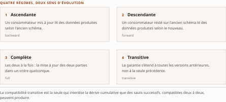
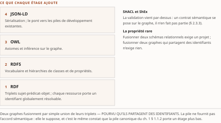

# Chapitre 2 — Données, sémantique et ontologies

*Livre I — Coopérer : fondements de l'interopérabilité et couche protocolaire agentique.
Premier mouvement — les fondements (ch. 1-6).*

| Champ | Valeur |
|---|---|
| **Statut** | **Brouillon de rédaction, non publiable** — rédigé sur instruction d'auteur du 27 juillet 2026, **avant** les portes G-1, G-2 et G-3 du [PRD](../PRD/PRD.md) §5. Même régime que le ch. 1 : l'écart est déclaré, non dissimulé ; ses conséquences sont énumérées en § 2.5. ⚠ **Mise à jour du 27 juillet 2026, postérieure à la rédaction** : **G-2 et le volet Livre I de G-1 ont été franchis depuis** (PRD v0.8), et les **remontées de cette pièce sont closes**. ⚠ **Mise à jour du 28 juillet 2026** : **G-3 est franchie** (PRD v0.14), **trois portes sur sept le sont désormais**, et le socle consolidé existe — *la phrase « socle consolidé à zéro entrée », que cette pièce portait, a cessé d'être vraie*. **La pièce reste néanmoins un brouillon non publiable**, pour deux motifs qui ne se recouvrent pas : elle a été **rédigée hors portes**, et *un franchissement postérieur solde une infraction sans la rattraper* ; et **CA-IV-11 et CA-IV-13 demeurent insatisfaisables** faute d'un relecteur distinct du rédacteur (D-6). **Aucun de ses énoncés n'est central au sens de CA-IV-01** — le motif est au champ *Socle mobilisé*, et il a changé sans que la conclusion bouge. |
| **Date de gel** | **27 juillet 2026** — gel unique du compendium, **décision d'auteur D-1 prise** ce jour (registre : [`gel-2026-07-27.md`](../PRD/gel-2026-07-27.md)). ⚠ **Ce gel n'efface pas ceux des sources**, qui restent portés ci-dessous : il date la reprise de chaque fait périssable à sa source primaire, non la matière elle-même. La matière condensée porte le gel de sa source — **juin 2026** (Vol. I) —, qui n'est pas celui de la somme et ne peut en tenir lieu. ⚠ Ce chapitre est particulièrement exposé à la péremption : **trois spécifications que son corps cite étaient en cours au gel de la source** (SPARQL 1.2, SHACL 1.2, RDF 1.2/RDF-star), et une promotion de projet y est datée de février 2026. ⚠ **Un quatrième objet périssable est porté ICI sans l'être au corps** — la refonte majeure d'OpenAPI —, et le décompte « quatre » que cette pièce annonçait depuis sa rédaction le tenait pour cité : le corps ne cite d'OpenAPI que l'**alignement acquis de la version 3.1.0** (§ 2.1.4), et la matière de la refonte est au **Vol. I *Monographie* §1.4.2.1**, **hors du périmètre de fusion §1.7-1.8** — elle est traitée au **ch. 1 § 1.4.2**. *Le registre du gel le localisait déjà « ch. 2, en-tête » (fait 5) ; c'est le cardinal de la pièce qui tenait une localisation pour une citation.* **Corrigé le 28 juillet 2026 ; la re-datation de G-1, elle, n'est pas touchée** — l'objet a bien été instruit, et la clôture qui l'enregistre est gelée |
| **Socle mobilisé** | ⚠ **Aucune entrée du socle consolidé — et depuis le 28 juillet 2026 ce constat a changé de motif sans changer de portée.** L'Annexe B **existe** ([`socle-consolide.md`](../PRD/socle-consolide.md) v1.2, **159 entrées `S-001`…`S-159`**, porte G-3 franchie) ; **aucune de ses entrées ne couvre le périmètre de ce chapitre**. Balayage du domaine entier le 28 juillet 2026 : les **dix-sept entrées héritées du Vol. I** (`S-143`…`S-159`) proviennent des §2.10, §3.10, §5.0-5.1, §7.x et de l'Annexe B de sa *Monographie*, ou des §10-§11 de sa *Synthèse* (quatre d'entre elles, dont le fichier a quitté le dépôt le 22 juillet 2026) ; **aucune** ne provient du **§1.7** ni du **§1.8**. *Ce n'est plus « le socle est vide », c'est « le socle ne couvre pas cette matière » — constat de balayage sur un domaine clos, non estimation.* Les énoncés résolvent donc contre le **Vol. I *Monographie* §1.7-1.8** directement, **hors socle**, en régime **[C]** (PRD §7.1). **Aucun énoncé n'est central au sens de CA-IV-01** avant élévation en [B] par lecture des sources primaires que le Vol. I cite |
| **Garde-fous balayés** | **Les deux séries, intégralement, y compris les zéros.** ⚠ **Règle de décompte, et les cardinaux ci-dessous ont été re-mesurés sous elle le 28 juillet 2026** : un décompte d'occurrences porte sur le **marqueur littéral de l'identifiant** dans le **corps** de la pièce — en-tête et note de statut exclus —, et il se re-mesure au commit ; un garde-fou appliqué **sans identifiant écrit** se déclare par son **domaine balayé, sans cardinal**. Vol. II — R-1 à R-8 : **zéro occurrence** (aucune matière réglementaire canadienne, aucun énoncé sur E-23, le RTR ou MCP). Vol. III — R-01, R-03 à R-13 : **zéro occurrence** ; **R-02 : le marqueur figure une fois, § 2.4.1, sans que le garde-fou soit déclenché** — ⚠ le § 2.4 approche R-02 (qualification par ce que la spécification démontre) sans le déclencher, l'objet n'étant pas cryptographique ; la règle y est néanmoins appliquée par analogie à la fiabilité des correspondances produites par modèle. **R-14 (trois degrés d'absence) : trois occurrences**, § 2.1.5, § 2.3.3 et § 2.4.1, marquées en toutes lettres |
| **Volumétrie cible** | ≈ 8 000 mots de corps (§ 2.1 à § 2.4). Enveloppe **dérivée, non prescrite** — le TOC n'en donne qu'au Livre (~65 000 mots pour onze chapitres). ☑ **Décompte publiable depuis le franchissement de G-2** (27 juillet 2026). **Réel : 5 557 mots — ⚠ *re-mesurés le **2 septembre 2026** ; l'en-tête portait **5 519**, soit **+38** : la mesure n'avait pas suivi les passes de relecture*** de corps, ⚠ **re-mesurés au commit du 30 juillet 2026** (décision 16b — *le chiffre antérieur datait de la contre-passe du 28 juillet, et la passe de révision l'a périmé*) par [`PRD/decompte.sh`](../PRD/decompte.sh), seule autorité de décompte du volume — **−31,0 %** de la cible. ⚠ **Ce réel est re-mesuré au commit du 30 juillet 2026** (décision 16b) : *toute date de mesure antérieure citée dans ce champ décrit une passe précédente, et la passe de révision D-11 l'a périmée.* Les deux passes du 28 juillet ont ajouté **256 mots** au corps rédigé le 27 (5 245) — **198** à la relecture, **58** à la contre-passe —, tous d'appareil de preuve, de bornage ou de renvoi, **aucun de contenu neuf**. ⚠ **L'écart individuel ne se lit pas seul** : la somme des onze cibles dérivées atteint **93 000 mots** pour une enveloppe de Livre de **65 000** — chaque pièce a dérivé sa cible de l'enveloppe sans que personne n'additionne les dérivations. Le **réel du Livre valait 64 750 mots, soit −0,4 % de l'enveloppe**, à la mesure antérieure à cette relecture : c'est la cible dérivée qui était fausse, non la pièce qui est courte. ⚠ **Ce total de Livre n'est PAS re-mesuré ici, et il ne doit pas l'être** — les onze pièces sont relues en parallèle, et *un cardinal mesuré pendant que ses termes changent est faux à la seconde où on le publie* ; il se re-mesure au terme de la passe. *Un écart se documente ; il ne se corrige ni par amputation ni par gonflement* |

> **Thèse** *(citée depuis le [`TOC.md`](../PRD/TOC.md) v0.23, entrée du chapitre 2 ; forme **inchangée en v0.30**, re-collationnée mot à mot **par copie** le 28 juillet 2026 — décisions 14 et 17)* — l'interopérabilité sémantique — accord sur le sens, pas seulement sur le format — est le niveau que les protocoles agentiques présupposent et que peu savent établir.

---

## § 2.1 — Formats d'échange, sérialisation, schémas et registres

Le chapitre précédent a établi que la pile d'interopérabilité est **cumulative** : le niveau
sémantique présuppose le syntaxique, qui présuppose le technique (ch. 1 § 1.1.2). Ce chapitre
descend aux deux paliers que cette cumulativité rend indissociables — la forme sous laquelle
l'information est sérialisée, validée et transformée, puis le sens qu'elle est censée porter. Il
faut les traiter ensemble parce que c'est leur **écart** qui constitue la thèse : deux systèmes
peuvent échanger des messages parfaitement bien formés, validés contre un schéma partagé, et se
méprendre entièrement sur ce qu'ils signifient.

À ce niveau, l'invariant du Livre prend sa forme la plus tangible. Le **format** est le support
physique du contrat ; le **schéma** en est la spécification machine-lisible ; les **règles de
compatibilité** déterminent si producteur et consommateur peuvent être déployés indépendamment. Rien
d'abstrait ici : ce sont ces règles, et elles seules, qui font la différence entre deux équipes qui
livrent quand elles veulent et deux équipes qui doivent se coordonner à chaque version.

### 2.1.1 Taxonomie des formats : texte ou binaire, document ou flux, schéma à l'écriture ou à la lecture

Tout choix de format engage un compromis multidimensionnel qu'il vaut mieux expliciter avant
d'arrêter une technologie, faute de quoi la décision se prend par habitude et se paie en dette.

Un premier axe oppose les formats **textuels**, lisibles et tolérants à l'inspection directe, aux
formats **binaires**, plus denses et plus rapides à sérialiser mais opaques sans outillage. Un
deuxième distingue le traitement **document** — l'unité d'échange est un message complet, autonome
et borné — du traitement **flux**, où les enregistrements s'écoulent en continu et où la densité et
le débit priment sur la lisibilité. Un troisième, le plus structurant, sépare le régime
*schema-on-write*, qui impose la conformité au moment de l'écriture et garantit une donnée propre en
aval, du régime *schema-on-read*, qui repousse l'interprétation à la lecture et privilégie la
souplesse d'ingestion au prix d'une validation différée.

Les critères de décision se déclinent alors concrètement : lisibilité et facilité de débogage,
densité d'encodage et coût réseau, caractère **auto-descriptif** — le message porte-t-il son propre
schéma ? —, latence de sérialisation, débit soutenu, et surtout **évolutivité**, la capacité du
format à absorber l'ajout ou le retrait de champs sans rupture.

Aucun format n'optimise simultanément tous ces axes, et c'est le point à retenir : l'architecte
arbitre en fonction du **couplage visé**, non de la performance brute. Un format auto-descriptif
réduit le couplage de format au prix de la densité ; un format binaire à schéma externe maximise la
densité mais **reporte le couplage sur la disponibilité du schéma** — d'où l'importance des registres
traités en § 2.1.6. Le couplage ne disparaît pas, il se déplace : c'est la leçon que le ch. 1 tirait
des architectures d'intégration, et elle vaut telle quelle un niveau plus bas.

### 2.1.2 Formats textuels et binaires

Côté textuel, **JSON** s'est imposé comme *lingua franca* des API web : auto-descriptif,
trivialement projeté sur les structures des langages courants, il privilégie la simplicité et
l'ubiquité plutôt que la richesse typologique. **XML** conserve sa pertinence dans les échanges B2B et le
monde SOAP, où les espaces de noms, la validation par grammaire et l'outillage normatif — signatures,
transformations — restent des atouts qu'aucun successeur n'a répliqués. **YAML**, surensemble
lisible de JSON, domine la configuration plus que l'échange inter-systèmes proprement dit. Ces trois
formats partagent une faiblesse de densité et de débit qui devient prohibitive aux volumes élevés.

Côté binaire, deux familles structurent la pratique, et leur différence n'est pas de performance mais
de **doctrine d'évolution**.

**Protocol Buffers** repose sur un langage de description d'interface compilé, un encodage compact à
étiquettes numériques, et une compatibilité d'évolution fondée sur la **stabilité des numéros de
champ**. Il sert de format de charge utile à gRPC et convient au trafic interservices à faible
latence.

**Apache Avro** adopte une philosophie distincte : le schéma, exprimé en JSON, accompagne ou
référence chaque jeu de données, et la **résolution de schéma à la lecture** confronte explicitement
schéma d'écriture et schéma de lecture. Cette confrontation explicite en fait le format de
prédilection de la sérialisation dense dans les flux.

Le choix entre les deux illustre l'invariant : tous deux externalisent le schéma pour gagner en
densité, mais gèrent l'évolution par des mécanismes différents — numéros figés contre résolution à la
lecture —, ce qui conditionne les règles de compatibilité applicables (§ 2.1.5). Choisir un format
binaire, c'est donc choisir un régime d'évolution avant de choisir un encodage.

> **Mise en œuvre.** Une règle pragmatique répandue : JSON sur HTTP pour les API externes et
> l'interopérabilité maximale ; Protobuf et gRPC pour le trafic interne dense entre microservices ;
> Avro pour les sujets de flux adossés à un registre de schémas (§ 2.1.6). XML demeure imposé dès
> qu'un partenaire B2B ou une norme sectorielle — facturation électronique, échanges réglementés —
> l'exige, et cette contrainte ne se négocie pas au niveau de l'architecture.

### 2.1.3 Formats analytiques et protocoles de connexion

Le plan analytique impose des formats orientés **colonne** plutôt que ligne, optimisés pour la
compression et la lecture sélective de grands volumes. **Parquet** et **ORC** sont des formats de
fichier sur disque qui stockent les données par colonne, exploitent l'encodage et la compression par
bloc, et embarquent des statistiques de prédicat permettant d'élaguer la lecture.

**Arrow** joue un rôle complémentaire et qu'il importe de ne pas confondre avec le précédent : il
définit un format colonnaire **en mémoire**, conçu pour le partage *zéro-copie* entre processus et
moteurs, supprimant les coûts répétés de sérialisation aux frontières entre composants analytiques.
Arrow se positionne comme couche d'interopérabilité du **traitement**, là où Parquet et ORC servent
la **persistance**.

Au-delà des fichiers, l'enjeu est le protocole *filaire* d'accès. Les interfaces historiques
JDBC/ODBC, orientées ligne et coûteuses en conversion, sont concurrencées par la pile Arrow :
**Arrow Flight SQL** définit un protocole bâti sur gRPC qui transporte des résultats directement au
format colonnaire, éliminant la transposition ligne-vers-colonne et exploitant le parallélisme du
transport ; **ADBC** offre par-dessus une interface client uniforme, indépendante du pilote, qui
restitue nativement des lots Arrow.

Du point de vue de l'invariant, ces standards **découplent le client analytique du système de
stockage** par un contrat de transport stable. C'est la même opération que celle du contrat d'API au
ch. 1 § 1.4.2, transposée à un plan où elle était historiquement absente.

> **Perspective recherche.** La proposition du *lakehouse* (Zaharia et coll., 2021) consiste
> précisément à unifier l'entreposage et l'analytique avancée sur un substrat de formats
> ouverts. Arrow comme format
> mémoire et Flight SQL comme protocole filaire en sont les pièces d'interopérabilité : ils
> dissocient le moteur d'exécution de la couche de stockage, autorisant la coexistence de moteurs
> hétérogènes sur un même corpus. La question ouverte n'est plus la faisabilité mais la
> **gouvernance** de cette coexistence, traitée en § 2.2.3.

### 2.1.4 Schémas et validation

Le schéma est la spécification machine-lisible du **contrat syntaxique** : il définit la structure
attendue, les types, les contraintes et les champs obligatoires, et permet de rejeter **aux
frontières** du système les messages non conformes plutôt que de propager des données malformées en
profondeur. Cette localisation du rejet n'est pas un détail d'implémentation : une donnée malformée
détectée à la frontière coûte un message ; détectée trois systèmes plus loin, elle coûte une enquête.

Dans le monde XML, **XSD** remplit ce rôle avec une grammaire expressive et un outillage de
validation mature. Les langages de description des formats binaires — fichiers `.proto`, schémas
Avro — jouent une fonction analogue côté sérialisation dense : ils servent à la fois de contrat et de
source de génération de code.

Pour JSON, **JSON Schema** s'est établi comme standard de fait. Son alignement avec **OpenAPI 3.1.0**
est le fait le plus important de cette sous-section : à partir de cette version, l'objet Schema
d'OpenAPI est un surensemble strict du vocabulaire JSON Schema, ce qui réconcilie la description
d'API et la validation de charge utile sous un même formalisme et **supprime une divergence
historiquement coûteuse**. Deux dialectes qui décrivaient la même chose de deux manières
incompatibles obligeaient chaque organisation à maintenir deux vérités ; **à partir de cette
version**, il n'en reste qu'une.

La validation aux frontières concrétise le principe de moindre confiance : un consommateur valide ce
qu'il reçoit, un producteur valide ce qu'il émet, et le schéma partagé fait foi. La **conception** du
schéma — champs optionnels par défaut, refus de l'interdiction implicite de champs additionnels —
prépare directement l'évolution traitée ci-après. Un schéma trop strict est un schéma qu'on ne pourra
pas faire évoluer.

### 2.1.5 Évolution et compatibilité

L'interopérabilité dans le temps repose sur des règles formelles qui déterminent quelles
modifications de schéma sont sûres. Elles sont peu nombreuses et se retiennent.

| Régime | Garantie | Ce qu'il autorise et interdit |
| --- | --- | --- |
| **Ascendante** (*backward*) | un consommateur mis à jour lit des données produites selon l'ancien schéma | ajout de champs porteurs d'une valeur par défaut ; suppression de champs optionnels |
| **Descendante** (*forward*) | un consommateur resté sur l'ancien schéma lit des données produites selon le nouveau | **interdit** l'ajout de champs obligatoires sans défaut |
| **Complète** (*full*) | les deux à la fois | autorise la mise à jour des deux parties **dans un ordre quelconque** |
| **Transitive** | la garantie s'étend à **toutes** les versions antérieures, non à la seule précédente | interdit la dérive cumulative que des sauts successifs compatibles deux à deux peuvent produire |

: Tableau 2.1 — Les quatre régimes de compatibilité de schéma et ce que chacun rend possible.

Ces règles ne sont pas académiques : elles sont la **condition même du déploiement découplé**. Tant
qu'une évolution respecte la compatibilité requise, producteur et consommateur peuvent être livrés
indépendamment, sans coordination de version ni fenêtre de rupture — l'invariant du Livre, décliné au
niveau du schéma.

Le pendant pratique côté lecture est le *tolerant reader* (ch. 1 § 1.1.4) : un consommateur qui
ignore les champs qu'il ne connaît pas et ne suppose pas l'absence de champs futurs absorbe une part
de l'évolution sans modification. La résolution de schéma d'Avro institutionnalise ce raisonnement en
confrontant explicitement les deux schémas plutôt qu'en espérant leur coïncidence.

⚠ **Une garantie de compatibilité n'est pas une garantie de sens.** Un champ peut rester structurellement
compatible tout en changeant de signification — une même colonne « montant » qui passe des dollars
aux cents satisfait toutes les règles ci-dessus et casse ses consommateurs. Le fait que les
registres n'attrapent pas cette classe de rupture relève d'une **absence de documentation** au sens
de R-14 du Vol. III : le socle hérité ne documente aucun mécanisme de contrôle sémantique
automatique à ce niveau, ce qui ne dit rien de l'existence d'approches non recensées. C'est
précisément l'écart que les § 2.3 et § 2.4 prennent pour objet.

### 2.1.6 Registres de schémas dans l'architecture événementielle

Dans une architecture événementielle, les schémas ne peuvent rester implicites : producteurs et
consommateurs sont découplés dans le temps **et** dans l'espace, et rien ne garantit qu'ils partagent
une vue à jour du contrat. Le **registre de schémas** résout ce problème en agissant comme autorité
du contrat : chaque schéma y est enregistré, versionné et identifié par un identifiant compact que le
producteur encode dans l'enregistrement plutôt que d'y embarquer le schéma complet. Le consommateur
résout cet identifiant auprès du registre, ce qui réduit la taille des messages tout en garantissant
l'accès au schéma **exact** ayant servi à l'écriture.

La fonction décisive du registre n'est pourtant pas le stockage : c'est l'**application automatique
des règles de compatibilité**. À l'enregistrement d'une nouvelle version, le registre rejette toute
évolution qui violerait le mode configuré sur le sujet. Une règle de gouvernance devient ainsi un
**garde-fou exécutable au moment de l'évolution**, et non une recommandation qu'une relecture
pourrait laisser passer.

C'est le principe que le ch. 1 § 1.2.2 tire de la lignée LISI — *l'évaluation par preuves plutôt que
par déclaration d'intention*, la maturité liée à des artefacts concrets et vérifiables. Un registre de
schémas est l'instrument par lequel une organisation rend non négociable, à l'échelle de centaines de
sujets, le contrat d'évolution qui autorise le déploiement indépendant.

> **Mise en œuvre.** Plusieurs implémentations coexistent — registres adossés aux courtiers,
> catalogues gérés des fournisseurs infonuagiques —, prenant typiquement en charge Avro, Protobuf et
> JSON Schema. Le critère de choix n'est pas la couverture de formats, largement banalisée, mais la
> **granularité du mode de compatibilité** : pouvoir le fixer par sujet plutôt que globalement est ce
> qui permet à un domaine critique d'exiger la compatibilité complète pendant qu'un domaine
> exploratoire se contente de l'ascendante.

---

## § 2.2 — Transformation, modèle canonique, contrats de données et formats de table

### 2.2.1 Transformation et ponts inter-formats

L'hétérogénéité des formats étant irréductible (ch. 1 § 1.1.3), l'intégration suppose presque
toujours une médiation entre représentations. Le patron du **traducteur de message** (*Message Translator* ; Hohpe et Woolf, 2003)
en est la formalisation : un composant transforme la structure et la sémantique d'un message d'un format source
vers un format cible **sans coupler producteur et consommateur à la connaissance l'un de l'autre**.
Les outils varient selon le monde — XSLT pour les transformations XML, langages de projection pour
JSON — et les ponts les plus courants concernent les conversions REST/SOAP et JSON/Avro, où une
passerelle traduit entre les conventions des deux univers.

Ces transformations ne sont **pas neutres**, et c'est le point qu'on oublie le plus aisément. La
conversion entre modèles de richesse inégale entraîne des pertes : un type absent dans le format
cible, une contrainte non exprimable, une structure imbriquée aplatie. Ces pertes doivent être
**identifiées et réconciliées explicitement au point de médiation**, plutôt que subies
silencieusement en aval.

Le traducteur préserve donc le découplage en localisant la connaissance des deux formats en un seul
endroit, mais il introduit **un point où le contrat peut se dégrader**. Sa conception relève de la
même rigueur contractuelle que les interfaces qu'il relie ; le traiter comme un détail
d'implémentation est l'erreur.

### 2.2.2 Contrats de données et produits de données

Le mouvement du **maillage de données** (*data mesh* ; Dehghani, 2022) transpose au domaine des données les principes
de découplage et de propriété décentralisée déjà appliqués aux services. Sa pièce maîtresse est le
**contrat de données** : une spécification exécutable, machine-lisible, qui fixe le schéma, les
garanties de qualité, les attentes sémantiques et les engagements de service entre un fournisseur et
ses consommateurs. Une formalisation ouverte en est portée par l'*Open Data Contract Standard*,
maintenu sous fondation, qui succède à une spécification antérieure désormais dépréciée à son profit.
Le complément structurel est le **produit de données** doté de ports de sortie explicites.

Le contrat joue ici exactement le rôle que le Livre attribue au contrat d'interface : il rend
l'évolution gouvernable et le couplage explicite. Sa nouveauté tient à ce qu'il porte des **garanties
de qualité** — fraîcheur, complétude, distribution attendue — que le contrat d'API ne porte pas, et
qui sont vérifiables en continu.

L'échange **inter-organisationnel** de données souveraines ajoute une couche de protocole. Le
*Dataspace Protocol* normalise la négociation de contrat, le catalogage et le transfert entre espaces
de données autonomes, en s'appuyant sur un modèle de référence et des implémentations de référence.
L'objectif est le partage contrôlé entre organisations **qui ne se font pas mutuellement confiance**,
en encodant l'usage autorisé dans le contrat lui-même.

Lecture de l'auteur — c'est la première fois, dans la progression du Livre, qu'un contrat prétend
porter non seulement la **forme** et le **sens** de ce qui est échangé, mais l'**usage autorisé** de
ce qui a été transféré. Cette prétention est exactement celle que le Livre II retrouvera sous le nom
de délégation, et le Livre IV sous celui de politique appliquée à l'exécution. Ce que le socle
établit s'arrête à l'énoncé du paragraphe précédent — le protocole d'espaces de données encode
l'usage autorisé dans le contrat lui-même ; **il n'établit pas la filiation** vers la délégation ni
vers la politique d'exécution, proposée ici comme lecture, et dont l'instruction relève des ch. 17
et 37.

> **Perspective recherche.** Le contrat de données exécutable déplace la question de
> l'interopérabilité sémantique du plan documentaire vers le plan opérationnel : les attentes de
> schéma et de qualité deviennent vérifiables en continu, et leur violation détectable
> automatiquement. La gouvernance souveraine pose en outre une question **encore ouverte** :
> l'application machinale des politiques d'usage **au-delà du point de transfert**. Rien, dans le
> socle hérité, n'établit qu'un tel mécanisme existe et fonctionne à l'échelle.

### 2.2.3 Formats de table et catalogues interopérables

Les formats de fichier colonnaires (§ 2.1.3) ne suffisent pas à rendre un lac de données
interopérable : sans couche de cohérence, une collection de fichiers n'offre ni transaction, ni
évolution de schéma, ni isolation des lectures. Les **formats de table** comblent ce manque. Ils
ajoutent au-dessus des fichiers une couche de métadonnées qui apporte les garanties transactionnelles,
le voyage dans le temps, l'évolution de schéma et de partitionnement, et l'isolation par instantané.

C'est cette couche qui rend un *lakehouse* réellement interopérable : un même corpus tabulaire
devient lisible et modifiable par des moteurs hétérogènes **sans recopie ni format propriétaire**.

Le contrat se déplace alors vers le **catalogue**, qui suit les tables, leurs versions et leurs
métadonnées — et c'est là que se joue désormais le verrouillage. L'**Iceberg REST Catalog**,
spécification OpenAPI de la fondation Apache, standardise l'interface entre moteurs et catalogue,
transformant celui-ci d'un couplage propriétaire en un contrat ouvert et interchangeable. Plusieurs
implémentations se disputent ce rôle : **Apache Polaris**, **promu projet de premier niveau de
l'ASF le 19 février 2026**, **Unity Catalog OSS** (LF AI & Data) et **Apache Gravitino**, ce dernier
visant un métastore unifié au-delà du seul Iceberg.

⚠ **Cette date est le seul fait daté du chapitre qui appelle une re-vérification au gel — la
normalisation d'avril 2024 du § 2.3.5 étant acquise —, et elle a été reprise à sa source primaire** :
une promotion de projet est un événement de gouvernance, non une propriété technique, et la carte
des implémentations en concurrence bouge par trimestres. Le volet Livre I de la porte G-1 l'a
**confirmée au 19 février 2026** le 27 juillet 2026 (registre du gel, fait 1) ; la réserve porte
désormais sur la carte, non sur la date.

Cette convergence vers un protocole de catalogue commun est l'extension la plus récente de
l'invariant au plan analytique : en découplant le moteur du catalogue par un contrat stable, elle
préserve la liberté de substitution des moteurs et la portabilité du patrimoine de données. Le ch. 43
en reprend le principe pour l'architecture de référence.

---

## § 2.3 — Pile du Web sémantique, médiation ontologique et graphe de connaissances d'entreprise

La couche du sens se superpose à la couche syntaxique traitée jusqu'ici. Deux systèmes peuvent
échanger des messages bien formés, validés contre un schéma (§ 2.1.4), et néanmoins se méprendre sur
ce que ces messages signifient. L'interopérabilité sémantique vise précisément ce hiatus — le
troisième palier de la pile canonique (ch. 1 § 1.1.2) : faire en sorte que l'information reçue soit
interprétée par le destinataire **avec le sens que l'émetteur lui prêtait**.

⚠ **Le verrou que ce hiatus nomme n'est pas reconstruit ici.** Le constat d'ensemble — la
normalisation est abondante dans le bas de la pile et s'amenuise vers le haut, là où le sens se
joue — et le programme de recherche qui en découle ont leur **siège au ch. 49 § 49.6**, lieu unique
pour toute la somme. Le présent chapitre en instrumente le versant outillé : ce que la pile du Web
sémantique sait établir, et à quel prix.

L'invariant reste identique, et c'est ce qui rend cette section lisible : un vocabulaire partagé est
un **contrat** ; une ontologie — spécification explicite d'une conceptualisation (Gruber, 1993) — est une
**interface** qui découple les producteurs de sens des consommateurs ; et ces deux artefacts doivent
**évoluer** sans rompre les correspondances établies.

### 2.3.1 RDF, RDFS, OWL et JSON-LD

Le socle du Web sémantique est un modèle de données en **graphe** : RDF représente toute connaissance
comme un ensemble de triplets sujet-prédicat-objet, où chaque ressource est identifiée par un
identifiant globalement résolvable. Cette granularité atomique confère au modèle une propriété rare
pour l'intégration : **deux graphes provenant de sources hétérogènes fusionnent par simple union de
leurs triplets**, sans réconciliation préalable de schémas, pourvu qu'ils partagent des
identifiants.

C'est une propriété que la fusion de deux schémas relationnels n'offre pas, et elle explique la
persistance de RDF : là où fusionner deux schémas relationnels exige un projet, fusionner deux
graphes RDF exige un accord sur des identifiants.

Au-dessus de RDF s'échelonne une gradation de pouvoir expressif. **RDFS** introduit un vocabulaire
léger — classes, propriétés, hiérarchies, domaines et co-domaines —, auquel **SKOS** adjoint
l'outillage des systèmes de concepts. À l'autre extrémité, **OWL 2** offre une ontologie formelle
adossée à la logique de description, avec restrictions de cardinalité, propriétés transitives ou
inverses et axiomes de disjonction permettant l'**inférence automatique**.

L'adoption de cet appareil a longtemps buté sur la lourdeur perçue de la sérialisation RDF/XML.
**JSON-LD** lève cet obstacle : il habille des documents JSON ordinaires d'un contexte qui projette
leurs clés sur des identifiants, faisant d'une charge utile REST un graphe RDF **sans rupture de
l'outillage existant**. JSON-LD constitue ainsi le pont par lequel la sémantique pénètre les API
synchrones décrites par OpenAPI (ch. 1 § 1.4.2), réalisant le découplage entre le format de transport
et l'engagement de sens.

> **Mise en œuvre.** Un point d'API qui sert déjà du JSON peut devenir sémantiquement interopérable
> par l'ajout d'un seul contexte pointant un vocabulaire partagé, **sans modifier ni les
> consommateurs existants ni le schéma JSON validant la syntaxe**. Le contrat syntaxique et le
> contrat de sens coexistent alors sur la même charge utile — c'est le chemin d'adoption le moins
> coûteux que ce chapitre puisse recommander, et il reste peu emprunté.

### 2.3.2 SPARQL et la fédération de sources

Là où REST expose des ressources et GraphQL un graphe typé propriétaire (ch. 1 § 1.4.1), **SPARQL**
interroge directement le graphe RDF par appariement de motifs de triplets. Le langage dépasse la
simple lecture : il couvre la mise à jour des graphes, l'agrégation, les sous-requêtes et les chemins
de propriété, ce qui en fait une **API sémantique standardisée** plutôt qu'un langage de consultation
cantonné.

Pour l'intégration, sa contribution décisive est la **fédération** : une clause dédiée délègue une
portion de requête à un service distant et recompose les résultats localement, autorisant une
interrogation transversale de sources autonomes **sans entreposage préalable ni copie des données**.
Cette capacité instancie au niveau sémantique le découplage de localisation : le consommateur
raisonne sur un graphe logique unifié tandis que les données demeurent réparties et sous le contrôle
de leurs propriétaires.

⚠ **La fédération présuppose toutefois que les sources aient aligné leurs vocabulaires**, faute de
quoi la jointure échoue **silencieusement** sur des identifiants divergents. Ce mode d'échec est le
plus pernicieux de la section : une requête fédérée mal alignée ne lève pas d'erreur, elle retourne
un résultat vide ou partiel qui a toutes les apparences d'un résultat. Le préalable renvoie aux
mécanismes d'alignement du § 2.3.4.

⚠ **Une révision du langage était en cours au gel de la source** (juin 2026), alignée sur une
révision du modèle RDF et sur son extension permettant d'interroger les assertions portant sur des
assertions. Ces travaux **ne sont pas cités comme acquis** : leur ancre de version se fixe au moment
de citer, et cette réserve est reconduite ici sans être levée.

### 2.3.3 Validation et contrats sémantiques : SHACL et ShEx

Un graphe RDF est, par construction, **ouvert et sans schéma** : tout triplet est licite, l'absence
d'information n'est pas une faute, et rien n'interdit a priori d'attribuer une date de naissance à
une facture. Pour l'intégration, cette permissivité est intenable ; il faut un pendant sémantique aux
schémas qui gardent les frontières des API.

**SHACL** remplit ce rôle : il décrit des *formes* contraignant la structure attendue d'un nœud —
propriétés obligatoires, cardinalités, types de valeurs, motifs — et produit un rapport de validation
circonstancié lorsqu'un graphe les viole. SHACL devient ainsi le **contrat sémantique vérifiable aux
points d'échange**, transposant au graphe la discipline du contrat-d'abord. **ShEx** poursuit le même
objectif avec une grammaire de patrons inspirée des expressions régulières, souvent jugée plus concise.

⚠ **La distinction conceptuelle qui suit est celle dont la confusion se paie le plus cher.**
OWL sert l'**inférence** sous hypothèse de **monde ouvert** — déduire des faits
implicites ; SHACL sert la **validation** sous hypothèse de **monde clos** — constater qu'un fait
requis manque. Confondre les deux produit des contrôles qui **ne se déclenchent jamais** : une
contrainte exprimée en OWL sur un graphe incomplet n'est pas violée, elle est simplement non
satisfaite, et le raisonneur conclut que le fait manquant est peut-être vrai ailleurs. Une
organisation qui croit valider alors qu'elle infère risque de ne s'en apercevoir qu'à l'incident.

L'alignement de SHACL sur la révision du modèle RDF — **lui aussi en cours au gel de la source** —
vise à contraindre aussi les assertions qualifiées, étendant la portée du contrat à la **provenance**
des données échangées, exigence récurrente de l'auditabilité (ch. 3 § 3.4).

> **Perspective recherche.** SHACL et OWL relèvent de logiques distinctes dont la cohabitation sur un
> même graphe demeure un sujet ouvert : un axiome OWL peut rendre satisfiable un graphe qu'une forme
> SHACL rejette, et inversement. La spécification d'une sémantique unifiée du raisonnement et de la
> validation, et la décidabilité des fragments combinés, restent des questions vives. ⚠ Que ces
> questions soient « ouvertes » relève ici d'une **absence de documentation** au sens de R-14 du
> Vol. III : le socle hérité ne recense aucune solution, ce qui n'établit pas qu'aucune n'existe.

### 2.3.4 Alignement ontologique et architectures de médiation

L'hétérogénéité sémantique — désigner la même entité par des termes différents, ou des entités
différentes par le même terme — est l'obstacle irréductible que ni la syntaxe ni la validation ne
résolvent. Lorsque deux ontologies autonomes décrivent un domaine recouvrant, l'interopérabilité
exige de **découvrir les correspondances** entre leurs concepts : c'est l'appariement d'ontologies
(Euzenat et Shvaiko, 2013), dont la production est un ensemble de relations d'équivalence, de
subsomption ou de chevauchement.
Une campagne d'évaluation comparative fournit à ce champ sa référence empirique, en évaluant les
systèmes d'appariement sur des paires d'ontologies de référence — jalon stable pour mesurer tout
progrès, y compris celui des approches récentes (§ 2.4.1).

Une fois les correspondances établies, deux architectures de médiation s'opposent classiquement. Dans
l'approche **entrepôt**, les sources sont matérialisées et transformées vers un schéma global unique.
Dans l'approche **médiateur**, un schéma virtuel réécrit à la volée les requêtes vers les sources,
qui restent en place.

Le formalisme distingue ici deux régimes de correspondance, et le choix entre eux est structurant :

- **GAV** (*Global-As-View*) — chaque concept global est défini comme une vue sur les sources.
  Réécriture de requête simple ; **ajout de source coûteux**, puisqu'il faut revoir les définitions
  globales.
- **LAV** (*Local-As-View*) — chaque source est décrite comme une vue sur le schéma global.
  Extensibilité supérieure — ajouter une source n'affecte pas les autres — au prix d'une **réécriture
  de requête plus complexe**.

Ce choix rejoue, au niveau du sens, l'arbitrage entre couplage et évolutivité qui structure tout le
Livre : GAV optimise le présent, LAV optimise l'arrivée du prochain participant.

### 2.3.5 Graphe de connaissances, OBDA et gestion des données de référence

Le **graphe de connaissances d'entreprise** concrétise la médiation à grande échelle, et deux régimes
y coexistent. Le graphe **matérialisé** importe et fusionne effectivement les données dans un magasin
de graphe ; le graphe **virtuel** les laisse dans leurs bases d'origine et expose une couche
sémantique par-dessus. Une spécification dédiée standardise cette projection, en décrivant comment
lignes et colonnes d'un schéma relationnel se traduisent en triplets. Cette projection est le cœur de
l'**accès aux données fondé sur les ontologies** (OBDA ; Poggi et coll., 2008), où l'ontologie sert d'interface de requête
de haut niveau au-dessus de sources dont la complexité reste masquée — application directe du
masquage d'information au plan sémantique.

Un débat structurant oppose les modèles de graphe, et il s'est déplacé récemment. RDF, normalisé et
conçu pour la fédération sur le Web, côtoie le modèle des **graphes de propriétés** (LPG), longtemps
propriétaire mais désormais doté d'un langage de requête **normalisé internationalement en avril
2024**. RDF privilégie l'interopérabilité inter-organisationnelle et le raisonnement ; LPG privilégie
la performance d'attribution sur les arêtes et l'ergonomie applicative.

Parallèlement, la convergence entre **gestion des données de référence** et graphe s'affirme : le
graphe offre un substrat naturel pour réconcilier identités et hiérarchies dispersées, faisant du
référentiel partagé non plus une table maîtresse figée, mais **un graphe vivant gouverné dans le
temps**.

> **Mise en œuvre.** Le choix entre les deux modèles ne se tranche pas dans l'abstrait. Un cas
> d'usage d'intégration ouverte et de fédération inter-domaines penche vers RDF et SPARQL
> (§ 2.3.2) ; un cas d'usage interne à forte densité de relations attribuées et à requêtes de
> parcours penche vers un graphe de propriétés. La normalisation du langage de requête a réduit le
> verrouillage fournisseur qui pesait historiquement sur le second, ce qui rend au critère technique
> le poids que la contrainte commerciale lui disputait.

---

## § 2.4 — LLM et automatisation de l'interopérabilité sémantique

### 2.4.1 Modèles de langage pour la construction d'ontologies et l'appariement de schémas

Le goulet d'étranglement historique de l'interopérabilité sémantique est le **coût humain** :
construire une ontologie et établir les correspondances entre schémas relève d'un travail expert,
lent et difficilement automatisable.

Lecture de l'auteur — c'est ce coût, plus qu'un défaut technique, qui explique la diffusion limitée
de la pile du § 2.3. Le socle établit le goulet d'étranglement humain ; il n'établit ni cette
causalité, ni aucune mesure de diffusion.

Les grands modèles de langage ouvrent ici une piste **exploratoire**. Des travaux évaluent la
capacité d'un modèle à induire des éléments d'ontologie — termes, hiérarchies, relations — à partir
de corpus, en mesurant les résultats contre des bancs d'essai établis (Babaei Giglou et coll.,
2023). D'autres approches ciblent
l'appariement de schémas et d'ontologies proprement dit, confrontées à la référence exigeante de la
campagne d'évaluation citée en § 2.3.4.

Ces résultats appellent une lecture prudente, et la prudence porte ici sur un point précis. La
promesse est réelle : les modèles capturent une connaissance lexicale et contextuelle qui leur permet
de proposer des correspondances qu'un appariement purement structurel manquerait. Mais la limite est
**structurelle et non conjoncturelle** : *une correspondance générée n'est pas vérifiée*. Elle peut
être plausible et fausse, et rien dans le procédé qui l'a produite ne distingue les deux cas.

La gouvernance du sens en environnement distribué impose donc de traiter la sortie du modèle comme
une **proposition soumise à validation** — par SHACL (§ 2.3.3), par revue experte, par confrontation
aux axiomes ontologiques — et non comme un contrat établi. Le découplage producteur-consommateur de
sens ne tolère pas qu'une correspondance erronée s'installe silencieusement dans la chaîne
d'intégration : elle n'y produira pas une panne, mais une divergence lente.

⚠ **La fiabilité des correspondances produites par modèle est un front de recherche explicitement
ouvert.** Que le socle hérité n'en recense pas de solution éprouvée est une **absence de
documentation** au sens de R-14 du Vol. III, non un fait négatif vérifié.

Lecture de l'auteur — le régime à appliquer ici est celui que le Vol. III impose aux mécanismes
cryptographiques (R-02) : qualifier un dispositif par ce que sa spécification **démontre**, jamais
par ce qu'elle **promet**. Un appariement produit par modèle démontre une plausibilité lexicale ; il
ne démontre pas une équivalence sémantique. Ce que le socle établit est la règle elle-même, et son
domaine — les mécanismes cryptographiques ; **il n'établit pas son extension** aux correspondances
produites par modèle, proposée ici comme lecture. Elle vaut avertissement pour toute la suite du
Livre, où la tentation d'attribuer à un agent la compétence qu'on souhaiterait qu'il ait sera
constante.

### 2.4.2 GraphRAG : les graphes au service de l'IA générative d'entreprise

La relation entre graphes et modèles se renverse aussi : le graphe de connaissances n'est plus
seulement une cible que le modèle aide à construire, il devient une **ressource qui discipline le
modèle**. C'est l'objet de GraphRAG (Edge et coll., 2024), qui adosse la génération augmentée par récupération non à un
index vectoriel plat mais à un **graphe structuré** extrait des sources, permettant un raisonnement
multi-sauts et une synthèse à l'échelle d'un corpus que la récupération par fragments isolés ne sait
pas produire. Des approches apparentées cherchent à rendre cette construction plus économique pour un
déploiement d'entreprise.

L'apport pour l'interopérabilité opérationnelle est **triple**, et les trois volets intéressent
directement la suite du Livre.

**La réduction des hallucinations.** Ancrer les réponses sur des entités et relations attestées du
graphe contraint le modèle à puiser dans un référentiel vérifié plutôt que dans sa mémoire
paramétrique.

**La traçabilité.** Chaque assertion générée peut être rattachée aux nœuds et arêtes qui la fondent —
exigence d'auditabilité impérative en contexte réglementé, et que le Livre III retrouvera comme
condition, non comme confort.

**L'ontologie comme garde-fou.** En imposant que le graphe respecte un schéma de classes et de
relations défini, l'organisation **circonscrit l'espace des inférences admissibles** et fait du
contrat sémantique une frontière de sûreté pour le système génératif.

Lecture de l'auteur — ce troisième volet est le plus important pour la thèse du chapitre, et il opère
un renversement qu'il faut nommer. Jusqu'ici, la sémantique servait à ce que deux systèmes se
comprennent ; ici, elle sert à **borner ce qu'un système a le droit de conclure**. Le contrat de sens
cesse d'être un instrument de coopération pour devenir un instrument de contrainte — et c'est sous
cette seconde forme que les Livres II et IV le réemploieront. Ce que le socle établit s'arrête à
l'ontologie comme garde-fou circonscrivant l'espace des inférences admissibles ; **il n'établit ni la
hiérarchie des trois volets, ni le réemploi** par les Livres II et IV, proposés ici comme lecture.

⚠ **Ce que ce chapitre ne traite pas, et où cela se trouve.** Le versant proprement **agentique** de
la sémantique — l'écart entre accord de protocole et compréhension, la sémantique lue-par-le-modèle,
les ontologies de capacités, les modes d'échec sémantiques propres aux échanges entre agents — n'est
pas repris ici. Cette matière est celle du **Vol. I *Monographie* §3.5** ; elle est **consolidée au
ch. 9 § 9.4**, où la découverte et la pile protocolaire la prennent pour objet. La thèse du présent
chapitre en est la prémisse : les protocoles agentiques **présupposent** l'accord sémantique et ne le
fournissent pas. C'est au ch. 9 qu'on mesure le prix de cette présupposition, non ici.

---

## § 2.5 — Note de statut *(hors plan — à retirer à la publication)*

⚠ **Cette section n'est pas au TOC et n'a pas vocation à survivre.** Elle consigne l'écart de
gouvernance sous lequel ce chapitre a été rédigé, conformément à la règle d'escalade du
[PRD](../PRD/PRD.md) Annexe A : *un rédacteur ne corrige jamais le TOC, ce PRD ni le Conspectus — il
remonte.*

**Ce qui est enfreint** — identique au ch. 1 : les portes **G-1**, **G-2** et **G-3** sont ouvertes,
et le PRD §5 pose qu'aucun chapitre ne se rédige avant leur franchissement. Rédaction sur instruction
d'auteur du 27 juillet 2026. Quatre conséquences :

1. **Aucun énoncé n'est central au sens de CA-IV-01.** Les faits résolvent contre le Vol. I
   *Monographie* §1.7-1.8, en régime **[C]** ; l'élévation en [B] passe par la lecture des sources
   primaires que le Vol. I cite.
2. **Les décomptes sont publiables depuis le 27 juillet 2026** — G-2 franchie, `PRD/decompte.sh`
   versionnée et éprouvée sur les trois corpus entiers.
3. **Les renvois « ch. N » étaient, à la rédaction, des renvois de plan et non de texte** : les
   ch. 3, 9, 17, 37 et 43 n'existaient pas, et chacun résolvait contre l'entrée du TOC v0.23.
   ⚠ **Mise à jour du 28 juillet 2026** : **les cinquante chapitres de la somme existent en
   brouillon**, et les renvois sortants de cette pièce ont été **re-vérifiés contre leur texte** —
   ch. 1 § 1.1.2, § 1.1.3, § 1.1.4, § 1.2.2, § 1.4.1 et § 1.4.2 ; ch. 3 § 3.4 ; ch. 9 § 9.4 ;
   ch. 43 ; ch. 49 § 49.6 ; ch. 17 et ch. 37, cités au chapitre et non à la section. *Un renvoi de
   plan qui survit à la rédaction de sa cible sans revérification est le défaut que la décision 8 du
   TOC proscrit ; il ne survit plus ici.*
4. **Une remontée est ouverte par ce chapitre**, à l'instance d'arbitrage (D-6, non désignée) :
   **R-IV-03 — non bloquante, mais à échéance G-1.** Ce chapitre est le plus exposé du Livre I à la
   péremption : **quatre spécifications en cours au gel de la source** (juin 2026) lui étaient
   rattachées — la révision du langage de requête sémantique, celle du langage de validation, celle du
   modèle de graphe **avec** son extension d'assertions qualifiées, et la refonte majeure du langage de
   description d'API —, et il porte **un fait daté de février 2026** (promotion d'un projet de
   catalogue). ⚠ *Cette énumération divergeait de celle de l'en-tête, qui est la bonne : les deux
   annonçaient « quatre » et n'en nommaient pas les mêmes, le modèle de graphe et son extension
   comptant ici pour deux et la refonte du langage de description d'API étant omise. Aligné le
   27 juillet 2026 — un cardinal juste sur une liste fausse reste une liste fausse.*
   ⚠ **Précision de la contre-passe du 28 juillet 2026, qui borne le rattachement sans toucher au
   périmètre instruit** : **trois** de ces quatre spécifications sont citées **au corps** ; la
   quatrième — la refonte du langage de description d'API — n'est portée qu'à l'**en-tête**, sa
   matière étant au **ch. 1 § 1.4.2** (Vol. I *Monographie* §1.4.2.1, hors du périmètre de fusion de ce
   chapitre). *Les deux listes disaient « qu'il cite » d'un objet que le corps ne cite pas ; l'en-tête
   est corrigé, la clôture ci-dessous ne l'est pas.* La re-datation de G-1 doit les reprendre une à
   une, et **elle l'a fait sur les cinq** — le rattachement était trop large, non le domaine instruit.
   Le chapitre signale toutes celles qu'il cite en réserve ⚠ et **n'en présente aucune comme
   acquise** ; il n'y a donc pas de faute à corriger, mais une échéance à tenir.

**Ce qui n'est pas enfreint.** La structure suit la table détaillée du TOC section par section
(§ 2.1 à § 2.4, aucune section de synthèse n'étant prévue pour ce chapitre) ; la table de couverture
est respectée, y compris la sortie de périmètre du Vol. I *Monographie* §3.5 vers le ch. 9 ; les deux
séries de garde-fous sont balayées et déclarées, y compris à zéro occurrence ; les trois occurrences
de R-14 du Vol. III sont marquées en toutes lettres ; les constructions d'auteur portent « Lecture de
l'auteur » (CA-IV-07).

---

### Clôture des remontées — 27 juillet 2026

⚠ **Cette sous-section est hors plan comme la note qui la porte, et se retire avec elle.** Elle
enregistre l'issue des remontées ouvertes par cette pièce. *Une remontée ne se clôt pas là où elle
s'ouvre : elle se solde là où elle fait foi* — au [PRD](../PRD/PRD.md) pour une décision d'auteur, au
[TOC](../PRD/TOC.md) pour un réalignement de plan, à l'appareil pour une dette d'outillage.

- **R-IV-03 — close par le franchissement de G-1 (volet Livre I).** Les cinq objets périssables ont
  été **repris un à un à leur source primaire le 27 juillet 2026** (registre du gel, faits 1 à 5) :
  la promotion du projet de catalogue est **confirmée au 19 février 2026** ; les révisions du
  langage de requête, du langage de validation et du modèle de graphe sont **toujours en cours**, la
  dernière ayant avancé d'un palier sans atteindre la recommandation ; la refonte du langage de
  description d'API n'a **toujours aucune date**. ⚠ **Aucune réserve de ce chapitre n'est levée** —
  elles sont toutes **confirmées et datées**, ce qui les rend opposables au lieu de simplement
  prudentes.

⚠ **Ce que la clôture ne changeait pas, au 27 juillet 2026.** La porte **G-3** demeurait ouverte : le
socle consolidé comptait **zéro entrée**, l'Annexe B n'existait pas, et **aucun énoncé de cette pièce
n'était central au sens de CA-IV-01**. La pièce restait un **brouillon non publiable**. *Zéro
remontée ouverte ne veut pas dire pièce recevable — cela veut dire qu'aucune question n'attend plus
de réponse qui ne soit déjà tranchée.*

---

### Passe de relecture — 28 juillet 2026

⚠ **L'état de gouvernance décrit ci-dessus a bougé ; la conclusion qu'il portait, non.** Cette
sous-section est hors plan comme celles qui la précèdent, et se retire avec elles.

- ☑ **G-3 est franchie** le 28 juillet 2026 ([PRD](../PRD/PRD.md) v0.14, jalon J-IV-2 atteint) :
  l'Annexe B existe — [`socle-consolide.md`](../PRD/socle-consolide.md) v1.2, **159 entrées** —, deux
  tables de correspondance sont publiées, les **123 entrées à sensibilité temporelle** ont été
  portées à leur source primaire (**91 inchangées, 10 changées, 22 non établies**), et
  `check-compendium.py` est validé par mutation. **Trois portes sur sept sont franchies.**
- ☐ **Rien de cela ne rend cette pièce recevable, et son motif a changé sans que sa portée bouge.**
  Le socle existe, mais **aucune de ses entrées ne couvre le Vol. I *Monographie* §1.7-1.8**
  (balayage du domaine entier, champ *Socle mobilisé*) : les énoncés de ce chapitre résolvent
  toujours hors socle, en régime **[C]**, et **aucun n'est central au sens de CA-IV-01**. *Le socle a
  cessé d'être vide sans commencer à couvrir cette matière.*
- ☐ **Deux obligations restent dues, qu'aucune passe de relecture ne peut payer** : **aucun vote
  adversarial n'a été conduit** — le PRD §7.2 le réserve aux affirmations qui portent seules la thèse
  d'un chapitre, et il reste dû pour toute entrée appelée à porter un fait central — et **CA-IV-11 et
  CA-IV-13 demeurent insatisfaisables**, faute d'un relecteur distinct du rédacteur (**D-6**).
  *Arbitrer n'est pas relire, et relire n'est pas être un tiers.*

**Une remontée est ouverte par cette passe**, sans identifiant : l'allocation des `R-IV-NN` relève du
[PRD](../PRD/PRD.md) §13 et d'une passe d'arbitrage, et *numéroter dans une série partagée pendant
qu'une autre passe y puise est exactement la collision du 27 juillet 2026*.

- **Réactiver le contrôle S5 du siège du verrou sémantique** (`PRD/check-sieges.py`, entrée
  « ch. 49 § 49.6 »). Le contrôle est **désactivé** (`renvoi: None`) au motif mesuré, le 28 juillet
  2026, que le siège nommait le ch. 2 en premier parmi ses consommateurs alors que **le ch. 2 ne
  citait le ch. 49 nulle part**. ☑ **Le § 2.3 porte désormais ce renvoi** ; la condition que le
  script inscrit en commentaire — *aligner le ch. 2, puis remplacer `None` par le motif de renvoi* —
  est **levée pour son premier terme**. ⚠ **Le second reste dû** : le ch. 43, second consommateur
  déclaré, n'emploie pas « verrou », et **une pièce ne modifie pas l'appareil** — *un rédacteur ne
  corrige pas le contrôle qu'il vient de satisfaire.*

  ☑ **CONSOMMÉE le 2 septembre 2026, passe d'audit.** `S5` est **armé** pour ce siège (un motif de renvoi vers le **ch. 49** remplace `None`) : re-mesuré, **quatre pièces déclenchent et les quatre renvoient**. ⚠ *Le second terme n'a pas été levé, il s'est révélé sans objet* : le déclencheur du siège est « interopérabilité sémantique », que le ch. 43 n'emploie pas — **il ne déclenche donc pas**, et l'obligation de renvoi ne lui était jamais opposée. *Le motif de désactivation avait cessé d'être vrai bien avant qu'on le relise.*

---

### Contre-passe de relecture — 28 juillet 2026

⚠ **Seconde lecture de la pièce, chargée de réfuter la première plutôt que de la confirmer.** Elle
est hors plan comme celles qui la précèdent et se retire avec elles. ⚠ **Elle ne satisfait NI
CA-IV-11 NI CA-IV-13** : *deux passes du même rédacteur ne font pas un relecteur tiers* (**D-6**).
Les huit attributions ajoutées par la première passe ont été **résolues une à une contre la
bibliographie du Vol. I** — Zaharia et coll. 2021, Hohpe et Woolf 2003, Dehghani 2022, Gruber 1993,
Euzenat et Shvaiko 2013, Poggi et coll. 2008, Babaei Giglou et coll. 2023, Edge et coll. 2024 :
**aucune n'est inventée**, et les décomptes de l'en-tête ont été **re-mesurés** plutôt que crus. Trois
défauts ont survécu à la première passe, et **deux d'entre eux y avaient leur origine**.

- ⚠ **Le cardinal des objets périssables était faux, et il l'était depuis la rédaction** : l'en-tête
  annonçait **quatre spécifications « qu'il cite »** là où le corps n'en cite que **trois**, la
  quatrième — la refonte majeure du langage de description d'API — n'ayant sa matière ni dans le
  périmètre de fusion §1.7-1.8 ni dans le corps, mais au **ch. 1 § 1.4.2**. *Le registre du gel
  l'avait localisée « ch. 2, en-tête » sans que la pièce en tire la conséquence.* En-tête corrigé ;
  ⚠ **la clôture de R-IV-03 du 27 juillet n'est PAS réécrite** — *un journal publié ne se réécrit
  pas, son écart se consigne à la passe suivante* —, et la re-datation de G-1 reste acquise : l'objet
  a bien été instruit, seule sa domiciliation était fausse.
- ⚠ **Une correction de la première passe avait introduit un énoncé faux** : « cette date est le seul
  fait daté du chapitre » (§ 2.2.3), alors que le § 2.3.5 en porte un second — la normalisation
  internationale d'**avril 2024**. La formulation d'origine, qui bornait à « le seul qui appelle une
  re-vérification à G-1 », était exacte ; *alléger une borne l'a transformée en affirmation
  réfutable par la pièce elle-même.* Borne rétablie sous sa forme mesurée.
- ⚠ **Une maxime restait attribuée à un renvoi qui ne la porte pas** (§ 2.1.6) : « une règle sans
  motif exécutable qui la contrôle n'en est pas une » était donnée pour ce que le **ch. 1 § 1.2.2**
  identifie dans la lignée LISI, or ce chapitre y écrit *l'évaluation par preuves plutôt que par
  déclaration d'intention*. *Le renvoi résolvait, son contenu non — et la première passe avait
  retiré la seule source qui portait réellement la maxime.* Renvoi aligné sur le texte cité.
- ☑ **Une construction d'auteur non marquée a été marquée** (§ 2.4.2, dernier paragraphe) : la
  hiérarchie des trois volets de GraphRAG et leur réemploi annoncé aux Livres II et IV sont une
  lecture, non un acquis du socle — la pièce marquait déjà la filiation jumelle du § 2.2.2 et pas
  celle-ci (**CA-IV-07**).

☑ **Ce qui a été re-mesuré et tient** : les **trois occurrences de R-14** (§ 2.1.5, § 2.3.3, § 2.4.1)
et l'**occurrence unique de R-02** (§ 2.4.1), par balayage du corps seul (décision 16) ; les **159
entrées** du socle consolidé et les **dix-sept héritées du Vol. I**, dont **quatre** de la *Synthèse*
supprimée, **aucune** issue du §1.7 ni du §1.8 ; la **thèse**, identique caractère pour caractère à
l'entrée du TOC ; **tous les renvois sortants**, résolus contre le texte de leur cible.
