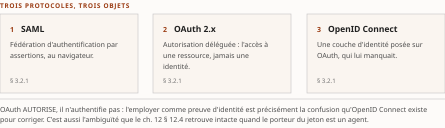
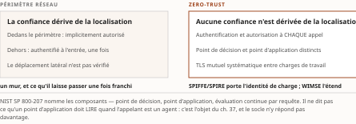

# Chapitre 3 — Sécurité, identité et gouvernance de l'interopérabilité

*Livre I — Coopérer : fondements de l'interopérabilité et couche protocolaire agentique.
Premier mouvement — les fondements (ch. 1-6).*

| Champ | Valeur |
|---|---|
| **Statut** | **Brouillon de rédaction, non publiable** — rédigé sur instruction d'auteur du 27 juillet 2026, **avant** les portes G-1, G-2 et G-3 du [PRD](../PRD/PRD.md) §5. ⚠ **Ce chapitre est le plus exposé du premier mouvement**, à double titre : il est le **chapitre-charnière** dont dépend l'économie de fusion côté identité (§ 3.2 et § 3.3 ne sont reconstruits nulle part ailleurs), et il porte de la matière **cryptographique**, où le garde-fou R-02 du Vol. III s'applique pleinement. ⚠ **Deux mises à jour postérieures à la rédaction.** *27 juillet 2026* — **G-2 et le volet Livre I de G-1 ont été franchis** (PRD v0.8), et les **remontées de cette pièce sont closes**. *28 juillet 2026* — **G-3 est franchie à son tour** (PRD v0.14) : le socle consolidé existe, **159 entrées `S-001`…`S-159`** ([Annexe B](../PRD/socle-consolide.md)). ⚠ **La pièce n'y est pas ré-adossée pour autant** : ses énoncés résolvent toujours contre le Vol. I *Monographie* §1.9-1.10 en régime **[C]**, aucune entrée du socle n'est promue et **aucun vote adversarial n'a été conduit**. **Aucun énoncé n'est central au sens de CA-IV-01**, G-4, G-5 et G-6 restent ouvertes, CA-IV-11 et CA-IV-13 demeurent insatisfaites faute d'un relecteur distinct du rédacteur, et la pièce reste un **brouillon non publiable**. *Une porte franchie n'est pas un ouvrage recevable ; c'est une condition qui cesse de manquer.* |
| **Date de gel** | **27 juillet 2026** — gel unique du compendium, **décision d'auteur D-1 prise** ce jour (registre : [`gel-2026-07-27.md`](../PRD/gel-2026-07-27.md)). ⚠ **Ce gel n'efface pas ceux des sources**, qui restent portés ci-dessous : il date la reprise de chaque fait périssable à sa source primaire, non la matière elle-même. Matière condensée au gel de sa source — **juin 2026** (Vol. I) —, qui n'est pas celui de la somme. ⚠ Trois faits datés y appellent une re-vérification à G-1 : la finalisation d'un profil de haute sécurité (22 février 2025), une recommandation du W3C sur les attestations vérifiables (15 mai 2025), et le statut d'**OAuth 2.1**, **encore à l'état de projet à la mi-2026** |
| **Socle mobilisé** | **Aucune entrée du socle consolidé.** ⚠ **L'Annexe B existe depuis le 28 juillet 2026** — 159 entrées, `S-001`…`S-159` —, mais **cette pièce n'y est pas ré-adossée** : le ré-adossement est dû et n'est pas opéré ici. Les énoncés résolvent contre le **Vol. I *Monographie* §1.9-1.10**, en régime **[C]** (PRD §7.1). **Aucun énoncé n'est central au sens de CA-IV-01.** ⚠ Réserve renforcée pour ce chapitre : la matière cryptographique est celle où un énoncé [C] non élevé fait le plus de dégâts, puisqu'elle est citée comme garantie |
| **Garde-fous balayés** | **Les deux séries, intégralement.** ⚠ **Règle de décompte, et les cardinaux ci-dessous ont été re-mesurés sous elle le 28 juillet 2026** : un décompte d'occurrences porte sur le **marqueur littéral de l'identifiant** dans le **corps** de la pièce — en-tête et note de statut exclus —, et il se re-mesure au commit ; un garde-fou appliqué **sans identifiant écrit** se déclare par son **domaine balayé, sans cardinal**. Vol. II — R-1 à R-8 : **zéro occurrence** (aucune matière réglementaire canadienne, aucune métrique d'adoption auto-déclarée, aucun énoncé sur E-23, le RTR ou MCP). Vol. III — **R-02 (qualification cryptographique) : quatre occurrences**, § 3.2.2, § 3.3.1 et § 3.3.2 (deux) — chaque mécanisme y est qualifié par ce que sa spécification **démontre**, jamais par ce qu'elle promet ; ⚠ *le § 3.2.2 porte **un** marqueur pour **deux** mécanismes qualifiés : le cardinal compte les marqueurs, non les mécanismes* ; **R-11 (jalons NIST « visés », jamais « fixés ») : une occurrence**, § 3.3.2, avec statut du document porté ; **R-14 (trois degrés d'absence) : deux occurrences**, § 3.1.1 et § 3.4.3 ; **R-13 : le marqueur figure une fois, § 3.3.1, en déclaration de non-déclenchement** — ⚠ « point d'application de politique » y figure au sens **pré-agentique** du zero-trust, où il n'est pas le terme que R-13 vise. R-01, R-03 à R-10, R-12 : **zéro occurrence** |
| **Volumétrie cible** | ≈ 9 000 mots de corps (§ 3.1 à § 3.4). Enveloppe **dérivée, non prescrite** ; ce chapitre pèse plus que la moyenne parce qu'il est **posé une seule fois pour cinq chapitres aval**. ☑ **Décompte publiable depuis le franchissement de G-2** (27 juillet 2026). **Réel : 5 701 mots** de corps, mesurés par [`PRD/decompte.sh`](../PRD/decompte.sh), seule autorité de décompte du volume — **− %** de la cible. ⚠ **Ce réel est re-mesuré au commit du 30 juillet 2026** (décision 16b) : *toute date de mesure antérieure citée dans ce champ décrit une passe précédente, et la passe de révision D-11 l'a périmée.* La mesure antérieure datait du commit de la seconde passe de relecture (5 104 mots et −43,3 % au terme de la première ; l'écart vient de six instruments repris nommés et de deux constructions d'auteur marquées). ⚠ **L'écart individuel ne se lit pas seul** : la somme des onze cibles dérivées atteint **93 000 mots** pour une enveloppe de Livre de **65 000** — chaque pièce a dérivé sa cible de l'enveloppe sans que personne n'additionne les dérivations. Le **réel du Livre était, au 27 juillet 2026, de 64 750 mots, soit −0,4 % de l'enveloppe** — ⚠ **cardinal de Livre à re-mesurer au terme de la passe de relecture**, les onze pièces étant révisées en parallèle : c'est la cible dérivée qui était fausse, non la pièce qui est courte. *Un écart se documente ; il ne se corrige ni par amputation ni par gonflement* |

> **Thèse** *(citée depuis le [`TOC.md`](../PRD/TOC.md) v0.23, entrée du chapitre 3)* — le passage du périmètre réseau à la confiance par échange, et l'identité fédérée à autorisation déléguée, sont l'héritage IAM que la fabrique de confiance agentique (Livre II) étire jusqu'à rupture.

---

## § 3.1 — Du périmètre réseau à la confiance par échange

La sécurité n'est pas une couche superposée à l'interopérabilité : elle en est une **propriété
émergente**, qui se construit et se vérifie à chaque échange. Dès lors que deux systèmes administrés
séparément coopèrent par contrat (ch. 1 § 1.1.1), la frontière de confiance se déplace du périmètre
réseau vers **le message lui-même**.

Ce déplacement est le sujet du chapitre, et il se formule en une exigence : un appel inter-services
doit prouver **qui** l'émet, **au nom de qui** il agit et **sur quoi** il porte, indépendamment du
chemin réseau emprunté. Le contrat de sécurité — schéma de jeton, profil d'autorisation, identité de
charge de travail — devient alors un artefact aussi explicite et versionné que le contrat
d'interface.

⚠ **Ce chapitre est posé une seule fois pour toute la somme, et c'est sa raison d'être.** Les
ch. 12 (transposition d'OAuth, d'OIDC et de SCIM aux agents), ch. 13 (identité décentralisée
agentique), ch. 21 (horloge post-quantique), ch. 37 (zero-trust au grain de l'infrastructure) et
ch. 38 (observabilité agentique) **y renvoient sans le reconstruire**. C'est la principale économie
de la refonte des trois volumes côté identité, et elle n'a lieu que si ces cinq chapitres s'y
tiennent. Un lecteur qui trouverait OAuth réexpliqué au ch. 12 devrait considérer que l'économie a
été perdue.

### 3.1.1 Modèle de menace de l'intégration

L'intégration multiplie les frontières de confiance, et chacune introduit une classe d'attaques
propre. Quatre méritent d'être nommées, parce que la couche agentique les retrouvera toutes.

Le **mandataire confus** (*confused deputy*) — un service privilégié induit à agir pour le compte
d'un appelant non autorisé — est un défaut **structurel** des architectures déléguées, et non un
défaut d'implémentation. Une passerelle qui réutilise ses propres droits au lieu de propager ceux du
client transforme tout point d'entrée en vecteur d'escalade. C'est le défaut le plus important de
cette sous-section pour la suite du Livre : il connaît une variante moderne dans les architectures
agentiques, où une injection d'invite indirecte détourne le plan d'un agent en lui faisant traiter
comme instructions des contenus externes.

Le **vol et le rejeu de jetons porteurs** constituent la menace corollaire, et elle est analytique
plutôt qu'empirique : un jeton porteur intercepté est, **par définition**, rejouable par quiconque le
détient. Ce n'est pas une faiblesse d'implémentation qu'un correctif effacerait ; c'est la
conséquence directe de ce qu'un jeton porteur *est*. La liaison cryptographique du jeton à son
porteur (§ 3.2.2) n'est donc pas un durcissement optionnel dans une intégration exposée.

S'y ajoutent l'**escalade latérale** — un appel exploitant une relation de confiance implicite entre
services — et la **falsification de requête côté serveur**, particulièrement aiguë en passerelle, où
un composant légitime est détourné pour atteindre des ressources internes autrement inaccessibles.

Ces vecteurs convergent vers un principe directeur : *ne jamais faire confiance, toujours vérifier*.
**Aucune position dans la topologie** — réseau interne, sous-réseau de confiance, maillage — ne
confère d'autorité par elle-même. Chaque requête est authentifiée et autorisée sur ses propres
mérites.

⚠ Que cette liste soit exhaustive n'est pas établi : le socle hérité recense ces classes sans
prétendre à un balayage systématique. Il s'agit d'une **absence de documentation** au sens de R-14 du
Vol. III, non d'un fait négatif vérifié — et la taxonomie proprement agentique du ch. 19 procédera,
elle, par balayage documenté.

> **Perspective recherche.** Le mandataire confus se modélise comme une **perte d'information sur
> l'identité du mandant** le long d'une chaîne de délégation : le système préserve
> l'*authentification* mais perd l'*autorisation* d'origine. C'est une formulation qui vaut d'être
> retenue, parce qu'elle dit exactement ce que les profils de propagation de contexte (§ 3.2.3)
> réparent — rendre la chaîne de mandants explicite et vérifiable à chaque saut, plutôt que
> reconstruite par inférence. Le problème des deux sauts du ch. 17 en est la forme agentique.

### 3.1.2 OWASP API Security Top 10 et contrôles

Les API étant le substrat dominant de l'intégration moderne, leur classe de vulnérabilités propre
mérite une cartographie sur le pipeline d'échange. L'**OWASP API Security Top 10**, publié et tenu à
jour par la fondation **OWASP**, hiérarchise ces risques et place en tête les **défauts
d'autorisation au niveau de l'objet** : l'accès à des
ressources d'un autre locataire faute de contrôle par identifiant, et la granularité du contrôle qui
s'arrête à la ressource sans couvrir ses propriétés sensibles.

Ces deux défauts sont, au fond, **des fautes de contrat** : l'interface expose une surface d'objets
plus large que la politique d'autorisation ne la garde. Les lire ainsi plutôt que comme des bogues
change la parade — on corrige le contrat, pas seulement le code.

L'**authentification cassée** — gestion défaillante des jetons, absence de rotation, points
d'extrémité non protégés — complète le tableau et fait le lien direct avec les mécanismes d'identité
fédérée du § 3.2.

La valeur opératoire du référentiel tient à sa transposition sur les étapes de l'intégration :
validation du jeton et de son audience en passerelle ; **contrôle d'autorisation au plus près de la
ressource**, et non seulement au point d'entrée ; limitation des propriétés sérialisées par le
contrat de réponse ; application des quotas et limites de débit (§ 3.4.2). Chaque risque se règle
ainsi par un contrôle attaché à **un point de contrat identifiable**, et non par une mesure de
périmètre.

---

## § 3.2 — Identité fédérée et autorisation déléguée

> ⚠ **SIÈGE DU SOCLE IAM POUR TOUTE LA SOMME.** Ce socle pré-agentique est **posé ici une seule
> fois**, au § 3.2 et au § 3.3. Les **ch. 12, 13, 21, 37 et 38** le transposent aux agents et **n'en
> reconstruisent aucun mécanisme** — ils y renvoient. C'est la principale économie de la fusion côté
> identité, et elle n'a lieu que si ces chapitres s'y tiennent ; l'abstention est contrôlée par
> `PRD/check-sieges.py`. Ce qui suit est donc l'état de l'art *avant* que l'agent n'entre en scène —
> c'est délibérément une photographie, et sa valeur pour la somme tient à ce qu'elle serve de point
> de comparaison.

### 3.2.1 SAML, OAuth 2.x/2.1 et OpenID Connect

L'identité fédérée résout un problème d'interopérabilité précis : permettre à un système d'accepter
des identités **émises et garanties par un autre domaine administratif**. C'est le premier mécanisme
de la somme où une organisation accepte de faire dépendre une décision d'accès d'une assertion
produite ailleurs — geste dont le Livre II montrera qu'il ne se transpose pas mécaniquement aux
agents.

Le format historique de cette fédération est l'**assertion SAML 2.0**, encore omniprésente dans
l'intégration interentreprises et l'authentification unique vers les applications d'entreprise. La
trajectoire dominante est néanmoins une migration vers **OpenID Connect**, qui adosse
l'authentification à la couche d'autorisation **OAuth 2.0** et substitue à l'assertion XML un jeton
d'identité JSON plus léger, mieux adapté aux API et aux clients publics.

⚠ **Ce chapitre est le SIÈGE du socle IAM pour toute la somme, et cinq chapitres aval y renvoient
sans le reconstruire** — ce qui interdit d'expédier SAML en une phrase. *Trois traits de l'assertion
SAML 2.0 sont donc posés ici une fois, parce que les Livres II et IV s'y adossent.* **(a) Le porteur
de la confiance est le document, non le canal** : une assertion est un fragment XML **signé par
l'émetteur**, que le consommateur valide contre une clé publiée d'avance — *la fédération SAML est
un échange de documents signés entre deux domaines qui se sont préalablement reconnus, et cette
reconnaissance préalable est hors protocole.* **(b) Le lien de confiance est bilatéral et négocié
hors bande** : chaque couple fournisseur d'identité / fournisseur de service échange ses métadonnées
et ses certificats, ce qui rend l'ajout d'un partenaire **linéairement coûteux** — *c'est la croissance
combinatoire du ch. 1 § 1.6.1, appliquée à la confiance plutôt qu'aux données.* **(c) L'assertion transporte des
attributs, non une autorisation** : elle dit *qui* est le sujet et ce qu'on sait de lui ; *ce que le
sujet a le droit de faire reste une décision du consommateur*.

⚠ **C'est le troisième trait qui voyage le plus loin dans la somme, et il faut le retenir sous cette
forme** : *la fédération d'identité résout l'authentification entre domaines et laisse l'autorisation
entière* — **le ch. 17 retrouve exactement cette frontière au niveau du mandat d'agent**, et le
ch. 14 en fait l'une de ses cinq questions. Lecture de l'auteur — la migration de SAML vers
OpenID Connect change le **format** et le **poids** du jeton, non cette répartition ; *le socle
établit la substitution de format, il n'établit pas que le partage des rôles ait bougé.*

Sur le versant de l'**autorisation déléguée**, le socle évolue d'OAuth 2.0 vers **OAuth 2.1**, dont
l'objet est de consolider les flux éprouvés et de proscrire ceux jugés dangereux : l'échange de code
avec preuve de clé devient obligatoire, et le flux implicite est retiré.

⚠ **Point de statut à ne pas lisser** : à la date d'arrêt des sources (mi-2026), **OAuth 2.1 est
encore à l'état de projet**. La consolidation est en revanche codifiée comme *bonne pratique de
sécurité actuelle* par la **BCP 240** de l'IETF (**RFC 9700**, 2025), qui constitue la référence pour
durcir un déploiement existant **sans attendre** la finalisation. Citer OAuth 2.1 comme un standard
établi serait une faute de fait ; s'appuyer sur la BCP 240 ne l'est pas.

> **Mise en œuvre.** Pour un nouveau service, le couple OpenID Connect pour l'authentification et
> OAuth 2.1 avec preuve de clé obligatoire pour l'autorisation déléguée constitue le défaut
> raisonnable, en appliquant dès la conception les recommandations de la **BCP 240**.
> SAML 2.0 demeure pertinent pour interopérer avec un parc applicatif existant, sans être retenu pour
> de nouvelles intégrations orientées API.

### 3.2.2 Jetons, anti-rejeu et profils à haute sécurité

Le **jeton est le contrat de sécurité matérialisé** : sa structure et ses garanties déterminent la
confiance qu'un consommateur peut lui accorder. Le format pivot est le jeton web JSON, **signé** pour
l'intégrité et l'authenticité, et **chiffré** lorsque la confidentialité de ses revendications
l'exige.

Il faut ici être exact sur ce qu'une signature apporte, parce que c'est le point où la lecture rapide
se trompe. **Un jeton signé reste un jeton porteur, donc rejouable s'il est dérobé.** La signature
démontre l'*origine* et l'*intégrité* de la revendication ; elle ne démontre **rien** sur l'identité
de celui qui présente le jeton. Confondre les deux, c'est croire protégé ce qui ne l'est pas.

La parade consiste à **lier cryptographiquement le jeton à son détenteur légitime**, et deux
mécanismes le font à des niveaux différents :

- la **liaison par certificat client** en TLS mutuel ancre le jeton à la clé TLS du client — elle
  démontre la possession de cette clé lors de la poignée de main, et suppose une infrastructure de
  certificats mutuels ;
- la **démonstration de possession de clé** au niveau applicatif atteint le même objectif **sans**
  cette infrastructure, en exigeant une preuve de possession à chaque requête.

⚠ **Qualification, au sens de R-02 du Vol. III.** Ces deux mécanismes **démontrent** qu'un requérant
possède une clé au moment de la requête. Ils ne démontrent pas que cette clé est détenue par
l'entité légitime, ni qu'elle n'a pas été extraite d'un environnement compromis : ces propriétés
relèvent de la protection de la clé, non du protocole de liaison. Écrire qu'un jeton lié est « non
rejouable » serait qualifier par la promesse ; écrire qu'il « n'est plus rejouable par un tiers ne
possédant pas la clé » est qualifier par ce qui est démontré.

Ces mécanismes se composent en **profils de haute sécurité** pour les contextes les plus exposés. Le
profil **FAPI 2.0** de l'**OpenID Foundation**, **finalisé le 22 février 2025**, agrège ces exigences
— jetons liés au porteur, indication explicite de la ressource cible, validation stricte des
paramètres — en une cible de conformité éprouvée, notamment dans l'écosystème de la finance ouverte
que le Livre III reprendra.

Adopter un tel profil revient à **figer un contrat de sécurité interopérable et certifiable**, plutôt
qu'à recomposer *ad hoc* un assemblage de contrôles. C'est le même geste que celui du modèle de
données canonique au ch. 1 § 1.6.1 : substituer un pivot gouverné à une combinatoire de décisions
locales.

### 3.2.3 Provisionnement et propagation de contexte

L'identité fédérée présuppose que les comptes **existent et restent synchronisés** entre domaines :
c'est le rôle du provisionnement. Le standard **SCIM** — *System for Cross-domain Identity
Management* — en fournit le schéma et le protocole, automatisant le cycle de vie des comptes
— création, mise à jour, désactivation — d'un fournisseur d'identité vers les applications
consommatrices.

⚠ **Deux traits de SCIM sont posés ici, au titre du siège, parce que le Livre II les mobilise et que
le ch. 12 est nommément chargé de leur transposition aux agents.** **(a) SCIM est un protocole de
*ressource*, pas de *session*** : il expose des collections d'utilisateurs et de groupes sur une
interface REST, avec un schéma extensible, et il agit **hors du chemin de l'authentification** — *le
provisionnement se fait avant, l'authentification pendant, et les deux ne se voient pas.* **(b) Sa
désactivation est un état, non un événement** : SCIM porte un attribut d'activité que le fournisseur
d'identité met à jour, et *rien dans le protocole ne garantit qu'une application consommatrice
observe ce changement dans un délai borné.*

⚠ **Le second trait est le plus lourd, et c'est la raison pour laquelle ce paragraphe existe.** *Un
protocole de provisionnement qui pousse un état sans borner sa propagation ne ferme pas la fenêtre de
révocation — il la déplace du poste manuel vers le calendrier de synchronisation.* **C'est exactement
la question que le ch. 20 pose à la couche agentique** — un budget de fraîcheur écrit dans un texte —
et **le socle IAM pré-agentique n'y répond pas davantage que les protocoles d'agents** : *absence de
documentation, non fait négatif vérifié.* Lecture de l'auteur — la couche agentique n'hérite donc
pas d'une solution qu'elle aurait perdue : *elle hérite d'un problème que l'entreprise avait appris à
tolérer sur des cycles humains, et que des agents parcourent en secondes.*

Sans ce maillon, la révocation d'accès reste manuelle et tardive, ce qui **rouvre la fenêtre
d'attaque que l'authentification fédérée prétendait fermer**. Le provisionnement est donc la facette
*évolution* du contrat d'identité : il garantit que l'état d'autorisation suit l'état réel des
personnes et des charges. Une identité fédérée sans provisionnement n'est pas une identité fédérée
imparfaite — c'est une identité fédérée dont la principale garantie est absente.

La seconde exigence est la **propagation du contexte d'autorisation** le long d'une chaîne d'appels,
sans perte du mandant d'origine (§ 3.1.1). Deux mécanismes s'y emploient :

- l'**échange de jetons** permet à un service intermédiaire d'obtenir, à partir d'un jeton entrant,
  un jeton dérivé **restreint** pour appeler le service suivant, en conservant la trace du sujet
  initial ;
- les **jetons de transaction** poussent cette logique vers une preuve d'autorisation propre à une
  transaction métier, traversant l'ensemble des sauts internes.

Ces approches matérialisent la délégation en chaîne comme un **contrat explicite et vérifiable de
bout en bout**, là où une simple réémission de jeton porteur effacerait l'identité du mandant et
rouvrirait le risque de mandataire confus.

⚠ **C'est ici que se joue la thèse du chapitre**, et il vaut de le dire au moment où le mécanisme est
posé plutôt qu'au moment où il rompt. Ces dispositifs ont été conçus pour des chaînes **courtes,
prévues à l'avance, et dont les maillons sont des services**. Un agent qui compose son plan à
l'exécution, invoque des outils non anticipés et délègue à d'autres agents ne satisfait aucune de ces
trois hypothèses. Le ch. 17 mesure ce que la chaîne de mandat devient dans ces conditions ; le
présent chapitre pose ce qu'elle **était** — et l'écart entre les deux est ce que la thèse appelle
*l'étirement jusqu'à rupture*.

---

## § 3.3 — Zero-trust, identité de charge de travail et confiance décentralisée

> **Socle pré-agentique, posé ici une seule fois.** Les ch. 37 (zero-trust au grain de
> l'infrastructure), ch. 13 (identité décentralisée agentique) et ch. 21 (horloge post-quantique)
> y renvoient **sans le reconstruire**.

### 3.3.1 Zero-trust et identité de charge de travail : SPIFFE/SPIRE, WIMSE

Le **zero-trust** formalise le principe *ne jamais faire confiance, toujours vérifier* en une
architecture où **aucune confiance n'est dérivée de la localisation réseau**. L'architecture de
référence **NIST SP 800-207** en pose les composants — point de décision et point d'application de
politique, évaluation continue par requête — que l'intégration transpose en exigeant
authentification et autorisation à chaque appel, **y compris à l'intérieur d'un même périmètre**.
Dans un maillage de services (ch. 1 § 1.3.4), ce principe se concrétise par du TLS mutuel
systématique entre charges, déchargeant l'authentification mutuelle vers l'infrastructure plutôt que
vers le code applicatif.

⚠ **Précision de vocabulaire, à tenir pour tout le Livre.** « Point d'application de politique » et
« point de décision » sont ici employés au sens **pré-agentique** de cette architecture de référence.
Ils ne sont pas les termes que le garde-fou R-13 du Vol. III proscrit nus — celui-ci vise
« AgentMesh », « control plane », « ACP » et « autonomie graduée ». Le sigle **« ACP »** désigne
à lui seul au moins quatre objets distincts ; l'encadré de désambiguïsation qui les sépare est au
**ch. 7 § 7.5**, siège unique pour toute la somme, et n'est pas reconstruit ici. Le ch. 37 reprendra
la paire au grain de l'agent, et c'est **là** que la vigilance terminologique s'impose.

L'application du zero-trust aux services exige une **identité pour les acteurs non humains**, à durée
de vie courte et vérifiable. **SPIFFE** et son implémentation de référence **SPIRE** fournissent à
chaque charge un identifiant et un document d'identité vérifiable, émis et renouvelé automatiquement,
qui **remplace les secrets statiques à longue durée de vie par une attestation cryptographique
éphémère**. Des travaux de standardisation **encore pré-normatifs** — le groupe **WIMSE** de l'IETF —
visent à harmoniser ces mécanismes.

⚠ **Qualification, au sens de R-02 du Vol. III.** Ce que SPIFFE démontre est précis et borné :
qu'une charge présentant un document d'identité valide **a été attestée par le nœud d'émission au
moment de l'émission**, et que ce document n'a pas expiré. Il ne démontre pas que la charge n'a pas été
compromise depuis, ni que le processus attesté est celui qu'il prétend être au-delà de ce que la
plateforme d'attestation peut établir. La différence entre « identité vérifiable » et « identité
vérifiée en continu » n'est pas rhétorique : c'est l'écart que l'évaluation continue du zero-trust
est censée combler, et qu'elle ne comble qu'à la granularité de la requête.

Le découplage s'applique ici à l'identité elle-même : elle devient un **contrat émis par
l'infrastructure**, indépendant de l'adresse réseau, et **révocable par expiration plutôt que par
rotation manuelle de secrets**. C'est le remplacement d'un geste opérationnel faillible par une
propriété structurelle.

Lecture de l'auteur — c'est l'un des rares endroits de ce Livre où une classe entière d'incidents
disparaît plutôt que de se déplacer. Le socle n'établit ni cette disparition ni sa rareté ; l'une et
l'autre sont proposées comme lecture.

> **Perspective recherche.** L'identité non humaine à durée de vie courte déplace la sécurité d'un
> modèle de **secrets partagés** vers un modèle d'**attestation continue**. La question ouverte porte
> sur la **composition** de ces identités le long d'une chaîne d'appels : articuler l'identité de
> charge — qui *exécute* — et l'identité déléguée du mandant humain — au nom de *qui* — sans
> confondre les deux reste un problème de modélisation actif. C'est exactement la question que les
> ch. 16 et 17 reprennent pour l'agent, où un troisième terme s'ajoute : *sous quel mandat, et pour
> combien de temps*.

### 3.3.2 Identité décentralisée, eIDAS 2.0 et cryptographie post-quantique

À l'horizon de la confiance inter-organisationnelle, l'identité fédérée centralisée cède
progressivement la place à des modèles **décentralisés** où le sujet présente lui-même des
attestations vérifiables, sans dépendance à un fournisseur d'identité commun.

Un modèle de données porté par une **recommandation du W3C du 15 mai 2025** en fixe le format : une
attestation signée par un émetteur, conservée par le détenteur, présentée à un vérifieur, avec
**divulgation sélective** des seules revendications nécessaires — divulgation que des mécanismes de
jeton à divulgation sélective et des protocoles de présentation rendent opérationnelle. Cette
architecture **découple l'émission de la vérification**, condition d'une interopérabilité de
l'identité à l'échelle de plusieurs juridictions.

Le cadre réglementaire européen **eIDAS 2.0** ancre cette logique dans le droit et organise le
déploiement d'un portefeuille d'identité numérique, dont la généralisation est **attendue à compter
de 2026** — échéance à re-vérifier, et non à citer comme acquise.

⚠ **Qualification, au sens de R-02 du Vol. III.** Une attestation vérifiable démontre qu'un émetteur
identifié a signé un ensemble de revendications à une date donnée, et que le porteur peut en prouver
la possession. Elle **ne démontre pas** que les revendications sont vraies, ni que l'émetteur était
fondé à les émettre, ni que le sujet n'a pas changé d'état depuis. La confiance dans une attestation
reste une confiance dans son **émetteur** — le format déplace le problème de la confiance, il ne le
résout pas. Le ch. 16 rencontrera exactement cette limite en posant qu'un passeport d'agent ne vaut
que ce que vaut son autorité d'émission.

La couche cryptographique sous-jacente entre simultanément dans une **transition de fond**.
Anticipant la menace que poserait un calculateur quantique sur les algorithmes asymétriques actuels,
le **NIST** a **publié en août 2024** ses premiers standards post-quantiques : un mécanisme
d'encapsulation de clés et deux mécanismes de signature.

⚠ **Deux précisions de statut, et la seconde relève de R-11 du Vol. III.** *(a)* Ces standards sont
**publiés** — c'est un fait daté, non une annonce. *(b)* En revanche, les **jalons de migration** que
le même organisme associe à cette transition sont **visés**, jamais *fixés*, et le document qui les
porte a son propre statut, qu'il faut citer avec lui. Écrire qu'une date de dépréciation est
« fixée » serait attribuer à une projection l'autorité d'une norme. Le ch. 21, qui prend l'horloge
post-quantique pour objet, porte cette distinction comme règle de rédaction.

⚠ **Qualification, au sens de R-02 du Vol. III — la plus importante du chapitre.** Ces algorithmes
sont conçus pour résister à des attaques par calculateur quantique **sur la base de problèmes
mathématiques dont aucune attaque quantique efficace n'est connue**. Ce n'est pas la même chose
qu'une preuve de résistance, et la nuance n'est pas académique : la sélection a déjà éliminé des
candidats après publication de leur analyse. La formulation défendable est « résistant en l'état des attaques
connues », jamais « inviolable » ni « sûr contre le quantique ».

Ces algorithmes appellent une migration des jetons, certificats et canaux qui sous-tendent toute
l'identité fédérée : la signature des attestations, l'authentification mutuelle des charges et les
profils de haute sécurité (§ 3.2.2) devront intégrer des suites résistantes. Le contrat de sécurité
acquiert ainsi une dimension d'**évolution algorithmique** — l'agilité cryptographique — qui
prolonge, jusque dans le choix des primitives, l'invariant du Livre.

Lecture de l'auteur — l'agilité cryptographique est le troisième terme de l'invariant appliqué à un
objet qui, historiquement, n'était pas censé changer. Un format de message évolue ; on s'y attendait.
Une primitive de signature évolue ; on ne s'y attendait pas, et la plupart des systèmes déployés ne
portent nulle part la négociation qui le permettrait. Le socle n'établit pas cette lecture ; elle est
proposée comme telle, et le ch. 21 l'instruit sous le nom de **dette de migration**.

> **Mise en œuvre.** La transition relève d'abord d'un **inventaire** : recenser où des primitives
> asymétriques signent ou protègent des jetons et des canaux d'intégration, puis privilégier une
> cryptographie agile — négociation d'algorithme, hybridation classique et post-quantique — plutôt
> qu'un remplacement en bloc. Aligner ce chantier sur l'introduction des attestations vérifiables
> évite de figer prématurément des formats appelés à changer.

---

## § 3.4 — Gouvernance, test et observabilité de l'interopérabilité

Les sections précédentes ont établi *comment* des systèmes s'authentifient et se délèguent
l'autorité. Celle-ci traite les préoccupations qui traversent toutes les couches une fois
l'intégration **en production** : la gouvernance des contrats, la définition et l'application des
niveaux de service, le test d'interopérabilité et sa certification, et l'observabilité comme
condition opérationnelle.

L'invariant y trouve son prolongement organisationnel, et il vaut d'être énoncé ainsi : *un contrat
n'est interopérable que s'il est gouverné, vérifié et observé tout au long de sa vie.* Un contrat
correct qui n'est ni vérifié ni observé est une intention.

### 3.4.1 Modèles de gouvernance et politique exécutable

La gouvernance de l'intégration se décline selon un continuum : du modèle **centralisé**, où une
équipe unique conçoit et publie tous les contrats, au modèle **décentralisé**, où chaque
équipe-produit possède ses interfaces, en passant par un modèle **fédéré** qui combine standards
communs et autonomie locale. Ce dernier prolonge la logique du couplage faible au plan
organisationnel et rejoint la perspective du maillage de données (ch. 2 § 2.2.2). Un centre
d'excellence incarne fréquemment ce compromis : plutôt que de produire les intégrations, il édite des
guides de style, des gabarits et des règles partagées que les équipes appliquent elles-mêmes.

L'apport décisif de la dernière décennie est la traduction de ces règles en **politique exécutable**
(*policy-as-code*) : des contraintes vérifiées automatiquement plutôt que recommandées. Un
vérificateur de description d'API évalue chaque définition contre un jeu de règles versionnées —
nommage, sécurité obligatoire, présence d'exemples — et signale les écarts **dès la validation**, en
amont de la chaîne d'intégration continue.

Ce déplacement vers l'amont intègre la gouvernance au flux de développement : la conformité au guide
de style devient une **condition de fusion** plutôt qu'un audit *a posteriori*. C'est la même
doctrine que celle du registre de schémas au ch. 2 § 2.1.6, et que celle qui gouverne ce dépôt : une
règle sans motif exécutable qui la contrôle n'en est pas une.

> **Mise en œuvre.** Une chaîne d'intégration continue typique enchaîne, à chaque modification d'un
> contrat : un contrôle de style **bloquant** sur les règles critiques, la publication de la version
> validée dans un registre de schémas, et la propagation contrôlée vers les consommateurs. La
> gouvernance d'ensemble peut s'aligner sur **ISO/IEC 38500:2024**, norme internationale de
> gouvernance des systèmes d'information, pour articuler responsabilités, conformité et performance.

### 3.4.2 Cycle de vie des contrats, niveaux de service et application à l'exécution

Un contrat d'interface **vit** : il naît, évolue et meurt. Maintenir l'interopérabilité sous
changement (ch. 1 § 1.1.4) exige une discipline de versionnement et de **dépréciation explicite**.
L'écosystème HTTP fournit deux en-têtes normalisés par l'IETF — **`Deprecation`** et **`Sunset`** —
permettant d'annoncer, dans la réponse même, qu'une ressource est dépréciée et la date à laquelle
elle cessera d'être servie, donnant aux consommateurs une **fenêtre de migration prévisible** plutôt
qu'une rupture silencieuse.

Ce mécanisme est modeste, et sa fréquence d'emploi n'est établie nulle part dans le corpus mobilisé.

Lecture de l'auteur — son omission est un bon révélateur : une organisation qui ne signale pas ses
dépréciations dans le protocole les signalera par courriel, donc mal, donc tard. Le socle n'établit
ni cette fréquence ni cette conséquence ; l'une et l'autre sont proposées comme lecture.

Au-delà de la structure du contrat, son **exécution** se gouverne par des objectifs mesurables. La
discipline de l'ingénierie de fiabilité distingue trois objets qu'il ne faut pas confondre :

| | Nature | Portée |
| --- | --- | --- |
| **Indicateur** (SLI) | grandeur **mesurée** — taux de succès, latence au centile élevé | interne, factuel |
| **Objectif** (SLO) | **seuil visé** sur cet indicateur | interne, décidé |
| **Accord** (SLA) | **engagement contractuel** envers le consommateur | externe, opposable |

: Tableau 3.1 — Indicateur, objectif et accord de niveau de service : trois objets distincts, souvent confondus.

De ces objectifs dérive le **budget d'erreur** : la part d'indisponibilité tolérée, qui arbitre entre
vélocité de changement et stabilité. À l'exécution, la passerelle d'API applique ces engagements par
des quotas et une limitation de débit qui protègent le producteur et répartissent équitablement la
capacité entre consommateurs.

L'interopérabilité, sous-caractéristique de la compatibilité dans le modèle de qualité produit
(ch. 1 § 1.1.1), ne se réduit donc pas à la définition **statique** du contrat : elle inclut la
tenue, vérifiable, de ses niveaux de service. C'est ce qui la rend mesurable en continu plutôt
qu'auditable ponctuellement — la piste que le ch. 1 § 1.2.2 identifiait comme dépassement des modèles
de maturité à paliers, et que le Livre IV reprendra sous le nom d'AgentOps.

### 3.4.3 Conformité, interopérabilité et test piloté par le consommateur

Il importe de distinguer deux propriétés que la pratique confond, et dont la confusion coûte cher.

La **conformité** atteste qu'une implémentation respecte une spécification de référence **prise
isolément**. L'**interopérabilité** atteste que **deux** implémentations, fussent-elles chacune
conformes, fonctionnent effectivement ensemble. L'interopérabilité est une **relation entre
systèmes**, non une propriété intrinsèque de l'un d'eux (ch. 1 § 1.1.1) : deux participants conformes
peuvent diverger sur des choix laissés libres par la norme et échouer à coopérer.

Le test d'interopérabilité vise donc l'**appariement réel**, là où le test de conformité vise
l'adéquation au modèle. Une suite de conformité verte des deux côtés ne prouve rien sur leur
coopération.

Le **test de contrat piloté par le consommateur** (*consumer-driven contract testing*)
opérationnalise cette distinction : le consommateur exprime ses attentes sous forme d'un contrat ; le
producteur vérifie **en continu** qu'il les honore. L'outillage automatise ce cycle — chaque partie
publie ses contrats, et une commande d'autorisation de déploiement interroge le registre pour
n'autoriser une livraison que si toutes les paires consommateur-producteur restent compatibles.

On rejoint ici la vérification de compatibilité comportementale (ch. 1 § 1.1.4) : ce test en fournit
une approximation **pragmatique et automatisable**, fondée sur des exemples plutôt que sur une preuve
exhaustive.

⚠ Que cet écart entre couverture empirique et garantie formelle ne soit comblé par aucune méthode
industrielle relève d'une **absence de documentation** au sens de R-14 du Vol. III : le socle hérité
n'en recense pas, ce qui n'établit pas qu'il n'en existe aucune.

> **Perspective recherche.** Ce test vérifie la compatibilité **par échantillons d'interactions**,
> non par raisonnement sur l'ensemble des comportements admissibles. Les formalismes du
> ch. 1 § 1.1.4 — types de session, automates d'interface — visent au contraire une garantie
> comportementale décidée sur la structure des protocoles. L'écart entre cette garantie et la
> couverture empirique reste un front de recherche, et il s'élargit quand le participant est un agent
> dont les comportements ne sont pas énumérables à l'avance.

### 3.4.4 Suites de certification et organismes de normalisation

Lorsque l'interopérabilité doit être garantie à l'échelle d'un **écosystème ouvert**, les acteurs
s'appuient sur des **profils d'interopérabilité** — sous-ensembles précisés d'une norme, fermant les
options ambiguës — et sur une **certification tierce** qui atteste leur respect. Dans le domaine de
l'identité, le programme de certification de l'**OpenID Foundation** valide qu'une implémentation se
comporte comme attendu ; celui de la **FIDO Alliance** certifie l'authentification forte.

Cette certification transforme une compatibilité **espérée** en compatibilité **attestée** —
condition d'adoption dans les secteurs régulés, comme le Livre III le montrera. C'est aussi
l'héritage direct de la discipline LISI que le ch. 1 § 1.2.2 relevait : l'évaluation par preuves
plutôt que par déclaration d'intention.

La gouvernance des normes elles-mêmes se répartit entre organismes aux périmètres complémentaires :
l'IETF publie les documents des protocoles d'Internet, le W3C les recommandations du Web, OASIS et
l'OMG des standards d'entreprise, l'ISO et la CEI les normes internationales. Cartographier cette
répartition aide à situer la **maturité et l'autorité** d'une spécification donnée.

⚠ **Une recommandation finalisée, un document promu au rang de norme et un travail en cours ne
portent pas le même poids contractuel.** C'est la distinction que le marqueur de ressource vivante
matérialise dans tout ce dépôt, et elle est la seule protection contre une classe d'erreur très
répandue : citer un brouillon comme s'il engageait ses auteurs. Le ch. 7, qui traite la généalogie et
la gouvernance des standards agentiques, en fait son critère central.

### 3.4.5 Traçage distribué : OpenTelemetry et W3C Trace Context

Dans une architecture distribuée, une requête traverse de nombreux services avant de produire une
réponse ; comprendre une **défaillance d'interopérabilité** suppose de reconstituer ce parcours. Le
traçage distribué répond à ce besoin en propageant un identifiant de trace de bout en bout.

Pour que la corrélation survive aux frontières entre services hétérogènes, **le format de propagation
doit lui-même être interopérable** : la recommandation **W3C Trace Context** normalise les en-têtes
de contexte de trace, et une spécification complémentaire y ajoute la propagation de contexte
applicatif.

Ce point mérite d'être souligné parce qu'il est contre-intuitif : **l'observabilité est un problème
d'interopérabilité à part entière**. Sans format de contexte commun, les traces se rompent à chaque
changement de fournisseur, et le système reste opaque précisément là où il est le plus distribué.

Le cadre d'instrumentation **OpenTelemetry** fournit le protocole d'export qui unifie les trois
signaux — traces, métriques et journaux —, tandis que ses **conventions sémantiques** standardisent
le nommage des attributs, condition d'une corrélation effective entre signaux et entre équipes. La
littérature de l'observabilité insiste sur cette bascule : l'enjeu n'est plus de **surveiller des
seuils connus d'avance**, mais d'**interroger librement** un système pour expliquer des comportements
imprévus — ce qui suppose des données émises selon des conventions partagées.

Lecture de l'auteur — cette bascule est la raison pour laquelle l'observabilité, et non la
supervision, est le socle que le Livre IV réemploie. Un agent produit par construction des
comportements imprévus ; un dispositif conçu pour vérifier des seuils connus d'avance n'a rien à en
dire. Le socle n'établit pas cette conséquence ; elle est proposée comme lecture, et le ch. 38
l'instruit.

> **Mise en œuvre.** Une instrumentation conforme aux conventions sémantiques, propageant le contexte
> de trace normalisé, permet de suivre une transaction à travers une passerelle d'API, un maillage de
> services et des consommateurs d'événements. Au niveau du transport, des outils fondés sur des
> sondes noyau offrent une visibilité réseau **sans instrumentation applicative**, complémentaire des
> traces de niveau service.

### 3.4.6 Auditabilité et conformité réglementaire des intégrations

L'observabilité ne sert pas que le diagnostic : elle fonde l'**auditabilité**, c'est-à-dire la
capacité à **démontrer après coup, preuves à l'appui**, comment une intégration s'est comportée.

Lecture de l'auteur — la différence entre les deux est celle du destinataire. Le diagnostic sert
l'exploitant, qui sait ce qu'il cherche ; l'auditabilité sert un **tiers**, qui ne le sait pas et qui
n'accordera aucun crédit à une reconstitution produite par la partie contrôlée. C'est cette asymétrie
qui rend l'auditabilité coûteuse, et c'est elle que le Livre III retrouvera comme contrainte plutôt
que comme confort. Le socle établit que l'observabilité fonde l'auditabilité ; il n'établit ni cette
asymétrie de destinataire ni le coût qui en découlerait — l'une et l'autre sont proposées comme
lecture.

Cette exigence devient contraignante dès lors que la réglementation impose des **interfaces
ouvertes** et la **traçabilité des accès**. Dans la banque ouverte, la directive européenne **PSD2**
(2015) oblige les établissements à exposer des interfaces d'accès aux comptes, dont l'usage par des
tiers doit être journalisé et vérifiable ; l'auditabilité des appels y est une **condition de
conformité**, non un agrément.

⚠ **Ce cas est cité comme illustration du mécanisme, et à ce titre seul.** Il n'est ni un modèle pour
le cadre canadien, ni un précédent transposable au vertical financier que le Livre III instruit à son
propre grain. Ce qui se transporte d'ici vers les ch. 25 à 36 est la **forme** — une exigence
d'auditabilité opposable, adossée à une obligation d'interface —, jamais son contenu. La même réserve
avait été posée au ch. 1 § 1.2.3 pour le dispositif européen d'évaluation obligatoire, et elle vaut
pour la même raison : le Livre III ne raisonne pas par analogie européenne.

Cette section clôt le socle pré-agentique de l'identité et de la gouvernance. Ce qui suit, dans le
Livre I, est la couche protocolaire proprement agentique — et ce qui la précède, dans les ch. 4 à 6,
est l'ingénierie de l'agent lui-même. Le lecteur qui arrive au ch. 12 y trouvera ces mécanismes
**transposés**, jamais réexpliqués : c'est le contrat que ce chapitre passe avec le reste de la
somme.

---

## § 3.5 — Note de statut *(hors plan — à retirer à la publication)*

⚠ **Cette section n'est pas au TOC et n'a pas vocation à survivre.** Elle consigne l'écart de
gouvernance sous lequel ce chapitre a été rédigé, conformément à la règle d'escalade du
[PRD](../PRD/PRD.md) Annexe A : *un rédacteur ne corrige jamais le TOC, ce PRD ni le Conspectus — il
remonte.*

**Ce qui est enfreint** — les portes **G-1**, **G-2** et **G-3** étaient ouvertes à la rédaction, sur
instruction d'auteur du 27 juillet 2026 ; **les trois ont été franchies depuis**, et l'infraction
n'est pas rattrapée pour autant. Trois conséquences, plus une propre à ce chapitre :

1. **Aucun énoncé n'est central au sens de CA-IV-01.** Les faits résolvent contre le Vol. I
   *Monographie* §1.9-1.10, en régime **[C]**, et la pièce n'a pas été ré-adossée au socle consolidé
   constitué le 28 juillet 2026.
2. **Les décomptes sont publiables depuis le 27 juillet 2026** — G-2 franchie, la commande
   `PRD/decompte.sh` versionnée et éprouvée sur les trois corpus entiers.
3. **Les renvois « ch. N » ont cessé d'être des renvois de plan.** Les ch. 7, 12, 13, 16, 17, 19, 21,
   25-36, 37 et 38 sont **rédigés en brouillon hors portes** depuis le 27 juillet 2026, et les
   renvois de cette pièce ont été **re-vérifiés contre leur texte** le 28 juillet 2026 : ⚠ **le
   contrôle a porté sur l'existence de la cible et la résolution des sections citées** — les huit
   sections des ch. 1 et 2, le siège du ch. 7 § 7.5, et l'existence de chacun des autres chapitres
   cités —, **non sur la fidélité de fond de chaque annonce**, qui relève de la porte G-4.
   ⚠ *Ils renvoient en outre à des brouillons non publiables, ce qui n'en fait pas des appuis
   opposables.*
4. **⚠ Conséquence propre à ce chapitre, et la plus sérieuse du Livre I à ce jour.** Le régime **[C]**
   est particulièrement inadéquat pour de la matière **cryptographique**, parce qu'un énoncé de
   sécurité non élevé en [B] est cité comme une **garantie**. Le chapitre a paré ce risque en
   appliquant R-02 avec insistance — **quatre qualifications explicites, couvrant cinq mécanismes**,
   chacune énonçant ce que le mécanisme démontre **et ce qu'il ne démontre pas**. Cette parade **ne
   remplace pas l'élévation en [B]**, qui reste due et que **le franchissement de G-3 n'a pas
   opérée** : le socle constitué ne promeut aucune entrée et ne conduit aucun vote adversarial.

**Remontées ouvertes par ce chapitre**, à l'instance d'arbitrage (D-6, non désignée) :

- **R-IV-04 — non bloquante, à échéance G-1.** Trois faits datés à re-vérifier : la finalisation du
  profil de haute sécurité (22 février 2025), la recommandation du W3C sur les attestations
  vérifiables (15 mai 2025), et le **statut de projet** d'**OAuth 2.1**, encore non finalisé à la
  mi-2026. Ce dernier est le plus volatil : sa finalisation pendant la rédaction de la somme
  obligerait à reprendre le § 3.2.1, qui le présente aujourd'hui comme un projet.
- **R-IV-05 — bloquante pour les ch. 12, 13, 21, 37 et 38.** L'économie de fusion côté identité
  **repose entièrement** sur le fait que ces cinq chapitres citent les § 3.2 et § 3.3 **sans les
  reconstruire**. Aucun dispositif de contrôle ne vérifie cette abstention : `check-toc.py` ne lit
  pas les pièces, et `verifier-piece.py` ne connaît qu'une pièce à la fois. **Un motif de balayage
  inter-pièces est à construire en G-3** — il ferait partie des motifs que le PRD §8 dit devoir être
  posés à la clôture de cette porte. Sans lui, la duplication se constatera à la relecture finale,
  c'est-à-dire trop tard pour être économique.

**Ce qui n'est pas enfreint.** La structure suit la table détaillée du TOC section par section
(§ 3.1 à § 3.4). ⚠ **Trois intitulés de sous-section y sont traduits plutôt que repris
littéralement** — § 3.4.1, § 3.4.2 et § 3.4.3 —, leur matière étant inchangée et les termes anglais
du plan figurant au corps ; les deux intitulés qui **retranchaient un instrument nommé**, § 3.3.1 et
§ 3.4.5, ont été réalignés sur le plan le 28 juillet 2026. La table de couverture est respectée, y
compris la mention **en entier** des §1.9.2 et §1.9.3 non hérités par les ch. 12 et 37 ; les deux
séries de garde-fous sont balayées et déclarées, avec quatre occurrences de R-02, une de R-11, deux
de R-14 et une de R-13 marquées en toutes lettres ; les constructions d'auteur portent « Lecture de
l'auteur » (CA-IV-07).

---

### Clôture des remontées — 27 juillet 2026

⚠ **Cette sous-section est hors plan comme la note qui la porte, et se retire avec elle.** Elle
enregistre l'issue des remontées ouvertes par cette pièce. *Une remontée ne se clôt pas là où elle
s'ouvre : elle se solde là où elle fait foi* — au [PRD](../PRD/PRD.md) pour une décision d'auteur, au
[TOC](../PRD/TOC.md) pour un réalignement de plan, à l'appareil pour une dette d'outillage.

- **R-IV-04 — close par le franchissement de G-1 (volet Livre I).** Les trois faits datés sont
  **confirmés à leur source primaire le 27 juillet 2026** (registre du gel, faits 6 à 8) : le profil
  de haute sécurité au **22 février 2025**, la recommandation sur les attestations vérifiables au
  **15 mai 2025**, et le cadre d'autorisation de nouvelle génération **toujours à l'état de projet**
  — version 15 du document, publiée le 2 mars 2026, expirant le 3 septembre 2026, aucun RFC. Le
  § 3.2.1 n'a donc **pas** à être repris : il le présente comme un projet, et c'en est un.
- **R-IV-05 — close par versement d'appareil.** Le motif de balayage inter-pièces qu'elle réclamait
  existe : [`PRD/check-sieges.py`](../PRD/check-sieges.py), cinq contrôles S1-S5 sur une table
  déclarative de sièges, **validé par mutation**. ⚠ **Il a mordu au premier passage sur cette pièce
  même** : le § 3.3 énumérait les termes proscrits sans renvoyer à l'encadré du ch. 7 § 7.5 — corrigé.
  Et le **siège du socle IAM ne portait aucun marqueur** : il en porte un désormais, au § 3.2, sans
  lequel aucun rédacteur aval ne pouvait savoir qu'il devait s'abstenir.

⚠ **Ce que la clôture ne change pas.** ⚠ **Ce paragraphe portait, à sa date, « la porte G-3 demeure
ouverte : le socle consolidé compte zéro entrée, l'Annexe B n'existe pas », et l'énoncé est restauré
ici parce qu'il était exact au 27 juillet 2026** — *un enregistrement daté ne se réécrit pas ; son
écart se consigne à la passe suivante.* ⚠ **Il est périmé depuis le 28 juillet 2026** : **G-3 est
franchie** (PRD v0.14), le socle consolidé compte **159 entrées**, et l'**Annexe B** renvoie à
[`socle-consolide.md`](../PRD/socle-consolide.md). ⚠ **La conclusion, elle, ne bouge pas** : les
dix-sept entrées héritées du Vol. I y sont **toutes en `[C]`**, **aucun vote adversarial n'est
conduit**, **CA-IV-13 demeure insatisfaite** faute d'un relecteur distinct du rédacteur (D-6), et
**aucun énoncé de cette pièce n'est central au sens de CA-IV-01**. Elle reste un **brouillon non
publiable**. *Zéro remontée ouverte ne veut pas dire pièce recevable — cela veut dire qu'aucune
question n'attend plus de réponse qui ne soit déjà tranchée.*

---

### Passe de relecture — 28 juillet 2026

⚠ **Cette sous-section est hors plan comme la note qui la porte, et se retire avec elle.** Elle
enregistre ce qu'une relecture de la seule pièce a corrigé, et ce qu'elle a **remonté sans le
corriger**.

**Ce qui a été corrigé dans la pièce.** *(a)* **L'état des portes a été re-daté** : la porte **G-3
est franchie depuis le 28 juillet 2026** (PRD v0.14) et le socle consolidé existe — 159 entrées,
`S-001`…`S-159` —, là où l'en-tête et la clôture le donnaient encore à zéro entrée. ⚠ **La pièce
n'en tire aucune requalification** : elle n'est pas ré-adossée au socle, aucune entrée n'est promue,
aucun vote adversarial n'est conduit. *(b)* **Deux cardinaux de R-02 se contredisaient** : l'en-tête
comptait **quatre marqueurs** — la règle de décompte du 28 juillet 2026 comptant le marqueur
littéral et non le mécanisme —, la note de statut en annonçait cinq à deux endroits ; les deux sites
portent désormais **quatre marqueurs pour cinq mécanismes qualifiés**, et R-13 y est déclaré comme à
l'en-tête. *(c)* Le décompte « quatre conséquences » de la note de statut en énumérait **trois**,
plus celle propre au chapitre. *(d)* **Un antécédent flottant au § 3.3.1** — « le dernier de ces
sigles » désignait « autonomie graduée », qui n'est pas un sigle — est rétabli sur **« ACP »**,
conformément au siège du **ch. 7 § 7.5**. *(e)* **Six instruments repris étaient anonymisés** au
corps alors que le plan ou l'en-tête les nomment : SP 800-207, SPIFFE/SPIRE, WIMSE, SCIM,
OpenTelemetry et W3C Trace Context, plus le NIST comme éditeur des standards post-quantiques et
OAuth 2.1 dans la remontée qui l'instruisait. ⚠ *La parade de péremption couvre les dénominations
commerciales et les versions ; elle ne couvre pas l'auteur d'un instrument repris.* *(f)* **Trois
affirmations d'adoption sans attributeur** — deux « largement adopté », aux § 3.1.2 et § 3.4.5, et un
« largement retenu » au § 3.2.2 — sont retirées, et **une fréquence non établie** (« presque toujours
omis », § 3.4.2) est passée sous « Lecture de l'auteur ».

**Ce qui a été remonté sans être corrigé** — un relecteur ne corrige ni le TOC, ni le PRD, ni le
conspectus, ni une pièce voisine. *(1)* **Le ré-adossement de la pièce au socle consolidé est dû** :
les énoncés résolvent encore contre le Vol. I *Monographie* §1.9-1.10 en **[C]**, et l'élévation en
**[B]** de la matière cryptographique reste la priorité que le point 4 ci-dessus nomme. *(2)*
**D'autres instruments repris demeurent anonymisés, faute d'identification au corpus mobilisé, et
leur DOMAINE est déclaré sans cardinal** — le profil de haute sécurité et la bonne pratique publiée
du § 3.2, les en-têtes de dépréciation, la norme de gouvernance des systèmes d'information,
l'outillage de test de contrat et les programmes de certification du § 3.4, la directive européenne
de banque ouverte du § 3.4.6 : *ce qui n'a pas été vu à la source ne s'écrit pas comme vu*. *(3)*
**Le cardinal de volumétrie du Livre n'est pas re-mesuré ici** : onze pièces sont révisées en
parallèle, et *un cardinal mesuré pendant que des pièces s'écrivent est faux à la seconde où on le
publie*.

---

### Seconde passe de relecture — 28 juillet 2026

⚠ **Cette sous-section est hors plan comme la note qui la porte, et se retire avec elle.** Elle
enregistre ce qu'une seconde relecture, conduite pour **éprouver la première**, a trouvé sur la pièce
corrigée. *La sous-section qui précède n'est pas réécrite : un enregistrement daté se conserve, et
ses écarts se consignent ici.*

**Une régression, confirmée et corrigée.** La première passe avait **supprimé** de la clôture du
27 juillet 2026 la phrase « la porte G-3 demeure ouverte : le socle consolidé compte zéro entrée,
l'Annexe B n'existe pas », **exacte à sa date**. ⚠ *Effacer un énoncé daté parce qu'il a cessé d'être
vrai supprime la seule information qu'il portait — sa date* ; c'est la règle que le dépôt applique à
sa veille publiée, et les **ch. 1, 5, 6 et 7 du même Livre** ont conservé la leur, annotée. L'énoncé
est **restauré**, avec sa péremption déclarée à la suite.

**Deux corrections de la première passe étaient fausses, et elles le sont pour le même motif — une
attestation posée sans être constatée sur pièce.**

1. ⚠ **« Les termes anglais du plan figurant au corps » était faux pour l'un des trois intitulés
   traduits.** Le § 3.4.3 rend « *contract testing* piloté par le consommateur » par « test piloté
   par le consommateur », et **le terme anglais ne figurait nulle part dans le corps** — les deux
   autres, *policy-as-code* (§ 3.4.1) et SLI/SLO/SLA (§ 3.4.2), y figurent bien. Le terme est rétabli
   à sa première occurrence, sous la forme que la source emploie : *consumer-driven contract
   testing*. **L'attestation est désormais vraie pour les trois.**
2. ⚠ **« Faute d'identification au corpus mobilisé » était faux pour les sept instruments restants.**
   Le corpus mobilisé est le Vol. I *Monographie* §1.9-1.10, et **il les nomme tous** : FAPI 2.0 de
   l'OpenID Foundation (§1.9.2.2), la BCP 240 / RFC 9700 (§1.9.2.1), les en-têtes `Deprecation` et
   `Sunset` (§1.10.1.2), ISO/IEC 38500:2024 (§1.10.1.1), Pact et PactFlow (§1.10.2.1), le programme
   de certification de l'OpenID Foundation (§1.10.2.2), la directive PSD2 (§1.10.3.2). **Six sont
   nommés au corps** — le motif de leur anonymat n'existait pas. ☑ **Le septième reste anonymisé et
   son motif change** : l'outillage de test de contrat est une **dénomination commerciale**, cas que
   la parade de péremption couvre expressément ; il en va de même du vérificateur de description
   d'API du § 3.4.1. *Une exemption nommée n'est pas une lacune ; une lacune inventée en est une.*

**Trois manques de la première passe, corrigés.** *(a)* **Trois renvois « R-02 » nus** — § 3.3.1 et
§ 3.3.2 (deux) — nomment désormais leur volume, la première passe n'ayant qualifié que le « R-14 » du
§ 3.4.3 alors que la décision 7 vaut à **toute** occurrence ; c'est en outre la forme que les pièces
voisines du Livre — ch. 8, 9, 10 et 11 — emploient à leurs propres marqueurs de qualification.
⚠ **Les cardinaux d'en-tête ne bougent pas** : la décision 16 compte le **marqueur littéral**, et
« R-02 » y figure toujours quatre fois. *(b)* **Deux constructions
d'auteur ne portaient pas leur marquage** (CA-IV-07) — la disparition d'une « classe entière
d'incidents » au § 3.3.1, l'asymétrie de destinataire entre diagnostic et auditabilité au § 3.4.6 —,
alors que la première passe avait marqué la troisième, au § 3.4.2. Les deux portent « Lecture de
l'auteur » et déclarent ce que le socle n'établit pas. *(c)* **Le § 3.4.4 opposait un programme de
certification nommé à un programme anonyme** ; les deux sont nommés.

**Ce que cette passe confirme sur pièce, et qui n'appelait donc aucune correction.** La **thèse est
identique caractère pour caractère** à celle du TOC (décision 17). Les **cardinaux de garde-fous de
l'en-tête sont exacts** au balayage exhaustif : R-02 quatre marqueurs, R-11 un, R-14 deux, R-13 un,
et zéro pour R-01, R-03 à R-10, R-12 comme pour les huit garde-fous du Vol. II. Les **huit renvois de
section aux ch. 1 et 2 résolvent** contre le texte rédigé, ainsi que le siège du **ch. 7 § 7.5** —
dont la première passe a **correctement** rétabli l'antécédent flottant sur « ACP », forme que ce
siège emploie mot pour mot. Le **marqueur du siège du socle IAM est intact**, et la signature
versée à [`check-sieges.py`](../PRD/check-sieges.py) résout toujours contre les intitulés du § 3.2 et
du § 3.3. Le **volume annoncé par la première passe — 5 104 mots** — est **confirmé** par
[`PRD/decompte.sh`](../PRD/decompte.sh) sur la pièce telle qu'elle la laissait ; il est **re-mesuré
au commit de cette seconde passe à 5 180 mots**, et l'en-tête porte les deux.

**Ce qui reste remonté, sans être corrigé.** Le **ré-adossement au socle consolidé** et l'**élévation
en [B]** de la matière cryptographique demeurent dus — la première passe les a remontés à bon droit,
et *une relecture ne conduit pas un vote adversarial*. La **volumétrie du Livre** reste à re-mesurer
au terme des onze passes.
