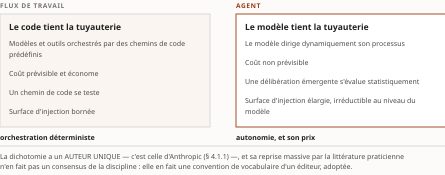
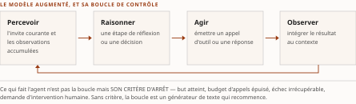
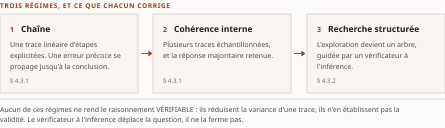

# Chapitre 4 — L'ingénierie des systèmes agentiques : anatomie, raisonnement, outils

*Livre I — Coopérer : fondements de l'interopérabilité et couche protocolaire agentique.
Premier mouvement — les fondements (ch. 1-6).*

| Champ | Valeur |
|---|---|
| **Statut** | **Brouillon de rédaction, non publiable** — rédigé sur instruction d'auteur du 27 juillet 2026, **avant** les portes G-1, G-2 et G-3 du [PRD](../PRD/PRD.md) §5. Premier chapitre du Livre I dont la matière est **proprement agentique** : les ch. 1 à 3 posaient le socle pré-agentique. ⚠ **Mises à jour des 27 et 28 juillet 2026, postérieures à la rédaction** : **G-2 et le volet Livre I de G-1 ont été franchis** (PRD v0.8), les **remontées de cette pièce sont closes**, et **G-3 est franchie depuis le 28 juillet 2026** (PRD v0.14) — le socle consolidé existe, à **159 entrées `S-001`…`S-159`** ([Annexe B](../PRD/socle-consolide.md) v1.2). ⚠ **La pièce n'en devient pas recevable** : aucune de ces entrées ne couvre son périmètre de fusion (champ *Socle mobilisé*), **aucun de ses énoncés n'est central au sens de CA-IV-01**, et **CA-IV-11 et CA-IV-13 demeurent insatisfaites**, D-6 ne fournissant pas de relecteur distinct du rédacteur. Elle reste un **brouillon non publiable**. ⚠ **Passe de révision du 30 juillet 2026 (D-11), postérieure à l'arrêt D-10** : sur instruction d'auteur, en réponse au grief **RA-F4** du rapport d'arbitrage externe, la **décision 15a du TOC est renversée** (décision 18, v0.32) et **trente-six travaux jusque-là décrits sans nom sont cités nominativement**, chacun collationné à sa source le 30 juillet 2026. ⚠ **Cette passe ne change ni le statut ni le régime de preuve** : la collation porte sur l'**exactitude des citations**, non sur le contenu des résultats cités, qui demeure `[C]` — *nommer correctement une source n'est pas l'avoir lue*. Détail au § 4.6 |
| **Date de gel** | **27 juillet 2026** — gel unique du compendium, **décision d'auteur D-1 prise** ce jour (registre : [`gel-2026-07-27.md`](../PRD/gel-2026-07-27.md)). ⚠ **Ce gel n'efface pas ceux des sources**, qui restent portés ci-dessous : il date la reprise de chaque fait périssable à sa source primaire, non la matière elle-même. Matière condensée au gel de sa source — **juin 2026** (Vol. I). ⚠ **C'est le chapitre du Livre I dont la matière se périme le plus vite** : la nomenclature des modèles de raisonnement, les jalons de version des cadriciels et la frontière des capacités sont datés par construction, et la source elle-même écrit que cette nomenclature « évolue vite et doit être revérifiée à toute publication » |
| **Socle mobilisé** | **Aucune entrée du socle consolidé** — non plus faute d'annexe, l'[Annexe B](../PRD/socle-consolide.md) existant depuis le 28 juillet 2026, mais **faute de couverture** : ses **dix-sept entrées portant le Vol. I** (`S-143`…`S-159`) proviennent des §7.x, §3.10, §2.10.2, §5.0.2-5.1.1 et de l'Annexe B de sa *Monographie* — ⚠ **quatre d'entre elles, `S-153` à `S-156`, ne proviennent pas de la *Monographie***, mais de la *Synthèse* du même volume (§10.2, §10.3, §11.5, §11.6), **fichier retiré du dépôt le 22 juillet 2026** —, et **aucune ne relève des §2.1-2.5 ni du §2.8.5**, qui sont le périmètre de fusion de ce chapitre. Les énoncés résolvent donc contre le **Vol. I *Monographie* §2.1-2.5 et §2.8.5** eux-mêmes, en régime **[C]** (PRD §7.1). ⚠ **Une entrée touche la matière du § 4.1.4 sans pouvoir l'appuyer** : `S-157`, qui recense les trois échelles d'autonomie du Vol. I, est **déclarée non élevable** — construction d'auteur, « thèse à attribuer, jamais un fait » — et son calibrage de R-13 est **non rejouable**, les désignations de l'échelle 0-5 vivant dans un fichier retiré du dépôt le 22 juillet 2026. **Aucun énoncé n'est central au sens de CA-IV-01** — les dix-sept entrées du Vol. I sont au demeurant toutes `[C]` |
| **Garde-fous balayés** | **Les deux séries, intégralement.** ⚠ **Règle de décompte, et les cardinaux ci-dessous ont été re-mesurés sous elle le 28 juillet 2026** : un décompte d'occurrences porte sur le **marqueur littéral de l'identifiant** dans le **corps** de la pièce — en-tête et note de statut exclus —, et il se re-mesure au commit ; un garde-fou appliqué **sans identifiant écrit** se déclare par son **domaine balayé, sans cardinal**. Vol. II — **R-1 à R-8 : zéro occurrence** (aucune matière réglementaire canadienne, aucun énoncé sur E-23 ni le RTR) ; ⚠ **une version antérieure de cet en-tête portait « R-8 : une occurrence, § 4.1.4 »** : le corps n'y porte **aucun marqueur R-8**, et l'emploi d'« autonomie graduée » relève de **R-13 du Vol. III** — série que la sous-entrée 4.1.4 du TOC est seule à désigner. *Une occurrence attribuée à un identifiant qui ne l'écrit nulle part est une extension d'identifiant, non un balayage* ; **métriques auto-déclarées (PRD Vol. II §7.5) — sans identifiant écrit, donc sans cardinal re-mesurable : appliqué au § 4.0.1**, la métrique attribuée à sa source ; ⚠ **réserve F-01 du Vol. II (MCP « cadre » d'autorisation, jamais « sécurisé ») : sans objet ici** — l'anatomie protocolaire part au ch. 8, et ce chapitre s'arrête à l'usage d'outils au niveau ingénierie. Vol. III — **R-13 (« autonomie graduée » jamais nue) : une occurrence**, § 4.1.4, avec l'échelle nommée ; **R-14 : deux occurrences**, § 4.1.1 et § 4.3.3. R-01 à R-12 : **zéro occurrence** |
| **Volumétrie cible** | ≈ 9 000 mots de corps (§ 4.0 à § 4.5). Enveloppe **dérivée, non prescrite**. ☑ **Décompte publiable depuis le franchissement de G-2** (27 juillet 2026). **Réel : 8 410 mots** de corps, re-mesurés le 28 juillet 2026 par [`PRD/decompte.sh`](../PRD/decompte.sh), seule autorité de décompte du volume — **−6,6 %** de la cible. ⚠ **Ce réel est re-mesuré au commit du 30 juillet 2026** (décision 16b) : *toute date de mesure antérieure citée dans ce champ décrit une passe précédente, et la passe de révision D-11 l'a périmée.* Historique de la mesure : 7 145 mots et −20,6 % à la rédaction ; les **deux** passes de relecture du 28 juillet ont ajouté **117 mots** — 79 d'attribution et de bornage, 38 de mise en conformité de CA-IV-07. ⚠ **L'écart individuel ne se lit pas seul** : la somme des onze cibles dérivées atteint **93 000 mots** pour une enveloppe de Livre de **65 000** — chaque pièce a dérivé sa cible de l'enveloppe sans que personne n'additionne les dérivations. Le **réel du Livre était de 64 750 mots au 27 juillet 2026, soit −0,4 % de l'enveloppe** : c'est la cible dérivée qui était fausse, non la pièce qui est courte. ⚠ **Ce cardinal de Livre n'est PAS re-mesuré ici** — les onze pièces sont relues en parallèle, et *un agrégat mesuré pendant que ses termes bougent est faux à la seconde où on le publie* : il se re-mesure au commit de la passe (décision 16). *Un écart se documente ; il ne se corrige ni par amputation ni par gonflement* |

> **Thèse** *(citée verbatim depuis le [`TOC.md`](../PRD/TOC.md), entrée du chapitre 4 — forme de la v0.23, re-collationnée mot à mot contre la v0.30 le 28 juillet 2026 : **inchangée**)* — l'agent est un LLM augmenté d'une boucle perception-raisonnement-action-observation ; son ingénierie est une discipline distincte du prompt, gouvernée par des régimes de contrôle et des niveaux d'autonomie.

---

## § 4.0 — Introduction : de l'agent conversationnel à l'agent qui agit

Les trois premiers chapitres du Livre ont posé un socle **pré-agentique** : ce que l'interopérabilité
exige, ce que le sens suppose, ce que la confiance coûte. Ce chapitre ouvre la matière proprement
agentique, et il commence par la seule distinction qui la justifie.

Entre 2024 et 2026, les systèmes fondés sur les grands modèles de langage ont franchi un seuil
qualitatif : de systèmes qui **produisent du texte** sur demande, ils sont passés à des systèmes qui
**agissent** — appellent des outils, lisent et écrivent des fichiers, interrogent des bases, pilotent
un navigateur ou un poste de travail, coordonnent d'autres agents. La question centrale se déplace
avec eux. Il ne s'agit plus de savoir si un modèle est capable, mais de savoir comment **concevoir,
déployer et exploiter** un système autour de lui qui soit fiable, contrôlable en coût et défendable
en sécurité.

C'est cet enjeu d'ingénierie qui fait de l'agentique une discipline distincte du prompt — et la
thèse du chapitre tient dans cette distinction.

### 4.0.1 Du modèle conversationnel à l'agent qui agit sur le monde

Un modèle conversationnel **répond** : il reçoit une suite de jetons et en produit une autre, sans
effet au-delà de la chaîne de caractères rendue. Un agent **agit** : il insère entre la perception et
la sortie une boucle où le modèle décide d'invoquer des outils dont l'exécution produit des **effets
de bord** — un courriel envoyé, une transaction enregistrée, un fichier modifié.

La conséquence d'ingénierie est immédiate et elle commande tout le reste : *dès que le modèle agit,
le rayon d'impact s'élargit*. Une hallucination dans une réponse textuelle se corrige par relecture ;
une hallucination qui déclenche une **action irréversible** engage le système producteur. Ce n'est
pas un raffinement de l'usage conversationnel, c'est un changement de nature.

Les capacités de pilotage d'interface graphique — ouvertes en bêta publique par **Anthropic** le
**22 octobre 2024** sous le nom de *computer use*, puis reprises par **OpenAI** le **23 janvier
2025** sous celui d'*Operator* — illustrent cet élargissement : l'agent ne manipule plus des API
choisies, mais l'interface graphique générale, **démultipliant à la fois la portée et la surface
d'exposition**. Les deux dates sont celles des annonces de leurs éditeurs.

Trois contraintes transversales structurent l'ingénierie qui suit, et elles sont posées ici une fois
pour servir partout :

- **le coût** — l'intensité en jetons des boucles agentiques fait de l'économie des jetons une
  contrainte de conception, non un poste budgétaire. Un surcoût d'environ **quinze fois** pour une
  architecture multi-agents sur une tâche interne est **rapporté par Anthropic** ; cette métrique est
  auto-déclarée et n'est citée qu'attribuée à sa source. Le fil est consolidé au Livre IV ;
- **le modèle** — frontière contre petits modèles agentiques, modèles de raisonnement contre modèles
  standards, routage et réglage maison : une décision d'ingénierie, traitée en § 4.5 ;
- **la sécurité** — instructions et données partagent **le même flux de jetons**, de sorte que
  l'injection d'invite **ne peut être éliminée au niveau du modèle** et appelle une défense en
  profondeur. Le modèle de menace et les vecteurs sont au ch. 19 ; la défense architecturale au
  ch. 6 § 6.5.

Ces trois fils prolongent l'invariant du Livre en l'appliquant à une couche logicielle d'un genre
nouveau, où le composant central est **probabiliste** et où le périmètre de l'action s'élargit à
mesure que l'autonomie augmente.

### 4.0.2 Le double public et l'angle d'ingénierie dominant

Le chapitre s'adresse aux deux lectorats de la somme et l'assume comme contrainte de rédaction. Le
lectorat de recherche attend les formalismes et les filiations : l'agent rationnel, l'héritage des
architectures délibératives, le cadre des processus décisionnels sous observabilité partielle, la
lignée de l'apprentissage par renforcement. Le praticien-architecte attend des normes, des
cadriciels nommés et datés, et des critères de décision opérationnels.

L'angle retenu pour arbitrer est celui de l'**ingénierie** : les formalismes classiques ne sont pas
exposés pour eux-mêmes, mais comme ancrage qui éclaire les choix de conception. Les encadrés
*Perspective recherche* et *Mise en œuvre*, hérités du Vol. I et reconduits par la somme, sont
l'instrument de ce double public.

⚠ **Ce que ce chapitre ne traite pas, et où cela se trouve.** Il traite l'ingénierie **interne** de
l'agent — architecture, raisonnement, outillage, choix du modèle. Il ne traite ni la mémoire et
l'ancrage informationnel (ch. 5), ni le multi-agent, l'évaluation et la sûreté (ch. 6), ni
l'**anatomie protocolaire** de l'accès agent-outil, qui part **en entier** au ch. 8. La distinction
est nette et vaut d'être retenue : ici, l'usage d'outils comme problème d'ingénierie ; là-bas, le
protocole comme objet.

---

## § 4.1 — Fondements et définitions de l'IA agentique

Avant l'ingénierie proprement dite, il faut fixer le vocabulaire, exhumer les formalismes que les
agents fondés sur les modèles de langage **réoutillent** plutôt qu'ils ne les remplacent, et nommer
le débat terminologique qui, faute de consensus formel, cadre l'ensemble.

L'invariant du Livre y trouve déjà ses prises : un agent est précisément une unité que l'on cherche à
**découpler** de son environnement par un **contrat** d'action, et dont le comportement **évolue** au
gré du modèle, de la mémoire et des outils qui le composent.

### 4.1.1 Qu'est-ce qu'un agent ? Définition canonique et débat terminologique

Le terme souffre d'une polysémie ancienne que l'irruption des modèles de langage n'a fait
qu'aggraver. ⚠ **Reconnaître cette absence de consensus formel n'est pas une faiblesse rhétorique :
c'est une donnée d'ingénierie**, car la frontière entre « ce qui est un agent » et « ce qui n'en est
pas un » conditionne les choix d'architecture, de coût et de sécurité. Que cette absence de consensus
persiste relève d'un constat sur le corpus consulté — une **absence de documentation** au sens de
R-14 du Vol. III, non un fait négatif vérifié.

La définition canonique est celle de **Russell et Norvig (2020/2021)** : un agent est tout ce qui
peut être vu comme **percevant** son environnement au moyen de capteurs et **agissant** sur cet
environnement au moyen d'effecteurs. Volontairement minimale, elle fixe le vocabulaire réutilisé
partout — *perception*, *action*, et au-dessus le *but* qui rend une action préférable à une autre —
et institue surtout la **boucle perception-action** comme structure invariante.

**Wooldridge et Jennings (1995)**, *Intelligent agents: theory and practice* (*The Knowledge
Engineering Review*, 10(2), 115-152), exigent d'un agent intelligent qu'il soit **réactif** (il
répond en temps utile), **proactif** (il poursuit des buts de sa propre initiative) et **social**
(il interagit avec d'autres agents). La lecture par l'**optimalité bornée** de **Russell et
Subramanian (1995)**, *Provably Bounded-Optimal Agents* (*Journal of Artificial Intelligence
Research*, 2, 575-609), est plus exigeante encore, et particulièrement pertinente ici : l'agent
rationnel n'est pas celui qui calcule l'action parfaite, mais celui qui **agit au mieux compte tenu
de ses ressources de calcul limitées**. Cadrage prémonitoire pour des agents dont chaque pas de
délibération a un coût en jetons.

La littérature récente distingue par ailleurs l'**agent** comme entité de l'**IA agentique** comme
propriété d'un système. Deux formulations opérationnelles circulent, et il faut dire d'emblée
qu'elles ont **le même auteur et la même date** : **Anthropic**, *Building effective agents*
(19 décembre 2024). La première insiste sur la **direction dynamique** du processus — « des systèmes
où les modèles dirigent eux-mêmes leurs processus et leur usage d'outils, en gardant le contrôle de
la façon dont ils accomplissent leurs tâches » —, par opposition aux flux de travail, « où modèles
et outils sont orchestrés par des chemins de code prédéfinis ». La seconde, plus lapidaire, apparaît
quelques lignes plus bas dans le même texte : les agents y sont « typiquement de simples modèles de
langage employant des outils en boucle sur la base de la rétroaction de leur environnement ».

⚠ **Ces deux formulations ne sont donc pas deux sources convergentes, et les citer comme telles
serait une fausse corroboration.** Ce sont deux phrases d'un même document d'éditeur : la seconde
glose la première, elle ne l'atteste pas. *Une définition reprise deux fois au même endroit ne pèse
pas plus qu'une fois* — et la distinction flux de travail / agent, largement reprise dans la
littérature praticienne de 2025-2026, remonte à cette seule origine.

Au-delà de l'entité unique, **Sapkota, Roumeliotis et Karkee (2025)**, *AI Agents vs. Agentic AI: A
Conceptual Taxonomy, Applications and Challenges* (arXiv:2505.10468), opposent explicitement les
*agents* — entités outillées individuelles — à l'*IA agentique* — systèmes composés et coordonnés.
Cette opposition structure la progression du mouvement : le noyau d'un agent occupe ce chapitre et
le ch. 5, les systèmes coordonnés le ch. 6. ⚠ **Il s'agit d'une préimpression**, versée ici comme
repérage terminologique et non comme fait.

> **Perspective recherche.** L'absence de définition consensuelle rend les comparaisons de
> « capacités agentiques » **difficilement commensurables** entre travaux : chaque équipe
> opérationnalise « agent » à sa manière, de la simple boucle outillée jusqu'aux sociétés simulées.
> Cela fragilise toute prétention à une métrique unifiée et justifie l'approche par bancs d'essai
> ciblés du ch. 6 § 6.3 — approche qui a ses propres limites, mais dont le périmètre est au moins
> déclarable.

### 4.1.2 Le cadre de l'agent rationnel : PEAS et typologies

Le cadre de l'agent rationnel hérité de **Russell et Norvig (2020/2021)**, que la somme reprend tel
quel, offre une grille de conception **toujours pertinente pour spécifier un agent avant d'en écrire
la moindre ligne**. Trois outils s'en dégagent.

La spécification **PEAS** — performance, environnement, actionneurs, capteurs — force l'ingénieur à
expliciter quatre choses : la mesure de performance qui définit le succès, l'environnement où l'agent
opère, les actionneurs par lesquels il agit, les capteurs par lesquels il perçoit. Appliquée à un
agent de recherche documentaire, elle impose de nommer la métrique de qualité, le corpus et les API
accessibles, les outils invocables et les canaux d'entrée. C'est, transposé, **l'exercice de
définition du contrat d'action** de l'agent — et c'est le premier point où l'invariant du Livre mord
sur la matière agentique.

La **typologie des environnements** — observable ou partiellement observable, déterministe ou
stochastique, statique ou dynamique, discret ou continu, mono- ou multi-agent — situe la difficulté.
Un agent web opère typiquement dans un environnement **partiellement observable, stochastique et
dynamique** : précisément les conditions où la boucle perception-action doit tolérer l'incertitude.

L'**échelle de sophistication** — agent réflexe simple, à modèle interne, à but, à utilité, apprenant
— se transpose directement aux patrons du § 4.2.

> **Mise en œuvre.** PEAS se traduit en **fiche de spécification** : objectif mesurable, périmètre
> d'environnement, inventaire des outils autorisés et de leurs permissions, nature des observations.
> Cette fiche est aussi le point de départ de l'analyse de risque — **énumérer les actionneurs, c'est
> énumérer le rayon d'impact**, donc la surface à sécuriser. C'est le lien le plus direct entre la
> spécification d'un agent et le travail du Livre II.

### 4.1.3 Héritages théoriques : BDI, systèmes multi-agents et décision séquentielle

Les agents fondés sur les modèles de langage ne naissent pas dans un vide théorique. Trois lignées
importent, et aucune n'est une curiosité historique : elles reviennent au premier plan dès qu'il
s'agit de fiabiliser un agent, d'en coordonner plusieurs, ou de comprendre ce que signifie
« entraîner » un agent.

**L'architecture croyances-désirs-intentions** (BDI), dont **Rao et Georgeff (1995)** ont donné la
formulation opératoire de référence — *BDI Agents: From Theory to Practice*, actes de la première
ICMAS, MIT Press, 312-319 —, formalise la délibération pratique en trois attitudes : les *croyances*
(l'état informationnel tenu pour vrai), les *désirs* (les états du monde jugés souhaitables), les
*intentions* (les désirs auxquels l'agent s'est engagé). Le socle philosophique est celui de
**Bratman (1987)**, *Intention, Plans, and Practical Reason* (Harvard University Press), qui soutient
que **l'engagement envers une intention sert précisément à éviter la reconsidération permanente des
options** — un argument de stabilité computationnelle avant la lettre.

Ce point vaut d'être retenu, parce qu'il nomme un défaut réel des agents contemporains : là où un
modèle de langage tend à reconsidérer son plan à chaque pas — coûteux en jetons et source de dérive
sur les longues trajectoires —, l'engagement offre un cadre pour distinguer **ce qui doit rester
stable** de **ce qui peut être révisé**. La séparation croyances/intentions préfigure la frontière
contrôleur/exécuteur du § 4.2.4.

**Les systèmes multi-agents classiques** ont posé, bien avant les modèles de langage, la question de
la coordination, et ils l'ont posée sous des noms qu'il faut restituer. Le **protocole du réseau
contractuel** de **Smith (1980)** — *The Contract Net Protocol: High-Level Communication and Control
in a Distributed Problem Solver*, *IEEE Transactions on Computers*, 29(12), 1104-1113 — alloue les
tâches par appel d'offres et adjudication. Les **actes de langage normalisés** structurant la
communication par performatifs typés ont pris deux formes successives : **KQML** (**Finin, Fritzson,
McKay et McEntire, 1994**, actes de CIKM'94, 456-463), puis **FIPA-ACL**, dont la spécification de
structure de message **SC00061G** (FIPA, 2002 ; reprise par l'IEEE Computer Society en 2005) fixe
l'enveloppe et dont la bibliothèque **SC00037J** énumère les actes communicatifs. Ce socle est
explicitement réinterprété par les systèmes multi-agents contemporains (ch. 6 § 6.1) — et le ch. 8
montrera qu'un protocole agentique de 2025 rejoue une partie de ces choix sans toujours le savoir.

**La décision séquentielle** fournit le cadre formel de la boucle sous observabilité partielle : le
processus décisionnel de Markov modélise la décision quand l'état est observable, son extension
partiellement observable — dont **Kaelbling, Littman et Cassandra (1998)** ont donné l'exposé de
référence, *Planning and acting in partially observable stochastic domains*, *Artificial
Intelligence*, 101(1-2), 99-134 — le cas, plus réaliste, où l'état n'est qu'imparfaitement observé.
Un agent opérant sur le web ou un poste de travail relève **structurellement** de ce second cas : il
n'observe qu'une fenêtre partielle de son environnement.

> **Perspective recherche.** Le branchement entre ce formalisme et les agents contemporains reste
> **partiellement métaphorique** : un agent ne maximise pas une fonction de valeur explicite à
> l'inférence, il échantillonne des actions conditionnées par un contexte. La transposition
> rigoureuse — apprendre une politique par renforcement multi-tours sur des trajectoires d'outils —
> est précisément l'objet des travaux d'entraînement agentique (§ 4.3.5), qui matérialisent le pont
> entre la décision séquentielle classique et l'optimisation des modèles.

### 4.1.4 Agent, workflow, automatisation : régimes de contrôle et niveaux d'autonomie

L'une des distinctions les plus opératoires de la période oppose les **flux de travail** — où modèles
et outils sont orchestrés par des chemins de code prédéfinis — aux **agents** — où le modèle lui-même
dirige dynamiquement son processus. ⚠ **Elle a un auteur unique et il vient d'être nommé** : c'est la
dichotomie d'Anthropic (§ 4.1.1), reprise depuis par la quasi-totalité de la littérature praticienne
sans que sa source soit toujours citée. *La reprise massive d'une distinction n'en fait pas un
consensus de la discipline* : elle en fait une convention de vocabulaire d'un éditeur, adoptée.

Le critère discriminant tient en une question : **qui tient la tuyauterie**, le code écrit par
l'ingénieur ou le modèle au moment de l'exécution ?

Cette distinction n'est pas académique : elle gouverne le **coût** (un flux déterministe est
prévisible et économe ; un agent autonome ne l'est pas), la **testabilité** (un chemin de code se
teste, une délibération émergente s'évalue statistiquement) et la **sécurité** (déléguer le contrôle
au modèle élargit la surface d'injection d'invite, irréductible au niveau du modèle).

Au-delà du couple binaire, il est utile de penser la délégation comme un **continuum d'autonomie à
six niveaux, numérotés de 0 à 5** — du simple outil sous contrôle humain total jusqu'à l'agent
pleinement autonome —, par analogie avec l'échelle de conduite automatisée **SAE J3016**, dont la
révision courante est **J3016_202104** (30 avril 2021) et qui numérote elle aussi ses six niveaux de
0 à 5. ⚠ **L'analogie est une analogie, et le Vol. I la donne pour telle** : J3016 est une norme de
l'automobile, elle n'a **aucune autorité sur les systèmes agentiques** et aucun de ses niveaux ne s'y
transpose par définition. *Emprunter une graduation n'est pas hériter de son opposabilité.*

⚠ **Précision imposée par le garde-fou R-13 du Vol. III, et le TOC la signale sous l'entrée de ce
chapitre.** Le Vol. I porte **trois échelles distinctes** dont la confusion serait fautive, et
**seuls leur cardinal et leur numérotation les discriminent** — deux d'entre elles comptent quatre
niveaux, de sorte que la numérotation n'est pas facultative. Celle qui vient d'être posée est le
**continuum à six niveaux, 0 à 5**, du Vol. I *Monographie* §2.2.4. Écrire « l'autonomie graduée du
Vol. I » sans préciser **laquelle** rendrait le renvoi indécidable — et le terme « autonomie
graduée » ne s'emploie jamais nu, ni ici ni ailleurs dans la somme. Le patron directeur *autonomie
graduée sous contrôle de finalité*, posé à l'avant-propos de la somme, **n'entre pas dans ce compte
de trois** : il n'est pas une échelle mais un principe d'architecture, et le Livre III l'instruit.

Le principe d'ingénierie qui se dégage de ce continuum est constant et sera repris par toute la
somme : **minimiser la surface agentique**. Ne déléguer au modèle que ce qui requiert réellement sa
flexibilité, et confier au code déterministe tout ce qui peut l'être. Cette préférence pour le
découplage explicite entre tuyauterie déterministe et délibération prolonge directement l'invariant :
un **contrat clair entre la partie figée et la partie autonome** du système.

> **Mise en œuvre.** La règle pratique est de **remonter le moins d'autonomie possible vers le
> modèle**. Si la tâche se décrit comme un graphe d'étapes connu à l'avance, un flux l'emporte sur un
> agent : moins de jetons, plus de prédictibilité, surface d'attaque réduite. L'agentivité ne se
> justifie que lorsque la séquence d'actions **ne peut être anticipée**. Cet arbitrage est le cœur de
> la grille de décision « quand agentifier » que le ch. 43 reprend.

### 4.1.5 La frontière des capacités 2024-2026 : cadrage qualitatif

Pour motiver l'effort d'ingénierie qui suit, il faut situer **qualitativement** ce que les agents
savent et ne savent pas faire — sans anticiper la mécanique (§ 4.4), ni les chiffres de bancs
d'essai, qui sont au ch. 6 § 6.3.

Trois domaines concentrent les progrès les plus nets. Le **codage** : la résolution autonome de
tâches logicielles réelles est passée d'anecdotique à substantielle, portée par des harnais d'agents
dédiés. Le **pilotage de poste de travail** : un agent peut désormais percevoir une interface et agir
dessus, quoique de façon encore fragile. La **recherche approfondie** : la décomposition itérative
d'une question en sous-recherches outillées est devenue une application phare.

Ces avancées ne doivent pas masquer des **fragilités structurelles persistantes**, qui sont autant de
motifs d'ingénierie pour la suite :

- les **horizons longs** — les agents s'effondrent sur les tâches à nombreuses étapes, où l'erreur se
  compose pas après pas ;
- le **coût** — l'intensité en jetons des boucles en fait une contrainte de premier ordre ;
- la **fiabilité** — le non-déterminisme et le manque de régularité d'une exécution à l'autre.

C'est **cette tension entre capacités réelles et fragilités tenaces**, et non un récit de progrès
linéaire, qui justifie l'angle d'ingénierie de tout le mouvement.

---

## § 4.2 — Architectures d'agent et boucle agentique

Les fondements fournissent le vocabulaire ; ils ne disent pas comment se construit concrètement le
noyau d'un agent. Cette section décrit ce noyau et catalogue les patrons mono-agent qui instancient
la boucle.

### 4.2.1 Le modèle augmenté et la boucle perception-raisonnement-action-observation

Le bloc de base d'un agent n'est **pas le modèle nu** mais le **modèle augmenté** : un modèle de
langage doté d'un accès à des outils, à une mémoire et à un mécanisme de récupération, inséré dans
une boucle de contrôle qui répète un cycle élémentaire — **percevoir** l'état (l'invite courante et
les observations accumulées), **raisonner** (produire une étape de réflexion ou une décision),
**agir** (émettre un appel d'outil ou une réponse), puis **observer** le résultat et l'intégrer au
contexte avant l'itération suivante.

La distinction avec un appel unique au modèle est **structurelle** : l'agent boucle, et c'est cette
itération jusqu'à un critère d'arrêt — but atteint, budget d'appels épuisé, échec irrécupérable,
demande d'intervention humaine — qui transforme un générateur de texte en système qui agit.

Le bloc de base se décompose en quatre facultés qui structurent tout le noyau : l'**usage d'outils**
(§ 4.4), la **mémoire** comme état interne persistant (ch. 5), la **récupération** d'information
externe (ch. 5), et le **raisonnement** qui orchestre le tout (§ 4.3).

La boucle elle-même reste volontairement minimale, et les guides d'ingénierie recommandent de partir
du modèle augmenté le plus simple **et de n'ajouter de la structure que lorsqu'une défaillance
observée le justifie**. Chaque tour consomme des jetons en proportion du contexte accumulé : la
longueur de la trajectoire est donc, dès ce niveau, une variable de coût de premier ordre.

> **Mise en œuvre.** Le **critère d'arrêt n'est pas un détail mais une garantie de terminaison**. Une
> boucle sans budget d'appels explicite ni détection de stagnation peut diverger, multiplier les
> appels facturés et accumuler du contexte jusqu'à la dégradation. Fixer dès la conception un budget
> de pas, un plafond de jetons et une condition d'échec contrôlé relève du **contrat opérationnel** de
> l'agent, au même titre qu'un délai d'expiration pour un service réseau.

### 4.2.2 Architectures cognitives en héritage

Les agents contemporains n'inventent pas la notion d'architecture cognitive : ils en héritent. Deux
architectures classiques ont formalisé, bien avant l'ère des modèles de langage, la séparation entre
mémoire — de travail, déclarative, procédurale —, opérateurs d'action et cycle de décision réglé par
des règles : **Soar** (**Laird, Newell et Rosenbloom, 1987**, *Soar: An Architecture for General
Intelligence*) et **ACT-R** (**Anderson, Bothell, Byrne, Douglass, Lebiere et Qin, 2004**, *An
Integrated Theory of the Mind*, *Psychological Review*, 111(4), 1036-1060). Cette lignée symbolique
n'est pas la seule : l'**architecture de subsomption** de **Brooks (1991)** — *Intelligence without
representation*, *Artificial Intelligence*, 47(1-3), 139-159 —, pour qui l'intelligence émerge du
couplage étroit entre perception et action **sans modèle symbolique central**, offre le contrepoint
historique — tension entre délibération explicite et réactivité incarnée que l'on retrouve,
transposée, dans l'arbitrage du § 4.2.4.

La tripartition qui s'en dégage — *qu'est-ce que l'agent sait, que peut-il faire, comment
choisit-il* — demeure une grille de lecture pertinente. **CoALA** — *Cognitive Architectures for
Language Agents*, **Sumers, Yao, Narasimhan et Griffiths (2023)**, arXiv:2309.02427 — pose le pont
explicite avec les agents langagiers : il les organise selon trois axes — des **modules de mémoire**
(de travail, épisodique, sémantique, procédurale), un **espace d'action** structuré en actions
internes (raisonner, récupérer, écrire en mémoire) et externes (utiliser un outil, interagir avec
l'environnement), et une **procédure de décision** qui sélectionne l'action à chaque pas.

Sa valeur d'ingénierie est de fournir un **référentiel commun** : il permet de situer les patrons du
§ 4.2.3 comme des instanciations d'un même schéma plutôt que comme des recettes isolées.

> **Perspective recherche.** CoALA se présente comme intégrateur et **non comme une architecture
> exécutable** : sa contribution est taxinomique. Il éclaire une limite des agents actuels — là où
> les architectures classiques contraignaient le cycle par des **règles vérifiables**, l'agent
> langagier y substitue un raisonnement en langage naturel **dont la fidélité n'est pas garantie**
> (§ 4.3.4), déplaçant la difficulté du choix de l'action vers le **contrôle** de ce choix. C'est,
> reformulé, le problème que tout le Livre II prend pour objet.

### 4.2.3 Patrons de boucle mono-agent

Quelques patrons canoniques structurent la boucle d'un seul agent. Ils se distinguent par la façon
dont ils **entrelacent ou séparent** raisonnement, action et observation, et par les compromis qu'ils
imposent entre coût, prédictibilité et robustesse.

**L'entrelacement raisonnement-action** — **ReAct**, de **Yao, Zhao, Yu et coll. (2022)**,
*ReAct: Synergizing Reasoning and Acting in Language Models*, arXiv:2210.03629 — est le patron
minimal de référence : à chaque pas, une étape de raisonnement verbalisé et une action dont le
résultat est réinjecté avant le pas suivant. La trace guide le choix de l'action et l'action **ancre
le raisonnement dans des faits observés**, ce qui réduit les hallucinations par rapport à une chaîne
de pensée close sur elle-même.

Sa simplicité explique son adoption comme boucle par défaut, mais cette adoption a un coût précis.
Chaque pas implique un appel au modèle **sur l'intégralité du contexte accumulé** : le coût croît
avec la longueur de la trajectoire. Sur les trajectoires longues, ce patron **dérive** — accumulation
d'erreurs non corrigées, boucles répétitives, perte du but initial à mesure que le contexte se dilue.
Il sert donc d'excellent point de départ et de référence de comparaison, mais demande des garde-fous
— budget de pas, détection de stagnation, compaction du contexte — dès que l'horizon dépasse quelques
itérations.

**La séparation planification-exécution** répond à cette dérive : produire d'abord un plan en
plusieurs étapes, puis l'exécuter pas à pas, avec replanification lorsqu'une étape échoue —
formulation de **Wang, Xu, Lan et coll. (2023)**, *Plan-and-Solve Prompting*, arXiv:2305.04091. La
trajectoire devient plus prédictible et offre un point de reprise net, **au prix d'une rigidité
accrue**. **ReWOO** — **Xu, Peng, Lei et coll. (2023)**, *Decoupling Reasoning from Observations for
Efficient Augmented Language Models*, arXiv:2305.18323 — pousse le découplage plus loin en planifiant
l'ensemble des appels d'outils **avant** d'observer leurs résultats, ce qui regroupe le raisonnement
en un seul passage ; **LLMCompiler** — **Kim, Moon, Tabrizi et coll. (2023)**, *An LLM Compiler for
Parallel Function Calling*, arXiv:2312.04511 — en tire l'ordonnancement parallèle des appels
indépendants. Économie de jetons d'un côté, **perte de réactivité** de l'autre : un plan établi sans
observation ne peut corriger sa route si une hypothèse initiale s'avère fausse.

**L'auto-critique** ajoute à la boucle un mécanisme de réflexion : après un échec, l'agent génère une
critique verbale de ce qui n'a pas fonctionné, l'écrit en mémoire, et réessaie en conditionnant sa
nouvelle tentative sur cette réflexion. Ce **renforcement verbal** — **Reflexion**, de **Shinn,
Cassano, Berman et coll. (2023)**, *Reflexion: Language Agents with Verbal Reinforcement Learning*,
arXiv:2303.11366 —, distinct d'un apprentissage par mise à jour des poids, améliore les performances
sur les tâches autorisant plusieurs essais, **à condition qu'un signal de réussite permette de savoir
qu'une correction est nécessaire**. La variante sans environnement extérieur — **Self-Refine**, de
**Madaan, Tandon, Gupta et coll. (2023)**, arXiv:2303.17651 — fait porter la critique sur la seule
production du modèle, ce qui la rend directement exposée à la limite énoncée ci-dessous.

⚠ **La limite structurelle de l'auto-critique mono-agent est la chambre d'écho** : un agent qui se
critique lui-même reste prisonnier des angles morts de son propre modèle et peut **renforcer une
erreur au lieu de la corriger**, faute de point de vue extérieur. C'est l'un des rares arguments
techniques solides en faveur des topologies multi-agents — débat, vote, critique croisée —, et le
ch. 6 § 6.1 en pèse le coût.

**L'action comme code exécutable** — **CodeAct**, de **Wang, Chen, Yuan et coll. (2024)**,
*Executable Code Actions Elicit Better LLM Agents*, arXiv:2402.01030 — unifie enfin l'espace d'action
en le ramenant à un seul format : plutôt que d'émettre des appels d'outils sous forme d'objets
discrets, l'agent écrit un fragment de programme qui invoque les outils comme des fonctions, compose
leurs résultats, applique de la logique de contrôle et renvoie une valeur. Les avantages sont réels — familiarité des modèles avec le code,
composition de plusieurs opérations en un seul tour, accès à un écosystème de bibliothèques plutôt
qu'à un catalogue figé. **La contrepartie est une surface de risque maximale** : exécuter du code
généré par un modèle exige un environnement confiné, faute de quoi l'agent dispose d'une capacité
d'action quasi illimitée sur le système hôte.

### 4.2.4 Séparation contrôleur/exécuteur et critères de choix d'architecture

Le principe d'ingénierie qui sous-tend ces patrons est la séparation entre un **contrôleur** qui
décide quoi faire et un **exécuteur** qui réalise les actions — déclinée en architecture
**orchestrateur-travailleurs**, l'un des patrons composables que nomme Anthropic dans *Building
effective agents* (§ 4.1.1), lorsque l'exécution est répartie.

Isoler la décision de l'exécution est **l'application directe du découplage au domaine agentique** :
le contrôleur tient la logique de but et de planification, l'exécuteur tient l'interface
contractuelle vers les outils, et chacun peut évoluer sans casser l'autre.

Le choix d'architecture procède alors d'un arbitrage entre deux régimes :

| Régime | Mécanisme | Force | Faiblesse |
| --- | --- | --- | --- |
| **Réactif** | décide pas à pas selon les observations | souple face à l'imprévu | peu prédictible, coûteux sur l'horizon long |
| **Délibératif** | planifie avant d'agir | prédictible, économe en appels | rigide face au changement |

: Tableau 4.1 — Les deux régimes de boucle agentique et l'arbitrage qu'ils imposent.

**Aucun n'est universellement supérieur** : le critère opérationnel est la prévisibilité de
l'environnement et la longueur de l'horizon.

Deux anti-patrons doivent être nommés, parce qu'ils sont fréquents et coûteux. L'**agentivité non
justifiée** : confier au modèle la tuyauterie d'un problème qu'un flux déterministe résoudrait plus
sûrement et à moindre coût. Le **plan rigide** : imposer une planification figée à un environnement
qui change, ce qui transforme la prédictibilité recherchée en fragilité.

Lecture de l'auteur — la séparation contrôleur/exécuteur est le concept de ce chapitre qui voyage le
plus loin dans la somme. C'est elle que le ch. 22 retrouve sous le nom d'orchestration encadrée, et
le ch. 29 sous celui de *frame déterministe invoquant les agents*. Le socle **établit** la séparation
elle-même, ses deux régimes et ses deux anti-patrons ; il **n'établit pas** cette filiation, proposée
comme lecture, et dont l'instruction relève du Livre III.

---

## § 4.3 — Raisonnement, planification et calcul à l'inférence

Reste le moteur qui anime chaque tour de la boucle : le **raisonnement intra-agent**. C'est lui qui
transforme une observation en décision d'action et qui, sur un horizon long, distingue un agent
capable de mener une tâche à terme d'un agent qui dérive.

L'angle reste l'ingénierie : chaque avancée est soupesée à l'aune de son **coût en jetons**, de sa
**prédictibilité** et de sa **robustesse**. Le raisonnement est précisément le poste où l'agent
dépense le plus **pour penser avant d'agir**.

### 4.3.1 Du raisonnement linéaire à la recherche structurée

Le raisonnement par étapes intermédiaires a d'abord été obtenu par invite : **Wei, Wang, Schuurmans
et coll. (2022)**, *Chain-of-Thought Prompting Elicits Reasoning in Large Language Models*,
arXiv:2201.11903, montrent qu'inciter un modèle suffisamment grand à **expliciter ses étapes**
améliore nettement les tâches arithmétiques, symboliques et de bon sens. Cette trace linéaire reste
fragile : **une erreur précoce se propage jusqu'à la conclusion**.

La **cohérence interne** — **Wang, Wei, Schuurmans et coll. (2022)**, *Self-Consistency Improves
Chain of Thought Reasoning in Language Models*, arXiv:2203.11171 — atténue ce risque en
échantillonnant plusieurs chaînes puis en retenant la réponse majoritaire, troquant des jetons
supplémentaires contre une variance réduite. Mais le raisonnement réel n'est ni linéaire ni à passe
unique. L'**arbre de pensée** — **Yao, Yu, Zhao et coll. (2023)**, *Tree of Thoughts: Deliberate
Problem Solving with Large Language Models*, arXiv:2305.10601 — généralise la chaîne : l'agent
engendre plusieurs pensées candidates, les évalue et **revient en arrière**, ce qui débloque des
tâches exigeant planification et recherche. Le **graphe de pensée** — **Besta, Blach, Kubicek et
coll. (2023)**, arXiv:2308.09687 — autorise agrégation et raffinement de pensées non strictement
arborescentes.

Le compromis est explicite et se chiffre : **chaque niveau de structure multiplie les appels au
modèle**, donc le coût et la latence, pour un gain de qualité qui décroît au-delà d'un certain
budget.

> **Mise en œuvre.** Chaîne de pensée et cohérence interne sont des leviers à activer par défaut là
> où la justesse prime ; l'arbre et le graphe ne se justifient que sur des tâches à espace de
> solutions combinatoire, **et à surcoût budgété d'avance**. Avant d'instancier une recherche
> structurée, chiffrer le facteur multiplicatif d'appels qu'elle impose et le confronter au gain
> mesuré — faute de quoi l'agent paie un raisonnement somptuaire sans rendement.

### 4.3.2 Recherche guidée et vérificateurs à l'inférence

Explorer un arbre de raisonnement suppose de savoir **quelles branches étendre** : c'est le rôle des
vérificateurs. **LATS** — *Language Agent Tree Search*, **Zhou, Yan, Shlapentokh-Rothman et coll.
(2023)**, arXiv:2310.04406 — unifie raisonnement, action et planification en pilotant une recherche
arborescente à l'inférence, où la valeur des nœuds est estimée par le modèle lui-même et par la
rétroaction de l'environnement.

Deux familles de vérificateurs guident cette recherche : les **modèles de récompense de processus**,
qui notent chaque étape intermédiaire, et les **modèles de récompense de résultat**, qui ne jugent
que la réponse finale — la comparaison contrôlée est celle d'**Uesato, Kushman, Kumar et coll.
(2022)**, *Solving math word problems with process- and outcome-based feedback*, arXiv:2211.14275.
La supervision **étape par étape** l'emporte empiriquement sur la supervision de résultat pour
fiabiliser le raisonnement mathématique : c'est le résultat de **Lightman, Kosaraju, Burda et coll.
(2023)**, *Let's Verify Step by Step*, arXiv:2305.20050. ⚠ **Les deux travaux portent sur le
raisonnement mathématique**, et la somme n'étend leur conclusion à aucun autre domaine.

Le patron le plus simple échantillonne *N* réponses et retient celle qu'un vérificateur classe en
tête, sans recherche arborescente — il remonte à **Cobbe, Kosaraju, Bavarian et coll. (2021)**,
*Training Verifiers to Solve Math Word Problems*, arXiv:2110.14168. Plus largement, **Snell, Lee, Xu
et coll. (2024)**, *Scaling LLM Test-Time Compute Optimally can be More Effective than Scaling Model
Parameters*, arXiv:2408.03314, établissent qu'**allouer davantage de calcul à l'inférence peut
s'avérer plus rentable qu'augmenter la taille du modèle** — un déplacement dont le § 4.3.4 tire les
conséquences.

⚠ **Une distinction à ne pas perdre** : la recherche guidée **à l'inférence** produit une meilleure
réponse ici et maintenant ; l'usage de la même technique pour **générer des données**
d'auto-amélioration relève du § 4.3.5. Les deux emploient le même mécanisme à des fins
incommensurables.

> **Mise en œuvre.** Le couple *échantillonnage + vérificateur* est déployable **sans entraînement
> spécialisé** : le vérificateur peut être un modèle de récompense léger, un jeu de tests
> exécutables, ou un juge calibré (ch. 6 § 6.3.2). C'est l'option de premier recours pour gagner en
> fiabilité à budget contrôlé, le facteur d'échantillonnage se réglant finement selon l'enveloppe. La
> recherche arborescente complète reste réservée aux tâches à fort espace de décision où sa latence
> est tolérable.

### 4.3.3 Décomposition et planification : les limites des modèles planificateurs

Mener une tâche à horizon long exige de **décomposer le but en sous-buts ordonnés**. Trois lignées
coexistent : la décomposition par invite (planifier puis exécuter), la planification hiérarchique de
tâches, et les **solveurs symboliques** qui offrent des garanties de correction et de complétude que
les modèles autorégressifs n'ont pas.

⚠ **Les évaluations contrôlées tempèrent l'enthousiasme, et ce point est le plus important de la
section.** Sur **PlanBench** — **Valmeekam, Marquez, Olmo et coll. (2022)**, *PlanBench: An
Extensible Benchmark for Evaluating Large Language Models on Planning and Reasoning about Change*,
arXiv:2206.10498 —, les modèles autorégressifs **échouent à produire des plans valides de manière
fiable**, y compris sur des domaines élémentaires. L'investigation critique de **Valmeekam, Marquez,
Sreedharan et coll. (2023)**, *On the Planning Abilities of Large Language Models: A Critical
Investigation*, arXiv:2305.15771, conclut qu'ils tiennent davantage de la **récupération approximative
de plans** que de la recherche systématique dans l'espace d'états, et qu'ils ne fournissent **aucune
garantie de validité ni d'optimalité**.

La distinction de génération importe : un modèle autorégressif standard est faible en planification,
mais les **modèles de raisonnement** entraînés à dérouler une délibération interne marquent des
progrès mesurables sur ces mêmes bancs. L'écart tient à la nature du calcul — un solveur explore
exhaustivement et **prouve l'inatteignabilité**, là où le modèle, même raisonneur, échantillonne sans
garantie.

⚠ **Pour le praticien, cette limite est structurelle et non un défaut d'invite** : aucune formulation
ne confère à un modèle autorégressif les propriétés de complétude d'un planificateur symbolique. Que
les progrès des modèles de raisonnement ne comblent pas cet écart relève, en revanche, d'une
**absence de documentation** au sens de R-14 du Vol. III : le socle hérité constate des progrès
mesurables sans établir de borne.

La voie productive consiste à employer le modèle **non comme planificateur mais comme traducteur et
générateur d'heuristiques**. Dans ce rôle, il convertit un énoncé en langage naturel vers une
représentation formelle qu'un solveur classique résout **avec ses garanties**, le modèle intervenant
à nouveau pour rétro-traduire : c'est le dispositif **LLM+P** de **Liu, Jiang, Zhang et coll.
(2023)**, arXiv:2304.11477, qui traduit vers PDDL. L'architecture hybride **LLM-Modulo** de
**Kambhampati, Valmeekam, Guan et coll. (2024)** — *LLMs Can't Plan, But Can Help Planning in
LLM-Modulo Frameworks*, arXiv:2402.01817 — place un **vérificateur indépendant** entre génération et
acceptation : le modèle propose, un validateur externe réfute ou accepte, et seuls les plans
certifiés sont exécutés.

L'enjeu se déplace alors vers la **qualité de la formalisation** — un schéma de domaine erroné
produit un plan valide **pour le mauvais problème**. C'est un déplacement du risque, non sa
suppression : exactement le geste que le ch. 1 identifiait déjà dans les architectures
d'intégration.

### 4.3.4 Modèles de raisonnement et calcul au moment du test

Une classe distincte de modèles a émergé — les **modèles de raisonnement** — entraînés à produire une
**longue délibération interne avant de répondre**, plutôt qu'à répondre directement. **DeepSeek-AI,
Guo, Yang et coll. (2025)** — *DeepSeek-R1: Incentivizing Reasoning Capability in LLMs via
Reinforcement Learning*, arXiv:2501.12948 — montrent qu'un apprentissage par renforcement à
récompense vérifiable peut, à lui seul, faire émerger des comportements de raisonnement étendu —
vérification, retour en arrière, allongement spontané de la trace — sans réglage supervisé préalable.
**Guan, Joglekar, Wallace et coll. (2024)** — *Deliberative Alignment: Reasoning Enables Safer
Language Models*, arXiv:2412.16339 — inaugurent une autre lignée, l'**alignement délibératif**, où le
modèle raisonne explicitement sur les politiques de sûreté avant de répondre.

⚠ **Deux objets se distinguent ici, et la distinction est celle que la décision 18 du TOC rend
opposable.** Les **travaux** sont datés et se citent nominativement — ils ne se périment pas, ils
vieillissent. Les **dénominations et millésimes de modèles commerciaux**, eux, évoluent vite, et la
source elle-même prescrit de les revérifier à toute publication : ce chapitre ne dresse donc **aucune
liste de modèles**, ce qui compte pour l'ingénierie étant **le phénomène de fond**. *Ne pas nommer un
produit volatil est une précaution ; ne pas nommer l'article qui établit un résultat est une faute.*

Ce phénomène est une **nouvelle loi d'échelle** : à modèle figé, la qualité croît avec le calcul
dépensé **à l'inférence**. Une partie du budget se déplace de l'entraînement vers le service — et
c'est une conséquence d'architecture, pas seulement de facture.

**Contrôler le budget de raisonnement.** Le raisonnement étendu se paie en jetons facturés. Les
interfaces exposent des leviers explicites — paramètre d'effort, budget de réflexion — qui plafonnent
la longueur de la délibération. ⚠ **Ces jetons de réflexion sont facturés comme des jetons de sortie
même lorsqu'ils n'apparaissent pas dans la réponse visible** : c'est un poste de coût de premier
ordre que la lecture d'une facture ne révèle pas spontanément.

Deux écueils symétriques guettent. Le **sous-budget** tronque la délibération et dégrade les tâches
difficiles. Le **sur-budget** produit la sur-réflexion, où le modèle dépense des jetons sans gain —
voire dérive vers une réponse moins bonne. L'enjeu est donc de **calibrer l'effort par classe de
tâche** plutôt que d'appliquer un budget uniforme.

**Fidélité et monitorabilité de la trace.** La trace de raisonnement offre une tentation : la lire
pour surveiller les intentions de l'agent. ⚠ **Cette monitorabilité est une occasion fragile**, car
la chaîne verbalisée **n'est pas toujours fidèle au calcul réel** qui produit la réponse. **Turpin,
Michael, Perez et coll. (2023)** — *Language Models Don't Always Say What They Think: Unfaithful
Explanations in Chain-of-Thought Prompting*, arXiv:2305.04388 — établissent expérimentalement que des
modèles produisent un raisonnement de façade non représentatif de leur traitement effectif ;
**Korbak, Balesni, Barnes et coll. (2025)** — *Chain of Thought Monitorability: A New and Fragile
Opportunity for AI Safety*, arXiv:2507.11473 — en tirent la lecture de sûreté que le terme
« occasion fragile » reprend.

Il s'ensuit qu'une chaîne plausible **ne garantit ni la justesse ni la sincérité** de la décision.
Pour l'ingénierie de la sûreté, la conséquence est directe : la surveillance de la trace est un
signal **utile mais non probant**, à combiner avec des contrôles externes sur les **actions
effectivement émises** plutôt que sur les seules pensées déclarées.

⚠ Et un piège de second ordre, qu'il faut nommer : **optimiser directement la trace pour qu'elle
paraisse sûre risque de détruire la propriété même qu'on cherchait à exploiter**, en incitant le
modèle à masquer son raisonnement réel. Le résultat est celui de **Baker, Huizinga, Gao et coll.
(2025)** — *Monitoring Reasoning Models for Misbehavior and the Risks of Promoting Obfuscation*,
arXiv:2503.11926 —, qui mesurent l'apparition de cette dissimulation lorsque la trace elle-même
devient cible d'optimisation. C'est une contrainte de conception pour tout dispositif de supervision,
et le ch. 6 § 6.5 la reprend.

### 4.3.5 Entraînement et auto-amélioration des agents

Les sections précédentes supposaient le modèle figé ; reste son perfectionnement **comme agent**.
Plusieurs leviers se composent : le réglage supervisé sur trajectoires réussies, collectées par
échantillonnage avec rejet ; l'apprentissage par renforcement **multi-tours** entraînant directement
sur l'interaction avec l'environnement ; le renforcement à **récompense vérifiable**, où la récompense
provient d'un vérificateur programmatique — test unitaire, validateur — plutôt que d'un modèle de
préférence ; la distillation de raisonnement d'un grand modèle vers un plus petit.

> **Perspective recherche.** Cet apprentissage diffère **par nature** de l'amélioration par mémoire
> ou par réflexion verbale (§ 4.2.3 et ch. 5) : la réflexion modifie le **contexte** sans toucher aux
> poids, tandis que le renforcement et la distillation modifient le **modèle**. La frontière entre
> adaptation en contexte et mise à jour paramétrique structure **deux régimes d'ingénierie aux
> contrats et aux coûts distincts** — l'un réversible et borné à une session, l'autre persistant et
> requérant une infrastructure d'entraînement.

> **Mise en œuvre.** L'auto-amélioration paramétrique relève directement du § 4.5 : un réglage maison
> sur trajectoires métier peut spécialiser un petit modèle à coût d'inférence réduit, mais il
> introduit une **dette d'évolution** — chaque mise à niveau du modèle de base force à rejouer le
> pipeline d'entraînement et à revalider les bancs d'évaluation. Le découplage entre la logique
> d'orchestration et le modèle entraîné conditionne la capacité à faire évoluer l'un sans réécrire
> l'autre. C'est l'invariant du Livre appliqué au modèle lui-même.

---

## § 4.4 — Utilisation d'outils et accès aux outils

L'agent décrit jusqu'ici raisonne et boucle, mais **demeure un système clos** tant qu'il ne peut
produire d'effets de bord. L'outillage est la frontière où le texte généré **devient action**.

⚠ **Cette section s'arrête à l'usage d'outils au niveau ingénierie.** L'anatomie protocolaire de
l'accès agent-outil — primitives, transports, révisions, registres, passerelles et découverte
d'entreprise — part **en entier** au ch. 8. C'est un arbitrage de découpage déclaré à la ligne Fusion
de ce chapitre, et non un oubli : la mécanique par laquelle un agent invoque un outil et le protocole
qui normalise cette invocation sont deux objets distincts, et les traiter au même endroit
mélangerait une discipline de conception et une spécification.

### 4.4.1 Appel de fonctions et apprentissage de l'usage d'outils

L'**appel de fonctions** est le mécanisme par lequel un modèle expose son intention d'agir sous une
forme **structurée et machine-exploitable** plutôt qu'en prose libre. Le modèle reçoit, en plus de
l'invite, une description d'outils — un nom, une glose en langage naturel, un schéma des paramètres —
et émet un objet conforme désignant l'outil et ses arguments ; l'environnement exécute et réinjecte
l'observation dans la boucle.

Les **sorties structurées** garantissent que l'argument respecte le schéma — typage, énumérations,
champs requis —, ce qui **transforme un problème de génération ouverte en un problème de remplissage
contraint**, plus vérifiable et plus robuste à l'analyse syntaxique. Ce déplacement est le même que
celui du contrat d'API au ch. 1 § 1.4.2, et il produit le même bénéfice.

Sur le plan de l'apprentissage, trois jalons marquent le passage à l'échelle, et ils ont chacun leur
article de référence. **Toolformer** — **Schick, Dwivedi-Yu, Dessì et coll. (2023)**, *Toolformer:
Language Models Can Teach Themselves to Use Tools*, arXiv:2302.04761 — montre qu'un modèle peut
**s'auto-superviser** pour décider *quand* appeler une interface, en n'insérant un appel que s'il
réduit la perte de prédiction. **Gorilla** — **Patil, Zhang, Wang et coll. (2023)**, arXiv:2305.15334
— établit que la **récupération documentaire** de descriptions d'interfaces réduit l'hallucination de
signatures inexistantes. **ToolLLM** — **Qin, Liang, Ye et coll. (2023)**, *Facilitating Large
Language Models to Master 16000+ Real-world APIs*, arXiv:2307.16789 — porte l'entraînement à grande
échelle sur des milliers d'interfaces réelles et étend la capacité aux chaînes d'appels multiples.

Le **contrat de l'outil — son schéma — est le pivot du découplage** : le modèle dépend de
l'interface, non de l'implémentation.

> **Mise en œuvre.** Le schéma est un **contrat de premier ordre**, et sa stabilité conditionne la
> régression. Toute évolution d'une signature — champ renommé, énumération élargie — doit être
> versionnée et testée **comme une rupture d'API** (ch. 1 § 1.4.2), faute de quoi un agent en
> production **cesse silencieusement d'appeler correctement l'outil**. Silencieusement est le mot qui
> compte : rien ne lève d'exception.

### 4.4.2 Sélection, orchestration et conception d'outils fiables

Au-delà de l'appel unitaire, l'agent doit **choisir** le bon outil dans un catalogue qui peut compter
des centaines d'entrées, puis enchaîner ou paralléliser les appels.

Lorsque le nombre d'outils dépasse ce qu'une fenêtre de contexte peut décrire sans dégradation, la
pratique consiste à n'injecter dans l'invite que les outils **pertinents**, sélectionnés par
récupération sémantique : les descriptions sont indexées, et seules les plus proches de la requête
courante sont exposées. Cette récupération d'outils est **le pendant, côté action, de la récupération
documentaire** du ch. 5 — et elle réduit aussi la charge en jetons.

L'orchestration distingue les appels **séquentiels** — où l'argument d'un outil dépend de
l'observation d'un précédent — des appels **parallèles**, où plusieurs outils indépendants sont
invoqués en un seul tour.

L'**ergonomie cognitive de l'outil** est décisive, et c'est le point le plus négligé de la section.
Un outil trop fin multiplie les tours et le coût ; un outil trop large **brouille le choix du
modèle**. Trois propriétés font un outil fiable :

- la **granularité** épouse une intention d'agent, non une opération technique ;
- les **noms et gloses** sont univoques — le modèle choisit sur la description, pas sur le code ;
- l'**idempotence** — une même requête répétée produit le même état — protège des réessais et des
  duplications d'effets de bord.

Ces propriétés font de la conception d'outils une **discipline d'interface au sens contractuel** : un
outil bien conçu est un contrat **lisible par le modèle**. C'est une exigence de plus que le contrat
d'API classique ne portait pas, et elle change la manière de rédiger une glose.

> **Mise en œuvre.** Documenter chaque outil **comme une API publique** : glose orientée tâche,
> schéma typé, exemples d'usage, codes d'erreur explicites. Privilégier les opérations idempotentes,
> et préférer **un petit nombre d'outils composables** à une prolifération d'opérations spécialisées
> que le modèle peine à départager.

### 4.4.3 Outils universels : exécution de code et pilotage d'interface

Certains outils ne ciblent pas une interface particulière mais ouvrent un **espace d'action
universel** : exécuter du code arbitraire, ou piloter une interface graphique conçue pour des
humains.

**L'exécution de code** est l'outil universel le plus puissant : plutôt que d'appeler des outils
nommés un par un, l'agent émet du code exécuté dans un interpréteur **confiné**, qui peut lui-même
chaîner appels, calculs et manipulations. ⚠ **Le confinement est ici une mesure de sécurité non
négociable** : du code généré par un modèle exposé à du contenu non fiable peut tenter une
exfiltration ou une élévation de privilèges.

**Le pilotage d'interface** étend l'agent à une interface graphique : il reçoit une capture d'écran,
décide d'une action — cliquer à des coordonnées, saisir du texte, faire défiler — et observe l'écran
résultant. C'est la boucle perception-action transposée au registre **multimodal**.

Le verrou technique est l'**ancrage** : convertir une cible décrite sémantiquement en coordonnées
d'écran exactes. Plusieurs techniques s'y emploient — l'annotation par **jeu de marques**, qui
superpose des étiquettes numérotées aux éléments cliquables (**Set-of-Mark**, **Yang, Zhang, Li et
coll., 2023**, arXiv:2310.11441), la prédiction directe de coordonnées par des modèles entraînés à
cet effet, la reconnaissance optique pour localiser le texte.

⚠ **La progression se lit mieux comme une trajectoire que comme un point.** Les scores datés, l'écart
résiduel au plafond humain et l'interprétation des bancs — contamination, classements contrôlés en
coût — sont **rassemblés au ch. 6 § 6.3**, et ne sont pas repris ici. Ce chapitre retient seulement
que la trajectoire illustre **à la fois la rapidité des progrès et la fragilité persistante des
tâches longues et précises**.

Les **agents de navigateur** forment une sous-classe où le substrat est une page web, ce qui ouvre
deux voies d'ancrage concurrentes. La première exploite la **structure** — arbre du document et arbre
d'accessibilité fournissent une représentation textuelle des éléments interactifs, plus compacte et
plus précise que la vision, mais **sensible à la fragilité des sélecteurs**. La seconde repose sur la
**vision**, plus robuste aux variations de balisage mais plus coûteuse en jetons et en latence.

⚠ **Leur exposition au monde ouvert en fait la surface d'injection la plus critique** : tout contenu
de page lu par l'agent est du contenu **non fiable** susceptible de détourner ses instructions. Le
choix entre structure et vision est ainsi autant une **décision de surface d'attaque** qu'une
décision de robustesse — et c'est au ch. 19 que ce vecteur est instruit.

### 4.4.4 Robustesse de la boucle d'outillage et évaluation

Un agent qui appelle des outils en production **échoue d'abord par les outils** : interface
indisponible, délai dépassé, réponse mal formée, quota épuisé.

La robustesse repose sur des mécanismes empruntés à l'ingénierie des systèmes distribués — le
**disjoncteur** et le **cloisonnement** sont posés au ch. 1 § 1.3.3 —, auxquels s'ajoutent les
réessais avec temporisation exponentielle et surtout des **budgets d'appels** bornant le nombre
d'itérations et le coût, faute de quoi une boucle peut diverger en consommant des jetons sans
converger.

⚠ **La gestion d'erreurs doit être pensée comme un signal pour le modèle**, et c'est une inversion
par rapport à l'ingénierie classique. Un message d'erreur **structuré et actionnable** permet à
l'agent de corriger son appel, là où une exception opaque le fait abandonner ou halluciner. Le
message d'erreur cesse d'être un artefact de journalisation pour devenir une **entrée de la boucle**.

L'évaluation de cette boucle s'appuie sur une famille de bancs spécialisés — justesse de l'appel de
fonctions y compris en parallèle et en série, interaction outil-agent-utilisateur dans des domaines
réalistes avec des métriques qui **pénalisent l'irrégularité entre essais**, pilotage d'ordinateur,
navigation web. Leur détail chiffré et leur interprétation sont au ch. 6 § 6.3.

**Sans banc d'évaluation, une régression de fiabilité passe inaperçue jusqu'à la production.** La
robustesse de l'outillage est indissociable de sa mesure — ce qui est, transposé, le constat du
ch. 1 § 1.2.2 sur la maturité continue.

---

## § 4.5 — Choix et service du modèle comme décision d'ingénierie

*Cette section arrive depuis le ch. 6, où sa ligne Fusion la déclare partante. ⚠ **Elle est la seule
perte silencieuse qu'a trouvée la collation du plan contre les volumes complets** : déclarée à son
départ et nulle part à son arrivée jusqu'à une révision tardive du TOC, elle aurait disparu d'un
chapitre rédigé sur sa seule liste de sections. La règle qui en est tirée — **une arrivée se déclare
aux deux bouts** — vaut pour toute la somme.*

Le modèle qui anime chaque agent est une **variable d'ingénierie, non une donnée fixe**. Trois
arbitrages le structurent.

**Frontière contre petits modèles agentiques.** **Belcak, Heinrich, Diao et coll. (2025)** — *Small
Language Models are the Future of Agentic AI*, arXiv:2506.02153, préimpression NVIDIA — soutiennent
que des modèles de petite taille, **spécialisés et économiques**, suffisent à la majorité des
sous-tâches répétitives d'un système agentique, et permettent une exécution locale ou en périphérie.
⚠ **C'est une thèse de position émanant d'un fabricant de matériel d'inférence**, versée ici comme
telle et non comme un résultat établi. Un
orchestrateur peut alors **router dynamiquement** : un grand modèle de raisonnement pour la
planification, un petit modèle rapide pour les appels d'outils routiniers. Ce routage multi-modèles
est l'expression, au niveau du service, du fil transversal posé en § 4.0.1.

**Modèles de raisonnement contre modèles standards.** Le surcoût en jetons de réflexion (§ 4.3.4)
**ne se justifie que pour les sous-tâches qui l'exigent**. Appliquer un modèle de raisonnement
uniformément est le défaut de configuration le plus coûteux de cette section.

**Réglage maison.** Affiner un modèle ouvert par renforcement vérifiable ou distillation pour une
tâche agentique précise est une voie crédibilisée par la disponibilité de modèles ouverts
performants. Elle porte sa dette, décrite en § 4.3.5.

> **Mise en œuvre.** Au service, les leviers déterminants sont la **latence de bout en bout** des
> boucles, la **réutilisation du cache** de clés-valeurs et le **traitement par lots**. Ils arbitrent
> le compromis entre débit, coût et **souveraineté** — l'exécution locale d'un petit modèle répondant
> à des exigences de confidentialité que le recours à une interface fermée ne satisfait pas.

Lecture de l'auteur — ce dernier point est celui qui relie ce chapitre au Livre III. Le choix du
modèle cesse d'être une décision de performance dès lors qu'une contrainte de résidence ou de
confidentialité s'applique : il devient une décision d'architecture réglementée, au même titre que le
choix d'un hébergement. Le socle **établit** le compromis entre débit, coût et souveraineté, et le fait que
l'exécution locale d'un petit modèle répond à des exigences de confidentialité qu'une interface
fermée ne satisfait pas ; il **n'établit pas** cette conséquence réglementaire, proposée comme
lecture, et que les ch. 25 à 31 instruisent sur le terrain canadien.

---

## § 4.6 — Note de statut *(hors plan — à retirer à la publication)*

⚠ **Cette section n'est pas au TOC et n'a pas vocation à survivre.** Elle consigne l'écart de
gouvernance sous lequel ce chapitre a été rédigé, conformément à la règle d'escalade du
[PRD](../PRD/PRD.md) Annexe A : *un rédacteur ne corrige jamais le TOC, ce PRD ni le Conspectus — il
remonte.*

**Ce qui était enfreint à la rédaction** — les portes **G-1**, **G-2** et **G-3** étaient ouvertes.
Rédaction sur instruction d'auteur du 27 juillet 2026. ⚠ **Les trois sont franchies depuis** — G-2 et
le volet Livre I de G-1 le 27 juillet 2026, **G-3 le 28 juillet 2026** —, et *une porte franchie
après coup ne rattrape pas l'infraction : elle en solde les conséquences une à une.* État au
28 juillet 2026 :

1. **Aucun énoncé n'est central au sens de CA-IV-01** — régime **[C]** hérité du Vol. I, et
   inchangé par le franchissement de G-3 : le socle consolidé ne couvre pas le périmètre de fusion
   de ce chapitre, et ses dix-sept entrées portant le Vol. I sont toutes `[C]`.
2. **Les décomptes sont publiables depuis le 27 juillet 2026** — G-2 franchie, `PRD/decompte.sh` versionnée et éprouvée sur les trois corpus entiers.
3. **Les renvois « ch. N » sont désormais des renvois de texte** — les cinquante chapitres existent
   en brouillon, et les renvois de cette pièce ont été re-vérifiés contre eux le 28 juillet 2026.
   ⚠ *Ils résolvent contre des brouillons hors portes, non contre des chapitres recevables.*
4. ⚠ **CA-IV-11 et CA-IV-13 demeurent insatisfaites** : elles exigent un relecteur distinct du
   rédacteur, que **D-6** ne fournit pas. *Une lacune de socle se comble par une source ; celle-ci ne
   se comble que par une seconde personne.*

**Remontée ouverte par ce chapitre**, à l'instance d'arbitrage (D-6, non désignée) :

- **R-IV-06 — non bloquante, mais de plus courte échéance que R-IV-03 et R-IV-04.** Ce chapitre est
  celui du Livre I dont la matière se périme le plus vite : nomenclature des familles de modèles de
  raisonnement, jalons de version des cadriciels, frontière des capacités. **La source elle-même
  prescrit de revérifier cette nomenclature à toute publication**, et le chapitre a paré le risque en
  **ne la figeant pas** — il décrit le phénomène (la loi d'échelle au moment du test) plutôt que la
  liste des modèles qui l'instancient. Cette parade est délibérée et devrait être **conservée** à la
  révision G-1 : une somme qui nommerait les modèles de 2026 serait périmée avant sa publication.

**Ce qui n'est pas enfreint.** La structure suit la table détaillée du TOC section par section
(§ 4.0 à § 4.5), y compris la refonte du §2.1.3 source en apparat de navigation plutôt qu'en section
propre ; la table de couverture est respectée, dont la sortie de périmètre du §2.5.4 vers le ch. 8 et
l'**arrivée** du §2.8.5 en § 4.5, déclarée ici comme elle l'est au ch. 6 ; les deux séries de
garde-fous sont balayées et déclarées, avec l'occurrence de R-13 marquée et son échelle nommée par
son cardinal **et** sa numérotation, et la métrique auto-déclarée du § 4.0.1 attribuée à sa source ;
les **deux** constructions d'auteur (§ 4.2.4, § 4.5) portent « Lecture de l'auteur » suivi de ce que
le socle **établit** et de ce qu'il **n'établit pas** — les deux volets, comme CA-IV-07 les exige, le
second seul ayant d'abord été écrit.

☑ ⚠ **La remontée que cette note laissait ouverte le 28 juillet 2026 est TRANCHÉE, et dans le sens
inverse de l'abstention qu'elle recommandait — décision 18 du TOC (v0.32), 30 juillet 2026.** *L'état
d'origine se conserve ici, reformulé au passé, parce qu'il porte l'histoire de l'écart* (décision 17c).

**L'état du 28 juillet.** La décision 15 bornait la parade de péremption sans l'abolir : elle
maintenait l'anonymisation des **dénominations commerciales et des numéros de version**, et
n'interdisait que l'anonymisation de l'**attribution**. Quatre points avaient été corrigés à ce titre
(définition canonique, grille PEAS, dates du pilotage d'interface, millésime de la proposition sur
les petits modèles), et la note **s'abstenait** pour tout le reste — patrons de boucle, techniques de
raisonnement structuré, bancs de planification, travaux d'entraînement —, au motif qu'aucune de ces
références n'était nommée nulle part dans les cinquante chapitres et que les rendre ici seul y aurait
produit l'inhomogénéité que la décision 15 prenait pour objet. La remontée demandait à l'instance
d'arbitrage : *ces instruments sont-ils « repris » au sens de la décision 15b(ii), ou seulement
décrits ?*

**La réponse.** Sur **instruction d'auteur du 30 juillet 2026**, en réponse au grief **RA-F4** du
rapport d'arbitrage externe (`eval.html`, § 4, et à sa recommandation **RA-R4**), la
**décision 15a est renversée** : *la citation nominative l'emporte, et la péremption se gère par
datation, non par anonymat.* Le motif tient en une phrase du rapport, que la présente note reprend
parce qu'elle est juste : **un ouvrage qui décrit des travaux identifiables sans les citer est
irrecevable en évaluation par les pairs, quelle que soit la qualité du reste.** L'abstention de la
v0.29 avait un coût qu'aucun contrôle du dépôt ne mesurait — *elle rendait invérifiable la matière
même que le chapitre expose.*

**Ce que cette passe a fait, et à quel régime.** **Trente-six travaux** sont nommés, datés et
identifiés — auteurs, titre, identifiant arXiv ou référence de revue —, **chacun collationné à sa
source le 30 juillet 2026** : l'API d'arXiv pour les trente préimpressions et articles postérieurs à
2021, Crossref pour les cinq références de revue antérieures à 2005, DBLP pour le protocole du réseau
contractuel. ⚠ **Ce n'est pas une élévation de socle** : la vérification a porté sur **l'existence,
le titre, les auteurs et la date** de chaque travail — c'est-à-dire sur l'exactitude de la citation
—, **non sur le contenu des résultats cités**, qui demeure en **[C]** hérité du Vol. I. *Nommer
correctement une source n'est pas l'avoir lue*, et la distinction est exactement celle que le
PRD §7.1 attache au niveau `[C]`.

**Trois constats de fond que le renversement a produits, et qui n'auraient pas pu apparaître sous
l'anonymat.** *(1)* ⚠ **Les « deux formulations opérationnelles » du § 4.1.1 étaient présentées
comme deux sources et n'en font qu'une** — deux phrases du même document d'éditeur, à quelques lignes
d'intervalle. Le texte disait « elles se citent séparément parce qu'elles n'insistent pas sur le même
critère » : *c'était une fausse corroboration, et seule la restitution du nom la révèle.* Corrigé au
corps. *(2)* La dichotomie flux de travail / agent du § 4.1.4, que la littérature praticienne reprend
massivement, **a la même origine unique** — reprise n'est pas consensus, et le § 4.1.4 le dit
désormais. *(3)* L'analogie de l'échelle d'autonomie renvoie à une **norme automobile nommée**
(SAE J3016), dont le § 4.1.4 déclare maintenant qu'elle n'a aucune autorité sur les systèmes
agentiques.

⚠ **Un écart de précision est introduit et il se déclare.** Les deux dates du § 4.0.1 étaient rendues
**au mois près, comme le Vol. I les porte** ; elles le sont désormais **au quantième** — 22 octobre
2024 et 23 janvier 2025 —, d'après les **annonces des éditeurs eux-mêmes**, consultées le 30 juillet
2026. *La somme est ici plus précise que sa source, ce qui est une extraction primaire et non une
condensation* : les deux quantièmes sont des faits de cette passe, et ils ne s'attribuent pas au
Vol. I.

☐ **Ce qui reste non corrigé, et pourquoi.** Les **intitulés de sous-section** conservent leur forme
abrégée (4.2.2, 4.2.3, 4.3.3, 4.3.4, 4.4.3, et « modèle » pour « LLM » aux 4.0.1 et 4.2.1) : la
décision 18 porte sur la **citation des travaux au corps**, non sur le lettrage des titres, et
⚠ *les intitulés de section proprement dits — § 4.0 à § 4.5 — suivent le plan sans écart*
(décision 15c, non renversée). La **parade demeure entière pour la nomenclature des modèles
commerciaux** — c'est ce que R-IV-06 couvrait, et le § 4.3.4 la reconduit explicitement en distinguant
le travail daté, qui se cite, du produit volatil, qui ne se liste pas.

---

### Clôture des remontées — 27 juillet 2026

⚠ **Cette sous-section est hors plan comme la note qui la porte, et se retire avec elle.** Elle
enregistre l'issue des remontées ouvertes par cette pièce. *Une remontée ne se clôt pas là où elle
s'ouvre : elle se solde là où elle fait foi* — au [PRD](../PRD/PRD.md) pour une décision d'auteur, au
[TOC](../PRD/TOC.md) pour un réalignement de plan, à l'appareil pour une dette d'outillage.

- **R-IV-06 — close par le franchissement de G-1 (volet Livre I), et la parade est conservée.** La
  re-datation confirme le diagnostic : la matière de ce chapitre est bien la plus volatile du Livre.
  ⚠ **La décision est de ne rien changer**, et c'est un choix, non une omission : le chapitre décrit
  **le phénomène** — la loi d'échelle au moment du test — plutôt que la liste des modèles qui
  l'instancient, et cette parade est **reconduite au gel unique**. *Une somme qui nommerait les
  modèles de 2026 serait périmée avant sa publication.* La nomenclature reste à revérifier à toute
  publication, comme la source elle-même le prescrit.

⚠ **Ce que le franchissement de G-3 ne change pas, re-mesuré le 28 juillet 2026.** L'Annexe B existe
désormais et compte **159 entrées**, mais **aucune ne couvre les §2.1-2.5 ni le §2.8.5 du Vol. I**,
d'où procède ce chapitre : **aucun de ses énoncés n'est central au sens de CA-IV-01**, et le régime
**[C]** est inchangé. **CA-IV-11 et CA-IV-13 restent insatisfaites**, D-6 ne fournissant pas de
relecteur tiers. Cette pièce reste un **brouillon non publiable**. *Zéro remontée ouverte ne veut pas
dire pièce recevable — cela veut dire qu'aucune question n'attend plus de réponse qui ne soit déjà
tranchée.* ⚠ *Et un socle qui existe sans couvrir sa pièce n'est pas un socle qui l'appuie : la porte
est franchie pour le volume, pas pour ce chapitre.*
