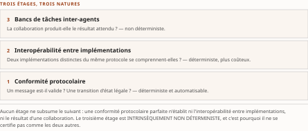

# Chapitre 9 — Découverte, registres, portabilité et pile protocolaire

*Livre I — Coopérer : fondements de l'interopérabilité et couche protocolaire agentique.
Second mouvement — la couche protocolaire agentique (ch. 7-11).*

| Champ | Valeur |
|---|---|
| **Statut** | **Brouillon de rédaction, non publiable** — rédigée le 27 juillet 2026 sur instruction d'auteur, **portes G-1, G-2 et G-3 alors ouvertes**. ⚠ **Mise à jour du 28 juillet 2026** : **G-2, le volet Livre I de G-1 et désormais G-3 sont franchies** — le socle consolidé existe ([`socle-consolide.md`](../PRD/socle-consolide.md) v1.2, **159 entrées** `S-001`…`S-159` ; PRD v0.14) —, et les **remontées de cette pièce sont closes**. ⚠ **Le franchissement de G-3 ne rend pas cette pièce recevable, et c'est le point à ne pas lire trop vite** : *ses énoncés n'ont pas été ré-adossés au socle consolidé*, la résolution demeure celle du champ ci-dessous, en régime **[C]**, **aucun énoncé n'est central au sens de CA-IV-01**, et **CA-IV-13 reste insatisfaite** faute de relecteur distinct du rédacteur. *Une porte franchie n'est pas une pièce recevable ; c'est une condition qui cesse de manquer.* |
| **Date de gel** | **27 juillet 2026** — gel unique du compendium, **décision d'auteur D-1 prise** ce jour (registre : [`gel-2026-07-27.md`](../PRD/gel-2026-07-27.md)). ⚠ **Ce gel n'efface pas ceux des sources**, qui restent portés ci-dessous : il date la reprise de chaque fait périssable à sa source primaire, non la matière elle-même. Gel de source : **juin 2026** (Vol. I). ⚠ La **matrice de maturité** du § 9.2.5 est un **livrable daté** : son intérêt tient à ce qu'elle situe chaque protocole à une date, et elle **se périme en bloc** — c'est un instantané, non un classement durable |
| **Socle mobilisé** | **Aucune entrée du socle consolidé** — ⚠ *non plus parce qu'il n'existe pas, mais parce qu'aucune de ses entrées ne couvre le périmètre de cette pièce* : balayage exhaustif des **dix-sept entrées héritées du Vol. I** (`S-143`…`S-159`, socle v1.2, 28 juillet 2026), **zéro** ne porte les §3.4, §3.5, §3.7-3.8 ni §3.12. Résolution contre le **Vol. I *Monographie* §3.4, §3.5, §3.7-3.8 et §3.12**, en régime **[C]** (PRD §7.1). **Aucun énoncé n'est central au sens de CA-IV-01** |
| **Garde-fous balayés** | ⚠ **Règle de décompte, et les cardinaux ci-dessous ont été re-mesurés sous elle le 28 juillet 2026** : un décompte d'occurrences porte sur le **marqueur littéral de l'identifiant** dans le **corps** de la pièce — en-tête et note de statut exclus —, et il se re-mesure au commit ; un garde-fou appliqué **sans identifiant écrit** se déclare par son **domaine balayé, sans cardinal**. Vol. II — **R-1 : une occurrence**, § 9.2.1 ; **R-8 : une occurrence**, § 9.2.1, le sigle toujours qualifié à ses emplois, le siège de l'encadré restant au **ch. 7 § 7.5** ; **réserve F-01 : une occurrence**, § 9.5.2 ; **métriques auto-déclarées (PRD Vol. II §8.2, règle 1) — sans identifiant écrit, donc sans cardinal re-mesurable : appliqué au seul § 9.2.5**, la métrique attribuée à sa source. R-2 à R-7 : **zéro occurrence**. Vol. III — **R-02 : deux occurrences**, § 9.1.5 et § 9.4.4 ; **R-13 : une occurrence**, § 9.2.1, même que R-8 ; **R-14 : quatre occurrences** — § 9.1.1, § 9.3.4, § 9.4.4 et § 9.5.3 — ; ⚠ *la mention « le chapitre du Livre le plus dense en énoncés d'absence », que cet en-tête portait auparavant, est retirée : d'autres pièces du Livre en portent davantage, et **un cardinal mesuré sur le corps d'une AUTRE pièce n'est pas re-mesurable au commit de celle-ci*** ; ⚠ *le § 9.6, que cet en-tête portait auparavant, est la note de statut : hors domaine de comptage*. R-01, R-03 à R-12 : **zéro occurrence** |
| **Volumétrie cible** | ≈ 9 000 mots de corps (§ 9.1 à § 9.5). ☑ **Décompte publiable depuis le franchissement de G-2** (27 juillet 2026). **Réel : 6 037 mots** de corps, ⚠ **re-mesurés au commit du 30 juillet 2026** (décision 16b — *le chiffre antérieur datait de la contre-passe du 28 juillet, et la passe de révision l'a périmé*) par [`PRD/decompte.sh`](../PRD/decompte.sh), seule autorité de décompte du volume — **-32,9 %** de la cible ⚠ **Ce réel est re-mesuré au commit du 30 juillet 2026** (décision 16b) : *toute date de mesure antérieure citée dans ce champ décrit une passe précédente, et la passe de révision D-11 l'a périmée.*. ⚠ **Le chiffre a bougé DEUX fois le même jour, et la seconde parce que la première passe avait laissé des défauts** : **+168 mots** d'abord — attributions rétablies, renvois corrigés, déviation d'intitulés déclarée —, puis **+124** — thèse du ch. 2 restituée par copie, regroupements du tableau 9.3 déclarés, deux identifiants nommés par leur volume. *Un cardinal se re-mesure après tout ajout ; il se re-mesure aussi après la passe qui atteste l'avoir re-mesuré.* ⚠ **L'écart individuel ne se lit pas seul** : la somme des onze cibles dérivées atteint **93 000 mots** pour une enveloppe de Livre de **65 000** — chaque pièce a dérivé sa cible de l'enveloppe sans que personne n'additionne les dérivations. *C'est la cible dérivée qui était fausse, non la pièce qui est courte ; un écart se documente, il ne se corrige ni par amputation ni par gonflement.* ⚠ **Le total du Livre n'est PAS repris ici, et l'abstention est le geste juste** : *une passe qui court en parallèle sur les dix autres pièces ne peut pas en mesurer la somme* — il valait **64 750 mots** au 28 juillet 2026 et **se re-mesure au terme des passes**, au [`README.md` du Livre](README.md) |

> **Thèse** *(citée depuis le [`TOC.md`](../PRD/TOC.md) v0.23, entrée du chapitre 9 — **forme inchangée au TOC v0.30**, re-collationnée mot à mot le 28 juillet 2026 ; décisions 14 et 17)* — la découverte et le nommage des agents, et la portabilité inter-modèles/inter-cadriciels, sont les propriétés que l'étagement de la pile protocolaire rend possibles — ou trahit.

---

## § 9.1 — Découverte, registres et nommage des agents et des outils

> **Versant protocolaire seul.** ⚠ Le **Vol. I *Monographie* §3.4** est **partagé déclaré** avec le **ch. 15**
> (Livre II), qui en prend le **versant identité et conformité** — les registres *gouvernés*. Ce qui
> suit est un **pont, pas une reprise** : le ch. 15 ne reconstruira pas ce chapitre, et ce chapitre
> ne préempte pas le sien.

La pile décrite jusqu'ici suppose résolu un problème qu'elle **ne traite pourtant pas de front** :
avant qu'un agent puisse appeler un outil ou déléguer une tâche, il doit d'abord **savoir que cet
outil ou ce pair existe**, **juger qu'il convient** à la tâche du moment, puis **obtenir une adresse**
pour l'atteindre.

⚠ **La proposition organisatrice de cette section mérite d'être posée d'emblée, parce qu'elle
contredit une lecture naturelle.** La vraie nouveauté agentique **ne tient pas à la découverte prise
isolément** — l'intégration d'entreprise la pratique depuis longtemps (ch. 1 § 1.4.3) — mais au
**couplage indissociable de la découverte, de l'identité et de la confiance**. *Trouver un agent ne
sert à rien si l'on ne peut établir qui il est ni se fier à ce qu'il prétend offrir.* Ce triptyque
reformule l'invariant du Livre à l'échelle d'un **réseau ouvert d'acteurs auto-descriptifs**.

### 9.1.1 La leçon d'UDDI : une récurrence en trois temps

L'écosystème agentique **rejoue un cycle déjà observé**, et le ch. 1 § 1.3.1 en avait posé le
**premier temps**.

Au début des années 2000, l'architecture des services web reposait sur trois piliers que le
ch. 1 § 1.3.1 nomme un à un : une enveloppe de messagerie, un langage de description d'interfaces, et
un **annuaire universel et public** — l'**UDDI** — chargé de recenser les services. ⚠ **Cet annuaire
a échoué relativement**, et le diagnostic est précis : trop ambitieux dans sa portée mondiale, il
supposait une découverte **au temps de conception** — un développeur consulte le registre, choisit un
service, code l'intégration — là où le besoin réel d'appariement **à l'exécution** restait marginal.
Les grands annuaires publics ont fermé.

**La leçon n'est pas que les registres sont inutiles**, et c'est le contresens le plus fréquent. Elle
est que **la curation et la fédération l'emportent sur le tout-dynamique et la centralisation**.
**Deuxième temps** : le pendule est revenu, par les registres d'API d'entreprise, vers des catalogues
**gouvernés et de portée maîtrisée**.

**Troisième temps** — le passage aux registres d'agents prolonge cette récurrence, et les premières
taxonomies des solutions — centralisées, d'entreprise, distribuées — **retrouvent le même
arbitrage**. Deux propositions en découlent et structurent la suite :

1. **la découverte sous curation surpasse le tout-dynamique** ;
2. **la fédération surpasse la centralisation**.

*L'enjeu agentique n'est donc pas de réinventer l'annuaire, mais d'éviter de répéter l'erreur d'UDDI
tout en ajoutant ce que les services web n'avaient pas : un appariement sémantique à l'exécution et
une couche de confiance native.*

⚠ Que ces deux propositions valent au-delà du cas historique dont elles sont tirées n'est pas
établi : elles sont **inférées d'une récurrence observée**, non démontrées. C'est, au sens de R-14 du
Vol. III, une **absence de documentation** sur leur généralité.

### 9.1.2 Trois moments qu'il ne faut pas confondre

La découverte agentique se décompose en **trois moments distincts** :

| Moment | Question | Nature |
| --- | --- | --- |
| **Découverte** | *qui existe ?* | énumérer les agents et outils accessibles dans un périmètre |
| **Sélection** | *qui convient à **cette** tâche ?* | choisir parmi les candidats celui dont les capacités répondent à l'intention |
| **Résolution** | *où et comment l'atteindre ?* | obtenir adresse, transport et paramètres de connexion |

: Tableau 9.1 — Les trois moments de la découverte agentique, que le monde des services web réduisait à un seul.

Dans le monde des services web, ces trois moments **se réduisaient pour l'essentiel à une recherche
d'adresse exacte au temps de conception**.

⚠ **La spécificité agentique tient à ce que les capacités sont décrites en langage naturel assorti de
schémas, et que la sélection devient un appariement sémantique — non une résolution exacte.** Un agent
client formule un besoin **en intention, pas en signature de méthode** ; le système doit donc
rapprocher une *description de tâche* d'une *description de capacité* — opération **intrinsèquement
probabiliste et lue par le modèle à l'inférence**.

Ce déplacement explique pourquoi **le deuxième moment concentre la difficulté** : il recoupe
directement l'interopérabilité sémantique du § 9.4, et **ne peut, en l'état des protocoles, s'appuyer
sur aucune garantie déterministe d'adéquation**.

### 9.1.3 Auto-description et catalogues fédérés

Le premier moment s'appuie sur des **artefacts d'auto-description** publiés par chaque acteur et
agrégés en **catalogues fédérés**.

Côté agent-agent, la **carte d'agent** est exposée à un emplacement **bien connu**, de sorte que tout
client peut récupérer la description d'un agent **à partir de son seul domaine** (ch. 8 § 8.4.2). Côté
schématisation des capacités, un **cadre de schéma ouvert** propose un format normalisé pour décrire
ce qu'un agent sait faire. Côté agent-outil, un **registre** fournit un catalogue assorti d'une
interface décrite formellement, selon un **modèle fédéré plutôt que centralisé**, un nommage en
domaine inversé, et **plusieurs voies de vérification de propriété**.

> **Mise en œuvre.** ⚠ **Distinguer un *registre* d'une *place de marché* est opérationnel, non
> rhétorique.** Le registre sert la **découverte technique** — résoudre un nom vers une description et
> une adresse **vérifiables** ; la place de marché sert la **distribution commerciale** — vitrine,
> monétisation, curation éditoriale (§ 9.1.5). Et *un catalogue est lui-même un contrat*, soumis à
> versionnage et dépréciation **comme les protocoles qu'il indexe** : l'invariant du Livre s'applique
> au registre autant qu'à l'outil qu'il décrit.

### 9.1.4 Annuaires, services de noms et registres d'identité

Au-delà du catalogue, une couche d'**annuaires et de services de noms** vise à résoudre un
**identifiant stable** d'agent vers une **identité vérifiable** et une **adresse courante** — fonction
analogue à celle du système de noms de domaine, **mais adossée à une preuve cryptographique**.

Trois familles d'initiatives coexistent : un **annuaire fédéré centré sur les capacités**, à adressage
par contenu, signature de provenance et distribution par table de hachage ; un **service de noms**
proposant une résolution analogue au système de noms de domaine doublée d'une infrastructure à clés
publiques, dont une seconde version est ancrée au domaine ; et un **groupe communautaire de
normalisation** cherchant à coordonner les efforts épars autour d'**attestations vérifiables liant un
agent à son organisation**.

> **Perspective recherche.** ⚠ **Le verrou conceptuel commun à ces initiatives est de distinguer
> trois objets que le système de noms de domaine confond** : l'**identifiant stable** — qui désigne
> durablement l'agent —, l'**adresse** — où le joindre, **mutable** — et la **capacité** — ce qu'il
> sait faire, **versionnée**. Des travaux poussent cette séparation jusqu'à une couche de **faits
> attestés** au-delà du système de noms, tandis que des explorations natives testent **l'hypothèse
> inverse** : réutiliser l'infrastructure existante. *Un service de noms n'est fiable que si l'identité
> résolue est elle-même attestée* — et c'est le ch. 15 qui en traite le versant gouverné.

### 9.1.5 Places de marché, gouvernance et modes d'échec des registres

Par-dessus la couche technique se greffe une **couche commerciale**, où coexistent jardins clos
propriétaires et standards ouverts. Cette couche pose des exigences que la simple résolution n'impose
pas : **vérification de propriété, signatures et provenance, mécanismes de révocation**.

⚠ **Or l'introduction d'un registre crée des modes d'échec qui lui sont propres**, distincts de ceux
d'un agent isolé :

- une **carte d'agent ou une description d'outil peut mentir** sur ses capacités réelles ;
- le nommage ouvre la porte au **typosquattage** et à l'**appropriation d'espaces de noms** ;
- le **registre lui-même peut être empoisonné**, et la résolution **diriger un client vers un
  imposteur** ;
- la **dépendance à un registre central recrée le point unique de défaillance** que l'échec d'UDDI
  illustrait au § 9.1.1 — et que la fédération vise précisément à éviter.

> **Mise en œuvre.** La parade tient à **l'attestation à chaque étage** plutôt qu'à la confiance dans
> un opérateur unique : provenance cryptographique et adressage par contenu contre la carte mensongère
> et le squattage ; **révocation coordonnée** et signature des descriptions contre la résolution vers
> imposteur. ⚠ **Qualification, au sens de R-02 du Vol. III** : une signature de provenance **démontre**
> qu'un artefact provient de la clé déclarée et n'a pas été altéré ; elle **ne démontre pas** que la
> description est exacte, ni que l'outil se comporte comme elle l'annonce. *Signer une carte
> mensongère produit une carte mensongère authentifiée.*

La gouvernance d'une place de marché — curation, examen, retrait — relève de **l'interopérabilité
organisationnelle, non du seul protocole** : c'est un contrat de confiance entre opérateur,
fournisseur et consommateur.

---

## § 9.2 — La pile de protocoles agentiques et son étagement

### 9.2.1 Pourquoi une « pile » : du protocole isolé au modèle en couches

L'écosystème **n'a pas émergé comme un protocole unique** mais comme une **famille de spécifications
apparues en moins de deux ans**.

⚠ **L'observation structurante est que ces spécifications n'occupent pas le même emplacement
fonctionnel** : le protocole agent-outil régit le contrat **vertical**, le protocole agent-agent le
contrat **horizontal**, les protocoles de règlement la **couche économique**. *Elles s'étagent
davantage qu'elles ne se concurrencent.*

Cette lecture doit toutefois être nuancée par un fait établi au ch. 8 § 8.6.3 : **la frontière entre
les deux axes principaux reste floue**, les tâches asynchrones de l'un empiétant sur le terrain de la
délégation de l'autre.

⚠ **Deux registres se distinguent, et les confondre est la faute de cette section.** La pile
**descriptive**, *de facto*, retenue ici **parce qu'elle décrit ce que les architectes assemblent
effectivement** ; et les propositions **normatives**, qui prétendent **prescrire** un ordonnancement
strict des couches. C'est la première qui structure la suite.

⚠ Parmi les spécifications de cette famille figure l'**ACP protocolaire**, dont le ch. 8 § 8.5.1 a
établi qu'il **a fusionné** et **n'est pas un standard vivant** (R-1 du Vol. II). Il figure à la
généalogie de la pile, **jamais à son état courant** — et son sigle, comme les trois autres branches
de la collision, n'est **jamais employé nu** (R-8 du Vol. II, R-13 du Vol. III ; siège de l'encadré
au ch. 7 § 7.5).

### 9.2.2 L'analogie en couches et ses limites

La métaphore d'une pile en couches **s'est imposée comme outil pédagogique**, et plusieurs travaux la
formalisent en modèles explicites.

⚠ **Le décompte de couches diffère d'une proposition à l'autre, ce qui suffit à signaler qu'aucune
n'a été adoptée comme référence** : ces modèles restent des **contributions académiques
concurrentes**, et les citer comme un cadre canonique serait une faute de statut.

L'analogie capture utilement l'idée d'**emplacements fonctionnels distincts** et d'**encapsulation**,
mais elle **masque trois traits propres au domaine** :

1. **la négociation dynamique de capacités à l'exécution n'a pas d'équivalent** dans le modèle
   d'origine, où les couches sont fixées à la conception — l'alternative décentralisée du
   ch. 8 § 8.5.2 en fait pourtant une primitive ;
2. **les dépendances inter-couches ne sont pas strictes** — un agent peut combiner les deux axes
   **sans hiérarchie imposée** ;
3. **le contenu transporté n'est pas un format binaire mais des intentions sémantiques**, dont
   l'interprétation **déborde toute couche de transport**.

> **Perspective recherche.** Ces propositions illustrent une **tension méthodologique** : transposer
> un modèle conçu pour des **canaux déterministes** à des **acteurs probabilistes et
> auto-descriptifs**. La grille d'analyse en trois plans de **Yuan et coll. (2026)** — celle que
> mobilise le § 9.4.1 — suggère pourquoi **aucune ne fait consensus** : une pile en couches modélise
> bien le transport et la syntaxe, mais **le niveau
> sémantique-pragmatique résiste à la stratification**, car *l'alignement d'intentions traverse
> l'ensemble de la pile plutôt que d'y occuper une couche*.

### 9.2.3 Les couches transversales : positionnement par renvoi

Cette sous-section **ne réintroduit aucun protocole déjà traité** ; elle se borne à les **positionner
les uns par rapport aux autres**. C'est un choix délibéré contre le catalogue redondant, et il est
conforme à la doctrine de la somme : *une notion posée une fois se cite, elle ne se répète pas.*

Quatre strates fonctionnelles structurent la pile descriptive :

| Strate | Ce qu'elle couvre | Où elle est traitée |
| --- | --- | --- |
| **Transport et session** | trajectoire vers le découplage, liaisons multiples | ch. 8 § 8.1.3 |
| **Découverte et capacités** | trouver, sélectionner, résoudre | § 9.1 |
| **Sémantique et orchestration** | l'écart entre accord de protocole et compréhension | § 9.4 |
| **Identité et confiance** | ⚠ **transversale** — ne s'empile pas, **traverse tout** | ch. 3, Livre II |

: Tableau 9.2 — Quatre strates, dont une seule n'est pas empilable.

⚠ **La strate d'identité est résolument transversale, et ce fait est décisif** : elle **ne s'empile
pas au-dessus des autres mais les traverse toutes**, puisque **chaque arête du graphe d'interaction** —
appel d'outil, délégation de tâche, traversée de frontière organisationnelle — **requiert
authentification, autorisation et provenance**. *Ce caractère non stratifiable de l'identité est
précisément l'une des limites de l'analogie relevée au § 9.2.2* — et la raison pour laquelle le
Livre II est un livre entier plutôt qu'une couche.

### 9.2.4 Composition : des protocoles simultanés, non alternatifs

⚠ **Le point décisif, souvent mécompris lorsqu'on présente ces protocoles comme rivaux, est qu'ils
sont *simultanés* et non *alternatifs*.**

Un scénario de référence le rend tangible. Un agent assistant traitant une demande utilisateur
invoque, **dans une même session** : le protocole **agent-outil** pour accéder à ses outils et
ressources ; le protocole **agent-agent** pour déléguer un sous-objectif à un agent spécialisé d'un
autre fournisseur ; une **couche d'interface** pour solliciter une validation ou un complément
d'information de l'humain ; puis, si la tâche aboutit à un achat, une **couche de règlement** pour
autoriser et exécuter le paiement (ch. 10).

La **configuration de référence** observable en production **à juin 2026, gel de la source**, combine
d'abord **les deux axes principaux** : c'est le **socle minimal** d'un système agentique
interopérable franchissant les frontières de cadriciel et d'organisation. Les couches agent-humain et
règlement **s'ajoutent selon le besoin applicatif**.

Cet emboîtement **matérialise l'invariant** : chaque couche est un **contrat distinct**, ce qui
**découple** les préoccupations — *un changement de moyen de paiement n'affecte pas le contrat
agent-outil* — et permet une **évolution indépendante des strates**.

⚠ Le flou entre les deux axes principaux rappelle toutefois que **l'emboîtement n'est pas étanche** :
la composition réelle relève d'un **choix d'ingénierie**, non d'une prescription protocolaire.

### 9.2.5 Matrice de maturité et de décision

> **Mise en œuvre.** ⚠ **Ce tableau est un instantané daté, et c'est sa valeur comme sa limite.**
> Repris du **Vol. I *Monographie* §3.7.5**, à l'état de **juin 2026**, il croise, pour chacun des
> protocoles retenus, l'axe couvert, le statut de maturité, la gouvernance et la recommandation
> d'usage. **Les statuts reprennent strictement les qualifications des sections amont** : *ce qui est
> marqué candidat ou expérimental ne doit pas être déployé comme acquis.* ⚠ **Sept lignes ici pour
> les neuf de la source, et l'écart tient à DEUX REGROUPEMENTS, non à un retrait** : la couche
> commerciale y tient **une ligne pour deux spécifications** — son développement est au ch. 10 —, et
> la couche agent-humain **une ligne pour deux** également, d'où sa gouvernance à deux termes ; cette
> dernière **retient le statut le plus prudent des deux**, l'une des spécifications réunies étant
> expérimentale et l'autre seulement émergente. *Aucune ligne de la source n'est omise ; deux paires
> sont réunies.*

| Protocole | Axe | Statut | Gouvernance | Usage recommandé |
| --- | --- | --- | --- | --- |
| **Agent-outil** | vertical | production ; révision stable, **candidate à venir** | fondation dédiée | socle pour exposer outils et ressources ; adopter la **révision datée stable**, traiter le cœur sans état comme **cible** |
| **Agent-agent** | horizontal | production ; version 1.0 stable, écosystème large | fondation faîtière | standard de fait pour la délégation ; **combiner** avec le précédent |
| **Décentralisé** | horizontal + identité | **émergent** ; conditionné à la maturité de son socle d'identité | communauté et groupe de normalisation | topologies pair-à-pair et négociation de méta-protocole ; **horizon ≈ 2027** |
| **Règlement (mandat)** | économique | **émergent** ; version préliminaire | ⚠ **fondation distincte** du reste de la pile | couche de mandat vérifiable ; suivre la trajectoire (ch. 10) |
| **Règlement (machine-natif)** | économique | émergent **à traction réelle** | fondation dédiée | micropaiements ; **la plus forte traction de production** de sa couche |
| **Commerce (paiement)** | commercial | émergent ; spécification **mouvante** | consortium d'éditeurs | achat agentique ; **à suivre par révision datée** |
| **Interface agent-humain** | agent-humain | **expérimental** | fondation dédiée / communauté | validation et interfaces riches ; **hors production critique** |

: Tableau 9.3 — Matrice de maturité et de décision, à juin 2026, gel du Vol. I. Instantané, non classement durable.

⚠ **Métrique auto-déclarée, attribuée** : le jalon d'adoption du protocole agent-agent — **plus de
150 organisations de soutien, au 9 avril 2026** — est **rapporté par la Linux Foundation**, qui gère
le protocole ; la réserve du ch. 7 § 7.6 s'applique — *soutien n'est pas production*.

**La logique de décision se résume ainsi.** Pour un système interopérable de production, **les deux
axes principaux constituent le socle minimal** ; la couche agent-humain s'ajoute dès qu'un point de
validation ou une interface riche est requis ; la couche de règlement n'intervient que pour les cas
commerciaux et reste **le segment le moins stabilisé**, avec **une gouvernance distincte du reste de
la pile**. Les protocoles marqués émergents appellent **une veille active plutôt qu'un engagement
architectural irréversible**.

---

## § 9.3 — Portabilité inter-modèles et inter-cadriciels

La portabilité est une **dimension d'interopérabilité distincte** de celles examinées jusqu'ici. Là
où les sections précédentes traitent de la capacité de systèmes hétérogènes à **dialoguer**, celle-ci
traite de la capacité d'une application à **changer de modèle sous-jacent ou de cadriciel d'exécution
sans réécriture** — c'est-à-dire de la lutte contre la **dépendance captive**.

### 9.3.1 Le standard de fait et le paradoxe du verrouillage inverse

L'interface **Chat Completions d'OpenAI** — le point de terminaison `/v1/chat/completions` et le
schéma de message qu'il impose — **s'est imposée comme norme de fait, sans qu'aucun organisme de
normalisation ne l'ait spécifiée**. Sa diffusion procède de **l'adoption en masse plutôt que d'un
processus délibératif** : les serveurs d'inférence ouverts et les passerelles tierces l'émulent
**précisément parce qu'elle est le format que la plupart des outils savent déjà parler**.

⚠ **Le nommer est une condition de la démonstration qui suit, et non un détail d'exposition.** Le
paradoxe du verrouillage inverse porte sur *une grammaire d'échange identifiable, gouvernée par un
éditeur nommé* ; énoncé sur un standard anonyme, il serait invérifiable — *une démonstration sans
témoin*. ⚠ **Et le fait est daté** : l'énoncé décrit l'état du 30 juillet 2026, où cette interface
est encore le pivot d'émulation de l'écosystème, alors même que son éditeur en pousse la relève
(§ 9.3.2).

On retrouve ici la distinction classique entre standard **de fait** et standard **de droit** — *la
conformité n'est pas certifiée mais constatée à l'usage*. Le **ch. 15 § 15.2.3** en est le domicile
dans la somme, et le **ch. 3 § 3.4.4** en tient l'autre versant : la certification tierce, qui
convertit une compatibilité **espérée** en compatibilité **attestée**. Ce chapitre y renvoie et **ne
les reconstruit pas**.

⚠ **Le paradoxe propre à ce cas tient à un double mouvement de couplage, et il mérite d'être suivi
pas à pas.** D'un côté, l'interface **découple** l'application du fournisseur : un client écrit pour
elle peut, en principe, **pointer vers un autre fournisseur compatible sans modifier son code**. De
l'autre, **cette même portabilité instaure un verrouillage inverse** — non plus à un fournisseur mais
à un **schéma** : l'écosystème entier se conforme à la forme de ce contrat, et **toute capacité qui
s'en écarte devient, par construction, non portable**.

*Le découplage à l'égard du fournisseur se paie donc d'un couplage à l'égard d'une grammaire
d'échange que personne ne gouverne formellement et dont l'évolution échappe à tout contrat public.*
Le ch. 1 § 1.3 le posait déjà, sur les architectures d'intégration : le couplage ne disparaît pas, il
se déplace.

### 9.3.2 Fragmentation des formats et passerelles de médiation

> **Mise en œuvre.** Trois familles de contrats coexistent, et il faut les nommer pour que
> l'arbitrage soit reproductible. **Chat Completions** (OpenAI) est la plus portable et **sans
> état** : c'est le format que les passerelles émulent. La **Responses API** du même éditeur unifie
> derrière une interface unique des **primitives agentiques et un état serveur** ; elle **remplace
> l'Assistants API**, dont OpenAI a annoncé la dépréciation le **26 août 2025** et fixé le retrait
> au **26 août 2026** — ⚠ *soit moins d'un mois après la date d'arrêt de cet ouvrage.* ⚠ **Cette
> échéance n'est PAS au tableau 50.1, et l'écart se déclare plutôt qu'il ne se comble** : le tableau
> porte **onze** événements, cardinal contrôlé et cité à trois endroits de la somme, et *y ajouter une
> rangée depuis une pièce du Livre I serait le geste qu'un rédacteur ne fait jamais — il remonte.*
> **Remontée ouverte**, à l'instance d'arbitrage : *un retrait d'interface daté, public et situé à
> vingt-sept jours de la date d'arrêt satisfait-il le critère du PROGRAMMÉ du § 49.0 ?* Chez
> **Anthropic**, l'API **Messages**
> est le format **sans état** de référence, souvent émulé lui aussi. ⚠ **La fragmentation n'est pas
> tant dans le tronc commun que dans les capacités avancées** — appel d'outils, sorties structurées,
> gestion d'état serveur — **qui divergent d'un fournisseur à l'autre et brisent la substituabilité**.

La réponse de l'industrie est une **couche d'adaptation** qui normalise ces formats derrière une
interface unique : bibliothèques et mandataires traduisant **plus d'une centaine** d'interfaces,
plans de contrôle multi-fournisseurs, routage et repli.

⚠ **Ces passerelles instancient des patrons déjà catalogués au ch. 1** : le traducteur de message, le
modèle de données canonique, la passerelle d'API (ch. 1 § 1.6.1 et § 1.4.3). *Le domaine agentique
réemploie ici son propre passé sans toujours le savoir.*

⚠ **La limite est structurelle et non conjoncturelle : la médiation converge vers le plus petit
dénominateur commun**, c'est-à-dire les fonctions que **tous** les fournisseurs partagent. Les
capacités propres à un modèle **restent inaccessibles ou doivent être traversées par des extensions
non portables** — *rouvrant la dépendance que la passerelle prétendait fermer*. C'est exactement le
piège du modèle canonique que le ch. 1 § 1.6.1 décrivait : un pivot négligé dégénère en dénominateur
appauvri.

### 9.3.3 Interopérabilité des cadriciels par protocoles partagés

⚠ **L'interopérabilité entre cadriciels d'orchestration ne s'obtient pas, à juin 2026, par une norme
d'agent unique qui les coifferait tous, mais par l'adoption commune de protocoles transversaux.**
⚠ *C'est un constat d'état daté, non une impossibilité de principe* — et il vaut d'être opposé à
l'intuition inverse.

Dès lors qu'un cadriciel parle ces protocoles, il devient **capable de consommer les outils et de
déléguer les tâches d'un autre**, indépendamment de son modèle interne d'agent. **La couverture
demeure inégale** : certains environnements annoncent une prise en charge native des deux axes,
d'autres les couvrent à des degrés variables.

La conséquence d'architecture est nette et conforme à l'invariant : **le cadriciel devient un détail
d'implémentation derrière un contrat protocolaire stable**.

> **Perspective recherche.** Cette convergence **par protocoles partagés plutôt que par standard
> d'agent unique** répond à un besoin qu'une prise de position érige en programme :
> l'interopérabilité **inter-écosystèmes** reste un chantier ouvert **que l'adoption de protocoles
> communs amorce sans le clore**. Des propositions de couche d'échange neutre entre agents hétérogènes
> explorent le même principe de découplage par médiation.

### 9.3.4 Portabilité de la configuration et de la définition d'agent

⚠ **La portabilité du contrat d'invocation ne suffit pas : encore faut-il pouvoir transporter la
définition d'un agent** — ses instructions, ses conventions de projet, sa configuration.

Un **manifeste en texte structuré, indépendant de l'outil**, propose à cet effet un format dont
l'adoption inter-environnements en a fait une convention largement reprise — c'est celui que le
ch. 5 § 5.1.4 décrivait comme **mémoire procédurale et spécification d'agent à la fois**. D'autres
approches visent une **définition de plus haut niveau**, neutre vis-à-vis du modèle.

⚠ **La portabilité des invites, en revanche, demeure fragile** : une invite optimisée pour un modèle
**se dégrade lors d'un transfert vers un autre** — effondrement de format, perte de structure —,
problème que des travaux de transfert inter-modèles tentent de circonscrire.

⚠ **Et ce qui manque est plus profond que ce qui existe.** Il **n'existe pas de format d'agent
portable et neutre** comparable à ce que les notations de processus ont été pour les processus
métier (ch. 1 § 1.6.2), **ni de portabilité de l'état et de l'exécution durable**, l'un comme l'autre
restant liés à l'environnement d'origine.

*La définition voyage ; l'exécution, elle, reste captive.* ⚠ Que ce format n'existe pas relève d'une
**absence de documentation** au sens de R-14 : le socle n'en recense aucun, ce qui n'établit pas
qu'aucune initiative n'y travaille.

### 9.3.5 Neutralité par fondation : un mécanisme anti-fragmentation, et ses deux limites

Le dernier levier contre la fragmentation est **organisationnel plutôt que technique**. Une fondation
dédiée offre un **foyer neutre** où des artefacts d'**origines concurrentes** sont placés sous
gouvernance commune, transposant à l'agentique le rôle qu'ont joué les organismes de normalisation
pour l'interopérabilité classique (ch. 3 § 3.4.4) : **neutraliser l'incitation d'un acteur dominant à
verrouiller l'écosystème à son avantage**.

⚠ **Deux nuances s'imposent, et elles sont le contrepoids de cette section.**

**Première : le modèle n'est pas monolithique.** La couche de paiement et d'identité commerciale **ne
converge pas vers la même fondation** que le reste de la pile, mais vers une fondation
d'authentification (ch. 10 § 10.1). *La pluralité des fondations neutres est une donnée structurelle,
non un accident de transition.*

**Seconde, et surtout : la neutralité de gouvernance n'équivaut pas à l'interopérabilité technique
acquise.** Qu'un standard soit hébergé par une fondation indépendante garantit **la maîtrise partagée
de son évolution** — *non que deux implémentations conformes se comprendront effectivement*. C'est
exactement la distinction que le § 9.5 reprend, et elle est le pendant, au plan institutionnel, de la
restriction que porte la thèse du ch. 7 — *condition nécessaire et **non suffisante*** : la fondation
règle le problème de la propriété du contrat ; elle ne dispense pas d'en éprouver l'exécution.

---

## § 9.4 — Interopérabilité sémantique des agents : de l'accord de protocole à la compréhension

Les sections précédentes ont montré que les protocoles **stabilisent rapidement le transport et la
syntaxe**, mais laissent ouverte la question décisive : **deux agents qui échangent des messages
valides partagent-ils la même interprétation de ce qu'ils s'échangent ?**

C'est ici que se referme la thèse du ch. 2, reprise **par copie** : « l'interopérabilité sémantique —
accord sur le sens, pas seulement sur le format — est le niveau que les protocoles agentiques
**présupposent** et que **peu savent établir** ». Et c'est ici que s'en mesure le prix.
⚠ *La forme est celle du ch. 2, reprise sans retrait* — l'apposition qui borne la notion en fait
partie : « peu savent établir » affirme moins que « ne fournissent pas », et c'est la forme bornée
qui prime.

### 9.4.1 L'écart entre accord de protocole et compréhension

⚠ **Un agent peut respecter scrupuleusement un protocole — émettre des messages bien formés, honorer
le cycle de vie des tâches, signer sa carte — sans interpréter de la même manière que son
interlocuteur l'intention véhiculée.** *L'accord sur le protocole garantit que les octets transitent
et se décodent ; il ne garantit pas que le sens transite.*

La grille d'analyse à trois plans de **Yuan et coll. (2026)** — communication, syntaxique,
sémantique —, appliquée à **dix-huit protocoles**, établit ce diagnostic : les protocoles dominants
atteignent **une bonne maturité aux plans de la communication et de la syntaxe**, mais demeurent
**pauvres en mécanismes de clarification, d'alignement et de vérification du sens**, lesquels sont
**repoussés vers la couche applicative**.

⚠ **Ce diagnostic recoupe la filiation du ch. 7 § 7.2.1 : le problème n'est pas neuf, il ressurgit
sous une forme déplacée.** Le socle théorique de la compréhension partagée est **ancien et robuste** —
principe coopératif et maximes conversationnelles, terrain commun construit par étapes successives,
théorie de la pertinence posant que l'interprétation mobilise des **inférences contextuelles au-delà
du contenu littéral**.

*Ces cadres rappellent que comprendre n'est jamais purement syntaxique : c'est inférer une intention
en contexte, ce qu'aucune poignée de main protocolaire ne réalise à elle seule.*

### 9.4.2 La sémantique lue par le modèle et l'écart description/comportement

Dans la pile agentique, **la description d'un outil est, pour l'essentiel, du texte libre en langage
naturel**, lu par le modèle à l'inférence pour décider s'il convoque cet outil et avec quels
arguments.

⚠ **Cette sémantique lue par le modèle se distingue radicalement de celle d'un contrat d'API** (ch. 1
§ 1.4.2) : le schéma **type formellement la forme** des paramètres et de la sortie, mais **c'est la
prose descriptive — non vérifiable et non contraignante — qui porte le sens de l'opération et son
effet réel**.

Il en résulte un **écart de sémantique** entre ce que la description annonce et ce que le code exécute
effectivement : *rien n'oblige le comportement à se conformer à la promesse textuelle.* Les sorties
structurées et les schémas plus expressifs (ch. 8 § 8.2.3) **resserrent la garantie sur la forme des
résultats, mais ne comblent pas l'écart sur le sens de l'action**.

Les implications sont **doubles**, et la seconde est la plus grave :

1. un **défaut de description bénin** produit un **mauvais choix d'outil** — le modèle convoque la
   mauvaise capacité parce que la prose ne reflète pas le comportement ;
2. **cette surface est exploitable** : une description peut être rédigée **pour induire le modèle en
   erreur** — empoisonnement de description, traité au ch. 11.

*La description devient ainsi à la fois le contrat d'interopérabilité de l'outil et son point de
vulnérabilité.*

### 9.4.3 Ontologies de capacités et ancrage

Pour dépasser la prose libre, **deux familles de solutions s'opposent** — et le ch. 2 § 2.3 en a posé
le socle pré-agentique.

La première, **symbolique et formelle**, hérite des langages d'agents et des ontologies lourdes :
**expressives et vérifiables**, mais **rigides et coûteuses à maintenir**, et dont l'échec d'adoption
a marqué la lignée historique. La seconde s'en remet à des **descriptions légères en langage
naturel** : souples, **sans garantie de sens partagé**.

Une **convergence par l'ontologie** est venue rééquilibrer ce compromis : des cadres structurant
agents, compétences, intentions, contextes, politiques et résultats ; un effort de standardisation
d'une couche sémantique partagée entre analytique et IA ; un cadre de schéma relié à la découverte
(§ 9.1.3). **L'ancrage** consiste alors à associer une intention exprimée à des **classes explicites**
et à produire une **spécification de tâche vérifiable par machine** — pont vers les contrats
comportementaux du ch. 7 § 7.1.5.

⚠ **Le compromis demeure structurant, et aucune des deux voies ne le dissout** : *plus la
spécification est expressive et vérifiable, plus elle est coûteuse à produire et fragile à
l'évolution ; plus elle est légère, moins elle garantit l'accord de sens.*

> **Mise en œuvre.** Recommandation d'architecture : **réserver l'ancrage ontologique formel aux
> capacités critiques et inter-organisationnelles**, où le coût de spécification se justifie, et
> **tolérer les descriptions en langage naturel pour les outils internes à faible enjeu**. Une
> gradation de l'effort, cohérente avec la matrice du § 9.2.5.

### 9.4.4 Le modèle comme couche de médiation sémantique : une prise de position

Une voie alternative au modèle canonique formel du ch. 2 consiste à **confier la réconciliation
sémantique au modèle de langage lui-même** : plutôt que de définir *a priori* un schéma pivot,
demander au modèle d'**apparier dynamiquement** deux vocabulaires.

Ses avantages sont réels : **flexibilité, tolérance aux désalignements de surface, absence de modèle
canonique à maintenir**. ⚠ **Ses risques le sont tout autant, et ils sont de nature différente** :
**hallucination d'alignement** — le modèle « invente » une correspondance **plausible mais fausse** —,
**non-déterminisme de la médiation**, et **dette technique déplacée du schéma vers les invites**, plus
difficile à versionner et à auditer.

⚠ **La prise de position que défend le Vol. I *Monographie* §3.5.4 est la suivante — et elle se
reprend ici comme une position, jamais comme un fait : la médiation par modèle complète, mais ne
remplace pas, l'interopérabilité sémantique formelle.** *La souplesse probabiliste traite les cas que
la spécification formelle n'avait pas anticipés ; la spécification formelle, en retour, contraint et
vérifie les propositions du modèle.*

Cette **synthèse neuro-symbolique** — un raisonnement **contraint par l'ontologie** — est argumentée
par **Tuan et Sanyal (2026)**, dans une architecture où le raisonnement neuronal opère **sous la
contrainte d'une ontologie de domaine**. *C'est cette articulation, et non l'un ou l'autre pôle
isolé, qui répond au verrou tout en préservant le découplage : la couche formelle stabilise le
contrat, la couche neuronale absorbe l'évolution.*

⚠ **Qualification, au sens de R-02 du Vol. III, et rappel du ch. 2 § 2.4.1** : un appariement produit
par modèle **démontre une plausibilité lexicale** ; il **ne démontre pas une équivalence sémantique**.
Que la fiabilité de ces appariements n'ait pas de mesure établie hors bancs dédiés relève d'une
**absence de documentation** au sens de R-14.

> **Perspective recherche.** Le débat oppose **deux régimes de garantie** : la médiation purement
> neuronale **maximise le rappel au prix de la précision vérifiable** ; l'architecture contrainte par
> l'ontologie **borne l'espace des alignements admissibles**. **La question ouverte est celle de la
> mesure** : comment évaluer la fidélité d'un appariement autrement que sur des bancs dédiés, et
> **comment propager une garantie de correction à travers une chaîne de délégations probabilistes ?**
> Le ch. 49 la reprend.

### 9.4.5 Modes d'échec d'origine sémantique

Les dispositifs précédents délimitent **en creux** une famille d'échecs propres au plan sémantique,
**distincts des défaillances de transport ou de syntaxe** :

- **le faux accord sémantique** — deux agents convergent syntaxiquement sur une intention qu'ils
  interprètent différemment. ⚠ *La poignée de main réussit, le protocole valide les messages, et
  l'échec se manifeste en aval, dans le résultat de la tâche* — jamais au point d'échange ;
- **la dérive de vocabulaire entre versions** — une capacité change de sens d'une révision à l'autre
  **sans que le contrat formel ne le signale**, brisant le troisième terme de l'invariant ;
- **la description trompeuse ou empoisonnée** — prolongement direct du § 9.4.2, pont vers le ch. 11 ;
- **l'absence de vérification de postconditions** — *rien ne contrôle, après l'exécution, que l'effet
  obtenu correspond à l'intention initiale*.

⚠ **Ces modes ont une signature commune, et c'est elle qui les rend difficiles à outiller :
l'erreur transite en langage naturel, échappe donc aux contrôles de schéma, et se propage le long des
chaînes de délégation.** Le ch. 11 en donne la taxonomie unifiée.

---

## § 9.5 — Test de conformité et certification des protocoles

### 9.5.1 Définir « interopérable » de façon mesurable

Le ch. 3 § 3.4.3 a posé la distinction : **la conformité** atteste qu'une implémentation respecte une
spécification ; **l'interopérabilité** atteste que deux implémentations **échangent et utilisent
effectivement** ce qu'elles s'échangent.

⚠ **La couche agentique hérite de cette distinction mais en aggrave la portée**, parce que les
acteurs y sont **non déterministes** : *le succès d'un échange ne se réduit plus à la validité d'un
message, il s'évalue à la réussite d'une tâche déléguée.*

Définir « interopérable » de façon opérationnelle suppose donc de le **mesurer par des indicateurs
propres au régime agentique** : **taux de réussite de la tâche déléguée** et **fidélité du transfert
d'intention** d'un agent à l'autre — *et non le seul succès de la poignée de main*.

Le **Vol. I *Monographie* §3.12.1** en dégage une **pyramide d'évaluation à trois étages** :

| Étage | Ce qu'il mesure | Nature |
| --- | --- | --- |
| **Conformité protocolaire** | un message est-il valide ? une transition d'état légale ? | **déterministe et automatisable** |
| **Interopérabilité entre implémentations** | deux implémentations distinctes du même protocole se comprennent-elles ? | déterministe, plus coûteux |
| **Bancs de tâches inter-agents** | la collaboration produit-elle le résultat attendu ? | ⚠ **intrinsèquement non déterministe** |

: Tableau 9.4 — La pyramide d'évaluation de l'interopérabilité agentique : trois étages, aucun ne subsumant le suivant.

⚠ **Chaque étage couvre une fraction du problème sans subsumer le suivant** : *franchir la poignée de
main n'implique pas l'accord sémantique sur l'intention.*

### 9.5.2 Suites de conformité et test de la négociation

L'écosystème a produit un **outillage de conformité dédié**, qui **cible explicitement les révisions
datées** — organisation des vérifications par domaines, validation d'implémentations sur les
différents transports, outils d'inspection visuelle. Côté agent-agent, une trousse de compatibilité
couvre les liaisons de transport et **filtre les exigences selon leur force normative**, et la
validation de carte devient un point de contrôle propre depuis l'introduction des cartes signées.

⚠ **Rappel de la réserve portée par F-01 du Vol. II** — *nommer le volume n'est pas un ornement : le
socle du Vol. III porte un homonyme, qui traite de signature de carte, matière voisine de celle-ci*
(décision 7). Ces outils attestent qu'une implémentation **respecte une révision
datée**. Ils ne la déclarent pas sécurisée, et le ch. 11 traite ce qui leur échappe.

⚠ **Le test le plus spécifique à l'interopérabilité agentique porte sur la négociation** — de version
et de capacités —, où il s'agit de vérifier **la rétrocompatibilité et la dégradation gracieuse**
lorsque deux pairs n'annoncent pas le même jeu de fonctionnalités.

Cet enjeu **devient crucial** avec le cœur sans état et le cadre d'extensions de la révision candidate
du ch. 8 § 8.2.1 : *un client doit pouvoir interagir avec un serveur ignorant une extension sans
rompre l'échange.*

S'y ajoutent les **tests aller-retour**, qui éprouvent la **fidélité de traduction** d'un message
lorsqu'il franchit la frontière entre deux écosystèmes — **première mesure concrète, quoique
partielle**, de la fidélité de transfert d'intention posée au § 9.5.1.

### 9.5.3 Bancs inter-agents et vers une certification

Au sommet de la pyramide, les **bancs inter-agents** évaluent, **en régime non déterministe**, la
collaboration entre agents issus de **fournisseurs différents** — par opposition aux bancs mono-agent
du ch. 6 § 6.3. Les métriques pertinentes y sont propres à l'interopérabilité : **taux de réussite de
la tâche déléguée**, **fidélité du transfert d'intention**, et **surcoût de coordination** — latence,
jetons et messages consommés par la négociation.

⚠ **Des travaux balisent ce terrain, mais aucun banc standardisé véritablement inter-fournisseurs ne
s'impose** à juin 2026, gel de la source. C'est une **absence de documentation** au sens de R-14, et
non un fait négatif vérifié : le socle n'en recense aucun.

**La certification est plus embryonnaire encore.** L'attestation par un **tiers indépendant** — qui
validerait qu'une implémentation est **non seulement conforme mais interopérable au sens mesurable**
du § 9.5.1 — **n'existe qu'à l'état d'amorce**, l'outillage de conformité en fournissant tout au plus
le **premier étage**.

La trajectoire plausible **reprend le patron des modèles de maturité** du ch. 1 § 1.2.2 : *une échelle
graduée allant de la simple conformité protocolaire jusqu'à l'interopérabilité sémantique et
pragmatique vérifiée*, qui permettrait de **situer une implémentation sur un continuum** plutôt que de
la déclarer binairement conforme. ⚠ **Une telle échelle reste à construire** — et le ch. 1 § 1.2.2
avait précisément identifié les limites des modèles à paliers qu'elle devrait éviter de reproduire.

⚠ **Ce chapitre ne traite pas la propagation du contexte de trace à travers la frontière
protocolaire.** C'est le seul fait d'observabilité véritablement propre à l'interopérabilité, et il
part **en entier au ch. 38** — seule affectation de cette matière. Le socle pré-agentique du traçage
distribué est au ch. 3 § 3.4.5.

---

## § 9.6 — Note de statut *(hors plan — à retirer à la publication)*

⚠ **Cette section n'est pas au TOC et n'a pas vocation à survivre.**

**Ce qui a été enfreint à la rédaction** — portes **G-1**, **G-2** et **G-3** alors **ouvertes** ;
instruction d'auteur du 27 juillet 2026. Conséquences d'alors : aucun énoncé central au sens de
CA-IV-01 (régime **[C]**), aucun décompte publiable, renvois de plan et non de texte, aucun des
chapitres cités hors du Livre I n'étant rédigé.

⚠ **Ce que le 28 juillet 2026 change, et ce qu'il ne change pas.** *(a)* **G-2 et G-3 sont
franchies**, ainsi que le volet Livre I de G-1 : les **décomptes sont publiables** — celui de
l'en-tête l'est —, et le socle consolidé **existe** (159 entrées). *(b)* **Les cinquante chapitres de
la somme sont rédigés** : les renvois de cette pièce **résolvent désormais contre du texte**, et ils
ont été re-vérifiés un à un — ch. 1, 2, 3, 5, 6, 7, 8, 10 et 11 au Livre I ; ch. 15, 38 et 49 hors de
lui, ces derniers demeurant eux-mêmes des brouillons hors portes. *(c)* ⚠ **Rien de cela ne rend la
pièce recevable** : ses énoncés **n'ont pas été ré-adossés** au socle consolidé, dont aucune des
dix-sept entrées héritées du Vol. I ne couvre son périmètre de fusion ; le régime **[C]** tient, et
**CA-IV-13** — un relecteur distinct du rédacteur — reste insatisfaite.

**Remontée ouverte par ce chapitre :**

- **R-IV-11 — non bloquante, de régime.** Le TOC porte, sous l'entrée de ce chapitre, une **relève
  v0.11** nommant deux préimpressions qui généralisent la pile sous le nom de **« web agentique »** —
  régime où l'interaction machine-à-machine deviendrait le cas nominal du web, ordonné en trois
  dimensions — et soutenant que ce régime **exigerait une infrastructure normative neuve**, l'accès
  des agents aux plateformes pour le compte d'utilisateurs n'étant réglé **ni par le droit ni par les
  mécanismes de gouvernance existants**.

  ⚠ **Ce chapitre ne les a pas intégrées, et c'est délibéré.** Leur régime est explicite au plan :
  **préimpressions non révisées par les pairs, résumés seuls consultés** — donc **repérages [C], jamais
  des faits**, et **cadre de nommage candidat pour la trajectoire du ch. 49, jamais un fait
  d'adoption**. Les faire entrer dans le corps de ce chapitre les élèverait par la seule
  contiguïté avec de la matière mieux établie. Elles sont **signalées ici, à leur régime**, et leur
  instruction à la source primaire relève de **G-1**.

**Ce qui n'est pas enfreint.** La structure suit la table détaillée (§ 9.1 à § 9.5). La table de
couverture est respectée, dont le **partage déclaré du Vol. I *Monographie* §3.4 avec le ch. 15** —
versant protocolaire ici, gouverné là-bas — et la **sortie du §3.12.3 vers le ch. 38**, seule
affectation de la propagation de trace. Le **siège de l'encadré R-8 reste au ch. 7 § 7.5** : ce
chapitre y renvoie et **ne le reconstruit pas**. Les **quatre** occurrences de **R-14** portent leur
degré ; les deux de **R-02** énoncent ce que le mécanisme démontre **et** ne démontre pas ; la
métrique auto-déclarée du § 9.2.5 est attribuée à la Linux Foundation, avec son chiffre et sa date ;
R-1 est tenu au § 9.2.1.

**Déviation déclarée : les intitulés de sous-sections.** ⚠ *La structure suit le plan ; les
intitulés, non — et la décision 15c veut que l'écart se déclare plutôt qu'il se constate.* Domaine
balayé et cardinal, re-mesurés le 28 juillet 2026 : **vingt-trois sous-sections, dont trois
identiques au plan** (§ 9.2.1, § 9.3.3, § 9.4.5) et **vingt reformulées**, pour deux motifs qu'il ne
faut pas confondre. *(a)* **La parade de péremption** (décision 15a) retire une dénomination
commerciale que le titre du plan porte — **neuf** cas : § 9.1.3, § 9.1.4, § 9.2.2, § 9.2.4, § 9.3.1,
§ 9.3.2, § 9.3.4, § 9.3.5, § 9.5.2. *(b)* **La traduction ou le resserrement**, sans nom propre en
jeu — **onze** cas : § 9.1.1, § 9.1.2, § 9.1.5, § 9.2.3, § 9.2.5, § 9.4.1, § 9.4.2, § 9.4.3, § 9.4.4,
§ 9.5.1, § 9.5.3. ⚠ **Ce que la déviation ne touche pas** : *le découpage, l'ordre et la matière sont
ceux du plan* — aucune sous-section n'est ajoutée, aucune n'est retirée, et la table de couverture
résout sans exception. **Le réalignement de la table détaillée sur le chapitre rédigé relève du TOC**
(décision 8), et il est remonté ci-dessous.

---

### Clôture des remontées — 27 juillet 2026

⚠ **Cette sous-section est hors plan comme la note qui la porte, et se retire avec elle.** Elle
enregistre l'issue des remontées ouvertes par cette pièce. *Une remontée ne se clôt pas là où elle
s'ouvre : elle se solde là où elle fait foi* — au [PRD](../PRD/PRD.md) pour une décision d'auteur, au
[TOC](../PRD/TOC.md) pour un réalignement de plan, à l'appareil pour une dette d'outillage.

- **R-IV-11 — close par reconduction motivée, ce que le critère de sortie de G-1 admet
  explicitement.** La relève v0.11 est **reconduite, non consommée** : ses deux préimpressions ne
  sont pas révisées par les pairs et **seuls leurs résumés ont été consultés** au relevé ; leur
  régime est le **repérage [C]**. ⚠ **Le motif de la reconduction n'est pas l'absence d'accès à la
  source : c'est le régime de la source.** Les faire entrer au corps les élèverait par la seule
  contiguïté avec de la matière mieux établie — exactement ce que ce chapitre s'était interdit.
  L'abstention est donc **confirmée au gel unique**, et non simplement héritée.

⚠ **Ce que la clôture ne changeait pas, à cette date.** La porte **G-3** demeurait ouverte : le socle
consolidé comptait **zéro entrée**, l'Annexe B n'existait pas, et **aucun énoncé de cette pièce
n'était central au sens de CA-IV-01**. Cette pièce reste un **brouillon non publiable**. *Zéro
remontée ouverte ne veut pas dire pièce recevable — cela veut dire qu'aucune question n'attend plus
de réponse qui ne soit déjà tranchée.*

---

### Passe de relecture — 28 juillet 2026

⚠ **Hors plan comme les deux sections qui précèdent, et se retire avec elles.** Cette passe n'a
touché **que cette pièce** — son `.md` et son `.html` régénéré. *Elle n'a corrigé ni le TOC, ni le
PRD, ni le conspectus : ce qui relève d'eux est remonté ci-dessous.* ⚠ **Elle ne satisfait pas
CA-IV-13** : *relire n'est pas être relu par un tiers*, et **D-6** n'en fournit toujours pas.

**Ce que la passe a corrigé sur pièce.** Un **renvoi qui ne résolvait pas** — la distinction *standard
de fait / standard de droit* était renvoyée au ch. 1 § 1.1.1, **qui ne la porte pas** ; balayage des
cinq Livres : son domicile est le **ch. 15 § 15.2.3**, et le § 9.3.1 y renvoie désormais, avec le
ch. 3 § 3.4.4 pour l'autre versant. Une
**quantité surévaluée** au § 9.3.2 — « des centaines d'interfaces » là où la source écrit *plus d'une
centaine*. **Trois attributions rétablies** au titre de la décision 15b : la **grille d'analyse à
trois plans** (Yuan et coll., 2026), mobilisée deux fois — § 9.2.2 et § 9.4.1 — sans son auteur ; la
**synthèse neuro-symbolique** du § 9.4.4 (Tuan et Sanyal, 2026) ; et la **prise de position** du même
paragraphe, attribuée au plan alors qu'elle est celle du Vol. I *Monographie* §3.5.4. La **métrique
auto-déclarée** du § 9.2.5, dont le renvoi était **pendant** — aucun jalon n'était cité —, porte
désormais son chiffre, sa date et son attributeur. Deux **instruments repris** nomment leur source et
leur date : la matrice du § 9.2.5 et la pyramide du § 9.5.1. Enfin, **un décompte faux** : la présente
note attestait *cinq* occurrences de R-14 pour **quatre**.

**Remontées de cette passe** — ⚠ **sans identifiant alloué, et le motif s'écrit** : l'allocation
relève du **PRD §13**, et *une passe qui numérote dans une série partagée pendant que d'autres
écrivent rejoue la collision de R-IV-60…69*. Elles sont décrites, non numérotées.

1. **Le réalignement de la table détaillée du ch. 9** — vingt intitulés de sous-sections sur
   vingt-trois dévient du plan, neuf par la parade de péremption et onze par traduction ou
   resserrement (détail au § 9.6). Le découpage, l'ordre et la couverture sont intacts : c'est un
   réalignement de **titres**, que la décision 8 confie au TOC. **Non bloquante.**
2. **Le domicile du *standard de fait* n'est déclaré nulle part au plan** — le ch. 15 § 15.2.3 le
   tient dans le texte, et le ch. 12 § 12.7 l'y renvoie explicitement, mais **le TOC ne le désigne
   pas** et **`check-sieges.py` ne le contrôle pas** : rien n'empêche une pièce aval d'en redonner sa
   propre formulation, ce que ce chapitre faisait en renvoyant ailleurs. **Non bloquante ;
   destinataires : le TOC pour la désignation, l'appareil pour le versement.**
3. **Le ré-adossage de cette pièce au socle consolidé** — G-3 est franchie, mais aucune des dix-sept
   entrées héritées du Vol. I (`S-143`…`S-159`) ne couvre les §3.4, §3.5, §3.7-3.8 ni §3.12 dont ce
   chapitre procède. ⚠ *La question n'est pas de savoir si la pièce doit citer des `S-nnn` : c'est de
   savoir si sa matière doit entrer au socle, et à quel niveau.* **Non bloquante pour la pièce ;
   destinataire : le PRD §7.1.**

---

### Seconde passe de relecture — 28 juillet 2026

⚠ **Hors plan comme les trois sections qui précèdent, et se retire avec elles.** Passe d'épreuve de la
précédente, menée **contre elle** : chercher ce qu'elle a cassé, ce qu'elle a affirmé sans preuve, ce
qu'elle a manqué. Même périmètre — cette pièce seule, son `.md` et son `.html` régénéré ; ni TOC, ni
PRD, ni conspectus. ⚠ **Elle ne satisfait pas davantage CA-IV-13** : *deux rédacteurs successifs ne
font pas un relecteur tiers*, et **D-6** n'en fournit toujours pas.

**Ce que la re-mesure a CONFIRMÉ, et qui n'est donc pas à revérifier.** Les cardinaux de garde-fous de
l'en-tête sont **exacts au marqueur littéral et à la section** (décision 16), re-comptés par balayage
exhaustif du corps : R-1 → 1, R-8 → 1, R-13 → 1, F-01 → 1, R-02 → 2, R-14 → 4, aux sections
déclarées ; R-2 à R-7, R-01 et R-03 à R-12 → zéro. La **volumétrie** de 5 698 mots et le delta de
+168 se rejouent à l'unité. Les **vingt-neuf renvois distincts** de forme « ch. N § N.M »
**résolvent tous** contre un titre existant. La **thèse est verbatim** au TOC v0.30. La **déviation d'intitulés** est exacte —
vingt-trois sous-sections, trois identiques, neuf par parade, onze par resserrement — et la
répartition résiste au recomptage titre à titre. Les **trois attributions rétablies** — Yuan et coll.
(2026), Tuan et Sanyal (2026), la prise de position du Vol. I *Monographie* §3.5.4 — figurent bien
à leur source, aux formes citées ; le **jalon d'adoption** et sa date aussi ; la **quantité** *plus
d'une centaine* aussi. Le renvoi congédié — ch. 1 § 1.1.1 — **ne portait effectivement pas** la
distinction, vérifié par balayage de la pièce entière : zéro occurrence de « de droit », « de jure »
ou « de facto ».

**Ce que cette passe a corrigé, et qui vient de la précédente.** *(a)* ⚠ **Une régression** : la thèse
du ch. 2, réécrite pour être citée, avait **perdu son apposition** — « accord sur le sens, pas
seulement sur le format » — pendant que la ligne suivante attestait qu'elle *se reprend telle quelle*.
*Une citation amputée sous une attestation de fidélité est pire que la citation approximative qu'elle
remplaçait* ; elle est **restituée par copie** (décision 17b). *(b)* **Une correction incomplète** :
la note ajoutée au § 9.2.5 déclarait « sept lignes, non la totalité », en n'imputant l'écart qu'à la
couche commerciale — or la source en compte **neuf**, et il fallait **deux** regroupements pour en
faire sept ; la couche agent-humain était le second, et elle réunit deux statuts distincts. *(c)*
**Deux identifiants nus** que la première passe n'a pas vus : la **réserve F-01** du § 9.5.2 — dont le
Vol. III porte un homonyme traitant de signature de carte, *matière voisine de la section même où le
renvoi tombe* — et le couple **R-8, R-13** du § 9.2.1, groupé comme s'il relevait d'une seule série
quand il en croise deux. Décision 7, dans les deux cas. *(d)* **Un état de production non daté** au
§ 9.2.4, là où sa source écrit « en juin 2026 » et où la passe précédente avait daté les deux cas
frères des § 9.3.3 et § 9.5.3.

**Ce que cette passe n'a PAS corrigé, et le motif.** Trois occurrences de **R-14** demeurent sans leur
volume (§ 9.3.4, § 9.4.4, § 9.5.3). ⚠ *Elles sont décidables, et le dire n'est pas de la
complaisance* : la série du Vol. II s'arrête à R-8 et celle du Vol. III écrit ses unités avec un zéro
initial — **aucun R-14 n'existe hors du Vol. III**, et le § 9.1.1 le nomme à la première occurrence,
ce qui fixe la série pour la pièce. ⚠ **Les deux cas corrigés ne sont pas de la même espèce, et c'est
le critère** : `F-01` **existe littéralement dans les deux socles** ; le couple `R-8`/`R-13` est
décidable pièce par pièce, mais **groupé dans une parenthèse ouverte par un « du Vol. II »**, il fait
porter ce volume au second — *l'ambiguïté n'y est pas dans l'identifiant, elle est dans la syntaxe qui
le présente.* *Un contrôle qui traite l'indécidable et le décidable au même titre devient bruyant,
donc ignoré.*

**Remontées de cette passe** — ⚠ **aucune n'est neuve, et c'est le résultat** : les trois remontées de
la passe précédente sont **confirmées sur pièce** et reconduites telles quelles, sans identifiant
alloué (PRD §13). *Une passe adverse qui n'ajoute aucune remontée n'a pas échoué : elle atteste que
les questions ouvertes l'étaient déjà toutes.*
