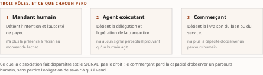
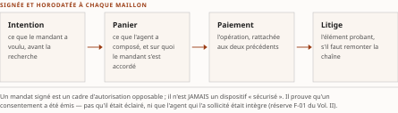

# Chapitre 10 — Transaction et infrastructure : AP2 et AGNTCY

*Livre I — Coopérer : fondements de l'interopérabilité et couche protocolaire agentique.
Second mouvement — la couche protocolaire agentique (ch. 7-11).*

| Champ | Valeur |
|---|---|
| **Statut** | **Brouillon de rédaction, non publiable** — portes G-1, G-2 et G-3 ouvertes **à la rédaction** ; instruction d'auteur du 27 juillet 2026. ⚠ **Deux mises à jour postérieures, à ne pas confondre.** *(27 juillet 2026)* **G-2 et le volet Livre I de G-1 ont été franchis** (PRD v0.8), et les **remontées de cette pièce sont closes**. *(28 juillet 2026)* ⚠ **G-3 est franchie à son tour** (PRD **v0.14**, TOC **v0.30**) : le **socle consolidé existe** — [`socle-consolide.md`](../PRD/socle-consolide.md) v1.2, **159 entrées** `S-001`…`S-159` —, et le champ *Socle mobilisé* ci-dessous en tire la résolution. ⚠ **La pièce demeure un brouillon non publiable, et le motif a changé** : ce n'est plus l'absence de socle, mais **CA-IV-11 et CA-IV-13**, qui exigent un **relecteur distinct du rédacteur** que **D-6** ne fournit pas. **G-4 demeure ouverte.** *Une porte franchie n'est pas un ouvrage recevable ; c'est une condition qui cesse de manquer.* |
| **Date de gel** | **27 juillet 2026** — gel unique du compendium, **décision d'auteur D-1 prise** ce jour (registre : [`gel-2026-07-27.md`](../PRD/gel-2026-07-27.md)). ⚠ **Ce gel n'efface pas ceux des sources**, qui restent portés ci-dessous : il date la reprise de chaque fait périssable à sa source primaire, non la matière elle-même. Gels de source **inégaux et l'écart est ici décisif** : **juin 2026** (Vol. I) et **16 juillet 2026** (Vol. II). ⚠ Le **tableau daté du § 10.3.3** est un instantané qui **se périme en bloc** ; le **statut de gouvernance du § 10.1.3** est le point du Livre où les deux gels **ne disent pas la même chose**. ⚠ **Le volet résiduel du 28 juillet 2026** ([`gel-2026-07-28-volet-residuel.md`](../PRD/gel-2026-07-28-volet-residuel.md)) a porté les entrées à sensibilité temporelle à leur source primaire : **deux de celles que mobilise cette pièce en reviennent avec une re-datation partielle**, et ce sont ses deux décomptes — voir le champ suivant |
| **Socle mobilisé** | ⚠ **Résolution contre le socle consolidé depuis le franchissement de G-3** (28 juillet 2026) : **`S-004`** `[A]` (le protocole de paiement), **`S-005`** `[A]` (la couche d'infrastructure), **`S-006`** `[A]` (la feuille de route académique, **réserve de préimpression** reconduite), **`S-041`** `[B]` (généalogie de l'ACP protocolaire vers le protocole agent-agent) et **`S-001`** `[A]` (réserve « cadre d'autorisation », jamais « sécurisé ») — anciennement **F-04**, **F-05**, **F-06**, **F-43** et **F-01** du Vol. II, **niveaux conservés, aucun promu**. Le transfert de gouvernance du § 10.1.3 résout en outre contre **`S-090`** `[A]`, qui l'**établit à sa source primaire** — anciennement `F-44` du Vol. III. ⚠ **La matière propre au Vol. I *Monographie* §3.9 et §3.13.1 reste en [C]** (PRD §7.1) : **aucun énoncé qui en dépend n'est central au sens de CA-IV-01**. ⚠ **Deux résidus de re-datation touchent cette pièce, et ils portent exactement sur ses deux décomptes** : ni le « plus de soixante » de `S-004` ni le « plus de soixante-cinq » de `S-005` n'ont été **ré-établis à leur page source** le 28 juillet 2026 — *absence de documentation*, **degré 3**, et non un retrait constaté. Les § 10.1.2 et § 10.2.1 le portent |
| **Garde-fous balayés** | ⚠ **Règle de décompte, et les cardinaux ci-dessous ont été re-mesurés sous elle le 28 juillet 2026** : un décompte d'occurrences porte sur le **marqueur littéral de l'identifiant** dans le **corps** de la pièce — en-tête et note de statut exclus —, et il se re-mesure au commit ; un garde-fou appliqué **sans identifiant écrit** se déclare par son **domaine balayé, sans cardinal**. Vol. II — **R-1 : deux occurrences**, § 10.5.1 et § 10.6.2, l'ACP protocolaire jamais présenté comme un standard vivant ; **R-8 : deux occurrences**, § 10.3.2 et § 10.6.2, le sigle jamais nu à ses emplois, le siège de l'encadré restant au **ch. 7 § 7.5** ; **métriques auto-déclarées (PRD Vol. II §8.2.1) — sans identifiant écrit, donc déclarées par leur domaine, sans cardinal : les décomptes de soutien sont repris aux § 10.1.1, § 10.1.2, § 10.2.1 et § 10.6.2**, chacun attribué à son communiqué à chaque occurrence, les **trois derniers** portant en outre la clause « soutien ≠ production » ; le § 10.2.3 étend le même régime au **positionnement déclaré** du projet, qui n'est pas une métrique — ⚠ *le § 10.2.2, que cet en-tête a porté, n'en porte aucune, et le domaine à trois sections qui l'a remplacé en omettait deux* ; **réserve F-01 : deux occurrences**, § 10.3.3 et § 10.4.2 ; **réserve F-06 : une occurrence**, § 10.6. R-2 à R-7 : **zéro occurrence**. Vol. III — **R-02 : quatre occurrences**, § 10.1.4, § 10.3.3, § 10.3.4 et § 10.4.3 ; **R-13 : deux occurrences**, mêmes que R-8 ; **R-14 : huit occurrences** — § 10.1.2, § 10.1.3, § 10.1.4 (deux), § 10.2.1, § 10.2.2, § 10.3.4 et § 10.4.2 —, dont **la plus lourde**, celle du § 10.1.3, qui porte une **divergence entre deux volumes rédigés**. ⚠ *La huitième est entrée le 28 juillet 2026 avec la re-datation du socle : le décompte du § 10.1.2 n'a pas été retrouvé à sa page source.* ⚠ **Aucune comparaison avec les autres pièces du Livre n'est portée ici** — *un cardinal mesuré sur une pièce voisine qu'une autre passe édite au même moment est faux à la seconde où on le publie* (décision 16). R-01, R-03 à R-12 : **zéro occurrence** |
| **Volumétrie cible** | ≈ 7 000 mots de corps (§ 10.1 à § 10.6) — **mesurés, non estimés**, la mesure valant ici plus que la cible : **deux passages sont bornés par un partage déclaré** (§ 10.5 avec le ch. 8, § 10.3.4 avec le ch. 18) et **un troisième par une lacune assumée** — le § 10.1.4, qui en porte deux à lui seul. ☑ **Décompte publiable depuis le franchissement de G-2** (27 juillet 2026). **Réel au commit du 27 juillet 2026 : 7 036 mots** de corps, mesurés par [`PRD/decompte.sh`](../PRD/decompte.sh), seule autorité de décompte du volume — **+0,5 %** de la cible. ⚠ **Re-mesuré au commit du 28 juillet 2026 : 7 548 mots**, soit **+7,8 %** ; les **512 mots qui séparent les deux mesures sont intégralement de l'appareil de bornage** versé par les relectures de ce jour — re-datation du socle sur les deux décomptes, régime du transfert de gouvernance passé en `[A]`, distinction entre un mode d'échec démontré et un mode d'échec observé, régime `[C]` de l'énoncé réglementaire. *Un écart né d'une borne ajoutée ne s'ampute pas : la pièce serait plus courte et moins vraie.* ⚠ **Les deux mesures se déclarent distinctes, et c'est une correction de la seconde relecture** : la première avait reporté sa propre mesure sur **les deux commits**, ce qui faisait dire au champ que la pièce n'avait pas bougé tout en chiffrant à 493 mots ce qu'elle avait gagné. *Un écart dont les deux termes sont égaux n'est pas un écart.* ⚠ **L'écart individuel ne se lit pas seul** : la somme des onze cibles dérivées atteint **93 000 mots** pour une enveloppe de Livre de **65 000** — chaque pièce a dérivé sa cible de l'enveloppe sans que personne n'additionne les dérivations. Le **réel du Livre est de 64 750 mots, soit −0,4 % de l'enveloppe** au commit du 27 juillet 2026 : c'est la cible dérivée qui était fausse, non la pièce qui est courte. ⚠ **Ce total de Livre n'est pas re-mesuré ici** — *une passe qui ne touche qu'une pièce ne peut pas mesurer un cardinal que dix autres modifient en même temps* ; il se reprend au commit, sur le corpus que le commit produit (décision 16). *Un écart se documente ; il ne se corrige ni par amputation ni par gonflement* |

> **Thèse** *(citée depuis le [`TOC.md`](../PRD/TOC.md) **v0.30**, entrée du chapitre 10, **inchangée depuis la v0.28** — **deux énoncés de statut inégal, à ne pas fondre**)* — que la transaction pilotée par agents (AP2) soit l'**aboutissement financier** de la pile est une **lecture d'auteur** — le socle établit qu'AP2 est un protocole compagnon d'A2A, rien de plus sur sa centralité ; qu'AGNTCY soit une couche d'infrastructure **et non un concurrent** est le **positionnement officiel déclaré du projet**, une déclaration et non un fait vérifié, que des analyses tierces nuancent.

⚠ **La clause médiane de cette thèse — « le socle établit qu'AP2 est un protocole compagnon d'A2A, rien de plus sur sa centralité » — manquait au bloc cité jusqu'au 28 juillet 2026.** Elle était restituée **en substance** au paragraphe de décomposition ci-dessous, mais la citation déclarée verbatim était **amputée**, et la comparaison mot à mot avec le plan échouait. *Une citation verbatim ne se re-frappe pas : elle se copie.* La citation ci-dessus **a été reprise par copie littérale depuis le TOC** et **re-comparée caractère à caractère à la v0.30 le 28 juillet 2026** ; le plan, lui, n'a pas bougé sur cette entrée — les passes v0.29 et v0.30 n'ont touché aucune thèse.

---

Une institution ne s'intéresse vraiment à un protocole d'interopérabilité que le jour où celui-ci
touche à **l'argent** ou à **l'infrastructure**. Les deux objets de ce chapitre occupent précisément
ces deux extrémités. Le protocole de paiement agentique se tient au point où la délégation à un agent
cesse d'être une affaire d'ingénierie pour devenir une affaire de **responsabilité** : la transaction.
La couche d'infrastructure se tient à l'autre bout, là où des agents se découvrent et s'échangent des
messages **avant même de savoir ce qu'ils feront ensemble**. Entre les deux se glisse un troisième
objet, dont ce chapitre tire la **portée de risque** — l'ACP protocolaire, dont le ch. 8 § 8.5.1 a
raconté la mécanique de disparition.

⚠ **La thèse de ce chapitre doit être décomposée avant d'être employée, car ses deux moitiés n'ont
pas le même statut de preuve, et les fondre serait la faute que ce chapitre prend pour objet.** Que
la transaction agentique constitue l'**aboutissement financier** de la pile protocolaire est une
**lecture d'auteur** : les sources établissent que le protocole de paiement est un **protocole
compagnon** de l'axe agent-agent, dédié aux transactions pilotées par agents, et **rien de plus sur sa
centralité**. Qu'AGNTCY soit une **couche d'infrastructure et non un concurrent** est, pour sa part,
le **positionnement officiel déclaré du projet** — une déclaration, non un fait vérifié, et que des
analyses tierces viennent nuancer. *Une lecture d'auteur et une déclaration de partie intéressée ne
sont pas du même ordre, et aucune des deux n'est un fait établi.*

Ce chapitre porte en outre **huit énoncés d'absence** — autant d'occurrences de l'échelle à trois
degrés du Vol. III —, et l'une d'elles est d'un genre que les neuf chapitres précédents n'ont pas
rencontré : **deux volumes rédigés du corpus n'y disent pas la même chose**. Le § 10.1.3 lui est
consacré.

---

## § 10.1 — AP2 : la transaction pilotée par agents

> ⚠ **Thèse à statut déclaré.** Ce qui suit **n'établit pas** qu'AP2 soit central dans la pile. Il
> établit qu'un protocole compagnon existe, qu'il a une date, un décompte de soutiens déclarés et un
> dossier de gouvernance discuté. *La centralité, elle, est une lecture — celle de la thèse, marquée
> comme telle.*

### 10.1.1 Les faits et l'intervalle

Les faits sont **peu nombreux**, et il faut résister à la tentation de les étoffer. Le protocole de
paiement agentique — AP2, *Agent Payments Protocol* — a été **lancé en septembre 2025**, l'annonce
publique du fournisseur infonuagique qui le porte étant datée du **16 septembre 2025**, comme
**protocole compagnon** du protocole agent-agent, dédié aux transactions pilotées par agents.

La **filiation est explicite** et elle éclaire le découpage du Livre : là où le protocole agent-agent
régit la **délégation de tâches** entre pairs (ch. 8 § 8.4), AP2 s'attache à ce qui se passe lorsque
**la tâche déléguée engage un paiement**. Ce n'est pas un protocole concurrent ; c'est un protocole
qui prend le relais **au point où la délégation cesse d'être réversible**.

⚠ **Posons l'intervalle, car il est la seule quantité que les sources permettent de calculer ici.**
De l'annonce du **16 septembre 2025** au communiqué de la fondation faîtière du **9 avril 2026** qui
en publie les soutiens, il s'écoule **moins de sept mois**. Moins de sept mois après son annonce, un
protocole de paiement compte plus de soixante déclarations de soutien — *si l'on en croit le
communiqué qui les rapporte*.

*Lecture d'auteur.* Les sources **n'enregistrent aucun décompte au lancement** d'AP2 — à la différence
du protocole agent-agent, dont le ch. 7 § 7.6 a pu donner **les deux bornes**, plus de cinquante au
départ et plus de cent cinquante en avril 2026. **Aucune dynamique de croissance ne peut donc être
tirée de ce chiffre unique** : un décompte sans point de départ mesure un état, jamais une pente.
*C'est la différence entre « soixante organisations soutiennent » et « soixante organisations se sont
ralliées ».* La seconde formule est indue et ce chapitre ne l'emploie pas.

### 10.1.2 La métrique des soixante : un endossement, pas une production

Sur l'adoption, les sources fournissent **un chiffre et une liste**. Selon le communiqué de la
**Linux Foundation**, fondation faîtière du protocole, daté du **9 avril 2026**, **plus de soixante
organisations des paiements et des services financiers déclarent leur soutien** au protocole.

⚠ **Ce chiffre est auto-déclaré et il est attribué ici à sa source, comme il doit l'être à chaque
occurrence** (PRD du Vol. II §8.2.1). **Le soutien déclaré ne vaut pas déploiement en production.**
La réserve attachée à l'entrée du socle est explicite sur ce point : il s'agit d'un **endossement
déclaré**, non d'une **adoption en production vérifiée**. Le ch. 7 § 7.6 a posé la règle de lecture
pour toute la somme ; ce chapitre l'applique sans l'assouplir.

Le grief central que le ch. 7 adressait aux décomptes d'« organisations de soutien » — **l'unité n'en
est pas définie** — vaut **intégralement** ici. Une organisation qui a signé un communiqué et une
organisation qui a livré une intégration comptent pour un, et le communiqué ne les distingue pas.

⚠ **Un fait de re-datation s'ajoute depuis le franchissement de G-3, et il durcit la réserve sans
l'annuler.** L'entrée `S-004` du socle consolidé a été **portée à sa source primaire le 28 juillet
2026** : le lancement de septembre 2025 y est confirmé, **mais le décompte lui-même n'a pas été
retrouvé à la page** — *absence de documentation*, **R-14 degré 3**. ⚠ **Ce n'est ni un démenti ni un
retrait** : c'est un chiffre dont la source citable, à ce jour, demeure le communiqué d'avril 2026 et
lui seul. *Un décompte qu'on ne retrouve plus à sa source n'est pas devenu faux ; il est devenu
invérifiable, ce qui est un état différent et qui doit se dire.*

**Mais un élément que les sources fournissent change la portée de la lecture, et il mérite d'être posé
sans être durci.** **Sept** de ces organisations sont **nommées** par le communiqué, et ce sont des
**réseaux de paiement et des émetteurs** — c'est-à-dire, précisément, les acteurs sans lesquels aucune
transaction agentique ne peut aboutir.

*Lecture d'auteur.* Sept noms d'infrastructures de paiement sont **qualitativement plus informatifs
qu'un décompte entièrement anonyme** — non parce qu'ils prouvent un déploiement, mais parce qu'ils
**identifient qui aurait à bouger**. ⚠ **La restriction est stricte** : les sources établissent **ces
sept noms** ; elles n'établissent **ni la liste complète** des soutiens déclarés, **ni que ces
organisations aient bougé**. *Cinquante-trois soutiens au moins ne sont pas identifiables, et un
chapitre qui écrirait « liste nominative » aurait embelli sa source.*

⚠ **Un second décompte auto-déclaré traverse ce chapitre, et il n'est pas comparable au premier** :
celui de la couche d'infrastructure, examiné au § 10.2.1. **Plus de huit mois séparent les deux
relevés** — juillet 2025 pour l'un, avril 2026 pour l'autre. Les mettre côte à côte dans un tableau
produirait un classement que rien ne fonde. *Deux métriques auto-déclarées à des dates différentes ne
forment pas une comparaison ; elles forment deux instantanés.*

### 10.1.3 La gouvernance : le point où deux volumes rédigés ne disent pas la même chose

> ⚠ **Section d'arbitrage de provenance.** C'est le passage le plus délicat du chapitre, et
> peut-être du Livre. Il ne tranche pas un fait : il **expose deux états de connaissance datés** et en
> tire une règle de lecture. *Un compendium qui lisserait cette divergence en choisirait une —
> silencieusement.*

**Ce que le Vol. II établit.** Ses sources, **gelées au 16 juillet 2026**, **ne documentent aucun
transfert de gouvernance** du protocole de paiement vers une fondation. Le volume qualifie lui-même
cet énoncé avec une précision qui mérite d'être reprise mot à mot : ce n'est **pas un fait négatif
vérifié** — lequel exigerait une **recherche exhaustive et infructueuse dans les textes officiels** —
mais une **absence de documentation dans le socle**, ce qui est **plus faible**, et doit se dire tel
quel.

⚠ **Échelle à trois degrés du Vol. III (R-14), degré 3.** *Absence de documentation* — le degré le
plus faible des trois. Ni *fait négatif vérifié*, ni *fait négatif établi*. La distinction n'est pas
rhétorique : **elle décide de ce qu'une institution peut inscrire dans un dossier de diligence
raisonnable.** « Nous n'avons pas trouvé » et « il n'y en a pas » n'engagent pas la même
responsabilité.

**Ce que le Vol. I établit.** Ses sources, **gelées en juin 2026** — donc **antérieures** à celles du
Vol. II —, portent le transfert comme un **fait daté et sourcé** : le protocole de paiement a été
**transféré à la FIDO Alliance le 28 avril 2026**, dans une **version v0.2** prenant en charge le cas
*Human-Not-Present*, avec un standard d'**intention vérifiable** codéveloppé avec un réseau de cartes,
et **non** vers la fondation faîtière qui héberge les protocoles agent-outil et agent-agent. Le même
volume ajoute que la fondation d'authentification a **constitué deux groupes de travail techniques
dédiés** — l'un sur l'authentification agentique, l'autre sur les paiements —, dont la coprésidence du
second revient à **deux réseaux de cartes**.

⚠ **Ces deux énoncés ne se contredisent pas, et c'est le point.** « Le socle du Vol. II ne documente
pas X » et « le Vol. I documente X » sont **logiquement compatibles** : le premier décrit un **corpus
de sources**, le second décrit un **événement**. Une absence de documentation dans un socle donné
n'est pas une négation. *C'est exactement pourquoi le Vol. II a pris soin d'écrire « absence de
documentation » et non « aucun transfert n'a eu lieu » — la formulation faible avait raison.*

**Trois conséquences, dans l'ordre où un lecteur en a besoin.**

*(1) Ce que ce chapitre écrit.* Le transfert a d'abord été **porté ici comme fait documenté par le
Vol. I**, au **régime [C]** que la refonte du socle imposait à toute entrée venue de ce volume — donc
**à instruire à la source primaire**. ⚠ **Cette instruction a eu lieu, et c'est ce que le
franchissement de G-3 change à cette sous-section.** L'entrée **`S-090`** du socle consolidé porte
désormais le transfert **au niveau `[A]`**, constaté au **billet officiel du 28 avril 2026** de
l'organisation cédante — transfert de propriété au cessionnaire nommé, version **v0.2**, cas
*Human-Not-Present*. *Le fait n'est donc plus un repérage à instruire : il est instruit.* Il reste
néanmoins écrit **non** comme une propriété générale du protocole (« le protocole de paiement est
gouverné par une fondation neutre ») mais comme un **événement daté attribué à sa source**.

*(2) Ce que devient l'énoncé du Vol. II.* Il **reste exact à sa date et dans son périmètre** : son
socle, tel que constitué, n'en portait pas la documentation. ⚠ **Un socle qui ne documente pas un
événement antérieur à son propre gel signale une lacune de couverture, non une erreur de fait** — et
c'est ainsi que la lacune est déjà enregistrée au registre du Vol. II. *Le corriger après coup
effacerait l'information que cette lacune porte : ce que le volume savait, au moment où il l'a écrit.*
⚠ **Le socle consolidé le tient d'ailleurs pour tel** : `S-004` et `S-090` y **coexistent sans
arbitrage**, la première portant en toutes lettres qu'elle ne documente pas le transfert que la
seconde établit. *Deux entrées d'un même socle peuvent se compléter sans se contredire ; les fondre
en aurait effacé une.*

*(3) Ce que ce chapitre corrige de sa propre série.* ⚠ Le **ch. 7 § 7.4.2 et § 7.6** ont écrit, sur ce
même objet, « **annoncé, non vérifié au socle** », en suivant le plan et le Vol. II — **alors que le
§3.13.1 du Vol. I, qui est l'une des sources de ce chapitre-là, portait déjà le transfert comme fait
daté**. C'est un **défaut de couverture de source du ch. 7, non une divergence entre volumes**, et il
est corrigé à sa place ; la **remontée R-IV-12** du § 10.7 en porte la trace.

*Lecture d'auteur.* Le raisonnement du ch. 7 § 7.4 — *la gouvernance neutre transforme la question de
diligence en question de constat* — **s'étend donc bien au protocole de paiement**, mais **par une
seconde fondation**, spécialisée dans l'authentification, et non par la faîtière. ⚠ **La conséquence
n'est pas décorative** : elle confirme que l'écosystème se fédère autour de **plusieurs pôles de
gouvernance distincts, organisés par axe**, ce que le ch. 7 § 7.4.2 avait déjà posé comme trait
structurant. *La question de diligence ne devient pas « ce protocole est-il sous fondation ? » mais
« sous laquelle, et cette fondation a-t-elle compétence sur l'axe concerné ? ».*

### 10.1.4 Ce que ce chapitre ne peut pas écrire : l'anatomie absente

Il faut dire, avec autant de netteté que le reste, **ce que ce chapitre est hors d'état d'écrire**.

⚠ **Aucune anatomie technique complète du protocole de paiement n'est portée par le socle du
Vol. II** : ni structure des messages, ni mécanique de mandat, ni modèle de preuve d'intention. **R-14,
degré 3** — *absence de documentation*. Le ch. 8 peut décrire le protocole agent-outil et le protocole
agent-agent **parce que la matière y est** ; ce chapitre ne le peut pas au même grain pour AP2, et
**s'y refuse plutôt que d'emprunter à une connaissance non tracée**. *C'est une lacune assumée, et le
plan la déclare comme telle.*

**Le Vol. I comble partiellement cette lacune, et la mesure de ce « partiellement » importe.** Il
porte la **chaîne de mandats** — *Intent Mandate*, *Cart Mandate*, *Payment Mandate* — matérialisés
comme **attestations vérifiables signées** au sens de la recommandation du consortium du web. ⚠ **R-02
du Vol. III** : cette chaîne **démontre** qu'un consentement peut être **matérialisé en objet portable
et signé**, séparément du rail qui le règlera ; elle **ne démontre pas** que le consentement ainsi
matérialisé **corresponde à l'intention réelle du mandant** — le § 10.3.4 y revient, et c'est le
verrou du domaine.

**Le découplage prend ici une forme concrète, et c'est l'invariant du Livre qui se rejoue.** Un mandat
de panier signé est **portable indépendamment du rail de règlement aval** : émis dans un contexte, il
peut être présenté à des réseaux de paiement distincts. *Le contrat de consentement est découplé du
contrat de mouvement de fonds* — ce qui prépare l'interopérabilité avec les rails de cartes
(§ 10.3.3) et les paiements machine-natifs (§ 10.3.4).

⚠ **Une seconde lacune, et elle n'est pas du même degré.** L'articulation du protocole de paiement
avec les **rails de paiement nationaux** d'un marché donné — le cas canadien est celui que le Vol. II
instruit — **n'est documentée par aucune source de son socle** : *absence de documentation*
(**R-14, degré 3**), traitée par ce volume dans un chapitre **explicitement prospectif**. La somme
héritera cette lacune telle quelle ; **elle ne se comble pas par une source de moindre qualité.**

---

## § 10.2 — AGNTCY : la couche d'infrastructure

### 10.2.1 Faits, dates et le décompte de juillet 2025

La couche d'infrastructure agentique — AGNTCY — a été **ouverte en mars 2025** par un équipementier de
réseau, avec un éditeur de cadriciel d'orchestration et un éditeur d'outillage d'évaluation, puis
**placée sous la fondation faîtière le 29 juillet 2025** — soit **quatre mois plus tard**. Ses
**membres formateurs** sont cinq : l'équipementier initiateur, un constructeur de matériel, la
division infonuagique d'un grand fournisseur de recherche et de services, un éditeur de bases de
données et un éditeur de distribution ouverte.

Le communiqué de la **Linux Foundation** du **29 juillet 2025** fait état de **plus de soixante-cinq
entreprises déclarant leur soutien au projet**. ⚠ **Chiffre auto-déclaré, attribué ici à ce communiqué
et daté de juillet 2025 ; il ne vaut pas plus déploiement en production que celui du § 10.1.2**
(PRD du Vol. II §8.2.1). ⚠ **Les sources n'enregistrent aucune actualisation ultérieure de ce
décompte, et la re-datation du 28 juillet 2026 ne l'a pas davantage retrouvé à sa page source** —
*absence de documentation* dans les deux cas, **R-14 degré 3**, et non un plafonnement constaté ni un
retrait. **Le sort de ce décompte est donc celui du § 10.1.2**, à quoi s'ajoute ici que **la mention
d'une composante ACP est elle aussi absente des pages consultées** : la lacune du § 10.2.3 n'en est
pas comblée pour autant — *une absence sur deux pages n'est pas un retrait*.

⚠ **Il serait donc fautif de comparer ce chiffre à ceux d'avril 2026**, examinés au ch. 7 § 7.6 et au
§ 10.1.2 : **plus de huit mois séparent les relevés**, et **aucune évolution du décompte de la couche
d'infrastructure n'est documentée**. *Un tableau qui alignerait « 65+ », « 60+ » et « 150+ » sur une
même colonne suggérerait une hiérarchie que les dates interdisent de lire.*

### 10.2.2 Annuaires et transport : un vocabulaire d'infrastructure

Le contenu du projet, tel que les sources le portent, tient en **deux capacités** :

- des **annuaires de découverte** (*discovery directories*) ;
- un **transport** nommé **SLIM**.

*C'est un vocabulaire d'infrastructure, non d'application* : **découvrir quels agents existent**, et
**acheminer ce qu'ils s'envoient**. Ces deux capacités atterrissent respectivement dans les deux
sections que le Livre leur a déjà réservées — la découverte au **ch. 9 § 9.1.4**, qui traite les
annuaires et services de noms sur son versant protocolaire, et le transport au **ch. 9 § 9.2**, qui
pose l'étagement de la pile.

⚠ **Les sources n'en disent pas davantage** : ni spécification, ni statut de maturité, ni version.
*Absence de documentation* (**R-14, degré 3**). Ce chapitre s'en tient là, et ne complète pas de
mémoire. *Une couche d'infrastructure dont on ne connaît ni la version ni le statut de maturité n'est
pas évaluable au sens de la matrice du ch. 9 § 9.2.5 — et c'est une information en soi.*

### 10.2.3 Le positionnement déclaré, et ce qui le nuance

Le **positionnement officiel** du projet est celui d'une couche **interopérable avec les protocoles
agent-outil et agent-agent, non concurrente**.

⚠ **Cette formule est une déclaration du projet, et doit être lue comme telle.** Elle relève de la
**même catégorie que les métriques auto-déclarées** du § 10.2.1, et les sources **ne la valident pas**.
*Un projet qui déclare ne concurrencer personne énonce une intention, pas une propriété observable.*

**Un élément de contexte se lit dans le rapprochement de deux faits, et il mérite d'être posé avec son
pas d'inférence rendu visible.** La division infonuagique qui figure parmi les **membres formateurs**
de la couche d'infrastructure appartient au **même groupe** que l'organisation qui a **lancé le
protocole agent-agent puis le protocole de paiement**. ⚠ **Les sources nomment ces deux entités
séparément et n'établissent pas formellement leur rattachement** ; l'identification est un **pas
d'auteur**, et il est marqué comme tel.

*Lecture d'auteur.* En tenant la division pour une composante du groupe, **un même groupe se trouve
des deux côtés** : **créateur des protocoles d'échange**, **membre formateur de la couche
d'infrastructure**. Cette double présence est **cohérente avec la thèse de la complémentarité**, et
c'est ainsi qu'on la lira dans les documents promotionnels. ⚠ **Mais la cohérence n'est pas une
preuve.** Les sources établissent une **composition de membres** et un **positionnement déclaré** ;
elles n'établissent **ni que les deux couches soient effectivement complémentaires dans les faits**,
**ni qu'elles le resteront**.

**Et les sources portent un second élément, qui va dans l'autre sens.** Des **analyses tierces
relèvent un chevauchement** entre la composante ACP d'AGNTCY et le protocole agent-agent.

⚠ **Cette observation n'est pas endossée par le socle** : c'est un **constat de tiers**, attribué
comme tel et **non vérifié en source primaire**. Elle **ne permet pas d'endosser le chevauchement
comme un fait** ; elle suffit à rappeler que le positionnement « non concurrent » demeure une
**position déclarée du projet, que des analyses tierces viennent nuancer**. ⚠ **Que ces analyses
contestent le positionnement lui-même n'est pas établi** — *relever un chevauchement et contester une
déclaration sont deux gestes distincts, et la source ne porte que le premier.*

Cette observation ouvre le dossier terminologique le plus délicat de la somme, dont **le siège est au
ch. 7 § 7.5** ; le § 10.5.3 en tire ce qui revient à ce chapitre.

---

## § 10.3 — Interopérabilité du commerce et des paiements agentiques

### 10.3.1 Le problème d'interopérabilité propre au commerce agentique

La couche économique de la pile constitue une **nouveauté propre à cette génération** : elle est
**absente du premier mouvement du Livre**, qui supposait l'achat **médié par une interface humaine
porteuse de ses propres signaux de confiance**. Lorsque l'acteur déclencheur d'une transaction devient
un **agent autonome**, la chaîne *découverte → autorisation → règlement* doit être **reconstruite sur
des fondations machine-vérifiables**.

⚠ **La proposition organisatrice de cette section tient en une dissociation.** Le commerce agentique
**disjoint trois rôles** que le commerce électronique classique **fusionnait dans une seule présence à
l'écran** :

| Rôle | Ce qu'il détient | Ce qu'il n'a plus |
|---|---|---|
| **Mandant humain** | l'**intention** et l'**autorité de payer** | la présence à l'écran au moment de l'achat |
| **Agent exécutant** | la **délégation** et l'**opération** de la transaction | tout signal perceptuel prouvant qu'un humain agit |
| **Commerçant** | la **livraison** du bien ou du service | la capacité d'observer un parcours humain |

: Tableau 10.1 — Les trois rôles que le commerce agentique dissocie, et ce que la dissociation fait disparaître de chaque côté.

Cette dissociation fait **disparaître les signaux de confiance hérités du parcours humain** — le défi
d'authentification forte à trois domaines, l'épreuve de reconnaissance, la frappe au clavier
observable — **qui présupposaient tous une personne présente**.

Le problème d'interopérabilité devient alors celui de **prouver de façon machine-vérifiable trois
propriétés distinctes** :

1. l'**intention** — *le mandant a-t-il voulu cet achat ?* ;
2. l'**autorité** — *l'agent a-t-il le droit de l'engager, et dans quelles limites ?* ;
3. l'**identité** — *l'agent est-il bien celui qu'il prétend être ?*

⚠ **Ces trois propriétés ne sont pas nouvelles ici** : le ch. 9 § 9.1 les a rencontrées sous l'angle
de la découverte, où *trouver un agent ne sert à rien si l'on ne peut établir qui il est*. Le commerce
en fait la **condition de la transaction**, ce qui en durcit l'exigence : une erreur d'identité y a un
**coût libellé**. ⚠ **La troisième d'entre elles seule** — l'identité — **est celle que le Livre II
reprendra comme identité composite**, à au moins trois entités distinctes à identifier et à relier.
*Trois propriétés à prouver et trois entités à identifier ne sont pas la même triade, et les confondre
ferait croire que la seconde répond à la première.*

L'architecture qui se dégage décompose le besoin en **trois sous-couches**, que les sections suivantes
parcourent dans l'ordre : la **découverte et le paiement en caisse** (trouver le produit, constituer
un panier interopérable), l'**autorisation et le mandat** (matérialiser le consentement vérifiable),
et le **règlement** (mouvementer la valeur).

*Cette stratification reprend, dans le registre marchand, la logique d'étagement défendue par tout le
Livre* (ch. 9 § 9.2) : **aucun protocole ne couvre seul les trois couches**, et **leur composition est
l'enjeu d'interopérabilité**.

> **Perspective de recherche.** Une position publiée cadre le commerce comme **cas limite de
> coordination économique entre acteurs autonomes** : la confiance n'y serait plus une **propriété
> d'interface** mais une **propriété de protocole**, à reconstruire par des **preuves portables** —
> attestations vérifiables, mandats signés — puisque les signaux perceptuels du parcours humain ne
> sont plus disponibles. ⚠ **Cadre d'analyse, non fait établi.**

### 10.3.2 Paiement en caisse et mandats : l'ACP commercial et le protocole de commerce universel

> ⚠ **Convention de nomenclature, rappelée ici comme à chaque occurrence** (R-8 du Vol. II, R-13 du
> Vol. III). L'**ACP commercial** désigne le protocole de commerce agentique publié en septembre 2025
> par un éditeur de modèles et un fournisseur de paiement — **à ne pas confondre** avec l'**ACP
> protocolaire**, sur l'axe agent-agent, dont le ch. 8 § 8.5.1 a traité la mécanique de fusion et dont
> le § 10.5 tire la portée de risque. **Le siège de l'encadré des quatre branches est au ch. 7
> § 7.5** ; il n'est pas reconstruit ici.

**L'ACP commercial.** Publié sous **licence permissive le 29 septembre 2025**, il spécifie une
**interface de paiement en caisse** et un mécanisme de **paiement délégué** reposant sur un **jeton de
paiement partagé**. Il a sous-tendu une fonction d'**achat immédiat** dans un assistant conversationnel
grand public, dont la spécification connaît **plusieurs révisions datées successives**.

⚠ **La trajectoire ultérieure illustre la volatilité des contrats commerciaux agentiques, et c'est
l'enseignement de la sous-section.** L'orientation produit de l'éditeur a **évolué vers un modèle
davantage centré sur les applications** — signe que **la couche commerce reste mouvante là où la
couche protocolaire se stabilise**. *Le ch. 7 § 7.3 a montré dix-sept mois de consolidation
protocolaire ; la couche marchande, elle, n'a pas connu cette consolidation, et rien n'indique qu'elle
la connaîtra au même rythme.*

**Le protocole de commerce universel.** Annoncé en **janvier 2026** avec des distributeurs majeurs, il
couvre **découverte, panier, achat et suivi** sur les transports d'interface applicative classique, du
protocole agent-agent et du protocole agent-outil, **en compatibilité affichée** avec le protocole de
paiement du § 10.1. ⚠ **« Compatibilité affichée » est une déclaration de projet**, du même ordre que
celle du § 10.2.3 ; il est mentionné ici **en renvoi**, comme **couche de découverte et de paiement en
caisse complémentaire des mandats**, et non comme un objet dont ce chapitre porterait l'anatomie.

*Lecture d'auteur.* **Trois protocoles de commerce coexistent sur la même fonction** — constituer un
panier et le faire payer par un agent — **sans qu'aucune source n'établisse de convergence entre
eux**, à la différence de ce que le ch. 8 § 8.5.1 a documenté sur l'axe agent-agent. ⚠ **Cette
absence de convergence documentée n'est pas une prédiction de fragmentation durable** : c'est un
**état à une date**, et le Livre a vu, sur l'axe protocolaire, une fusion survenir en cinq mois.

### 10.3.3 Rails de cartes et authentification d'agent : un tableau daté

⚠ **Le tableau de cette sous-section est un instantané et se périme en bloc.** Son intérêt tient à ce
qu'il **situe chaque initiative à une date** ; il ne constitue **ni un classement ni une
recommandation**. *Même régime que la matrice de maturité du ch. 9 § 9.2.5.*

**La proposition d'ensemble est celle de l'étagement, et elle se vérifie ici mieux qu'ailleurs.** Les
réseaux de cartes ont **étendu leurs schémas existants plutôt que d'en créer de nouveaux** —
*étagement, et non remplacement*.

| Initiative | Porteur | Date | Mécanique, telle que les sources la portent |
|---|---|---|---|
| **Protocole d'agent de confiance** (TAP) | un réseau de cartes, avec un fournisseur d'infrastructure de périphérie | **14 octobre 2025** | **signe l'identité de l'agent dans des en-têtes HTTP**, au moyen des signatures de message HTTP normalisées et d'une mécanique d'authentification de robot, sur des clés à courbe elliptique |
| **Paiement d'agent** et jetons agentiques | un second réseau de cartes | **2025** | **prolonge l'infrastructure de tokenisation existante** en liant le jeton à un **périmètre marchand** et à un **consentement** |
| **Groupe de travail paiements** de la fondation d'authentification | **coprésidé par les deux réseaux de cartes** | **2026** | **bâtit sur le protocole de paiement du § 10.1** et sur un cadre d'**intention vérifiable** |
| **Authentification de robot par le web** | un fournisseur d'infrastructure de périphérie, en cours de spécification à l'organisme de normalisation d'Internet | **en cours, 2026** | l'agent **signe ses requêtes** par les signatures de message HTTP et **publie sa clé publique** sous un chemin de découverte normalisé |

: Tableau 10.2 — Rails de cartes et authentification d'agent — instantané daté, ni classement ni recommandation ; le tableau se périme en bloc.

**Deux lectures se dégagent, et il faut les tenir séparées.**

*(1) La convergence institutionnelle est documentée.* Que le groupe de travail paiements soit
**coprésidé par les deux réseaux de cartes** et **bâtisse sur le protocole du § 10.1** confirme que
**la couche paiement gravite vers la fondation d'authentification** — ce que le § 10.1.3 a établi par
la voie du transfert de gouvernance, et que le ch. 7 § 7.4.2 avait annoncé comme trait structurant.
*Deux voies indépendantes mènent au même constat, et c'est ce qui lui donne son poids.*

*(2) Le mécanisme transversal est une primitive, pas une garantie.* L'authentification de robot par le
web repose sur une combinaison **déployable sans rupture** : clé publique publiée sous un chemin
normalisé et signature de requête réutilisant la pile HTTP standard. ⚠ **Ce que ce mécanisme apporte
doit être énoncé avec sa borne** (R-02 du Vol. III implicite ici, explicité au § 10.3.4) : il permet à
un commerçant de **distinguer un agent identifiable d'un trafic automatisé indistinct** et
d'**appliquer une politique différenciée à la frontière**. ⚠ **Il ne rend le trafic ni légitime ni
sûr** : une requête signée est **attribuable**, et l'attribution est un **cadre d'autorisation**, jamais
une propriété de sécurité (réserve F-01 du Vol. II).

*Ce patron recoupe directement la preuve cryptographique d'identité agentique* que le Livre II
instruira : **la signature de requête est l'analogue, côté transport, des cartes d'agent signées** du
ch. 8 § 8.4.2 et des attestations vérifiables du § 10.1.4.

### 10.3.4 Paiements machine-natifs : x402, MPP, KYA

> ⚠ **Le siège du KYA est au ch. 18** (Livre II), qui en traite la **liaison d'autorité** et la
> **piste d'audit** sur le versant identité. Ce qui suit est un **pont**, borné à ce que la couche de
> règlement en exige.

Au-delà des rails de cartes, **une famille de protocoles vise un règlement natif de la machine**.

**x402.** Le protocole ressuscite un **code de statut HTTP resté inutilisé** — *402, « Payment
Required »* : un serveur répond 402, l'agent présente un **en-tête de paiement** réglant en jeton
indexé, puis **rejoue la requête**. ⚠ **La chronologie de sa gouvernance porte un enseignement propre
au Livre.** Annoncé conjointement le **23 septembre 2025** par un fournisseur d'infrastructure de
périphérie et une plateforme d'actifs numériques, il a vu sa gouvernance **formalisée par la
constitution d'une fondation dédiée sous l'égide de la fondation faîtière le 2 avril 2026** —
*l'annonce d'intention précédant ainsi de plus de six mois la mise sous fondation neutre*. Une
révision de deuxième génération prolonge le mécanisme, et une **intégration par un fournisseur de
paiement** lui confère, selon les sources, **la plus forte traction de production parmi les rails
machine-natifs** ; un **pont** avec le protocole de paiement du § 10.1 articule **mandats vérifiables**
et **règlement en chaîne**.

**MPP.** Le protocole de paiements machine, lancé le **18 mars 2026** par un fournisseur de paiement
et une infrastructure de règlement associée, propose un **standard ouvert de facturation des agents
sur HTTP**. Il conjugue trois modes : des **jetons indexés réglés en chaîne** sur plusieurs réseaux,
des **cartes via jetons de paiement partagés**, et le **paiement échelonné**. ⚠ **x402 y figure comme
flux compatible, et non comme rail de règlement** — la nuance est de la source, et l'effacer ferait de
deux protocoles concurrents un empilement qu'ils ne forment pas.

**KYA.** La **connaissance de l'agent** transpose à l'agent la logique de connaissance du client. Elle
lie **trois choses** : une **identité vérifiée**, une **liaison d'autorité** — *au nom de qui, dans
quelles limites* — et une **piste d'audit**, via un document d'identité d'agent. ⚠ **R-02 du
Vol. III** : ce dispositif **démontre** qu'un agent peut être **rattaché à un mandant et à un
périmètre déclaré** ; il **ne démontre pas** que le mandant ait **voulu** l'action particulière que
l'agent exécute — *la liaison d'autorité borne, elle n'atteste pas.* Le **ch. 18** en porte le siège.

**Dans la pile du ch. 9 § 9.2, ces mécanismes occupent la couche de règlement et son
authentification**, sous les couches de découverte (ch. 9 § 9.1) et de mandat (§ 10.3.2) — *ce qui
illustre que le commerce agentique compose plusieurs protocoles distincts plutôt qu'il n'en impose un
seul.*

> **Perspective de recherche — et c'est le verrou du domaine.** Une évaluation dédiée — **Debi et
> coll., *Whispers of Wealth*, 2026**, nommée ici parce qu'elle est l'attributeur de l'énoncé et que
> l'anonymiser le rendrait invérifiable — soumet le protocole de paiement du § 10.1 à un **exercice
> d'attaque par injection d'invite**, et montre que **la signature des mandats ne neutralise pas
> l'amont** : *un agent dont l'intention est détournée signera un mandat malveillant parfaitement
> valide.*
>
> ⚠ **C'est l'énoncé le plus important de ce chapitre pour la suite de la somme, et il faut le poser
> exactement.** Le verrou **n'est pas la vérifiabilité cryptographique du mandat** — elle fonctionne —
> **mais l'intégrité du raisonnement qui le produit**. ⚠ **Et la borne porte sur autre chose que la
> date.** L'évaluation est datée et attribuée ; ce que les sources **n'établissent pas**, c'est la
> **fréquence de ce mode d'échec en production**, ni le moindre **incident public daté** qui
> l'instancie — *absence de documentation*, **R-14 degré 3**. *Un mode d'échec démontré en laboratoire
> et un mode d'échec observé en exploitation sont deux faits, et un seul des deux est ici acquis.* Le
> **ch. 11** en dresse la taxonomie ; le ch. 5 § 5.4 en avait posé le versant ancrage.

---

## § 10.4 — Responsabilité, litiges et non-répudiation : l'interopérabilité organisationnelle

### 10.4.1 Trois questions qu'aucun message valide ne résout

**L'interopérabilité de la couche commerce ne se réduit pas à des messages valides.** Elle exige un
**accord sur l'imputation de responsabilité** — c'est-à-dire l'**interopérabilité de niveau
organisationnel et juridique** au sens du modèle de niveaux que le ch. 7 § 7.1.2 a posé et que le
ch. 1 § 1.2 avait introduit.

⚠ **C'est le point où le Livre boucle sur son propre invariant.** Les neuf chapitres précédents ont
montré que **l'accord de protocole ne fait pas la compréhension** (ch. 9 § 9.4) ; celui-ci montre que
**la compréhension ne fait pas l'imputation**. *Trois agents peuvent parfaitement se comprendre et
laisser un litige sans destinataire.*

**Trois questions se posent dès qu'un agent transige :**

1. **Qui est le commerçant de référence** — le rôle juridique qui porte la vente ? *Les montages
   observés le conservent généralement tel quel.*
2. **Comment trancher un litige ou un impayé contesté** lorsque l'acheteur n'était pas présent ?
3. **Comment garantir la non-répudiation** d'une transaction **déclenchée par une machine** ?

### 10.4.2 La réponse architecturale : le mandat comme couche de preuve opposable

**La réponse que les sources documentent consiste à faire des mandats tokenisés et des attestations
vérifiables la couche de preuve opposable.** La chaîne *intention → panier → paiement* du § 10.1.4,
**signée et horodatée**, fournit l'**élément probant** qui **rattache une transaction contestée à un
consentement antérieur du mandant**.

⚠ **Réserve F-01 du Vol. II, et elle mord ici plus qu'ailleurs.** Un mandat signé est un **cadre
d'autorisation opposable** ; il n'est **jamais** un dispositif « sécurisé ». *Il prouve qu'un
consentement a été émis, pas qu'il était éclairé, ni que l'agent qui l'a sollicité était intègre* —
c'est exactement la borne posée par le § 10.3.4.

**Sur le plan réglementaire**, le règlement européen sur l'intelligence artificielle — **Règlement
(UE) 2024/1689**, nommé ici parce qu'un instrument repris se désigne par son identifiant — encadre
notamment les **modèles à usage général**, dont les obligations s'appliquent **depuis août 2025**, la
mise en conformité générale se poursuivant **jusqu'au 2 août 2027**. ⚠ **Il fournit une partie du
contexte de conformité** dans lequel s'inscrit la responsabilité des transactions agentiques, **sans
en épuiser le régime de litige** — et les sources **ne documentent aucun régime de litige propre à la
transaction agentique** : *absence de documentation*, **R-14 degré 3**.

⚠ **Le régime de ce paragraphe est le plus faible du chapitre, et il se dit plutôt qu'il ne se
devine.** L'énoncé réglementaire résout contre le **Vol. I *Monographie* §3.9.5**, donc en **[C]** :
il n'est **central au sens de CA-IV-01 en aucune de ses parties**, et ses deux échéances **se
re-vérifient au texte officiel** avant tout emploi opposable. *Une date réglementaire reprise d'un
volume à un autre reste une date reprise ; elle ne devient pas une date vérifiée par le trajet.*

### 10.4.3 L'enjeu d'évolution, et la borne de ce que l'architecture peut faire

**L'enjeu d'évolution est manifeste** : le **contrat de responsabilité devra absorber des cas** — agent
défaillant, mandat périmé, délégation multi-saut contestée — **que les régimes de litige actuels
n'anticipaient pas**.

⚠ **R-02 du Vol. III, appliqué à la conception plutôt qu'à une spécification.** Tracer, pour chaque
transaction, le **lien vérifiable entre le mandat signé du mandant et l'action de l'agent** **démontre**
qu'une **piste probante existe** en cas de contestation ; cela **ne démontre pas** que le **régime de
litige sache quoi en faire** — *une preuve technique n'a de valeur que devant une procédure qui
l'admet.*

*Lecture d'auteur.* La **conservation du commerçant de référence existant** réduit la perturbation des
chaînes de responsabilité établies : **l'interopérabilité s'obtient par étagement sur les rôles
juridiques en place plutôt que par leur refonte** — cohérent avec le principe de découplage qui
structure tout le Livre, et avec la leçon des rails de cartes du § 10.3.3, qui ont étendu plutôt que
remplacé.

⚠ **Renvoi de plan, non de texte** : la gouvernance interne et la conformité sectorielle relèvent du
**Livre III** ; la délégation multi-saut et sa taxonomie d'identité, du **ch. 19**.

---

## § 10.5 — Le destin de l'ACP protocolaire : la portée de risque

> ⚠ **Partage déclaré avec le ch. 8 (décision 2 du TOC).** La **mécanique** de la convergence se
> traite **au ch. 8 § 8.5.1**, sur la source du Vol. I ; la **portée de risque** se traite **ici**, sur
> la source du Vol. II. *Ni l'un ni l'autre ne reconstruit ce que porte son voisin.* Ce partage est
> l'un des deux écarts que la révision v0.17 du plan a soldés, l'objet ayant d'abord été revendiqué
> par les deux chapitres.

### 10.5.1 Les intervalles, et la règle de rédaction qui en découle

Ce qui suit **ne redit pas la fusion** ; il **mesure ce qu'elle a coûté à qui l'avait prise pour un
standard**.

**Trois dates suffisent, et les sources les portent toutes trois.** Le **17 mars 2025**, un centre de
recherche industriel lance une plateforme ouverte d'agents et, avec elle, l'**ACP protocolaire** — en
version **pré-alpha**, d'abord conçu comme **extension du protocole agent-outil**, et confié à la
fondation faîtière **dès ce mois-là**. Le **28 mai 2025**, un billet en précise la doctrine et affiche
l'ambition d'en faire *le HTTP de la communication entre agents*. Le **29 août 2025**, la fusion dans
le protocole agent-agent est actée.

**Les intervalles, calculés à partir de ces seules dates :**

| De | À | Durée |
|---|---|---|
| lancement (17 mars 2025) | fusion (29 août 2025) | **cinq mois et douze jours** |
| billet doctrinal (28 mai 2025) | fusion (29 août 2025) | **trois mois et un jour** |

: Tableau 10.3 — Les deux intervalles du dossier ACP protocolaire, calculés à partir des seules dates portées par les sources.

⚠ **Garde-fou R-1 du Vol. II — le risque terminologique le plus élevé du corpus source, et ce chapitre
est l'un des deux où il est maximal.** **L'ACP protocolaire ne doit jamais être présenté comme un
standard vivant.** Son **développement actif a cessé** le 29 août 2025 ; il **ne subsiste qu'à travers
le protocole absorbant et des adaptateurs**. ⚠ **Tout emploi au présent, toute mise en parallèle avec
les protocoles agent-outil ou agent-agent comme s'il s'agissait de trois options ouvertes, est une
erreur de fait** — et le présent de narration n'est conservé, dans ce chapitre, **que pour les
événements datés**, qui ne présentent pas un standard vivant.

### 10.5.2 Ce que la fusion enseigne — et ce qu'elle n'établit pas

**Le versant de risque tient en trois faits que les sources portent** : **actifs versés**,
**adaptateurs livrés**, **guides de migration fournis**.

*Lecture d'auteur.* Ce sont **les gestes d'une transition organisée, non ceux d'un projet qu'on
éteint**. **La fusion n'a pas été un abandon.**

*Lecture d'auteur, et l'inférence est ici substantielle.* Ce que cet épisode enseigne à un architecte
**n'est pas que la gouvernance neutre protège un protocole de l'obsolescence** — *elle ne l'a
manifestement pas fait* : l'ACP protocolaire avait été confié à la fondation faîtière en mars 2025, et
son développement a cessé **cinq mois et douze jours après son lancement**. Ce qu'il enseigne est plus
fin : **l'obsolescence a été ordonnée plutôt que subie**, et l'on **peut y lire** l'effet de la
gouvernance neutre.

⚠ **La borne de cette lecture est stricte** : les sources établissent **les faits de la transition** ;
elles **n'établissent pas que la gouvernance en soit la cause**. *Une corrélation entre neutralité et
transition ordonnée, observée sur un cas, n'est pas un mécanisme.*

⚠ **Mais la distinction que cet épisode installe, elle, est robuste, et elle vaut d'être portée dans
tout dossier de risque de tiers** — où elle est rarement faite :

| Risque | Ce qu'il vise | Ce que la gouvernance neutre en fait, dans ce cas |
|---|---|---|
| **Le protocole peut mourir** | la **pérennité de la spécification** | **rien** — le développement a cessé malgré la fondation |
| **L'utilisateur peut être abandonné** | la **continuité d'exploitation** de qui l'avait adopté | **actifs versés, adaptateurs, guides de migration** |

: Tableau 10.4 — Les deux risques que la fusion de l'ACP protocolaire permet de séparer — et que les dossiers de risque de tiers confondent d'ordinaire.

*Lecture d'auteur.* **Un architecte n'achète pas la survie d'un protocole ; il achète une sortie
ordonnée si le protocole ne survit pas.** C'est la seule chose que ce cas documente, et c'est déjà
beaucoup plus que ce que promettent les argumentaires d'adoption.

### 10.5.3 Le versant protocolaire de la collision terminologique

> ⚠ **Le siège de l'encadré des quatre branches est au ch. 7 § 7.5.** Il **n'est pas reproduit ici**.
> La règle qu'il fixe vaut pour toute la somme et **sans exception** : **le sigle « ACP » employé seul
> est proscrit**, chaque emploi portant son qualificatif complet.

Ce chapitre en développe **le versant qui le concerne**, et il tient en une observation.

**Sur les quatre objets que l'encadré distingue, deux au moins ne relèvent pas du champ
protocolaire** : le programme phare d'un consortium d'institutions et de télécommunications, et un
**positionnement marketing** qu'un fournisseur applique à l'un de ses produits — attribué à ce
fournisseur à chaque occurrence. ⚠ **Ni l'un ni l'autre n'est un protocole** ; ni l'un ni l'autre
n'a le moindre rapport avec la matière de ce chapitre. **Les sources les tiennent pour des objets
distincts** ; elles **ne disent rien de l'origine de leurs dénominations** — *et un chapitre qui
écrirait « homonymie fortuite » aurait affirmé ce que rien n'établit.*

**Restent deux objets, et c'est entre eux que la confusion est à la fois la plus facile et la plus
dommageable** : l'**ACP protocolaire**, dont le § 10.5.1 vient de rappeler la fusion ; et la
**composante ACP** de la couche d'infrastructure, dont le § 10.2.3 a rapporté que des analyses tierces
lui prêtent un chevauchement avec le protocole agent-agent. ⚠ **Les sources n'établissent, de cette
seconde, ni l'intitulé complet, ni la nature, ni l'identité avec la première.**

*Deux objets nommés du même sigle, tous deux mis en rapport avec le protocole agent-agent par les
sources.* **La coïncidence est telle qu'un lecteur pressé conclura à l'identité — et les sources ne
permettent pas de le suivre.** ⚠ **La nature de la composante n'est jamais prédiquée ici** : elle est
*mise en rapport avec* le protocole agent-agent par des tiers, ce qui n'en fait pas un protocole.

**L'enjeu de cette prudence n'est pas cosmétique, et les deux branches de l'alternative conduisent à
des conclusions d'architecture opposées :**

- **si les deux objets n'en font qu'un**, la fusion d'août 2025 **vaut pour la couche
  d'infrastructure**, et le chevauchement relevé par les tiers est **le vestige d'un protocole
  éteint** ;
- **s'ils sont deux**, la couche d'infrastructure **porte une composante active** dont le rapport au
  protocole agent-agent **reste à qualifier**.

⚠ **Les sources ne tranchent pas, et aucune inférence n'est proposée ici.** *Un ouvrage qui trancherait
gagnerait en fluidité ce qu'il perdrait en droit d'être cru.* La question est ouverte au registre des
lacunes du Vol. II, et la somme la portera **telle quelle** jusqu'au **ch. 49**, où sa reprise est
prévue — même destination que celle qu'annonce le siège de l'encadré, au ch. 7 § 7.5.

---

## § 10.6 — Les feuilles de route de séquencement protocolaire : jalon historiographique, jamais prescription

> ⚠ **Réserve F-06 du Vol. II — régime de préimpression.** La source de cette section est une
> **préimpression non révisée par les pairs**. Elle est reprise **à titre de jalon historiographique**
> et **jamais comme guidance**. *Ce n'est pas une précaution de forme : la section démontre
> précisément ce que coûte de l'avoir prise pour une prescription.*

### 10.6.1 Une prescription périmée par un événement postérieur de moins de quatre mois

L'**article de synthèse de référence de la période** — **Ehtesham et coll., arXiv 2505.02279, mai 2025**, nommé ici
parce qu'un instrument repris se désigne par son auteur et sa date — prescrivait une **adoption
séquentielle en quatre temps** : d'abord le protocole agent-outil, puis l'ACP protocolaire, puis le
protocole agent-agent, puis le protocole décentralisé.

**La fusion du 29 août 2025 a vidé la deuxième étape de sa substance moins de quatre mois après la
publication.**

⚠ **L'énoncé exact importe, et il est plus fort qu'une simple péremption de contenu : la séquence est
périmée du fait même de la fusion.** Ce n'est pas qu'une meilleure séquence soit apparue ; c'est que
**l'un de ses quatre termes a cessé d'exister comme objet à adopter**. *Une feuille de route dont une
étape s'évanouit n'est pas à réviser — elle est sans objet sur ce segment.*

**Une institution qui aurait bâti sa feuille de route protocolaire sur ce document au printemps 2025
aurait, à l'été, investi dans une étape devenue sans objet.**

### 10.6.2 Ce qu'on en retient, et ce qu'on n'en généralise pas

**Le ch. 7 en a tiré la leçon de méthode** — sur la lecture des sources et le régime des
préimpressions. Ce chapitre en retient **la leçon d'architecture**.

*Lecture d'auteur.* **Dans ce cas au moins, une prescription protocolaire s'est périmée plus vite
qu'un cycle budgétaire.** ⚠ **Les sources n'établissent pas que ce soit la règle du domaine**, et la
généralisation est explicitement refusée ici. *Un cas ne fait pas une cadence.*

⚠ **Garde-fou R-1, dernière occurrence du chapitre.** La séquence est citée **au passé et comme
jalon** : l'ACP protocolaire y **figurait** comme étape, il **n'y figure plus comme option**. Le
qualificatif accompagne le sigle **à cette occurrence comme à toutes les autres** (R-8 du Vol. II,
R-13 du Vol. III).

**Ce que ce chapitre établit — trois acquis, et leurs bornes.**

*(1)* **La transaction agentique dispose d'un protocole dédié**, compagnon de l'axe agent-agent, lancé
en septembre 2025, auquel **plus de soixante organisations des paiements et des services financiers
déclarent leur soutien** selon le communiqué de la fondation faîtière du 9 avril 2026 — ⚠ **un
endossement déclaré, dont sept organisations seulement sont nommées, non une adoption en production
vérifiée**. Sa **gouvernance a été transférée** à une fondation d'authentification le **28 avril
2026** — ⚠ **fait établi au niveau `[A]` par l'entrée `S-090` du socle consolidé, constaté au billet
officiel de l'organisation cédante, et que le socle du Vol. II ne documentait pas : lacune de
couverture, non contradiction (§ 10.1.3)**.

*(2)* **La couche d'infrastructure se déclare interopérable et non concurrente** ; ⚠ **c'est le
positionnement du projet**, que des analyses tierces nuancent en relevant un chevauchement entre sa
composante ACP et le protocole agent-agent.

*(3)* **L'ACP protocolaire n'existe plus comme standard vivant depuis le 29 août 2025** ; sa fusion
fut **organisée** — actifs versés, adaptateurs, guides de migration —, ce qui sépare deux risques que
les dossiers de tiers confondent (§ 10.5.2).

**Ce que ce chapitre ne dit pas, énoncé avec la même netteté.** Il **ne décrit pas l'anatomie technique
complète** du protocole de paiement : le socle du Vol. II ne la porte pas, et le Vol. I n'en donne que
la chaîne de mandats (§ 10.1.4). Il **ne dit pas** que ce protocole s'articule aux rails de paiement
nationaux d'un marché donné : **aucune source ne le documente**. Il **ne dit pas** que la composante
ACP de la couche d'infrastructure **soit, ou ne soit pas**, l'ACP protocolaire. Il **ne dit rien** de
la **sûreté** de ces protocoles : **le ch. 11 en dresse la taxonomie des risques**, et c'est
délibérément le chapitre suivant.

*La pile protocolaire est désormais posée, de ses fondements à sa couche marchande. Reste à savoir ce
qu'elle laisse à découvert.*

---

## § 10.7 — Note de statut *(hors plan — à retirer à la publication)*

⚠ **Cette section n'est pas au TOC et n'a pas vocation à survivre.**

**Ce qui était enfreint à la rédaction** — portes **G-1**, **G-2**, **G-3** ouvertes ; instruction
d'auteur du 27 juillet 2026. Conséquences alors tirées : aucun énoncé central au sens de CA-IV-01,
aucun décompte publiable, renvois de plan et non de texte.

⚠ **De ces trois conséquences, deux sont levées et la troisième ne l'est qu'à moitié.**

*(1) Levée — le décompte.* **G-2 est franchie** depuis le 27 juillet 2026 : les décomptes de cette
pièce **sont publiables**, et [`PRD/decompte.sh`](../PRD/decompte.sh) en est la seule autorité.

*(2) Levée — les renvois.* **Les cinquante chapitres du plan sont rédigés** depuis le 27 juillet
2026 : les renvois sortants de cette pièce — **ch. 11**, **ch. 18**, **ch. 19** et **ch. 49** — ne sont
plus des renvois de plan mais des **renvois de texte**, opposables à la pièce qu'ils visent.

*(3) Levée à moitié — la centralité.* **G-3 est franchie** depuis le 28 juillet 2026 (PRD **v0.14**,
TOC **v0.30**) : le socle consolidé existe, et les énoncés de cette pièce y résolvent — `S-001`,
`S-004`, `S-005`, `S-006`, `S-041` et `S-090`. ⚠ **Mais CA-IV-01 continue d'interdire toute centralité
aux énoncés qui résolvent contre le Vol. I**, dont la matière entre en **[C]** (PRD §7.1) : cela vise
ici le § 10.1.4, les § 10.3.1 à § 10.3.4 et le § 10.4 dans son entier. *Un socle qui existe ne rend
pas central ce qu'il porte au niveau le plus bas.*

⚠ **Et rien de tout cela ne rend la pièce recevable.** **CA-IV-11 et CA-IV-13 demeurent
insatisfaites**, faute d'un relecteur distinct du rédacteur que **D-6** ne fournit pas ; **G-4 demeure
ouverte**. La pièce reste un **brouillon non publiable**. *Une porte franchie n'est pas un ouvrage
recevable.*

**Remontée ouverte par ce chapitre :**

- **R-IV-12 — non bloquante, de couverture de source.** Le TOC porte, sous l'entrée de ce chapitre,
  une **divergence tranchée** — « gouvernance d'AP2 : aucun transfert documenté à date de gel » — et
  un **fait nouveau candidat (relève v0.7)** présentant le don à la fondation d'authentification comme
  **annoncé, non vérifié au socle**, à instruire si une source primaire datée est extraite.

  ⚠ **La source primaire n'est pas à extraire : elle est déjà dans un volume rédigé du corpus.** Le
  **Vol. I *Monographie* §3.9.2 et §3.13.1** portent le transfert comme **fait daté et sourcé** —
  28 avril 2026, version v0.2, cas *Human-Not-Present*, deux groupes de travail techniques
  constitués. Les deux sections appartiennent aux périmètres de fusion **du ch. 10 et du ch. 7**
  respectivement.

  **Trois conséquences remontées, aucune tranchée ici.** *(a)* L'entrée du ch. 10 au TOC demande une
  **passe de réalignement** au titre de la **décision 8** — le plan s'aligne sur le chapitre rédigé —,
  la relève v0.7 pouvant y être requalifiée de « candidat » à « porté par le Vol. I, régime [C] ».
  *(b)* L'énoncé du Vol. II **reste exact dans son périmètre** et **ne se corrige pas** : sa lacune de
  couverture est une information datée, et le registre de l'Annexe C la porte déjà. *(c)* Le rapport
  entre les deux volumes est ici **une lacune de couverture, non une contradiction** — et la
  distinction devrait être **posée en règle** pour la collation de fond (porte G-4), qui rencontrera
  d'autres cas de la même classe.

**Correction apportée à une pièce déjà rédigée de ce Livre.** ⚠ **Le ch. 7 § 7.4.2 et § 7.6 écrivaient
« annoncé, non vérifié au socle » sur cet objet, alors que le §3.13.1 du Vol. I — l'une de ses propres
sources — portait déjà le fait daté.** Le défaut est **une couverture de source incomplète du ch. 7**,
non une divergence entre volumes ; il est **corrigé au ch. 7**, dont les deux passages renvoient
désormais au § 10.1.3 pour l'instruction. *La leçon est portée au skill de rédaction : une pièce ne se
rédige pas sur la seule source que le plan met en avant, mais sur l'intégralité de son périmètre de
fusion.*

**Ce qui n'est pas enfreint.** La structure suit la table détaillée (§ 10.1 à § 10.6). La table de
couverture est respectée, dont **le partage déclaré avec le ch. 8** — mécanique de la fusion là-bas,
**portée de risque ici** — et le **renvoi au ch. 7 § 7.5** pour l'encadré des quatre branches, qui
**n'est pas reconstruit**. Le **siège du KYA reste au ch. 18** : le § 10.3.4 n'en prend que ce que la
couche de règlement exige. **Les cardinaux ci-dessous sont re-mesurés au commit du 28 juillet 2026,
sur le marqueur littéral dans le corps** (décision 16) : les **huit occurrences de R-14** portent leur
degré ; les **quatre de R-02** énoncent ce que le mécanisme démontre **et** ne démontre pas ; **R-1 est
tenu aux § 10.5.1 et § 10.6.2**, **R-8 et R-13 aux § 10.3.2 et § 10.6.2** ; la **réserve F-06** est
appliquée au § 10.6 ; la **réserve F-01** l'est aux § 10.3.3 et § 10.4.2. Les **métriques
auto-déclarées** n'ont pas d'identifiant écrit et se déclarent donc **par leur domaine, sans
cardinal** : les décomptes de soutien aux **§ 10.1.1, § 10.1.2, § 10.2.1 et § 10.6.2**, chacun attribué
à son communiqué, les trois derniers portant en outre la clause « soutien ≠ production » ; le § 10.2.3
étend le régime au positionnement déclaré du projet, qui n'est pas une métrique. ⚠ *Le domaine à trois
sections que portait la première relecture du 28 juillet 2026 en omettait deux.*

⚠ **Un écart de titre est déclaré plutôt que corrigé** (décision 8). Le TOC intitule le § 10.5 « Le
destin de l'ACP protocolaire : **une fusion, non un abandon** » ; la pièce écrit « **la portée de
risque** ». **La déviation est fondée** : le partage de la décision 2 attribue la *mécanique* de la
fusion — dont « une fusion, non un abandon » est la conclusion — au **ch. 8 § 8.5.1**, et un titre qui
l'annoncerait ici promettrait ce que la section s'interdit de refaire. *Le titre du plan décrivait
l'objet avant que le partage ne le scinde.* Le § 10.6, lui, **reprend le titre du plan mot pour mot**,
l'adjectif « protocolaire » y ayant été perdu à la rédaction et restitué le 28 juillet 2026.

---

### Clôture des remontées — 27 juillet 2026

⚠ **Cette sous-section est hors plan comme la note qui la porte, et se retire avec elle.** Elle
enregistre l'issue des remontées ouvertes par cette pièce. *Une remontée ne se clôt pas là où elle
s'ouvre : elle se solde là où elle fait foi* — au [PRD](../PRD/PRD.md) pour une décision d'auteur, au
[TOC](../PRD/TOC.md) pour un réalignement de plan, à l'appareil pour une dette d'outillage.

- **R-IV-12 — close par réalignement du plan (décision 8) et instruction de l'Annexe C.** Ses trois
  demandes sont exécutées. *(a)* L'entrée du ch. 10 au **TOC v0.24** est réalignée : la relève v0.7
  est **consommée par extraction**, comme l'Annexe C l'exigeait — *jamais sur annonce*. *(b)*
  L'énoncé du Vol. II **n'est pas corrigé** : il reste exact dans son périmètre, et le registre porte
  désormais les deux états datés côte à côte. *(c)* La distinction **lacune de couverture /
  contradiction** est **posée en règle** à l'Annexe C et s'impose à la collation de fond (porte G-4),
  qui balaiera systématiquement les lacunes déclarées d'un volume contre le texte rédigé des deux
  autres. ⚠ **Aucun contrôle outillé ne le fera** : c'est un contrôle de fond, pas de forme, et il
  est déclaré tel plutôt que promis à un script.
- ⚠ **La lacune §10.9e est instruite, ce qui n'est pas la même chose que requalifiée** (voir le ch. 11) :
  elle a reçu une **source primaire nouvelle datée**, qui est le seul régime sous lequel l'Annexe C
  admet qu'une divergence se retranche.

⚠ **Ce que la clôture ne changeait pas — et ce que le 28 juillet 2026 a changé depuis.** Au
27 juillet, la porte **G-3** demeurait ouverte, le socle consolidé comptait **zéro entrée** et
l'Annexe B n'existait pas. **Elle est franchie depuis** : l'Annexe B existe, et cette pièce y résout.
⚠ **Cela ne la rend pas recevable pour autant** — **CA-IV-11 et CA-IV-13** exigent un relecteur
distinct du rédacteur que **D-6** ne fournit pas, et **G-4** demeure ouverte : la pièce reste un
**brouillon non publiable**. *Zéro remontée ouverte ne veut pas dire pièce recevable — cela veut dire
qu'aucune question n'attend plus de réponse qui ne soit déjà tranchée.*

---

### Relecture du 28 juillet 2026 — remontées neuves

⚠ **Cette sous-section est hors plan comme la note qui la porte, et se retire avec elle.** Elle
enregistre ce que la relecture de la pièce a trouvé et **n'a pas corrigé sur place**, la règle
d'escalade interdisant à un relecteur de toucher au TOC, au PRD ou au conspectus.

⚠ **Aucun identifiant `R-IV-NN` n'est alloué ici, et l'abstention est la règle même du PRD §13.**
L'allocation « s'écrit **avant** l'ouverture », par plage réservée, et toute plage neuve se prend
**au-dessus du maximum constaté sur pièces, jamais au-dessus du maximum supposé**. Or **la relecture
du 28 juillet 2026 court sur les cinquante chapitres en parallèle**, aucune plage ne lui a été
réservée, et *constater un maximum sur un corpus que quarante-neuf autres passes écrivent au même
moment n'est pas le constater*. **Numéroter ici rejouerait exactement la collision du 27 juillet
2026**, que `check-compendium.py` refuserait au commit. Les **quatre** remontées sont donc **décrites
par leur objet** ; **leur numérotation revient à la passe qui les consolide**. ⚠ *Les trois premières
sont ouvertes par la première relecture du jour, la quatrième par la seconde ; le cardinal est
re-mesuré au commit, comme les autres.*

- **Anonymisation des instruments normatifs — non bloquante, d'appareil.** ⚠ **Elle est
  inhomogène dans ce Livre, et la décision 15 ne la borne qu'en partie.** Le § 10.3.3 désigne par
  périphrase les **signatures de message HTTP**, le **chemin de découverte normalisé** et le
  **type de clés** que sa source nomme par leur numéro de RFC et leur algorithme ; le § 10.1.4 fait de
  même de la **recommandation du consortium du web**. *Ces périphrases ne tombent sous aucun des trois
  interdits de la décision 15 — ce ne sont ni un attributeur de métrique, ni l'auteur d'un instrument
  repris, ni l'identifiant d'une source qu'un lot doit instruire —, mais elles rendent le tableau du
  § 10.3.3 invérifiable sans retour à la source.* **La question dépasse cette pièce** : elle se
  retrouve à l'identique dans les autres chapitres du Livre, et **la trancher ici seul produirait
  l'inhomogénéité même que la décision 15 a été posée pour clore**. Les deux cas où la décision 15
  s'applique sans discussion — l'**auteur du survey** du § 10.6.1 et l'**attributeur de l'évaluation**
  du § 10.3.4 — sont, eux, corrigés dans la pièce.
- **Attribution promise sans objet nommé — non bloquante, de siège.** Le § 10.5.3 écrit qu'un
  positionnement commercial est « **attribué à ce fournisseur à chaque occurrence** » alors que **le
  fournisseur n'est nommé nulle part** — *une attribution promise dont l'objet est anonymisé n'est pas
  une attribution*. ⚠ **Le
  texte n'est pas corrigé ici** : le **siège de l'encadré des quatre branches est au ch. 7 § 7.5**, qui
  anonymise de la même manière, et **une pièce consommatrice ne peut pas nommer ce que son siège tait
  sans le reconstruire**. L'arbitrage revient au siège.
- **Identifiants de socle du corps, après G-3 — non bloquante, de convention.** ⚠ **Le PRD §5 borne
  l'emploi des identifiants d'origine « tant que la renumérotation G-3 n'est pas publiée », et elle
  l'est depuis le 28 juillet 2026.** Le corps de cette pièce cite pourtant encore la **réserve F-01
  du Vol. II** (§ 10.3.3, § 10.4.2) et la **réserve F-06 du Vol. II** (§ 10.6), que l'en-tête résout
  en `S-001` et `S-006`. *La forme reste décidable — la décision 7 est satisfaite, le volume et la
  série étant nommés — mais la condition qui l'autorisait a cessé.* ⚠ **Le texte n'est pas corrigé
  ici, et le motif est mesurable** : les cardinaux de garde-fou se déclarent **sur le marqueur
  littéral** (décision 16), et les réécrire dans une seule pièce déplacerait ses décomptes sans
  déplacer ceux des dix autres. **La convention se tranche au PRD, pour le Livre entier.**
- **Total de Livre non re-mesurable par une passe de pièce — non bloquante, de décompte.** Le champ
  *Volumétrie cible* porte un **total de Livre** qu'aucune passe portant sur une seule pièce ne peut
  re-mesurer, les onze chapitres étant édités en parallèle. ⚠ **Il est donc daté de son commit
  d'origine plutôt que rafraîchi**, et **le re-mesurer est dû à la passe qui clôt le Livre**, sur le
  corpus que son commit produit. *Le décompte de cette pièce, lui, est à jour : il ne dépend que
  d'elle.*
