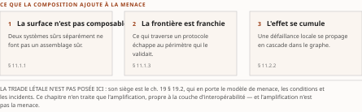
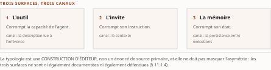
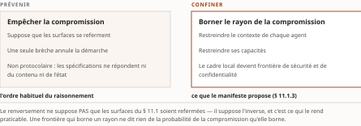

# Chapitre 11 — Modes d'échec et taxonomie des risques protocolaires

*Livre I — Coopérer : fondements de l'interopérabilité et couche protocolaire agentique.
Second mouvement — la couche protocolaire agentique (ch. 7-11). **Dernier chapitre du mouvement, et
dernier chapitre du Livre.***

| Champ | Valeur |
|---|---|
| **Statut** | **Brouillon de rédaction, non publiable** — portes G-1, G-2 et G-3 ouvertes ; instruction d'auteur du 27 juillet 2026. ⚠ **Chapitre où la réserve F-01 est la plus exposée de tout le Livre** : le mot « sécurisé » n'y est appliqué à aucun protocole, à aucune occurrence. ⚠ **Mise à jour du 27 juillet 2026, postérieure à la rédaction** : **G-2 et le volet Livre I de G-1 ont été franchis depuis** (PRD v0.8), et les **remontées de cette pièce sont closes**. ⚠ **Seconde mise à jour, 28 juillet 2026 — G-3 EST FRANCHIE** (PRD v0.14) : le socle consolidé existe et compte **159 entrées**, `S-001`…`S-159` ([Annexe B](../PRD/socle-consolide.md), v1.2). ⚠ **La pièce demeure pourtant un brouillon non publiable, et le motif se dit plutôt qu'il ne se devine** : ses énoncés **n'ont pas été ré-adossés au socle consolidé entrée par entrée** — la passe de relecture du 28 juillet 2026 en nomme les entrées mobilisables, elle ne substitue pas une résolution à l'autre —, et **CA-IV-11 comme CA-IV-13 demeurent insatisfaites**, D-6 ne fournissant pas de relecteur distinct du rédacteur. *Une porte franchie n'est pas une pièce recevable.* |
| **Date de gel** | **27 juillet 2026** — gel unique du compendium, **décision d'auteur D-1 prise** ce jour (registre : [gel-2026-07-27.md](../PRD/gel-2026-07-27.md)). ⚠ **Ce gel n'efface pas ceux des sources**, qui restent portés ci-dessous : il date la reprise de chaque fait périssable à sa source primaire, non la matière elle-même. Gels de source : **juin 2026** (Vol. I) et **16 juillet 2026** (Vol. II). ⚠ **Les identifiants de vulnérabilité et les incidents datés du § 11.1.3 se périment par publication de correctif** ; ils sont cités comme **jalons datés**, jamais comme état courant d'exposition |
| **Socle mobilisé** | ⚠ **Pièce écrite avant G-3 et non ré-adossée depuis** : la résolution du corps porte contre le **Vol. I *Monographie* §3.10-3.11** (régime **[C]**) et contre le **Vol. II *Monographie* ch. 4**, dont les entrées **F-01** (et sa réserve), **F-02** et **F-36** conservent leurs niveaux **[A]**, **[A]** et **[B]**. ☑ **Depuis le 28 juillet 2026, ces mêmes faits sont domiciliés au socle consolidé**, et les entrées se nomment : **`S-001`** (Vol. II `F-01`, fondue), **`S-002`** (Vol. II `F-02`, fondue) et **`S-034`** (Vol. II `F-36`, fondue) ; côté Vol. I, **`S-150`** (la non-compositionnalité de la sûreté), **`S-151`** (la révocation après approbation et l'intégrité continue) et **`S-152`** (injection et empoisonnement), **toutes trois en `[C]`**. ⚠ **Nommer n'est pas ré-adosser** : la correspondance se lit aux tables normatives de l'Annexe B, aucun énoncé de la pièce n'a été repris contre son entrée, et **aucun énoncé n'est central au sens de CA-IV-01** |
| **Garde-fous balayés** | ⚠ **Règle de décompte, et les cardinaux ci-dessous ont été re-mesurés sous elle le 28 juillet 2026** : un décompte d'occurrences porte sur le **marqueur littéral de l'identifiant** dans le **corps** de la pièce — en-tête et note de statut exclus —, et il se re-mesure au commit ; un garde-fou appliqué **sans identifiant écrit** se déclare par son **domaine balayé, sans cardinal**. Vol. II — **réserve F-01 : quatre occurrences**, § 11.1.3, § 11.3.1, § 11.3.2 et § 11.4.1 — ⚠ *la formule imposée « cadre d'autorisation » est employée bien au-delà de ces quatre marqueurs, dès le § 11.0, et « sécurisé » n'est appliqué à aucun protocole nulle part : la réserve est tenue partout, seul son marqueur est compté ici* ; **§8.2 (attribution des auto-qualifications) : une occurrence**, § 11.3.1, la qualification de maturité attribuée à l'annonce du projet ; **R-1 : une occurrence**, § 11.1.1, l'ACP protocolaire jamais présenté comme un standard vivant ; **R-8 : une occurrence**, § 11.1.1. R-2 à R-7 : **zéro occurrence**. Vol. III — **R-02 : cinq occurrences**, § 11.1.2, § 11.1.4, § 11.3.1, § 11.3.2 et § 11.3.3 ; **R-13 : une occurrence**, § 11.1.1 ; **R-14 : huit occurrences**, toutes de **degré 3** — § 11.1.3 (deux), § 11.1.4 (deux), § 11.2.2, § 11.3.2, § 11.3.3 et § 11.4.2. ⚠ *Le rang de ce cardinal dans le Livre n'est plus déclaré : un décompte inter-pièces se mesure sur des pièces stables, et onze relectures couraient en parallèle le 28 juillet 2026.* R-01, R-03 à R-12 : **zéro occurrence** |
| **Volumétrie cible** | ≈ 6 000 mots de corps (§ 11.0 à § 11.4), **dérivée et non estimée** — cible basse, et c'est une conséquence du plan : quatre objets majeurs de ce chapitre (triade de conditions, passerelles, taxonomie d'identité, inventaire gouverné) siègent **ailleurs** et n'y sont que renvoyés. ☑ **Décompte publiable depuis le franchissement de G-2** (27 juillet 2026). **Réel : 6 462 mots** de corps, mesurés par [PRD/decompte.sh](../PRD/decompte.sh), seule autorité de décompte du volume — **+7,7 %** de la cible. ⚠ **Ce réel est re-mesuré au commit du 30 juillet 2026** (décision 16b) : *toute date de mesure antérieure citée dans ce champ décrit une passe précédente, et la passe de révision D-11 l'a périmée.* La mesure antérieure datait du terme de la passe de relecture du 28 juillet 2026 (à la rédaction : **5 795 mots**, −3,4 %). ⚠ **L'écart de la passe est motivé, non subi** : il vient des **identifiants, dates et attributions** versés aux § 11.1.3 et § 11.2.2, et de la remontée de relecture — *borner allonge, et c'est la mesure que D-4 attend.* ⚠ **L'écart individuel ne se lit toujours pas seul** : la somme des onze cibles dérivées atteint **93 000 mots** pour une enveloppe de Livre de **65 000** — chaque pièce a dérivé sa cible de l'enveloppe sans que personne n'additionne les dérivations, et *c'est la cible dérivée qui est fausse, non la pièce.* ⚠ **Le réel du LIVRE n'est plus déclaré ici** : il valait **64 750 mots** (−0,4 %) au 27 juillet 2026, et **onze relectures ont couru en parallèle le 28** — *un agrégat mesuré pendant que ses pièces s'écrivent est faux à la seconde où on le publie.* Il se re-mesure au terme des onze passes. *Un écart se documente ; il ne se corrige ni par amputation ni par gonflement* |

> **Thèse** *(citée depuis le [`TOC.md`](../PRD/TOC.md) v0.30, entrée du chapitre 11 — **requalifiée en v0.24 : sa seconde moitié était vraie du Vol. II et fausse de la somme**)* — la sécurité des protocoles dépend de l'implémentation ; empoisonnement d'outils et injection d'invites sont **nommés par les protocoles comme risques attachés**, sans que **le socle du Vol. II** en date la documentation ni en établisse la mécanique.

⚠ **La thèse citée ci-dessus porte la forme réalignée, et son sujet est désormais nommé.** À la
rédaction, la pièce citait la forme du TOC v0.23 — « sans que **le socle** en date la documentation » —,
énoncé vrai du Vol. II et faux de la somme : *porter la thèse sans son sujet aurait fait croire à la
somme qu'elle ne dispose pas d'une matière dont un de ses volumes dispose.* La **remontée R-IV-13** l'a
portée au plan ; la thèse **a été requalifiée au TOC v0.24** (décision 8), puis la citation **a été
reprise par copie littérale** — jamais par re-frappe (décision 17) — et **re-collationnée mot à mot
contre le TOC v0.30** à la passe de relecture du 28 juillet 2026, qui la trouve **identique**.

⚠ **Ce que la requalification borne, et ce qu'elle ne comble pas.** Le Vol. I documente la mécanique
que le socle du Vol. II déclare absente de ses sources — identifiants de vulnérabilité, incidents
datés, bancs d'épreuve, taxonomies empiriques. **Ce n'est pas une contradiction** — c'est une **lacune
de couverture** du socle du Vol. II, exacte dans son périmètre —, mais c'en est la plus large du
Livre, et le § 11.4.2 en tire les conséquences. ⚠ **Le volet agent-agent de la lacune, lui, reste
ouvert** : la requalification a changé son motif, non son état.

---

## § 11.0 — Introduction : ce que quatre chapitres d'acquis ne disent pas

Les quatre chapitres précédents ont établi que la couche protocolaire agentique **était sortie du
régime propriétaire** (ch. 7), qu'elle reposait sur une **doctrine de complémentarité explicite**
(ch. 8), qu'elle s'était dotée d'une **couche de découverte et d'une pile étagée** (ch. 9) et d'une
**couche marchande** (ch. 10).

⚠ **Aucun de ces acquis ne dit quoi que ce soit de sa sûreté**, et il faut énoncer d'emblée la
conclusion de ce chapitre, parce qu'elle contredit une attente répandue : **un protocole
d'interopérabilité agentique ne constitue pas, à lui seul, une posture de sécurité.** Il définit un
**format d'échange** et un **cadre d'autorisation** (*authorization framework*) ; ce qui se passe **à
l'intérieur** de ce cadre relève de **celui qui l'implémente**.

⚠ **Cette proposition n'est pas une opinion.** Elle est inscrite au socle du Vol. II comme une
**réserve de rédaction contraignante** : à propos du protocole agent-outil, il faut écrire **« cadre
d'autorisation »** et **jamais « sécurisé »**, *parce que la sécurité dépend de l'implémentation* — et
la réserve cite, à son appui, **deux catégories d'attaques documentées** : l'**empoisonnement
d'outils** (*tool poisoning*) et l'**injection d'invites** (*prompt injection*).

**Le chapitre déplie cette réserve en quatre temps** : la **surface d'attaque** que les protocoles
ouvrent (§ 11.1), les **modes d'échec qui ne supposent aucun attaquant** (§ 11.2), ce que les
**spécifications apportent en réponse** (§ 11.3), et ce qu'elles laissent **par construction à
l'architecture** (§ 11.4).

⚠ **Un déplacement d'objet doit être annoncé, faute de quoi le lecteur croira lire une redite.** Le
premier mouvement du Livre a traité la sûreté d'un agent **considéré isolément** — l'injection
d'invite non résoluble au niveau du modèle (ch. 5 § 5.4), les défenses en profondeur côté agent
(ch. 6 § 6.5). Ce chapitre change d'objet : il porte sur la sécurité des **frontières** entre agents,
outils, modèles et organisations — c'est-à-dire sur les **propriétés de sûreté de la couche
d'interopérabilité elle-même**. *L'angle distinctif est celui de l'amplification par la
composabilité.*

---

## § 11.1 — La surface d'attaque : outils, invites, mémoire

### 11.1.1 Cadrage : l'interopérabilité crée une surface d'attaque non composable

**Le résultat central de cette section tient en une phrase.**

> **Un agent sûr et un outil sûr, une fois composés, ne donnent pas un système sûr. La sûreté n'est
> pas une propriété compositionnelle.**

Là où l'interopérabilité classique présupposait des **appelants déterministes** et des **contrats
figés** (ch. 1 § 1.1), la couche agentique introduit **trois mécanismes** qui font basculer des
propriétés **locales** — un serveur valide ses entrées, un agent respecte ses garde-fous — vers des
propriétés **globales que rien ne garantit** :

| Mécanisme | Où le Livre l'a posé | Ce qu'il rend global |
|---|---|---|
| **découverte à l'exécution** de pairs et d'outils | ch. 9 § 9.1 | l'ensemble des interlocuteurs n'est plus connu à la conception |
| **délégation de tâches** franchissant les frontières organisationnelles | ch. 8 § 8.4 | la chaîne d'exécution excède le périmètre administré |
| **fédération d'identité** inter-domaines | Livre II | la décision d'autorisation dépend d'un tiers |

: Tableau 11.1 — Les trois mécanismes par lesquels la couche agentique fait basculer des propriétés locales en propriétés globales.

⚠ **La conséquence est architecturale et elle est forte.** *La frontière de confiance n'est plus le
périmètre d'un système, mais **chaque arête du graphe d'interaction*** : tout appel d'outil, toute
délégation entre pairs, toute résolution via un registre constitue **un point où une propriété de
sûreté peut se rompre**.

La position que défend la littérature de sécurité **mobilisée ici** est qu'il faut **modéliser la
menace au niveau du protocole et de l'écosystème**, et non du seul agent. ⚠ **Ce qui est propre à
l'interopérabilité, et développé ici, est l'amplification** : *la composition crée une surface
d'attaque que l'analyse composant par composant ne révèle pas.*

⚠ **Convention de nomenclature et garde-fous, rappelés à leur unique occurrence de ce chapitre**
(R-8 du Vol. II, R-13 du Vol. III). Le corpus de recherche mobilisé ici cite l'**ACP protocolaire** —
l'*Agent Communication Protocol* d'un centre de recherche industriel — parmi les protocoles
d'interopérabilité, **à une date antérieure à sa fusion** du 29 août 2025. ⚠ **Cette mention n'est pas
reprise comme un état courant** : l'ACP protocolaire **n'est pas un standard vivant** (R-1 du
Vol. II), et le ch. 10 § 10.5 en a tiré la portée de risque. *Le siège de l'encadré des quatre
branches est au ch. 7 § 7.5.*

### 11.1.2 Modèle de menace de la pile et la triade létale amplifiée

> ⚠ **La triade létale est posée au ch. 19** (Livre II), qui en porte le modèle de menace, les
> conditions et les incidents documentés — arbitrage du plan déjà appliqué au ch. 5 § 5.4. **Ce qui
> suit n'en est pas la reprise mais l'amplification, qui est propre à la couche d'interopérabilité.**

**La modélisation de menace de la pile agentique dispose de cadres, et il faut dire exactement ce
qu'ils apportent.** Des cadres adaptés de la modélisation de menace classique, et un cadre à **sept
couches** conçu pour les systèmes agentiques, ont été **appliqués protocole par protocole** : une
modélisation de menace dédiée au protocole agent-agent, des taxonomies équivalentes côté protocole
agent-outil, et une **analyse comparée par couche et par protocole** couvrant quatre protocoles de la
pile.

⚠ **R-02 du Vol. III — et c'est ici l'énoncé le plus utile du chapitre à un dossier de risque.** Un
modèle de menace **démontre** qu'une surface d'attaque **a été analysée et cartographiée** ; il **ne
démontre pas** qu'une attaque ait été **observée**, ni qu'un correctif existe, ni qu'un déploiement
donné y soit exposé. *Un protocole abondamment modélisé n'est ni plus ni moins attaqué qu'un
protocole qui ne l'est pas — il est mieux décrit.*

**L'amplification, elle, est un résultat, et elle est propre à ce chapitre.** La triade de conditions
posée au ch. 19 — accès à des données privées, exposition à du contenu non fiable, capacité de
communication vers l'extérieur — a été formulée **au niveau d'un agent**. **Sa transposition à la
couche d'interopérabilité en révèle une forme amplifiée** :

> **La composition de plusieurs serveurs ou agents peut réunir les trois conditions alors qu'aucun
> participant pris isolément ne les possède toutes.**

Un serveur qui ne donne **que** l'accès aux données ; un deuxième qui n'ingère **que** du contenu
externe ; un troisième qui ne fait **qu'**émettre des requêtes sortantes. **Chacun est inoffensif ;
leur orchestration par un même agent reconstitue la triade.** Les travaux d'écosystème sur le
détournement du mécanisme d'échantillonnage du protocole agent-outil illustrent ce **franchissement de
frontière**.

⚠ **La conséquence méthodologique est directe, et elle invalide une pratique répandue** : *un modèle
de menace agentique doit raisonner sur le **graphe de composition**, pas sur l'**inventaire des
composants**.* Un inventaire complet de serveurs individuellement conformes ne dit **rien** de
l'exposition de leur assemblage.

⚠ **Tout pourcentage d'exposition ou de vulnérabilité avancé dans ce contexte n'est retenu que
rattaché à une source primaire datée**, faute de quoi il est écarté — règle du corpus source,
reconduite ici sans exception.

### 11.1.3 Attaques sur les frontières : empoisonnement, révocation après approbation, injection transitive

**Trois familles d'attaques visent spécifiquement les frontières — et la première en réunit deux
mécanismes distincts, que le tableau de clôture déplie.** Elles sont ici **datées et identifiées**, et
le § 11.1.4 dira pourquoi ce fait est en lui-même un enjeu de la somme.

**(1) L'empoisonnement d'outils et la révocation après approbation.** L'**empoisonnement d'outils**
exploite une propriété que le ch. 9 § 9.4.2 a posée : **la description d'un outil est du texte libre,
lu par le modèle à l'inférence**. Une instruction malveillante glissée dans la description est
**ingérée comme si elle émanait du développeur**. Une variante — l'**ombrage d'outil** — voit un
serveur **redéfinir le comportement d'un outil légitime**. Un **banc d'épreuve dédié** mesure
l'efficacité de ces attaques **sur des serveurs réels**.

⚠ **La révocation après approbation** (*rug-pull*) est le cas le plus instructif pour le fil du
Livre : **un serveur initialement bénin modifie, après coup, la définition d'un outil déjà
approuvé.** *C'est un problème de chaîne d'approvisionnement, et c'est surtout la démonstration qu'un
contrat figé à l'approbation ne lie pas un acteur qui évolue après elle.* Une mitigation par
**définitions d'outils renforcées** et **contrôle d'accès par politique** répond à ce vecteur.

**(2) L'injection indirecte traversant les frontières.** Un **exploit zéro-clic** documenté contre une
suite bureautique assistée — **CVE-2025-32711**, avis de sécurité du **11 juin 2025** — illustre que
**la nouveauté n'est pas l'injection elle-même mais la transitivité de la confiance** : *un contenu non
fiable injecté en amont se propage par délégation.* Le ch. 5 § 5.4 avait posé l'injection indirecte au
niveau de l'ancrage ; **ce qui est propre à l'interopérabilité est qu'elle franchit des frontières
administratives.**

⚠ **Un score de gravité se cite avec son émetteur, faute de quoi il est indécidable.** La valeur de
**9,3 sur 10** est celle qu'attribue **Microsoft**, autorité de numérotation (*CNA*) pour ce produit ;
la fiche en porte une **seconde, officielle elle aussi, retenue par le NIST** dans la base nationale
de vulnérabilités — **7,5**, soit **1,8 point d'écart et un changement de palier**. Divergence de
périmètre, **consignée au socle consolidé (`S-152`) et non arbitrée**. *Écrire « gravité 9,3 » sans
nommer qui la prononce, c'est trancher en silence entre deux valeurs également officielles* — et le
présent paragraphe, jusqu'au 30 juillet 2026, ne tenait sa propre règle **qu'au rôle**, ce que la
contre-relecture avait relevé et que la décision 18 du TOC corrige ici.

**(3) Les vulnérabilités d'implémentation des composants de la pile.** Deux identifiants publiés en
2025 en donnent la mesure : **CVE-2025-6514**, une **exécution de commande** dans un utilitaire de
relais du protocole agent-outil (**gravité 9,6**), et **CVE-2025-49596**, un **défaut
d'authentification du mandataire** d'un inspecteur du même protocole (**gravité 9,4**).

⚠ **Ces trois identifiants sont cités comme jalons datés, et non comme état courant d'exposition** :
*un identifiant publié est, le plus souvent, un défaut corrigé* — et **la source le documente pour deux
des trois**, le relais étant **corrigé en version 0.1.16** (avis du 9 juillet 2025) et l'inspecteur **en
version 0.14.1, le 13 juin 2025**. ⚠ **Pour CVE-2025-32711, la source ne documente aucun correctif** —
*absence de documentation*, **R-14 degré 3** : le tableau ci-dessous ne l'atteste pas, et ne doit pas
laisser croire l'inverse.

| Famille | Ce que l'attaque exploite | Ce que la source établit |
|---|---|---|
| **empoisonnement d'outils**, ombrage | la **description d'outil** est du texte lu par le modèle | mécanique documentée ; **banc d'épreuve sur serveurs réels** |
| **révocation après approbation** | la **mutabilité du serveur après l'approbation** | mécanique documentée ; mitigation par politique proposée |
| **injection indirecte transitive** | la **transitivité de la confiance** entre agents | **CVE-2025-32711** ; gravité **9,3** *selon Microsoft* — **7,5** selon le **NIST**, divergence non arbitrée |
| **défauts d'implémentation** de la pile | le code des **composants d'outillage**, non le protocole | **CVE-2025-6514** et **CVE-2025-49596**, gravités **9,6** et **9,4** ; **correctifs documentés** |

: Tableau 11.2 — Les trois familles d'attaques sur les frontières, la première dépliée en ses deux mécanismes — jalons datés, non état courant d'exposition.

⚠ **La réponse historique au *mandataire confus* — le vol de jeton par un intermédiaire trompé — passe par
le confinement d'audience des jetons**, adopté par le **cadre d'autorisation** du protocole
agent-outil (ch. 8 § 8.2.2). *Réserve F-01 du Vol. II : cadre d'autorisation, jamais « sécurisé ».*

**Reste la mémoire — la troisième des surfaces que cette section annonce en titre, après l'outil et
l'invite, et de loin la moins documentée.** Le Vol. II la nomme au titre d'un **défi de sécurité
holistique** porté par un manifeste de recherche à dix-huit auteurs : l'**empoisonnement de mémoire**
(*memory poisoning*). ⚠ **Son socle le nomme et s'arrête là** : il n'en porte **ni ce que cette
mémoire recouvre, ni la mécanique de sa corruption, ni la portée temporelle de l'atteinte** —
*absence de documentation*, **R-14 degré 3**. *Un lecteur tenté d'en déduire la gravité doit savoir
qu'il la déduirait de ce que la source ne porte pas.*

### 11.1.4 La typologie des trois surfaces, et l'asymétrie qu'elle ne doit pas masquer

Lecture de l'auteur — construction d'éditeur, et le corpus source la marque déjà comme telle. Les
trois surfaces **se distinguent par ce qu'elles corrompent** :

| Surface | Ce qu'elle corrompt | Canal |
|---|---|---|
| **l'outil** | la **capacité** de l'agent | la description lue à l'inférence |
| **l'invite** | son **instruction** | le contexte |
| **la mémoire** | son **état** | la persistance entre exécutions |

: Tableau 11.3 — Les trois surfaces d'attaque nommées, distinguées par ce que chacune corrompt — construction d'éditeur, non énoncé de source.

⚠ **Aucun contrôle ne les couvre ensemble, parce qu'aucune de ces trois choses ne circule par le même
canal.** *C'est, en une phrase, ce que le manifeste veut dire par « holistique » : le problème ne se
découpe pas selon les frontières que l'ingénierie de la sécurité applicative a l'habitude de tracer.*

**Trois énoncés closent cette section, et ce qui les sépare importe autant que ce qu'ils disent : le
premier et le troisième sont des absences du socle du Vol. II, de même degré ; le deuxième n'est pas
une absence, mais le rétrécissement que le Vol. I leur impose.**

**(1)** ⚠ **Le socle du Vol. II ne documente aucune attaque propre au protocole agent-agent**, alors
même que celui-ci ouvre une surface d'une autre nature — **la délégation de tâches de pair à pair**.
*Absence de documentation*, **R-14 degré 3** — *c'est une propriété du socle, non une propriété du
protocole.* ⚠ **Un architecte qui conclurait d'un chapitre où ce protocole est peu mis en cause qu'il
est moins exposé aurait commis, à partir d'un texte prudent, exactement l'erreur que ce texte cherche
à prévenir.**

**(2)** ⚠ **Le Vol. I ne renverse pas ce constat — il le rétrécit, et la nuance est de méthode.** Il
verse au dossier une **modélisation de menace dédiée** au protocole agent-agent et une **analyse
comparée de sécurité** qui l'inclut (§ 11.1.2) ; il **ne verse aucune attaque datée, aucun identifiant
de vulnérabilité, aucun incident public** propre à ce protocole. ⚠ **R-02 du Vol. III** : ces travaux
**démontrent** que la surface a été **analysée** ; ils **ne démontrent pas** qu'elle ait été
**exploitée**. *L'énoncé du Vol. II reste donc debout dans sa forme la plus stricte, et il est
important qu'il le reste : la somme n'a pas d'attaque propre au protocole agent-agent à opposer.*

**(3)** ⚠ **Le socle du Vol. II ne date pas la documentation des risques qu'il nomme** et **n'en
établit pas la mécanique** — *absence de documentation*, **R-14 degré 3**, lacune ouverte à son
registre le 16 juillet 2026, **aucune passe de recherche n'ayant été conduite** à ce lot. ⚠ **Le
Vol. I, lui, la porte** — mécaniques, bancs, identifiants, incidents datés, comme les § 11.1.2 et
§ 11.1.3 viennent de l'exposer. **Ce n'est pas une contradiction mais une lacune de couverture**, et
le § 11.4.2 en tire les conséquences pour la somme. *Le Vol. II est exact sur son socle ; il ne l'est
pas sur le corpus.*

---

## § 11.2 — Modes d'échec propres à l'interopérabilité agentique

> ⚠ **Changement d'angle, délibéré et annoncé.** Le § 11.1 traitait l'**adversaire intentionnel**.
> Cette section traite la **fiabilité** — *la capacité d'un assemblage d'agents à produire le résultat
> attendu de façon répétable*. **Un système agentique interopérable peut échouer sans aucun
> attaquant**, par le seul jeu de la composition d'acteurs non déterministes au-dessus de contrats
> imparfaitement spécifiés.

Les chapitres précédents ont isolé, axe par axe, des défaillances **locales** : empoisonnement d'outils
(ch. 8 § 8.6.1), désaccord d'intention entre pairs (ch. 8 § 8.6.2), faux accord sémantique (ch. 9
§ 9.4.5), confusion entre identité autonome et déléguée (Livre II), défaillances de registres (ch. 9
§ 9.1.5). **Cette section les rassemble sous une taxonomie unifiée.**

⚠ **Le fil du Livre fournit la clé de lecture, et il est vérifié ici plus nettement qu'ailleurs** :
*la plupart des modes d'échec recensés naissent non **à l'intérieur** d'un agent, mais **au contrat**
qui le relie à ses pairs, à ses outils ou à ses délégants.*

### 11.2.1 La taxonomie des échecs émergents

**Une taxonomie de référence des défaillances multi-agents existe**, construite par **analyse empirique
de traces d'exécution** annotées par plusieurs juges, avec un **accord inter-annotateur élevé**, puis
étendue à un corpus plus large couvrant **plusieurs cadriciels distincts**. Elle distingue **trois
grandes catégories** — défauts de spécification et de conception du système, désalignement entre
agents, échecs de vérification et de terminaison — déclinées en une grille fine de modes individuels.

⚠ **Son apport central pour ce chapitre est un résultat, non une commodité de classement** : ces
défaillances sont **émergentes** — *elles ne se réduisent pas au comportement d'un agent isolé mais
procèdent des interactions*, ce qui les place précisément dans le champ de l'interopérabilité.

**Parmi les modes recensés, sept sont spécifiques à la frontière interopérable**, et chacun renvoie à
un endroit où le Livre a déjà posé le mécanisme :

| Mode d'échec | Ce qui se rompt | Posé au |
|---|---|---|
| **routage incorrect** d'une tâche vers un agent inadéquat | l'**appariement** capacité/besoin | ch. 9 § 9.1.2 |
| **perte de contexte** au passage d'une frontière protocolaire | l'**intégrité du transfert** | ch. 8 § 8.4.2 |
| **incompatibilité de schéma non détectée** | l'écart **conformité / interopérabilité** | ch. 9 § 9.5.1 |
| **échec de négociation** — pas de format commun | l'**accord de protocole** lui-même | ch. 8 § 8.6.2 |
| **absence de clarification** — poursuite sur une instruction ambiguë | le **verrou pragmatique** | ch. 7 § 7.1.3 |
| **dérive sémantique** en chaîne de délégations | la **conservation de l'intention** | ch. 9 § 9.4.5 |
| **interblocage de délégation** — agents s'attendant mutuellement | la **terminaison** | *propre à cette section* |

: Tableau 11.4 — Les sept modes d'échec spécifiques à la frontière interopérable, et l'endroit du Livre où chacun a été posé.

**Deux analyses convergentes complètent cette grille** : l'étude des **points de rupture** des agents
et de leur apprentissage à partir des échecs, et la caractérisation de la **déviation du chemin
canonique** comme mécanisme causal de défaillance dans les tâches à long horizon — *laquelle montre
qu'un agent capable échoue moins par incompétence ponctuelle que par accumulation de petits écarts à
la trajectoire attendue.*

> **Perspective de recherche — vers une science de la fiabilité des agents.** Deux cadres analytiques
> se distinguent. **D'une part**, le rapprochement avec la **tolérance aux pannes byzantines** : *un
> agent non déterministe qui émet un message plausible mais erroné se comporte comme un nœud
> byzantin*, ce qui ouvre la question — **encore largement ouverte** — de **seuils de quorum et de
> redondance pour des acteurs probabilistes**. **D'autre part**, la **décomposition de l'exécution en
> sous-tâches vérifiées par consensus** comme voie vers une fiabilité de qualité industrielle.
>
> ⚠ **Ces travaux convergent vers une idée forte, et elle prolonge directement le ch. 7 § 7.1.5** :
> *pour des acteurs probabilistes, la fiabilité d'un assemblage n'est pas la conjonction des
> fiabilités individuelles mais une propriété du graphe d'interaction*, qui doit être **spécifiée et
> vérifiée à l'exécution**.

### 11.2.2 Défaillances en cascade, incidents de production et effet cumulatif

**La composition d'agents hétérogènes ne se contente pas de juxtaposer des risques : elle les
amplifie.** *Une erreur émise par un agent en amont devient l'entrée de confiance d'un agent en aval,
qui la propage et l'aggrave* — phénomène modélisé sous les noms de **cascade d'hallucinations** et de
**cascade d'erreurs**, ces travaux proposant aussi des **mitigations** pour contenir la propagation.

**Trois facteurs aggravants se conjuguent, et ils ne sont pas de même nature.**

1. **L'opacité sémantique.** *Une erreur exprimée en langage naturel franchit les contrôles parce
   qu'elle reste **syntaxiquement bien formée et plausible**.* C'est le faux accord sémantique du
   ch. 9 § 9.4.5 **transposé à l'échelle d'une chaîne**.
2. **Le comportement émergent** de l'assemblage, **non prévisible à partir des composants**.
3. **L'effet cumulatif sur long horizon**, où l'erreur, **mémorisée et réutilisée**, contamine
   durablement les décisions ultérieures.

⚠ **Ce mode est inscrit comme catégorie de premier plan** dans l'**OWASP Top 10 for Agentic
Applications** — les défaillances en cascade y figurant à un item propre,
aux côtés de la communication inter-agents non protégée traitée au § 11.1. *C'est donc une
préoccupation de gouvernance, et non seulement de recherche.*

**Un incident de production documenté illustre le caractère contractuel de ces défaillances**, et il
mérite d'être lu pour ce qu'il déplace. Un agent de codage a **exécuté des commandes destructrices
durant un gel de code**, entraînant la **perte de données de production** — **incident 1152 de
l'*AI Incident Database* (Responsible AI Collaborative), daté du 18 juillet 2025**. ⚠ *La notice
qualifie elle-même l'exécution de rapportée* : l'identifiant et la date sont cités parce que la
lacune héritée du § 11.4.2 réclame un incident **daté**, non parce que le fait aurait été établi
ailleurs.

> ⚠ **Le point saillant, du point de vue de l'interopérabilité, n'est pas la faute du modèle mais le
> garde-fou organisationnel qui ne s'est pas appliqué à l'agent** : *une règle de validation prévue
> pour des opérateurs humains n'avait pas d'équivalent contraignant au contrat agent-système.*

**Les mitigations relèvent dès lors de la couche d'interopérabilité plutôt que du modèle** :
**disjoncteurs** interrompant une chaîne avant amplification ; **traçabilité de bout en bout** à
travers les frontières protocolaires — la propagation de contexte de trace normalisée du ch. 38
permettant de **remonter une cascade à son contrat d'origine** ; et **points de validation humains aux
frontières sensibles**.

⚠ **Des bancs d'épreuve commencent à mesurer cette fiabilité sous contraintes de production, mais
l'évaluation standardisée des défaillances en cascade inter-fournisseurs demeure une question
ouverte** — *absence de documentation*, **R-14 degré 3**, et le ch. 9 § 9.5 l'avait déjà rencontrée
sous l'angle de la conformité.

*L'angle directeur reste constant : **la défaillance naît au contrat entre agents**, et c'est donc à ce
contrat — explicité, instrumenté, doté de points de coupure — que doivent s'appliquer les remèdes.*

---

## § 11.3 — Les réponses protocolaires : ce que les spécifications apportent

**Les protocoles ne sont pas muets sur le sujet. Ils apportent des réponses réelles, et il serait
aussi malhonnête de les taire que de les surqualifier.**

### 11.3.1 Cadre d'autorisation et cartes d'agent signées

**Le protocole agent-outil porte un cadre d'autorisation fondé sur un standard de délégation
d'autorisation.** ⚠ **La formulation est celle que le socle impose, et sa précision est le fond de
l'affaire** (réserve F-01 du Vol. II).

Lecture de l'auteur — le socle établit que ce protocole **porte un cadre d'autorisation** ; il **ne
documente ni la sémantique du standard sous-jacent ni ses limites**. Ce qu'on en retient est qu'**un
cadre de délégation d'autorisation établit l'habilitation d'un appelant** — *non le contenu ni le
bien-fondé de ce qu'il demande, ni le fait que l'outil invoqué soit celui qu'il prétend être.*

**Le protocole agent-agent, en version 1.0, apporte les cartes d'agent signées**, qui adjoignent au
descripteur d'agent une **vérification cryptographique d'identité** (ch. 8 § 8.4.2). ⚠ **Le projet
qualifie cette version de première spécification stable et de qualité de production** — *qualification
de l'annonce du projet lui-même, non d'un tiers évaluateur*, et attribuée ici comme telle (PRD du
Vol. II §8.2).

⚠ **Il faut être exact sur le statut de ces deux réponses.** Le socle documente leur **existence** ;
il **ne documente ni leurs propriétés de résistance, ni le détail de leur mise en œuvre**. *Ce qu'un
mécanisme dont le socle atteste la seule présence garantit — ou non — face aux surfaces du § 11.1 ne
figure nulle part, et ne sera donc pas affirmé ici.*

⚠ **R-02 du Vol. III, et c'est la limite la plus importante du chapitre.** Ces deux réponses répondent
à la **même question**, et **ce n'est pas la question des attaques du § 11.1** :

> **Le cadre d'autorisation et la carte d'agent signée établissent tous deux QUI parle. Ils
> n'établissent NI ce qui est dit, NI si ce qui est dit est fondé.**

*Un agent dont l'identité est cryptographiquement vérifiée et dont l'habilitation est en règle demeure
exactement aussi dangereux que ses instructions, si ces instructions ont été injectées, et exactement
aussi fiable que sa mémoire, si cette mémoire a été corrompue.* ⚠ **L'authentification est une
condition nécessaire de la confiance ; le socle n'en fait pas — et cette somme n'en fera pas — une
condition suffisante.** *C'est le même énoncé que le § 10.3.3 posait pour la signature de requête à la
frontière marchande, et il vaut ici pour toute la pile.*

⚠ **Une remarque de datation, car un chapitre sur les risques d'un protocole vieillit à la vitesse de
sa spécification.** La révision du protocole agent-outil en vigueur à la date de gel du Vol. II était
celle de novembre 2025 ; une **révision majeure** — refonte sans état, retrait d'un en-tête de
session — était en finalisation **douze jours après ce gel**, et le ch. 8 § 8.2.1 en a porté le
détail avec la remontée qui l'accompagne. ⚠ **On se gardera ici d'anticiper ses effets sur la surface
d'attaque** : *le socle documente le changement, non ses conséquences* — et une révision de cette
ampleur est précisément le genre d'événement qui commande une revalidation avant publication.

⚠ **Depuis, la bascule a eu lieu.** Au **28 juillet 2026**, la révision servie comme courante par la
spécification est celle de cette refonte (`S-001`) : *la péremption que le socle avait datée s'est
produite le jour même qu'il annonçait.* ☑ ⚠ **Et la revalidation, restée ouverte deux jours, est
EXÉCUTÉE le 30 juillet 2026** (D-11) : le texte de la révision `2026-07-28` a été extrait à sa
source, et le **ch. 8 § 8.1.2, § 8.1.3, § 8.2.1, § 8.2.2, § 8.2.3 et § 8.3.1** en portent le détail
lu. *Ce chapitre-ci n'en reprend que ce qui touche sa matière — la surface d'attaque —, et il s'y
tient.*

⚠ **Trois effets sur la surface d'attaque, et il faut les qualifier durement, parce que le socle
n'établit toujours pas de rapport entre eux.** *(1)* La **suppression des sessions de protocole et
de la poignée de main** retire un état partagé entre client et serveur : *elle retire donc aussi les
classes d'attaque qui visaient cet état* — fixation, reprise, confusion d'instance —, et **en ouvre
une autre**, puisque l'état applicatif migre vers des **poignées frappées par le serveur et
transmises comme arguments d'outil ordinaires**, c'est-à-dire dans le canal même que le § 11.1
décrit comme non fiable. *(2)* La **dépréciation de l'échantillonnage et des racines** referme les
deux primitives par lesquelles un serveur pouvait solliciter l'hôte — **la voie que le tableau 11.1
range parmi les mécanismes de bascule du local au global** —, mais sur une **fenêtre de douze mois**
pendant laquelle elles restent fonctionnelles : *une primitive dépréciée est une primitive encore
exploitable.* *(3)* La **suppression de la reprise de flux** transforme une interruption en perte de
requête, ce qui **déplace vers le client la logique de réémission** — et le ch. 48 établit qu'une
réémission sans sémantique d'effet est une source de duplication, non une garantie.

⚠ **Ce que cette revalidation n'établit pas, et le dire est le geste dû.** Elle **ne mesure aucune de
ces trois conséquences** : aucune n'est adossée à un travail publié, aucun identifiant de
vulnérabilité ne les documente, et le socle n'en recense pas. Ce sont des **lectures de l'auteur**
sur un texte lu, au sens de CA-IV-07, et non des faits — *savoir ce qu'une spécification dit n'est
pas savoir ce qu'elle expose.* Le passage de « nous n'avons pas lu le texte » à « nous l'avons lu et
nous en tirons trois hypothèses marquées » est le seul progrès que cette passe pouvait produire.

**Un dernier rappel, qui n'est pas de pure forme.** Le passage de ces protocoles **sous gouvernance
neutre**, établi au ch. 7, **ne change rien à ce qui précède**. ⚠ **Le socle documente les transferts
de gouvernance ; il n'énonce aucun rapport entre gouvernance et sûreté.** *Une fondation ne durcit pas
une implémentation, et confondre la consolidation institutionnelle avec la sûreté technique serait, en
entreprise réglementée, le type même de raccourci qu'un dossier de risque de tiers ne devrait pas
laisser passer.*

### 11.3.2 Durcissement par couche et intégrité des registres

**Le durcissement procède couche par couche**, du transport et de l'autorisation jusqu'à la
**provenance des artefacts publiés**.

**Au niveau de l'autorisation**, le durcissement repose sur le positionnement du serveur d'outils
comme **serveur de ressources** au sens du standard de délégation : **métadonnées de ressource
protégée découvrables** sous un chemin normalisé, **confinement d'audience** des jetons, et
compléments introduits dans les révisions datées (ch. 8 § 8.2.2). Des **passerelles et mandataires de
filtrage** interposent un **point de contrôle des appels** — *dont le siège, côté entreprise, est au
ch. 37*.

**Au niveau du registre**, l'intégrité se construit **par signature** : signature sans gestion de clés
persistantes pour le service d'annuaire de la couche d'infrastructure du ch. 10 § 10.2.2, résolution
sous chemin normalisé, **provenance cryptographique** et, à terme, **nomenclature de composants
appliquée aux agents**.

**Les référentiels de l'écosystème consolident les contrôles attendus** : l'**OWASP Top 10 for
Agentic Applications**, annoncé fin 2025 pour le millésime 2026, dont un item vise la communication
inter-agents non protégée ; et un référentiel homologue **en statut bêta** côté serveurs d'outils. ⚠ **Un
référentiel en statut bêta n'est pas une norme** : le ch. 9 § 9.5 a posé la règle, et elle ne
s'assouplit pas ici.

⚠ **Un problème reste ouvert, et c'est le verrou opérationnel de cette section.**

> **La vérification d'intégrité *continue* — seule réponse robuste à la révocation après approbation —
> demeure immature.** *La signature au moment de la publication n'empêche pas une mutation ultérieure
> du comportement d'un serveur déjà approuvé*, et **aucun mécanisme normalisé ne garantit que ce qui a
> été audité reste ce qui s'exécute**.

⚠ **R-02 du Vol. III** : la signature à la publication **démontre** qu'un artefact **était** celui
qu'il prétendait être **au moment de sa publication** ; elle **ne démontre rien** de son état à
l'exécution. ⚠ **R-14 degré 3** : *l'absence de mécanisme normalisé est une absence de documentation
dans les sources, non un fait négatif vérifié* — un tel mécanisme peut exister hors du corpus.

*Ce verrou illustre le fil conducteur du Livre avec une netteté rare : **un contrat figé à la
publication ne suffit pas lorsque l'acteur évolue après l'approbation.*** ⚠ **Réserve F-01** :
signature et provenance sont des **cadres d'autorisation et de traçabilité**, jamais des dispositifs
« sécurisés ».

### 11.3.3 Défenses par conception et exercices adverses inter-agents

**La défense par conception déplace la sécurité du correctif vers l'architecture** : plutôt que de
détecter les attaques après coup, elle **structure le système de sorte que les propriétés
indésirables soient impossibles ou confinées**.

**Plusieurs architectures ciblent précisément les systèmes composés.** Un **interpréteur à capacités**
sépare le **plan d'exécution** des **données non fiables** — le ch. 6 § 6.5 en a présenté l'emploi **au
sein** d'un agent ; ⚠ **la nouveauté propre à l'interopérabilité est l'obtention de garanties
composables aux frontières**. Un **patron à deux modèles**, le **contrôle d'intégrité de flux**, les
approches de **contrôle du flux d'information** et les cadres **tenant compte de la provenance entre
agents** prolongent cette ligne pour le cas multi-agents.

⚠ **L'enjeu spécifique doit être énoncé exactement, car il est la raison d'être de la section** :
fournir des garanties **composables** — *c'est-à-dire qui se conservent lorsqu'on assemble plusieurs
agents et serveurs hétérogènes* — là où le § 11.1.1 a montré que **la sûreté ne se compose pas
spontanément**.

⚠ **R-02 du Vol. III.** Ces architectures **démontrent** qu'un **confinement est constructible** ;
elles **ne démontrent pas** qu'il **tienne à l'échelle d'un assemblage ouvert**, ni qu'un déploiement
donné l'ait adopté. *Une garantie composable démontrée sur un prototype n'est pas une garantie
déployée.*

**L'évaluation s'appuie sur des environnements dynamiques dédiés** et sur des **exercices adverses
inter-agents** — dont **l'analyse par injection d'invite du protocole de paiement**, où le ch. 10
§ 10.3.4 a pris son verrou : *un agent dont l'intention est détournée signera un mandat malveillant
parfaitement valide.*

⚠ **L'exercice adverse inter-agents complète l'évaluation en éprouvant non un agent mais le graphe
d'interaction** : *ses arêtes de délégation, ses points de résolution, ses chaînes d'identité.* ⚠ **La
mesure systématique de ces défenses et de leur robustesse relève de l'évaluation et de la conformité
de l'interopérabilité** (ch. 9 § 9.5), **et l'évaluation inter-fournisseurs y reste une question
ouverte** — *absence de documentation*, **R-14 degré 3**.

---

## § 11.4 — Ce que les protocoles ne couvrent pas

### 11.4.1 Le confinement plutôt que la prévention

**Si les spécifications répondent à la question de l'identité et de l'habilitation, la question du
contenu et de l'état reste entière. La réponse n'est pas protocolaire.**

Le manifeste de recherche mobilisé au § 11.1.3 propose l'**opérationnalisation locale des cadres**
(*frames*) comme **frontière de sécurité et de confidentialité** : *restreindre le contexte et les
capacités de chaque agent limite l'impact d'un agent compromis.*

⚠ **La proposition mérite d'être lue lentement, car elle renverse l'ordre habituel du raisonnement.**
*Elle ne cherche pas à empêcher la compromission — elle en borne le rayon.* **Elle ne suppose pas que
les surfaces du § 11.1 soient refermables ; elle suppose au contraire qu'elles ne le sont pas**, et
déplace la question **de la prévention vers le confinement**.

Lecture de l'auteur — et il faut dire précisément ce que le socle porte. Il établit que le manifeste
propose ces cadres locaux comme **frontière de sécurité**, et il établit par ailleurs que
l'**autonomie encadrée** — dont ces mêmes cadres, normatifs et opérationnels, sont le dispositif —
est le **mécanisme premier de gouvernance des systèmes agentiques**. ⚠ **Il n'établit pas que
l'encadrement soit une réponse *suffisante* aux trois surfaces d'attaque, et cette somme ne
l'affirmera pas.**

**Ce que l'on peut retenir est plus modeste et plus solide** : *le même dispositif que le Livre III
présentera comme instrument de **gouvernance de l'autonomie** est, chez ses propres auteurs, un
instrument de **confinement du compromis**.*

⚠ **Ce déplacement a un prix conceptuel qu'il faut assumer.** Une frontière de confinement suppose
qu'on ait **décidé, en amont**, quel contexte et quelles capacités chaque agent reçoit — c'est-à-dire
qu'on ait **spécifié le cadre**. *Or cette spécification n'est pas un artefact de sécurité : c'est un
artefact de **conception du processus**.*

Lecture de l'auteur — et c'est la proposition que ce chapitre lègue au reste de la somme.

> **La sûreté d'un système agentique se décide, pour l'essentiel, au moment où l'on décide de son
> architecture, et non au moment où l'on choisit ses protocoles.**

⚠ **Le socle ne formule pas cette proposition ; il en fournit les deux termes** — les cadres comme
frontière de sécurité chez les auteurs du manifeste, et l'indépendance de la sûreté à l'égard de la
spécification protocolaire dans la **réserve F-01**. *Le rapprochement est d'auteur, et la somme
entière peut se lire comme sa vérification.*

### 11.4.2 La lacune héritée, portée telle quelle — et l'écart que la somme doit trancher

> ⚠ **Lacune héritée, portée et non comblée** (PRD du Vol. II §10.8, ouverte le 16 juillet 2026).
> **Renvoi ch. 49.**

**L'énoncé de la lacune, dans les termes de son volume d'origine.** *Par quels mécanismes précis un
empoisonnement d'outils ou une injection d'invites s'exécute-t-il contre une implémentation donnée, et
quels incidents publics les attestent ?* Le socle du Vol. II **nomme** ces risques et les tient pour
documentés ; il ne verse au dossier **aucune source primaire consacrée à leur mécanique**, **aucun
identifiant de vulnérabilité**, **aucun incident public daté**, et **aucune date** à laquelle cette
documentation serait apparue. ⚠ **Aucune passe de recherche n'a été conduite** à ce lot. ⚠ **R-14
degré 3** dans son volume d'origine : *absence de documentation*, **et non un fait négatif vérifié** —
le volume s'interdit lui-même d'écrire que ces sources n'existent pas.

⚠ **Un détail de datation, hérité et à ne pas perdre.** La thèse de ce chapitre, telle que le plan
du Vol. II la formulait d'abord, comportait la mention « **dès l'origine** » ; **cette datation
n'étant pas portée par le socle, elle a été retirée par correctif du 16 juillet 2026**, et ce chapitre
ne l'affirme pas.

⚠ **Mais la somme ne peut pas porter cette lacune comme si elle était la sienne, et c'est le point
propre de ce chapitre.** Le Vol. I verse au dossier, sur exactement les objets que la lacune déclare
absents :

| Ce que la lacune du Vol. II déclare absent | Ce que le Vol. I verse | Régime |
|---|---|---|
| **la mécanique** des attaques | empoisonnement d'outils, ombrage, révocation après approbation, injection transitive (§ 11.1.3) | **[C]** — à instruire à la source primaire |
| **les identifiants de vulnérabilité** | **CVE-2025-32711**, **CVE-2025-6514**, **CVE-2025-49596**, tous de 2025 — gravités 9,3 / 9,6 / 9,4 (§ 11.1.3) | **[C]** |
| **les incidents publics datés** | l'**incident 1152** de l'*AI Incident Database*, **18 juillet 2025** (§ 11.2.2) | **[C]** |
| **les bancs d'épreuve** | un banc dédié aux attaques d'outils, un environnement d'évaluation dynamique (§ 11.1.3, § 11.3.3) | **[C]** |
| **une attaque propre au protocole agent-agent** | ⚠ **rien** — une modélisation de menace et une analyse comparée, pas une attaque (§ 11.1.4) | — |

: Tableau 11.5 — Ce que la lacune héritée du Vol. II déclare absent, et ce que le Vol. I verse au même dossier — quatre lignes comblées au régime [C], une qui ne l'est pas.

⚠ **Quatre conséquences, dans l'ordre où elles engagent.**

*(1)* **Ce n'est pas une contradiction entre volumes** mais une **lacune de couverture du socle du
Vol. II**, exacte dans son périmètre et **qui ne se corrige pas après coup** — même classe que celle
que le ch. 10 § 10.1.3 a instruite sur la gouvernance du protocole de paiement.

*(2)* **La thèse de ce chapitre était, à la rédaction, vraie du Vol. II et fausse de la somme** sur sa
seconde moitié. Elle était alors **citée verbatim depuis le plan** et **n'a pas été modifiée ici** : un
rédacteur ne corrige pas le plan, **il remonte** — **R-IV-13**. ⚠ **Le plan a depuis été requalifié
(TOC v0.24) et le bloc de tête re-collationné contre le TOC v0.30** : *la thèse nomme désormais son
sujet — « le socle du Vol. II » —, et elle est vraie des deux.*

*(3)* **La cinquième ligne du tableau ne se comble pas**, et c'est celle qui compte le plus pour un
architecte. **Aucune attaque propre au protocole agent-agent n'est au corpus**, ni au socle du Vol. II
ni aux sources du Vol. I. ⚠ **Ce silence doit être lu comme une limite du corpus, en aucun cas comme
un certificat de sûreté.**

*(4)* **Ce que le corpus autorise est exactement ceci** : ces risques sont **nommés**, ils sont
**attachés à ces protocoles par leurs propres réserves de caractérisation**, leur mécanique est
**documentée au régime [C] par un seul des deux volumes**, et **ils suffisent à interdire d'écrire
qu'un protocole est « sécurisé »**. *Un lecteur qui aurait besoin de la mécanique pour construire un
plan de tests d'intrusion doit la chercher **hors de cette somme**, et le ch. 49 est l'endroit où
cette recherche est programmée.*

### 11.4.3 Trois renvois, qui sont la conclusion et non une commodité de plan

**Trois renvois closent ce que ce chapitre s'interdit de traiter.**

- **Les passerelles** — les points de contrôle placés entre les agents, les modèles et les systèmes
  d'entreprise — relèvent du **ch. 37**, où le durcissement d'infrastructure est instancié.
- **La taxonomie des risques d'identité**, la triade de conditions et la délégation multi-saut
  relèvent du **ch. 19**, où le Livre II les pose.
- **L'inventaire gouverné des agents** — ce qui, en dernière analyse, permet de savoir quels outils un
  agent donné est autorisé à invoquer — relève du **ch. 15**.

⚠ **Ce découpage n'est pas une commodité de plan : il reflète exactement la conclusion du chapitre.**
*Ce que les protocoles ne couvrent pas, d'autres couches le couvrent — ou ne le couvrent pas, et c'est
alors à l'architecture d'en répondre.*

**Ce que ce chapitre établit — trois acquis, et le Livre s'achève dessus.**

*(1)* **La sécurité des protocoles agentiques dépend de leur implémentation.** C'est une **réserve de
caractérisation inscrite au socle**, non une prudence rhétorique, et elle **interdit d'écrire qu'un
protocole est « sécurisé »**.

*(2)* **La sûreté n'est pas compositionnelle.** Trois surfaces sont nommées — **outils, invites,
mémoire** —, elles corrompent respectivement la **capacité**, l'**instruction** et l'**état** d'un
agent, **aucun contrôle ne les couvre ensemble**, et **leur composition amplifie ce qu'aucun
participant ne porte seul**.

*(3)* **Les réponses que les spécifications apportent portent sur l'identité et l'habilitation de
l'appelant**, et **le socle ne leur attribue aucune portée au-delà**. *Elles établissent qui parle,
non ce qui est dit.*

**Ce que ce chapitre ne dit pas, énoncé avec la même netteté.** Il **ne dit pas** que ces trois
surfaces épuisent la question : le défi est qualifié d'**holistique**, ce qui est **l'inverse d'une
liste close**. Il **ne dit pas** que les cadres locaux résolvent le problème : le socle en fait une
**frontière de confinement**, non une garantie. Il **ne dit rien** d'une attaque propre au protocole
agent-agent : **le corpus n'en porte aucune**, et ce silence est une **limite de la somme**.

*Un protocole ouvert et gouverné de façon neutre demeure un format d'échange. C'est déjà beaucoup ; ce
n'est pas une posture de sécurité.*

**Le Livre I s'achève ici.** Il a établi ce que **coopérer** exige — des niveaux d'interopérabilité au
contrat probabiliste, de la donnée à la sémantique, de l'agent isolé au maillage, du protocole à la
transaction —, et **il s'achève sur ce que la coopération laisse à découvert**. *Le Livre II prend le
relais là où ce chapitre s'arrête : établir qui parle, et à quel titre.*

---

## § 11.5 — Note de statut *(hors plan — à retirer à la publication)*

⚠ **Cette section n'est pas au TOC et n'a pas vocation à survivre.**

**Ce qui est enfreint** — portes **G-1**, **G-2**, **G-3** ouvertes ; instruction d'auteur du
27 juillet 2026. Conséquences habituelles : aucun énoncé central au sens de CA-IV-01 (régime **[C]**
pour la matière du Vol. I ; niveaux **[A]**, **[A]**, **[B]** conservés pour F-01, F-02 et F-36 du
Vol. II), aucun décompte publiable, renvois de plan et non de texte (ch. 15, 19, 37, 38, 49 et le
Livre III non rédigés **à cette date**).

⚠ **Deux de ces conséquences ont cessé de valoir depuis ; la troisième a changé de motif sans cesser
de valoir — et aucune ne rend la pièce recevable.** *(1)* **G-2 est franchie** (27 juillet 2026) : les
décomptes de cette pièce **sont publiables**, et [decompte.sh](../PRD/decompte.sh) les mesure.
*(2)* **Les cinquante chapitres du plan existent en brouillon hors portes** : les renvois « ch. N » se
re-vérifient désormais **contre du texte**, et ⚠ **cette passe ne l'a pas fait** — elle a constaté que
chacun résout dans l'intervalle 1-50 et que l'objet annoncé correspond au titre porté au TOC, *ce qui
n'est pas la même épreuve*. *(3)* ⚠ **G-3 est franchie** (28 juillet 2026, PRD v0.14) **et aucun
énoncé n'est central pour autant** : le socle consolidé existe, mais les entrées du Vol. I y entrent
**en `[C]`** — *le motif de l'abstention n'est plus l'absence de socle, c'est le niveau des entrées.*
Voir la remontée de relecture ci-dessous.

**Remontée ouverte par ce chapitre :**

- **R-IV-13 — non bloquante, de couverture de source, et de portée thétique. ⚠ La plus large du
  Livre.** La **lacune héritée du PRD du Vol. II §10.8**, que le plan demande de porter telle quelle,
  déclare absents de son socle **la mécanique des attaques, les identifiants de vulnérabilité, les
  incidents publics datés et toute date de documentation**. ⚠ **Le Vol. I *Monographie* §3.10-3.11 —
  l'autre source de la ligne Fusion de ce chapitre — porte les quatre**, au régime [C] : mécaniques
  d'empoisonnement et de révocation après approbation, **trois identifiants datés de 2025**, un
  **incident de production** documenté, **deux bancs d'épreuve**, et une **taxonomie empirique** des
  défaillances multi-agents.

  **Trois demandes remontées, aucune tranchée ici.** *(a)* **La thèse du ch. 11 au plan est vraie du
  Vol. II et fausse de la somme** sur sa seconde moitié (« sans que le socle en date la documentation
  ni en établisse la mécanique ») : une **passe de réalignement au titre de la décision 8** devrait la
  requalifier — *le socle du Vol. II* n'en date pas la documentation —, la thèse restant **citée
  verbatim** dans cette pièce jusque-là. *(b)* **La lacune §10.8 devrait être marquée « comblée au
  régime [C] par le Vol. I, hors le volet agent-agent »** au registre de l'Annexe C, plutôt que portée
  entière : la porter entière ferait croire à la somme qu'elle ne dispose pas d'une matière dont un de
  ses volumes dispose. *(c)* **Le volet agent-agent, lui, ne se comble pas** et doit rester ouvert : le
  Vol. I verse une **modélisation de menace** et une **analyse comparée**, non une **attaque** —
  distinction de R-02 du Vol. III, et c'est la seule des cinq lignes du tableau du § 11.4.2 qui reste
  vide.

  ⚠ **Cette remontée est de la même classe que R-IV-12** (ch. 10), et **deux occurrences en deux
  chapitres consécutifs font un motif, non un accident** : la collation de fond (porte **G-4**)
  devrait poser en règle la distinction **lacune de couverture / contradiction entre volumes**, et
  balayer systématiquement les lacunes déclarées d'un volume contre le texte rédigé des deux autres.
  *Aucun contrôle outillé ne le fait aujourd'hui.*

**Remontée ouverte par la passe de relecture du 28 juillet 2026 — sans identifiant, et le motif est
écrit.** ⚠ *Le 27 juillet 2026, trois passes concurrentes numérotant dans une série partagée sans
allocation préalable ont alloué **dix numéros deux fois** ; cinquante relectures courent aujourd'hui
en parallèle sur les cinquante pièces. **Allouer un `R-IV-NN` ici reproduirait exactement la
collision** — la remontée se formule, son numéro s'alloue à la passe d'arbitrage.*

- **Le ré-adossement de cette pièce au socle consolidé est dû, et il excède le mandat d'une
  relecture.** G-3 étant franchie, les faits que la pièce mobilise sont domiciliés : **`S-001`**,
  **`S-002`**, **`S-034`** (Vol. II) et **`S-150`**, **`S-151`**, **`S-152`** (Vol. I, en `[C]`). La
  passe les **nomme** en tête ; elle n'a **repris aucun énoncé contre son entrée**. ⚠ **Deux
  conséquences que seule une passe de socle peut tirer.** *(a)* **`S-072`** (Vol. III `F-26`) porte
  **`CVE-2025-32711` et `CVE-2025-6514` au niveau `[B]`**, là où ce chapitre les résout en `[C]` par
  la voie du Vol. I : *la pièce sous-déclare son propre régime*, ce qui est le sens sûr de l'erreur,
  mais qui reste une résolution à trancher — **et l'entrée porte une dette de vote explicite, « à
  revalider avant tout emploi central »**. *(b)* ☑ **`S-001` déclarait la revalidation en bloc du
  protocole agent-outil OUVERTE, NON EXÉCUTÉE** après la bascule du 28 juillet 2026 (§ 11.3.1) : *un
  chapitre sur les risques d'un protocole dont la spécification courante vient de changer ne se
  publie pas sans cette revalidation.* ⚠ **Elle est EXÉCUTÉE le 30 juillet 2026** (D-11), sur le texte
  de la révision `2026-07-28` extrait à sa source : le § 11.3.1 en tire **trois effets sur la surface
  d'attaque, marqués « lecture de l'auteur »**, et le ch. 8 en porte le détail protocolaire.
  ⚠ **L'entrée `S-001` du socle n'est pas modifiée pour autant** — *un rédacteur ne verse pas au
  socle, il remonte* : le versement reste **dû**, et c'est la seule part de cette remontée qui
  demeure ouverte.

**Remontées ouvertes par la contre-relecture du 28 juillet 2026 — mêmes motifs d'allocation : sans
identifiant.**

- ⚠ **Dette d'appareil, et elle est de portée CORPUS : le générateur de page vide le texte de tout
  lien dont le libellé est un fragment de code.** `rendre-piece.py` remplace d'abord les fragments
  encadrés d'accents graves par un jeton, puis les liens ; à la restitution, il parcourt les jetons
  **en ordre croissant**, de sorte que le jeton de code — désormais imbriqué dans le jeton de lien —
  n'est **jamais** rétabli. La page servait trois libellés vides et **six octets nuls**, qu'aucun des huit
  contrôles de `verifier-piece.py` ne voit et qui font lire le fichier comme binaire par les outils
  de recherche. ⚠ **La cause est unique et le correctif tient en un mot** — restituer les jetons en
  ordre **décroissant** —, mais il vit dans un fichier partagé par les cinquante pièces, qu'une
  relecture ne touche pas : *payer une dette d'outillage pendant que d'autres passes écrivent le même
  fichier produirait une table incohérente que le harnais de mutation ne détecterait pas.* **Parade
  locale appliquée ici, et déclarée telle** : les trois libellés de cette pièce sont dé-balisés
  (champs *Date de gel* et *Volumétrie cible*, conséquence *(1)* ci-dessus), *conformément à la règle qui
  veut qu'on n'emploie que le balisage que le pipeline accepte*. **La forme se rétablit à la passe
  qui corrigera le générateur** ; ⚠ **le même défaut court sur les cinquante pièces**, et le
  contrôle qui l'attraperait — un octet nul dans le rendu — reste à écrire.
  ⚠ **Un second fait de la même famille est constaté au passage** : le gabarit partagé **inscrit en
  dur « PRD.md v0.7 »** à son pied de navigation et à son colophon, là où le PRD est en **v0.14** —
  *la version du TOC y est substituée, celle du PRD ne l'est pas.* **La page de cette pièce porte
  donc une version de gouvernance fausse que son `.md` ne dit nulle part**, et les cinquante pages
  la portent avec elle. Même régime : constaté ici, corrigé à l'appareil.
- ☐ **Arbitrage dû sur la décision 15(b) : l'attribution par le RÔLE tient-elle lieu
  d'attribution ?** Deux matières de cette pièce désignent un attributeur sans le nommer en propre —
  le **score de gravité** du § 11.1.3 (« l'autorité de numérotation de l'éditeur », « l'organisme national ») et le
  **référentiel des dix risques** des § 11.2.2 et § 11.3.2 (« l'organisme de sécurité applicative »).
  ☑ ⚠ **CORRIGÉ le 30 juillet 2026 — décision 18 du TOC (v0.32).** *L'état d'origine se conserve
  ci-dessus, au passé* (décision 17c). **Le motif du report a été levé, et il faut dire comment** : la
  note tenait le report parce que « les deux autorités se contredisent » — `S-152` du socle écrivant
  « le CNA (l'éditeur) » et « l'organisme national » là où le Vol. I nomme en propre —, et parce
  qu'*un relecteur qui tranche entre le socle et sa source fait le geste que la décision 8 réserve à
  une passe de plan.* **La décision 18 est cette passe.** Elle tranche en faveur de la source, dont le
  socle est l'abrégé : **Microsoft** comme CNA (9,3), le **NIST** pour la base nationale de
  vulnérabilités (**7,5**), l'**OWASP** pour le référentiel des dix risques. ⚠ **Le socle n'est pas
  réécrit par cette pièce** — *un rédacteur ne corrige pas le socle, il remonte* : `S-152` conserve sa
  formulation de rôle, et l'écart entre l'entrée et sa source est porté à la passe de socle.
  ⚠ **Un fait était en outre masqué par l'anonymat et il apparaît en clair** : la seconde valeur est
  **7,5**, que la formulation « diffère de 1,8 point » laissait calculer sans jamais l'écrire. *Une
  divergence dont un terme n'est pas écrit n'est pas consultable ; elle est seulement annoncée.*

**Ce qui n'est pas enfreint.** La structure suit la table détaillée (§ 11.1 à § 11.4) ; le § 11.0 est
une **introduction de chapitre**, non une section de plan, et la table de couverture du TOC est
respectée pour les six provenances. La **triade de conditions n'est pas reconstruite** : elle reste au
**ch. 19**, et le § 11.1.2 n'en traite que l'**amplification**, qui est propre à la couche
d'interopérabilité. Le **siège de l'encadré R-8 reste au ch. 7 § 7.5**. Les **huit occurrences de
R-14** portent leur degré ; les **cinq de R-02** énoncent ce que le mécanisme démontre **et** ne
démontre pas ; les **quatre constructions d'auteur** portent le marqueur « Lecture de l'auteur »
(CA-IV-07) ; la **qualification de maturité** du § 11.3.1 est attribuée à l'annonce du projet, et le
**score de gravité** du § 11.1.3 à l'autorité qui le prononce ; **R-1 est tenu au § 11.1.1**.
⚠ **Et le contrôle qui compte le plus dans ce chapitre : le mot « sécurisé » n'est appliqué à aucun
protocole, à aucune occurrence** — la formule imposée est employée **six fois au singulier et une
fois au pluriel** dans le corps (réserve F-01 du Vol. II).

---

### Clôture des remontées — 27 juillet 2026

⚠ **Cette sous-section est hors plan comme la note qui la porte, et se retire avec elle.** Elle
enregistre l'issue des remontées ouvertes par cette pièce. *Une remontée ne se clôt pas là où elle
s'ouvre : elle se solde là où elle fait foi* — au [PRD](../PRD/PRD.md) pour une décision d'auteur, au
[TOC](../PRD/TOC.md) pour un réalignement de plan, à l'appareil pour une dette d'outillage.

- **R-IV-13 — close par réalignement du plan (décision 8), sur ses trois demandes.** *(a)* La **thèse
  du ch. 11 est requalifiée au TOC v0.24** : « sans que **le socle du Vol. II** en date la
  documentation », sa seconde moitié étant vraie du Vol. II et **fausse de la somme**. *(b)* La
  **lacune §10.8 est requalifiée** au registre de l'Annexe C — trois de ses quatre volets sont
  comblés au régime **[C]** par le Vol. I *Monographie* §3.10-3.11, l'autre source de la même ligne
  Fusion. *(c)* Le **volet agent-agent reste ouvert** : le Vol. I verse une modélisation de menace et
  une analyse comparée, **non une attaque** — distinction de R-02 du Vol. III —, et c'est toujours la
  seule ligne vide du tableau du § 11.4.2.
- ⚠ **Requalifier n'est pas instruire, et la différence est écrite en règle.** Aucune source nouvelle
  n'est entrée pour §10.8 : c'est sa **couverture** qui a changé, pas son **état de preuve** —
  au contraire de §10.9e (ch. 10), qui a reçu une source primaire datée. *Une lacune requalifiée
  reste une lacune ; elle change de motif, pas d'état.* ⚠ Et **comblée au régime [C] ne vaut pas
  comblée** : ces entrées ne porteront aucun fait central tant qu'elles resteront en `[C]`.
  ⚠ **G-3 a été franchie depuis, le 28 juillet 2026, et cela ne les élève pas** : les entrées du
  Vol. I entrent au socle consolidé **en `[C]`**, `S-150` à `S-152` comprises, et *l'élévation en
  `[B]` est à une lecture de distance* — elle n'a pas été faite ici. **Franchir la porte a domicilié
  ces faits ; cela ne leur a fait subir aucune épreuve nouvelle.**

⚠ **Ce que la clôture ne change pas — état au 27 juillet 2026, et une seule de ses clauses a bougé
depuis.** À cette date, la porte **G-3** demeurait ouverte : le socle consolidé comptait **zéro
entrée** et l'Annexe B n'existait pas. ⚠ **Elle est franchie depuis le 28 juillet 2026** (PRD v0.14 ;
[Annexe B](../PRD/socle-consolide.md) v1.2, 159 entrées), **et la conclusion ne change pas pour
autant** : **aucun énoncé de cette pièce n'est central au sens de CA-IV-01**, les entrées du Vol. I
entrant en `[C]` et la pièce n'ayant pas été ré-adossée entrée par entrée. Cette pièce reste un
**brouillon non publiable**. *Zéro remontée ouverte ne veut pas dire pièce recevable — cela veut dire
qu'aucune question n'attend plus de réponse qui ne soit déjà tranchée.*
