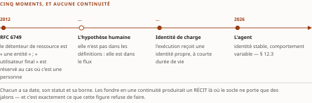
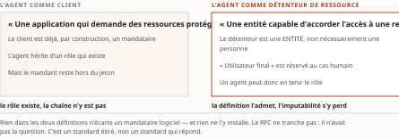

# Chapitre 12 — L'héritage et les standards étirés : un demi-siècle d'identités non humaines, puis OAuth, OIDC et SCIM face à l'agent

*Livre II — Faire confiance : identité, délégation et fabrique de confiance.
Premier mouvement — émettre (ch. 12-18). **Premier chapitre du mouvement, et premier chapitre du
Livre.** Chapitre à deux mouvements, issu de la fusion v0.20 des anciens ch. 12 et 13.*

| Champ | Valeur |
|---|---|
| **Statut** | **Brouillon de rédaction, non publiable.** ⚠ **État re-constaté à la relecture du 28 juillet 2026 : la porte G-3 est FRANCHIE** — le socle consolidé existe, **159 entrées `S-001`…`S-159`** ([`PRD/socle-consolide.md`](../PRD/socle-consolide.md), PRD v0.14) —, mais la porte **G-4**, collation de fond contre le Vol. III rédigé, **reste ouverte**, et c'est le **préalable que le PRD §5 nomme pour ce Livre précisément**. ⚠ **La pièce n'est PAS re-adossée à ce socle** : ses énoncés résolvent encore par les identifiants de leurs volumes sources, que les deux tables de correspondance de l'Annexe B rapprochent — *une porte franchie n'est pas un adossement refait*, et le re-adossement est remonté, non exécuté ici. **À la rédaction, le 27 juillet 2026, sur instruction d'auteur**, le Livre II enfreignait deux règles là où le Livre I n'en enfreignait qu'une : il se rédigeait non seulement avant G-3, mais **avant G-4**, alors que sa source principale — le Vol. III rédigé — porte quinze remontées ouvertes et douze arbitrages révocables. L'ordre du PRD §6 le plaçait en outre **après** les Livres I et III et le second mouvement du Livre IV ; il est venu en deuxième. Détail et remontées en clôture |
| **Date de gel** | **27 juillet 2026** — gel unique du compendium, **décision d'auteur D-1 prise** ce jour (registre : [`gel-2026-07-27.md`](../PRD/gel-2026-07-27.md)). ⚠ **Le volet de G-1 franchi ce jour portait sur le Livre I seul** : les faits périssables du présent chapitre relevaient du **volet résiduel, alors explicitement non instruit** — aucun d'eux n'avait été repris à la source primaire le 27 juillet 2026. ⚠ **Le volet de FAITS de ce résidu a été levé le 28 juillet 2026** ([`gel-2026-07-28-volet-residuel.md`](../PRD/gel-2026-07-28-volet-residuel.md)) : les **123 entrées à sensibilité temporelle** du socle consolidé ont été portées à leur source — **91 inchangées, 10 changées, 22 non établies**. **Deux entrées mobilisées ici portent la marque « changée »** : celle des pairs infonuagiques (Vol. III F-36), **reportée au § 12.1** parce que le fait qu'elle date est **antérieur au gel de neuf mois** ; et celle du protocole agent-outil (Vol. III H-09), **non reportée** — *sa bascule est postérieure au gel du 27 juillet 2026, d'un jour exactement, et une pièce ne se date pas de ce qui suit son gel.* Gels de source, qui ne tiennent pas lieu de gel de la somme : **juin 2026** (Vol. I), **16-17 juillet 2026** (Vol. II), **21 juillet 2026** (Vol. III). ⚠ Trois objets de ce chapitre se périment par leur propre horloge : deux dates d'expiration d'*Internet-Drafts* (7 janvier 2027) et le statut de préversion de plusieurs capacités d'un produit d'éditeur |
| **Socle mobilisé** | ⚠ **Résolution par les identifiants des volumes sources, non par le socle consolidé** — celui-ci existe depuis le 28 juillet 2026 et les deux tables de correspondance de l'Annexe B rapprochent chaque entrée citée ici de son `S-nnn` ; **la pièce n'a pas été re-adossée**. **Vol. III *Monographie* ch. 1-2**, entrées propres **F-16**, **F-19**, **F-20**, **F-21**, **F-27**, **F-28**, **F-29**, **F-33**, **F-36**, **F-38**, **F-40**, **F-41**, **F-42**, **F-84**, **F-85**, **F-86**, **F-87**, **F-88** et entrées héritées **H-02**, **H-03**, **H-04**, **H-07**, **H-09**, toutes à leurs niveaux d'origine — **[A]**, **[A, statut BROUILLON]**, **[A/B mixte]**, **[B]**, **[B, degré 1]**, **[B, degré 2]** ou **[C]** selon l'entrée, et **le socle consolidé les reconduit sans en rétrograder aucune**. ⚠ **Une dix-neuvième entrée propre sort du périmètre de fusion et le déclare** : **F-37**, prélevée au **Vol. III *Monographie* §6.1** — source du **ch. 15** —, pour le seul volet du **vocabulaire d'annuaire** (§ 12.7) ; déviation déclarée au titre de la décision 8 du TOC. Résolution également contre le **Vol. II *Monographie* ch. 8**, par **Vol. II F-07** (§ 12.7, **[A]**) et **Vol. II F-01** (§ 12.5, réserve de formulation) ; ⚠ **Vol. II F-08, que la ligne Fusion nomme, n'est pas cité au corps** — sa matière, la spécification CSA, y entre par **Vol. III H-03**, avec laquelle l'Annexe B la fond. Enfin contre le **Vol. I *Monographie* §3.6.1-3.6.2** et **§4.1.3**, en régime **[C]** (PRD §7.1). ⚠ **Deux séries F-xx coexistent dans ce chapitre** et chaque identifiant porte son volume : un « F-07 » nu y serait indécidable entre le socle du Vol. II et celui du Vol. III. ⚠ **Aucun énoncé n'est central au sens de CA-IV-01**, et le franchissement de G-3 n'y change rien : **aucun vote adversarial n'a été conduit** sur les entrées consolidées (PRD v0.14), **G-4 reste ouverte**, et les apports du Vol. I sont **[C]** |
| **Garde-fous balayés** | ⚠ **Règle de comptage, re-mesurée au commit du 28 juillet 2026** : *un cardinal déclaré ici porte sur le **marqueur littéral** de l'identifiant dans le **corps** — en-tête et note de statut exclus* ; les **applications non marquées** ne se dénombrent pas et relèvent du **domaine balayé**, déclaré sans cardinal. **Domaine balayé : les neuf sections du corps, § 12.0 à § 12.8.** Vol. II — **PRD Vol. II §8.2.5 (statuts pré-normatifs) : un marqueur**, § 12.1 ; la qualification pré-normative est en outre portée **à chaque mention** sans marqueur, sur tout le domaine ; **PRD Vol. II §8.2 (métriques et qualifications auto-déclarées) : deux marqueurs**, § 12.2 (deux) ; **Vol. II *Monographie* §8.4 : un marqueur**, § 12.8 ; **réserve F-01 : un marqueur**, § 12.5 ; **R-2 : un marqueur** et **R-3 : deux marqueurs**, tous au § 12.0 et tous **renvois à leur siège unique — le ch. 16 § 16.2** —, aucune application ici, le second marqueur de R-3 nommant seulement le **ch. 15 § 15.3.1** comme site d'application ; **R-8 : un marqueur**, § 12.2, la formule laissée en langue originale et renvoyée à son siège. **R-1, R-4 à R-7 : zéro marqueur.** Vol. III — **R-09 (quatre statuts, dits à chaque mention) : quatre marqueurs**, § 12.1 (deux) et § 12.5 (deux) ; **R-02 : trois marqueurs**, § 12.1, § 12.5 et § 12.6 ; **R-14 : trois marqueurs**, § 12.0, § 12.2 et § 12.8 — *le § 12.8 produit les trois degrés, une fois chacun, sous un marqueur unique* ; **R-04 : un marqueur**, § 12.2 ; **R-13 : un marqueur**, § 12.2. **R-01, R-03, R-05 à R-08, R-10 à R-12 : zéro marqueur.** ⚠ **Faux ami déclaré** : le « plan de contrôle » du maillage de services pré-agentique (ch. 1 § 1.3.4) n'apparaît pas dans ce chapitre ; la seule occurrence du syntagme y est la formule anglaise d'un rapport daté, non reprise au compte de la somme |
| **Volumétrie cible** | ≈ **6 200 mots** de corps (§ 12.0 à § 12.8), **cible dérivée** de l'enveloppe du Livre — 50 000 mots, **inchangée du TOC v0.24 au TOC v0.28** — répartie entre les dix chapitres au prorata de leurs sections, ce chapitre en portant neuf pour deux mouvements. ☑ **La somme des dix cibles dérivées a été additionnée avant rédaction et vaut 50 000 mots** : c'est la leçon du Livre I, dont les onze cibles dérivées totalisaient 93 000 mots pour une enveloppe de 65 000, soit **+43 %**, sans que personne ne fasse l'addition. ☑ **Décompte publiable depuis le franchissement de G-2** (27 juillet 2026) ; **réel : 7 710 mots**, mesurés par [`PRD/decompte.sh`](../PRD/decompte.sh), seule autorité de décompte du volume — **+24,4 %** de la cible, **re-mesuré au terme de la contre-relecture du 28 juillet 2026** (7 668 et +23,7 % à la relecture du même jour ; 7 372 et +18,9 % au commit précédent ; 7 301 et +17,8 % à la rédaction). ⚠ **La hausse vient de bornes ajoutées, non d'un développement** : degré d'absence rétabli au § 12.1, statut d'une offre re-daté à la source, métrique attribuée nominativement au § 12.2, déviation de périmètre déclarée au § 12.7, et **écart de tri prospectif déclaré avec la source** au § 12.1. ⚠ **Cet écart n'est pas corrigé par amputation, et il n'est pas non plus une surprise** : le PRD §13 déclare pour ce Livre précisément une « condensation réelle d'environ 52 % sur les enveloppes héritées », avec pour parade la **décision d'auteur D-4** — re-calibrage éventuel —, **toujours ouverte**. La pièce fournit donc à D-4 une mesure plutôt qu'un avis ; remontée **R-IV-17** |

> **Thèse** *(citée depuis le [`TOC.md`](../PRD/TOC.md) v0.28, entrée du chapitre 12, premier mouvement)* — l'identité machine n'est pas née avec les agents — comptes de service, X.509, clés d'API forment un passif mal gouverné dont l'entreprise agentique hérite avant d'y ajouter le sien.

---

> **Thèse du second mouvement**, citée depuis le TOC v0.28, entrée du chapitre 12 — la première vague de l'identité agentique est une extension des RFC existantes, non une rupture — et chaque extension révèle une hypothèse implicite (un humain au bout du flux) qui cesse de tenir.

⚠ **Deux thèses pour un chapitre, et ce n'est pas une négligence de rédaction.** Le ch. 12 est issu
de la **fusion v0.20** des anciens ch. 12 et 13 (décision 11 du TOC) : les deux entrées y sont
conservées **intégralement**, en deux mouvements portant chacun son ancien titre et son ancienne
thèse. Rien n'a été soustrait, et la présente pièce ne fond pas les deux thèses en une troisième —
ce serait réécrire ce que la fusion s'interdisait de toucher.

## § 12.0 — Introduction : ce dont l'entreprise agentique hérite

Le Livre I a établi comment les agents **coopèrent** : les protocoles qui les font parler aux outils
et entre eux, la couche de découverte qui les fait se trouver, les modes d'échec de cette couche.
Le présent Livre change de question. Il ne demande plus *comment les agents se parlent*, mais **à
quelles conditions une organisation peut leur faire confiance** — et la première de ces conditions
est de savoir à qui elle parle.

Le chapitre qui l'ouvre ne commence pas par les agents. Il commence par ce qui les précède, et le
motif n'est pas de politesse historique : **une organisation qui met des agents en production
n'ouvre pas un chantier vierge**. Elle ajoute une strate à un empilement d'identités machines déjà
en place, dont elle a rarement l'inventaire, et elle emploie d'abord ce qu'elle exploite déjà — un
serveur d'autorisation, un annuaire alimenté par SCIM, une chaîne de certificats.

⚠ **Le titre de ce chapitre annonce un demi-siècle ; le socle n'en documente pas le tiers, et cette
borne fait partie de l'énoncé.** La généalogie documentée s'ouvre au **RFC 6749, d'octobre 2012**
(Vol. III F-27, **[B]**). Les comptes de service, les clés d'API et les secrets d'atelier logiciel
que la thèse nomme **ne font l'objet d'aucune entrée** : le socle ne documente ni leur histoire ni
leur volumétrie — c'est une **absence de documentation** dans le corpus du Vol. III, **non un fait
négatif vérifié** (R-14 du Vol. III, degré 3). *Le passif antérieur est nommé ; il n'est pas
décrit.*

**Le chapitre se lit en deux mouvements et huit temps.** Le premier mouvement établit d'où vient
l'identité machine (§ 12.1), ce que sa gouvernance a laissé ouvert (§ 12.2) et pourquoi l'agent en
casse le modèle (§ 12.3). Le second montre ce que les RFC existantes supportent d'étirement avant de
céder — OAuth (§ 12.4), les brouillons de l'IETF (§ 12.5), SCIM (§ 12.6), un produit d'éditeur qui
les étend (§ 12.7) — et ce qu'elles ne disent pas, à trois degrés distincts (§ 12.8).

⚠ **Ce que ce chapitre ne traite pas, et qui n'est pas un oubli.** Le **socle IAM pré-agentique** —
identité fédérée, autorisation déléguée, *zero-trust*, identité de charge de travail — est **posé au
ch. 3** pour toute la somme, et n'est **pas repris ici** : ce chapitre s'y adosse. C'est la
contrepartie de l'économie de fusion déclarée au ch. 3, et l'abstention est contrôlée par
[`PRD/check-sieges.py`](../PRD/check-sieges.py). De même, le **traitement d'Entra Agent ID comme
annuaire commercial** appartient au **ch. 15** ; le § 12.7 n'en retient que le versant « extension
des RFC ». Enfin, les garde-fous **R-2 et R-3 du Vol. II** n'ont pas leur siège ici : leur siège
unique est le **ch. 16 § 16.2**, où l'encadré des affirmations écartées les pose une seule fois pour
toute la somme ; le **ch. 15 § 15.3.1** ne fait qu'**appliquer** R-3, ce qui n'en est pas un second
siège.

## § 12.1 — Généalogie : de l'hypothèse humaine à l'identité de charge de travail

Cinq moments documentés, de 2012 à 2026 — le dernier millésime en portant deux. Chacun a sa date,
son statut et sa borne ; les fondre en une continuité produirait un récit là où le socle ne porte
que des jalons.

**2012 — l'humain n'est pas dans les définitions, il est dans le flux.** Le RFC 6749 définit en sa
§1.1 le détenteur de ressource (*resource owner*) comme « an entity capable of granting access to a
protected resource », et réserve explicitement le terme *end-user* au cas où cette entité est une
personne ; le rôle de client y est celui d'« an application making protected resource requests on
behalf of the resource owner and with its authorization » (Vol. III F-27, **[B]**). La dissymétrie
est **lexicale, non prohibitive** : rien dans ces définitions n'exclut un détenteur de ressource non
humain. L'hypothèse humaine se loge ailleurs, dans la **procédure** — la §4.1.1 prescrit que le
client dirige le détenteur de ressource vers l'URI construite « using an HTTP redirection response,
or by other means available to it via the user-agent », et le flux de la §4.1 fait authentifier ce
détenteur par le serveur d'autorisation via cet agent utilisateur (Vol. III F-27).

*Le standard fondateur de la délégation d'accès admet donc une machine comme mandant dans son
vocabulaire, et présuppose un navigateur humain dans son déroulé.* C'est le premier écart, et il
commande tout le second mouvement de ce chapitre.

**2015 — l'annuaire d'entreprise s'écrit au vocabulaire de la personne.** La §4 du RFC 7643
(*SCIM Core Schema*, septembre 2015) annonce définir « the default resource schemas present in a
SCIM server » et ne comporte que **trois sous-sections** : *User*, *Group*, *Enterprise User Schema
Extension*. Aucune ne définit de type de ressource pour un mandataire logiciel autonome
(Vol. III F-28, **[B, degré 1]**). ⚠ **Fait négatif vérifié de degré 1, et sa borne fait partie de
l'énoncé** : le balayage porte sur l'énumération des sous-sections de la §4 de ce seul RFC ; il ne
dit rien du RFC 7644, rien des extensions de schéma enregistrées ailleurs, rien des profils
propriétaires. Au sein de ce périmètre, au moins deux descriptions d'attributs sont libellées en
termes de personne — `title` est décrit comme « The user's title, such as "Vice President". », et
`employeeNumber`, dans l'extension *Enterprise User*, comme un identifiant « assigned to a person,
typically based on order of hire ». *Constat de sémantique rédactionnelle, non d'interdiction
normative* : rien n'empêche de peupler ces attributs pour une entité non humaine.

**2018-2022 — l'identité de charge de travail se constitue en objet propre.** La spécification
SPIFFE-ID, de statut « Stable », définit l'identité SPIFFE comme un URI conforme au RFC 3986 composé
d'un nom de domaine de confiance et d'un chemin, et le SVID comme le mécanisme par lequel une charge
de travail **communique** son identité à une ressource ou à un appelant ; elle énonce qu'un SVID est
considéré valide s'il a été signé par une autorité du domaine de confiance de l'identité SPIFFE
qu'il porte (Vol. III F-87, **[B]**). ⚠ **Ce que cette spécification démontre est une vérification
de signature dans un domaine de confiance** (R-02 du Vol. III). ⚠ **Et le degré de ce qu'elle tait
se déclare** : elle **n'énonce pas** ce que cette vérification n'établit pas — ni preuve de propriété
d'une entité, ni décision d'autorisation —, ce qui est une **absence de documentation** dans le
corpus du Vol. III, **non un fait négatif vérifié**. Elle porte en revanche sa propre mise en garde,
en sa §4.1.1 : le nom d'un propriétaire de service, un rôle, une appartenance à un groupe et des
politiques d'accès sont autant d'assertions susceptibles de changer entre le moment de l'émission
d'un SVID et celui de sa validation ou de son usage.

Côté fondation, la CNCF classe SPIFFE et SPIRE au niveau « Graduated » : les deux projets y ont été
acceptés le **29 mars 2018**, sont passés en « Incubating » le **22 juin 2020**, puis en
« Graduated » — le **23 août 2022** selon la page projet SPIFFE, le **22 août 2022** selon la page
projet SPIRE (Vol. III F-88, **[B]**). ⚠ **Divergence d'un jour entre deux pages du même organisme,
reproduite telle quelle et non arbitrée** : la page d'annonce de graduation a renvoyé un HTTP 404 le
21 juillet 2026, et la date n'a pas pu être recoupée. « Graduated » est un **niveau de maturité de
fondation** ; il ne mesure aucune adoption en entreprise, et le lot d'instruction du Vol. III déclare
n'avoir cherché aucune métrique de déploiement.

⚠ **L'identité de charge de travail n'est pas re-décrite ici.** Son socle pré-agentique est **posé au
ch. 3** et ce chapitre s'y adosse ; ce qui appartient au présent § est le **jalon** — la date à
laquelle un objet d'identité distinct de l'utilisateur se constitue —, non le mécanisme.

**2026 — un seul document sur sept est soumis à l'IESG, et l'architecture range les intermédiaires
d'IA parmi les charges de travail déléguées.** Au 21 juillet 2026, la page des documents du groupe
de travail WIMSE (*Workload Identity in Multi System Environments*) de l'IETF recense **sept**
*Internet-Drafts* de groupe de travail, **tous non publiés en RFC** ; **un seul** —
`draft-ietf-wimse-workload-identity-practices-05`, du 30 juin 2026 — porte l'état « Submitted to
IESG for Publication », en visée *Informational* (Vol. III F-85, **[B]**). ⚠ **Deux bornes se
reportent avec l'entrée** : le relevé porte sur les documents **de groupe de travail** — les
brouillons individuels apparentés, listés sur la même page, n'ont été ni ouverts ni énumérés —, et
il est horodaté au point d'être périssable, l'un des sept expirant six semaines après la
consultation.

Le document d'architecture du groupe, `draft-ietf-wimse-arch-08` — *Internet-Draft* du 6 juillet
2026, expirant le 7 janvier 2027, à l'état « I-D Exists », en visée *Informational* — définit la
charge de travail comme « an independently addressable and executable software entity » et énonce en
sa §3.4.11, **du point de vue WIMSE**, que les intermédiaires d'IA (*AI intermediaries*) sont un cas
particulier de charges de travail déléguées : « From WIMSE perspective, AI intermediaries are a
special case of delegated workloads. » (Vol. III F-86, **[B]**). ⚠ **Section d'architecture d'un
brouillon en cours, non prescription protocolaire** (R-09 du Vol. III) : elle ne fait autorité sur
rien et peut changer à la révision suivante. ⚠ **Le tri prospectif ne trouve rien à trier dans ce
relevé, et c'est le constat** : **aucune date de publication en RFC n'est annoncée pour aucun des
sept documents** (Vol. III F-85). Or un **PROGRAMMÉ** suppose un *engagement daté réel* — le siège
des trois statuts est au **ch. 49 § 49.0** et n'est pas redéfini ici. *À défaut de date, la mise en
RFC ne reçoit aucun statut prospectif, et un état de procédure n'en tient pas lieu.* ⚠ **Écart
déclaré avec la source, et il n'est pas arbitré ici** : le Vol. III *Monographie* §2.2 classe cette
mise en RFC « **PROGRAMMÉE sans date d'engagement** » ; le siège rend ce classement indisponible à
la somme. *Les deux états sont exposés, aucun n'est corrigé.*

**2026, encore — et la boucle se referme sur 2015.** La spécification « Agent Registry » de CSA
Labs, publiée le **27 mars 2026**, ancre son profil d'agent sur SCIM 2.0 — c'est-à-dire sur le
RFC 7643 — et sur `draft-abbey-scim-agent-extension-00`, brouillon IETF **expiré le 19 avril 2026**,
vingt-trois jours après la publication de la spécification qui s'y adosse (Vol. III H-03,
**[A, statut BROUILLON]**). Elle est elle-même un **brouillon de laboratoire, non une norme
ratifiée** (R-09 du Vol. III ; PRD Vol. II §8.2.5). Le registre gouverné est l'objet du **ch. 15** ;
ce qui appartient ici est la boucle : *le schéma dont la §4 ne définit aucun type de ressource pour
un mandataire logiciel est celui sur lequel la première spécification de registre d'agents choisit
de s'ancrer, onze ans plus tard.*

Lecture de l'auteur — le socle établit les deux faits **séparément** : l'énumération des trois
sous-sections de la §4 du RFC 7643 (Vol. III F-28) et l'ancrage du profil d'agent de la
spécification CSA sur ce RFC (Vol. III H-03). Ce qu'il n'établit pas : que cet ancrage produise une
difficulté quelconque, ni que les rédacteurs de la spécification l'aient tenu pour une contrainte —
aucune source consultée ne documente leur motif.

**Où cette généalogie aboutit en production, et à quel statut.** Les offres commerciales sont
retenues ici comme **cas d'instanciation documentés, jamais comme recommandations**. Google Cloud
date au **22 avril 2026** la disponibilité générale d'« Agent Identity » dans IAM, tout en plaçant
son gestionnaire d'authentification (*auth manager*) en **préversion** à la même date ; le mécanisme
repose sur une identité SPIFFE matérialisée par des certificats X.509 **de vingt-quatre heures**
(Vol. III F-36, **[C]**). Chez AWS, le mécanisme documenté comparable est **Amazon Bedrock AgentCore
Identity**, où l'identité d'agent est une identité de charge de travail dotée d'attributs propres
plutôt qu'un type d'objet distinct (Vol. III F-36, **[C]**). ⚠ **Le statut de cette dernière offre a
été daté depuis, et l'écart mérite d'être dit plutôt que lissé** : le lot d'instruction du 21 juillet
2026 déclarait n'avoir pu ouvrir aucune source primaire pour le dater ; le billet *What's New* de
l'éditeur, **du 13 octobre 2025**, donne pourtant l'offre nommée — volet identité compris — pour
**généralement disponible**, ce que la re-datation du socle consolidé a constaté le 28 juillet 2026.
*Ce n'est pas un fait survenu depuis le gel : c'est une source primaire que le lot n'avait pas
ouverte.* ⚠ **La conséquence de niveau n'est pas tirée ici** : F-36 du Vol. III demeure une entrée
**[C]** tout entière — elle corrobore la généalogie, elle ne porte aucune affirmation centrale —, et
son réexamen relève du PRD §7.1, non d'une pièce.

*Annonce, feuille de route, préversion et disponibilité générale documentée sont quatre choses
différentes ; chez un même fournisseur, la même date du 22 avril 2026 en porte deux, et les citer
ensemble est la seule façon de ne pas lire la préversion pour la disponibilité générale.*

## § 12.2 — L'écart de gouvernance des identités non humaines

**Ce que cette section ne chiffrera pas, et pourquoi elle le dit d'entrée.** Le plan annonce pour ce
point un « ratio machines/humaines » et une « prolifération des secrets ». **Le socle du Vol. III ne
documente aucun de ces deux ordres de grandeur : c'est une absence de documentation dans le corpus
de cet ouvrage, non un fait négatif vérifié** (R-14 du Vol. III, degré 3). Son lot d'instruction
déclare explicitement n'avoir cherché aucune métrique d'adoption ou de déploiement, pour aucun de
ses objets ; et la règle d'attribution range de toute manière ces ratios parmi les **illustrations**
et jamais parmi les preuves (PRD Vol. II §8.2). **Aucun énoncé de la présente section ne dépend d'un
ordre de grandeur.**

⚠ **Un autre volume de la somme en porte un, et le fait se déclare plutôt qu'il ne s'exploite.** Le
Vol. I *Monographie* §4.1.3 rapporte, sur le ratio des identités non humaines aux identités
humaines, un rapport de **82 pour 1** **attribué à Rubrik Zero Labs (2025)** — chiffre de
fournisseur, issu d'une enquête commanditée, que le Vol. I marque lui-même « à re-vérifier à la
publication ». ⚠ **Cela ne comble pas la lacune du Vol. III, et il faut dire pourquoi** : une
métrique auto-déclarée est une illustration, jamais une preuve, à chaque occurrence et sans
exception d'usage illustratif — c'est la règle que les deux volumes appliquent également. *Un
chiffre auto-déclaré qu'on cesse d'attribuer devient, en trois citations, un fait.* La lacune du
Vol. III reste donc ouverte au degré 3, et le chiffre du Vol. I reste une illustration attribuée :
**les deux énoncés sont exacts dans leur périmètre, et ils ne se corrigent pas l'un l'autre**. Le
fait est remonté au plan (voir la note de statut), non arbitré ici.

**Ce qui tient sans chiffre : un incident public, daté, à l'échelle.** La campagne suivie sous la
désignation **UNC6395** a donné accès, du **8 août 2025** à au moins le **18 août 2025**, à des
instances Salesforce **au moyen de jetons OAuth compromis** d'une application tierce ; l'ensemble des
jetons a été révoqué le **20 août 2025** (Vol. III F-21, **[A]**). Le maillon qui cède y est nommé,
et il est architectural : le **jeton porteur** (*bearer token*) n'est lié ni à l'appelant, ni à un
appareil, ni à une session — *quiconque le détient est l'intégration.*

⚠ **Cet incident borne un garde-fou du Vol. III, et la borne se reporte ici.** On ne peut pas écrire,
au sujet des identités non humaines, qu'aucun incident public majeur ne serait documenté :
l'affirmation d'absence générale a été **écartée au vote adversarial** du lot correspondant, et le
garde-fou est depuis restreint à son objet réel — l'usurpation du **justificatif propre d'un agent**,
dont le Vol. III dit l'absence de documentation, **et de cela seul**. Le siège de cette restriction
est le ch. 19 § 19.6 ; elle n'est pas rejouée ici.

**L'écart, tel que le socle permet de le poser.** Trois observations, chacune tracée, et aucune ne
suppose un dénombrement.

| Observation | Ce que le socle porte |
|---|---|
| L'annuaire d'entreprise ne porte pas l'objet | La §4 du RFC 7643 ne définit aucun type de ressource pour un mandataire logiciel autonome (Vol. III F-28, **[B, degré 1]**, borné aux sous-sections de cette §4) ; la spécification de registre d'agents de CSA Labs du 27 mars 2026 s'y ancre néanmoins, via une extension IETF expirée (Vol. III H-03, **[A, statut BROUILLON]**) |
| Le justificatif n'est pas lié à son porteur | Le jeton porteur de la campagne UNC6395 n'est lié ni à l'appelant, ni à un appareil, ni à une session (Vol. III F-21, **[A]**) |
| Le domaine se dote d'un contre-modèle avant de se doter d'un inventaire | Un SVID est considéré valide s'il a été signé par une autorité du domaine de confiance de l'identité SPIFFE qu'il porte (Vol. III F-87, **[B]**) ; un fournisseur infonuagique matérialise l'identité d'agent par des certificats X.509 de vingt-quatre heures (Vol. III F-36, **[C]** — corroboration) |

: Tableau 12.1 — L'écart de gouvernance posé sans dénombrement, au 21 juillet 2026.

Lecture de l'auteur — raccourcir la durée de vie d'un justificatif et gouverner un parc d'identités
sont deux dispositifs distincts, et le second ne se déduit pas du premier. **Ce que le socle
établit** : la durée de vingt-quatre heures chez un fournisseur nommé (Vol. III F-36, **[C]** —
corroboration, jamais fait central) et le critère de validité d'un SVID (Vol. III F-87, **[B]**).
**Ce qu'il n'établit pas** : qu'une durée courte compense un défaut d'inventaire ou d'imputabilité —
aucune source consultée ne met les deux dispositifs en rapport, et aucune ne mesure l'effet de l'un
sur l'autre.

**Deux pièces formulent cet écart comme un déplacement de fonction.** L'*OWASP Top 10 For Agentic
Applications 2026*, dont il faut citer ensemble le **millésime 2026** et la **date de publication de
décembre 2025** (Vol. III F-16, **[A]**), fournit l'énoncé d'inadéquation architecturale : « Without
a distinct, governed identity of its own, an agent operates in an attribution gap that makes
enforcing true least privilege impossible. » (Vol. III F-19, **[A]** ; siège d'analyse au ch. 19). Et
le rapport *State of Agentic AI Security and Governance*, version 2.01 de juin 2026, pose
« identity as the new control plane » (Vol. III F-20, **[A]**).

⚠ **Deux réserves d'emploi, l'une et l'autre opposables.** *Attribution* : ce dernier rapport reprend
des métriques auto-déclarées d'éditeur ; **aucune n'est reprise ici**, et aucune ne le serait sans
attribution nominative à chaque occurrence (PRD Vol. II §8.2). *Homonymie* : l'expression relève du
garde-fou d'homonymie à quatre branches, dont le **siège est le ch. 7 § 7.5** et qui recense
notamment le sigle **ACP**, le plan de contrôle au sens infrastructure et le maillage d'agents
(R-8 du Vol. II ; R-13 et R-04 du Vol. III). Le socle **ne caractérise pas** laquelle de ces branches
le rapport vise : la formule est donc **laissée en langue originale**, ni traduite ni assimilée à
l'un des emplois recensés. *L'encadré de désambiguïsation n'est pas reconstruit ici — il se lit au
ch. 7 § 7.5.*

## § 12.3 — Pourquoi l'agent casse le modèle : identité stable et comportement variable

Le même rapport porte la distinction qui commande la suite du Livre. L'identité non humaine
(*non-human identity*, NHI) « verifies that a credential is authorized to connect » ; l'identité
d'agent, elle, « has to verify what the holder is doing with that authorization, **continuously** »
(Vol. III F-20, **[A]**). Le premier énoncé porte sur une **autorisation de connexion**. Le second
porte sur **l'usage fait de cette autorisation**, et il porte l'adverbe *continuously*.

Ce déplacement n'invente pas une faiblesse : il en rend une **structurelle**. La pile héritée sait
vérifier une **détention**. Le socle porte ce constat au niveau du justificatif plutôt qu'au niveau
du flux, et c'est ce qui le rend citable : le jeton porteur n'est lié ni à l'appelant, ni à un
appareil, ni à une session (Vol. III F-21, **[A]**). Un justificatif éphémère resserre la fenêtre
d'exploitation sans changer la nature de ce qui est vérifié — la spécification SPIFFE-ID le dit
d'elle-même, en nommant l'écart entre le moment de l'émission et celui de l'usage, et en le
rapportant à des assertions susceptibles de changer entre les deux (Vol. III F-87, **[B]**).

Lecture de l'auteur — l'agent déplace cet écart d'un cran, de l'assertion attachée à l'identité vers
l'action entreprise sous cette identité. **Ce que le socle établit** : la spécification SPIFFE-ID
nomme un écart entre émission et usage, portant sur des assertions (Vol. III F-87) ; un référentiel
de 2026 pose que la vérification d'une identité d'agent porte sur l'usage fait de l'autorisation, en
continu (Vol. III F-20). **Ce qu'il n'établit pas** : que le second écart soit une conséquence du
premier, ni qu'aucun mécanisme documenté ne les traite ensemble — aucune source consultée ne les met
en rapport.

**Le terme « non déterministe » n'appartient pas au socle ; la variabilité après déploiement, si —
et ce sont des superviseurs qui la nomment.** La ligne directrice **E-23** du BSIF, publiée le
11 septembre 2025 et en vigueur le **1ᵉʳ mai 2027**, range expressément parmi les objets de sa
surveillance continue l'« autonomous decision making, autonomous re-parametrization » (Vol. III H-04,
**[A/B mixte]** ; siège au ch. 25). ⚠ **Modalité, et elle n'est pas négociable** : E-23 est une
ligne directrice fondée sur des principes, rédigée au conditionnel — ce qu'elle formule est
**attendu par** E-23, jamais « exigé ». ⚠ Et sa portée agentique n'est pas écrite : vérification
mécanique sur le texte intégral, en anglais comme en français, « agentique » et « agent(s) »
comptent **zéro occurrence**, « orchestration » également, « autonom\* » en compte **huit**
(Vol. III H-04, fait négatif vérifié). Du côté des valeurs mobilières, l'avis **11-348** des ACVM,
publié le 5 décembre 2024, définit le système d'IA en y incluant des **niveaux variables
d'autonomie et d'adaptativité après déploiement** (Vol. III H-07, **[B]** ; siège au ch. 28).

⚠ **Ces deux textes sont cités ici pour un seul motif — ils nomment la variabilité après
déploiement — et pour rien d'autre.** Ce qu'ils demandent, à qui, et sous quelle modalité relève du
**Livre III**, seul fondé à l'établir. Aucun rapprochement entre un mécanisme d'identité et une
attente réglementaire n'est proposé ici : ce serait une inférence d'auteur, et son siège est le
ch. 25 § 25.2.

Ce que ces deux textes nomment, chacun dans son ordre, c'est un **comportement qui change après la
mise en service**. L'identifiant, lui, ne change pas : c'est sa fonction. *Un identifiant stable
répond à qui se connecte ; il ne répond pas à ce qui est fait de l'autorisation obtenue.* La
conséquence, telle que le référentiel de 2026 la formule, n'est pas d'abord un risque d'intrusion
mais une **impossibilité d'imputer** : sans identité propre et gouvernée, l'agent opère dans un écart
d'attribution qui rend le moindre privilège inapplicable (Vol. III F-19, **[A]**).

*C'est cet écart d'attribution que tout le Livre II entreprend de refermer — et le ch. 14 en fera la
cinquième de ses cinq questions.*

## § 12.4 — OAuth 2.x et l'agent : *client* ou détenteur de ressource ?

Le RFC 6749 répartit **quatre rôles** en sa §1.1, et deux d'entre eux décident du sort de l'agent.
Les définitions ont été citées au § 12.1 ; ce qui appartient ici est ce qu'on en tire.

Deux constats en découlent, sans autre appui que ces définitions. Le premier : le détenteur de
ressource est une *entité*, et le terme d'utilisateur final est **réservé** au cas où cette entité
est une personne. Le second : le client est déjà, par construction, une application agissant pour le
compte d'autrui. Rien dans ces deux phrases n'écarte un mandataire logiciel de l'un ou l'autre rôle
(Vol. III F-27, **[B]**). *Le point mérite d'être tenu contre une facilité de lecture* : écrire
qu'« OAuth suppose un humain » prête au texte une interdiction qu'il ne porte pas, et déplace le
débat vers une réécriture de la norme là où le problème est ailleurs.

L'hypothèse humaine siège en effet dans le **flux**. L'agent utilisateur interposé — un navigateur,
en pratique — n'est pas un détail d'implémentation : c'est le lieu où le détenteur de ressource
comparaît, s'authentifie et consent. *(Borne conservée du socle : cette hypothèse se cite comme
rattachée au **flux de la §4.1**, jamais à un numéro fin de sous-section, le rendu du texte ayant
varié entre deux interrogations.)*

Deux options s'offrent alors, et aucune n'est neutre. Si l'agent est traité en **client**, le flux
reste conforme, mais le mandat qui l'autorise doit être exprimé par un autre mécanisme que la RFC ne
fournit pas à cet endroit — c'est l'objet du § 12.5 et, pour la chaîne complète, du **ch. 17**. Si
l'agent est traité en **détenteur de ressource**, l'agent utilisateur interposé perd son siège : il
n'y a plus personne à rediriger.

Lecture de l'auteur — le socle établit que les définitions de la §1.1 n'excluent pas une entité non
humaine et que le flux de la §4.1 présuppose un agent utilisateur interposé (Vol. III F-27). Il
n'établit pas que l'agent doive occuper l'un des deux rôles plutôt que l'autre, ni qu'une réponse
figure dans le texte de la RFC. *La lecture proposée — le point de rupture est procédural avant
d'être définitionnel — est une construction d'auteur.*

Le mode d'octroi par justificatifs de client (*client credentials grant*) est le complément direct de
ce constat : la **§4.4 du RFC 6749** prévoit que le client demande un jeton d'accès « using only its
client credentials », lorsqu'il accède à des ressources protégées placées sous son propre contrôle ou
à celles d'un autre détenteur de ressource convenues à l'avance avec le serveur d'autorisation
(Vol. III F-84, **[B]**). ⚠ **Trois bornes tiennent à cette entrée et se reportent ici** : le passage
est relevé dans la **section de ce que le lot déclare n'avoir pas couvert**, il a été écarté du
plafond d'affirmations et n'a donc subi **ni vote ni contrôle de bornage** ; et la citation **porte
une élision**, elle n'est pas revendiquée comme verbatim continu.

**Ce que le Vol. I ajoute, en régime [C], et qui déplace la question.** Le Vol. I *Monographie*
§3.6.1 pose que l'identité non humaine et le jeton OAuth reposent sur une hypothèse que l'agent
autonome rend caduque : **un sujet stable agissant dans un mode unique et connu**. Un agent piloté
par un modèle de langue alterne en réalité entre agir **pour son propre compte** — déclencher une
tâche planifiée, interroger un registre — et agir **au nom d'un humain mandant**, sans qu'aucune
trace du mode actif ne soit portée par le jeton classique. Le Vol. I rapporte la formalisation qu'en
donne le livre blanc du groupe AIIM de l'*OpenID Foundation* (South et coll., 2025) — **au moins
trois entités** à identifier et à relier : le modèle ou le moteur d'exécution sous-jacent, l'instance
d'agent qui exécute, et l'humain délégant —, et il en tire que l'identité agentique est **composite
plutôt qu'atomique**.

⚠ **Régime de cet apport, et il n'est pas décoratif.** Les faits du Vol. I entrent dans la somme en
**[C]** (PRD §7.1) : sa vérification porte sur ses références, non sur le contenu de ses
affirmations. **Aucun énoncé de ce paragraphe n'est central**, et l'élévation en [B] supposerait la
lecture de la source primaire que le Vol. I cite. *Ce que cet apport fait ici est de nommer la
question ; ce n'est pas de la trancher.*

## § 12.5 — Les brouillons de l'IETF : quatre statuts, et ce que leurs dates disent ou ne disent pas

Un *Internet-Draft* n'est pas une norme : il a une **révision**, une **date de publication**, une
**date d'expiration à six mois** et un **état de procédure**, et ces quatre attributs ne se résument
pas en un mot. La discipline est imposée par R-09 du Vol. III, et elle décide de ce qu'une
institution peut inscrire dans un dossier de diligence raisonnable.

| Document | Révision et date | Expiration | État relevé au 21 juillet 2026 | Nature |
|---|---|---|---|---|
| `draft-ietf-oauth-transaction-tokens` | **-09**, 6 juillet 2026 | **7 janvier 2027** | *In WG Last Call*, groupe de travail OAuth | document de groupe de travail (Vol. III F-29, **[A]**) |
| `draft-abbey-scim-agent-extension` | **-00**, 16 octobre 2025 | **19 avril 2026** — expiré | *Expired Internet-Draft (individual)* — sans flux, sans adoption par un groupe de travail | soumission individuelle expirée et archivée (Vol. III F-41, **[B, degré 2]** ; expiration par H-03, **[A]**) |
| `draft-wzdk-scim-agent-resource` | **-00**, 5 juin 2026 | **7 décembre 2026** | actif | soumission individuelle (Vol. III F-42, **[B, degré 2]**) |

: Tableau 12.2 — Trois documents de l'IETF, trois statuts distincts, au 21 juillet 2026.

Des trois documents, `draft-ietf-oauth-transaction-tokens` — les **jetons de transaction**
(*transaction tokens*) — est le **seul adopté par un groupe de travail**. Son abrégé énonce l'objet :
« Transaction Tokens (Txn-Tokens) are designed to maintain and propagate user identity, workload
identity and authorization context throughout the Call Chain within a trusted domain during the
processing of external requests (e.g. such as API calls) or requests initiated internally within the
Trust Domain. » *(Source primaire ouverte et citée hors socle par le Vol. III ; l'affirmation
correspondante de son lot n'est pas versée.)* L'appel de dernière relecture est un **état de groupe
de travail** ; il n'est ni une approbation de l'IESG, ni une publication.

⚠ **La date du 7 janvier 2027 se lit avec précaution** : c'est l'**expiration automatique** du
document, mécanique, et **PROGRAMMÉE** au sens du tri prospectif ; elle ne dit rien d'une adoption ni
d'un calendrier de publication. Il en va de même du 7 décembre 2026 pour le troisième document du
tableau.

Le **protocole agent-outil** offre le cas d'une extension hors IETF. Interface client-serveur
JSON-RPC 2.0, il porte un **cadre d'autorisation** fondé sur OAuth (Vol. III H-09, **[A]**). ⚠ **La
formule est la sienne et se reprend telle quelle** : un cadre d'autorisation décrit une **procédure
d'octroi**, non une propriété de sûreté démontrée — écrire « sécurisé » serait la faute que la
réserve Vol. II F-01 proscrit et que R-02 du Vol. III interdit. Une révision majeure de la
spécification est **annoncée au brouillon** ; la revalidation du Vol. III en confirme la substance et
**ne confirme pas la date**. *Le chapitre n'écrit donc aucune date de publication pour cette
révision.*

Restent les **extensions d'identité d'agent**, et c'est là que le tri des statuts cesse d'être une
formalité. Le brouillon `draft-abbey-scim-agent-extension` n'existe qu'en une version **-00** du
16 octobre 2025 ; il est expiré et archivé, sans flux ni adoption par un groupe de travail, et le
registre porte la mention type selon laquelle un *Internet-Draft* n'est ni endossé par l'IETF ni doté
d'un statut formel dans le processus de normalisation (Vol. III F-41, **[B, degré 2]**). ⚠ **Deux
entrées, deux objets, à porter ensemble à chaque mention** : la version et le statut d'adoption
viennent de F-41, la date d'expiration du 19 avril 2026 vient de H-03 (R-09 du Vol. III).

À la session du groupe de travail SCIM de l'**IETF 125**, tenue le **19 mars 2026**, une consolidation
de deux brouillons a été présentée ; la conclusion consignée au procès-verbal est qu'il faut
**d'abord apporter des cas d'usage** avant d'aller plus loin, et **aucun appel à adoption n'y est
consigné** (Vol. III F-42, **[B, degré 2]**). Un troisième document, `draft-wzdk-scim-agent-resource-00`,
publié le 5 juin 2026 et expirant le 7 décembre 2026, est **actif** — mais demeure une **soumission
individuelle**, non un document du groupe de travail.

⚠ **Le nom complet d'un brouillon s'écrit à chaque citation, préfixe d'auteur compris.** Le registre
de l'IETF héberge une **seconde fiche au nom voisin** `draft-scim-agent-extension`, sans préfixe
d'auteur, de même titre et de mêmes auteurs, version -00 du **11 octobre 2025**, elle aussi
« Expired Internet-Draft (individual) » *(source primaire ouverte et citée hors socle par le
Vol. III, non versée)*. Deux documents à cinq jours d'écart qu'un renvoi abrégé ne distingue pas. **La
relation entre les deux fiches — reprise, doublon d'enregistrement ou dépôt distinct — n'est établie
par aucune source ouverte** : absence de documentation, degré 3.

Lecture de l'auteur — le socle établit quatre statuts distincts : document de groupe de travail en
appel de dernière relecture, soumission individuelle active, soumission individuelle expirée et
archivée, spécification hors IETF portant un cadre d'autorisation fondé sur OAuth (Vol. III F-29,
F-41, F-42, H-09). **Il n'établit aucun ordre de solidité entre eux, ni aucune probabilité
d'aboutissement.** Le classement qu'on serait tenté d'en tirer — un document adopté par un groupe de
travail engage une procédure là où une soumission individuelle n'engage que ses auteurs — est une
construction d'auteur, et il ne préjuge d'aucune adoption.

**Ce que le Vol. I ajoute sur la délégation multi-saut, en régime [C].** Le Vol. I *Monographie*
§3.6.2 rappelle que l'échange de jetons du **RFC 8693** répond au besoin de la chaîne par sa
revendication `act`, **imbricable**, qui inscrit dans le jeton la suite des acteurs ayant relayé
l'autorité ; et il en nomme la limite en l'attribuant au même livre blanc de l'*OpenID Foundation*
(South et coll., 2025) : *OAuth atteste la délégation mais ne contraint pas en lui-même
l'atténuation de privilège entre sauts* — rien dans le protocole n'oblige le saut aval à réduire la
portée reçue, qui demeure une responsabilité d'implémentation et de politique.

⚠ **Ce point est un jalon, non un développement, et son siège est ailleurs.** Le **ch. 17 § 17.1**
instruit le RFC 8693 sur pièce — sa §4.1, sa §1, la distinction qu'il pose entre délégation et
usurpation d'identité —, et le **ch. 17 § 17.6** en tire le problème des deux sauts. Le présent § ne
fait que le situer dans la trajectoire des textes, à son régime **[C]**.

⚠ **Relève du plan à instruire, portée ici sans être consommée.** Le TOC signale que la filière ne
s'est pas éteinte : des brouillons successeurs sont actifs à mi-2026 — applicabilité de WIMSE aux
agents d'IA, cadre composant WIMSE/SPIFFE/OAuth 2.0, extension SCIM d'éditeur pour le provisionnement
d'agents —, **tous pré-normatifs**. Ils sont à recenser au gel, **sources primaires à extraire**, et
le garde-fou des statuts pré-normatifs demeure inchangé. **Aucun n'est instruit ici**, le volet
résiduel de G-1 n'ayant pas été ouvert : ils sont **nommés, non repris comme faits**.

## § 12.6 — SCIM et le provisionnement d'agents

SCIM — *System for Cross-domain Identity Management* — est le mécanisme par lequel une organisation
crée, met à jour et désactive des comptes d'un système à l'autre. C'est donc le premier endroit où se
pose la question du **provisionnement** d'un agent, c'est-à-dire de son entrée et de sa sortie de
l'annuaire.

Le constat de la §4 du RFC 7643 a été posé au § 12.1 et n'est pas rejoué. Sa **borne** compte autant
que son contenu : il est établi par l'énumération des sous-sections de cette §4, telle que consultée
le 21 juillet 2026. Il ne dit rien du **RFC 7644**, le protocole SCIM, que le lot d'instruction n'a
pas ouvert ; rien des extensions de schéma enregistrées ailleurs ; rien d'une contrainte de
validation. *Rien, dans le RFC 7643, n'interdit de peupler ces attributs pour une entité non
humaine.*

Lecture de l'auteur — le socle établit qu'aucune des trois sous-sections de la §4 ne définit un type
de ressource pour un mandataire logiciel, et qu'au moins deux descriptions d'attributs sont libellées
en termes de personne (Vol. III F-28). **Il n'établit pas** qu'un type de ressource dédié soit
nécessaire, ni qu'inscrire un agent dans un objet *User* produise un défaut. La lecture proposée —
provisionner un agent dans un schéma qui décrit un employé est une **convention d'exploitation** et
non une modélisation — est une construction d'auteur, et la charge de la preuve reste du côté de qui
l'avance.

**Le mouvement de correction, lui, est documenté, et son résultat l'est aussi.** La spécification de
laboratoire de la Cloud Security Alliance — page portant en en-tête « White Paper | 2026-03-27 |
Status: draft », l'espace qui l'héberge se décrivant comme accueillant des travaux qui ne sont pas
encore un projet officiel de l'organisation (Vol. III F-38, **[A]**) — ancre son profil d'agent sur
SCIM 2.0, c'est-à-dire sur le RFC 7643 (Vol. III H-03), et cite `draft-abbey-scim-agent-extension`
**dans sa seule version -00** (Vol. III F-41) — celle qui a expiré le 19 avril 2026.

Le registre gouverné est l'objet du **ch. 15**, qui en est le siège ; ce qui appartient ici est
l'**écart de statut**, et il se date. *Une spécification de laboratoire publiée le 27 mars 2026
continue, en juillet 2026, de citer un brouillon expiré le 19 avril suivant — vingt-trois jours après
sa propre publication.* **Ce n'est pas un adossement à un texte mort : au 27 mars 2026, le brouillon
désigné était vivant.** C'est un **adossement non entretenu**, et la nuance décide de ce qu'on peut
en conclure.

Ce que ce brouillon ajoute renseigne au passage sur ce qu'il vient chercher. Son schéma de profil
d'agent range parmi ses **champs obligatoires** un `toolAccessList`, qui énumère les outils et les
serveurs du protocole agent-outil que l'agent est autorisé à invoquer, et des `permissionBoundaries`,
qui portent les limites de portée (Vol. III F-40, **[B]**). ⚠ **Ce sont des déclarations de champs,
non des propriétés démontrées** : le document décrit un **régime d'inscription**, il n'établit rien de
cryptographique par ce seul fait (R-02 du Vol. III). Leur instruction complète est au ch. 15
§ 15.3.1 ; ils sont nommés ici parce qu'ils disent ce que l'extension SCIM venait chercher, et rien
de plus.

## § 12.7 — Entra Agent ID comme extension des RFC

Ce paragraphe traite **un seul aspect** d'un produit d'éditeur : ce qu'il fait des RFC. ⚠ **Son
traitement comme annuaire commercial — disponibilité générale, capacités en préversion, licences,
risque de standard de fait — est au ch. 15 § 15.2** et n'est pas repris ici. La distinction n'est pas
formelle : le même produit est ici un **cas d'extension normative**, il y sera un **cas de marché**,
et les deux lectures ne se mélangent pas.

Microsoft Entra Agent ID est en **disponibilité générale**, datée d'**avril 2026** par les notes de
version de l'éditeur (Vol. III F-33, **[B]**), et le socle du Vol. II situe la même bascule « vers
avril-mai 2026 » (Vol. II F-07, **[A]**). ⚠ **La borne de ce fait est aussi instructive que le
fait** : les notes de version regroupent leurs entrées **par mois et ne portent aucun quantième**.
*Écrire « avril 2026 » est exact ; écrire une date précise ne le serait pas.*

Le produit se déclare fondé sur **OAuth 2.0** pour l'autorisation et sur **OpenID Connect** pour
l'authentification, et documente deux familles de scénarios — *app-only* et délégués (Vol. II F-07,
**[A]**). Reste la réserve qui commande ce paragraphe, et le socle du Vol. II l'impose en toutes
lettres : les flux d'agissement pour le compte d'autrui (*on-behalf-of*) et de jeton d'agent
**étendent les RFC** — **le dispositif ne doit pas être présenté comme du « pur RFC »**
(Vol. III H-02, **[A]** ; Vol. II F-07, **[A]**).

⚠ **L'énoncé porte sur ce que le socle prescrit d'écrire, non sur ce que l'éditeur dirait ou tairait
de son propre produit** : cette seconde assertion serait un constat sur la communication d'un
fournisseur, et le présent chapitre n'en rend pas.

Lecture de l'auteur — le socle établit que ces flux étendent les RFC et interdit de présenter le
dispositif comme du « pur RFC » (Vol. III H-02 ; Vol. II F-07) ; il n'établit rien sur les
**conséquences** de cette extension. La portée que l'auteur lui prête est celle que le Vol. II
formulait déjà : *un mécanisme conforme à un RFC ratifié est vérifiable contre un texte public, tandis
qu'un mécanisme qui étend un RFC est un mécanisme d'éditeur, dont la pérennité et l'interopérabilité
engagent la responsabilité de cet éditeur.* À ce compte, l'ancrage dans les standards existants
qu'affirme la thèse du second mouvement est **réel mais partiel** : c'est un point de départ, non une
garantie de portabilité.

Un dernier fait de statut appartient ici, parce qu'il porte sur le vocabulaire d'annuaire et non sur
le marché. Le terme *blueprint* — gabarit d'identité d'agent, au sens que l'éditeur donne au mot —
désigne un **objet d'annuaire** servant de patron à la création d'identités d'agent ; il est
**spécifié et publié** dans la version stable de l'interface de programmation de cet éditeur, sous un
type de ressource qui hérite du type `application` (Vol. III F-37, **[B]**). ⚠ **Cette entrée est
prélevée hors du périmètre de fusion du chapitre, et la déviation se déclare** : elle vient du
**Vol. III *Monographie* §6.1**, source du **ch. 15** ; elle n'est retenue ici que pour son volet de
**vocabulaire d'annuaire**, et **son instruction complète — dont sa soumission à la grille du ch. 14
— est au ch. 15**. ⚠ **Elle lève une réserve de l'héritage** : le socle du Vol. II donnait le terme
pour **non défini** (Vol. II F-07, Vol. III H-02), et l'énumérait aux côtés des identités d'agents
sans en préciser la nature. Elle ne va pas plus loin : **le socle ne documente pas de spécification
normative externe définissant ce terme — absence de documentation, degré 3**. *La définition n'est
opposable qu'au produit qui la porte.*

## § 12.8 — Ce que les RFC ne disent pas — et à quel degré

Une absence n'a pas de valeur en soi : elle vaut par **la façon dont elle a été établie**. Le
Vol. III impose trois degrés, et les confondre est la faute que R-14 proscrit. **Cette section en
produit un de chaque**, et c'est ce qu'elle apporte.

**Fait négatif VÉRIFIÉ, borné.** La §4 du RFC 7643 ne comporte que trois sous-sections et aucune ne
définit de type de ressource pour un mandataire logiciel autonome (Vol. III F-28, **[B, degré 1]**).
L'absence est établie par le **balayage documenté d'un texte** — l'énumération des intitulés de
sous-sections de cette section, à cette date. Elle ne s'étend ni au protocole SCIM, ni aux extensions
enregistrées ailleurs, ni à un éventuel travail postérieur. *Un fait négatif borné tient ; le même
énoncé étendu au corpus SCIM entier tomberait au premier contre-exemple.*

**Fait négatif ÉTABLI.** Les extensions d'identité d'agent portent la **réserve du registre
lui-même** : `draft-abbey-scim-agent-extension` est donné pour expiré, sans flux ni groupe de travail
adoptant, et non endossé par l'IETF (Vol. III F-41, **[B, degré 2]**) ; la session de l'IETF 125 s'est
conclue sur une demande de cas d'usage, sans appel à adoption consigné (Vol. III F-42,
**[B, degré 2]**). *Ces absences reposent sur la réserve explicite que portent les sources, non sur un
balayage exhaustif des actes de normalisation.*

**Absence de documentation.** Le titre du chapitre source a nommé **OIDC** jusqu'au 22 juillet 2026,
date à laquelle un arbitrage du Vol. III l'en a retiré ; **le socle du Vol. III ne documente pas le
corps des spécifications OpenID Connect** — absence de documentation, non fait négatif vérifié. Une
entrée héritée mentionne le protocole au titre d'un produit qui s'en réclame (Vol. III H-02,
**[A]**), ce qui ne renseigne ni sur son texte, ni sur ce qu'il prévoit ou tait d'un mandataire
logiciel. ⚠ **Retirer un mot d'un titre ne retire pas un trou du socle : il cesse seulement de le
promettre.**

⚠ **Et le titre du présent chapitre porte toujours « OIDC », lui.** Le TOC l'a conservé au titre
du second mouvement, la fusion v0.20 ayant repris les entrées **intégralement**, à la seule
renumérotation près — arbitrage **reconduit en v0.25** sur la remontée **R-IV-15** : la décision 11a
interdit de réécrire une entrée fusionnée, et *une correction de titre serait une réécriture*. ⚠ **Ce
qui a changé, c'est que le plan porte désormais la réserve ET la lacune qui la fonde** : la
**lacune 19 du Vol. III** — OpenID Connect, non instruite — est entrée au registre de l'Annexe C.
*Une réserve de titre sans lacune enregistrée est une prudence sans adresse.* **La pièce ne corrige
pas ce titre** — un rédacteur ne corrige jamais le TOC, il remonte —, et la contradiction est
**portée en remontée** plutôt que lissée : le chapitre traite d'OIDC uniquement par ce qu'un produit
d'éditeur en déclare (§ 12.7), et **rien de son texte n'est établi**.

| Degré | Ce qui l'établit | Occurrence dans ce chapitre |
|---|---|---|
| **1 — fait négatif vérifié** | balayage documenté d'un texte nommé, à une date | la §4 du RFC 7643 ne définit aucun type de ressource pour un mandataire logiciel (Vol. III F-28) |
| **2 — fait négatif établi** | réserve explicite portée par la source elle-même | statut d'expiration et de non-adoption des extensions SCIM pour agents (Vol. III F-41, F-42) |
| **3 — absence de documentation** | le corpus consulté est muet ; **n'autorise aucune conclusion** | le corps des spécifications OpenID Connect ; la relation entre les deux fiches homonymes de l'IETF ; ce que la vérification d'un SVID n'établit pas (Vol. III F-87) |

: Tableau 12.3 — Les trois degrés d'absence, un exemple de chacun, au 21 juillet 2026.

**L'ordre des faits est donc celui-ci, et il est daté du 21 juillet 2026** : un produit en
disponibilité générale étend des RFC (Vol. III H-02 ; F-33) ; un document de groupe de travail en
appel de dernière relecture propose un mécanisme de propagation du contexte (Vol. III F-29) ; une
spécification de laboratoire à l'état de brouillon, publiée le 27 mars 2026, cite toujours une
extension expirée le 19 avril 2026 (Vol. III H-03 ; F-41) ; et la consolidation présentée à
l'IETF 125 a été renvoyée à ses cas d'usage (Vol. III F-42).

**Ce qui manque à cet inventaire n'est pas une pièce, c'est l'objet qui les tiendrait ensemble.** Le
Vol. II *Monographie* l'écrivait déjà en son ch. 8 §8.4, et l'énoncé entre ici comme **thèse d'un
volume antérieur, attribuée** : « Un architecte qui chercherait aujourd'hui, pour son dossier de
conformité, la norme d'identité et de registre des agents ne la trouverait pas : elle n'existe
pas. » ⚠ **Le « passeport d'agent » ne figure dans aucune spécification de 2026** : c'est un **objet
de synthèse** que la somme construit au **ch. 16**, en assemblant une carte signée, une inscription
au registre, une chaîne de mandat et des attestations. Jusque-là, il n'existe pas — et ce chapitre
n'en préjuge rien.

### Synthèse : ce que le chapitre lègue à la somme

*Section de sortie sans homologue direct dans la source — construction d'éditeur.*

Ce chapitre pose **quatre acquis** que les chapitres aval citeront sans les reconstruire.

1. **La borne du demi-siècle.** La généalogie documentée s'ouvre en 2012 ; le passif antérieur est
   nommé et non décrit, au degré 3. Tout chapitre qui invoquerait « des décennies d'identités
   machines » comme un fait outrepasserait le socle.
2. **Le maillon architectural qui cède.** Le jeton porteur n'est lié ni à l'appelant, ni à un
   appareil, ni à une session (Vol. III F-21). Les **ch. 19 et 20** le retrouvent comme le premier
   maillon de leur taxonomie ; ils n'ont pas à le re-établir.
3. **Le déplacement de fonction.** Vérifier une **connexion** et vérifier un **usage continu** de
   l'autorisation sont deux opérations distinctes (Vol. III F-20). C'est la matière de la cinquième
   des cinq questions du **ch. 14** — *qui en répond ?* —, que ce chapitre n'a pas à poser deux fois.
4. **La discipline des quatre statuts.** Annonce, feuille de route, préversion et disponibilité
   générale documentée ; document de groupe de travail, soumission individuelle active, soumission
   expirée, spécification hors IETF. Les **ch. 13, 15, 16 et 18** l'appliquent à leurs propres
   corpus ; elle est posée ici une fois.

⚠ **Ce que le chapitre ne lègue pas, et qu'il faut aller chercher ailleurs.** Le socle IAM
pré-agentique reste au **ch. 3**. La valeur probante d'une carte signée est au **ch. 15 § 15.1**. Le
mandat et sa chaîne sont au **ch. 17**. Le registre comme objet réglementaire est au **ch. 15
§ 15.3.3** et au **ch. 25**. Et la question que ce chapitre ouvre sans y répondre — *que faut-il
pouvoir établir d'un agent ?* — est l'objet propre du **ch. 14**.

---

## § 12.9 — Note de statut *(hors plan — à retirer à la publication)*

⚠ **Cette section n'est pas au TOC et n'a pas vocation à survivre.** Elle consigne l'écart de
gouvernance sous lequel la pièce a été rédigée, conformément à la règle d'escalade du PRD
(Annexe A) : *un rédacteur ne corrige jamais le TOC, ce PRD ni le Conspectus — il remonte.*

**Ce qui est enfreint.** Le PRD §5 pose qu'aucun chapitre ne se rédige avant **G-1, G-2 et G-3**, et
que le **Livre II** exige en outre **G-4** — la collation de fond contre le Vol. III rédigé. **Au
27 juillet 2026, jour de la rédaction** : **G-2 était franchie** ; **G-1 l'était pour le seul volet
du Livre I**, les faits du présent chapitre relevant de son **volet résiduel, non instruit** ;
**G-3 n'était pas entamée** ; **G-4 n'avait que son volet structurel levé**, le volet de fond restant
dû. La rédaction a procédé sur **instruction d'auteur du 27 juillet 2026**. ⚠ **L'ordre de rédaction
du PRD §6 est également enfreint** : il plaçait le Livre II en troisième position, après les Livres I
et III et le second mouvement du Livre IV.

⚠ **Ce que le lendemain a changé, et ce qu'il n'a pas changé.** **G-3 a été franchie le 28 juillet
2026** (PRD v0.14) et le **volet de faits du résidu de G-1 levé le même jour** : *l'infraction n'en
est pas effacée pour autant* — une pièce écrite avant une porte reste écrite avant elle, et
**l'arbitrage qui suit une infraction la solde, il ne la rattrape pas**. **G-4 demeure ouverte**, et
c'est la porte que le PRD nomme pour ce Livre précisément.

1. **Aucun énoncé n'est central au sens de CA-IV-01**, et le franchissement de G-3 ne l'a pas changé.
   À la rédaction, le motif était que le socle consolidé comptait zéro entrée ; **il en compte 159
   depuis le 28 juillet 2026**, et trois motifs distincts subsistent. *(a)* **Aucun vote adversarial
   n'a été conduit** sur ces entrées (PRD v0.14), et il reste dû pour toute entrée appelée à porter
   un fait central. *(b)* Les faits du **Vol. III** conservent leurs niveaux d'origine, mais **sous
   G-4 ouverte** : le régime de preuve du Livre II est celui de la *source rédigée non publiable*
   (PRD §7.2), et le Vol. III déclare lui-même que « rédigé ne vaut pas publiable » — quinze
   remontées ouvertes, douze arbitrages révocables, dette de vote sur deux entrées. *(c)* Les faits
   du **Vol. I** entrent en **[C]**. Pour qu'un énoncé devienne central, il faudrait la collation de
   fond de G-4 conduite et le vote tenu.
2. **Les décomptes sont publiables** (G-2 franchie le 27 juillet 2026) : le champ *Volumétrie cible*
   porte le réel mesuré par `PRD/decompte.sh` à côté de la cible dérivée, et **la somme des dix
   cibles du Livre a été additionnée avant rédaction** — c'est la seule leçon du Livre I qui ait été
   appliquée par anticipation.
3. **Tous les renvois « ch. N » résolvent désormais contre du texte, et aucun n'est opposable pour
   autant.** À la rédaction, les renvois vers les Livres III et V — **ch. 25**, **ch. 28** et
   **ch. 49**, les trois seuls que la pièce porte hors des Livres I et II — étaient des renvois de
   **plan** ; les cinquante chapitres existant en brouillon depuis le 27 juillet 2026, ils résolvent
   contre du **texte**, comme ceux du **Livre I** — **ch. 3** et **ch. 7 § 7.5** au corps, **ch. 1
   § 1.3.4** au seul champ des garde-fous, où il déclare un faux ami — et ceux du **Livre II**
   (ch. 13, 14, 15, 16, 17, 18, 19, 20). ⚠ **Le « ch. 8 § 8.5.1 » que cette liste portait a été
   retiré à la contre-relecture du 28 juillet 2026 : la pièce ne le cite nulle part.** ⚠ *Résoudre
   n'est pas opposer* : toutes les pièces visées sont elles-mêmes des brouillons non publiables.
4. **Aucun fait périssable n'a été repris à la source primaire par la rédaction.** Le volet résiduel
   de G-1 n'étant pas ouvert ce jour-là, les statuts d'*Internet-Drafts*, les états de préversion et
   les dates de disponibilité générale cités ici sont ceux que les volumes sources portaient **à leur
   propre gel**. ⚠ **Le volet de faits a été levé le 28 juillet 2026** : deux entrées mobilisées ici
   en portent la marque « changée », et le champ *Date de gel* dit laquelle est reportée et laquelle
   ne l'est pas.

**Remontées ouvertes par ce chapitre**, numérotées à la suite des treize du Livre I, toutes soldées :

- **R-IV-14 — non bloquante, de couverture de source.** Le socle du **Vol. III** déclare au degré 3
  l'absence de tout ordre de grandeur sur le ratio des identités machines aux identités humaines et
  sur la prolifération des secrets (§ 12.2). Or le **Vol. I *Monographie* §4.1.3** — texte rédigé
  d'un autre volume de la somme — porte un tel ordre de grandeur : **82 pour 1**, attribué à
  **Rubrik Zero Labs (2025)**. ⚠ **Ce n'est pas une contradiction** : « le socle de A ne documente
  pas X » et « B documente X » sont logiquement compatibles, et l'énoncé du Vol. III reste exact dans son
  périmètre. ⚠ **Et la lacune n'est pas comblée pour autant** : le chiffre du Vol. I est une
  **métrique auto-déclarée**, donc une illustration et jamais une preuve — les deux volumes
  appliquent la même règle. **Demande remontée** : que la collation de fond (porte **G-4**) qualifie
  cette lacune à l'Annexe C comme *illustrée par le Vol. I au régime [C], non instruite* — ni
  « comblée », ni « ouverte sans matière ». C'est la classe de défaut que R-IV-12 et R-IV-13 ont
  nommée au Livre I, et **sa troisième occurrence en fait une règle plutôt qu'un motif**.
- **R-IV-15 — non bloquante, de titre.** Le titre du second mouvement du ch. 12, repris intégralement
  de l'ancien ch. 13 par la fusion v0.20, porte **« OIDC »** ; or le Vol. III a **retiré ce mot du
  titre de son propre ch. 2 le 22 juillet 2026**, sur arbitrage, précisément parce que son socle ne
  documente pas le corps des spécifications OpenID Connect (§ 12.8). Le chapitre n'établit rien de
  ce texte et ne le prétend pas. **Demande remontée** : que le TOC arbitre entre retirer le mot du
  titre du second mouvement — au risque de toucher une entrée que la fusion déclarait conservée
  intégralement — et le conserver en y adjoignant la réserve du Vol. III. ⚠ **Le rédacteur ne
  tranche pas** : la décision 11 pose que les entrées fusionnées ne sont pas réécrites, et une
  correction de titre serait une réécriture.
- **R-IV-16 — bloquante pour aucun chapitre, mais dirimante pour le Livre.** La rédaction du
  Livre II **avant G-4** fait reposer neuf chapitres sur dix — tous sauf le ch. 14, chapitre de
  méthode — sur un volume qui se déclare **non publiable**. Le PRD §13 nomme d'ailleurs ce risque en
  toutes lettres : *les remontées ouvertes du Vol. III bougent des passages déjà fusionnés*, et sa
  parade est « G-4 tardive, au plus près de la rédaction de ces livres ». **Demande remontée** : que
  l'état des **quinze remontées ouvertes du Vol. III** soit relevé pièce par pièce avant toute
  publication du Livre II, et que les passages touchés soient énumérés plutôt que présumés intacts.
  ⚠ **Aucune parade n'est prise ici** : la remontée constate le coût, elle ne le paie pas.
- **R-IV-17 — non bloquante, de volumétrie ; elle vaut pour tout le Livre et n'est ouverte qu'une
  fois.** La cible dérivée de ce chapitre était de 6 200 mots ; le réel valait **7 301** (**+17,8 %**)
  à la rédaction, **7 372** (**+18,9 %**) au commit suivant, **7 668** (**+23,7 %**) au terme de la
  relecture du 28 juillet 2026, et **7 710** (**+24,4 %**) au terme de la contre-relecture du même
  jour, seule mesure opposable — *le champ Volumétrie de l'en-tête et la présente note portent le
  même chiffre à chaque commit, ce qui n'a pas toujours été le cas.*
  ⚠ **Et les deux dernières hausses alourdissent la démonstration au lieu de l'affaiblir** : elles
  viennent de **bornes ajoutées par la relecture**, non de développement — *une pièce qui borne
  davantage compte davantage de mots, et c'est exactement la variable que l'enveloppe héritée
  n'avait pas budgétée.*
  ⚠ **L'écart n'est pas un défaut de rédaction : c'est la mesure que la décision d'auteur
  D-4 attendait.** Le PRD §13 déclare que les enveloppes héritées du Livre II supposent une
  condensation d'environ **52 %** des sources, et range l'issue parmi les décisions d'auteur : « les
  enveloppes intenables ou les coupes de bornes », avec pour parade D-4 — *l'écart se documente, ne
  s'ampute pas ; amputer une borne et couper un hors-périmètre produisent le même chiffre.* **Demande
  remontée** : que **D-4** soit tranchée sur la volumétrie réelle du Livre, relevée pièce par pièce au
  [`README.md`](README.md) du dossier au terme de la passe, plutôt que sur la projection du plan.
  ⚠ **Le rédacteur n'ampute rien et ne re-calibre rien** : les deux gestes sont hors de son mandat.

**Ce qui n'est pas enfreint.** La structure suit la **table détaillée du TOC** — § 12.1 à § 12.8,
dans l'ordre exact, les deux mouvements dans leur ordre —, et le § 12.0 est une **introduction de
chapitre**, non une section de plan. La **table de couverture est respectée pour ses dix rangées** :
sept au **Vol. III *Monographie*** (§1.1-1.3 et §2.1-2.4), deux au **Vol. II** (§8.1 en volet RFC
seul, §8.3) et une au **Vol. I *Monographie*** (§3.6.1-3.6.2). ⚠ **Une seule sortie de ce périmètre,
et elle est déclarée aux deux endroits où elle se lit** : l'entrée **F-37 du Vol. III**, prélevée à
son §6.1 — source du ch. 15 — pour le seul vocabulaire d'annuaire du § 12.7 (décision 8 du TOC). Le
**socle IAM n'est pas reconstruit** : il reste au **ch. 3**, auquel le § 12.0 et le § 12.1 renvoient.
L'**encadré de désambiguïsation à quatre branches n'est pas reconstruit** : il reste au
**ch. 7 § 7.5**, auquel le § 12.2 renvoie. Le **traitement du produit d'éditeur comme annuaire
commercial n'est pas anticipé** : il reste au **ch. 15 § 15.2**, et le § 12.7 s'en tient au volet
normatif. **R-2 et R-3 du Vol. II ne sont pas portés ici** : leur siège unique est le
**ch. 16 § 16.2** ; les trois marqueurs du § 12.0 y renvoient, sans rien appliquer. Les **trois
marqueurs de R-14** portent leur degré, et le § 12.8 produit **les trois degrés, une fois chacun**.
Les **trois marqueurs de R-02** énoncent ce que le mécanisme démontre **et** ne démontre pas. Les
**quatre marqueurs de R-09** portent révision, date, expiration et état de procédure, et la
qualification de statut est reprise **à chaque mention** sur tout le domaine balayé, sans marqueur —
*cette couverture-là se déclare, elle ne se dénombre pas.* Enfin, les **inférences sont marquées** :
**sept marqueurs** de « Lecture de l'auteur », un par section de § 12.1 à § 12.7, chacun suivi de ce
que le socle établit et n'établit pas.

---

### Clôture des remontées — 27 juillet 2026

⚠ **Cette sous-section est hors plan comme la note qui la porte, et se retire avec elle.** Elle
enregistre l'issue des remontées ouvertes par cette pièce. *Une remontée ne se clôt pas là où elle
s'ouvre : elle se solde là où elle fait foi* — au [PRD](../PRD/PRD.md) pour une décision d'auteur, au
[TOC](../PRD/TOC.md) pour un réalignement de plan, à l'appareil pour une dette d'outillage.

- **R-IV-14 — close par entrée au registre de l'Annexe C (TOC v0.25), dans une TROISIÈME table.** La
  lacune du Vol. III sur le ratio des identités machines est qualifiée *illustrée par le Vol. I au
  régime **[C]**, non instruite* — ni « comblée », ni « ouverte sans matière ». ⚠ **La table est
  neuve, et sa création est le vrai geste** : ces absences sont déclarées **au degré 3 dans le texte
  rédigé** du Vol. III et **le §10 de son PRD ne les numérote pas** ; les verser dans les deux séries
  numérotées existantes aurait périmé un cardinal contrôlé. ⚠ **La lacune n'est pas comblée pour
  autant** : le chiffre du Vol. I est une **métrique auto-déclarée** — *illustration, jamais preuve*.
- **R-IV-15 — close par arbitrage de plan, et le titre n'a pas bougé.** Le mot « OIDC » **reste** au
  titre du second mouvement : la **décision 11a** pose qu'une entrée fusionnée est conservée
  intégralement, et une correction de titre serait une **réécriture**. La réserve du Vol. III est
  **portée au TOC**, à l'entrée du chapitre. ⚠ **Et l'arbitrage a trouvé ce qui manquait vraiment** :
  la **lacune 19 du Vol. III** — OpenID Connect, non instruite — **entre au registre de l'Annexe C**.
  *Le plan portait la réserve sans porter la lacune qui la fonde ; une réserve de titre sans lacune
  enregistrée est une prudence sans adresse* — elle ne remonte au ch. 49 dans aucun registre.
- **R-IV-16 — close par relevé, porté au PRD v0.9 §13 ; le risque n'est pas réduit, il est
  énumérable.** Les **quinze remontées ouvertes du Vol. III** — R-G-43 à R-G-57, **aucune tranchée** —
  ont été relevées pièce par pièce sur son registre de gouvernance. **Six touchent la matière de ce
  Livre** : l'intitulé fautif du §5.4 (corrigé ici, ouvert là-bas), les attestations auto-délivrées et
  les cellules tronquées des rapports de lot **qui fondent les dix chapitres**, le retrait de la
  *Synthèse* du Vol. I avec les revendications de verbatim qui en dépendent, et les deux points de
  revalidation déjà au registre du gel. **Neuf ne le touchent pas** — règles, objets de cadrage, ou
  chapitres hors du périmètre de fusion. Le relevé devient une **condition de sortie de G-4** et
  **se refait au gel de publication**. ⚠ *Énumérer n'est pas parer : neuf des quinze sont réservées à
  l'auteur du Vol. III, et aucune n'a bougé.*
- **R-IV-17 — close par la décision d'auteur D-4, tranchée sur la mesure.** **Enveloppes maintenues,
  écart documenté, re-calibrage remis à une passe unique de clôture** portant sur les cinq Livres
  mesurés — jamais Livre par Livre, un Livre sur cinq étant un échantillon. ⚠ **La mesure a servi
  d'abord à écarter l'explication commode** : la somme des dix cibles avait bien été additionnée et
  valait 50 000 — *le dépassement vient de la matière, non de la dérivation* —, et les trois plus
  forts écarts sont les trois pièces qui portent **le plus de bornes**. *L'enveloppe héritée n'avait
  pas budgété le coût du bornage.* ⚠ **La partie opérante de la décision est une interdiction** :
  aucun rédacteur des Livres III à V ne traite son enveloppe comme un plafond à couper.

⚠ **Ce que la clôture ne change pas — relu au 28 juillet 2026.** La porte **G-3 est franchie** depuis
cette date et l'**Annexe B existe**, forte de **159 entrées** ; **cela ne rend pas la pièce
recevable**. La porte **G-4** demeure ouverte — la collation de fond contre le Vol. III rédigé n'est
pas conduite —, **aucun vote adversarial n'a été tenu** sur les entrées consolidées, et **la pièce
n'est pas re-adossée à ce socle** : **aucun de ses énoncés n'est central au sens de CA-IV-01**.
⚠ **CA-IV-13 n'est pas déclarée satisfaite ici** : le PRD v0.14 la tient pour insatisfaisable faute
d'un relecteur distinct du rédacteur, et *une pièce ne se prononce pas sur sa propre recevabilité* —
la question est remontée, non tranchée. Cette pièce reste un **brouillon non publiable**. *Zéro
remontée ouverte ne veut pas dire pièce recevable : cela veut dire qu'aucune question n'attend plus
de réponse qui ne soit déjà tranchée.*
