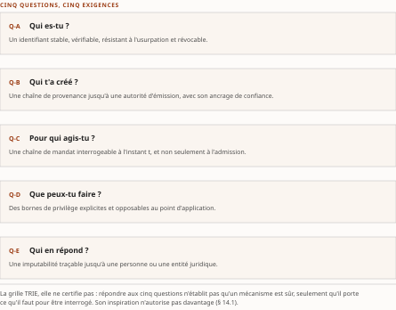

# Chapitre 14 — La grille des cinq questions

*Livre II — Faire confiance : identité, délégation et fabrique de confiance.
Premier mouvement — émettre (ch. 12-18). Troisième chapitre du mouvement, et **chapitre de méthode
transversal** : il ne verse aucun fait, il fournit l'instrument par lequel les **ch. 15 à 21** rendent
leurs verdicts.*

| Champ | Valeur |
|---|---|
| **Statut** | **Brouillon de rédaction, non publiable** — **rédigé le 27 juillet 2026 avant G-3 et G-4**, sur instruction d'auteur. ⚠ **G-3 a été franchie depuis, le 28 juillet 2026** (PRD v0.14 ; socle consolidé [`socle-consolide.md`](../PRD/socle-consolide.md) v1.2, **159 entrées `S-001`…`S-159`**), et **G-4 demeure ouverte** : *une porte franchie après coup ne rattrape pas la pièce écrite avant elle* — **celle-ci n'a pas été ré-adossée entrée par entrée au socle consolidé**, et le ré-adossement reste dû. ⚠ **Ce chapitre est le seul du Livre dont le régime de preuve ne dépend d'aucun fait** : la grille est une **construction d'auteur** du Vol. III, spécifiée à son PRD et **dérivée d'aucun socle** — sa recevabilité tient à son rendement, non à sa filiation. **R-IV-16 et R-IV-17, ouvertes au ch. 12, valent pour tout le Livre** et ne sont pas rouvertes |
| **Date de gel** | **27 juillet 2026** — gel unique, **D-1 prise** (registre : [`gel-2026-07-27.md`](../PRD/gel-2026-07-27.md)). ⚠ **Volet de faits de G-1 levé le 28 juillet 2026** — 123 entrées à sensibilité temporelle portées à leur source ([`gel-2026-07-28-volet-residuel.md`](../PRD/gel-2026-07-28-volet-residuel.md)) ; ⚠ **l'obligation de pièce du Livre II, elle, reste due**. Gels de source : **juin 2026** (Vol. I), **21 juillet 2026** (Vol. III). ⚠ **Un instrument ne se périme pas comme un fait** : ce qui se périme ici est l'**application-témoin** du § 14.2, dont chaque verdict est daté du 21 juillet 2026 et se rejouera à chaque révision des trois mécanismes qu'elle éprouve |
| **Socle mobilisé** | ⚠ **Aucune entrée n'est requise pour la grille elle-même** : elle est spécifiée au **PRD du Vol. III, Annexe C**, document de cadrage, non versée par un lot d'instruction. Les **verdicts** du § 14.2 résolvent, eux, contre le **Vol. III *Monographie* ch. 4**, dont **vingt et une entrées propres** sont mobilisées — **F-01**, **F-02**, **F-04** à **F-09**, **F-11**, **F-14**, **F-15**, **F-19**, **F-21**, **F-33** à **F-35**, **F-37**, **F-38**, **F-40**, **F-47**, **F-87** — plus les **entrées héritées H-02 et H-03** ; toutes conservent leurs **niveaux d'origine**. L'échelle d'autonomie du § 14.4 vient du **Vol. I *Monographie* §5.0.2**, portée par **H-31**, en **[C]** et **non élevable**. ⚠ **Le socle consolidé existe depuis le 28 juillet 2026** et ces entrées y résolvent par la **table de correspondance n° 2** ([`socle-consolide.md`](../PRD/socle-consolide.md) §5) ; la pièce les cite **dans la série du Vol. III, préfixées de leur volume** (décision 7) — **la re-citation en `S-nnn` n'est pas faite et reste due**. **Aucun énoncé n'est central au sens de CA-IV-01** : le PRD v0.14 déclare le **vote adversarial dû pour toute entrée appelée à porter un fait central**, et aucun n'a été conduit par la consolidation |
| **Garde-fous balayés** | ⚠ **Règle de comptage, re-mesurée au commit du 28 juillet 2026** : *un cardinal déclaré ici porte sur le **marqueur littéral** de l'identifiant dans le **corps** — en-tête et note de statut exclus* ; les **applications non marquées** ne se dénombrent pas et relèvent du **domaine balayé**, déclaré sans cardinal. **Domaine balayé : les cinq sections du corps, § 14.0 à § 14.4.** Vol. III — **R-02 : deux marqueurs**, § 14.2 (deux) ; **R-13 : un marqueur**, § 14.4 ; **R-14 (trois degrés d'absence) : un marqueur**, § 14.1 ; les **sept cases vides du tableau 14.2** sont chacune déclarées **degré 3** dans le corps du tableau, **sans marqueur** — *couverture déclarée, non dénombrée*. **R-01, R-03 à R-12 : zéro marqueur.** ⚠ **Deux garde-fous sont appliqués au-delà de ce que leur marqueur signale** : **R-13** — les **trois échelles homonymes du Vol. I** sont nommées au § 14.4 par leur cardinal et leur numérotation, **jamais nues**, sur toute la section et non au seul endroit marqué — et **R-12**, le § 14.3 rangeant les attaques par maillon en **traitement défensif exclusif, sans recette d'exploitation**, sans porter l'identifiant. Vol. II — **réserve F-01, §8.2, R-1 à R-8 : zéro marqueur**, leurs sièges étant les ch. 15 et 16. ⚠ **Collision de séries déclarée** : l'unique occurrence littérale de « F-01 » au § 14.2 est celle du **Vol. III**, non celle du Vol. II — *un `F-xx` nu est indécidable entre deux socles* (décision 7) —, et la réserve du Vol. II sur ce protocole est **sans objet ici**, la condensation du F-40 ne le nommant pas. ⚠ **Faux ami déclaré** : le « corpus d'appui » nommé au § 14.4 est un **marqueur conditionnel de réouverture**, jamais une source |
| **Volumétrie cible** | ≈ **3 000 mots** de corps (§ 14.0 à § 14.4), **cible dérivée** de l'enveloppe du Livre (50 000 mots, TOC v0.24) au prorata des sections — **la plus basse du Livre**, ce chapitre ne portant que quatre sections et aucun corpus propre. ☑ **Décompte publiable depuis G-2** ; **réel : 3 784 mots** par [`PRD/decompte.sh`](../PRD/decompte.sh) — **+26,1 %**, re-mesuré au commit de la **seconde relecture du 28 juillet 2026** (⚠ *deux valeurs antérieures périmées, conservées parce que l'écart est l'instruction* : **3 514, +17,1 %** à la rédaction, puis **3 725, +24,2 %** à la première relecture — vérifiée sur pièce et exacte. Les **211 mots** du premier écart sont ceux des bornes et des attributions rétablies ; les **59** du second, ceux du siège rectifié au § 14.3 et de la borne de F-87. ⚠ **Aucune amputation n'a été faite ni ne sera faite**, D-4 — *le dépassement se mesure, il ne se corrige pas en coupant une borne*). ⚠ La volumétrie du Livre est relevée au [`README.md`](README.md) du dossier et alimente **D-4** par **R-IV-17** |

> **Thèse** *(citée par copie depuis le [`TOC.md`](../PRD/TOC.md) v0.30, entrée du chapitre 14 — décision 17 ; les v0.29 et v0.30 déclarent thèses et tables détaillées **strictement inchangées**, la forme citée est donc celle qu'a arrêtée la v0.25)* — cinq questions — *qui es-tu, qui t'a créé, pour qui agis-tu, que peux-tu faire, qui en répond* — forment la grille de lecture de tout mécanisme d'identité agentique ; ce sont les questions que l'entreprise doit pouvoir poser à chacun de ses agents, et **aucun des trois mécanismes instruits par le Vol. III ne répond aux cinq**.
>
> ⚠ **Thèse réalignée au TOC v0.25** (décisions 8 et 14), sur la remontée **R-IV-20** ouverte par cette pièce. La forme citée par la version antérieure — « aucun mécanisme de 2026 ne répond aux cinq » — était un **quantificateur universel négatif sur un corpus non balayé**, que le garde-fou **R-14 du Vol. III** proscrit ; sa source l'avait bornée le **21 juillet 2026** et reportée dans sa pièce le 22, sans que le plan du compendium suive. ⚠ *Ce n'était donc pas une divergence à arbitrer, mais un report qui n'avait pas été fait.* **Le corps du chapitre n'a pas changé** : il était déjà écrit sous la forme bornée, et le § 14.2 déclarait la portée limitée à l'échantillon.

---

## § 14.0 — Introduction : pourquoi un instrument, et pourquoi cinq questions

Les deux chapitres précédents ont produit un inventaire : des RFC étirés d'un côté (ch. 12), un
vocabulaire portable dont l'adoption reste à démontrer de l'autre (ch. 13). L'inventaire ne suffit
pas. Une organisation qui doit décider si elle admet un agent — le sien ou celui d'un tiers — n'a
pas besoin de savoir **quels mécanismes existent** ; elle a besoin de savoir **ce que chacun lui
permet d'établir**.

C'est l'objet du présent chapitre, et il est de méthode : il ne verse aucun fait, il fournit
l'**instrument** par lequel les ch. 15 à 21 rendront leurs verdicts. Son homologue dans le Livre IV
est la **matrice protocoles × exigences réglementaires du ch. 42** ; les deux jouent le même rôle —
un critère explicite, opposable, que chaque chapitre consommateur applique sans le redécider.

⚠ **Le chapitre porte donc, de bout en bout, le régime des constructions d'auteur** (CA-IV-07), et
c'est ce qui lui interdit de s'autoriser de lui-même. Une grille qui tirerait argument de son
existence serait précisément l'objet que la somme prend pour cible : *un instrument d'analyse se juge
à son rendement, jamais à sa provenance.*

**Le chapitre se lit en quatre temps.** D'où vient la grille et ce que son inspiration n'autorise pas
(§ 14.1) ; ce qu'elle donne quand on l'éprouve sur trois mécanismes documentés (§ 14.2) ; comment
elle structure les chapitres suivants (§ 14.3) ; et ce qu'elle devient croisée avec une échelle
d'autonomie (§ 14.4).

## § 14.1 — L'inspiration de la grille — et ce qu'elle n'autorise pas

Lecture de l'auteur — la grille des cinq questions est une **construction d'auteur du Vol. III**.
Elle est spécifiée à son PRD, Annexe C — le document qui fait autorité sur son contenu —, et **non
dérivée d'un socle qui la porterait**. **Ce que le socle établit** : les faits sur lesquels chaque
verdict du § 14.2 repose, entrée par entrée. **Ce qu'il n'établit pas** : la grille elle-même, son
cardinal de cinq, l'ordre de ses questions, le partage qu'elle opère entre elles ; aucune entrée,
propre ou héritée, ne les porte, et aucune source primaire n'en est l'extraction.

⚠ **La différence avec l'instrument équivalent du Vol. II est structurante et vaut d'être écrite** :
la taxonomie d'orchestration OO1-OO4 du Vol. II (*Monographie* ch. 5) venait **d'une source** ; la
grille n'en vient **d'aucune**. Elle relève du régime des constructions d'auteur, ce qui interdit
d'en tirer un argument d'autorité et impose qu'elle soit **falsifiable**.

**L'inspiration, elle, est nommée.** Le Vol. I emploie une grille d'analyse **par axes** —
découverte, sémantique, identité et confiance, gouvernance des frontières —, présentée comme le moyen
de comparer des spécifications hétérogènes et d'anticiper leurs recouvrements et leurs manques. Deux
de ces quatre axes — *identité et confiance*, *gouvernance des frontières* — fournissent
l'**inspiration** des cinq questions ; ils n'en fournissent **pas la dérivation**.

⚠ **La distinction n'est pas de politesse.** Un élément du Vol. I entre dans la somme en **[C]** —
repérage documentaire —, parce que sa vérification porte sur ses références et non sur le contenu de
ses affirmations (PRD §7.1) ; et **une entrée [C] ne porte jamais un fait central**. *Adosser la
grille aux axes du Vol. I l'aurait rendue inutilisable au moment même où l'on prétendait la fonder.*
⚠ **Les quatre axes sont posés au ch. 7 § 7.2.2** et ne sont pas reconstruits ici.

⚠ **Aucune entrée de socle ne porte les axes eux-mêmes, et l'écart se déclare plutôt qu'il ne se
comble.** Le Vol. III l'avait constaté pour son propre socle ; le balayage des **159 entrées** du
socle consolidé, au 28 juillet 2026, le confirme — **aucune ne les énonce** : fait négatif
**vérifié** sur ce corpus, degré 1, et borné à lui. *La traçabilité de cette filiation vient des
documents de cadrage, non du socle ; y créer une entrée n'y changerait rien, une entrée [C]
n'autorisant aucun emploi central.*

Lecture de l'auteur — le changement d'objet justifie le changement d'instrument : les **axes**
comparent des spécifications *entre elles* ; les **cinq questions** demandent ce qu'une entreprise
doit pouvoir **établir** d'un agent qu'elle héberge ou qu'elle admet. **Ce que le socle établit** : la
formulation des axes et leur fonction déclarée. **Ce qu'il n'établit pas** : que ce passage soit
correct, complet ou nécessaire — *il se juge à son rendement en § 14.2, non à sa filiation.*

| # | Question | Ce qu'un mécanisme doit produire pour y répondre |
|---|---|---|
| **Q-A** | **Qui es-tu ?** | Un identifiant **stable**, **vérifiable**, **résistant à l'usurpation** et **révocable** |
| **Q-B** | **Qui t'a créé ?** | Une chaîne de provenance jusqu'à une autorité d'émission, **avec son ancrage de confiance** |
| **Q-C** | **Pour qui agis-tu ?** | Une chaîne de mandat interrogeable **à l'instant t**, et non seulement à l'admission |
| **Q-D** | **Que peux-tu faire ?** | Des bornes de privilège **explicites** *et* **opposables au point d'application** |
| **Q-E** | **Qui en répond ?** | Une imputabilité traçable jusqu'à une personne ou une entité juridique |

: Tableau 14.1 — La grille des cinq questions et ce que chacune exige d'un mécanisme.

**Quatre règles d'emploi commandent tout ce qui suit**, et elles sont reprises du cadrage du Vol. III
sans être modifiées.

1. **La grille s'applique par mécanisme, non par produit.** Un même produit peut répondre à Q-A et
   laisser Q-C sans réponse ; le noter globalement effacerait précisément ce que la grille sert à
   voir.
2. **Une réponse partielle est une réponse partielle.** Trois verdicts seulement — *répond*, *répond
   partiellement — et on dit à quoi*, *ne répond pas* —, **aucun quatrième verdict de complaisance**.
3. **La thèse est falsifiable, et c'est voulu.** Un mécanisme qui répondrait aux cinq la réfute, et
   *la réfutation s'écrit si elle survient plutôt qu'elle ne se contourne*.
4. **Le ch. 16 § 16.5 est le seul endroit de la somme où les cinq reçoivent une réponse**, et cette
   réponse y est explicitement **sur le papier** — elle décrit ce qu'un assemblage produirait, non ce
   qu'une implémentation produit.

⚠ **Une cinquième règle vient du régime d'absence, et elle n'est pas dans la liste ci-dessus parce
qu'elle ne porte pas sur la grille mais sur ce qu'on écrit dans ses cases.** Là où le corpus est
muet, **la case reste vide** : *le socle ne documente pas X — absence de documentation, non fait
négatif vérifié* (R-14 du Vol. III, degré 3). **Une case vide n'est pas un quatrième verdict** : ce
n'est pas le mécanisme qui reçoit une note intermédiaire, c'est **l'état de la preuve** qui est
déclaré.

## § 14.2 — Application-témoin à trois mécanismes

Trois mécanismes ont été instruits à un degré qui permet de les soumettre à la grille : la **carte
d'agent signée**, les **annuaires d'agents commerciaux**, les **registres gouvernés**. ⚠ **Cette
section est une application-témoin, non le verdict du Livre** : chacun des trois reçoit son verdict
complet à son propre chapitre — ch. 15 § 15.1.4, § 15.2.4 et, pour le registre, § 15.3. Ce qui se
joue ici est l'**épreuve de l'instrument**, et le résultat qui compte est ce que la grille permet ou
ne permet pas de dire.

**La carte d'agent signée.** Sur **Q-A**, elle **répond partiellement** : au volet *vérifiable*, non
au volet *révocable*. Ce que la signature **démontre** est l'intégrité du contenu canonicalisé au
regard d'une clé donnée (Vol. III F-01, F-02, **[A]**) — et rien de plus (R-02). Elle est en outre
**facultative** : apposition en **MAY**, vérification en **SHOULD**, de sorte qu'une chaîne
entièrement conforme peut ne comporter **aucune signature apposée ni aucune vérification effectuée**
(Vol. III F-04, **[A]**). Le volet *révocable* n'est pas outillé : le message normatif de la carte
compte **quatorze champs**, dont aucun n'exprime une date d'émission, une expiration, une fenêtre de
validité ni un indicateur de révocation (Vol. III F-05, **[A]**, fait négatif **vérifié**, degré 1) ;
et l'interdiction est pourtant posée au niveau normatif le plus fort — « Expired or revoked keys
**MUST NOT** be used for verification » — **sans aucun moyen d'établir l'expiration ou la
révocation** (Vol. III F-07, **[A]**). ⚠ **L'interdiction porte sur la clé de signature, non sur la
carte**, et la borne change ce qu'on peut en tirer.

Sur **Q-B**, elle **ne répond pas** : l'ancrage est renvoyé **hors du protocole** — clé récupérée par
identifiant et adresse de jeu de clés, ou depuis un magasin de clés de confiance que les clients
« **MAY** maintain », dispositif facultatif et non spécifié (Vol. III F-09, **[B]**). Deux documents
de projet ont été balayés et ni l'un ni l'autre ne rattrape l'ancrage (Vol. III F-08, **[A]**,
degré 1 ; F-11, **[B]**). Sur **Q-C**, **Q-D** et **Q-E**, **les cases restent vides au degré 3** :
aucun balayage ne couvre ce que la carte porte du mandat, du privilège ou de l'imputabilité.

**Les annuaires d'agents commerciaux.** ⚠ **Le statut se dit à chaque mention, et l'éditeur se
nomme** — *la neutralité fournisseur interdit de recommander, non de nommer, et un statut non
attribué n'est pas revalidable au gel suivant.* La **disponibilité générale** d'Entra Agent ID,
produit de Microsoft, est datée d'**avril 2026** par les notes de version de son éditeur
(Vol. III F-33, **[B]**) — mais **elle ne vaut pas disponibilité générale de ses capacités** :
plusieurs capacités nommées demeuraient étiquetées *Preview* au 21 juillet 2026 (Vol. III F-34,
**[A]**).

Sur **Q-A**, **répond partiellement** : le type de ressource d'annuaire est défini et publié, héritant
du type `application` (Vol. III F-37, **[B]**), mais l'identité y vit sur **deux plans** — une
politique d'accès conditionnel ciblant des identités d'agent **ne s'applique pas** au compte
d'utilisateur de l'agent, et une politique ciblant « tous les utilisateurs » **n'inclut pas** les
identités d'agent (Vol. III F-35, **[A]**, fait négatif **établi**, degré 2). *Un identifiant qui
n'est pas unique au point d'application ne répond qu'à moitié à « qui es-tu ».* Sur **Q-B**, **répond
partiellement** : ce qui se cite en **[B]** est la spécification elle-même — **SPIFFE-ID** énonce
qu'un SVID est **considéré** valide s'il a été signé par une autorité du domaine de confiance de
l'**identité SPIFFE** qu'il porte (Vol. III F-87) —, et ce qu'elle **démontre** est une vérification
de signature dans un domaine, **non l'ancrage de confiance de cette autorité** (R-02). Sur **Q-C**, **répond
partiellement**, et la borne vient de la norme sous-jacente : le **RFC 8693** définit l'attribut `act`
comme le moyen d'exprimer **qu'une délégation a eu lieu** et place explicitement hors de son périmètre
les caractéristiques de sécurité des jetons eux-mêmes (Vol. III F-47, **[A]**) — le mandat s'exprime
donc, mais qu'il soit interrogeable **à l'instant t** n'est pas établi (degré 3). Sur **Q-D**, même
verdict et même cause : les bornes sont opposables au point d'application d'**un** des deux plans
(F-35). Sur **Q-E**, **case vide au degré 3**.

**Les registres gouvernés.** Statut, dit à chaque mention : la spécification de registre d'agents est
un **brouillon de laboratoire** et son en-tête le dit — « White Paper | 2026-03-27 | Status: draft »,
l'espace qui l'héberge se décrivant comme accueillant des travaux qui ne sont **pas encore** un projet
officiel de l'organisme (Vol. III F-38, **[A]**). Sur **Q-A**, **répond partiellement** : l'identifiant
est **spécifié et administrable**, dans un brouillon de laboratoire (Vol. III H-03 ; F-38). Sur
**Q-D**, la déclaration des bornes est explicitement outillée — `toolAccessList` et
`permissionBoundaries` sont des champs **obligatoires** (Vol. III F-40, **[B]**) —, mais le verdict
reste **partiel** : *déclarer une borne et l'opposer sont deux actes distincts, et la grille est faite
pour les séparer.* Sur **Q-B**, **Q-C** et **Q-E**, **cases vides au degré 3**.

| | Q-A *qui es-tu* | Q-B *qui t'a créé* | Q-C *pour qui agis-tu* | Q-D *que peux-tu faire* | Q-E *qui en répond* |
|---|---|---|---|---|---|
| **Carte d'agent signée** | partiellement — vérifiable oui, révocable non (F-04, F-05, F-06, F-07) | **ne répond pas** (F-08, F-09, F-11) | *case vide, degré 3* | *case vide, degré 3* | *case vide, degré 3* |
| **Annuaires commerciaux** | partiellement — deux plans d'identité (F-35, F-37) | partiellement — validité par signature dans un domaine (F-87), ancrage de l'autorité non établi | partiellement — mandat exprimé, non interrogeable à l'instant t (H-02, F-47) | partiellement — un plan couvert sur deux (F-35) | *case vide, degré 3* |
| **Registres gouvernés** | partiellement — identifiant spécifié et administrable, brouillon de laboratoire (H-03, F-38) | *case vide, degré 3* | *case vide, degré 3* | partiellement — bornes déclarées, opposabilité non établie (F-40, H-03) | *case vide, degré 3* |

: Tableau 14.2 — Application-témoin de la grille à trois mécanismes, au 21 juillet 2026. Toutes les entrées citées appartiennent au socle du Vol. III.

**Décompte re-mesuré sur le tableau : huit verdicts rendus sur quinze cases** — **aucun « répond »**,
**un** « ne répond pas », **sept** « répond partiellement » — et **sept cases** où le corpus consulté
est muet. ⚠ Un verdict plein figurait au premier jet du Vol. III et **est tombé le 21 juillet 2026**,
non qu'un fait ait changé, mais parce que le **niveau** de l'entrée qui le portait est passé en
**[C]** : *une entrée [C] ne porte jamais un fait central, et un verdict de grille en est un.*

**Aucun des trois mécanismes ne répond aux cinq : la thèse n'est pas réfutée.** ⚠ **Elle n'est pas non
plus établie, et il faut l'écrire aussi nettement** : trois mécanismes ne sont pas le corpus des
mécanismes de 2026, et conclure de trois verdicts à « aucun mécanisme de 2026 ne répond aux cinq »
serait un **fait négatif de corpus**, la forme même que le régime des trois degrés refuse. *La thèse
se tient donc comme hypothèse falsifiable, éprouvée mécanisme par mécanisme aux endroits recensés au
§ 14.3, et sa portée reste bornée aux mécanismes réellement instruits.*

## § 14.3 — La grille comme critère de structure des chapitres suivants

La grille n'est pas un ornement méthodologique : **elle décide de ce qu'un chapitre doit produire.**
Elle est appliquée, verdict à l'appui, au **ch. 15 § 15.1.4** (la carte signée), **§ 15.2.4** (les
annuaires), **ch. 16 § 16.5** (l'objet de synthèse), **ch. 19 § 19.4** (la taxonomie des attaques) et,
hors du présent Livre, au **ch. 37 § 37.4** (le maillage). ⚠ **Deux sièges de plus l'appliquent sans
rendre aucun verdict** — le **ch. 25 § 25.4** (la ligne directrice E-23) et le **ch. 27 § 27.5** (la
ligne directrice de l'AMF) —, en **lecture inversée** : ils demandent non ce qu'un texte produit comme
réponse, mais ce qu'il suppose que l'institution puisse établir, *une ligne directrice n'étant ni un
mécanisme ni un produit* (règle d'emploi 1). Elle sert enfin de colonne à l'annexe des mécanismes.
*Toute pièce qui ne l'applique pas s'en explique.*

**Le ch. 17 est l'exception, et c'est la plus instructive.** Il ne porte **aucun verdict** : il
**instruit Q-C** — *pour qui agis-tu ?* — au lieu de l'appliquer mécanisme par mécanisme, et il le
déclare à son ouverture. La raison tient au constat du § 14.2 : **Q-C n'y a reçu qu'un seul verdict,
et encore partiel**. *Une question à laquelle deux mécanismes sur trois ne permettent même pas de
répondre n'appelle pas un verdict de plus ; elle appelle un chapitre.*

**Au ch. 19, la grille change de fonction** : elle devient l'**axe de la taxonomie**, chaque attaque
étant rangée selon **le maillon de la chaîne d'identité ou de mandat qui cède** — traitement défensif
exclusif, au niveau architectural, sans recette d'exploitation. Le socle montre que le tri
fonctionne : dans la campagne de compromission de jetons du **8 au 18 août 2025 au moins**, le maillon
qui cède est le **jeton porteur**, lié ni à l'appelant, ni à un appareil, ni à une session — *quiconque
le détient est l'intégration* (Vol. III F-21, **[A]**) : **défaut de Q-A**. Dans la technique
**AML.T0053** du corpus de techniques adverses **MITRE ATLAS**, où un agent dispose d'outils
inaccessibles aux utilisateurs, ce n'est pas l'authentification qui cède mais **l'absence de réduction
de portée entre mandant et mandataire** (Vol. III F-14, **[A]**) : **défaut de Q-D**, que la
contre-mesure **AML.M0027** vise en posant qu'un agent agissant pour un utilisateur ne doit pas
recevoir de permissions que cet utilisateur n'a pas (Vol. III F-15, **[A]**).

L'entrée **ASI03** du référentiel de sécurité applicative de l'**OWASP** énonce le lien que la grille
formalise : « Without a distinct, governed identity of its own, an agent operates in an attribution
gap that makes enforcing true least privilege impossible. » (Vol. III F-19, **[A]**).

Lecture de l'auteur — l'énoncé soutient **l'ordre** des questions : sans réponse à Q-A, Q-D et Q-E
deviennent **inapplicables** plutôt que difficiles — une borne de privilège suppose un porteur
identifié, et une imputabilité suppose quelqu'un à qui imputer. **Ce que le socle établit** : l'énoncé
cité, au niveau [A]. **Ce qu'il n'établit pas** : que cet ordre soit le seul possible, ni qu'il ait une
valeur autre qu'organisatrice.

⚠ **Le ch. 16 § 16.5 est le seul endroit de la somme où les cinq questions reçoivent une réponse, et
la nature de cet endroit décide de ce qu'on peut en conclure.** Ce qui y est soumis à la grille n'est
**pas un mécanisme de 2026** : c'est le **passeport d'agent**, objet de synthèse que la somme
construit en assemblant une carte signée, une inscription au registre, une chaîne de mandat et des
attestations. *Le passeport reçoit une réponse aux cinq questions parce qu'il a été construit pour en
recevoir une : c'est la propriété d'un objet de synthèse, pas un résultat.* ⚠ **Confondre les deux
ferait de la construction d'auteur le contre-exemple de la thèse qu'elle sert à éprouver.**

## § 14.4 — Grille et maturité

Lecture de l'auteur — **la présente section est une construction d'auteur en totalité.** Le
croisement des cinq questions avec une échelle de maturité n'est porté par aucune entrée du socle,
non plus que l'ordonnancement des exigences par palier qui en découle. **Ce que le socle établit** :
l'existence et le contenu de l'échelle mobilisée, à son niveau et sous ses réserves. **Ce qu'il
n'établit pas** : que le coût d'une question sans réponse croisse avec le palier d'autonomie —
proposition de la somme, à lire comme telle.

⚠ **Cette section a été réaffectée le 21 juillet 2026, et le motif se déclare plutôt qu'il ne se
masque.** Elle mobilisait le spectre de maturité d'un **corpus d'appui** dont aucun des trois
ouvrages n'a jamais été déposé ; la filiation livresque a été **retirée** — arbitrage clos par **échec
documenté, et réversible par dépôt ultérieur** —, et le croisement se refait sur l'échelle
d'autonomie du Vol. I. ⚠ **Les mentions de « corpus d'appui » sont des marqueurs conditionnels de
réouverture, jamais des sources** : aucun chapitre ne se rédige en s'appuyant sur ces ouvrages sans
dépôt effectif.

**L'échelle se cite au complet, et la contrainte n'est pas de forme.** Selon la proposition du
Vol. I, l'**échelle à quatre paliers non numérotés** — *assistance → copilote → orchestration sous
revue → autonomie bornée* — indexe l'autonomie consentie sur le produit **matérialité × réversibilité**,
non sur la capacité brute du modèle ; l'entrée héritée **H-31 [C]** en rapporte le principe, verbatim :
« un agent ne doit jamais exécuter une action irréversible sans garde-fou structurel ; la règle est la
préparation par l'agent et la *release* humaine sur l'action irréversible ».

⚠ **Trois échelles coexistent au Vol. I et partagent leurs libellés — les nommer nues est proscrit.**
« Copilote » est un palier de l'échelle à **quatre paliers non numérotés**, le **niveau 2** du
continuum à **six niveaux numérotés de 0 à 5**, et le **niveau L0** de la graduation à **quatre
niveaux préfixés L, L0-L3**. *Le terme ne s'emploie jamais seul*, et l'indexation sur matérialité ×
réversibilité ne discrimine pas davantage — la graduation L0-L3 indexe deux de ses niveaux sur les
mêmes critères. **Seuls le cardinal et la numérotation discriminent.**

⚠ **Une de ces trois numérotations n'est plus opposable.** Les désignations du continuum à six
niveaux ne vivent qu'au tableau 3 de la *Synthèse* du Vol. I, **fichier supprimé du dépôt le
22 juillet 2026** : le renvoi demeure exact, il **cesse d'être opposable**, et le socle consolidé
déclare pour ce motif le calibrage du garde-fou **R-13 du Vol. III non rejouable** dans l'arbre
courant (`S-157`). *La règle de désambiguïsation ne s'en trouve pas allégée pour autant.*

⚠ **H-31 est une entrée [C] non élevable, et la conséquence est nette.** L'échelle est une
**construction d'auteur du Vol. I**, introduite par « La proposition de l'ouvrage… », non la reprise
d'une source primaire tierce : l'élévation en [B] par lecture de la source est **sans objet**. Elle
entre comme **thèse d'un volume antérieur, à attribuer à chaque emploi**, jamais comme fait. *Le
croisement qui suit ne peut donc rien établir ; il ordonne.*

**L'ordonnancement proposé est le suivant.** Au palier *assistance*, l'humain engage chaque action :
**Q-E** est portée par la personne qui engage et **Q-D** bornée par ce qu'elle valide ; reste
**Q-A**, sans laquelle la trace ne s'impute à rien. Au palier que l'échelle à quatre paliers non
numérotés nomme *copilote*, l'agent produit des actes que l'humain contresigne sans les
reconstruire : **Q-B** devient exigible — *contresigner ce qu'on n'a pas produit suppose de savoir
qui l'a produit*. À l'*orchestration sous revue*, la revue porte sur une **chaîne** et non sur un
acte : **Q-C** devient centrale, et *une chaîne de mandat qui ne s'interroge qu'à l'admission ne
soutient pas une revue portant sur l'exécution*. À l'*autonomie bornée*, les cinq deviennent
simultanément exigibles, et le défaut le plus coûteux est celui que le § 14.2 a trouvé à la carte
signée : un identifiant vérifiable dont la **clé de signature**, expirée ou révoquée, ne doit plus
servir à vérifier — sans qu'aucun moyen permette d'établir ce statut (Vol. III F-07, **[A]**).

| Palier *(échelle à quatre paliers non numérotés du Vol. I)* | Question qui devient exigible | Motif |
|---|---|---|
| **assistance** | **Q-A** | l'humain engage chaque acte ; sans identifiant, la trace ne s'impute à rien |
| **copilote** | **Q-B** s'ajoute | contresigner ce qu'on n'a pas produit suppose de savoir qui l'a produit |
| **orchestration sous revue** | **Q-C** s'ajoute | la revue porte sur une chaîne, non sur un acte isolé |
| **autonomie bornée** | **les cinq**, simultanément | plus aucun acte n'est contresigné à l'unité |

: Tableau 14.3 — Croisement de la grille et de l'échelle d'autonomie du Vol. I — **construction d'auteur en totalité**, aucun palier n'étant porté par une entrée de socle.

**Ce que le croisement ne fait pas se dit avec la même netteté : il ne rend aucun mécanisme suffisant
à un palier bas.** Un fait borné **ne varie pas avec le palier** — la section de la spécification qui
ne comporte aucun moyen d'établir le statut d'une clé n'en comporte pas plus pour un agent
d'assistance que pour un agent en autonomie bornée (Vol. III F-06, **[A]**, degré 1). *Le palier
change le coût du défaut, non le défaut* ; et une entreprise qui ordonnerait ses exigences d'identité
par palier accepterait, **en connaissance de cause**, de porter aux paliers bas une dette dont
l'échéance est le palier suivant.

### Synthèse : ce que le chapitre lègue à la somme

*Section de sortie sans homologue direct dans la source — construction d'éditeur.*

1. **L'instrument, et ses quatre règles d'emploi.** Par mécanisme et non par produit ; trois verdicts
   et pas un quatrième ; falsifiabilité assumée ; un seul lieu où les cinq reçoivent réponse. Les
   **ch. 15, 16, 19, 25 et 37** l'appliquent sans le redécider.
2. **La cinquième règle, qui n'est pas dans la grille.** Une **case vide** déclare l'état de la
   preuve, jamais une note intermédiaire. C'est le point où la grille et le régime des trois degrés
   d'absence se rejoignent, et il est posé ici une fois pour la somme.
3. **L'ordre des questions.** Sans Q-A, Q-D et Q-E sont **inapplicables** et non difficiles. Le
   **ch. 19** en fait l'axe de sa taxonomie.
4. **Le croisement avec l'autonomie, et sa borne.** Le palier change **le coût** du défaut, non le
   défaut. Le **ch. 25** rencontre la même distinction du côté réglementaire, et le **ch. 20** du
   côté défensif.

⚠ **Ce que le chapitre ne lègue pas.** Il ne verse aucun fait, aucune entrée de socle, aucune date. Il
ne tranche pas la thèse qu'il porte : **elle reste une hypothèse falsifiable**, et le § 14.2 dit
exactement sur quel échantillon elle a été éprouvée.

---

## § 14.5 — Note de statut *(hors plan — à retirer à la publication)*

⚠ **Cette section n'est pas au TOC et n'a pas vocation à survivre.** Elle consigne l'écart de
gouvernance sous lequel la pièce a été rédigée (PRD, Annexe A).

**Ce qui est enfreint.** Portes **G-3** et **G-4** à la rédaction ; volet résiduel de **G-1** non
instruit ; ordre de rédaction du PRD §6. Instruction d'auteur du 27 juillet 2026. ⚠ **Deux de ces
trois écarts se sont refermés le lendemain, et aucun n'est rattrapé pour autant** : **G-3 est
franchie** et le **volet de faits de G-1 levé** le 28 juillet 2026 — *une porte franchie après coup ne
requalifie pas la pièce écrite avant elle ; elle en rend le ré-adossement possible, et dû*.

1. **Aucun énoncé n'est central au sens de CA-IV-01** — et ce chapitre est le seul du Livre où cela
   ne change presque rien : **la grille n'est pas un fait**, elle est un instrument, et son
   admissibilité tient à son rendement. Ce qui souffrait de G-3, ce sont les **verdicts** du § 14.2 ;
   ⚠ **le socle est refondu depuis, et ils n'y sont pas encore ré-adossés** — la consolidation
   n'ayant d'ailleurs **promu aucune entrée** ni conduit aucun vote adversarial, la centralité reste
   hors de portée.
2. **Les décomptes sont publiables** (G-2). Écart de **+26,1 %**, re-mesuré au commit ; il alimente
   **D-4** par **R-IV-17**.
3. ⚠ **Les renvois « ch. N » vers les Livres III et IV NE SONT PLUS des renvois de plan, et l'énoncé
   antérieur — « ch. 25 § 25.1, ch. 37 § 37.4 et ch. 42 ne sont pas rédigés » — est périmé** : les
   **ch. 25, 27, 37 et 42** sont rédigés depuis le 27 juillet 2026. **Résolus contre leur texte le
   28 juillet 2026**, ils ont déplacé un siège : le § 14.3 nommait « ch. 25 § 25.1 » — *Genèse et
   calendrier* — là où la grille est relue au **§ 25.4**, moitié E-23, la moitié AMF siégeant au
   **ch. 27 § 27.5** ; et ni l'une ni l'autre ne rend de verdict. Les renvois vers le **ch. 7
   § 7.2.2** et vers les **ch. 15, 16, 17, 18, 19, 20 et 21** résolvent également contre du texte.
4. **Les sept cases vides du § 14.2 sont des états de preuve, non des verdicts.** ⚠ **G-3 n'en a
   rempli aucune** : la consolidation reprend les entrées des trois socles sans en verser de neuve.
   Elles se rempliront ou non selon ce que **G-4** et l'instruction de sources primaires établiront,
   et **pas selon ce qu'une relecture jugera plausible**.

**Remontées ouvertes par ce chapitre** *(texte déposé à la rédaction ; leur issue est à la clôture
ci-dessous, et les deux sont closes)* **:**

- **R-IV-20 — non bloquante, de thèse, et déjà tranchée à la source.** La thèse du ch. 14 au TOC v0.24
  porte « **aucun mécanisme de 2026** ne répond aux cinq ». Le Vol. III a **borné cette forme le
  21 juillet 2026** — arbitrage rendu, porté à son TOC et à son PRD, et **reporté dans sa pièce le
  22 juillet 2026** — en « aucun des **trois mécanismes instruits par ce volume** », au motif que la
  première est un **quantificateur universel négatif sur un corpus non balayé**. **Le TOC du
  compendium porte encore la forme large.** La pièce cite la thèse **verbatim**, comme le PRD l'exige,
  et écrit son corps sous la forme bornée — le § 14.2 déclare explicitement que la thèse n'est pas
  établie et que sa portée reste bornée à l'échantillon. **Demande remontée** : réalignement de la
  thèse au titre de la **décision 8** du TOC, l'arbitrage étant déjà rendu à la source et le plan
  n'ayant pas suivi. ⚠ **Ce n'est pas une divergence à arbitrer, c'est un report qui n'a pas été
  fait** : le rédacteur ne le fait pas à la place du plan.
- **R-IV-21 — non bloquante, de renumérotation de renvoi.** Le §4.3 du Vol. III, dont dérive le
  § 14.3, énumère les sièges d'application de la grille **dans la numérotation du Vol. III** : ses
  §5.4, §6.4, §8.4, §12.2, §19.1 et §22.4. Le TOC du compendium donne la correspondance pour quatre
  d'entre eux (ch. 15, ch. 16, ch. 19) mais **pas pour les deux derniers**, qui atterrissent au
  **Livre III** et au **Livre IV** — chapitres non rédigés. Le § 14.3 les nomme « ch. 25 § 25.1 » et
  « ch. 37 § 37.4 » **d'après la table de correspondance du TOC**, et non d'après un texte.
  **Demande remontée** : que la table de couverture du ch. 14 porte explicitement ces deux arrivées,
  qu'elle ne mentionne pas. ⚠ **Une arrivée se déclare aux deux bouts** — c'est la classe de défaut
  que la v0.17 du TOC a soldée sur le §2.8.5 du Vol. I, et elle se reproduit ici à l'identique.

**Ce qui n'est pas enfreint.** La structure suit la **table détaillée du TOC v0.30** — § 14.1 à
§ 14.4, dans l'ordre exact —, et le § 14.0 est une introduction de chapitre. La **table de couverture
est respectée pour ses trois lignes** — ⚠ *elle en portait deux à la rédaction : la v0.25 y a ajouté
la ligne des **deux arrivées** du § 14.3, sur la remontée **R-IV-21** de cette pièce* —, y compris la
seconde, qui déclare le §3.1.7 du Vol. I **socle amont non repris ici** : les quatre axes restent au
**ch. 7 § 7.2.2**, et le § 14.1 y renvoie sans les reconstruire. **Les cinq questions ne sont pas
re-décidées** : leur formulation, leur ordre et leurs règles d'emploi sont repris du cadrage du
Vol. III **sans modification**. Les **trois échelles
d'autonomie homonymes du Vol. I** que le § 14.4 croise avec la grille sont nommées par leur cardinal
et leur numérotation, jamais nues (R-13 du Vol. III) ; ⚠ **aucune échelle de certification n'est
mobilisée ici** — les niveaux de certification sont au **ch. 18 § 18.3**, et ce chapitre ne les
anticipe pas. Le **marqueur « corpus d'appui » est conservé** au § 14.4, comme marqueur conditionnel
de réouverture et jamais comme source. Le **marqueur unique de R-14** ouvre le régime des trois
degrés, et **les sept cases vides du tableau 14.2 sont déclarées degré 3** une par une, dans le corps
du tableau. Enfin, les **quatre marqueurs de « Lecture de l'auteur »** — § 14.1 (deux), § 14.3 et
§ 14.4 — sont suivis de ce que le socle établit et n'établit pas, dont **deux sections entières**, le
§ 14.1 et le § 14.4, marquées à l'ouverture.

**Relecture du 28 juillet 2026 — ce qu'elle a corrigé, ce qu'elle remonte.** *Relecture de la même
main que la rédaction : elle ne satisfait donc ni **CA-IV-11** ni **CA-IV-13**, qui exigent un
relecteur tiers.* **Sept corrections au corps et à l'en-tête.** *(1)* L'état des portes est repris sur
le **PRD v0.14** — G-3 franchie, volet de faits de G-1 levé — sans requalifier la pièce. *(2)* Le
champ **Socle mobilisé** est **re-mesuré sur le corps** : il déclarait des entrées que la
condensation n'avait pas retenues — **F-03, F-10, F-36, F-39, F-41 à F-43, F-48, F-50, F-55** — et
**taisait H-02**, que le tableau 14.2 cite ; la liste porte désormais les **vingt et une entrées
propres et les deux héritées réellement mobilisées**. *(3)* Le champ **Garde-fous** attribuait au
**Vol. II** une occurrence de « F-01 » qui est **celle du Vol. III** — la collision même que la
décision 7 nomme ; l'attestation est corrigée en **zéro marqueur du Vol. II**, le marqueur de
**R-13** entré au § 14.4 y est décompté, et **R-12** est déclaré appliqué sans porter son identifiant. *(4)* Le § 14.2 rendait le verdict **Q-C** des
annuaires **sans son entrée** : le **RFC 8693** et **F-47 [A]** y sont rétablis d'après la source, et
« SVID » cessait d'avoir un antécédent depuis que la condensation avait retiré le contexte SPIFFE.
*(5)* Le § 14.4 écrivait « la **libération** humaine » là où l'entrée **H-31** porte « la *release*
humaine » — un verbatim ne se traduit pas —, et rendait F-07 par une tournure qui se lisait « la clé
ne peut pas être révoquée », **plus forte que le fait** : la formulation revient à ce que l'entrée
porte, une interdiction sans le moyen d'établir le statut. *(6)* Le § 14.3 citait une affirmation
**verbatim** et rangeait deux techniques adverses **sans nommer leur attributeur** : l'**OWASP** et
le corpus **MITRE ATLAS** sont nommés, avec les identifiants de leurs entrées — *la parade de
péremption couvre les dénominations commerciales et les versions, jamais l'attribution*
(décision 15), et la pièce nommait déjà l'éditeur d'un produit au § 14.2. *(7)* Un paragraphe
**répétait** la note de réalignement de la thèse ; il est fondu dans elle, sans perte de borne.
**Deux bornes ajoutées** : **aucune des 159 entrées du socle consolidé ne porte les quatre axes** du
Vol. I (§ 14.1), et les désignations du **continuum à six niveaux** ne vivent qu'au tableau 3 d'un
**fichier supprimé du dépôt** (§ 14.4, `S-157`). ⚠ **Ce qui est remonté et non corrigé ici** : le **ré-adossement en
`S-nnn`** de cette pièce ; la **tournure de F-07 restée fautive à la source** (Vol. III *Monographie*
§4.4), corrigée chez le compendium et signalée là-bas, jamais corrigée là-bas ; et l'**écart de
libellé de la table détaillée du TOC**, dont l'en-tête annonce « chapitre 15 » sous l'entrée du
chapitre 14. ⚠ **Aucun identifiant `R-IV-nn` n'est alloué par cette relecture** : *plusieurs passes
lisent le corpus le même jour, et deux passes qui numérotent dans une série partagée sans allocation
préalable produisent la collision que le PRD §13 a déjà eu à défaire* — l'allocation revient à la
passe d'arbitrage.

**Seconde relecture du 28 juillet 2026 — la première éprouvée sur pièce.** *Toujours la même main :
**CA-IV-11 et CA-IV-13 demeurent insatisfaites**, et rien ci-dessous n'y change quoi que ce soit.*
⚠ **Ce qui a été re-mesuré et tient** : le décompte de **3 725 mots** annoncé par la première
relecture, rejoué par [`PRD/decompte.sh`](../PRD/decompte.sh) **sur la pièce telle que reçue** et
exact à l'unité — *les 3 784 du champ ci-dessus sont ceux de la pièce augmentée des corrections de la
présente passe* ; les cardinaux de marqueurs du champ **Garde-fous** (**R-02** deux, **R-13** un,
**R-14** un, **R-01** et **R-03 à R-12** zéro, **F-01** une occurrence et elle est du Vol. III) ; les **vingt et une entrées propres et les deux héritées** du champ **Socle
mobilisé**, et les **dix retraits** que la première relecture y annonce ; les **huit verdicts sur
quinze cases** et les **sept cases vides** du tableau 14.2 ; les **quatre marqueurs de « Lecture de
l'auteur »**. ⚠ **Les six additions de source de la première relecture ont été résolues à la
source** — **F-14/AML.T0053**, **F-15/AML.M0027**, **F-19/ASI03**, **F-47/RFC 8693**, **F-87/SPIFFE-ID**
et le verbatim de **H-31** —, et **les six résolvent**. **Quatre corrections.** *(1)* ⚠ **Le § 14.3
nommait un siège qui n'existe pas** : « ch. 25 § 25.1 » désigne *Genèse et calendrier*, la grille
étant relue au **§ 25.4** pour la moitié E-23 et au **ch. 27 § 27.5** pour la moitié AMF — *et ni
l'une ni l'autre ne rend de verdict, une ligne directrice n'étant pas un mécanisme.* La phrase
attribuait donc un verdict là où le texte en refuse un. *(2)* La note de statut déclarait les **ch. 25,
37 et 42 non rédigés** : ils le sont depuis le **27 juillet 2026**, et la liste des renvois taisait le
**ch. 21**, que le corps nomme. *(3)* La pièce citait le **TOC v0.28** pour la thèse et pour la table
détaillée alors qu'elle se repositionnait sur le **PRD v0.14** : *une passe qui prend la version
courante d'un document et la version périmée de l'autre atteste deux états à deux dates.* Les deux
sites passent en **v0.30**, dont le journal déclare thèses et tables **strictement inchangées** — la
forme citée reste celle de la v0.25. *(4)* Le § 14.2 écrivait qu'un SVID « **est** valide s'il a été
signé » là où **F-87** porte « est **considéré** valide » ; le verbe est rétabli. ⚠ **Ce qui est
remonté et non corrigé ici** : la **table de couverture du TOC** porte encore « **ch. 25 § 25.1** »
comme arrivée de la grille (ligne ajoutée en v0.25 sur **R-IV-21**), alors que le chapitre rédigé la
place au **§ 25.4** et en ouvre une seconde au **ch. 27 § 27.5** — *c'est la décision 8 qui commande,
et le rédacteur ne réaligne pas le plan.* ⚠ **Aucun identifiant `R-IV-nn` n'est alloué non plus par
cette passe**, pour le motif déjà écrit.

---

### Clôture des remontées — 27 juillet 2026

⚠ **Cette sous-section est hors plan comme la note qui la porte, et se retire avec elle.** Elle
enregistre l'issue des remontées ouvertes par cette pièce. *Une remontée ne se clôt pas là où elle
s'ouvre : elle se solde là où elle fait foi* — au [PRD](../PRD/PRD.md) pour une décision d'auteur, au
[TOC](../PRD/TOC.md) pour un réalignement de plan, à l'appareil pour une dette d'outillage.

- **R-IV-20 — close par réalignement du plan (TOC v0.25, décisions 8 et 14).** La thèse du ch. 14 est
  amendée : « aucun mécanisme de 2026 » devient « **aucun des trois mécanismes instruits par le
  Vol. III** ». ⚠ **Ce n'était pas une divergence à arbitrer** : la source avait borné cette forme le
  **21 juillet 2026** et l'avait reportée dans sa pièce le 22 ; le plan ne l'avait pas suivie. *Le
  report a été fait, il n'a pas été décidé.* **Le corps de cette pièce n'a pas changé** — il était
  déjà écrit sous la forme bornée, et la thèse citée en tête l'est désormais aussi.
- **R-IV-21 — close par déclaration des deux arrivées à la table de couverture (TOC v0.25).** Le
  **ch. 25 § 25.1** et le **ch. 37 § 37.4** figurent désormais à la table du ch. 14, avec la mention
  qu'ils sont nommés **d'après la correspondance du plan et non d'après un texte**, les deux chapitres
  n'étant pas rédigés. ⚠ **La classe de défaut est nommée au plan plutôt que corrigée en silence** :
  *une arrivée se déclare aux deux bouts*, c'est le défaut que la v0.17 avait soldé sur le §2.8.5 du
  Vol. I, **et il s'est reproduit à l'identique** — parce qu'**aucun des quinze contrôles ne rapproche
  une liste de départs d'une liste d'arrivées**. La parade reste la collation manuelle.

⚠ **Ce que la clôture ne change pas** *(état au 27 juillet 2026)*. Les portes **G-3** et **G-4**
demeurent ouvertes : le socle consolidé compte **zéro entrée**, l'Annexe B n'existe pas, la collation
de fond contre le Vol. III rédigé n'est pas conduite, et **aucun énoncé de cette pièce n'est central
au sens de CA-IV-01**. **CA-IV-13 n'est pas satisfaite** — aucune relecture par un relecteur distinct
du rédacteur. Cette pièce reste un **brouillon non publiable**. *Zéro remontée ouverte ne veut pas
dire pièce recevable : cela veut dire qu'aucune question n'attend plus de réponse qui ne soit déjà
tranchée.*

⚠ **Mise à jour du 28 juillet 2026 — une des deux portes s'est refermée, et l'énoncé ci-dessus se
date plutôt qu'il ne se réécrit.** **G-3 est franchie** : l'**Annexe B existe**
([`socle-consolide.md`](../PRD/socle-consolide.md) v1.2), le socle consolidé compte **159 entrées**
et non plus zéro, et les entrées que cette pièce mobilise y résolvent par la table de correspondance
n° 2. **Rien d'autre ne bouge** : **G-4 demeure ouverte** et la collation de fond contre le Vol. III
rédigé n'est pas conduite ; **aucune entrée n'a été promue** et **aucun vote adversarial n'a été
conduit** par la consolidation, de sorte qu'**aucun énoncé de cette pièce n'est central au sens de
CA-IV-01** ; **CA-IV-11 et CA-IV-13 demeurent insatisfaites**, **D-6** ne fournissant pas de
relecteur tiers.
