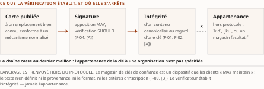
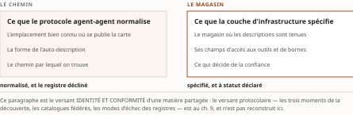

# Chapitre 15 — Émettre : Agent Card signée, annuaires, registres gouvernés

*Livre II — Faire confiance : identité, délégation et fabrique de confiance.
Premier mouvement — émettre (ch. 12-18). Quatrième chapitre du mouvement, et **celui qui porte le
mouvement** : les trois mécanismes d'émission y sont instruits sur pièce.*

| Champ | Valeur |
|---|---|
| **Statut** | **Brouillon de rédaction, non publiable** — pièce rédigée **hors portes** le 27 juillet 2026, sur instruction d'auteur, **G-3** et **G-4** alors ouvertes. ⚠ **G-3 a été franchie depuis, le 28 juillet 2026** (PRD v0.14, jalon J-IV-2) : *une porte franchie après coup solde l'infraction, elle ne la rattrape pas* — la pièce n'a pas été re-rédigée sur le socle consolidé. **G-4 demeure ouverte.** ⚠ **Le TOC désigne ce chapitre comme celui « à plus haut risque de surinterprétation » et lui assigne une relecture adversariale prioritaire** ; **CA-IV-13 n'est pas satisfaite** — la présente pièce n'a reçu que des contrôles mécaniques, conduits par la même main que la rédaction. *Un contrôle mécanique n'est pas une réfutation, et se relire soi-même n'est pas être relu.* **R-IV-16 et R-IV-17, ouvertes au ch. 12, valent pour tout le Livre** |
| **Date de gel** | **27 juillet 2026** — gel unique, **D-1 prise** (registre : [`gel-2026-07-27.md`](../PRD/gel-2026-07-27.md)). ⚠ **Volet résiduel de G-1 : instruit au socle, non reporté sur cette pièce.** La passe du 28 juillet 2026 ([`gel-2026-07-28-volet-residuel.md`](../PRD/gel-2026-07-28-volet-residuel.md)) a porté à leur source primaire les entrées à sensibilité temporelle du socle consolidé, dont plusieurs de celles que ce chapitre mobilise ; **le corps n'a pas été re-collationné contre elles**, et les **trois entrées** dont la re-datation touche ses énoncés sont déclarées à leur endroit — **une re-datée à sa source primaire** au § 15.2.2, **deux non établies** au § 15.3.3. Gels de source : **juin 2026** (Vol. I), **16 juillet 2026** (Vol. II), **21 juillet 2026** (Vol. III). ⚠ **Deux objets se périment nommément** : la spécification agent-agent lue en **v1.0.0** n'est **pas revalidée sur la v1.0.1** que son registre porte, et les statuts de préversion d'un produit d'éditeur sont datés du 21 juillet 2026 |
| **Socle mobilisé** | ⚠ **Le socle consolidé existe depuis le 28 juillet 2026** — [`socle-consolide.md`](../PRD/socle-consolide.md), **v1.2, 159 entrées `S-001`…`S-159`** —, **mais aucun énoncé de cette pièce n'y a été re-résolu** : le corps cite les identifiants de ses volumes d'origine, que les deux tables de correspondance du socle (§4 et §5) résolvent. Résolution contre le **Vol. III *Monographie* ch. 5-7 hors §7.4**, dont les entrées **F-01** à **F-12**, **F-33** à **F-43**, **F-50**, **F-53**, **F-55**, **F-64** à **F-69**, **F-87** et les entrées héritées **H-01**, **H-02**, **H-03**, **H-04**, **H-07** conservent leurs niveaux d'origine ; contre le **Vol. II *Monographie* §8.2**, dont **Vol. II F-08** conserve son niveau **[A, statut BROUILLON]** ; et contre le **Vol. I *Monographie* §3.4 et §3.6.3**, en **[C]**. ⚠ **Deux entrées mobilisées ici sont en [C] et corroborent sans porter** : Vol. III F-36 et F-55. **Aucun énoncé n'est central au sens de CA-IV-01** — non plus faute de socle, qui existe désormais, mais faute de collation : **G-4 est ouverte** et le corps n'a pas été repassé sur l'Annexe B |
| **Garde-fous balayés** | ⚠ **Règle de comptage, re-mesurée au commit du 28 juillet 2026** : *un cardinal déclaré ici porte sur le **marqueur littéral** de l'identifiant dans le **corps** — en-tête et note de statut exclus* ; les **applications non marquées** ne se dénombrent pas et relèvent du **domaine balayé**, déclaré sans cardinal. **Domaine balayé : les quatre sections du corps, § 15.0 à § 15.3, et leurs onze sous-sections.** Vol. II — **R-3 (la spécification de registre s'appuie sur SPIFFE/SPIRE comme *fondation* ; l'exigence stricte n'est pas établie) : deux marqueurs**, § 15.3.1, appliqué et non re-siégé — l'encadré « Affirmations écartées » reste au **ch. 16 § 16.2** ; **R-2 : un marqueur**, § 15.3.1, **renvoi à son siège** du ch. 16, aucune application ici ; **PRD Vol. II §8.2.5 (statuts pré-normatifs) : zéro marqueur** — la qualification pré-normative est pourtant portée **à chaque mention** aux § 15.1.1, § 15.2.1, § 15.2.3, § 15.3.1, § 15.3.2 et § 15.3.3 : *application déclarée, non dénombrée* ; **§8.2 (métriques et qualifications auto-déclarées) : zéro marqueur** — les métriques et qualifications des § 15.2.1 à § 15.2.3 sont néanmoins attribuées à **l'éditeur nommé** qui les avance — Microsoft, Google Cloud, AWS —, à chaque occurrence, la parade d'anonymisation ne couvrant pas l'attribution (décision 15) ; **R-1, R-4 à R-8 : zéro marqueur**. ⚠ **Les deux emplois littéraux de « F-01 » au corps — § 15.0 et § 15.1.1 — désignent l'entrée du VOL. III, non celle du Vol. II** : la mention est portée ici parce qu'un `F-xx` nu est indécidable entre deux socles (décision 7). Vol. III — **R-02 (par ce que la spécification démontre, jamais par ce qu'elle promet) : sept marqueurs**, § 15.0, § 15.1.4 (deux), § 15.2.2, § 15.3.1 et § 15.3.2 (deux) — ⚠ **le rang de ce cardinal au sein du Livre n'est pas déclaré** : les autres pièces sont relues dans la même passe, et *un rang mesuré pendant que des pièces bougent est faux à la seconde où on le publie* ; **R-07 (le rapprochement schéma/attente réglementaire est une inférence d'auteur) : deux marqueurs**, § 15.2 et § 15.3.3 ; **R-01 (le passeport n'est pas un mécanisme documenté) : un marqueur**, § 15.3.3. **R-03 à R-06, R-08 à R-14 : zéro marqueur.** ⚠ **Trois de ces zéros sont des applications sans marqueur, et le dire est la contrepartie de la règle** : **R-14** (les absences du chapitre portent leur degré — **quinze marqueurs littéraux « degré 3 » au corps**, tables comprises, dont **six absences de documentation déclarées en prose**, la septième occurrence de la formule étant **métalinguistique**, au § 15.1.4), **R-09** (le stade se dit à chaque mention) et **R-06** (« attendu par » E-23, **jamais « exigé »**, au § 15.3.3) sont **appliqués sur tout le domaine balayé** — *l'application est réelle, le renvoi à l'identifiant absent* |
| **Volumétrie cible** | ≈ **5 800 mots** de corps (§ 15.0 à § 15.3), **cible dérivée** de l'enveloppe du Livre (50 000 mots, TOC v0.24) au prorata des sections — ce chapitre en porte trois, mais **onze sous-sections**, ce que la dérivation au prorata des seules sections `##` sous-estime. ☑ **Décompte publiable depuis G-2** ; **réel : 8 494 mots** par [`PRD/decompte.sh`](../PRD/decompte.sh) — **+46,4 %** (re-mesuré au terme de la passe de relecture du 28 juillet 2026 ; le réel est passé de **8 187** à **8 494 mots**, les corrections de régime de preuve ajoutant des bornes sans rien retrancher). ⚠ **Le rang de cet écart au sein du Livre n'est pas re-mesuré** : les autres pièces sont relues dans la même passe, et *un cardinal mesuré pendant que des pièces s'écrivent est faux à la seconde où on le publie*. ⚠ La volumétrie du Livre est relevée au [`README.md`](README.md) du dossier et alimente **D-4** par **R-IV-17** |

> **Thèse** *(citée depuis le [`TOC.md`](../PRD/TOC.md) v0.30, entrée du chapitre 15 — re-citée par copie, décision 17)* — la signature d'une Agent Card vaut ce que valent son ancrage de confiance, sa révocation et sa gouvernance des clés ; le registre gouverné **tend à devenir — mouvement SPÉCULATIF, qu'aucune entrée du socle ne date —** la pièce de conformité maîtresse, mais trois modèles concurrents répondent à des questions différentes de la grille.
>
> ⚠ **Thèse réalignée au TOC v0.25** (décisions 8 et 14), sur la remontée **R-IV-23** ouverte par cette pièce. La forme antérieure — « le registre gouverné **devient** » — énonçait au présent de constat un mouvement prospectif que le socle ne date pas, confondant les deux instruments que **CA-IV-10** sépare. **Le corps du chapitre n'a pas changé** : il écrivait déjà l'énoncé en hypothèse. Le tri prospectif est celui du **siège de la discipline, ch. 49 § 49.0**, et n'est pas redéfini ici.

---

## § 15.0 — Introduction : trois mécanismes, une même question

Le ch. 14 a fourni l'instrument ; ce chapitre l'éprouve sur les trois mécanismes par lesquels une
organisation **émet** aujourd'hui l'identité d'un agent : une **carte signée**, une **inscription
dans un annuaire d'entreprise**, une **inscription dans un registre gouverné**. Les trois sont
documentés, datés, et **aucun n'est une norme ratifiée**.

⚠ **Ce chapitre est celui où la convention cardinale de la somme coûte le plus cher, et il faut la
poser avant la première ligne.** Un mécanisme cryptographique se qualifie par ce que sa spécification
**démontre**, jamais par ce qu'elle **promet** (R-02 du Vol. III). *La règle n'est pas une précaution
de style* : la spécification agent-agent écrit elle-même, en ouverture de sa section sur la
signature, que les cartes « **MAY** be digitally signed using JSON Web Signature (JWS) as defined in
RFC 7515 **to ensure authenticity and integrity** ». La clause finale énonce une **finalité
poursuivie**, non une propriété établie ; la reprendre comme qualification du mécanisme reviendrait à
commettre, dès la première page, la faute que ce chapitre a pour objet de nommer.

Lecture de l'auteur — la thèse du chapitre est une construction d'auteur, et sa première moitié
énonce une composition. **Ce que le socle établit** : douze faits bornés sur le format, l'ancrage, la
révocation et la gouvernance de projet de la spécification agent-agent en v1.0.0 (Vol. III F-01 à
F-12). **Ce qu'il n'établit pas** : qu'une signature « vaille » ce que valent trois éléments plutôt
que quatre ou deux, ni qu'il existe une mesure de cette valeur. *La composition proposée — la valeur
probante d'une signature se lit à la somme de son ancrage, de son régime de révocation et de la
gouvernance de ses clés — est une lecture ; les faits qui la portent sont cités un à un, et le
lecteur peut la refuser sans qu'aucun d'eux tombe.*

⚠ **Ce que ce chapitre ne traite pas, et où cela se lit.** Le versant « **extension des RFC** » du
produit d'éditeur du § 15.2 est au **ch. 12 § 12.7** et n'est pas repris ici. L'**inventaire complet
de la révocation**, mécanisme par mécanisme, est au **ch. 20 § 20.4** ; le § 15.1.3 n'en traite que ce
qui borne la carte. Le versant **protocolaire** de la découverte — chemin conventionnel, stratégies,
catalogues fédérés — est au **ch. 9**, avec lequel le Vol. I *Monographie* §3.4 est **partagé
déclaré** ; le § 15.3.2 n'en prend que le versant *identité et conformité*. Enfin, la section « **ce
qui n'existe toujours pas** » du chapitre source est **prélevée par le ch. 16 § 16.2** : la ligne
Fusion du présent chapitre porte son « hors §7.4 », et l'inventaire des manques n'est pas dressé ici.

## § 15.1 — L'Agent Card signée : anatomie et valeur probante

### 15.1.1 Le format et la chaîne de signature

**Le format est spécifié avec soin, et ce constat doit précéder tous les autres** : ce qui suit ne
décrit pas un mécanisme bâclé, mais un mécanisme **complet sur ce qu'il couvre et muet sur ce qu'il
ne couvre pas**.

**Ce que la spécification démontre.** La signature d'une carte d'agent est une signature JSON Web
Signature au sens du **RFC 7515**. Avant signature, le contenu de la carte **MUST** être canonicalisé
selon le *JSON Canonicalization Scheme* du **RFC 8785** ; le champ `signatures` lui-même **MUST** être
exclu du contenu signé, « to avoid circular dependencies » (Vol. III F-01, **[A]**). L'objet qui porte
la signature est **clos à trois membres** — `protected`, `signature`, `header` — et ne comporte aucun
membre de charge utile ; le vérificateur **reconstruit** la charge en re-canonicalisant la carte reçue
(Vol. III F-02, **[A]**).

⚠ **Une borne de méthode se déclare ici plutôt qu'en note.** Sur le balayage relevé par le lot du
Vol. III — spécification lue sur l'étiquette v1.0.0 et sur la branche principale, définition Protobuf
lue sur cette branche, les trois concordant —, la spécification **ne nomme pas** ce dispositif
« detached » et **ne désigne aucune** des sérialisations du RFC 7515 : *le mécanisme est décrit sans
être rattaché au vocabulaire de son texte d'origine.* La borne de cet énoncé est celle de son
instrument, et elle est **ouverte** : le rapport du lot déclare que son outil de récupération distante
a été **pris en défaut sur un test de contrôle**, et subordonne l'emploi de cet énoncé à une
re-vérification par balayage local **qui n'a pas eu lieu**. L'énoncé est donc versé ici comme
**constat borné**, non comme fait négatif vérifié.

**Ce que ce dispositif établit se laisse énoncer exactement** : *le détenteur d'une clé désignée par
un identifiant de clé a signé une forme canonicalisée d'une carte donnée.* L'intégrité du contenu au
regard de cette clé est **démontrée** ; **le lien entre cette clé et une organisation réelle ne l'est
pas** — c'est l'objet du § 15.1.2.

**Ce que l'en-tête protégé porte, et ce qu'il ne porte pas.** L'énumération normative compte **quatre
entrées** : `alg`, `typ` et `kid` **obligatoires**, `jku` seul paramètre facultatif nommé. **Ni
`nbf`, ni `iat`, ni `exp`** (Vol. III F-03, **[A]**, fait négatif **VÉRIFIÉ**, degré 1, borné aux deux
listes normatives telles que récupérées le 21 juillet 2026). La conséquence est structurante et
l'entrée la porte elle-même : **aucun paramètre temporel ne borne la signature ; elle ne périme que
par sa clé** — dont le statut est précisément ce que le vérificateur ne peut pas établir (§ 15.1.3).
⚠ **Deux bornes ne se perdent pas** : l'absence porte sur l'**énumération**, non sur ce qu'un émetteur
peut ajouter de son propre chef ; et une **tension interne** est consignée — l'étape 2 de la procédure
de vérification fait reposer la récupération de clé sur « the `kid` and `jku` » alors que `jku` n'est
que **facultatif**, de sorte qu'une carte conforme dépourvue de `jku` n'offre au vérificateur **aucun
chemin de récupération défini par le texte**, hors magasin de clés préétabli.

**Le régime d'obligation, qui décide de tout le reste.** Les cartes **MAY** être signées ; les clients
**SHOULD** vérifier au moins une signature avant d'accorder confiance à une carte (Vol. III F-04,
**[A]**). ⚠ **La conséquence excède le chapitre : une chaîne entièrement conforme peut ne comporter
aucune signature apposée ni aucune vérification effectuée.** *Un dispositif dont l'apposition est
facultative et la vérification recommandée ne fonde aucune obligation opposable ; il fonde une
faculté.*

**Quel texte fait foi, et à quelle date.** La version lue est la **1.0.0**, publiée le **12 mars
2026** ; le champ `signatures` a été introduit à la v0.3.0, publiée le 30 juillet 2025
(Vol. III F-12, **[B]**). ⚠ **Un écart de version est consigné et non arbitré** : le registre porte
une étiquette **v1.0.1 du 28 mai 2026** alors que l'en-tête du document déclare « Latest Released
Version 1.0.0 », et **la v1.0.1 n'a pas été ouverte**. L'entrée héritée, elle, la donne pour « dernier
correctif » (Vol. III H-01) : les deux formulations coexistent au socle et **ne sont pas tranchées
ici**. *Tout énoncé du présent chapitre vaut donc pour la 1.0.0 et n'est pas revalidé sur la 1.0.1.*

⚠ **Rien de ce chapitre ne porte sur les implémentations.** Le lot porte sur ce que la spécification
**prescrit**, jamais sur ce que les trousses de développement font. Ce que le code fait lorsque `jku`
est absent, lorsqu'il pointe vers un domaine tiers, ou lorsqu'aucun magasin de clés n'est configuré :
**absence de documentation, non fait négatif vérifié** (degré 3).

**Ce que le Vol. I ajoute, en régime [C].** Le §3.6.3 de sa *Monographie* pose la distinction que la
somme reprendra partout : *un justificatif qui établit **qui est l'agent** et un justificatif qui
établit **ce qu'il a le droit de faire et au nom de qui** sont deux objets, et les confondre reconduit
l'angle mort où authentifier l'agent passe pour autoriser sa chaîne de délégation.* ⚠ **Régime** : les
faits du Vol. I entrent en **[C]** ; cet apport **nomme** une distinction, il n'en établit aucun
mécanisme, et le **ch. 17** en fait sa matière.

### 15.1.2 Ancrage : qui signe les signataires ?

*Une signature ne devient une preuve d'origine qu'au moment où le vérificateur peut rattacher la clé à
une entité.* C'est la question de l'**ancrage de confiance** (*trust anchor*), et la spécification y
répond **en la renvoyant hors d'elle-même**.

**L'ancrage est renvoyé hors du protocole.** La récupération de la clé publique passe par `kid` et
`jku`, ou depuis un magasin de clés de confiance que les clients « **MAY** maintain » — dispositif
**facultatif et non spécifié**, dont le texte ne définit ni la provenance, ni le format, ni les
critères d'inscription (Vol. III F-09, **[B]**). ⚠ **La conjonction est ce qui compte** : la
vérification d'au moins une signature est un **SHOULD**, la tenue d'un magasin de clés un **MAY**. *La
spécification prescrit donc de vérifier une signature sans prescrire par rapport à quoi l'ancrer.*

**Le niveau du projet ne le rattrape pas davantage, et deux documents nommés l'établissent.** Le
fichier de politique de sécurité publié à la racine du dépôt de spécification tient en **deux
phrases** et ne décrit qu'une procédure de signalement de vulnérabilité ; le balayage y relève **zéro
occurrence** des chaînes relatives aux clés, à la signature, à la rotation, à la révocation et à la
compromission, et il est **exhaustif par construction**, le document entier tenant en trois lignes
(Vol. III F-08, **[A]**, fait négatif **VÉRIFIÉ**, degré 1, **borné à ce fichier et à ce dépôt**). La
charte de gouvernance décrit un comité de pilotage technique doté de huit sièges nominatifs et
**n'attribue à aucun organe** une responsabilité de gestion des clés (Vol. III F-11, **[B]**).

⚠ **La double borne du premier constat n'est pas une précaution de forme.** *Nommer le dépôt décide
de ce que le lecteur trouvera s'il l'ouvre* : le rapport du même lot relève que les points d'entrée de
signalement de vulnérabilité **divergent d'un dépôt à l'autre** de la même organisation — deux
trousses renvoient au programme de leur éditeur d'origine, une troisième à quatre adresses
individuelles chez un tiers, une quatrième ne publie aucun fichier de politique. *« Le dépôt », sans
autre indication, couvre cinq dépôts dont un seul porte le texte qui a été balayé.*

⚠ **Ces deux constats ne s'additionnent pas en un troisième.** Écrire que la gouvernance des clés
« n'existe pas comme document » serait un **négatif de corpus**, et c'est précisément la forme qu'un
vote adversarial à trois juges a **écartée 3-0**. Ce que le balayage couvre, ce sont **deux fichiers,
nommés un à un** ; le reste du corpus du projet — listes de diffusion, comptes rendus de comité,
demandes de tirage, dépôts des trousses — **n'a pas été balayé** : absence de documentation, degré 3.

**La voie du tiers de confiance est déclinée au niveau du protocole.** La spécification agent-agent
normalise la découverte par un chemin conventionnel et trois stratégies, et **déclare explicitement
qu'aucune interface de registre n'est prescrite** (Vol. III F-43, **[B]**, fait négatif **ÉTABLI**,
degré 2). *Le registre curé serait la voie naturelle d'un ancrage tiers ; le protocole ne l'emprunte
pas, et le dit.*

**Le manque est reconnu au suivi du projet, et son statut se dit.** Une proposition déposée au dépôt
de spécification — **ouverte le 22 mars 2026 et non close au 21 juillet 2026** — énonce qu'un agent
qui découvre la carte d'un autre « has no protocol-level mechanism to verify that the card is
authentic ». *(Source primaire ouverte et citée hors socle par le Vol. III, non versée.)* ⚠ **Une
proposition déposée par un contributeur n'est ni adoptée, ni close, ni une feuille de route** : tout
énoncé sur son aboutissement est **SPÉCULATIF**, et les pistes discutées ailleurs au même suivi sont
des **paris de recherche**, jamais des mécanismes du protocole.

Lecture de l'auteur — **ce que le socle établit** : le dispositif d'ancrage prévu par la procédure de
vérification est **facultatif et non spécifié** (Vol. III F-09) ; deux documents de projet nommés ne
portent aucune disposition de gouvernance des clés (F-08, F-11) ; le protocole décline l'interface de
registre (F-43). **Ce qu'il n'établit pas** : qu'un ancrage soit impossible, ni qu'un déploiement
donné n'en tienne pas un. *La lecture proposée — la spécification ne résout pas la question de
l'ancrage, elle la **déplace** vers un plan qu'elle ne décrit pas — est une construction d'auteur, et
elle est réfutable par la production d'un texte du projet qui décrirait ce plan.*

### 15.1.3 Révocation et durée de vie

**C'est ici que le mécanisme porte sa contradiction.**

**L'interdiction est posée au niveau normatif le plus fort.** « Expired or revoked keys **MUST NOT**
be used for verification » — l'énoncé figure sous l'intitulé *Security Considerations*, au même
niveau que des recommandations en SHOULD et MAY, et il emploie néanmoins **MUST NOT**. L'obligation
est explicite, et elle est **privée de tout moyen** permettant au client d'établir l'expiration ou la
révocation (Vol. III F-07, **[A]**). ⚠ **La borne décide du sens de la phrase, et elle est portée par
l'entrée : l'interdiction vise la clé de signature, non la carte.** *Une carte signée demeure
vérifiable tant que sa clé est réputée valide ; déplacer la prescription de la clé vers la carte, ou
vers l'identifiant de l'agent, fabriquerait une obligation que le texte ne pose pas.*

**Aucun moyen n'est fourni, et le balayage le borne.** La section consacrée à la signature ne
mentionne **ni liste de révocation, ni protocole d'état en ligne, ni point de terminaison de statut,
ni chaîne de certificats, ni délai de re-validation** ; et sa procédure de vérification en **six
étapes** ne comporte **aucune étape de contrôle de statut ou de fraîcheur** (Vol. III F-06, **[A]**,
degré 1, borné à cette section telle que récupérée et relue intégralement le 21 juillet 2026). *Un
implémenteur qui respecte la lettre du texte ne peut pas établir qu'il la respecte : l'obligation est
vérifiable par son auteur, non par son destinataire.*

**La carte, de son côté, ne porte ni validité ni statut.** Le message normatif compte **quatorze
champs**, dont aucun n'exprime une date d'émission, une expiration, une fenêtre de validité ni un
indicateur de révocation (Vol. III F-05, **[A]**, degré 1). *Ni la signature ni la carte ne portent
d'horloge. Ce qui périme, c'est une clé dont le statut n'est pas interrogeable.*

**La rotation est outillée ; le retrait ne l'est pas.** Plusieurs signatures **MAY** être portées par
une même carte « to support key rotation », et c'est le **seul** dispositif de rotation que la section
prévoie ; **dans cette même section**, aucune procédure de retrait d'une clé compromise n'est décrite
— ni période de recouvrement, ni périodicité (Vol. III F-10, **[B]**). ⚠ *Un mécanisme qui sait
remplacer sans savoir retirer accumule ses identités successives au lieu de les substituer.*
L'inventaire complet est au **ch. 20 § 20.4**, dont c'est la thèse ; il n'est pas dressé ici.

**La durée de vie, enfin, n'est pas où on la cherche.** Le socle **ne verse aucune entrée** sur la
fraîcheur de la ressource qui sert la carte. Le guide de découverte du projet — **documentation
d'accompagnement, non normative** — rattache cette fraîcheur à la sémantique de cache du transport et
renvoie, pour les exigences normatives, à une section que **le lot n'a pas pu ouvrir** : troncature du
récupérateur, confirmée par trois tentatives, qui atteint également une seconde section normative.
**Le socle ne documente pas ce que ces deux sections prescrivent — absence de documentation, non fait
négatif vérifié** (degré 3). ⚠ *La borne porte sur le siège annoncé des exigences de fraîcheur,
c'est-à-dire sur l'endroit même où la durée de vie d'une carte se déciderait.*

⚠ **Une précaution s'impose contre un réflexe de lecture, et le socle la fournit.** Le manque constaté
ici pourrait sembler appeler un retour au précédent des infrastructures à clés publiques ; **le socle
refroidit cette attente** : le RFC 5280 borne la granularité de la révocation par liste à la période
d'émission de cette liste — jusqu'à une heure, un jour ou une semaine —, et le RFC 6960 énonce que
l'état « good » **ne signifie pas nécessairement** que le certificat ait jamais été émis
(Vol. III F-53, **[B]**). *Mobilisé ici en corroboration seulement ; le siège est le ch. 20 § 20.5.*

### 15.1.4 Verdict par la grille du ch. 14 : ce que la carte établit, ce qu'elle affirme, ce qu'elle tait

⚠ **Cet intitulé a été corrigé au TOC v0.25, et le défaut qu'il portait n'avait été remonté par
personne.** Le plan écrivait « ce que la carte **prouve** ». Or **R-02 du Vol. III — que ce même plan
assigne en garde-fou à ce chapitre — est la convention cardinale de sa source** : un mécanisme
cryptographique se qualifie par ce que sa spécification **démontre**, jamais par ce qu'elle
**promet**, et la carte signée est exactement un tel mécanisme. *Le plan proscrivait le verbe dans le
corps du chapitre et le portait dans son propre intitulé de section.* ⚠ **Le défaut est hérité, et il
reste ouvert chez la source** : le Vol. III porte la même forme au §5.4 de sa *Monographie*, sous sa
remontée **R-G-48, volet 2, réservée à son auteur**. **Le compendium corrige chez lui et ne corrige
rien chez elle.**

Les règles d'emploi de la grille sont posées au **ch. 14 § 14.1** et ne sont pas répétées ; deux
commandent directement ce verdict — application **par mécanisme**, et **trois verdicts seulement**.
S'y ajoute la règle du régime d'absence : *une case laissée vide n'est pas un verdict — c'est l'état
de la preuve qui est déclaré.*

| Question | Verdict | Trace |
|---|---|---|
| **Q-A** *qui es-tu* | **répond partiellement** — *vérifiable* oui, en un sens exact ; **résistance à l'usurpation non établie**, l'ancrage étant renvoyé hors du protocole ; *révocable* non ; ***stable*, degré 3** | F-04, F-05, F-06, F-07, F-09 |
| **Q-B** *qui t'a créé* | **ne répond pas** — ancrage renvoyé hors du protocole, aucun organe de projet responsable des clés, interface de registre déclinée | F-08, F-09, F-11, F-43 |
| **Q-C** *pour qui agis-tu* | *case vide* — **degré 3**, aucun balayage sur le mandat | — |
| **Q-D** *que peux-tu faire* | *case vide* — **degré 3**, aucun balayage sur le privilège | — |
| **Q-E** *qui en répond* | *case vide* — **degré 3**, aucun balayage sur l'imputabilité | — |

: Tableau 15.1 — Verdict de la grille du ch. 14 appliqué à la carte d'agent signée en v1.0.0, au 21 juillet 2026.

Lecture de l'auteur — une observation bornée, versée sans être élevée en verdict. **Q-C** exige une
chaîne de mandat interrogeable **à l'instant t** ; or ni l'en-tête protégé (F-03) ni la carte (F-05)
ne portent de paramètre temporel. **Ce que le socle établit** : l'absence de paramètre temporel dans
deux structures nommées. **Ce qu'il n'établit pas** : ce que la carte porterait par ailleurs du
mandat, ni qu'une chaîne interrogeable soit incompatible avec ce format. ⚠ *En tirer un « ne répond
pas » transformerait le périmètre d'un balayage en propriété du mécanisme.*

⚠ **Un écart de verdict est déclaré et non arbitré.** Une version antérieure du plan portait, pour ce
mécanisme, « **Q-C non** ». Le présent chapitre laisse la case **vide au degré 3**, en cohérence avec
le ch. 14 § 14.2 et avec le régime des trois degrés d'absence : *aucun balayage ne couvre ce que la
carte porte du mandat, et un « ne répond pas » convertirait une absence de documentation en fait
négatif.* L'écart est **remonté**, non opéré par la pièce.

**Un dernier fait ferme la section, et il est gênant pour une institution qui inscrirait ce mécanisme
à un dossier de diligence raisonnable.** La documentation du projet énonce que le dispositif « enables
cryptographic verification of Agent Card **integrity** » ; un communiqué de fondation daté du 9 avril
2026 en parle, lui, comme d'une « cryptographic **identity** verification ». *(Source primaire ouverte
et citée hors socle par le Vol. III, non versée.)* ⚠ **Les deux registres ne sont pas équivalents, et
l'écart entre eux tient en un mot** — celui que R-02 interdit de franchir : *ce que la spécification
démontre est une vérification d'intégrité relative à une clé, et rien de ce qui est établi ici ne
permet d'en faire une vérification d'identité.*

## § 15.2 — Les annuaires commerciaux : Entra Agent ID et ses pairs

Le paragraphe précédent instruisait une **spécification** ; celui-ci instruit des **produits**, et le
changement d'objet impose un changement de discipline. *Une spécification se lit ; un produit se
date.* Quatre choses y sont distinctes et se confondent en une phrase de brochure : l'**annonce**, la
**feuille de route**, la **préversion** et la **disponibilité générale documentée**.

⚠ **Deux conséquences sont posées d'entrée.** *La neutralité fournisseur est une interdiction de
recommander, non une interdiction de nommer* — anonymiser un produit rendrait le fait non revalidable
au gel suivant, ce qui est une faute et non une précaution. Et **aucun rapprochement n'est proposé
ici entre un composant de ces produits et une attente réglementaire** : un tel rapprochement serait
une inférence d'auteur (R-07 du Vol. III), et son siège est le § 15.3.3 et le **ch. 25 § 25.2**.

### 15.2.1 Ce que la disponibilité générale couvre, et ce qu'elle ne couvre pas

L'entrée héritée **Vol. III H-02** situe la bascule « vers avril-mai 2026 » ; le relevé du Vol. III la
resserre : **Microsoft** situe la disponibilité générale de sa plateforme d'identité d'agent au **mois
d'avril 2026**, par ses propres notes de version (Vol. III F-33, **[B]**). ⚠ **C'est l'éditeur qui
date sa propre disponibilité générale** : la somme la rapporte, elle ne l'établit pas. ⚠ **La borne
est aussi instructive que l'énoncé** : ces notes regroupent leurs entrées **par mois et ne portent
aucun quantième**. *Écrire « avril 2026 » est exact ; écrire une date précise ne le serait pas.*

**Le fait suivant commande tout le paragraphe, et il a été soumis au vote adversarial : la
disponibilité générale d'un produit ne vaut pas disponibilité générale de ses capacités.** À
l'intérieur du produit annoncé en disponibilité générale, **plusieurs capacités nommées demeuraient
étiquetées *Preview*** dans la documentation consultée le 21 juillet 2026 — assistant de création de
gabarit d'identité, options d'affectation, cibles d'application, conditions de risque et
d'environnement d'exécution (Vol. III F-34, **[A]**). ⚠ **Ce constat porte sa borne** : il est établi
sur **trois pages nommées**, à leur état du 21 juillet 2026, et l'énumération **n'est pas présentée
comme couvrant toutes les préversions du produit**.

Sur les **licences**, l'héritage et le relevé se répondent. Les fonctions de sécurité étendues aux
agents relèvent de **licences additionnelles** (Vol. III H-02, **[A]**). Le relevé en donne
l'articulation, dans la forme corrigée par le contrôle de bornage : la documentation décrit **deux
régimes distincts** — la plateforme d'identité d'agent donnée pour disponible aux clients de
l'annuaire, *la portée universelle étant la formulation de l'éditeur, rapportée et non établie* ;
l'extension des fonctions de sécurité aux agents conditionnée à des références de licence supérieures
ou à une combinaison de deux licences. ⚠ **Deux réserves l'accompagnent** : le texte de licence est
**identique mot pour mot** sur les deux pages relevées, ce qui en fait un **bloc réutilisé** et non
deux constats indépendants ; et **les montants ne sont pas établis**, la page tarifaire étant hors du
périmètre documentaire du lot.

**Un dernier point de statut mérite d'être isolé, parce qu'il illustre exactement ce que le tri en
quatre catégories sert à empêcher.** Au 21 juillet 2026, **le même relevé — hors socle, aucune entrée
ne le porte** — rapporte que la documentation de Microsoft annonce que l'exigence de licence **n'est
pas encore appliquée techniquement** pour deux fonctions, et qu'elle l'annonce par des formules **sans
échéance datée** — « coming soon », « Starting soon », « will soon be required » —, sur des pages
d'états de juin 2026. ⚠ **PROJETÉ** au sens du tri prospectif : un changement futur y est annoncé
**sans quantième ni trimestre**, et rien dans les pages consultées ne dit ce qu'il advient d'un
locataire non licencié après l'entrée en vigueur. *Ce n'est ni une feuille de route datée, ni une
disponibilité générale : c'est une intention publiée.*

| Statut | Ce qu'il autorise à écrire | Occurrence relevée dans ce chapitre |
|---|---|---|
| **Disponibilité générale documentée** | l'existence de la capacité à la date que porte la source | plateforme d'identité d'agent, **avril 2026**, notes de version de **Microsoft** (F-33) — mois, sans quantième |
| **Préversion** | l'existence de la capacité, **sans** engagement de service ni stabilité | six libellés « (Preview) » relevés sur trois pages nommées, 21 juillet 2026 (F-34) |
| **Feuille de route** | une intention **datée**, attribuée à son auteur | *aucune occurrence de ce statut dans le périmètre de ce chapitre* |
| **Annonce** | une intention **non datée**, attribuée à son auteur — tri **PROJETÉ** | application de l'exigence de licence, annoncée par **Microsoft** : « coming soon », « Starting soon », « will soon be required », trois pages d'états de juin 2026 |

: Tableau 15.2 — Les quatre statuts et ce que chacun autorise, au 21 juillet 2026.

**Reste ce qui relève de la couverture et non du statut.** La documentation porte une **réserve
explicite d'absence de couverture entre les deux plans d'identité d'agent** : une politique d'accès
conditionnel ciblant des identités d'agent — y compris par gabarit — **ne s'applique pas** au compte
d'utilisateur de l'agent, et une politique ciblant « tous les utilisateurs » **n'inclut pas** ces
comptes (Vol. III F-35, **[A]**, **degré 2**). ⚠ **Le degré compte** : l'absence est énoncée par
l'éditeur dans sa propre liste des configurations non prises en charge, à l'état du 19 juin 2026 ;
*elle ne résulte ni d'un balayage de spécification ni d'un essai en locataire*, et le mot
« currently » est de la source. **C'est un écart de point d'application, non une nuance de licence.**

### 15.2.2 Les mécanismes documentés chez les autres fournisseurs infonuagiques : un état daté

⚠ **Avertissement de niveau, et il commande la lecture de tout ce paragraphe.** Ce que le socle porte
sur les autres fournisseurs tient dans **une entrée unique, Vol. III F-36, de niveau [C]** —
repérage. L'entrée agrège trois affirmations dont la dernière est elle-même en [C] : la règle de
composition du socle lui impose **le niveau le plus faible de ses composantes**, et son niveau a été
**corrigé de [B] en [C]** le 21 juillet 2026 — ⚠ **et ce niveau est à réexaminer depuis le 28 juillet
2026**, pour un motif exposé plus bas. *Une affirmation tracée vers une entrée [C] n'est pas
centrale, ou n'est pas rédigée.* **Rien de ce qui suit ne porte la thèse du chapitre.**

Chez **Google Cloud**, la disponibilité générale de l'identité d'agent dans son service de
gestion des identités et des accès est datée du **22 avril 2026** ; à la **même date**, le
gestionnaire d'authentification de la même fonction est placé **en préversion**. Le mécanisme repose
sur une **identité de charge de travail** matérialisée par des certificats **d'une validité de
vingt-quatre heures**, renouvelés par le fournisseur (Vol. III F-36, **[C]**). ⚠ **Le socle de cette
famille d'identité est posé au ch. 3** et n'est pas reconstruit ici. *Le partage est net et il recoupe
celui du § 15.2.1 : identité en disponibilité générale, mécanismes d'authentification aux tiers en
préversion.*

⚠ **La qualification de ce mécanisme appelle la convention cardinale.** La source est une
**documentation de produit**, non une spécification soumise à revue ni une preuve de sécurité. Elle
décrit la liaison du jeton d'accès au certificat par une **formule de moyen** — « to help prevent
token theft » — et qualifie l'identité de « strongly attested ». *Ces deux formulations sont de
Google Cloud, reproduites en langue originale et non reprises au compte de la somme : ce qu'une
documentation de produit promet n'est pas ce qu'une spécification démontre* (R-02). La **conformité
effective au standard d'identité de charge de travail — quel profil, quelle version — n'est pas
documentée** sur la page consultée.

Chez **AWS**, le mécanisme documenté comparable est une identité de charge de travail dotée
d'attributs propres plutôt qu'un type d'objet distinct, inscrite dans un annuaire d'identités d'agent
et adossée à un coffre à jetons (Vol. III F-36, **[C]**). ⚠ **Deux retraits sont conservés** : la
formulation ne revendique **ni** unicité au sein de l'offre du fournisseur, **ni** équivalence
fonctionnelle avec les mécanismes précédents.

**Et c'est ici que la comparaison s'arrêtait, faute de ce que ce chapitre lui demande : une date de
statut.** Trois adresses d'annonce essayées, **trois réponses HTTP 404** ; deux adresses d'historique
documentaire rendant une page réduite à son titre ; une page produit dont le texte converti ne porte
**aucun libellé de statut** rattaché à une capacité. ⚠ **L'absence de bannière de préversion dans les
pages ouvertes n'établit rien** : la conversion en texte supprime les encadrés.

⚠ **Ce constat d'absence est levé depuis, et la manière dont il l'est instruit plus que le fait
lui-même.** La re-datation du socle consolidé du **28 juillet 2026**
([`socle-consolide.md`](../PRD/socle-consolide.md) v1.2, entrée `S-082`, qui consolide Vol. III F-36)
porte le statut à sa **source primaire** : un billet d'annonce d'**AWS daté du 13 octobre 2025**, où
l'offre — volet identité compris — est donnée pour **généralement disponible**. ⚠ **Ce n'est pas un
fait survenu depuis le gel : c'est une source primaire que le lot n'avait pas ouverte**, antérieure de
neuf mois à lui — *la mention « statut non daté » était déjà fausse le 21 juillet 2026, et c'est
l'instrument qui a manqué, non la source.* ⚠ **La conséquence de niveau n'est pas tirée ici** : la
rétrogradation de **[B]** en **[C]** de cette entrée reposait sur cette absence, son réexamen relève
du [PRD](../PRD/PRD.md) du Vol. IV §7.1, et **tant qu'il n'est pas fait, l'entrée demeure [C] et ce
paragraphe ne porte toujours rien**.

⚠ **Aucune métrique d'adoption n'est citée dans ce paragraphe, et l'omission est délibérée** : le
socle n'en porte aucune pour les trois annuaires commerciaux instruits au § 15.2 — nombre de
locataires, d'identités gérées, de déploiements en production —, **absence de documentation,
degré 3**. Les chiffres qui circulent sur ces produits sont **auto-déclarés par leurs éditeurs** et
devraient, pour entrer ici, être attribués nominativement à chaque occurrence ; aucun n'ayant été
vérifié, **ce chapitre n'en avance aucun**.

### 15.2.3 Le risque de standard de fait : un annuaire commercial dominant fixe la norme sans passer par une norme

Lecture de l'auteur — **ce paragraphe entier est une construction d'auteur, et il porte son marquage à
l'ouverture.** **Ce que le socle établit** : un produit en disponibilité générale datée d'avril 2026
(F-33), dont un type d'objet d'annuaire est spécifié et versionné dans l'interface de programmation
de son éditeur (F-37), et dont les flux **étendent les RFC** (H-02) ; et, du côté des travaux de
normalisation, l'**état non ratifié et non adopté** des propositions concurrentes (F-38, F-41, F-42,
F-43, F-50). **Ce qu'il n'établit pas** : qu'un produit disponible **structure** un marché ; qu'il
**préempte** une normalisation ; qu'une norme aurait été publiée plus tôt en son absence ; qu'un
éditeur ait poursuivi cet effet. ⚠ *Aucune des entrées mobilisées ne porte de mesure d'adoption, de
part de marché ni d'influence sur un organisme de normalisation.*

L'expression retenue — un **standard de fait** — désigne un usage qui s'impose par le **déploiement**
plutôt que par la **ratification**. L'asymétrie qui la motive est documentée **des deux côtés**, et
c'est ce qui rend la lecture discutable plutôt que gratuite.

D'un côté, **un schéma d'éditeur** : un type de ressource nommé, hérité d'un type préexistant, publié
dans la version **stable** d'une interface de programmation (F-37). Il est daté, versionné, documenté,
et **administrable dès aujourd'hui** par toute organisation qui exploite l'annuaire correspondant.

De l'autre, **l'état des propositions ouvertes**, chacune avec sa borne. La spécification de registre
d'agents porte en tête « White Paper | 2026-03-27 | Status: draft » et relève d'un espace de travaux
qui **ne sont pas encore** un projet officiel de son organisme (F-38, **[A]**). L'extension SCIM à
laquelle elle s'adosse n'existe qu'en une révision **-00** du 16 octobre 2025, **expirée et
archivée**, sans flux ni adoption (F-41, **[B, degré 2]**). La consolidation présentée à l'IETF 125 le
19 mars 2026 s'est conclue sur la demande d'apporter **d'abord des cas d'usage**, et le troisième
document du dossier demeure une **soumission individuelle** (F-42, **[B, degré 2]**). La spécification
agent-agent **décline explicitement** l'interface de registre (F-43, **[B, degré 2]**). Enfin, sur
l'admission inter-domaines, **aucune des propositions relevées n'était ratifiée ni adoptée**
(F-50, **[B, degré 2]**) — instruction au **ch. 18 § 18.1**, siège unique.

Le Vol. II avait formulé le constat avant que ce socle n'existe, et il l'écrivait ainsi : « Un
architecte qui chercherait aujourd'hui, pour son dossier de conformité, la norme d'identité et de
registre des agents ne la trouverait pas : elle n'existe pas. » *(Thèse d'un volume antérieur,
attribuée ; elle n'entre pas au socle du Vol. III comme fait.)* Ce que les entrées ci-dessus ajoutent,
c'est **la datation de chacune des branches de cette absence**, et un fait que le socle du Vol. II ne
portait pas : **pendant que les propositions demeurent au brouillon, un schéma d'annuaire est publié
en version stable chez un éditeur** (F-37). ⚠ La page qui le porte est **antérieure au gel du
Vol. II** ; *le socle de ce volume ne l'a pas relevée, ce qui est une absence dans un corpus et non
une impossibilité pour l'auteur de ce corpus.*

**La lecture proposée est celle-ci.** Lorsqu'une organisation doit inscrire un agent quelque part,
elle ne choisit pas entre un produit et une norme : **elle choisit entre un produit et rien**. Le
vocabulaire qu'elle adoptera — objet d'annuaire, gabarit, parrain, périmètre de permissions
héritables — sera celui de l'outil dont elle dispose, et **il façonnera ce qu'elle saura ensuite
demander à une norme**. C'est en ce sens, et en ce sens seulement, que le précédent commercial
préempte : *non parce qu'il empêcherait une normalisation, mais parce qu'il fixe des attentes avant
qu'elle n'arrive.*

⚠ **Et l'objection tient debout.** Un schéma de produit n'est pas un standard, et rien au socle
n'établit qu'il en tienne lieu pour quiconque. Il se peut aussi bien qu'un organisme de normalisation
reprenne ces objets, les réfute, ou les ignore. **Le tri en quatre statuts est la parade** : il
n'empêche pas la préemption, il empêche de la **confondre avec une normalisation**. *Écrire
« disponible » quand la source écrit* Preview*, ou « publié » quand elle écrit « coming soon », c'est
déjà avoir cédé.*

### 15.2.4 La grille du ch. 14 appliquée

La grille s'applique **par mécanisme, et non par produit** : le mécanisme évalué est **l'identité
d'agent gérée dans un annuaire d'entreprise**, telle que le socle la documente.

| Question | Verdict | Ce qui le porte, et sa borne |
|---|---|---|
| **Q-A** *qui es-tu* | **répond partiellement** | Un type d'objet d'annuaire est spécifié, nommé et administrable (F-37, **[B]**). Mais l'agent est porté par **deux** objets, et une politique posée sur l'un ne couvre pas l'autre (F-35, **[A]**, degré 2) : **l'identifiant n'est pas unique**. La *révocabilité*, que Q-A demande explicitement, n'est documentée par aucune des entrées mobilisées — **degré 3**, comme les volets *vérifiable* et *résistant à l'usurpation* |
| **Q-B** *qui t'a créé* | **répond partiellement** | Le type de ressource est spécifié et publié dans la version stable de l'interface de son éditeur, héritant du type `application` (F-37) : **une provenance est déclarée dans les bornes du locataire**. ⚠ Le détail du schéma n'est pas porté par l'entrée : il vit dans l'affirmation qu'elle condense, employé **en corroboration seulement**. L'**ancrage de confiance**, second terme de Q-B, n'est documenté par aucune entrée — **degré 3** |
| **Q-C** *pour qui agis-tu* | **répond partiellement** | Les scénarios d'agissement pour le compte d'autrui **expriment** un mandat (H-02, **[A]**). Rien au socle ne documente son **interrogation à l'instant t** ; et la réserve de couverture (F-35) sépare précisément les deux objets entre lesquels ce mandat court |
| **Q-D** *que peux-tu faire* | **répond partiellement** | Le type hérite du type `application` (F-37) et porte donc ses bornes de permissions : **des bornes sont déclarées**. Elles ne sont opposables qu'à **un** des deux plans, la source déclarant elle-même l'autre non couvert (F-35) |
| **Q-E** *qui en répond* | *case vide, degré 3* | Lecture de l'auteur — le socle établit qu'un type d'objet d'annuaire est spécifié et hérité (F-37) ; **il n'établit ni qu'un mécanisme d'imputabilité y soit attaché, ni qu'un objet d'annuaire désigne une personne ou une entité juridique** |

: Tableau 15.3 — Verdict de la grille du ch. 14, mécanisme « identité d'agent gérée en annuaire d'entreprise », au 21 juillet 2026.

**Quatre verdicts partiels et une case vide au degré 3** : un mécanisme en disponibilité générale,
spécifié et administrable **n'infirme donc pas** la thèse falsifiable du ch. 14. ⚠ **Le motif de ce
résultat n'est pas une faiblesse de conception, et il vaut d'être nommé** : les deux questions dont
un terme manque — la **révocabilité** et l'**ancrage de confiance** — sont exactement celles qui
**excèdent le périmètre d'un annuaire**. *Un annuaire nomme, classe et administre ; il ne fonde pas la
confiance qu'on accorde à ce qu'il nomme.*

## § 15.3 — Les registres gouvernés : de la spécification CSA aux registres A2A

Une organisation qui met des agents en production doit d'abord répondre à une **question de tenue de
livres** : lesquels possède-t-elle ? Le résultat de l'instruction n'est pas un vide — **c'est un
encombrement**. Quatre dispositifs prescrivent quelque chose du registre, et **ils ne se qualifient
pas les uns comme les autres**.

Lecture de l'auteur — la typologie qui structure ce paragraphe — **registre d'entreprise, registre de
fédération, annuaire protocolaire** — est une construction d'auteur. **Ce que le socle établit** : le
statut, la date et le contenu prescriptif des quatre dispositifs (Vol. III F-38 à F-43 ; H-03). **Ce
qu'il n'établit pas** : qu'ils forment trois modèles, que ces modèles soient concurrents, ni qu'un
registre d'agents soit **en voie de devenir** une pièce de conformité. ⚠ **Ce dernier énoncé est
prospectif, et son tri est SPÉCULATIF** : aucune entrée du socle ne date d'engagement une telle
trajectoire. La thèse le portait **au présent de constat** jusqu'au **TOC v0.24** — « le registre
gouverné **devient** » — et **l'écart a été soldé par la remontée R-IV-23**, qui l'a réalignée au
**TOC v0.25** en « **tend à devenir — mouvement SPÉCULATIF, qu'aucune entrée du socle ne date** ».
*Le chapitre l'écrivait déjà en hypothèse, jamais en constat ; la thèse citée en tête le fait
désormais aussi.*

### 15.3.1 La spécification CSA (`toolAccessList`, `permissionBoundaries`) : ce qu'un brouillon de laboratoire prescrit, et ce qu'il traîne

La spécification porte son statut dans son propre en-tête : « **White Paper | 2026-03-27 | Status:
draft** », et l'espace de laboratoire qui l'héberge se décrit comme accueillant des travaux qui **ne
sont pas encore** un projet officiel de l'organisme (Vol. III F-38, **[A]**). *C'est un brouillon de
laboratoire, non une norme ratifiée*, et la qualification **se répète à chaque mention** plutôt que de
se poser une fois en tête.

**Ce statut commande ce qu'une institution peut inscrire dans un dossier de diligence raisonnable, et
il commande la lecture de ce qui suit — car le brouillon prescrit beaucoup.** Son schéma de profil
d'agent range parmi ses **champs obligatoires** un `toolAccessList`, qui énumère les outils et les
serveurs du protocole agent-outil que l'agent est autorisé à invoquer, et des `permissionBoundaries`,
qui portent les limites de portée (Vol. III F-40, **[B]** ; Vol. II F-08, **[A, statut BROUILLON]**).
⚠ **La borne compte** : le socle porte **ces deux champs et leur caractère obligatoire**, non
l'inventaire complet du schéma.

**Il faut peser ce que signifie rendre ces deux champs obligatoires dans un profil d'identité.** Cela
revient à poser qu'on ne peut pas enregistrer un agent **sans déclarer, de façon explicite et lisible
par machine**, l'ensemble des outils qu'il peut atteindre et les bornes de ce qu'il peut faire. *La
déclaration cesse d'être une documentation d'accompagnement pour devenir une condition d'existence de
l'agent dans l'annuaire.*

**Deux règles attachées à ces champs éclairent la nature de l'objet, et elles ne sont pas au socle** —
relevées à la source primaire par le lot du Vol. III et **non versées**. La première : une expansion
de capacités — l'ajout de nouvelles entrées aux champs de capacités ou d'accès aux outils —
**invalide le profil de confiance**. La seconde : le tableau des empreintes comportementales et le
détail complet des bornes de permission sont **exclus par défaut des réponses fédérées**. *L'une fait
du profil de confiance un objet à durée de vie conditionnelle ; l'autre borne ce qu'une fédération de
registres expose à ses pairs.* ⚠ **Ce que ces règles décrivent est un régime de champs et
d'invalidation** ; le document **ne démontre par ce seul fait aucune propriété cryptographique**
(R-02).

⚠ **Une affirmation doit être écartée, et c'est le garde-fou R-3 du Vol. II qui l'impose.** Rien au
socle n'établit que cette spécification **exigerait** une identité de charge de travail au sens
SPIFFE — ni identifiant sous forme d'URI de ce type, ni justificatif correspondant. **Elle s'appuie
sur SPIFFE et SPIRE comme *fondation* ; l'exigence stricte n'est pas établie.** ⚠ *L'écart entre ces
deux formulations décide de la portée d'une décision d'architecture : un substrat sur lequel une
spécification s'appuie laisse ouvert le choix de l'architecte, une exigence stricte le fermerait.*
**Aucun dossier de conception ne devrait tenir la seconde lecture pour acquise.** ⚠ Le socle de
l'identité de charge de travail est **posé au ch. 3** et n'est pas reconstruit ici ; l'**encadré
« Affirmations écartées » qui porte R-2 et R-3 reste au ch. 16 § 16.2**, et ce paragraphe **applique**
le garde-fou sans le re-siéger.

**Reste l'ancrage, et c'est là que le brouillon traîne quelque chose.** Il désigne comme son modèle
d'interopérabilité pour l'approvisionnement inter-domaines d'agents un brouillon IETF qu'il **cite
toujours dans sa version -00** (Vol. III F-41, **[B, degré 2]**), lequel a **expiré le 19 avril 2026 —
vingt-trois jours après la publication de la spécification qui s'y adosse** (Vol. III H-03,
**[A, statut BROUILLON]**). ⚠ **La conclusion qu'autorise cette chronologie est plus étroite que celle
qu'on serait tenté d'en tirer** : *au 27 mars 2026, le brouillon désigné était vivant.* **Ce n'est donc
pas un adossement à un texte mort, c'est un adossement non entretenu.**

### 15.3.2 Registres et découverte : A2A normalise le chemin, AGNTCY spécifie le magasin

⚠ **Ce paragraphe est le versant *identité et conformité* d'une matière partagée.** Le §3.4 du Vol. I
est **partagé déclaré** entre le **ch. 9**, qui en prend le versant **protocolaire** — la leçon des
annuaires universels, les trois moments de la découverte, les catalogues fédérés, les modes d'échec
des registres —, et le présent paragraphe, qui en prend **ce qui décide de la confiance**. *Le ch. 9
n'est pas rejoué ici, et sa matière n'y est pas reconstruite.*

Ce que la documentation du projet agent-agent établit vaut **décision d'architecture**. Elle définit
un **chemin de découverte normalisé**, énumère **trois stratégies** — adresse conventionnelle,
registres organisés, configuration directe — et **déclare explicitement qu'aucune interface normalisée
n'est prescrite pour les registres organisés** (Vol. III F-43, **[B, degré 2]**). ⚠ **Le fait négatif
est de degré 2** : la réserve est portée **en toutes lettres par la documentation du projet
lui-même**, non par un balayage du texte normatif.

⚠ **Deux réserves s'y attachent, toutes deux consignées.** La section d'enregistrement du chemin
conventionnel **n'a pas pu être extraite** — contenu tronqué à la récupération, la table des matières
attestant seulement l'existence de la section : **l'enregistrement effectif du chemin auprès de
l'autorité de numérotation n'est donc pas constaté ici**. Et la documentation note qu'une carte
porteuse de données sensibles doit être protégée par authentification et autorisation : *c'est une
exigence de déploiement, non une propriété démontrée du format* (R-02).

**Le service d'annuaire de l'autre écosystème prend l'option inverse.** Il est spécifié par un
*Internet-Draft* de **soumission individuelle**, à sa révision **-02 du 6 juillet 2026**
(Vol. III F-43) — travaux émergents, non une norme ratifiée. Le reste est **source primaire ouverte
hors socle** : statut visé *Informational*, expiration au **7 janvier 2027** — échéance automatique,
**PROGRAMMÉE au sens mécanique**, qui ne dit rien d'une adoption —, stockage des enregistrements sous
forme d'artefacts adressés par contenu, annonce et découverte par table de hachage distribuée,
signature de provenance. ⚠ **Ces mécanismes sont déclarés par la spécification** ; *ce qu'une mise en
œuvre en démontre effectivement n'a pas été vérifié* (R-02).

⚠ **Un sigle de cet écosystème ne s'emploie jamais nu, et la raison est documentée.** L'intitulé
complet de sa composante « ACP » et son identité éventuelle avec le protocole homonyme fusionné dans
la couche agent-agent **ne sont établis par aucune source ouverte** : la question est **ouverte, aucune
passe de recherche n'ayant été conduite**. L'**encadré de désambiguïsation à quatre branches est au
ch. 7 § 7.5** et n'est pas reconstruit ici ; la **mécanique de la fusion** est au **ch. 8 § 8.5.1**.
*Le sigle n'est employé dans ce chapitre qu'accompagné de sa branche, et la branche de l'annuaire
n'est jamais agrégée à celle du protocole.*

**Une entrée de repérage corrobore le cycle de vie que le brouillon de registre prescrit** : quatre
états — *active*, *suspended*, *deprecated*, *revoked* — et le rejet imposé d'un agent suspendu ou
révoqué, **sans aucun délai de propagation ni budget de fraîcheur** ; côté annuaire, le document
**présente** l'adressage par contenu comme fondant l'intégrité, **sans démonstration fournie**
(Vol. III F-55, **[C, degré 1]**). ⚠ **Cette entrée est en [C] : elle corrobore, elle ne porte pas**,
et son balayage a été mené sur la **révision -01**, que le socle sait supplantée par la -02 et **non
rebalayée**. *La révocation est l'objet du ch. 20 ; ce qui appartient ici est le constat de statut.*

Lecture de l'auteur — la lecture proposée est que les trois dispositifs répondent à des **questions
distinctes de la grille du ch. 14** : l'**annuaire protocolaire** travaille sur **Q-A** — le chemin de
découverte normalisé en est le préalable, non la réponse —, le **registre d'entreprise** sur **Q-D** —
bornes déclarées, le socle ne portant pas leur opposabilité au point d'application —, et le **registre
de fédération** sur ce que **Q-D cesse d'exposer** au franchissement d'une frontière de domaine. ⚠
**Aucun verdict par la grille n'est porté ici** : les sièges d'application sont les § 15.1.4 et
§ 15.2.4, et ce paragraphe **instruit la matière sans la juger**.

### 15.3.3 Le registre comme objet réglementaire — et la quatrième pièce du passeport

**Le registre change de nature quand on le regarde depuis un cadre prudentiel.** Ce n'est plus un
annuaire de résolution : c'est un **inventaire**, et l'inventaire figure parmi les composantes
majeures de ce que les cadres canadiens **attendent**.

La ligne directrice **E-23**, publiée le 11 septembre 2025 et **en vigueur le 1ᵉʳ mai 2027** —
échéance réglementaire datée, donc **PROGRAMMÉE** —, est **fondée sur des principes et rédigée au
conditionnel** (Vol. III H-04, **[A/B mixte]**). Ses douze énoncés numérotés sont au *should* : le
balayage du corps de la version anglaise en rendu HTML n'y relève **aucune occurrence** de *must*, ni
des formules d'attente directe (Vol. III F-64, **[B, degré 1]**). ⚠ **Deux bornes** : un appendice n'a
pas été extrait, et le volet français n'a pas été balayé — *ce décompte ne couvre donc pas les deux
langues.* Ce que le texte porte, l'institution le **devrait** : « a comprehensive inventory of models
whose inherent risk is determined to be non-negligible to the institution », à l'échelle de
l'entreprise, l'identification et l'inventaire figurant parmi les composantes majeures du cadre, et le
cycle de vie visant nommément la prise de décision autonome et la reparamétrisation autonome
(Vol. III F-65, **[B]**).

⚠ **La modalité se tient, et elle a sa source.** On écrit « **attendu par** E-23 », **jamais « exigé
par E-23 »** ; et « E-23 attend » ne s'écrit qu'au titre du **document d'information** du même jour
(Vol. III F-66, **[B, degré 1]**), jamais au titre du texte de la ligne directrice. On écrit
« inventaire » et « documentation de modèle », **jamais « fiche de modèle »** — expression dont H-04
établit qu'elle compte **zéro occurrence**, en anglais comme en français.

⚠ **E-23 ne nomme ni l'agentique, ni les agents, ni l'orchestration** : vérification mécanique sur le
texte intégral, dans les deux langues — « agentique » = 0, « agent(s) » = 0, « orchestration » = 0,
« autonom\* » = 8 (Vol. III H-04). Sa définition de « modèle », laissée « intentionally broad »,
englobe les méthodes d'IA et d'apprentissage automatique ; d'où une **couverture implicite** que des
analystes juridiques tiennent pour acquise, et qui est **attribuée aux analystes, jamais au
régulateur**.

Les deux autres autorités que la somme mobilise prennent le même appui. L'**AMF** formule ses attentes
sur le mode « L'Autorité s'attend à ce que… », pour effet au **1ᵉʳ mai 2027** — même échéance,
**PROGRAMMÉE** au même titre —, et reprend une définition du système d'IA incluant des « degrés
variables d'autonomie et d'adaptabilité après déploiement » (Vol. III F-68, **[B]**). L'avis des
**ACVM** du 5 décembre 2024 pose que les lois **sur les valeurs mobilières** existantes s'appliquent
aux systèmes d'IA — *les indications qu'il donne ne créent ni ne modifient aucune exigence, et cette
formule est un rendu français, non un verbatim* — et retient une définition incluant des niveaux
variables d'autonomie et d'adaptativité après déploiement (Vol. III H-07, **[B]**). ⚠ **La borne de
portée ne se perd pas** : *le socle n'établit pas que cet avis porte au-delà des marchés de
capitaux.*

⚠ **Ces deux entrées n'ont pas pu être re-constatées à leur source le 28 juillet 2026** — accès refusé
par l'hôte pour la première, source servie mais non extractible pour la seconde (socle consolidé v1.2,
`S-114` et `S-024`). Leurs niveaux ne bougent pas ; *mais une entrée en vigueur au 1ᵉʳ mai 2027 est un
fait à échéance, et l'absence de re-datation se déclare plutôt qu'elle ne se présume stable.*

*Trois cadres, une même prise : ce qui varie après le déploiement est ce que chacun attend de voir
rester connu. Un registre est le lieu où cette connaissance s'inscrit.* ⚠ **L'analyse de ce que ces
cadres demandent, à qui et sous quelle modalité relève du Livre III — ch. 25 § 25.2 en est le siège —
et n'est pas conduite ici.**

⚠ **Le rapprochement s'arrête là où le socle s'arrête.** Le rapprochement entre le schéma de profil
d'agent du brouillon de registre et l'inventaire attendu par E-23 est une **inférence d'auteur**
(R-07 du Vol. III). ⚠ Et la **formulation renforcée** que ce garde-fou réserve à certains objets —
« l'éditeur ne revendique aucune conformité, et aucune source ne documente ce lien », **fait négatif
établi** — **ne s'applique pas ici** : pour le brouillon de registre, **le socle est muet — absence de
documentation, degré 3**. *Les deux formules ne s'échangent pas : l'une dit qu'on a cherché et
consigné une réserve, l'autre dit qu'on est muet.*

**Ce paragraphe est l'un des deux sièges de la quatrième pièce du passeport d'agent — les attestations
de conformité —, l'autre étant le ch. 25 § 25.2 ; elle n'a pas de chapitre dédié et n'en aura pas.**
⚠ **Le passeport d'agent ne figure dans aucune spécification de 2026 : c'est un objet de synthèse
construit par la somme** (R-01 du Vol. III ; assemblage au **ch. 16**) — *dire « sa quatrième pièce »
ne suppose donc l'existence ni du passeport ni de la pièce, mais nomme une place dans une construction
déclarée.*

**Ce qui s'en documente ici tient en peu de choses, et l'asymétrie se déclare plutôt qu'elle ne se
masque.** Dans le schéma du brouillon, le relevé ne fait apparaître **qu'un point d'ancrage** : un
champ nommé `externalCertifications`, qui figure parmi les champs **facultatifs**, aux côtés de trois
autres. *(Source primaire ouverte et citée hors socle par le Vol. III, non versée.)* ⚠ **Le relevé
nomme le champ et son caractère facultatif ; il ne documente ni son format, ni ce qu'une attestation y
porterait, ni qui l'émettrait — absence de documentation, degré 3.**

Lecture de l'auteur — **ce que le socle établit** : trois cadres canadiens attendent un inventaire et
visent ce qui varie après le déploiement (H-04, F-65, F-68, H-07) ; un brouillon de laboratoire
prescrit un schéma de profil d'agent à champs obligatoires (F-40). **Ce qu'il n'établit pas** : que le
second réponde au premier, ni qu'une inscription au registre vaille pièce de conformité. *La lecture
proposée est que la quatrième pièce du passeport est, des quatre, la moins documentée* — comparaison
**bornée à ces quatre pièces nommées** : chacune des trois autres est adossée à au moins une
spécification instruite, tandis que l'attestation n'a ici **qu'un nom de champ facultatif, relevé hors
socle**.

### Synthèse : ce que le chapitre lègue à la somme

*Section de sortie sans homologue direct dans la source — construction d'éditeur.*

1. **Ce que la signature démontre, et rien de plus.** *Le détenteur d'une clé a signé une forme
   canonicalisée d'une carte donnée.* Les **ch. 16, 17, 20 et 21** reprennent cet énoncé sans le
   re-établir, et **aucun ne l'élargit en vérification d'identité**.
2. **L'asymétrie émission/révocation, établie sur pièce.** Rotation outillée, retrait non outillé ;
   interdiction posée sans le moyen de s'y conformer. C'est la matière du **ch. 20 § 20.4**, qui la
   généralise à neuf mécanismes.
3. **Le tri en quatre statuts de produit**, éprouvé sur trois offres et une intention publiée. Les
   **ch. 18 et 20** l'appliquent à leurs propres corpus.
4. **Les deux champs obligatoires du profil d'agent**, et leur borne : *déclarer une borne et l'opposer
   sont deux actes distincts.* Le **ch. 16 § 16.1** en fait la deuxième pièce du passeport ; le
   **ch. 25** en examinera la portée réglementaire.
5. **La quatrième pièce, et son déficit déclaré.** Un nom de champ facultatif, relevé hors socle,
   contre trois pièces adossées à des spécifications instruites. Le **ch. 16 § 16.1** le déclare plutôt
   que de présenter les quatre à parité.

⚠ **Ce que le chapitre ne lègue pas.** L'**inventaire des manques côté émission** est au **ch. 16
§ 16.2**, qui le prélève : la ligne Fusion du présent chapitre porte son « hors §7.4 ». La **chaîne de
mandat** est au **ch. 17**. L'**admission d'un agent tiers** est au **ch. 18**. Et le **verdict des
cinq questions sur un objet composé** n'existe qu'au **ch. 16 § 16.5**, où il est explicitement
*sur le papier*.

---

## § 15.4 — Note de statut *(hors plan — à retirer à la publication)*

⚠ **Cette section n'est pas au TOC et n'a pas vocation à survivre.** Elle consigne l'écart de
gouvernance sous lequel la pièce a été rédigée (PRD, Annexe A).

**Ce qui est enfreint.** Portes **G-3** et **G-4** ; volet résiduel de **G-1** non instruit ; ordre de
rédaction du PRD §6. Instruction d'auteur du 27 juillet 2026. ⚠ **G-3 a été franchie le lendemain et
le volet résiduel de G-1 appliqué au socle** : *l'infraction est soldée, elle n'est pas rattrapée* —
la pièce n'a été ni re-rédigée sur le socle consolidé ni re-résolue contre lui. ⚠ **Et une obligation
propre à ce chapitre n'est pas satisfaite** : le TOC lui assigne une **relecture adversariale
prioritaire**, et **CA-IV-13 exige un relecteur distinct du rédacteur, chargé de réfuter**. La pièce
n'a reçu que des contrôles mécaniques, conduits par la même main que la rédaction.

1. **Aucun énoncé n'est central au sens de CA-IV-01.** ⚠ **La conséquence pèse lourd sur ce chapitre
   en particulier** : il porte **sept marqueurs de R-02** — ⚠ **rang non déclaré au sein du Livre**,
   les autres pièces étant relues dans la même passe — et applique R-14, R-09 et R-06 **sur tout son
   domaine balayé**, c'est-à-dire qu'il **passe son temps à borner ce qu'il avance** ; et ces bornes
   reposent sur un socle **refondu depuis** (G-3, 28 juillet 2026) mais contre lequel le corps **n'a
   pas été repassé**, et que **G-4 n'a pas collationné**.
2. **Les décomptes sont publiables** (G-2). Écart de **+46,4 %** — 8 494 mots pour une cible dérivée
   de 5 800 ; **le rang de cet écart au sein du Livre n'est pas re-mesuré**, les autres pièces étant
   relues dans la même passe. La volumétrie du Livre alimente **D-4** par **R-IV-17**.
3. **Les renvois « ch. N » résolvent tous contre du texte depuis le 27 juillet 2026** — les cinquante
   chapitres existent en brouillon —, et c'est un changement d'état, non de valeur : *un renvoi qui
   résout contre un brouillon hors portes résout contre une pièce non recevable.* Le **ch. 25 § 25.2**
   est cité **trois fois** comme siège — de l'analyse réglementaire, du rapprochement schéma/attente,
   et de la seconde moitié de la quatrième pièce du passeport : ⚠ **c'est le renvoi le plus chargé du
   chapitre**, et il **n'a pas été re-vérifié contre le texte du ch. 25** par la présente passe.
4. **Deux objets ne sont pas revalidés, et la pièce le dit à leur endroit** : la spécification
   agent-agent en **v1.0.1**, non ouverte, et les **deux sections normatives** que la troncature du
   récupérateur a laissées inaccessibles — dont celle qui porte le siège annoncé des exigences de
   fraîcheur.

**Remontées ouvertes par ce chapitre :**

- **R-IV-22 — non bloquante, de verdict, et elle reconduit un écart déjà remonté à la source.** Une
  version antérieure du plan rendait « **Q-C non** » pour la carte signée ; le § 15.1.4 laisse la case
  **vide au degré 3**, en cohérence avec le ch. 14 § 14.2 et avec le régime des trois degrés
  d'absence. Le Vol. III avait **déjà remonté cet écart à son propre cadrage** sans qu'il soit tranché.
  **Demande remontée** : que le TOC arbitre entre les deux formes, et que l'arbitrage soit **le même
  au ch. 14 § 14.2 et au § 15.1.4** — *deux verdicts divergents sur le même mécanisme dans le même
  Livre seraient un défaut que ni la relecture ni le contrôle outillé n'attrapent, chacun étant
  cohérent isolément.*
- **R-IV-23 — non bloquante, de thèse, et de tri prospectif.** La thèse du ch. 15 énonce que « le
  registre gouverné **devient** la pièce de conformité maîtresse ». ⚠ **L'énoncé est prospectif et son
  tri est SPÉCULATIF** : aucune entrée du socle ne date d'engagement une telle trajectoire, et le
  Vol. III a **borné la même formule dans sa propre thèse le 21 juillet 2026** — « tend à devenir —
  mouvement SPÉCULATIF, qu'aucune entrée du socle ne date ». **Le TOC du compendium porte encore la
  forme non triée.** La pièce cite la thèse verbatim et écrit son corps en hypothèse. **Demande
  remontée** : réalignement au titre de la **décision 8**, l'arbitrage étant déjà rendu à la source.
  ⚠ **Même classe que R-IV-20 (ch. 14) : un report qui n'a pas été fait**, non une divergence à
  arbitrer.
- **R-IV-24 — non bloquante, d'appareil.** Le § 15.3.1 **applique** le garde-fou R-3 du Vol. II sans
  le re-siéger — l'encadré « Affirmations écartées » restant au ch. 16 § 16.2 —, et le § 15.2.2
  emploie la matière de l'identité de charge de travail en renvoyant au **ch. 3**. ⚠ **Aucun contrôle
  outillé ne vérifie la première abstention** : `PRD/check-sieges.py` porte trois sièges, tous posés
  au Livre I, et **la table `SIEGES` ne connaît aucun siège du Livre II**. Or ce Livre en pose au
  moins **trois** — le siège unique du **KYA** au ch. 18 § 18.1, le siège de l'**horloge
  post-quantique** au ch. 21 § 21.1, le siège de la **triade létale** au ch. 19 § 19.2 —, plus
  l'encadré R-2/R-3 au ch. 16 § 16.2. **Demande remontée** : versement de ces sièges à la table du
  script, avec leur marqueur dans la pièce porteuse, **validé par mutation** avant publication.
  ⚠ *Ce qu'aucun outil ne regarde finit par diverger* — c'est le motif même pour lequel ce script
  existe.

**Ce qui n'est pas enfreint.** La structure suit la **table détaillée du TOC v0.24** — § 15.1 à
§ 15.3, avec leurs **onze sous-sections**, dans l'ordre exact. La **table de couverture est respectée
pour ses sept lignes**, y compris ses deux régimes particuliers : le §7.4 de la source est **prélevé
par le ch. 16** et n'est pas dressé ici, et le §3.4 du Vol. I est **partagé déclaré avec le ch. 9**,
dont le versant protocolaire n'est pas reconstruit. Le **socle IAM et l'identité de charge de travail
restent au ch. 3**. L'**encadré de désambiguïsation reste au ch. 7 § 7.5** et la **mécanique de la
fusion au ch. 8 § 8.5.1**. L'**encadré « Affirmations écartées » reste au ch. 16 § 16.2**. Le
**versant « extension des RFC » du produit d'éditeur reste au ch. 12 § 12.7** : le § 15.2.1 n'y
revient pas. L'**inventaire de la révocation reste au ch. 20 § 20.4** : le § 15.1.3 n'en traite que ce
qui borne la carte. Les **sept marqueurs de R-02** énoncent ce que le mécanisme démontre **et** ne
démontre pas. Les absences du chapitre **portent leur degré** — **quinze marqueurs littéraux
« degré 3 »** au corps, tables comprises — sur tout le domaine balayé ; *l'application de R-14
elle-même reste déclarée et non dénombrée, faute de marqueur littéral de l'identifiant.* Les
**métriques ou qualifications auto-déclarées** sont attribuées à **leur éditeur nommé** à chaque
occurrence, **sans exception d'usage illustratif** — les deux formules de Google Cloud du § 15.2.2
sont laissées en langue originale et non reprises au compte de la somme. Le § 15.3.3 écrit **« attendu par », jamais
« exigé »** (R-06). Et les **huit marqueurs de « Lecture de l'auteur »** — § 15.0, § 15.1.2, § 15.1.4,
§ 15.2.3, § 15.2.4, § 15.3, § 15.3.2 et § 15.3.3 — sont suivis de ce que le socle établit et n'établit
pas, dont **un paragraphe entier**, le § 15.2.3, marqué à l'ouverture.

---

### Clôture des remontées — 27 juillet 2026

⚠ **Cette sous-section est hors plan comme la note qui la porte, et se retire avec elle.** Elle
enregistre l'issue des remontées ouvertes par cette pièce. *Une remontée ne se clôt pas là où elle
s'ouvre : elle se solde là où elle fait foi* — au [PRD](../PRD/PRD.md) pour une décision d'auteur, au
[TOC](../PRD/TOC.md) pour un réalignement de plan, à l'appareil pour une dette d'outillage.

- **R-IV-22 — close par arbitrage unique aux deux sièges (TOC v0.25), et l'instruction a trouvé un
  second défaut.** *(a)* Le verdict **Q-C reste une case vide au degré 3**, ici comme au **ch. 14
  § 14.2** : le verdict est une **absence de documentation**, non un fait négatif vérifié, et
  l'arbitrage est **unique par construction** — *deux verdicts divergents sur le même mécanisme dans
  le même Livre seraient un défaut que ni la relecture ni le contrôle outillé n'attraperaient, chacun
  étant cohérent isolément.* *(b)* ⚠ **En instruisant la remontée, la passe a trouvé ce que personne
  n'avait remonté** : l'intitulé du § 15.1.4 portait « ce que la carte **prouve** », verbe **proscrit par R-02**,
  que le plan assigne pourtant en garde-fou à ce chapitre. **Corrigé** ici et au TOC ;
  ⚠ **le défaut est hérité et reste ouvert chez la source**, dont la remontée est réservée à son
  auteur — *un volume source ne se corrige pas depuis la somme.*
- **R-IV-23 — close par réalignement du plan (TOC v0.25, décisions 8 et 14).** « le registre gouverné
  **devient** » devient « **tend à devenir — mouvement SPÉCULATIF, qu'aucune entrée du socle ne
  date** ». La forme antérieure énonçait au présent de constat un mouvement prospectif, confondant les
  deux instruments que **CA-IV-10** sépare. **Le corps n'a pas changé** : il écrivait déjà l'énoncé en
  hypothèse. ⚠ **Même classe que R-IV-20** : *un report qui n'avait pas été fait, non une divergence.*
- **R-IV-24 — close par versement d'appareil**, au terme de la passe de rédaction. La table `SIEGES`
  de [`PRD/check-sieges.py`](../PRD/check-sieges.py) est passée de **trois sièges à sept** et s'éprouve
  sur **vingt et une pièces** ; le harnais de mutation passe sur le corpus intact et attrape ses cinq
  mutations. ⚠ **Le contrôle a trouvé un défaut réel au premier passage, et il était dans le siège
  lui-même** : la signature de la triade létale **ne résolvait pas contre sa propre pièce** — un retour
  à la ligne coupait l'un des trois sommets. *Une signature qui ne voit pas son propre siège ne verrait
  pas non plus une copie.*

⚠ **Ce que la clôture ne changeait pas, au 27 juillet 2026.** Les portes **G-3** et **G-4**
demeuraient ouvertes : le socle consolidé comptait **zéro entrée**, l'Annexe B n'existait pas, la
collation de fond contre le Vol. III rédigé n'était pas conduite, et **aucun énoncé de cette pièce
n'était central au sens de CA-IV-01**.

⚠ **Mise à jour du 28 juillet 2026, et elle ne requalifie rien.** **G-3 est franchie** — l'Annexe B
existe, **159 entrées**, avec son résidu déclaré — et le volet résiduel de **G-1** est appliqué au
socle. Mais **G-4 reste ouverte**, la collation de fond contre le Vol. III rédigé n'est pas conduite,
**aucun énoncé de cette pièce n'a été re-résolu contre l'Annexe B**, et **CA-IV-13 n'est toujours pas
satisfaite** — aucune relecture par un relecteur distinct du rédacteur. Cette pièce reste un
**brouillon non publiable**. *Zéro remontée ouverte ne veut pas dire pièce recevable : cela veut dire
qu'aucune question n'attend plus de réponse qui ne soit déjà tranchée.*
