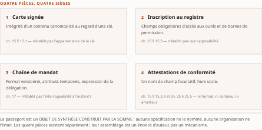
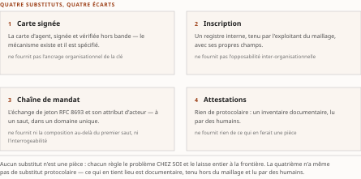

# Chapitre 16 — Le passeport d'agent : synthèse d'un objet encore virtuel

*Livre II — Faire confiance : identité, délégation et fabrique de confiance.
Premier mouvement — émettre (ch. 12-18). Cinquième chapitre du mouvement, et **chapitre-pivot** : il
compose ce que les trois précédents ont instruit séparément, et il n'a pas de source propre.*

| Champ | Valeur |
|---|---|
| **Statut** | **Brouillon de rédaction, non publiable** — pièce rédigée **avant** les portes **G-3** et **G-4**, sur instruction d'auteur du 27 juillet 2026. ⚠ **G-3 est franchie depuis le 28 juillet 2026 ; G-4 demeure ouverte** — *une porte franchie après coup solde la rédaction qui l'a devancée, elle ne la rattrape pas.* ⚠ **Ce chapitre est un chapitre de composition, et il est de ce fait plus exposé qu'un chapitre de socle, non moins** : chaque affirmation y est soit tracée vers un chapitre amont **nommé par son numéro et sa section** et vers l'entrée que ce chapitre mobilise, soit marquée « Lecture de l'auteur ». *Il n'y a pas de troisième cas, et un vide entre deux chapitres amont se décrit plutôt qu'il ne se comble.* **R-IV-16 et R-IV-17, ouvertes au ch. 12 et soldées depuis, valent pour tout le Livre** |
| **Date de gel** | **27 juillet 2026** — gel unique, **D-1 prise** (registre : [`gel-2026-07-27.md`](../PRD/gel-2026-07-27.md)). ☑ **Le volet de faits du résidu de G-1 est levé le 28 juillet 2026** : les 123 entrées à sensibilité temporelle du socle consolidé ont été portées à leur source primaire — **91 inchangées, 10 changées, 22 non établies** ([`gel-2026-07-28-volet-residuel.md`](../PRD/gel-2026-07-28-volet-residuel.md)). ☐ **Ses deux autres volets restent dus** ; aucun ne porte sur cette pièce. Gels de source : **juin 2026** (Vol. I), **16 juillet 2026** (Vol. II), **21 juillet 2026** (Vol. III). ⚠ **Un objet de synthèse ne se périme pas comme un fait, mais ses pièces le font** : les faits datés du § 16.4 — l'état des matériaux, puis les trois scénarios de normalisation — sont ceux dont la péremption est la plus proche ; **six dates distinctes** y sont portées, dont **une seule échéance à venir, le 1ᵉʳ mai 2027** |
| **Socle mobilisé** | ⚠ **Le socle consolidé existe depuis le 28 juillet 2026** — [`socle-consolide.md`](../PRD/socle-consolide.md), **v1.2, 159 entrées `S-001`…`S-159`** —, **mais aucun énoncé de cette pièce n'y a été re-résolu** : le corps cite les identifiants de ses volumes d'origine, que les deux tables de correspondance de l'**Annexe B** (§4 et §5) résolvent (PRD §7.1). **Aucun lot d'instruction propre** : ce chapitre compose. Résolution contre le **Vol. III *Monographie* ch. 8 et §7.4**, dont les entrées **F-01** à **F-11**, **F-29**, **F-33** à **F-51**, **F-55**, **F-64** à **F-69**, **F-79** à **F-89** et les entrées héritées **H-01**, **H-03**, **H-04** et **H-18** conservent leurs niveaux d'origine — *le franchissement de G-3 n'a promu aucune entrée* ; contre le **Vol. II *Monographie* §8.4**, dont **Vol. II F-07** et **Vol. II F-08** conservent les leurs ; et contre le **Vol. I *Monographie* §7.4.2**, en **[C]**. ⚠ **Trois des entrées héritées se fondent, au socle consolidé, dans une entrée du Vol. II** — H-01 dans `S-002`, H-03 dans `S-008`, H-04 dans `S-009` : *ne jamais empiler « Vol. II F-08 » et « H-03 » comme deux appuis, ils n'en font qu'un.* ⚠ **Deux entrées mobilisées ici sont en [C]** — **H-18** (`S-144`), qui porte l'agenda du § 16.4, et **Vol. III F-55** (`S-101`), qui corrobore le cycle de vie du registre : elles corroborent, elles ne portent pas. **Aucun énoncé n'est central au sens de CA-IV-01** — non plus faute de socle, qui existe désormais, mais faute de vote : **aucun vote adversarial n'a été conduit** et **G-4 est ouverte** |
| **Garde-fous balayés** | ⚠ **Règle de comptage, re-mesurée au commit du 28 juillet 2026** : *un cardinal déclaré ici porte sur le **marqueur littéral** de l'identifiant dans le **corps** — en-tête et note de statut exclus* ; les **applications non marquées** ne se dénombrent pas et relèvent du **domaine balayé**, déclaré sans cardinal. **Domaine balayé : les six sections du corps, § 16.0 à § 16.5.** Vol. II — **R-2 et R-3 : ce chapitre en est le SIÈGE** (§ 16.2, encadré « Affirmations écartées ») — **quatre marqueurs chacun**, § 16.2 (trois : le marqueur de siège, l'intitulé de l'encadré et la clause de non-recensement) et § 16.5 ; **réserve F-01 (le protocole agent-outil : « cadre d'autorisation », jamais « sécurisé ») : zéro marqueur** — ce protocole n'est pas cité, ⚠ *et les trois « F-01 » du corps appartiennent à la série du Vol. III, non à celle-ci* ; **PRD Vol. II §8.2.5 : zéro marqueur** — la qualification pré-normative est pourtant portée à chaque mention sur tout le domaine ; **§8.2 : zéro marqueur** — les qualifications auto-déclarées du § 16.3 sont attribuées à **l'éditeur nommé** qui les avance, la parade d'anonymisation ne couvrant pas l'attribution (décision 15) ; **R-4 (« quatre cibles successives », jamais « quatre reports », jamais « lancé ») : zéro marqueur** — le RTR n'est pas cité ; **R-1, R-5 à R-8 : zéro marqueur**. Vol. III — **R-01 (le passeport est un objet de synthèse, jamais un mécanisme documenté) : trois marqueurs** — § 16.0 (un) et § 16.5 (deux, dont un à la synthèse de sortie) ; ⚠ **c'est néanmoins le lieu d'application le plus dense de la somme** — la clause est reprise à l'ouverture et dans chacune des cinq sections, **sans marqueur** : *application déclarée, non dénombrée*. **R-02 à R-14 : zéro marqueur** ; ⚠ **R-14 est pourtant appliqué partout** — les absences portent leur degré, dont neuf au **degré 3** —, ainsi que **R-06** (« attendu par », § 16.1), **R-05** (§ 16.3, le KYA rapporté à la formule du Vol. I) et **R-03** (§ 16.5, le maillage d'agents jamais employé comme catégorie établie) |
| **Volumétrie cible** | ≈ **4 500 mots** de corps (§ 16.0 à § 16.5), **cible dérivée** de l'enveloppe du Livre (50 000 mots, inchangée au TOC v0.30) au prorata des sections. ☑ **Décompte publiable depuis G-2** ; **réel : 4 943 mots** par [`PRD/decompte.sh`](../PRD/decompte.sh) — **+9,8 %** (re-mesuré au commit du 28 juillet 2026, au terme de la **seconde** passe de relecture ; **4 932 mots et +9,6 %** au terme de la première, **4 828 mots et +7,3 %** à la rédaction du 27 juillet 2026). ⚠ La volumétrie du Livre est relevée au [`README.md`](README.md) du dossier et alimente **D-4** par **R-IV-17** |

> **Thèse** *(citée depuis le [`TOC.md`](../PRD/TOC.md) v0.30, entrée du chapitre 16)* — le « passeport d'agent » n'existe dans aucune spécification de 2026 — objet de synthèse assemblant carte signée, inscription au registre, chaîne de mandat et attestations ; sa normalisation est projetée **à une échéance que le socle ne date pas**, en statut PROJETÉ. Pour l'entreprise, rien n'entre au maillage sans lui.
>
> ⚠ **Thèse réalignée au TOC v0.25** (décisions 8 et 14), sur la remontée **R-IV-25** ouverte par cette pièce. La forme antérieure datait la normalisation de **2027-2028**, échéance **empruntée à une entrée [C]** que le relevé propre du Vol. III ne confirme pas — *une thèse ne se date pas depuis une entrée qui ne porte jamais un fait central* (CA-IV-01). **Le corps du chapitre n'avait pas à suivre** : le § 16.4 établissait déjà d'où vient l'agenda et ce qu'il vaut. Le tri prospectif est celui du **siège de la discipline, ch. 49 § 49.0** ; le **siège du statut PROJETÉ de la normalisation du passeport** reste au § 16.4.

---

## § 16.0 — Introduction : ce que trois chapitres d'instruction ne composent pas

Trois chapitres ont instruit trois matières séparément, et **chacune s'est arrêtée au même seuil**.
La **carte signée** démontre l'intégrité d'un contenu canonicalisé au regard d'une clé, et renvoie
l'ancrage de confiance **hors du protocole** (ch. 15 § 15.1.2). Le **registre** prescrit des champs
obligatoires et un cycle de vie, dans un corpus dont **trois dispositifs sur quatre portent eux-mêmes
leur réserve de statut** (ch. 15 § 15.3). La **chaîne de mandat** spécifie un format versionné et
laisse le modèle de confiance au déploiement (ch. 17 § 17.1). *Chacune établit ce qu'elle établit sans
dire à quoi elle se rattache.*

**Le présent chapitre demande ce que produirait leur composition — et il ne le demande pas à une
source : il n'y en a pas.**

Lecture de l'auteur — **la pièce entière est une construction d'auteur, et le marquage se porte ici
plutôt qu'au paragraphe.** ⚠ **Le passeport d'agent ne figure dans aucune spécification à date : c'est
un objet de synthèse construit par la somme**, en assemblant la carte signée (ch. 15 § 15.1),
l'inscription au registre (ch. 15 § 15.3), la chaîne de mandat (ch. 17) et les attestations de
conformité (ch. 15 § 15.3.3). **Ce que le socle établit** : l'état, la date, le statut et le contenu
prescriptif de chacune de ces quatre matières, entrée par entrée, aux chapitres qui les instruisent.
**Ce qu'il n'établit pas** : qu'elles se composent ; qu'un artefact unique les porte ; qu'un émetteur
les délivre ensemble ; qu'un vérificateur les lise ensemble ; que leur composition produise autre
chose que leur juxtaposition. **Le socle ne documente pas d'objet composé de ces quatre pièces —
absence de documentation, non fait négatif vérifié** (degré 3). *Le lecteur peut refuser l'assemblage
sans qu'aucun des faits cités ne tombe — c'est la propriété que R-01 protège, et elle vaut mieux qu'un
assentiment obtenu par confusion.*

⚠ **Ce que ce chapitre ne traite pas.** La **valeur probante** de chaque pièce est instruite au
**ch. 15** et n'est pas rejouée. L'**inventaire de la révocation** est au **ch. 20 § 20.4**.
L'**interrogeabilité de la chaîne au-delà du premier vérificateur** est au **ch. 17 § 17.6**, qui la
borne plutôt qu'il ne la comble. L'**admission d'un agent tiers** est au **ch. 18**. Et la **seconde
moitié de la quatrième pièce** — le registre comme pièce de conformité relu depuis un cadre
prudentiel — est au **ch. 25 § 25.5** : le § 16.1 en déclare l'attente plutôt que d'en préjuger.

## § 16.1 — Assemblage : les quatre pièces du passeport

Un passeport, au sens ordinaire, tient **quatre choses ensemble** : il identifie son porteur, il nomme
l'autorité qui l'a délivré, il dit ce que son porteur est autorisé à faire, et il s'inscrit dans un
**régime de reconnaissance mutuelle** qui le rend opposable ailleurs qu'à son lieu d'émission.
*L'analogie s'arrête là où commence ce chapitre* : l'artefact qui réunirait ces quatre fonctions
relève de l'absence de documentation déclarée à l'ouverture.

**La première pièce — la carte signée — apporte une intégrité, non une origine.** Ce que la
spécification démontre est borné (ch. 15 § 15.1.1) : signature sur une forme canonicalisée, champ de
signatures exclu du contenu signé, charge reconstruite par le vérificateur (Vol. III F-01, F-02,
**[A]**). *L'apport à l'assemblage s'arrête là* : la signature ne dit rien de l'appartenance de la clé
à une organisation, l'ancrage étant renvoyé hors du protocole vers un magasin facultatif et non
spécifié (F-09, **[B]**). Le régime d'obligation achève de le borner — apposition en **MAY**,
vérification en **SHOULD** (F-04, **[A]**). *Une pièce dont l'apposition est facultative et le contrôle
recommandé ne fonde pas une admission ; elle fonde une faculté.*

**La deuxième pièce — l'inscription au registre — apporte une administration, non une opposabilité.**
Deux champs obligatoires portent les outils invocables et les limites de portée (F-40, **[B]** ;
ch. 15 § 15.3.1), et le socle hérité rattache au dispositif l'inventaire, la découverte, le cycle de
vie et la conformité (H-03, **[A, statut BROUILLON]**). *Son statut, dit à chaque mention, est celui
d'un brouillon de laboratoire* (F-38, **[A]**), et **son ancrage protocolaire est non entretenu**
(F-41, F-42, **[B, degré 2]**). Du côté du protocole agent-agent, **la voie du registre est déclinée
en toutes lettres** (F-43, **[B, degré 2]**, fait négatif **ÉTABLI**). *L'inscription existe comme
objet administrable, non comme point d'ancrage opposable.*

**La troisième pièce — la chaîne de mandat — apporte une déclaration de délégation, non son
interrogeabilité.** La spécification de paiement agentique en **v0.2.0 du 28 avril 2026** —
*spécification de projet, non texte normatif d'un organisme de normalisation* — définit deux types de
mandats sérialisés, porteurs d'un attribut de type **versionné** et des attributs temporels
d'émission et d'échéance (F-46, **[B]** ; ch. 17 § 17.1). Le **RFC 8693** définit l'attribut qui
exprime qu'une délégation a eu lieu et identifie la partie agissante, et **place explicitement hors de
son périmètre** la syntaxe, la sémantique et les caractéristiques de sécurité des jetons eux-mêmes
(F-47, **[A]**). Le mécanisme de propagation adopté par un groupe de travail **borne sa portée à
l'intérieur d'un domaine de confiance** (F-29, **[A]** ; ch. 17 § 17.1). ⚠ Les dates d'expiration
d'*Internet-Drafts* citées dans ce chapitre sont l'**échéance automatique de six mois** : **PROGRAMMÉES
au sens mécanique**, elles ne disent rien d'une adoption. *Le ch. 17 § 17.6 en tire la conséquence que
le présent chapitre reprend sans y ajouter : le socle n'établit pas qu'une chaîne ainsi formée soit
interrogeable à un instant quelconque.*

**La quatrième pièce — les attestations de conformité — n'a pas de chapitre, et la somme le déclare
plutôt que de le masquer.** Elle est portée par **deux sections seulement** — ch. 15 § 15.3.3 et
ch. 25 § 25.5. Du côté du registre, le relevé ne fait apparaître **qu'un nom de champ facultatif**,
*source primaire ouverte hors socle et non versée* : **le socle ne documente ni son format, ni ce
qu'une attestation y porterait, ni qui l'émettrait — degré 3**. Du côté réglementaire, ce à quoi une
attestation se rapporterait est **daté et borné** : la ligne directrice **attend** — modalité au
*should*, douze énoncés numérotés, aucune occurrence de *must* au corps de la version anglaise,
*seul balayé : ni l'appendice ni le volet français ne l'ont été* (F-64,
**[B, degré 1]**) —, et le registre de l'attente est autorisé par le **document d'information** du
même jour (F-66, **[B, degré 1]**). ⚠ **On écrit « attendu par », jamais « exigé par ».** ⚠ Et le texte
qui attend l'inventaire **ne nomme ni l'agentique, ni les agents, ni l'orchestration** (H-04) : sa
couverture de son porteur est une **inférence d'analystes, jamais une disposition du texte**.

| Pièce | Siège | Ce que le socle établit | Ce qu'il n'établit pas |
|---|---|---|---|
| **Carte signée** | ch. 15 § 15.1 | intégrité d'un contenu canonicalisé au regard d'une clé (F-01, F-02, **[A]**) ; apposition **MAY**, vérification **SHOULD** (F-04, **[A]**) | l'appartenance de la clé à une organisation — ancrage renvoyé hors protocole (F-09, **[B]**) |
| **Inscription au registre** | ch. 15 § 15.3 | champs obligatoires d'accès aux outils et de bornes de permission (F-40, **[B]**) ; brouillon de laboratoire, statut déclaré (F-38, **[A]**) | l'opposabilité de ces bornes au point d'application ; aucune interface de registre prescrite par le protocole (F-43, **[B, degré 2]**) |
| **Chaîne de mandat** | ch. 17 | format versionné, attributs temporels (F-46, **[B]**) ; expression de la délégation, sécurité du jeton hors périmètre (F-47, **[A]**) | l'interrogeabilité de la chaîne à l'instant t (ch. 17 § 17.6) |
| **Attestations de conformité** | ch. 15 § 15.3.3 et ch. 25 § 25.5 | un nom de champ **facultatif**, hors socle ; ce que les cadres canadiens **attendent** (F-65, F-68, **[B]** ; H-04) | le format, le contenu et l'émetteur d'une attestation — **degré 3** |

: Tableau 16.1 — Les quatre pièces du passeport d'agent, objet de synthèse construit par la somme, au 21 juillet 2026.

Lecture de l'auteur — **ce que le socle établit** : chacune des quatre matières, avec son statut, sa
date et ses bornes. **Ce qu'il n'établit pas** : que la composition produise un objet, ni que les
manques de l'une soient comblés par une autre. *La lecture proposée est que **l'assemblage n'est pas
une somme** : sur les quatre pièces, aucune ne fournit à une autre l'ancrage qui lui manque* —
constat **borné à ces quatre matières nommées**. **Et la quatrième est, des quatre, la moins
documentée** — même borne : chacune des trois autres est adossée à au moins une spécification
instruite, tandis que l'attestation n'a qu'un nom de champ facultatif, relevé hors socle.

⚠ **Un écart de régime est déclaré, non contourné.** Des deux sièges de la quatrième pièce, **un seul
appartient à ce Livre**. L'autre, le **ch. 25 § 25.5**, est rédigé depuis le 27 juillet 2026, mais en
**brouillon hors portes**, et **G-4 le conditionne nommément** : *un renvoi vers un tel brouillon
résout contre un texte, non contre une preuve.* Le présent chapitre **ne préjuge donc de rien** de ce
que ce siège établira du registre comme pièce de conformité ; il compose sur ce que le ch. 15
§ 15.3.3 porte, et **déclare l'autre moitié en attente**.

### 16.1.1 Équivalents provisoires — ce qui tient lieu de chaque pièce en 2026

⚠ **Cette sous-section est ajoutée le 30 juillet 2026 (D-11), et son motif est un défaut de
prescription que l'arbitrage externe a nommé.** La thèse du chapitre écrit *« rien n'entre au maillage
sans lui »* — **une règle d'admission adossée à un artefact que personne n'émet**. ⚠ ***Une
prescription sans régime transitoire n'est pas une exigence : c'est une interdiction générale***, et
un exploitant qui la lirait au pied de la lettre devrait fermer son maillage à tout agent, y compris
les siens. Le chapitre le prescrivait sans le dire ; il le dit désormais.

| Pièce | Ce qui en tient lieu aujourd'hui | Ce que le substitut ne fournit pas |
|---|---|---|
| **Carte signée** | la carte d'agent du protocole agent-agent, **signée et vérifiée hors bande** — le mécanisme existe et il est spécifié (ch. 15 § 15.1) | l'**ancrage organisationnel** de la clé : le vérificateur établit l'intégrité, jamais l'appartenance (F-09). *Le substitut est le plus proche du besoin, et c'est celui dont l'écart est le plus étroit* |
| **Inscription au registre** | un **registre interne à l'organisation**, tenu par l'exploitant du maillage, avec ses propres champs de bornes et d'accès aux outils | l'**opposabilité inter-organisationnelle**. ⚠ *Un registre interne fait entrer l'agent chez soi ; il ne le fait entrer chez personne d'autre* — et c'est exactement la frontière que le ch. 17 déclare non franchie |
| **Chaîne de mandat** | l'**échange de jeton** de la RFC 8693 et son attribut d'acteur, à **un saut**, dans un domaine de confiance unique | la composition **au-delà du premier saut** (ch. 17 § 17.6, degré 3), et l'**interrogeabilité de la chaîne à l'instant t** — ⚠ *à quoi s'ajoute que la RFC exclut de son champ la sécurité du jeton lui-même* |
| **Attestations de conformité** | ⚠ **rien de protocolaire.** Ce qui en tient lieu est **documentaire** : l'inventaire de modèles que les cadres canadiens **attendent** (F-65, F-68 ; H-04), tenu hors du maillage et lu par des humains | **tout ce qui en ferait une pièce** : format, contenu, émetteur, vérifiabilité machine — **degré 3**, inchangé. *La quatrième pièce n'a pas d'équivalent provisoire ; elle a un substitut d'un autre ordre* |

: Tableau 16.2 — Ce qui tient lieu de chaque pièce du passeport au 30 juillet 2026, et l'écart que le substitut laisse ouvert.

⚠ **Trois bornes, et la première interdit de lire ce tableau comme une recommandation.** *(1)*
**Aucune ligne n'est prescrite par une source** : les quatre substituts sont des **constructions de
l'auteur** au sens de CA-IV-07, assemblées à partir de mécanismes que le socle documente séparément.
*Le socle établit que ces mécanismes existent ; il n'établit ni qu'ils tiennent lieu de passeport, ni
qu'un exploitant qui les emploie soit fondé à admettre un agent.* *(2)* ⚠ **Les quatre substituts
partagent le défaut que le § 16.2 va nommer** : ils fonctionnent **dans une organisation**, et
l'objet du passeport est l'admission **entre organisations**. *Un régime transitoire qui ne franchit
pas la frontière n'est pas un régime transitoire vers le passeport ; c'est un régime stable d'un
autre problème.* *(3)* **La thèse n'est pas amendée** — *elle se cite verbatim depuis le plan et un
rédacteur ne la corrige pas* : ce qui change est que le chapitre **borne désormais sa portée
pratique** au lieu de la laisser lire comme une règle immédiatement applicable. **Remontée ouverte**,
à l'instance d'arbitrage : *la formule « rien n'entre au maillage sans lui » doit-elle porter sa
clause transitoire au plan ?*

## § 16.2 — Ce qui n'existe toujours pas — et à quel degré

> ⚠ **SIÈGE DE L'ENCADRÉ DES AFFIRMATIONS ÉCARTÉES POUR TOUTE LA SOMME.** Les garde-fous **R-2 et
> R-3 du Vol. II** sont **posés ici une seule fois**. Les **ch. 12 § 12.0 et ch. 15 § 15.3.1** les
> **appliquent** et y renvoient ; ils **ne reconstruisent pas cet encadré**. C'est l'économie de la
> fusion côté « affirmations plausibles et non vérifiées », et elle n'a lieu que si ces chapitres s'y
> tiennent.

Une absence ne vaut que par **la manière dont elle a été établie**. Cette section est le lieu où la
somme rend compte de ce qui manque **côté émission**, et elle le fait à trois degrés.

**Deux affirmations, en particulier, sont assez plausibles pour qu'un dossier d'architecture les
reprenne sans les vérifier ; les passes de vérification du Vol. II les ont l'une et l'autre
écartées.**

> **Affirmations écartées — garde-fous R-2 et R-3 du Vol. II.**
> **(1) Un registre d'agents centralisé administré dans l'annuaire de l'éditeur.** L'affirmation selon
> laquelle le produit d'identité d'agent comporterait un **registre d'agents centralisé**, administré
> depuis le centre d'administration de l'annuaire, **n'a pas été confirmée** par les passes de
> vérification du Vol. II. Elle est **non vérifiée**, et la somme s'en tient à ce que la documentation
> de l'éditeur établit — **des identités d'agents et des gabarits**. **Forme imposée** : parler
> d'identités et de gabarits, **jamais de « registre centralisé »**. *La question reste ouverte ;
> aucune inférence n'est proposée.*
> **(2) Une identité de charge de travail obligatoire dans la spécification de registre.** Rien au
> socle n'établit que cette spécification — **brouillon de laboratoire** — **exigerait** une identité
> de type SPIFFE, ni sous forme d'identifiant en URI, ni sous forme de justificatif. **Elle s'appuie
> sur SPIFFE et SPIRE comme *fondation* ; l'exigence stricte n'est pas établie.** **Forme imposée** :
> « s'appuie sur … comme fondation », **jamais « impose »**. *En l'absence de source primaire
> l'attestant, la question reste ouverte.*
> ⚠ Ces deux points **ne figurent pas parmi les lacunes recensées** du Vol. II : ils relèvent de ses
> garde-fous R-2 et R-3, et sont exposés ici au titre du siège que le plan leur assigne.

**Aux deux réserves nommées s'en ajoute une troisième, plus structurelle.** Le socle du Vol. II ne
documente **aucune norme ratifiée de registre d'agents, à quelque niveau que ce soit**. Ce qu'il
documente, c'est un **produit d'éditeur en disponibilité générale dont les flux étendent les RFC**, une
**spécification sectorielle à l'état de brouillon**, et une **extension IETF expirée en cours de
consolidation** (Vol. II F-07, F-08 ; ch. 12 § 12.5). *Un architecte qui chercherait aujourd'hui, pour
son dossier de conformité, la norme d'identité et de registre des agents ne la trouverait pas : elle
n'existe pas.*

**Et l'inventaire du Vol. III, prélevé ici, produit un exemple de chacun des trois degrés.**

**Fait négatif VÉRIFIÉ, borné.** La page du brouillon de registre, telle que rendue le 21 juillet
2026, **ne fait apparaître aucune chaîne de date postérieure au 27 mars 2026**, ni section de
révision, ni mention de mise à jour (Vol. III F-39, **[B, degré 1]**). *Le balayage est documenté :
deux ouvertures distinctes le même jour, sept chaînes cherchées, relevé exhaustif des treize chaînes
de date de la page.* ⚠ **Sa borne est ce qui le rend tenable** : il porte sur le **texte rendu**, non
sur les en-têtes du transport ni sur les métadonnées du système de publication — *une édition sur
place sans changement d'en-tête n'y laisserait aucune trace*. La conclusion s'écrit donc « **le relevé
ne soutient pas** » une mise à jour ultérieure, **jamais « la mise à jour n'a pas eu lieu »**. ⚠ Le
point vaut au-delà de son objet : **c'est un cas où la source primaire corrige la recherche
secondaire**.

**Fait négatif ÉTABLI.** **Trois** des quatre dispositifs portent **leur propre réserve de statut**, et
c'est sur elles que repose l'absence de ratification — non sur un balayage des actes de normalisation.
Le brouillon de registre se donne à lui-même le statut « draft » dans un espace que son hébergeur dit
n'être **pas encore** un projet officiel (F-38, **[A]**) ; l'extension SCIM est un *Internet-Draft*
**expiré**, sans flux ni groupe adoptant (F-41, **[B, degré 2]** ; H-03, **[A, statut BROUILLON]**),
la session de l'IETF 125 s'étant close sur une demande de cas d'usage (F-42) ; et le service
d'annuaire demeure une **soumission individuelle** (F-43). ⚠ **Pour le protocole agent-agent, ce que
le socle porte est autre chose** : une première spécification stable hébergée par une fondation
(H-01, **[A]**) et la déclaration explicite qu'**aucune interface de registre n'y est prescrite**
(F-43) — *absence d'interface de registre, non absence de ratification, et les deux ne s'échangent
pas.*

**Absence de documentation.** Le **régime de gouvernance et de révocation** des registres du protocole
agent-agent n'est pas relevé : la spécification ne prescrivant aucune interface, **il n'y a rien à en
extraire sans passer à des mises en œuvre particulières**, ce que le lot n'a pas fait. Et le **statut
normatif de la spécification elle-même** est au même degré : *il ne se déduit ni de la stabilité
déclarée d'une version, ni de l'hébergement par une fondation.*

⚠ **Un second point de non-couverture est consigné pour que nul ne le prenne pour un silence** : deux
brouillons de registre ou d'annuaire d'agents ont été **aperçus au fil des recherches et non ouverts**
— niveau **[C]**, repérage. *Le chapitre n'écrit donc pas que les registres instruits épuisent le
champ.* De même, des annonces institutionnelles de mai 2026 ne sont connues que par **presse
secondaire** et **aucune n'est portée en affirmation** : elles auraient renseigné sur la trajectoire du
brouillon ; *la somme s'en abstient plutôt que de l'inférer.*

## § 16.3 — Qui l'émettrait, qui le vérifierait

Un passeport suppose **deux rôles** que l'assemblage du § 16.1 ne distribue pas : celui qui le
**délivre** et celui qui l'**accepte**.

**Côté émission, les quatre pièces relèvent de quatre émetteurs distincts, et le socle n'en documente
aucun qui les délivre ensemble.** La carte est signée par le détenteur d'une clé que la spécification
**ne rattache à aucune organisation** (F-09) ; l'inscription est tenue par l'exploitant d'un registre
dont le texte prescriptif se déclare brouillon (F-38) et dont le protocole décline l'interface
(F-43) ; le mandat est émis par la partie qui délègue, selon un format dont la spécification **renvoie
l'ancrage au déploiement** (F-46 ; ch. 17 § 17.1) ; **l'attestation n'a pas d'émetteur documenté**
(degré 3).

**Un émetteur unique existe au niveau du produit, et le ch. 15 l'établit avec ses bornes** :
disponibilité générale de la plateforme datée d'avril 2026 **par Microsoft, dans ses propres notes de
version** (F-33, **[B]**), type de ressource d'annuaire spécifié dans la version stable de l'interface
de programmation du même éditeur (F-37, **[B]**), et
**disponibilité générale du produit qui ne vaut pas disponibilité générale de ses capacités**
(F-34, **[A]**). ⚠ *Cas documenté, jamais recommandé* — et il porte **sa propre réserve de couverture,
énoncée par l'éditeur** : une politique d'accès conditionnel ciblant des identités d'agent ne
s'applique pas au compte d'utilisateur de l'agent (F-35, **[A, degré 2]**, fait négatif **ÉTABLI**).
*Un émetteur qui tient l'agent sur deux plans ne délivre pas un passeport ; il délivre deux pièces qui
ne se recouvrent pas.*

**Côté vérification, le socle documente l'absence de ce dont le vérificateur aurait besoin.** Il **ne
peut pas établir le statut d'une clé** — aucune liste de révocation, aucun protocole d'état en ligne,
aucun point de terminaison de statut, et **aucune étape de contrôle de fraîcheur** dans la procédure
en six étapes (F-06, **[A, degré 1]**) —, alors même que **l'emploi d'une clé expirée ou révoquée est
interdit au niveau normatif le plus fort** (F-07, **[A]**). Il ne peut pas davantage s'appuyer sur une
gouvernance de projet : deux documents nommés balayés, **aucune disposition de gouvernance des clés**
(F-08, **[A, degré 1]** ; F-11, **[B]**). *Le reste du corpus du projet n'a pas été balayé, et le
chapitre n'en conclut rien.*

**Et lorsque le vérificateur appartient à une autre organisation, ce n'est plus un mécanisme qui
manque, c'est une institution.** Le **ch. 18 § 18.1** l'établit sur **neuf chantiers et six
organisations** : **aucune des propositions consultées n'était ratifiée ni adoptée** (F-50,
**[B, degré 2]**, fait négatif **ÉTABLI**, borné aux propositions consultées). ⚠ L'instance qui a
compilé le livre blanc de référence le dit d'elle-même : sa charte **place hors de son périmètre** le
développement de protocoles de normalisation mondiaux liés à l'identité des agents, **et renvoie ce
travail à un groupe de travail** (F-48, **[A, degré 2]**). ⚠ **Le vocabulaire lui-même est équivoque**
— le sigle de la connaissance de l'agent désigne **au moins deux objets distincts** (F-49,
**[B, degré 3]**) —, et *le KYA n'est pas un standard établi ; les initiatives existantes relèvent du
positionnement fournisseur* (Vol. I *Monographie* §5.5.4). ⚠ **Le siège unique du KYA est le ch. 18
§ 18.1** : le sigle est nommé ici, **il n'y est pas instruit**.

**Ce que le socle documente hors du champ agentique et ne documente pas dedans a un nom.** Un règlement
européen inscrit un **audit des prestataires qualifiés au moins tous les vingt-quatre mois, à leurs
frais**, et une alliance industrielle exploite un **programme de certification par laboratoires
accrédités** ainsi qu'un **service de métadonnées** (F-51, **[B]**). *Ce sont des dispositifs de
reconnaissance mutuelle — ce qui rend un passeport opposable hors de son lieu d'émission.* ⚠ **Ils sont
instruits au ch. 18 § 18.3**, qui en est le siège, et **ne sont pas transposés ici**.

Lecture de l'auteur — **ce que le socle établit** : quatre émetteurs distincts pour quatre pièces ; un
émetteur unique au niveau du produit, avec sa réserve de couverture ; l'absence de moyen de
vérification du statut d'une clé ; l'état non ratifié des propositions consultées et l'aiguillage
institutionnel déclaré ; deux précédents de reconnaissance mutuelle hors du champ agentique. **Ce
qu'il n'établit pas** : qu'un émetteur unique soit **nécessaire**, ni qu'une autorité d'accréditation
soit la **seule** forme possible de reconnaissance, ni qu'aucune organisation n'en ait constitué une
hors des pages ouvertes. *La lecture proposée est que la pièce manquante du passeport est
**institutionnelle avant d'être technique*** — proposition cohérente avec le contrepoint du ch. 13
§ 13.5 et avec ce que le ch. 18 § 18.3 instruit, et **réfutable par la production d'un dispositif
d'accréditation agentique opérant**.

⚠ **Une lacune est ouverte ici et n'est pas comblée** : quelle instance délivrerait un passeport
assemblé, et selon quel régime d'accréditation serait-elle elle-même reconnue ? **Aucune passe de
recherche n'a été conduite** — le passeport étant une construction de la somme, **aucun lot n'a pris
pour objet son émission**. *Source à retrouver : un texte, quel qu'en soit le statut, décrivant
l'accréditation d'un émetteur d'identité d'agent.* La question reste ouverte ; aucune inférence n'est
proposée.

## § 16.4 — Trois scénarios de normalisation, et ce que leur tri prospectif interdit d'écrire

Trois voies sont concevables pour qu'un objet de ce type cesse d'être une construction d'auteur.
*Les décrire n'est pas les prédire*, et le tri prospectif sert précisément à empêcher la confusion.

> ⚠ **SIÈGE DU STATUT PROJETÉ DE LA NORMALISATION DU PASSEPORT POUR TOUTE LA SOMME.** L'agenda
> 2027-2028 que le Vol. I dressait est **repris ici une seule fois**, et **à son régime [C]**. Les
> chapitres aval qui en ont besoin y renvoient ; ils ne le re-datent pas.

**L'état daté des matériaux se pose d'abord, parce qu'il borne les trois scénarios.** Au W3C, le
modèle de données des accréditations vérifiables porte le stade de **Recommandation depuis le 15 mai
2025**, sans entrée postérieure à son historique (F-79, **[B]**) ; sa version 2.1 est un **brouillon
de travail** du 11 mai 2026, et **toute affirmation sur son aboutissement est SPÉCULATIVE** (F-80,
**[B]**) ; la version 1.1 des identifiants décentralisés en reste à l'**instantané de recommandation
candidate du 5 mars 2026**, la date que le document s'était lui-même donnée étant **dépassée sans
transition constatée** (F-82, **[A]**). À l'IETF, **sept** *Internet-Drafts* de groupe de travail
étaient recensés, **aucune date de publication en RFC n'étant annoncée pour aucun des sept** (F-85,
**[B]**), et une section d'architecture range les intermédiaires d'IA parmi les charges de travail
déléguées — *énoncé d'un brouillon en cours, qui ne fait autorité sur rien* (F-86, **[B]** ; établi au
ch. 12 § 12.1).

⚠ **L'entrée héritée qui porte l'agenda 2027-2028 est une entrée de repérage** (H-18, **[C]**) : *elle
n'établit pas les échéances qu'elle liste* — **PROJETÉES**, puisqu'elles viennent d'un agenda dressé
par un volume antérieur **sans engagement daté de l'organisme qui les porterait**. ⚠ Et c'est elle,
précisément, dont le titre porte le syntagme « passeport d'agent » **sans le définir ni le réemployer
dans le corps de la section** : *le Vol. I fournit l'agenda, pas l'objet.*

**Scénario 1 — normalisation par extension d'un texte en procédure à l'IETF. Tri : PROJETÉ.** Le
chemin existe et il est ouvert : un groupe de travail traite déjà l'identité de charge de travail —
**socle posé au ch. 3**, non reconstruit ici — et son document d'architecture range explicitement les
intermédiaires d'IA parmi les charges déléguées (F-86) ; un mécanisme de propagation du contexte est
en appel de dernière relecture (F-29). ⚠ **Ce qui interdit d'écrire PROGRAMMÉ est un fait, non une
prudence** : le tri PROGRAMMÉ exige un **engagement daté réel**, et aucune date de publication en RFC
n'est annoncée pour aucun des sept documents relevés (F-85). *Le scénario est une intention lisible
dans l'état d'une procédure, sans jalon.*

**Scénario 2 — assemblage par une fondation ou une alliance industrielle. Tri : PROJETÉ pour la pièce
du mandat, SPÉCULATIF pour l'assemblage.** Un précédent est documenté, **et il est instructif par son
inachèvement** : le billet officiel du 28 avril 2026, signé d'un dirigeant nommé, annonce la donation
de la spécification de paiement agentique à une alliance et qualifie l'opération de « Transitioning
ownership to the FIDO Alliance » (F-44, **[A]**) ; **trois mois après, le transfert n'est pas
matérialisé** sur les deux relevés bornés du lot, et la normalisation est annoncée dans deux groupes
de travail **sans échéance** (F-45, **[B, degré 1]**). *Une normalisation annoncée sans jalon relève du
PROJETÉ.* Que cette voie porte ensuite les trois autres pièces **n'est adossé à aucune source** :
c'est du **SPÉCULATIF**. ⚠ Et la voie n'est pas dégagée : le brouillon de registre se déclare
lui-même brouillon (F-38), et son ancrage protocolaire a été **renvoyé à la production de cas
d'usage** (F-42).

**Scénario 3 — préemption par le produit, cadrage par le régulateur. Tri : deux ancrages PROGRAMMÉS,
un résultat SPÉCULATIF.** *Ce scénario n'est pas une normalisation au sens propre, et c'est ce qui le
rend plausible* : un produit en disponibilité générale fait exister l'identité d'agent gérée en
production **avant tout standard** (F-33, F-34, F-37 — thèse du ch. 15 § 15.2.3), tandis que **deux
cadres prudentiels entrent en vigueur au 1ᵉʳ mai 2027**, échéance réglementaire datée donc
**PROGRAMMÉE** (F-65, F-66, F-68 ; H-04). S'y ajoute une **désignation institutionnelle dont l'issue
est ouverte** : au 27 juin 2026, un résumé d'étude d'impact réglementaire écrivait encore que
l'organisme de normalisation technique « **sera désigné** » conformément aux facteurs et processus
établis par la loi (F-69, **[A, degré 3]** ; l'état de la désignation est porté par le **ch. 30
§ 30.3**, auquel le ch. 32 § 32.4 renvoie sans le doubler). ⚠ *C'est le libellé d'un
texte à une date*, et **le relevé ne porte aucun jalon daté**. ⚠ **Ce que ces ancrages datent, ce sont
des entrées en vigueur et une procédure, non un format d'identité d'agent** : conclure de l'un à
l'autre serait exactement l'inférence proscrite du côté réglementaire — *on écrit « attendu par »,
jamais « exigé par ».*

| Scénario | Tri | Ce sur quoi il s'appuie | Ce qui le réfuterait |
|---|---|---|---|
| **1 — extension d'un texte de l'IETF** | **PROJETÉ** | sept brouillons de groupe de travail, aucun publié en RFC, **aucune date annoncée** (F-85) ; intermédiaires d'IA rangés parmi les charges déléguées (F-86) ; appel de dernière relecture sur la propagation de contexte (F-29) | l'adoption d'un document couvrant l'assemblage des quatre pièces, ou au contraire l'expiration de la série sans reprise |
| **2 — fondation ou alliance** | **PROJETÉ** (mandat) / **SPÉCULATIF** (assemblage) | donation annoncée le 28 avril 2026 (F-44, **[A]**) ; transfert **non matérialisé** à trois mois, normalisation annoncée sans échéance (F-45, **[B, degré 1]**) | la publication, par le cessionnaire, d'une spécification d'identité ou de paiement agentiques ; la matérialisation documentée du transfert |
| **3 — préemption par le produit, cadrage par le régulateur** | ancrages **PROGRAMMÉS** (1ᵉʳ mai 2027) / résultat **SPÉCULATIF** | disponibilité générale datée et bornée (F-33, F-34) ; attentes de deux cadres au 1ᵉʳ mai 2027 (F-65, F-68) ; désignation **écrite au futur** au 27 juin 2026 (F-69) | un cadre prudentiel qui nommerait un format d'identité d'agent ; ou l'inverse — une normalisation ouverte qui précéderait l'échéance |

: Tableau 16.2 — Trois scénarios de normalisation du passeport d'agent, objet de synthèse construit par la somme, avec leur tri prospectif, au 21 juillet 2026.

**Aucun des trois n'est PROGRAMMÉ, et c'est le résultat de la section.** ⚠ Ce qui est PROGRAMMÉ dans
ce dossier **ne concerne pas le passeport** : les expirations d'*Internet-Drafts*, qui découlent
mécaniquement de la règle des six mois, et **deux entrées en vigueur réglementaires qui ne nomment pas
les agents** (H-04).

⚠ **La thèse citée en tête range la normalisation en statut PROJETÉ sans la dater, et cet état est le
produit d'un réalignement.** Jusqu'au **TOC v0.24**, elle projetait la normalisation « **2027-2028** » :
l'échéance était **empruntée** à une entrée **[C]** (H-18), et **le relevé propre du Vol. III n'en
confirme aucune** (F-80, F-82, F-85) — *une thèse ne se date pas depuis une entrée qui ne porte jamais
un fait central* (CA-IV-01). **L'écart a été soldé par la remontée R-IV-25**, qui a réaligné la thèse
au **TOC v0.25** en « **à une échéance que le socle ne date pas** ». *La pièce écrivait déjà le statut
sans re-dater l'échéance ; la thèse citée en tête le fait désormais aussi, et l'agenda demeure
rapporté ici comme repérage [C], à son régime.*

## § 16.5 — Le passeport par la grille du ch. 14

⚠ **R-01 s'applique intégralement à cette section** : ce qui est soumis à la grille **n'est pas un
mécanisme de 2026**, c'est une construction de la somme. **La réponse est sur le papier, au sens
strict** — elle décrit ce qu'un assemblage **produirait**, non ce qu'une implémentation produit. Les
règles d'emploi du ch. 14 § 14.1 demeurent, et une case laissée vide déclare l'état de la preuve, non
une note intermédiaire.

| Question | Réponse **sur le papier** | Pièce répondante | Ce que le socle établit aujourd'hui |
|---|---|---|---|
| **Q-A** *qui es-tu* | **répond partiellement** | carte signée + inscription | *vérifiable* oui (F-01, F-02) ; **résistance à l'usurpation non établie** (F-09) ; *révocable* non (F-05, F-06, F-07) — l'apport de l'inscription, ses quatre états de cycle de vie, n'est documenté qu'en **[C]** (F-55, **[C, degré 1]** ; ch. 15 § 15.3.3) et reste **hors verdict** ; *stable* : **degré 3** |
| **Q-B** *qui t'a créé* | **répond partiellement** | inscription + attestation | **aucune autorité d'émission documentée — degré 3** ; ancrage renvoyé hors protocole (F-08, F-09, F-11, F-43) |
| **Q-C** *pour qui agis-tu* | **répond** | chaîne de mandat | format et attributs temporels (F-46, **[B]**) ; délégation exprimée (F-47, **[A]**) ; ⚠ **interrogeabilité à l'instant t non établie** (ch. 17 § 17.6) |
| **Q-D** *que peux-tu faire* | **répond partiellement** | inscription au registre | bornes déclarées en champs obligatoires (F-40, **[B]**) ; ⚠ **opposabilité au point d'application non établie** — second terme de la question (ch. 14 § 14.2 ; F-35, **[A, degré 2]**) |
| **Q-E** *qui en répond* | **répond partiellement** | attestations de conformité | **degré 3** ; une obligation légale ouvre l'occasion d'être entendu par **un membre du personnel en mesure de réviser** (F-89, **[B]**), dans un **alinéa distinct** et **sans prescription sur la trace** |

: Tableau 16.3 — Le passeport d'agent soumis à la grille du ch. 14 — réponse sur le papier et état du socle, au 21 juillet 2026.

**Ce que ce tableau autorise à conclure est étroit, et il faut l'écrire.** *Le passeport reçoit une
réponse aux cinq questions parce qu'il a été construit pour en recevoir une : c'est la propriété d'un
objet de synthèse, pas un résultat.* **Une** réponse est pleine sur le papier et **bornée sur le
socle** ; **quatre** sont partielles **jusque sur le papier** — et **la seule des cinq dont aucune
pièce répondante n'a de chapitre est Q-E, celle de l'imputabilité**.

⚠ **La thèse du ch. 14 n'est ni confirmée ni réfutée par cette section** : elle porte sur les
mécanismes de 2026, et **le passeport n'en est pas un**. *Confondre les deux ferait de la construction
d'auteur le contre-exemple de la thèse qu'elle sert à éprouver.*

**Un dernier énoncé de la thèse appelle son propre marquage.** *« Rien n'entre au maillage sans lui »*
est un **principe d'architecture de la somme**, non un constat de source. ⚠ Le maillage d'agents est
un terme dont la définition d'auteur a son siège au **ch. 37 § 37.1**, et il n'est **jamais employé
nu** ; le présent chapitre ne l'emploie pas comme catégorie établie. Lecture de l'auteur — ce que le
socle établit, ce sont **les quatre matières et leurs bornes** ; **ce qu'il n'établit pas**, c'est
qu'une organisation **doive** conditionner l'admission à un artefact que personne ne délivre.

### Synthèse : ce que le chapitre lègue à la somme

*Section de sortie sans homologue direct dans la source — construction d'éditeur.*

1. **L'objet, et sa nature déclarée.** Le passeport est une **construction d'auteur**, et **chaque
   pièce qui le cite doit le dire** — c'est la charge que R-01 du Vol. III fait peser sur toute
   reprise. ⚠ **Le domaine se déclare ici sans cardinal** : le syntagme est repris dans les cinq
   Livres, et *un relevé de leur traitement conduit pendant que ces pièces s'écrivent serait faux à
   sa publication.*
2. **Le siège des affirmations écartées.** R-2 et R-3 du Vol. II sont posés **ici une seule fois**,
   avec leurs formes imposées. Les ch. 12 et 15 y renvoient.
3. **Le siège du statut PROJETÉ de la normalisation.** L'agenda 2027-2028 est repris **une seule
   fois**, en **[C]**, et **n'est re-daté nulle part**.
4. **La conclusion la plus utile du chapitre, et c'est une conclusion négative.** *L'assemblage n'est
   pas une somme* : aucune des quatre pièces ne fournit à une autre l'ancrage qui lui manque, et la
   pièce manquante est **institutionnelle avant d'être technique**. Le **ch. 18** instruit cette
   hypothèse ; le **ch. 21** en tire la conséquence cryptographique.

---

## § 16.6 — Note de statut *(hors plan — à retirer à la publication)*

⚠ **Cette section n'est pas au TOC et n'a pas vocation à survivre.**

**Ce qui est enfreint.** La pièce a été rédigée **avant G-3 et avant G-4**, et **avant l'instruction
du volet résiduel de G-1** ; elle enfreint en outre l'**ordre de rédaction du PRD §6**. Instruction
d'auteur du 27 juillet 2026. ⚠ **Deux de ces trois écarts sont soldés depuis, et aucun n'est
rattrapé** : **G-3 est franchie** et le **volet de faits du résidu de G-1 est levé** le 28 juillet
2026 — *une porte franchie après la rédaction qu'elle conditionnait ne la valide pas rétroactivement.*
☐ **G-4 demeure ouverte**, volet de fond entier.

1. **Aucun énoncé n'est central au sens de CA-IV-01** — et **ce chapitre est celui où la conséquence
   est la plus paradoxale** : il ne verse aucun fait, il compose ; mais **un chapitre de composition
   est plus exposé qu'un chapitre de socle**, puisque chacune de ses phrases dépend de la fidélité de
   la trace vers un chapitre amont. ⚠ **Le motif a changé le 28 juillet 2026 sans que la conclusion
   bouge** : ce n'est plus l'absence de socle — il existe — mais l'**absence de vote adversarial**,
   que le PRD §7.2 réserve aux affirmations portant seules la thèse d'un chapitre et qui **reste dû**.
   **Deux entrées mobilisées sont en [C]** — H-18 et Vol. III F-55 — et corroborent sans porter.
2. **Les décomptes sont publiables** (G-2). Écart de **+9,8 %** — l'écart s'est creusé de 2,5 points par les deux passes de relecture, ⚠ *aucune n'ayant retiré une borne* ; la volumétrie du Livre alimente **D-4** par **R-IV-17**.
3. **Le corps vise quatre chapitres des Livres III et IV, et aucun de ces renvois n'est plus un renvoi
   de plan** : **ch. 25 § 25.5** (seconde moitié de la quatrième pièce), **ch. 30 § 30.3** (état de la
   désignation institutionnelle), **ch. 32 § 32.4** (le standard technique, qui renvoie au précédent
   sans le doubler) et **ch. 37 § 37.1** (siège de la définition du maillage) — les quatre chapitres
   sont rédigés depuis le 27 juillet 2026, **en brouillon hors portes**. ⚠ **La revérification annoncée
   a donc eu lieu, et elle a corrigé deux cibles** : le renvoi de la quatrième pièce visait le § 25.2,
   qui traite de la définition de « modèle » ; celui de la désignation visait le § 32.1, quand
   l'état de la désignation vit au ch. 30 § 30.3. *Un renvoi de plan qui survit à la rédaction de sa
   cible sans revérification est exactement le défaut que la décision 8 du TOC proscrit.*
4. **Deux sièges sont posés par cette pièce, et l'appareil les contrôle depuis le 27 juillet 2026** :
   l'encadré des affirmations écartées (§ 16.2, R-IV-24, ouverte au ch. 15) et le statut PROJETÉ de la
   normalisation du passeport (§ 16.4), tous deux inscrits à [`PRD/check-sieges.py`](../PRD/check-sieges.py).
   ⚠ **Leurs marqueurs et leurs signatures sont la forme versée à l'appareil** : les reformuler
   casserait le contrôle sans que le texte cesse d'être lisible.

**Remontées ouvertes par ce chapitre :**

- **R-IV-25 — non bloquante, de thèse et de tri.** La thèse du ch. 16 au TOC v0.24 énonce que la
  normalisation du passeport « **est projetée en statut PROJETÉ** » à l'horizon **2027-2028**. Le
  § 16.4 établit que **l'agenda 2027-2028 vient d'une entrée [C]** du Vol. I et que **le relevé propre
  du Vol. III ne confirme aucune de ses échéances**. Le Vol. III a d'ailleurs **borné sa propre thèse
  le 21 juillet 2026** — « à une échéance que le socle ne date pas ». **Demande remontée** :
  réalignement au titre de la **décision 8**, la thèse du compendium citant une échéance que son
  propre socle ne porte pas. ⚠ **Troisième occurrence de la même classe** — après R-IV-20 (ch. 14) et
  R-IV-23 (ch. 15) : *le TOC porte trois thèses que leur source a bornées après coup, et les trois
  reports n'ont pas été faits.* **La demande n'est plus qu'un cas d'espèce : elle appelle une passe de
  réalignement systématique des thèses du Livre II contre le texte rédigé du Vol. III**, qui est
  précisément l'objet du **volet de fond de G-4**.
- **R-IV-26 — non bloquante, de couverture, et elle porte sur une pièce qui n'existe pas.** La
  **quatrième pièce du passeport** n'a **pas de chapitre** et repose sur **deux sections**, dont une
  seule était rédigée à l'ouverture de la remontée (ch. 15 § 15.3.3) ; l'autre est au **ch. 25
  § 25.5**, alors dans un Livre non rédigé. ⚠ **Le déséquilibre est structurel, non conjoncturel** :
  les trois autres pièces ont chacune au moins un chapitre entier.
  **Demande remontée** : que le plan **déclare cette asymétrie** au registre
  des risques plutôt que de la laisser se lire entre les lignes de deux tables de couverture — *une
  pièce d'un objet à quatre pièces qui n'a ni chapitre ni socle est un angle mort du même ordre que
  ceux que les risques 13 à 16 nomment.*

**Ce qui n'est pas enfreint.** La structure suit la **table détaillée du TOC**, inchangée de la v0.24
à la **v0.30** — § 16.1 à § 16.5, dans l'ordre exact —, et le § 16.0 est une introduction de chapitre.
La **table de couverture est respectée pour ses quatre lignes**, y compris la ligne « **prélevé au
ch. 15** » : le §7.4 de la source est instruit **ici** et le ch. 15 porte son « hors §7.4 » — *la
double revendication que la v0.17 du TOC avait relevée est donc levée dans le texte comme elle l'est
au plan*. Le **siège de l'encadré R-2/R-3 est posé et marqué** (§ 16.2) ; le **siège du statut
PROJETÉ** l'est aussi (§ 16.4). Le **siège du KYA reste au ch. 18 § 18.1** : le § 16.3 nomme le sigle
sans l'instruire. Le **socle IAM reste au ch. 3**, l'**encadré de désambiguïsation au ch. 7 § 7.5**,
l'**inventaire de la révocation au ch. 20 § 20.4**, les **précédents de fédération au ch. 18 § 18.3**.
Les absences **portent leur degré**, dont neuf au **degré 3**, sur tout le domaine balayé —
*application de R-14 déclarée, non dénombrée, faute de marqueur littéral.* Les **trois marqueurs de
R-01** — un à l'ouverture (§ 16.0), deux à la clôture (§ 16.5 et sa synthèse de sortie) — encadrent un
rappel repris **dans chacune des cinq sections** et porté par **la légende des trois tableaux**, sous
la forme que chacun appelle : *objet de synthèse* aux tableaux 16.1 et 16.2, *réponse sur le papier*
au tableau 16.3. Le § 16.1 écrit **« attendu par »** (R-06). Et le chapitre porte **son marquage
d'inférence à l'ouverture** (§ 16.0), la pièce étant une
construction d'auteur de bout en bout, plus **quatre marqueurs ponctuels** de « Lecture de l'auteur »
— § 16.0, § 16.1, § 16.3 et § 16.5.

---

### Clôture des remontées — 27 juillet 2026

⚠ **Cette sous-section est hors plan comme la note qui la porte, et se retire avec elle.** Elle
enregistre l'issue des remontées ouvertes par cette pièce. *Une remontée ne se clôt pas là où elle
s'ouvre : elle se solde là où elle fait foi* — au [PRD](../PRD/PRD.md) pour une décision d'auteur, au
[TOC](../PRD/TOC.md) pour un réalignement de plan, à l'appareil pour une dette d'outillage.

- **R-IV-25 — close par réalignement du plan (TOC v0.25, décisions 8 et 14), et la demande de passe
  systématique est devenue une règle.** La thèse ne date plus la normalisation de **2027-2028** :
  l'échéance était **empruntée à une entrée [C]** que le relevé propre du Vol. III ne confirme pas, et
  *une thèse ne se date pas depuis une entrée qui ne porte jamais un fait central*. ⚠ **La remontée
  demandait plus qu'un cas d'espèce, et elle l'a obtenu** : la **décision 14** du TOC fait du
  réalignement d'une thèse contre le texte rédigé de sa source une **obligation de passe**, à mener
  avant rédaction. **Le balayage a été fait et son domaine est déclaré** : **treize thèses examinées,
  cinq réalignées** — *le Livre compte dix chapitres mais treize thèses, les ch. 12, 20 et 21 en
  portant deux chacun au titre des fusions v0.20*, **et aucune pièce ne pouvait le voir seule.**
- **R-IV-26 — close par ouverture du risque 17 au registre du TOC v0.25.** L'asymétrie est déclarée :
  la **quatrième pièce du passeport** — les attestations de conformité — n'a **ni chapitre ni socle**,
  quand les trois autres ont chacune au moins un chapitre entier. ⚠ **Il a fallu créer le risque
  plutôt que le ranger** : ce n'est **ni le risque 13 ni le risque 16** (la matière existe et a une
  source), et **ce n'est pas une lacune de l'Annexe C** (rien ne manque aux volumes) — *c'est la somme
  qui répartit inégalement, et cet angle mort n'avait pas de case.* **Trois parades sont écrites avec
  leur coût** ; ⚠ **aucune n'est prise** : le choix engage le découpage, donc l'auteur — et la parade
  par défaut est écrite **pour ne pas passer pour un choix qui n'a pas été fait**.

⚠ **Ce que la clôture ne change pas.** La **porte G-4 demeure ouverte** : la collation de fond contre
le Vol. III rédigé n'est pas conduite, et **aucun énoncé de cette pièce n'est central au sens de
CA-IV-01**. **CA-IV-13 n'est pas satisfaite** — aucune relecture par un relecteur distinct du
rédacteur. Cette pièce reste un **brouillon non publiable**. *Zéro remontée ouverte ne veut pas dire
pièce recevable : cela veut dire qu'aucune question n'attend plus de réponse qui ne soit déjà
tranchée.*

### Passe de relecture — 28 juillet 2026

⚠ **Ce que la passe de relecture du 28 juillet 2026 a changé, et qui ne relève d'aucune remontée
neuve.** La porte **G-3 est franchie** — l'Annexe B existe, **159 entrées `S-001`…`S-159`** — et le
**volet de faits du résidu de G-1 est levé** ; l'en-tête de la pièce est réaligné sur ces deux états.
**Les trois renvois sortants que la pièce portait ont été revérifiés contre le texte de leurs cibles,
et deux étaient faux** :
la seconde moitié de la quatrième pièce est au **ch. 25 § 25.5** et non au § 25.2 ; l'état de la
désignation institutionnelle est au **ch. 30 § 30.3** et non au ch. 32 § 32.1. ⚠ **Aucun des deux ne
se voyait sans ouvrir la cible** : les deux sections visées existent, et un contrôle mécanique de
résolution les tient pour valides. *C'est exactement l'écart que la décision 8 du TOC nomme, et le
seul instrument qui le trouve est la lecture.*

⚠ **Une seconde passe, adverse, a éprouvé la première le même jour — et son résultat principal est
négatif.** Les décomptes que la première annonçait ont été **re-mesurés un à un** — quatre marqueurs
R-2, quatre R-3, trois R-01, quatre « Lecture de l'auteur », neuf « degré 3 », zéro pour les autres
garde-fous des deux séries —, les **quatre renvois sortants résolus contre le texte de leurs cibles**,
la **thèse comparée caractère à caractère** à celle du TOC v0.30, la **volumétrie rejouée** par
`decompte.sh`, et les entrées de socle vérifiées à leur table de correspondance : **aucun de ces
constats n'est démenti**. *Une attestation de relecture se constate sur pièce ; celle-ci a tenu.*
**Deux corrections seulement en sont sorties.** *(a)* Le compte rendu qui précède était **appendu sans
titre à la clôture des remontées du 27 juillet 2026**, dont la phrase d'ouverture annonce qu'elle
enregistre l'issue de remontées — *un fait du 28 rangé sous une date du 27* ; il reçoit son propre
titre, comme aux ch. 17, 18 et 20. *(b)* Le § 16.3 attribuait à « **l'éditeur** » la disponibilité générale et la
réserve de couverture qu'il rapporte : la **décision 15 (b) (i)** interdit d'anonymiser un
attributeur, et **les ch. 12, 14, 15 et 20 nomment Microsoft** pour ce même fait — le § 16.3 le nomme
désormais aussi. ⚠ **Ce que la seconde passe ne change pas** : **CA-IV-13 n'est toujours pas
satisfaite** — *deux relectures conduites sous la même instance d'arbitrage (D-6) ne font pas un
relecteur tiers*, et **G-4 demeure ouverte**.
