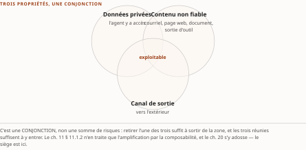
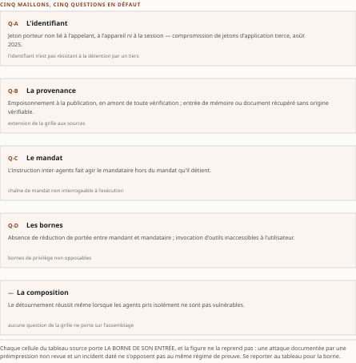

# Chapitre 19 — Taxonomie des attaques d'identité et de délégation

*Livre II — Faire confiance : identité, délégation et fabrique de confiance.
Deuxième mouvement — la confiance hostile (ch. 19-20). **Premier chapitre du mouvement.***

| Champ | Valeur |
|---|---|
| **Statut** | **Brouillon de rédaction, non publiable** — **rédigé le 27 juillet 2026 avant G-3 et G-4**, sur instruction d'auteur. ⚠ **G-3 a été franchie depuis, le 28 juillet 2026** (PRD v0.14 ; socle consolidé [`socle-consolide.md`](../PRD/socle-consolide.md) v1.2, **159 entrées `S-001`…`S-159`**), et **G-4 demeure ouverte** : *une porte franchie après coup ne rattrape pas la pièce écrite avant elle* — **celle-ci n'a pas été ré-adossée entrée par entrée au socle consolidé**, et le ré-adossement reste dû. ⚠ **Deux obligations propres à ce chapitre, et une seule subsiste.** *(a)* Le TOC déclarait la thèse **premier énoncé à instruire avant rédaction**, sa proportion devant être établie par dénombrement sur un corpus déclaré : ⚠ **l'exigence est éteinte avec son objet depuis le TOC v0.25** — la thèse ne porte plus de proportion (**R-IV-32**), le corps **n'en écrit aucune**, et le corpus candidat reste nommé au § 19.1 sans être exploité. *(b)* ⚠ **Celle-ci subsiste** : **CA-IV-11 exige une relecture dédiée par un relecteur distinct, dont le compte rendu est déposé et nommé dans la pièce, l'attestation auto-délivrée étant proscrite même exacte** — **aucune relecture dédiée n'a eu lieu**, et **rien dans cette pièce ne doit être lu comme une attestation**. **R-IV-16 et R-IV-17, ouvertes au ch. 12, valent pour tout le Livre** |
| **Date de gel** | **27 juillet 2026** — gel unique, **D-1 prise** (registre : [`gel-2026-07-27.md`](../PRD/gel-2026-07-27.md)). ⚠ **Volet de faits de G-1 levé le 28 juillet 2026** — 123 entrées à sensibilité temporelle portées à leur source ([`gel-2026-07-28-volet-residuel.md`](../PRD/gel-2026-07-28-volet-residuel.md)) ; ⚠ **l'obligation de pièce du Livre II, elle, reste due**. Gels de source : **juin 2026** (Vol. I), **21 juillet 2026** (Vol. III). ⚠ **Les identifiants de vulnérabilité et les incidents datés se périment par publication de correctif** : ils sont cités comme **jalons datés**, jamais comme état courant d'exposition — et **quatre des identifiants mobilisés portent un vote adversarial incomplet** |
| **Socle mobilisé** | Résolution contre le **Vol. III *Monographie* ch. 12**, dont **dix-sept entrées propres** sont mobilisées — **F-03**, **F-04**, **F-13** à **F-26**, **F-56** — et **quatre entrées héritées** : **H-09** en **[A]**, **H-11** en **[B]**, **H-24** et **H-26** en **[C]**. Toutes conservent leurs **niveaux d'origine** : sur **F-13 à F-26**, **treize en [A]** et **une en [B]** (F-26) ; **F-03** et **F-04** en **[A]** ; **F-56** en **[B]**. Le **Vol. I *Monographie* §2.10.1 et §2.10.2** fournit les § 19.2 et § 19.3, en **[C]**. ⚠ **Le socle consolidé existe depuis le 28 juillet 2026** et ces entrées y résolvent par la **table de correspondance n° 2** ([`socle-consolide.md`](../PRD/socle-consolide.md) §5) ; la pièce les cite **dans la série du Vol. III, préfixées de leur volume** (décision 7) — **la re-citation en `S-nnn` n'est pas faite et reste due**. ⚠ **F-26 porte un vote adversarial incomplet**, et *un vote incomplet n'est pas un vote favorable* : ses quatre identifiants **illustrent** et ne portent aucun énoncé central. **Aucun énoncé n'est central au sens de CA-IV-01** : le PRD v0.14 déclare le **vote adversarial dû pour toute entrée appelée à porter un fait central**, et la consolidation n'en a conduit aucun |
| **Garde-fous balayés** | ⚠ **Règle de comptage, re-mesurée au commit du 28 juillet 2026** : *un cardinal déclaré ici porte sur le **marqueur littéral** de l'identifiant dans le **corps** — en-tête et note de statut exclus* ; les **applications non marquées** ne se dénombrent pas et relèvent du **domaine balayé**, déclaré sans cardinal. **Domaine balayé : les sept sections du corps, § 19.0 à § 19.6.** Vol. III — **R-08 (l'absence porte sur l'usurpation du justificatif propre d'un agent, et sur cela seul) : ce chapitre en est le SIÈGE — un marqueur**, § 19.6, celui du siège lui-même ; **R-02 : un marqueur**, § 19.1 ; **R-14 : un marqueur**, § 19.6. **R-01, R-03 à R-07, R-09 à R-13 : zéro marqueur.** ⚠ **R-12 est appliqué sur tout le domaine sans être marqué une seule fois, et c'est le garde-fou structurant du chapitre** : traitement défensif exclusif, au niveau architectural, **aucune recette d'exploitation** — chacune des six lignes du tableau 19.1 nomme **le maillon qui cède** et s'arrête là. Même régime pour **R-14** hors de son marqueur : les absences portent leur degré, et **les marqueurs littéraux de degré sont quatre — « degré 1 » aux § 19.4 et § 19.6, « degré 3 » aux § 19.5 et § 19.6** ; les autres absences sont **qualifiées sans marqueur** (§ 19.1, § 19.6 et tableau 19.2) et relèvent du domaine déclaré. Même régime pour **R-09** (statut dit à chaque mention) et pour **R-04**, garde-fou d'homonymie du plan de contrôle (§ 19.0 et § 19.1 : la formule « identity as the new control plane » est **laissée en langue originale**, sa traduction porte ses guillemets, et l'une comme l'autre sont déclarées homonymes et renvoyées à leur siège, le ch. 7 § 7.5 — *elle n'est employée nue à aucune occurrence*). ⚠ **R-13 du Vol. III ne s'applique pas ici et ne doit pas y être rattaché** : *il régit les échelles d'autonomie du Vol. I*, dont ce chapitre ne porte aucune occurrence — l'homonymie du plan de contrôle relève de **R-04** dans cette série, et de **R-8** dans celle du Vol. II. Vol. II — **§8.2 (métriques auto-déclarées) : zéro marqueur** ; les métriques des § 19.1 et § 19.5 sont attribuées à leur source à chaque occurrence ; **réserve F-01 (« cadre d'autorisation », jamais « sécurisé ») : zéro marqueur** ; la formule imposée est tenue aux § 19.1 et § 19.6 ; **R-1 à R-8 : zéro marqueur** |
| **Volumétrie cible** | ≈ **5 000 mots** de corps (§ 19.0 à § 19.6), **cible dérivée** de l'enveloppe du Livre (50 000 mots, TOC v0.24) au prorata des sections. ☑ **Décompte publiable depuis G-2** ; **réel : 5 779 mots** par [`PRD/decompte.sh`](../PRD/decompte.sh) — **+15,6 %**, re-mesuré au commit de la contre-relecture du 28 juillet 2026 (⚠ *deux valeurs antérieures sont périmées : **5 529**, +10,6 % à la rédaction, et **5 764**, +15,3 % à la première relecture*). Les **250 mots** de l'écart cumulé se ventilent en **235** pour les attributions rétablies au titre de la décision 15 et **15** pour le garde-fou d'homonymie rétabli au § 19.0 et la date d'avril 2026 rétablie au § 19.5 — **aucune amputation n'a été faite**, D-4. ⚠ La volumétrie du Livre est relevée au [`README.md`](README.md) du dossier et alimente **D-4** par **R-IV-17** |

> **Thèse** *(citée depuis le [`TOC.md`](../PRD/TOC.md) v0.30, entrée du chapitre 19)* — l'identité est le **verrou architectural** de la sécurité agentique — un agent dépourvu d'identité propre et gouvernée opère dans un écart d'attribution qui rend le moindre privilège inapplicable —, et les référentiels du domaine la traitent désormais comme un plan de contrôle à part entière : c'est ce qui justifie d'absorber la sécurité dans le cadre identitaire.
>
> ⚠ **Thèse réalignée au TOC v0.25** (décisions 8 et 14), sur la remontée **R-IV-32** — la seule **bloquante** des vingt-quatre, et la seule où l'arbitrage a retenu l'autre branche que celle proposée. La forme antérieure portait « **une part majoritaire** ». Le dénombrement exigé n'a pas eu lieu ; ⚠ **et le lot n'est pas ouvert pour autant** : la source n'a pas seulement borné cette forme, elle l'a **réfutée au vote adversarial** et a réécrit sa thèse en énoncé architectural, écrivant que *« ce n'est pas une thèse de dénombrement »*. *Dénombrer pour établir un énoncé que la source tient pour non soutenu aurait produit un chiffre sans thèse à porter.* **Le corps du chapitre n'a pas changé** : il **n'écrivait aucune proportion**, et le § 19.1 continue de nommer le corpus candidat sans l'exploiter.

---

## § 19.0 — Introduction : ce que ce chapitre ne peut pas affirmer, et pourquoi il le dit d'abord

⚠ **La thèse citée ci-dessus ne porte plus de proportion, et l'exigence de dénombrement qui la visait
est tombée avec son objet.** Jusqu'au **TOC v0.24**, elle portait « **une part majoritaire** », que le
plan déclarait lui-même **le premier énoncé à instruire avant rédaction** : *la proportion affirmée
devait être établie par **dénombrement sur un corpus déclaré**, ou l'énoncé retombait sans
quantificateur.* **Le dénombrement n'a pas été conduit** — l'obligation de pièce du Livre II au titre
de **G-1** restant due au 28 juillet 2026 —, et **aucun corpus n'a été déclaré**.

**La conséquence est écrite avant la première ligne de recension : le corps de ce chapitre n'écrit
aucune proportion, ni majoritaire, ni notable, ni d'aucune autre forme.** *Ce qu'il soutient est
architectural et non statistique*, et c'est exactement la position que la source de ce chapitre a
elle-même adoptée après avoir vu sa forme quantitative **réfutée au vote adversarial**.

⚠ **La source était plus nette encore que le plan, et l'écart s'est soldé dans son sens.** Le Vol. III
écrit en tête de son chapitre correspondant : *« Ce n'est pas une thèse de dénombrement, et le
chapitre le dit : le relevé des référentiels **ne soutient pas** que la majorité des attaques
documentées seraient des attaques d'identité ou de délégation. »* Sa thèse rectifiée porte que
**l'identité est le verrou architectural** de la sécurité agentique. ⚠ **Le TOC du compendium portait
encore la forme quantitative jusqu'à la v0.24** ; la pièce **citait la thèse verbatim, comme le PRD
l'exige**, et **écrivait son corps sous la forme architecturale**. **L'écart a été soldé par la
remontée R-IV-32** — la seule **bloquante** des vingt-quatre —, qui a réaligné la thèse au **TOC
v0.25** **sans ouvrir de lot de dénombrement** : *dénombrer pour établir un énoncé que la source tient
pour non soutenu aurait produit un chiffre sans thèse à porter.*

**Ce que ce chapitre soutient, et ce que le socle en porte.** Lecture de l'auteur — **ce que le socle
établit** : l'énoncé d'imputation architecturale de l'entrée **ASI03** du référentiel de sécurité
applicative de l'**OWASP** (F-19, **[A]**) ; la qualification de l'identité d'agent en « **nouveau
plan de contrôle** » par le rapport *State of Agentic AI Security and Governance*, version 2.01 de
**juin 2026** — ⚠ *formule de ce rapport, dont l'homonymie est traitée au § 19.1* — (F-20, **[A]**) ;
l'existence de techniques et de contre-mesures nommant **l'écart
d'autorité entre mandant et mandataire** (F-14, F-15, F-24) ; et **un** incident public daté de
défaillance d'identité **non humaine** (F-21, **[A]**). **Ce qu'il n'établit pas** : que l'identité
soit *le* verrou de la sécurité agentique **plutôt qu'un verrou parmi d'autres**, ni qu'un tri par
maillon d'identité **épuise** les attaques recensées. ⚠ *La lecture proposée s'éprouve au § 19.4, où
elle rencontre un cas qu'elle ne range pas.*

⚠ **Une taxonomie d'attaques vaut par le principe qui la trie**, et celui-ci est déclaré : **le maillon
de la chaîne d'identité ou de mandat qui cède**, et non la technique employée ni la cible atteinte.
⚠ **Traitement défensif exclusif** : chaque entrée nomme **le maillon et la raison pour laquelle il
cède**, cite l'identifiant de vulnérabilité ou l'incident, **et s'arrête là** — *aucune recette
d'exploitation n'est reproduite, à aucune ligne, sous aucune forme.*

⚠ **Ce que ce chapitre ne traite pas.** L'**usurpation après admission** — le retournement d'un
serveur d'outils déjà approuvé — est au **ch. 20 § 20.1**. La **révocation** est au **ch. 20 § 20.4**.
Les **défenses architecturales et l'alignement** restent au **ch. 6**, qui en est le siège, et **ne
sont pas repris ici** : la table de couverture les déclare hors périmètre. Et l'**amplification par la
composabilité**, propre à la couche d'interopérabilité, est au **ch. 11 § 11.1.2**, qui **invoque la
triade létale sans la reconstruire** — *elle est reconstruite ici, une seule fois.*

## § 19.1 — Recension : identifiants, incidents datés, littérature

Le Vol. II a fermé son chapitre de clôture sur six questions (*Monographie* ch. 21 §21.2), dont la
deuxième — **Q2 de la série d'agenda** — porte sur **la mécanique des risques protocolaires nommés** et
sur **l'existence d'attaques propres au protocole agent-agent (A2A)**. *Elle appelait un socle ; la
présente section est ce socle, avec ses bornes.*

**Le référentiel de techniques adverses.** Le corpus **MITRE ATLAS** est versionné — **collection
2026.06**, format 6.0.0, modifiée le 27 mai 2026 et publiée le 30 juin 2026 (F-56, **[B]**). Il
fournit trois des éléments mobilisés ici. La technique **AML.T0104**, *Publish Poisoned AI Agent
Tool* — **empoisonnement d'outil à la publication** —, relève d'une tactique de développement de
ressources, est déclarée sur la plateforme agentique, de maturité *Realized*, créée le 30 janvier 2026
(F-13, **[A]**) : *l'outil est empoisonné **à la publication**, dans des registres que la description
qualifie de largement non réglementés.* ⚠ **Le maillon qui cède est en amont de toute vérification
d'identité** — *l'agent qui installe cet outil n'a aucun élément d'identité à contrôler.* La technique
**AML.T0053**, *AI Agent Tool Invocation* — l'**invocation d'outils inaccessibles à l'utilisateur** —,
énonce que des agents peuvent disposer d'outils que les utilisateurs n'atteignent pas et que l'abus de
l'accès à l'agent confère des privilèges supérieurs (F-14, **[A]**) : ⚠ *ce n'est pas
l'authentification de l'agent qui cède, c'est **l'absence de réduction de portée entre le mandant et le
mandataire**.* La contre-mesure **AML.M0027** pose le plafond correspondant : **un agent agissant pour
un utilisateur ne doit pas recevoir de permissions que cet utilisateur n'a pas** (F-15, **[A]**).
⚠ **Prescription de configuration, non mécanisme démontré** : le référentiel énonce ce qu'il faut
faire, *il n'établit aucune propriété cryptographique de mandat* (R-02).

**Les référentiels de sécurité applicative.** Le document *OWASP Top 10 For Agentic Applications 2026*
porte la mention de version **2026** et la date de publication **décembre 2025** — ⚠ *millésime et
date diffèrent : ils se citent ensemble* —, compte 57 pages, et son balayage de statut n'y relève
**aucune mention de brouillon, de version candidate ni de préversion** (F-16, **[A]**). Ses dix
entrées, relevées aux en-têtes de section, vont d'**ASI01** à **ASI10** (F-17, **[A]**) — ⚠ *le
document n'étant pas typographiquement constant d'une page à l'autre, aucune revendication de verbatim
n'est portée sur ces intitulés sans nommer la page.*

**Deux d'entre elles portent le propos.** **ASI03**, *Identity and Privilege Abuse*, impute le risque à
une **inadéquation architecturale** entre des systèmes d'identité conçus pour des utilisateurs humains
et la conception agentique, et formule le manque en une phrase : « Without a distinct, governed
identity of its own, an agent operates in an attribution gap that makes enforcing true least privilege
impossible » (F-19, **[A]**). Le rapport *State of Agentic AI Security and Governance*, **version 2.01,
daté de juin 2026**, érige l'identité d'agent en chapitre propre et la qualifie de nouveau plan de
contrôle — « identity as the new control plane » —, en distinguant l'identité non
humaine — qui « verifies that a credential is authorized to connect » — de l'identité d'agent — qui
« has to verify what the holder is doing with that authorization, **continuously** » (F-20, **[A]**).
⚠ **Homonymie** : l'expression relève du **garde-fou d'homonymie à quatre branches, dont le siège est
le ch. 7 § 7.5**, et *le socle ne caractérise pas laquelle le rapport vise* — la formule est **laissée
en langue originale**. ⚠ **Attribution** : ce rapport reprend par ailleurs **des métriques
auto-déclarées d'éditeur** ; *le présent chapitre n'en reprend aucune, et sa thèse ne dépend d'aucun
ratio de prolifération.*

**Les incidents datés.** L'incident porté au socle en **[A]** est la campagne suivie sous la
désignation d'acteur **UNC6395** : entre le **8 août 2025** et **au moins le 18 août 2025**, un acteur
a accédé à des instances **Salesforce** au moyen de **jetons OAuth compromis** associés à une
application tierce, et **l'ensemble des jetons a été révoqué le 20 août 2025** (F-21, **[A]**).
⚠ **L'entrée du socle écrit « application tierce » ; l'affirmation qui la fonde et sa source
primaire — l'avis du Google Threat Intelligence Group — nomment l'application, et c'est *Salesloft
Drift***. Le nom est reporté ici plutôt qu'effacé — *un éditeur anonymisé rend le fait non revalidable
au gel suivant.* **Le maillon qui cède est le jeton porteur délivré à une identité non
humaine** : il n'est lié ni à l'appelant, ni à un appareil, ni à une session, de sorte que **quiconque
le détient *est* l'intégration** aux yeux du fournisseur, et que **la révocation est le remède — et
elle est collective**.

Lecture de l'auteur — **ce que le socle établit** : les trois dates, le mécanisme d'accès, la
révocation. **Ce qu'il n'établit pas** : **que l'application compromise soit un agent** au sens de la
somme. *L'avis primaire ne la qualifie pas ainsi ; le rattachement de cet incident au périmètre
agentique est une lecture, et il vaut pour ce qu'il éclaire — la structure du justificatif —, non pour
une équivalence de catégorie.*

**Quatre identifiants de vulnérabilité complètent la recension** — **CVE-2025-32711**,
**CVE-2025-6514**, **CVE-2025-12420** et **CVE-2026-55255** (F-26, **[B]**). ⚠ **Leur vote
adversarial n'a pas pu être complété, et un vote incomplet n'est pas un vote favorable** : *ils
illustrent, ils ne portent aucun énoncé central de ce chapitre, et ils sont à revalider avant tout
emploi de ce rang* — ⚠ **les quatre identifiants sont écrits pour que cette revalidation soit
exécutable**, un critère de clôture qui ne nomme pas sa source n'en étant pas un.

**La littérature.** Des trois entrées versées, **une seule est une publication revue par les pairs en
actes de piste principale** — **AgentPoison**, **NeurIPS 2024** —, et elle démontre
l'**empoisonnement de la mémoire à long terme ou de la base de connaissances interrogée par
récupération** (*retrieval-augmented generation*, RAG) d'agents fondés sur des modèles de langue
(F-23, **[A]**). Les deux autres sont des **préimpressions non revues par les pairs** : l'une range la
**confusion de délégué** parmi cinq vecteurs d'élévation de privilège et l'identifie à l'instruction
directe transmise par message inter-agents (F-24, **[A]**) ; l'autre rapporte que le **détournement du
contrôle et de la communication interne d'un système multi-agents réussit même lorsque les agents pris
isolément ne sont pas vulnérables** à l'injection et refusent les actions nuisibles (F-25, **[A]**).
⚠ *Les deux régimes de preuve ne se fondent pas : cinq vecteurs posés par des auteurs dans leur propre
modèle de menace ne sont pas une taxonomie consensuelle du domaine.*

⚠ **Trois bornes de méthode ferment cette recension, et elles sont déclarées par le lot lui-même.**
*(1)* Les bases bibliographiques sous abonnement **n'ont pas été interrogées**, faute d'accès
authentifié : **la proportion de littérature revue par les pairs de ce relevé est structurellement
sous-estimée**, et *il n'en découle pas que le domaine soit surtout préimpression*. *(2)* Le lot
recense des techniques, des référentiels et des incidents ; **il ne mesure aucune prévalence** —
*c'est le motif direct du § 19.0.* *(3)* Le relevé est **arrêté au 21 juillet 2026 et se périme par
trimestres** : une **révision majeure de la spécification du protocole agent-outil (MCP) est annoncée
au brouillon**, dont la revalidation confirme la substance **et non la date**, de sorte qu'**aucun tri
prospectif n'y est arrêté** et que **les décomptes portant sur ce protocole sont à rejouer**. ⚠ MCP
porte un **cadre d'autorisation** (H-09, **[A]**) — *formule imposée ; on n'écrit jamais « sécurisé ».*

⚠ **Un incident de méthode est consigné, et il appartient au propos de la somme** : une recherche
documentaire **secondaire** a rattaché à A2A un identifiant de vulnérabilité qui,
**fiche primaire ouverte, désigne un tout autre produit**. *Un identifiant plausible attribué par un
intermédiaire à un objet qu'il ne désigne pas, et que seule l'ouverture de la source a arrêté.*

⚠ **Deux relèves du plan atterrissent ici, et aucune n'est consommée.** *(1)* Les **divulgations du
premier semestre 2026** forment le **corpus candidat** du dénombrement — *à qualifier pièce par pièce
avant usage*, et **aucune qualification n'a été conduite**. *(2)* Une **classe d'attaques dont le
vecteur est le harnais** — extension tierce admise par simple configuration —, **et non le protocole
ni le mécanisme d'identité, est repérée** ; ⚠ **si elle s'instruit, elle entre au dénombrement
*contre* la thèse d'absorption de ce chapitre, non à son appui.** *Son incident public candidat est
décrit au ch. 47 § 47.7.* ⚠ **Ces deux relèves ne sont pas instruites ici** : l'obligation de pièce du
Livre II au titre de G-1 reste due.

⚠ **Une troisième relève porte une taxonomie d'organisme, et sa portée exacte est plus étroite qu'il
n'y paraît.** Le **NIST** publie *Adversarial Machine Learning: A Taxonomy and Terminology of Attacks
and Mitigations*, **NIST AI 100-2 E2025**, **finale, de mars 2025**, structurée par types de méthodes
d'apprentissage, étapes du cycle de vie et objectifs de l'attaquant. ⚠ **Deux réserves, à tenir
ensemble.** *(a)* La page relevée **ne mentionne pas l'injection d'invite par son nom** : *la couverture
de ce vecteur est à vérifier dans le document lui-même, jamais à présumer.* *(b)* ⚠ **Une taxonomie ne
dénombre pas** : *elle n'apporte aucun appui à une thèse quantitative — s'en servir pour en soutenir
une serait exactement la faute que le § 19.0 refuse ; et la thèse de ce chapitre n'en porte plus
depuis le TOC v0.25.* **Elle n'entre pas au socle.**

## § 19.2 — Modèle de menace agentique, triade létale et impossibilité architecturale

> ⚠ **SIÈGE DE LA TRIADE LÉTALE POUR TOUTE LA SOMME.** Le modèle de menace qui suit est **posé ici une
> seule fois**. Le **ch. 11 § 11.1.2** l'**invoque sans le reconstruire** — il n'en traite que
> l'**amplification** par la composabilité, propre à la couche d'interopérabilité —, et le **ch. 20**
> s'y adosse. *C'est l'économie de la fusion côté menace, et elle n'a lieu que si ces chapitres s'y
> tiennent.*

**Le cadre de menace le plus opérant pour les agents tient en une conjonction, que Willison (2025b)
nomme la *triade létale* (« lethal trifecta »).** Un agent devient dangereusement exploitable
lorsqu'il combine **simultanément trois propriétés** :
l'**accès à des données privées** ; l'**exposition à du contenu non fiable** — courriel, page web,
document récupéré, sortie d'outil — ; et la disposition d'un **canal de sortie vers l'extérieur**.
*Prise isolément, chacune est anodine ; réunies, elles permettent à une instruction dissimulée dans le
contenu non fiable de détourner l'agent pour exfiltrer les données privées par le canal de sortie.*

⚠ **Régime de cet apport** : la matière vient du **Vol. I *Monographie* §2.10.1**, et les faits du
Vol. I entrent dans la somme en **[C]** — *sa vérification porte sur ses références, non sur le contenu
de ses affirmations.* **Aucun énoncé de cette section n'est central**, et l'élévation en [B]
supposerait la lecture des sources primaires que le Vol. I cite.

**Le diagnostic n'est pas marginal**, et le Vol. I le note : *il est admis par les fournisseurs
eux-mêmes, qui qualifient l'injection d'invite de **problème de sécurité de frontière non résolu** et
estiment improbable qu'il soit un jour pleinement résolu.*

**La racine est architecturale.** Dans un agent fondé sur un modèle de langue, **les instructions du
concepteur et les données ingérées partagent le même flux de jetons**, sans séparation de privilège
analogue à celle d'un canal de commande distinct d'un canal de données. ⚠ *Aucune barrière interne au
modèle ne distingue de façon fiable « ce qu'on me dit de faire » de « ce que je lis ».* **Greshake et
al. (2023)** ont les premiers démontré expérimentalement cette compromission par **injection
indirecte** sur des applications réelles intégrant un modèle de langue.

> **Perspective recherche.** ⚠ **L'impossibilité dont il est question ici n'est pas un théorème** :
> c'est un **constat d'ingénierie de sécurité**. *Tant qu'instructions et données coexistent dans un
> espace de jetons indifférencié, un classifieur parfait de l'intention hostile équivaudrait à résoudre
> le problème de l'alignement sémantique en boucle ouverte.* Les travaux de défense par conception
> (**Debenedetti et al., 2025**) contournent la difficulté en imposant une séparation de privilège
> **à l'extérieur** du modèle plutôt
> qu'en cherchant à durcir le modèle lui-même — *un déplacement du problème de la couche cognitive vers
> la couche système*. ⚠ **Leur instruction est au ch. 6**, qui en est le siège ; elle n'est pas reprise
> ici.

⚠ **Deux conséquences de méthode se tirent, et elles commandent le reste du mouvement.** *(1)* **Aucun
patron de défense n'est présenté comme une solution**, mais comme **une mesure de réduction de risque
dont les limites doivent être quantifiées**. *(2)* **La conclusion du chapitre en dépend directement**
: si l'injection n'est pas résoluble au niveau du modèle, alors *ce qui borne le dommage est la portée
de ce que l'agent peut atteindre* — c'est-à-dire **une question d'identité et de mandat**, et non de
filtrage. ⚠ Lecture de l'auteur — **ce que le socle établit** : la conjonction des trois propriétés et
son caractère architectural, en **[C]**. **Ce qu'il n'établit pas** : que la réponse doive être
identitaire **plutôt qu'autre chose**. *C'est la lecture que la thèse de ce chapitre propose, et le
§ 19.4 est l'endroit où elle s'éprouve.*

## § 19.3 — Vecteurs d'attaque

**La surface d'attaque d'un agent épouse exactement son anatomie** : chaque entrée de sa boucle, chaque
outil branché et chaque écriture en mémoire ouvre un vecteur. ⚠ **Régime** : cette section vient du
**Vol. I *Monographie* §2.10.2**, en **[C]** ; elle **situe** les vecteurs, elle ne les établit pas.
⚠ **Traitement défensif** : la mécanique est exposée **au niveau du maillon**, et **aucune recette
n'est reproduite**.

**Injection d'invite directe et indirecte.** L'injection figure **en tête** du référentiel *OWASP Top
10 for LLM Applications 2025*, sous le code **LLM01**, *signe de sa centralité*. La forme **directe**
consiste pour un utilisateur à formuler une entrée qui subvertit les consignes système ; la forme
**indirecte**, propre aux agents, **place l'instruction hostile dans un contenu que l'agent récupérera
de lui-même** — un courriel, une page, un passage extrait, la sortie d'un outil. ⚠ *Greshake et al.
(2023) caractérisent cette dernière comme la menace dominante des applications intégrant un modèle de
langue, précisément parce que **la victime n'a aucune interaction directe avec l'attaquant**.* Les
**navigateurs agentiques** en constituent la surface la plus exposée : *tout site visité devient un canal
d'injection potentiel.* ⚠ **Les mécanismes de confinement proposés relèvent de la limitation du
dommage, non de la prévention de l'injection**, qui demeure non résoluble au niveau du modèle
(§ 19.2).

**Exfiltration, sortie et agence excessive.** Le troisième sommet de la triade — **le canal de
sortie** — est lui-même un vecteur, que le même référentiel code sous **LLM02** : *une URL construite
avec un secret en paramètre, un appel d'outil réseau, un champ de formulaire.* L'incident
**EchoLeak** (Aim Security, 2025 ; **CVE-2025-32711**) — exfiltration **sans clic** depuis un
environnement de productivité, **sans action de la victime** — démontre la triade en conditions
réelles : *contenu non fiable ingéré, données privées accessibles, canal de sortie exploité.*
⚠ Son identifiant figure parmi **les quatre à vote incomplet** du socle propre (F-26) : *il illustre,
il ne porte pas.*

L'**agence excessive** (**LLM06**, *excessive agency*) désigne, distinctement, le
**sur-dimensionnement des permissions** accordées à
l'agent : portée d'accès trop large, outils trop puissants, absence de plafond sur les actions. ⚠ *Plus
l'agence est large, plus le dommage d'une injection réussie est grand ; minimiser la surface agentique
et appliquer le moindre privilège **réduit l'amplitude du risque indépendamment de la probabilité
d'attaque**.* Le **contrôle des destinations réseau** apparaît comme le complément naturel : *couper le
canal de sortie casse la triade même si l'injection réussit.*

⚠ **Deux familles du chapitre source ne sont pas reprises ici, et ce n'est pas un oubli.** Les
**référentiels et patrons de défense architecturale** et l'**alignement et le comportement déviant**
sont **hors périmètre** de ce chapitre par décision de la table de couverture : leur siège est le
**ch. 6**. *Le présent chapitre traite ce qui cède, non ce qui protège.*

## § 19.4 — Taxonomie par la grille du ch. 14

**La grille des cinq questions change ici de fonction.** Au premier mouvement, elle rend un verdict sur
un mécanisme. Ici, elle devient **l'axe du tri** : chaque attaque est rangée selon **la question qui,
restée sans réponse, rend l'attaque possible ou l'attribution impossible**.

| Attaque ou incident, avec sa borne | Maillon qui cède | Question en défaut | Trace |
|---|---|---|---|
| **AML.T0104**, empoisonnement d'outil à la publication (corpus MITRE ATLAS 2026.06, maturité *Realized*, créée le 30 janv. 2026) | empoisonnement à la publication, **en amont de toute vérification d'identité** | **Q-B des sources** — extension de la grille, ci-dessous | F-13 **[A]** |
| **AML.T0053**, invocation d'outils inaccessibles à l'utilisateur (même corpus ; la matrice la range sous deux tactiques) | **absence de réduction de portée** entre mandant et mandataire | **Q-D** — bornes de privilège non opposables | F-14 **[A]** ; contre-mesure **AML.M0027**, F-15 **[A]** |
| **UNC6395**, compromission de jetons d'application tierce, 8 au 18 août 2025 au moins, révocation le 20 août 2025 | jeton porteur **non lié** à l'appelant, à l'appareil ni à la session | **Q-A** — l'identifiant n'est pas résistant à la détention par un tiers | F-21 **[A]** |
| **Confusion de délégué**, quatrième de cinq vecteurs d'une préimpression non revue | l'instruction inter-agents fait agir le mandataire **hors du mandat qu'il détient** | **Q-C** — chaîne de mandat non interrogeable à l'exécution | F-24 **[A]**, préimpression |
| **AgentPoison**, empoisonnement de la mémoire et de la base interrogée, actes de NeurIPS 2024, revus par les pairs | l'entrée de mémoire ou le document récupéré **n'a pas d'origine vérifiable** | **Q-B des sources** | F-23 **[A]** |
| **Détournement d'un système multi-agents**, préimpression non revue, configurations données | **la composition, non un agent** : le détournement réussit **même lorsque** les agents pris isolément ne sont pas vulnérables et **même lorsqu'ils** refusent les actions nuisibles | ⚠ **aucune — cas non rangé par la grille** | F-25 **[A]**, préimpression |

: Tableau 19.1 — Tri des entrées du socle par le maillon qui cède, au 21 juillet 2026. Chaque cellule porte la borne de son entrée ; la colonne « Question en défaut » est un **tri d'auteur**. **La dernière ligne est le cas que le tri ne range pas.**

**Trois enseignements se tirent de ce tableau, et le troisième est celui qui compte.**

**Le premier est l'ordre des questions.** L'énoncé d'**ASI03** le formule en une phrase : sans identité
propre et gouvernée, l'agent opère dans un écart d'attribution qui rend le moindre privilège
inapplicable (F-19). Lecture de l'auteur — **ce que le socle établit** : l'énoncé cité, au niveau [A]. **Ce qu'il
n'établit pas** : que Q-A commande les autres questions **par nécessité logique**. *La lecture proposée
est que Q-D et Q-E ne deviennent pas **difficiles** en l'absence de réponse à Q-A, elles deviennent
**inapplicables** — une borne de privilège suppose un porteur identifié, et une imputabilité suppose
quelqu'un à qui imputer.*

**Le deuxième est l'extension de la grille aux sources.** Les cinq questions sont, au ch. 14, celles que
l'entreprise pose à ses **agents** ; deux entrées du tableau les font porter sur autre chose — **un
outil publié dans un registre** (F-13), **une entrée de mémoire ou un document récupéré** (F-23).
Lecture de l'auteur — **cette extension est une construction de la somme.** **Ce que le socle
établit** : la mécanique des deux attaques et le point de la chaîne où elles opèrent. **Ce qu'il
n'établit pas** : que la grille soit applicable à un objet qui n'est pas un agent, ni qu'un mécanisme
de provenance des sources soit spécifié quelque part. *Elle est proposée parce qu'elle rend le tri
cohérent, non parce qu'une source l'autorise* — et elle est l'objet du § 19.5.

**Le troisième est le cas que la grille ne range pas, et il vaut plus qu'un tri réussi.** Le
détournement du contrôle et de la communication interne d'un système multi-agents **réussit même
lorsque les agents pris isolément ne sont pas vulnérables** (F-25). Lecture de l'auteur — **ce que le
socle établit** : cette observation expérimentale, **sur des cadriciels et des configurations
donnés**. **Ce qu'il n'établit pas** : que la grille soit **inapte** à la ranger. *La lecture proposée
l'est : une taxonomie par maillon d'identité interroge les agents **un à un**, et laisse donc échapper
la classe où le défaut est **dans la composition**.* ⚠ Le Vol. I porte l'énoncé qui la nomme —
*« un agent sûr et un outil sûr, une fois composés, ne donnent pas un système sûr ; la sûreté n'est pas
une propriété compositionnelle »* (H-24, **[C]**, corroboration et non appui). ⚠ **Cette préimpression
n'établit pas cet énoncé et ne s'y substitue pas** : la formule reste adossée au Vol. I, et **son
siège dans la somme est le ch. 37 § 37.3**.

**Reste ce que la taxonomie ne dit pas.** ⚠ **Elle ne dénombre rien.** Sur les dix intitulés du
référentiel *OWASP Top 10 For Agentic Applications 2026*, **un seul comporte le mot « Identity » et
aucun ne comporte « Delegation »** (F-18, **[A]**, fait négatif **vérifié**, degré 1). ⚠ **L'énoncé
porte sur les intitulés, non sur les contenus** : la délégation est traitée **dans le corps d'ASI03 et
d'ASI02**, et *transformer ce
fait négatif de titre en fait négatif de contenu serait une faute.* ⚠ **Aucune entrée du socle ne
tranche la question quantitative dans un sens ni dans l'autre**, et le lot chargé de l'établir a
**réfuté la forme quantitative** que le cadrage prêtait au chapitre.

***La justification d'absorber la sécurité dans le cadre identitaire est donc architecturale et non
statistique : verrou portant, non catégorie majoritaire.***

☑ ⚠ **Une lignée manquait à ce chapitre, et son absence était une omission canonique relevée par
l'arbitrage externe : le *confused deputy*.** **Norm Hardy (1988)**, *The Confused Deputy (or why
capabilities might have been invented)*, *ACM SIGOPS Operating Systems Review*, 22(4), 36-38, nomme
le patron dont toute cette taxonomie est une réinstanciation : ***un programme légitime, porteur
d'une autorité qui lui est propre, est amené par un tiers à exercer cette autorité pour le compte de
ce tiers*** — le mandataire n'est ni compromis ni malveillant, **il est confus sur le donneur
d'ordre**.

⚠ **Ce que la citation apporte au chapitre, et il faut le dire précisément, sans quoi elle ne serait
qu'un ornement d'érudition.** *(1)* **Elle donne son nom au verrou que le § 19.4 vient de qualifier
de portant.** L'injection indirecte, l'empoisonnement d'outil et le détournement de délégation
multi-saut sont **trois formes d'un même patron vieux de trente-huit ans** : *la couche agentique
n'invente pas la classe, elle en abaisse spectaculairement le coût d'exploitation* — un agent lit du
contenu non fiable **par construction**, là où le compilateur de Hardy devait être trompé par un
argument forgé. *(2)* ⚠ **Elle porte sa propre parade dans son sous-titre**, et c'est le point le
plus utile : *« or why capabilities might have been invented »* — **le remède historique est la
capacité**, c'est-à-dire un justificatif qui **désigne à la fois l'autorité et son porteur**, plutôt
qu'une identité ambiante qu'un appelant peut emprunter. ⚠ **C'est exactement l'objet de la quatrième
piste du ch. 17 § 17.6.2** — l'atténuation par caveats —, et *les deux chapitres se répondent sans
que ni l'un ni l'autre l'ait su avant cette passe.* *(3)* ⚠ **Le versement ne change aucun régime de
preuve** : la référence est **repérée à sa notice bibliographique**, non extraite, et **elle n'entre
au socle à aucun niveau** ; **aucun énoncé du chapitre n'est réécrit sur elle**, et la lecture
proposée ci-dessus est une **lecture de l'auteur** au sens de CA-IV-07. *Le socle établit les trois
formes ; il n'établit pas leur identité de patron.*

## § 19.5 — L'empoisonnement de la mémoire et des sources

Les attaques précédentes visent **l'agent**. Celles-ci visent **ce dont l'agent se nourrit**, et elles
déplacent la question d'identité d'un cran : *non plus **qui es-tu ?** posée au mandataire, mais posée
au document, à l'entrée de mémoire, au serveur d'outils.*

**Le fait porteur est établi et revu par les pairs** : l'empoisonnement de la mémoire à long terme ou
de la base de connaissances interrogée par récupération est **démontré par AgentPoison, publication
parue dans les actes de NeurIPS 2024** (F-23, **[A]**). ⚠ **Les taux que ses auteurs rapportent — un
taux de succès moyen supérieur ou égal à 80 % pour un taux d'empoisonnement inférieur à 0,1 % — sont
mesurés et déclarés par eux sur leurs trois configurations expérimentales** ; *ils ne sont pas une
propriété générale des agents à mémoire persistante, et l'attribution est due à chaque occurrence.*
**Le maillon qui cède n'est ni l'authentification de l'agent ni son mandat : c'est l'absence d'origine
vérifiable de l'entrée retenue en mémoire.**

**Un manifeste de recherche prolonge le constat au grain de l'exploitation** (H-11, **[B]**). Il tient
l'empoisonnement de mémoire pour un **défi ouvert**, oppose deux patrons d'architecture —
*Action-Selector* et *Plan-Then-Execute* —, scinde l'auto-modification en **adaptation éphémère** et
**évolution persistante**, et fait de
l'opérationnalisation **locale** des cadres normatifs une **frontière de sécurité** — *restreindre le
contexte et les capacités limite l'impact d'un agent compromis.* Il nomme enfin un **écart de
responsabilité** entre le développeur, l'organisation qui impose le cadre, le fournisseur de modèle et
le comportement émergent. ⚠ **Réserve héritée** : le cadre **opérationnel** n'est **pas caractérisé par
le socle** — seul le normatif l'est —, et *aucun développement de ce chapitre ne s'y adosse.*

**La filiation vient du Vol. I et entre en repérage** (H-26, **[C]**) : injection d'invite directe et
**indirecte** ; **empoisonnement d'outils par les descriptions en langage naturel** ; le **retournement
d'un serveur** comme **variante temporelle** ; et la **transitivité de la confiance**. ⚠ *Le Vol. I y
pose que l'injection n'est pas résoluble au niveau du modèle et que la parade relève du confinement.*
⚠ **L'identifiant que cette entrée cite — CVE-2025-32711 — figure aussi au socle propre parmi les
quatre à vote incomplet (F-26), et deux scores coexistent pour cette fiche selon l'autorité qui les
publie : l'écart n'est pas arbitré ici.**

**L'identité des sources a un troisième visage, celui de l'éditeur.** Un paquet publié sous le nom d'un
éditeur, **par un tiers sans aucun lien avec lui**, ajoutait dans une de ses versions une **mise en
copie invisible de tout courriel sortant vers un serveur externe**. *(Source primaire ouverte et citée
hors socle par le Vol. III, non versée.)* ⚠ **Le maillon qui cède est en amont de la chaîne de
mandat** : *le serveur contrefait reçoit **légitimement** le mandat de l'agent et les habilitations
d'envoi de l'organisation, la confiance reposant sur **l'homonymie d'un identifiant de registre**.*
**C'est le même maillon que l'empoisonnement à la publication, décrit depuis un cas plutôt que depuis
une technique.**

⚠ **Ce que le socle permet de conclure s'arrête ici.** **Le socle ne documente pas de mécanisme
normalisé de provenance des entrées de mémoire longue ni des documents récupérés — absence de
documentation, degré 3.** Une préimpression porte bien la réserve qu'**aucun cadre d'évaluation du
risque centré sur les protocoles de communication d'agents n'était établi à sa date** — ⚠ *réserve
d'auteurs, **datée d'avril 2026** et périssable, dont il ne se tire rien sur le contenu des
spécifications*, et **non versée au socle**.

⚠ **Ce versant hostile est le pendant de l'ancrage informationnel posé au ch. 5**, qui n'en porte
**aucune occurrence** : *la provenance des sources y est traitée comme une propriété de qualité, ici
comme un problème d'identité.* Le ch. 5 n'est pas rejoué, et sa matière n'est pas reconstruite.

## § 19.6 — Ce que la recension ne trouve pas

> ⚠ **SIÈGE DE LA RESTRICTION DU GARDE-FOU R-08 POUR TOUTE LA SOMME.** La formulation de l'absence
> d'usurpation est **posée ici une seule fois**, dans sa forme restreinte du 21 juillet 2026. Les
> **ch. 12 § 12.2 et ch. 20 § 20.0** y renvoient ; **ils ne la reformulent pas**.

**La formulation a changé sur constat d'instruction, et le changement est le contenu de cette
section.** L'affirmation soumise au vote portait déjà sur un objet étroit — *le corpus consulté ne
documente aucun incident public majeur d'usurpation de l'identité propre d'un agent en production* —
et elle a été **écartée 3-0**, l'un des juges opposant **un contre-exemple tiré de la source même
qu'elle invoquait**.

⚠ **Des incidents de défaillance d'identité *non humaine* sont publics, datés et documentés par source
primaire** (F-21) : *la somme ne peut écrire l'absence ni en général, ni sans dire ce qui l'en sépare.*
**Ce qui l'en sépare est la réserve du socle elle-même** : *l'avis primaire ne qualifie pas d'agent
l'application dont les jetons ont été compromis* (§ 19.1).

**Sous cette réserve, et sous elle seule** : **le socle ne documente pas l'usurpation du justificatif
propre d'un agent — c'est-à-dire la présentation par un attaquant d'un justificatif délivré à un agent
afin de se faire passer pour cet agent auprès d'un autre agent ou d'un service — ; c'est une absence de
documentation, non un fait négatif vérifié.** ⚠ **Elle s'interprète avec prudence** — surface encore
peu déployée, détection immature, divulgation non publique — **et elle ne constitue pas une preuve de
sûreté.**

**Du côté du protocole agent-agent (A2A), deux énoncés coexistent, de degrés différents, et les fondre
en un seul serait la faute que R-14 proscrit.**

**Degré 1, fait négatif vérifié.** Le texte intégral de la page de spécification **A2A v1.0.0** **ne
contient aucune occurrence** de neuf chaînes relatives à l'usurpation (deux chaînes), au rejeu, à
l'injection d'invite, à la confusion de délégué, à la non-répudiation, au multi-saut, à la provenance
et à l'interception (F-22, **[A]**). *Le balayage a porté sur le texte rendu, mesuré à
**170 999 caractères**, et a été **rejoué indépendamment par un juge**.* ⚠ **C'est un fait négatif de
vocabulaire, borné à un document et à une version** : *il établit que la spécification ne **nomme** pas
ces menaces, non que le protocole y soit
vulnérable — un texte peut traiter un risque sans employer le mot.* ⚠ Il ne porte pas davantage sur les
documents de sujet du même site, **que le lot déclare n'avoir pas ouverts**.

**Le contre-exemple est dans le texte même.** La spécification **reconnaît**, en section 7.6.3, que
l'échange de justificatifs en bande **expose ces justificatifs à chacun des agents d'une chaîne de
requêtes**, et n'oppose à ce risque que des recommandations de niveau *SHOULD*. *(Source primaire ouverte et citée
hors socle, non versée.)* ⚠ **Le maillon qui cède est nommé par la spécification elle-même** : *la
chaîne formée par des tâches successives n'a pas de porteur d'identité propre, de sorte que le
justificatif circule tel quel et que chaque intermédiaire le lit.*

La page *Security Best Practices* du protocole agent-outil (MCP) fait de même, **à une réserve de
statut près qui se dit à chaque occurrence** : elle **ne siège pas dans l'arbre normatif** et se
présente elle-même comme un **complément** de la spécification d'autorisation. Elle reconnaît **huit
familles d'attaque**, dont la confusion de délégué et le détournement de session, **sans employer** les
termes de délégation, de multi-saut, d'identité d'agent ni de non-humain — *balayage borné à cette page
et à l'index normatif de la **révision 2025-11-25***. ⚠ **Les menaces sont donc traitées par un
document d'accompagnement ; le texte d'autorisation de cette révision, lui, n'a pas été ouvert par le
lot**, et le décompte ne vaut pas pour lui.

**Degré 3, absence de documentation.** Le corpus consulté **ne documente aucun identifiant de
vulnérabilité visant A2A lui-même** : les identifiants relevés visent des
**bibliothèques tierces portant son nom**. ⚠ **La règle qui l'impose a été payée au vote : un registre
interrogé par mot-clé n'établit aucune absence, son rappel étant inconnu.** *Trois formulations plus
fortes ont été écartées et ne doivent pas resurgir* — deux clauses d'exclusivité et un fait négatif de
registre. ⚠ **Un dénombrement de fiches par registre ne mesure pas davantage une sûreté comparée entre
deux protocoles** : *il mesure une **attribution**, et deux lectures concurrentes restent ouvertes —
exposition réelle moindre, ou surface d'attribution moindre faute de déploiements et de chercheurs.*

**La technique publiée qui nomme le protocole appelle une décision, et le lot l'a prise.** Une
publication de l'unité de recherche en sécurité **Unit 42** de Palo Alto Networks, **datée du
31 octobre 2025 et signée de Jay Chen et Royce Lu**, décrit une technique de **contrebande de session
entre agents** (*agent session smuggling*) ; ⚠ *ses auteurs déclarent eux-mêmes qu'elle ne
révèle **aucune vulnérabilité du protocole** et qu'elle **n'a pas été observée en usage réel**.*
⚠ **L'affirmation qui la portait a été écartée 3-0 sur sa clause d'exclusivité, et son entrée au socle
est refusée en l'état.** Elle est donc caractérisée **au seul niveau architectural** : *le maillon qui
cède est **la confiance implicite entre agents sur une session avec état, qu'aucune re-vérification du
mandat ne rafraîchit en cours de session**.* ⚠ **Le rapprochement avec le premier mouvement est direct
et il est, lui, au socle** : l'en-tête protégé de la carte signée **ne porte aucun paramètre de
validité temporelle** (F-03), et sa signature est **facultative** comme sa vérification n'est que
**recommandée** (F-04).

**Ce qu'une institution peut inscrire dans un dossier de diligence raisonnable tient en trois lignes,
et la distinction entre elles est le contenu, non la nuance.**

| Ce que le corpus montre | Ce que cela autorise à écrire |
|---|---|
| Une menace **nommée** par une spécification | elle y est traitée ou ne l'est pas, **et le texte le dit** |
| Une menace **non nommée** dans un texte **balayé** | un **fait négatif borné à ce texte** — jamais au protocole |
| Une menace dont **aucun identifiant ne ressort d'un registre** | ⚠ **pas un fait négatif** : un **silence du corpus consulté** — *l'inscrire comme une preuve de sûreté reviendrait à inscrire une inférence à la place d'un fait* |

: Tableau 19.2 — Trois régimes d'absence côté protocolaire, et ce que chacun autorise à écrire, au 21 juillet 2026.

⚠ **Et le mot que ce chapitre n'applique à aucun protocole, à aucune occurrence** : *sécurisé*. MCP
porte un **cadre d'autorisation** — formule imposée par la réserve du socle du Vol. II —, *parce que la
sécurité dépend de l'implémentation.*

### Synthèse : ce que le chapitre lègue à la somme

*Section de sortie sans homologue direct dans la source — construction d'éditeur.*

1. **Le siège de la triade létale** (§ 19.2), avec sa nature exacte : *un constat d'ingénierie, non un
   théorème.* Le **ch. 11 § 11.1.2** l'invoque pour son amplification ; le **ch. 20** s'y adosse.
2. **Le principe de tri** : par **le maillon qui cède**, non par la technique ni par la cible. Le
   **ch. 20** le reconduit sur la classe temporelle.
3. **Le siège de la restriction du garde-fou sur l'usurpation** (§ 19.6), dans sa forme restreinte —
   *l'usurpation du justificatif propre d'un agent, et de cela seul.*
4. **Le cas que la grille ne range pas.** *Une taxonomie par maillon d'identité interroge les agents un
   à un et laisse échapper la classe où le défaut est dans la composition.* C'est la limite déclarée de
   l'instrument, et le **ch. 37 § 37.3** en porte le siège théorique.
5. ⚠ **Et un legs négatif** : **aucune proportion n'est établie**. *La justification d'absorber la
   sécurité dans le cadre identitaire est architecturale ; quiconque la citera comme statistique
   citera ce que la somme n'a pas écrit.*

---

## § 19.7 — Note de statut *(hors plan — à retirer à la publication)*

⚠ **Cette section n'est pas au TOC et n'a pas vocation à survivre.**

**Ce qui est enfreint.** La pièce a été rédigée le 27 juillet 2026 **avant G-3 et G-4**, hors de
l'ordre de rédaction du PRD §6, sur instruction d'auteur. ⚠ **G-3 a été franchie depuis, le 28 juillet
2026** (PRD v0.14, socle consolidé à 159 entrées) et **le volet de faits de G-1 a été levé** le même
jour ; *une porte franchie après coup ne rattrape pas la pièce écrite avant elle*, et **G-4 comme
l'obligation de pièce du Livre II au titre de G-1 restent dues**. ⚠ **Et deux obligations propres à ce
chapitre, dont une seule subsiste** : *(a)* le **dénombrement** que le TOC exigeait **avant rédaction**
n'a pas été conduit — ⚠ **l'exigence est éteinte avec son objet depuis le TOC v0.25**, la thèse ne
portant plus de proportion ; *(b)* **CA-IV-11** — relecture dédiée par un
relecteur distinct, compte rendu déposé et nommé — **n'est toujours pas satisfaite**. ⚠ *L'attestation
auto-délivrée est proscrite même exacte : rien dans cette pièce, y compris la présente note, ne doit
être lu comme une attestation de traitement défensif conforme.* ⚠ **Les deux passes de relecture du
28 juillet 2026 ne la satisfont pas davantage, et le dire est le seul geste qui l'empêche d'être prise
pour elle** : *aucun compte rendu n'a été déposé ni nommé, aucun relecteur n'a été désigné au titre du
jalon J-IV-6, et la seconde passe a trouvé dans la première une attribution de garde-fou fausse —
**R-13 du Vol. III rattaché à l'homonymie du plan de contrôle**, qui relève de **R-04**. Cela mesure ce
qu'une passe non désignée vaut ; cela n'atteste rien.*

1. **Aucun énoncé n'est central au sens de CA-IV-01.** ⚠ **Et quatre identifiants de vulnérabilité
   portent un vote adversarial incomplet** (F-26) : *un vote incomplet n'est pas un vote favorable*, et
   ils sont employés en illustration seule, jamais comme appui.
2. **Les décomptes sont publiables** (G-2). Écart de **+15,6 %** — **5 779 mots** —, re-mesuré au
   commit de la contre-relecture du 28 juillet 2026 ; la volumétrie du Livre alimente **D-4** par
   **R-IV-17**.
3. **Tous les renvois « ch. N » de cette pièce résolvent désormais contre du texte**, les cinq Livres
   ayant été rédigés le 27 juillet 2026 : **ch. 5, 6, 7 § 7.5, 11 § 11.1.2, 12 § 12.2, 14, 20** au
   Livre I et au Livre II ; **ch. 37 § 37.3** — siège de la non-compositionnalité, invoqué **deux
   fois** — au Livre IV ; **ch. 47 § 47.7** — où l'incident public candidat de la relève sur le
   harnais est décrit — au Livre V. ⚠ **Liste re-mesurée par balayage exhaustif au commit du
   28 juillet 2026** : *un « ch. 15 » y figurait, que la pièce ne porte à aucune ligne* — le seul
   autre renvoi « ch. N » du corps est **Vol. II *Monographie* ch. 21 §21.2**, qui résout contre sa
   source et non contre la somme. ⚠ *Résoudre contre du texte ne vaut pas recevabilité de la
   cible* : les cinq Livres sont des brouillons hors portes.
4. **Deux relèves atterrissent ici et ne sont pas consommées** : le corpus candidat du dénombrement, et
   la classe d'attaques dont le vecteur est le harnais. ⚠ *La seconde entrerait **contre** la thèse de
   ce chapitre, non à son appui* — et **c'est le motif pour lequel elle est nommée plutôt que
   passée sous silence.**

**Remontées ouvertes par ce chapitre :**

- **R-IV-32 — BLOQUANTE pour la thèse, et cinquième occurrence d'une classe désormais installée.** La
  thèse du ch. 19 au TOC v0.24 portait « **une part majoritaire** ». ⚠ **Sa source a réfuté cette forme
  au vote adversarial et a réécrit sa propre thèse en énoncé architectural** — *« ce n'est pas une
  thèse de dénombrement »*. Le TOC lui-même déclare que la proportion **doit être établie par
  dénombrement sur un corpus déclaré, ou que l'énoncé retombe sans quantificateur** ; **le dénombrement
  n'a pas eu lieu**. La pièce cite la thèse verbatim et **n'écrit aucune proportion**. **Demande
  remontée** : *(a)* réalignement de la thèse au titre de la **décision 8**, sur la forme
  architecturale que la source porte ; *(b)* à défaut, ouverture d'un **lot de dénombrement** avec le
  corpus candidat que le § 19.1 nomme — les divulgations du premier semestre 2026 —, **et la
  qualification pièce par pièce que ce corpus exige**. ⚠ **Le rédacteur ne tranche ni ne dénombre** :
  *écrire une proportion sur un corpus non balayé est la faute exacte que ce chapitre a pour objet de
  décrire.*
- **R-IV-33 — non bloquante, d'appareil et de contrôle.** **CA-IV-11 exige, pour les ch. 19 et 20, une
  relecture dédiée par un relecteur distinct, avec compte rendu déposé et nommé dans la pièce.**
  ⚠ **Aucun compte rendu n'existe, et la pièce le déclare plutôt que de se certifier elle-même.** Le
  PRD §8 ajoute que *la dualité d'usage de ces deux chapitres n'a pas de motif de balayage et n'en aura
  pas : relecture dédiée seule, l'absence déclarée plutôt que subie.* **Demande remontée** :
  ordonnancement de cette relecture **avant toute publication du deuxième mouvement**, et **désignation
  du relecteur** — l'instance d'arbitrage étant désormais nommée (décision **D-6**). ⚠ *Un chapitre de
  dualité d'usage relu par son rédacteur est le cas où l'attestation auto-délivrée est le plus
  tentante et le plus nocive.*

**Ce qui n'est pas enfreint.** La structure suit la **table détaillée du TOC**, inchangée de la v0.24 à
la v0.30 — § 19.1 à § 19.6,
dans l'ordre exact —, et le § 19.0 est une introduction de chapitre. La **table de couverture est
respectée pour ses quatre lignes**, y compris la quatrième, qui déclare les défenses architecturales et
l'alignement **hors périmètre** : ils restent au **ch. 6**, et le § 19.3 s'en abstient explicitement.
Les **deux arrivées depuis le ch. 6** — le modèle de menace et les vecteurs — sont **déclarées et
reçues** : le § 19.2 et le § 19.3 les portent, et le ch. 11 § 11.1.2 n'en traite que l'amplification.
Le **siège de la triade létale est posé et marqué** (§ 19.2) ; le **siège de la restriction du
garde-fou sur l'usurpation** l'est aussi (§ 19.6). L'**encadré de désambiguïsation reste au ch. 7
§ 7.5** ; l'**ancrage informationnel reste au ch. 5** ; la **non-compositionnalité reste au ch. 37
§ 37.3**. ⚠ **Le traitement est défensif sur tout le domaine balayé** : chaque entrée nomme le maillon
et la raison pour laquelle il cède, cite son identifiant, **et s'arrête là** — *aucune recette
d'exploitation n'est reproduite, et aucune mécanique n'est décrite au grain de l'exécution.* **R-12
n'y porte aucun marqueur littéral** : *l'application est réelle, le renvoi à l'identifiant absent, et
la couverture se déclare plutôt qu'elle ne se dénombre.* Les absences **portent leur degré** — **quatre
marqueurs littéraux**, « degré 1 » aux § 19.4 et § 19.6, « degré 3 » aux § 19.5 et § 19.6, les autres
qualifiées sans marqueur —, et le § 19.6 en produit **un de chaque des trois régimes protocolaires**.
Les **métriques auto-déclarées** sont attribuées à leur source, **y compris les taux expérimentaux du
§ 19.5**, rapportés à AgentPoison et aux trois configurations qui les portent. Le mot **« sécurisé »
n'est appliqué à aucun protocole, à aucune occurrence**. Et les **six marqueurs de « Lecture de
l'auteur »** — § 19.0, § 19.1, § 19.2 et § 19.4 (trois) — sont suivis de ce que le socle établit et
n'établit pas. ⚠ **Les attributions effacées par la parade de péremption ont été rétablies** au titre
de la **décision 15** — référentiels, techniques, incident, identifiants de vulnérabilité, auteurs et
dates des instruments repris —, la parade demeurant pour les seules dénominations commerciales et les
numéros de version.

---

### Clôture des remontées — 27 juillet 2026

⚠ **Cette sous-section est hors plan comme la note qui la porte, et se retire avec elle.** Elle
enregistre l'issue des remontées ouvertes par cette pièce. *Une remontée ne se clôt pas là où elle
s'ouvre : elle se solde là où elle fait foi* — au [PRD](../PRD/PRD.md) pour une décision d'auteur, au
[TOC](../PRD/TOC.md) pour un réalignement de plan, à l'appareil pour une dette d'outillage.

- **R-IV-32 — close par réalignement du plan (TOC v0.25, décisions 8 et 14), et c'est la seule
  remontée du Livre où l'arbitrage a retenu l'autre branche que celle proposée.** La remontée offrait
  deux issues : réaligner la thèse, ou **ouvrir un lot de dénombrement**. ⚠ **Le lot n'est pas
  ouvert**, et le motif n'est pas l'économie : *la source n'a pas seulement borné cette forme, elle
  l'a **réfutée au vote adversarial** et a réécrit sa thèse en énoncé architectural*, écrivant en
  toutes lettres que « ce n'est pas une thèse de dénombrement » et que son relevé **ne soutient pas**
  la proportion. **Dénombrer pour établir un énoncé que la source tient pour non soutenu aurait
  produit un chiffre sans thèse à porter.** La thèse retombe donc sur la **forme architecturale** — le
  verrou d'identité —, et l'exigence de dénombrement du plan est **éteinte avec son objet**. ⚠ **Le
  corps n'a pas changé** : il **n'écrivait aucune proportion**, et le § 19.1 continue de nommer le
  corpus candidat sans l'exploiter. ⚠ **Ce que le réalignement ne fait pas** : la lacune qui avait
  motivé la question — le socle du Vol. II ne porte **aucune** attaque propre à A2A — **reste
  entière**. *Une thèse réalignée ne comble pas la lacune qui l'a motivée ; elle cesse de prétendre la
  combler.*
- **R-IV-33 — close par ordonnancement au PRD v0.9, et l'obligation reste due.** La relecture dédiée
  des **ch. 19 et 20** est ordonnancée **avant toute publication du second mouvement du Livre II**,
  au jalon **J-IV-6**, et **son absence est un empêchement de publier, non une réserve à porter**.
  ⚠ **La désignation du relecteur, elle, bute sur une contradiction que la passe a écrite plutôt que
  contournée** : **CA-IV-11 et CA-IV-13 exigent un relecteur *distinct du rédacteur***, et **D-6 a
  désigné l'auteur sans délégation comme instance d'arbitrage** — or *arbitrer n'est pas relire*. La
  décision nomme qui tranche, **elle ne fournit pas de tiers**. ⚠ **Cette lacune-là n'est pas du même
  ordre que les autres** : *une lacune de socle se comble par une source ; celle-ci ne se comble que
  par une seconde personne.* Elle est déclarée au PRD §11 — *la déclarer est le seul geste qui
  l'empêche de s'éteindre par oubli.*

⚠ **Ce que la clôture ne changeait pas, à sa date.** Les portes **G-3** et **G-4** demeuraient
ouvertes : le socle consolidé comptait **zéro entrée**, l'Annexe B n'existait pas, la collation de fond
contre le Vol. III rédigé n'était pas conduite, et **aucun énoncé de cette pièce n'était central au
sens de CA-IV-01**.

⚠ **Mise à jour du 28 juillet 2026 — ce qui a changé, et ce qui tient.** Ce qui a changé : **G-3 est
franchie** et l'**Annexe B existe** — [`socle-consolide.md`](../PRD/socle-consolide.md) v1.2,
**159 entrées `S-001`…`S-159`** (PRD v0.14, jalon J-IV-2 atteint). ⚠ **Tout le reste tient** : **G-4
reste ouverte**, la collation de fond contre le Vol. III rédigé n'est pas conduite, et **aucun énoncé
de cette pièce n'est central au sens de CA-IV-01**, la consolidation n'ayant conduit **aucun vote
adversarial**. **CA-IV-11 et CA-IV-13 ne sont pas davantage satisfaites** — aucune relecture par un
relecteur distinct du rédacteur. ⚠ **Et la pièce n'a pas été ré-adossée entrée par entrée au socle
consolidé** : elle cite ses faits dans la série du Vol. III, la re-citation en `S-nnn` restant due.
Cette pièce demeure un **brouillon non publiable**. *Zéro remontée ouverte ne veut pas dire pièce
recevable : cela veut dire qu'aucune question n'attend plus de réponse qui ne soit déjà tranchée.*
