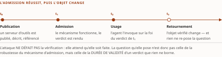
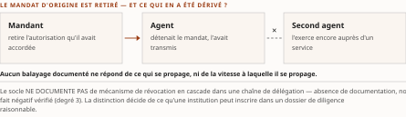

# Chapitre 20 — Usurpation, révocation et boucle défensive : du *rug-pull* à l'*agentic SOC*

*Livre II — Faire confiance : identité, délégation et fabrique de confiance.
Deuxième mouvement — la confiance hostile (ch. 19-20). **Dernier chapitre du mouvement.** Chapitre à
deux mouvements, issu de la fusion v0.20 des anciens ch. 21 et 22.*

| Champ | Valeur |
|---|---|
| **Statut** | **Brouillon de rédaction, non publiable** — pièce rédigée **hors portes** le 27 juillet 2026, sur instruction d'auteur, **G-3** et **G-4** alors ouvertes. ⚠ **G-3 a été franchie depuis, le 28 juillet 2026** (PRD v0.14, jalon J-IV-2) : *une porte franchie après coup solde l'infraction, elle ne la rattrape pas* — la pièce n'a pas été re-rédigée sur le socle consolidé. **G-4 demeure ouverte.** ⚠ **CA-IV-11 n'est pas satisfaite** : ce chapitre relève, comme le ch. 19, du régime de **relecture dédiée par un relecteur distinct**, dont le compte rendu doit être **déposé et nommé dans la pièce** ; **aucune n'a eu lieu**, et *l'attestation auto-délivrée est proscrite même exacte* — **rien ici ne doit être lu comme une attestation**. Voir **R-IV-33**, ouverte au ch. 19. **R-IV-16 et R-IV-17, ouvertes au ch. 12, valent pour tout le Livre** |
| **Date de gel** | **27 juillet 2026** — gel unique, **D-1 prise** (registre : [`gel-2026-07-27.md`](../PRD/gel-2026-07-27.md)). ⚠ **Volet résiduel de G-1 : son volet de FAITS est levé au socle le 28 juillet 2026** ([`gel-2026-07-28-volet-residuel.md`](../PRD/gel-2026-07-28-volet-residuel.md)), **non reporté sur cette pièce** — le corps n'a pas été re-collationné contre les entrées re-datées ; *ses deux autres volets restent dus*. Gels de source : **juin 2026** (Vol. I), **21 juillet 2026** (Vol. III). ⚠ **Ce chapitre est le plus exposé du Livre à la péremption produit** : trois offres de sécurité y sont datées, dont **deux en préversion** et **une sans date de disponibilité** ; et un **corpus de référence a changé de chemin de distribution et de convention de version** entre deux relevés |
| **Socle mobilisé** | ⚠ **Le socle consolidé existe depuis le 28 juillet 2026** — [`socle-consolide.md`](../PRD/socle-consolide.md), **v1.2, 159 entrées `S-001`…`S-159`** —, **mais aucun énoncé de cette pièce n'y a été re-résolu** : le corps cite les identifiants de ses volumes d'origine, que la table de correspondance n° 2 du socle (§5) résout. Résolution contre le **Vol. III *Monographie* ch. 13-15**, dont les entrées **F-01** à **F-07**, **F-10**, **F-12**, **F-13**, **F-15**, **F-16**, **F-18** à **F-21**, **F-25**, **F-26**, **F-36**, **F-38**, **F-43**, **F-46**, **F-47**, **F-52** à **F-58**, **F-73** et les entrées héritées **H-01**, **H-09**, **H-19**, **H-21**, **H-22**, **H-24** à **H-26**, **H-28**, **H-33** conservent leurs niveaux d'origine ; et contre le **Vol. I *Monographie* §7.5.1 à §7.5.4**, en **[C]**. ⚠ **Dix entrées mobilisées sont en [C]** — F-36, F-55, H-19, H-21, H-22, H-24, H-25, H-26, H-28, H-33 : elles corroborent, elles ne portent pas ; **H-33 est mobilisée sans marqueur littéral**, au tri prospectif des § 20.1 et § 20.7. ⚠ **Une onzième s'y est ajoutée à la refonte** : **F-56 est rétrogradée de `[B]` en `[C]`** — `S-102`, règle de composition, 28 juillet 2026 —, ce qui **tranche la contestation de niveau** que cette pièce avait remontée et **retire au § 20.10 tout appui central**. ⚠ **F-58 a été bornée à la même refonte** (`S-104`) : l'intitulé « le marché… » n'est plus porté par le socle. **F-26 conserve un vote incomplet.** **Aucun énoncé n'est central au sens de CA-IV-01** |
| **Garde-fous balayés** | ⚠ **Règle de comptage (décision 16), re-mesurée au commit du 28 juillet 2026** : *un cardinal déclaré ici porte sur le **marqueur littéral** de l'identifiant dans le **corps** — en-tête et note de statut exclus* ; les **applications non marquées** ne se dénombrent pas et relèvent du **domaine balayé**, déclaré sans cardinal. **Domaine balayé : les douze sections du corps, § 20.0 à § 20.11.** Vol. III — **R-02 : sept marqueurs**, § 20.2, § 20.3 (quatre), § 20.5 et § 20.9. **R-01, R-03 à R-14 : zéro marqueur.** ⚠ **Quatre garde-fous sont pourtant appliqués sur tout le domaine, sans marqueur littéral** : **R-12** (tout le chapitre est tenu au niveau du maillon, aucune recette), **R-14** (les absences portent leur degré, **treize marqueurs « degré 3 »** ; *le rang de ce cardinal au sein du Livre n'est pas re-mesuré, les autres pièces étant en cours de relecture*), **R-09** (le stade se dit à chaque mention) et **R-03** (§ 20.9, « entreprise agentique » jamais une catégorie établie). ⚠ **La restriction du garde-fou sur l'usurpation est renvoyée à son siège du ch. 19 § 19.6 aux § 20.0, § 20.9 et à la note de statut, mais la pièce n'écrit nulle part l'identifiant R-08** : le renvoi est **de section, non d'identifiant** — *écart mesuré, remonté et non corrigé ici* ; **même forme pour le garde-fou d'homonymie du Vol. II renvoyé au ch. 7 § 7.5 (§ 20.9), dont l'identifiant R-8 n'est pas davantage écrit**. ⚠ **Le § 20.9 porte l'unique occurrence d'une expression que R-13 proscrit nue** — elle y est **citée en langue originale, attribuée à sa source et renvoyée à son siège**, jamais employée en propre : *l'exigence est satisfaite par la forme, non par l'abstention*. Vol. II — **réserve de l'entrée F-01 du Vol. II (« cadre d'autorisation », jamais « sécurisé ») : zéro marqueur** — appliquée au § 20.1, et *le mot « sécurisé » n'est appliqué à aucun protocole du chapitre* ; ⚠ **les trois emplois littéraux de « F-01 » au corps — § 20.0, § 20.2 et § 20.3 — désignent l'entrée du VOL. III, non celle du Vol. II** : la mention est portée ici parce qu'un `F-xx` nu est indécidable entre deux socles (décision 7). **PRD Vol. II §8.2 (métriques et qualifications auto-déclarées) : zéro marqueur** — les métriques et qualifications des § 20.8 à § 20.10 sont néanmoins attribuées **à l'éditeur nommé** qui les avance, à chaque occurrence, *la parade d'anonymisation ne couvrant pas l'attribution* (décision 15). **PRD Vol. II §8.4 (quatre statuts de produit, dits à chaque mention) : zéro marqueur** ; les statuts sont portés au § 20.8, à chaque offre nommée. ⚠ **Même collision que pour « F-01 », et elle est portée ici pour la même raison** : *les deux emplois littéraux de « §8.4 » au corps — § 20.2 et Tableau 20.1 — désignent la **section de la spécification A2A v1.0.0**, non celle du PRD du Vol. II* (décision 7 ; la source du chapitre nomme elle-même cette collision). **R-1 à R-8 : zéro marqueur** |
| **Volumétrie cible** | ≈ **6 200 mots** de corps (§ 20.0 à § 20.11), **cible dérivée** de l'enveloppe du Livre (50 000 mots, TOC v0.30) au prorata des sections — **onze sections au plan pour deux mouvements**, le plus grand nombre du Livre. ☑ **Décompte publiable depuis G-2** ; **réel : 9 987 mots — ⚠ *re-mesurés le **2 septembre 2026** ; l'en-tête portait **9 623**, soit **+364** : la mesure n'avait pas suivi les passes de relecture*** par [`PRD/decompte.sh`](../PRD/decompte.sh) — **+55,2 %** (re-mesuré au terme de la **contre-relecture** du 28 juillet 2026). ⚠ **Valeurs antérieures conservées et périmées : 9 560 mots / +54,2 %** à la relecture du même jour, et **8 868 mots / +43,0 %** à la rédaction — *l'écart s'est creusé à chaque passe parce que chacune a **rétabli des bornes et des attributions**, aucune n'ayant rien retranché.* ⚠ **Le rang de cet écart au sein du Livre n'est pas re-mesuré** : les autres pièces sont en cours de relecture, et *un rang mesuré pendant que ses termes bougent est faux à la seconde où on le publie*. ⚠ La volumétrie du Livre est relevée au [`README.md`](README.md) du dossier et alimente **D-4** par **R-IV-17** |

> **Thèse** *(citée depuis le [`TOC.md`](../PRD/TOC.md) v0.30, entrée du chapitre 20, premier mouvement)* — la vérification à l'admission ne protège pas contre la dérive après admission (rug-pull d'un serveur d'outils ou d'un agent tiers) ; et chaque mécanisme spécifie l'émission avec soin et la révocation avec négligence — asymétrie qui reproduit l'histoire des PKI.

---

> **Thèse du second mouvement** *(citée depuis le [`TOC.md`](../PRD/TOC.md) v0.30, entrée du chapitre 20, second mouvement)* — la défense s'agentifie elle-même, et l'identité distingue un SOC agentique gouvernable d'un système auto-organisé ingouvernable — les agents défensifs sont les premiers à devoir porter le passeport du ch. 16.

⚠ **Deux thèses pour un chapitre : le ch. 20 est issu de la fusion v0.20 des anciens ch. 21 et 22**
(décision 11 du TOC). Les deux entrées y sont conservées **intégralement**, en deux mouvements portant
chacun son ancien titre et son ancienne thèse. *La présente pièce ne les fond pas en une troisième.*
⚠ **Les deux blocs ont été recollationnés mot à mot contre le TOC v0.30 le 28 juillet 2026, et ils sont
verbatim** — la décision 17 range le second parmi les trois blocs du corpus qu'une passe antérieure
avait **re-frappés plutôt que copiés** ; *l'écart est soldé, la mention se conserve au passé parce
qu'elle porte l'histoire que la citation corrigée efface.*

## § 20.0 — Introduction : la classe d'attaques dont la particularité est le moment

Le chapitre précédent a trié les attaques **par le maillon de la chaîne d'identité qui cède**. Celui-ci
en isole une classe dont la particularité **n'est pas le maillon mais le moment** : *l'attaque ne
défait pas la vérification, elle attend qu'elle soit faite.* Le mécanisme d'admission a fonctionné, le
verdict a été rendu — **et c'est ensuite que l'objet vérifié change**.

Le **retournement d'un serveur d'outils** (*rug-pull*) en est la forme nommée par le corpus ; la
question qu'il pose est celle de **la durée de validité d'un verdict que rien, dans les mécanismes du
premier mouvement, ne date ni ne réexamine**. De là le chapitre passe à ce que les spécifications
disent du **retrait** (§ 20.4 à § 20.6), puis au fait que **la défense elle-même s'agentifie** et
hérite des mêmes questions (§ 20.7 à § 20.11).

⚠ **Ce chapitre est un chapitre de composition sur son premier mouvement** : il n'a pas de source
nouvelle à citer et **consomme le ch. 15**, dont il reprend la vérification à l'admission de la carte
signée. *Chacune de ses affirmations est tracée soit vers une entrée du socle, soit vers un chapitre
amont nommé, soit marquée « Lecture de l'auteur ».* ⚠ **Traitement défensif exclusif** : ce qui est
exposé est **quel élément de la chaîne d'identité ou de mandat cède, et pourquoi** — *aucune recette
n'est reproduite.*

⚠ **Avertissement de portée, et il porte sur le premier terme du titre.** « Usurpation » est le mot que
le garde-fou correspondant a **restreint le 21 juillet 2026**, et **son siège est le ch. 19 § 19.6** :
la restriction n'est **pas reformulée ici**. Ce qui en découle pour le présent chapitre tient en une
phrase : *le socle ne documente pas l'usurpation du justificatif propre d'un agent — absence de
documentation, non fait négatif vérifié —, et cette absence **ne constitue pas une preuve de
sûreté**.* **Le chapitre traite donc de l'usurpation comme d'une propriété que les mécanismes examinés
ne procurent pas, jamais comme d'un fait divers qu'il rapporterait.**

Lecture de l'auteur — **ce que le socle établit** : la signature d'une carte porte sur une forme
canonicalisée d'un contenu, au regard d'une clé (F-01, F-02, **[A]**) ; aucun paramètre temporel ne
borne cette signature (F-03, **[A]**) ; la carte ne porte ni validité ni indicateur de révocation
(F-05, **[A]**) ; le vérificateur ne dispose d'aucun moyen prescrit d'établir le statut de la clé
(F-06, F-07, **[A]**) ; et sur une page nommée d'une révision nommée d'un second protocole, le type
qui décrit un outil **ne porte ni version, ni empreinte, ni signature** (F-52, **[B]**). **Ce qu'il
n'établit pas** : qu'un retournement ait été réalisé **contre un déploiement d'entreprise**, ni que la
vérification continue soit la **seule** réponse à cette classe, ni qu'une identité « statique » forme
une catégorie de mécanismes. *La composition proposée — un verdict d'admission que rien ne date est un
verdict sans terme, et une attaque qui opère après ce verdict n'a pas à le défaire — est une lecture.*

## § 20.1 — Le *rug-pull* documenté : ce que le corpus nomme, et à quel niveau de preuve

Le Vol. I a nommé l'objet avant que le Vol. III ne l'instruise, et **la trace de cette nomination est
explicite**. Il range le retournement parmi trois familles d'attaques visant les frontières, et le
décrit comme le cas où *« un serveur initialement bénin modifie après coup la définition d'un outil
approuvé, posant le problème de la chaîne d'approvisionnement MCP »* (H-25, **[C]** ; H-26, **[C]**, qui en
fait la **variante temporelle** de l'empoisonnement d'outils par les descriptions en langage naturel).
Le même volume en tire le verrou qui donne son sujet à ce chapitre : *« la vérification d'intégrité
**continue**, seule réponse robuste au retournement, demeure immature — la signature au moment de la
publication n'empêche pas une mutation ultérieure du comportement d'un serveur déjà approuvé, et aucun
mécanisme normalisé ne garantit que ce qui a été audité reste ce qui s'exécute »* (H-25, **[C]**,
citation vérifiée à sa source).

⚠ **Trois précautions accompagnent cette reprise, et elles décident de ce que le chapitre peut en
faire.** *(1)* **Le niveau** : ces deux entrées sont en **[C]** — *la source est identifiée, son
contenu n'a pas subi le régime de vérification du Vol. III* —, et **une affirmation tracée vers une
entrée [C] n'est pas centrale, ou n'est pas rédigée**. *(2)* **Une clause d'exclusivité, et elle
appartient au texte cité, non à la somme** : « seule réponse robuste » est **un classement**, qui
présuppose un balayage des réponses possibles que rien ne documente — *la formule est attribuée au
Vol. I et reprise entre guillemets ; elle n'est reconduite à aucun moment comme énoncé du présent
chapitre.* *(3)* **Ce que le socle propre couvre effectivement** : l'entrée qui documente
l'empoisonnement d'un outil au niveau du corpus **MITRE ATLAS** vise **la publication**, non la
mutation postérieure : la technique **AML.T0104** relève de la tactique *Resource Development*, en
amont de toute vérification d'identité (F-13, **[A]** ; établie au ch. 19 § 19.1). ⚠ *Le
retournement, lui, opère **en aval** de la vérification — c'est la différence qui fait le sujet de
ce chapitre, et elle n'est pas couverte par cette entrée.* **Le socle ne documente pas de technique
de ce référentiel visant la mutation d'une définition d'outil après approbation — degré 3.**

**Ce que le socle propre établit du mécanisme, il l'établit sur le texte d'un protocole.** Le *Model
Context Protocol* est une interface client-serveur dotée d'un **cadre d'autorisation** fondé sur OAuth,
dont la gouvernance a été transférée en décembre 2025 à l'**Agentic AI Foundation** (H-09, **[A]**).
⚠ *Formule imposée : « cadre d'autorisation », jamais « sécurisé ».* Sur la page « Tools » de la
**révision 2025-11-25**, l'énumération du type de données correspondant compte **huit champs**, **dont
aucun n'exprime une version, une empreinte cryptographique ou une signature** (F-52, **[B]**, fait
négatif **VÉRIFIÉ**, degré 1, **borné à cette page de cette révision**). La même entrée porte le second
volet du balayage : sur la page « Authorization » de la même révision, **les chaînes de révocation sont
absentes**, et **la RFC 7009, qui spécifie la révocation de jeton, ne figure pas parmi les documents de
référence** énumérés.

⚠ **Deux bornes que l'entrée de socle a perdues sont rétablies ici, parce qu'un degré 1 dont le
périmètre n'est pas nommé n'est pas revérifiable.** Les huit champs — *name*, *title*, *description*,
*icons*, *inputSchema*, *outputSchema*, *annotations*, *execution* — sont énumérés au rapport de lot, de
même que les six chaînes cherchées et absentes — *hash*, *signature*, *integrity*, *attestation*,
*checksum*, *digest* ; ⚠ *une septième, `sign`, n'a pas été retenue comme discriminante parce qu'elle
figure comme sous-chaîne d'un mot courant.* Le balayage porte en outre sur **la conversion renvoyée par
un outil de récupération distante**, non sur la source brute, et il est **borné à une page** :
*l'élargir en « ce protocole ne traite pas l'intégrité des outils » en ferait un négatif de corpus que
le contrôle de bornage écarte.*

**Le maillon qui cède, au niveau architectural.** *La définition d'un outil est le support de la
décision d'invocation* : c'est elle que le client présente et que l'utilisateur ou la politique
approuve. ⚠ **La même page prévoit que la liste des outils change à l'exécution** — capacité déclarée,
notification de changement de liste, puis nouvelle demande de liste — **sans prescrire d'étape de
comparaison, de re-consentement ni de vérification d'intégrité** ; et elle renvoie la décision au
client par une réserve — « clients **MUST** consider tool annotations to be untrusted unless they come
from trusted servers » —, **sans définir comment cette confiance s'établit ni comment elle se réévalue
après un changement**. *(Source primaire ouverte et citée hors
socle, non versée sous cette forme.)* ⚠ **La formulation exacte importe et elle est imposée par le
rapport** : *la spécification **ne prescrit pas** de contrôle d'intégrité ; écrire qu'elle « ne permet
pas » d'en établir un hors protocole serait faux.*

Lecture de l'auteur — *le retournement n'exploite aucun défaut du mécanisme d'admission : il exploite
le fait que la décision d'invocation s'appuie sur un objet que le protocole **autorise à changer après
l'octroi de la confiance**, sans prescrire de le relier à ce qui avait été consenti.* **Ce que le socle
établit** : l'énumération des huit champs et l'absence des six chaînes cherchées, sur une page nommée
d'une révision nommée (F-52) ; l'existence d'une notification de changement de liste et de la réserve
sur les annotations, **hors socle**. **Ce qu'il n'établit pas** : qu'un tel remplacement ait été
**observé en production**, ni qu'aucune implémentation ne compare les définitions successives. *Le
chapitre décrit un maillon, non un incident.*

⚠ **Ce que le corpus porte comme identifiants de vulnérabilité ne documente pas cette classe.** Quatre
sont au socle — **CVE-2025-32711** (dite *EchoLeak*), **CVE-2025-6514** (`mcp-remote`),
**CVE-2025-12420** et **CVE-2026-55255** (F-26, **[B]**) ; ⚠ **leur vote adversarial n'a pas pu être
complété, et un vote incomplet n'est pas un vote favorable** — *ils illustrent, ils ne portent aucun
énoncé central.* Le Vol. I n'en range d'ailleurs que **deux**, sous **deux familles distinctes** de
celle du retournement — CVE-2025-32711 sous la **transitivité de la confiance**, CVE-2025-6514 sous les
**vulnérabilités d'implémentation des composants de la pile** (H-26, **[C]**). **Le socle ne documente
ni identifiant ni incident public daté qui réaliserait un retournement contre un déploiement
d'entreprise — degré 3** ; ⚠ *cette absence s'interprète avec la prudence énoncée au § 20.0, non comme
une mesure de la rareté du vecteur.*

⚠ **Relève du plan, portée ici et non consommée.** Le retournement a **un grain plus fin que le
serveur d'outils** : l'**extension déclarative du harnais** — fichier d'instructions, serveur ajouté
par simple configuration —, *dont l'installation n'est pas un acte de compilation* et dont la
révocation n'a, à cette date, **aucun mécanisme relevé**. ⚠ **À instruire à la source primaire** ;
l'incident public candidat est décrit au **ch. 47 § 47.7**, qui l'instruit et **déclare son propre
défaut d'attribution** — *ni identifiant, ni nom d'extension, ni nom de harnais, degré 3*. ⚠ *Cette
pièce n'a pas de quoi lui en donner un.* **Aucun énoncé du présent chapitre ne s'y adosse.**

⚠ **Une réserve temporelle ferme cette section.** Tout ce qui précède du côté du *Model Context
Protocol* est **borné à la révision 2025-11-25**. Une **révision majeure est annoncée au brouillon** —
protocole sans état, retrait de l'en-tête de session —, et la revalidation en **confirme la substance
sans en confirmer la date**. ⚠ *Le tri prospectif — dont le siège dans la somme est le
**ch. 49 § 49.0**, et qui n'est pas redéfini ici — ne peut pas être arrêté ici : **PROGRAMMÉ** suppose
un engagement daté portant sa source et sa date.* **Le chapitre écrit donc « annoncé au
brouillon » et s'en tient là** ; les constats sont **à rejouer sur la révision publiée avant toute
reprise**, et **ils ne valent pas par avance pour elle**.

## § 20.2 — Vérification continue et vérification à l'admission

*La question que pose le retournement n'est pas de savoir si la vérification a eu lieu. Elle est de
savoir **combien de temps son verdict vaut**.*

**Ce que l'admission vérifie, et pour quelle durée.** Le ch. 15 § 15.1.1 l'a énoncé : *le détenteur
d'une clé désignée par un identifiant de clé a signé une forme canonicalisée d'une carte donnée*
(F-01, F-02). **L'intégrité de ce contenu au regard de cette clé est démontrée ; rien d'autre ne
l'est** (R-02). Or l'énumération normative des paramètres de l'en-tête protégé **ne comporte aucun
paramètre temporel** : **la signature ne périme que par sa clé** (F-03, **[A]**, degré 1). La carte, de
son côté, **ne porte ni date d'émission, ni expiration, ni fenêtre de validité, ni indicateur de
révocation** parmi ses quatorze champs (F-05, **[A]**, degré 1).

**Et le statut de la clé, terme que le socle relève, n'est pas interrogeable.** La §8.4 de la
spécification **A2A v1.0.0** — version publiée le 12 mars 2026 (F-12, **[B]**) —, section consacrée à
la signature de la carte, **ne mentionne ni liste de
révocation, ni protocole d'état en ligne, ni chaîne de certificats, ni point de terminaison de statut,
ni délai de revalidation**, et sa procédure de vérification en six étapes **ne comporte aucune étape de
contrôle de statut ou de fraîcheur** (F-06, **[A]**, degré 1) ; l'interdiction d'employer une clé
expirée ou révoquée y est pourtant posée **au niveau normatif le plus fort**, **sans aucun moyen
permettant au client de l'établir** (F-07, **[A]**). ⚠ **La borne tient à l'énumération et à la section
balayées** : **le socle ne documente pas d'autre condition de péremption du verdict d'admission que la
péremption de la clé — degré 3.**

**S'y ajoute que l'admission elle-même est facultative.** Les cartes **MAY** être signées ; les clients
**SHOULD** vérifier au moins une signature (F-04, **[A]**). ⚠ *La discussion sur la durée de validité
d'un verdict suppose qu'un verdict ait été rendu ; le mécanisme n'oblige pas à le rendre.*

**Le corpus de sécurité nomme l'exigence inverse, et il la nomme comme exigence, non comme mécanisme.**
Le rapport *State of Agentic AI Security and Governance*, **version 2.01 de juin 2026**, publié par
l'**OWASP Gen AI Security Project**, distingue l'identité non humaine — qui « verifies that a credential
is authorized to connect » — de l'identité d'agent, laquelle « has to verify what the holder is doing
with that authorization, **continuously** » (F-20, **[A]**, citation en langue originale). ⚠ **Deux
réserves d'attribution** : la formule est **celle de ce rapport, à sa date et à sa version**, non un
consensus du domaine ; et le rapport reprend par ailleurs **des métriques auto-déclarées d'éditeur**,
dont le présent chapitre **ne reprend aucune**. *Ce que
l'entrée établit est qu'un référentiel daté **énonce** la vérification continue comme la propriété
distinctive de l'identité d'agent. Elle n'établit aucun mécanisme qui la réaliserait, et l'écart entre
les deux est l'objet du § 20.3.*

**Le précédent qui a déjà instruit le coût de la fraîcheur refroidit l'attente.** Les infrastructures à
clé publique ont **spécifié** la révocation, et leurs textes normatifs **déclarent eux-mêmes leurs
limites** — granularité bornée à la période d'émission de la liste, état « good » qui ne signifie pas
nécessairement qu'un certificat ait jamais été émis (F-53, **[B]**). Mieux : **Let's Encrypt a arrêté
ses répondeurs de statut en ligne le 6 août 2025**, au terme d'un calendrier en trois étapes datées
annoncé le 5 décembre 2024, et **ne publie plus son information de révocation que par listes**
(F-54, **[B]**). ⚠ **Ces trois pièces sont mobilisées en corroboration ; leur siège est le § 20.5.**
⚠ **Le socle ne documente pas de jugement d'insoutenabilité économique de la vérification de statut en
temps quasi réel — degré 3** ; et **la portée du dernier fait reste étroite — un exploitant, ses
décisions datées.**

**Du côté agentique, l'état prescrit existe sans sa fraîcheur.** Le brouillon de registre de la **Cloud
Security Alliance** — *Agent Registry Specification*, document déclaré brouillon, daté du 27 mars 2026,
hébergé dans l'espace de laboratoire de l'organisme (F-38, **[A]**) — prescrit **quatre états d'agent**
et **impose au pair de rejeter la requête d'un agent suspendu ou révoqué**, ⚠ **sans fixer aucun délai
de propagation ni budget de fraîcheur** aux sections consultées. Le document du service d'annuaire
d'**AGNTCY** — l'*Internet-Draft* `draft-mp-agntcy-ads`, de soumission individuelle (F-43, **[B]**) —
**présente** l'adressage par contenu comme fondant l'intégrité de ses enregistrements, **sans en fournir
de démonstration**, et **ne comporte aucune occurrence des chaînes de révocation cherchées** (F-55,
**[C]**, degré 1). ⚠ **Cette entrée est en [C] : elle corrobore, elle ne porte pas** ; et **son balayage
a été mené sur la révision -01, que le socle sait supplantée par la -02 du 6 juillet 2026 et non
rebalayée**.

Lecture de l'auteur — *un verdict d'admission dont ni la portée temporelle ni la condition de
péremption ne sont exprimées par le mécanisme n'est pas un verdict daté : c'est une décision qui se
prolonge par défaut.* **Ce qu'il n'établit pas** : qu'un déploiement ne puisse pas imposer une
revérification périodique **hors protocole**, ni que la vérification continue soit techniquement ou
économiquement réalisable à l'échelle d'un parc. ⚠ *La grille du ch. 14 avait déjà inscrit l'exigence
dans sa question Q-C — une chaîne interrogeable à l'instant t, et non seulement à l'admission — et le
ch. 15 § 15.1.4 a laissé cette case **vide au degré 3**. **Le présent chapitre ne convertit pas cette
case vide en verdict.***

## § 20.3 — L'attestation d'intégrité à l'exécution : état des mécanismes

*Existe-t-il un mécanisme documenté par lequel un vérificateur établit, **à l'exécution**, que ce qui
s'exécute est ce qui avait été vérifié ?* L'état des lieux tient en **trois constats de portées très
inégales**, et le troisième est **un trou déclaré**.

**Côté protocole, le constat est négatif et il est borné.** Sur la page « Tools » de la révision
2025-11-25, **aucun des huit champs du type qui décrit un outil ne porte de version, d'empreinte ou
de signature** (F-52, **[B]**, degré 1). *Il n'existe donc, dans ce que le lot a ouvert, aucun
élément du type auquel un vérificateur pourrait rattacher un contrôle d'intégrité.* Du côté de la
carte signée, le dispositif existe mais **son objet est autre** : la signature couvre un contenu
canonicalisé **à un instant donné** (F-01, F-02) et **ne comporte aucun paramètre qui la
rattacherait à une exécution ultérieure** (F-03). ⚠ **C'est ici que la convention cardinale commande
l'énoncé** : *la signature au moment de la publication **démontre** l'intégrité d'un contenu au
regard d'une clé ; elle **ne démontre pas** l'intégrité de ce qui s'exécute ensuite* (R-02). **Les
deux propositions ne sont pas des degrés d'une même affirmation ; elles portent sur deux objets
différents, et c'est l'assimilation des deux qui rend le retournement invisible.**

**Côté littérature, une proposition existe, et son statut interdit d'en faire un mécanisme.** La
préimpression **arXiv 2506.01333v1**, **soumise le 2 juin 2025**, expose l'interface de définition
d'outil étendue **ETDI** (*Enhanced Tool Definition Interface*) ; ses auteurs la présentent comme
visant à contrer le retournement et l'empoisonnement d'outils au moyen d'une vérification
cryptographique d'identité, de définitions versionnées et d'une gestion explicite des permissions. ⚠
Sa notice **ne porte aucune référence de publication en revue ni en actes** — version unique, aucun
champ de référence de journal. *(Source primaire ouverte et citée hors socle, non versée ;
l'identifiant est porté ici parce qu'un critère d'instruction sans identifiant est inexécutable —
décision 15b-iii.)* ⚠ **Trois réserves s'attachent à cette citation et aucune n'est facultative.**
*(1)* **Le texte intégral n'a pas été ouvert** : rien de ce que sa construction démontrerait, de son
modèle de menace ou de ses hypothèses n'est établi — **degré 3**. *(2)* **Ce qui est rapporté est ce
que ses auteurs annoncent, non ce que leur construction établit** (R-02). *(3)* Il s'agit d'une
**proposition d'auteurs en préimpression**, ni d'une extension adoptée, ni de la position du projet de
gouvernance : *tout énoncé sur son aboutissement relève du **SPÉCULATIF***.

⚠ **Écart avec l'entrée héritée, et il est de fond.** Le Vol. I écrit que cette mitigation *« répond à
ce vecteur »* (H-25, **[C]**). **Cette qualification par la finalité annoncée est précisément ce que
R-02 proscrit**, et le contrôle de bornage du Vol. III l'a corrigée pour ce motif — *promesse non
démontrée*. **Le présent chapitre suit la forme corrigée, non la formulation du Vol. I, et déclare
l'écart plutôt que de l'arbitrer.**

**Côté registre, un mécanisme d'intégrité est présenté, et le socle en borne exactement l'apport.**
Le document du service d'annuaire d'AGNTCY **présente** l'adressage par contenu comme fondant
l'intégrité — *un identifiant dérivé du contenu, une modification produisant un identifiant
différent* —, **sans en fournir de démonstration ni renvoyer à une construction qui l'établirait**
(F-55, **[C]**, degré 1 ; R-02). ⚠ **À supposer même la propriété acquise, elle ne documenterait pas
la validité courante de l'enregistrement** : *un enregistrement immuable ne se révoque pas, il ne
peut qu'être supplanté, et le document ne prescrit pas comment un lecteur apprend qu'il l'a été.* ⚠
**Cette conséquence architecturale est une lecture consignée en réserve au rapport de lot, non un
énoncé du document balayé** ; elle est reprise **comme telle**, et **l'entrée étant en [C], elle
corrobore et ne porte pas**.

**Côté chaîne d'approvisionnement, rien n'a été instruit, et c'est déclaré comme tel.** Le lot consigne
parmi ses échecs que la recherche d'un mécanisme normalisé d'attestation d'intégrité à l'exécution
**au-delà du protocole examiné n'a pas été menée** : registre officiel, mécanismes de provenance de
paquets — signature, attestations de construction — et catalogues d'éditeurs **n'ont pas été ouverts**.
**Le socle ne documente ni l'existence ni l'absence d'un tel mécanisme du côté de la chaîne
d'approvisionnement — degré 3.** ⚠ *Il ne s'ensuit donc pas qu'un tel mécanisme n'existe pas.*

## § 20.4 — L'inventaire de la révocation, mécanisme par mécanisme

*Émettre une identité et la retirer sont deux gestes d'inégale dignité éditoriale.* Le premier occupe
des sections entières de spécification — formats, canonicalisation, algorithmes, ordre des opérations.
**Le second, quand il figure, tient en une phrase de recommandation ou en une valeur d'énumération.**

⚠ **Avertissement de portée, et il porte sur un superlatif que ce chapitre n'écrit pas.** « Le
mécanisme le moins spécifié de la pile » **affirmerait un classement** : **le socle ne documente pas de
comparaison des mécanismes de la pile quant à leur degré de spécification — degré 3**. Le lot déclare
d'ailleurs son inventaire **non exhaustif** : l'identité de charge de travail **SPIFFE** et ses
justificatifs, les listes d'état de justificatifs du **W3C**, les profils **OpenID** pour accréditations
vérifiables, les jetons de transaction et les mécanismes propriétaires **n'ont pas été instruits sous
l'angle de la révocation** — *une liste de sources à instruire qui ne les nomme pas est un critère
inexécutable* (décision 15b-iii).
**Le chapitre écrit donc des faits positifs et bornés, texte par texte.**

| Mécanisme | Ce que le texte prescrit en matière de révocation | Borne du relevé | Entrée |
|---|---|---|---|
| **Carte signée A2A — la carte** | **rien** : les quatorze champs n'expriment ni date d'émission, ni expiration, ni fenêtre de validité, ni indicateur de révocation ; l'en-tête protégé n'admet aucun paramètre temporel | définition normative de la spécification A2A v1.0.0 ; énumération normative de l'en-tête | **F-05**, **F-03** **[A, degré 1]** |
| **Carte signée A2A — la clé** | interdiction au niveau **MUST NOT** d'employer une clé expirée ou révoquée, **sans mécanisme permettant au client de l'établir** ; ni liste de révocation, ni protocole d'état en ligne, ni point de terminaison de statut, ni délai de revalidation ; **aucune étape de contrôle de fraîcheur** dans la procédure en six étapes | §8.4 de la spécification A2A v1.0.0 | **F-07**, **F-06** **[A]** |
| **Carte signée A2A — la rotation** | plusieurs signatures **MAY** coexister pour permettre la rotation ; **aucune procédure de retrait d'une clé compromise** | même section | **F-10** **[B]** |
| **Jeton OAuth — RFC 7009** | point de terminaison de révocation spécifié ; l'invalidation des jetons d'accès issus de la même autorisation est en **SHOULD**, non en MUST ; si le serveur ne prend pas en charge la révocation des jetons d'accès, **ceux-ci ne sont pas immédiatement invalidés** | §2.1 et §5 | **F-53** **[B]** |
| **Jeton — MCP, révision 2025-11-25, page « Authorization »** | **rien sous les termes cherchés** : les chaînes de révocation sont absentes ; la RFC 7009 ne figure pas parmi les documents de référence | **une page d'une révision**, balayée le 21 juillet 2026 | **F-52** **[B, degré 1]** |
| **Entrée de registre — brouillon CSA du 27 mars 2026** | quatre états d'agent et rejet imposé au pair ; ⚠ **aucun délai de propagation ni budget de fraîcheur** aux sections consultées | sections des états et de la conduite du pair ; document portant son statut de brouillon, hébergé en espace de laboratoire | **F-55** **[C, degré 1]** ; statut par **F-38** **[A]** |
| **Entrée de registre — annuaire AGNTCY** | intégrité fondée sur l'adressage par contenu, **présentée sans démonstration** ; aucune occurrence des chaînes de révocation cherchées | *Internet-Draft* `draft-mp-agntcy-ads`, de **soumission individuelle** ; balayage sur la **révision -01, supplantée par la -02 du 6 juillet 2026, non rebalayée** | **F-55** **[C]**, **F-43** **[B, degré 2]** |
| **Mandat de paiement AP2** | attributs temporels d'émission et d'échéance, sérialisation, attribut de type versionné ; ⚠ **le socle ne documente pas de mécanisme de retrait — degré 3** | version v0.2.0 du 28 avril 2026 | **F-46** **[B]** |
| **Délégation — RFC 8693** | l'attribut `act` exprime qu'une délégation a eu lieu et identifie la partie agissante ; la §1 place **hors périmètre** la sécurité des jetons eux-mêmes | §1 et §4.1 | **F-47** **[A]** |
| **Jeton OAuth — RFC 7662** ⚠ *(rangée ajoutée le 30 juillet 2026)* | **l'interrogation d'état, versant vérificateur** : un point de terminaison d'**introspection** permet à une ressource protégée de demander au serveur d'autorisation si un jeton est **actif**, et d'en obtenir les métadonnées. ⚠ **C'est le seul mécanisme de l'inventaire qui réponde à la question du vérificateur plutôt qu'à celle de l'émetteur** — *RFC 7009 retire, RFC 7662 constate* | *OAuth 2.0 Token Introspection*, **RFC 7662**, J. Richer (éd.), **octobre 2015**, **Proposed Standard** — page du dépôt de normes lue le 30 juillet 2026 | **hors socle**, versé comme **relevé daté** ⚠ |

: Tableau 20.1 — L'inventaire de la révocation, mécanisme par mécanisme, avec sa borne de lecture, au 21 juillet 2026 — ⚠ **augmenté d'une rangée le 30 juillet 2026**, dont la borne de lecture est celle de sa propre date.

☑ ⚠ **La onzième rangée comble une omission canonique relevée par l'arbitrage externe, et sa portée
se borne en trois temps.** *(1)* **Elle change la lecture de l'inventaire** : les dix rangées
d'origine se lisaient toutes du côté de **l'émetteur** — ce qu'une spécification prévoit pour
*retirer* un justificatif —, et le § 20.4 en tirait l'asymétrie *émission soignée / révocation
négligée*. **RFC 7662 occupe l'autre versant** : elle ne retire rien, elle permet à celui qui reçoit
un jeton de **demander s'il vaut encore**. *L'asymétrie tient — mais elle n'était pas complète, et
c'est l'omission qui la rendait plus nette qu'elle n'est.* *(2)* ⚠ **Elle n'est PAS versée au socle**
et n'entre à aucun niveau : la passe a lu **la page du dépôt de normes** — numéro, titre, éditeur,
date, statut, objet du mécanisme —, **non le texte de la RFC** ; *lire une fiche n'est pas extraire
un document*, et un **relevé daté** n'est pas une entrée. *(3)* ⚠ **Elle ne comble aucune des
absences que l'inventaire établit** : ni la carte A2A, ni la page d'autorisation balayée le 21 juillet
2026 ne référencent RFC 7662 — *le mécanisme existe depuis 2015 dans l'écosystème OAuth, et son
absence des spécifications agentiques est précisément ce que l'inventaire mesure.* **La rangée
n'atténue donc pas le constat : elle en durcit la lecture** — *ce qui manque à la couche agentique
n'est pas un mécanisme à inventer, c'en est un à reprendre.*

**Trois formes distinctes se dégagent, et les confondre ferait perdre ce que l'inventaire a de plus
utile.**

**La première est le silence.** Quatorze champs de carte sans validité ni retrait ; un en-tête protégé
sans paramètre temporel ; une page d'autorisation où trois chaînes de révocation sont absentes et où
la RFC qui la spécifie n'est pas citée. ⚠ **Ce dernier constat porte sa borne, et elle est étroite** :
*une page nommée d'une révision nommée, balayée une fois, sur une conversion.* **L'élargir en « ce
protocole ne traite pas la révocation » le transformerait en un fait négatif de corpus.**

**La deuxième est l'interdiction sans le moyen.** L'obligation est portée par **MUST NOT**, et la
section balayée **ne mentionne aucun dispositif permettant d'établir si une clé l'est**. ⚠ **L'obligation
porte en outre sur la clé, non sur la carte** : *une carte demeurée valide, signée par une clé retirée,
relève d'une situation que le texte ne décrit pas.* **Des trois formes, c'est celle qui n'est pas un
oubli : c'est une obligation dont la vérifiabilité est renvoyée hors du protocole.** La rotation, elle,
est outillée ; **le retrait d'une clé compromise ne l'est pas** (F-10). *Un mécanisme qui sait
remplacer sans savoir retirer accumule ses identités successives au lieu de les substituer.*

**La troisième est l'état sans la fraîcheur.** Un brouillon prescrit quatre états, dont *révoqué*, et
impose au pair de rejeter — **puis ne fixe ni délai de propagation, ni budget de latence, ni durée de
validité de cache**. ⚠ **Cette ligne entre en corroboration et non comme fait central** : l'entrée est
en **[C]**, et *son volet négatif repose sur un balayage exécuté par un outil de récupération plutôt
que sur une lecture du texte intégral.* **Prescrire un état de révocation et prescrire sa fraîcheur
sont deux actes distincts, et seul le premier est ici documenté.**

⚠ **L'entrée héritée qui a ouvert ce dossier le disait déjà, et sa réserve tient** : le socle du
Vol. II **ne documentait ni l'ancrage de confiance, ni la révocation, ni la gouvernance des clés** des
cartes signées (H-01, **[A]**). *L'inventaire ci-dessus ne comble pas cette réserve — il la déplace du
corpus vers les textes eux-mêmes.*

## § 20.5 — Le précédent PKI : ce que les listes de révocation et le statut en ligne ont déjà appris

L'infrastructure à clé publique spécifie la révocation dans **deux documents normatifs**. ⚠ *Aucun
classement n'est proposé entre ces textes et ceux du § 20.4, et le relevé ne prétend pas énumérer tous
les mécanismes de révocation de cette infrastructure* : **ce qui rend ces deux-là instructifs est
ailleurs — ils documentent, dans leur propre corps, les limites de ce qu'un mécanisme de révocation
spécifié atteint.**

**Le premier enseignement est la latence structurelle, reconnue par la norme elle-même.** La RFC
5280, à sa section 3.3, borne la granularité temporelle de la révocation par liste **à la période
d'émission de cette liste**, qu'elle donne pour pouvant aller **jusqu'à une heure, un jour ou une
semaine** (F-53, **[B]**). *Le texte normatif ne prétend donc pas à l'immédiateté : il déclare son
propre plafond.* ⚠ **Une liste de révocation démontre l'état de révocation au moment de son émission
; elle ne le démontre pas à l'instant de la vérification** (R-02).

**Le second porte sur ce qu'une réponse de statut établit, et sur ce qu'elle n'établit pas.** La RFC
6960, à sa section 2.2, énonce que l'état « good » **ne signifie pas nécessairement** que le
certificat interrogé ait jamais été émis, ni que l'instant de production de la réponse soit compris
dans sa période de validité (F-53). ⚠ **Autrement dit, et c'est la formulation que la somme impose**
: *un point de terminaison de statut **démontre l'absence d'inscription au registre de révocation du
répondeur interrogé** ; il ne documente ni l'émission, ni la validité, ni l'identité.* **La
transposition est immédiate et c'est le principal apport de cette section : un registre d'agents qui
répond « actif » ne démontre pas davantage. Il démontre qu'aucune entrée contraire ne figure à ce
registre-là, au moment où il a répondu.**

**Le troisième est le moins attendu : un opérateur qui exploitait le mécanisme de fraîcheur l'a
retiré.** **Let's Encrypt** a arrêté ses répondeurs de statut en ligne le
**6 août 2025**, au terme d'un calendrier annoncé le **5 décembre 2024**, et **ne publie depuis son
information de révocation que par listes** (F-54, **[B]**). *Un opérateur d'autorité de certification
du web public a donc, en connaissance de cause, abandonné le mécanisme de fraîcheur pour revenir au
mécanisme de latence bornée.* ⚠ **Les motifs déclarés ne figurent pas à l'entrée de socle** : *ils sont
portés par le rapport de lot — protection de la vie privée **et** charge opérationnelle — et cités à ce
titre.*

⚠ **La portée de ce fait est étroite et doit le rester : un opérateur, ses décisions datées.** *Il
ne s'en déduit ni un abandon général du protocole — la RFC 6960 n'est ni retirée ni rendue obsolète
— ni une tendance de l'industrie.* Le lot est explicite : le vote du forum des autorités et des
navigateurs, la révocation de masse consécutive aux vulnérabilités historiques et le mouvement vers
les certificats de courte durée **n'ont pas été instruits**. **Le chapitre s'appuie sur trois pièces
; il ne revendique pas de tendance.**

**Reste la contrepartie architecturale, et elle est déjà instanciée.** **Google Cloud** date au 22 avril
2026 la disponibilité générale de son identité d'agent dans son service de gestion des identités et des
accès, tout en plaçant son gestionnaire d'authentification **en préversion à la même date** ; le
mécanisme repose sur une identité de charge de travail **SPIFFE** matérialisée par des certificats X.509
**d'une durée de vie de vingt-quatre heures** (F-36, **[C]**). ⚠ **Entrée en [C] : illustration, jamais
fait central** ; *cas d'instanciation documenté par son éditeur, avec sa date et son statut, jamais
recommandation.* ⚠ Le socle de cette famille d'identité est **posé au ch. 3**.

Lecture de l'auteur — *une durée de vie courte est une **substitution** à la révocation et non son
implémentation : elle borne la fenêtre d'exposition **sans jamais permettre d'agir dans cette
fenêtre**.* **Ce que le socle établit** : la latence déclarée de la liste, la portée limitée de la
réponse de statut, le retrait daté d'un service par un exploitant nommé, et l'existence d'un
justificatif d'agent à vingt-quatre heures chez un éditeur nommé. **Ce qu'il n'établit pas** : que
la durée courte soit adoptée **en réponse** à un coût de révocation, qu'elle soit une pratique
répandue, ni qu'aucun autre arbitrage n'existe. *Aucune entrée ne relie ces quatre faits entre eux ;
le lien est proposé ici, et il se refuse sans qu'aucun d'eux tombe.*

## § 20.6 — La révocation en cascade dans une chaîne de délégation

*Une chaîne de mandat comporte plusieurs sauts. Un agent reçoit une autorisation d'un mandant, la
transmet à un second agent, qui l'exerce auprès d'un service. **Lorsque le mandat d'origine est retiré,
que devient ce qui en a été dérivé ?***

⚠ **Le socle ne documente pas de mécanisme de révocation en cascade dans une chaîne de délégation —
absence de documentation, non fait négatif vérifié** (degré 3). **La distinction n'est pas rhétorique :
elle décide de ce qu'une institution peut inscrire dans un dossier de diligence raisonnable.** *Aucun
balayage documenté n'a établi qu'un tel mécanisme n'existe pas, et aucune entrée ne porte de réserve
explicite d'absence à ce sujet.* **Il ne s'ensuit donc pas qu'un tel mécanisme n'existe pas.**

**Ce que le socle établit borne le problème par trois côtés.**

**Ce qui s'en rapproche le plus est une recommandation à un seul saut.** Le RFC 7009 formule
l'invalidation des jetons d'accès issus de la même autorisation comme un **SHOULD**, et énonce que si
le serveur ne prend pas en charge cette révocation, **ceux-ci ne sont pas immédiatement invalidés**
(F-53). ⚠ *C'est un mécanisme de propagation **à l'intérieur d'une même autorisation**, conditionné à
une capacité facultative du serveur — non une propagation le long d'une chaîne d'acteurs.*

**Le mécanisme qui nomme la chaîne décline le jeton qui la porte.** La RFC 8693 définit à sa §4.1
l'attribut `act`, qui exprime la délégation et identifie la partie agissante ; sa §1 place
**explicitement hors périmètre** la sécurité des jetons eux-mêmes (F-47, **[A]**). ⚠ *La délégation est
donc exprimable ; sa révocation n'est pas dans le champ du document qui l'exprime.*

**Et l'incident public daté que le socle porte documente une révocation de masse, non une cascade.**
Lors de la campagne **UNC6395**, du **8 août au 18 août 2025 au moins**, des jetons OAuth compromis
d'une application tierce ont donné accès à des instances **Salesforce**, et **l'ensemble des jetons
a été révoqué le 20 août 2025** (F-21, **[A]** ; recension établie au ch. 19 § 19.1). ⚠ **Le maillon
qui cède est identifié au niveau architectural** — *le jeton porteur n'est lié ni à l'appelant, ni à
un appareil, ni à une session.* **La réponse observée est une invalidation globale.**

Lecture de l'auteur — *cette invalidation indifférenciée tient lieu de cascade, faute de mécanisme
documenté qui en exercerait une.* **Ce que le socle établit** : les dates, le périmètre de la
révocation et le maillon qui cède. **Ce qu'il n'établit pas** : **les motifs de la décision de révoquer
l'ensemble**, ni les options de révocation sélective dont l'opérateur disposait. ⚠ **Aucune entrée ne
documente que cette révocation de masse ait été un pis-aller** ; *l'imputer à une incapacité technique
reviendrait à convertir une absence de documentation en fait négatif.*

⚠ **Deux entrées héritées situent la question sans la trancher, et leur niveau interdit qu'elles la
portent** — la traçabilité des décisions déléguées **au-delà de deux sauts**, rangée parmi les problèmes
ouverts (H-28, **[C]**), et la **révocation quasi-temps réel d'une autorité déléguée**, nommée parmi les
verrous d'une infrastructure inter-domaines (H-19, **[C]**) : *elles indiquent que la question était
déjà formulée en juin 2026 ; elles n'indiquent pas qu'elle ait été instruite.* ⚠ **Une passe antérieure
citait ici H-29 — l'entrée du verrou d'origine, dont le siège est l'avant-propos —, renvoi corrigé au
28 juillet 2026 contre le texte de la source.**

⚠ **La lacune est ouverte et non instruite** : *existe-t-il un mécanisme documenté par lequel la
révocation d'un mandat se propage aux autorisations qui en ont été dérivées le long d'une chaîne ?*
**Aucune passe de recherche n'a été conduite** — le périmètre du lot couvrait l'inventaire, le
précédent des infrastructures à clé publique et l'attestation à l'exécution, **non la propagation le
long d'une chaîne**. *Sources à retrouver : les jetons de transaction du groupe OAuth de l'IETF, les
listes d'état de justificatifs du W3C, et les dispositions de propagation d'état des spécifications de
registre **dans leurs révisions courantes** — la **révision -02 du 6 juillet 2026 de l'annuaire
AGNTCY**, en particulier, n'a pas été balayée (F-43).*

⚠ **La frontière des deux sauts est exposée au ch. 17 § 17.6**, qui en fait son objet ; **la
vérification continue après admission est au § 20.2**. *Ce paragraphe s'arrête à ce qu'il peut étayer :
la révocation est **spécifiée** là où elle est simple, **prescrite sans être outillée** là où elle
engage une clé, et **non documentée** là où elle engage une chaîne.*

Lecture de l'auteur — *un mécanisme dont on ne peut pas établir le retrait relève de **l'inscription**
plutôt que de **l'identité gouvernée**.* **Ce qu'il n'établit pas** : **aucune entrée ne définit
l'« identité gouvernée »**, et la distinction proposée ici est une construction de la somme, non un
critère repris d'une source. ⚠ **Cette matière descend au ch. 45**, qui traite la révocation dans le
cycle de vie d'un agent d'entreprise, et au **ch. 39**, qui traite la dérive en exploitation ; *l'un et
l'autre sont rédigés en brouillon hors portes depuis le 27 juillet 2026 — le renvoi résout donc contre
du texte, et non plus contre le seul plan.*

## § 20.7 — Le seuil franchi : l'attaque largement autonome est démontrée

⚠ **Le second mouvement s'ouvre sur un fait, et son statut est déclaré avant son contenu.** L'entrée
qui le porte vient du **Vol. I *Monographie* §7.5.1** et entre en **[C]** : *repérage documentaire —
la vérification du Vol. I porte sur ses références, non sur le contenu de ses affirmations.* **Aucun
énoncé de cette section n'est central.**

Le Vol. I range ce fait au statut de **fait établi, adossé à une source primaire** : la campagne
d'espionnage désignée **GTG-1002**, documentée par **Anthropic** en novembre 2025, dont le rapport
établit qu'une opération d'intrusion a été conduite **très majoritairement de façon autonome**,
l'agent orchestrant lui-même les phases de reconnaissance, d'exploitation et d'exfiltration en
mobilisant des outils exposés selon le *Model Context Protocol*, **l'opérateur humain n'intervenant
qu'à des points de décision épars**. ⚠ **La désignation de la campagne et l'auteur du rapport sont
nommés parce que l'attribution ne s'anonymise pas** (décision 15b-i et 15b-ii) : *la proportion
exacte que ce rapport avance n'est pas reprise ici, et rien de ce qui suit n'en dépend.*

**La portée prospective de ce constat est claire, et le Vol. I la formule ainsi** : *la course entre
l'attaque et la défense ne se joue plus entre opérateurs humains s'appuyant sur des outils, mais entre
systèmes agentiques dont la cadence d'action excède la supervision humaine en temps réel.*

⚠ **La discipline anti-emphase impose toutefois une réserve stricte, et le Vol. I la porte
lui-même** : *le cas démontre **un** cas, **daté et circonscrit** ; il établit la **faisabilité**, non
la **généralisation**.* **Inférer de ce cas une prévalence ou une systématisation de l'attaque autonome
relèverait du PROJETÉ, voire du SPÉCULATIF, et doit être présenté comme tel.** ⚠ **Tri prospectif
obligatoire** : *l'observation démontre qu'un seuil de faisabilité est franchi, **sans préjuger du rythme
auquel ce mode opératoire se diffusera**.*

⚠ **Et un chiffre circule sur ce terrain, qui ne doit pas entrer sans son appareil.** **Gartner**
anticipait, en **2024**, qu'environ **25 % des brèches d'entreprise** seraient imputables à l'abus
d'agents d'IA **d'ici 2028** (H-21, **[C]**). ⚠ **Une tentative de revalidation à la source primaire a
échoué** : quatre communiqués et trois reproductions de seconde main ont renvoyé des refus d'accès,
l'instantané d'archive étant interdit au récupérateur. **Aucune source primaire n'a été ouverte, aucune
affirmation n'a été versée, et aucun verbatim n'est disponible.** ⚠ *La projection demeure citable au
seul niveau [C] hérité, avec son analyste, son millésime, son périmètre — les brèches d'entreprise — et
son statut **PROJETÉ** à chaque occurrence : **jamais comme mesure, jamais comme prémisse d'un
raisonnement du chapitre**.* ⚠ **Une passe antérieure écrivait « une projection d'analyste » sans
nommer l'analyste, alors même que la phrase suivante exigeait qu'il le fût** : *l'attribution ne
s'anonymise pas* (décision 15b-i).

## § 20.8 — État de l'*agentic SOC* : offres datées, périmètres réels

*Un centre des opérations de sécurité qui outille son tri d'alertes avec des mandataires logiciels ne
change pas seulement d'outillage : il ajoute à son parc des entités qui lisent des alertes, interrogent
des systèmes et, selon le périmètre consenti, agissent — c'est-à-dire des agents.* ⚠ **La question du
Livre s'y retourne d'un coup : l'organisation qui déploie des agents pour surveiller ses agents doit
d'abord répondre, pour les premiers, à ce qu'elle exige des seconds.**

⚠ **Le socle ne documente pas de définition normative de l'expression employée au titre — degré 3.**
*Elle est employée ici au sens que les sources lui donnent en acte : des fonctions de détection, de tri
et d'investigation confiées à des agents logiciels, chacune documentée par son éditeur, à sa date et à
son statut.*

⚠ **Quatre statuts, dits à chaque mention.** *Une capacité annoncée, une capacité inscrite à une
feuille de route, une capacité en préversion et une capacité en disponibilité générale documentée sont
quatre choses différentes*, et la neutralité fournisseur tient dans cette discipline **avant** de tenir
dans l'absence de recommandation.

| Source primaire relevée | Date de la source | Ce que la source déclare | Tri des statuts |
|---|---|---|---|
| Documentation **Microsoft**, déploiement d'agents dans son portail de défense | **12 mai 2026** | l'agent de tri d'alertes est étiqueté **en préversion** ; son périmètre est **scindé** — alertes de courriel et de collaboration en disponibilité générale, alertes d'infonuagique **et d'identité** en préversion | **préversion**, un sous-ensemble en disponibilité générale déclarée |
| Billet de **Google Cloud**, signé de deux de ses cadres | **9 juin 2026** | l'agent de tri et d'investigation est déclaré **en disponibilité générale** ; l'agent d'ingénierie de détection, l'agent de chasse et l'automatisation agentique sont déclarés **en préversion** | **disponibilité générale déclarée en billet d'éditeur** ; trois objets en préversion |
| Communiqué de **CrowdStrike** lançant un écosystème d'agents de sécurité | **25 mars 2026** | **aucune date de disponibilité générale n'est relevée** ; avertissement prospectif sur les services non publiés, invitant les clients à fonder leurs décisions d'achat sur les fonctions **effectivement disponibles** | **annonce** |

: Tableau 20.2 — Trois offres de sécurité agentique chez trois éditeurs nommés, à leur date, au 21 juillet 2026 (F-58, **[B]**).

⚠ **Les trois éditeurs sont nommés, et l'anonymat serait ici une faute plutôt qu'une parade** : *le
statut d'une offre est une **déclaration d'éditeur**, et une déclaration sans déclarant ne se revalide
au gel suivant par personne* (décision 15b-i). **Les dénominations de produit, elles, restent
paradées** — c'est la part de la parade que la décision maintient.

⚠ **Trois précisions de borne, sans lesquelles le tableau dirait plus qu'il n'établit.**

*(1)* **Le statut de la ligne de Google Cloud est établi depuis un billet, non depuis la documentation
produit.** Les deux pages de documentation visées **n'ont restitué qu'un index de navigation**, sans
bandeau d'étape ; et les notes de version interrogées **n'ont fait apparaître aucune entrée nommant
l'agent** dans la portion restituée — *deux échecs de source consignés, dont le lot ne tire aucune
affirmation.* ⚠ **Une disponibilité générale déclarée dans un billet est une déclaration d'éditeur à
une date, non une capacité constatée chez un client.**

*(2)* **Le constat portant sur le communiqué de CrowdStrike est une lecture de page, non un fait
négatif vérifié.** Le lot a ouvert la page **deux fois le même jour, avec deux consignes distinctes** ;
les deux passes **concordent** sur l'absence de date et sur le texte de l'avertissement, mais
**divergent** sur l'occurrence d'un terme hors de cet avertissement — *d'où le refus explicite de
qualifier le constat au degré 1.* **Il est consigné comme relevé, jamais comme balayage documenté.**

*(3)* **Une clause d'exclusivité figure dans ce même communiqué, et elle est celle de l'éditeur.**
CrowdStrike y qualifie son écosystème de « **industry's first** no-code security agent development
platform » : *la formule est reproduite en langue originale, attribuée à son auteur, et n'est pas
reprise ici —* **aucun balayage du domaine ne l'autoriserait.** ⚠ **Même réserve pour les métriques
d'efficacité auto-déclarées que porte le billet de Google Cloud**, relevées au rapport et **non
reprises**, aucune vérification indépendante n'en étant documentée.

⚠ **Ce que ce panorama ne soutient pas.** Il porte sur **trois éditeurs** ; le lot déclare n'avoir pas
instruit, faute de budget, **six autres éditeurs nommés à son rapport**, non plus que deux offres
supplémentaires d'un éditeur déjà relevé. **Aucun énoncé de la forme « le marché », « les offres du
secteur » ou « tous les éditeurs » n'est donc écrit ici, ni aucune clause de primauté, ni aucune
généralité portant sur les trois relevés à la fois.** *Les trois lignes se lisent une à une, à leur
date, et ne se somment pas.*

☑ **Écart avec le socle, déclaré ici et RÉSOLU depuis, au socle.** L'intitulé de l'entrée énonçait que
« le marché est en préversion plus qu'en production », alors que **le rapport de lot pose expressément
que le panorama versé ne soutient aucun énoncé de cette forme** ; le chapitre écrivait la forme bornée
— trois éditeurs nommés, à leur date — et ne reprenait pas l'intitulé. ⚠ **La correction a été faite là
où elle siégeait** : l'entrée consolidée `S-104` est **bornée à ce que son rapport de lot soutient**,
au titre de la condition de sortie *(a)* de la porte **G-3**, le 28 juillet 2026. *Un rédacteur ne
corrige pas une entrée de socle depuis un chapitre ; il remonte, et la remontée a été soldée.*

## § 20.9 — La symétrie attaque/défense relue par l'identité

*L'agent défensif n'est pas d'une autre espèce que l'agent qu'il surveille* : il consomme des données
**non fiables par construction** — alertes, courriels signalés, journaux, contenus tiers —, il dispose
d'outils, et il agit sous un mandat. ⚠ **La symétrie n'est pas une figure de style ; c'est la
conséquence directe de ce que le Livre établit de l'identité non humaine, appliquée au poste qui
prétend l'encadrer.**

**Le point où cette symétrie devient un fait documenté est le modèle d'identité de l'agent défensif
lui-même.** La page de documentation **de Microsoft** consacrée à son agent de tri d'hameçonnage,
**mise à jour le 1ᵉʳ juillet 2026**, documente **deux modèles d'identité** : une **identité d'agent
créée pour lui** dans l'annuaire, ou **un compte utilisateur existant dont l'agent hérite les accès et
les permissions**. Elle indique, pour la seconde option, qu'elle **n'est prise en charge ni avec la
gestion des identités privilégiées, ni avec le laissez-passer d'accès temporaire**, au motif énoncé
dans la même page : « The agent's specified user identity isn't compatible with PIM or TAP because they
don't support long-term background operations » (F-57, **[A]**). ⚠ *La qualification de la première
option comme recommandée est **celle de Microsoft**, et lui est attribuée ; la page est retenue comme
cas d'instanciation documenté, jamais comme recommandation.*

**Quel maillon cède, et pourquoi.** Sous le second modèle, **les actions de l'agent s'exercent avec
l'identité d'un compte d'utilisateur** ; l'élévation de privilège juste-à-temps, qui suppose une
session bornée dans le temps, **devient inapplicable à une exécution d'arrière-plan de longue durée**.
*Le privilège de l'agent défensif est alors **permanent par construction**, et le journal porte
l'identité du compte, non celle du mandataire qui a agi.* ⚠ **Ce qui cède n'est pas l'authentification
— le compte est authentifié — mais le rattachement de l'acte à son auteur réel.** ⚠ *Le lot n'a mesuré
ni la fréquence réelle du choix en production, ni ses effets constatés, et le chapitre n'en affirme
rien.*

**Deux entrées nomment le mécanisme dont ce cas est une instance.** La première est la description
d'**ASI03 « Identity and Privilege Abuse »** de l'*OWASP Top 10 for Agentic Applications 2026*, qui
énonce l'écart d'attribution qu'ouvre l'absence d'identité propre et gouvernée (F-19, **[A]**) ; ⚠ *le
référentiel y énonce des **exigences de conception formulées par un groupe de travail**, non des
propriétés démontrées par une spécification* (R-02) — **le chapitre en retient le constat d'écart
d'attribution, jamais une valeur démontrée**. La seconde, extraite du rapport *State of Agentic AI
Security and Governance* du même organisme, formule le **déplacement de fonction** que l'identité subit
dans un parc agentique (F-20, **[A]**). ⚠ **L'expression « identity as the new control plane » que porte
cette source relève du garde-fou d'homonymie à quatre branches, dont le siège est le ch. 7 § 7.5** :
*le socle ne caractérise pas laquelle le rapport vise, et la formule est laissée en langue originale,
sans traduction ni assimilation.*

**Une mesure d'atténuation du corpus MITRE ATLAS pose le plafond correspondant** : *un agent
agissant pour un utilisateur ne doit pas recevoir de permissions que cet utilisateur n'a pas*
(**AML.M0027** ; F-15, **[A]**). ⚠ **Le second modèle d'identité respecte ce plafond — l'agent
n'obtient rien de plus que le compte dont il hérite — et perd pourtant la traçabilité que le premier
préserve.** *Le plafond de privilège et la traçabilité du mandat sont deux propriétés distinctes ;
satisfaire l'une ne dit rien de l'autre.*

**La boucle défensive est elle-même un système multi-agents, et elle en hérite les modes de
défaillance.** Une observation expérimentale établit que le détournement du contrôle et de la
communication interne d'un système multi-agents **réussit même lorsque les agents pris isolément ne
sont pas vulnérables** (F-25, **[A]**). ⚠ **Sa borne se reporte entière** : *préimpression non revue par
les pairs, observation menée sur des cadriciels donnés ;* **elle n'établit aucun théorème de
non-compositionnalité**, et ne se substitue pas à l'entrée héritée qui porte cette formule (H-24,
**[C]**), **dont le siège dans la somme est le ch. 37 § 37.3**. *Appliquée à un centre d'opérations
dont plusieurs agents se transmettent observations et verdicts, elle désigne **un objet à protéger que
l'inventaire des composants ne fait pas apparaître : le canal entre eux**.*

⚠ **Ce que le socle documente d'un incident, et ce qu'il ne documente pas.** Une défaillance publique
d'identité **non humaine** existe (F-21, **[A]**). En revanche, **le socle ne documente pas d'incident
public mettant en cause le justificatif propre d'un agent défensif — degré 3** ; ⚠ *ce fait
s'interprète avec la prudence du garde-fou dont le siège est le ch. 19 § 19.6, et **il ne constitue pas
une preuve de sûreté**.*

Lecture de l'auteur — **ce qu'il n'établit pas** : qu'un centre d'opérations agentique se range en
« gouvernable » ou « ingouvernable », que **l'inscription du mandat suffise** à le rendre gouvernable,
ni qu'un agent défensif dont le mandat est inscrit **résiste mieux** à quoi que ce soit. *La lecture
proposée est **un critère de conception, non un résultat mesuré*** : **une boucle défensive est
imputable dans la mesure où chaque action de chaque agent défensif se rattache à un mandat interrogeable
à l'instant t** ; à défaut, l'organisation **observe des effets sans pouvoir les attribuer** — et c'est
exactement l'écart que l'énoncé d'imputation architecturale nomme.

⚠ **Ce critère désigne l'objet que le premier mouvement construit** : le **passeport d'agent** du
**ch. 16**, objet de synthèse assemblé de quatre pièces documentées séparément. Lecture de l'auteur —
*que les agents défensifs soient **les premiers** à devoir le porter est **un ordre de priorité posé par
la somme**, qu'aucune source citée ici ne démontre.* ⚠ Et « l'entreprise agentique » n'est employée
nulle part ici comme catégorie établie : *sa définition d'auteur a son siège unique à l'avant-propos.*

## § 20.10 — Référentiels de sécurité agentique en mouvement (état 2026)

Le Vol. I recensait, à son gel, **trois foyers de référentiels** applicables à la sécurité des agents —
le corpus **MITRE ATLAS**, les publications de l'**OWASP** et l'initiative du **NIST** portée par son
centre dédié (H-22, **[C]**). ⚠ *Ce que le lot du Vol. III établit n'est pas leur **contenu** — c'est
leur **état**, et l'état est ici la matière du chapitre :* **un centre d'opérations dont l'outillage
consomme ces référentiels consomme une cible mouvante.**

**Le corpus MITRE ATLAS est versionné, et deux de ses dates ne se citent jamais l'une pour
l'autre.** La collection courante est la **2026.06**, au format 6.0.0 ; la date de modification
déclarée dans le fichier est le **27 mai 2026**, et la publication correspondante a été mise en ligne
le **30 juin 2026** (F-56). ⚠ **Le niveau de cette entrée a été TRANCHÉ depuis, et contre elle** : la
pièce l'avait remonté comme contesté — l'entrée agrège une composante relevée en **[C]** quand la règle
de composition impose le niveau le plus faible —, et la refonte du socle l'a **rétrogradée de `[B]` en
`[C]`** le 28 juillet 2026 (`S-102`). ⚠ *Conséquence, et elle n'est pas de forme : **cette entrée ne
porte plus aucun fait central** ; l'état de version du corpus et l'annonce d'initiative qui suit se
citent désormais **en corroboration**.* ⚠ **Le libellé de version a changé de forme en 2026**, passant
d'une numérotation sémantique à un millésime — *détail d'apparence, qui suffit à casser un automatisme
d'ingestion écrit contre l'ancienne convention.*

⚠ **S'y ajoute un fait relevé et non versé au socle, cité à ce titre** : le fichier de distribution
**historique** du dépôt porte, en tête et sur la branche principale, **un avis de dépréciation** et
reste **figé à une version antérieure**, tandis que le corpus tenu à jour est publié **sous un autre
chemin**. *(Source primaire ouverte et citée hors socle, non versée ; versement remonté.)*

Lecture de l'auteur — *ce qui est établi hors socle est **l'état de deux fichiers à une date** : l'un
déprécié et figé, l'autre courant.* **Ce qui n'est établi ni par le socle ni par le rapport, c'est
qu'une chaîne d'outillage défensive soit effectivement branchée sur le chemin historique, ni combien le
seraient.** *La conséquence d'exploitation — **une chaîne encore branchée sur l'ancien chemin cesse de
recevoir les mises à jour sans erreur ni signal** — est une lecture d'auteur, avancée comme telle.*

⚠ **Ce que ce relevé n'autorise pas.** Le lot a établi l'état de version et de distribution du corpus ;
**il n'a pas balayé son contenu technique** — ni décompte de tactiques, de techniques ou d'atténuations,
ni existence d'une atténuation portant spécifiquement sur l'identité d'agent. **Aucun dénombrement n'est
donc écrit ici.**

**Le référentiel applicatif de l'OWASP est publié, daté et stable dans sa forme** : l'*OWASP Top 10 for
Agentic Applications*, version **2026**, publication de **décembre 2025**, 57 pages, aucun statut de
brouillon relevé (F-16, **[A]**). ⚠ *Millésime et date de publication diffèrent, et se citent
ensemble.* Le second document du même organisme — *State of Agentic AI Security and Governance* — en
est à la **version 2.01 de juin 2026** (F-20, **[A]**) ; **il reprend des métriques auto-déclarées
d'éditeurs, qui ne sont pas reprises ici.**

⚠ **Un fait négatif borné mérite d'être reporté à sa juste portée** : sur les dix intitulés du
référentiel, **un seul porte le mot « Identity » et aucun ne porte « Delegation »** (F-18, **[A, degré
1]**). ⚠ **L'énoncé porte sur les intitulés, non sur les contenus** — *la délégation est traitée dans le
corps de deux des dix entrées, ASI02 et ASI03.* **Un décompte d'intitulés ne renseigne pas sur la part
des attaques d'identité ou de délégation dans le corpus** (ch. 19 § 19.4).

**L'initiative du NIST est annoncée, structurée et datée — et elle n'est pas un référentiel publié.**
Le NIST a annoncé le **17 février 2026** une initiative de normalisation des agents d'IA, portée par
son **centre pour les normes et l'innovation en IA (CAISI)** et structurée en trois axes dont le
troisième est consacré à la recherche en sécurité et en identité (F-56, désormais **[C]**). ⚠ ***Une
initiative n'est pas une norme*** : le texte annonce des travaux, **non un document normatif adopté**.
**Le chapitre s'interdit en conséquence toute formule du type « le NIST demande que… » ou « recommande
que… »** : *rien de ce que le socle porte n'établit une exigence ni une recommandation technique de cet
organisme en matière d'identité d'agent.*

Une pièce du même mouvement est établie par **deux lots distincts, avec des bornes différentes**, et la
convergence vaut d'être dite : le **document de concept du NCCoE** sur l'adoption de l'identité et de
l'autorisation des agents logiciels et d'IA, à l'état de **projet public initial**, publié le
**5 février 2026**, dont la période de commentaires s'est close le **2 avril 2026** (F-56 ; F-73,
**[B]**). ⚠ **Son contenu n'a pas été extrait** — les deux pages qui l'hébergent ont renvoyé un refus
d'accès —, et *l'affirmation est plafonnée au niveau **[C]** : elle ne dit rien du contenu technique du
document.*

⚠ **Relève du plan, portée ici et non consommée.** Une **préimpression adverse de mai 2026** propose un
**durcissement structurel de l'exécution agentique** — barrière d'admission des extensions, journal
d'audit chaîné, garde de sortie, racine de confiance de signature de modules. ⚠ **Matériau candidat, à
instruire et à ne pas confondre avec un référentiel adopté** ; ⚠ *la relève ne porte **aucun
identifiant**, et cette pièce n'a pas de quoi lui en donner un — le critère d'instruction reste
inexécutable tant qu'il n'est pas versé* (décision 15b-iii, **écart remonté**). *Aucun énoncé du présent
chapitre ne s'y adosse.*

**Trois foyers, trois régimes, une conclusion commune.** *Un corpus versionné dont le chemin de
distribution historique est déprécié ; un document publié dont le millésime et la date de publication
ne coïncident pas ; une initiative annoncée dont la pièce d'identité est à l'état de projet et n'a pas
été ouverte.* ⚠ **Aucun des trois n'est une norme ratifiée.** *La conséquence pour l'exploitation est
celle que le Livre IV développera pour l'observabilité :* **un référentiel se consomme avec sa version
et sa date, ou il se consomme faux.** *Ce qui appartient à ce chapitre est le constat que la défense
agentique s'outille contre des référentiels qui, à la date de gel, **n'engagent aucun organisme de
normalisation**.*

## § 20.11 — Vérification d'intégrité continue et confiance composable : l'agenda de recherche

⚠ **Cette section relève du statut SPÉCULATIF** — *des paris de recherche* — et son entrée vient du
**Vol. I *Monographie* §7.5.4**, en **[C]**. **Aucun énoncé n'y est central**, et *aucun des quatre
fronts ci-dessous n'est une garantie établie.*

> **Perspective recherche.** **Quatre fronts se distinguent, et le Vol. I les formule ainsi.** Le
> premier vise l'**attestation composable** : des propriétés de composabilité, de transitivité et de
> déterminisme permettant de **chaîner des preuves de confiance le long d'une délégation hétérogène**
> plutôt que de les vérifier isolément. Le deuxième porte sur la **preuve d'intégrité comportementale
> en continu** : *dépasser l'attestation au démarrage pour détecter une dérive ou un détournement en
> cours d'exécution* — l'enjeu du retournement, où un agent ou un outil de confiance bascule en cours
> de relation. Le troisième mobilise l'**informatique confidentielle appliquée aux agents**, afin de
> garantir l'intégrité d'exécution même sur une infrastructure non pleinement maîtrisée. Le quatrième
> **relie la sécurité à l'horloge post-quantique** — objet du **ch. 21** — par une **délégation
> continue post-quantique**. ⚠ **La règle de tri s'applique strictement** : *ces travaux constituent
> des questions ouvertes et des résultats préliminaires, à distinguer des garanties établies.*

⚠ **Ce que cette section prolonge, et ce qu'elle ne comble pas.** Elle prolonge le **§ 20.3**, dont le
troisième constat est **un trou déclaré** : *le volet de la chaîne d'approvisionnement n'a pas été
instruit.* **Elle ne le comble pas** — *un agenda de recherche n'est pas un mécanisme, et le nommer ne
le rend pas disponible.*

Lecture de l'auteur — **ce que le socle établit** : l'existence de ces quatre fronts comme **thèse d'un
volume antérieur, attribuée et datée de son gel de juin 2026**. **Ce qu'il n'établit pas** : qu'ils
soient les bons, qu'ils épuisent le champ, ni qu'aucun n'ait abouti depuis. *Le fil de la somme s'y
rejoue : **passer du contrat de confiance vérifié au démarrage à une confiance qui se compose et se
ré-établit à mesure que la délégation évolue** — et c'est précisément ce que le § 20.4 montre qu'aucun
mécanisme documenté ne fait aujourd'hui.*

### Synthèse : ce que le chapitre lègue à la somme

*Section de sortie sans homologue direct dans la source — construction d'éditeur.*

1. **La classe temporelle**, et sa définition : *une attaque qui opère après le verdict n'a pas à le
   défaire.* Le **ch. 39** la reprend comme **dérive d'outil**, c'est-à-dire comme un signal
   d'exploitation à détecter plutôt que comme une attaque à prévenir.
2. **L'inventaire de la révocation et ses trois formes** — le silence, l'interdiction sans le moyen,
   l'état sans la fraîcheur. Les **ch. 21 § 21.5** et **ch. 45** le citent ; **aucun ne le refait**.
3. **La transposition du précédent des infrastructures à clé publique** : *un registre qui répond
   « actif » démontre qu'aucune entrée contraire n'y figurait au moment où il a répondu — et rien de
   plus.*
4. **Le critère d'imputabilité d'une boucle défensive** : *chaque action de chaque agent défensif se
   rattache à un mandat interrogeable à l'instant t.* Le **ch. 37** le rencontre au point d'application.
5. ⚠ **Et un legs négatif** : **la révocation en cascade n'est documentée nulle part**, et *ce que le
   ch. 21 § 21.5 audite de la crypto-agilité bute sur le même manque — un mécanisme qui ne sait pas
   retirer ce qu'il a émis ne peut pas achever une migration.*

---

## § 20.12 — Note de statut *(hors plan — à retirer à la publication)*

⚠ **Cette section n'est pas au TOC et n'a pas vocation à survivre.**

**Ce qui est enfreint.** Portes **G-3** et **G-4** à la rédaction ; volet résiduel de **G-1** alors non
instruit ; ordre de rédaction du PRD §6. ⚠ **G-3 a été franchie depuis, le 28 juillet 2026, et le volet
de faits de G-1 levé au même moment** : *une porte franchie après coup solde l'infraction, elle ne la
rattrape pas* — la pièce n'a pas été re-rédigée sur le socle consolidé, et son corps n'a pas été
re-collationné contre les entrées re-datées. **G-4 demeure ouverte.** ⚠ **Et CA-IV-11 n'est pas
satisfaite** — voir **R-IV-33**, ouverte au ch. 19 et **non rouverte ici**. Instruction d'auteur du
27 juillet 2026.

1. **Aucun énoncé n'est central au sens de CA-IV-01**, et le motif a changé sans que la conclusion
   bouge. ⚠ **Le second mouvement est presque intégralement en [C]** : les §§ 20.7 et 20.11 viennent du
   Vol. I, le § 20.10 repose désormais sur une entrée **rétrogradée en [C] à la refonte** (`S-102`), et
   *une entrée [C] ne porte jamais un fait central.* **Le premier mouvement, lui, est un chapitre de
   composition** qui consomme le ch. 15 sans source nouvelle. ⚠ **Le franchissement de G-3 ne relève
   aucune de ces bornes** : *il n'a promu aucune entrée, et aucun vote adversarial n'a été conduit sur
   celles que cette pièce mobilise.*
2. **Les décomptes sont publiables** (G-2). Écart de **+55,2 %** ; ⚠ **son rang au sein du Livre n'est
   pas re-mesuré**, les autres pièces étant en cours de relecture. La volumétrie du Livre alimente
   **D-4** par **R-IV-17**.
3. **Les renvois « ch. N » vers les Livres III à V résolvent désormais contre du texte** — les cinquante
   chapitres existent en brouillon hors portes depuis le 27 juillet 2026 — **et ce chapitre en porte
   cinq** : **ch. 37 § 37.3** (non-compositionnalité), **ch. 39** (dérive en exploitation), **ch. 45**
   (révocation dans le cycle de vie), **ch. 47 § 47.7** (incident public candidat de la relève sur le
   harnais) et **ch. 49 § 49.0** (siège du tri prospectif, ⚠ **renvoi ajouté à la contre-relecture du
   28 juillet 2026** — le § 20.1 employait le tri sans nommer son siège). ⚠ **Une passe antérieure en
   annonçait cinq elle aussi, mais comptait un « ch. 38 » que le corps ne porte pas** ; de même, elle
   déclarait des renvois vers les **ch. 5 et 11**, absents du corps. **Les renvois
   sortants effectivement écrits sont : ch. 3, ch. 7 § 7.5, ch. 14, ch. 15, ch. 16, ch. 17 § 17.6,
   ch. 19, ch. 21 § 21.5, ch. 37 § 37.3, ch. 39, ch. 45, ch. 47 § 47.7, ch. 49 § 49.0** — *cardinal
   re-mesuré au commit du 28 juillet 2026 (décision 16).*
4. **Trois relèves atterrissent ici et aucune n'est consommée** : l'extension déclarative du harnais
   (§ 20.1), la préimpression de durcissement structurel (§ 20.10), et le versement au socle de l'état
   du fichier de distribution historique (§ 20.10). ⚠ **Les deux premières ne portent aucun identifiant
   de source**, ce qui rend leur critère d'instruction inexécutable (décision 15b-iii).

**Remontées ouvertes par ce chapitre :**

- **R-IV-34 — non bloquante, de socle, et elle vise un intitulé d'entrée plutôt qu'un chapitre.**
  L'entrée qui porte le panorama des trois offres de sécurité énonce dans son **intitulé** que « le
  marché est en préversion plus qu'en production », alors que **le rapport de lot qui la fonde pose
  expressément que le panorama versé ne soutient aucun énoncé de la forme « le marché »**. ⚠ **La pièce
  écrit la forme bornée et ne reprend pas l'intitulé.** **Demande remontée** : correction de l'intitulé
  **au socle**, lors de la refonte **G-3**, et **non dans la pièce** — *un rédacteur ne corrige pas une
  entrée de socle depuis un chapitre.* ⚠ **Même classe pour F-56**, dont le **niveau publié est
  contesté** par la règle de composition : l'entrée agrège une composante en **[C]**.
- **R-IV-35 — non bloquante, de couverture de source, et de la classe désormais installée.** Le socle
  du **Vol. III déclare au degré 3** ne pas documenter de **définition normative** de l'expression qui
  donne son titre au second mouvement (§ 20.8), ni de mécanisme d'attestation d'intégrité à l'exécution
  du côté de la chaîne d'approvisionnement (§ 20.3). ⚠ **Or le Vol. I *Monographie* §2.10.4 — texte
  rédigé d'un autre volume — traite la chaîne d'approvisionnement des outils** et nomme **trois
  contrôles** : vérification de provenance, épinglage de version, admission par passerelle. ⚠ **Ce
  n'est pas une contradiction** : l'énoncé du Vol. III porte sur **son** corpus. ⚠ **Et cela ne comble
  pas la lacune** : les faits du Vol. I entrent en **[C]**, et *une entrée [C] ne porte jamais un fait
  central.* **Demande remontée** : que la collation de fond (**G-4**) qualifie cette lacune comme
  *couverte au régime [C] par le Vol. I, à instruire à la source primaire pour élévation.* ⚠ **Cinquième
  occurrence de la classe** — après R-IV-12, R-IV-13, R-IV-14, R-IV-18 : *l'Annexe C du TOC l'écrit en
  règle depuis la v0.24, et le présent cas en est une application, non une demande de règle nouvelle.*

**Ce qui n'est pas enfreint.** La structure suit la **table détaillée du TOC v0.30** — § 20.1 à § 20.11,
dans l'ordre exact, les deux mouvements dans leur ordre, **intitulés de section conformes au plan** —,
et le § 20.0 est une introduction de chapitre. Les **deux tables de couverture sont respectées pour
leurs quatre lignes**, deux par mouvement. La **restriction du garde-fou sur l'usurpation n'est pas
reformulée** : son siège reste le **ch. 19 § 19.6**, auquel le § 20.0 et le § 20.9 renvoient. La
**triade létale n'est pas reconstruite** : son siège reste le **ch. 19 § 19.2**. La
**non-compositionnalité reste au ch. 37 § 37.3** ; l'**encadré de désambiguïsation au ch. 7 § 7.5** ;
le **socle IAM au ch. 3** ; la **frontière des deux sauts au ch. 17 § 17.6** ; le **tri prospectif au
ch. 49 § 49.0**. ⚠ **Le traitement est
défensif sur tout le domaine balayé** : chaque entrée nomme le maillon et la raison pour laquelle il
cède, **et s'arrête là** — *R-12 n'y porte aucun marqueur littéral, et la couverture se déclare plutôt
qu'elle ne se dénombre.* Les absences **portent leur degré**, avec **treize marqueurs « degré 3 »**. Les
**sept marqueurs de R-02** — § 20.2, § 20.3 (quatre), § 20.5 et § 20.9 — énoncent ce que le mécanisme
démontre **et** ne démontre pas, dont l'**écart de fond avec le Vol. I** au § 20.3, déclaré et non
arbitré. Les **mentions de statut de produit** portent leur catégorie au § 20.8, et **les clauses
d'exclusivité ou métriques auto-déclarées rencontrées sont attribuées à leur auteur nommé et non
reprises** (décision 15b-i, appliquée à la relecture du 28 juillet 2026). Le mot **« sécurisé » n'est
appliqué à aucun protocole**. Et les **onze marqueurs de « Lecture de l'auteur »** sont suivis de ce que
le socle établit et n'établit pas.

---

### Clôture des remontées — 27 juillet 2026

⚠ **Cette sous-section est hors plan comme la note qui la porte, et se retire avec elle.** Elle
enregistre l'issue des remontées ouvertes par cette pièce. *Une remontée ne se clôt pas là où elle
s'ouvre : elle se solde là où elle fait foi* — au [PRD](../PRD/PRD.md) pour une décision d'auteur, au
[TOC](../PRD/TOC.md) pour un réalignement de plan, à l'appareil pour une dette d'outillage.

- **R-IV-34 — close par inscription au registre des corrections dues de G-3 (PRD v0.9).** La
  correction de l'**intitulé de l'entrée de socle** — qui énonce que « le marché est en préversion plus
  qu'en production » quand **le rapport de lot qui la fonde pose expressément qu'aucun énoncé de la
  forme « le marché » n'est soutenu** — se fera **à la refonte du socle**, avec celle du **niveau
  contesté** de l'entrée voisine par la règle de composition. ⚠ **Elle ne se fait pas ici, et c'est le
  point** : *un rédacteur ne corrige pas une entrée de socle depuis un chapitre.* La pièce écrit la
  forme bornée et **ne reprend pas l'intitulé** — ce qui était déjà le cas avant l'arbitrage.
  ☑ **Exécutée le 28 juillet 2026, à la refonte** : `S-104` **bornée** en condition de sortie *(a)* de
  G-3, `S-102` **rétrogradée `[B]` → `[C]`** en condition *(b)*. *Les deux volets de la remontée sont
  soldés à leur siège, et la pièce en tire ses conséquences aux § 20.8 et § 20.10.*
- **R-IV-35 — close par entrée au registre de l'Annexe C (TOC v0.25), troisième table.** La lacune du
  Vol. III sur la **chaîne d'approvisionnement** — ni définition normative, ni mécanisme d'attestation
  d'intégrité à l'exécution — est qualifiée *couverte au régime **[C]** par le Vol. I, à instruire à la
  source primaire pour élévation*, le §2.10.4 du Vol. I nommant trois contrôles. ⚠ **Cinquième
  occurrence de la classe** — après R-IV-12 et R-IV-13 au Livre I, R-IV-14 et R-IV-18 ici : *cinq
  occurrences en deux Livres font d'une classe de défaut une propriété du corpus, pas un accident de
  chapitre.* ⚠ **Le cardinal a été re-mesuré au commit du 28 juillet 2026** : la clôture écrivait
  « sixième » quand l'ouverture de la remontée écrivait « cinquième » et que la série n'en énumérait
  que cinq — *la série vaut cinq pour les deux premiers Livres, et sept une fois le Livre III versé.* ⚠ **Et la
  couverture ne comble rien** : *couverte au régime [C] ne vaut pas comblée.*

⚠ **Ce que la clôture ne changeait pas, à sa date.** Les portes **G-3** et **G-4** demeuraient ouvertes
le 27 juillet 2026 : le socle consolidé comptait **zéro entrée** et l'Annexe B n'existait pas. ⚠ **Deux
de ces faits tiennent toujours** : la **collation de fond contre le Vol. III rédigé n'est pas conduite**
— G-4 reste ouverte —, et **aucun énoncé de cette pièce n'est central au sens de CA-IV-01**.
**CA-IV-13 n'est pas satisfaite** — aucune relecture par un relecteur distinct du rédacteur. Cette
pièce reste un **brouillon non publiable**. *Zéro remontée ouverte ne veut pas dire pièce recevable :
cela veut dire qu'aucune question n'attend plus de réponse qui ne soit déjà tranchée.*

---

### Relecture du 28 juillet 2026 — ce qui a bougé, et ce qui est remonté

⚠ **Cette sous-section est hors plan comme la note qui la porte, et se retire avec elle.**

**Ce qui a bougé au corpus, et que la pièce enregistre sans l'avoir fait.** ☑ **G-3 est franchie** —
socle consolidé [`socle-consolide.md`](../PRD/socle-consolide.md) **v1.2, 159 entrées
`S-001`…`S-159`**, deux tables de correspondance, re-datation à la source. ☑ **Le volet de faits de
G-1 est levé.** ☑ **Les deux demandes de R-IV-34 sont satisfaites au socle** : `S-104` **bornée** à ce
que son rapport de lot soutient, `S-102` **rétrogradée `[B]` → `[C]`** par la règle de composition.
☐ **G-4 reste ouverte**, et **CA-IV-11 comme CA-IV-13 restent insatisfaites**.

**Ce que la relecture a corrigé dans la pièce.** *(a)* **Restitution des attributions anonymisées**
(décision 15b) : trois éditeurs du § 20.8, l'analyste et le chiffre de la projection du § 20.7,
l'exploitant du § 20.5, l'éditeur du § 20.9, les référentiels et organismes du § 20.10, les instruments
et révisions des § 20.1 à § 20.6, les identifiants de vulnérabilité et de préimpression du § 20.1 et du
§ 20.3. ⚠ *La parade de péremption est maintenue pour les dénominations de produit ; elle ne couvrait
pas l'attribution, et la couvrait de fait.* *(b)* **Renvoi corrigé au § 20.6** : `H-29` — le verrou
d'origine, dont le siège est l'avant-propos — cède la place à `H-19`, que la source cite en ce point.
*(c)* **Cardinaux re-mesurés** (décision 16) : marqueurs « degré 3 » (onze → **treize**), lignes des
tables de couverture (cinq → **quatre**), renvois sortants vers les Livres III à V (cinq → **quatre**,
un « ch. 38 » annoncé n'étant pas au corps), entrées mobilisées en **[C]** (sept annoncées pour huit
listées → **dix**), volumétrie réelle. *(d)* **Thèses recollationnées mot à mot** contre le TOC v0.30 :
verbatim.

**Remontées ouvertes par la relecture — sans numéro d'allocation.** ⚠ *Les identifiants `R-IV-nn` ne
sont pas alloués ici : quarante-neuf autres pièces sont relues en parallèle, et le dépôt a déjà payé
une collision de dix numéros pour avoir laissé des passes concurrentes puiser dans une série partagée
sans allocation préalable* (PRD §13). **La passe d'arbitrage alloue.**

- **De socle, non bloquante — `S-104` désigne ses sources par leur classe et n'en nomme aucune.** Le
  registre du volet résiduel classe cette entrée **`☐ non établie`** pour ce motif exact : *le constat
  n'est pas reproductible.* ⚠ **Or sa source les nomme** — le Vol. III *Monographie* §15.1 porte les
  trois éditeurs, les trois documents et les trois produits, et déclare que *« anonymiser l'éditeur
  rendrait le fait non revalidable au gel suivant »*. **Demande** : que la refonte reporte ces noms à
  l'entrée consolidée, ce qui lève l'obstacle sans re-datation.
- **De socle, non bloquante — le § 20.10 n'a plus d'appui autre que des repérages.** `S-102` étant en
  **[C]** et `H-22` l'étant déjà, *l'état de version du corpus MITRE ATLAS et l'annonce de l'initiative
  du NIST ne sont plus corroborés que par des repérages.* **Demande** : instruction à la source
  primaire pour élévation, à la première passe qui rouvre ce front.
- **D'appareil, non bloquante — la migration des pièces vers la série `S-nnn` n'est tranchée nulle
  part.** Le socle est la source unique de ces identifiants, mais **aucun document ne dit si les
  chapitres doivent s'y réancrer** ; la pratique diverge déjà d'une pièce à l'autre. **Demande** : une
  règle, ou une déclaration explicite qu'il n'y en aura pas.
- **De plan, non bloquante — deux relèves atterrissent ici sans identifiant de source** (§ 20.1,
  § 20.10). *Un critère d'instruction qui ne nomme pas ce qu'il faut instruire est inexécutable*
  (décision 15b-iii). **Demande** : versement des identifiants au TOC, ou retrait des relèves.

---

### Contre-relecture du 28 juillet 2026 — ce que la première passe avait manqué

⚠ **Cette sous-section est hors plan comme la note qui la porte, et se retire avec elle.** *Une
attestation de relecture est une attestation comme une autre : elle se constate sur pièce.*

**Ce qui a été re-mesuré et tient.** Tous les cardinaux de l'en-tête et de la note ont été recomptés
un à un sur le corps (§ 20.0 à § 20.11), et **aucun n'est faux** : **treize** marqueurs « degré 3 »,
**sept** marqueurs R-02 — § 20.2 (un), § 20.3 (quatre), § 20.5 (un), § 20.9 (un), répartition exacte
—, **onze** marqueurs « Lecture de l'auteur », **trois** emplois littéraux de « F-01 » aux sections
nommées, **dix** entrées mobilisées en **[C]**, **quatre** lignes de tables de couverture, et
**zéro** marqueur pour R-01, R-03 à R-14 comme pour R-1 à R-8. La liste des entrées mobilisées
coïncide exactement avec les identifiants du corps, `H-33` mis à part, que l'en-tête déclare
lui-même sans marqueur littéral. **Les deux thèses sont verbatim** au collationnement mot à mot
contre le TOC v0.30. Le renvoi `H-29` → `H-19` est **juste** : le verrou « révocation quasi-temps
réel d'une autorité déléguée » est bien celui que la source range sous H-19. La liste des renvois
sortants était exacte elle aussi ; *elle change ci-dessous parce que la contre-relecture y **ajoute**
un renvoi, non parce qu'elle en corrige un.*

**Ce que la contre-relecture a corrigé.** *(a)* ⚠ **La restitution des attributions n'était pas
faite au § 20.7, alors que la relecture la déclarait faite** : la campagne était rendue anonyme —
ni **GTG-1002**, ni l'auteur du rapport —, quand le § 20.6 nommait déjà **UNC6395** ; *nommer une
campagne et taire l'autre n'est pas une parade de péremption, c'est une attribution manquante*
(décision 15b-i et 15b-ii). Le protocole y était en outre désigné par sa périphrase quand le reste
de la pièce le nomme. *(b)* **Citation tronquée au § 20.1** : la reprise verbatim de H-25 avait
perdu le dernier mot de la formule citée. *(c)* **Renvoi de siège manquant au § 20.1** : le tri
prospectif y était employé sans que son siège — **ch. 49 § 49.0** — soit nommé ; le renvoi est posé,
les cardinaux de renvois sortants re-mesurés en conséquence. *(d)* ⚠ **Collision d'identifiant non
déclarée à l'en-tête** : le champ *Garde-fous balayés* annonçait « PRD Vol. II §8.4 : zéro
marqueur » alors que **« §8.4 » figure deux fois au corps**, y désignant la section de la
spécification A2A — *même classe que la collision « F-01 », que l'en-tête déclarait déjà, et que la
source du chapitre nomme expressément* (décision 7). *(e)* **Volumétrie re-mesurée** après ces
corrections.

**Ce qui reste ouvert et n'est pas corrigé ici.** Les quatre remontées de la relecture demeurent,
sans numéro d'allocation. ⚠ **Aucune ne devient bloquante**, et **rien de ce qui précède ne vaut
attestation** : **CA-IV-11 et CA-IV-13 restent insatisfaites** — *deux relectures sans relecteur
tiers ne font pas la relecture qu'elles exigent*.
