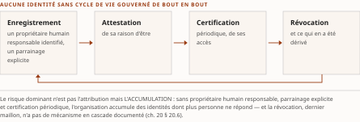
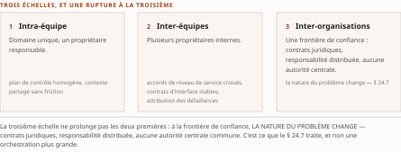

# Chapitre 24 — Le passage à l'échelle de l'entreprise

*Livre III — Encadrer : orchestration en entreprise, cadre réglementaire canadien et terrain financier.
Premier mouvement — autonomie encadrée : orchestration en entreprise (ch. 22-24). Troisième et dernier
chapitre du mouvement : il ferme le versant d'architecture avant que le deuxième mouvement n'ouvre le
versant réglementaire.*

| Champ | Valeur |
|---|---|
| **Statut** | **Brouillon de rédaction, non publiable** — rédigé le 27 juillet 2026, sur instruction d'auteur, **avant le franchissement de G-3** : la règle cardinale du PRD §5 est enfreinte, et l'infraction n'est pas rattrapée par ce qui l'a suivie. Voir la note de statut, § 24.10. ⚠ **G-3 est franchie depuis le 28 juillet 2026** (PRD v0.14 ; [`socle-consolide.md`](../PRD/socle-consolide.md) v1.2, **159 entrées `S-001`…`S-159`**) — ⚠ **et le régime de preuve de cette pièce n'en bouge pas d'un cran** : *aucune de ces entrées ne porte le ch. 4 du Vol. I*, source unique du chapitre (voir *Socle mobilisé*). **CA-IV-11 et CA-IV-13 demeurent insatisfaites** — aucune relecture par un relecteur distinct du rédacteur, que **D-6** ne fournit pas. ⚠ **Une section de ce chapitre a un socle que le plan déclare « à établir avant rédaction »** — le § 24.8 ; elle est écrite **au régime de repli que le plan lui-même prescrit**, et non comblée |
| **Date de gel** | **27 juillet 2026** — gel unique, **D-1 prise** (registre : [`gel-2026-07-27.md`](../PRD/gel-2026-07-27.md)). ⚠ **Le volet de faits du résidu de G-1 est levé le 28 juillet 2026** ([`gel-2026-07-28-volet-residuel.md`](../PRD/gel-2026-07-28-volet-residuel.md)) — *mais son domaine est le socle consolidé, dont **aucune entrée ne relève du ch. 4 du Vol. I*** : **aucun fait de ce chapitre n'a été repris à la source primaire**, et l'écart se déclare plutôt que de se déduire d'une porte franchie. ⚠ **La relève v0.19 du § 24.8 n'est toujours pas instruite** : le registre du volet la range explicitement hors de son domaine. Gel de source consommé : **juin 2026** (Vol. I *Monographie* ch. 4) — ⚠ **il ne tient pas lieu du gel de la somme**, et le chapitre porte des jalons produits et réglementaires postérieurs à cette date chez d'autres sources |
| **Socle mobilisé** | **Aucune entrée du socle consolidé**, et le motif a changé le 28 juillet 2026 sans que la conséquence change. Ce n'est plus que le socle soit vide — il compte 159 entrées — mais que **ses 17 entrées portant le Vol. I (`S-143`…`S-159`) proviennent de ses ch. 2, 3, 5 et 7, de son Annexe B et de sa *Synthèse* supprimée du dépôt — jamais de son ch. 4**. **Ce chapitre est le seul du Livre dont la totalité de la matière vient du Vol. I** : elle entre donc **intégralement en [C]** — repérage documentaire, la vérification du Vol. I portant sur ses références et non sur le contenu des affirmations (PRD §7.1). ⚠ **Conséquence à tirer sans détour : aucun énoncé de ce chapitre n'est central au sens de CA-IV-01, et aucun ne peut le devenir sans élévation en [B] par lecture des sources primaires que le Vol. I cite.** Les seuls appuis à un autre régime sont des **renvois** vers des sièges, énumérés à la note de statut et **non reconstruits ici** |
| **Garde-fous balayés** | ⚠ **Décomptes re-mesurés au commit du 28 juillet 2026, règle de comptage de la décision 16 du TOC** : *ils portent sur le **marqueur littéral** dans le **corps** — en-tête et note de statut exclus —, et **là où le garde-fou est appliqué sans que son identifiant soit écrit, c'est le domaine balayé qui est déclaré, sans cardinal**.* Vol. II — **PRD §8.2.3 et §7.5 (métriques auto-déclarées et projections d'analystes) : les deux renvois ne sont pas écrits au corps** ; *le marqueur « projection d'analyste » l'est **trois fois** — § 24.0.2, § 24.2.4 et § 24.7.2 —, et **le garde-fou est appliqué aux six sections qui portent un chiffre — § 24.0, § 24.2, § 24.5, § 24.7, § 24.8 et § 24.9** —, chacun portant son statut* ; ⚠ *les statuts de produit — annonce, préversion, disponibilité générale — se disent en outre à chaque mention aux § 24.1, § 24.2 et § 24.3, où aucun chiffre n'est avancé* ; ⚠ **et son attributeur est nommé, depuis le 28 juillet 2026, à chaque occurrence** (décision 15b du TOC) : *la parade de péremption couvre les dénominations commerciales et les versions, **jamais l'attribution*** — les suites et les offres restent donc anonymes aux § 24.1 à § 24.3, quand les cabinets, organismes et auteurs qui portent un chiffre ou une affirmation sont nommés avec leur millésime ; ⚠ **et les instruments repris le sont aussi, y compris là où aucun chiffre n'est avancé** — *les quatre cadres de menace du § 24.6.1, le référentiel d'incidents du § 24.6.4 et les deux instruments de responsabilité du § 24.7.4 portent leur auteur et leur date depuis la seconde relecture du 28 juillet 2026, la première les ayant laissés anonymes hors de la zone que la parade couvre* ; **PRD §8.4 (neutralité fournisseur) : le renvoi n'est pas écrit au corps** ; *la formule l'est **une fois**, § 24.1.2* ; **R-8 : une occurrence du sigle**, § 24.7.2 — ⚠ le sigle proscrit nu par R-8 **apparaît dans la source au titre d'un protocole de commerce**, et il est ici employé **avec son qualificatif complet**, renvoi au **ch. 7 § 7.5** ; **R-1 à R-7 : zéro occurrence**. Vol. III — **R-14 (trois degrés d'absence) : une occurrence du sigle**, § 24.0.3 — ⚠ *et les degrés se marquent en toutes lettres : « degré 3 » aux § 24.0.3, § 24.3.2, § 24.4.2, § 24.5.1 et § 24.8 (trois), « fait négatif vérifié » aux § 24.3.2 et § 24.8* ; **R-09 (quatre statuts, dits à chaque mention) : zéro occurrence du sigle** ; ⚠ *le garde-fou est **appliqué aux § 24.1 à § 24.4**, chaque statut étant dit en toutes lettres — **le décompte n'est pas re-mesurable et n'est donc pas annoncé*** ; **R-13 : cinq occurrences du sigle**, § 24.1.2, § 24.2.1, § 24.5.2, § 24.6.2 et § 24.9.2 ; ⚠ **faux ami déclaré et employé** — le « **plan de contrôle** » est celui du **maillage de services pré-agentique** (ch. 1 § 1.3.4) : *ce n'est pas le* control plane *que R-13 proscrit nu* ; le littéral « plan de contrôle » compte **six occurrences**, soit **trois emplois suivis chacun de sa désambiguïsation** — **§ 24.1.2**, **§ 24.5.2** (rangée du tableau 24.1, désambiguïsée en légende) et **§ 24.6.2** —, et **la distinction est donc écrite à chacun** ; ⚠ *celle du § 24.6.2 a été ajoutée le 28 juillet 2026, l'emploi y étant nu jusque-là, et le cardinal des six a été rétabli le même jour — l'attestation antérieure comptait cinq emplois en omettant la seconde occurrence du § 24.1.2* ; **R-02 : deux occurrences du sigle**, § 24.3.2 et § 24.6.3 ; **R-01, R-03 à R-08, R-10 à R-12 : zéro occurrence** |
| **Volumétrie cible** | ≈ **9 500 mots** de corps (§ 24.0 à § 24.9), **cible dérivée** de l'enveloppe du Livre — 90 000 mots au TOC v0.30 — au prorata des **sections**, ce chapitre en portant dix : **la plus haute cible du Livre avec le ch. 34**. ⚠ **C'est la dérivation elle-même qui explique le dépassement** : *neuf de ces dix sections déplient de quatre à six sous-sections de leur source — la dixième, le § 24.8, n'en a aucune —, et la cible a été calculée au prorata des sections, non des sous-sections.* ☑ **Décompte publiable depuis G-2** ; mesure réelle par [`PRD/decompte.sh`](../PRD/decompte.sh), seule autorité : **13 031 mots au terme de la seconde relecture du 28 juillet 2026**, soit **+37,2 %** ; elle valait **12 628** avant les deux relectures et **12 955** entre elles, et ⚠ *les 403 mots pris sont de l'appareil et de l'attribution, non de la matière*. ⚠ **Le superlatif que la première relecture avait écrit — « le plus fort écart du Livre » — n'est pas repris** : *un rang se mesure sur les quinze pièces du Livre, et cette passe n'en committe qu'une* ; il ne vaut que contre la **table du 28 juillet 2026** au [`README.md`](README.md) du dossier, dont la rangée du ch. 24 est à réaligner (remontée). ⚠ **D-4 interdit l'amputation comme le gonflement** : l'écart se documente et alimente le re-calibrage de clôture |

> **Thèse** *(citée par copie depuis le [`TOC.md`](../PRD/TOC.md) v0.30, entrée du chapitre 24 — décision 17)* — de la dette d'intégration à la prolifération d'agents, l'entreprise doit intégrer les agents à son tissu existant, gouverner le parc à l'échelle et instruire sa maturité — sans dupliquer l'IAM et l'observabilité en place.

---

⚠ **La thèse a été collationnée contre le texte rédigé de sa source avant la rédaction** (décision 14 du
TOC), puis **re-comparée mot à mot à l'entrée du TOC v0.30 le 28 juillet 2026** (décision 17) : *elle y
résout à l'identique, et la citation ci-dessus est une copie, non une re-frappe.* **Domaine de
balayage : une thèse examinée, zéro réalignée.** Le ch. 4 du Vol. I ne porte pas de
thèse formelle mais un **résumé de chapitre**, dont la thèse du TOC est une **construction d'éditeur**
fidèle : elle en reprend le fil conducteur — trois plans d'interaction, passage N×M → N+M, quatre
dettes — sans lui ajouter de portée. ⚠ **Le membre « sans dupliquer l'IAM et l'observabilité en place »
est l'apport propre du plan** : la source l'énonce comme principe de greffe (« réutiliser plutôt que
dupliquer »), et le corps l'écrit sous cette forme.

## § 24.0 — L'enjeu d'entreprise : de la dette d'intégration à la prolifération d'agents

Les deux chapitres précédents ont établi où le processus est écrit (ch. 22) et ce que l'industrie livre
pour le porter (ch. 23). Ce chapitre change d'échelle : du couple isolé agent-outil, ou du système
multi-agents de laboratoire, vers **l'organisation comme système-de-systèmes**.

Cette organisation agrège des humains aux rôles et autorités hétérogènes, un parc applicatif mêlant
progiciels du commerce, développements maison et services logiciels hérités, et désormais une couche
d'agents qui s'y superpose. **Ce qui distingue ce contexte d'un système multi-agents conçu d'un seul
tenant, c'est précisément l'absence de conception unifiée** : les composants préexistent, appartiennent
à des propriétaires différents, obéissent à des contrats de service disjoints et **ne peuvent être
réécrits à volonté**. *Les problèmes propres à cette échelle — héritage, silos, conformité sectorielle,
gouvernance répartie — ne se résolvent pas au niveau du protocole mais à celui de l'architecture
d'entreprise et de son modèle opérationnel.*

**Trois plans d'interaction** organisent la matière, et ils sont repris tels quels de la source. Le
**plan agent-outil** régit l'accès gouverné aux systèmes et aux données ; il est traité aux § 24.1 et
§ 24.4. Le **plan agent-agent** régit la collaboration inter-équipes et inter-organisations ; il est
traité aux § 24.5 et § 24.7. Le **plan agent-humain** — autorité, délégation, responsabilité — est
**transverse** : il n'a pas de section propre et s'ancre en trois points, la collaboration humaine
(§ 24.5), la supervision sécuritaire (§ 24.6) et la redevabilité socio-technique (§ 24.9). ⚠ *La source
lui en donne un quatrième — la gouvernance de la décision automatisée — qui part au **ch. 30** avec le
§4.8 : trois ancrages ici par effet de périmètre, non par réduction.*

### 24.0.1 Continuité et rupture de la dette

La **dette d'intégration** classique est un acquis du **ch. 1** : connexions point-à-point qui se
multiplient, bus d'entreprise devenus monolithes de médiation, flux d'échange de documents rigides,
couplage fort entre systèmes que nul n'ose plus modifier. **L'arrivée des agents ne supprime pas cette
dette ; elle en ajoute une couche**, en partie continue, en partie nouvelle.

La **continuité** tient à ce que les agents consomment et écrivent dans les mêmes systèmes hérités,
dont ils héritent les contrats fragiles. La **rupture** tient à des bloqueurs inédits : un patrimoine
informationnel mal catalogué, sans lignage ni définitions certifiées, devient le frein dominant à toute
mise à l'échelle ; des copilotes déployés en silos, chacun dans son service logiciel, non composables
entre eux ; des exécutions et des mémoires fragmentées, chaque plateforme conservant son propre état
conversationnel.

Le cadre qui rend ce paysage analysable est celui des **quatre dettes**, et il structure la progression
du chapitre. La **dette de données** conditionne l'ancrage gouverné (§ 24.4). La **dette
d'intégration** conditionne la greffe sur le tissu existant (§ 24.1). La **dette d'identité**, propre à
des entités non humaines qui se multiplient sans propriétaire ni cycle de vie clairs, conditionne
l'accès à l'échelle (§ 24.3). La **dette de gouvernance** conditionne la conformité et le contrôle —
⚠ **et elle sort du périmètre de ce chapitre** : son traitement est au **ch. 30**, qui reçoit le §4.8
de la source en entier. *Chacune nomme un déficit accumulé que l'introduction d'agents rend soudain
coûteux, et qu'aucun protocole ne solde de lui-même.*

### 24.0.2 Prolifération d'agents et explosion des identités non humaines

La **prolifération d'agents** (*agent sprawl*) désigne un phénomène propre à l'entreprise : la
multiplication non maîtrisée d'agents et, surtout, **des identités machine qui les portent**. Là où un
développeur instancie un agent isolé, une organisation en voit naître des centaines par essaimage
d'équipes, chacun requérant justificatifs d'accès, jetons et droits.

⚠ **Les chiffres qui circulent sur ce phénomène portent tous leur statut, et aucun n'est une mesure
auditée** — ⚠ *et chacun porte son attributeur, que la parade de péremption ne couvre pas* (décision 15b
du TOC). **Rubrik Zero Labs (2025)** avance un **ratio de 82 identités non humaines pour 1 identité
humaine** et indique que **89 % des organisations sondées** ont intégré des agents à leur
infrastructure d'identité : ⚠ **chiffre fournisseur issu d'une enquête commanditée** — Wakefield
Research, 1 625 décideurs —, à re-vérifier. Le **Forum économique mondial (2025)** documente par
ailleurs la fréquence des organisations dépourvues de gouvernance claire de ces identités. Et sur le
versant prospectif, ⚠ **une projection d'analyste — non une mesure** — de **Gartner (2025)** anticipe
que les agents dépasseront en nombre les vendeurs d'un facteur dix d'ici 2028,
et thématise un **écart d'autorité** (*authority gap*) entre ce que les agents sont **techniquement
capables** de faire et ce que l'organisation les a **explicitement habilités** à faire.

*Cet écart est le cœur du problème : une identité non humaine sur-habilitée et mal suivie devient une
surface d'attaque et un angle mort de conformité.* Le traitement détaillé de l'identité, de son cycle
de vie et de ses grilles de risque est au § 24.3 ; la présente sous-section n'établit que **l'ampleur
du phénomène et sa nature spécifiquement organisationnelle**.

### 24.0.3 Pilotes d'affaires, valeur, et le fil N×M → N+M

La valeur de l'interopérabilité agentique se matérialise là où une tâche **cesse de s'arrêter à la
frontière d'un système**. L'automatisation de bout en bout qui traverse plusieurs applications est le
pilote d'affaires central, et le décloisonnement inter-systèmes en est la condition. Or les enquêtes de
terrain signalent un **décalage persistant entre investissement et valeur captée** : le rapport
*GenAI Divide* (**Challapally et coll., MIT Project NANDA, 2025**) — ⚠ **non audité, fondé sur
cinquante-deux entretiens** — documente une majorité de projets bloqués au stade pilote, tandis que
**McKinsey & Company (2025)** estime que près de 80 % des entreprises ne constatent pas d'effet
significatif sur leur résultat — ⚠ **étude tierce à statut d'enquête, non une mesure auditée**.
*Le coût du statu quo n'est donc pas
l'absence de technologie, mais l'incapacité à la transformer en valeur opérationnelle sous contrainte
d'intégration.*

C'est ici qu'intervient le **fil rouge économique** du chapitre. Sans standard partagé, connecter N
agents à M systèmes suppose un développement spécifique par couple, dont le coût croît en **N×M**. Des
protocoles ouverts — le protocole agent-outil côté outils, le protocole agent-agent côté pairs —
ramènent ce coût à **N+M** en substituant un contrat commun à la prolifération d'adaptateurs sur
mesure, exactement comme un modèle canonique réduisait jadis le câblage point-à-point (**ch. 1
§ 1.6.1**). Le coût marginal d'orchestration d'un agent supplémentaire, dans un parc déjà standardisé,
tend ainsi vers le seul **branchement au contrat partagé**.

⚠ **Cette proposition est une thèse d'architecture, non un fait mesuré.** Le Vol. I la porte comme fil
conducteur ; ⚠ **le socle n'en établit aucune vérification empirique en entreprise** — *absence de
documentation, degré 3 de l'échelle R-14 du Vol. III.* Elle est rouverte au § 24.2, où la stratégie
d'écosystème en fait l'argument des standards ouverts (§ 24.2.4) puis la referme sur le coût total de
possession (§ 24.2.5), et **elle reparaît deux fois** — appliquée à la sémantique des données
(§ 24.4.4), puis aux places de marché d'agents (§ 24.7.3) ; **le ch. 29 en fera l'un des termes de sa
traduction réglementaire**, et il n'en tirera aucune preuve.

⚠ **Ce que le chapitre ne traite pas, et où le trouver.** La **gouvernance et la conformité
d'entreprise** — qualification sous le règlement européen sur l'IA, normes volontaires, registre
d'agents comme pièce de conformité, régime européen de protection des données, résidence et
*e-discovery* — sont au **ch. 30**, qui reçoit le §4.8 de la source **en entier**. L'**observabilité,
la fiabilité, l'évaluation en production et la discipline financière** sont au **Livre IV**, qui reçoit
le §4.9. Les **architectures de référence** sont au **Livre IV** également, qui reçoit le §4.12. ⚠ **Ce
sont trois sorties de périmètre déclarées à la table de couverture, non trois oublis.**

## § 24.1 — Intégrer les agents au tissu d'intégration existant

**L'erreur structurante consisterait à traiter la couche agentique comme un système d'information
neuf, déployé à côté du parc existant plutôt qu'à l'intérieur.** L'entreprise réelle ne reconstruit ni
son bus d'entreprise, ni sa plateforme d'intégration, ni ses passerelles d'API, ni son maillage
d'événements, ni ses canaux d'échange de documents parce qu'un nouveau type d'acteur y fait son
apparition. *La proposition de cette section est inverse : greffer les agents sur ce tissu éprouvé, en
réutilisant ses mécanismes de découplage, de contrôle d'accès et de supervision plutôt qu'en les
dupliquant.* C'est la première moitié du membre de la thèse « sans dupliquer l'IAM et l'observabilité en
place ».

### 24.1.1 Le modèle de référence : l'agent comme acteur du tissu

Le modèle repose sur une **dualité de rôles**. Un agent se comporte en **agent-consommateur** lorsqu'il
invoque une API ou un outil, lit un flux d'événements ou interroge une source pour fonder son
raisonnement ; il se comporte en **agent-producteur** lorsqu'il déclenche un *workflow*, émet un
événement ou écrit dans un système d'information. Cette distinction recoupe celle de l'acteur émetteur
et récepteur du **ch. 1**.

Ce qui sépare l'agent d'entreprise d'un agent isolé ne tient pas à sa boucle de raisonnement mais à
**son contexte d'exécution**, et quatre propriétés le caractérisent. Le **volume et la variabilité du
trafic** : un parc génère des rafales d'appels au coût unitaire imprévisible. La **gouvernance d'accès
à l'échelle**, qui doit appliquer des politiques cohérentes à des centaines d'identités non humaines.
Le **paysage hétérogène** — ordinateur central, progiciel de gestion, service logiciel, entrepôt-lac
coexistants — qui interdit toute hypothèse d'homogénéité. La **souveraineté et la résidence** des
données, qui contraignent le lieu d'exécution de l'inférence et le transit des jetons.

### 24.1.2 La plateforme d'intégration comme fabrique de serveurs d'outils

⚠ **Désambiguïsation obligatoire (décision 12c du TOC).** Le mot « fabrique » désigne ici, et
uniquement ici dans ce chapitre, **une plateforme d'intégration qui produit des serveurs d'outils** ;
ce n'est ni la *fabrique d'identité* du **ch. 43**, ni la *fabrique d'agents* du **ch. 41**, ni le
patron de conception homonyme.

Le patron consiste à traiter la plateforme d'intégration non comme un héritage à contourner mais comme
une **fabrique de serveurs d'outils**. Les grandes plateformes disposent déjà d'un catalogue de
connecteurs vers des centaines d'applications d'entreprise, assorti de journalisation, de reprise sur
erreur, de contrôle d'accès et de supervision. **Générer automatiquement des serveurs d'outils à partir
de ce catalogue** fait de chaque connecteur existant un outil gouverné exposable à un agent — et les
mécanismes de fiabilité hérités servent de garde-fous **sans réécriture**.

**Le bénéfice architectural n'est pas la nouveauté fonctionnelle mais la réutilisation du plan de
contrôle existant.** ⚠ **Faux ami à ne pas confondre** : ce « plan de contrôle » est celui du **maillage
de services pré-agentique** (ch. 1 § 1.3.4) — *ce n'est pas le* control plane *agentique que R-13 du
Vol. III proscrit nu*, et le présent chapitre n'emploie jamais ce second terme.

⚠ **Le mouvement des éditeurs vers l'agentique est daté au régime [C], et les statuts se disent.**
Plusieurs plateformes d'intégration ont annoncé en 2025-2026 des registres d'agents, des courtiers
d'agents et des passerelles exposant les deux protocoles ; l'une d'elles a annoncé une plateforme
d'outils d'entreprise **en octobre 2025**, une autre un studio d'agents **en mars 2025**. ⚠ **Ce sont
des jalons de communiqués d'éditeurs, à re-vérifier** — le volet résiduel de G-1 ne les a pas repris, et
la **neutralité fournisseur** interdit d'en tirer un classement.

Un mouvement mérite d'être isolé parce qu'il change la nature du geste : l'**écriture d'intégration par
intention**, où un agent interprète un objectif exprimé en langage naturel, en dérive un plan, puis
construit et déploie le flux correspondant — là où l'assemblage visuel exigeait encore la construction
manuelle du graphe.

Lecture de l'auteur — l'enjeu n'est pas la commodité de génération mais sa **gouvernabilité**. *Une
intégration ainsi produite n'a de valeur d'entreprise que si elle hérite des contrats, de la
propagation d'identité et des reprises de la plateforme — c'est-à-dire si l'agent **peuple** le tissu
gouverné au lieu d'ouvrir un canal parallèle.* **Ce que le socle établit** : l'existence de ces
capacités, au régime [C]. **Ce qu'il n'établit pas** : leur gouvernabilité effective. *Une greffe qu'on
ne peut ni versionner, ni tracer, ni rejouer reconduit, sous l'apparence de l'automatisation, la dette
d'intégration que le découplage par contrat visait à résorber.*

### 24.1.3 Passerelle d'API, passerelle d'IA et point de sortie unique

⚠ **Cette sous-section est le domicile de la mécanique** de la passerelle et du cache ; **sa dimension
financière — allocation, refacturation — est au Livre IV**, et le renvoi croisé est volontaire.

Ce qui distingue le trafic d'agents du trafic d'API classique est **triple** : la **variabilité extrême
du coût par appel** — un même point d'entrée peut coûter quelques centimes ou plusieurs dollars selon
la longueur de contexte —, les **rafales** consécutives aux boucles de raisonnement, et la
**duplication d'invites quasi identiques**.

À ces propriétés répondent des capacités nouvelles : **limitation de débit exprimée en jetons** et non
en requêtes ; **cache sémantique** rapprochant les requêtes proches ; **disjoncteurs déclenchés sur la
vélocité de coût** plutôt que sur le taux d'erreur ; **routage de modèles** selon la difficulté de la
tâche ; et **chaînes de repli inter-fournisseurs**. ⚠ Les offres qui les portent sont documentées au
régime [C] et à des statuts inégaux : préversion pour certaines, disponibilité générale datée d'avril
2026 pour au moins une, et **statut non confirmé à la date de référence de la source** pour une autre.

**Le critère d'architecture demeure constant, et c'est lui le legs de la sous-section : faire transiter
tout le trafic agentique par un point d'application unique où le coût et l'accès deviennent observables
et maîtrisables.** *Sans point de sortie unique, ni le plafonnement par jetons, ni le cache sémantique,
ni les disjoncteurs de coût ne sont applicables à l'échelle.*

### 24.1.4 Encapsuler le patrimoine : ordinateur central, progiciel de gestion, bases historiques

Le critère directeur est de **ne pas réécrire les systèmes d'enregistrement** mais de les exposer comme
des **outils gouvernés**. Le patron applicable est une variante agentique de l'étranglement progressif :
l'agent accède au cœur historique par une interface encapsulante, **sans que la migration du système
sous-jacent ne soit jamais un préalable**.

Trois enjeux structurent cette encapsulation. La **performance** : interroger un ordinateur central ou
un progiciel transactionnel en lecture directe est rarement soutenable, d'où le recours à des répliques
en lecture, des vues matérialisées et un groupement de connexions. Le **périmètre** : distinguer un
accès en lecture seule, à risque maîtrisé, d'un accès en écriture complet qui engage l'intégrité des
données de référence. L'**autorisation** : propager l'identité de l'appelant plutôt que d'employer un
compte de service partagé — *exigence dont le § 24.3 fait une mécanique.*

À cette encapsulation, qui **donne accès** au cœur historique, répond une seconde trajectoire qui le
**transforme** : la modernisation assistée par agent s'attaque au code lui-même — compréhension de
programmes hérités, cartographie des dépendances, refactorisation, génération de tests de
non-régression. Deux propriétés la rattachent au fil de la somme. L'**évolution** : moderniser n'est pas
migrer d'un bloc mais réduire la dette progressivement, contrat d'outil par contrat d'outil. La
**libération humaine sur l'irréversible** : transformer un système d'enregistrement reste une action
engageante, et **la sortie de l'assistant demeure une proposition soumise à revue, jamais une écriture
autonome**. *L'agent y déplace le coût marginal de la compréhension du patrimoine, non la responsabilité
de sa transformation* — et le **ch. 31 § 31.1.1** montrera que cette règle cesse d'être une préférence
d'ingénierie quand l'action est un règlement financier.

### 24.1.5 Maillage d'événements et échange de documents agentiques

Le branchement des agents sur le temps réel s'appuie sur une **épine dorsale déjà familière** : un bus
de messages pour le transport, un moteur de flux pour le traitement, les deux protocoles agentiques
pour l'accès et la collaboration, et un **contrat de gouvernance des canaux d'événements** (ch. 1
§ 1.5). Dans ce schéma, l'agent-producteur émet des événements consommables par d'autres systèmes, et
l'agent-consommateur réagit à des flux métier **sans couplage point-à-point** ; le maillage préserve le
découplage temporel et spatial qui fait la robustesse de l'architecture événementielle.

Le second volet vise le **B2B installé** : des agents interprètent, valident et optimisent des messages
d'échange de documents — formats longtemps réputés rigides — pour automatiser le rapprochement, la
correction d'anomalies et l'orchestration de la chaîne d'approvisionnement. ⚠ Les illustrations sont
datées et relèvent de communiqués d'éditeurs, au régime [C].

Lecture de l'auteur — l'intérêt de ce mouvement n'est pas la promesse d'automatisation mais **l'échelle
de confiance qu'elle présuppose**. Raccorder un partenaire par intention ne dispense ni de l'identité
opposable de l'agent, ni du contrat de message versionné, ni de la piste d'audit : *à l'échelle d'un
réseau de partenaires, ce sont des conditions de sûreté, non des options.* **Ce que le socle
établit** : l'existence de ces offres. **Ce qu'il n'établit pas** : que la confiance qu'elles supposent
soit outillée. **Le siège de cette question est le ch. 18** — la connaissance de l'agent —, et le
§ 24.7 y renvoie sans le reconstruire.

### 24.1.6 Catalogue, registre et coexistence à l'échelle du parc

Le problème devient proprement **organisationnel** dès lors qu'il faut gouverner non pas un serveur
d'outils mais **des centaines**, doublés de plusieurs protocoles concurrents. Le critère directeur est
la **curation gouvernée** : substituer aux installations sauvages un **registre interne** où chaque
serveur est catalogué, signé, analysé et versionné.

Au-delà du catalogue, l'enjeu spécifiquement d'entreprise est la **coexistence et le versionnement de
protocoles à l'échelle du parc** : dépréciation ordonnée d'un serveur, compatibilité ascendante des
contrats d'outils, et confinement de la fragmentation née de la cohabitation de plusieurs protocoles et
de variantes propriétaires. ⚠ **La mécanique de découverte et de nommage est au ch. 9**, qui en est le
siège protocolaire, et elle n'est pas reprise ici.

*Sans politique explicite de versionnement et de dépréciation, un parc d'agents accumule une **dette de
fragmentation** analogue à la dette d'intégration point-à-point qu'on cherchait précisément à éviter.*
Cette discipline de coexistence ouvre la question stratégique du § 24.2 : **sur quel écosystème
parier**.

## § 24.2 — Plateformes d'agents d'entreprise et stratégie de standards ouverts

L'intégration au tissu existant résout **le branchement** ; elle ne résout pas **l'industrialisation**.
Dès qu'une organisation dépasse la poignée de copilotes isolés et vise un parc gouverné, la question
cesse d'être « comment connecter un agent » pour devenir « **sur quelle plateforme bâtir, opérer et
porter des dizaines de cas d'usage sans se verrouiller** ».

### 24.2.1 Le modèle de référence à six couches

Comparer des suites hétérogènes exige un cadre **indépendant des marques**, et six couches le
fournissent. *(1)* La **couche de construction** oppose l'assemblage visuel, accessible aux profils
métier, au développement par bibliothèque, qui donne le contrôle fin — la plupart des plateformes
offrant désormais les deux registres. *(2)* Le **temps d'exécution** porte l'isolation de session entre
locataires et entre tâches, la prise en charge de fenêtres de raisonnement longues, et le confinement
du code et des navigateurs pilotés — exigences d'autant plus fortes que les agents **agissent**, et
non plus seulement répondent. *(3)* Le **plan de gouvernance** concentre politiques, garde-fous,
observabilité et discipline financière ; ⚠ **c'est la couche qui transforme un agent en actif
gouverné**, et son détail est au **ch. 30** et au **Livre IV**. *(4)* La **couche identité et accès**
établit qui est l'agent et quels droits il porte — **domicile au § 24.3**. *(5)* La **couche
d'intégration** expose connecteurs, serveurs d'outils et API. *(6)* La **portabilité du modèle**
sous-jacent conditionne le coût et l'anti-verrouillage.

⚠ **Ces six couches ne sont pas une échelle d'autonomie** (R-13 du Vol. III) : ce sont des couches
d'architecture, et les confondre avec un palier de latitude confondrait ce qu'une plateforme **offre**
avec ce qu'une organisation **consent**.

### 24.2.2 Plateformes infusées dans la suite métier

Une première famille loge l'agent **à l'intérieur du logiciel d'affaires qui détient déjà la donnée et
le processus**. Le critère est la **proximité donnée-processus** : l'agent hérite du modèle de données,
des règles métier et des contrôles d'accès du système d'enregistrement, ce qui raccourcit le délai de
valeur et réduit la surface d'intégration. ⚠ **Le revers est un risque de verrouillage accru**, l'agent
étant arrimé au schéma propriétaire de l'éditeur.

⚠ **Les trajectoires nommées par la source portent des statuts distincts, dits à chaque mention** :
une suite dévoilée en octobre 2025 dont une version a atteint la disponibilité générale le 23 février
2026, avec un langage d'agent **en bêta** ; une autre dont le constructeur d'agents a atteint la
disponibilité générale le 19 décembre 2025 ; une troisième déployant ses agents au sein d'une
plateforme de flux de travail. **Dans les trois cas, la valeur naît de l'ancrage natif ; la dépendance
est le prix à arbitrer.**

### 24.2.3 Plateformes infonuagiques horizontales

Une seconde famille **découple l'exécution agentique du logiciel métier** : la plateforme est
multi-cadriciel et multi-modèle. Le critère est ici la **neutralité** — aucune adhérence à un système
d'enregistrement particulier — **au prix d'une intégration métier à construire**. ⚠ Les trois offres que
la source nomme portent des jalons datés d'octobre 2025 à avril 2026, à des statuts inégaux. **Sur la
grille des six couches, ces plateformes maximisent temps d'exécution, intégration et portabilité ; la
couche métier reste à l'ouvrage de l'entreprise.**

### 24.2.4 Jardins clos, standards ouverts et stratégie d'écosystème

**La décision structurante n'est pas le choix d'une suite mais le choix d'une stratégie
d'écosystème.** Les suites intégrées offrent expérience cohérente et délai de valeur court, **au prix
d'un verrouillage** ; une pile ouverte multi-fournisseurs préserve l'optionnalité, **au prix d'un effort
d'assemblage**. L'arbitrage reboucle la proposition N×M → N+M du § 24.0.3 : standardiser les interfaces
fait chuter le coût marginal d'intégration d'un agent ou d'un outil supplémentaire.

⚠ **Trois piliers de standardisation existent, et leurs gouvernances sont distinctes — les confondre
est la faute que le Livre I a nommée.** Le plan agent-outil, le plan agent-agent et une troisième
initiative d'infrastructure relèvent de **fondations et de trajectoires différentes** ; leur généalogie
complète, avec ses dates et ses transferts de gouvernance, est au **ch. 7** et au **ch. 10**, qui en
sont les sièges. *La vraie question n'est pas « quel produit » mais « sur quel écosystème parier » sans
hypothéquer l'avenir.*

⚠ **Un garde-fou tempère l'enthousiasme, et il porte son attributeur autant que son statut** :
**Gartner (2025)** alerte sur le « lavage agentique » (*agent washing*) et anticipe que **plus de 40 %
des projets d'IA agentique seront annulés d'ici fin 2027** — **projection d'analyste, non une mesure**.
*Attribuer, ne pas affirmer.*

Lecture de l'auteur — la parade d'architecture consiste à exiger des **standards ouverts scorables en
appel d'offres**, de sorte que la portabilité reste un **attribut contractuel** plutôt qu'une promesse :
traiter les trois piliers comme trois exigences séparées, vérifier l'appartenance de gouvernance
déclarée et la conformité effective plutôt que l'allégation, et exiger des **critères de sortie
explicites** — export des définitions d'agents, portabilité des registres, absence de format
propriétaire bloquant. **Ce que le socle établit** : l'existence des trois piliers et de leurs
gouvernances distinctes. **Ce qu'il n'établit pas** : qu'une exigence contractuelle suffise à garantir
la portabilité — *une clause n'est pas un mécanisme*, et le **ch. 47** traitera de la provenance des
composants au grain de l'artefact.

### 24.2.5 Portabilité du modèle, coût total de possession et rendement

Sous la portabilité des plateformes se loge un levier plus profond : **la portabilité du modèle
lui-même**, déterminante pour le coût total de possession, la souveraineté et l'anti-verrouillage. Le
découplage entre l'agent et son modèle permet d'arbitrer entre modèle propriétaire de frontière —
performance, mais dépendance — et modèle ouvert exécutable sur site ou en infonuagique souverain.

**Le coût total de possession d'un parc agentique ne se réduit pas au prix des jetons** : il agrège
l'orchestration, l'intégration au tissu existant, l'identité et la sécurité, l'observabilité et la
discipline financière, et la conduite du changement. ⚠ **Le rendement, lui, demeure difficile à
établir** : selon **McKinsey (2025)**, une part importante des organisations ne constate pas d'impact
significatif sur le résultat — ⚠ **étude tierce, à re-vérifier** —, et le rapport *GenAI Divide* déjà
cité au § 24.0.3 (**Challapally et coll., 2025**) documente l'écart entre budgets engagés et valeur
captée — ⚠ **rapport non audité**.

*L'effet plateforme — réutilisation des connecteurs, des garde-fous et des évaluations à travers les
cas d'usage — est précisément ce qui, en abaissant le coût marginal du cas suivant, peut faire pencher
le coût total du bon côté*, refermant la boucle N×M → N+M. ⚠ **La mesure du rendement se prend en coût
par résultat métier, jamais en coût par jeton** : c'est la seule grandeur qui rende l'effet plateforme
visible, et le **Livre IV** en fait une discipline.

## § 24.3 — Identité et accès des agents à l'échelle du parc

*⚠ **Application du Livre II au grain de la plateforme, sans reconstruire sa doctrine.** La chaîne de
mandat est au **ch. 17**, l'émission aux **ch. 15-16**, la connaissance de l'agent au **ch. 18**, la
taxonomie des attaques au **ch. 19** ; et le **socle IAM pré-agentique — identité fédérée, autorisation
déléguée, identité de charge de travail, confiance nulle — est posé une seule fois pour toute la somme
au ch. 3**, qui en est le siège. Aucun de ces cinq lieux n'est reconstruit ici.*

La couche identité et accès est le **pivot où la prolifération d'agents cesse d'être un problème de
capacité pour devenir un problème de contrôle**. Le cadrage est délibérément étroit : cette section
traite de **qui est l'agent** et de **quels droits il détient** au grain du parc. La manière dont le
parc est attaqué et défendu est au § 24.6 ; l'application des permissions à la récupération de
connaissances est au § 24.4.

### 24.3.1 Le cycle de vie de l'identité d'agent à l'échelle

Le critère d'ouverture est simple : **aucune identité d'agent ne devrait exister sans un cycle de vie
gouverné de bout en bout, de l'enregistrement à la révocation**. Tout agent admis dans le parc doit
être enregistré avec un **propriétaire humain responsable** identifié, un parrainage explicite, une
attestation de sa raison d'être et une **certification périodique de ses accès** — faute de quoi
l'organisation accumule des identités **dont plus personne ne répond**.

⚠ **Le risque dominant n'est pas l'attribution initiale mais la mise hors service** : la révocation
fiable des justificatifs lorsqu'un agent est retiré, remplacé ou dérivé. C'est le premier item de la
grille de risque du § 24.3.4.

Une distinction structurante oppose les identités **durables** — un agent de service stable, longévité
mesurée en mois — aux identités **éphémères** qu'imposent les agents instanciés à la demande, dont la
durée de vie se compte en minutes et qui exigent des **justificatifs de courte durée** plutôt que des
secrets persistants. Le défaut récurrent à l'échelle est l'accumulation d'**orphelins de justificatifs**
— jetons, clés et certificats survivant à l'agent qui les portait.

*La gouvernance du parc transpose donc à l'agentique les disciplines classiques de gouvernance des
identités : revue d'accès, recertification, traçabilité du parrain, automatisation de la dépréciation.*
⚠ **Cette exigence d'attribution durable d'un agent à un responsable humain sert par ailleurs la preuve
de redevabilité que le ch. 30 réclamera au titre de la conformité** — et c'est la même exigence que le
**ch. 25 § 25.5** rencontrera sous la forme du registre comme pièce d'inventaire.

⚠ **Les plateformes qui industrialisent ce cycle de vie portent des statuts inégaux, dits à chaque
mention** : une offre d'un grand fournisseur d'identité est passée d'une préversion de mai 2025 à la
**disponibilité générale en avril 2026** ; ⚠ **le ch. 14 § 14.2 a montré que cette disponibilité
générale ne vaut pas disponibilité générale de ses capacités**, plusieurs demeurant étiquetées
préversion à une date postérieure — *et c'est le régime de preuve, non l'offre, qui commande cette
nuance.* Des plateformes natives d'identités non humaines ciblent par ailleurs explicitement la
découverte, le moindre privilège et le cycle de vie.

### 24.3.2 Délégation multi-saut, autorisation fine et gestion des secrets

⚠ **Le patron directeur est la délégation traçable sans réutilisation de jeton**, et sa règle d'or est
explicite : **ne jamais réacheminer le jeton de l'utilisateur tel quel à un service en aval**, sous
peine de dissoudre toute traçabilité et d'ouvrir la voie au mandataire confus (*confused deputy*).

Le mécanisme normatif est l'**échange de jetons**, dont deux revendications nommées matérialisent une
chaîne de délégation vérifiable. ⚠ **Le siège de cette mécanique est le ch. 17**, qui l'a instruite à
la source primaire — et *l'extraction y établit davantage que le repérage n'annonçait*. Ce chapitre ne
la reconstruit pas ; il en tire la conséquence de parc.

⚠ **Un problème ouvert subsiste, et il faut l'écrire au bon degré** : la délégation à plus de deux
sauts n'est pas standardisée de bout en bout, et **le corpus de la somme ne documente aucun contrat
universel** pour propager l'autorité sur une chaîne arbitraire d'agents — *absence de documentation,
degré 3, et non fait négatif vérifié.* Le **ch. 17** en fait son objet sous le nom de **problème des
deux sauts**, et le **ch. 24 n'y ajoute rien** sinon que le problème se multiplie par le cardinal du
parc.

Côté **autorisation**, la finesse exigée par des identités éphémères et nombreuses impose
d'**externaliser la décision** : contrôle par rôles, par attributs ou par relations, servi par un
**point de décision distinct du point d'application**. ⚠ **La mécanique du couple point de
décision / point d'application est au ch. 37**, qui en est le siège dans le maillage d'agents ; elle
n'est pas reposée ici.

La **gestion des secrets** boucle l'exigence : coffres et rotation pour les secrets durables, mais
surtout **bascule vers des justificatifs éphémères sans secret** lorsque la topologie le permet.
⚠ **Un mécanisme se qualifie par ce que sa spécification démontre** (R-02 du Vol. III) : un
justificatif de courte durée **réduit la fenêtre d'exposition**, il ne démontre pas l'absence de fuite.

### 24.3.3 Plateformes d'identité d'agents et confiance nulle à l'exécution

Le critère décisif pour une grille d'appel d'offres est de **classer les offres en deux familles
distinctes**. La première **étend un fournisseur d'identité généraliste** aux agents : l'agent hérite
alors de l'infrastructure existante — accès conditionnel, gouvernance des identités, détection de
risque. La seconde est constituée de **plateformes natives d'identités non humaines**, conçues
spécifiquement pour les identités machine et agentiques.

**La distinction n'est pas cosmétique** : la première mutualise la gouvernance humaine et machine **au
prix d'un modèle parfois mal ajusté aux agents éphémères** ; la seconde traite l'agent comme un citoyen
de première classe **mais ajoute une plateforme à intégrer**. Dans les deux cas, l'exigence est
d'**étendre aux agents l'accès conditionnel, la gouvernance des accès et la détection de risque**
historiquement réservés aux humains.

Le modèle cible est la **confiance nulle à l'exécution** : vérification par requête, micro-segmentation
et révocation immédiate. ⚠ **Le socle IAM qui la porte — y compris ses documents normatifs de référence
— est posé au ch. 3 pour toute la somme** ; ce chapitre n'en refait ni l'exposé ni la généalogie, et se
borne à en tirer la conséquence de parc : *les trois propriétés répondent directement à la réutilisation
d'identité et au défaut d'isolation que la grille du § 24.3.4 nomme.*

⚠ **La normalisation reste en chantier, et son statut se dit** : un groupe de travail de l'IETF vise un
cadre interopérable d'identité de charge de travail, **bâti sur le même échange de jetons**, mais **seuls
les brouillons stables devraient être engagés dans une architecture de production** — *un brouillon
d'Internet expire, et le ch. 18 a montré ce que cette péremption coûte à un cardinal.*

### 24.3.4 La grille de risque des identités non humaines — domicile

⚠ **Cette sous-section est le domicile unique de cette grille dans la somme** : le § 24.6 ne fait qu'y
renvoyer.

⚠ **La grille est nommée et attribuée, et elle doit l'être** : il s'agit du **OWASP Non-Human
Identities Top 10 (2025)**. *La parade de péremption qui autorise ailleurs à taire une dénomination
commerciale **ne couvre pas l'auteur et la date d'un instrument repris** — une grille dont on ne peut
remonter la provenance n'est plus vérifiable, et **c'est ici le domicile même de cette matière**.*

La grille énumère **dix risques** qui forment une liste de contrôle d'architecture et d'appel d'offres
directement actionnable : mise hors service défaillante ; fuite de secret ; identité non humaine tierce
vulnérable ; authentification non sûre ; identité sur-privilégiée ; configuration infonuagique non
sûre ; secrets à longue durée de vie ; isolation d'environnement ; réutilisation d'identité ; et usage
humain d'une identité non humaine.

Sa valeur opérationnelle tient à **deux usages**. D'une part, elle **se cartographie vers les
référentiels de contrôle reconnus**, ce qui permet de raccrocher la sécurité des identités d'agents au
corpus d'audit existant de l'entreprise **plutôt que d'en inventer un parallèle** — *et c'est
exactement la deuxième moitié du membre de thèse « sans dupliquer l'IAM et l'observabilité en place ».*
D'autre part, elle **se lit comme une grille d'évaluation des fournisseurs** : chaque item devient un
critère scorable.

**Le cas des agents mérite une attention propre.** À la différence d'une identité machine statique,
un agent doté d'autonomie peut **escalader ses propres droits** — enchaîner des outils pour obtenir un
accès non prévu, ou exploiter une délégation mal bornée. *La grille doit donc être appliquée non comme
un instantané mais comme un **invariant vérifié en continu** sur un parc dont les membres raisonnent et
agissent.*

Lecture de l'auteur — la transposition d'une grille pensée pour des identités machine **passives** à
des agents **autonomes** ouvre une question que le corpus ne referme pas : les contrôles d'accès
classiques présupposent un sujet aux intentions fixes, alors qu'un agent **compose dynamiquement ses
appels**. **Ce que le socle établit** : la grille et sa cartographie vers les référentiels d'audit.
**Ce qu'il n'établit pas** : qu'elle suffise à couvrir un sujet composant. *Déplacer la frontière de
l'autorisation du **qui** statique vers le **pour-le-compte-de-qui-et-via-quels-intermédiaires** est le
prolongement direct du problème que le ch. 17 laisse ouvert.*

## § 24.4 — Accès aux données d'entreprise et ancrage gouverné

Un agent qui formule des réponses à partir du patrimoine informationnel de l'organisation **ne saurait
s'affranchir des règles qui encadrent déjà l'accès des humains et des applications à ces mêmes
données**. Le principe directeur **inverse la perspective courante** : l'ancrage n'est pas seulement un
mécanisme de qualité destiné à réduire l'affabulation, **c'est d'abord un point d'application des
politiques de gouvernance**.

⚠ **L'ancrage informationnel proprement dit — mémoire, contexte, récupération augmentée — est au
ch. 5**, qui en est le siège. Ce chapitre en traite **la seule dimension d'entreprise** : la greffe sur
l'intégration de données gouvernée — catalogue, lignage, classification, fraîcheur.

### 24.4.1 Du prototype à la connaissance d'entreprise gouvernée

Le patron distingue radicalement la **récupération plate** — un index vectoriel unique alimenté par un
corpus indifférencié, suffisant pour un démonstrateur — de la **connaissance d'entreprise**, qui repose
sur des **sources autoritatives**, des **définitions certifiées** et des **données sensibles dont la
divulgation engage la responsabilité de l'organisation**.

Le passage de l'un à l'autre exige une pile en **étages explicites** : sources hétérogènes → ingestion
et classification → indexation → récupération filtrée par politique → génération → vérification →
audit. **Chaque étage est un point de contrôle distinct, et l'absence d'un seul — typiquement la
classification ou le filtrage par politique — ramène la pile au prototype, quelles que soient les
performances du modèle.**

*Le socle de cette architecture n'est pas l'index mais le triptyque **catalogue / lignage /
classification**, qui détermine ce qui est autoritatif, d'où provient chaque donnée et quel niveau de
sensibilité s'y attache.* ⚠ Les plateformes de catalogue ont réorienté leur offre vers cet usage en
2025 ; ⚠ **les dates citées par la source relèvent de communiqués de fournisseurs, à re-vérifier**.

### 24.4.2 Récupération consciente des permissions et mémoire de flotte — domicile

⚠ **Cette sous-section est le domicile unique de l'application des permissions à la récupération**, et
le critère qui la gouverne est strict : **un agent ne doit jamais récupérer ni restituer un fragment
que son mandataire humain ne pourrait lire directement à la source.**

Faire respecter les permissions admet une **hiérarchie de robustesse**. Le pré-filtrage par rôles, qui
restreint l'espace de recherche aux documents autorisés **avant** la requête, constitue le minimum
exigible ; le contrôle par attributs, qui module l'accès selon des attributs contextuels, offre une
granularité supérieure et résiste mieux aux matrices d'habilitation complexes.

**Le point d'architecture déterminant tient au moment du filtrage.** Les permissions doivent être
appliquées **à l'intérieur** de la recherche du plus proche voisin approximatif, **et non en
post-traitement** sur les résultats — *car un filtrage a posteriori fuit* : la seule présence d'un
document dans l'index, ou les statistiques de pertinence renvoyées, peut **révéler l'existence
d'informations interdites**, réalisant un cas de mandataire confus où l'agent privilégié sert
d'intermédiaire à un appelant qui ne l'est pas.

À ce canal s'ajoute, propre à l'entreprise, la **gouvernance de la mémoire de flotte** : la mémoire
partagée et la mémoire à long terme des agents constituent **un canal de fuite inter-locataire distinct
du corpus documentaire**, où une donnée sensible mémorisée au profit d'un locataire peut ressurgir dans
le contexte d'un autre. ⚠ **Le corpus ne décrit aucune formalisation consensuelle de la propagation des
étiquettes de sensibilité à travers les états mémoriels persistants d'un parc** — *absence de
documentation, degré 3* —, ce qui en fait **un canal moins outillé que le corpus documentaire**.

### 24.4.3 Couche sémantique, graphe de connaissances, interrogation gouvernée

Le critère central est l'**interposition d'une couche sémantique entre l'agent et les données
structurées**, de sorte que l'agent **choisisse parmi des définitions certifiées** plutôt que de
composer une requête brute. Une couche sémantique — métriques et dimensions définies **une fois**, en
code, et versionnées — agit comme un **contrat d'ancrage** : le « chiffre d'affaires net » ou la
« marge » désignent une formule unique et auditée, ce qui supprime à la fois le risque d'affabulation
analytique **et la divergence des résultats entre agents**.

Cette logique prolonge directement la proposition du modèle canonique du **ch. 1** : *on factorise les
définitions plutôt que de les réécrire à chaque appel.* Pour les interrogations relationnelles
complexes, des approches combinant récupération vectorielle et parcours d'un **graphe de connaissances**
améliorent la qualité des synthèses à coût maîtrisé — ⚠ **leur mécanique est au ch. 2 et au ch. 5**,
qui en sont les sièges. Lorsque l'agent doit néanmoins interroger directement l'entrepôt,
l'**interrogation gouvernée** applique la sécurité **au niveau du moteur**.

**Le critère discriminant tient à l'emplacement de l'application** : *une sécurité par rangée évaluée
à la compilation de la requête est plus robuste qu'un filtrage applicatif posé au-dessus du moteur.*

### 24.4.4 Le serveur d'outils comme point d'application, et les contrats de données pour agents

Le patron consiste à faire du **serveur d'outils le point d'application des politiques d'entreprise au
niveau de chaque opération**. ⚠ **La mécanique d'autorisation du protocole agent-outil est acquise au
ch. 8**, avec sa trajectoire de révisions datées, et **elle n'est pas reprise ici**.

À l'échelle de l'entreprise, ce qui compte n'est pas le protocole mais **l'enveloppe de gouvernance
qu'on lui adjoint** : contrôle par rôles ou par attributs **évalué par opération exposée** ;
journalisation **au niveau de l'attribution** — quel agent, pour quel mandataire, a invoqué quelle
ressource ; et **propagation des étiquettes de sensibilité** depuis la source jusqu'à la réponse, de
sorte que le serveur **relaie le contrat de données plutôt que de le court-circuiter**.

Les **contrats de données** s'étendent ainsi aux agents comme consommateurs : un standard ouvert
publié le 7 décembre 2025 formalise les attentes de schéma, de qualité et de sémantique qu'un agent
récupérateur doit respecter. Au plan de l'interopérabilité sémantique ouverte, une initiative de
consortium annoncée en septembre 2025 et dont la spécification a été publiée le 27 janvier 2026 vise un
format neutre pour jeux de données, métriques, dimensions et relations. ⚠ **Ce sont des jalons de
dépôts publics au régime [C], à re-vérifier.** *Un vocabulaire de métriques portable réduit le coût
marginal d'alignement entre une définition certifiée et chaque agent consommateur* : c'est la
proposition N×M → N+M appliquée à la sémantique.

### 24.4.5 Observabilité et traçabilité de l'ancrage

L'exigence qui clôt la section est la **traçabilité de bout en bout** : **toute réponse doit être reliée
à ses sources, à leurs permissions et à la décision de récupération qui les a sélectionnées.**

Trois capacités la matérialisent. L'**attribution des sources**, c'est-à-dire des citations vérifiables
permettant de remonter de l'énoncé au document d'origine. La **détection d'affabulation et de
contradiction**, qui confronte la réponse générée aux passages récupérés pour signaler les écarts non
étayés. Et la **journalisation reliant réponse → documents → permissions**, ⚠ **qui constitue la pièce
probante de la conformité** : elle démontre *a posteriori* que chaque fragment mobilisé était bien
accessible au mandataire **au moment de la requête**.

⚠ **C'est le point où ce chapitre touche le plus directement le deuxième mouvement du Livre.** La piste
d'audit infalsifiable et son admissibilité réglementaire sont au **ch. 31 § 31.3.2** ; le registre
d'agents comme pièce d'inventaire est au **ch. 25 § 25.5** ; la résidence des traces est au **ch. 30
§ 30.1.5** et au **ch. 31 § 31.5.1**. ⚠ **Aucun de ces quatre lieux n'est anticipé ici.**

⚠ **Une question demeure ouverte et se déclare comme telle** : la détection automatique de contradiction
entre réponse générée et passages récupérés est **un problème de recherche actif, sans métrique
consensuelle** pour distinguer une synthèse fidèle d'une extrapolation non étayée. *La qualité de
l'attribution conditionne donc à la fois la confiance de l'utilisateur et la valeur probante du journal
d'ancrage* — et le **ch. 25 § 25.6** montrera qu'un cadre dont la parade est un humain qui révise
suppose que cette révision porte sur quelque chose de vérifiable.

## § 24.5 — Orchestration et collaboration humain-agent inter-équipes et B2B

Le passage à l'échelle organisationnelle **transforme l'orchestration** : ce qui relevait, pour un
système multi-agents de laboratoire, d'un choix d'ingénierie devient en entreprise une question de
**propriété, de contrat et de responsabilité distribuée**.

### 24.5.1 Quand le multi-agent aide, et quand il nuit — à lire d'abord

**La première décision n'est pas architecturale mais économique : faut-il un système multi-agents du
tout ?**

Les retours d'expérience publiés en 2025 convergent sur un avertissement. Les gains réels d'un système
multi-agents face à **un agent unique bien conçu** sont souvent minces, tandis que le surcoût en jetons,
en latence et en complexité de coordination **croît rapidement** ; ⚠ **une mesure rapportée par la
source — Hadfield et coll. (2025), au régime [C] — évoque qu'un système de recherche multi-agents peut
consommer de l'ordre de quinze fois les jetons d'une interaction de clavardage simple.** Des praticiens
recommandent explicitement de **ne pas construire de systèmes multi-agents par défaut** (Yan, 2025), le
partage de contexte entre agents concurrents étant fragile et propice aux décisions incohérentes. À
l'inverse, des travaux sur la collaboration multi-agents en entreprise (Shu et coll., 2024) montrent que
des architectures bien conçues apportent une valeur mesurable **lorsque la tâche s'y prête**.

La synthèse opérationnelle tient en trois heuristiques. **Le multi-agent se justifie** quand il existe
un **parallélisme réel exploitable**, quand une **séparation des responsabilités ou de sécurité**
l'impose, ou quand des **frontières organisationnelles incontournables** interdisent un contexte
partagé. Hors de ces cas, **un contexte partagé et un agent unique demeurent préférables**.

**L'anti-patron à proscrire consiste à multiplier les agents par mimétisme d'un organigramme
humain** : *la structure de l'entreprise n'est pas un plan d'architecture logicielle.* Le **Livre IV**
en tire la règle de sa grille de décision, **dont l'option par défaut demeure le mono-agent**.

⚠ **Une question reste ouverte et se déclare** : la métrique d'utilité marginale isolant l'apport de la
décomposition de l'effet du budget de calcul **n'existe pas dans le corpus** — *absence de
documentation, degré 3.* Les modes d'échec des systèmes multi-agents sont en revanche catalogués de
façon empirique (Cemri et coll., 2025), et une part substantielle des défaillances tient à **la
spécification et à la coordination** plutôt qu'aux capacités individuelles. ⚠ **Le siège de cette
taxonomie est le ch. 6**,
qui traite l'évaluation et la sûreté des systèmes multi-agents ; elle n'est pas reconstruite ici.

### 24.5.2 Trois échelles d'orchestration, et le choix de patron

L'orchestration agentique se déploie sur **trois échelles que distingue moins la technique que la
structure de propriété et de confiance**.

| Échelle | Ce qui change | Ce que l'architecture doit produire |
|---|---|---|
| **Intra-équipe** | domaine unique, un propriétaire responsable | plan de contrôle homogène, contexte partagé sans friction de gouvernance |
| **Inter-équipes** | plusieurs propriétaires internes | accords de niveau de service croisés, contrats d'interface stables, **attribution claire des défaillances** |
| **Inter-organisations** | une **frontière de confiance** — contrats juridiques, responsabilité distribuée, **aucune autorité centrale commune** | ce que le § 24.7 traite ; *la nature du problème change* |

: Tableau 24.1 — Les trois échelles d'orchestration, ordonnées par structure de propriété. ⚠ Le « plan de contrôle » de la première rangée est celui du **maillage de services pré-agentique** (ch. 1 § 1.3.4), non le *control plane* que R-13 du Vol. III proscrit nu.

Sur le **choix de patron**, la production se stabilise sur un nombre restreint de formes éprouvées. Le
patron **superviseur** — un orchestrateur dirige des sous-agents spécialisés — et le **pipeline
séquentiel** dominent les déploiements réels ; les patrons **hiérarchiques** conviennent au complexe
inter-domaines, tandis que les formes en **essaim** ou à **tableau noir** restent surtout cantonnées à
la recherche. ⚠ **Les topologies et le raisonnement collectif sont au ch. 6** ; ce chapitre n'en retient
que le critère de sélection à l'échelle.

**Le critère décisif d'industrialisation est le découplage entre la logique d'orchestration et
l'exécution des étapes** — et *le patron retenu doit rester portable d'un cadriciel à l'autre*, faute de
quoi il redevient un verrou (§ 24.2.4).

### 24.5.3 Collaboration inter-départementale et inter-organisations

Le protocole agent-agent fournit **le contrat de collaboration**, mais **sa valeur d'entreprise tient à
la façon dont il se greffe sur le tissu d'intégration existant**. À l'échelle intra-entreprise, le
patron consiste à laisser **chaque département publier ses agents de manière découvrable**, à autoriser
les compétences à portée selon des étendues d'autorisation, et à **réutiliser le tissu existant —
maillage d'événements, passerelles, registres — comme bus de service d'agents plutôt que de bâtir une
infrastructure parallèle**.

⚠ **La mécanique de la fiche d'agent et de sa publication est au ch. 15**, qui en est le siège dans la
somme ; le **ch. 9** en tient le versant protocolaire. Aucun des deux n'est reconstruit ici.

À l'échelle inter-organisations, la même mécanique soutient des scénarios d'appel d'offres,
d'approvisionnement et de chaîne logistique, où **l'orchestration devient fédérée** : chaque firme
conserve son orchestrateur, et la coordination s'opère **par contrats inter-agents sans orchestrateur
central unique**. *Cette orchestration sans point de contrôle commun est précisément ce qui distingue le
B2B agentique du multi-agents intra-firme*, et elle appelle les dispositifs du § 24.7.

### 24.5.4 Exécution durable, collaboration humain-agent et gestion des exceptions

⚠ **Cette sous-section est le premier des trois ancrages du plan agent-humain** annoncés au § 24.0.

Les flux de travail agentiques de longue durée — qui s'étendent sur des heures, attendent des
approbations ou survivent à des pannes — exigent une **exécution durable, reprenable et rejouable**. Le
patron consiste à journaliser durablement chaque étape pour pouvoir **déshydrater puis réhydrater** un
flux sans perdre son état, en s'appuyant sur l'**idempotence** et sur des **compensations**. ⚠ **La
mécanique des moteurs durables est au ch. 22 § 22.5.1** ; la **sémantique d'effet** — idempotence,
compensation, réconciliation — est au **ch. 48**, qui en est le siège. Ni l'une ni l'autre n'est reprise
ici.

Sur le **plan agent-humain** proprement dit, la collaboration s'organise par une **boîte de réception
d'agents** offrant des modes d'approbation explicites — accepter, éditer, répondre, ignorer — et par des
**interruptions adaptatives** déclenchées selon un score de confiance, plus fréquentes là où l'enjeu est
élevé.

⚠ **Et c'est ici que le Livre III rencontre pour la première fois sa limite empirique.** Un dispositif
d'approbation ne vaut que si l'humain qui approuve **exerce réellement son jugement** ; le **ch. 17
§ 17.5** traite du biais d'automatisation et de la supervision de façade, et **il déclare son propre
vide** — le socle n'y porte pas de mesure. *Cette limite est le préalable des ch. 25 et 27, qui
prescriront l'un et l'autre une parade humaine.* ⚠ **Elle n'est pas comblée ici, et elle ne peut pas
l'être depuis ce chapitre.**

La **gestion des exceptions** traduit enfin en stratégies d'ingénierie la taxonomie des modes d'échec :
escalade vers un opérateur humain, agents vérificateurs, disjoncteurs sur les actions à risque, et
files de messages morts pour les tâches non résolues.

## § 24.6 — Sécurité du parc d'agents à l'échelle

La sécurité d'un agent isolé et celle de la couche d'interopérabilité sont des **prérequis acquis** —
**ch. 6** et **ch. 11** en sont les sièges. Ce qui demeure à traiter est la sécurisation d'un **parc**
intégré au tissu d'entreprise.

⚠ **Le cadrage de frontière est strict** : cette section traite la manière dont le parc est **attaqué**
et **défendu**, tandis que l'identité et les droits relèvent du § 24.3 — où la grille de risque a son
domicile — et que l'application des permissions à la récupération est au § 24.4.2. ⚠ **La posture
directrice tient en un principe : aucune défense contre l'injection n'est fiable à cent pour cent**, ce
qui impose la **défense en profondeur** plutôt que la confiance en un contrôle unique.

### 24.6.1 Le modèle de menace du parc

**La surface d'attaque d'un parc n'est pas la somme des surfaces de ses agents : elle est élargie**
par l'intégration au tissu existant et par la composition des protocoles. Chaque serveur d'outils
encapsulant un système hérité, chaque liaison inter-départementale et chaque outil exposé devient un
**point d'entrée ou un canal de propagation**.

Plusieurs cadres de référence publiés en 2025-2026 structurent cette modélisation, et ⚠ **chacun porte
son auteur et sa date, la parade de péremption ne couvrant pas l'attribution d'un instrument repris**
(décision 15b du TOC) : l'**OWASP Top 10 for Agentic Applications (2026)**, publié le 9 décembre 2025
— ⚠ *du même éditeur que la grille du § 24.3.4, mais d'objet distinct* ; **MITRE ATLAS**, base de
connaissances vivante des tactiques adverses ; le cadre **MAESTRO** de la **Cloud Security Alliance
(Huang et coll., 2025)**, qui décompose la menace en sept couches ; et les **Control Overlays for
Securing AI Systems** du **CAISI (NIST/CAISI, 2025)**, surcouche aux contrôles de sécurité fédéraux
américains dont un **brouillon de discussion** est daté du 8 janvier 2026. ⚠ **Leur pluralité signale un
domaine encore en consolidation** : aucune ne fait autorité unique, et leur recouvrement partiel oblige
l'architecte à un travail de correspondance.

⚠ **La triade létale — le modèle de menace qui fournit le critère de déclenchement — est posée au
ch. 19 § 19.2**, siège unique pour toute la somme, et **elle n'est pas reconstruite ici**. Ce que le
présent chapitre y ajoute est propre à l'échelle : *l'échelle multiplie les combinaisons fortuites de
ces trois facteurs entre agents jusque-là cloisonnés* — un agent qui n'en réunit aucun peut, par
composition, en fournir un troisième à un pair qui en détenait deux.

### 24.6.2 Injection indirecte par les données d'entreprise et fuites sans clic

**L'entreprise constitue le pire cas pour l'injection indirecte de consignes**, parce que ses canaux
d'ingestion sont **innombrables et largement non fiables** : courriels, espaces documentaires, tickets
de support, wikis, fiches de gestion de la relation client, enregistrements de progiciel, tables de
l'entrepôt-lac — *autant de vecteurs par lesquels un contenu empoisonné atteint le contexte d'un agent
sans intervention de l'attaquant au moment de l'exécution.*

⚠ **L'étude de cas fondatrice est référencée au ch. 11**, qui en est le siège protocolaire : divulguée
en juin 2025 et affectant un assistant bureautique majeur, elle constitue **la première exfiltration
sans clic démontrée en production** — c'est-à-dire sans aucune action de la victime — et a introduit la
notion de **violation de portée**, l'agent franchissant la frontière censée séparer données fiables et
instructions exécutables. ⚠ **Les deux scores de gravité attribués à cette vulnérabilité diffèrent selon
l'organisme qui les publie** ; la somme les attribue là où elle les cite, et ne les moyenne pas.

Les défenses se déclinent en couches : **classification de la provenance et du niveau de confiance** des
données ingérées, **démarcation** du contenu non fiable, et **séparation du plan de contrôle et du flux
de données non fiable** — ⚠ **faux ami à désambiguïser ici comme partout ailleurs dans la pièce** : ce
« plan de contrôle » est celui du **maillage de services pré-agentique** (**ch. 1 § 1.3.4**), **non le**
*control plane* que **R-13 du Vol. III** proscrit nu. Le principe directeur, propre à l'échelle d'un
parc où l'on ne maîtrise pas l'origine de chaque document, est de **traiter toute donnée comme
potentiellement empoisonnée** — *l'injection demeurant un risque non résoluble plutôt qu'un défaut
corrigible*, et le **ch. 11** en porte la démonstration.

### 24.6.3 Prévention de fuite, chaîne d'approvisionnement et confinement

**À l'échelle, le plus gros canal d'exfiltration n'est plus le courriel ou la clé de stockage mais
l'IA générative elle-même** : les outils de prévention de fuite hérités sont **aveugles à l'invite et à
la trajectoire d'un agent**.

Le critère d'architecture est donc de **déplacer le contrôle de sortie à la passerelle d'agents** —
celle du § 24.1.3, où transitent les appels : **listes d'autorisation de destinations**, **blocage du
rendu d'images et de liens cliquables** — vecteur exploité par la fuite du § 24.6.2 — et **détection de
l'IA fantôme**, ces agents et serveurs d'outils déployés hors gouvernance.

La **chaîne d'approvisionnement** forme un second front : paquets malveillants, serveurs exposés sans
authentification, et attaques d'empoisonnement d'outil, de retrait brutal et de saut de file
documentées par la recherche. ⚠ **Le siège de ces attaques et de leur boucle défensive est le
ch. 20** — il en porte la mécanique, la révocation et le centre opérationnel agentique — et **ce
chapitre n'y ajoute que la contre-mesure de parc** : un **registre interne sous curation** (§ 24.1.6)
imposant **signature, verrouillage de version et vérification préalable** avant admission, plutôt que la
consommation directe de serveurs publics.

Le **confinement multi-couches** — isolation d'environnement, bac à sable du temps d'exécution, moindre
privilège systématique — limite enfin le **rayon d'explosion** d'un agent compromis. ⚠ **Aucune de ces
mesures n'étant suffisante isolément, elles s'empilent** : *c'est la définition même de la défense en
profondeur, et un mécanisme se qualifie par ce que sa spécification démontre* (R-02 du Vol. III) — aucun
de ces contrôles ne démontre l'absence de compromission, tous réduisent une surface.

### 24.6.4 L'humain dans la boucle à l'échelle, et la réponse aux incidents

⚠ **Cette sous-section est le second des trois ancrages du plan agent-humain.** ⚠ **Elle n'est pas
dépliée par la table détaillée du TOC, qui s'arrête au volet précédent** — elle est reprise ici parce
que **la ligne Fusion et la table de couverture portent le §4.7 en entier** ; l'écart est remonté (voir
la note de statut, remontée **R-IV-80**).

**À l'échelle d'une organisation, l'intervention humaine ne peut être systématique sans détruire la
valeur de l'automatisation.** Le critère est donc une **classification des actions par impact** —
irréversibles, financières, mouvements de données, transactions B2B — assortie de **seuils de confiance**
qui déclenchent une passerelle d'approbation **pour les seules actions à fort enjeu**.

**Le risque inverse est la fatigue d'approbation**, où la multiplication des sollicitations vide le
contrôle de sa substance ; la **traçabilité de qui a approuvé quoi** devient alors le garde-fou. *Et
c'est la seconde rencontre du chapitre avec la limite empirique du ch. 17 § 17.5, qui la nomme sans la
mesurer.*

La **réponse aux incidents propre à la couche agentique** définit enfin des classes d'incidents
distinctes des incidents d'infrastructure ; l'*AI Incident Response Framework* (version 1.0) de la
**Coalition for Secure AI (CoSAI/OASIS, 2025)**, annoncé le 18 novembre 2025, en fournit le cadre.
⚠ **Le centre opérationnel agentique et le coupe-circuit de parc sont au ch. 20**, siège de la boucle
défensive, et ne sont pas reconstruits ici. *La synthèse est une défense en profondeur adossée à la
confiance nulle : vérification par requête, micro-segmentation et privilège minimal, appliqués au parc
d'agents comme à toute charge de travail* — **socle posé au ch. 3**.

## § 24.7 — Interopérabilité inter-entreprises (B2B), commerce agentique et écosystème

Le B2B traditionnel suppose une **relation préétablie** : deux firmes qui s'accordent à l'avance sur un
format, un canal sécurisé ou une API contractuelle, puis échangent des messages dont la sémantique est
figée par convention bilatérale. **La couche agentique brise cette hypothèse.** Un agent agissant pour
le compte d'une organisation peut désormais **découvrir** un partenaire qu'il ne connaissait pas,
**négocier** des termes qui n'étaient pas pré-câblés et **transiger** — engager des fonds, signer un
mandat — par-delà la frontière de la firme.

*Ce déplacement déporte le verrou de l'interopérabilité du format de message vers la **confiance** :
non plus « comment lire ce que l'autre envoie », mais « **qui est cet agent, qui le contrôle, et
qu'engage-t-il** ».*

### 24.7.1 Confiance inter-organisationnelle et registres inter-firmes

⚠ **Le siège de la connaissance de l'agent (KYA) est le ch. 18 § 18.1**, unique pour toute la somme :
son statut de terme, son inventaire de chantiers et son fait négatif y sont posés, et **ce chapitre ne
les reconstruit pas**. Ce qui suit en est **la seule conséquence de parc**.

Le premier critère d'architecture du B2B agentique est un patron de **vérification d'identité préalable
à la transaction**, transposé du monde humain : là où la finance impose une vérification du client avant
d'ouvrir un compte, l'inter-firmes agentique exige l'équivalent **avant d'accepter qu'un agent étranger
lise un catalogue, négocie ou paie**. ⚠ **La question que ce patron laisse ouverte ne se résout pas par
la seule technique** : établir **qui porte la responsabilité juridique** des actes de l'agent. *L'enjeu
déclaré est précisément d'ancrer une redevabilité humaine derrière l'entité non humaine* — et le
**ch. 18** montre à quel degré cet enjeu est aujourd'hui outillé.

⚠ **Deux familles de registres inter-firmes coexistent, et le choix entre elles est une décision
d'architecture structurante.** D'un côté, des **catalogues sous curation** où un opérateur vérifie et
publie ; de l'autre, des **registres ouverts et décentralisés**, dont certains reposent sur un
enregistrement en chaîne structuré en trois registres distincts — identité, réputation, validation.
⚠ **La mécanique de découverte et de registres est au ch. 9 et au ch. 15** ; ⚠ **et la relève du ch. 36
§ 36.5 documente que ces rails décentralisés existent déjà et sont fragiles** — *elle relève de
préimpressions dont seuls les résumés ont été consultés, et ne fonde aucun fait.*

*La distinction est un critère d'appel d'offres : un registre sous curation offre une responsabilité
d'opérateur claire mais introduit un goulot et un verrou ; un registre décentralisé maximise l'ouverture
au prix d'une gouvernance de la confiance plus difficile à imputer en cas de litige.*

### 24.7.2 Commerce et paiement agentiques B2B

⚠ **La pile de protocoles de commerce et de paiement est au ch. 10**, qui en est le siège dans la
somme : son anatomie, ses dates et sa gouvernance y sont posées, et **ce chapitre ne les reprend pas**.
⚠ **Le sigle des protocoles de communication d'agents n'est jamais employé nu** (R-8 du Vol. II) :
l'encadré de désambiguïsation à quatre branches est au **ch. 7 § 7.5**, et **le protocole de commerce
agentique dont le sigle coïncide** relève de l'une de ces branches.

Ce que ce chapitre retient est le **critère d'étagement** : la pile se lit en **trois couches
découplées** dont chacune a son contrat propre — **commerce** (produits, panier, termes),
**autorisation/mandat** (l'agent a-t-il le droit d'engager l'organisation), **règlement** (comment les
fonds circulent). *Ce découplage permet de combiner librement les standards plutôt que d'adopter une
suite monolithique* — et **la séparation entre intention, panier et paiement matérialise le découplage
contractuel** : chaque étape porte sa propre preuve signée, vérifiable indépendamment.

**La couche de règlement est celle où l'arbitrage est le plus délicat, car deux familles de rails
coexistent durablement** : des rails de règlement machine-à-machine natifs du web d'un côté, les
réseaux de cartes de l'autre. *Ils ne se remplacent pas mais cohabitent ; un architecte B2B doit prévoir
les deux selon la contrepartie, la juridiction et le profil de risque.* ⚠ **Le versant canadien de cette
question est au ch. 36**, qui est explicitement prospectif et **déclare que le corpus ne documente pas
l'articulation** entre ces protocoles et les rails canadiens.

⚠ **Les estimations du gisement économique relèvent de la projection d'analyste et se lisent comme
telles, attributeur nommé** : **McKinsey & Company (2025)** avance des ordres de grandeur en milliers de
milliards de dollars à l'horizon 2030 pour le commerce agentique, et **Gartner (2025)** — déjà cité au
§ 24.0.2 — attribue aux agents un dépassement en nombre des vendeurs d'ici 2028.
⚠ **Chiffres de projection, non audités.** *Ces ordres de grandeur situent l'enjeu sans le mesurer ; la
pile de protocoles en est la condition d'infrastructure, non la preuve de réalisation.*

### 24.7.3 Espaces de données souverains, places de marché et web agentique

Le critère dominant est l'**exécutabilité de la politique de partage** : dans un espace de données,
l'accès n'est pas régi par une entente hors bande mais par des **politiques machine-vérifiables
attachées à la ressource** — ce qui prend une acuité particulière quand **le consommateur est lui-même
un agent** susceptible de combiner et de reformuler les données.

⚠ **Les instruments européens qui portent ce socle sont datés et portent leurs statuts** : un protocole
d'espace de données dans une version 2025, avec une soumission normative **non acquise** ; une mise en
œuvre de référence sous licence ouverte ; et un cadre de confiance fournissant des attestations de
conformité vérifiables par un agent avant qu'il ne consomme une donnée. *Quand le consommateur est un
agent, la politique de partage exécutable devient **le contrat d'accès du plan B2B** : elle remplace la
confiance bilatérale par une vérification continue.*

Les **places de marché d'agents** constituent l'autre forme de l'écosystème inter-firmes. ⚠ **Le critère
est la portabilité** : *un agent publié sur une place de marché propriétaire est-il invocable depuis
l'extérieur par des standards ouverts, ou la place de marché est-elle un jardin clos imposant le temps
d'exécution de l'éditeur ?* **La réponse détermine si elle participe au passage N×M → N+M ou reproduit
le verrouillage qu'elle prétend résoudre.**

Lecture de l'auteur — la tension de fond oppose **deux visions du web agentique** : un web ouvert et
décentralisé, index au-delà du système de noms de domaine et découverte sans autorité centrale ; et une
**souveraineté réglementée**, où le partage de données et l'inférence s'exécutent à l'intérieur d'un
périmètre juridiquement maîtrisé. **Ce que le socle établit** : l'existence des deux trajectoires et de
leurs instruments. **Ce qu'il n'établit pas** : laquelle prévaudra. *Parier sur l'une ou sur l'autre
n'est pas qu'un choix technique : c'est un pari sur la juridiction où la responsabilité sera tranchée* —
et **le ch. 30 en donne la carte réglementaire**, le **ch. 49** l'état final.

### 24.7.4 Sécurité, responsabilité et modes d'échec à la frontière

**À la frontière inter-organisationnelle, la défense ne peut plus présumer un périmètre de confiance
partagé** : chaque firme est une zone potentiellement hostile pour l'autre, et le pire cas du § 24.6 se
conjugue avec **l'impossibilité de réviser le code ou la configuration de l'agent d'en face**.

Quatre classes de risques en découlent. Un agent compromis peut **traverser** les frontières de firmes,
transformant une intrusion locale en propagation inter-organisationnelle. Une fraude multi-étapes peut
être **coordonnée** entre plusieurs agents complices répartis sur plusieurs organisations, échappant à
toute détection mono-firme. Une transaction agent-à-agent peut être **répudiée ou mal attribuée**, faute
de preuve opposable de qui a réellement engagé quoi. Enfin, **la chaîne de responsabilité se brise** :
quand un préjudice résulte d'une interaction entre agents de firmes distinctes, **désigner le
responsable devient un problème ouvert**.

Les contre-mesures composent une défense en profondeur **recalibrée pour la frontière** : les **mandats
cryptographiquement signés** fournissent la non-répudiation, la vérification d'identité et d'autorité
**avant tout engagement** refuse la confiance implicite au partenaire, et une **attestation indépendante
du comportement** est opposable sans dépendre de la bonne foi de la contrepartie. ⚠ **Les trois relèvent
de sièges déjà posés** : ch. 10 pour les mandats, ch. 18 pour la vérification, ch. 15 pour les
registres.

⚠ **Au-delà des contrôles techniques subsistent des questions sans réponse stabilisée, qui relèvent du
droit autant que de l'architecture — et le corpus les transmet plutôt qu'il ne les résout.** Quel
**recours** en cas de préjudice causé par une transaction agent-à-agent inter-firmes, et selon quel
régime ? ⚠ **Le vide est réel et daté, et les deux instruments sont nommés** : la
proposition de directive européenne sur la responsabilité en matière d'IA a été **retirée le 6 octobre
2025**, laissant le rabattement sur la **directive (UE) 2024/2853** — la directive révisée sur la
responsabilité du fait des produits —, **à transposer d'ici le 9 décembre 2026**. Comment
**assurer** un risque dont la causalité se distribue sur plusieurs agents autonomes de firmes
différentes ? Comment trancher une **responsabilité transfrontalière** quand l'agent demandeur, l'agent
répondeur et le rail de règlement relèvent de **trois juridictions** ?

⚠ **Ces questions ne sont pas résolues par l'état de l'art ; elles sont transmises comme telles**, et
*la piste d'audit y sert de substitut imparfait à un régime de responsabilité dédié.* **Le ch. 29
§ 29.3 rencontre le même problème du côté canadien**, sous le nom d'imputabilité du comportement
émergent, et **le ch. 49 en enregistrera l'état final**.

## § 24.8 — Capacité d'inférence, budget de latence et contention

⚠ **Cette section est une construction d'auteur, et son socle est déclaré « à établir avant
rédaction ».** Le TOC v0.30 pose, pour ce seul emplacement du chapitre, qu'**aucune sous-section du
ch. 4 du Vol. I *Monographie* ne porte cet objet** — capacité d'inférence, budget de latence,
contention — et que les appuis les plus proches y sont le §4.3.5, qui l'aborde **par le coût**, et le
§4.6.1, qui l'aborde **par le surcoût du multi-agent** : *ni l'un ni l'autre par le dimensionnement.*

⚠ **Les sources primaires n'ont pas été établies, et la section s'écrit donc au régime de repli que le
plan lui-même prescrit** : « à défaut, la section se replie sur ces deux appuis **et cesse d'être
autonome** ». *C'est le seul geste admissible* — écrire ici une doctrine du dimensionnement produirait
**une construction d'auteur à l'endroit exact où le socle est muet, c'est-à-dire celle qu'aucune
relecture ne peut réfuter, faute de fait auquel la confronter.**

**Ce que les deux appuis permettent d'écrire, et rien de plus.** Le § 24.2.5 établit que le coût total
de possession d'un parc **agrège six postes** dont les jetons ne sont qu'un, et que la mesure pertinente
est **le coût par résultat métier**. Le § 24.5.1 établit qu'un système multi-agents **consomme
davantage** qu'un agent unique — ⚠ un ordre de grandeur de quinze fois est rapporté par Hadfield et
coll. (2025), au régime [C], pour un cas de recherche — et que **le surcoût porte sur les jetons, la
latence et la complexité de coordination**. *De ces deux appuis, il découle que le dimensionnement
d'un parc est un problème réel ;
il n'en découle **aucune méthode** pour le conduire.*

⚠ **Trois choses que la somme ne peut pas écrire ici, et qu'elle déclare plutôt que de les inférer.**
*(1)* **Aucun modèle de capacité** ne relie, dans le corpus, le nombre d'agents d'un parc à la capacité
d'inférence requise — *absence de documentation, degré 3, et non fait négatif vérifié.* *(2)* **Aucun
budget de latence** de référence n'y est établi pour un flux agentique de bout en bout, ni aucune
méthode de répartition de ce budget entre les maillons — *degré 3.* *(3)* **Aucune caractérisation de
la contention** entre agents concurrents sur une capacité d'inférence partagée n'y figure — *degré 3.*

**La question instruisible se formule, et c'est ce que la section produit à la place d'une doctrine.**
*Quelle est la loi de service d'une capacité d'inférence partagée entre N agents concurrents, et
comment un budget de latence de bout en bout se répartit-il sur une chaîne dont un maillon est un appel
de modèle à durée non bornée ?* **Critère de clôture** : une source primaire, extraite et datée,
établissant *(a)* une caractérisation de la variabilité de latence sous charge partagée, et *(b)* une
méthode de dimensionnement transposée à un parc d'agents, où la ressource contendue est le jeton
plutôt que le cœur de calcul.

⚠ **Une relève du plan désigne une source primaire canonique pour la première moitié de cette question,
et elle n'a pas été instruite.** La **relève v0.19 du TOC** identifie **Dean et Barroso, *The Tail at
Scale*, *Communications of the ACM* 56(2), p. 74-80, 1ᵉʳ février 2013, DOI 10.1145/2408776.2408794** —
⚠ *l'identifiant est écrit parce qu'un lot dont la source n'est pas nommée a un critère de clôture
inexécutable* (décision 15b du TOC) —, dont la thèse est que **la variabilité de latence se tolère par
construction logicielle**, et qu'à l'échelle **un incident de performance rare touche une fraction
significative des requêtes**.
⚠ **Elle porte exactement l'objet de cette section — et la somme ne l'écrit pas comme un fait** : elle
est **marquée « à instruire à la source primaire ; n'entre pas au socle »**, et le **volet résiduel de
G-1 ne l'a pas exécutée**. ⚠ **La transposition à un parc d'agents n'est en outre pas dans la source** —
*où un appel de modèle domine le budget et où la contention porte sur des jetons plutôt que sur des
cœurs* : elle **demeure une construction d'auteur**, et c'est la marque de la présente section qui la
porte.

Lecture de l'auteur — le seul énoncé que cette section verse à la somme est **négatif, et il est
utile** : *un parc d'agents est dimensionné par une ressource — la capacité d'inférence — dont ni le
plan ni le socle ne fournit le modèle de service.* **Ce que le socle établit** : que le coût agrège six
postes et que le multi-agent en majore un. **Ce qu'il n'établit pas** : tout le reste. ⚠ **Le ch. 33
rencontrera la conséquence de ce vide sur un cas concret** — un rail de paiement dont le délai est
contractuel —, et le **ch. 22 § 22.4** en a déjà posé la règle : *un délai qui doit être tenu ne se
confie pas à un composant dont la durée d'exécution n'est pas bornée.* **La règle est connue ; le
dimensionnement qui la rendrait opposable ne l'est pas.**

## § 24.9 — Adoption organisationnelle, modèle opérationnel et maturité

**Le passage à l'échelle bute moins sur la disponibilité des protocoles — réputée acquise au terme
des sections précédentes — que sur la capacité de l'organisation à se restructurer pour les
exploiter.** *Le goulot d'étranglement est socio-organisationnel, non technique.*

### 24.9.1 Le modèle opérationnel : centre d'excellence et essaimage

Le modèle qui s'impose en 2025-2026 est de type **moyeu et rayons** : un noyau central léger — le
**centre d'excellence agentique** — fixe les normes transversales (politiques de gouvernance,
plateformes homologuées, dispositifs d'évaluation, cadre financier, identité des agents), tandis que
les unités d'affaires **industrialisent les cas d'usage au plus près de leurs processus métier**.

*Le moyeu mutualise la contrainte — référentiel d'inventaire, modèle d'identité non humaine, grilles
d'évaluation — pour que les unités conservent leur vélocité sans rejouer les arbitrages de conformité à
chaque projet.* **C'est la contrepartie organisationnelle du principe de greffe du § 24.1** : *ne pas
dupliquer ce qui est déjà gouverné.*

Le moyeu fait par ailleurs émerger **des rôles inédits dont la fonction des ressources humaines
classique n'a pas l'équivalent** : responsable de produit d'un agent, ingénieur d'exploitation
agentique, ingénieur d'évaluations — gardien des bancs et des juges versionnés —, et responsable de
l'identité des agents, propriétaire du registre. ⚠ **La maturité de ce modèle se mesure moins à la
taille du moyeu qu'à la part de la contrainte qu'il parvient à exécuter de façon réutilisable plutôt
qu'à la répéter.**

### 24.9.2 La transposition du modèle de maturité — construction d'auteur

Lecture de l'auteur — ⚠ **cette sous-section porte une transposition que le Vol. I déclare
propriétaire**, c'est-à-dire une construction d'auteur, et **le régime s'applique de bout en bout**.

Le modèle des niveaux d'interopérabilité conceptuelle — **Tolk et Muguira, 2003**, l'auteur et la date
de l'instrument repris ne s'anonymisant pas (décision 15b du TOC) —, acquis au **ch. 1**, échelonne
l'interopérabilité en niveaux croissants : **technique** — les bits transitent ; **syntaxique** — la
structure des messages est commune ; **sémantique** — le sens des données est partagé ;
**pragmatique** — le contexte d'usage est compris ; **dynamique** — les états évoluent de concert ;
**conceptuel** — les modèles du monde sont
alignés.

Appliqué à un parc d'agents, ce barème éclaire **ce que des protocoles fonctionnels ne garantissent
pas** : deux agents peuvent échanger des messages bien formés — niveau syntaxique — **sans s'accorder
sur le sens** d'une « commande » ou d'un « client », ni sur l'effet d'une action dans le temps.

| Niveau | Définition | Transposition agentique |
|---|---|---|
| **0 — aucune** | systèmes isolés, aucun échange | agents cloisonnés par plateforme ; aucun contrat d'échange entre parcs |
| **1 — technique** | les bits transitent | transport disponible ; un agent peut en atteindre un autre **sans en partager le format** |
| **2 — syntaxique** | structure de messages commune | messages bien formés ; fiche d'agent et schémas d'outils partagés (**ch. 15**) |
| **3 — sémantique** | le sens des données est partagé | accord sur le sens des entités métier, par contrat sémantique (**ch. 2**, § 24.4.3) |
| **4 — pragmatique** | contexte d'usage compris | accord sur **l'effet attendu** d'une action selon le contexte |
| **5 — dynamique** | états évoluant de concert | coordination des états au fil d'une trajectoire observable (**Livre IV**) |
| **6 — conceptuel** | modèles du monde alignés | alignement des modèles de tâche et d'autorité entre agents hétérogènes — ⚠ **étage le plus exigeant, encore largement non atteint** |

: Tableau 24.2 — La transposition du modèle de maturité aux agents ; barème d'origine de Tolk et Muguira (2003), acquis au ch. 1. ⚠ **Construction d'auteur du Vol. I, reprise en [C]** : aucune validation empirique ne fixe le seuil à partir duquel l'alignement conceptuel devient mesurable plutôt que postulé.

**Ce que le socle établit** : le barème d'origine et sa transposition, comme proposition du Vol. I.
**Ce qu'il n'établit pas** : sa validité empirique. ⚠ **Cette grille fait écho à des modèles de maturité
praticiens publiés, sans s'y substituer** — celui de **Microsoft (2025)**, à cinq niveaux progressifs,
et celui de **ServiceNow avec Oxford Economics (2025)**, fondé sur une enquête auprès d'environ
4 500 dirigeants dans seize pays, dont le score moyen **recule** d'un millésime à l'autre et qui
n'identifie qu'environ 18 % d'organisations avancées. ⚠ **Chiffres d'étude tierce, millésimés 2025, à
re-vérifier.**

*La valeur opérationnelle de la transposition tient à ses **indicateurs vérifiables**, qui la
distinguent d'une échelle déclarative* : **couverture d'inventaire des agents** — part du parc
effectivement enregistrée —, **pourcentage d'agents soumis à une politique exécutable plutôt qu'à une
consigne**, et **traçabilité reconstructible d'une trajectoire complète**. ⚠ **Ces trois métriques
rendent la maturité auditable**, et **le ch. 25 § 25.5 montrera que la première d'entre elles est
exactement ce qu'un régulateur canadien attend d'un inventaire.**

⚠ **Ce barème n'est pas une échelle d'autonomie** (R-13 du Vol. III) : il mesure ce que deux systèmes
partagent, non la latitude consentie à l'un d'eux. *Les échelles d'autonomie de la somme sont nommées
par leur cardinal et leur numérotation au ch. 14 § 14.4, et ne se confondent pas avec celle-ci.*

### 24.9.3 Conduite du changement, compétences et droit du travail

Le goulot du déploiement est socio-organisationnel avant d'être technique : **l'héritage applicatif et
les exigences de conformité figurent au premier rang des freins**, devant la disponibilité des modèles
ou des protocoles.

La conduite du changement engage d'abord une **recomposition des compétences**. ⚠ Le *Future of Jobs
Report 2025* du **Forum économique mondial (2025)**, fondé sur plus de mille entreprises, projette un
solde net de l'ordre de **+78 millions d'emplois d'ici 2030** et estime qu'environ **39 % des
compétences requises évolueront** — ⚠ **projection à statut prospectif, à re-vérifier.** Un effet de
structure préoccupe particulièrement : **l'érosion du vivier junior**, l'automatisation des tâches
d'entrée de gamme tarissant le réservoir dont sont issus les profils expérimentés de demain ;
**Brynjolfsson, Chandar et Chen (2025)** documentent des effets d'emploi récents **concentrés sur les
jeunes travailleurs des métiers les plus exposés**.

⚠ **La distinction entre augmentation et substitution structure l'analyse**, et elle réfute une intuition
courante : selon **Shao, Zope, Jiang et coll. (2025)**, au sein du cadre *Future of Work with AI Agents*
de Stanford, la frontière **ne suit pas la hiérarchie attendue**, nombre de tâches relevant d'une
augmentation souhaitée par les travailleurs plutôt que d'une substitution. *Cette nuance disqualifie le
raisonnement par mimétisme d'organigramme du § 24.5.1 et invite à calibrer le déploiement sur la nature
réelle des tâches, non sur leur étiquette de poste.*

⚠ **En Europe, le droit social constitue un blocage de déploiement et non un simple paramètre de
conformité** : consultation des comités d'entreprise, co-détermination et encadrement de la surveillance
algorithmique des travailleurs **peuvent suspendre la mise en production** d'un agent dont l'action
affecte l'organisation du travail. Le **Parlement européen (2025)** a adopté sur ce point une
résolution — ⚠ **non contraignante** — qui signale un encadrement à venir. S'y ajoutent les obligations
d'accessibilité de la **directive (UE) 2019/882**, **en application depuis le 28 juin 2025** avec
transition jusqu'au 28 juin 2030, qui contraignent les interfaces agent-humain destinées au public.

⚠ **Le versant canadien de cette question n'est pas ici** : le **ch. 26** traite du vide fédéral, le
**ch. 27** du régime québécois, et **aucun des deux ne se déduit du droit européen**.

### 24.9.4 Gouvernance socio-technique, redevabilité et déqualification

⚠ **Cette sous-section est le troisième et dernier ancrage du plan agent-humain.**

La gouvernance socio-technique d'un parc affronte d'abord la **diffusion de la responsabilité** entre
concepteurs, déployeurs, utilisateurs et agents eux-mêmes. ⚠ **Dans un réseau d'agents coordonnés,
attribuer la redevabilité d'une décision composée devient quasi impossible** : la chaîne causale
traverse plusieurs propriétaires, plusieurs temps d'exécution et plusieurs organisations, **de sorte que
le journal d'audit probant devient le seul substrat d'imputation**.

*La gouvernance ne peut donc se réduire à des contrôles techniques : elle doit fixer, **en amont du
déploiement**, qui répond de quoi.* ⚠ **C'est exactement l'écart de responsabilité que le ch. 22 § 22.10
a posé et que le ch. 29 § 29.3 exploitera** ; ce chapitre en fournit la contrepartie organisationnelle,
non l'arbitrage.

**Le maintien d'un humain dans la boucle ou en supervision est ici traité comme un dispositif
organisationnel de redevabilité, non comme un garde-fou d'ingénierie.** La conception du système doit
soutenir **la conscience situationnelle de l'opérateur, la calibration de la confiance et la clarté des
rôles**, faute de quoi s'installent la **sur-confiance** et la **déqualification** : *l'humain, déchargé
puis désaccoutumé de la tâche, perd la compétence même qui justifiait sa présence dans la boucle.*

⚠ **Et c'est la troisième et dernière rencontre du chapitre avec la limite du ch. 17 § 17.5.** Trois
sections l'ont croisée sous trois angles — l'approbation d'ingénierie (§ 24.5.4), la fatigue
d'approbation en sécurité (§ 24.6.4), la déqualification organisationnelle (ici) — et **aucune ne peut
la combler** : *le socle ne porte pas de mesure de l'efficacité de la supervision humaine.* ⚠ **Les
ch. 25 et 27 prescriront pourtant l'un et l'autre une parade dont c'est la limite empirique**, et le
plan le déclare.

⚠ **Un premier cadre national dédié à cette gouvernance existe**, et l'instrument porte son auteur et sa
date : le *Model AI Governance Framework for Agentic AI* (version 1.0) de l'**IMDA/MDDI de Singapour
(2026)**, lancé le 22 janvier 2026, **d'adhésion volontaire**. Son apport pratique est de **calibrer les
exigences de supervision sur le degré d'autonomie de l'agent**. ⚠ **Il n'est ni une norme ni un
instrument canadien** — *le ch. 30 § 30.3.3 traite de la normalisation internationale, et il ne l'y
range pas comme instrument contraignant.*

### Synthèse : ce que le chapitre lègue à la somme

*Section de sortie sans homologue direct dans la source — construction d'éditeur.*

1. **Le principe de greffe, énoncé une fois.** *Ne pas dupliquer l'IAM et l'observabilité en place* —
   c'est le membre opérant de la thèse, et il vaut pour tout le reste de la somme : le **ch. 37** le
   retrouve au grain du maillage, le **Livre IV** au grain de l'exploitation.
2. **Les quatre dettes, et leur répartition.** Données (§ 24.4), intégration (§ 24.1), identité
   (§ 24.3), gouvernance (**ch. 30**). *La quatrième n'est pas ici, et son absence est un arbitrage
   déclaré.*
3. **Le point de sortie unique.** Sans lui, ni plafonnement par jetons, ni cache sémantique, ni
   disjoncteur de coût ne sont applicables. Le **Livre IV** en fait le siège de sa discipline
   financière.
4. **Le filtrage à l'intérieur de la recherche, jamais après.** *Un filtrage a posteriori fuit.* Posé
   ici une seule fois ; le **ch. 31 § 31.3.2** en tire la conséquence probante.
5. **La domiciliation de la grille des dix risques d'identités non humaines** (§ 24.3.4) et sa
   cartographie vers les référentiels d'audit existants. Aucun chapitre aval ne la reconstruit.
6. **Les trois échelles d'orchestration, et ce qui change à la troisième.** *La frontière de confiance
   change la nature du problème* — et c'est ce que le **ch. 36** rencontrera sur les rails canadiens.
7. **Les trois indicateurs vérifiables de maturité.** Couverture d'inventaire, part d'agents sous
   politique exécutable, traçabilité reconstructible. ⚠ **Le ch. 25 § 25.5 montre que le premier est ce
   qu'un régulateur attend.**
8. **Un vide, formulé plutôt que comblé** (§ 24.8). *Le dimensionnement d'un parc n'a pas de modèle de
   service au socle*, et la question instruisible est écrite avec son critère de clôture. **Le ch. 33
   en rencontrera la conséquence sur un délai contractuel.**

⚠ **Ce que le chapitre ne lègue pas.** Il ne lègue **aucun fait au régime [B]** : toute sa matière vient
du Vol. I et entre en **[C]**. Il ne lègue aucun classement de produit ni aucune adoption mesurée. Il ne
lègue **aucune doctrine du dimensionnement**. Et il ne lègue **aucune mesure de l'efficacité de la
supervision humaine** — *il l'a croisée trois fois et l'a déclarée trois fois manquante.*

---

## § 24.10 — Note de statut *(hors plan — à retirer à la publication)*

⚠ **Cette section n'est pas au TOC et n'a pas vocation à survivre.** Elle consigne l'écart de
gouvernance sous lequel la pièce a été rédigée (PRD, Annexe A) : *un rédacteur ne corrige jamais le TOC,
ce PRD ni le Conspectus — il **remonte**.*

**Ce qui est enfreint.** La porte **G-3** et le **volet résiduel de G-1**, à la date de rédaction.
Instruction d'auteur du 27 juillet 2026. ⚠ **La porte G-4 ne conditionne pas ce chapitre** : sa ligne
Fusion ne cite que le Vol. I.

⚠ **Deux de ces trois faits ont bougé le 28 juillet 2026, et il faut lire précisément ce qu'ils
changent — c'est-à-dire presque rien pour cette pièce.** **G-3 est franchie** (PRD v0.14 ; socle
consolidé v1.2, 159 entrées) et **le volet de faits du résidu de G-1 est levé** (123 entrées portées à
leur source primaire). ⚠ **Mais aucune entrée de ce socle ne porte le ch. 4 du Vol. I** — les 17 entrées
héritées du Vol. I viennent de ses ch. 2, 3, 5 et 7, de son Annexe B et de sa *Synthèse* supprimée —, et
**la relève v0.19 du § 24.8 est explicitement rangée hors du domaine du volet**. *Une porte franchie
ailleurs ne franchit rien ici* : le régime de cette pièce demeure **[C]** de bout en bout, et **une
infraction n'est pas rattrapée par l'arbitrage ni par la porte qui la suivent**.

1. ⚠ **Aucun énoncé n'est central au sens de CA-IV-01, et ce chapitre est celui du Livre où la
   contrainte mord le plus fort.** **Toute sa matière vient du Vol. I**, dont les faits entrent en
   **[C]** : *une entrée [C] ne porte jamais un fait central.* Il ne s'agit pas d'un défaut de
   rédaction mais du régime de preuve du volume source, et **l'élévation en [B] passerait par la lecture
   des sources primaires que le Vol. I cite** — plusieurs dizaines pour ce seul chapitre.
2. **Les décomptes sont publiables** (G-2). L'écart à la cible est relevé au [`README.md`](README.md) du
   dossier et alimente **D-4**, déjà tranchée.
3. **Les renvois « ch. N » résolvent tous, et leur régime a changé le 28 juillet 2026.** À la rédaction,
   ceux qui visaient les **ch. 25 à 36** (présent Livre, même passe), le **Livre IV** et le **Livre V**
   étaient des **renvois de plan**, résolus contre l'entrée du TOC. **Les cinquante pièces existent
   désormais en brouillon** : ⚠ *tous les renvois de cette pièce résolvent contre du texte — vérifié le
   28 juillet 2026 par balayage des cinquante pièces, **aucun chapitre cité ne manque, et les vingt et
   un renvois distincts de sous-section résolvent contre le titre de leur pièce cible***.
   ⚠ **Ce que cela ne veut pas dire** :
   *le texte visé est un brouillon non publiable comme celui-ci* — un renvoi qui résout contre un
   brouillon résout contre un brouillon, et il se re-vérifiera à la publication.
4. ⚠ **Le § 24.8 est écrit au régime de repli prescrit par le plan, et il faut le lire ainsi.** Sa
   consigne — « sources primaires à établir **avant rédaction** ; à défaut, la section se replie sur ces
   deux appuis **et cesse d'être autonome** » — a été suivie à la lettre : *aucune ligne de contenu
   plausible n'y est écrite à l'endroit où le socle est muet*, trois absences y sont déclarées au
   degré 3, et la question instruisible y est formulée avec son critère de clôture. ⚠ **La relève v0.19
   n'est pas consommée** : elle est citée comme repérage, non instruite.

**Remontées ouvertes par ce chapitre :**

- **R-IV-80 — non bloquante, d'écart entre table détaillée et ligne Fusion.** La **ligne Fusion** du
  ch. 24 porte « Vol. I *Monographie* ch. 4 (**§4.1-4.7**, §4.10-4.11) » et la **table de couverture**
  affecte « §4.7 → § 24.6, condensé ». Or la **table détaillée** du § 24.6 ne déplie que **§4.7.1-4.7.3**
  et **omet le §4.7.4** — l'humain dans la boucle à l'échelle, la fatigue d'approbation et la réponse aux
  incidents. ⚠ **En cas d'écart, la ligne Fusion prime** (décision 8 du TOC) : la matière du §4.7.4 est
  donc reçue, au § 24.6.4, avec renvoi au **ch. 20** pour le centre opérationnel et le coupe-circuit,
  dont il est le siège. **Demande remontée** : que la table détaillée du § 24.6 déplie le §4.7.4, ou
  qu'elle déclare son affectation ailleurs. ⚠ *Une sous-section absente d'une table détaillée mais
  présente à la ligne Fusion est exactement la matière qu'un rédacteur pressé perd* — et **aucun des
  quinze contrôles ne rapproche une ligne Fusion de sa table détaillée**.
- **R-IV-81 — non bloquante, de relève non instruite portant sur un front neuf.** Le § 24.8 est le seul
  emplacement du Livre dont le plan déclare le socle « **à établir avant rédaction** », et la **relève
  v0.19** y désigne **une source primaire canonique portant exactement son objet** — Dean et Barroso,
  *The Tail at Scale*, *Communications of the ACM* 56(2), 2013, DOI 10.1145/2408776.2408794.
  ⚠ **Elle n'a pas été instruite** — ni par le volet résiduel de G-1, dont le registre du 28 juillet 2026
  la range explicitement hors domaine —, et la section est donc écrite au régime de repli.
  **Demande remontée** : que cette relève soit **instruite par extraction
  à la source primaire** au titre de G-1, comme l'a été la RFC 8693 pour le ch. 17 (R-IV-29), ou que le
  § 24.8 soit **déclaré périmètre assumé** par décision d'auteur. ⚠ **Ce n'est pas un cas de D-9** : là
  où le § 17.5 nommait un vide **sans source identifiée**, celui-ci en a **une, nommée et datée**, que
  personne n'a ouverte. *Une relève qui désigne sa source et reste non consommée n'est pas une lacune de
  socle : c'est une dette d'instruction.*
- **R-IV-82 — non bloquante, de siège non déclaré.** Le § 24.3.4 (grille des dix risques d'identités non
  humaines) et le § 24.4.2 (application des permissions à la récupération) sont l'un et l'autre déclarés
  **« domicile »** par la source et **repris comme tels par la table détaillée du TOC**. ⚠ **Ni l'un ni
  l'autre ne figure à la table `SIEGES` de [`PRD/check-sieges.py`](../PRD/check-sieges.py)** : *aucun
  instrument ne vérifie qu'un chapitre aval ne les reconstruise.* **Demande remontée** : que les deux
  soient versés à la table des sièges avec leur signature de forme et leur motif de déclenchement, et
  que le harnais de mutation soit rejoué. ⚠ **La pièce a écrit ses deux marqueurs** — le geste du
  rédacteur —, mais *un siège qu'aucun script ne regarde finit par diverger*, et les deux autres gestes
  ne sont pas de son ressort.

**Ce qui n'est pas enfreint.** La structure suit la **table détaillée du TOC v0.30** — § 24.0 à § 24.9,
dans l'ordre exact —, et ⚠ **l'exception que la rédaction avait dû documenter n'en est plus une** : la
v0.27 a déplié le §4.7.4 sur la remontée R-IV-80, de sorte que le § 24.6.4 est désormais au plan.
**Les intitulés suivent le plan** (décision 15c) : ⚠ *le titre du § 24.7 avait retranché « (B2B) », sans
déclaration ; il est rétabli le 28 juillet 2026.* La **table de couverture est respectée pour ses douze
lignes**, y compris ses **trois sorties de périmètre** — §4.8 vers le ch. 30, §4.9 et §4.12 vers le
Livre IV —, nommées dans le corps au moment où le lecteur les attendrait (§ 24.0.3). La **décision 14 a
été exécutée avant la rédaction** et la **décision 17 le 28 juillet 2026**, domaine déclaré dans les deux
cas : une thèse examinée, zéro réalignée.

⚠ **Les sièges que ce chapitre touche sont renvoyés et non reconstruits — domaine énuméré sans cardinal
(décision 16c), re-mesuré le 28 juillet 2026 par balayage du corps** ; *les trois listes que la pièce en
donnait auparavant, à l'en-tête, ici et au corps, ne concordaient pas.* **En amont** : données et
sémantique (**ch. 2**, avec le **ch. 5**), socle IAM (**ch. 3**), ancrage informationnel (**ch. 5**),
évaluation et sûreté des systèmes multi-agents (**ch. 6**), désambiguïsation à quatre branches du sigle
(**ch. 7 § 7.5**), généalogie et gouvernance des protocoles (**ch. 7** et **ch. 10**), mécanique
d'autorisation du protocole agent-outil (**ch. 8**), découverte et nommage (**ch. 9**), modes d'échec
protocolaires et exfiltration sans clic (**ch. 11**), croisement des échelles d'autonomie
(**ch. 14 § 14.4**), fiche d'agent et registres (**ch. 15**), chaîne de mandat et échange de jetons
(**ch. 17**), connaissance de l'agent (**ch. 18 § 18.1**), triade létale (**ch. 19 § 19.2**), boucle
défensive et centre opérationnel (**ch. 20**), moteurs d'exécution durable (**ch. 22 § 22.5.1**).
**En aval** : couple point de décision / point d'application (**ch. 37**), sémantique d'effet
(**ch. 48**) et discipline financière du parc (**Livre IV**, § 24.1.3 et Synthèse — *ajout de la
seconde relecture du 28 juillet 2026, la première l'ayant omis*). ⚠ **Et le mot « fabrique » est
désambiguïsé à son unique emploi** (décision 12c).

Les **garde-fous des deux séries sont balayés et déclarés, y compris à zéro occurrence**, et le **faux
ami « plan de contrôle » est employé, déclaré et distingué** du terme que R-13 proscrit — *le déclarer
plutôt que le fuir est ce que le plan demande* ; ⚠ **le littéral compte six occurrences, soit trois
emplois suivis chacun de sa désambiguïsation, et le § 24.6.2, qui était nu, a été désambiguïsé le
28 juillet 2026.** Les **chiffres portent leur statut à chaque occurrence** — *domaine balayé : § 24.0,
§ 24.2, § 24.5, § 24.7, § 24.8 et § 24.9* —, ⚠ **et depuis le 28 juillet 2026 leur attributeur est
nommé avec son millésime** (décision 15b) : *cabinets, organismes, éditeurs et auteurs d'articles,
ainsi que la grille des dix risques du § 24.3.4, l'instrument de maturité du § 24.9.2 et la source
que la relève du § 24.8
doit instruire* — **la parade de péremption ne couvrant que les dénominations commerciales et les
versions**, qui restent anonymes aux § 24.1 à § 24.3. ⚠ **Une seconde relecture du 28 juillet 2026 a
soldé le résidu que la première avait laissé** : *les quatre cadres de menace du § 24.6.1, le référentiel
d'incidents du § 24.6.4 et les deux instruments de responsabilité du § 24.7.4 sont des **instruments
repris** — leur date y
sert de fait — et demeuraient anonymes hors de la zone que la parade couvre ; ils portent désormais leur
auteur et leur date* (décision 15b). Les **absences portent toutes leur degré** — *une
occurrence du sigle R-14, sept du marqueur « degré 3 » et deux de « fait négatif vérifié »* —, et **les
trois absences du § 24.8 sont déclarées degré 3 une par une**. ⚠ **Ces cardinaux ont été re-mesurés au
commit du 28 juillet 2026** (décision 16 du TOC) ; *l'attestation antérieure annonçait onze métriques et
neuf occurrences de R-14, ni l'un ni l'autre n'étant re-mesurable contre le corps.* Enfin, **le § 24.8
n'écrit aucune doctrine à l'endroit où son socle est déclaré manquant** : *exposer le vide et formuler la
question instruisible est le seul geste admissible*, et c'est celui qui a été fait.

---

### Clôture des remontées — 27 juillet 2026

⚠ **Cette sous-section est hors plan comme la note qui la porte, et se retire avec elle.** Elle
enregistre l'issue des remontées ouvertes par cette pièce. *Une remontée ne se clôt pas là où elle
s'ouvre : elle se solde là où elle fait foi* — au [PRD](../PRD/PRD.md) pour une décision ou un régime,
au [TOC](../PRD/TOC.md) pour un réalignement de plan, à l'appareil pour une dette d'outillage.

⚠ **Renumérotation, à lire avant les numéros.** *Les remontées de ce Livre portaient d'abord les
numéros **R-IV-38 à R-IV-61** ; une **passe concurrente écrivait les Livres IV et V dans le même dépôt
le même jour** et les avait consommés. **Le Livre III a été renuméroté en R-IV-76 à R-IV-99** à la
découverte de la collision — **aucun numéro n'est partagé**.*

- **R-IV-80 — close par réalignement du plan (TOC v0.27).** La table détaillée du § 24.6 **déplie
  désormais le §4.7.4**. ⚠ *La **ligne Fusion** et la **table de couverture** le portaient déjà ; **en cas
  d'écart la ligne Fusion prime** (décision 8), et la pièce l'avait suivie.* ⚠ *Aucun des quinze
  contrôles ne rapproche une ligne Fusion de sa table détaillée — **la parade reste la collation
  manuelle**.*
- **R-IV-81 — close par versement au registre des relèves dues de G-1 (PRD v0.10 §5).** La relève v0.19
  du § 24.8 y entre **avec son critère de clôture**. ⚠ **Ce n'est pas un cas de D-9, et le motif de
  l'écart est écrit** : *là où le § 17.5 nommait un vide **sans source identifiée**, celui-ci en a
  **une, nommée et datée, à DOI publié** — **c'est une dette d'instruction, non une lacune de socle**.*
  ☑ **Le § 24.8 conserve son régime de repli** : *le vide exposé, la question instruisible formulée,
  **aucune ligne de doctrine**.*
- **R-IV-82 — close par portage de la dette à l'appareil, SANS exécution, et le motif est écrit
  (PRD v0.10 §9).** Les deux **domiciles** du chapitre — § 24.3.4 et § 24.4.2 — rejoignent les six
  sièges du ch. 31 dans une **dette de huit**. ⚠ **Le versement est reporté à une passe unique** : *le
  fichier `check-sieges.py` est **écrit en parallèle par la rédaction des Livres IV et V**, et **payer
  une dette d'outillage pendant qu'un autre l'écrit produirait une table incohérente que le harnais de
  mutation ne détecterait pas**.* ☑ **Les marqueurs sont écrits dans la pièce** ; ☐ *table et harnais
  restent dus.* ⚠ **Addendum du 28 juillet 2026 — la dette est payée pour les deux domiciles de ce
  chapitre** : les entrées « domicile de la grille de risque des identités non humaines » (§ 24.3.4) et
  « domicile de l'application des permissions à la récupération » (§ 24.4.2) **figurent à la table
  `SIEGES`**, avec leur marqueur, leur signature et leur déclencheur, **S5 armé et mesuré vide**.
  *Les marqueurs de ces deux sous-sections sont désormais la signature versée à l'appareil : les
  reformuler casserait le contrôle.*

⚠ **Ce que la clôture ne change pas.** Le **volet de fond de G-4** demeure dû ; **aucun énoncé de cette
pièce n'est central au sens de CA-IV-01** — ⚠ *et le franchissement de G-3, le 28 juillet 2026, ne le
change pas, aucune entrée du socle consolidé ne portant le ch. 4 du Vol. I.* **CA-IV-11 et CA-IV-13 ne
sont pas satisfaites** — *aucune relecture par un relecteur distinct du rédacteur*. Cette pièce reste un
**brouillon non publiable**. *Zéro remontée ouverte ne veut pas dire pièce recevable : cela veut dire
qu'aucune question n'attend plus de réponse qui ne soit déjà tranchée.*
