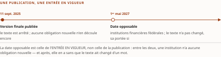

# Chapitre 25 — E-23 : le risque de modèle à l'ère de l'IA

*Livre III — Encadrer : orchestration en entreprise, cadre réglementaire canadien et terrain financier.
Deuxième mouvement — le cadre réglementaire canadien (ch. 25-30). Chapitre d'ouverture du mouvement :
il pose le régime prudentiel fédéral sur lequel les cinq suivants se situent.*

| Champ | Valeur |
|---|---|
| **Statut** | **Brouillon de rédaction, non publiable** — ⚠ **et ce chapitre porte l'écart de gouvernance le plus lourd du Livre.** Trois portes lui étaient opposables à la rédaction et **aucune n'était franchie** ; **une l'est depuis, une deuxième pour moitié, la troisième reste entière.** ☑ **G-3 est FRANCHIE le 28 juillet 2026** : le socle consolidé existe ([`socle-consolide.md`](../PRD/socle-consolide.md) v1.2, **159 entrées** `S-001`…`S-159`), et *le champ « socle consolidé à zéro entrée » cesse d'être vrai*. ☑ **Le volet de FAITS du résiduel de G-1 est levé** le même jour ; ☐ **ses deux autres volets restent dus** — l'**instruction des relèves atterrissant hors du Livre I** et les **obligations de pièce** des Livres II et III (PRD §5, rangée G-1) —, donc pour ce chapitre. ☐ **G-4 reste ouverte** — collation de fond contre le Vol. III rédigé, *ce chapitre cite le Vol. III, donc G-4 le conditionne nommément* (PRD §5) —, **son volet de fond entier**. ⚠ **Il est en outre bloqué nommément par la décision d'auteur D-9** : le lot d'instruction du § 17.5 est ouvert et **non clos**, et le PRD écrit que « les ch. 25 et 27 ne se lancent pas avant clôture du lot ». Il a été rédigé quand même, sur instruction d'auteur du 27 juillet 2026 ; **l'infraction est consignée, non effacée** — voir la note de statut, § 25.9. ⚠ **Une porte franchie ne rend pas la pièce recevable** : *elle retire une condition qui manquait, elle n'en atteste aucune.* |
| **Date de gel** | **27 juillet 2026** — gel unique, **D-1 prise** (registre : [`gel-2026-07-27.md`](../PRD/gel-2026-07-27.md)). ☑ **Volet de FAITS du résiduel de G-1 levé le 28 juillet 2026** ([registre](../PRD/gel-2026-07-28-volet-residuel.md)) : **sept des huit entrées consolidées** que ce chapitre mobilise ont été portées à leur source — `S-009`, `S-010` et `S-110` **☑ inchangées, partiellement** ; `S-112` **☑ inchangée** ; `S-023`, `S-113` et `S-114` **☐ non établies**, *accès refusé par l'hôte*. ⚠ **La huitième, `S-111`, ne l'a pas été** : elle reste **☐ due**, sa re-datation étant **sans objet** — sa source a jugé qu'aucune de ses composantes ne se périme par le calendrier (socle §2.4). *« Sans objet » ne veut pas dire « re-datée ».* ☐ **Les deux autres volets restent dus** : le point de la **relève v0.10** reçu au § 25.6 relève de l'**instruction des relèves**, et **les statuts des dispositifs de registre du § 25.5 ne sont nommés à aucun des deux volets** — ⚠ *ni l'un ni l'autre n'a été repris à la source primaire.* Gels de source consommés : **16-17 juillet 2026** (Vol. II ch. 9) et **21 juillet 2026** (Vol. III ch. 19) — ⚠ **aucun des deux ne tient lieu du gel de la somme**. ⚠ **Une échéance structure le chapitre et se re-mesure à chaque gel** : l'entrée en vigueur au **1ᵉʳ mai 2027**, dont tous les décomptes de jours ci-dessous dépendent |
| **Socle mobilisé** | ☑ **Le socle consolidé existe depuis le 28 juillet 2026** — [`socle-consolide.md`](../PRD/socle-consolide.md) v1.2, **159 entrées**, porte **G-3 franchie**. ⚠ **Les pièces n'ont PAS été re-citées en `S-nnn`** (PRD §7.1) : elles citent les identifiants sources préfixés, que les deux tables de correspondance résolvent — ici **Vol. II F-09 + Vol. III H-04 → `S-009`**, **Vol. II F-10 → `S-010`**, **Vol. II F-25 + Vol. III H-05 → `S-023`**, **Vol. III F-64 à F-68 → `S-110` à `S-114`**. Les énoncés résolvent contre le **Vol. II *Monographie* ch. 9**, dont l'entrée **F-09** est **[A/B mixte]** — ⚠ **et l'ordre des rangs se lit correctement : dans ce socle, [B] est *sous* [A]**, l'énumération [A] étant **close** ; **F-10** est **[A]** — et contre le **Vol. III *Monographie* ch. 19**, dont **F-64**, **F-65**, **F-66**, **F-67** et **F-68** sont en **[B]** — ⚠ **F-25 et F-68 sont citées en renvoi seulement**, au § 25.1, pour la concordance des deux entrées en vigueur —, l'entrée héritée **H-04** en **[A/B mixte]** et **H-05** en **[A]**. ⚠ **Deux séries F-xx coexistent et se préfixent à chaque emploi** (décision 7 du TOC) : F-09, F-10 et F-25 sont **du Vol. II**, F-64 à F-68 **du Vol. III**. ⚠ **Un seul énoncé est avancé comme central** — *que les analystes juridiques canadiens tiennent la couverture pour acquise* (§ 25.3) —, et la strate **[A]** de `S-009` **le porte nommément**, votée 3-0 à sa source — ⚠ **et cet emploi central re-lit `F-09` au PRD du Vol. II §7.3, non la ligne consolidée, comme la réserve 7 du socle l'impose** ; **aucun autre énoncé de la pièce n'est central au sens de CA-IV-01**, et ⚠ **aucun ne l'est sur une composante non re-vérifiée** — borne posée au franchissement de G-3. *Ce franchissement n'a conduit aucun vote adversarial : il reste dû pour toute entrée appelée à porter un fait central.* |
| **Garde-fous balayés** | ⚠ **Décomptes re-mesurés au commit du 28 juillet 2026, repris à la passe de relecture puis à la contre-relecture du même jour — quatorze cardinaux, ventilation par section comprise, aucun n'ayant bougé —, règle de comptage de la décision 16 du TOC** : *ils portent sur le **marqueur littéral** dans le **corps** — en-tête et note de statut exclus —, et **là où le garde-fou est appliqué sans que son identifiant soit écrit, c'est le domaine balayé qui est déclaré, sans cardinal**.* Vol. II — **PRD Vol. II §8.2.4 (couverture E-23 = inférence d'analystes) : trois occurrences du renvoi**, note de collation de tête, § 25.0 et § 25.3 ; **PRDPlan Vol. II §4.4 — écrire « attendu par E-23 », jamais « exigé » : deux occurrences du renvoi**, § 25.2 et § 25.6 ; ⚠ *la formule imposée elle-même est **appliquée aux § 25.2, § 25.5, § 25.6 et § 25.7**, et le § 25.6 en porte le siège d'énoncé — **son décompte n'est pas re-mesurable au marqueur et n'est donc pas annoncé*** ; **PRD Vol. II §8.2.6 (projections) : une occurrence du renvoi**, § 25.8 ; **R-1 à R-8 : zéro occurrence**. Vol. III — **R-06 (modalité d'E-23) : quatre occurrences du sigle**, § 25.2, § 25.4, § 25.6 et § 25.7 — *le siège est le §19.1 de sa source, et le présent chapitre l'applique sans le re-poser* ; **R-14 (trois degrés d'absence) : trois occurrences du sigle**, § 25.3, § 25.7 et § 25.8 — ⚠ *et les degrés se marquent en toutes lettres : « degré 1 » aux § 25.3, § 25.4 et § 25.7, « degré 2 » au § 25.5, « degré 3 » six fois — **cinq au § 25.4**, dont **quatre dans les cases du tableau 25.1** (Q-B, Q-C, Q-D, Q-E) et **une à sa légende**, plus **une au § 25.8** —, « fait négatif vérifié » six fois (§ 25.3, § 25.4, § 25.5 deux fois, § 25.7 deux fois) et « fait négatif établi » une fois au § 25.5* ; **R-11 (jalons visés, jamais fixés) : une occurrence du sigle**, § 25.4 ; **R-09 : une occurrence du sigle**, § 25.5 ; **R-07 : une occurrence du sigle**, § 25.5 — ⚠ **R-07 est le siège du §19.2 de la source et il est appliqué là, sans y être re-posé** ; **R-02 : une occurrence du sigle**, § 25.5 ; **R-01, R-03 à R-05, R-08, R-10, R-12, R-13 : zéro occurrence** |
| **Volumétrie cible** | ≈ **7 000 mots** de corps (§ 25.0 à § 25.8), **cible dérivée** de l'enveloppe du Livre — 90 000 mots au TOC v0.25 — au prorata des sections, ce chapitre en portant huit. ☑ **Décompte publiable depuis G-2** ; la mesure réelle est portée au [`README.md`](README.md) du dossier, par [`PRD/decompte.sh`](../PRD/decompte.sh). ⚠ **D-4 interdit l'amputation comme le gonflement** |

> **Thèse** *(citée depuis le [`TOC.md`](../PRD/TOC.md) v0.28, entrée du chapitre 25 — forme réalignée en v0.27, décisions 8 et 14, sur la remontée R-IV-83)* — E-23 couvre l'IA agentique *implicitement*, par sa définition de « modèle » — couverture par **inférence d'analystes**, **à traiter** comme acquise d'ici le 1ᵉʳ mai 2027 ; l'identité agentique est le prérequis technique d'obligations qui ne la mentionnent pas.

---

⚠ **La thèse a été collationnée contre le texte rédigé de ses deux sources avant la rédaction**
(décision 14 du TOC). **Domaine de balayage : une thèse examinée, une divergence trouvée — et elle
n'était pas de forme.** Le premier membre condensait la thèse du Vol. II ch. 9 en **retranchant son
qualificatif décisif** : la source écrit « couverture par inférence **d'analystes**, à traiter comme
acquise », et le plan portait alors « couverture par inférence que les institutions **doivent** traiter
comme acquise ». *Retirer « d'analystes » effaçait l'objet même du garde-fou **PRD Vol. II §8.2.4**,
et « doivent » transformait en prescription ce que la source marque expressément comme une **lecture
de l'auteur** fondée sur une asymétrie de risque.* Le second membre reprenait fidèlement la conclusion
du Vol. III ch. 19. **La pièce a cité la thèse verbatim, comme le PRD l'exige, et écrit son corps sous
la forme bornée** ; l'écart a été remonté (§ 25.9, remontée **R-IV-83**) et **arbitré ailleurs** — le TOC v0.27
a réaligné la thèse sur la forme bornée, et **le bloc de tête ci-dessus la cite désormais dans cette
forme, depuis la v0.28** (passe de correction du 28 juillet 2026). *Le corps du chapitre n'a pas
bougé : il était déjà écrit sous la forme que le plan porte aujourd'hui.*

## § 25.0 — Ouverture : deux façons pour un régulateur d'atteindre une technologie

Il existe deux façons pour un régulateur d'atteindre une technologie : la **nommer**, ou la **définir**.
La première est lisible, rassurante, et vieillit mal — le vocabulaire d'un secteur qui se réorganise
par trimestres périme les textes qui s'y accrochent. La seconde est austère, elle déplace le travail
d'interprétation vers l'assujetti, et elle survit aux modes. **La ligne directrice E-23 du Bureau du
surintendant des institutions financières a choisi la seconde.**

La conséquence pratique est immédiate pour l'architecte : le périmètre de son programme de risque de
modèle (*model risk*) n'est pas déterminé par ce que le Bureau a écrit sur l'IA agentique — **il n'a
rien écrit** — mais par ce que **sa définition de « modèle » attrape**, et par ce que des analystes
juridiques canadiens en concluent.

⚠ **C'est une position inconfortable, et il faut la tenir sans la travestir.** L'affirmation « E-23
couvre l'IA agentique » **n'est pas un fait du Bureau** ; c'est une **lecture d'analystes** (PRD
Vol. II §8.2.4). L'affirmation « une institution prudente doit s'y préparer comme si c'était acquis »
est une **recommandation d'architecture**. *Les deux sont défendables. Elles ne sont pas de même
nature, et la somme ne les confondra pas.*

**Ce que le chapitre ne traite pas.** Le **vide fédéral** est au ch. 26 ; le **régime québécois** au
ch. 27 ; le **droit des valeurs mobilières** au ch. 28 ; la **traduction en contraintes
d'architecture** au ch. 29, qui est le pivot du Livre ; le **maillage international** au ch. 30. ⚠ Et
la **relecture de la ligne directrice de l'AMF par la grille des cinq questions est au ch. 27**, qui en
est le siège : le présent chapitre ne porte que la **moitié E-23** du §19.1 de sa source.

## § 25.1 — Genèse et calendrier

Le socle établit **deux dates et un périmètre**, et il faut mesurer à quel point c'est peu. La
version finale d'E-23 a été **publiée le 11 septembre 2025**. Elle **entre en vigueur le 1ᵉʳ mai 2027**.
Elle **s'applique à toutes les institutions financières fédérales**, y compris les succursales
étrangères, dans la mesure compatible (Vol. II F-09, strate **[A]**).

**L'arithmétique du préavis décide des plans de mise en conformité.** Du 11 septembre 2025 au 1ᵉʳ mai
2027, le Bureau a accordé **dix-neuf mois et vingt jours** entre la publication de son texte final et
son opposabilité. ⚠ **Rapporté au gel de la somme — le 27 juillet 2026 —, le compte à rebours est plus
serré : il reste neuf mois et quatre jours.** *Une institution qui lirait ce chapitre à sa date de gel
disposerait donc d'un peu plus de trois trimestres pour inventorier, classer et encadrer ce qui, dans
son parc, relève de la définition examinée à la section suivante.*

⚠ **La date du 1ᵉʳ mai 2027 n'est pas isolée** : la ligne directrice sur l'intelligence artificielle de
l'Autorité des marchés financiers, dont traite le **ch. 27**, porte la même date d'entrée en vigueur
(Vol. II F-25 ; Vol. III F-68). *Cette convergence entre le régulateur prudentiel fédéral et le
régulateur intégré québécois est l'un des faits structurants du mouvement*, et le **ch. 27 § 27.1** en
fait l'examen. La conséquence de planification ne dépend d'aucune intention : **une institution dont
l'exploitation relève des deux régimes n'aura pas deux fenêtres de préparation successives, mais une
seule.**

⚠ **Les deux dates ne sont pourtant pas au même état de preuve, et l'écart date du franchissement de
G-3.** La date fédérale a été **re-constatée à sa source** au volet de faits du résiduel de G-1
(`S-009`, ☑ inchangée **partiellement** — l'entrée en vigueur est au nombre des composantes que la
reprise reconduit) ; les deux entrées qui portent la date québécoise sont **☐ non établies**
(`S-023` et `S-114`), pour un **motif d'accès** — l'hôte refuse les requêtes sur les quatre adresses
officielles du domaine de l'organisme. ⚠ **La conséquence est bornée et se tient** : *l'entrée en
vigueur québécoise reste celle que le socle porte*, mais **elle n'a pas été re-constatée au gel**, et
la borne du franchissement s'y applique — **aucun fait central ne repose sur cette composante**.
*Un fait d'entrée en vigueur est un fait à échéance : son absence de re-datation se déclare, elle ne
se présume pas stable.*

⚠ **Sur la genèse proprement dite, il faut être franc sur ce que le socle ne porte pas.** L'extraction
du texte intégral et de sa lettre d'accompagnement établit **trois éléments d'antériorité, et trois
seulement** : un **projet de 2023** a existé ; il incluait les régimes de retraite fédéraux,
**retirés du périmètre final** ; et le texte final répond à des **commentaires** qui demandaient de
**restreindre** la définition de « modèle ». Un indice s'y ajoute : le rapport conjoint du § 25.8
renvoie explicitement au cadre E-23. ⚠ **Le socle ne porte rien de plus** — ni le calendrier de la
consultation, ni le contenu du projet de 2023, ni la nature des travaux dont il procède. *Le chapitre
traite donc du **calendrier** d'E-23 bien plus que de sa genèse, et l'écart avec le titre que le plan
donne à cette section est signalé plutôt que comblé par du non-vérifié.*

Lecture de l'auteur — que le texte s'applique aux institutions financières **fédérales** signifie, par
simple lecture de sa portée, qu'il **ne s'applique pas** aux institutions relevant d'une supervision
provinciale — lesquelles ne sont pas pour autant sans obligations, comme le **ch. 27** l'établit pour
le Québec. **Ce que le socle établit** : une portée. **Ce qu'il n'établit pas** : les modalités selon
lesquelles le Bureau entend l'appliquer, ni le contenu de la réserve de compatibilité qui accompagne
les succursales étrangères. *Une institution qui bâtirait un argumentaire sur cette réserve devrait
remonter au texte lui-même.*

## § 25.2 — La définition de « modèle » et l'anticipation des systèmes autonomes

Tout, dans ce chapitre, tient à **une définition**.

Le socle en porte le libellé verbatim : « Application de techniques statistiques ou d'hypothèses
théoriques, empiriques ou fondées sur un jugement, **notamment des méthodes d'IA et d'AA**, qui traite
des données en entrée pour générer des résultats » (Vol. II F-09). ⚠ **L'inclusion n'est ni une clause
d'ouverture pour l'avenir, ni une note de bas de page : elle est au cœur du périmètre** — et la lettre
d'accompagnement établit que le Bureau a laissé la définition « **intentionally broad** » **en réponse
aux commentaires qui demandaient de la restreindre**.

Le socle établit un second élément, plus significatif encore : **le Bureau anticipe des modèles à
apprentissage et décision autonomes**. Il faut peser les deux termes.

Lecture de l'auteur — on entend ici par *apprentissage* autonome le fait qu'un modèle **modifie son
comportement sans qu'un opérateur l'y reprogramme**, et par *décision* autonome le fait qu'il ne se
contente pas de produire une sortie que quelqu'un interprétera : **il tranche**. **Ce que le socle
établit** : l'énoncé de l'anticipation. **Ce qu'il n'établit pas** : cette lecture des deux termes.
*Sous cette réserve, le régulateur prudentiel canadien a, dans un texte publié en septembre 2025,
envisagé des artefacts qui apprennent seuls et décident seuls.*

⚠ **C'est ici que se joue la thèse du chapitre, et c'est ici qu'il faut être le plus prudent.** Le
socle **n'établit pas** que le Bureau désignait par là les systèmes multi-agents, ni qu'il avait à
l'esprit l'architecture agentique telle que les Livres I et II la décrivent. **Le rapprochement entre
« décision autonome » au sens d'E-23 et l'autonomie des systèmes agentiques — dont le ch. 22 § 22.6 est
le siège — est une inférence d'auteur, non un fait du texte.** *Elle est fondée, elle est partagée par
les analystes examinés à la section suivante, et elle demeure une inférence.*

Lecture de l'auteur — un périmètre construit sur une **définition fonctionnelle** — ce qu'un artefact
*fait* — plutôt que sur une **nomenclature** — comment il *s'appelle* — a la propriété que l'architecte
recherche dans ses propres interfaces : *il ne se périme pas quand l'implémentation change de nom.* Un
texte qui aurait énuméré des familles de modèles serait aujourd'hui à réviser ; un texte qui définit le
modèle **par sa fonction** attrape ce qui n'existait pas quand il fut écrit. **Ce que le socle
établit** : la construction définitionnelle et son caractère intentionnellement large. **Ce qu'il
n'établit pas** : que ce soit le mécanisme par lequel E-23 rejoindrait l'agentique — c'est la lecture
des analystes du § 25.3. ⚠ *Et c'est aussi ce qui rend l'exercice inconfortable : l'assujetti doit
qualifier lui-même ce qui entre dans le périmètre, sans liste à cocher.*

**Reste ce que la ligne directrice attend concrètement, et la modalité commande tout.** ⚠ **E-23 est
fondée sur des principes** — **douze principes au conditionnel**, jamais à l'impératif. **On écrit donc
« attendu par E-23 », jamais « exigé par E-23 » ni « E-23 impose »** (PRD Vol. II §7.3 ; PRDPlan
Vol. II §4.4 ; R-06 du Vol. III, dont le siège est le §19.1 de sa source).

Sous cette modalité, **cinq domaines sont attendus** : un **cycle de vie** en cinq volets — conception,
revue, déploiement, surveillance, mise hors service —, « **not necessarily sequential** » ; un
**inventaire** des modèles au risque inhérent **non négligeable**, tenu **à l'échelle de l'entreprise**,
« accurate, evergreen, and subject to robust controls », dont un appendice fixe les champs minimaux ;
une **cote de risque par modèle**, l'intensité du dispositif devant être « commensurate with » le
risque ; des normes de **documentation de modèle** ; enfin une **surveillance continue** traitant les
défis propres à l'IA et à l'apprentissage automatique — « **autonomous decision making, autonomous
re-parametrization** » — et un potentiel accru de dérive.

⚠ **Ces cinq attentes relèvent de la strate [B] du socle du Vol. II, c'est-à-dire de sa strate la moins
éprouvée** : source primaire lue, **sans vote adversarial**. *L'énumération [A] est close et ne les
porte pas* — pas plus qu'elle ne porte l'anticipation de la décision autonome. **Et la qualification
d'un parc se mène sur le texte officiel du Bureau, non sur ce chapitre.**

⚠ **Les cinq attentes au socle sont : cycle de vie, inventaire, cotation, documentation, surveillance
continue. La « supervision humaine » n'en est pas une** — *ne pas l'ajouter à la liste*, quelle que
soit la vraisemblance qu'on lui prête. Le § 25.6 y revient, et il montre pourquoi cette exclusion
compte plus qu'on ne croit.

## § 25.3 — L'inférence agentique

Le mouvement atteint ici son point le plus délicat. ⚠ **La formulation qui suit est imposée par la
méthode** (PRD Vol. II §8.2.4), et rendue dans sa substance :

**E-23 ne nomme ni l'agentique ni les agents ; sa définition de « modèle » englobe les méthodes d'IA et
d'apprentissage automatique, d'où une couverture implicite que les analystes juridiques canadiens
tiennent pour acquise.**

Chaque membre porte du poids ; ils se reprennent un à un.

**« E-23 ne nomme ni l'agentique ni les agents »** est un **fait négatif vérifié** — degré 1 de
l'échelle R-14 du Vol. III : le texte n'emploie ni « agentique », ni « agent(s) », ni
« orchestration », **vérification mécanique conduite en anglais et en français sur le texte intégral**
(Vol. III H-04 ; Vol. II F-09, strate [B]). ⚠ **Ce n'est pas un oubli qu'on pourrait combler par une
lecture bienveillante ; c'est une absence, et elle est établie.** *Toute phrase de la forme « le Bureau
exige, pour l'IA agentique, que… » est fausse — non pas discutable, fausse — et la somme la proscrit.*

**« sa définition de "modèle" englobe les méthodes d'IA et d'apprentissage automatique »** est le fait
positif qui rend la suite possible : c'est la voie définitionnelle du § 25.2.

**« d'où une couverture implicite »** est la **charnière** — et c'est une **conclusion**, pas une
observation.

**« que les analystes juridiques canadiens tiennent pour acquise »** en désigne les auteurs, et c'est
ici qu'il faut être le plus rigoureux. ⚠ **Ce que le socle établit, c'est que ces analystes tiennent la
couverture pour acquise. Ce que le socle n'établit pas, c'est que la couverture existe.** *L'objet
vérifié est un état de l'opinion juridique canadienne, non un état du droit.* La nuance paraîtra
scolastique ; **elle sépare pourtant une note de conformité défendable d'une erreur de droit.**

Une précision de méthode s'impose, et elle vaut avertissement. Dans l'économie des sources du Vol. II,
les cabinets juridiques canadiens relèvent de la **corroboration secondaire** et **ne peuvent jamais
porter seuls un fait central**. *Leur convergence n'est donc pas invoquée ici comme preuve de la
couverture : elle en est l'objet même.* **Le fait central avancé par ce chapitre est un fait sur les
analystes, et il est sourcé comme tel.** ⚠ **Une seconde borne vient du Vol. III, et elle affaiblit
l'attribution plutôt qu'elle ne la renforce** : à son socle, **aucune analyse n'est nommée**, de sorte
que l'attribution y demeure **générique**. *Elle protège d'imputer l'inférence au régulateur ; elle ne
fournit pas de source à citer.*

**Reste la seconde moitié de la thèse, celle que tout responsable de la conformité posera : que
fait-on de cette inférence ?**

Lecture de l'auteur — on la traite comme acquise, **et l'on documente qu'on l'a fait par prudence
plutôt que par obligation établie**. Trois éléments convergent, dont **aucun ne suffit isolément**.
D'abord, les **cinq analyses nommées au socle du Vol. II** — McCarthy Tétrault, Torys, Blakes, BLG et
Sookman — aboutissent à la même lecture ; ⚠ *le socle
n'établit pas l'indépendance de leurs analyses, et la convergence n'est de toute façon pas une
preuve.* Ensuite, la définition atteint, selon cette lecture, les systèmes considérés, **par sa
construction fonctionnelle même**. Enfin, et c'est le point le plus fort, **le régulateur a lui-même
anticipé la décision autonome** : il n'est pas resté silencieux sur ce que ses assujettis allaient
déployer, **il a écrit qu'il l'attendait**.

À quoi s'ajoute une **asymétrie de risque**, et elle reste une lecture que le socle ne porte pas. *Se
tromper en tenant la couverture pour acquise coûte le prix d'une gouvernance surdimensionnée : un
inventaire trop large, des contrôles appliqués à des systèmes qui n'en relevaient pas. Se tromper en la
tenant pour inexistante coûte le prix d'un parc entier de systèmes décisionnels hors périmètre de
contrôle au 1ᵉʳ mai 2027, découvert par un tiers.* **Les deux erreurs ne sont pas commensurables, et
c'est cette asymétrie — non une attente du Bureau — qui fonde la recommandation.**

⚠ **C'est exactement le membre que la thèse citée en tête a durci.** Écrire que les institutions
« **doivent** traiter » la couverture comme acquise transforme cette asymétrie de risque en
prescription. *La source écrit « à traiter comme acquise » et marque la recommandation comme sienne ;
le corps de ce chapitre s'en tient à cette forme.*

## § 25.4 — Relecture d'E-23 par la grille des cinq questions

*Section **reçue du Vol. III *Monographie* §19.1, moitié E-23 seule** — la moitié AMF est au **ch. 27
§ 27.5**, qui en est le siège désigné.*

⚠ **La grille des cinq questions s'applique par mécanisme, non par produit** (ch. 14 § 14.1, règle
d'emploi 1) — *et une ligne directrice prudentielle n'est ni l'un ni l'autre.* **La lecture conduite
ici est donc inversée** : elle ne demande pas ce que le texte **produit** comme réponse, mais **ce
qu'il suppose que l'institution puisse établir**.

⚠ **Conséquence tenue jusqu'au bout : aucun des trois verdicts de la grille n'est rendu ici.** *En
rendre un reviendrait à traiter une ligne directrice comme un mécanisme* — et le ch. 14 § 14.1 pose
qu'il n'existe **aucun quatrième verdict de complaisance**. La cinquième règle du même siège s'applique
donc partout : **là où le corpus est muet, la case reste vide, et la case vide déclare l'état de la
preuve, jamais une note intermédiaire.**

**La modalité d'abord, parce qu'elle commande tout le reste.** Le Vol. III l'a vérifiée sur pièce : les
**douze énoncés numérotés** d'E-23 sont au conditionnel, et le balayage du corps de la version anglaise
en rendu HTML, consulté le 21 juillet 2026, **n'y relève aucune occurrence des trois formes
impératives cherchées** (Vol. III F-64, **[B, degré 1]** — *fait négatif vérifié*). ⚠ **Deux bornes
voyagent avec ce décompte et ne s'en détachent pas** : l'appendice n'a pas été extrait, et **le volet
français n'a pas été balayé par ce lot**. *L'entrée héritée H-04 porte, elle, une vérification en deux
langues sur le texte intégral ; le relevé du Vol. III la reproduit indépendamment sur le seul rendu
anglais, et le présenter comme bilingue serait perdre sa borne.*

⚠ **Une nuance borne la règle sans l'infirmer, et il serait facile de surcorriger.** Le corps de la
page officielle porte lui-même la formule « This principles-based guideline sets out our expectations
for effective enterprise-wide model risk management » ; et le radical « requir » y apparaît, mais dans
des syntagmes qui qualifient **ce que le cadre interne de l'institution doit définir**, non une
obligation que le Bureau poserait en son propre nom. *« Attendu par E-23 » reste donc exact ; « E-23 ne
parle jamais d'exigences » serait faux.* **La règle vise la modalité des énoncés du régulateur, non le
vocabulaire du texte.**

**Ce que l'institution devrait tenir.** Le texte porte un inventaire d'entreprise des modèles « whose
inherent risk is determined to be non-negligible to the institution » ; le cycle de vie y compte
**cinq composantes** et vise nommément la prise de décision autonome et la reparamétrisation autonome
(Vol. III F-65). **Deux observations en découlent, et la seconde est souvent perdue.** La première :
l'inventaire est attendu **à l'échelle de l'entreprise**. La seconde : ⚠ **il n'est pas universel** —
la qualification est dans la citation même, et elle porte sur les modèles **dont le risque inhérent est
jugé non négligeable par l'institution**. *Un inventaire attendu sous condition de matérialité n'est
pas un inventaire de tout ce qui s'exécute.*

| Question *(ch. 14 § 14.1)* | Ce qu'E-23 suppose que l'institution puisse établir |
|---|---|
| **Q-A** *qui es-tu* | Un inventaire d'entreprise des modèles à risque inhérent non négligeable **suppose que chaque entrée désigne un objet distinct et durablement identifiable** (Vol. III F-65 ; H-04) — *le seul appui net des cinq* |
| **Q-B** *qui t'a créé* | Le cycle de vie s'ouvre à la **conception** et la documentation figure parmi les composantes attendues (Vol. III H-04, F-65) — provenance **organisationnelle**, non chaîne de provenance jusqu'à une autorité d'émission avec son ancrage de confiance : **ce second terme est au degré 3** |
| **Q-C** *pour qui agis-tu* | ⚠ **Case vide, degré 3** — le socle ne documente aucune attente portant sur une chaîne de mandat interrogeable à l'instant t |
| **Q-D** *que peux-tu faire* | Cotation graduée et triage par la matérialité (Vol. III H-04, F-65) — une **classification par le risque**, **non des bornes de privilège opposables au point d'application** : ce second terme est **au degré 3** |
| **Q-E** *qui en répond* | ⚠ **Case vide, degré 3** — aucune entrée ne documente une attente d'imputabilité traçable jusqu'à une personne ou une entité juridique |

: Tableau 25.1 — Lecture **inversée** de la grille des cinq questions sur E-23, au 21 juillet 2026. ⚠ **Aucun verdict de la grille n'est rendu** : une ligne directrice n'est pas un mécanisme. *Une case au degré 3 ne dit pas que le cadre est muet ; elle dit que ce corpus-ci l'est.*

⚠ **Un écart hérité se déclare ici plutôt qu'il ne se corrige.** La thèse du chapitre 19 du Vol. III
porte « les cadres… **exigent** un inventaire des modèles **et une imputabilité** », et **sa propre
pièce déclare trois écarts avec elle** : le verbe « exigent » est celui que R-06 proscrit à
l'affirmatif ; ⚠ **aucune entrée du socle ne documente une attente d'imputabilité** dans l'un ou
l'autre texte — le corpus porte un inventaire, un cycle de vie, une cotation, une documentation et une
surveillance continue, **non une chaîne d'imputabilité** ; et la datation de la publication de la ligne
directrice de l'AMF n'est pas au jour près à sa source. *Les trois sont des écarts de la source avec
elle-même, déclarés chez elle et repris ici sans être réécrits.* **Le tableau ci-dessus les tient :
Q-E est une case vide.**

⚠ **Et l'échéance se dit au bon régime.** Le 1ᵉʳ mai 2027 est une **échéance datée**, donc
**PROGRAMMÉE** au tri prospectif — *à ne jamais confondre avec un jalon **visé*** (R-11 du Vol. III) :
*un texte publié à entrée en vigueur future n'est pas une cible d'organisme.* Le **ch. 21 § 21.1** est
le siège des jalons visés, et il n'est pas repris ici ; ⚠ **le tri prospectif lui-même — PROGRAMMÉ /
PROJETÉ / SPÉCULATIF — a son siège au ch. 49 § 49.0**, *appliqué ici et jamais re-dérivé*.

## § 25.5 — Le registre du ch. 15 comme pièce de conformité

*Section **reçue du Vol. III *Monographie* §19.2**. ⚠ **Le registre lui-même est au ch. 15**, qui en est
le siège d'émission dans la somme ; **le présent chapitre le lit depuis un cadre prudentiel** et ne le
reconstruit pas.*

Lu depuis un cadre prudentiel, **le registre n'est plus un annuaire de résolution : c'est un
inventaire**. Reste à savoir ce qu'il faudrait qu'il porte pour valoir pièce dans un dossier — et **le
socle permet d'en dire moins qu'on ne l'attendrait**.

Ce que les chapitres amont établissent tient en trois lignes. **Quatre dispositifs prescrivent quelque
chose du registre, et trois d'entre eux déclarent eux-mêmes n'être portés par aucune norme ratifiée** :
un brouillon de laboratoire par son propre statut ; un *Internet-Draft* en **unique version**, sans flux
ni adoption par un groupe de travail, **expiré** ; un second *Internet-Draft* de **soumission
individuelle**. ⚠ **Ce sont des travaux émergents, non des normes ratifiées** (R-09 du Vol. III), et le
**ch. 15** en porte l'inventaire daté. **Des quatre, le seul dont le socle porte des champs
obligatoires est le brouillon de laboratoire** — deux champs, de portée et d'outillage.

⚠ **Le garde-fou, appliqué à son objet.** *Le rapprochement entre le schéma de profil d'agent d'un
registre et l'inventaire attendu par E-23 est une **inférence d'auteur*** (R-07 du Vol. III, dont le
siège est le §19.2 de sa source). **La règle vaut pour toute correspondance entre un composant et une
attente réglementaire, sans exception d'usage illustratif.** Sa clause renforcée — « l'éditeur ne
revendique aucune conformité, et aucune source ne documente ce lien », **fait négatif établi**,
degré 2 — n'est attachée nominalement qu'à **un seul objet** au socle du Vol. III. ⚠ **Pour les quatre
dispositifs de registre, le socle ne documente pas de lien avec E-23 : c'est une absence de
documentation dans le corpus, non un fait négatif vérifié.** *Les deux formules ne s'échangent pas :
l'une dit qu'on a cherché et consigné une réserve, l'autre dit qu'on est muet.*

⚠ **Ce que la comparaison supposerait, et qui manque.** Confronter les champs d'un schéma de registre
aux attributs d'un inventaire prudentiel **suppose de connaître les seconds**. Or **l'appendice d'E-23
qui porte les champs minimaux de l'inventaire n'a pas été extrait** par le lot d'instruction du
Vol. III — **niveau [C]**, source repérée et non extraite. *La comparaison attribut par attribut, qui
est la matière propre de cette section, ne peut donc pas être conduite sur son terme décisif* — et
**le chapitre le dit plutôt que de la simuler à partir des champs qu'il connaît d'un seul côté**.

Lecture de l'auteur — **ce que le socle établit** : E-23 attend un inventaire d'entreprise des modèles
à risque inhérent non négligeable et une surveillance continue visant la prise de décision autonome et
la reparamétrisation autonome ; un brouillon de laboratoire prescrit deux champs obligatoires de
portée et d'outillage. **Ce qu'il n'établit pas** : que le second réponde au premier, qu'une
inscription au registre vaille pièce de conformité, ni qu'un attribut manquant d'un côté ait un
correspondant de l'autre. *La lecture proposée est plus étroite que la thèse du chapitre* : **un
inventaire attendu à l'échelle de l'entreprise suppose que chaque entrée désigne quelque chose
d'identifiable, et c'est la seule des cinq questions que le texte présuppose sans ambiguïté.** ⚠ **La
surveillance continue, elle, appelle une fraîcheur qu'aucun régime d'états relevé ne fixe** — et
l'entrée qui documente ce régime est en **[C]** : *elle ne peut porter ce constat que par
corroboration.*

⚠ **Un mécanisme se qualifie par ce que sa spécification démontre** (R-02 du Vol. III) : *un champ
obligatoire dans un schéma démontre qu'une valeur doit être présente ; il ne démontre pas qu'elle soit
opposable au point d'application.* **Le ch. 14 § 14.2 a rendu ce verdict — bornes déclarées,
opposabilité non établie — et le présent chapitre ne le rouvre pas.**

**La quatrième pièce du passeport, et son second siège.** ⚠ Ce chapitre est, avec le **ch. 15**, l'un
des deux endroits où sont traitées les **attestations de conformité**, quatrième pièce du passeport
d'agent — *objet de synthèse construit par la somme, qui ne figure dans aucune spécification* (**siège
au ch. 16**). ⚠ **Elle n'a pas de chapitre, et le risque 17 du TOC le déclare.** Ce que le versant
réglementaire y ajoute est **négatif, et il faut l'écrire** : **le socle ne documente pas qu'E-23 ou la
ligne directrice de l'AMF prévoient une attestation de conformité, une certification ou un référentiel
d'audit opposable — absence de documentation dans le corpus, non un fait négatif vérifié.**
*L'asymétrie entre les quatre pièces se déclare ainsi plutôt qu'elle ne se masque.*

## § 25.6 — La surveillance continue attendue par E-23, et la limite empirique de la supervision humaine

⚠ **Formulation imposée, rappelée à l'ouverture de la section qui la met le plus à l'épreuve** : on
écrit « **la surveillance continue attendue par E-23** », jamais « exigée par E-23 » ni « E-23 impose
une surveillance continue » — *ligne fondée sur des principes, rédigée au conditionnel* (PRD Vol. II
§7.3 ; PRDPlan Vol. II §4.4 ; R-06 du Vol. III).

**Des cinq domaines du § 25.2, la surveillance continue est celui dont le libellé nomme le plus
directement l'objet de la somme** : il traite des défis propres à l'IA et à l'apprentissage
automatique, et **nomme la prise de décision autonome et la reparamétrisation autonome**. *C'est la
seule attente dont le texte nomme les opérations autonomes qu'il faut traiter, là où la cotation ne
fait de l'autonomie qu'un facteur d'appréciation.*

Lecture de l'auteur — cette attente rencontre directement la distinction posée au **ch. 22 § 22.8**
entre **adaptation** — éphémère, d'instance — et **évolution** — persistante, du modèle de processus.
*Une reparamétrisation autonome est, dans ce vocabulaire, une évolution ; et un système qui traite les
deux par le même chemin technique rend indétectable, dans ses journaux, le moment où une exception est
devenue une règle.* **Ce que le socle établit** : que la surveillance continue attendue vise nommément
la reparamétrisation autonome. **Ce qu'il n'établit pas** : le rapprochement avec la distinction du
manifeste, qui est une construction de la somme, ni qu'il faille deux régimes d'autorisation distincts.

⚠ **Un point de la relève v0.10 du TOC atterrit ici, et il est reçu.** Les harnais documentés en 2026
résolvent les permissions par une chaîne ordonnée de règles à premier appariement gagnant, dont l'un
des maillons est un **mode d'auto-approbation globale**. **Le point assigné à ce chapitre est le
suivant : un mode d'auto-approbation globale n'est pas un contrôle au sens de la surveillance continue
attendue par E-23.** ⚠ **Il est reçu comme *cas*, jamais comme fondement** — et **il n'est pas
instruit** : le volet résiduel de G-1 ne l'a pas repris à la source primaire. *C'est un repérage, non
un fait.* ⚠ **L'arrivée est déclarée ici ; le second point de la même relève, assigné au ch. 17, n'y
figure pas** — l'écart est remonté au ch. 22 § 22.7 (remontée R-IV-76) et n'est pas doublé ici.

**Reste la limite que ce chapitre rencontre et ne peut pas franchir.** La surveillance continue
attendue suppose que **quelqu'un surveille**. ⚠ **Le ch. 17 § 17.5 est le lieu où la somme traite du
biais d'automatisation et de la supervision de façade — et il déclare son propre vide** : le socle n'y
porte aucune mesure de l'efficacité de la supervision humaine, la section expose la question
instruisible plutôt que d'écrire une doctrine, et **c'est la remontée R-IV-27 qui a ouvert la décision
d'auteur D-9**.

⚠ **La conséquence pour le présent chapitre est directe, et elle est la raison de son blocage.** *Un
cadre dont la parade est un humain qui révise suppose que cet humain révise* ; la surveillance continue
attendue par E-23 est **une parade de cette famille**, et **la somme déclare ne rien savoir de son
efficacité empirique**. **D-9 a ouvert un lot d'instruction et maintenu le blocage** : le lot **n'est
pas clos**, et ce chapitre a été rédigé quand même. *L'infraction est consignée au § 25.9 ; l'arbitrage
qui la suivra ne la rattrapera pas.*

⚠ **Et il faut redire ici ce que le § 25.2 a posé** : **la « supervision humaine » n'est pas l'une des
cinq attentes au socle.** *Le chapitre parle donc de la limite empirique d'une parade que le texte
n'attend pas nommément, et qui n'en est pas moins celle sur laquelle toute mise en œuvre de la
surveillance continue reposera.* **Le ch. 27 § 27.3 rencontrera la même limite du côté québécois, où
elle porte sur une obligation légale et non sur une attente.**

## § 25.7 — Ce que les cadres n'exigent pas — ne pas leur faire dire plus

*Section **reçue du Vol. III *Monographie* §19.3**.*

⚠ **Le titre de cette section, cité du plan, emploie au négatif le verbe que R-06 du Vol. III proscrit
à l'affirmatif.** *La section existe précisément pour empêcher le glissement inverse : dire d'un cadre
qu'il attend ce qu'il attend, et rien de plus.* **Trois degrés d'absence structurent ce qui suit, et
les confondre est la faute que R-14 proscrit.**

**Premier degré — fait négatif VÉRIFIÉ, et il est borné.** Les douze énoncés numérotés d'E-23 sont au
conditionnel ; le balayage du corps de la version anglaise n'y relève **aucune des trois formes
impératives cherchées** (Vol. III F-64). Sur un second axe, la vérification mécanique héritée, conduite
**en anglais et en français** sur le texte intégral, donne : « agentique » = 0, « agent(s) » = 0,
« orchestration » = 0, « autonom\* » = 8, et ⚠ **« fiche de modèle » / « model card » = 0 occurrence**.
*On écrit donc « **documentation de modèle** » et « **inventaire** », jamais « fiche de modèle ».*

⚠ **Ce que ces décomptes autorisent s'arrête là où ils s'arrêtent.** De ce qu'un texte **ne nomme pas**
l'agent, **on ne conclut pas qu'il ne le couvre pas** : *ce que le balayage établit est l'absence de
quatre chaînes dans ce texte-là, à cette date-là.*

**Deuxième degré — comment un commentaire d'éditeur devient une disposition.** L'expression
« transition period » **ne figure pas** dans le corps de la ligne directrice tel que rendu en HTML ;
elle est portée par le **document d'information du Bureau du 11 septembre 2025** (Vol. III F-66,
**[B, degré 1]**). ⚠ **Le point est tranché : il s'agit d'un délai d'entrée en vigueur commenté par
l'éditeur, non d'une disposition transitoire du texte.** *Une institution qui inscrirait à son dossier
« E-23 prévoit une période de transition de dix-huit mois » citerait un communiqué en croyant citer une
norme.* ⚠ **La borne du relevé demeure** : il porte sur le rendu HTML anglais de cette page, ni sur le
document en format d'impression, ni sur la version française.

**Troisième degré — ce dont ce corpus est muet.** ⚠ **Le socle ne documente pas qu'E-23 prescrive un
registre, un annuaire ou une identité technique : c'est une absence de documentation dans le corpus,
non un fait négatif vérifié.** ⚠ **Il ne documente pas davantage que la ligne directrice de l'AMF nomme
les agents ou l'agentique** — même degré, même régime, et **le ch. 27 en est le siège**.

*Ces trois degrés sont ce que la thèse du chapitre a de plus fragile et de plus honnête à la fois :
l'identité agentique est présentée comme le **prérequis technique** d'obligations qui ne la mentionnent
pas — **une inférence, opposable comme telle et pas autrement.***

## § 25.8 — Le rapport BSIF-ACFC : une trajectoire déclarée et une causalité indéterminable

Moins d'un an avant la publication de la version finale d'E-23 — le **24 septembre 2024**, onze mois et
dix-huit jours plus tôt —, le Bureau et l'Agence de la consommation en matière financière du Canada
publiaient un rapport conjoint dont le socle retient **deux apports** (Vol. II F-10, **[A]**). *Ils sont
de nature très différente, et le second importe davantage.*

**Le premier est une trajectoire d'adoption.** ⚠ **Projection, attribuée à ses auteurs comme la méthode
l'impose** (PRD Vol. II §8.2.6) : selon ce rapport conjoint, l'adoption de l'intelligence artificielle
par les institutions financières fédérales serait passée d'environ **30 % en 2019** à environ **50 % en
2023**, et **le Bureau et l'Agence projettent une adoption d'environ 70 % d'ici 2026 — une projection
issue d'une enquête auto-déclarée, non un taux observé.**

**L'arithmétique mérite d'être posée.** De 2019 à 2023, quatre ans, la progression
déclarée est de vingt points — soit cinq points par an. De 2023 à 2026, trois ans, la progression
*projetée* est également de vingt points — soit environ **six virgule sept points par an**. ⚠ *La
projection ne prolonge donc pas la tendance déclarée : elle l'accélère d'un tiers.* C'est une
observation arithmétique sur les chiffres du rapport, **non un jugement sur sa méthode** ; mais elle
indique où porterait le doute d'un lecteur exigeant.

⚠ **Une seconde observation s'impose : les trois chiffres proviennent d'une enquête auto-déclarée** —
ils mesurent ce que des institutions ont déclaré d'elles-mêmes, **sans définition commune extraite au
socle de ce qui compte comme « adoption de l'IA »**. *Le ch. 7 formulait le même avertissement à propos
des métriques d'adoption des protocoles ; il vaut ici sans changement.*

⚠ **La projection est-elle advenue ? La question a été portée à la source, et elle reste ouverte.**
L'horizon de la projection — l'année 2026 — est le présent de ce chapitre, et le **volet de faits du
résiduel de G-1**, exécuté le 28 juillet 2026, a repris l'entrée à sa source primaire (`S-010`,
☑ inchangée pour ses trois chiffres et son renvoi à E-23). ⚠ **Ce que la reprise établit est un
manque, et le manque porte son degré** : **aucune mesure de réalisation de la projection 2026 n'est
portée par la source** alors que l'échéance court — **absence de documentation, degré 3 de l'échelle
R-14 du Vol. III**. *On n'écrit donc ni que le seuil de 70 % est atteint, ni qu'il ne l'est pas ;
aucune inférence n'est proposée ici, et notamment aucune extrapolation de la trajectoire déclarée.*

**Le second apport est d'une tout autre portée, et il justifie la place de ce chapitre en tête du
mouvement.** Le rapport conjoint caractérise un **risque de modèle accru propre à l'IA**, et il le fait
en deux temps : un très grand nombre de **paramètres appris de façon autonome** ; des **relations
causales entre entrées et sorties souvent indéterminables**. ⚠ **Le rapport rattache explicitement ce
constat au cadre E-23.**

⚠ **Ce membre de phrase est le plus lourd de conséquences du chapitre.** Que les relations causales
soient *souvent indéterminables* n'est pas une remarque sur la difficulté de l'explicabilité : **c'est
un constat, posé par le régulateur prudentiel canadien et par l'agence de protection des
consommateurs, sur les limites de ce qu'on peut extraire du modèle lui-même.**

Lecture de l'auteur — si l'on ne peut pas, en général, déterminer par quel chemin causal une entrée a
produit une sortie, alors **l'explication d'une décision ne peut pas être obtenue en interrogeant le
modèle *a posteriori***. Elle doit être **produite ailleurs** — par l'architecture qui entoure le
modèle, qui enregistre ce qui lui a été soumis, quelles bornes lui étaient imposées, quel chemin
d'exécution a été suivi et quels contrôles se sont appliqués. **Ce que le socle établit** : le constat
d'indéterminabilité. **Ce qu'il n'établit pas** : cette conséquence d'architecture. ⚠ *Mais c'est cette
inférence qui fait le pont du mouvement vers le **ch. 29**, qui en fait son pivot — et elle croise
l'obligation d'explication de l'art. 12.1, dont le **ch. 27** porte le texte et les réserves.*

**Reste enfin ce que la chronologie révèle.** Le rapport du 24 septembre 2024 rattachait **déjà** le
risque de modèle propre à l'IA au cadre E-23 ; la version finale d'E-23, publiée moins d'un an plus
tard, inclut explicitement les méthodes d'IA dans sa définition de « modèle » **et anticipe la décision
autonome**. *Les deux textes se répondent.*

Lecture de l'auteur — cette continuité **renforce la lecture des analystes** du § 25.3 : le Bureau n'a
pas rencontré l'IA par accident au détour d'une définition générale, **il l'avait identifiée comme un
facteur de risque de modèle et l'avait explicitement routée vers E-23 un an auparavant**. **Ce que le
socle établit** : les deux faits et le lien du rapport vers E-23. **Ce qu'il n'établit pas** :
l'intention que cette lecture prête au régulateur.

### Synthèse : ce que le chapitre lègue à la somme

*Section de sortie sans homologue direct dans la source — construction d'éditeur.*

1. **Le calendrier, mesuré une fois.** Dix-neuf mois et vingt jours de préavis ; **neuf mois et quatre
   jours restants au gel de la somme** ; **entrée en vigueur simultanée avec le régime québécois**. Le
   **ch. 27 § 27.1** le reprend du côté de l'AMF, le **ch. 29** en tire l'ordre de priorité.
2. **La voie définitionnelle, et sa proscription.** E-23 attrape par ce qu'un artefact **fait**, non
   par son nom. *Toute phrase de la forme « le Bureau exige, pour l'IA agentique » est fausse* — le
   **ch. 29 § 29.1** l'écrit à sa table de traduction, et **aucun chapitre aval ne la reformule
   autrement**.
3. **Les cinq attentes au socle, et la sixième qui n'y est pas.** Cycle de vie, inventaire, cotation,
   documentation, surveillance continue — ⚠ **la « supervision humaine » n'en est pas une.** Posé ici
   une seule fois ; le **ch. 29** dérive cinq contraintes de ces cinq attentes et **pas une sixième**.
4. **La lecture inversée de la grille, et son résultat.** *Un seul appui net sur cinq questions* — Q-A,
   par l'inventaire. Le **ch. 27 § 27.5** conduit la même lecture sur l'AMF et **n'y trouve rien de
   plus**.
5. **L'indéterminabilité causale, et ce qu'elle déplace.** L'explication ne s'extrait pas du modèle :
   elle se produit **autour** de lui. C'est la prémisse que le **ch. 29** convertit en contrainte, et
   que le **ch. 31 § 31.3** rencontre du côté de l'auditabilité financière.
6. **Un blocage déclaré plutôt que contourné.** La surveillance continue attendue repose sur une parade
   humaine **dont la somme déclare ne rien savoir de l'efficacité** (ch. 17 § 17.5, D-9). *Le chapitre
   l'écrit à son § 25.6 au lieu de la présumer efficace.*

⚠ **Ce que le chapitre ne lègue pas.** Il ne lègue **aucune attente du Bureau pour l'IA agentique** :
la couverture est implicite, par la définition de modèle, et son caractère acquis est une **inférence
d'analystes** que la somme rapporte **sans l'endosser comme état du droit**. Il ne lègue **aucun taux
d'adoption** : les trois chiffres du § 25.8 viennent tous d'une enquête auto-déclarée, et le seul qui
vise 2026 est une **projection dont la réalisation n'est documentée nulle part au socle**. Il
ne lègue **aucune comparaison des attributs d'inventaire** : l'appendice qui les porte n'a pas été
extrait. Et il ne lègue **aucune mesure de l'efficacité de la supervision humaine**.

---

## § 25.9 — Note de statut *(hors plan — à retirer à la publication)*

⚠ **Cette section n'est pas au TOC et n'a pas vocation à survivre.** Elle consigne l'écart de
gouvernance sous lequel la pièce a été rédigée (PRD, Annexe A) : *un rédacteur ne corrige jamais le
TOC, ce PRD ni le Conspectus — il **remonte**.*

**Ce qui est enfreint — et ce chapitre en porte plus que tout autre du Livre.**

1. ⚠ **La décision d'auteur D-9 est enfreinte nommément.** Le PRD v0.9 écrit : « les **ch. 25 et 27** ne
   se lancent pas avant clôture du lot [d'instruction du § 17.5] », au titre de la règle d'escalade —
   *une remontée « bloquant pour le ch. N » interdit de lancer le ch. N*. **Le lot est ouvert et non
   clos.** Le chapitre a été rédigé sur **instruction d'auteur du 27 juillet 2026**, et **la parade que
   D-9 protège est exactement celle que le § 25.6 mobilise**. ⚠ *L'infraction est consignée à la pièce
   et ne sera pas effacée par l'arbitrage qui la suivra* — c'est le régime que D-7 a appliqué au ch. 6,
   et il vaut ici à l'identique.
2. ⚠ **La porte G-4 conditionne ce chapitre et n'est pas franchie.** Le PRD §5 écrit que G-4 conditionne
   « **toute entrée citant le Vol. III** » : les § 25.4, § 25.5 et § 25.7 en proviennent intégralement.
   *Son volet structurel est levé ; son volet de fond — confrontation adversariale des gloses et thèses
   au texte, par lectures indépendantes chargées de réfuter — reste entier.* ⚠ **Et le Vol. III se
   déclare lui-même non publiable** : quinze remontées ouvertes, dont **six touchent la matière du
   Livre II** au relevé du PRD §13 — *le relevé n'a pas été refait pour le Livre III, et il est dû.*
3. ☑ **La porte G-3 était ouverte à la rédaction ; elle est FRANCHIE depuis le 28 juillet 2026.**
   L'Annexe B existe — [`socle-consolide.md`](../PRD/socle-consolide.md) v1.2, **159 entrées** —, et les
   huit entrées de ce chapitre s'y résolvent par les deux tables de correspondance. ⚠ **Trois bornes du
   franchissement s'appliquent ici** : *aucun vote adversarial n'a été conduit* et il reste dû pour
   toute entrée appelée à porter un fait central ; *aucun énoncé n'a été confronté à sa source
   primaire*, la refonte portant sur les PRD des volumes ; et **aucun fait central ne repose sur une
   composante non re-vérifiée**. Les identifiants cités appartiennent à **deux séries distinctes** et
   restent préfixés à chaque emploi (décision 7), les pièces n'ayant pas été re-citées en `S-nnn`.
4. ☑ **Le volet de FAITS du résiduel de G-1 est levé** le 28 juillet 2026, et la projection d'adoption
   de 2026 en fait partie — issue au § 25.8. ☐ **Le volet des obligations de pièce reste dû** : ni les
   statuts des dispositifs de registre du § 25.5, ni le point de la relève v0.10 reçu au § 25.6 n'ont
   été repris à la source primaire.
5. **Les décomptes sont publiables** (G-2). L'écart à la cible est relevé au [`README.md`](README.md) du
   dossier et alimente **D-4**, déjà tranchée.
6. ☑ **Plus aucun renvoi de ce chapitre n'est un renvoi de plan** : les cinquante pièces de la somme
   sont rédigées depuis le 27 juillet 2026, et **les renvois ont été re-vérifiés contre le texte**,
   comme la décision 8 l'exige d'un renvoi de plan qui survit à la rédaction de sa cible. **Tous
   résolvent** : **ch. 7**, **ch. 14 § 14.1 et § 14.2**, **ch. 15**, **ch. 16**, **ch. 17 § 17.5**,
   **ch. 21 § 21.1**, **ch. 22 § 22.6, § 22.7 et § 22.8**, **ch. 26**, **ch. 27 § 27.1, § 27.3 et § 27.5**,
   **ch. 28**, **ch. 29 § 29.1**, **ch. 30 § 30.2.7**, **ch. 31 § 31.3**, **ch. 49 § 49.0**. ⚠ *La
   vérification porte sur l'existence et la numérotation de la cible, non sur la concordance de fond de
   ce qu'elle contient — celle-ci relève de G-4, qui reste ouverte.*

**Remontées ouvertes par ce chapitre :**

- **R-IV-83 — non bloquante, de thèse, et déjà tranchée à la source.** La thèse du ch. 25 au TOC v0.25
  porte « couverture par inférence que les institutions **doivent** traiter comme acquise ». La source —
  Vol. II ch. 9, thèse rédigée — porte « couverture par inférence **d'analystes**, **à traiter** comme
  acquise ». ⚠ **Deux altérations, et chacune touche un garde-fou** : le retrait de « d'analystes »
  efface l'objet même de PRD Vol. II §8.2.4, qui **impose l'attribution à chaque occurrence** ; et
  « doivent » convertit en prescription ce que le §9.3 de la source marque expressément comme une
  **lecture de l'auteur** adossée à une asymétrie de risque. **Demande remontée** : réalignement de la
  thèse au titre des décisions 8 et 14. *Le corps de la pièce est déjà écrit sous la forme bornée.*
- **R-IV-84 — non bloquante, de lacune de couverture entre volumes.** Le plan déclare, pour la ligne
  directrice de l'AMF, que « **seules ses dates sont au socle, jamais son contenu** » — lacune **PRD
  Vol. II §10.4**, « la plus coûteuse du volume ». ⚠ **Or le Vol. I en décrit le contenu**, à son §5.3.7 :
  un responsable senior unique des systèmes d'IA, un répertoire centralisé, une cote de risque
  périodique, une explication « claire et simple » au client, une surveillance des biais et du calibrage
  dynamique. ⚠ **Ce n'est pas une contradiction** — « le socle du Vol. II ne documente pas le contenu »
  et « le Vol. I le décrit » sont **logiquement compatibles** —, et **le Vol. I entre en [C]** : *couverte
  au régime [C] ne vaut pas comblée.* **Demande remontée** : que cette occurrence entre au registre de
  l'Annexe C, dans la **troisième table** des lacunes couvertes en [C], comme R-IV-14, R-IV-18 et
  R-IV-35 avant elle. ⚠ **Le présent chapitre ne comble rien** : le §5.3.7 du Vol. I atterrit au
  **ch. 30 § 30.2.7**, hors de son périmètre de fusion, et **il n'anticipe pas dessus**.
- **R-IV-85 — non bloquante, de relevé dû.** Le PRD §13 relève **pièce par pièce** l'état des quinze
  remontées ouvertes du Vol. III **pour le Livre II** — six touchent sa matière, neuf non — et fait de
  ce relevé une **condition de sortie de G-4**. ⚠ **Aucun relevé équivalent n'existe pour le
  Livre III**, dont **trois chapitres citent le Vol. III** (ch. 25, 27 et 30). **Demande remontée** :
  que le relevé soit refait pour le périmètre du Livre III avant toute publication. *Un relevé fait pour
  un Livre ne couvre pas un autre : c'est la faute que G-2 a pour objet d'interdire, transposée aux
  remontées.*

**Ce qui n'est pas enfreint.** La structure suit la **table détaillée du TOC v0.25** — § 25.1 à § 25.8,
dans l'ordre exact —, le § 25.0 étant une **ouverture de chapitre**. La **table de couverture est
respectée pour ses trois lignes**, et **le partage du §19.1 du Vol. III est tenu** : *seule la moitié
E-23 est ici, la moitié AMF va au ch. 27 § 27.5, qui en est le siège désigné par la source elle-même.*
La **décision 14 a été exécutée avant la rédaction**, domaine déclaré : une thèse examinée, **une
divergence trouvée et remontée**. ⚠ **La formulation imposée est tenue sur tout son domaine** — *les
§ 25.2, § 25.5, § 25.6 et § 25.7* : « attendu par E-23 », jamais « exigé » ; et **les cinq attentes au
socle sont énumérées sans que la « supervision humaine » y soit ajoutée** — *y compris au § 25.6, qui
traite précisément de sa limite.* Les **absences portent toutes leur degré** — *trois occurrences du
sigle R-14, et les marqueurs de degré ventilés à l'en-tête* —, et les **deux cases vides du
tableau 25.1 sont déclarées degré 3 une par une**. ⚠ **Ces cardinaux ont été re-mesurés au commit du
28 juillet 2026** (décision 16 du TOC), puis **une seconde fois à la passe de relecture du même jour**,
qui les a repris après ses propres additions au corps, ⚠ **et une troisième fois à la contre-relecture
du même jour, sur les quatorze cardinaux et leur ventilation par section : aucun n'a bougé** ;
*l'attestation initiale annonçait onze
occurrences de la formulation imposée et douze de R-14, ni l'un ni l'autre n'étant re-mesurable contre
le corps.* Les **trois chiffres d'adoption du § 25.8 sont attribués au rapport conjoint qui les porte
et à l'enquête auto-déclarée dont ils procèdent**, à chaque occurrence, et **celui de 2026 est déclaré
projection** à chacune des siennes. Le **registre n'est pas reconstruit** — son siège est le
**ch. 15** — et **la grille des cinq questions n'est pas re-décidée** : elle est appliquée dans sa
lecture inversée, **sans qu'aucun de ses trois verdicts soit rendu**, comme la source l'impose.

---

### Clôture des remontées — 27 juillet 2026

⚠ **Cette sous-section est hors plan comme la note qui la porte, et se retire avec elle.** Elle
enregistre l'issue des remontées ouvertes par cette pièce. *Une remontée ne se clôt pas là où elle
s'ouvre : elle se solde là où elle fait foi* — au [PRD](../PRD/PRD.md) pour une décision ou un régime,
au [TOC](../PRD/TOC.md) pour un réalignement de plan, à l'appareil pour une dette d'outillage.

⚠ **Renumérotation, à lire avant les numéros.** *Les remontées de ce Livre portaient d'abord les
numéros **R-IV-38 à R-IV-61** ; une **passe concurrente écrivait les Livres IV et V dans le même dépôt
le même jour** et les avait consommés. **Le Livre III a été renuméroté en R-IV-76 à R-IV-99** à la
découverte de la collision — **aucun numéro n'est partagé**.*

- **R-IV-83 — close par réalignement de la thèse (TOC v0.27, décisions 8 et 14).** La thèse porte
  désormais « couverture par **inférence d'analystes**, **à traiter** comme acquise ». ⚠ **Deux
  altérations, deux garde-fous touchés** : *le retrait de « d'analystes » **effaçait l'objet même de
  PRD Vol. II §8.2.4**, qui impose l'attribution à chaque occurrence ; « doivent » **convertissait en
  prescription** ce que le §9.3 de la source marque comme une **lecture de l'auteur**.* ☑ **Le corps de
  la pièce n'a pas changé** — *il était déjà écrit sous la forme bornée.* ⚠ *La classe est **l'inverse**
  de celle du Livre II : là-bas le plan **n'avait pas suivi** un bornage de la source ; ici **il avait
  lui-même retranché une borne**.*
- **R-IV-84 — close par entrée au registre (TOC v0.27, Annexe C, troisième table).** La lacune
  **PRD Vol. II §10.4** est *couverte en **[C]** par le Vol. I §5.3.7, à instruire pour élévation*.
  ⚠ ***Couverte en [C] ne vaut pas comblée***, et **la lacune reste ouverte** : le ch. 27 § 27.1
  continue de la déclarer, le ch. 30 § 30.2.7 porte la couverture.
- **R-IV-85 — close par extension de la condition de sortie de G-4 (PRD v0.10 §5).** Le **relevé pièce
  par pièce des quinze remontées ouvertes du Vol. III** devient condition de sortie **pour le Livre III
  comme pour le Livre II**, ⚠ **et il est dû** : *le relevé du 27 juillet 2026 porte sur le périmètre du
  Livre II, et **un relevé fait pour un Livre ne couvre pas un autre** — c'est la faute que G-2 a pour
  objet d'interdire, transposée aux remontées.*

⚠ **Ce que la clôture ne change pas.** Les portes **G-3** et — pour les chapitres qui citent le
Vol. III — **G-4** demeurent ouvertes ; le socle consolidé compte **zéro entrée** ; **aucun énoncé de
cette pièce n'est central au sens de CA-IV-01**. **CA-IV-11 et CA-IV-13 ne sont pas satisfaites** —
*aucune relecture par un relecteur distinct du rédacteur*. Cette pièce reste un **brouillon non
publiable**. *Zéro remontée ouverte ne veut pas dire pièce recevable : cela veut dire qu'aucune
question n'attend plus de réponse qui ne soit déjà tranchée.*

---

### Ce que le 28 juillet 2026 a changé — addendum daté

⚠ **Le relevé qui précède est daté du 27 juillet 2026 et n'est pas réécrit** : *un état vrai à sa date
se complète, il ne se corrige pas.* Trois de ses termes ont bougé le lendemain, et le reste tient.

- ☑ **G-3 est franchie** (PRD v0.14) : le socle consolidé existe, **159 entrées**, et **« zéro entrée »
  cesse d'être vrai**. Les huit entrées de ce chapitre s'y résolvent par les tables de correspondance.
- ☑ **Le volet de FAITS du résiduel de G-1 est levé** : sur ces huit entrées, **quatre ☑ inchangées**
  — trois partiellement —, **trois ☐ non établies** par refus d'accès de l'hôte, **une ☐ due** dont la
  re-datation est **sans objet**, sa source n'y déclarant aucune sensibilité temporelle. ☐ **Les deux
  autres volets du résiduel restent dus.**
- ☑ **Les renvois « ch. N » ont été re-vérifiés contre le texte rédigé** des cinquante pièces, et
  **tous résolvent** (point 6 ci-dessus).
- ⚠ **Un énoncé de la pièce est désormais avancé comme CENTRAL, et le relevé ci-dessus disait le
  contraire à sa date.** *Que les analystes juridiques canadiens tiennent la couverture pour acquise*
  (§ 25.3) est porté nommément par la strate **[A]** de `S-009`, votée 3-0 à sa source ; le socle
  n'existait pas quand le relevé du 27 juillet 2026 a écrit « aucun énoncé n'est central ». ⚠ **Rien
  d'autre ne l'est**, et **aucun fait central ne repose sur une composante non re-vérifiée** — borne
  posée au franchissement de G-3. *Le vote adversarial de la somme, lui, reste dû.*

⚠ **Ce que l'addendum ne change pas, et c'est l'essentiel.** **G-4 reste ouverte**, son volet de fond
entier ; **D-9 reste enfreinte** et son lot d'instruction **non clos** ; **le relevé pièce par pièce
des remontées du Vol. III pour le Livre III reste dû** (R-IV-85) ; **CA-IV-11 et CA-IV-13 demeurent
insatisfaites**, D-6 ne fournissant pas de relecteur tiers. **Aucun vote adversarial n'a été conduit au
franchissement**, et il reste dû pour toute entrée appelée à porter un fait central. *Cette pièce reste
un brouillon non publiable : une porte franchie retire une condition qui manquait, elle n'en atteste
aucune.*
