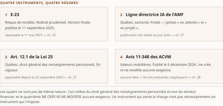

# Chapitre 26 — Le vide fédéral : de C-27 à C-36

*Livre III — Encadrer : orchestration en entreprise, cadre réglementaire canadien et terrain financier.
Deuxième mouvement — le cadre réglementaire canadien (ch. 25-30). Deuxième chapitre du mouvement, et
l'un des plus brefs : il établit un fait négatif et en tire les conséquences.*

| Champ | Valeur |
|---|---|
| **Statut** | **Brouillon de rédaction, non publiable.** ⚠ **Pièce rédigée hors portes** le 27 juillet 2026, sur instruction d'auteur, alors que **G-3** était ouverte et le socle consolidé à zéro entrée — *la règle cardinale du PRD §5 a été enfreinte, et l'arbitrage qui a suivi la solde sans la rattraper.* ☑ **G-3 est franchie depuis le 28 juillet 2026** (PRD v0.14, jalon J-IV-2 atteint) et le **volet de faits du résidu de G-1 est levé** le même jour : *les deux écarts qui fondaient cette note sont tombés, et la pièce n'en devient pas recevable* — **CA-IV-11 et CA-IV-13 restent insatisfaites**, faute de relecteur distinct du rédacteur. Voir la note de statut, § 26.4. ⚠ **Ce chapitre n'est pas conditionné par G-4** : sa ligne Fusion ne cite que le Vol. II, et **ni sa thèse ni aucune de ses gloses ne consomme un fait du Vol. III** — *son seul emprunt à ce volume est la série de garde-fous R-01…R-14, qui est de l'appareil, non un fait* |
| **Date de gel** | **27 juillet 2026** — gel unique, **D-1 prise** (registre : [`gel-2026-07-27.md`](../PRD/gel-2026-07-27.md)). ☑ **Faits repris à la source primaire le 28 juillet 2026** ([`gel-2026-07-28-volet-residuel.md`](../PRD/gel-2026-07-28-volet-residuel.md)) : l'entrée qui porte ce chapitre est **reconduite inchangée** — première lecture le 15 juin 2026, **étape courante : deuxième lecture**, aucune progression consignée. ⚠ **Le chapitre demeure celui dont la péremption est la plus rapide du mouvement** : il repose sur l'**étape parlementaire** d'un projet de loi, et *une étape n'est pas un état stable* — deux obligations de pièce restent inscrites au registre du résidu (R-IV-86). Gel de source consommé : **16-17 juillet 2026** (Vol. II ch. 10) — ⚠ **il ne tient pas lieu du gel de la somme** |
| **Socle mobilisé** | ⚠ **Le socle consolidé existe depuis le 28 juillet 2026** — [`socle-consolide.md`](../PRD/socle-consolide.md) v1.2, **159 entrées `S-001`…`S-159`**. La pièce a été rédigée **avant lui**, contre le **Vol. II *Monographie* ch. 10** ; ses identifiants y résolvent par la table de correspondance normative : **Vol. II `F-24` → `S-022`** (**[B]**, consultation directe du registre parlementaire, ⚠ *tension de niveau déclarée à la réserve 1 du §7 du socle*), qui porte les énoncés du chapitre ; **`F-09` → `S-009`**, **`F-25` → `S-023`**, **`F-26` → `S-024`** et **`F-27` → `S-025`**, mobilisées **en renvoi seulement**, leurs développements étant aux ch. 25, 27 et 28. ⚠ **Toutes ces entrées sont du Vol. II** et se préfixent comme telles (décision 7 du TOC). ⚠ **La correspondance est établie ; la confrontation de fond du corps au socle consolidé ne l'est pas** — *une table de correspondance ne constate pas CA-IV-01*, et le constat est un acte de gouvernance que la pièce ne pose pas (remontée non numérotée, § 26.4) |
| **Garde-fous balayés** | ⚠ **Décomptes re-mesurés au commit du 28 juillet 2026, règle de comptage de la décision 16 du TOC** : *ils portent sur le **marqueur littéral** dans le **corps** — en-tête et note de statut exclus.* Vol. II — **PRD §8.2.4 (couverture E-23 = inférence d'analystes) : une occurrence du renvoi**, § 26.3, reprise **en renvoi** au ch. 25 ; **PRDPlan Vol. II §4.4 — écrire « attendu par E-23 », jamais « exigé » : une occurrence du renvoi et une de la formule**, § 26.3 ; **R-5 (attente réglementaire — ne rien anticiper) : deux occurrences du sigle**, § 26.1 et § 26.2 ; **R-1 à R-4, R-6 à R-8 : zéro occurrence**. Vol. III — **R-14 (trois degrés d'absence) : une occurrence du sigle**, § 26.2 — ⚠ *et le degré s'y marque en toutes lettres, « degré 3 » et « fait négatif vérifié » au même § 26.2* ; **R-01 à R-13 : zéro occurrence** — ⚠ **et R-09 est sans objet ici** : aucun statut normatif de spécification n'est mentionné dans ce chapitre, dont la matière est parlementaire |
| **Volumétrie cible** | ≈ **2 500 mots** de corps (§ 26.0 à § 26.3), **cible dérivée** de l'enveloppe du Livre — 90 000 mots au TOC v0.30 —, la somme des quinze cibles dérivées valant exactement l'enveloppe ; **c'est la plus basse du Livre, à égalité avec le ch. 28**. ⚠ *La dérivation n'est pas au prorata des sections* : le ch. 30 en porte trois comme celui-ci pour une cible trois fois supérieure. ☑ **Décompte publiable depuis G-2** ; la mesure réelle est portée au [`README.md`](README.md) du dossier, par [`PRD/decompte.sh`](../PRD/decompte.sh) — ⚠ *la mesure du 28 juillet 2026 précède la passe de relecture et se re-mesure au commit*. ⚠ **D-4 interdit l'amputation comme le gonflement** |

> **Thèse** *(citée depuis le [`TOC.md`](../PRD/TOC.md) v0.30, entrée du chapitre 26 — ⚠ **thèse inchangée depuis la v0.25**, sous laquelle la pièce a été rédigée : aucune passe de réalignement ne l'a touchée)* — la mort de la LIAD laisse le Canada sans régulation fédérale spécifique de l'IA ; C-36 (loi sur la vie privée, non loi IA autonome) ne comble pas ce vide — la couverture effective passe par les régulateurs sectoriels.

---

⚠ **La thèse a été collationnée contre le texte rédigé de sa source avant la rédaction** (décision 14
du TOC). **Domaine de balayage : une thèse examinée, zéro réalignée** — et le bloc ci-dessus a été
**recollationné caractère à caractère contre le TOC v0.30**, sans écart (décision 17). Elle reprend
la thèse du Vol. II ch. 10 à sa forme du 16-17 juillet 2026 ; la parenthèse « loi sur la vie privée, non loi IA
autonome » **condense** la proposition incidente de la source — « c'est une loi de protection des
renseignements personnels » — **sans rien lui ajouter**, et elle en reprend la qualification de portée
en toutes lettres.

## § 26.0 — Ouverture : chercher la loi qui n'existe pas

L'architecte qui, à l'été 2026, ouvre le dossier réglementaire d'un programme agentique dans une
institution financière fédérale **commence en général par chercher la loi**. Il cherche le texte
fédéral qui nommerait les systèmes d'intelligence artificielle, en établirait les classes de risque, en
fixerait les obligations d'évaluation et de journalisation, et lui donnerait **une cible de conformité
datée**.

**Ce texte n'existe pas.** Il a été déposé, débattu, puis il est mort ; et ce qui a été déposé depuis à
sa place **ne le remplace pas**.

Ce chapitre établit ce **fait négatif** — que le socle porte **positivement**, en `S-022` (**[B]**), et
non par absence de documentation — et en tire les conséquences d'architecture. Il soutient trois
propositions. La première : **le vide fédéral n'est pas un accident de calendrier en voie de
résorption**, mais un état documenté qui dure. La deuxième : **le projet de loi C-36, régulièrement
présenté comme la réponse fédérale à l'intelligence artificielle, est en réalité une réforme de la
protection des renseignements personnels** qui porte des volets d'IA — *la distinction n'est pas
byzantine, elle décide de ce qu'une institution inscrit à son registre d'obligations*. La troisième :
ce vide persistant, **la charge réglementaire effective repose entièrement sur les régulateurs
sectoriels** — le Bureau du surintendant des institutions financières, l'Autorité des marchés
financiers et les Autorités canadiennes en valeurs mobilières —, dont les ch. 25, 27 et 28 traitent
respectivement. ⚠ **Une réserve borne cette troisième proposition, et le § 26.3 la pose** : *des
quatre instruments qui portent effectivement la charge, **l'un relève du droit général québécois et
non d'un régulateur sectoriel** — l'y ranger serait inexact.*

## § 26.1 — La prorogation du 6 janvier 2025 et la mort de C-27

**Le point de départ est une date de procédure parlementaire, et c'est déjà instructif : le cadre
fédéral canadien de l'IA n'a pas été voté, il est mort au feuilleton.**

Le projet de loi C-27 réunissait **deux textes distincts** : une loi destinée à refondre le régime
fédéral de protection des renseignements personnels, et la **Loi sur l'intelligence artificielle et les
données** (LIAD) — premier et, à ce jour, unique projet fédéral de régulation spécifique des systèmes
d'IA. À la **prorogation du 6 janvier 2025**, C-27 est mort au feuilleton, **emportant les deux volets
ensemble** (Vol. II `F-24` → `S-022`, **[B]**, revalidé par consultation directe).

Lecture de l'auteur — **il faut mesurer ce qu'a été cet attelage.** Le volet IA voyageait dans le même
véhicule législatif qu'une réforme de la vie privée ; les deux sont morts ensemble. *L'attelage paraît
avoir décidé du sort du volet IA* — **ce que le socle établit** : la concomitance. **Ce qu'il n'établit
pas** : la causalité, ni les motifs politiques de la prorogation, ni le contenu des obligations que la
loi aurait imposées. ⚠ **Ce dernier point n'est pas anodin** : *la somme ne compare donc ce vide à
rien*, faute de savoir ce qui aurait été comblé.

**Ce qu'il faut retenir, c'est la durée.** Du 6 janvier 2025 au **27 juillet 2026**, gel de la somme,
il s'écoule **dix-huit mois et vingt et un jours** sans qu'aucun texte fédéral ne vienne réguler les
systèmes d'IA **en tant que tels**. ⚠ **Ce n'est pas un intervalle : c'est l'état stable du droit
fédéral canadien sur toute la période que couvre la somme.**

Le constat se mesure au reste du corpus. La couche protocolaire agent-agent a été lancée, transférée
sous gouvernance neutre et portée à sa première spécification stable **pendant ce vide** (**ch. 7**) ;
les mises en production agentiques canadiennes documentées au **ch. 35** s'y sont déroulées ; les deux
régimes sectoriels datés du 1ᵉʳ mai 2027 y ont été finalisés. ⚠ **Aucun des faits que la somme rapporte
n'a eu de loi fédérale d'IA pour cadre.**

Lecture de l'auteur — l'enseignement pratique de janvier 2025 n'est pas qu'un texte a échoué, mais
qu'**une planification de conformité adossée à un projet de loi en cours d'examen est une planification
adossée à rien**. **Ce que le socle établit** : la mort de C-27 et l'absence de reprise ultérieure du
volet IA. **Ce qu'il n'établit pas** : de règle générale sur la fiabilité des trajectoires
législatives. *La règle que la somme en tire — ne dater un programme de conformité que sur des textes
en vigueur ou publiés en version finale — est une inférence, mais c'est celle que la suite du chapitre
valide.* ⚠ **Elle est aussi le versant fédéral de R-5 du Vol. II** : *ce qui n'est pas publié ne se
décrit pas.*

## § 26.2 — Le ministre de l'IA et le projet de loi C-36

**La séquence qui suit paraît, de loin, corriger le tir.** En **mai 2025**, le gouvernement fédéral
nomme le premier titulaire d'un portefeuille de l'IA et de l'innovation numérique. Le **15 juin 2026**,
ce même ministre dépose le **projet de loi C-36** (Vol. II `F-24` → `S-022`, **[B]**). Entre la
nomination et le dépôt, **treize mois** ; entre la prorogation qui a tué C-27 et ce dépôt,
**dix-sept mois**.

**Un ministre de l'IA dépose un projet de loi dix-sept mois après la mort du seul texte fédéral d'IA :
la lecture par raccourci s'impose d'elle-même, et elle est fausse.**

Le titre officiel de C-36 est ***Protecting Privacy and Consumer Data Act***. ⚠ **Le texte est une
réforme de la protection des renseignements personnels** : il modifie la loi fédérale sur la protection
des renseignements personnels et les documents électroniques, et prévoit la création d'une commission
de sécurité numérique et de protection des données. Il porte, il est vrai, **trois volets** — un droit
à la suppression des renseignements, une protection des données des enfants, et un volet de
**transparence algorithmique**, seul des trois que le socle qualifie d'IA — ⚠ **mais il les porte comme
composantes d'une loi sur la vie privée, non comme les dispositifs d'une loi IA autonome.**

⚠ **La qualification n'est pas affaire de purisme terminologique : elle décide de ce qu'une institution
inscrit à son registre d'obligations.** *Un responsable de la conformité qui inscrirait C-36 à son plan
comme « cadre IA fédéral à venir » construirait son inventaire sur une qualification erronée : il
attendrait un régime de conformité propre aux systèmes d'IA et recevrait une réforme de la protection
des renseignements personnels.*

**Deux précisions de statut s'imposent, et elles sont datées.** ⚠ **Premièrement, C-36 est un projet de
loi et non une loi** : première lecture le 15 juin 2026 ; **à l'étape de la deuxième lecture au
16 juillet 2026, date de consultation du socle**, étape **reconduite inchangée au 28 juillet 2026** par
l'instruction du résidu de G-1 — *douze jours sans progression au registre parlementaire officiel*.
*Aucune obligation n'en découle, et la somme ne se prononce pas sur son adoption* (R-5 du Vol. II —
*ne rien anticiper*). ⚠ **Deuxièmement, la commission qu'il prévoit n'existe pas** : sa création est un
**effet projeté** du texte, non un fait.

⚠ **Que prescrit exactement le volet de transparence algorithmique ?** Les sources du socle établissent
l'existence des trois volets et la nature générale du texte ; **elles n'en établissent pas le contenu
article par article**, et le texte demeure susceptible d'amendement. *Absence de documentation dans le
corpus, degré 3 de l'échelle R-14 du Vol. III — non un fait négatif vérifié.* **La question reste
ouverte ; aucune inférence n'est proposée ici** — ⚠ **et l'instruction du 28 juillet 2026 ne l'a pas
comblée** : *elle a reconduit l'étape parlementaire et la qualification de portée du texte, non son
contenu.*

## § 26.3 — Conséquences : le vide persiste, la charge est sectorielle

**La proposition centrale peut maintenant être énoncée dans les termes exacts du socle.** **La LIAD ne
sera pas ravivée telle quelle**, et **le vide fédéral sur la régulation spécifique de l'IA persiste**
(Vol. II `F-24` → `S-022`, **[B]**). Une formule résume le constat, et la somme la cite en langue
originale : « *Canada remains the only G7 nation without a binding AI regulatory framework* » —
*AIMag*, juin 2026. ⚠ **Cette formule est citée comme illustration d'un constat de presse, jamais
comme source d'un fait central** ; le fait central — la persistance du vide — est porté par l'entrée
elle-même. ⚠ **Et une divergence d'attribution est signalée à sa source** : l'entrée l'attribue à
« des juristes », le rapport de revalidation du Vol. II à ce seul périodique ; *le corps retient
l'attribution la plus restrictive, et **il la nomme** — une affirmation ne s'anonymise pas*
(décision 15 du TOC).

⚠ **Il faut cependant énoncer avec autant de soin ce que ce vide n'est pas, car la formule prête à
contresens.** **Le Canada n'est pas un espace de non-droit pour les systèmes agentiques.** Le vide est
**spécifique** : il porte sur l'absence d'un **régime fédéral contraignant qui régulerait les systèmes
d'IA en tant que tels**. Les Autorités canadiennes en valeurs mobilières l'énoncent pour leur champ :
leurs indications **ne créent ni ne modifient aucune exigence**, et **les lois sur les valeurs
mobilières existantes s'appliquent** aux systèmes d'IA (**ch. 28**). ⚠ *L'énoncé de l'avis est un rendu
français — l'instrument est rédigé en anglais et le socle n'en porte pas le libellé d'origine : il ne
se cite pas entre guillemets de verbatim, et la borne « valeurs mobilières » ne s'en retire pas.*

Lecture de l'auteur — le même raisonnement vaut **par construction** pour les autres branches du droit
général — protection des renseignements personnels, droit des contrats, responsabilité civile —,
**qu'aucun régime d'IA n'est venu écarter**. **Ce que le socle établit** : ce point pour les seules
valeurs mobilières. **Ce qu'il n'établit pas** : sa généralisation.

Lecture de l'auteur — ⚠ **une conséquence de périmètre se pose tôt, et elle demeure une hypothèse de
travail.** **Ce que le socle établit** : que C-36 modifie la loi fédérale sur les renseignements
personnels — *une loi dont l'objet est le traitement des renseignements personnels*. **Ce qu'il
n'établit pas** : le périmètre d'application des volets d'IA du projet, et le § 26.2 dit pourquoi. Mais
**la nature du véhicule autorise au moins une lecture prudente** : *un régime greffé sur une loi de
protection des renseignements personnels a vocation à saisir les traitements de renseignements
personnels, non l'ensemble des décisions d'un système agentique.* Un agent qui orchestre un
rapprochement comptable, une chaîne de messages de paiement
interbancaires ou une supervision d'infrastructure ne manipule pas nécessairement de renseignements
personnels ; **un agent de pré-adjudication hypothécaire, lui, en manipule par construction — et le
ch. 35 § 35.1 en documente un cas canadien.** ⚠ *L'inférence porte sur la logique du véhicule
législatif, pas sur le texte de C-36, dont le libellé n'est pas au socle : elle est indiquée comme
hypothèse de travail à vérifier, jamais comme fondement d'une position de conformité.*

**Pour l'institution financière fédérale, la conséquence est un déplacement complet de la charge vers
les régulateurs sectoriels, et ce déplacement est daté.**

| Instrument | État | Date opposable | Chapitre |
|---|---|---|---|
| **E-23** — risque de modèle, fédéral prudentiel | version finale publiée le 11 septembre 2025 | **1ᵉʳ mai 2027** | ch. 25 |
| **Ligne directrice IA de l'AMF** — Québec, sectoriel | ⚠ **finale**, jamais « en attente » ni « en projet » (réserve Vol. II `F-25` → `S-023`) — ⚠ *sa publication n'est pas datée au jour près : **aucune** des deux dates autrefois arbitrées ne figure aux pages officielles, et la somme écrit **avril 2026** en déclarant ses trois états (ch. 27 § 27.1)* | **1ᵉʳ mai 2027** | ch. 27 |
| **Art. 12.1 de la Loi 25** — Québec, droit général des renseignements personnels | **en vigueur** | **22 septembre 2023** — opposable depuis près de trois ans | ch. 27 |
| **Avis 11-348 des ACVM** — valeurs mobilières | publié le 5 décembre 2024 ; **ne crée ni ne modifie aucune exigence** *(rendu français)* | **aucune** — les lois **sur les valeurs mobilières** existantes s'appliquent | ch. 28 |

: Tableau 26.1 — Les quatre instruments qui portent effectivement la charge, au gel du 27 juillet 2026. ⚠ **L'un d'eux relève du droit général québécois, non d'un régulateur sectoriel** — l'y ranger serait inexact.

⚠ **Un mot sur la portée d'E-23, et la formulation est imposée.** E-23 **ne nomme ni l'agentique ni les
agents** ; sa définition de « modèle » englobe les méthodes d'IA et d'apprentissage automatique, d'où
une **couverture implicite** que les analystes juridiques canadiens **tiennent pour acquise** (PRD
Vol. II §8.2.4). *La couverture est une inférence d'analystes, non une attente du Bureau*, et **le
ch. 25 § 25.3 en porte le développement** ; le présent chapitre ne fait que la renvoyer. ⚠ **Et on écrit
« attendu par E-23 », jamais « exigé »** (PRDPlan Vol. II §4.4).

**Un calcul suffit à mesurer la situation d'une institution au gel de la somme.** Du 27 juillet 2026 au
1ᵉʳ mai 2027, il reste **neuf mois et quatre jours** avant l'entrée en vigueur **simultanée** d'E-23 et
de la ligne directrice de l'AMF. **L'article 12.1, lui, est opposable depuis près de trois ans.**

Lecture de l'auteur — **l'ordre de priorité qu'un architecte devrait en tirer est l'inverse exact de
celui que suggère l'actualité législative.** **Ce que le socle établit** : trois faits — le vide fédéral
persiste, un projet de loi fédéral de vie privée est en deuxième lecture, et quatre instruments sont
soit en vigueur, soit finalisés avec une date d'entrée en vigueur ferme. **Ce qu'il n'établit pas** :
d'ordre de priorité entre eux. *Celui-ci est une inférence, et elle est néanmoins difficile à
contester : la veille sur un texte non adopté, dont le contenu détaillé n'est pas au socle et qui n'est
pas une loi d'IA, ne saurait mobiliser les ressources qu'appellent quatre instruments datés dont l'un
est déjà opposable.* **La conséquence d'architecture — traduire ces exigences sectorielles en cadres
déterministes — est l'objet du ch. 29, pivot du Livre.**

### Synthèse : ce que le chapitre lègue à la somme

*Section de sortie sans homologue direct dans la source — construction d'éditeur.*

1. **Un fait négatif, daté et mesuré.** Pas de régime fédéral contraignant propre aux systèmes d'IA ;
   **dix-huit mois et vingt et un jours** au gel de la somme. *Aucun chapitre aval ne le redémontre*, et
   la table de traduction du **ch. 29 § 29.1** n'en tire aucune contrainte — *un vide n'en produit pas.*
2. **La qualification de C-36, et ce qu'elle interdit.** Loi de vie privée portant des volets d'IA,
   **non loi IA autonome**. *L'inscrire comme « cadre IA fédéral à venir » est une erreur de registre
   d'obligations*, et le **ch. 30** n'en tire aucun élément du maillage international.
3. **Le vide est spécifique, non général.** Le droit général s'applique. ⚠ *Le socle ne l'établit que
   pour les valeurs mobilières* (**ch. 28**) ; la généralisation est une lecture.
4. **La table des quatre instruments, et son ordre de priorité.** ⚠ **Un seul y est déjà opposable**, et
   ce n'est pas celui qu'on attend. Le **ch. 27** le développe ; les quatre instruments forment **toute**
   la table de traduction du **ch. 29**, qui n'en tire aucun autre texte.

⚠ **Ce que le chapitre ne lègue pas.** Il ne dit pas que C-36 sera adopté, ni qu'il ne le sera pas :
*le socle documente une étape parlementaire, pas une issue.* Il ne dit pas ce que prescrit le volet de
transparence algorithmique. Il ne dit pas que le vide serait une **lacune de protection**. Et **ce que
la loi morte aurait exigé n'est pas au socle** : *la somme ne le compare donc à rien.*

**L'absence d'une loi fédérale sur l'IA n'est pas une permission. C'est une redistribution de la
charge.**

---

## § 26.4 — Note de statut *(hors plan — à retirer à la publication)*

⚠ **Cette section n'est pas au TOC et n'a pas vocation à survivre.** Elle consigne l'écart de
gouvernance sous lequel la pièce a été rédigée (PRD, Annexe A) : *un rédacteur ne corrige jamais le
TOC, ce PRD ni le Conspectus — il **remonte**.*

**Ce qui était enfreint à la rédaction.** La porte **G-3** et le **volet résiduel de G-1**. Instruction
d'auteur du 27 juillet 2026. ⚠ **La porte G-4 ne conditionnait pas ce chapitre** : sa ligne Fusion ne
cite que le Vol. II. ⚠ **La décision D-9 ne le bloque pas non plus** : elle nomme les ch. 25 et 27 — et,
depuis la v0.12 du PRD, le § 40.4 du ch. 40 —, et ce chapitre **ne prescrit aucune parade humaine** :
*il n'en a pas l'occasion, n'ayant aucun texte contraignant à traduire.*

**Ce qui a bougé depuis, et ce que cela ne change pas.** ☑ **G-3 est franchie le 28 juillet 2026**
(PRD v0.14) et ☑ **le volet de faits du résidu de G-1 est levé** le même jour. *Les deux écarts qui
fondaient cette note sont donc tombés — et une porte franchie après coup ne rend pas recevable la pièce
écrite avant elle* : elle en solde l'écart, elle ne le rattrape pas.

1. **La traçabilité est désormais possible, et elle n'est pas constatée ici.** Les identifiants cités —
   `F-24`, et en renvoi `F-09`, `F-25`, `F-26`, `F-27` — sont **ceux du Vol. II**, préfixés à chaque
   emploi (décision 7), et résolvent au socle consolidé en `S-022`, `S-009`, `S-023`, `S-024` et
   `S-025`. ⚠ **`S-022`, qui porte les énoncés du chapitre, est en [B]** — donc hors de l'exclusion que
   **CA-IV-01** réserve aux entrées [C] —, mais **le constat de centralité est un acte de gouvernance
   que la pièce ne pose pas**, et la confrontation de fond du corps au socle reste due.
2. ⚠ **Le résidu de G-1 pesait ici sur un objet particulier : une étape parlementaire.** ☑ **Elle a été
   reprise à sa source le 28 juillet 2026** et **reconduite inchangée** — deuxième lecture, aucune
   progression consignée en douze jours. ⚠ **Cela ne clôt pas l'obligation** : l'étape et les deux
   comptes à rebours du chapitre sont **inscrits au registre du résidu** (R-IV-86), à re-mesurer au
   **gel de publication**. ⚠ **Mais le tableau des événements de péremption de la somme ne la porte
   pas** : *le **ch. 50 § 50.2** en inventorie **onze**, et **C-36 n'y figure sous aucune des onze
   rangées** — balayage du chapitre rédigé, **zéro occurrence du sigle**.* **L'écart est remonté
   ci-dessous**, et cette pièce ne le comble pas : *inscrire une rangée au tableau d'un autre
   chapitre serait corriger le plan depuis une pièce.*
3. **Les décomptes sont publiables** (G-2). L'écart à la cible est relevé au [`README.md`](README.md) du
   dossier et alimente **D-4**, déjà tranchée — ⚠ *la mesure qui y figure précède la passe de relecture
   du 28 juillet 2026 et se re-mesure au commit.*
4. **Les renvois « ch. N » résolvent tous contre du texte rédigé.** Les cinquante chapitres du plan
   existent en brouillon hors portes : **ch. 27, 28, 29, 30, 35** (présent Livre), **ch. 50** (Livre V),
   **ch. 7** et **ch. 25**. ⚠ *Ce sont des brouillons* — la re-vérification contre le texte arrêté
   demeure due.

**Remontées ouvertes par ce chapitre :**

- **R-IV-86 — non bloquante, de cardinal daté et de fait négatif à re-mesurer.** Deux énoncés de ce
  chapitre sont **des cardinaux annoncés en toutes lettres, calculés au gel** : la durée du vide fédéral
  (« dix-huit mois et vingt et un jours ») et le compte à rebours avant le 1ᵉʳ mai 2027 (« neuf mois et
  quatre jours »), ce dernier étant **repris à l'identique au ch. 25 § 25.1**. ⚠ **Ni l'un ni l'autre ne
  se met à jour tout seul, et le second vit à deux endroits.** *Le premier cesse d'être vrai à la
  seconde où un texte fédéral d'IA est déposé et adopté ; le second croît d'un jour par jour.*
  **Demande remontée** : que les deux entrent au **registre des faits à re-mesurer au gel de
  publication**, comme le cardinal du ch. 18 (remontée R-IV-31), et que **l'étape parlementaire de C-36
  y entre au même titre**. ⚠ **La classe est celle que le `CLAUDE.md` de la racine nomme** : *le piège
  n'est pas le nombre posé au titre d'une liste, c'est celui qui la cite à distance.*

- **Remontée de la passe de relecture du 28 juillet 2026 — non bloquante, sans numéro alloué.**
  ⚠ *Un relecteur n'alloue pas d'identifiant dans une série partagée pendant que d'autres passes y
  puisent : la collision du 27 juillet 2026 est née de ce geste exact.* **Cinq objets, tous hors du
  mandat d'une pièce.** *(a)* **Le constat de CA-IV-01 pour cette pièce** : `S-022` est en [B] et
  l'exclusion des entrées [C] ne joue donc pas, mais **constater qu'une affirmation est centrale et
  tracée est un acte de gouvernance**, non un geste de relecture. *(b)* **La volumétrie du Livre III
  au [`README.md`](README.md) du dossier est périmée par cette passe** — la mesure du 28 juillet 2026
  précède les corrections —, et elle se re-mesure **au commit**, pour les quinze pièces ensemble.
  *(c)* ⚠ **Le PRD porte deux rangées en contradiction avec sa propre rangée Version** : ses champs
  *Date* et *Statut* datent de la v0.12 et écrivent encore « socle consolidé à 0 entrée (G-3, non
  entamée) » quand la v0.14 déclare la porte franchie. *La pièce s'est adossée aux rangées de portes,
  qui font foi ; elle signale l'écart plutôt que d'en choisir un terme.*
  *(d)* ⚠ **L'événement de péremption de ce chapitre n'a aucune rangée au tableau 50.1**, alors que le
  socle qualifie son objet de **fait le plus périssable du socle du Vol. II** et que cette pièce se
  déclare la plus vite périmée de son mouvement. *Le **ch. 50 § 50.2** inventorie **onze** événements ;
  **aucun n'est C-36**, et sa rangée « textes réglementaires finaux postérieurs à l'été 2026 » renvoie
  aux ch. 32 et 33, non ici.* **Demande remontée** : que l'étape parlementaire y entre, **ou que son
  exclusion porte son motif**. ⚠ *La demande est jumelle de celle que la relecture du ch. 28 a ouverte
  le même jour pour la doctrine de l'avis 11-348 — **deux pièces du même mouvement, même manque** ; les
  arbitrer ensemble évitera de motiver deux fois la même exclusion.*

  ☑ **SOLDÉE le 2 septembre 2026** (D-16) : **la rangée est inscrite au tableau 50.1**, qui passe de **onze à quatorze** événements. ⚠ *Aucun motif d'exclusion n'a résisté à l'examen* — les trois objets remontés (ch. 9, ch. 26, ch. 28) sont **du genre exact que le tableau recense**, et leur absence tenait à ce que nul ne les y avait portés. **Les trois demandes jumelles ont été arbitrées ensemble**, comme le ch. 26 le suggérait, *pour ne pas motiver trois fois la même exclusion*. **Tri retenu : PROJETÉ** — *une reprise législative est une prévision d'institution, non un engagement daté ; aucune date n'est portée, et c'est le renseignement.*
  *(e)* ⚠ **Le titre de la table détaillée du ch. 26 au TOC nomme un autre chapitre** — de la classe
  *désalignement interne au plan*, celle qu'aucun des quinze contrôles ne voit. L'entrée du chapitre 26
  est suivie de « **Table des matières détaillée du chapitre 30** », et **30 est le numéro de ce
  chapitre avant la condensation v0.20**. ⚠ **Le défaut n'est pas isolé, et le domaine se déclare
  plutôt qu'un cardinal ne s'annonce nu** : *balayage des cinquante entrées du TOC v0.30, appariement de
  chaque titre `### Chapitre N` avec le titre de sa table — **cinquante-huit tables, quarante-cinq
  annoncent l'ancienne numérotation**, et les treize concordantes sont exactement celles que la
  condensation n'a pas renumérotées (ch. 1-12) plus le ch. 41, inséré après elle.* **Demande
  remontée** : que la passe d'arbitrage tranche
  **d'un seul geste** si ces titres sont des marqueurs de correspondance gelés (décisions 11-13, qu'un
  remappage ne touche jamais) ou des titres non remappés, ⚠ *et qu'elle ne les corrige pas un par un —
  une pièce en corrigerait un et laisserait quarante-quatre.*

**Ce qui n'est pas enfreint.** La structure suit la **table détaillée du TOC v0.30** — § 26.1 à § 26.3,
dans l'ordre exact —, le § 26.0 étant une **ouverture de chapitre** ; ⚠ *son **titre**, lui, nomme un
autre chapitre, et l'écart est remonté ci-dessus (objet **e**) plutôt que corrigé ici.* La **table de couverture est
respectée pour son unique ligne** : le Vol. II §10.1-10.3 est condensé aux § 26.1-26.3, **rien n'en est
coupé**. La **décision 14 a été exécutée avant la rédaction**, domaine déclaré : une thèse examinée,
zéro réalignée. ⚠ **R-5 du Vol. II est tenu sur les trois objets où il porte** — *ce qui n'est pas publié
n'est pas décrit* : ni le contenu du volet de transparence algorithmique, ni l'issue parlementaire, ni le
contenu de la loi morte ; *le sigle lui-même est écrit **deux fois**, aux § 26.1 et § 26.2.* Les
**absences portent leur degré** — *une occurrence du sigle R-14 au § 26.2, avec « degré 3 » et « fait
négatif vérifié » écrits au même endroit* —, **dont une au degré 3 sur le contenu du volet
algorithmique**. ⚠ **Ces cardinaux ont été re-mesurés au commit du 28 juillet 2026** (décision 16 du
TOC) ; *l'attestation antérieure annonçait trois occurrences de R-5 et quatre de R-14.* La **citation de
presse est attribuée nommément et bornée** — illustration d'un constat, jamais source d'un fait
central — et **la divergence d'attribution que sa source signale est reprise, non lissée**. **Les cinq
constructions d'auteur portent leur marqueur** et énoncent chacune ce que le socle établit et
n'établit pas (CA-IV-07). Enfin, **la formulation imposée sur E-23 est tenue à son unique occurrence**,
et **le chapitre ne développe rien du régime québécois ni du régime des valeurs mobilières** : il les
renvoie aux ch. 27 et 28, qui en sont les sièges.

---

### Clôture des remontées — 27 juillet 2026

⚠ **Cette sous-section est hors plan comme la note qui la porte, et se retire avec elle.** Elle
enregistre l'issue des remontées ouvertes par cette pièce. *Une remontée ne se clôt pas là où elle
s'ouvre : elle se solde là où elle fait foi* — au [PRD](../PRD/PRD.md) pour une décision ou un régime,
au [TOC](../PRD/TOC.md) pour un réalignement de plan, à l'appareil pour une dette d'outillage.

⚠ **Renumérotation, à lire avant les numéros.** *Les remontées de ce Livre portaient d'abord les
numéros **R-IV-38 à R-IV-61** ; une **passe concurrente écrivait les Livres IV et V dans le même dépôt
le même jour** et les avait consommés. **Le Livre III a été renuméroté en R-IV-76 à R-IV-99** à la
découverte de la collision — **aucun numéro n'est partagé**.*

- **R-IV-86 — close par versement au registre du volet résiduel de G-1 (PRD v0.10 §5).** Les **deux
  cardinaux datés** du chapitre — durée du vide fédéral, compte à rebours avant le 1ᵉʳ mai 2027 — et
  ⚠ **l'étape parlementaire de C-36**, observée en deuxième lecture, entrent au **registre des faits à
  re-mesurer au gel de publication**. ⚠ *Le second cardinal **vit à deux endroits** — ici et au ch. 25
  § 25.1 —, et **le piège n'est pas le nombre posé au titre d'une liste : c'est celui qui la cite à
  distance**.*

⚠ **Ce que la clôture ne change pas.** Les portes **G-3** et — pour les chapitres qui citent le
Vol. III — **G-4** demeurent ouvertes ; le socle consolidé compte **zéro entrée** ; **aucun énoncé de
cette pièce n'est central au sens de CA-IV-01**. **CA-IV-11 et CA-IV-13 ne sont pas satisfaites** —
*aucune relecture par un relecteur distinct du rédacteur*. Cette pièce reste un **brouillon non
publiable**. *Zéro remontée ouverte ne veut pas dire pièce recevable : cela veut dire qu'aucune
question n'attend plus de réponse qui ne soit déjà tranchée.*

---

### Addendum du 28 juillet 2026 — ce qui a bougé après cette clôture

⚠ **La sous-section ci-dessus est un enregistrement daté et ne se réécrit pas** : elle était exacte le
27 juillet 2026. Deux de ses énoncés ont cessé de l'être le lendemain, et c'est ici qu'ils se
rectifient. ☑ **G-3 est franchie le 28 juillet 2026** (PRD v0.14, jalon J-IV-2 atteint) et **le socle
consolidé compte 159 entrées**, non zéro ; **`S-022`, qui porte ce chapitre, est en [B]** et sort donc
de l'exclusion que CA-IV-01 réserve aux entrées [C]. ⚠ **Ce qui ne bouge pas** : **G-4** demeure ouverte
en son volet de fond — sans effet ici, ce chapitre ne consommant aucun fait du Vol. III —,
**CA-IV-11 et CA-IV-13 restent insatisfaites** faute de relecteur distinct du rédacteur, et la pièce
demeure un **brouillon non publiable**. *Une porte franchie après coup solde l'écart d'une pièce écrite
avant elle ; elle ne la rend pas recevable.*
