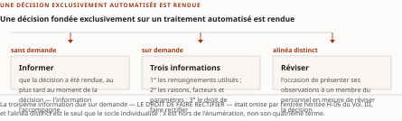
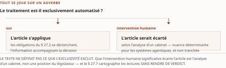

# Chapitre 27 — Québec : la ligne directrice IA de l'AMF et l'article 12.1 de la Loi 25

*Livre III — Encadrer : orchestration en entreprise, cadre réglementaire canadien et terrain financier.
Deuxième mouvement — le cadre réglementaire canadien (ch. 25-30). Troisième chapitre du mouvement, et
**siège de deux objets pour toute la somme** : l'application de la grille des cinq questions à la ligne
directrice de l'AMF, et la question Q4 de la série d'agenda du Vol. II.*

| Champ | Valeur |
|---|---|
| **Statut** | **Brouillon de rédaction, non publiable** — ⚠ **et il porte, avec le ch. 25, l'écart de gouvernance le plus lourd du Livre.** ⚠ **G-3 a été franchie le 28 juillet 2026, soit APRÈS cette rédaction** : *une porte franchie ensuite ne rend pas recevable une pièce écrite avant elle* — la pièce se **relit** contre le socle consolidé, elle n'y a pas été écrite. **G-4** demeure ouverte et **opposable à ce chapitre**, dont **quatre sections sur huit** proviennent du Vol. III ; **le volet de faits du résidu de G-1 est levé**, ses deux autres volets restent dus. ⚠ **Il est bloqué nommément par la décision d'auteur D-9** — « les ch. 25 et 27 ne se lancent pas avant clôture du lot [du § 17.5] », lot **ouvert et non clos**. Rédigé sur instruction d'auteur du 27 juillet 2026 ; **l'infraction est consignée, non effacée** (§ 27.9) |
| **Date de gel** | **27 juillet 2026** — gel unique, **D-1 prise** (registre : [`gel-2026-07-27.md`](../PRD/gel-2026-07-27.md)). ⚠ **Le volet de faits du résidu de G-1 a été instruit le 28 juillet 2026** ([`gel-2026-07-28-volet-residuel.md`](../PRD/gel-2026-07-28-volet-residuel.md)) — **et il n'a rien re-établi de ce chapitre** : les entrées qui portent la chronologie de l'AMF comme le texte de l'article 12.1 sont revenues **☐ non établie**, l'hôte refusant l'accès. ⚠ *Instruire n'est pas confirmer* : la tentative a eu lieu, le constat manque, et la datation reste celle de la source (voir § 27.1). Gels de source consommés : **16-17 juillet 2026** (Vol. II ch. 11), **21 juillet 2026** (Vol. III ch. 19-20) et **juin 2026** (Vol. I, en renvoi seulement) — ⚠ **aucun ne tient lieu du gel de la somme** |
| **Socle mobilisé** | ☑ **Le socle consolidé existe depuis le 28 juillet 2026** ([`socle-consolide.md`](../PRD/socle-consolide.md), 159 entrées) : les énoncés de ce chapitre y résolvent contre **sept entrées**, chacune citée avec sa provenance d'origine (décision 7). **`S-023`** — chronologie de la ligne directrice IA de l'AMF, **`[A]` de portée générale, non marqué individuellement** (Vol. II `F-25` + Vol. III `H-05`, fondues) ; **`S-025`** — article 12.1, **`[B]`** marqué individuellement, ⚠ **réserve d'interprétation `[C]` incluse** (Vol. II `F-27` + Vol. III `H-06`, fondues, **corrigée par `S-135`**) ; **`S-135`** — relevé du texte officiel du 21 juillet 2026, **`[B]`** (Vol. III `F-89`) ; **`S-113`** — les dates de l'AMF, **`[B, degré 1]`** (Vol. III `F-67`) ; **`S-114`** — modalité, articulation et définition, **`[B]`** (Vol. III `F-68`) ; **`S-024`** — avis ACVM 11-348, **`[B]`** (Vol. II `F-26` + Vol. III `H-07`, fondues) ; **`S-034`** — manifeste APM, **`[B]`** (Vol. II `F-36` + Vol. III `H-11`, fondues). ⚠ **Six de ces sept entrées portent leur re-datation `☐ non établie`** — accès refusé par l'hôte —, seule `S-034` portant `☑ inchangée (partielle)`. ⚠ **Aucun énoncé n'est central au sens de CA-IV-01, et le motif a changé sans que la conclusion bouge** : ce n'est plus un socle vide, c'est **l'absence de vote adversarial** jointe à la borne que le franchissement de G-3 pose — *aucune entrée non re-vérifiée ne porte de fait central*. ⚠ **La réserve `[C]` de `S-025` — la nuance du cabinet Fasken — ne porte, elle non plus, aucun énoncé de ce chapitre.** *Les deux premiers registres du § 27.6 sont mobilisés **en renvoi seulement** : leurs entrées sont déclarées à leurs sièges, aux ch. 10, 17 et 19* |
| **Garde-fous balayés** | ⚠ **Décomptes re-mesurés au commit du 28 juillet 2026, règle de comptage de la décision 16 du TOC** : *ils portent sur le **marqueur littéral** dans le **corps** — en-tête et note de statut exclus —, et **là où le garde-fou est appliqué sans que son identifiant soit écrit, c'est le domaine balayé qui est déclaré, sans cardinal**.* Vol. II — **garde-fou renforcé « aucun avis juridique » (PRD Vol. II §3) : quatre occurrences de la formule**, § 27.0, § 27.3, § 27.8 et la synthèse ; *le renvoi « PRD Vol. II §3 » est écrit une fois, § 27.0* ; **réserve F-25 — ne jamais écrire « en attente » ni « en projet » : une occurrence de chacune, § 27.1, et toutes deux dans la formule qui les interdit** — ⚠ *hors cette formule, aucune des deux n'apparaît, et **c'est le résultat attendu** : une réserve tenue se mesure à l'absence de ce qu'elle proscrit* ; **PRDPlan Vol. II §4.4 — l'art. 12.1 outille un point d'arrêt humain, jamais « la révision de l'article 12.1 » : deux occurrences du renvoi**, § 27.3 et § 27.8 ; **R-5 : une occurrence du sigle**, § 27.1 ; **R-1 à R-4, R-6 à R-8 : zéro occurrence**. Vol. III — **R-14 (trois degrés d'absence) : zéro occurrence du sigle** ; ⚠ *le garde-fou est **appliqué aux § 27.0, § 27.1, § 27.3, § 27.4, § 27.5, § 27.6, § 27.7 et à la synthèse**, où les degrés se marquent en toutes lettres — « degré 3 » **seize fois**, « fait négatif vérifié » **deux fois** (§ 27.3 et § 27.6) et « degré 1 » **une fois** (§ 27.1) ; **le décompte du sigle n'est donc pas annoncé*** ; **R-06 (modalité) : une occurrence du sigle**, § 27.5 ; **R-09 : deux occurrences du sigle**, § 27.5 et § 27.6 ; **R-11 : une occurrence du sigle**, § 27.5 ; **R-04 (homonymie) : deux occurrences du sigle**, § 27.6 — ⚠ **et R-04 n'est PAS étendu au mot « mandat »** : ses branches sont closes chez sa source, qui a remonté la question plutôt que d'en ouvrir une septième ; **R-01 : une occurrence du sigle**, § 27.5 ; **R-02, R-03, R-05, R-07, R-08, R-10, R-12, R-13 : zéro occurrence** |
| **Volumétrie cible** | ≈ **7 500 mots** de corps (§ 27.0 à § 27.8), **cible dérivée** de l'enveloppe du Livre — 90 000 mots au TOC v0.25 — au prorata des sections, ce chapitre en portant huit, dont **quatre reçues d'une seconde source**. ☑ **Décompte publiable depuis G-2** ; la mesure réelle est portée au [`README.md`](README.md) du dossier, par [`PRD/decompte.sh`](../PRD/decompte.sh). ⚠ **D-4 interdit l'amputation comme le gonflement** |

> **Thèse** *(citée depuis le [`TOC.md`](../PRD/TOC.md) v0.28, entrée du chapitre 27 — prolonge Q4 de la série d'agenda du Vol. II, *Monographie* ch. 21 §21.2, **sans la trancher** ; restriction rétablie en v0.27, décisions 8 et 14, sur la remontée R-IV-87)* — le Québec dispose du cadre le plus explicite ; l'art. 12.1 (révision humaine sur demande) entre en friction directe avec la décision agentique autonome, et — **sous l'article 12.1 du moins** — son imputabilité pèse sur l'assujetti, **qui ne peut désigner de tiers**.

---

⚠ **La thèse a été collationnée contre le texte rédigé de ses deux sources avant la rédaction**
(décision 14 du TOC). **Domaine de balayage : une thèse examinée, zéro réalignée — et un membre à
tracer.** Les deux premiers membres reprennent la thèse du Vol. II ch. 11 à sa forme du 16-17 juillet
2026. Le troisième — « son imputabilité pèse sur l'assujetti » — **ne vient pas du ch. 11 du Vol. II
mais de la thèse de son ch. 13**, où il est écrit « **sous l'article 12.1 du moins**, elle pèse sur
l'assujetti, qui ne peut désigner de tiers ». ⚠ **La restriction « sous l'article 12.1 du moins » était
tombée dans la reprise**, et elle est portante : *la source déclare expressément qu'elle ne peut rien
dire du même point sous E-23 ni sous l'avis des ACVM, et qu'elle s'y refuse l'argument du silence.*
**Le corps du chapitre écrivait déjà la forme restreinte** ; l'écart a été remonté (§ 27.9, remontée
**R-IV-87**) et **arbitré ailleurs** — le TOC v0.27 a rétabli la restriction ainsi que la clause
« qui ne peut désigner de tiers », et **le bloc de tête ci-dessus cite désormais cette forme, depuis la
v0.28** (passe de correction du 28 juillet 2026). *Le corps du chapitre n'a pas bougé.*

## § 27.0 — Ouverture : le régime qui se déclenche sur une propriété d'architecture

Le ch. 25 a posé un régime prudentiel fédéral qui atteint l'agentique **par une définition** ; le
ch. 26 a établi qu'aucune loi fédérale d'IA ne l'atteint autrement. **Le Québec, lui, a écrit avant les
autres ce que les autres régimes canadiens n'ont pas encore nommé** — et il l'a fait dans un texte de
protection des renseignements personnels, **sans employer le mot « agent »**.

⚠ **Le chapitre porte un garde-fou renforcé de bout en bout : il n'émet aucun avis juridique** (PRD
Vol. II §3). *Il décrit ce que le socle porte, attribue chaque lecture à son auteur avec le niveau de
preuve que le socle lui reconnaît, et n'en retient aucune contre les autres.*

**Il se lit en trois temps.** D'abord **deux instruments québécois de nature opposée** : une ligne
directrice sectorielle dont le socle porte le calendrier et non le contenu (§ 27.1), et une disposition
législative en vigueur dont le socle porte le texte officiel (§ 27.2-27.3). Ensuite **l'instruction que
le Vol. III a conduite sur ces mêmes objets** : l'état des positions (§ 27.4), la relecture de la ligne
directrice par la grille (§ 27.5), le mandat civiliste (§ 27.6), la cartographie sans verdict
(§ 27.7). Enfin **ce que l'architecte en retient** (§ 27.8).

**Ce que le chapitre ne traite pas.** E-23 est au **ch. 25**, qui porte la **moitié E-23** du même §19.1
du Vol. III dont ce chapitre reçoit la **moitié AMF** ; le vide fédéral est au **ch. 26** ; les valeurs
mobilières au **ch. 28** ; la traduction en contraintes d'architecture au **ch. 29**. ⚠ **Et le régime
européen n'y est pas** : *sa source déclare que le socle du Vol. III ne documente ni le règlement
général sur la protection des données ni aucun de ses articles* — **absence de documentation, degré 3**
—, et **la matière européenne de la somme est portée par le Vol. I, au ch. 30**.

## § 27.1 — La ligne directrice IA de l'AMF : chronologie et convergence

L'Autorité des marchés financiers a publié **son projet** de ligne directrice sur l'intelligence
artificielle le **3 juillet 2025**, ouvrant une consultation **close le 7 novembre 2025** — un peu plus
de quatre mois. **La version finale a été publiée** et **elle entre en vigueur le 1ᵉʳ mai 2027**
(Vol. II F-25, **[A]**).

⚠ **Une mise en garde de rédaction s'impose d'emblée, et la formulation est imposée : la ligne
directrice de l'AMF n'est ni « en projet » ni « en attente ».** Elle est **finale**, et seule son entrée
en vigueur reste à venir (réserve F-25 du Vol. II). *Tout document de gouvernance interne qui la
décrirait comme un texte de consultation décrirait un état du monde périmé.* ⚠ **R-5 du Vol. II
s'applique dans l'autre sens avec la même force** : *ce qui n'est pas publié ne se décrit pas* — et le
contenu de ce texte, précisément, n'est pas au socle du Vol. II.

⚠ **Sa date de publication, en revanche, n'est pas datable au jour près — et ce que le dépôt en porte
est à trois termes, non à deux.**

| Source | Date portée | Régime |
|---|---|---|
| **Vol. II** (F-25, **[A]**) | **30 mars 2026** | ⚠ **dette de vérification déclarée** — la source primaire renvoyait une erreur d'accès aux outils employés le 17 juillet 2026 |
| **Vol. I** (*Monographie* §5.3.7) | **7 avril 2026** | ⚠ entre dans la somme en **[C]** — repérage documentaire |
| **Vol. III** (F-67, **[B, degré 1]**) | ⚠ **aucune date au jour près** — la page française estampille le document « **Avril 2026** », l'anglaise porte « **Updated on April 24, 2026** », qui est une date de **mise à jour de page** | extraction à la source primaire, 21 juillet 2026 |

: Tableau 27.1 — Les trois positions du dépôt sur la date de publication de la ligne directrice IA de l'AMF. ⚠ **Le registre de l'Annexe C du TOC ne tranche plus en faveur d'aucune** : l'arbitrage antérieur en faveur du Vol. II a été **défait**, non confirmé, par l'extraction du Vol. III (remontée **R-IV-88**, soldée en v0.27).

⚠ **Ce que le Vol. III établit change la nature de la question, et le chapitre l'écrit plutôt que de le
taire.** L'instruction du 21 juillet 2026 n'a tranché ni dans un sens ni dans l'autre — **et pour une
raison inattendue : aucune des deux dates ne figure à la source primaire.** ⚠ ***Une divergence dont on
découvre qu'aucun de ses termes n'est à la source n'est plus une divergence : c'est une absence de
datation*** — et l'arbitrage qui la tranchait portait sur un objet inexistant. **La somme écrit donc ce
que la source porte — *un mois, non un jour* : avril 2026 — et déclare les trois états ci-dessus.**

⚠ **Le résidu du gel unique n'a pas rouvert cette datation, et l'écrire fait partie du régime.** Le
volet de faits instruit le 28 juillet 2026 a reporté ces entrées à leur source ; **l'hôte a refusé
l'accès sur les quatre adresses de son domaine**, et elles en reviennent **☐ non établie**. *La barrière
que le Vol. II avait rencontrée le 17 juillet 2026 s'est reproduite onze jours plus tard, ce qui la
qualifie de durable* — **et une entrée non re-datée n'est ni infirmée ni confirmée : elle est dans
l'état où sa source l'a laissée.**

⚠ **Troisième tentative, 30 juillet 2026 (D-11), en réponse au grief mineur du rapport d'arbitrage
externe : l'hôte refuse toujours l'accès, et l'obstacle est désormais constaté à trois dates
distinctes** — 17 juillet (Vol. II), 21 et 28 juillet (Vol. III et gel résiduel), 30 juillet.
*Trois refus à treize jours d'intervalle ne sont plus un incident : c'est une propriété de la source,
et elle se déclare comme telle.* **La position du chapitre est donc inchangée : avril 2026, sans
quantième.**

⚠ **Ce que la tentative apporte, et ce qu'elle n'apporte pas.** *Ce qu'elle apporte* : **deux
analyses de cabinets juridiques indépendants**, consultées ce jour, datent la publication de la
version finale du **7 avril 2026** — soit **le terme du Vol. I**, qui cesse d'être isolé. *Ce
qu'elle n'apporte pas* : **aucune des deux n'est une source primaire**, et elles entrent au même
titre que la corroboration secondaire que le Vol. II mobilisait déjà pour son propre terme.
⚠ ***Deux secondaires concordantes ne valent pas une primaire, et la somme n'élève rien sur cette
base*** — le tableau 27.1 n'est pas réécrit, aucune de ses trois lignes ne change de régime, et
*« avril 2026 » demeure ce que ce chapitre écrit*. **Ce qui se déplace est seulement le poids
relatif des trois positions, et c'est un déplacement qu'on note sans en tirer d'arbitrage.**

**Ce qui concorde suffit à ce que le chapitre établit** : ⚠ **l'entrée en vigueur au 1ᵉʳ mai 2027
ne dépend d'aucune des trois positions.** *C'est le seul fait que ce chapitre fait porter à la
chronologie.*

**La donnée structurante n'est pas la date de publication, mais celle de l'entrée en vigueur.** Le
**1ᵉʳ mai 2027** est **aussi** la date d'entrée en vigueur d'E-23 (**ch. 25 § 25.1**). *Deux régimes
distincts — l'un fédéral et prudentiel, l'autre québécois et sectoriel — convergent sur un même jour.*

Lecture de l'auteur — **ce que le socle établit** : la coïncidence des dates. **Ce qu'il n'établit
pas** : son intentionnalité — *aucune source n'indique qu'un régulateur ait aligné son calendrier sur
l'autre, et il serait imprudent d'en faire un argument sur leurs intentions.* **Mais la conséquence
opérationnelle ne dépend pas de l'intention** : *une institution dont l'exploitation relève des deux
régimes n'aura pas deux fenêtres de préparation successives, mais une seule, et devra faire converger
deux programmes de conformité vers un même jalon.* **C'est un fait de planification, et il est robuste
indépendamment de ce qui l'a produit.** Au gel de la somme, il reste **neuf mois et quatre jours**.

⚠ **Et il faut se garder d'une lecture trop confortable du délai** : *les mois qui séparent la
publication finale de l'entrée en vigueur ne sont pas une période d'observation — ce sont les seuls
mois pendant lesquels une institution peut encore modifier une architecture déjà en exploitation.*

⚠ **Il faut enfin énoncer sans détour ce que ce chapitre ne peut pas faire.** **Le socle du Vol. II
porte le calendrier de la ligne directrice, non son contenu** : les entrées vérifiées documentent la
publication du projet, la clôture de la consultation, la publication de la version finale et son entrée
en vigueur ; **elles ne documentent pas les exigences que ce texte formule, article par article** —
lacune **PRD Vol. II §10.4**, que sa source qualifie de **la plus coûteuse du volume**. *La somme
s'interdit de combler cet écart par de la reconstruction plausible : il serait aisé, et parfaitement
irresponsable, de déduire le contenu d'une ligne directrice de son titre et de son contexte
réglementaire.*

⚠ **L'instruction du Vol. III a fait bouger cette lacune sans la refermer, et la distinction compte.**
Sa passe du 21 juillet 2026 a établi **la modalité** des attentes — l'Autorité formule sur le mode
« L'Autorité s'attend à ce que… » —, leur **articulation** — elles s'appliquent **en sus** de celles
d'une autre ligne directrice de la même autorité, sur la gestion du risque de modèle — et la
**définition** du système d'intelligence artificielle qu'elle retient, **reprise de celle de l'OCDE
(2024)**, incluant des « degrés variables d'autonomie et d'adaptabilité après déploiement » (Vol. III
F-68, **[B]**). ⚠ **Elle n'a pas pu extraire le document qui porte le détail
numéroté des attentes** : accès direct refusé, puis réponse du serveur en téléchargement de fichier
plutôt qu'en page consultable. *La lacune a changé de nature sans se refermer : elle n'est plus « aucun
accès au texte » mais « accès au sommaire des attentes, non à leur détail ».* **La question reste
ouverte ; aucune inférence n'est proposée ici.**

⚠ **L'empilement des deux lignes directrices de la même autorité n'est pas un détail de forme** : *une
institution assujettie en lit deux, dont l'une n'est au socle d'aucun des trois volumes.*

## § 27.2 — L'article 12.1 : une obligation inconditionnelle, trois informations dues sur demande, un alinéa distinct

**L'autre instrument québécois n'appelle aucune réserve de ce genre : son texte officiel a été consulté
directement — deux fois en juillet 2026, le 16 par le Vol. II et le 21 par le Vol. III — et il est en
vigueur.**

L'article 12.1 de la *Loi sur la protection des renseignements personnels dans le secteur privé* est
**en vigueur depuis le 22 septembre 2023**, introduit par la Loi 25 (Vol. II F-27, **[B]** ; Vol. III
F-89, **[B]**). Il précède de près de trois ans le gel de la somme, et de plus de trois ans et demi le
1ᵉʳ mai 2027, jour où entrent en vigueur la ligne directrice de l'AMF comme E-23. ⚠ **Il ne s'agit pas
d'un texte à venir : c'est le droit applicable**, et il l'était déjà lorsque les premiers déploiements
agentiques canadiens documentés au **ch. 35** ont été annoncés.

**Son déclencheur est une formule précise, qu'il faut citer plutôt que paraphraser** : l'article
s'applique à toute personne qui exploite une entreprise et qui utilise des renseignements personnels
« **afin que soit rendue une décision fondée exclusivement sur un traitement automatisé de ceux-ci** ».

⚠ **Le déclencheur, tel qu'écrit, ne nomme aucune technologie.** Il ne parle ni d'intelligence
artificielle, ni de modèle, ni d'agent : **il parle de la place de l'humain dans la production de la
décision.**

Lecture de l'auteur — **ce que le socle établit** : le texte. **Ce qu'il n'établit pas** : aucune
doctrine de neutralité technologique. *À s'en tenir aux mots du déclencheur, un arbre de règles écrit à
la main paraît déclencher l'article aussi sûrement qu'un système multi-agents de 2026, dès lors que la
décision est rendue sans intervention humaine.*

**Deux conditions, et non une seule, commandent l'application.** La première tient à l'objet du
traitement : il doit porter sur des **renseignements personnels**. La seconde tient à la place de
l'humain : la décision doit être fondée **exclusivement** sur le traitement automatisé.

⚠ **Le décompte des obligations a été corrigé au socle, et la correction n'est pas de forme.** L'entrée
**H-06** du Vol. III — dont l'origine est **F-27** du Vol. II — énumère **trois obligations** en y
rangeant l'occasion de présenter des observations, et **omet le droit de faire rectifier**. Le relevé
du Vol. III, conduit sur le texte officiel le 21 juillet 2026, compte **une obligation
inconditionnelle, trois informations dues sur demande — dont la rectification —, plus un alinéa
distinct** portant l'occasion de présenter des observations (Vol. III F-89, **[B]**).

⚠ **La conséquence est concrète, et elle vaut d'être écrite** : *une institution qui bâtirait sa
procédure de réponse sur la liste héritée informerait la personne concernée des renseignements
utilisés, des raisons et des facteurs, lui offrirait la révision par une personne — et **ne
l'informerait pas de son droit de rectification**. Le manque serait invisible à toute relecture qui ne
rouvrirait pas le texte.*

| Régime | Contenu | Déclenchement |
|---|---|---|
| **Obligation inconditionnelle** | informer la personne qu'une telle décision a été rendue, **au plus tard au moment de la décision** | **aucune demande requise** — l'information accompagne la décision |
| **Sur demande, 1°** | les **renseignements personnels utilisés** pour rendre la décision | à la demande de la personne |
| **Sur demande, 2°** | « **des raisons, ainsi que des principaux facteurs et paramètres, ayant mené à la décision** » | idem |
| **Sur demande, 3°** | ⚠ **le droit de faire rectifier** les renseignements utilisés — *omis par l'entrée héritée **H-06** du Vol. III* | idem |
| **Alinéa distinct** | « l'occasion de présenter ses observations à **un membre du personnel de l'entreprise en mesure de réviser la décision** » | ⚠ **hors de l'énumération** — c'est le seul alinéa que le socle individualise |

: Tableau 27.2 — L'articulation de l'article 12.1, telle que le relevé du 21 juillet 2026 l'établit sur le texte officiel. ⚠ **L'intitulé de la section portait le décompte hérité — « trois obligations, un texte »** ; l'écart a été remonté (§ 27.9, remontée **R-IV-89**), le TOC v0.27 a corrigé le titre du plan, et **l'intitulé ci-dessus reprend cette forme depuis la passe de correction du 28 juillet 2026**.

**Chaque terme du dernier alinéa est agissant.** *Un membre du personnel* — donc une personne rattachée
à l'entreprise ; *en mesure de réviser* — donc **doté du pouvoir de défaire ce que le système a fait**,
et pas seulement d'expliquer ou de transmettre.

**Sur l'obligation d'expliquer, la formule mérite d'être lue lentement** : la loi ne demande pas une
explication générale du fonctionnement du système, mais **les raisons et les facteurs ayant mené à
cette décision-là**. ⚠ **Elle porte sur l'instance, non sur le modèle** — *et c'est exactement ce que le
ch. 25 § 25.8 a montré qu'on ne peut pas extraire du modèle a posteriori.*

Lecture de l'auteur — c'est le déclenchement de ces obligations qui fait de l'article 12.1 **le texte le
plus explicite du corpus canadien** examiné dans ce mouvement. **Ce que le socle établit** : les
éléments de la comparaison — pas de régime fédéral spécifique (ch. 26) ; un avis qui énonce que les
lois existantes s'appliquent sans en créer (ch. 28) ; une couverture prudentielle **implicite** tenue
pour acquise par des analystes (ch. 25). **Ce qu'il n'établit pas** : le classement. *Face à ces
instruments, l'article 12.1 énonce une obligation nommée, que la personne concernée peut faire valoir,
et dont l'objet est précisément le point où l'autonomie de la machine s'arrête.* **C'est en ce sens, et
en ce sens seulement, que la thèse parle du cadre « le plus explicite ».**

## § 27.3 — Le critère « exclusivement » et l'humain-dans-la-boucle

**Tout, désormais, se joue sur un adverbe.**

L'article ne s'applique qu'aux décisions fondées **exclusivement** sur un traitement automatisé. **Le
texte ne définit pas ce que l'exclusivité exclut**, et c'est là que l'architecture rejoint le droit.

Selon l'analyse du **cabinet Fasken**, **une intervention humaine significative *avant* la décision
écarterait l'application de l'article** — nuance qui serait déterminante pour qualifier les systèmes
agentiques comportant un humain-dans-la-boucle (*human-in-the-loop*).

⚠ **Cette lecture doit être maniée avec la plus grande prudence, et le socle impose sa propre
réserve : il s'agit d'une interprétation de cabinet, retenue au niveau [C]** — un repérage documentaire
à confirmer, **qui ne peut porter aucun fait central** (CA-IV-01). ⚠ **Et l'attribution ne s'abrège
pas** : *une nuance qui vient d'un cabinet nommé se cite avec son nom, sous peine de circuler comme un
état du droit* (décision 15 du TOC). *Une institution qui fonderait son architecture de décision sur
cette seule nuance ferait reposer un choix structurant sur une interprétation doctrinale non
confirmée.* ⚠ **Et le Vol. III a instruit le point sans le trancher** : sa passe du 21 juillet 2026 a
ouvert **deux pages de la Commission d'accès à l'information**, dont l'une **restitue la loi sans
l'interpréter** ; **la nuance Fasken n'y est portée par aucune** (Vol. III F-89) — *constat borné à ces
deux pages, non au corpus de la Commission*. *Elle demeure non confrontée à une position de l'autorité
qui applique la loi.*

⚠ **Il faut au passage écarter une confusion terminologique dont la somme fait un point de
vocabulaire : l'humain-dans-la-boucle et la révision humaine de l'article 12.1 ne sont pas la même
chose.** Le premier est un **point d'arrêt inséré dans l'exécution**, en amont ou au cours de la
décision ; la seconde est un **recours ouvert à la personne concernée, sur demande, après** que la
décision a été rendue.

⚠ **La formulation imposée en découle et ne souffre pas d'exception** (PRDPlan Vol. II §4.4) : *le flux
d'un système agentique **outille un point d'arrêt humain** ; il n'outille jamais « la révision de
l'article 12.1 ».* **Aucun dispositif d'humain-dans-la-boucle ne satisfait par lui-même l'alinéa de
révision.** *S'il est jugé significatif au sens de l'analyse citée — au niveau [C] —, il écarte
l'article **en entier**, alinéa compris ; s'il ne l'est pas, l'article s'applique intégralement et la
révision a posteriori reste due.* **Dans les deux branches, outiller l'humain-dans-la-boucle n'outille
pas la révision** — *et confondre les deux notions revient à croire qu'on a satisfait une obligation en
outillant une propriété différente.*

⚠ **Et c'est ici que le chapitre rencontre la limite que la décision D-9 protège.** *Un critère
d'exclusivité qui se joue sur le caractère « significatif » d'une intervention humaine suppose que
cette intervention en soit une* — c'est-à-dire que l'humain exerce réellement son jugement. Le **ch. 17
§ 17.5** traite du **biais d'automatisation et de la supervision de façade**, et **il déclare son
propre vide** : le socle n'y porte aucune mesure de l'efficacité de cette supervision. ⚠ **La parade que
ce chapitre décrit est donc une parade dont la somme déclare ne rien savoir de l'efficacité** — *et
c'est le motif exact pour lequel D-9 bloque ce chapitre.* **Le blocage est enfreint, non levé** (§ 27.9).

⚠ **Trois questions restent ouvertes à la date de gel, et la somme se refuse à les combler.**
*Première* : que dit, article par article, la version finale de la ligne directrice de l'AMF ? — voir
§ 27.1. *Deuxième* : comment la **Commission d'accès à l'information** interprète-t-elle l'article 12.1
appliqué aux systèmes multi-agents ? ⚠ **Le socle ne documente aucune position sur ce point : absence
de documentation dans le corpus, degré 3, non un fait négatif vérifié** — *la recherche n'a balayé ni
le répertoire de ses décisions ni son rapport annuel, et un résultat vide n'éprouve qu'une chaîne,
jamais l'objet.* *Troisième* : le régime de l'article 12.1 atteint-il les institutions sous charte fédérale,
celles qu'E-23 vise au ch. 25 ? ⚠ **Le socle porte le déclencheur — « toute personne qui exploite une
entreprise » — et rien sur la portée du régime à leur égard.** *La question n'est pas théorique : elle
décide si les deux régimes de ce mouvement se cumulent sur une même chaîne de décision ou s'appliquent
à des périmètres disjoints.*

⚠ **Conséquence pour le lecteur** : *une institution qui doit décider aujourd'hui ne peut pas s'appuyer
sur la somme pour ces trois points ; elle doit lire la ligne directrice finale à la source et faire
qualifier tant le critère d'exclusivité que son propre assujettissement par un conseil juridique.*
**La somme n'émet aucun avis juridique.**

## § 27.4 — L'article 12.1 et la décision automatisée multi-agents : état des positions

*Section **reçue du Vol. III *Monographie* §20.1**.*

**Un agent qui refuse un financement, ajuste une prime ou ferme un dossier produit une décision, et
cette décision est prise à partir de renseignements personnels.** La présente section recense **les
lectures qui circulent** sur l'application de l'article à une chaîne d'agents, et **s'arrête là**.

**Ce que le texte porte est au § 27.2 ; ce qui suit est l'état des positions.**

⚠ **Le socle n'établit pas ce qu'il advient de la condition d'exclusivité lorsque la décision est
produite par plusieurs traitements automatisés enchaînés, dont l'un est ponctué d'une validation
humaine** — la configuration que le § 27.3 nomme. *Absence de documentation, degré 3.*

**Le Vol. II a formulé la question et l'a laissée ouverte.** Elle porte, à son ch. 21 §21.2,
l'étiquette **Q4** : « L'article 12.1 s'applique-t-il à une décision prise par un système multi-agents
avec humain-dans-la-boucle ? » — et le même chapitre nomme ce qui la trancherait : **une position de la
Commission d'accès à l'information ou une décision judiciaire**, le socle ne portant qu'une nuance
d'analyse de cabinet. ⚠ **Le renvoi nomme son chapitre, et il le doit** : le ch. 16 §16.3 du Vol. II
porte un jeu **Q1 à Q5 entièrement distinct**, sans recouvrement — *deux séries « Q n » coexistent au
Vol. II, et la décision 7 du TOC impose de nommer la série à chaque renvoi.* **La série AP2/RTR est au ch. 36 § 36.4 ;
celle-ci est la série d'agenda.**

⚠ **Une lecture qui circule a été écartée par l'instruction, et la mise à l'écart est consignée plutôt
que jugée.** Le rapport du lot du Vol. III déclare avoir écarté une page portant que « une intervention
humaine significative écarterait l'application », **parce qu'elle est publiée par le Secrétariat du
Conseil du trésor et s'adresse aux organismes publics — elle relève donc de la loi du secteur public,
non de celle du secteur privé — et parce qu'elle n'est pas attribuée à la Commission d'accès à
l'information**. ⚠ *L'émetteur se nomme : c'est le motif même de la mise à l'écart, et l'anonymiser la
rendrait invérifiable.* *Elle est reprise ici comme telle, et non comme un jugement sur le fond de la
lecture.*

**Un deuxième texte canadien entre ici, et il vient d'un autre régulateur.** L'avis **11-348 des
Autorités canadiennes en valeurs mobilières (ACVM)**, du 5 décembre 2024, pose que les
lois **sur les valeurs mobilières** existantes s'appliquent aux systèmes d'IA — *les indications qu'il
donne ne créent ni ne modifient aucune exigence, formule reprise **dans la substance**, l'instrument
étant en anglais* — et retient une définition incluant des **niveaux variables d'autonomie et
d'adaptativité après déploiement** (Vol. III H-07, **[B]**). ⚠ **Son instruction est au ch. 28** ; le
présent chapitre ne s'y avance pas.

Lecture de l'auteur — **ce que le socle établit** : que **deux textes canadiens de régulateurs
distincts** retiennent, pour définir un système d'intelligence artificielle, une clause portant sur
**l'autonomie après déploiement**, et que la ligne directrice de l'AMF tient la sienne de **celle de
l'OCDE (2024)**. **Ce qu'il n'établit pas** : que la définition de l'avis 11-348 ait la même
provenance, ni que les deux formulations soient comparables **au mot** — *le socle porte la clause de
l'avis en français alors que le texte est en anglais, et le Vol. II déclare expressément ne pas
présenter ce rendu comme une citation verbatim.* ⚠ **Le rapprochement porte donc sur la substance des
deux clauses, jamais sur leur lettre**, et il est une **construction de la somme**. *Il ne soutient
qu'une chose, et prudemment : **le critère par lequel ces textes attrapent un système agentique est
l'autonomie, non la qualité d'agent**, laquelle n'y est pas nommée.* ⚠ **En déduire que ces cadres
couvrent les systèmes agentiques est une lecture, à attribuer à qui l'avance, jamais à imputer au
régulateur.**

**Ce que l'obligation d'explication rencontre dans une chaîne** mérite enfin d'être posé. L'objet de
cette obligation est un matériau produit **après coup, à la demande, sur une décision déjà rendue**. La
littérature que le socle porte nomme **deux difficultés** à le produire dans un système d'agents : un
**écart de responsabilité** à quatre termes — développeur, organisation qui impose le cadre, fournisseur
de modèle, comportement émergent — dont le **ch. 22 § 22.10** est le siège ; et un **paradoxe de
confidentialité de l'explicabilité** — *l'explication détaillée d'une décision expose des éléments que
d'autres régimes commandent de protéger* (Vol. III H-11, **[B]**), dont le **ch. 22 § 22.9** porte la
tension.

Lecture de l'auteur — **ce que le socle établit** : ces deux difficultés, et le texte québécois. **Ce
qu'il n'établit pas** : que le droit québécois rencontre l'écart nommé par ces auteurs, ni qu'aucune
des quatre parties qu'ils distinguent soit celle que l'article désigne. ⚠ **L'article désigne « toute
personne qui exploite une entreprise », et le socle ne documente pas l'application de cette désignation
à une chaîne d'agents : absence de documentation, degré 3.** *Le rapprochement est proposé comme
hypothèse de travail pour le § 27.8 et pour le ch. 29 § 29.3 ; il ne conclut rien sur le droit.*

## § 27.5 — La ligne directrice AMF relue par la grille des cinq questions

*Section **reçue du Vol. III *Monographie* §19.1, moitié AMF** — ⚠ **et ce chapitre en est le siège**,
la moitié E-23 étant au **ch. 25 § 25.4**. Le Vol. III désigne son §19.1 comme le **seul siège
d'application de la grille pour toute sa Partie VI**.*

⚠ **La lecture est inversée, et la conséquence est tenue jusqu'au bout.** La grille des cinq questions
s'applique **par mécanisme, non par produit** (ch. 14 § 14.1) — *et une ligne directrice n'est ni l'un
ni l'autre.* Elle ne demande donc pas ce que le texte **produit**, mais **ce qu'il suppose que
l'institution puisse établir**. ⚠ **Aucun des trois verdicts de la grille n'est rendu** : *en rendre un
reviendrait à traiter une ligne directrice comme un mécanisme*, et **il n'existe aucun quatrième verdict
de complaisance**.

**La modalité d'abord.** L'Autorité formule ses attentes sur le mode « **L'Autorité s'attend à ce
que…** », pour effet au 1ᵉʳ mai 2027, **et ces attentes s'appliquent en sus de celles d'une autre de ses
lignes directrices** (Vol. III F-68, **[B]**). ⚠ **On n'écrit donc pas davantage « exigé par l'AMF » que
« exigé par E-23 »** : *la modalité est l'attente dans les deux cas* (R-06 du Vol. III, dont le siège
est le §19.1 de sa source).

**Ce que le socle porte de ce texte, il le porte à trois titres et à trois seulement** : une
**modalité**, une **articulation** avec un second texte, et une **définition** — celle du système
d'intelligence artificielle, **reprise de celle de l'OCDE (2024)**, incluant des « degrés variables
d'autonomie et d'adaptabilité après déploiement ».

| Question *(ch. 14 § 14.1)* | Ce que la ligne directrice de l'AMF suppose que l'institution puisse établir |
|---|---|
| **Q-A** *qui es-tu* | ⚠ **Case vide, degré 3** — le socle porte une modalité, une articulation et une définition, **non une attente d'inventaire** |
| **Q-B** *qui t'a créé* | ⚠ **Case vide, degré 3** |
| **Q-C** *pour qui agis-tu* | ⚠ **Case vide, degré 3** |
| **Q-D** *que peux-tu faire* | ⚠ **Case vide, degré 3** — une classification fondée sur le risque **n'est pas portée par le socle** dans le libellé de l'entrée |
| **Q-E** *qui en répond* | ⚠ **Case vide, degré 3** |

: Tableau 27.3 — Lecture **inversée** de la grille des cinq questions sur la ligne directrice de l'AMF, au 21 juillet 2026. ⚠ **Cinq cases vides sur cinq, toutes au degré 3** — *et aucun verdict de la grille n'est rendu.*

⚠ **Le tableau dit une asymétrie qu'il faut nommer plutôt que lisser.** Du côté d'E-23, le socle porte
une **attente de contenu** — un inventaire, un cycle de vie, une cotation — et **trois des cinq
questions y trouvent un appui, dont un seul est net** (ch. 25 § 25.4). Du côté de l'AMF, il porte **une
modalité, une articulation et une définition, et rien de plus** : *le contenu article par article vit
dans un document que l'instruction n'a pas pu extraire.*

⚠ ***Une case au degré 3 ne dit pas que le cadre est muet ; elle dit que ce corpus-ci l'est.*** **C'est
la cinquième règle d'emploi de la grille** (ch. 14 § 14.1), et elle est ici appliquée cinq fois de
suite.

⚠ **Et le régime prospectif se dit au bon niveau.** L'entrée en vigueur au 1ᵉʳ mai 2027 est une
**échéance datée**, donc **PROGRAMMÉE** au tri prospectif — *dont le **ch. 49 § 49.0** est le siège,
appliqué ici et jamais re-dérivé*. ⚠ *À ne pas confondre avec un jalon **visé*** (R-11 du Vol. III),
dont le **ch. 21 § 21.1** est le siège. ⚠ **Et le statut normatif se dit à chaque
mention** (R-09 du Vol. III) : *une ligne directrice sectorielle finale n'est ni une norme technique
ratifiée, ni un standard.*

⚠ **Une réserve de forme, enfin, et elle est portée par la source elle-même.** *Le passeport d'agent ne
figure dans aucune spécification à date : c'est un objet de synthèse construit par la somme* (R-01 du
Vol. III ; **siège au ch. 16**). **La quatrième de ses pièces — les attestations de conformité — n'a pas
de chapitre**, et le versant réglementaire n'y ajoute rien : ⚠ **le socle ne documente pas que la ligne
directrice de l'AMF prévoie une attestation de conformité, une certification ou un référentiel d'audit
opposable — absence de documentation, degré 3.** *Le ch. 25 § 25.5 porte le même constat pour E-23, et
le risque 17 du TOC déclare l'asymétrie.*

## § 27.6 — Le mandat agentique en droit civil québécois : ce que l'analogie porte

*Section **reçue du Vol. III *Monographie* §20.2** — ⚠ **et la limite de l'analogie est au ch. 17
§ 17.3**, qui en est le siège dans la somme.*

⚠ **Le mot « mandat » traverse la somme dans au moins trois registres, et le socle n'en documente que
deux.** *La discipline qui s'impose est celle que le garde-fou d'homonymie R-04 du Vol. III impose au
sigle des protocoles de communication d'agents : **nommer le registre à chaque occurrence**, sous peine
d'agréger des objets que rien ne rend commensurables.* ⚠ **R-04 n'est pas étendu au mot « mandat »** :
ses branches sont **closes** chez sa source, qui a **remonté** la question d'en ouvrir une septième
plutôt que de le faire. *La somme reprend cette abstention.*

**Premier registre — le mandat des protocoles.** Il est **spécifié, versionné et daté**, à des statuts
qui ne sont pas les mêmes. Les mandats du protocole de paiement agentique existent en une version
publiée en avril 2026 : deux types de mandats sérialisés, un attribut de type versionné, des attributs
temporels — ⚠ **et le rapport de lot y attache la réserve qu'il s'agit d'une spécification de projet,
non d'un texte normatif d'organisme de normalisation** (R-09 du Vol. III). L'échange de jetons, lui,
est porté par une **RFC**, et il exprime la délégation par un **attribut dédié**. ⚠ **Le siège de cette
mécanique est le ch. 17**, qui l'a instruite à la source primaire ; **le ch. 10** porte celui des
mandats de paiement. *Ni l'un ni l'autre n'est reconstruit ici.*

**Deuxième registre — le mandat des référentiels d'attaque.** Il est employé pour **nommer un maillon
qui cède** : un agent peut disposer d'outils inaccessibles aux utilisateurs, de sorte que l'abus de
l'accès à l'agent confère des privilèges supérieurs — *ce qui cède n'est pas l'authentification de
l'agent, mais **l'absence de réduction de portée entre mandant et mandataire***. La contre-mesure
symétrique pose qu'un agent agissant pour un utilisateur **ne doit pas recevoir de permissions que cet
utilisateur n'a pas**. ⚠ **Le siège de cette taxonomie est le ch. 19**, qui en fait l'axe de son tri ;
elle n'est pas reprise ici.

**Troisième registre — le mandat du droit civil.** ⚠ **Le socle ne documente pas le mandat au sens du
droit civil québécois : c'est une absence de documentation dans le corpus, non un fait négatif
vérifié.** *Le lot d'instruction dont l'objet déclaré était la chaîne de mandat consigne que l'analogie
avec le droit civil **n'a pas été instruite**, étant hors du périmètre des sources primaires qu'il
s'était donné.* **Aucune passe de recherche n'a été conduite** ; la question reste ouverte, et **aucune
inférence n'est proposée ici**.

Lecture de l'auteur — **ce que le socle établit** : ce que portent les deux premiers registres — des
mandats sérialisés et datés, un attribut qui exprime qu'une délégation a eu lieu et nomme la partie
agissante dans une spécification qui **décline expressément** la sécurité du jeton qui le transporte, et
deux énoncés de référentiel qui rangent l'écart de portée parmi les objets de sécurité. **Ce qu'il
n'établit pas** : rien du troisième — ni la définition civiliste, ni ses conditions de formation, ni
son régime de responsabilité, ni aucune source qui rapproche l'un de ces trois d'un mandat
protocolaire. ⚠ **La proposition retenue est donc minimale et falsifiable** : *le vocabulaire
technique de la délégation
agentique **emprunte** ses termes — mandant, mandataire, mandat — à une institution juridique dont la
somme ne documente pas le contenu, et **cet emprunt n'importe aucune de ses propriétés**.* Un lecteur
peut refuser cette lecture **sans qu'aucun des faits ci-dessus tombe**.

⚠ **Ce que le socle documente, en revanche, c'est un défaut d'instrument, et il faut le formuler
exactement.** L'attribut de délégation exprime qu'une délégation a eu lieu et nomme la partie agissante ;
sa spécification place **hors de son périmètre** les caractéristiques de sécurité du jeton, **et
n'attache à cet attribut aucune assertion sur le consentement du mandant, sur la portée matérielle du
mandat ni sur sa durée**. ⚠ **La consigne de formulation qui accompagne ce relevé vaut d'être reprise
telle quelle** : *la spécification **ne le spécifie pas**, ce qui n'est pas la même chose que **le
mécanisme ne le permet pas**.* **Le ch. 17 est le siège de ce point** ; il n'est repris ici que pour
marquer **où l'analyse juridique bute sur une pièce technique et non sur une question de droit**.

## § 27.7 — Cartographie des lectures, sans verdict

*Section **reçue du Vol. III *Monographie* §20.3**. ⚠ **Siège de Q4 de la série d'agenda du Vol. II** :
la question est **instruite, non tranchée**, et **cette forme est reconduite**.*

**La cartographie qui suit est l'objet de la section, et sa limite.** Elle range les lectures qui
circulent sur **une seule question** — *une décision produite par une chaîne d'agents, ponctuée d'une
validation humaine, est-elle « fondée exclusivement sur un traitement automatisé » ?* — avec, pour
chacune, **sa source, le niveau que le socle lui reconnaît, et ce qui la trancherait**. ⚠ **Aucune n'est
retenue.**

| Lecture | Source et attribution | Niveau | Ce qui la trancherait |
|---|---|---|---|
| **A.** L'intervention humaine significative *avant* la décision écarte l'application | analyse du **cabinet Fasken**, portée en réserve d'une entrée héritée ; ⚠ **non confrontée à une position de la Commission d'accès à l'information** — *degré 3, borné aux deux pages consultées* | **[C]** — repérage ; ⚠ **ne porte aucun fait central** (CA-IV-01) | une position de la Commission ou une décision judiciaire |
| **B.** La lettre conditionne le régime au caractère exclusif du traitement, et **ne qualifie pas** une suite de traitements enchaînés | texte officiel, extrait le 21 juillet 2026 (Vol. III F-89) | **[B]** — extraction citée d'une source primaire | idem ; ⚠ **le texte lui-même ne va pas plus loin** |
| **C.** Les lois **sur les valeurs mobilières** existantes s'appliquent aux systèmes d'IA, et l'avis déclare ne créer ni modifier aucune exigence | avis **ACVM** 11-348, 5 décembre 2024 (Vol. III H-07) | **[B]** — ⚠ **le socle n'établit pas qu'il porte sur l'article 12.1** | un avis **d'un régulateur compétent** sur la loi québécoise — ⚠ **la classe est ouverte à la source et ne se réduit pas à la Commission**, à la différence de la lecture **A** ; ⚠ **le socle n'en documente pas — degré 3** |
| **D.** La validation humaine ne vaut que si elle s'inscrit dans la chaîne de mandat comme **un acte daté et signé** | thèse du Vol. II — le point d'arrêt humain ; ⚠ **construction d'auteur, à attribuer, jamais un fait** ; l'exigence probatoire qui s'y ajoute est une construction du Vol. III, **siège au ch. 17** | ⚠ **hors niveaux** — thèse attribuée, non entrée factuelle | ⚠ **non tranchable par le droit** : c'est une proposition d'architecture, pas une lecture du texte |

: Tableau 27.4 — Cartographie des lectures sur l'application de l'article 12.1 à une chaîne d'agents, au 21 juillet 2026. ⚠ **Aucune n'est retenue contre les autres, et aucun verdict n'est rendu.**

**Trois observations closent cette table, et aucune n'est un verdict.**

**La première** est que **les lectures A et B ne s'opposent pas frontalement** : *la première ajoute au
texte une condition que la seconde constate absente.* Départager les deux **suppose une autorité que le
socle ne porte pas** — et le Vol. II l'avait déjà nommée, **sans la trouver**.

**La deuxième** est que **la lecture D est d'une autre nature que les trois autres.** *Elle ne dit pas
ce que le texte signifie ; elle dit ce qu'une organisation devrait pouvoir produire pour que la
question soit **décidable sur pièce**.* À ce titre, elle relève du **ch. 17**, où elle est instruite
comme telle.

**La troisième** est que ⚠ **la question Q4 ressort de ce chapitre exactement dans l'état où elle y est
entrée** — *prolongée, mieux datée, adossée à un texte officiel dont le décompte des obligations a été
corrigé au socle, et **non tranchée**.* **C'est le traitement que le plan lui assigne** ; *ce n'est pas
un aveu d'échec, mais c'est un résultat maigre, et le dire vaut mieux que de l'habiller.*

⚠ **Une lacune de la source entre ici au registre, et elle est nommée.** *Le socle du Vol. III ne
documente ni le régime européen des décisions automatisées, ni aucun article du règlement général sur
la protection des données* — **absence de documentation, degré 3**, portée à son PRD sous le numéro 16
et **entrée au registre de l'Annexe C du TOC**, dans la table distincte des lacunes du Vol. III.
⚠ **Le chapitre ne perd rien pour autant** : *sa matière européenne est portée par le Vol. I et
atterrit au **ch. 30**, qui en est le lieu.*

## § 27.8 — Conséquences d'architecture

**Que retient l'architecte de tout ceci ?** ⚠ **Le socle porte les obligations, non leurs conséquences
techniques** : *les trois contraintes qui suivent sont une lecture de l'auteur adossée au texte.* Et
**la somme n'émet aucun avis juridique.**

Lecture de l'auteur — **la première contrainte porte sur la traçabilité de l'instance.** L'obligation
d'expliquer ne vise pas le modèle, mais « les raisons, ainsi que les principaux facteurs et paramètres,
ayant mené à la décision » — *c'est-à-dire à celle-ci, pour cette personne, à ce moment*. **Un système
qui ne conserve pas de quoi reconstituer le cheminement d'une décision individuelle ne peut pas
satisfaire cette obligation a posteriori**, quelle que soit la qualité de sa documentation générale.
*La contrainte est d'autant plus lourde que la décision est produite par une chaîne d'agents : ce qu'il
faut restituer n'est pas la trace d'un appel, mais celle d'un enchaînement.* ⚠ **Et l'obligation est
due sur demande, à une date qu'aucun concepteur ne choisit** — *ce qui interdit de compter sur une
reconstitution improvisée.* **Ce que le socle établit** : le texte de l'obligation. **Ce qu'il
n'établit pas** : cette contrainte. Le **ch. 29 § 29.1** la porte à sa table de traduction.

Lecture de l'auteur — **la deuxième contrainte porte sur le déclencheur d'information.** L'entreprise
doit informer « au plus tard au moment de la décision ». ⚠ **C'est une exigence de synchronisme : le
moment de la décision doit être un événement identifiable dans le système, pas un état qui se constate
après coup.** *Une architecture dans laquelle nul ne saurait dire à quel instant précis la décision a
été rendue — parce que plusieurs agents y ont contribué de façon diffuse — ne rend pas seulement
l'audit difficile : elle rend l'obligation d'information **mécaniquement inexécutable**.* **Ce que le
socle établit** : l'obligation et son échéance. **Ce qu'il n'établit pas** : l'inexécutabilité, qui est
une conséquence lue.

Lecture de l'auteur — **la troisième contrainte porte sur la réversibilité.** La loi exige un membre du
personnel « en mesure de réviser la décision ». *Cela suppose non seulement qu'une personne soit
désignée, mais que le système admette qu'une décision **déjà rendue, déjà communiquée et peut-être déjà
exécutée en aval** soit défaite.* **Ce que le socle établit** : l'obligation. **Ce qu'il n'établit
pas** : les moyens de la satisfaire — ⚠ *mais admettre la révision d'une décision autonome par un
humain doté du pouvoir de la défaire paraît difficilement séparable d'une exigence de conception : cela
ne peut pas être ajouté à une chaîne agentique après coup sans en revoir les effets de bord.* **La
sémantique d'effet que cette contrainte appelle — idempotence, compensation, réconciliation — est au
ch. 48**, qui en est le siège.

⚠ **Le flux d'un système agentique outille donc un point d'arrêt humain ; il n'outille jamais « la
révision de l'article 12.1 »** (PRDPlan Vol. II §4.4). *Les deux notions sont distinctes, et le
§ 27.3 dit pourquoi.*

**C'est ici que la friction annoncée par la thèse prend sa forme précise.** *La décision agentique
autonome a pour intérêt économique de rendre une décision sans humain ; l'article 12.1 attache
précisément à cette absence d'humain les trois régimes d'obligations du § 27.2 — l'inconditionnel, ce
qui est dû sur demande, et l'alinéa distinct.*

Lecture de l'auteur — **ce que le socle fournit** : le fait générateur — l'exclusivité du traitement
automatisé — et l'objectif économique de l'agentique. **Ce qu'il ne qualifie pas** : la friction.
*Celle-ci paraît **structurelle plutôt qu'accidentelle**, en ce que le fait générateur de l'obligation
est exactement la propriété que l'on cherche à obtenir.* **Deux voies s'ouvrent en conséquence, et le
socle n'en valide aucune** : *soit l'entreprise réintroduit une intervention humaine de nature à écarter
le critère d'exclusivité — voie qui repose sur une interprétation au niveau **[C]**, non confrontée à
une position de la Commission d'accès à l'information, et dont le **ch. 17 § 17.5** montre qu'on ne
sait rien de son efficacité
empirique ; soit elle **assume le déclenchement** de l'article et outille les obligations.* **La seconde
voie a ceci de recommandable qu'elle ne dépend d'aucune interprétation contestable ; elle a ceci de
coûteux qu'elle impose la traçabilité, le synchronisme et la réversibilité à l'ensemble de la chaîne.**

**Reste la question du porteur, et c'est le troisième membre de la thèse.**

⚠ **Garde-fou renforcé, et une thèse de la source amendée qu'il faut reprendre à sa forme corrigée.**
*Le droit des renseignements personnels **raisonne par exploitant d'entreprise*** — le texte désigne
« toute personne qui exploite une entreprise » (Vol. III F-89, **[B]**) — et **la dichotomie
« responsable / mandataire » n'est portée par aucune entrée du socle** : elle se traite comme
**construction à instruire**, non comme acquis. *C'est l'amendement que le Vol. III a porté à sa propre
thèse le 21 juillet 2026 et reporté dans sa pièce le 22 ; la somme le reprend, elle ne le rouvre pas.*

Lecture de l'auteur — **sous l'article 12.1 du moins**, l'écart de responsabilité posé au **ch. 22
§ 22.10** n'offre pas à l'entreprise assujettie **la ressource de désigner un tiers** : ni le
développeur, ni le fournisseur de modèle, ni l'émergence elle-même. ⚠ **La restriction « sous l'article
12.1 du moins » est portante et ne se retire pas** : *le socle ne porte ni les attentes d'E-23 ni le
corps de l'avis 11-348 sur ce point précis, et la somme se refuse l'argument du silence.* **Ce que le
socle établit** : le fait générateur, sans condition tenant à l'auteur du système. **Ce qu'il n'établit
pas** : que le droit canadien **résolve** l'écart de responsabilité — *ce que le manifeste nomme est
l'indétermination de l'**allocation** de l'imputabilité entre quatre porteurs, question que ces textes
ne traitent pas et que la somme n'a ni la vocation ni la compétence de trancher.*

⚠ **Et une réserve clôt le point** : *cette lecture explique pourquoi l'encadrement est **nécessaire**,
non qu'il soit **suffisant**. Rien, au socle, ne dit qu'un cadre correctement posé libère l'assujetti
de quoi que ce soit, ni que la démonstrabilité d'un cadre vaille preuve de conformité.* **La question
est juridique, et reste ouverte** — le **ch. 29 § 29.3** la reprend et ne la referme pas davantage.

### Synthèse : ce que le chapitre lègue à la somme

*Section de sortie sans homologue direct dans la source — construction d'éditeur.*

1. **L'articulation exacte de l'article 12.1**, à sa forme **corrigée** : une obligation
   inconditionnelle, **trois** informations dues sur demande **dont le droit de rectification**, et un
   alinéa distinct. ⚠ *L'entrée héritée en omettait une* — **posé ici une fois, aucun chapitre aval ne
   le recompte.**
2. **La distinction entre le point d'arrêt humain et la révision de l'article 12.1.** *Outiller le
   premier n'outille pas la seconde.* Le **ch. 29** en fait deux lignes distinctes de sa table.
3. **Le siège de la grille des cinq questions sur l'AMF** (§ 27.5) : **cinq cases vides sur cinq, au
   degré 3**. *Aucun chapitre aval ne la ré-applique à ce texte.*
4. **Le siège de Q4**, instruite et **non tranchée** — forme reconduite, et **cartographie sans
   verdict**. Le **ch. 49** en enregistrera l'état final.
5. **Le porteur, sous restriction.** *Sous l'article 12.1 du moins*, l'assujetti **ne peut désigner de
   tiers**. ⚠ **La restriction se transporte avec l'énoncé** ; le **ch. 29 § 29.3** l'exploite et la
   maintient.
6. **Trois contraintes d'architecture** — traçabilité de l'instance, synchronisme, réversibilité —
   posées comme lectures et non comme obligations dérivées. Le **ch. 29** les convertit ; le **ch. 48**
   porte la sémantique d'effet qu'elles supposent.

⚠ **Ce que le chapitre ne lègue pas.** Il ne lègue **rien du contenu de la ligne directrice de l'AMF** :
*le socle n'en porte que le calendrier, la modalité, l'articulation et la définition* — et la lacune est
**exposée, non comblée**. Il ne lègue **aucune position de la Commission d'accès à l'information** sur
l'article 12.1. Il ne lègue **aucune définition civiliste du mandat**. Il ne lègue **aucune date de
publication au jour près** pour la ligne directrice — *trois documents du dépôt en donnent trois états,
et l'extraction la plus récente n'en trouve aucun à la source.* Et il **n'émet aucun avis juridique.**

---

## § 27.9 — Note de statut *(hors plan — à retirer à la publication)*

⚠ **Cette section n'est pas au TOC et n'a pas vocation à survivre.** Elle consigne l'écart de
gouvernance sous lequel la pièce a été rédigée (PRD, Annexe A) : *un rédacteur ne corrige jamais le
TOC, ce PRD ni le Conspectus — il **remonte**.*

**Ce qui est enfreint.**

1. ⚠ **La décision d'auteur D-9 est enfreinte nommément, et pour la seconde fois du Livre.** Le PRD v0.9
   écrit que « les **ch. 25 et 27** ne se lancent pas avant clôture du lot ». **Le lot est ouvert et non
   clos.** ⚠ **Et le motif de D-9 vise ce chapitre plus directement encore que le ch. 25** : *« l'art. 12.1
   au ch. 27 » y est nommé comme l'un des deux endroits où la somme **prescrira** une parade humaine dont
   le § 17.5 est la limite empirique.* Le § 27.3 la décrit, le § 27.8 en fait l'une des deux voies
   ouvertes, **et la somme continue de déclarer ne rien savoir de son efficacité**. *L'infraction est
   consignée et ne sera pas effacée par l'arbitrage qui la suivra.*
2. ⚠ **La porte G-4 conditionne ce chapitre et n'est pas franchie.** Quatre de ses huit sections —
   § 27.4, § 27.5, § 27.6, § 27.7 — proviennent **intégralement** du Vol. III, qui se déclare **non
   publiable**. *Le volet structurel de G-4 est levé ; le volet de fond reste entier*, et **le relevé des
   quinze remontées ouvertes du Vol. III n'a pas été refait pour le périmètre du Livre III** (remontée
   R-IV-85, ouverte au ch. 25).
3. ⚠ **La porte G-3 était ouverte à la rédaction ; elle a été franchie le 28 juillet 2026, et cela ne
   rétablit pas la pièce.** *Une pièce écrite sur un socle absent n'est pas validée par le socle qui
   naît après elle* : elle a été **relue** contre lui, à la passe du 28 juillet 2026, et ses énoncés y
   résolvent contre sept entrées (voir l'en-tête). ⚠ **Aucun énoncé n'est central au sens de CA-IV-01**,
   pour deux motifs distincts : **aucun vote adversarial n'a été conduit** sur les entrées mobilisées,
   et **six d'entre elles portent leur re-datation `☐ non établie`**, la borne posée au franchissement
   interdisant qu'une composante non re-vérifiée porte un fait central. ⚠ **Et la conséquence mord ici
   sur un point précis** : *la nuance du cabinet Fasken au § 27.3 est en **[C]** et ne porte donc aucun
   énoncé de ce chapitre* — elle y figure au titre de ce qu'elle est.
4. ⚠ **Le volet de faits du résidu de G-1 a été instruit le 28 juillet 2026, et il n'a rien re-établi
   ici.** Les **trois objets** sur lesquels il pesait restent en l'état : la date de publication de la
   ligne directrice (§ 27.1) — **accès refusé par l'hôte sur les quatre adresses de son domaine** —,
   l'état des positions de la Commission d'accès à l'information (§ 27.3), et le statut de la
   spécification de paiement citée au § 27.6. *La tentative a eu lieu ; le constat manque.* **Les deux
   autres volets du résidu restent dus.**
5. **Les décomptes sont publiables** (G-2). L'écart à la cible est relevé au [`README.md`](README.md) du
   dossier et alimente **D-4**, déjà tranchée.
6. ⚠ **Les renvois « ch. N » ne sont plus des renvois de plan, et c'est le seul point que le temps a
   amélioré.** Les cinquante chapitres existent en brouillon depuis le 27 juillet 2026 : **ch. 10**,
   **ch. 14 § 14.1**, **ch. 16**, **ch. 17 § 17.3 et § 17.5**, **ch. 19**, **ch. 21 § 21.1**, **ch. 22
   § 22.9 et § 22.10**, **ch. 25**, **ch. 26**, **ch. 28**, **ch. 29 § 29.1 et § 29.3**, **ch. 30**,
   **ch. 35**, **ch. 36 § 36.4**, **ch. 48** et **ch. 49** résolvent tous contre du **texte rédigé**, et
   ont été re-vérifiés comme tels le 28 juillet 2026. ⚠ *Résoudre contre un texte rédigé n'est pas
   résoudre contre un texte recevable* : aucune des pièces citées n'est publiable.

**Remontées ouvertes par ce chapitre :**

- **R-IV-87 — non bloquante, de thèse.** Le troisième membre de la thèse du ch. 27 — « **et son
  imputabilité pèse sur l'assujetti** » — est repris de la thèse du **ch. 13 du Vol. II**, où il est
  écrit « **sous l'article 12.1 du moins**, elle pèse sur l'assujetti, qui ne peut désigner de tiers ».
  ⚠ **La restriction est tombée dans la reprise, et elle est portante** : la source déclare
  expressément que *« les attentes d'E-23 ne traitent pas de ce point, et aucune vérification négative
  n'y porte ; le socle ne porte pas davantage le corps de l'avis 11-348 »*, et qu'elle **se refuse
  l'argument du silence**. *Sans la restriction, l'énoncé devient une proposition générale sur le droit
  canadien que trois textes sur quatre ne portent pas.* **Demande remontée** : réalignement de la thèse
  au titre des décisions 8 et 14. *Le corps de la pièce est déjà écrit sous la forme restreinte, au
  § 27.8.*
- **R-IV-88 — non bloquante, de divergence à trois termes.** Le plan pose, pour la date de publication
  finale de la ligne directrice IA de l'AMF, une **divergence tranchée en faveur du Vol. II — 30 mars
  2026** —, avec **dette de vérification déclarée**. ⚠ **La divergence est en réalité à trois termes, et
  le troisième est le plus récent** : le **Vol. I** porte le **7 avril 2026** (§5.3.7, en [C]) ; et le
  **Vol. III**, par extraction à la source primaire le **21 juillet 2026**, établit qu'**aucune des deux
  dates ne figure aux pages officielles** — la française estampille « Avril 2026 », l'anglaise porte une
  date de mise à jour de page. **Demande remontée** : que le registre de l'Annexe C **enregistre le
  troisième terme et le constat d'extraction**, et que l'arbitrage soit re-examiné à sa lumière.
  ⚠ **Le rédacteur ne l'a pas fait à la place du plan** : le § 27.1 écrit ce que la source porte — *un
  mois, non un jour* — et **déclare l'arbitrage du plan sans le contredire**. *Une divergence dont on
  découvre qu'aucun de ses termes n'est à la source n'est plus une divergence : c'est une absence de
  datation.*
- **R-IV-89 — non bloquante, de cardinal hérité dans un intitulé de plan.** Le TOC intitule le § 27.2
  « **L'article 12.1 : trois obligations, un texte** ». ⚠ **Ce cardinal est celui de l'entrée héritée du
  Vol. II, que le Vol. III a corrigée** : le relevé sur le texte officiel compte **une obligation
  inconditionnelle, trois informations dues sur demande — dont le droit de rectification, que l'entrée
  héritée omettait — et un alinéa distinct**. **Demande remontée** : que l'intitulé et la ligne
  « Sections » du plan portent l'articulation corrigée. ⚠ **La classe est nommée par le `CLAUDE.md` du
  compendium** : *un cardinal annoncé en toutes lettres ne se met pas à jour tout seul* — **et
  celui-ci vit dans un intitulé de section**, où aucun contrôle ne le rapproche de sa source. *La pièce
  écrit l'articulation corrigée et cite l'intitulé du plan tel quel.*

**Ce qui n'est pas enfreint.** La structure suit la **table détaillée du TOC** — § 27.1 à § 27.8, dans
l'ordre exact —, le § 27.0 étant une **ouverture de chapitre** ; *l'intitulé du § 27.2 est aligné sur la
correction v0.27, reportée ici le 28 juillet 2026*. La **table de couverture est
respectée pour ses trois lignes**, et ⚠ **le partage du §19.1 du Vol. III est tenu des deux côtés** :
*ce chapitre porte la moitié AMF et en est le siège ; la moitié E-23 est au ch. 25 § 25.4, et aucune des
deux ne déborde sur l'autre.* ⚠ **Le ch. 20 du Vol. III est reçu en entier**, comme la correction v0.17
du plan l'impose — *son « volet RGPD » n'existe plus, et la lacune correspondante est portée au § 27.7
sans être comblée.* La **décision 14 a été exécutée avant la rédaction**, domaine déclaré : une thèse
examinée, **un membre à restriction tracé et remonté**. Le **garde-fou renforcé « aucun avis juridique »
est tenu à ses quatre occurrences** — *§ 27.0, § 27.3, § 27.8 et la synthèse* —, et **la formulation
imposée sur le point d'arrêt humain est tenue sur tout son domaine**, *son renvoi étant écrit aux § 27.3
et § 27.8*. La **réserve F-25 est tenue** : *ni « en attente », ni « en projet », hors la formule du
§ 27.1 qui les interdit*. Les **absences portent toutes leur degré** — *le sigle R-14 n'est pas écrit au
corps ; les degrés le sont, « degré 3 » **seize fois**, ventilés à l'en-tête* —, dont **les cinq cases
vides du tableau 27.3, déclarées degré 3 une par une**. ⚠ **Ces cardinaux ont été re-mesurés au commit
du 28 juillet 2026** (décision 16 du TOC) ; *l'attestation antérieure annonçait sept occurrences du
garde-fou renforcé, quatre de la formulation imposée et quatorze de R-14, aucun des trois n'étant
re-mesurable contre le corps.* ⚠ **Une seconde re-mesure, le même jour, a trouvé le décompte de « fait
négatif vérifié » FAUX à son tour** — *annoncé à une occurrence, il en porte **deux**, § 27.3 et
§ 27.6 ; la seconde est coupée par un retour à la ligne, et un balayage qui ne franchit pas la coupure
en trouve une.* ⚠ **La leçon n'est pas le chiffre mais le motif** : *un cardinal se re-mesure sur le
corps **remis à plat**, la coupure de ligne n'étant pas une frontière de mot.* ⚠ **La nuance du cabinet
Fasken, en [C], ne porte aucun énoncé** : elle
figure comme lecture attribuée, au tableau 27.4, avec ce qui la trancherait. ⚠ **Les attributions que la
pièce avait anonymisées sont rétablies** (décision 15 du TOC, passe du 28 juillet 2026) : *le cabinet
Fasken, la Commission d'accès à l'information, le Secrétariat du Conseil du trésor — émetteur de la page
écartée, et motif même de sa mise à l'écart —, les ACVM et l'OCDE.* ⚠ *La mise à l'écart de cette page
avait été corrigée chez la source par sa propre relecture adversariale ; la somme l'avait ré-anonymisée
en la reprenant.* ⚠ **Une cellule ne relève PAS de ce rétablissement, et la seconde passe l'y avait
versée à tort** : *au tableau 27.4, ce qui trancherait la lecture **C** est « un avis d'un régulateur
compétent », classe que la source **garde ouverte** — la réduire à la Commission d'accès à l'information
ne rétablit aucune attribution, cela **rétrécit un falsifiable**.* ⚠ **La forme de la source est
restaurée.** *Nommer ce qui est nommé et laisser ouvert ce qui l'est sont la même discipline.*
⚠ **R-04 n'est pas étendu au mot
« mandat »** : les trois registres sont nommés à chaque occurrence, **sans qu'une septième branche soit
ouverte**. Enfin, **Q4 n'est pas tranchée** — *elle ressort du chapitre dans l'état où elle y est
entrée*, et **la forme « cartographie sans verdict » est reconduite** comme le plan l'exige.

---

### Clôture des remontées — 27 juillet 2026

⚠ **Cette sous-section est hors plan comme la note qui la porte, et se retire avec elle.** Elle
enregistre l'issue des remontées ouvertes par cette pièce. *Une remontée ne se clôt pas là où elle
s'ouvre : elle se solde là où elle fait foi* — au [PRD](../PRD/PRD.md) pour une décision ou un régime,
au [TOC](../PRD/TOC.md) pour un réalignement de plan, à l'appareil pour une dette d'outillage.

⚠ **Renumérotation, à lire avant les numéros.** *Les remontées de ce Livre portaient d'abord les
numéros **R-IV-38 à R-IV-61** ; une **passe concurrente écrivait les Livres IV et V dans le même dépôt
le même jour** et les avait consommés. **Le Livre III a été renuméroté en R-IV-76 à R-IV-99** à la
découverte de la collision — **aucun numéro n'est partagé**.*

- **R-IV-87 — close par réalignement de la thèse (TOC v0.27, décisions 8 et 14).** La restriction
  ⚠ **« sous l'article 12.1 du moins »** est **rétablie**. *Elle est portée par la thèse du ch. 13 du
  Vol. II, d'où ce membre provient, et **la source déclare expressément que le socle ne porte ni les
  attentes d'E-23 ni le corps de l'avis 11-348 sur ce point**, et qu'elle **se refuse l'argument du
  silence**.* ☑ **Le corps de la pièce n'a pas changé** — *le § 27.8 était déjà écrit sous la forme
  restreinte.*
- **R-IV-88 — close par requalification de la divergence (TOC v0.27, Annexe C), et l'issue défait
  l'arbitrage plutôt qu'elle ne le confirme.** Le troisième terme — **le Vol. I porte le 7 avril
  2026** — entre au registre, ⚠ **et avec lui le constat d'extraction du Vol. III** : *aucune des deux
  dates arbitrées **ne figure aux pages officielles**.* ⚠ ***Une divergence dont on découvre qu'aucun de
  ses termes n'est à la source n'est plus une divergence : c'est une absence de datation*** — *et
  l'arbitrage qui la tranchait portait sur un objet inexistant.* ☑ **La somme écrit « avril 2026 » et
  déclare les trois états** ; *l'entrée en vigueur au 1ᵉʳ mai 2027, seule concordante, porte tout ce que
  la somme en tire.*
- **R-IV-89 — close par correction de l'intitulé (TOC v0.27), reportée à la pièce le 28 juillet 2026.**
  Le § 27.2 s'intitule désormais « **une obligation inconditionnelle, trois informations dues sur
  demande, un alinéa distinct** », **au plan comme ici** — le report à la pièce et la reformulation de
  la légende du tableau 27.2 datent de la passe de correction du 28 juillet 2026.
  ⚠ *Le cardinal « trois obligations » était celui de l'entrée héritée du Vol. II, **que le Vol. III a
  corrigée** — et **il vivait dans un intitulé de section, où aucun contrôle ne le rapproche de sa
  source**.*

⚠ **Ce que la clôture ne change pas — état re-vérifié le 28 juillet 2026.** **G-3 est franchie**, et le
socle consolidé porte **159 entrées** ; **G-4 demeure ouverte** et reste opposable à ce chapitre, qui
tient quatre de ses huit sections du Vol. III. ⚠ **Aucun énoncé de cette pièce n'est central au sens de
CA-IV-01** — *aucun vote adversarial, et six des sept entrées mobilisées non re-datées.* **CA-IV-11 et
CA-IV-13 ne sont pas satisfaites** — *aucune relecture par un relecteur distinct du rédacteur*. Cette
pièce reste un **brouillon non publiable**. *Zéro remontée ouverte ne veut pas dire pièce recevable :
cela veut dire qu'aucune question n'attend plus de réponse qui ne soit déjà tranchée.*
