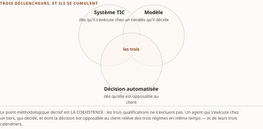
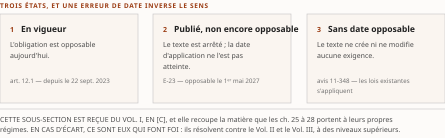

# Chapitre 30 — Le maillage réglementaire international et la normalisation institutionnelle

*Livre III — Encadrer : orchestration en entreprise, cadre réglementaire canadien et terrain financier.
Deuxième mouvement — le cadre réglementaire canadien (ch. 25-30). Sixième et dernier chapitre du
mouvement : il sort du Canada pour y revenir, et **ferme le versant réglementaire avant que le
troisième mouvement n'ouvre le terrain**.*

| Champ | Valeur |
|---|---|
| **Statut** | **Brouillon de rédaction, non publiable** — pièce rédigée **avant** la porte **G-3**, sur instruction d'auteur du 27 juillet 2026. ⚠ **G-3 est franchie depuis le 28 juillet 2026** (PRD v0.14 ; socle consolidé à **159 entrées**) — *une porte franchie après coup solde la rédaction qui l'a devancée, elle ne la rattrape pas.* ⚠ **G-4 demeure ouverte et opposable à ce chapitre**, dont le § 30.3 provient intégralement du Vol. III. ⚠ **La règle cardinale du PRD §5 est enfreinte.** Voir la note de statut, § 30.4. ⚠ **D-9 ne bloque pas ce chapitre** : *il ne prescrit aucune parade humaine.* ⚠ **Ce chapitre est celui du Livre dont la matière est la plus périssable** : *un calendrier réglementaire européen en cours de publication, un arrêté qui n'a pas été pris, et les **sept rangées d'instances du tableau 30.3**, dont les travaux spécifiques à l'identité d'agent sont pré-normatifs sans exception relevée **partout où le socle en documente***. ⚠ **La formule ne dit pas que ces instances n'auraient rien publié** : *deux de ces rangées portent des **Recommandations du W3C** (modèle de données des accréditations v2.0, 15 mai 2025 ; identifiants décentralisés v1.0, 19 juillet 2022), mais ce sont des **formats génériques, non écrits pour l'agent** — c'est la partition exacte que le § 30.3.3 établit.* ⚠ **Et la septième rangée ne documente rien** : *les travaux du sous-comité international d'IA et de l'organisme européen de normalisation ne sont portés par aucune entrée, et rien n'est affirmé d'eux — pas même leur caractère pré-normatif.* |
| **Date de gel** | **27 juillet 2026** — gel unique, **D-1 prise** (registre : [`gel-2026-07-27.md`](../PRD/gel-2026-07-27.md)). ⚠ **Le volet de FAITS de G-1 est levé depuis le 28 juillet 2026** (registre : [`gel-2026-07-28-volet-residuel.md`](../PRD/gel-2026-07-28-volet-residuel.md)) : *sur les **seize entrées** que ce chapitre mobilise, **quatorze** y ont été portées à leur source primaire, et **deux ont changé — toutes deux sur un décompte de participants** ; seul celui du § 30.3.3 est écrit ici, et il y est re-daté.* ⚠ **Les deux autres sont HORS du domaine instruit, et ce n'est pas un détail** : *`F-48` (→ `S-094`) et `F-51` (→ `S-097`) sont classées **sans sensibilité temporelle** par leur socle source — leur re-datation est déclarée **sans objet**, non faite —, et elles portent l'une le second enseignement du § 30.3.3, l'autre le précédent des deux fédérations de confiance ; **une entrée non re-datée n'est pas une entrée inchangée** : c'est une entrée qu'on n'a pas regardée.* ⚠ **Les volets de pièce des Livres II et III restent dus**, et ils pèsent ici sur une douzaine de dates réglementaires européennes que le socle ne porte pas. Gels de source consommés : **juin 2026** (Vol. I §4.8, §5.3, §2.11.3), **16-17 juillet 2026** (Vol. II ch. 21 §21.2) et **21 juillet 2026** (Vol. III ch. 21) — ⚠ **aucun ne tient lieu du gel de la somme**, et l'écart entre le plus ancien et le plus récent est de **plus d'un mois** sur une matière qui se périme par trimestres |
| **Socle mobilisé** | ⚠ **Le socle consolidé existe depuis le 28 juillet 2026** — [`socle-consolide.md`](../PRD/socle-consolide.md) v1.2, **159 entrées `S-001`…`S-159`** — *et ce chapitre a été rédigé avant lui* : ses énoncés résolvent contre les identifiants de leurs volumes d'origine, que les tables de correspondance normatives du socle rattachent à la série consolidée. ⚠ **Trois régimes coexistent dans ce seul chapitre, et la distinction commande la lecture.** Le **Vol. I** — §4.8, §5.3, §2.11.3 — entre **intégralement en [C]** (PRD §7.1) : *repérage documentaire, aucun fait central.* Le **Vol. III *Monographie* ch. 21** conserve ses niveaux : **H-08** (→ `S-033`, fondue dans son origine du Vol. II), **F-69** (→ `S-115`), **F-48** (→ `S-094`), **F-34** (→ `S-080`) et **F-82** (→ `S-128`) en **[A]** ; **F-33**, **F-50**, **F-51**, **F-73**, **F-79**, **F-80**, **F-81**, **F-83**, **F-85** et **F-86** en **[B]**. ⚠ **Une entrée a changé de niveau à la refonte, et le corps le porte** : **F-56** (→ `S-102`) est **rétrogradée de [B] en [C]** le 28 juillet 2026 par la règle de composition — *jamais un fait central* —, et le tableau 30.3 le dit à sa rangée. ⚠ **Le champ a été re-mesuré contre le corps** : *F-33 et F-34, citées au § 30.3.2, y manquaient ; **H-19**, qui y était déclarée en **[C]**, n'est mobilisée par aucun énoncé du corps et en est retirée.* Le **Vol. II ch. 21 §21.2** y verse **Q5**, ⚠ *question d'agenda, non entrée factuelle*. ⚠ **Deux séries F-xx coexistent et se préfixent** (décision 7) ; la série `S-nnn` est la seule que le socle alloue. ⚠ **Aucun énoncé n'est central au sens de CA-IV-01** : *la matière des § 30.1 et § 30.2 est en **[C]**, celle du § 30.3 relève d'une source dont **G-4** n'est pas franchie, et **trois affirmations reprises du Vol. I sont exclues du socle à tout niveau** — voir § 30.2.3, § 30.2.6 et § 30.2.7.* |
| **Garde-fous balayés** | ⚠ **Décomptes re-mesurés au commit du 28 juillet 2026, règle de comptage de la décision 16 du TOC** : *ils portent sur le **marqueur littéral** dans le **corps** — en-tête et note de statut exclus —, et **là où le garde-fou est appliqué sans que son identifiant soit écrit, c'est le domaine balayé qui est déclaré, sans cardinal**.* Vol. II — **R-5 (attente réglementaire — ne rien anticiper) : quatre occurrences du sigle**, § 30.1.1, § 30.2.3, § 30.3.1 et § 30.3.2 ; **PRD §8.2.3 et §7.5 (métriques auto-déclarées) : les deux renvois ne sont pas écrits au corps** ; *le garde-fou est **appliqué aux § 30.2.2 et § 30.3.3** — ⚠ **avec une issue opposée aux deux endroits**, et c'est le résultat : le chiffre du § 30.3.3 est **attribué et daté aux deux relevés**, celui du § 30.2.2 **ne l'est pas** — sa source ne nomme pas l'étude, et **l'attribution manquante est déclarée due sur place*** ; **PRD §8.4 (neutralité fournisseur) : une occurrence du renvoi**, § 30.3.2 ; **PRDPlan Vol. II §4.4 — écrire « attendu par E-23 », jamais « exigé » : une occurrence du renvoi**, § 30.2.4 ; *la modalité s'écrit « E-23 **attend** », « elle **n'exige pas** », aux § 30.2.4 et § 30.2.7 — **le décompte de la formule n'est pas re-mesurable et n'est donc pas annoncé*** ; **R-1 à R-4, R-6 à R-8 : zéro occurrence**. Vol. III — **R-14 (trois degrés d'absence) : deux occurrences du sigle**, § 30.3.1 — ⚠ *et les degrés se marquent en toutes lettres : « degré 1 » au § 30.3.1, « degré 2 » aux § 30.3.2 et § 30.3.3 (deux), « degré 3 » aux § 30.1.4, § 30.3.1 et § 30.3.3 (deux), « fait négatif vérifié » aux § 30.3.1 et § 30.3.3 (deux)* ; **R-09 (quatre statuts, dits à chaque mention) : six occurrences du sigle**, § 30.1.2, § 30.2.3, § 30.3.2 (deux) et § 30.3.3 (deux) — *le garde-fou est en outre **appliqué à toutes les rangées du tableau 30.3***, où chaque statut est dit sans que le sigle soit repris ; **R-11 (jalons visés, jamais fixés) : deux occurrences du sigle**, § 30.3.1 et § 30.3.3 ; **R-02 : une occurrence du sigle**, § 30.3.3 ; **R-01 : une occurrence du sigle**, § 30.3.2 ; **R-13 : deux occurrences du sigle**, § 30.0 et § 30.1.1 ; **R-03 à R-08, R-10, R-12 : zéro occurrence** |
| **Volumétrie cible** | ≈ **7 500 mots** de corps (§ 30.0 à § 30.3), **cible dérivée** de l'enveloppe du Livre — 90 000 mots, inchangée du TOC v0.25 au TOC v0.30 — au prorata des **quinze sous-sections** qu'il déplie, et non des trois sections de tête. ☑ **Décompte publiable depuis G-2** ; la mesure réelle est portée au [`README.md`](README.md) du dossier, ⚠ **et elle a bougé à la relecture du 28 juillet 2026** — *la pièce a reçu des bornes de régime qu'elle n'avait pas (trois réserves d'exclusion, une attribution due, un trio de textes corrigé), et **le bornage allonge***. **Le chiffre se re-mesure au commit** (décision 16). ⚠ **D-4 interdit l'amputation comme le gonflement** : *une borne ne se coupe pas pour tenir une cible.* |

> **Thèse** *(citée depuis le [`TOC.md`](../PRD/TOC.md) v0.30, entrée du chapitre 30 — citation reportée par copie, décision 17)* — hors Canada, l'AI Act, ISO 42001, le RGPD et les cadres sectoriels dessinent le maillage transversal que l'agent en finance régulée doit satisfaire ; et la désignation de l'organisme de normalisation technique du cadre bancaire canadien fixera qui écrit les règles d'identité des agents financiers.

---

⚠ **La thèse a été collationnée contre le texte rédigé de ses trois sources avant la rédaction**
(décision 14 du TOC). **Domaine de balayage : une thèse examinée, zéro réalignée — et une borne à
porter.** Le premier membre est une **construction d'éditeur** dérivée du §4.8 du Vol. I, qui n'a pas de
thèse formelle ; il en reprend fidèlement les quatre leviers. **Le second membre reprend la thèse du
Vol. III ch. 21**, ⚠ **et sa source déclare elle-même que cette thèse « se scinde en deux moitiés de
statut inégal »** : le socle établit l'**incertitude de la date**, il **n'établit pas** que les
conséquences architecturales soient « certaines » — *absence de documentation, degré 3.* **Le plan a
retenu la moitié établie et laissé tomber le qualificatif contesté** ; *le corps écrit la forme plus
étroite que sa source retient : le choix de l'auteur d'une norme détermine le corpus dont elle
héritera, et ce corpus est aujourd'hui inventoriable.*

## § 30.0 — Ouverture : sortir du Canada pour y revenir

Les cinq chapitres précédents ont décrit un corpus canadien : un régime prudentiel fédéral, un vide, un
régime québécois, un avis de marché, et la traduction des trois premiers en contraintes d'architecture.
**Ce chapitre fait deux choses que les autres ne font pas.**

**Il sort du Canada** — parce qu'un agent déployé par une institution financière canadienne opère
rarement dans un seul espace juridique, et parce que le maillage européen et américain **préexiste au
maillage canadien et l'informe**. **Puis il y revient** — sur une question qui n'est ni européenne ni
américaine, et dont la réponse n'est pas écrite : **qui écrira les règles techniques d'identité des
agents financiers canadiens ?**

⚠ **Trois régimes de preuve coexistent dans ce chapitre, et les confondre en ruinerait la lecture.** *Le
§ 30.1 et le § 30.2 viennent du **Vol. I** et entrent **intégralement en [C]** — repérage documentaire,
aucun fait central. Le § 30.3 vient du **Vol. III** et conserve ses niveaux, dont **cinq entrées en
[A]** — l'en-tête les nomme, avec leur correspondance au socle consolidé. Et une question d'agenda du
**Vol. II** — Q5 — y est instruite sans être tranchée.* **La frontière passe donc à l'intérieur du
chapitre, et elle est marquée à chaque section.**

**Ce que le chapitre ne traite pas.** ⚠ **Le siège de la double-qualification — l'agent comme *modèle*
et comme *tiers TIC* — est au ch. 31 § 31.1.4** : *le §5.3 du Vol. I déclare lui-même **ne faire que
l'instancier**, et ce chapitre ne la repose pas.* Le **registre comme pièce de conformité** est au
**ch. 25 § 25.5** ; les **standards de données financières** au **ch. 31 § 31.2** ; le **cadre bancaire
canadien** lui-même au **ch. 32**. ⚠ **Et les échelles d'autonomie ne s'emploient jamais nues** (R-13 du
Vol. III) : *le ch. 14 § 14.4 en est le lieu de croisement.*

## § 30.1 — Gouvernance et conformité d'entreprise

Section **reçue du Vol. I *Monographie* §4.8 et §2.11.3**, ce dernier **arrivant du ch. 6**. ⚠ **Toute
la matière de cette section entre en [C]** — repérage documentaire — *et aucun de ses énoncés ne porte
un fait central.*

**L'objet à gouverner change de nature dès lors qu'un agent agit dans le tissu d'entreprise.**
L'exploitation d'un modèle isolé et de son outillage relève d'une discipline ; **la gouvernance
d'entreprise porte sur le *système* déployé** : un acteur autonome greffé sur le tissu d'intégration
existant, doté d'une identité de flotte, puisant dans le patrimoine informationnel et susceptible de
franchir des frontières organisationnelles — *tout ce que le ch. 24 a décrit.*

**Trois leviers structurent la section et se renforcent** : les **obligations légales** qui imposent
une *règle* — AI Act, RGPD, réglementation sectorielle ; les **normes volontaires** qui fournissent
un *système de management* — ISO/IEC 42001, NIST AI RMF ; et les **contrôles techniques** qui
rendent la règle *exécutable* — inventaire, *policy-as-code*, journalisation probante. ⚠ **Les
instruments se nomment avec leur auteur et leur date** (décision 15 du TOC) : *la parade de
péremption vaut pour les dénominations commerciales et les numéros de version, jamais pour
l'attribution d'un instrument repris.* ⚠ **L'état réglementaire est arrêté au gel du Vol. I — juin
2026 — et le calendrier est mouvant** : *chaque échéance est qualifiée par son statut juridique
exact, et tout report non publié officiellement est signalé comme **non acquis**.*

### 30.1.1 Qualification des agents sous l'AI Act et calendrier d'application

Le règlement européen sur l'intelligence artificielle — l'**AI Act**, règlement (UE) 2024/1689 —
structure la conformité par **les rôles** et par **le niveau de risque** : deux axes que l'autonomie
d'action d'un agent vient **déplacer**.

*Sur l'axe des rôles* : l'entreprise qui **développe** l'agent est fournisseur, celle qui l'**exploite
sous sa propre responsabilité** est déployeur ; **la distinction conditionne la répartition des
obligations**, et en particulier le déclenchement des devoirs du fournisseur lorsqu'un déployeur
**modifie substantiellement** un système ou l'estampille de sa marque. ⚠ *C'est le même partage que le
ch. 29 § 29.3 a rencontré du côté canadien, sous une autre forme : **celui qui exploite**.*

*Sur l'axe du risque* : le règlement échelonne les usages en pratiques interdites, systèmes à haut
risque, systèmes soumis à transparence, et usages non réglementés. ⚠ **Le point critique pour
l'agentique est que la composition d'outils et l'autonomie de décision peuvent faire *basculer de
niveau* un système au départ anodin** : *un assistant conversationnel devient candidat au régime de haut
risque dès lors qu'il **prend ou influence** des décisions dans un domaine listé, et déclenche des
obligations de transparence lorsqu'il interagit avec des personnes.* ⚠ **La qualification ne dépend donc
pas du modèle, mais du couple donnée-décision que l'agent met en œuvre** — *et ce n'est pas un palier
d'une échelle d'autonomie* (R-13 du Vol. III) : *c'est une qualification juridique, dont le déclencheur
est l'usage.*

**Le calendrier appelle une lecture précise, car il commande les obligations qui pèsent dès
aujourd'hui.** Les obligations relatives aux modèles à usage général sont **applicables depuis le
2 août 2025**, les fournisseurs de modèles mis sur le marché avant cette date disposant d'une période de
grâce documentaire jusqu'au **2 août 2027** ; le pouvoir de supervision et de sanction des autorités
entre en vigueur à partir du **2 août 2026**.

⚠ **À ce socle se superpose un train de simplification dont le statut a évolué entre les deux volumes
sources, et la somme expose l'écart plutôt qu'elle ne l'arbitre.** *Le Vol. I, au §4.8.1, décrit un
**accord politique provisoire** du 7 mai 2026 qui **reporterait** l'application du régime de haut risque
autonome au **2 décembre 2027** et celle du régime embarqué au **2 août 2028**, et pose que **son effet
juridique demeure subordonné à l'adoption formelle et à la publication officielle, non acquise à sa date
de référence**. Le même volume, à son §5.3.3 et à son §2.11.3, décrit le même report comme **adopté dans
la fenêtre du socle** — accord du 7 mai, vote parlementaire du 16 juin, entérinement du 29 juin 2026 —
**sous la seule réserve de la publication officielle à suivre**.* ⚠ **Les deux états sont datés et
compatibles — le second est postérieur au premier —, et la somme retient la formulation la plus
récente : le report est adopté, sous réserve de publication.** ⚠ **R-5 du Vol. II s'applique dans les
deux sens** : *ce qui n'est pas publié ne se décrit pas comme acquis, et **une architecture de
conformité prudente conserve une trajectoire alignée sur les échéances actuelles**.*

⚠ **Le déclencheur opérationnel n'est pas la date, mais l'inventaire.** *Un agent ne peut être qualifié
que s'il figure au registre décrit au § 30.1.3, avec son périmètre de décision et ses outils.*

### 30.1.2 Normes volontaires : ISO/IEC 42001, famille 42000, NIST AI RMF

**Là où la loi impose une règle, les normes volontaires fournissent l'appareil de management qui rend
cette règle tenable dans la durée.**

**ISO/IEC 42001:2023** définit un **système de management de l'intelligence artificielle certifiable**,
bâti sur la structure de haut niveau commune aux normes de management — ⚠ *ce qui permet de l'imbriquer
avec ISO/IEC 27001, déjà en place dans la plupart des institutions*. Son exigence d'évaluation d'impact
est opérationnalisée par **ISO/IEC 42005:2025**, **articulable** aux évaluations d'impact que d'autres
régimes imposent — celle de l'AI Act et celle du RGPD —, ⚠ *trois exercices qu'une organisation a
intérêt à conduire de façon convergente plutôt que redondante.* Autour de ce noyau gravite la **famille
42000** (terminologie, gestion du risque, cycle de vie, exigences d'organismes d'audit).

⚠ **Le point d'attention propre à l'agentique est que ces normes, conçues pour des *systèmes* d'IA,
doivent être appliquées à l'*autonomie d'action*** : *le périmètre du système de management doit couvrir
non seulement la qualité de la sortie du modèle, mais **les actions que l'agent déclenche dans les
systèmes d'enregistrement**.*

Du côté américain et inter-juridictionnel, le **NIST AI Risk Management Framework 1.0** (NIST, 2023)
organise la gouvernance autour de quatre fonctions, complété pour le génératif par le profil **NIST AI
600-1** (NIST, 2024). ⚠ **Pour l'autonomie d'action, ces cadres généralistes se prolongent par des
surcouches de sécurité** — les *Control Overlays for Securing AI Systems* du CAISI, ⚠ **en brouillon de
discussion au 8 janvier 2026** au relevé du Vol. I : *travaux émergents, non une norme ratifiée* (R-09
du Vol. III). ⚠ **Un profil agentique dédié, élaboré sous l'égide de la Cloud Security Alliance, était
lui-même au statut de brouillon en 2026, et ne saurait être présenté comme acquis.**

Lecture de l'auteur — **l'intérêt pratique de ces normes tient aux tables de correspondance qui relient
les exigences des différents cadres** : *une organisation qui projette une seule fois ses contrôles sur
le système de management peut démontrer une **couverture multi-cadres**, ce qui réduit le coût marginal
de chaque obligation nouvelle* — **transposition normative de la logique N×M → N+M du ch. 24 § 24.0.3**.
**Ce que le socle établit** : l'existence de ces correspondances. **Ce qu'il n'établit pas** : leur
rendement effectif, ni cette transposition, qui est une lecture reprise du Vol. I.

⚠ **Une question reste ouverte et se déclare** : *ces cadres restent centrés sur le **système** ; un
modèle de gouvernance qui prendrait pour unité l'**action autonome composée** — un agent invoquant un
outil qui en invoque un autre — et qui saurait **attribuer le risque le long d'une chaîne de
délégation** n'est documenté par aucune entrée.* **Le ch. 17 en porte le versant technique ; le
ch. 29 § 29.3 en porte le versant juridique, et ni l'un ni l'autre ne la referme.**

### 30.1.3 Inventaire/registre d'agents et *policy-as-code*

**Le principe fondateur tient en une formule : on ne gouverne que ce qu'on a inventorié.**

⚠ **Le registre d'agents est l'objet de gouvernance de premier rang, car il transforme une flotte opaque
— symptôme de la prolifération décrite au ch. 24 § 24.0.2 — en un parc dont chaque membre est connu.**
Un registre utile recense, pour chaque agent : **ses capacités**, **les outils qu'il peut invoquer**,
**son niveau d'autonomie**, **son périmètre de décision**, **le propriétaire humain responsable**, **les
données auxquelles il accède** et **son niveau de risque réglementaire**.

*Sans ce socle, l'IA fantôme — agents déployés hors de tout contrôle par des équipes métier — échappe
**par construction** à toute qualification et à tout audit.* ⚠ **L'inventaire est donc moins un artefact
documentaire qu'un point d'application : c'est lui qui alimente les portes d'admission et de mise en
production.**

**Le second pilier est la politique exécutable** : des jeux de règles alignés sur les différents cadres,
**compilés en règles évaluées à l'exécution** et branchés sur ces portes.

⚠ **L'écueil à éviter est le théâtre de conformité** : *un registre qui n'est pas relié à un point
d'application **documente sans contraindre**.* **Un indicateur vérifiable de maturité — repris au ch. 24
§ 24.9.2 — est le pourcentage d'agents effectivement soumis à une politique exécutable, et non
simplement déclarés.**

⚠ **Le registre comme pièce de conformité prudentielle est au ch. 25 § 25.5**, qui en est le siège dans
la somme ; **le registre comme objet d'émission est au ch. 15**. *Ni l'un ni l'autre n'est reconstruit
ici : cette sous-section n'en porte que le versant de gouvernance d'entreprise.*

### 30.1.4 **RGPD pour agents autonomes** et réglementation sectorielle

⚠ **Une précision de provenance ouvre cette sous-section, et elle vaut avertissement.** *Le Vol. III
déclare que **son socle ne documente ni le règlement général européen sur la protection des données
— le RGPD — ni aucun de ses articles** : absence de documentation, degré 3, portée à son registre
sous le numéro 16. Il déclare de même qu'**aucun rapprochement entre le régime québécois et le
régime européen n'est opéré chez lui** (**ch. 27 § 27.7**).* ⚠ **La matière européenne de la somme
est donc portée par le Vol. I seul, et elle entre en [C].** *Ce n'est pas une contradiction entre
volumes : « le socle du Vol. III ne documente pas X » et « le Vol. I documente X » sont
**logiquement compatibles** — c'est une **lacune de couverture**, et couverte en [C] ne vaut pas
comblée.*

**Le RGPD frappe l'autonomie agentique de plein fouet par sa disposition sur la décision individuelle
automatisée**, qui l'encadre et ouvre un droit à explication. *Dès qu'un agent prend ou influence
**sans intervention humaine significative** une décision produisant des effets juridiques ou
comparables — accord de crédit, tri de candidatures, modulation d'un service essentiel —, le déployeur
doit pouvoir établir la base légale du traitement, démontrer la minimisation des données et fournir une
explication intelligible de la logique sous-jacente.*

⚠ **C'est précisément là que l'attribution par identité non humaine cesse d'être un sujet de sécurité
pour devenir un instrument de redevabilité** : *la chaîne d'identité et la piste d'audit sont ce qui
permet de rattacher une décision contestée à un agent, à son propriétaire et à ses sources de données.*
**Le principe directeur, valable au-delà de ce seul régime, est que la conformité dépend de la donnée
traitée et de la décision prise, non du modèle considéré isolément.**

⚠ **Le lecteur remarquera la parenté avec l'article 12.1 du ch. 27, et il faut la borner.** *Les deux
régimes se déclenchent sur une propriété du **processus décisionnel**, non sur une technologie ; mais le
Vol. I note que le régime québécois **n'est pas une interdiction** de type européen, mais **un régime de
transparence et de révision**.* ⚠ **Le rapprochement est une lecture du Vol. I, en [C], et le ch. 27 ne
la porte pas** — *aucune conclusion juridique n'en est tirée ici.*

**Dans le secteur financier, l'empilement réglementaire est le plus dense**, et il fait l'objet du
§ 30.2. **Dans la santé**, le régime des données personnelles se combine à d'autres cadres lorsque
l'agent touche au dispositif médical — *souvent assorti d'un déploiement sur site ou en infonuagique
souverain.*

### 30.1.5 Résidence/souveraineté, responsabilité, *e-discovery* et modèle opérationnel de gouvernance

**La résidence — où repose physiquement la donnée — et la souveraineté — quelle juridiction la régit —
ne sont pas seulement des contraintes de gouvernance : elles deviennent des contraintes d'architecture
d'interopérabilité.**

⚠ **Pour un parc d'agents, la question n'est plus seulement où sont stockées les données, mais où
s'exécute l'inférence, où transitent les jetons par la passerelle du ch. 24 § 24.1.3, et où se déposent
les traces inter-organisations.** *Un cadre législatif extraterritorial qui peut contraindre un
fournisseur à livrer des données hébergées hors de son territoire nourrit la demande d'offres
souveraines.* ⚠ **Une trajectoire d'agent qui traverse plusieurs systèmes peut franchir plusieurs
frontières juridictionnelles à chaque saut** — *ce qui fait de la résidence des traces une question de
conception, non de configuration a posteriori.* **Le ch. 31 § 31.5 en porte le versant financier.**

**Le second enjeu est la responsabilité.** ⚠ **Le retrait d'une proposition de directive européenne sur
la responsabilité en matière d'IA, publié officiellement le 6 octobre 2025, laisse un vide
spécifique** : *à défaut de régime dédié, le recours se rabat sur une directive révisée sur la
responsabilité du fait des produits, qui couvre désormais explicitement les logiciels et produits d'IA
et **doit être transposée d'ici le 9 décembre 2026**.* ⚠ **Le ch. 24 § 24.7.4 porte le même constat au
grain de la frontière inter-firmes** ; il n'est pas doublé ici.

⚠ **Dans ce paysage, la piste d'audit tient lieu de substitut probatoire** : *c'est elle qui, à défaut
de présomption légale claire, permet d'établir ce qu'un agent a décidé et sur quelle base.* **D'où
l'enjeu de production de preuve en litige — l'admissibilité des traces d'agents et le déclenchement
d'une obligation de conservation — qui impose des journaux conçus dès l'origine pour résister à la
contestation.** ⚠ **Le siège de la piste d'audit financière est le ch. 31 § 31.3.2**, et **la
traçabilité de l'ancrage le ch. 24 § 24.4.5** ; *ni l'un ni l'autre n'est reconstruit ici.*

**Au plan organisationnel**, le modèle opérationnel de gouvernance s'aligne sur des structures éprouvées
transposées : comité de gouvernance, matrice de responsabilités distinguant concepteurs, déployeurs et
exploitants, et modèle des trois lignes de défense. ⚠ **La question ouverte, dans un réseau d'agents
coordonnés, est celle de la traçabilité de la redevabilité lorsque la décision résulte d'une chaîne de
délégation distribuée** — *traitée au ch. 24 § 24.9.4 comme enjeu socio-technique, au ch. 29 § 29.3
comme question d'imputabilité, et **refermée par ni l'un ni l'autre**.*

## § 30.2 — Maillage réglementaire transversal UE / US / Canada-Québec

Section **reçue du Vol. I *Monographie* §5.3**. ⚠ **Toute sa matière entre en [C]**, et **le siège de
la double-qualification est au ch. 31 § 31.1.4** : *le §5.3 déclare lui-même ne faire que l'instancier.*

Le § 30.1 a posé le générique transversal. **Cette section pose la question préalable à toute conception
de contrôle : *sous quel droit* l'agent tombe-t-il, et *avec quelle force juridique*.** ⚠ **Le principe
directeur est que chaque exigence est menée par une obligation nominative, datée et qualifiée — en
vigueur, en phase d'application, en projet ou en accord provisoire — plutôt que par une généralité
réglementaire.**

### 30.2.1 La grille de qualification multiple : système TIC / modèle / décision automatisée

**Avant de réguler un agent, l'architecte doit déterminer sous quels régimes il tombe.** ⚠ **Le patron
de fond — la double-qualification, l'agent comme *modèle* *et* comme *tiers TIC* — est posé une fois
pour toutes au ch. 31 § 31.1.4 ; il n'est pas re-dérivé ici, seulement instancié.**

Un agent financier reçoit **jusqu'à trois qualifications cumulatives, non exclusives**.

| Qualification | Déclencheur | Régime |
|---|---|---|
| **Système TIC** | dès qu'il s'exécute sur une infrastructure fournie par un tiers — modèle, passerelle, serveur d'outils | résilience opérationnelle ; inscription au registre des tiers (§ 30.2.2) |
| **Modèle** | dès qu'il **décide** — note de crédit, tarification, déclaration de soupçon | risque de modèle (§ 30.2.4 ; **ch. 25** pour le versant canadien) |
| **Décision automatisée** | dès qu'il produit une décision **opposable au client** | droit de la décision individuelle automatisée (**ch. 27** pour le Québec ; § 30.1.4 pour l'Europe) |

: Tableau 30.1 — La grille de qualification multiple d'un agent financier. ⚠ **Le point méthodologique décisif est que la coexistence de ces régimes est *le patron, pas une erreur à corriger*** : *la conformité consiste à produire la piste d'audit pour chacun **simultanément**, non à choisir l'un d'eux.*

### 30.2.2 DORA et la résilience opérationnelle : l'agent comme service TIC

Le règlement européen de résilience opérationnelle numérique du secteur financier — **DORA** —,
**applicable depuis le 17 janvier 2025**, structure la matière autour de **cinq piliers** :
gouvernance du risque technologique, gestion des incidents, tests de résilience, gestion du risque lié
aux tiers, et partage d'information.

⚠ **Pour l'agentique, l'articulation la plus contraignante porte sur le registre des tiers et sur le
risque de concentration** : *tout fournisseur de modèle, de passerelle ou de serveur d'outils devient un
**tiers technologique à inscrire dans un registre opposable**, accompagné d'une **stratégie de sortie
testée** et — pour les entités significatives — de tests d'intrusion fondés sur la menace.*

⚠ **Le N+M de fournisseurs du ch. 24 § 24.0.3 cesse ainsi d'être une vue d'architecture pour devenir un
registre réglementaire.** *Un corollaire propre à la souveraineté : **un modèle à poids ouverts, dès lors
qu'il est fourni par un tiers, s'inscrit lui-même au registre** et devient un tiers traçable, soumis aux
mêmes exigences de sortie et d'évaluation de concentration.*

**La désignation d'une première liste de fournisseurs critiques transforme cette obligation de registre
en dépendance supervisée et concrète.** Le **18 novembre 2025**, les autorités européennes de
surveillance ont désigné **dix-neuf fournisseurs technologiques tiers critiques**, dont les trois grands
opérateurs d'infrastructure infonuagique. ⚠ **Un agent déployé sur l'un d'eux hérite donc mécaniquement
d'une dépendance vers un fournisseur supervisé, sans intervention de l'institution.**

⚠ **Le risque de concentration n'est pas théorique, et le chiffre porte son statut** : *une part
documentée des entités financières européennes — **supérieure à 65 % selon une étude tierce, à
re-vérifier** — s'appuie sur au moins deux des trois grands fournisseurs pour des fonctions critiques.*
⚠ **L'attribution de ce chiffre est due et manque à sa source** : *le Vol. I ne nomme pas l'étude, et
« une étude tierce » n'est pas une attribution* (décision 15 du TOC) — **la métrique est donc citée
avec sa réserve, et aucun énoncé de la somme ne s'y adosse.** **Le ch. 31 § 31.5.2 en porte l'analyse.**

**La conséquence pour le fil de la somme est nette** : *ce régime impose un **contrat** explicite entre
l'entité financière et chaque tiers de la chaîne agentique, et un plan d'**évolution** — la stratégie de
sortie — qui maintient le **découplage** vis-à-vis d'un fournisseur dont la défaillance serait
systémique.*

### 30.2.3 AI Act Annexe III : haut-risque ciblé et report adopté

⚠ **L'AI Act ne qualifie pas l'usage financier en bloc : la classification en « haut risque » est
strictement libellée à son annexe III, et toute extrapolation crée un risque de sur-conformité.**

*Un point de l'annexe III vise le **scoring de crédit et l'évaluation de la solvabilité des personnes
physiques** — ⚠ **avec une exclusion explicite pour la détection de fraude, qui n'est donc pas à haut
risque**. Un autre vise **la tarification et l'évaluation du risque en assurance vie et santé
uniquement**.*

⚠ **Deux pièges de qualification en découlent et doivent être tenus fermement** : *(a)* **ne pas étendre
le statut de haut risque à l'assurance de dommages**, que l'annexe ne vise pas ; *(b)* **ne pas oublier
l'exclusion de la fraude**, qui maintient les agents de détection de crime financier hors du régime —
⚠ **et c'est ce qui fonde leur rôle de tête de pont au ch. 31 § 31.4.3.**

**Le calendrier appelle une qualification temporelle tout aussi précise.** Les obligations relatives aux
systèmes à haut risque de l'annexe III **devaient s'appliquer au 2 août 2026**. ⚠ **Le report décrit au
§ 30.1.1 les porte au 2 décembre 2027** — *l'IA embarquée au 2 août 2028, le marquage des contenus
synthétiques au 2 décembre 2026* — ⚠ **et il est adopté dans la fenêtre du socle, sous la seule réserve
de la publication officielle à suivre** (R-09 du Vol. III : *le statut se dit à chaque mention*).
**L'échéance opposable pour le régime autonome devient ainsi le 2 décembre 2027.** ⚠ **R-5 du Vol. II
tient** : *tant que la publication n'est pas intervenue, une architecture prudente conserve la
trajectoire antérieure.*

**Sur l'articulation avec le droit financier sectoriel**, deux autorités européennes ont posé le
cadrage : l'**Autorité bancaire européenne** traite le règlement comme **complémentaire** du droit
prudentiel bancaire et du crédit, tandis que l'**Autorité européenne des assurances et des pensions
professionnelles** confirme — **sans imposer d'exigences nouvelles** — que les régimes prudentiels
d'assurance encadrent déjà l'usage de l'IA. ⚠ **Les deux moitiés de cette phrase n'ont pas le même
régime, et l'écart se déclare** : *le premier terme repose sur une mise en correspondance de
**novembre 2025** que le Vol. I range lui-même **hors de son corpus bibliographique** — **exclue du
socle consolidé à tout niveau** (PRD §7.1, décision prise sur la remontée R-IV-97) et **citable avec
cette réserve, jamais versable** ; le second repose sur un avis daté du **6 août 2025**, sourcé.*

### 30.2.4 Risque-modèle : la divergence transatlantique

*⚠ **Cette sous-section est le siège du régime de risque de modèle côté international** ; le versant
canadien est au **ch. 25**, et les approfondissements sectoriels du ch. 34 y renvoient.*

**Le fait structurant est une divergence transatlantique d'approche.**

**Aux États-Unis**, le **17 avril 2026** marque une bascule : une **guidance interagences de la Réserve
fédérale, de l'OCC et de la FDIC** remplace le corpus que les deux premières avaient posé en **2011**.
⚠ **Deux propriétés en font un cas d'école de qualification.** *D'une part, elle **exclut
explicitement de son périmètre l'IA générative et l'IA agentique**, jugées « novel and rapidly
evolving », renvoyées à une demande d'information annoncée. D'autre part, elle demeure **non
contraignante** — c'est l'écart d'approche le plus net avec l'Europe et le Canada, plus prescriptifs.*

⚠ **Le piège inverse doit être souligné avec autant de force : l'exclusion du périmètre du risque de
modèle ne crée aucune zone de non-droit pour l'agent**, qui reste soumis à la gouvernance générale, au
droit du crédit équitable et au dispositif anti-blanchiment.

**Au Royaume-Uni**, le cadre est **en vigueur et stable** : une déclaration prudentielle de l'**autorité
de régulation prudentielle de la Banque d'Angleterre**, publiée en **2023** et en vigueur depuis
**2024**, articule **cinq principes** de gestion du risque de modèle pour les banques. **En Europe**, le
risque de modèle reste **distribué** — *pas de cadre unique* — entre le droit prudentiel et les
obligations de gestion du risque et de transparence de l'**AI Act**.

⚠ **Et au Canada, la lecture se fait au ch. 25, avec sa formulation imposée** : *E-23 **attend**, elle
n'exige pas* (PRDPlan Vol. II §4.4).

Lecture de l'auteur — **l'exclusion explicite de l'IA générative et agentique du périmètre américain
ouvre un vide de cadrage.** *La transposition des trois piliers du risque de modèle — inventaire,
validation indépendante, surveillance continue — à des artefacts non déterministes est traitée au
**ch. 31 § 31.3** ; la difficulté propre tient à ce que **la validation classique suppose une fonction
stable, là où un agent réintroduit de la variance à chaque inférence**.* **Ce que le socle établit** :
l'exclusion. **Ce qu'il n'établit pas** : cette difficulté, qui est une lecture reprise du Vol. I.

### 30.2.5 Conduite et marchés : MiFID II, *suitability*, MiCA

**Le conseil en investissement et l'évaluation d'adéquation relèvent d'un régime distinct du régime de
haut risque — point de qualification à ne pas confondre.**

Pour les services d'investissement, la directive **MiFID II** et son règlement d'accompagnement
**MiFIR** s'appliquent **sans atténuation** à l'usage de l'IA. ⚠ **L'Autorité européenne des marchés
financiers l'a confirmé par une déclaration publique du 30 mai 2024**, articulée avec ses orientations
révisées sur l'adéquation couvrant le conseil automatisé : ***la firme reste responsable du résultat de
l'évaluation d'adéquation, quel que soit le degré d'automatisation.***

⚠ **La conséquence de conception est directe : un agent de conseil ne déplace pas la responsabilité de
conduite** — *la **préparation** peut être automatisée, mais **la conformité du résultat demeure
imputable à l'entreprise***. **Le ch. 31 § 31.1.3 en porte le siège**, et **le ch. 34 § 34.4** le
versant sectoriel.

Pour les crypto-actifs, le règlement **MiCA** encadre les prestataires de services **depuis le
30 décembre 2024**, avec une période de transition s'étendant jusqu'à la fin juin 2026.

### 30.2.6 AML/CTF et capital : *single rulebook* 2027, AMLA, Bâle III

**Le régime de lutte contre le blanchiment se consolide selon un calendrier daté, qu'un agent de
conformité doit anticiper plutôt que subir.** Le paquet européen adopté le **24 avril 2024** institue un
corpus de règles unique — le *single rulebook* — **applicable le 10 juillet 2027**, tandis que
l'autorité de surveillance **AMLA**, établie à Francfort, est **opérationnelle depuis 2025**. ⚠ **La
date d'application du corpus unique porte une réserve de régime** : *le Vol. I range le règlement qui
l'institue **hors de son propre corpus bibliographique** — **exclu du socle consolidé à tout niveau**
(PRD §7.1, décision prise sur la remontée R-IV-97) —, de sorte que cette échéance est **citée avec sa
réserve et ne porte aucun énoncé de la somme**.*

⚠ **Ce calendrier importe pour l'agentique** : *un agent d'investigation conçu aujourd'hui devra être
conforme à un référentiel harmonisé qui n'entre pleinement en application qu'en 2027* — **ce qui plaide
pour un découplage entre la logique d'investigation et le jeu de règles, appelé à évoluer.**

**Sur les fonds propres**, le règlement européen qui met en œuvre la finalisation de **Bâle III**
s'applique **depuis le 1ᵉʳ janvier 2025** — avec un report de mise en œuvre pour l'une de ses
composantes — et la directive qui l'accompagne **doit être transposée à compter du 11 janvier 2026**.

⚠ **Le point de qualification du § 30.2.3 se rappelle ici** : *l'IA de détection de fraude bénéficie de
l'exclusion du régime de haut risque, **ce qui ne l'exonère pas des obligations de fond du dispositif
anti-blanchiment*** — traçabilité, programme de conformité, déclaration de soupçon. **Le patron est posé
au ch. 31 § 31.4.3.**

### 30.2.7 L'axe Canada / Québec

⚠ **Le maillage canadien et québécois exige une qualification temporelle particulièrement rigoureuse,
parce que plusieurs textes-pivots ne sont pas encore en vigueur, et qu'une erreur de date y inverse le
sens d'une obligation.**

⚠ **Cette sous-section est reçue du Vol. I, en [C], et elle recoupe la matière que les ch. 25 à 28
portent à leurs propres régimes. En cas d'écart, ce sont eux qui font foi** : *ils résolvent contre le
Vol. II et le Vol. III, à des niveaux supérieurs.* **Ce que le Vol. I y ajoute est signalé comme tel.**

**Sur le versant fédéral prudentiel**, le Vol. I porte les mêmes dates que le **ch. 25** pour **E-23** —
finalisation en septembre 2025, entrée en vigueur au 1ᵉʳ mai 2027 — et **deux pièges qu'il nomme** :
*(a)* **ne pas dater l'entrée en vigueur à 2025**, qui est la date de finalisation ; *(b)* **ne pas
confondre E-23 avec B-13**, la ligne directrice de technologie et cyberrésilience du même régulateur,
en vigueur depuis le 1ᵉʳ janvier 2024, **ni avec B-10**, celle de gestion du risque lié aux tiers, en
vigueur depuis le 1ᵉʳ mai 2024. ⚠ **Le trio qui forme le pendant canadien n'est pas celui-là, et c'est
tout l'objet du second piège** : *ce que le Vol. I désigne comme **le pendant canadien de la
double-qualification** du ch. 31 § 31.1.4 est la lecture conjointe de **B-13, B-10 et E-21** — **E-23
en est le texte à ne pas confondre, non un membre**.* ⚠ **Et E-21 porte une réserve de régime qui la
distingue des deux autres** : *le Vol. I la range **hors de son propre corpus bibliographique** —
**exclue du socle consolidé à tout niveau** (PRD §7.1, décision prise sur la remontée R-IV-97) —, de
sorte que **le troisième membre du trio est cité avec sa réserve, jamais versé**.* ⚠ **La formulation
imposée tient** : *E-23 **attend**, elle n'exige pas.*

⚠ **Sur le versant québécois, le Vol. I porte deux choses que le socle du Vol. II ne porte pas, et il
faut les lire au bon régime.**

**Première** : ⚠ **une date de publication différente.** *Le Vol. I date la version finale de la ligne
directrice sur l'utilisation de l'intelligence artificielle du **7 avril 2026***, là où le Vol. II porte
le 30 mars 2026 et où le Vol. III établit qu'**aucune des deux ne figure aux pages officielles**.
⚠ **La divergence est donc à trois termes, et le ch. 27 § 27.1 en porte la table** ; *elle est signalée
ici, non arbitrée.* **Ce qui est concordant — l'entrée en vigueur au 1ᵉʳ mai 2027 — suffit à tout ce que
la somme en tire.**

**Seconde** : ⚠ **une description de contenu, là où le Vol. II déclare une lacune.** *Le Vol. II pose que
« seules les dates de la ligne directrice sont au socle, jamais son contenu » — lacune §10.4, **la plus
coûteuse du volume**. Le Vol. I, lui, en décrit les attentes : **un responsable senior unique des
systèmes d'IA, un répertoire centralisé, une cote de risque périodique, une explication « claire et
simple » au client, une surveillance des biais et du calibrage dynamique** — et note qu'elle est
**distincte** de la ligne directrice de la même autorité sur le risque de modèle.*

⚠ **Ce n'est pas une contradiction, et il faut l'écrire exactement.** *« Le socle du Vol. II ne
documente pas le contenu » et « le Vol. I le décrit » sont **logiquement compatibles** : c'est une
**lacune de couverture**, non une divergence de fait.* ⚠ **Et la couverture est en [C]** — repérage
documentaire du Vol. I, dont la vérification porte sur les références et non sur le contenu des
affirmations : ***couverte en [C] ne vaut pas comblée***, et **aucun énoncé central ne peut s'y
adosser**. ⚠ **La lacune §10.4 reste donc ouverte, et le ch. 27 § 27.1 continue de la déclarer.**
*L'écart est remonté au ch. 25 (remontée R-IV-84) ; il n'est pas comblé ici.*

**Sur le droit de la décision automatisée**, le Vol. I porte l'article 12.1 avec ⚠ **un point de
qualification que le ch. 27 confirme** : *il ne s'agit **pas d'une interdiction** de type européen, mais
d'un **régime de transparence et de révision**.* **Le ch. 27 en est le siège** ; l'articulation exacte
et corrigée de l'article y figure.

**Au fédéral, le vide est notable**, et le **ch. 26** en porte le développement : *aucun régime canadien
de type règlement européen n'existe.*

⚠ **Le dispositif anti-blanchiment canadien complète la grille**, et le Vol. I le date : de nouvelles
obligations **depuis le 1ᵉʳ octobre 2025**, une conservation des registres pendant cinq ans, et — surtout
— ⚠ **un programme de conformité non délégable à l'agent** : *l'agent peut **préparer** le dossier,
jamais **porter** la responsabilité réglementaire.* **Le patron est au ch. 31 § 31.4.3.** ⚠ *Un projet
de loi sanctionné en mars 2026 porte d'autres amendements, dont **l'entrée en vigueur est échelonnée et
reste à confirmer** — ressource vivante, non un acquis.*

## § 30.3 — La normalisation institutionnelle et le cadre bancaire canadien

Section **reçue du Vol. III *Monographie* ch. 21**, et **instruisant Q5 de la série d'agenda du
Vol. II** (*Monographie* ch. 21 §21.2). ⚠ **Le Vol. II porte deux séries « Q n » indépendantes** : celle
d'agenda, dont Q5 relève, et celle du **ch. 36 § 36.4** — *nommer la série à chaque renvoi* (décision 7).

**Les deux mouvements qui précèdent lisent des textes publiés. Celui-ci porte sur un texte qui n'est pas
écrit, et sur la question préalable de savoir qui l'écrira.**

Le cadre canadien des services bancaires axés sur les consommateurs prévoit **une norme technique
unique**, établie par un organisme de normalisation technique **qu'un arrêté ministériel doit désigner**
(Vol. III H-08, **[A]**). ⚠ **Tant que l'arrêté n'est pas pris, l'institution qui conçoit aujourd'hui sa
pile d'identité agentique conçoit contre une inconnue dont le socle n'établit qu'une seule propriété :
l'unicité.**

⚠ **Le cadre bancaire lui-même est au ch. 32**, qui en porte la loi, la supervision, le règlement
prépublié et le fait négatif sur le standard technique. *Ce chapitre n'en traite que le versant
normalisation.*

### 30.3.1 État de la désignation

**Le mécanisme légal tient en une phrase** : la loi impose **une norme technique unique**, fixée par un
organisme désigné par arrêté ministériel (Vol. III H-08, **[A]**). ⚠ **L'unicité est la clause qui
compte** : *elle **exclut la coexistence de deux profils concurrents** dans le périmètre du cadre, et
elle **transfère à une seule instance** la charge de trancher ce que plusieurs corpus internationaux
laissent aujourd'hui ouvert (§ 30.3.3).*

**Le socle porte, sur l'état de cette désignation, trois énoncés de trois régimes distincts — et la
séparation est l'apport de la sous-section autant que les faits eux-mêmes.**

| Énoncé | Ce qui l'établit | Régime | Ce qu'il n'autorise pas |
|---|---|---|---|
| **Aucune des quatre chaînes cherchées ne figure dans les trois textes balayés** | balayage de quatre chaînes — dont le sigle d'un organisme candidat — dans le règlement prépublié, le communiqué et une page budgétaire : **zéro occurrence** (Vol. III H-08, **[A]**) | ⚠ **degré 1 — fait négatif VÉRIFIÉ** | conclure quoi que ce soit d'un texte **non compris dans ce balayage**, ⚠ **ni d'une désignation qui n'emploierait aucune des quatre chaînes cherchées** |
| **Au 27 juin 2026, le texte officiel écrit la désignation au futur** | lecture du résumé d'étude d'impact accompagnant le **projet** de règlement, en publication préalable — ⚠ *un texte à l'état de projet, non pris* (Vol. III F-69, **[A]**) | énoncé **positif** de lecture de texte | **dater la désignation**, ni la donner pour imminente |
| **Aucun arrêté de désignation n'a été pris** | — recherche par mots-clés ; ⚠ **l'index officiel des textes réglementaires pris n'a pas été balayé** (Vol. III F-69) | ⚠ **degré 3 — absence de documentation** | ⚠ **l'écrire** (R-14 du Vol. III) |

: Tableau 30.2 — Les trois énoncés sur l'état de la désignation, et leurs trois régimes, au 21 juillet 2026. ⚠ **Écrire « aucun arrêté n'a été pris » serait la faute que R-14 proscrit — et ce serait la commettre là où elle coûte cher**, puisque c'est de cet énoncé qu'une institution tirerait la conclusion qu'elle peut normaliser à sa guise en attendant.

⚠ **Le premier énoncé vaut par sa borne autant que par son contenu** : *c'est parce qu'on sait **ce qui a
été cherché, et où**, qu'un dossier de diligence raisonnable peut s'en prévaloir.* **La même entrée
range le sigle de l'organisme candidat du côté du commentaire d'industrie** — *il circule, il n'est
écrit nulle part dans les trois textes balayés.* ⚠ **R-5 du Vol. II est ici à son point d'application le
plus strict** : *une anticipation d'industrie n'est pas une désignation.*

⚠ **Cette sous-section instruit la lacune PRD Vol. II §10.1 — aucun arrêté ministériel constaté — et
l'écrit sans la combler.** *La revalidation d'ouverture du 21 juillet 2026 a repris cette ligne et l'a
portée « inchangé — désignation non intervenue » ; **la mention se cite pour ce qu'elle est : une
constatation d'état à une date, qui n'a créé aucune entrée de socle**. Une horloge institutionnelle se
relit à chaque gel* — et **le volet résiduel de G-1 ne l'a pas relue**.

**Quant au calendrier, le socle propre n'en porte pas.** ⚠ *Le Vol. II tient au titre de son
instrumentation une liste de jalons externes, dont l'arrêté **à date inconnue** ; **cette entrée n'est
pas un fait de socle** — elle provient de la construction d'auteur d'un volume antérieur et entre comme
thèse à attribuer.* **La qualification prospective que le socle autorise est celle-ci : PROGRAMMÉ sans
date d'engagement** — ⚠ *l'obligation de désigner est inscrite dans un texte, et le socle ne lui associe
aucune échéance.* ⚠ **Le tri prospectif employé ici — PROGRAMMÉ / PROJETÉ / SPÉCULATIF — est celui du
siège de la discipline, le ch. 49 § 49.0, et il n'est pas re-dérivé** : *le présent chapitre l'applique,
il ne le définit pas.* ⚠ **Ce n'est pas un jalon visé** (R-11 du Vol. III) : *le siège des jalons datés
et de leur statut est l'horloge post-quantique du ch. 21 § 21.1, et il n'est pas repris ici.*

### 30.3.2 Scénarios et leurs conséquences sur la pile identitaire

⚠ **Cette sous-section est une construction d'auteur en totalité, et son marquage est porté à son
ouverture.**

Lecture de l'auteur — **ce que le socle établit** : l'unicité de la norme et le mécanisme de désignation
(Vol. III H-08) ; l'état des mécanismes d'identité que cette norme trouverait sur son chemin. **Ce qu'il
n'établit pas** : *le contenu du futur standard, l'identité de son auteur, ni même qu'un standard sera
effectivement adopté.* ⚠ **La règle qui gouverne cette sous-section est R-5 du Vol. II — l'attente
réglementaire, ne rien anticiper** : *ce qui n'est pas publié n'est pas décrit.* **Les développements
qui suivent ne prédisent donc rien du texte à venir** ; *ils portent sur un autre objet, celui-là
inventoriable : **ce qu'une architecture doit déjà tenir, et qui ne dépend pas du sens dans lequel la
désignation tombera**.*

⚠ **La désignation ne choisit pas d'abord une règle : elle choisit un corpus de départ.** *Un organisme
de normalisation n'écrit pas sur page blanche ; il **étend ce qu'il a déjà publié**, avec le
vocabulaire, les points d'application et la cadence de révision de ce corpus.* **C'est à ce niveau, et à
ce niveau seulement, que le socle permet de raisonner.** ⚠ **Trois familles d'issue s'en déduisent —
SPÉCULATIVES au sens du tri prospectif, sans exception et sans hiérarchie entre elles** (**ch. 49
§ 49.0**, siège de la discipline pour toute la somme ; *elle est appliquée ici, jamais re-dérivée*).

**Première famille (SPÉCULATIF) — un corpus de partage de données bancaires par interfaces de
programmation.** *Si l'organisme désigné apporte un tel corpus, l'agent y entre par la porte du **client
logiciel**.* ⚠ **Ce que ce corpus étendrait est celui-là même dont le ch. 12 localise le point de
rupture** : les définitions du protocole d'autorisation n'écartent pas une entité non humaine, mais son
flux principal **présuppose un agent utilisateur interposé, par lequel le serveur d'autorisation
authentifie le détenteur de ressource**. *Un profil qui hérite de ce flux **hérite de son hypothèse**.*
⚠ **La conséquence architecturale n'est pas que l'agent y soit mal traité — c'est que le mandat qui
l'autorise reste hors du périmètre normalisé**, et doit être porté par un mécanisme que ce corpus ne
fournit pas à cet endroit. **La chaîne de mandat est au ch. 17** ; *elle ne devient pas moins nécessaire
du fait qu'un standard d'accès aux données serait adopté.*

**Deuxième famille (SPÉCULATIF) — un corpus d'identité générique.** *Si l'organisme désigné apporte un
corpus d'identité de charge de travail, le vocabulaire importé est celui de la **charge de travail
déléguée**.* Le socle en porte l'énoncé, daté et borné : un document d'architecture énonce **du point de
vue de son groupe de travail** que les intermédiaires d'IA sont **un cas particulier de charges de
travail déléguées** (Vol. III F-86, **[B]**). ⚠ **Énoncé d'un *Internet-Draft* en cours, à l'état
« I-D Exists » au relevé du 21 juillet 2026 — travaux émergents, non une norme ratifiée** (R-09) : *il
ne fait autorité sur rien et peut changer à la révision suivante.* ⚠ **La conséquence est que l'agent y
est identifié comme une charge de travail — ce que le ch. 3 documente déjà — et que la question « pour
qui agis-tu ? », Q-C de la grille du ch. 14 § 14.1, reste posée hors de ce vocabulaire.**

**Troisième famille (SPÉCULATIF) — la désignation tarde.** ⚠ **C'est celle des trois dont le socle
documente déjà les effets, parce qu'ils sont en cours.** *La disponibilité générale d'une offre
d'identité d'agent d'un grand fournisseur est datée d'**avril 2026** par les notes de version de son
éditeur (Vol. III F-33, **[B]**) ; le dispositif se déclare fondé sur deux protocoles d'autorisation, et
ses flux d'agissement pour le compte d'autrui **étendent les RFC** — ⚠ **le socle interdit expressément
de le présenter comme du « pur RFC »**.* ⚠ **La nuance de statut vaut d'être tenue** : *plusieurs
capacités nommées y demeuraient étiquetées en préversion au 21 juillet 2026, et **la disponibilité
générale d'un produit ne vaut pas disponibilité générale de ses capacités*** (Vol. III F-34, **[A]** ;
**ch. 14 § 14.2** en porte le verdict). ⚠ **Ce dispositif est retenu comme cas d'instanciation documenté,
avec sa date et son statut, jamais comme recommandation** (PRD Vol. II §8.4) ; **le ch. 13 en est le
siège**, et c'est lui qui porte la thèse du **risque de standard de fait** — ⚠ *un produit en
disponibilité générale fait exister l'identité d'agent gérée en production **avant tout standard**, et
préempte partiellement la normalisation.* **Cette thèse est une construction de la somme, pas un constat
de source.**

⚠ **Une conséquence traverse les trois familles, et c'est elle que la sous-section retient.** *Quelle
que soit l'issue, **la désignation ne clôt pas à elle seule le verrou dont le Livre II est né**.* Aucune
des propositions consultées par l'instruction du Vol. III **n'est ratifiée ni adoptée** : une
spécification déposée à la **DIF** n'était pas ratifiée à sa date de relevé, deux *Internet-Drafts*
consultés sur l'identité d'agent sont des **soumissions individuelles non adoptées**, et le groupe
communautaire correspondant du **W3C** — ⚠ *statut qui, selon les règles de publication de ce
consortium, **ne place ses travaux ni sur la voie des normes ni au rang de norme** : il ne produit pas
de Recommandation et n'engage aucun calendrier normatif* (R-09) — **n'avait publié ni rapport ni
brouillon** (Vol. III F-50, **[B]**, *fait négatif ÉTABLI, degré 2*). ⚠ **Un organisme désigné qui
voudrait s'adosser à l'un de ces travaux s'adosserait donc, à cette date, à des textes que leurs propres
instances n'ont pas adoptés.**

⚠ **Il faut enfin nommer ce que la désignation *ne* décide pas.** *Elle fixe l'auteur d'une norme
technique dans un périmètre sectoriel ; **elle ne crée pas l'objet qui manque**.* ⚠ **Le passeport
d'agent ne figure dans aucune spécification à date : c'est un objet de synthèse construit par la somme**
(R-01 du Vol. III ; **siège au ch. 16**). *Une désignation ne le fera pas exister ; elle décidera qui,
le cas échéant, aurait qualité pour en normaliser une partie.*

### 30.3.3 Normalisation internationale appliquée à l'identité d'agent

⚠ **La rédaction doit d'abord déclarer ce qu'elle ne peut pas écrire.** *Le découpage assigne à cette
sous-section trois instances.* ⚠ **Le socle ne documente les travaux ni du sous-comité international
d'IA, ni de l'organisme européen de normalisation : c'est une absence de documentation dans le corpus,
non un fait négatif vérifié.** *La seule mention de l'un d'eux au socle du Vol. III est un **repérage en
[C]**, et deux lacunes de son registre déclarent précisément qu'ils ne sont documentés par aucune
entrée.* ⚠ **Un repérage ne caractérise aucun travail : il corrobore, il ne porte rien.** *Le contour de
la sous-section est donc plus étroit que son intitulé, et l'écart est **signalé plutôt que comblé**.*

**Ce que le socle documente, il le documente à un niveau exploitable, et le tableau porte ses bornes
dans ses cellules.**

| Instance | Objet relevé | État au 21 juillet 2026 | Borne du relevé |
|---|---|---|---|
| **Groupe d'identité de charge de travail (IETF)** | sept *Internet-Drafts* de groupe de travail, dont l'architecture | ⚠ **aucun publié en RFC** ; un seul porte une soumission pour publication, en visée informative (F-85, **[B]**) | relevé **horodaté et périssable** ; porte sur les documents de groupe, **les brouillons individuels n'ayant été ni ouverts ni énumérés** |
| **W3C — accréditations vérifiables** | modèle de données v2.0 ; v2.1 | v2.0 : **Recommandation** du 15 mai 2025 (F-79) ; v2.1 : ⚠ **brouillon de travail** du 11 mai 2026, portant son propre avertissement — *travaux émergents, non une norme ratifiée* (F-80) | ⚠ l'aboutissement de la v2.1 est **SPÉCULATIF** : *aucune date de passage à un stade ultérieur n'a été relevée* |
| **W3C — identifiants décentralisés** | v1.0 ; v1.1 | v1.0 : **Recommandation** du 19 juillet 2022, ⚠ *page signalant des errata dont le contenu n'a pas été ouvert — degré 3* (F-81) ; v1.1 : **instantané de recommandation candidate** du 5 mars 2026 (F-82, **[A]**) | pour la v1.1, ⚠ **relevé de liste et non balayage de texte** : *aucun degré d'absence n'est porté* |
| **Groupe communautaire « protocole d'agent d'IA » (W3C)** | charte déclarant, **parmi d'autres objets**, un modèle d'identité pour les agents | hébergé depuis le 8 mai 2025 ; ⚠ **groupe communautaire** — *statut qui ne place ses travaux ni sur la voie des normes ni au rang de norme* (F-83, **[B]** ; R-09) | ⚠ **aucun document produit par ce groupe n'a été ouvert** |
| **OpenID Foundation** | charte d'un groupe communautaire sur l'identité et l'IA | ⚠ place **hors de son périmètre** le développement de tout protocole de normalisation mondiale sur les agents et l'identité, et **renvoie ce travail à un groupe de travail** (F-48, **[A]**, *fait négatif ÉTABLI, degré 2*) | ⚠ **le socle ne documente pas** le régime de publication d'un groupe communautaire de cette fondation — *degré 3* |
| **NIST (États-Unis)** | une publication spéciale de 2020 ; un document du **NCCoE** sur l'identité et l'autorisation des agents ; une initiative de standards | la publication de **août 2020** pose l'authentification et l'autorisation comme fonctions discrètes préalables à l'établissement d'une session ; le document du 5 février 2026 est ⚠ **un document de concept à l'état de projet public initial** ; l'initiative annoncée le 17 février 2026 prend en 2026 la forme d'⚠ **un projet de document de concept, non d'une publication finale** (F-73, **[B]** ; F-56, ⚠ **[C]** depuis sa rétrogradation du 28 juillet 2026 — *jamais un fait central*) | ⚠ **aucun de ces trois documents n'est une publication finale sur l'identité d'agent** |
| **Sous-comité international d'IA ; organisme européen de normalisation** | — | ⚠ **le socle ne documente pas leurs travaux** : *absence de documentation dans le corpus, non un fait négatif vérifié* | — |

: Tableau 30.3 — Les instances de normalisation et l'état de leurs travaux applicables à l'identité d'agent, au 21 juillet 2026. ⚠ **Chaque statut est dit à sa mention** (R-09 du Vol. III) ; **aucune ligne n'a été reprise à la source primaire pour la somme.** ⚠ **Les qualifications prospectives de la dernière colonne relèvent du tri du ch. 49 § 49.0**, siège de la discipline pour toute la somme — *appliqué ici, jamais re-dérivé*.

**Deux enseignements se dégagent de ce tableau.**

⚠ **Le premier tient à la maturité inégale des couches.** *Là où le corpus porte des **Recommandations**
— le modèle de données des accréditations v2.0, les identifiants décentralisés v1.0 —, il s'agit de
**formats génériques qui n'ont pas été écrits pour l'agent**. Là où le travail vise **explicitement**
l'agent — architecture d'identité de charge de travail, groupes communautaires, documents de concept —,
il est **pré-normatif sans exception relevée**.* ⚠ **Un organisme désigné qui voudrait, en 2026, adosser
une norme sectorielle canadienne à un corpus international *spécifique à l'identité d'agent* ne
trouverait, dans ce que le Vol. III a ouvert, que des textes à des stades antérieurs à l'adoption.**
*Le constat est daté ; il se rejoue à chaque gel — et l'une des entrées porte elle-même sa péremption,
l'un des sept brouillons relevés expirant six semaines après la consultation.* ⚠ **Ces jalons ne sont
pas *fixés* : ils sont *visés*, et leurs statuts se disent** (R-11 du Vol. III).

⚠ **Le second tient à ce que les instances déclarent elles-mêmes, et il est plus instructif qu'un
inventaire.** *La charte du groupe d'identité pour l'IA de la **OpenID Foundation** place **hors de son
périmètre** le développement de tout protocole de normalisation mondiale sur les agents et l'identité,
et **renvoie ce travail à un groupe de travail** — énoncé de **degré 2**, réserve explicite portée par
la source.*
⚠ **Le verrou n'est donc pas que personne ne travaille : c'est que l'instance qui a compilé la matière
décline la charge de la normaliser.** *C'est le sens de la réserve que le Vol. I porte sur la
connaissance de l'agent tiers* — ⚠ **dont le siège unique est le ch. 18 § 18.1**, et qui **n'est pas
reconstruit ici**.

⚠ **Il vaut la peine de mesurer l'écart avec ce qu'une normalisation institutionnelle porte
réellement lorsqu'elle existe.** *Le socle documente **deux précédents de fédération de confiance**
: le règlement européen **eIDAS** inscrit dans son texte un **audit des prestataires qualifiés au
moins tous les 24 mois, à leurs frais** ; la **FIDO Alliance** exploite un **programme de
certification par laboratoires accrédités** et un service de métadonnées (Vol. III F-51, **[B]**).*
⚠ **Ce ne sont pas des spécifications : ce sont des dispositifs de contrôle périodique, financés,
avec des tiers accrédités.** ***C'est cet appareil-là qui manque au champ agentique*** — *et c'est lui qu'une
désignation ministérielle mettrait en mouvement, ou ne mettrait pas.* ⚠ **Un mécanisme se qualifie
par ce que sa spécification démontre** (R-02 du Vol. III) : *un programme de certification démontre
un contrôle périodique ; une charte qui décline la charge ne démontre rien.*

⚠ **Une remarque d'attribution, enfin, pour un chiffre qui circule.** *Au relevé du 21 juillet 2026,
la page du **W3C** recensant les participants de son groupe communautaire affichait **254
participants non-présidents** ; la re-datation à la source primaire du 28 juillet 2026 en compte
**260**, et l'entrée porte les deux états.* ⚠ **Cette donnée est affichée par le W3C et n'a fait
l'objet d'aucune vérification indépendante** ; *elle compte des **inscriptions individuelles**, non
des organisations contributrices ni une activité rédactionnelle.* ⚠ **Elle mesure une attention, pas
une production** — et aucun document de ce groupe n'a été ouvert. ***Un chiffre d'inscription qu'on cesse d'attribuer
devient, en trois citations, un indicateur d'avancement qu'il n'est pas.***

### Synthèse : ce que le chapitre lègue à la somme

*Section de sortie sans homologue direct dans la source — construction d'éditeur.*

1. **La grille de qualification multiple** (§ 30.2.1) : *système TIC, modèle, décision automatisée —
   **cumulatives, non exclusives***. ⚠ **La coexistence est le patron, pas une erreur.** Le **ch. 31
   § 31.1.4** en porte le siège ; le **ch. 34** l'instancie par sous-domaine.
2. **Deux pièges de qualification du régime de haut risque**, à tenir fermement : *ne pas étendre à
   l'assurance de dommages ; ne pas oublier l'exclusion de la fraude* — **qui fonde le rôle de tête de
   pont du ch. 31 § 31.4.3.**
3. **La divergence transatlantique sur le risque de modèle**, et son piège inverse : ⚠ *l'exclusion
   américaine de l'agentique **ne crée aucune zone de non-droit**.* Le **ch. 25** porte le versant
   canadien.
4. **L'unicité de la norme technique canadienne**, et ses trois régimes de preuve (tableau 30.2).
   ⚠ **Écrire « aucun arrêté n'a été pris » est proscrit.** Le **ch. 32 § 32.4** porte le fait négatif
   **vérifié** sur le standard technique lui-même.
5. **L'inventaire daté des instances de normalisation** (tableau 30.3) : *les Recommandations existantes
   ne sont pas écrites pour l'agent ; ce qui vise l'agent est pré-normatif.* **Le ch. 49 en enregistrera
   l'état final.**
6. **Le précédent des deux fédérations de confiance**, et ce qu'il mesure : *un audit périodique financé
   et des laboratoires accrédités* — ⚠ **l'appareil qui manque au champ agentique.**

⚠ **Ce que le chapitre ne lègue pas.** Il ne lègue **aucun fait au régime [B] pour ses deux premières
sections** : *toute la matière européenne et américaine vient du Vol. I et entre en **[C]**.* Il ne
lègue **aucune date de désignation**, ni aucun candidat désigné. Il ne lègue **rien des travaux des deux
instances que son intitulé nomme et que le socle ne documente pas**. Et il ne lègue **pas le contenu de
la ligne directrice québécoise** : *ce que le Vol. I en décrit est en **[C]**, la lacune du Vol. II reste
ouverte, et **couverte en [C] ne vaut pas comblée**.*

---

## § 30.4 — Note de statut *(hors plan — à retirer à la publication)*

⚠ **Cette section n'est pas au TOC et n'a pas vocation à survivre.** Elle consigne l'écart de
gouvernance sous lequel la pièce a été rédigée (PRD, Annexe A) : *un rédacteur ne corrige jamais le
TOC, ce PRD ni le Conspectus — il **remonte**.*

**Ce qui est enfreint.**

1. ⚠ **La porte G-4 conditionne ce chapitre et n'est pas franchie.** *Le § 30.3 provient intégralement du
   Vol. III, qui se déclare **non publiable**.* **Le volet de fond reste entier**, et **le relevé de ses
   quinze remontées ouvertes n'a pas été refait pour le périmètre du Livre III** (remontée R-IV-85,
   ouverte au ch. 25).
2. **La pièce a été rédigée avant G-3, et G-3 a été franchie depuis** — le 28 juillet 2026, PRD v0.14,
   socle consolidé à **159 entrées**. ⚠ *Une porte franchie après coup solde la rédaction qui l'a
   devancée ; elle ne la rattrape pas* : la pièce n'a pas été réécrite contre le socle, ses énoncés
   résolvent toujours contre les identifiants de leurs volumes d'origine, et **l'en-tête porte la
   correspondance plutôt que de la simuler**. ⚠ **Aucun énoncé n'est central au sens de CA-IV-01, et le
   motif diffère selon la section** : *les § 30.1 et § 30.2 entrent **intégralement en [C]** et ne
   pourraient porter un fait central sans élévation par lecture des sources primaires que le Vol. I
   cite ; le § 30.3 porte des entrées **[A]** et **[B]** du Vol. III, mais **G-4 n'est pas franchie**.*
   ⚠ **Trois affirmations reprises du Vol. I sont en outre exclues du socle à tout niveau** — la mise en
   correspondance de novembre 2025 (§ 30.2.3), la date d'application du corpus unique anti-blanchiment
   (§ 30.2.6) et **E-21** (§ 30.2.7) : *leur source les range hors de son propre corpus bibliographique,
   et **[C] n'est pas assez bas** pour elles.*
3. **Le volet de FAITS de G-1 est levé** depuis le 28 juillet 2026, et **les volets de pièce des
   Livres II et III restent dus** — ⚠ **c'est ici qu'ils pèsent le plus lourd du Livre** : *une douzaine
   de dates réglementaires européennes que le socle ne porte pas, un report en cours de publication, un
   arrêté non pris, et les instances du tableau 30.3, dont les statuts se périment par trimestres.*
   **Le ch. 50 enregistrera ces événements de péremption.**
4. **Les décomptes sont publiables** (G-2). L'écart à la cible est relevé au [`README.md`](README.md) du
   dossier et alimente **D-4**, déjà tranchée.
5. **Les renvois « ch. N » étaient des renvois de plan à la rédaction ; ils ne le sont plus.** *Les
   cinquante chapitres existent en brouillon depuis le 27 juillet 2026* — **ch. 3**, **ch. 12**,
   **ch. 13**, **ch. 14 § 14.1 et § 14.2**, **ch. 15**, **ch. 16**, **ch. 17**, **ch. 18 § 18.1**,
   **ch. 21 § 21.1**, **ch. 24**, **ch. 25**, **ch. 26**, **ch. 27**, **ch. 29 § 29.3**, **ch. 31**,
   **ch. 32**, **ch. 34**, **ch. 49** et **ch. 50**. ⚠ **Ils résolvent donc contre du texte, non contre
   une entrée de plan — mais la vérification contre ce texte n'a pas été refaite pièce à pièce**, et
   c'est une dette de relecture, non un renvoi pendant.

**Remontées ouvertes par ce chapitre :**

- **R-IV-92 — non bloquante, d'écart interne à une source, exposé et non arbitré.** Le **Vol. I** décrit
  le report du calendrier européen de haut risque **à deux états différents dans le même volume** : son
  §4.8.1 le donne pour un **accord politique provisoire** dont « l'effet juridique demeure subordonné à
  l'adoption formelle et à la publication », tandis que ses §5.3.3 et §2.11.3 le donnent pour **adopté
  dans la fenêtre du socle**, sous la seule réserve de publication. ⚠ **Les deux états sont datés et
  compatibles** — *le second est postérieur* —, **et la pièce retient la formulation la plus récente en
  déclarant l'écart** (§ 30.1.1). **Demande remontée** : que la table de couverture du ch. 30 **déclare
  ce recouvrement**, le §4.8 et le §5.3 arrivant tous deux ici et portant le même fait à deux états.
  ⚠ *Le Vol. I ne se corrige pas : son §4.8.1 était exact à sa rédaction, et une lacune de couverture
  datée est une information, non un défaut.*
- **R-IV-93 — non bloquante, de sous-section dont l'intitulé excède le socle.** Le TOC assigne au
  § 30.3.3 **trois instances** : un sous-comité international d'IA, un organisme européen de
  normalisation, et un institut national américain. ⚠ **Le socle ne documente les travaux d'aucune des
  deux premières** — *absence de documentation, degré 3, portée à deux lacunes du registre du Vol. III*.
  **Le contour réel de la sous-section est donc plus étroit que son intitulé**, et la pièce le déclare.
  **Demande remontée** : que l'intitulé du § 30.3.3 au plan porte cette borne, ou que les deux instances
  y soient marquées **non documentées**. ⚠ *Un intitulé qui promet trois instances et n'en documente
  qu'une est de la même classe que le « front neuf » du § 17.5 — à ceci près qu'ici, **la source déclare
  elle-même l'écart**, et que la pièce n'a rien eu à inventer.*

**Remontées ouvertes par la relecture du 28 juillet 2026 — *numéro à allouer par la passe d'arbitrage*.**
⚠ *Aucun numéro n'est pris ici, et c'est la règle qui l'exige* : le PRD §13 veut qu'une plage neuve se
prenne **au-dessus du maximum constaté sur pièces**, jamais au-dessus du maximum supposé — et **le
maximum n'est pas constatable pendant qu'une relecture parallèle édite les quarante-neuf autres
pièces**. *Prendre un numéro sous cette contrainte reproduirait la collision de R-IV-60…69.*

- **Non bloquante, de contradiction interne au plan.** L'entrée du ch. 30 au TOC désigne **deux
  chapitres différents du Vol. III** pour une même matière : sa ligne Fusion écrit que « le Vol. III
  rédigé a retiré le RGPD de son **ch. 19** », tandis que le reste du même bloc — l'avertissement
  d'écart, la table de couverture — écrit **ch. 20** et **§20**, à quatre reprises. ⚠ *Les deux ne
  peuvent pas être vrais ensemble, et **aucun des contrôles du plan ne rapproche un titre de sa propre
  note de provenance*** — classe de défaut déjà nommée par la passe du Livre IV. **Demande remontée** :
  trancher lequel des deux numéros est celui de la source, et l'écrire une seule fois. *La pièce a
  retenu **ch. 20**, forme majoritaire du bloc, et ne tranche pas.*
- **Non bloquante, de régime d'exclusion non porté au plan.** Le socle consolidé (§6.4) déclare que le
  **ch. 34** reprend « avec cette réserve à chaque occurrence » les affirmations que le Vol. I range hors
  de son propre corpus bibliographique. ⚠ **Le présent chapitre en reprend trois — §5.3.3, §5.3.6 et
  §5.3.7 —, et le plan ne le dit nulle part** : *sa ligne Fusion et sa table de couverture désignent ces
  sections sans signaler qu'une part de leur matière est **exclue du socle à tout niveau**.* **Demande
  remontée** : que la table de couverture du ch. 30 porte cette réserve, comme celle du ch. 34.
- **Non bloquante, de ré-ancrage dû sur le socle consolidé.** La pièce a été rédigée **avant G-3** et
  cite ses entrées par les identifiants de leurs volumes d'origine ; l'en-tête porte désormais leur
  correspondance vers `S-nnn`, ⚠ **mais le corps ne l'a pas été, et une rétrogradation de niveau a déjà
  eu lieu** (F-56 → `S-102`, [B] → [C]). *Une pièce qui cite un identifiant source pendant que le socle
  alloue les siens vieillit à chaque révision du socle.* **Demande remontée** : une passe unique de
  ré-ancrage des cinquante pièces sur la série `S-nnn`, jamais pièce à pièce.
- **Non bloquante, de divergence de nommage entre une pièce et le siège auquel elle renvoie** *(ouverte
  par la contre-relecture)*. Le § 30.3.3 nomme désormais la **OpenID Foundation**, comme la décision 15b
  l'exige d'un attributeur ; ⚠ **le siège du KYA — ch. 18 § 18.1 —, auquel cette même sous-section
  renvoie, la désigne « Fondation d'identité ouverte »**, et cette forme est la **signature versée à
  [`check-sieges.py`](../PRD/check-sieges.py)**. *La décision 15b(ii) vise nommément le cas — « a fortiori
  quand la somme en fait un siège » —, et **une signature d'appareil ne se réécrit pas depuis une pièce
  qui n'est pas le siège**.* **Demande remontée** : aligner le ch. 18 § 18.1 et sa signature dans la même
  passe, jamais l'un sans l'autre.
- **Non bloquante, de tension entre deux règles opposables, non arbitrée ici.** Au § 30.3.2, la date de
  disponibilité générale d'une offre d'identité d'agent est attribuée à « **son éditeur** ». ⚠ **La
  décision 15b(i) écarte nommément « un éditeur » comme attribution ; le PRD Vol. II §8.4 — neutralité
  fournisseur — est précisément le motif pour lequel le fournisseur n'est pas nommé.** *Les deux règles
  ne peuvent pas être satisfaites ensemble à cet endroit, et **une pièce ne tranche pas entre deux règles
  de son propre cahier des charges**.* **Demande remontée** : dire laquelle prime lorsqu'un attributeur
  est un fournisseur, et l'écrire une fois pour toute la somme.
- **Non bloquante, de contradiction interne au plan — seconde du même bloc, et elle dépasse ce
  chapitre.** Sous l'entrée du **chapitre 30** du TOC v0.30, le titre de la table détaillée écrit
  ⚠ **« Table des matières détaillée du chapitre 34 »**. *Le dépliage qui suit est bien celui du
  ch. 30 — § 30.1 à § 30.3 —, et le ch. 34 porte ailleurs la sienne : c'est un **intitulé resté à
  l'ancienne numérotation**, non un déplacement de matière.* ⚠ **Le balayage du fichier entier le
  donne pour un résidu des renumérotations des v0.20, v0.22 et v0.23, non pour un cas isolé** :
  ***quarante-cinq titres de table sur cinquante-huit portent un numéro autre que celui de l'entrée
  qui les porte***, l'écart croissant de +1 au ch. 12 à +7 au ch. 50 — *exactement le compte des sept
  fusions et de l'insertion*. ⚠ **Aucun des quinze contrôles du plan ne rapproche un titre de table de
  l'entrée qui la porte** — `check-toc.py` porte sur des motifs de ligne et **ne connaît pas les tables
  détaillées** —, classe de défaut déjà nommée par la passe du Livre IV. **Demande remontée** :
  réaligner les titres de table en une passe unique de plan, domaine déclaré, et non chapitre par
  chapitre. *Une pièce ne renumérote pas le plan dont elle dérive.*

**Ce qui n'est pas enfreint.** La structure suit la **table détaillée du TOC v0.30** — § 30.1 à §
30.3, avec leurs **quinze sous-sections**, dans l'ordre exact —, le § 30.0 étant une **ouverture de
chapitre**. ⚠ **Les intitulés de section ont été rétablis sur ceux du plan à la relecture du 28
juillet 2026** (décision 15c du TOC). **Domaine de balayage : les dix-huit intitulés que le plan
prescrit — trois sections et quinze sous-sections —, dont douze rétablis** — *une section, § 30.2,
et onze sous-sections* ; *la réécriture retranchait systématiquement les noms propres d'instruments
— AI Act, ISO/IEC 42001, famille 42000, NIST AI RMF, policy-as-code, RGPD, DORA, annexe III, MiFID
II, MiCA, AMLA, Bâle III.* **Ces noms sont rendus au corps là où l'attribution d'un instrument
repris était anonymisée** — *la parade de péremption demeure pour les dénominations commerciales,
dont les opérateurs d'infrastructure infonuagique du § 30.2.2 et l'offre d'identité d'agent du
§ 30.3.2.* ⚠ **La passe de contre-relecture du 28 juillet 2026 a trouvé la même anonymisation dans
le § 30.3, que la première passe n'avait pas balayé, et l'a levée là où la décision 15b la
proscrit** : *sont nommés le **W3C** — auteur des deux Recommandations du tableau 30.3, hôte du
groupe communautaire et **attributeur du décompte de participants** —, la **OpenID Foundation**
— attributrice de la charte qui décline la normalisation —, le **NIST** et le **NCCoE**, la
**DIF**, **eIDAS** et la **FIDO Alliance**.* ⚠ **Domaine restant, déclaré plutôt que tu** : *le
sigle de l'organisme candidat du § 30.3.1 demeure non écrit — **R-5 du Vol. II en fait le point
d'application le plus strict du chapitre** —, et les **deux instances que le socle ne documente
pas** gardent la désignation descriptive du chapitre, la décision 15b ne les atteignant ni comme
attributeur ni comme auteur d'un instrument repris.* La
**table de couverture est respectée pour ses sept lignes**, ⚠ **y compris son écart déclaré et le
recouvrement que la v0.27 y a ajouté** : *le « volet RGPD » du ch. 20 du Vol. III **n'existe plus**,
la ligne Fusion le porte corrigé depuis la v0.17, et **le chapitre ne perd rien** — sa matière
européenne est portée par le Vol. I, intacte, au § 30.1.4.* ⚠ **Le §2.11.3 du Vol. I arrive ici
depuis le ch. 6, et l'arrivée est déclarée aux deux bouts.** La **décision 14 a été exécutée avant
la rédaction**, domaine déclaré : une thèse examinée, **zéro réalignée, une borne de source portée**
; ⚠ **la thèse a été re-collationnée par copie contre le TOC v0.30 le 28 juillet 2026** (décision
17), **sans écart**. ⚠ **Le siège de la double-qualification n'est pas reposé** : *il est au ch. 31
§ 31.1.4, et le §5.3 déclare lui-même ne faire que l'instancier.* ⚠ **Le siège du KYA n'est pas
reconstruit** : il est au **ch. 18 § 18.1** ; ⚠ **et le tri prospectif renvoie désormais à son
siège, le ch. 49 § 49.0**, aux § 30.3.1, § 30.3.2 et à la légende du tableau 30.3 — *les trois
renvois ont été ajoutés le 28 juillet 2026.* Les **absences portent toutes leur degré** — *deux
occurrences du sigle R-14 au § 30.3.1, et les marqueurs de degré ventilés à l'en-tête* —, dont **les
trois régimes du tableau 30.2, séparés un par un**. Les **six occurrences de R-09 disent leur
statut**, et **R-11 est tenu à ses deux occurrences** — *visé, jamais fixé*. **R-5 du Vol. II est
tenu à ses quatre occurrences** : *ce qui n'est pas publié n'est pas décrit*, et **l'anticipation
d'industrie sur l'organisme candidat est nommée comme telle**. ⚠ **Ces cardinaux ont été re-mesurés
au commit du 28 juillet 2026** (décision 16 du TOC) ; *l'attestation antérieure annonçait treize
occurrences de R-14, quinze de R-09, trois de R-11 et sept de R-5, aucun de ces quatre nombres
n'étant re-mesurable contre le corps.* ⚠ **Les deux métriques du chapitre ne sont pas au même
régime, et l'attestation antérieure les confondait** : *le **décompte de participants** du § 30.3.3
est **attribué au W3C**, qui l'affiche, daté aux deux relevés et assorti de la réserve que sa source
lui attache ; la **part d'entités dépendantes** du § 30.2.2 ne l'est **pas**, « une étude tierce »
n'étant pas une attribution (décision 15b), et **le Vol. I ne nomme pas l'étude*** —
**l'attribution est déclarée due à cet endroit même, et aucun énoncé ne s'adosse au chiffre**.
⚠ **La contre-relecture a corrigé ici l'attestation elle-même** : *elle donnait ce décompte pour
« attribué à la plateforme qui l'affiche », or **« la plateforme » n'est pas plus une attribution
que « un éditeur »** — c'est nommément l'exemple que la décision 15b(i) écarte.*
Enfin, ⚠ **la lacune §10.4 du Vol. II n'est pas comblée** : *ce que le Vol. I décrit du contenu de
la ligne directrice québécoise est écrit **en [C]**, avec la mention que **couverte en [C] ne vaut
pas comblée** — et l'écart est remonté au ch. 25, non arbitré ici.*

---

### Clôture des remontées — 27 juillet 2026

⚠ **Cette sous-section est hors plan comme la note qui la porte, et se retire avec elle.** Elle
enregistre l'issue des remontées ouvertes par cette pièce. *Une remontée ne se clôt pas là où elle
s'ouvre : elle se solde là où elle fait foi* — au [PRD](../PRD/PRD.md) pour une décision ou un régime,
au [TOC](../PRD/TOC.md) pour un réalignement de plan, à l'appareil pour une dette d'outillage.

⚠ **Renumérotation, à lire avant les numéros.** *Les remontées de ce Livre portaient d'abord les
numéros **R-IV-38 à R-IV-61** ; une **passe concurrente écrivait les Livres IV et V dans le même dépôt
le même jour** et les avait consommés. **Le Livre III a été renuméroté en R-IV-76 à R-IV-99** à la
découverte de la collision — **aucun numéro n'est partagé**.*

- **R-IV-92 — close par déclaration du recouvrement (TOC v0.27, table de couverture du ch. 30).** Le
  **§4.8** et le **§5.3** du Vol. I y arrivent tous deux et **portent le même fait — le report du régime
  européen de haut risque — à deux états datés**. ⚠ *Les deux sont **compatibles**, le second étant
  postérieur ; **le chapitre retient la formulation la plus récente et déclare l'écart**.* ⚠ *Le Vol. I
  ne se corrige pas : **une lacune de couverture datée est une information**.*
- **R-IV-93 — close par marquage de l'intitulé (TOC v0.27).** Les **deux instances de normalisation que
  le socle ne documente pas** sont désormais **marquées telles** au § 30.3.3. ⚠ *Le contour réel de la
  sous-section est **plus étroit que son intitulé**, et l'écart est **signalé plutôt que comblé** — les
  lacunes 17 et 18 du PRD du Vol. III le fondent.*

⚠ **Ce que la clôture ne change pas.** Les portes **G-3** et — pour les chapitres qui citent le
Vol. III — **G-4** demeurent ouvertes ; le socle consolidé compte **zéro entrée** ; **aucun énoncé de
cette pièce n'est central au sens de CA-IV-01**. **CA-IV-11 et CA-IV-13 ne sont pas satisfaites** —
*aucune relecture par un relecteur distinct du rédacteur*. Cette pièce reste un **brouillon non
publiable**. *Zéro remontée ouverte ne veut pas dire pièce recevable : cela veut dire qu'aucune
question n'attend plus de réponse qui ne soit déjà tranchée.*

### Addenda du 28 juillet 2026

⚠ **Le relevé qui précède est daté du 27 juillet 2026 et ne se réécrit pas** — *une attestation qui se
corrige après coup cesse d'attester quoi que ce soit.* Deux faits l'ont dépassé le lendemain, et ils
s'ajoutent plutôt qu'ils ne le remplacent.

- ☑ **G-3 est franchie** (PRD v0.14, jalon J-IV-2 atteint) : le socle consolidé porte **159 entrées
  `S-001`…`S-159`**, et la phrase « socle consolidé à zéro entrée », vraie depuis le premier jour du
  volume, a cessé de l'être. ⚠ **Rien de cela ne rend la pièce recevable** : *une porte franchie après
  coup solde la rédaction qui l'a devancée, elle ne la rattrape pas* — **G-4 demeure ouverte**, et
  **CA-IV-11 comme CA-IV-13 demeurent insatisfaisables**, faute de relecteur distinct du rédacteur.
- ☑ **Le volet de faits de G-1 est levé** : les entrées du socle que cette pièce mobilise ont été portées
  à leur source primaire. ⚠ **Deux effets sur le corps, tous deux reportés** : le décompte de
  participants du § 30.3.3 est re-daté, et **F-56 est rétrogradée de [B] en [C]** (→ `S-102`).
