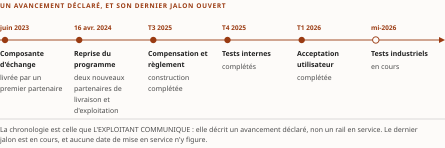

# Chapitre 33 — ISO 20022 : Lynx accompli, RTR visé

*Livre III — Encadrer : orchestration en entreprise, cadre réglementaire canadien et terrain financier.
Troisième mouvement — le terrain canadien : interopérabilité financière et adoption (ch. 31-36).
Troisième chapitre du mouvement : **un rail accompli et un rail visé, à ne jamais laisser confondre**.*

| Champ | Valeur |
|---|---|
| **Statut** | **Brouillon de rédaction, non publiable** — pièce **rédigée le 27 juillet 2026, avant G-3**, sur instruction d'auteur. ⚠ **La règle cardinale du PRD §5 a été enfreinte, et l'arbitrage qui a suivi la solde sans la rattraper.** ☑ **G-3 est franchie depuis le 28 juillet 2026** (PRD v0.14, socle consolidé de **159 entrées**) : les énoncés du chapitre y sont désormais **ré-ancrés**, et le champ *Socle mobilisé* le dit entrée par entrée. ⚠ **La pièce n'en devient pas recevable pour autant** : **CA-IV-11 et CA-IV-13 demeurent insatisfaites**, *D-6 ne fournissant pas de relecteur distinct du rédacteur.* Voir la note de statut, § 33.5. ⚠ **G-4 ne conditionne pas ce chapitre** ; ⚠ **D-9 ne le bloque pas** |
| **Date de gel** | **27 juillet 2026** — gel unique, **D-1 prise** (registre : [`gel-2026-07-27.md`](../PRD/gel-2026-07-27.md)). ☑ **Le volet de FAITS du volet résiduel de G-1 est levé le 28 juillet 2026** — *les 123 entrées à sensibilité temporelle portées à leur source primaire*, registre à [`gel-2026-07-28-volet-residuel.md`](../PRD/gel-2026-07-28-volet-residuel.md) ; ☐ **les obligations de pièce des Livres II et III restent dues**, et celle-ci en relève. ⚠ **Ce chapitre porte deux échéances qui tombent après le gel de la somme** : *l'entrée en vigueur d'un règlement administratif le **24 août 2026**, et la cible de lancement d'un rail au **T4 2026**.* ⚠ **Aucune des deux n'est constatée** ; *elles sont annoncées* — **et la re-datation du 28 juillet 2026 les a l'une et l'autre re-constatées comme telles**. Gel de source consommé : **16-17 juillet 2026** (Vol. II ch. 15) |
| **Socle mobilisé** | ☑ **Trois entrées du socle consolidé**, G-3 franchie : **S-026** (← Vol. II **F-28**, `[A]`), **S-027** (← Vol. II **F-29**, `[A]`) et **S-043** (← Vol. II **F-45**, `[B]`). ⚠ **S-027 est l'entrée la mieux votée du chapitre** — *neuf affirmations confirmées par vote adversarial unanime, sur quatre pages officielles de Paiements Canada* — **et c'est elle qui porte la réserve la plus stricte du Livre** : *ne jamais écrire « lancé » ni « en production ».* ⚠ **Les trois entrées ne sortent pas de la re-datation au même état** : *S-026 et S-027 sont **☑ inchangée**, **S-043 est ☐ non établie** — accès refusé par l'hôte —, et **le seul de ses volets re-constaté à une source tierce n'est pas celui que le § 33.1 mobilise**.* ⚠ **Conséquence opposable, posée au franchissement de G-3** : *aucun énoncé adossé à S-043 n'est central au sens de CA-IV-01.* ⚠ **La pièce, elle, ne déclare aucun énoncé central** — *l'arbitrage appartient à l'auteur, non au rédacteur* ; **remontée ouverte au § 33.5**. ⚠ **Toutes les entrées sources sont du Vol. II** (décision 7 du TOC) |
| **Garde-fous balayés** | ⚠ **Décomptes re-mesurés au commit du 28 juillet 2026, règle de comptage de la décision 16 du TOC** : *ils portent sur le **marqueur littéral** dans le **corps** — en-tête et note de statut exclus —, et **là où le garde-fou est appliqué sans que son identifiant soit écrit, c'est le domaine balayé qui est déclaré, sans cardinal**.* Vol. II — ⚠ **réserve F-29 (S-027) — ne jamais écrire « lancé » ni « en production » du rail en temps réel** ; *le mot « lancé » est écrit **onze fois** au corps — § 33.0 (deux), § 33.1 (trois), § 33.2, § 33.4 (trois) et la synthèse (deux) — ⚠ **et son domaine se départage** : des **trois du § 33.1**, une seule est **indicative** — le lancement du **rail de grande valeur**, fait daté du socle (F-45, S-043) que la réserve ne vise pas —, les **deux autres étant des mentions du mot entre guillemets** ; **les huit autres occurrences se répartissent en deux au conditionnel, deux au négatif et quatre dans la formule qui l'interdit**. « En production » est écrit **trois fois** — § 33.0, § 33.2 et la synthèse —, **une fois au négatif et deux fois dans la formule qui l'interdit*** ; ⚠ **formulation imposée PRDPlan Vol. II §4.4 — « quatre *cibles successives* — 2019, 2022, 2023, 2026 », jamais « quatre reports »** : *le renvoi est écrit **une fois**, § 33.2 ; la formulation est reprise **mot pour mot deux fois** (§ 33.2, § 33.4), le terme « cibles successives » **trois fois** (§ 33.2 deux, synthèse), et la forme proscrite **deux fois**, **aux deux seuls endroits où la somme la cite pour l'interdire*** ; **R-4 (la cible T4 2026 *est* officiellement annoncée — l'attribuer, ne pas l'affirmer au futur catégorique) : **six** occurrences du sigle**, § 33.2 (une) et § 33.4 (**cinq**) — ⚠ *cinq jusqu'au 2 septembre 2026, la sixième étant l'instruction datée de la remontée à l'instance du Vol. II (D-16)* — ⚠ **re-mesuré au commit du 30 juillet 2026** (décision 16b) : le relevé antérieur portait **deux**, valeur exacte avant que le contrôle de provenance du cardinal « quatre cibles successives » n'ajoute trois marqueurs au § 33.4 ; **PRD Vol. II §8.4 (neutralité fournisseur) : une occurrence du renvoi**, § 33.1, **et trois de la formule**, § 33.1 (deux) et § 33.2 ; ⚠ **métriques d'exploitant et jalons de programme attribués à Paiements Canada à chaque occurrence** (PRD Vol. II §8.2) : *le nom est écrit **onze fois** au corps, et **« l'opérateur » n'y subsiste nulle part*** ; **R-1 à R-3, R-5 à R-8 : zéro occurrence** — ⚠ *R-5 (aucun standard technique désigné) était invoqué à tort au § 33.3 pour interdire de décrire le contenu d'un règlement ; l'invocation est retirée, la borne demeure et se tient sur le seul socle.* Vol. III — **R-14 (trois degrés d'absence) : une occurrence du sigle**, § 33.1 — ⚠ *et les degrés se marquent en toutes lettres : « degré 3 » aux § 33.1, § 33.2, § 33.3 et § 33.4 (deux), « fait négatif vérifié » au § 33.1* ; **R-11 (jalons visés, jamais fixés) : quatre occurrences du sigle**, § 33.0 (trois) et § 33.4 — ⚠ *le garde-fou du Vol. III et celui du Vol. II se recouvrent ici, et les deux sont nommés* ; **R-09 : une occurrence du sigle**, § 33.3 ; ⚠ **R-09 et R-11 sont l'un et l'autre appliqués HORS de leur domaine d'origine** — *statuts de normalisation pour le premier, jalons du NIST pour le second* —, **et les deux extensions se déclarent au corps** ; **R-01 à R-08, R-10, R-12, R-13 : zéro occurrence** |
| **Volumétrie cible** | ≈ **3 500 mots** de corps (§ 33.0 à § 33.4), **cible dérivée** de l'enveloppe du Livre — 90 000 mots au TOC v0.30 — au prorata des sections, ce chapitre en portant quatre. ☑ **Décompte publiable depuis G-2** ; la mesure réelle est portée au [`README.md`](README.md) du dossier. ⚠ **D-4 interdit l'amputation comme le gonflement** |

> **Thèse** *(citée depuis le [`TOC.md`](../PRD/TOC.md) v0.30, entrée du chapitre 33 — **reprise par copie**, décision 17)* — la couche sémantique commune des paiements canadiens est en place — Lynx a achevé sa bascule ; Paiements Canada annonce un RTR nativement ISO 20022 dès son lancement, **visé** au T4 2026 (cible plusieurs fois repoussée — attribuer, ne pas affirmer au futur catégorique).

---

⚠ **La thèse a été collationnée contre le texte rédigé de sa source avant la rédaction** (décision 14 du
TOC). **Domaine de balayage : une thèse examinée, zéro réalignée — et un réalignement déjà fait par le
plan, dans le bon sens.** ⚠ **Le Vol. II intitule son chapitre « RTR *imminent* » et sa thèse porte
« visé au T4 2026 » ; le plan a retenu « visé » jusque dans le titre, et y a ajouté la parenthèse
« cible plusieurs fois repoussée — attribuer, ne pas affirmer au futur catégorique ».** *C'est
**l'inverse du cas ordinaire** : le plan est ici **plus borné que sa source**, et il le devient sur le
mot exact que la réserve F-29 vise.* **Le corps écrit la forme du plan.**

## § 33.0 — Ouverture : un rail accompli, un rail visé

**Un architecte d'entreprise qui conçoit aujourd'hui une chaîne de paiement canadienne travaille sur un
terrain d'une asymétrie singulière.** *D'un côté, **un rail achevé** : le système de paiements de grande
valeur a terminé sa migration, et l'alternative technique qui subsistait a été retirée. De l'autre,
**un rail annoncé, daté, testé** — ⚠ **mais qui n'a pas encore traité un paiement en exploitation**.*

**Les deux parleront le même langage sémantique. L'un le parle déjà ; l'autre le parlera dès son premier
jour, si ce jour arrive à la date visée.**

⚠ **Le chapitre soutient que la couche sémantique commune est en place, et il faut prendre ce verbe au
sérieux dans les deux directions.** *« En place » signifie que **le choix de format n'est plus une
variable d'architecture** : sur le premier rail, il est **arrêté et irréversible** ; sur le second, il
est **arrêté par construction**.* ⚠ ***« En place » ne signifie pas « en exploitation partout »*** — *et
la distinction entre un rail accompli et un rail visé est précisément ce que ce chapitre s'attache à ne
pas laisser confondre, **parce que c'est la confusion la plus coûteuse qu'un dossier d'architecture
puisse commettre**.*

⚠ **Deux garde-fous se recouvrent ici, et les deux sont nommés.** *La **réserve F-29 du Vol. II** —
entrée **S-027** du socle consolidé — interdit d'écrire **« lancé »** et **« en production »** ; et
**R-11 du Vol. III** veut qu'un jalon soit **visé**, jamais **fixé**.* ⚠ **Le second est plus général,
le premier plus strict** : *R-11 interdit d'écrire « fixé » ; F-29 interdit en outre d'écrire
« lancé ».* ⚠ **R-11 est ici appliqué hors de son domaine d'origine** — *sa source le formule sur les
jalons du NIST* — **et l'extension se déclare plutôt qu'elle ne se tait**.

**Ce que le chapitre ne traite pas.** ⚠ *Le **substrat sémantique financier** — les trois couches, le
détail des standards — est au **ch. 31 § 31.2**, qui le pose ; **le flux instancié de bout en bout**
est au **ch. 45** (Livre IV). Le **cadre bancaire** est au **ch. 32** ; **l'articulation avec les
protocoles de paiement agentique** au **ch. 36**, explicitement prospectif.*

## § 33.1 — Lynx : une migration achevée, et ce que cela veut dire

**Le fait central est daté.** Le **22 novembre 2025**, la coexistence des deux familles de messages
prend fin sur le rail de grande valeur : *les messages hérités sont **retirés** au profit des messages
structurés, et **ils ne sont plus pris en charge**.* **Paiements Canada annonce l'achèvement le
26 novembre 2025.** ⚠ **La bascule technique est alignée sur l'échéance mondiale du réseau de
messagerie interbancaire** (Vol. II F-28, entrée **S-026** du socle consolidé).

**Cette date clôt une transition longue.** *La coexistence avait été ouverte en **mars 2023** ; il
s'écoule donc **quelque trente-deux mois** — deux ans et huit mois durant lesquels le rail a accepté
l'un et l'autre format, **chaque institution restant maîtresse du moment où elle basculait ses propres
chaînes**.*

⚠ **Et la bascule finale n'a pas été un basculement.** *Selon **Paiements Canada**, **plus de 98 % des
messages étaient déjà au format structuré en octobre 2025*** — ⚠ **métrique d'exploitant, attribuée à
Paiements Canada à chaque occurrence** — *moins de 2 % du trafic déclaré restait donc à l'ancien
format à cette date.*

Lecture de l'auteur — **le 22 novembre n'a vraisemblablement pas déplacé le volume ; il a supprimé un
reliquat, et surtout il a supprimé *l'option*.** **Ce que le socle établit** : la part déjà basculée en
octobre 2025, et le retrait des messages hérités. **Ce qu'il n'établit pas** : la part résiduelle à la
date de bascule elle-même — *absence de documentation, degré 3 de l'échelle R-14 du Vol. III.*

⚠ **Pour l'architecte, la valeur de cette date ne tient donc pas à la nouveauté d'un format : elle tient
à la *disparition d'une alternative*.** *Tant que la coexistence durait, la question « **quel format ce
flux émet-il ?** » restait ouverte et devait être tranchée **composant par composant**, avec la logique
conditionnelle, les tests et la dette que cela suppose.*

⚠ **Mais la borne est stricte** : *ce que la fin de la coexistence garantit, c'est qu'**à la frontière du
rail** il n'existe plus de branche à maintenir. **Ce qu'elle ne garantit pas**, c'est qu'il n'en subsiste
aucune **à l'intérieur des institutions** — question qui relève de l'inventaire de chacune, non de ce
chapitre.*

Lecture de l'auteur — **un mot sur l'alignement de la date, souvent lu comme un détail de calendrier.**
*Il **situe la date canadienne sur un calendrier qui n'est pas propre au Canada**, mais commun aux
correspondants bancaires du monde entier — et un architecte qui aurait cherché à négocier un report de
sa bascule interne **aurait négocié contre un calendrier qu'aucun acteur canadien ne maîtrisait**.*
**Ce que le socle établit** : l'alignement. **Ce qu'il n'établit pas** : *que l'échéance mondiale ait été
la **cause** de la date canadienne, seulement qu'elles **coïncident***. ⚠ *La nuance est mince, mais elle
sépare une observation d'une reconstruction rétrospective.*

⚠ **Le rail a une histoire industrielle, et elle se rapporte sous neutralité fournisseur.** *Un
partenaire technologique principal a été sélectionné le **2 mai 2019** — hébergement, intégration,
bascule et exploitation ; le système est **lancé le 1ᵉʳ septembre 2021**, à un jour près vingt-huit mois
après l'annonce ; un centre de données additionnel s'y ajoute en octobre 2023* (Vol. II **F-45**, entrée
**S-043**).
⚠ **Le mot « lancé » se dit ici sans réserve, et il faut voir pourquoi** : *il porte sur **le rail de
grande valeur**, dont le lancement est un fait daté du socle — **la réserve F-29, qui interdit d'écrire
« lancé », vise le rail en temps réel du § 33.2, et lui seul**.* ⚠ **Deux réserves accompagnent
ce fait et se portent avec lui** : *les **montants des contrats ne sont pas publics**, et — conformément
à la neutralité fournisseur (PRD Vol. II §8.4) — **ce rôle est un fait de contexte, jamais un argument
de conformité réglementaire**.* ⚠ **Le socle ne documente aucun lien entre ce rôle et les lignes
directrices du régulateur prudentiel** — *absence de documentation, non un fait négatif vérifié.*

⚠ **Une borne de régime s'attache à ce paragraphe, et à lui seul dans tout le chapitre.** L'entrée
**S-043** — celle qui porte cette histoire industrielle — est la seule des trois du chapitre dont la
re-datation au gel du 28 juillet 2026 soit **☐ non établie**, pour **accès refusé par l'hôte** ; **un
seul de ses volets a été re-constaté à une source tierce, et ce n'est pas celui-ci** — c'est le rôle
de partenaire de livraison du rail en temps réel. ⚠ **Conséquence opposable, posée au franchissement
de G-3** : *aucun énoncé de ce chapitre adossé aux trois dates ci-dessus n'est central au sens de
CA-IV-01.* ⚠ *Et le fait négatif du paragraphe précédent **n'a pas été re-balayé** : il n'est pas tenu
à jour, il est **daté**.*

## § 33.2 — RTR : une chronologie vérifiée, une cible annoncée, une cible reportée

⚠ **Le rail de paiement en temps réel n'est pas un projet dont on ignorerait l'état d'avancement.** *Il
est, au contraire, l'un des objets les mieux jalonnés du socle du Vol. II — **neuf affirmations
confirmées par vote adversarial unanime**, sur quatre pages officielles de **Paiements Canada**
(F-29, entrée **S-027**).* ⚠ **La difficulté n'est pas de savoir où il en est ; elle est de dire son statut sans le surqualifier ni
le sous-qualifier — *deux fautes symétriques et également disqualifiantes* dans un dossier
d'architecture.**

**La chronologie, telle que Paiements Canada la communique, est la suivante.**

| Jalon | Date |
|---|---|
| Livraison de la composante d'échange par un premier partenaire | **juin 2023** |
| **Reprise du programme**, avec deux nouveaux partenaires de livraison et d'exploitation | **16 avril 2024** |
| Construction de la composante compensation et règlement, **complétée** | **T3 2025** |
| Tests internes, **complétés** | **T4 2025** |
| Tests d'acceptation utilisateur, **complétés** | **T1 2026** |
| Tests industriels | ⚠ **en cours à la mi-2026** |

: Tableau 33.1 — La chronologie du rail de paiement en temps réel, telle que Paiements Canada la communique (Vol. II F-29, entrée **S-027**, **neuf affirmations votées à l'unanimité**). ⚠ **La page officielle des partenaires en liste quatre, dont un dernier sans en détailler le rôle** — *le socle enregistre la présence, pas la fonction, et la somme n'en dira pas davantage.*

**D'où l'énoncé qui doit être tenu mot pour mot, et que le lecteur pressé retiendra de préférence à tout
le reste** :

> ⚠ **À la mi-juillet 2026, le rail de paiement en temps réel n'est pas en production.**

⚠ ***Aucune formulation de ce chapitre — ni d'aucun autre chapitre de la somme — ne doit laisser
entendre qu'il serait lancé ou exploité*** (réserve F-29 du Vol. II).

⚠ **Symétriquement, et c'est l'autre versant du garde-fou, il serait tout aussi faux d'écrire qu'aucune
date n'aurait été annoncée.** ***Paiements Canada vise un lancement au T4 2026***, *à l'issue des tests
industriels en cours ;* ⚠ **et la formulation qui suit est imposée** (PRDPlan Vol. II §4.4) :

> **La cible a été successivement reportée : 2019, puis 2022, puis 2023, puis 2026.**

⚠ ***Ces quatre valeurs sont les cibles successives, non les dates auxquelles les reports ont été
décidés*** — *la distinction importe, faute de quoi la phrase raconterait une histoire que le socle ne
porte pas.* ⚠ **Écrire « quatre reports » serait la faute exacte que la formulation imposée proscrit.**

**Paiements Canada annonce un lancement *graduel*, dont le déploiement se poursuivrait en 2027** — ⚠ *et,
point décisif pour ce chapitre, **le format structuré dès le lancement**.*

**Posons l'écart, puisqu'il structure toute planification qui s'appuierait sur ce rail.** ⚠ *En retenant
le trimestre civil — **le socle ne précise pas la convention de Paiements Canada**, et un exercice
financier décalé déplacerait tout intervalle ancré sur cette ouverture — l'ouverture du T4 2026 tombe
le 1ᵉʳ octobre.* *De la reprise du programme à cette ouverture, il s'écoule **un peu moins de trente
mois**. Et de la première cible annoncée à la cible en vigueur, **sept ans** séparent l'intention
initiale de l'échéance actuellement visée* — ⚠ *ce second intervalle, lui, ne dépend d'aucune
convention de trimestre.*

⚠ **Un contrôle de provenance du 30 juillet 2026 borne le cardinal, et il ne l'abolit pas.** Le
rapport d'arbitrage externe relevait que « quatre cibles successives » n'est pas attestable sur
source primaire ; **la re-vérification confirme ce point exact, et rien de plus**. La page officielle
de Paiements Canada porte la **cible courante — T4 2026 —** et le **règlement administratif du
24 août 2026** ; elle ne dresse **aucun historique de cibles**. *Les quatre millésimes — 2019, 2022,
2023, 2026 — sont documentés par la presse spécialisée, non par une page de l'exploitant.*
⚠ **Le cardinal reste écrit, pour trois motifs qu'il faut donner ensemble.** *(1)* La formule est
imposée par le **garde-fou R-4 du Vol. II**, et *un rédacteur ne modifie pas un garde-fou hérité — il
remonte.* *(2)* Le fait n'est pas infirmé : il est **établi à un régime plus faible que la formule ne
le laisse croire**. *(3)* La reformulation que l'arbitrage propose — « reports successifs documentés »
— **entre en conflit frontal avec R-4**, qui proscrit précisément « quatre reports » au profit de
« quatre cibles ». **Remontée ouverte**, à l'instance d'arbitrage : *le garde-fou R-4 doit-il porter
la mention de son régime de preuve secondaire ?* La réponse appartient au Vol. II, non à la somme.

⚠ **INSTRUITE, NON SOLDÉE — 2 septembre 2026** (D-16). *Le Vol. II a été rouvert pour mesure, et il n'a pas bougé* : son **§14** applique R-4 avec la réserve F-29, son **§23** le reprend en note, son **glossaire §D.7** pose la double contrainte — **et aucun des trois ne mentionne le régime de preuve du cardinal**. *L'historique « 2019 → 2022 → 2023 → 2026 » y figure sans sa provenance.* ⚠ **La remontée reste donc ouverte à son instance, et c'est le bon endroit** : *une somme ne modifie pas le garde-fou du volume dont elle hérite, fût-ce pour l'améliorer.* ☑ **Ce que la somme pouvait faire, elle l'a fait** : le présent chapitre écrit « par corroboration secondaire et non par une page de l'exploitant » **à chaque emploi du cardinal**. *La formule imposée est tenue ; son régime est déclaré à côté d'elle.*

Lecture de l'auteur — ⚠ **ces deux nombres ne disent pas la même chose et ne doivent pas être lus
ensemble sans précaution.** **Ce que le socle établit** : quatre cibles successives, ⚠ **par
corroboration secondaire et non par une page de l'exploitant** (contrôle du 30 juillet 2026).
**Ce qu'il n'établit pas** : ni les causes des reports, ni une quelconque probabilité que la cible
soit tenue.
⚠ ***Un historique de reports n'est pas un pronostic*** — *il est une information sur la **classe de
risque** à laquelle appartient l'engagement, non sur l'engagement lui-même.* ⚠ **Ce que l'architecte
prudent en tire n'est donc pas « le rail sera reporté », affirmation que rien n'autorise, mais une
exigence de conception** : ***tout plan dont la valeur dépend d'une date de disponibilité de ce rail
doit porter son scénario de report***, au même titre qu'il porterait celui de tout fournisseur externe.
⚠ **Et R-4 du Vol. II borne l'énoncé dans l'autre sens** : *la cible **est** officiellement annoncée —
l'attribuer à son auteur, **ne pas l'affirmer au futur catégorique**.*

⚠ **Une dernière précision, négative, mérite d'être consignée parce qu'elle protège le lecteur d'une
source vieillie.** *Aucune source primaire du socle **ne mentionne deux organisations souvent citées**
parmi les partenaires **actuels** du rail — ⚠ **l'entrée S-027 les nomme l'une et l'autre**, et c'est
là que se vérifie qui la réserve vise ; les partenaires établis sont les **quatre** que la page
officielle des partenaires liste (tableau 33.1, légende).* ⚠ **Un dossier qui citerait ces deux
organisations-là comme partenaires actuels contredirait les sources primaires disponibles au 16 juillet
2026**, ⚠ **et la réserve a été re-constatée au gel du 28 juillet 2026** — ⚠ *le socle ne dit rien, en
revanche, d'une éventuelle association **passée**, et la somme n'en infère aucune : absence de
documentation, degré 3.* ⚠ **Neutralité fournisseur** : *aucun partenaire n'est nommé dans ce chapitre ;
le rôle industriel, là où il est rapporté, l'est comme **fait de contexte**, avec les mêmes réserves
qu'au § 33.1 — **montants non publics, aucun argument de conformité**.*

## § 33.3 — By-law no 10 : l'instrument juridique précède le rail

**Le règlement administratif du rail — le *By-law No. 10* de Paiements Canada — a été publié dans la
*Gazette du Canada*, partie II, le 1ᵉʳ juillet 2026, et il entre en vigueur le 24 août 2026**
(Vol. II F-29, entrée **S-027**).

⚠ **Au gel de la somme — 27 juillet 2026 —, l'instrument est donc *publié* mais *pas encore en
vigueur*** (R-09 du Vol. III : *le statut se dit à chaque mention* — ⚠ **garde-fou lui aussi appliqué
hors de son domaine d'origine, qui est celui des statuts de normalisation**). ⚠ **Il reste vingt-huit jours avant
son entrée en vigueur.** *Le Vol. II en comptait trente-neuf à son propre gel ; **le chiffre a été refait
et il a bougé**.*

☑ **ET IL EST EN VIGUEUR DEPUIS LE 24 AOÛT 2026** — revalidé à sa source le 2 septembre 2026 ([rapport de revalidation](../PRD/revalidation-2026-09-02.md)) :
**DORS/2026-133**, enregistré le **18 juin 2026**, dont la disposition finale se lit *« This By-law
comes into force on August 24, 2026 »*. ⚠ **Ce qui se dit du statut change donc, et une seule chose
change** : *l'instrument n'est plus « publié, pas encore en vigueur » — il est **en vigueur**.*
⚠ **Ce qui ne change PAS, et c'est le point que ce chapitre existe pour tenir** : **le rail n'est pas
lancé.** *La cible demeure le **T4 2026**, l'historique de reports n'est pas rallongé, et la réserve
`F-29` s'applique exactement comme avant.* ***L'entrée en vigueur du cadre juridique n'est pas la mise
en service du système qu'il encadre*** — et **c'est la confusion précise que la réserve interdit
d'écrire**.

**Les intervalles se calculent simplement.** *De la publication à l'entrée en vigueur : **cinquante-quatre
jours**. De l'entrée en vigueur à l'ouverture du trimestre visé pour le lancement — sous la réserve de
convention posée au § 33.2 : **trente-huit jours**, un peu plus de cinq semaines.*

⚠ **Ce que le socle établit ici s'arrête à ces trois dates et à leur ordre. Il n'établit *pas* le
contenu du By-law No. 10**, *et le chapitre s'interdit donc d'en décrire les obligations, les seuils
ou les mécanismes* — ⚠ **absence de documentation, degré 3.** ⚠ *Ce dont on n'a pas le texte ne se
décrit pas, et la borne se tient sur le seul socle : **aucun garde-fou hérité ne la porte**.*

Lecture de l'auteur — **la seule chose que la séquence autorise à observer, c'est que l'instrument
juridique *entre en vigueur avant* l'ouverture du trimestre visé, et non après.** *C'est
l'ordonnancement attendu d'un rail dont la participation est réglementée* — ⚠ **et le passage des
contraintes réglementaires aux cadres déterministes est l'objet du ch. 29**, qui en porte le principe.
**Ce que le socle établit** : la chronologie. **Ce qu'il n'établit pas** : *ni le contenu du règlement,
ni l'intention qui a produit cet ordonnancement, et la somme ne les lui prête pas.*

⚠ **Il faut par ailleurs relever ce que cette date fait au reste du chapitre.** *Le 24 août 2026 est
**postérieur au gel de la somme**, ce qui en fait **l'un de ses points de revalidation** : au 27 juillet
2026, **l'entrée en vigueur est un fait annoncé, pas un fait constaté**.*

⚠ **La distinction paraîtra excessive ; elle ne l'est pas.** ***C'est exactement la même distinction que
celle qui sépare une cible de lancement d'un lancement*** — *et la discipline qui consiste à la tenir
partout, **y compris là où elle semble ne rien coûter**, est ce qui permet de la tenir **là où elle coûte
cher**.* **Le ch. 50 enregistrera les deux échéances comme événements de péremption.**

## § 33.4 — Ce que la couche sémantique commune change — et ce que le socle n'en dit pas

**Reste la question que le mouvement pose : qu'est-ce que tout cela change pour des agents ?**

**Commençons par ce que le socle établit, et qui n'est pas rien.** ⚠ *Après le 22 novembre 2025, le rail
de grande valeur **ne connaît plus qu'un jeu de messages** ; le rail en temps réel, **s'il est lancé au
T4 2026 comme Paiements Canada le vise**, le sera **nativement au format structuré**.*

**Ces deux rails auront donc une *couche sémantique commune*** — ⚠ *et cette communauté n'est pas le
fruit d'une convergence progressive à laquelle il faudrait encore laisser du temps : elle est **acquise
sur l'un par retrait de l'alternative**, et **posée sur l'autre par construction**.*

Lecture de l'auteur — ⚠ **la conséquence d'architecture est une conséquence de *surface*, pas de
*capacité*.** *Un système appelé à interagir avec les deux rails n'a plus **deux vocabulaires** à
apprendre, mais **un** ; **ce qui était une question de traduction devient une question de routage**.
Pour un composant logiciel — agentique ou non — cela **réduit le nombre de représentations à
maintenir**, donc **le nombre d'endroits où une erreur de correspondance peut naître**.* **Ce que le
socle établit** : l'unicité du format sur le premier rail et son adoption native prévue sur le second.
⚠ **Ce qu'il n'établit pas** : *que cette unicité produise **un gain mesurable** — **aucune source de la
somme ne le quantifie**, absence de documentation, degré 3.* ⚠ **Ni, plus en amont, aucun attribut de
richesse des données** : *ni structure des données de remise, ni granularité des identifiants, ni
comparaison avec le format retiré* — **les deux entrées mobilisées ici, S-026 et S-027, n'en portent
aucun**, et *toute affirmation sur ce que le format structuré « porte de plus » excéderait ce que ce
socle permet d'écrire.*

⚠ **Il faut ici marquer nettement la frontière, car c'est le point où un chapitre de cette nature dérape
ordinairement.** *Le bénéfice **agentique** que le **ch. 31 § 31.2.2** énonce — des champs nommés et
typés donnant à un agent de quoi exécuter un criblage déterministe et une réconciliation automatisée —
est **une lecture d'architecture**, non un fait mesuré ; ⚠ **et le socle du Vol. II ne documente aucun
déploiement agentique sur ces deux rails** : absence de documentation, degré 3.*

⚠ **Une conséquence de la règle du ch. 31 § 31.1.1 se rappelle enfin, et elle est plus contraignante que
la sémantique.** Le rail en temps réel, **s'il est lancé**, portera un règlement **à finalité
immédiate** : ⚠ **la sémantique commune ne change rien à l'irréversibilité**, et le patron directeur —
*préparation par l'agent, libération humaine sur l'action irréversible* — **s'y applique intégralement**.
Et **le ch. 22 § 22.4** ajoute la contrainte de temps : ***un délai qui doit être tenu ne se confie pas
à un composant dont la durée d'exécution n'est pas bornée*** — ⚠ *ce que le **ch. 24 § 24.8** déclare
n'avoir aucun modèle de service pour dimensionner.*

⚠ **Et la borne du chapitre se redit une dernière fois** : ***le rail visé n'est pas lancé***, sa cible
est **annoncée et attribuée**, elle **a été successivement reportée** — 2019, puis 2022, puis 2023, puis
2026 —, et **rien ici n'affirme au futur catégorique** (R-4 du Vol. II ; R-11 du Vol. III).

### Synthèse : ce que le chapitre lègue à la somme

*Section de sortie sans homologue direct dans la source — construction d'éditeur.*

1. **Une couche sémantique commune, acquise de deux manières différentes** : *par **retrait de
   l'alternative** sur un rail, **par construction** sur l'autre.* ⚠ **La conséquence est de *surface*,
   non de *capacité*** — *le nombre de représentations à maintenir baisse ; aucune source ne quantifie le
   gain.*
2. ⚠ **La formulation imposée sur les cibles**, posée ici : *« quatre **cibles successives** — 2019,
   2022, 2023, 2026 », **jamais** « quatre reports ».* **Le ch. 36 la reprend telle quelle.**
3. ⚠ **La réserve F-29, la plus stricte du Livre** : *ne jamais écrire « lancé » ni « en production ».*
   **Le ch. 36, explicitement prospectif, en dépend entièrement.**
4. **Un historique de reports n'est pas un pronostic** — *c'est une information sur la classe de risque
   de l'engagement.* ⚠ **La conséquence de conception est qu'un plan adossé à cette date doit porter son
   scénario de report.**
5. **L'ordonnancement juridique précède le rail** : *le règlement administratif entre en vigueur **avant**
   l'ouverture du trimestre visé.* **Le ch. 29 en porte le principe général.**

⚠ **Ce que le chapitre ne lègue pas.** Il ne lègue **aucun rail lancé**. Il ne lègue **aucun contenu du
By-law No. 10** : *le socle n'en porte que trois dates.* Il ne lègue **aucun gain mesuré** de
l'unicité sémantique, **aucun attribut de richesse des données**, ni **aucun déploiement agentique
documenté** sur ces rails. Et il ne lègue **aucune convention de trimestre** : *civil ou financier, le
socle ne le précise pas* — ⚠ **et deux de ses quatre intervalles en dépendent** : *le « un peu moins de
trente mois » du § 33.2 et le « trente-huit jours » du § 33.3.*

---

## § 33.5 — Note de statut *(hors plan — à retirer à la publication)*

⚠ **Cette section n'est pas au TOC et n'a pas vocation à survivre.** Elle consigne l'écart de
gouvernance sous lequel la pièce a été rédigée (PRD, Annexe A) : *un rédacteur ne corrige jamais le
TOC, ce PRD ni le Conspectus — il **remonte**.*

**Ce qui a été enfreint à la rédaction.** La porte **G-3** et le **volet résiduel de G-1**. Instruction
d'auteur du 27 juillet 2026. ⚠ **G-4 ne conditionne pas ce chapitre** ; ⚠ **D-9 ne le bloque pas.**
☑ **G-3 a été franchie le 28 juillet 2026** (PRD v0.14) et le **volet de faits de G-1 levé le même
jour** ; ⚠ *une porte franchie après coup ne rattrape pas la rédaction qui l'a devancée — elle en
change les conséquences, non l'infraction.*

1. ☑ **Le socle consolidé existe désormais, et le chapitre y est ré-ancré** : **S-026**, **S-027** et
   **S-043**, dont les identifiants sources — F-28, F-29, F-45 — restent cités **préfixés du Vol. II**
   à chaque emploi (décision 7). ⚠ **Une seule borne de centralité demeure opposable** : *S-043 est
   **☐ non établie** à la re-datation, et **aucun énoncé adossé à elle n'est central** au sens de
   CA-IV-01.* ⚠ **La pièce ne déclare pour autant aucun énoncé central** — voir la remontée neuve
   ci-dessous.
2. ⚠ **Le volet résiduel de G-1 pèse sur deux échéances postérieures au gel de la somme** : *l'entrée en
   vigueur du By-law No. 10 le **24 août 2026** — dans vingt-huit jours — et la cible de
   lancement au **T4 2026**.* ⚠ **Ni l'une ni l'autre n'est constatée** ; *le **ch. 50** les enregistrera
   comme événements de péremption, et ce chapitre est **celui du Livre dont le plus grand nombre
   d'énoncés changera de temps grammatical**.* ☑ **Les deux ont été re-portées à leur source le
   28 juillet 2026** — *et re-constatées comme annoncées, non comme accomplies.*
3. ⚠ **Le seul compte à rebours du chapitre a été re-mesuré au gel, et il a bougé** : *vingt-huit jours
   avant l'entrée en vigueur du règlement, contre trente-neuf au gel du Vol. II.* **Il n'a pas été
   recopié.** ⚠ *L'attestation antérieure en annonçait **deux** et n'en nommait qu'un : la source en
   portait bien deux — quinze jours de la publication à son propre gel —, mais **la somme ne reprend
   pas le second**.*
4. **Les décomptes sont publiables** (G-2). L'écart à la cible est relevé au [`README.md`](README.md) du
   dossier et alimente **D-4**, déjà tranchée.
5. **Les renvois « ch. N » vers les chapitres non rédigés sont des renvois de plan.** Ils résolvent
   contre l'entrée du TOC : **ch. 36** (présent Livre, même passe), **ch. 45** (Livre IV) et **ch. 50**
   (Livre V). Résolvent contre du **texte rédigé** : **ch. 22 § 22.4**, **ch. 24 § 24.8**, **ch. 29**,
   **ch. 31 § 31.1.1 et § 31.2.2** et **ch. 32**. ⚠ **Le § 31.2 est cité comme lieu du substrat
   sémantique, non comme siège** : *l'appareil ne déclare aucun siège à cette section — six vivent
   ailleurs au ch. 31 —, et l'attestation antérieure lui en prêtait un.*

**Remontées ouvertes par ce chapitre :**

- **R-IV-96 — non bloquante, de convention de mesure non documentée dont dépendent deux intervalles.**
  Les § 33.2 et § 33.3 calculent **quatre intervalles**, dont **deux sont ancrés sur l'ouverture du
  T4 2026** — *le « un peu moins de trente mois » depuis la reprise du programme, et les « trente-huit
  jours » entre l'entrée en vigueur du règlement et cette ouverture.* ⚠ **Les deux autres n'en
  dépendent pas** : *les « sept ans » vont d'une année à une année, les « cinquante-quatre jours » de
  la publication à l'entrée en vigueur.* ⚠ **Or le socle ne précise pas si Paiements Canada compte en
  trimestre *civil* ou en trimestre d'*exercice financier***, et *un exercice décalé déplacerait les
  deux*. **La source le déclare et calcule quand même, sous réserve ; la somme reprend la réserve.**
  **Demande remontée** : que cette convention entre au **registre des faits à instruire au gel de
  publication**, au même titre que le cardinal du ch. 18 (R-IV-31) et les deux cardinaux du ch. 26
  (R-IV-86). ⚠ **La classe est celle d'un *cardinal dérivé d'une convention non documentée*** : *le
  nombre est exact **sous une hypothèse**, et l'hypothèse ne se voit pas dans le nombre.*
  ⚠ **Le cardinal de cette remontée était lui-même faux** : *elle annonçait quatre intervalles ancrés
  là où il y en a deux, et en énumérait trois — **une remontée qui compte mal l'objet qu'elle remonte
  fait instruire le mauvais domaine**. Corrigé le 28 juillet 2026 ; l'issue de la remontée, elle, ne
  change pas.*

- **Remontée neuve, non bloquante — la centralité des énoncés du chapitre n'est pas tranchée.**
  *Le franchissement de G-3 lève le motif qui l'interdisait : le socle consolidé existe, et les deux
  entrées principales du chapitre — **S-026** et **S-027** — sont `[A]` et **☑ inchangée** à la
  re-datation.* ⚠ **Mais déclarer un énoncé central est un arbitrage d'auteur, non un geste de
  rédacteur ni de relecteur** (PRD, Annexe A), **et CA-IV-11 comme CA-IV-13 restent insatisfaites**.
  **Demande remontée** : *que la passe d'arbitrage tranche si le fait accompli du § 33.1 — la fin de la
  coexistence au 22 novembre 2025 — et le fait négatif du § 33.2 — le rail en temps réel non en
  production — sont centraux au sens de CA-IV-01.* ⚠ **Le numéro n'est pas alloué ici** : *la passe de
  relecture court en parallèle sur les autres pièces du compendium, et trois passes numérotant dans une
  série partagée sans allocation préalable ont déjà alloué dix numéros deux fois* (PRD §13).

- **Remontée neuve, non bloquante — dette d'appareil : le vérificateur ne voit pas l'italique
  déséquilibrée.** *Le contrôle [8] de `verifier-piece.py` cherche le marqueur de gras, celui de lien
  et celui de titre ; **il ne cherche pas l'astérisque seul**. Une emphase ouverte et non refermée
  laisse donc un astérisque littéral dans la prose rendue, **les huit contrôles au vert**.* ⚠ **Le
  défaut n'est pas théorique** : *la version de cette pièce publiée le 27 juillet 2026 en portait
  **deux** — au § 33.0 et au § 33.4 —, et ils n'ont été trouvés qu'en comptant les astérisques du
  rendu hors feuille de style et hors script.* **Demande remontée** : *que l'astérisque isolé entre au
  contrôle [8], avec sa mutation au harnais.* ⚠ **Le numéro n'est pas alloué ici**, pour le motif
  ci-dessus.

**Ce qui n'est pas enfreint.** La structure suit la **table détaillée du TOC v0.30** — § 33.1 à § 33.4,
dans l'ordre exact et **sous leurs intitulés du plan** —, le § 33.0 étant une **ouverture de chapitre**.
La **table de couverture est respectée pour son unique ligne** : le Vol. II §15.1-15.4 est condensé aux
§ 33.1-33.4, **rien n'en est coupé**. La **thèse est reprise par copie depuis le TOC** (décision 17), et
la **décision 14 a été exécutée avant la rédaction**, domaine déclaré : une thèse examinée, zéro
réalignée — ⚠ **et le réalignement déjà opéré par le plan, dans le sens du bornage, est déclaré**.

⚠ **La réserve F-29 est tenue sur tout son domaine** : *sur le **rail en temps réel**, seul domaine
qu'elle vise, le mot « lancé » n'apparaît qu'au **conditionnel attribué** ou dans la formule qui
l'interdit, et **« en production » n'apparaît qu'au négatif ou dans cette même formule**.* ⚠ **Des trois
occurrences du § 33.1, une seule est indicative** — *« le système est **lancé** le 1ᵉʳ septembre 2021 »,
du **rail de grande valeur**, dont le lancement est un fait daté du socle (F-45, S-043) que la réserve
ne vise pas* ; **les deux autres sont des mentions du mot entre guillemets**, *dont l'une nomme
précisément le rail que la réserve vise.* ⚠ **La formulation imposée sur les
cibles successives est reprise mot pour mot à ses deux occurrences** — § 33.2 et § 33.4 —, *le terme
« cibles successives » revenant trois fois*, et **« quatre reports » n'est écrit qu'aux deux endroits
où la somme le proscrit**. **R-4 du Vol. II est tenu** — *la cible est attribuée, jamais affirmée au
futur catégorique ; son sigle est écrit deux fois, § 33.2 et § 33.4* — et **R-11 du Vol. III à ses
quatre occurrences** : *visé, jamais fixé.* Les **absences portent toutes leur degré** — *une occurrence
du sigle R-14 au § 33.1, cinq du marqueur « degré 3 »* —, et **l'occurrence de R-09 dit son statut**.

⚠ **La neutralité fournisseur est tenue, et sa forme a changé** : *aucun partenaire industriel n'est
nommé au corps ; le rôle, là où il est rapporté, l'est comme **fait de contexte**, avec **montants non
publics** et **aucun argument de conformité**.* ⚠ **L'attribution, elle, n'est plus anonymisée** :
*conformément à la décision 15 du TOC et à PRD Vol. II §8.2, **Paiements Canada est nommé aux onze
occurrences** où le chapitre lui impute une métrique, une communication de jalon ou l'annonce d'une
cible — l'attestation antérieure écrivait « l'opérateur », qui n'est pas une attribution.* Dans la même
règle, **le *By-law No. 10*, la *Gazette du Canada* et l'intitulé de section du plan sont rétablis**, et
⚠ **les deux organisations que le socle ne mentionne pas parmi les partenaires actuels sont désignées
par renvoi à l'entrée S-027, qui les nomme** — *une mise en garde dont on ne peut identifier l'objet
n'est pas exécutable.*

⚠ **Ces cardinaux ont été re-mesurés au commit du 28 juillet 2026** (décision 16 du TOC), et **le
domaine des attestations corrigées se déclare sans cardinal**, *plusieurs défauts se laissant compter
d'une manière ou d'une autre* : *la formulation imposée était donnée pour trois occurrences mot pour
mot au lieu de deux ; la neutralité fournisseur pour deux occurrences de sa formule au lieu de trois,
la troisième — au § 33.2 — n'étant pas déclarée ; « en production » pour « toujours au négatif » là où
deux de ses trois occurrences sont dans la formule qui l'interdit ; la remontée R-IV-96 pour quatre
intervalles ancrés au lieu de deux ; le § 31.2 du ch. 31 pour un siège que l'appareil ne lui déclare
pas ; le tableau 33.1 pour nommer des partenaires qu'il ne nomme pas ; le mot « lancé » au § 33.1 pour
trois occurrences indicatives là où **une seule** l'est, les deux autres étant des mentions entre
guillemets ; les comptes à rebours pour deux là où le chapitre n'en porte qu'un ; et le socle consolidé
pour zéro entrée alors que G-3 est franchie.* ⚠ **S'y ajoute une invocation fautive de garde-fou** :
***R-5 du Vol. II était invoqué au § 33.3 pour une règle qu'il ne porte pas*** — *sa matière est le
standard technique non désigné du cadre bancaire, et sa source le déclare hors périmètre pour ce
chapitre précis.* ⚠ **La borne que R-5 était censé appuyer n'a pas bougé** : *le contenu du By-law
No. 10 n'est pas décrit, le socle n'en portant que trois dates* — ***retirer une invocation fautive
n'est pas retirer une borne***. ⚠ **S'y ajoute enfin une revendication de siège retirée** : *la
synthèse posait la formulation imposée « une fois pour toute la somme » alors qu'**aucun siège n'est
déclaré à ce chapitre** à [`check-sieges.py`](../PRD/check-sieges.py) ; la formulation reste posée
ici et le ch. 36 la reprend telle quelle, mais **un siège ne se pose pas en un seul geste** — le
demander est une remontée, non une correction de rédacteur.*

---

### Clôture des remontées — 27 juillet 2026

⚠ **Cette sous-section est hors plan comme la note qui la porte, et se retire avec elle.** Elle
enregistre l'issue des remontées ouvertes par cette pièce. *Une remontée ne se clôt pas là où elle
s'ouvre : elle se solde là où elle fait foi* — au [PRD](../PRD/PRD.md) pour une décision ou un régime,
au [TOC](../PRD/TOC.md) pour un réalignement de plan, à l'appareil pour une dette d'outillage.

⚠ **Renumérotation, à lire avant les numéros.** *Les remontées de ce Livre portaient d'abord les
numéros **R-IV-38 à R-IV-61** ; une **passe concurrente écrivait les Livres IV et V dans le même dépôt
le même jour** et les avait consommés. **Le Livre III a été renuméroté en R-IV-76 à R-IV-99** à la
découverte de la collision — **aucun numéro n'est partagé**.*

- **R-IV-96 — close par versement au registre du volet résiduel de G-1 (PRD v0.10 §5).** La **convention
  de trimestre** dont dépendent **deux intervalles publiés** entre au registre des faits à instruire.
  ⚠ *Le socle ne précise pas si Paiements Canada compte en trimestre **civil** ou en trimestre
  d'**exercice financier**, et **un exercice décalé déplacerait les deux**.* ⚠ ***Un cardinal dérivé
  d'une convention non documentée est exact sous une hypothèse, et l'hypothèse ne se voit pas dans le
  nombre.*** ⚠ **Le cardinal de la remontée a été corrigé le 28 juillet 2026** — *de quatre à deux* —,
  **sans que l'issue de la clôture en soit touchée** : *la convention entre au registre quel que soit le
  nombre d'intervalles qu'elle porte.*

⚠ **Ce que la clôture ne change pas.** ☑ **La porte G-3 est franchie depuis le 28 juillet 2026** et le
socle consolidé compte **159 entrées** ; ☐ **G-4 demeure ouverte** pour les chapitres qui citent le
Vol. III — *celui-ci n'en est pas*. ⚠ **La pièce ne déclare néanmoins aucun énoncé central au sens de
CA-IV-01** : *l'arbitrage est d'auteur, il est remonté et non pris ici*, et **aucun énoncé adossé à
S-043 ne pourra l'être**, cette entrée étant ☐ non établie à la re-datation. **CA-IV-11 et CA-IV-13 ne
sont toujours pas satisfaites** — *aucune relecture par un relecteur distinct du rédacteur ; la passe
de relecture du 28 juillet 2026 est une relecture éditoriale, non la relecture qu'exigent ces deux
critères*. Cette pièce reste un **brouillon non publiable**. ⚠ **Et elle ne compte plus zéro remontée
ouverte** : *la relecture du 28 juillet 2026 en a ouvert une, non numérotée, sur la centralité que le
franchissement de G-3 rend désormais décidable* — **elle attend la passe d'arbitrage**.
