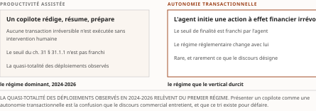
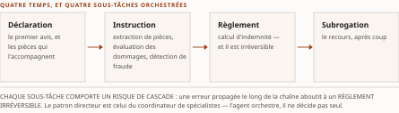
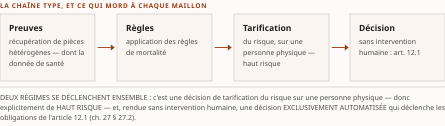

# Chapitre 34 — Les sous-domaines financiers : banque, assurance, patrimoine

*Livre III — Encadrer : orchestration en entreprise, cadre réglementaire canadien et terrain financier.
Troisième mouvement — le terrain canadien : interopérabilité financière et adoption (ch. 31-36).
Quatrième chapitre du mouvement : **il instancie, sous-domaine par sous-domaine, les six patrons que le
ch. 31 a posés une fois**.*

| Champ | Valeur |
|---|---|
| **Statut** | **Brouillon de rédaction, non publiable** — rédigé le 27 juillet 2026 sur instruction d'auteur, **porte G-3 alors ouverte** (socle consolidé à zéro entrée) et **volet résiduel de G-1** alors non instruit. ⚠ **La règle cardinale du PRD §5 a été enfreinte, et la porte franchie depuis ne la rattrape pas** : **G-3 est franchie le 28 juillet 2026** (PRD v0.14 ; socle consolidé de **159 entrées**, `S-001` à `S-159`), *mais la pièce n'a pas été ré-adossée* — voir le champ **Socle mobilisé** et la note de statut, § 34.8. ⚠ **G-4 ne conditionne pas ce chapitre** : sa ligne Fusion ne cite que le Vol. I ; ⚠ **D-9 ne le bloque pas** — *il **applique** le patron de libération humaine, il ne le prescrit pas.* |
| **Date de gel** | **27 juillet 2026** — gel unique, **D-1 prise** (registre : [`gel-2026-07-27.md`](../PRD/gel-2026-07-27.md)). ⚠ **Le volet de FAITS de G-1 est levé depuis le 28 juillet 2026** — 123 entrées à sensibilité temporelle instruites à leur source primaire, registre au [`gel-2026-07-28-volet-residuel.md`](../PRD/gel-2026-07-28-volet-residuel.md) —, ⚠ **mais le volet des obligations de pièce des Livres II et III reste dû, et ce chapitre en porte la charge la plus lourde du Livre** : *une quarantaine d'annonces produit datées, dont la plupart sont **auto-déclarées** et **à re-vérifier au moment de citer**.* Gel de source consommé : **juin 2026** (Vol. I ch. 5) — ⚠ **il ne tient pas lieu du gel de la somme** |
| **Socle mobilisé** | ⚠ **Aucune entrée du socle consolidé — et depuis le 28 juillet 2026 c'est un défaut de COUVERTURE mesuré, non un socle vide** : *les 159 entrées existent, mais **aucune ne porte les §5.7 à §5.11 du Vol. I**, qui sont l'intégralité de la ligne Fusion de ce chapitre ; les **17 entrées héritées du Vol. I** — `S-143` à `S-159` — portent ses §2.10, §3.10, §5.0.2-5.1.1, §7.x et sa Synthèse.* ⚠ **Une seule entrée touche la matière du chapitre, `S-157`** — l'autonomie graduée et son échelle à quatre paliers non numérotés, Vol. I *Monographie* §5.0.2 et §5.1.1 —, *et elle est **déclarée non élevable : thèse à attribuer, jamais un fait***, régime que le § 34.7.1 tient. ⚠ **La totalité de la matière propre du chapitre vient du Vol. I et entre en [C]** — repérage documentaire (PRD §7.1). ⚠ **Conséquence : aucun énoncé n'est central au sens de CA-IV-01**, et *l'élévation en [B] passerait par la lecture des sources primaires que le Vol. I cite.* ⚠ **Plusieurs affirmations du chapitre sont en outre déclarées par leur source « hors corpus bibliographique, à sourcer à la rédaction »** : *elles sont reprises **avec cette réserve**, jamais sans.* Les seuls appuis à un autre régime sont des **renvois** aux ch. 25 à 33 |
| **Garde-fous balayés** | ⚠ **Décomptes re-mesurés au commit du 28 juillet 2026, règle de comptage de la décision 16 du TOC** : *ils portent sur le **marqueur littéral** dans le **corps** — en-tête et note de statut exclus —, et **là où le garde-fou est appliqué sans que son identifiant soit écrit, c'est le domaine balayé qui est déclaré, sans cardinal**.* Vol. II — **PRD §8.2.3 et §7.5 (métriques auto-déclarées, projections) : les deux renvois ne sont pas écrits au corps** ; *les marqueurs le sont — « auto-déclaré » **dix-sept fois** (§ 34.0, § 34.1.2 ×3, § 34.2.2, § 34.2.3, § 34.3.1, § 34.3.3, § 34.3.4, § 34.4.1, § 34.4.2, § 34.4.4, § 34.6.1 ×4 et la synthèse), « l'auto-déclaration » **une fois** (§ 34.1.3), et « projection d'analyste » **sept fois** (§ 34.1.1 ×2, § 34.2.4 ×2, § 34.2.6, § 34.5.6 et la synthèse)* ; ⚠ *c'est le chapitre du Livre où ce garde-fou travaille le plus, **aucune métrique n'y étant citée sans attribution*** ; ⚠ **et l'attribution y est NOMINATIVE depuis la décision 15 du TOC** : *chaque attributeur de métrique est nommé, à trois exceptions déclarées à leur occurrence — § 34.2.6, § 34.5.2 et § 34.5.6 —, **où la source elle-même n'en nomme aucun*** ; **PRD §8.4 (neutralité fournisseur) : deux occurrences du renvoi**, § 34.0 et § 34.5.3 ; *la formule est écrite **trois fois** — § 34.1.3, § 34.2.2 et § 34.5.2 — et **le garde-fou est appliqué de § 34.1 à § 34.5*** ; **R-5 : deux occurrences du sigle**, § 34.1.5 et § 34.7.3 ; **R-1 à R-4, R-6 à R-8 : zéro occurrence**. Vol. III — **R-09 (statut pré-normatif, dit à chaque mention) : zéro occurrence du sigle** ; ⚠ *le garde-fou est **appliqué par transposition, de § 34.1 à § 34.6** — la source ne cite aucun travail pré-normatif mais des **annonces produit**, et **chaque statut de produit — annonce, préversion, disponibilité générale — est dit à sa mention** ; **le décompte n'est pas re-mesurable et n'est donc pas annoncé*** ; **R-14 (trois degrés d'absence) : une occurrence du sigle**, § 34.6.2 — ⚠ *et les degrés se marquent en toutes lettres : « degré 3 » aux § 34.2.5, § 34.6.2, § 34.6.3, § 34.6.4 et à la synthèse, « fait négatif vérifié » au § 34.1.5, et **en négation** au § 34.2.5* ; **R-13 : quatre occurrences du sigle**, § 34.1.1, § 34.4.4, § 34.5.3 et § 34.7.1 — ⚠ *l'échelle à quatre paliers non numérotés est **nommée par son cardinal**, jamais nue* ; **R-02 : une occurrence du sigle**, § 34.4.4 ; **R-01, R-03 à R-08, R-10 à R-12 : zéro occurrence** |
| **Volumétrie cible** | ≈ **9 500 mots** de corps (§ 34.0 à § 34.7), **cible dérivée** de l'enveloppe du Livre — 90 000 mots au TOC v0.25 — au prorata des sous-sections que sa ligne Fusion absorbe : **la plus haute cible du Livre avec le ch. 24**. ⚠ **Le cardinal a été re-mesuré et il vaut trente-neuf** — §5.7.1-5.7.7, §5.8.1-5.8.6, §5.9.1-5.9.5, §5.10.1-5.10.7, §5.11.1-5.11.6, §5.12.4-5.12.7 et §5.14.1-5.14.4 —, *là où la dérivation d'origine en annonçait **trente-trois** : elle dépliait le §5.8 sur quatre sous-sections au lieu de six — écart corrigé au TOC v0.29 — et ne comptait pas le §5.14.* ⚠ **La cible n'est pas re-dérivée pour autant** : *le re-calibrage relève de **D-4** et de sa passe unique de clôture, et **D-4 interdit l'amputation comme le gonflement**.* ☑ **Décompte publiable depuis G-2** ; la mesure réelle est portée au [`README.md`](README.md) du dossier |

> **Thèse** *(citée depuis le [`TOC.md`](../PRD/TOC.md) v0.25, entrée du chapitre 34)* — l'agentique se décline différemment selon le sous-domaine — bancaire, IARD, assurance de personne, gestion de patrimoine, services TI financiers — chacun avec sa maturité et ses points de durcissement propres.

---

⚠ **La thèse a été collationnée contre le texte rédigé de sa source avant la rédaction** (décision 14 du
TOC). **Domaine de balayage : une thèse examinée, zéro réalignée.** Le ch. 5 du Vol. I n'a pas de thèse
formelle ; celle du plan est une **construction d'éditeur** fidèle à l'organisation de ses §5.7 à §5.11.

## § 34.0 — Ouverture : instancier, jamais re-dériver

**Le ch. 31 a posé six patrons une fois pour toute la somme** : *l'irréversibilité, le risque
systémique, la double-qualification, le critère anti-emballement, le quatre-yeux et le patron anti-blanchiment.*
⚠ **Ce chapitre les *instancie* sous-domaine par sous-domaine, et il n'en re-dérive aucun.**

**Ce qui varie d'un sous-domaine à l'autre n'est pas la nature des durcisseurs, mais leur *pondération*
et leur *point d'application*.** *En banque, c'est l'irréversibilité du règlement ; en assurance de
dommage, c'est la cascade d'erreurs le long de la chaîne du sinistre ; en assurance de personne, c'est
le **coût humain** d'une décision erronée ; en gestion de patrimoine, ce n'est pas un paiement mais
**une recommandation** ; dans les services technologiques, c'est la **dépendance elle-même**.*

⚠ **Trois réserves de régime commandent la lecture.** *(1)* **Toute la matière entre en [C]** — *aucun
énoncé n'est central.* *(2)* ⚠ **Le chapitre porte une quarantaine d'annonces produit datées, la plupart
auto-déclarées** : *chacune est **attribuée à sa source** et **marquée à re-vérifier**, et **aucune n'est
recommandée** (PRD Vol. II §8.4).* *(3)* ⚠ **Plusieurs affirmations sont déclarées par le Vol. I lui-même
« hors corpus bibliographique du chapitre, à sourcer à la rédaction »** : *elles sont reprises **avec
cette réserve**, et un lecteur qui les réutiliserait devrait les sourcer lui-même.*

**Ce que le chapitre ne traite pas.** ⚠ *L'**architecture de référence**, le **modèle de maturité
financier** et la **grille de décision** — les §5.12.1 à §5.12.3 de la source — sont **hors périmètre** :
ils vont au **ch. 43**, au Livre IV. L'**interopérabilité B2B et les paiements agentiques** — le §5.13 —
vont au **ch. 36**. ⚠ **Ces deux sorties sont déclarées à la table de couverture**, et le chapitre ne les
anticipe pas.*

## § 34.1 — Bancaire : détail, gros, paiements, crédit, cœur de système

**Le premier sous-domaine combine l'ensemble des durcisseurs** : *irréversibilité des rails de
règlement, exigences de fonds propres, risque de modèle codifié et auditabilité réglementaire.*

### 34.1.1 Le tri par régime d'usage

⚠ **Le critère structurant de tout le sous-domaine est la distinction entre deux régimes d'usage que le
discours commercial tend à confondre**, et **le ch. 31 § 31.1.3 la pose une fois pour tout le
mouvement** : *la **productivité assistée** — un copilote rédige, résume, prépare, **mais aucune
transaction irréversible n'est exécutée sans intervention humaine** — et l'**autonomie
transactionnelle** — l'agent **initie une action à effet financier irrévocable**.*

⚠ **La quasi-totalité des déploiements observés en 2024-2026 relèvent du premier régime** —
*observation de cabinet, **attribuée à Deloitte (2025)*** ; *l'autonomie transactionnelle **demeure
rare, bornée et réservée à des périmètres à faible matérialité**.*

⚠ ***Ce tri n'est pas une nuance rhétorique : il détermine le niveau de garde-fou exigé.*** *Un copilote
tombe sous une gouvernance de productivité ; un agent transactionnel déclenche **trois patrons du
ch. 31** — la libération humaine sur l'irréversible (§ 31.1.1), la double-qualification (§ 31.1.4) et la
ségrégation des tâches (§ 31.3.4).*

⚠ **Le tri n'est pas davantage une échelle d'autonomie** (R-13 du Vol. III) : *les échelles de la somme
sont **nommées par leur cardinal et leur numérotation** au **ch. 14 § 14.4**, et le mot « copilote » y
désigne trois objets distincts.*

⚠ **Une projection d'analyste situe l'enjeu économique, et elle se cite avec son attributeur** : *une
érosion potentielle des bassins de profit bancaires **pouvant atteindre 170 G$ d'ici 2027** —
**projection d'analyste attribuée à McKinsey (2025)** — explique la pression d'adoption.* ⚠ ***Mais la pression économique ne dispense
pas du tri par criticité***, qui reste le préalable à toute conception.

### 34.1.2 Front conversationnel et le revirement humain-dans-la-boucle

**Le front conversationnel illustre la domination du régime de productivité assistée et les limites de
l'autonomie tournée vers le client.**

⚠ *Côté copilotes employés, **JPMorgan Chase** rapporte un déploiement à **environ 200 000
utilisateurs en huit mois** — **chiffres auto-déclarés par l'établissement, à re-vérifier** — avec des
premiers agents multi-étapes **en émergence**. Côté client, **Bank of America** décrit un assistant
ayant **dépassé trois milliards d'interactions** au sein de plus de **26 milliards d'interactions
numériques annuelles** — **chiffres auto-déclarés par l'établissement** ; ⚠ **et cet assistant demeure
réactif, non un agent transactionnel autonome**.*

⚠ **Un cas fait charnière, et sa leçon est plus instructive que ses chiffres.** *L'assistant que
**Klarna** a déployé en février 2024 fut promu comme accomplissant « le travail de 700 agents à temps
plein » — **chiffre auto-déclaré par Klarna, et contesté** — avant un **revirement, à partir de mai
2025, vers un modèle hybride réintroduisant l'humain**.*

Lecture de l'auteur — **la leçon transférable est la segmentation par criticité** : *un agent peut
traiter le statut d'une commande, mais **le litige, la fraude ou la situation de détresse financière
exigent l'escalade humaine**.* ⚠ **Ce revirement confirme deux choses** : *le patron de collaboration
humain-agent du **ch. 24 § 24.5.4**, et le tri du § 34.1.1* — ***l'enthousiasme initial pour le
remplacement intégral cède devant l'exigence de qualité et de conformité sur les interactions à fort
enjeu, où une réponse erronée engage la responsabilité de l'établissement*** (ch. 31 § 31.1.3). **Ce
que le socle établit** : les faits et le revirement. **Ce qu'il n'établit pas** : cette généralisation.

### 34.1.3 Crime financier : la tête de pont

⚠ **Le patron du crime financier agentique est posé au ch. 31 § 31.4.3, siège unique** : *l'agent
investigue et prépare, **la décision de déclarer demeure humaine**.* **Cette sous-section n'ajoute que
les illustrations bancaires datées et le rattachement canadien.**

**La conformité au crime financier constitue la tête de pont de l'agentique en banque** *parce qu'elle
conjugue **un volume massif d'alertes**, **un produit narratif** bien adapté à la génération de texte,
et **l'exclusion de la détection de fraude** du régime de haut risque européen* (**ch. 30 § 30.2.3**).

⚠ **Les illustrations produit datées convergent vers le triage assisté plutôt que vers la décision
autonome, et chacune porte son statut** : *un éditeur intègre un triage anti-blanchiment à son
orchestrateur ; un autre annonce un agent de criminalité financière opérant en temps réel — **annonce
fournisseur** ; un partenariat annoncé le **4 mai 2026** positionne un agent de crimes financiers comme
premier cas d'usage, avec **deux déploiements clients annoncés** et une **disponibilité générale
annoncée pour le
second semestre 2026**, données confinées sur l'infrastructure de l'éditeur — **annonce à
re-vérifier**.* ⚠ **Neutralité fournisseur** : *trois offres nommées, aucune recommandée.*

⚠ **Du côté canadien, le rattachement est celui du ch. 30 § 30.2.7** : *le programme de conformité
demeure **non délégable à l'agent**, et de nouvelles obligations encadrent la conservation et la
documentation **depuis le 1ᵉʳ octobre 2025**.* ⚠ *Le **Boston Consulting Group (2025)** qualifie la vérification client de domaine
où l'agentique passe le plus tôt à l'échelle ; **tout gain d'efficacité chiffré relève de
l'auto-déclaration** et doit être attribué nominativement.*

### 34.1.4 Crédit et octroi : périmètre de haut risque et origination hypothécaire

**Le crédit aux personnes physiques est l'un des rares domaines bancaires explicitement visés par le
régime européen de haut risque** — notation de crédit et de solvabilité des personnes physiques,
⚠ **à l'exception de la détection de fraude** (**ch. 30 § 30.2.3**).

⚠ **Le patron réglementaire central consiste à séparer nettement la *décision réglementée* de
l'*orchestration agentique* qui l'entoure**, et il est le plus clair du chapitre :

> *La notation de solvabilité demeure **un modèle gouverné, explicable et journalisé**, soumis au régime
> du risque de modèle. **L'agent n'est pas ce modèle.** Il **orchestre autour** : il collecte les pièces
> justificatives, pré-remplit les formulaires, explique la décision au client — ⚠ **mais il ne se
> substitue pas au moteur de décision réglementé.***

⚠ **Le delta sectoriel empile deux régimes**, et il faut les tenir séparés : *le régime européen de haut
risque — **échéance reportée au 2 décembre 2027, report adopté sous réserve de publication***
(**ch. 30 § 30.2.3**) — *et les régimes de **notification de décision automatisée** : le régime européen
et **l'article 12.1 québécois**, dont le **ch. 27** est le siège et qui **n'est pas une interdiction**
mais **un régime de transparence et de révision**.*

**L'origination hypothécaire constitue un ajout volumétrique majeur**, distinct du crédit à la
consommation et lui aussi visé. ⚠ *La chaîne — réception des documents, vérification, pré-remplissage
selon un modèle de référence publié le **29 octobre 2025** (**ch. 31 § 31.2.5**), puis clôture
électronique — **se prête à l'orchestration agentique sur ses étapes à faible irréversibilité**, tandis
que **la notation décisionnelle reste un modèle gouverné**.* ⚠ **Le standard fournit le substrat sémantique
qui réduit l'affabulation du pré-remplissage et facilite l'audit** — *application directe du ch. 31
§ 31.2.1.*

⚠ **Une question de fond n'est pas refermée, et elle précède l'agentique** : *la littérature établit que
**certaines garanties d'équité sont mutuellement incompatibles**.* ⚠ ***La couche d'orchestration
agentique n'absout pas le modèle sous-jacent : elle déplace seulement la frontière de l'explicabilité***
(ch. 31 § 31.3), *qui doit relier la recommandation au profil et à sa justification.*

### 34.1.5 Paiements temps réel, cœur de système et banque ouverte

⚠ **Le versant des rails de paiement canadiens est au ch. 33**, qui en porte les dates, les statuts et
la réserve la plus stricte du Livre ; *il n'est pas doublé ici.* ⚠ **Et le patron d'irréversibilité qui
les gouverne est au ch. 31 § 31.1.1.**

⚠ **L'encapsulation du cœur de système est au ch. 24 § 24.1.4** pour son versant générique et au
**§ 34.5.2** pour son delta financier ; *elle n'est pas reprise ici.*

⚠ **La banque ouverte** — *l'agent comme destinataire accrédité* — **est au ch. 32**, qui porte le cadre,
son superviseur, son règlement prépublié et **son fait négatif vérifié sur le standard technique**.
⚠ ***Aucune spécification n'est nommée ici***, et **R-5 du Vol. II l'interdit** : *une anticipation
d'industrie n'est pas une désignation.*

## § 34.2 — Assurance de dommage

⚠ **Le saut d'interopérabilité observé en assurance de dommage n'est pas l'agent lui-même, mais la
mutation du transport sous-jacent.**

### 34.2.1 Le tournant du transport : du lot au temps réel

*Historiquement, l'échange entre courtiers, assureurs et fournisseurs s'appuyait sur un **format par
lots** hérité de l'échange de documents structurés, puis sur des messages **en temps réel**.* ⚠ **Le
critère discriminant est donc le passage de ce socle par lots à un transport agentique temps réel
exposant les capacités sectorielles sous une forme consommable par un agent.**

⚠ *L'organisme sectoriel **ACORD Solutions Group** a annoncé le **28 mai 2026** une architecture qualifiée
de « **compatible avec le protocole agent-outil** » au-dessus de deux de ses produits, présentée comme
« gouvernée et auditable », avec une annonce de suivi début juin 2026 — **disponibilité générale à
re-vérifier**, **chiffre fournisseur** : l'attributeur est nommé, la qualification reste la sienne.*

⚠ **Cette mise à disposition demande une qualification prudente, et c'est l'application directe du siège
anti-emballement du ch. 31 § 31.2.6** : *il ne s'agit **ni d'un nouveau protocole**, **ni d'un serveur
d'outils financier officiel ratifié** — **aucun standard sectoriel de ce type n'existe à juin 2026**.*
**Concrètement, l'organisation expose des produits existants par une interface** ; *la valeur réside
dans le **découplage** entre la logique d'agent et le modèle de données assurantiel, et dans le
caractère **contractuel et journalisé** de l'échange.* ⚠ ***L'agent consomme une capacité bornée plutôt
que de deviner une structure*** — *ce qui réduit l'ambiguïté sémantique et facilite l'auditabilité.*

### 34.2.2 Les plateformes de police comme plateformes d'agents

*⚠ **Cette sous-section est le siège de la grille d'architecture des plateformes d'assurance de
dommage** dans la somme ; les § 34.5.2 et § 34.5.6 y renvoient sans la re-dériver.*

**Le critère d'architecture oppose deux modèles.** *Dans le premier, **l'agent est embarqué dans le cœur
de police** — couplage fort : la plateforme intègre ses propres capacités agentiques, **au prix d'une
portabilité de modèle réduite**. Dans le second, **le cœur est exposé comme outil** par une interface
ouverte et indépendante du modèle, **laissant l'entreprise choisir et changer son fournisseur**.*

**Les trois axes de décision sont** : *la **portabilité du modèle**, l'**ouverture à l'orchestration
inter-agents**, et le **périmètre de la piste d'audit**.*

⚠ ***Ce choix engage directement le découplage et l'évolution : un cœur exposé comme outil survit au
remplacement du modèle ; un agent embarqué lie le cycle de vie du modèle à celui du cœur.***

⚠ **Les éditeurs se positionnent diversement, et chaque statut se dit** : *l'éditeur **Guidewire** a
annoncé le **8 décembre 2025** une version dont un assistant de souscription présenté comme « première
capacité agentique du cœur » et un cadre agentique indépendant du modèle — ⚠ **à condition de distinguer
l'outillage de développement du cadre agentique d'exécution embarqué**, distinction que le **ch. 31
§ 31.2.6** impose ; un autre éditeur a lancé le **28 avril 2026** une plateforme articulant un référentiel
de contexte, une couche d'assurance qualité et une passerelle ; un troisième — **Majesco** — a annoncé en
**octobre 2025** une version dotée de « 13 agents » avec humain dans la boucle — **chiffre auto-déclaré
par l'éditeur, à re-vérifier**.*
⚠ **Neutralité fournisseur** : *trois offres nommées, aucune recommandée.*

### 34.2.3 Sinistres et fraude : l'agent orchestrateur d'une chaîne

**La chaîne du sinistre — déclaration, instruction, règlement, subrogation — est le théâtre où
l'agentique est la plus visible**, ⚠ **et le patron directeur y est celui du *coordinateur de
spécialistes*, non du *décideur unique*.**

⚠ *L'agent orchestre des sous-tâches — extraction de pièces, évaluation des dommages, détection de
fraude, calcul d'indemnité — **dont chacune comporte un risque de cascade** : **une erreur propagée le
long de la chaîne aboutit à un règlement irréversible**.* ⚠ **Ce mode d'échec relève de la taxonomie des
défaillances multi-agents dont le ch. 6 est le siège**, *et il impose la **libération humaine sur
l'action irréversible*** (ch. 31 § 31.1.1).

⚠ **Une distinction de lecture est nécessaire, et elle vaut pour tout le chapitre** : *il faut séparer
**les agents-produits** — vendus comme agents autonomes — **des produits qui utilisent des agents en
sous-composant**, ⚠ **pour ne pas surclasser le degré réel d'autonomie**.*

⚠ *L'éditeur **Shift Technology** a lancé le **16 septembre 2025** une plateforme de sinistres
qualifiée d'agentique, et revendique des contrats reconduits ainsi que des gains — **−3 % de pertes,
−30 % de temps de traitement, 60 % d'automatisation, plus de 99 % de couverture** : ⚠ **chiffres
AUTO-DÉCLARÉS par Shift Technology, à re-vérifier**, cités ici sous cette seule attribution.* ⚠ **Le
marché se concentre** : *l'acquisition d'**EvolutionIQ** par **CCC Intelligent Solutions**, clôturée le
**6 janvier 2025** pour **730 M$**, cible une branche particulière ; l'éditeur **Tractable**
industrialise l'évaluation de dommages « sans contact ».* ⚠ **Un règlement de litige entre Tractable et CCC Intelligent
Solutions constitue un signal de concentration et de risque de verrouillage fournisseur** — *à
surveiller du point de vue de la résilience opérationnelle* (**ch. 30 § 30.2.2**).

### 34.2.4 Souscription, tarification, distribution et télématique

**En amont du sinistre, la souscription suit un patron d'enchaînement** : *réception → enrichissement →
triage → **soumission prête à décider***. ⚠ *L'agent collecte la demande, l'enrichit de données
externes, la trie par appétit de risque et **la présente au souscripteur sous une forme prête à
décider*** — *application du patron du ch. 31 § 31.1.1.*

⚠ **La télématique et l'assurance basée sur l'usage fournissent le substrat de données, et les chiffres
portent leur attributeur** : *l'exploitant **Cambridge Mobile Telematics** revendique une levée de
**350 M$ en mars 2026**, **plus de 21 millions d'assurés aux États-Unis** et une croissance annuelle de
l'ordre de **+28 %** — **chiffres de l'exploitant et de la presse, à re-vérifier**.*

⚠ **Les métriques de productivité souvent citées sont des projections d'analyste** : *souscription
ramenée **de trois jours à trois minutes**, taux de traitement de bout en bout passant **de 10-15 % à
70-90 %*** — ⚠ **projections d'analyste attribuées à McKinsey & Company (2025), à re-vérifier**,
*jamais des mesures auditées.*

⚠ **La tarification fondée sur l'usage soulève des questions d'équité tarifaire**, traitées par une
littérature dédiée ; ⚠ *en assurance de dommage, **cet enjeu relève du risque de modèle et de la
conformité locale, non du régime de haut risque*** — voir § 34.2.6.

### 34.2.5 Réassurance : la frontière où l'agentique reste copilote

⚠ **La réassurance marque la frontière où l'agentique cesse d'être autonome pour rester copilote.**

*Le critère est que **franchir la frontière inter-firmes** — cédante, courtier, réassureur — **exige une
identité d'agent vérifiable et une contractualisation explicite** : un agent qui agirait au nom d'une
partie auprès d'une autre devrait être **identifié, autorisé et imputable**.* ⚠ **C'est exactement
l'objet du ch. 18 § 18.1, siège unique de la connaissance de l'agent**, *qui n'est pas reconstruit ici.*

⚠ ***Or ces mécanismes — connaissance de l'agent, négociation de contrat machine-à-machine,
journalisation opposable entre entreprises — sont encore absents en pratique à juin 2026*** — *absence de
documentation dans le corpus de la source, **degré 3**, et non un fait négatif vérifié.* *Les
déploiements observés sont par conséquent **des copilotes internes à une firme**, et non des agents
franchissant la frontière de manière autonome.*

⚠ *Un courtier a présenté le **23 juin 2025** un copilote et un module contractuel couvrant quinze
branches ; un réassureur a publié en **décembre 2025** un plan directeur — ⚠ **communiqués fournisseurs
hors corpus bibliographique du chapitre source, à sourcer et à re-vérifier au moment de citer**.*
⚠ ***Il importe de ne pas surclasser ces réalisations : ce sont des copilotes et des cadres conceptuels,
non des agents autonomes.*** **La ségrégation des rôles et l'indépendance d'exécution du ch. 31 § 31.3.4
restent des conditions structurelles.**

### 34.2.6 Le régime propre : où le droit mord différemment

⚠ **Le régime applicable à l'assurance de dommage se distingue par ce qui *n'y mord pas*.**

**Le point critique est que la tarification et la souscription y *ne sont pas* explicitement classées
« haut risque »** : *le point de l'annexe européenne qui vise l'assurance **ne concerne que la vie et la
santé*** (**ch. 30 § 30.2.3**). ⚠ ***L'assurance de dommage se trouve dans une zone grise, et il serait
erroné d'y étendre le régime de haut risque.***

**Le centre de gravité réglementaire se déplace donc vers deux pôles.** *D'une part, **le risque de
modèle** : la guidance américaine du 17 avril 2026, ⚠ **qui exclut explicitement l'IA générative et
agentique et reste non contraignante** ; **E-23**, ⚠ **finale mais en vigueur le 1ᵉʳ mai 2027**, et dont
la portée élargie couvre les assureurs de dommage ; et la ligne directrice québécoise, **même date
d'entrée en vigueur** (**ch. 25**, **ch. 27**, **ch. 30 § 30.2.4**). D'autre part, **la résilience
opérationnelle**, avec son registre de tiers et son risque de concentration (**ch. 30 § 30.2.2**).*

⚠ *La **National Association of Insurance Commissioners (NAIC)** poursuit des travaux sur les écarts de
redevabilité et les erreurs en cascade, sur la base de son **bulletin type de 2023**.* ⚠ **Une
projection d'analyste situe à environ 7-8 % la proportion d'assureurs disposant d'une gouvernance
inter-agents intégrée** — *projection dont **la source ne nomme pas l'attributeur**, à marquer comme
telle.*

## § 34.3 — Assurance de personne

⚠ **L'assurance de personne se distingue de l'assurance de dommage par *deux durcisseurs cumulés et
structurants*** : *la souscription et la tarification y portent sur **une personne physique** et
tombent donc **explicitement** dans le périmètre de haut risque ; et **la donnée mobilisée est une donnée
de santé sensible**.* ⚠ ***Le delta réglementaire n'est donc pas marginal mais constitutif.***

⚠ **Le patron du ch. 31 § 31.1.1 s'y applique avec une acuité particulière** : ***le coût d'une décision
erronée peut y être humain, et non seulement financier.***

### 34.3.1 La souscription accélérée comme chaîne d'orchestration régulée

**La souscription vie accélérée est le cas où la chaîne d'orchestration rencontre la contrainte
réglementaire la plus directe** : *c'est une **décision de tarification du risque sur une personne
physique**, donc explicitement de haut risque ; et, **lorsqu'elle est rendue sans intervention
humaine**, une **décision exclusivement automatisée** déclenchant les obligations de l'article 12.1*
(**ch. 27 § 27.2**).

**La chaîne type enchaîne** : *récupération de preuves hétérogènes, application de règles de mortalité
et de morbidité, puis **verdict** — traitement de bout en bout pour les profils nets, **renvoi à un
humain sinon**.*

⚠ **Le critère architectural directeur n'est pas « quel modèle de langage », mais *où s'arrête
l'autonomie*** : *tout cas non traité de bout en bout **remonte à un souscripteur humain**, et toute
décision exclusivement automatisée **doit rester explicable et révisable**.*

⚠ **Le rôle propre de l'agent y demeure circonscrit** — *synthèse de preuves volumineuses et suggestion
de prochaine action* — *tandis que **le verdict de mortalité reste un modèle actuariel ou à règles,
gouverné** au sens du risque de modèle.*

⚠ **Il faut distinguer deux objets que le marketing confond** : *le **moteur de règles déterministe**,
auditable par construction et **antérieur aux modèles de langage** ; et l'**agent non déterministe** qui
orchestre la collecte et la synthèse autour de ce moteur.* ⚠ ***Le second n'absorbe pas le premier : il
l'instrumente.***

⚠ *Deux plateformes ont annoncé, en **novembre 2025** et le **29 octobre 2025**, des socles présentés
comme des bonds d'intelligence artificielle pour ce sous-domaine — **auto-déclaré**, **statuts
annonce / préversion / disponibilité générale à reconfirmer**.* ⚠ *Le cabinet **McKinsey** relève que la modernisation
des technologies de cœur par l'agentique reste, à juin 2026, **largement en projet plutôt qu'en
production** — **estimation d'analyste**.*

### 34.3.2 La donnée de santé comme contexte d'agent

⚠ **Là où la branche vie pose la question « où s'arrête l'autonomie », la donnée manipulée fait
apparaître une seconde frontière.**

*Le patron d'ancrage gouverné du **ch. 24 § 24.4** s'y spécialise en un **pont dossier de santé →
agent**, mais sous une contrainte de premier ordre absente des autres sous-domaines : **la donnée de
santé y est une catégorie particulière** dans les trois ordres juridiques que la source recense —
**européen, américain et québécois**.*

⚠ **La conséquence d'architecture est que *la minimisation et le consentement doivent précéder la
lecture*** : *l'agent **ne doit recevoir en contexte que le strict nécessaire à la tâche**, et **la
résidence de ce contexte tombe sous le piège du ch. 31 § 31.5.1*** — *l'invite, les plongements et les
traces contiennent la donnée client, **ici une donnée de santé**.*

⚠ **Sur le plan de l'interopérabilité, il n'existe *aucun* serveur d'outils sectoriel officiel pour
l'assurance de personne à juin 2026** — *application directe du siège anti-emballement du **ch. 31
§ 31.2.6***. *Ce qu'on observe est un **empilement** : une couche sémantique de ressources de santé
matures, au-dessus de laquelle s'intercalent des connecteurs **génériques, non sectoriels**.* ⚠ **Le rôle
de cette couche est de présenter à l'agent *une capacité bornée, identifiée et journalisée* plutôt qu'un
accès direct au dossier.**

⚠ **Note de sourçage, reprise de la source** : *les standards d'interopérabilité de santé et les
connecteurs correspondants **ne figurent pas au corpus bibliographique du chapitre source**, centré sur
la finance ; **ils sont à sourcer sur leurs publications propres au moment de citer**, et **toute
affirmation à leur sujet demeure sans appui bibliographique**.*

### 34.3.3 Prestations et autorisation préalable

⚠ **Le versant prestations *renverse le calcul de risque* qui gouverne le reste du chapitre** : *ici,
**le coût d'erreur n'est pas financier mais humain** — un refus de soins, l'interruption d'une rente
d'invalidité.*

⚠ **Le patron du ch. 31 § 31.1.1 s'y traduit en une *asymétrie d'autorité explicite*** :

> Un agent peut être autorisé à **approuver ou à accélérer** une prestation — **cas où l'erreur joue en
> faveur de l'assuré et reste réversible côté payeur** — ⚠ **mais une décision défavorable de nature
> clinique doit rester réservée à un professionnel qualifié**, assortie du journal d'audit infalsifiable
> du **ch. 31 § 31.3.2**.

**Le cas d'usage le plus mature et, simultanément, le plus litigieux est l'autorisation préalable** :
techniquement, l'agent **assemble le dossier** — il rassemble pièces et justifications cliniques —
⚠ **mais la décision adverse demeure humaine**.

⚠ **La cascade d'erreurs propre aux systèmes multi-agents y prend une portée particulière** : *une chaîne
mal cadrée peut **convertir une synthèse erronée en refus à conséquence sanitaire**.*

⚠ **Le contre-exemple canonique de gouvernance illustre précisément ce que le patron interdit, et il se
cite avec toutes ses réserves** : un litige visant l'usage d'un outil prédictif en gestion de
l'utilisation — **refus partiel d'une requête en rejet le 13 février 2025** — est à présenter comme
**un contre-exemple contesté par l'assureur, et non comme un fait établi** ; ⚠ **son intérêt analytique
est de matérialiser le risque qu'un score automatisé se substitue *de fait* à la décision clinique
humaine**. ⚠ **Note de sourçage** : *les canaux d'échange en santé, les acteurs en cause et le litige
**ne figurent pas au corpus bibliographique du chapitre source** — ils relèvent de sources juridiques et
de santé **à citer directement**, et tout chiffre de rendement d'un fournisseur est **auto-déclaré**.*

### 34.3.4 Distribution, conseil et rentes

**La distribution et le conseil forment le pont vers la gestion de patrimoine du § 34.4** : *l'agent y
assiste le distributeur, ⚠ **mais la convenance de la recommandation reste un acte réglementé qui ne
s'atténue pas du fait qu'un agent l'a préparé*** (**ch. 30 § 30.2.5**).

⚠ **L'exigence d'interopérabilité qui en découle est que la chaîne doit *porter la preuve* reliant la
recommandation au profil du client et à sa justification** — ***un agent qui « propose » sans laisser ce
fil documentaire reporte le risque de conduite sur le distributeur.***

⚠ **Le sous-domaine présente un trait qui le distingue du patrimoine** : les **rentes et la couverture
de longévité** engagent l'assureur sur **un horizon pluridécennal** — souvent trente à quarante ans —
de sorte que ***la stabilité et l'explicabilité du modèle actuariel priment sur l'agilité de
l'agent***.
⚠ **Les hypothèses de mortalité, de taux et de comportement tombent sous le risque de modèle gouverné** :
***leur révision n'est pas un terrain d'expérimentation non déterministe, et l'agent y intervient au
mieux comme assistant de préparation, jamais comme arbitre des hypothèses de long terme.***

⚠ *Deux plateformes ont annoncé **trois** copilotes de distribution et d'administration — en **octobre
2025**, en **février 2026** et en **juin 2025** — **annonces fournisseur, statuts et chiffres
auto-déclarés, à reconfirmer**.*

### 34.3.5 Le régime propre : haut risque, équité, donnée sensible

⚠ **Cette sous-section n'instaure pas un nouveau régime : elle énonce le *delta* que la vie et la santé
ajoutent au bloc transverse du ch. 30**, *et qui justifie d'en faire une branche distincte du § 34.2.6,
où la tarification de dommage n'est précisément **pas** explicitement de haut risque.*

**Le premier marqueur est le régime européen** : *le point de l'annexe qui vise l'assurance range au
haut risque **l'évaluation du risque et la tarification en assurance vie et santé pour les personnes
physiques*** — ⚠ ***libellé exact, à ne pas étendre à l'assurance de dommage ni à confondre avec le point
qui vise la notation de crédit.*** *L'échéance **était** fixée au 2 août 2026 ; ⚠ **le report de seize mois
au 2 décembre 2027 a été adopté dans la fenêtre du socle, sous la seule réserve de la publication à
suivre*** (**ch. 30 § 30.2.3**).

S'y articule, **sans nouvelles exigences propres**, l'avis de l'**Autorité européenne des assurances
et des pensions professionnelles (EIOPA)** sur la gouvernance et la gestion du risque lié à l'IA, du
**6 août 2025**. Aux États-Unis, le pilotage passe par le **bulletin type de la National Association of
Insurance Commissioners (NAIC), adopté le 4 décembre 2023**, repris par un nombre croissant d'États —
⚠ **décompte et statut à reconfirmer**.

⚠ **Au Canada et au Québec** : *E-23 couvre désormais **tous les assujettis fédéraux, assureurs vie
compris** ; **la ligne directrice québécoise ajoute un responsable senior unique, un répertoire
centralisé et une explication « claire et simple » au client*** — ⚠ **ce que le ch. 30 § 30.2.7 porte en
[C], et que le ch. 27 § 27.1 déclare comme *lacune du socle du Vol. II, non comblée*** ; *et l'article
12.1 s'applique à toute décision exclusivement automatisée, ⚠ **sans être une interdiction**.*

⚠ **L'enjeu de fond, plus aigu ici qu'ailleurs, est l'équité et le biais** : *sur des contrats de très
longue durée, **le risque est qu'un modèle exploite des variables corrélées** à l'état de santé, au
profil génétique ou à l'âge, **et reproduise une discrimination prohibée**.* ⚠ La littérature fournit le
cadre formel — **bornes théoriques entre critères d'équité**, application au prix d'assurance non
discriminatoire — ⚠ **et aucun de ces cadres ne se résout par l'agentique** : ***l'agent doit au
contraire en porter la preuve documentée***.

⚠ ***Le delta se résume ainsi : un même agent y cumule haut risque, donnée sensible et horizon long, ce
qui rend la gouvernance d'équité non pas optionnelle mais constitutive de la conformité.***

## § 34.4 — Gestion de patrimoine et d'actifs

⚠ **Ce sous-domaine se distingue des trois précédents par *une tension de qualification juridique*
plutôt que par l'irréversibilité d'un règlement** : ***le geste réglementé n'est pas un paiement mais
une recommandation***, *et la frontière critique est celle qui sépare **l'assistance documentaire** du
**conseil personnalisé soumis aux obligations de convenance**.*

⚠ **Le critère de lecture transversal se pose une fois** : ***ne jamais confondre le conseiller
automatisé classique — moteur de règles déterministe — avec l'agent non déterministe*** (§ 34.4.4).

### 34.4.1 Le copilote du conseiller comme orchestrateur d'interopérabilité

⚠ **Le premier patron n'est pas un agent qui place ou rééquilibre, mais un copilote dont la valeur
d'interopérabilité tient à ce qu'il *écrit dans le système d'enregistrement réglementaire*.**

*La distinction est structurante : **un assistant qui se contente de répondre reste un outil de
productivité sans empreinte sur la piste documentaire** ; **un copilote qui transcrit l'entretien, en
produit une note, la consigne au dossier et en dérive les tâches de suivi referme une boucle où chaque
écriture devient un acte traçable et révisable**.*

⚠ *La trajectoire documentée de **Morgan Stanley** en donne l'exemple : à un assistant déployé en
2023 — **adoption dépassant 98 % des équipes, auto-déclarée par la firme dans une étude de cas de son
fournisseur de modèle (2024)** — succède en **juin 2024** un outil combinant transcription et synthèse
**avec consignation automatique au registre**, puis un troisième côté recherche en **octobre 2024**.* ⚠ **Le déplacement décisif est là : *l'agent ne lit plus seulement le
contexte, il alimente le registre*** — *ce qui fait de la qualité et de la réversibilité de cette
écriture une exigence de premier ordre.*

**Deux corollaires en découlent.** D'abord, ⚠ **le consentement du client à l'enregistrement devient
une pré-condition d'interopérabilité, pas une formalité** : sans lui, la boucle ne peut s'amorcer.
Ensuite,
⚠ **l'écriture au dossier tombe sous les obligations de conservation des livres et registres** —
**ch. 31 § 31.3.2** — *de sorte que **la note produite par l'agent doit être conservée, horodatée et
opposable au même titre qu'une note rédigée par le conseiller**.*

⚠ *Le mouvement n'est pas isolé : un autre fournisseur a intégré son assistant au flux de travail du
conseiller en **mars 2026**, en remplacement d'un agent conversationnel de 2023.* ⚠ ***Le terrain
d'adoption mature n'est donc pas le conseil automatisé, mais l'instrumentation gouvernée de l'acte de
conseil humain.***

### 34.4.2 L'architecture fédérée à registre de capacités

⚠ **Le patron d'architecture le plus instructif du sous-domaine est *un registre fédéré de capacités***
*qui transpose au monde de l'investissement **la résolution du problème N×M en N+M** posée au **ch. 24
§ 24.0.3** : chaque équipe expose ses fonctions comme capacités enregistrées **plutôt que de multiplier
les intégrations point-à-point**.*

*La conception documentée réunit **une orchestration supervisée**, **un registre alimenté par des
dizaines d'équipes**, **un filtrage ramenant l'espace d'outils à une vingtaine ou une trentaine d'outils
pertinents par requête**, et **des garde-fous d'entrée et de sortie**.*

⚠ **Le trait le plus signifiant n'est pas technique mais réglementaire** : la contrainte « **pas de
conseil en investissement** », **vérifiée par évaluation**, est ***un choix d'architecture de
gouvernance*** — en interdisant à l'agent de formuler un conseil personnalisé, l'éditeur **maintient
délibérément le copilote en deçà du seuil qui déclencherait les obligations de convenance** (§ 34.4.5).

⚠ ***C'est l'illustration directe du patron du ch. 31 § 31.1.1 appliqué non à l'irréversibilité d'un
règlement mais à la frontière du conseil réglementé : on borne la capacité de l'agent pour rester du bon
côté de la qualification juridique.*** ⚠ *Le parc supervisé par la plateforme de **BlackRock** est **de
l'ordre de plusieurs milliers de milliards de dollars d'actifs** — **chiffre auto-déclaré par l'éditeur,
à re-vérifier** — ce qui donne la mesure de l'enjeu de fiabilité.*

⚠ *Le même patron se décline sur l'investissement alternatif et sur la production de commentaires de
portefeuille — un outil annoncé le **2 octobre 2025** — **étant entendu qu'il s'arrête avant la
communication finalisée au client**, laissant le conseiller valider le texte* : ⚠ **ce qui reconduit
l'asymétrie *préparation par l'agent / décision et diffusion par l'humain*.**

Lecture de l'auteur — **l'apport opérationnel du registre est de convertir la prolifération
d'intégrations en *un point de catalogage unique* où chaque capacité porte une identité, une portée et
une évaluation.** ⚠ *Le filtrage à vingt ou trente outils par requête **n'est pas un détail de
performance** : c'est **un contrôle de surface d'attaque** et **un contrôle de coût**.* **Ce que le socle
établit** : la conception. **Ce qu'il n'établit pas** : cette lecture des trois invariants — *registre
gouverné, garde-fous évalués en continu, contrainte de finalité testée par évaluation plutôt que par
simple consigne d'invite.*

### 34.4.3 Plateformes de gestion : de la requête en langage naturel à l'agent de données

⚠ **Le critère éditorial structurant est de *distinguer l'analyse en langage naturel — généralement
disponible — de l'agent autonome de flux de travail, encore en préversion*.** ***La confusion marketing
assimile les deux ; l'architecture les sépare nettement.***

⚠ *Une plateforme en fournit l'illustration : une couche d'analyse de portefeuille en langage naturel,
déployée début **mars 2026**, est **un outil de requête et de synthèse** sur des données déjà
rapprochées, tandis qu'un agent d'**opérations de données** relève **du registre de la préversion**.*

⚠ **Le patron à retenir est que *les premiers agents véritablement disponibles ne sont pas des agents de
conseil mais des agents de qualité, de connectivité et de réconciliation de données*** : *on commence
par **les flux internes à faible irréversibilité** — préparer, rapprocher, contrôler la donnée — **là où
une erreur se corrige sans conséquence client immédiate**, avant d'envisager toute action tournée vers
le client.*

⚠ ***Cette gradation est l'application directe du principe « commencer par les usages à faible
irréversibilité »*** (ch. 31 § 31.1.1) : *la donnée propre et rapprochée est **le pré-requis de tout le
reste**, et **un terrain d'apprentissage sûr**.*

⚠ *Le même mouvement s'observe chez trois autres acteurs, avec des annonces de **juin 2025**, **mars
2026** et **février 2026**.* ⚠ **Toutes ces annonces sont fournisseur et à statut — annonce, préversion,
disponibilité générale — à reconfirmer** ; ⚠ ***la discipline de lecture est de ne jamais traiter une
préversion d'agent de flux comme une capacité de conseil disponible.***

### 34.4.4 Conseiller automatisé classique et agent : la désambiguïsation impérative

⚠ **La désambiguïsation la plus importante du sous-domaine est aussi la plus mal comprise du marché :
*le conseiller automatisé classique n'est pas un agent fondé sur un modèle de langage*.**

*Les plateformes de conseil automatisé établies reposent sur des **moteurs de règles déterministes** :
allocation dérivée d'une théorie du portefeuille, **rééquilibrage déclenché par franchissement de
seuils**, **récolte algorithmique de pertes fiscales**.* ⚠ **Les méthodologies publiées décrivent des
systèmes *auditables par construction*** : ***à entrée donnée, sortie reproductible, sans génération non
déterministe.***

⚠ *L'IA agentique y est, à juin 2026, **périphérique** — service à la clientèle, accueil, assistance
documentaire — **et non au cœur de la décision d'investissement**.*

⚠ ***Confondre les deux conduirait à attribuer à un moteur de règles auditable les risques de
non-déterminisme et d'affabulation propres aux modèles de langage, et inversement à présenter un agent
comme aussi prévisible qu'un moteur de règles.*** ⚠ **Un mécanisme se qualifie par ce que sa
spécification démontre** (R-02 du Vol. III) : *un moteur de règles **démontre** la reproductibilité ; un
agent **n'offre qu'une garantie probabiliste**.*

⚠ *Le repère canadien est utile : **Wealthsimple**, premier conseiller automatisé du pays, **lancé en
2014**, gère un encours de l'ordre de **cent milliards de dollars canadiens** — **chiffre auto-déclaré
par la firme, à re-vérifier** — et **opère comme gestionnaire de portefeuille inscrit** auprès des
autorités de valeurs mobilières et de l'autorité québécoise* : ⚠ ***un statut réglementé qui ne s'efface pas du fait de l'automatisation***
(**ch. 28**).

⚠ **Une mise en garde de conformité s'impose au passage** : *l'automatisation d'une fonction **n'exonère
pas des obligations de communication**, comme l'a rappelé **la sanction prononcée par la Securities and
Exchange Commission (SEC) le 18 avril 2023, assortie d'une pénalité de 9 M$**, pour des déclarations
inexactes sur un service de récolte de pertes fiscales.*

⚠ **Le patron transférable est l'*autonomie bornée*** — et ⚠ **ce n'est pas une échelle d'autonomie**
(R-13 du Vol. III), dont le lieu de croisement est le **ch. 14 § 14.4** : *l'agent assiste à la
production de signaux, à la préparation et au post-marché, ⚠ **mais n'initie pas l'acte irréversible**,
lequel reste soit déterministe, soit validé par un humain.* ⚠ *À juin 2026, l'usage agentique en gestion
de patrimoine **demeure largement expérimental**.*

### 34.4.5 Cadre fiduciaire, convenance et explicabilité

⚠ **L'angle propre au sous-domaine — que le ch. 30 § 30.1 ne traite qu'en générique — est le cadre de
*meilleur intérêt et de convenance*.**

**La règle directrice est sans atténuation** :

> ⚠ **Tout agent qui touche à une recommandation hérite des obligations d'agir au mieux des intérêts du
> client, et le fait qu'un agent ait préparé la recommandation ne dilue en rien la responsabilité de la
> firme.**

⚠ **La conséquence d'interopérabilité est précise** : *la chaîne doit **porter la preuve** reliant la
recommandation au profil de connaissance du client et à sa justification, **de façon traçable, conservée
et révisable*** — ⚠ ***un agent qui « propose » sans laisser ce fil documentaire ne fait que reporter le
risque de conduite sur la firme et le conseiller.*** *C'est exactement l'objet du journal infalsifiable
du **ch. 31 § 31.3.2**, ici appliqué à l'acte de conseil.*

⚠ **Une note de qualification est essentielle** : ***la convenance n'est pas une matière du régime
européen de haut risque*** — *elle relève de **l'encadrement de conduite**, dont le **ch. 30 § 30.2.5**
porte le rappel : **la firme demeure responsable du résultat de convenance, quel que soit le degré
d'automatisation**.*

**Le maillage juridictionnel se lit alors ainsi** : *aux États-Unis, la conduite relève d'un régime de
meilleur intérêt, **avec le rappel explicite des obligations applicables à l'IA générative publié par
la Financial Industry Regulatory Authority (FINRA) le 27 juin 2024** ; au Canada et au Québec, **la règle de convenance** se combine à l'encadrement des organismes
d'autoréglementation, à la ligne directrice québécoise (**ch. 27**) et à **l'article 12.1** ; dans
l'Union, la directive sur les services d'investissement cadre les produits concernés.*

⚠ ***L'explicabilité y est doublement requise : par la conduite — justifier la recommandation au client
— et par le droit des décisions automatisées.*** ⚠ *La littérature fournit le répertoire des méthodes
mobilisables, **tout en rappelant que l'explicabilité d'un modèle non déterministe reste un problème de
recherche ouvert*** — *ce que le **ch. 25 § 25.8** a établi du côté prudentiel canadien : **la causalité
entrées-sorties est souvent indéterminable**.*

### 34.4.6 Négociation et recherche augmentée

⚠ **Le terrain où le patron *multi-agents spécialisés* est le plus abouti dans la littérature est aussi
le plus prudent dans la pratique.**

*L'architecture canonique décompose la chaîne d'investissement en **rôles dédiés** — analyste
fondamental, agent de sentiment, agent de risque, agent de construction de portefeuille, agent
d'exécution, agent d'audit — coordonnés par les protocoles du **ch. 8**.*

⚠ **Le critère architectural directeur est que *la ségrégation entre génération de signal, contrôle du
risque et exécution n'est pas une commodité d'ingénierie mais le contrôle interne réincarné en
architecture*** : ***un agent qui propose une position ne doit pas être celui qui en valide le risque ni
celui qui l'exécute, sous peine de reconstituer un canal de collusion*** — ⚠ **application directe du
siège du quatre-yeux, ch. 31 § 31.3.4.**

⚠ **L'état réel reste néanmoins celui de la recherche et des pilotes, non de la production autonome** :
*la littérature documente des cadres multi-agents et des bancs d'essai de décision, ⚠ **mais
« l'autonomie bornée » demeure la règle d'exploitation**.*

*Sur le plan de l'interopérabilité, **les agents d'exécution parlent les standards de marché établis**
— ceux du **ch. 31 § 31.2** — **que des serveurs d'outils encapsulent** pour offrir à l'agent **une
capacité bornée et journalisée plutôt qu'un accès brut**.* ⚠ Une illustration datée d'**octobre 2025**
en donne un exemple — **annonce fournisseur, à re-vérifier** ; ⚠ **et le critère du ch. 31 § 31.2.6
s'applique** : *ce n'est pas un standard sectoriel ratifié.*

⚠ **Ce sous-domaine porte enfin un risque systémique propre** — *uniformité des comportements et
événements éclair lorsque de nombreux agents corrélés réagissent au même signal* — ⚠ **dont le siège est
le ch. 31 § 31.1.2** ; *il n'est pas re-développé ici.*

### 34.4.7 Opérations institutionnelles

⚠ **Le patron est contre-intuitif au regard de l'emballement** : ***les premiers agents institutionnels
réellement robustes ne sont pas des agents d'investissement mais des agents d'opérations de
post-marché*** — *réconciliation de positions et de transactions, traitement des opérations sur titres,
calcul et contrôle de la valeur liquidative, production du reporting réglementaire.*

⚠ **Ces tâches ont la propriété qui en fait le bon point d'entrée** : *une **irréversibilité immédiate
faible** — un rapprochement erroné se corrige avant tout effet externe — **couplée à une exigence
d'exactitude très élevée**, le résultat alimentant la comptabilité du fonds et la déclaration au
régulateur.*

⚠ **Le critère d'interopérabilité directeur est d'*ancrer l'agent sur un standard exécutable* plutôt que
sur du texte libre** : en s'appuyant sur le modèle de domaine commun et sur la transformation des règles
de déclaration en code (**ch. 31 § 31.2.4**), *l'agent **orchestre ce standard, versionné, au lieu de
deviner** une logique de déclaration* — ⚠ **ce qui réduit l'espace d'affabulation et rend la sortie
auditable.**

⚠ **Le garde-fou non négociable est le *quatre-yeux sur tout ajustement comptable*** (ch. 31 § 31.3.4) :
***un agent peut préparer un rapprochement ou signaler un écart, mais l'ajustement qui modifie un solde
reste soumis à une validation indépendante.***

⚠ **La discipline de lecture est de *distinguer le copilote d'opérations — émergent — de l'agent
autonome — rare*** : *à juin 2026, **l'état de l'art est l'assistance à l'opérateur, non l'exécution
autonome de la chaîne comptable**.*

## § 34.5 — Services technologiques dans le domaine financier

⚠ **Les quatre sous-domaines précédents partagent une dépendance qu'aucun ne porte seul : *l'ossature
technologique qui rend leurs agents conformes*.** *Cette section la traite comme **un sous-domaine à part
entière**, parce qu'en finance régulée **la couche technologique n'est pas un simple substrat de
productivité mais un lieu où s'exercent des obligations nominatives**.*

⚠ **La spécificité financière tient en une bascule de finalité** : *la passerelle d'IA **cesse d'être
d'abord un optimiseur de coût d'inférence pour devenir un point de contrôle réglementaire**, et **la
modernisation du cœur applicatif n'est légitime que si elle préserve l'identité, les permissions et la
piste d'audit**.*

### 34.5.1 La résilience opérationnelle comme contrainte d'architecture

*La résilience opérationnelle, traitée au niveau du régime au **ch. 30 § 30.2.2**, se traduit ici en
contrainte directrice* : ⚠ ***toute dépendance technologique critique — fournisseur de modèle, serveur
d'outils hébergé, passerelle — doit être cartographiée, sa concentration évaluée avant toute
contractualisation, et sa stratégie de sortie testée plutôt que postulée.***

⚠ **La prolifération d'agents du ch. 24 § 24.0.2 se relit en finance comme *une prolifération de
dépendances soumises à registre obligatoire*** : *chaque agent matériel **ajoute des fournisseurs en
cascade** — modèle d'inférence, hébergeur, intermédiaire de données — **qui doivent figurer au
registre**.* ⚠ Côté canadien, **la lecture conjointe de trois lignes directrices** en forme le pendant
(**ch. 30 § 30.2.7**) — ⚠ *l'une d'elles est déclarée par la source **hors corpus bibliographique, à
sourcer à la rédaction**.*

⚠ **Le risque de concentration n'est pas hypothétique** : *un agent déployé sur une infrastructure d'un
grand opérateur **hérite mécaniquement d'une dépendance vers un fournisseur critique désigné**, dont la
première liste de **dix-neuf entités** a été arrêtée le **18 novembre 2025** (ch. 30 § 30.2.2).*

⚠ **La même exigence — *éprouver plutôt que postuler* — se prolonge vers la résilience d'exécution du
parc** : *la continuité **ne se démontre pas seulement par un test de bascule de fournisseur**, mais par
une exploitation capable de **détecter, corréler et remédier en continu**.* ⚠ **Le siège de cette
discipline est au Livre IV** ; *ce chapitre n'en retient que le constat : **en finance régulée, la
résilience mesurée devient un indicateur de conformité autant que d'exploitation**.*

### 34.5.2 Modernisation du cœur : la façade gouvernée

⚠ **Le patron de modernisation est *l'encapsulation, non la réécriture de masse*** — *spécialisation
financière du principe posé au **ch. 24 § 24.1.4**.* ⚠ **L'opposition qui commande ce choix — agent
embarqué dans le cœur contre cœur exposé comme outil, et ses trois axes de décision — a son siège au
§ 34.2.2 ; elle est appliquée ici au cœur bancaire, jamais re-dérivée.**

**Deux régimes doivent être distingués.** D'une part, **des agents employés *pour* moderniser** :
assistants de modernisation attaquant une pression **parfois chiffrée à 70-75 % du budget technologique
consacré au patrimoine applicatif** — ⚠ **chiffre de presse et d'analystes dont la source ne nomme pas
l'attributeur, à re-vérifier**. D'autre part, **des agents *en production* opérant à travers une
façade** : trois éditeurs ont annoncé, en **2025 et 2026**, des capacités d'exposition de leur cœur —
⚠ **annonces fournisseur, statuts à reconfirmer**, et **neutralité fournisseur tenue**.

⚠ **Le critère de légitimité de la façade est strict** : ***elle n'est admissible qu'assortie d'une
identité d'agent, de permissions héritées du consentement et d'un journal d'audit*** — *ce que le
**ch. 24 § 24.3** pose au grain du parc et le **ch. 18** au grain de l'imputabilité.*

Lecture de l'auteur — **l'invariant de la couche d'exposition est qu'il n'y a *jamais* d'accès direct en
écriture au grand livre** : *seulement **des capacités bornées, idempotentes, respectant la double
entrée et la ségrégation des tâches comme propriétés vérifiables du contrat**.* ⚠ **La sémantique
d'effet que le mot « idempotente » appelle est au ch. 48**, siège unique. **Ce que le socle établit** :
les annonces et le patron d'encapsulation. **Ce qu'il n'établit pas** : cet invariant, qui est une
lecture reprise du Vol. I.

### 34.5.3 Passerelle d'IA et plateformes d'intégration régulées

⚠ **La passerelle cesse, en finance, d'être un optimiseur de coût pour devenir *le point de contrôle
obligatoire*** : *application de politique, identité, prévention de fuite de données et contrôle de
sortie, journalisation.*

⚠ **C'est une spécialisation du plan de contrôle d'entreprise du ch. 24 § 24.1.3** — ⚠ *et **le « plan de
contrôle » désigne ici celui du maillage de services pré-agentique** (ch. 1 § 1.3.4), **non le terme que
R-13 du Vol. III proscrit nu*** — *mais dont **le facteur déterminant n'est pas la commodité
opérationnelle** : ce sont **les régimes de risque de modèle** (**ch. 30 § 30.2.4**) et **la résidence
des données** (**ch. 31 § 31.5.1**) qui imposent que les évaluations « ne quittent pas
l'environnement ».*

⚠ *Les capacités attendues sont désormais standardisées chez les fournisseurs d'infrastructure — clés
virtuelles et budgets de jetons, limites par requête, gouvernance multi-fournisseur, assainissement des
données personnelles, passerelle-registre, orchestration et registre d'agents.* ⚠ **Six offres sont
nommées par la source ; aucune n'est recommandée** (PRD Vol. II §8.4).

⚠ **La transposition financière la plus aboutie est l'archétype du « système d'exploitation d'agents »
bancaire** : *un lancement rapporté au **14 mai 2026**, avec disponibilité générale annoncée pour **août
2026*** — ⚠ ***rapporté par l'analyse tierce de Klover.ai (2025-2026), à recouper avec les
communiqués primaires de l'éditeur***.

Lecture de l'auteur — **la passerelle devient le lieu où s'instancient des contrôles autrement
dispersés** : *limites d'autorité budgétaire de l'agent **matérialisées en quotas de jetons** (§ 34.5.6),
**filtrage empêchant l'exfiltration de données client via les traces** (ch. 31 § 31.5.1), et **journal
exploitable pour l'audit réglementaire** (ch. 31 § 31.3.2).* **Ce que le socle établit** : les capacités
et les annonces. **Ce qu'il n'établit pas** : cette convergence en un point unique.

### 34.5.4 Identité des agents en finance

⚠ **La mécanique de la connaissance de l'agent et des identités non humaines est posée au ch. 18
§ 18.1, siège unique, et au ch. 24 § 24.3 pour son grain de parc** ; *elle n'est pas re-dérivée.*
⚠ **Les rails de paiement qui en dépendent sont au ch. 10 et au ch. 36.**

**Le delta propre à la couche technologique est circonscrit à un point** : ***l'exécution liée à une
identité*** *constitue **le support concret de la ségrégation des tâches** (ch. 31 § 31.3.4) et de
**l'attribution de responsabilité à un humain imputable**.*

⚠ **En finance, cette exigence est renforcée par la matérialité financière de l'action** : *lier chaque
exécution à une identité d'agent traçable, elle-même rattachée à un principal humain, **n'est pas une
commodité d'observabilité mais la condition technique du préparateur-vérificateur et de la
non-collusion inter-agents**.* ⚠ *Concrètement, **l'identité d'agent permet que l'agent-proposeur et
l'agent-approbateur s'exécutent dans des contextes distincts, liés à des identités distinctes, sans
canal latéral**.*

⚠ **Des briques émergentes existent — *mais aucune ne constitue un standard établi à juin 2026*** : *le
positionnement en la matière reste **principalement le fait de fournisseurs**, et **le ch. 18 § 18.1 en
porte le constat, à son propre degré**.*

### 34.5.5 Infonuagique souverain et résidence financière

⚠ **Les offres sont décrites au ch. 31 § 31.5.2 et ne sont pas re-listées ici.**

*Le delta propre à la couche technologique tient à **un déplacement de la souveraineté du statut de
contrainte juridique à celui de contrainte de déploiement des agents et des modèles*** : ⚠ ***où
s'exécute l'agent, où sont calculés ses plongements, où résident ses traces — ces choix deviennent des
paramètres d'architecture de premier ordre***, encadrés par les attentes des autorités sur
l'externalisation (**ch. 30 § 30.1.5**, **ch. 30 § 30.2.7**).

⚠ **L'arbitrage structurant reste celui du ch. 31 § 31.5.1**, et ⚠ **le piège à éviter est le même** :
***croire que la souveraineté résout la concentration*** — *un infonuagique souverain repose souvent sur
les mêmes grands opérateurs désignés fournisseurs critiques.*

### 34.5.6 Observabilité et discipline financière réglementaire

⚠ **Les mécanismes génériques d'observabilité relèvent du Livre IV et ne sont pas re-décrits.** *Deux
deltas proprement financiers s'y greffent.*

**Le premier est *la nature du journal*** : ⚠ en finance régulée, **il ne suffit pas d'observer au sens
de l'exploitation** — *il faut **produire une piste d'audit exploitable** pour la résilience
opérationnelle et pour le régime de risque de modèle, **reliant chaque décision d'agent à son contexte,
son modèle d'inventaire et son approbation humaine*** (ch. 31 § 31.3.1 et § 31.3.2). ⚠ **Le périmètre
de cette piste est le troisième axe de la grille d'architecture dont le § 34.2.2 est le siège** :
*il est ici instancié en exigence d'observabilité, **sans que la grille soit re-dérivée**.*

**Le second est *la requalification de la discipline financière*** : ⚠ ***le décompte des jetons cesse
d'être une affaire de coût pour devenir un contrôle de gouvernance***, *en ce que **les budgets de jetons
matérialisent les limites d'autorité de l'agent*** — ⚠ ***un agent dont le budget est plafonné ne peut
entreprendre une action dont l'ampleur dépasse son mandat.***

⚠ *Côté marché, **une vague de modernisation du cœur applicatif est documentée par les analystes** —
**à marquer comme projections d'analyste**, ⚠ **la source ne nommant pas leur attributeur** — **côté
bancaire et côté assurance**, seuls domaines que son relevé d'éditeurs couvre.*

Lecture de l'auteur — **l'instrumentation à viser articule trois plans** : *observabilité opérationnelle
au sens du Livre IV ; **journal d'audit réglementaire infalsifiable** (ch. 31 § 31.3.2) ; et **contrôle
financier des autorités budgétaires comme garde-fou d'autonomie**.* ⚠ ***Les trois doivent partager la
même clé d'identité d'agent pour que le coût, le comportement et la décision soient corrélables a
posteriori.*** **Ce que le socle établit** : les deux deltas. **Ce qu'il n'établit pas** : cette exigence
de clé commune, qui est une lecture.

## § 34.6 — Synthèse par sous-domaine

### 34.6.1 Études de cas datées

⚠ **Le tableau qui suit matérialise le tri du chapitre, et il porte ses statuts dans ses cellules.**

| Sous-domaine | Cas relevés | Statut | Régime de preuve |
|---|---|---|---|
| **Bancaire — copilotes** | copilote d'employés et assistant client (§ 34.1.2) ; copilote du conseiller et registre fédéré de capacités (§ 34.4.1 et § 34.4.2) | disponibilité générale / déploiement | ⚠ **auto-déclaré, à re-vérifier** |
| **Bancaire — déploiements** | déploiements de **mai-juin 2026** chez trois institutions, dont un groupe visant une cible chiffrée pour 2027 — ⚠ *hors corpus, à sourcer* | annonce / déploiement | ⚠ **fournisseur / auto-déclaré, à re-vérifier** |
| **Crime financier** | partenariat annoncé le **4 mai 2026**, disponibilité générale annoncée pour le second semestre 2026 (§ 34.1.3) | annonce / déploiement | ⚠ **fournisseur, auto-déclaré** |
| **Assurance de dommage** | plateforme de sinistres et renouvellement de **mars 2026** ; plateforme du **28 avril 2026** ; version du **8 décembre 2025** ; acquisition clôturée le **6 janvier 2025** (§ 34.2.2-34.2.3) | annonce / disponibilité générale **selon le produit** | ⚠ **auto-déclaré, à re-vérifier** |
| **Vie et santé** | ⚠ **contre-exemple judiciaire** — refus partiel d'une requête en rejet le **13 février 2025** (§ 34.3.3) | ⚠ **litige en cours** | **fait procédural — usage contesté** |
| **Services technologiques** | « système d'exploitation d'agents » du **14 mai 2026** ; capacités d'un éditeur de cœur bancaire annoncées le **7 mai 2026** (§ 34.5.2-34.5.3) | annonce / préversion / disponibilité générale | ⚠ **fournisseur** |

: Tableau 34.1 — Les cas datés relevés par le Vol. I, avec leur statut et leur régime de preuve. ⚠ **Aucun n'a été repris à la source primaire pour la somme**, et **aucun n'est recommandé**.

⚠ **Le tableau dit trois choses, et la troisième est la plus instructive** : *(a)* ***la quasi-totalité
des cas matures sont des copilotes ou des agents d'opérations internes*** ; *(b)* ⚠ ***le cas vie et
santé est un contre-exemple judiciaire, non une réussite*** ; *(c)* ***les rares cas de « système
d'exploitation d'agents » bancaire restent au stade de l'annonce ou de la disponibilité imminente***.
⚠ **Le précédent juridique de fond demeure celui du ch. 31 § 31.1.3.**

### 34.6.2 Bancs d'essai sectoriels : la fiabilité de flux prime sur le raisonnement

⚠ **Le critère issu des bancs d'essai financiers 2024-2026 est contre-intuitif et structurant** :
***l'intelligence générale d'un modèle ne se traduit pas en compétence financière de bout en bout.***

*Le goulot d'étranglement mesuré **n'est pas la qualité du raisonnement isolé** mais **la fiabilité du
flux complet** — récupération correcte, enchaînement d'outils sans dérive, cohérence sur des séquences
longues.* ⚠ *Un banc d'essai dédié à la gestion de patrimoine — **préimpression arXiv 2512.02230, 3 décembre
2025** — **conclut explicitement que les agents sont limités par la fiabilité du flux plutôt que par le
raisonnement**.*
⚠ *Côté négociation, les évaluations multi-agents et les bancs plus récents **rapportent des rendements
faibles**, confortant la posture d'autonomie bornée du § 34.4.6.*

⚠ **Un vide doit être signalé explicitement, par honnêteté éditoriale plutôt que par extrapolation** :
***à juin 2026, il n'existe aucun banc d'essai public mature côté assurance — souscription, sinistres —
ni côté anti-blanchiment agentique.*** ⚠ *Les métriques de ces domaines **proviennent donc d'études
fournisseur, non de bancs reproductibles** — **absence de documentation, degré 3 de l'échelle R-14 du
Vol. III** — ⚠ **ce qui doit tempérer toute affirmation de performance**.*

### 34.6.3 Questions ouvertes propres à la finance

⚠ **Les questions résiduelles sont présentées comme telles, chacune traduite en une exigence
d'architecture plutôt qu'en pronostic.**

| Question ouverte | Ce que la somme peut en dire | Exigence d'architecture |
|---|---|---|
| **Responsabilité** | *qui répond d'un crédit refusé, d'un sinistre rejeté ou d'un conseil inadéquat décidé par un agent ?* ⚠ **non tranchée** — aggravée par la démultiplication des dépendances | **chaîne de responsabilité traçable du mandat à l'action** (**ch. 18**, **ch. 29 § 29.3**) |
| **Équité et biais** | ⚠ *plusieurs critères d'équité sont **mutuellement incompatibles*** ; **aucun cadre ne se résout par l'agentique** | *l'agent doit **en porter la preuve documentée*** (§ 34.3.5) |
| **Explicabilité** | *l'obligation d'explication « claire et simple », l'information sur les décisions exclusivement automatisées et le régime européen imposent **une explicabilité opposable*** — ⚠ **encore difficile sur des artefacts non déterministes** | **ch. 25 § 25.8** ; **ch. 27 § 27.8** |
| **Irréversibilité et rappel** | ⚠ *un déploiement trop large d'autonomie **se paie d'un revirement coûteux*** (§ 34.1.2) | ***la réversibilité de la décision de déploiement elle-même*** |
| **Risque systémique d'agents corrélés** | ⚠ **siège au ch. 31 § 31.1.2** — *l'uniformité des modèles reste un risque macro **non résolu*** | — |
| **Concentration sur les fournisseurs de modèles** | ⚠ *la dépendance à un petit nombre de fournisseurs **demeure un risque non couvert par la seule résidence*** (**ch. 31 § 31.5.2**) | *diversification effective et **stratégie de sortie testée*** |
| **Assurabilité des préjudices causés par des agents** | ⚠ *question émergente **avec peu de doctrine** — degré 3* — ⚠ *d'autant plus saillante que **la finance est elle-même assureur*** | — |

: Tableau 34.2 — Les sept questions ouvertes propres à la finance, avec l'exigence d'architecture que chacune produit. ⚠ **Aucune n'est refermée ici** ; *le ch. 49 en enregistrera l'état final.*

### 34.6.4 Bacs à sable réglementaires

⚠ **Le patron de clôture est *le test supervisé comme voie de mise en production graduée*** : *le bac à
sable réglementaire constitue **un mécanisme de gouvernance externe**, complémentaire du plan de
contrôle interne.* ⚠ *Là où le plan de contrôle interne **borne l'action en continu**, le bac à sable
offre **un cadre où le superviseur observe l'agent en conditions encadrées avant son passage à
l'échelle*** — ⚠ *le franchissement devenant lui-même **un jalon de maturité vérifiable**.*

⚠ *Plusieurs dispositifs sont actifs à juin 2026, à présenter avec leur statut daté : au Royaume-Uni, un
dispositif de test en conditions réelles accueille une **deuxième cohorte annoncée le 21 avril 2026,
huit firmes**, dont **des cas explicitement agentiques** ; une collaboration internationale est annoncée
pour 2026 — ⚠ **hors corpus bibliographique du chapitre source, à sourcer à la rédaction**.* ⚠ *Côté
Canada et Québec, l'écosystème combine plusieurs dispositifs, **sans cohorte agentique financière
publiquement détaillée à juin 2026*** — *absence de documentation, degré 3.*

## § 34.7 — Synthèse et transition du bloc financier

*Section **reçue du §5.14 du Vol. I** — ⚠ **rattachement corrigé en v0.3 du plan** : c'est la **clôture
du ch. 5** de sa source, non un développement sur les paiements agentiques.*

⚠ **Cette section ne réintroduit aucun fait nouveau** : *elle ressaisit les fils du mouvement, puis fixe
l'horizon temporel à partir duquel les exigences décrites **cessent d'être des attentes pour devenir des
obligations opposables**.*

### 34.7.1 Le patron directeur

**Le fil conducteur unique, dont le siège est le ch. 31 § 31.1.1**, veut que ***l'autonomie d'un agent
financier se calibre sur le produit de la matérialité de l'action et de sa réversibilité, et non sur la
capacité brute du modèle***.

⚠ **De cette règle découle une échelle que la somme nomme par son cardinal** (R-13 du Vol. III) :
*l'**échelle à quatre paliers non numérotés** — assistance, copilote, orchestration sous revue,
autonomie bornée — ⚠ **dont le siège de croisement est le ch. 14 § 14.4**, et **dont deux homonymes
coexistent au Vol. I**.*

**Son corollaire opératoire est le patron du ch. 31 § 31.1.1** : ***préparation par l'agent, libération
humaine sur l'action irréversible.***

⚠ **La revue empirique du mouvement confirme ce calibrage** : *la quasi-totalité des déploiements
observés relèvent de **la productivité assistée**, et **le revirement du § 34.1.2 en est l'illustration
charnière**.* ⚠ *La littérature institutionnelle situe la même frontière du côté des paiements —
**l'agentique remodèle l'intention et l'orchestration en amont de la finalité, sans se substituer aux
rails de règlement** — ⚠ **ce que le ch. 36 reprend, explicitement prospectif**.*

### 34.7.2 La signature du vertical

⚠ **Ce qui distingue la finance de tout autre secteur est la *double-qualification*, dont le siège est
le ch. 31 § 31.1.4** : *un même agent relève **simultanément du risque de modèle et de la résilience
opérationnelle**, et **doit produire la piste d'audit pour ces deux régimes à la fois**.*

*La grille de qualification multiple du **ch. 30 § 30.2.1** **instancie** ce patron sans le re-dériver*,
⚠ **et toute l'architecture de référence du Livre IV en découlera** : *un point de contrôle unique et
obligatoire par lequel transite chaque action d'agent, **couplé à l'inventaire des modèles — car si
l'agent décide, c'est un modèle*** (ch. 31 § 31.3.1).

⚠ **Trois exigences transverses prolongent cette signature, et les trois sont des sièges uniques** : *la
**ségrégation des tâches** étendue à l'indépendance anti-collusion (**ch. 31 § 31.3.4**) ; l'**identité
de l'agent** (**ch. 18 § 18.1**) ; et le **patron anti-blanchiment** (**ch. 31 § 31.4.3**).*

### 34.7.3 Les standards de données comme garde-fou déterministe

**Le troisième fil, posé au ch. 31 § 31.2**, est que ***l'interopérabilité sémantique de l'agent ne
repose pas sur du texte libre mais sur le substrat normatif du secteur***, stratifié en trois couches
que l'agent consomme différemment — **messagerie et syntaxe**, **modèle et capacité**, **ontologie**.

**Le bénéfice est double.** *D'une part, **ancrer l'agent sur le standard réduit l'affabulation et
facilite l'auditabilité** — ce qui prend appui sur la bascule du **ch. 33 § 33.1**, ⚠ **bascule qui
n'éteint pas l'ancien format mais le subordonne au nouveau**. D'autre part, **le standard peut devenir
logique exécutable que l'agent orchestre plutôt qu'il ne devine** (ch. 31 § 31.2.4).*

⚠ **Et le critère d'honnêteté éditoriale reste celui du ch. 31 § 31.2.6** : ***aucun serveur d'outils
financier sectoriel n'est ratifié à juin 2026***, *et R-5 du Vol. II interdit d'anticiper.*

### 34.7.4 La transition : l'horizon réglementaire

⚠ **Le passage au chapitre suivant se fait par *le calendrier*.** *La plupart des régimes décrits sont, à
juin 2026, **en phase d'application échelonnée, de révision ou d'adoption** ; ils convergent vers une
fenêtre **2026-2027** qui **transforme les attentes en contraintes opposables**.*

| Jalon | Échéance | Statut au gel de la somme | Chapitre |
|---|---|---|---|
| **Régime européen de haut risque** | ⚠ **reportée au 2 décembre 2027**, report **adopté sous réserve de publication** | ⚠ *ressource vivante* | ch. 30 § 30.2.3 |
| **E-23** — risque de modèle fédéral | **1ᵉʳ mai 2027** | *finale, non en vigueur* | ch. 25 |
| **Ligne directrice IA québécoise** | **1ᵉʳ mai 2027** | *finale, non en vigueur ; ⚠ **date de publication en divergence à trois termes*** | ch. 27 § 27.1 |
| **Cadre bancaire canadien** | ⚠ **aucune échéance absolue** — toutes ancrées sur une publication finale non datée | *règlement **prépublié**, commentaires clos le 26 août 2026* | ch. 32 § 32.3 |
| **Rail de paiement en temps réel** | ⚠ **T4 2026 *visé*** — *quatre cibles successives* | ⚠ ***pas en production*** | ch. 33 § 33.2 |

: Tableau 34.3 — L'horizon réglementaire 2026-2027, avec le statut de chaque jalon au gel de la somme. ⚠ **Tous sont à re-vérifier** : *ils portent des dates récentes ou des textes vivants*, et **le ch. 50 les enregistrera comme événements de péremption.**

### Synthèse : ce que le chapitre lègue à la somme

*Section de sortie sans homologue direct dans la source — construction d'éditeur.*

1. **Cinq sous-domaines, cinq points d'application des mêmes patrons.** ⚠ *Ce qui varie n'est pas la
   nature des durcisseurs mais **leur pondération et leur point d'application**.*
2. ⚠ **La séparation de la décision réglementée et de l'orchestration agentique** (§ 34.1.4) :
   ***l'agent n'est pas le modèle ; il orchestre autour.*** *Le **Livre IV** en fait un invariant
   d'architecture.*
3. ⚠ **L'asymétrie d'autorité en prestations** (§ 34.3.3) : *approuver peut être délégué, **refuser ne
   le peut pas*** — *l'application la plus fine du patron du ch. 31 § 31.1.1.*
4. ⚠ **La désambiguïsation moteur de règles / agent** (§ 34.4.4) : ***à entrée donnée, sortie
   reproductible*** *d'un côté ; **garantie probabiliste** de l'autre.*
5. ⚠ **Le point d'entrée robuste est le post-marché, non l'investissement** (§ 34.4.7) : *faible
   irréversibilité immédiate, exigence d'exactitude très élevée.*
6. ⚠ **La requalification du décompte de jetons en contrôle de gouvernance** (§ 34.5.6) : ***un budget
   plafonné borne le mandat.*** *Le **Livre IV** en fait une discipline.*
7. ⚠ **Le vide de bancs d'essai en assurance et en anti-blanchiment** (§ 34.6.2), *déclaré au degré 3* :
   ***toute métrique de ces domaines vient d'études fournisseur.***
8. **Les sept questions ouvertes** (§ 34.6.3), *chacune traduite en exigence d'architecture.* **Le ch. 49
   en enregistrera l'état final.**

⚠ **Ce que le chapitre ne lègue pas.** Il ne lègue **aucun fait au régime [B]** : *toute sa matière vient
du Vol. I et entre en **[C]**.* Il ne lègue **aucune recommandation de produit** — *une quarantaine
d'offres nommées, **aucune recommandée***. Il ne lègue **aucune métrique auditée** : *toutes sont
auto-déclarées ou des projections d'analystes.* Il ne lègue **ni architecture de référence, ni modèle de
maturité financier, ni grille de décision** — *ces trois sont au **Livre IV***. Et il ne lègue **rien des
paiements agentiques** : *c'est l'objet du **ch. 36**.*

---

## § 34.8 — Note de statut *(hors plan — à retirer à la publication)*

⚠ **Cette section n'est pas au TOC et n'a pas vocation à survivre.** Elle consigne l'écart de
gouvernance sous lequel la pièce a été rédigée (PRD, Annexe A) : *un rédacteur ne corrige jamais le
TOC, ce PRD ni le Conspectus — il **remonte**.*

**Ce qui est enfreint.** La porte **G-3** et le **volet résiduel de G-1**, l'une et l'autre ouvertes au
27 juillet 2026, date de l'instruction d'auteur. ⚠ **G-3 a été franchie le 28 juillet 2026** — PRD
v0.14, socle consolidé de **159 entrées** — et le **volet de FAITS de G-1 levé le même jour** ;
⚠ ***une porte franchie après coup solde l'écart, elle ne le rattrape pas*** : *la pièce n'a pas été
ré-adossée au socle, et cette note reste due jusqu'à ce qu'elle le soit.* ⚠ **G-4 ne conditionne pas ce
chapitre** ; ⚠ **D-9 ne le bloque pas.**

1. ⚠ **Aucun énoncé n'est central au sens de CA-IV-01.** **Toute la matière vient du Vol. I**, en **[C]**.
   ⚠ **Et une seconde couche de réserve s'y ajoute** : *plusieurs affirmations sont déclarées par le
   Vol. I lui-même **hors de son propre corpus bibliographique, « à sourcer à la rédaction »*** — les
   communiqués de réassurance du § 34.2.5, les standards de santé du § 34.3.2, les acteurs et le litige
   du § 34.3.3, une ligne directrice canadienne du § 34.5.1, les bacs à sable du § 34.6.4, et les trois
   cas de la ligne « Bancaire — déploiements » du tableau 34.1. ⚠ ***Une affirmation
   déclarée hors corpus par sa propre source n'entre même pas en [C] : elle entre comme mention à
   sourcer.***
2. ⚠ **Le volet des obligations de pièce de G-1 pèse ici plus qu'ailleurs par le nombre** : une
   quarantaine d'annonces produit datées, dont **plusieurs disponibilités générales annoncées pour un
   horizon postérieur au gel de la somme** — août 2026, second semestre 2026. ⚠ **Aucune n'a été reprise
   à la source primaire**, et ⚠ **la levée du volet de FAITS de G-1, le 28 juillet 2026, ne les couvre
   pas** : *elle a porté sur les 123 entrées à sensibilité temporelle du socle, non sur les annonces
   produit que cette pièce cite.*
3. **Les décomptes sont publiables** (G-2). L'écart à la cible est relevé au [`README.md`](README.md) du
   dossier et alimente **D-4**, déjà tranchée.
4. **Les renvois « ch. N » se lisent à deux régimes, et le second a changé depuis la rédaction.**
   Résolvaient dès la rédaction contre du **texte rédigé** : **ch. 1 § 1.3.4**, **ch. 6**, **ch. 8**,
   **ch. 10**, **ch. 14 § 14.4**, **ch. 18 § 18.1**, **ch. 24**, **ch. 25**, **ch. 27**, **ch. 28**,
   **ch. 29 § 29.3**, **ch. 30**, **ch. 31**, **ch. 32** et **ch. 33**. Étaient alors des **renvois de
   plan**, résolus contre l'entrée du TOC : **ch. 36** (présent Livre, même passe), **ch. 43** et le
   reste du **Livre IV**, **ch. 48**, **ch. 49** et **ch. 50** (Livre V). ⚠ **Ces derniers résolvent
   désormais contre un texte, mais c'est un brouillon hors portes** — *ce qui les déplace d'un régime à
   l'autre sans les rendre opposables* : **la re-vérification contre du texte recevable reste due**.

**Remontée ouverte par ce chapitre :**

- **R-IV-97 — non bloquante, de régime de preuve inférieur à [C].** Le Vol. I déclare **six fois dans son
  ch. 5** que certaines de ses affirmations sont **« hors corpus bibliographique du chapitre, à sourcer à
  la rédaction »** — communiqués de réassurance, standards d'interopérabilité de santé, acteurs et
  litige de l'autorisation préalable, une ligne directrice canadienne, dispositifs de bacs à sable, et
  les trois cas de la ligne bancaire de son tableau d'études de cas. ⚠ **Le régime de la somme ne prévoit pas cette catégorie** : *le PRD §7.1
  pose que les faits du Vol. I entrent **en [C]**, sans distinguer ceux que le Vol. I déclare lui-même
  **hors de son propre corpus**.* ⚠ ***Une affirmation hors corpus n'a pas été vérifiée même au niveau
  des références*** — *c'est-à-dire au niveau exact que [C] atteste.* **Demande remontée** : que **G-3
  décide du sort de cette catégorie** — soit un quatrième niveau, soit une exclusion explicite du socle
  consolidé —, et que **le registre de l'Annexe C l'enregistre**. ⚠ *La pièce a écrit la réserve à
  chacune de ses occurrences ; **elle n'a pas créé de niveau**, ce qui relève de G-3.*

**Ce qui n'est pas enfreint.** La structure suit la **table détaillée du TOC v0.25** — § 34.1 à § 34.7,
dans l'ordre exact —, le § 34.0 étant une **ouverture de chapitre**. ⚠ **Une déviation se déclare au
grain de la sous-section** (décision 8) : *le dépliage du § 34.1 porte **sept** thèmes, et le
**§ 34.1.5** en traite **trois** — paiements temps réel, encapsulation du cœur de système, banque
ouverte — **par renvoi plutôt qu'en condensé**, leurs sièges étant au **ch. 33**, au **ch. 24 § 24.1.4**
et au **ch. 32**.* ⚠ **Le motif est l'abstention, non l'omission** : *re-développer ici ce que trois
chapitres portent annulerait l'économie qui justifie la somme.* **L'écart est déclaré et remonté ; il
n'est pas arbitré par la pièce.** ⚠ **Le TOC a depuis réaligné sur sa
source la table détaillée du § 34.2** (v0.29, 28 juillet 2026) : *elle dépliait quatre sous-sections là
où la source en porte six ; **le chapitre en couvrait déjà six**, § 34.2.5 et § 34.2.6 comprises, et
c'est le plan qui a été corrigé sur la pièce* — **décision 8, dans le sens qu'elle prescrit**. *La thèse
citée en tête est celle de la v0.25 et **la v0.29 ne l'a pas touchée**.* La **table de couverture est
respectée pour ses cinq lignes**, ⚠ **y compris ses deux sorties de périmètre** : *les §5.12.1-5.12.3
vont au **ch. 43**, au Livre IV, le §5.13 au **ch. 36***, *nommées au § 34.0 au moment où le lecteur les
attendrait*. ⚠ **Le rattachement du §5.14, corrigé en v0.3 du plan, est respecté** : *il est la clôture
du chapitre source, et il est reçu au § 34.7.* La **décision 14 a été exécutée avant la rédaction**,
domaine déclaré : une thèse examinée, zéro réalignée. ⚠ **Les six sièges du ch. 31 sont renvoyés et
jamais re-dérivés**, non plus que ceux des **ch. 6, 14 § 14.4, 18 § 18.1, 19 et 48** ; ⚠ **et le siège
propre du chapitre — la grille d'architecture des plateformes d'assurance de dommage, § 34.2.2 — reçoit
désormais ses deux renvois entrants**, aux § 34.5.2 et § 34.5.6, *qui manquaient alors que le marqueur
les annonçait (ajoutés le 28 juillet 2026).* Les **métriques auto-déclarées ou projections portent leur
statut à chaque occurrence**, ⚠ **sans exception d'usage illustratif** — *dix-sept marqueurs
« auto-déclaré », un « auto-déclaration » et sept « projection d'analyste », y compris les quatre gains
du § 34.2.3 et les deux du § 34.2.4.* ⚠ **Et elles portent désormais leur attributeur nommé**
(décision 15 du TOC) : *l'anonymisation a été levée partout où une métrique ou une affirmation attribuée
était portée — **§ 34.1.1, § 34.1.2, § 34.1.3, § 34.2.1, § 34.2.2, § 34.2.3, § 34.2.4, § 34.2.6,
§ 34.3.1, § 34.3.5, § 34.4.1, § 34.4.2, § 34.4.4, § 34.4.5, § 34.5.3 et § 34.6.2** —, et **maintenue
partout où seule une dénomination commerciale est en jeu**, ce que la décision 15a autorise. ⚠ *Les
§ 34.2.1 et § 34.2.2 y sont entrés à la relecture du 28 juillet 2026* : **une annonce dont le corps
reprend la qualification entre guillemets porte une affirmation, non une simple dénomination**, et son
attributeur — **ACORD Solutions Group**, **Guidewire** — se nomme. ⚠ *Le même critère a ensuite nommé
**Tractable** au § 34.2.3, dont la qualification « sans contact » restait anonyme et dont le litige cité
ne se résolvait pas — « deux de ces acteurs » n'en désignait aucun.* ⚠ **Trois métriques
restent sans attributeur nommé — § 34.2.6, § 34.5.2 et § 34.5.6 — parce que la source n'en nomme aucun**
: *le fait est écrit à chacune plutôt que masqué.* Les **statuts sont dits à chaque mention** de § 34.1 à § 34.6 (R-09), et **les absences
portent toutes leur degré** — *une occurrence du sigle R-14 au § 34.6.2, cinq du marqueur « degré 3 »*.
⚠ **R-13 est tenu à ses quatre occurrences** : *l'échelle à quatre paliers est **nommée par son
cardinal**, et le tri productivité assistée / autonomie transactionnelle est **déclaré n'être pas une
échelle d'autonomie**.* ⚠ **La neutralité fournisseur est tenue** : *une quarantaine d'offres nommées,
**aucune recommandée**.* ⚠ **Ces cardinaux ont été re-mesurés au commit du 28 juillet 2026**
(décision 16 du TOC), **puis une seconde fois à la relecture du même jour** — *cinq d'entre eux avaient
bougé : « auto-déclaré » de quatorze à **seize**, « projection d'analyste » de six à **sept**, la
formule de neutralité fournisseur d'une occurrence à **trois**, les offres de la passerelle du § 34.5.3
de cinq à **six**, et les réserves « hors corpus » du corps de cinq lieux à **six**, le § 34.2.5 ayant
été omis de l'énumération* ; *l'attestation antérieure annonçait vingt-trois métriques, dix-huit occurrences
de R-09, huit de R-14, trois de R-13 et neuf de la neutralité fournisseur, aucun de ces cinq nombres
n'étant re-mesurable contre le corps.* ⚠ **Une troisième mesure, à la relecture de chapitre du même
jour, en a fait bouger deux de plus** : *« auto-déclaré » de seize à **dix-sept**, une ligne « Bancaire —
copilotes » ayant été rendue au tableau 34.1 — sans elle, le constat (a) qui commente ce tableau ne
s'appuyait sur aucune de ses lignes —, et « degré 3 » de quatre à **cinq**, l'absence de mécanismes
inter-firmes du § 34.2.5 n'étant pas graduée.* ⚠ *Le décompte des sous-sections absorbées par la ligne
Fusion, lui, valait **trente-trois** et vaut **trente-neuf** ; **la cible volumétrique n'en est pas
re-dérivée**, ce que le champ correspondant déclare.* Enfin, ⚠ **les six réserves « hors corpus » de la source sont reprises une par une** — *§ 34.2.5,
§ 34.3.2, § 34.3.3, § 34.5.1, § 34.6.1 et § 34.6.4* —, et **le vide de bancs d'essai du § 34.6.2 est
déclaré au degré 3 plutôt que comblé**. ⚠ **Ce qui reste dû, en revanche, est le RÉ-ADOSSEMENT au socle
consolidé** : *la pièce a été écrite avant que G-3 ne soit franchie, et **aucune de ses affirmations ne
cite un identifiant `S-nnn`** ; la mesure portée au champ **Socle mobilisé** montre que le socle ne
couvre pas les §5.7-5.11 du Vol. I, **ce qui explique l'absence sans la justifier**.*

---

### Clôture des remontées — 27 juillet 2026

⚠ **Cette sous-section est hors plan comme la note qui la porte, et se retire avec elle.** Elle
enregistre l'issue des remontées ouvertes par cette pièce. *Une remontée ne se clôt pas là où elle
s'ouvre : elle se solde là où elle fait foi* — au [PRD](../PRD/PRD.md) pour une décision ou un régime,
au [TOC](../PRD/TOC.md) pour un réalignement de plan, à l'appareil pour une dette d'outillage.

⚠ **Renumérotation, à lire avant les numéros.** *Les remontées de ce Livre portaient d'abord les
numéros **R-IV-38 à R-IV-61** ; une **passe concurrente écrivait les Livres IV et V dans le même dépôt
le même jour** et les avait consommés. **Le Livre III a été renuméroté en R-IV-76 à R-IV-99** à la
découverte de la collision — **aucun numéro n'est partagé**.*

- **R-IV-97 — close par DÉCISION DE RÉGIME (PRD v0.10 §7.1), et la décision est une exclusion.** Les
  affirmations que le **Vol. I déclare lui-même « hors corpus bibliographique du chapitre, à sourcer à
  la rédaction »** ⚠ **n'entrent pas au socle consolidé**. **Le motif est que [C] n'est pas assez bas** :
  *le niveau **[C]** atteste **une vérification des références** ; une affirmation que sa propre source
  déclare **hors de son corpus** **n'a pas même reçu cette vérification-là**.* ☑ **Elles demeurent des
  mentions à sourcer** — *citables avec leur réserve, jamais versables* — et ⚠ **G-3 n'a plus à trancher
  entre un quatrième niveau et une exclusion : l'exclusion est décidée**. ☑ *Les six occurrences du
  chapitre portent déjà cette réserve.*

⚠ **Ce que la clôture ne change pas.** ⚠ *Constat arrêté au 27 juillet 2026* : les portes **G-3** et —
pour les chapitres qui citent le Vol. III — **G-4** demeuraient ouvertes, et le socle consolidé comptait
**zéro entrée**. ⚠ **G-3 a été franchie le lendemain** — PRD v0.14, socle de **159 entrées** —, *mais la
pièce n'y a pas été ré-adossée* (§ 34.8) ; **aucun énoncé de cette pièce n'est donc central au sens de
CA-IV-01**. **CA-IV-11 et CA-IV-13 ne sont pas satisfaites** —
*aucune relecture par un relecteur distinct du rédacteur*. Cette pièce reste un **brouillon non
publiable**. *Zéro remontée ouverte ne veut pas dire pièce recevable : cela veut dire qu'aucune
question n'attend plus de réponse qui ne soit déjà tranchée.*
