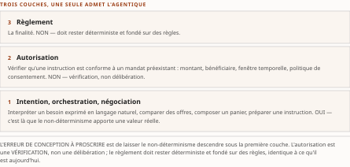
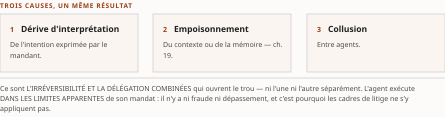

# Chapitre 36 — Prospective : AP2 sur les rails canadiens ?

*Livre III — Encadrer : orchestration en entreprise, cadre réglementaire canadien et terrain financier.
Troisième mouvement — le terrain canadien (ch. 31-36). **Dernier chapitre du Livre**, et **le seul de la
somme dont le titre porte un point d'interrogation** — ce n'est pas une coquetterie de rédaction :
c'est la description exacte de son objet.*

| Champ | Valeur |
|---|---|
| **Statut** | **Brouillon de rédaction, non publiable** — **rédigé le 27 juillet 2026, sur instruction d'auteur, la porte G-3 étant alors ouverte** (socle consolidé à zéro entrée) et le volet résiduel de **G-1** non instruit. ⚠ **La règle cardinale du PRD §5 est enfreinte.** Voir la note de statut, § 36.6. ⚠ **G-3 est franchie depuis le 28 juillet 2026** (PRD v0.14 — socle consolidé, 159 entrées **S-001** à **S-159**), **et la pièce n'y est pas re-adossée** : *une porte franchie après coup ne requalifie pas un texte écrit avant elle.* ⚠ **CA-IV-11 et CA-IV-13 demeurent insatisfaites** — *aucune relecture par un tiers distinct du rédacteur.* ⚠ **G-4 ne conditionne pas ce chapitre** ; ⚠ **D-9 ne le bloque pas.** ⚠ **Ce chapitre porte la lacune la plus explicite du Livre — et c'est son sujet même** |
| **Date de gel** | **27 juillet 2026** — gel unique, **D-1 prise** (registre : [`gel-2026-07-27.md`](../PRD/gel-2026-07-27.md)). ⚠ **Un point de ce chapitre a été instruit par G-1 et il faut le lire** : *la **divergence AP2 / gouvernance** a été **consommée par extraction** au titre du volet Livre I du gel* — voir § 36.1. ☑ **Le volet de FAITS du résidu est levé le 28 juillet 2026** ([registre](../PRD/gel-2026-07-28-volet-residuel.md)) ; ☐ **les obligations de pièce du Livre III restent dues**, dont **les quatre préimpressions du § 36.5**. Gels de source consommés : **16-17 juillet 2026** (Vol. II *Monographie* ch. 16) et **juin 2026** (Vol. I *Monographie* §5.13) |
| **Socle mobilisé** | ⚠ **La pièce n'est adossée à aucune entrée du socle consolidé** — elle est antérieure à sa constitution, et **le ré-adossement est dû**. Les énoncés résolvent contre le **Vol. II *Monographie* ch. 16** — **F-04** et **F-29** conservant leurs niveaux d'origine — et contre le **Vol. I *Monographie* §5.13**, qui entre **en [C]** (PRD §7.1). ☑ **Les correspondances sont relevées, non consommées** : **F-04** → **S-004**, **F-29** → **S-027**, et l'état instruit du transfert de gouvernance → **S-090**. ⚠ **Le § 36.5 relève d'un régime encore inférieur** : *préimpressions dont **seuls les résumés ont été consultés** — **repérages [C], jamais des faits**.* **Aucun énoncé n'est central au sens de CA-IV-01** — *et la borne tient parce que la pièce n'est pas adossée, non parce que le socle serait vide* |
| **Garde-fous balayés** | ⚠ **Décomptes re-mesurés au commit du 28 juillet 2026, règle de comptage de la décision 16 du TOC** : *ils portent sur le **marqueur littéral** dans le **corps** — en-tête et note de statut exclus —, et **là où le garde-fou est appliqué sans que son identifiant soit écrit, c'est le domaine balayé qui est déclaré, sans cardinal**.* Vol. II — ⚠ **garde-fou d'entrée : ne pas combler la lacune par de la fiction** — *aucune formule fixe ne le porte ; il est **appliqué aux § 36.0, § 36.1, § 36.3, § 36.4 et § 36.5**, et **le décompte n'est donc pas annoncé*** ; ⚠ **réserve F-29 — ne jamais écrire « lancé » ni « en production » du rail en temps réel** : *« lancé » est écrit **une fois**, à la synthèse, dans la formule qui l'interdit ; « en production » **quatre fois**, § 36.1 (deux) et § 36.3 (deux), **toujours au négatif, dans la réserve, ou dans la description de la faute qu'elle interdit*** ; **formulation imposée PRDPlan Vol. II §4.4 — « quatre *cibles successives* » : une occurrence**, § 36.1, *et la forme proscrite « quatre reports » une fois au même endroit, là où la somme la cite pour l'interdire* ; **R-4 : une occurrence du sigle**, § 36.1 ; ⚠ **R-8 (le sigle « ACP » jamais nu) : une occurrence du sigle**, § 36.2.4, **avec renvoi au ch. 7 § 7.5** ; **PRD §8.4 (neutralité fournisseur) : le renvoi n'est pas écrit au corps** ; *le garde-fou est **appliqué au § 36.2**, six protocoles ou réseaux y étant **désignés sans être nommés** — parade de péremption maintenue par la décision 15a du TOC — et **aucun recommandé*** ; **décision 7 (deux séries « Q n ») : appliquée aux § 36.0 et § 36.4** ; **R-5 : une occurrence du sigle**, § 36.2.7 ; **R-1 à R-3, R-6, R-7 : zéro occurrence**. Vol. III — **R-14 (trois degrés d'absence) : une occurrence du sigle**, § 36.1 — ⚠ *et les degrés se marquent en toutes lettres : « degré 3 » **deux fois**, § 36.1 et § 36.3 ; « fait négatif vérifié » **deux fois**, § 36.1 et § 36.4, ⚠ **l'une et l'autre pour désigner celui d'un AUTRE chapitre** — le ch. 32 § 32.4 —, **jamais un fait de la présente pièce*** ; **R-09 : deux occurrences du sigle**, § 36.2.4 et § 36.5 ; **R-11 : zéro occurrence du sigle** — *le garde-fou est appliqué aux § 36.1 et § 36.4, « vise » puis « visé » y étant écrits* ; **R-02 : une occurrence du sigle**, § 36.2.2 ; **R-01, R-03 à R-08, R-10, R-12, R-13 : zéro occurrence** |
| **Volumétrie cible** | ≈ **5 000 mots** de corps (§ 36.0 à § 36.5), **cible dérivée** de l'enveloppe du Livre — 90 000 mots, inchangés du TOC v0.25 à la v0.30 — au prorata des sections et des **sept sous-sections** du § 36.2. ☑ **Décompte publiable depuis G-2** ; la mesure réelle est portée au [`README.md`](README.md) du dossier. ⚠ **D-4 interdit l'amputation comme le gonflement** |

> **Thèse** *(citée depuis le [`TOC.md`](../PRD/TOC.md) v0.25, entrée du chapitre 36 — **explicitement prospectif** ; ☑ **forme inchangée à la v0.30**, re-collationnée par copie le 28 juillet 2026, décision 17)* — aucune source ne documente l'articulation AP2 ↔ rails canadiens — le chapitre pose le cadre d'analyse et les conditions de possibilité, sans affirmer (énumérer des conditions n'est pas prédire).

---

⚠ **La thèse a été collationnée contre le texte rédigé de sa source avant la rédaction** (décision 14 du
TOC). **Domaine de balayage : une thèse examinée, zéro réalignée.** Elle reprend la thèse du Vol. II
*Monographie* ch. 16 en y ajoutant la glose « **énumérer des conditions n'est pas prédire** », ⚠ *qui
est **une phrase du corps de la source, promue en thèse par le plan*** — *et qui **ne lui ajoute aucune
portée**.*

## § 36.0 — Ouverture : ce qu'un chapitre prospectif change, et ce qu'il ne change pas

**Les cinq chapitres qui précèdent ont établi la couche d'interopérabilité financière canadienne** : *les
durcisseurs du domaine (**ch. 31**), le cadre bancaire et son standard technique non désigné (**ch. 32**),
la couche sémantique des paiements et le calendrier du rail en temps réel (**ch. 33**), les
sous-domaines financiers — banque, assurance, patrimoine — (**ch. 34**), et l'état déclaré des
institutions (**ch. 35**).* *Le **Livre I** a établi,
de son côté, la pile protocolaire agentique, dont le protocole dédié à la transaction (**ch. 10**).*

**La question s'impose d'elle-même : que se passe-t-il là où les deux se rencontrent ?**

⚠ **La réponse tient en une phrase, et elle est désagréable : *le socle ne documente pas cette
rencontre*.** *Aucune source, primaire ou secondaire, ne l'atteste.* ⚠ **C'est une lacune reconnue — la
lacune PRD Vol. II §10.5 — et ce chapitre en est le chapitre porteur** ; *son état final sera enregistré
au **ch. 49 § 49.12.1**, qui la reprend par son identifiant.*

⚠ ***Un chapitre prospectif, dans une somme tracée, n'abaisse pas le seuil de preuve : il change
d'objet.*** *Il ne dit pas **ce qui adviendra** — il dit **ce qu'il faudrait qui fût vrai** pour que la
question reçoive un jour une réponse, il dit **ce que le socle établit de chacune de ces conditions**,
et il dit **ce qu'il faudrait observer pour trancher**.* ⚠ ***Aucune des trois opérations n'exige de
deviner. Toutes les trois exigent de nommer précisément l'ignorance*** — *ce qui est un exercice plus
difficile, et plus utile, que de la meubler.*

⚠ **Le garde-fou du chapitre tient en une ligne** (assignation du TOC v0.25) : ***ne pas combler la
lacune par de la fiction.***

⚠ **Une convention de renvoi s'impose d'entrée** (décision 7 du TOC) : *le Vol. II porte **deux séries
« Q n » indépendantes dont les étiquettes se recouvrent** — celle **d'agenda** (*Monographie* ch. 21
§21.2), **six questions**, dont le **ch. 27 § 27.7** porte Q4 et le **ch. 30 § 30.3.1** porte Q5 ; et
**celle du présent chapitre** (*Monographie* ch. 16 §16.3), **cinq questions de la série AP2 / rail en
temps réel**.* ⚠ ***La série se nomme à chaque renvoi***, *sous peine de désigner deux objets par une
même étiquette.*

## § 36.1 — État de la question

**Commençons par ce que le socle établit de chaque côté.**

**Du côté du protocole.** Le protocole de paiement agentique a été **annoncé le 16 septembre 2025**
comme protocole compagnon du protocole agent-agent, dédié aux transactions pilotées par agents — ⚠ *le
socle **date l'annonce au jour près, le lancement au mois près seulement*** (Vol. II F-04). En **avril
2026**, **plus de soixante organisations** des paiements et des services financiers **déclarent leur
soutien**, selon le communiqué de la **Linux Foundation** du **9 avril 2026** — ⚠ ***le soutien déclaré
ne vaut pas déploiement en production***, et le **ch. 7** en a fait la démonstration une fois pour toute
la somme. *Le socle en nomme sept, qu'il n'y a pas lieu de reprendre ici.*

⚠ **Cette liste de sept appelle une observation et *une seule mise en garde*.** *L'observation : **le
socle n'attribue à aucune des sept un rôle sur un rail de paiement canadien**, et **n'établit la
nationalité d'aucune**.* ⚠ **La mise en garde, qui est la plus importante du chapitre** : ***le socle
donne une liste illustrative, pas la liste complète des soixante et plus***. ⚠ ***On ne peut donc pas en
conclure qu'aucune organisation canadienne ne figure parmi celles qui déclarent leur soutien.***

⚠ ***L'absence est ici une absence de documentation, non une absence documentée*** — *degré 3 de
l'échelle R-14 du Vol. III* — *et **la distinction sépare la présente lacune du fait négatif vérifié du
ch. 32 § 32.4**, où quatre chaînes ont été cherchées dans trois textes nommés.*

⚠ **Un point de cette section a été instruit depuis, et il faut le lire exactement.** *Le Vol. II écrit
que **le protocole est celui que la conclusion de son ch. 1 a dû explicitement exclure de son constat de
consolidation**, faute de transfert de gouvernance documenté* — ⚠ **et le Vol. I *Monographie*, à son
§5.13.4, décrit au contraire un transfert de standardisation vers les groupes de travail d'une
alliance, daté du 28 avril 2026, avec une version de spécification.** ⚠ ***Ce n'est pas une
contradiction : ce sont deux états datés d'un même objet*** — *le Vol. II gèle au 16-17 juillet 2026
**sur son propre socle**, le Vol. I décrit un fait d'avril 2026 **en [C]**.* ☑ **La divergence a été
consommée par extraction au titre de G-1**, *volet Livre I, au registre du gel du 27 juillet 2026* —
⚠ **et la somme retient l'état
instruit** : *le transfert est documenté.* ⚠ ***Le Vol. II ne se corrige pas pour autant*** : *son
énoncé était exact **à son gel et sur son socle**, et **une lacune de couverture datée est une
information, non un défaut**.*

**Du côté du rail.** ⚠ ***Le rail canadien de paiement en temps réel n'est pas en production à la date
de gel*** — *les tests industriels sont en cours* (**ch. 33 § 33.2**, qui en est le siège). *Paiements Canada
**vise** un lancement au **T4 2026** ; ⚠ **et la formulation est imposée : « la cible a été
successivement reportée : 2019, puis 2022, puis 2023, puis 2026 » — ce sont
*quatre cibles successives*, non quatre reports**.* ⚠ *Paiements Canada annonce en outre un
système **nativement conforme à la couche sémantique dès son lancement** et un **déploiement graduel se
poursuivant en 2027** — ⚠ **l'un et l'autre sous la même condition que la cible elle-même**, et
**R-4 impose de l'attribuer plutôt que de l'affirmer au futur catégorique**.*

**Le constat central peut désormais être posé sans détour.**

> ⚠ **Question** : le protocole de paiement agentique est-il **employé, expérimenté, ou seulement
> envisagé de source documentée**, sur un rail de paiement canadien ?
>
> **Recherche menée** (trois passes de constitution du socle du Vol. II, puis revalidation du 16 juillet
> 2026, qui a re-consulté directement la page officielle du rail **sans y relever de mention du
> protocole**, ⚠ *mais dont le périmètre était la revalidation des faits chauds, non la présente
> question*). ⚠ **Pourquoi elle échoue** : ***les deux corpus ne se rencontrent nulle part au socle***
> — *le socle ne rapporte, des sources primaires du protocole, **aucun rail de paiement canadien**,
> étant entendu qu'**il n'en porte pas la liste complète des soutiens** ; et il ne rapporte, des pages du
> rail, **aucune mention du protocole**.* ⚠ ***Aucune vérification par recherche exhaustive de chaînes
> n'a été menée dans les sources primaires de l'un ni de l'autre*** — *à la différence du ch. 32 § 32.4.*
>
> ⚠ **En l'absence de source primaire, la question reste ouverte ; *aucune inférence n'est proposée
> ici*.**

## § 36.2 — Interopérabilité B2B, commerce et paiements agentiques en finance

Section **reçue du Vol. I *Monographie* §5.13**, ⚠ **arrivée depuis le ch. 34**, dont la table de
couverture déclare le départ. ⚠ **Toute sa matière entre en [C]**.

⚠ **Cette section déplace la focale du périmètre interne de l'institution vers *l'espace
inter-entreprises* où les agents négocient, autorisent et règlent des paiements** — ***le cas limite que
tous les durcisseurs du ch. 31 amplifient simultanément***, *puisque l'argent y circule entre
organisations distinctes, sur des rails dont certains sont irrévocables.*

⚠ **La mécanique du commerce agentique a été posée au générique** au **ch. 10** et au **ch. 24 § 24.7** ;
*le propos ici n'est pas de la réinventer mais de **l'instancier sous la contrainte financière**.*

### 36.2.1 La pile à trois couches

⚠ **Le patron architectural qui commande toute la section est *une stratification de la chaîne de
paiement en trois couches*, posée une fois pour décider où l'agentique a le droit d'intervenir.**

| Couche | Ce qui s'y joue | L'agentique y est-elle admise ? |
|---|---|---|
| **Intention, orchestration, négociation** | interpréter un besoin exprimé en langage naturel, comparer des offres, composer un panier, préparer une instruction | ⚠ **oui** — *c'est là que le non-déterminisme **apporte une valeur réelle*** |
| **Autorisation** | vérifier qu'une instruction est **conforme à un mandat préexistant** : montant, bénéficiaire, fenêtre temporelle, politique de consentement | ⚠ **non** — *vérification, non délibération* |
| **Règlement** | ⚠ **la finalité** | ⚠ **non** — *doit rester **déterministe et fondé sur des règles**, identique à ce qu'il est aujourd'hui* |

: Tableau 36.1 — La stratification de la chaîne de paiement, reprise du Vol. I en **[C]**. ⚠ ***L'erreur de conception à proscrire est de laisser le raisonnement probabiliste de l'agent franchir la frontière vers les deux couches basses.***

⚠ *La répartition est reprise d'un cadrage institutionnel — la note du **Fonds monétaire international**
signée **Davidovic et Tourpe**, **IMF Note 2026/004, 22 avril 2026** —, qui formule la frontière
ainsi* : ***l'agentique remodèle les paiements en s'insérant dans l'intention et l'orchestration, non en
remplaçant les rails de règlement.*** ⚠ **C'est la même frontière que le ch. 31 § 31.1.1 pose sous le nom
d'irréversibilité**, *et le **ch. 34 § 34.7.1** l'a reprise en clôture du bloc financier.*

⚠ **Une tension juridique demeure non résolue à la frontière ainsi tracée, et la source la signale
plutôt qu'elle ne la tranche** : *l'**authentification forte du client** est conçue pour un payeur
**présent**, alors que l'agent agit **quand le payeur ne l'est pas** — et **le cadre européen des
services de paiement ne tranche pas la délégation à un acteur-machine**.* ⚠ *La borne de juridiction est celle de la source et
ne se retire pas.*

### 36.2.2 Le mandat vérifiable comme exigence issue de l'irréversibilité

⚠ **Le *mandat vérifiable* n'est pas une commodité de produit mais *une exigence dérivée de
l'irréversibilité*.**

**Le raisonnement est direct** : *si l'action de règlement **ne peut être annulée**, **le contrôle ne
peut s'exercer qu'avant l'exécution**, et **il doit prendre une forme qui survive à la transaction et
reste opposable après coup**.*

*D'où la nécessité d'un **artefact cryptographique** — une **intention signée** portant des **limites
explicites** : montant maximal, bénéficiaire ou catégorie de marchand, durée de validité, conditions de
déclenchement — **émis ou contresigné par l'humain ou l'institution responsable**, et **présenté à la
couche d'autorisation avant tout règlement**.*

⚠ **La chaîne de mandat qui porte cet artefact est au ch. 17**, siège unique dans la somme ; *elle n'est
pas reconstruite ici.* ⚠ **Et le triptyque d'identité qui l'ancre — client, entreprise, agent — est au
ch. 18 § 18.1**, *siège unique également.*

⚠ **Un mécanisme se qualifie par ce que sa spécification démontre** (R-02 du Vol. III) : *une intention
signée **démontre** qu'un mandat existait et ce qu'il portait ; **elle ne démontre pas** que l'action
exécutée en relevait — ⚠ **et c'est exactement le trou que le § 36.2.6 nomme**.*

### 36.2.3 Rails de cartes : l'insertion de l'émetteur

⚠ **Sur les rails de cartes, le critère d'insertion de la banque émettrice est qu'elle s'y insère *sans
modifier son modèle de responsabilité*.**

*Le mécanisme est **l'extension de la tokenisation existante** : là où un jeton de carte classique
substitue un identifiant de surface au numéro de compte réel, **le jeton de paiement agentique enrichit
ce jeton d'un contexte supplémentaire** liant **l'agent autorisé**, **le périmètre marchand admissible**
et **la politique de consentement applicable**.*

⚠ ***L'intérêt pour l'émetteur est de réutiliser l'infrastructure et les règles de responsabilité déjà
éprouvées plutôt que d'inventer un régime distinct.***

⚠ *Les deux grands réseaux ont annoncé **des cadres concurrents qu'il faut distinguer par statut** : le
premier a dévoilé une technologie de paiement agentique **le 29 avril 2025**, prolongée **le 10 juin
2026** ; le second a introduit un protocole d'agent de confiance s'appuyant sur des signatures de
message et une authentification web.* ⚠ **Neutralité fournisseur** : *deux réseaux désignés, aucun
nommé — parade de péremption (décision 15a du TOC) —, **aucun recommandé*** ; ⚠ **et tous les jalons
relèvent de ressources vivantes et de chiffres non audités, à re-vérifier au moment de citer, en
distinguant l'annonce, l'aperçu et la disponibilité générale.**

⚠ **Un de ces jalons relève d'un régime plus bas encore, et la réserve se dit à son occurrence** : *la
**prolongation du 10 juin 2026** est une affirmation que le **Vol. I déclare lui-même hors de son propre
corpus bibliographique**, « à sourcer à la rédaction ».* ⚠ ***Elle est citable avec cette réserve, jamais
versable au socle*** — *décision de régime du PRD §7.1 : **[C] atteste une vérification des références,
et une affirmation hors corpus n'a pas même reçu celle-là**.*

Lecture de l'auteur — ***l'insertion reste un enrichissement de jeton, pas une refonte du rail*** :
*l'enjeu d'intégration consiste à **projeter le contexte agentique sur les attributs de jeton déjà gérés
par la plateforme de tokenisation**, **sans toucher au moteur de règlement ni aux règles de
rétrofacturation existantes**.* **Ce que le socle établit** : le mécanisme, et celles des annonces que
le corpus du Vol. I porte. **Ce qu'il n'établit pas** : cette conséquence d'intégration, qui est une
lecture reprise du Vol. I — ⚠ *ni la prolongation du 10 juin 2026, qui n'y est pas.*

### 36.2.4 Protocoles ouverts de mandat et de commerce

*À côté des rails propriétaires, **un ensemble de protocoles ouverts** matérialise le mandat vérifiable
du § 36.2.2 **sous forme d'objets signés et échangeables**.*

**Le plus explicite structure le paiement agentique autour de mandats signés** — *intention, panier,
paiement* — ⚠ ***constituant précisément la preuve cryptographique que l'institution doit vérifier,
journaliser et pouvoir opposer***. *Il est conçu pour le cas où **l'humain n'est pas en ligne au moment
du règlement**, ce qui en fait la réponse directe à la tension d'authentification forte du § 36.2.1* ;
⚠ **et sa
standardisation a été transférée aux groupes de travail d'une alliance, à une version datée du 28 avril
2026** (R-09 du Vol. III : *le statut se dit à chaque mention*).

⚠ **Plusieurs piles concurrentes ou complémentaires coexistent, et l'une d'elles impose une
désambiguïsation.** *Un **protocole de commerce agentique** porté par deux éditeurs partage son sigle
avec **le protocole de communication d'agents** traité aux **ch. 7 et ch. 10**.* ⚠ ***Il s'agit d'une
homonymie, et le sigle n'est jamais employé nu dans la somme*** (R-8 du Vol. II) : ⚠ **l'encadré de
désambiguïsation à quatre branches est au ch. 7 § 7.5, siège unique**, *et il n'est pas dupliqué ici.*
*Deux autres piles complètent l'inventaire — un protocole de commerce universel et un rail de
micropaiement natif du web.* ⚠ **Neutralité fournisseur** : *quatre piles désignées, aucune nommée,
**aucune recommandée**.*

Lecture de l'auteur — ⚠ ***pour une institution financière, l'intérêt de ces protocoles tient moins à
leur transport qu'à l'objet « mandat signé » qu'ils rendent standard*** : *un artefact qu'un système
d'autorisation peut **vérifier puis archiver comme preuve**.* ⚠ **La décision d'architecture pratique
consiste à traiter le mandat comme *entrée canonique de la couche d'autorisation*** (§ 36.2.1),
*quel que soit le rail de règlement aval, **de sorte que la piste d'audit repose sur un objet signé
homogène plutôt que sur des journaux propriétaires hétérogènes*** (**ch. 31 § 31.3.2**). **Ce que le
socle établit** : les protocoles et leurs objets. **Ce qu'il n'établit pas** : cette décision, qui est
une lecture.

### 36.2.5 Règlement machine-à-machine, jetons de valeur régulés et dépôts tokenisés

*Pour le **règlement machine-à-machine**, le critère d'arbitrage de rail est que **la banque conserve une
place native par trois leviers** : **l'émission** de l'instrument, **sa garde** et **la conformité** qui
l'entoure.*

⚠ **Trois objets distincts, souvent confondus dans le discours de marché, doivent être tenus
séparés** :

1. **Le jeton de valeur public régulé** — *un **actif au porteur** dont l'émission et la circulation
   relèvent, **en Europe**, d'un régime de crypto-actifs* (**ch. 30 § 30.2.5**) — ⚠ *la borne de
   juridiction est celle de la source et ne se retire pas.*
2. ⚠ **Le dépôt tokenisé bancaire** — *la représentation d'un dépôt **inscrit au bilan d'une banque**,
   **objet de nature juridique différente** : il **demeure de la monnaie de banque commerciale** et **ne
   sort pas du périmètre prudentiel**.* ⚠ ***Cette distinction est le point d'architecture central et ne
   doit pas être effacée.***
3. **Le jeton de carte agentique** du § 36.2.3 — ⚠ *qui **n'est pas un instrument de règlement** mais
   **un porteur d'autorisation sur un rail existant**.*

⚠ *De nouvelles infrastructures de règlement orientées paiement émergent, **mais leur maturité reste
celle d'un réseau en construction*** — **ressources vivantes, à re-vérifier.**

### 36.2.6 Litige, rétrofacturation et le trou de responsabilité

⚠ **L'irréversibilité et la délégation, combinées, ouvrent *un trou de responsabilité que les cadres de
litige existants ne couvrent pas*.**

*Le patron de risque opérationnel est celui de **l'achat agentique « non intentionnel »*** : ***un agent
exécute, dans les limites apparentes de son mandat, une transaction que l'humain n'aurait pas
voulue*** — *par dérive d'interprétation de l'intention, par empoisonnement de contexte ou de mémoire
(**ch. 19**), ou par collusion entre agents (**ch. 31 § 31.3.4**).*

⚠ **Or les cadres de rétrofacturation ont été conçus pour des fraudes ou des défauts de marchand, *non
pour une instruction autorisée mais non voulue* émise par un acteur-machine** ; ⚠ **et sur les rails
irréversibles, la rétrofacturation n'existe tout simplement pas.**

*La voie de résolution privilégiée est **le modèle en boucle fermée** : une couche de confiance partagée
entre participants, des certificats d'identité d'agent et des jetons à portée bornée **qui rendent la
résolution déterministe*** — ⚠ ***on peut alors établir, à partir du mandat signé et de l'identité de
l'agent, si l'instruction relevait ou non du périmètre.***

Lecture de l'auteur — ⚠ ***tant que l'intention déléguée n'est pas elle-même un objet vérifiable,
l'imputation de responsabilité reste indécidable.*** *La fermeture proposée **convertit un problème
normatif — qui répond d'une action non voulue — en un problème vérifiable — l'action était-elle dans le
périmètre du mandat signé ?***, *ce qui est **la condition pour qu'un mécanisme de litige déterministe
puisse exister**.* **Ce que le socle établit** : le trou et la voie proposée. **Ce qu'il n'établit
pas** : que cette conversion suffise. ⚠ **Le ch. 29 § 29.3 en porte le versant canadien**, *et il ne le
referme pas davantage* ; ⚠ **la sémantique d'effet qu'une réconciliation suppose est au ch. 48.**

### 36.2.7 L'angle Canada et Québec

⚠ **L'instanciation canadienne illustre la stratification du § 36.2.1 *sur une infrastructure nationale
encore en construction*.**

*Le rail canadien de paiement en temps réel constitue **le pendant national de la couche de règlement
déterministe** : son **règlement administratif** — que la source appelle « cadre de règles » — **doit
entrer en vigueur le 24 août 2026**, et le lancement est
annoncé par Paiements Canada **phasé à partir du quatrième trimestre 2026**, avec un élargissement en
2027, **un règlement irrévocable** et la couche sémantique commune* — ⚠ **ressource vivante**. ⚠ **Le
ch. 33 en est le siège**, et ses statuts y sont dits.

⚠ **Ce qui relève d'ici est *l'insertion agentique au-dessus de ce rail*** : ***l'agent prépare et soumet
l'instruction, mais la finalité irrévocable impose le patron du ch. 31 § 31.1.1 — préparation par
l'agent, libération humaine sur l'irréversible.***

⚠ *Côté monnaie tokenisée, **un cadre fédéral a été annoncé dans un contexte budgétaire et de réforme du
secteur des paiements*** — ⚠ **annonce, non texte adopté** ; *et **R-5 du Vol. II interdit d'en décrire
le contenu**.*

## § 36.3 — Conditions de possibilité

⚠ ***Énumérer des conditions de possibilité n'est pas prédire.*** *C'est **dire ce qu'il faudrait
établir**, et **rapporter chaque condition à ce que le socle en porte — souvent rien**.*

**Trois conditions se dégagent, dans un ordre qui n'est pas celui de l'importance mais celui de
l'antériorité logique.**

**Première condition : *le rail doit exister*.** ⚠ **C'est la plus élémentaire, et elle n'est pas
remplie.** *Le rail est en tests industriels ; ⚠ **il n'est pas en production**
(réserve F-29 du Vol. II).* ⚠ ***Toute articulation du protocole avec ce rail est donc, à la date de gel, une
articulation avec un système qui ne fonctionne pas encore.*** *Du **16 avril 2024** — reprise du
programme — au **27 juillet 2026**, il s'est écoulé **plus de vingt-sept mois** de construction, de
bascules de tests internes puis d'acceptation, **sans lancement**.*

⚠ **Les deux calendriers ne sont pas de même nature, et c'est un point que le lecteur pressé
manquera.** *Le socle documente pour le rail **une chronologie jalonnée** — composante de compensation
et de règlement complétée au T3 2025, tests internes au T4 2025, tests d'acceptation au T1 2026, tests
industriels à la mi-2026 — **assortie de la réserve qu'il s'agit de communications de Paiements
Canada**. Pour le protocole, il ne documente que **deux points** : **une annonce** et **un décompte de
soutiens déclarés**.* ⚠ ***Aucun jalon de version,
aucune étape de maturité, aucun déploiement.***

Lecture de l'auteur — ⚠ ***l'asymétrie de documentation entre les deux objets est elle-même le fait le
plus solide de ce chapitre.*** **Ce que le socle établit** : *qu'un opérateur de rail publie **une
chronologie jalonnée et révisable**, et que, pour le protocole, on ne dispose que **d'une date d'annonce
et d'un décompte de soutiens déclarés**.* ⚠ **Ce qu'il n'établit pas** : *que le second soit **immature**
— **seulement que sa maturité n'est pas documentée** par les sources dont dispose la somme.*
⚠ ***Un architecte qui inverserait la charge de la preuve, et lirait l'absence de jalons comme une
preuve d'inexistence, commettrait la faute symétrique de celui qui lit un décompte de soutiens comme un
décompte de mises en production*** — *et le **ch. 7** a posé cette seconde faute une fois pour toute la
somme.*

**Deuxième condition : *les couches sémantiques doivent se rejoindre*.** *Paiements Canada annonce le
rail nativement conforme dès son lancement.* ⚠ **Ce que la *richesse* de ces données changerait pour des
agents, en revanche, n'est traité par aucun chapitre de la somme** : *le **ch. 33 § 33.4** a établi que le
socle **n'en documente aucun attribut** — ni structure des données de remise, ni granularité des
identifiants — **et c'est la raison pour laquelle ce chapitre-là ne l'écrit pas**.*

**La question qui appartient à ce chapitre est plus étroite** : *le socle établit-il **une correspondance
entre le protocole et la couche sémantique** ?* ⚠ ***Il n'en établit aucune.*** *Le socle **ne porte pas
l'anatomie technique du protocole** : il en donne **la fonction déclarée** et rien de plus.* ⚠ **Le
ch. 10 le traite dans les limites de ce que cette entrée documente ; ce chapitre ne peut aller
au-delà.** ⚠ ***Toute phrase décrivant comment un mandat de paiement agentique se traduirait en message
de la couche sémantique serait une invention, et la somme n'en produira pas.***

**Troisième condition : *la gouvernance doit être documentable des deux côtés*.** *Côté rail, le socle
nomme les partenaires de livraison et d'exploitation et date l'entrée en vigueur du règlement
administratif (**ch. 33 § 33.3**).* ⚠ **Il n'établit rien des règles d'accès qui s'appliqueraient à un
tiers, agentique ou non** — *degré 3.*

⚠ **Le cas d'un exploitant de rails canadien mérite d'être signalé pour ce qu'il *n'est pas*** : *le
socle **ne le documente qu'en qualité de partenaire de livraison du rail**, ayant livré la composante
d'échange en juin 2023.* ⚠ ***Il n'établit rien de ses rails propres*** — *et **la question du titre de
ce chapitre, pour ce versant-là, ne peut donc même pas être instruite**.*

⚠ **Côté protocole, l'état a changé depuis le gel du Vol. II** : *le § 36.1 a exposé le transfert
documenté, **consommé par extraction au titre de G-1**.* ⚠ **Cela lève le premier terme de cette
condition, non le second** : *un transfert de standardisation **documente une gouvernance** ; il **ne
documente pas des règles d'accès à un rail canadien**.*

## § 36.4 — Questions de recherche

⚠ **De ce qui précède se déduit un programme, et *c'est le véritable livrable du chapitre*.**

⚠ **Cinq questions — série AP2 / rail en temps réel du Vol. II (*Monographie* ch. 16 §16.3)** —,
*chacune **falsifiable**, chacune **assortie de ce qui la trancherait**.* ⚠ ***À ne pas confondre avec la
série d'agenda du même volume***, dont **Q4 est au ch. 27 § 27.7** et **Q5 au ch. 30 § 30.3.1**
(décision 7 du TOC).

| | Question | ⚠ Ce qui la trancherait |
|---|---|---|
| **Q1** | Parmi les **plus de soixante organisations** dont le communiqué de la **Linux Foundation** du **9 avril 2026** rapporte le soutien déclaré, **s'en trouve-t-il une qui opère un rail de paiement canadien ou y participe ?** | **la liste complète** des organisations, ⚠ *dont le socle ne nomme que sept* |
| **Q2** | **La gouvernance du protocole fait-elle l'objet d'un transfert à une fondation neutre ?** | un communiqué de la **Linux Foundation** ou de l'éditeur du protocole. ☑ ⚠ **Instruite depuis** : *le § 36.1 expose le transfert documenté, consommé par extraction au titre de G-1* — ⚠ ***la question est close pour le transfert, non pour ce qu'il emporte*** |
| **Q3** | **Une correspondance entre le protocole et la couche sémantique des paiements est-elle documentée par une source primaire ?** | **la spécification du protocole elle-même**, ⚠ *que le socle ne porte pas* |
| **Q4** | **Le règlement administratif du rail, en vigueur le 24 août 2026, traite-t-il de l'initiation d'un paiement par un tiers ou par un agent ?** | **le texte publié à la *Gazette du Canada***, ⚠ *dont le socle atteste **l'existence et les dates, non le contenu*** (ch. 33 § 33.3) |
| **Q5** | **Le lancement du rail visé au T4 2026 a-t-il lieu ?** | Paiements Canada. ⚠ *C'est **l'événement qui lèverait ou maintiendrait la réserve du socle sur la production**, et il figure aux conditions de péremption* (**ch. 50**) |

: Tableau 36.2 — Les cinq questions de la série AP2 / rail en temps réel, avec ce qui trancherait chacune. ⚠ **Une seule a bougé depuis le gel du Vol. II, et elle n'est close qu'en partie.**

⚠ **Ces cinq questions sont distinctes d'une autre lacune ouverte du même bloc** : *celle de la
**désignation de l'organisme de normalisation technique du cadre bancaire**, portée par le **ch. 32
§ 32.4**.* ⚠ ***Les confondre fusionnerait deux ignorances que le socle tient séparées*** — *et elles ne
sont pas même du même degré : celle du **ch. 32** est un **fait négatif vérifié**, celle du présent
chapitre une **absence de documentation**.*

⚠ **Une quatrième famille de conditions existe, et ce chapitre ne la traite pas** : *les **conditions
réglementaires**. Un paiement initié par un agent dans une institution financière canadienne
rencontrerait **le régime du deuxième mouvement** (ch. 25 à 30), et **le croisement systématique de la
pile protocolaire avec les exigences canadiennes appartient au ch. 42**, au Livre IV.* ⚠ ***Le signaler
ici est nécessaire ; l'instruire ici serait empiéter.***

## § 36.5 — L'économie d'agents existe déjà, sur d'autres rails — relève à instruire

⚠ **Cette section est *une relève du plan*, et son régime est le plus bas de tout le Livre.**

*Elle relève de la **relève v0.11 du TOC**, dont le régime est déclaré sans ambiguïté* : ⚠ ***des
préimpressions dont seuls les résumés ont été consultés — des repérages [C], jamais des faits.***

⚠ **Les quatre préimpressions sont nommées par leur identifiant, et elles doivent l'être** : *le critère
de clôture déclaré plus bas est **leur extraction à leur source primaire** — **une source qu'on ne peut
pas retrouver n'est pas instruisible**, et la parade de péremption qui autorise ailleurs à taire une
dénomination commerciale ne couvre pas l'identifiant d'une source qu'un lot doit instruire.*

**Ce que la relève rapporte.** *Une **étude empirique de juin 2026** (**arXiv 2606.25876**) mesure **des
millions de transactions machine-à-machine quotidiennes** sur **des rails de micropaiement natifs du
web** et **d'enregistrement sur chaîne**, ⚠ **et en établit la fragilité** : identité, autorisation et
paiement **non interopérables**. Deux analyses datées relèvent par ailleurs **des vulnérabilités du
rail de paiement** (**arXiv 2605.30998**) et **la manipulabilité de la réputation du registre**
(**arXiv 2606.26028**). Et **un cadre d'encadrement** — une « économie bac à sable », avec des axes de
perméabilité et d'intentionnalité — **est proposé par des chercheurs d'un laboratoire industriel**
(**arXiv 2509.10147**).*

⚠ **Le régime se dit à chaque mention** (R-09 du Vol. III) : ***ce sont des préimpressions, non des
articles évalués par les pairs ; seuls leurs résumés ont été consultés ; et aucune n'entre au socle.***

⚠ **Et la portée se borne exactement** : ***ces rails parallèles sont un contre-scénario aux conditions
de possibilité du § 36.3, pas un fait canadien.***

Lecture de l'auteur — **ce que la relève permet de dire, et rien de plus** : *l'hypothèse implicite du
chapitre — **qu'une économie d'agents attendrait un rail national et un protocole mûr** — **n'est pas
la seule possible**.* ⚠ *Une économie de transactions machine-à-machine **peut se constituer sur des
rails que ni le régulateur canadien ni les institutions du ch. 35 n'ont conçus**, et **la relève
rapporte qu'elle le fait déjà ailleurs**.* ⚠ **Ce que le socle établit** : *rien — **la relève n'est pas
au socle**.* ⚠ **Ce qu'elle signale** : *une **direction d'instruction**, dont le critère de clôture
serait **l'extraction des quatre préimpressions à leur source primaire — arXiv 2606.25876, 2605.30998,
2606.26028 et 2509.10147 —**, et **leur confrontation aux trois conditions du § 36.3**.* ⚠ ***Le volet
résiduel de G-1 ne l'a pas exécutée*** : *son **volet de faits**, levé le 28 juillet 2026, portait sur
les **entrées du socle consolidé**, et **une relève n'en est pas une**.*

⚠ **Et le garde-fou du chapitre s'applique ici avec le plus de force** : ***ne pas combler la lacune par
de la fiction*** — *ni par une fiction de rail national, ni par une fiction de rail parallèle.*

### Synthèse : ce que le chapitre lègue à la somme

Section de sortie que la table détaillée du TOC ne porte pas — **construction d'éditeur**, dans la
manière de la clôture du **Vol. II *Monographie* ch. 16**, qu'elle ne reprend pas telle quelle.

1. ⚠ **Une lacune nommée, non comblée** : *aucune source ne documente l'articulation du protocole avec
   les rails canadiens.* **Le ch. 49 § 49.12.1 en enregistrera l'état final** ; *aucun chapitre aval ne
   la comble.*
2. **La pile à trois couches** (§ 36.2.1), *posée une fois* : ⚠ ***le non-déterminisme est admis dans la
   phase délibérative, banni de la phase d'engagement irréversible.*** *Le **ch. 48** en porte la
   sémantique d'effet.*
3. ⚠ **Le mandat vérifiable comme exigence *dérivée* de l'irréversibilité** — *non comme commodité de
   produit.* **Le ch. 17 en est le siège** ; ce chapitre en donne la raison financière.
4. ⚠ **Les trois objets à ne pas confondre** (§ 36.2.5) : *jeton de valeur public, dépôt tokenisé, jeton
   d'autorisation.* ***La distinction est un point d'architecture, pas de vocabulaire.***
5. ⚠ **Le trou de responsabilité de l'achat non intentionnel** (§ 36.2.6) : *les cadres de
   rétrofacturation **n'ont pas été conçus pour une instruction autorisée mais non voulue**.*
6. ⚠ **L'asymétrie de documentation entre un rail et un protocole** (§ 36.3) : ***le fait le plus solide
   du chapitre***, *et **la faute symétrique qu'il interdit**.*
7. **Les cinq questions de la série AP2 / rail en temps réel** (§ 36.4), *chacune avec ce qui la
   trancherait* — ⚠ **une seule a bougé, et elle n'est close qu'en partie.**

⚠ **Ce que le chapitre ne lègue pas.** Il ne lègue **aucune articulation documentée**, **aucun
pronostic**, **aucune correspondance sémantique**, **aucune règle d'accès de rail**. Il ne lègue **aucun
fait de la relève du § 36.5** — *repérages seuls.* Et il ne lègue **aucun rail lancé** :
*la réserve F-29 du Vol. II tient jusqu'au dernier mot.*

---

## § 36.6 — Note de statut *(hors plan — à retirer à la publication)*

⚠ **Cette section n'est pas au TOC et n'a pas vocation à survivre.** Elle consigne l'écart de
gouvernance sous lequel la pièce a été rédigée (PRD, Annexe A) : *un rédacteur ne corrige jamais le
TOC, ce PRD ni le Conspectus — il **remonte**.*

**Ce qui est enfreint.** La porte **G-3** et le **volet résiduel de G-1**, **à la date de rédaction**.
Instruction d'auteur du 27 juillet 2026. ⚠ **G-4 ne conditionne pas ce chapitre** ; ⚠ **D-9 ne le bloque
pas.**

⚠ **État au 28 juillet 2026, et il faut le lire avant les quatre points qui suivent.** ☑ **G-3 est
franchie** (PRD v0.14 ; socle consolidé, **159 entrées**) et ☑ **le volet de FAITS du résidu de G-1 est
levé** — **123 entrées à sensibilité temporelle portées à leur source primaire**. ⚠ ***Ni l'un ni
l'autre ne requalifie cette pièce*** : *elle a été écrite avant, elle n'est pas re-adossée au socle, et
les obligations de pièce du Livre III — dont **les quatre préimpressions du § 36.5** — restent dues.*
*Une porte franchie après coup change l'état du volume, non celui d'un texte qui l'a enfreinte.*

1. **Aucun énoncé n'est central au sens de CA-IV-01.** ⚠ *Et le motif a changé le 28 juillet 2026* :
   **ce n'est plus que le socle consolidé soit vide** — il compte 159 entrées — **mais que la pièce n'y
   soit pas adossée**. Les identifiants cités — F-04, F-29 — sont **ceux du Vol. II**, préfixés
   (décision 7) ; ☑ leurs correspondances au socle consolidé sont **S-004** et **S-027**, et l'état
   instruit du transfert de gouvernance est **S-090** — *relevées, non consommées.* ⚠ **Le § 36.2 entre
   en [C]** ; ⚠ **le § 36.5 à un régime encore inférieur** : *préimpressions, résumés seuls consultés.*
2. ⚠ **Le volet résiduel de G-1 n'était pas instruit à la rédaction, à une exception près qui est
   déclarée** : *la **divergence de gouvernance du protocole** a été **consommée par extraction** au
   titre du volet Livre I du gel du 27 juillet 2026, et **le § 36.1 en porte l'état instruit**.* ☑ *Le
   volet de faits a été levé le lendemain* ; ☐ **les obligations de pièce du Livre III demeurent dues**
   — *y compris **les quatre préimpressions du § 36.5**, dont le plan déclare qu'elles sont « à
   instruire ».*
3. **Les décomptes sont publiables** (G-2). L'écart à la cible est relevé au [`README.md`](README.md) du
   dossier et alimente **D-4**, déjà tranchée.
4. **Quatre renvois « ch. N » étaient des renvois de plan à la date de rédaction — et ils ne le sont
   plus.** *Ils résolvaient alors contre l'entrée du TOC : le **Livre IV**, depuis précisé en
   **ch. 42** ; **ch. 48** ; **ch. 49 § 49.12.1** ; **ch. 50** (Livre V).* ⚠ ***Les quatre cibles sont
   rédigées depuis le 27 juillet 2026***, *par les passes concurrentes des Livres IV et V* : *ils
   appellent désormais la **re-vérification contre le texte** que la décision 8 prescrit* — ☐ **due, non
   faite ici**. Résolvaient contre du **texte rédigé** dès la
   rédaction : **ch. 7 § 7.5**, **ch. 10**, **ch. 17**, **ch. 18
   § 18.1**, **ch. 19**, **ch. 24 § 24.7**, **le deuxième mouvement du Livre III (ch. 25 à 30)** dont
   **ch. 27 § 27.7**, **ch. 29 § 29.3**, **ch. 30 § 30.2.5** et **ch. 30 § 30.3.1**, **ch. 31 § 31.1.1,
   § 31.3.2 et § 31.3.4**, **ch. 32 § 32.4**, **ch. 33** (§ 33.2, § 33.3, § 33.4), **ch. 34 § 34.7.1**
   et **ch. 35**.

**Remontée ouverte par ce chapitre :**

- **R-IV-99 — non bloquante, de divergence entre volumes résolue par G-1 et non reportée au plan.** Le
  **Vol. II** écrit que le protocole de paiement agentique est **celui que son ch. 1 a dû exclure de son
  constat de consolidation**, faute de **transfert de gouvernance documenté** ; le **Vol. I
  *Monographie***, à son §5.13.4, **décrit ce transfert, daté du 28 avril 2026**, avec une version de
  spécification. ☑ **La divergence a été consommée par extraction au titre de G-1** (registre du gel du
  27 juillet 2026, volet Livre I), **et la somme retient l'état instruit.** ⚠ **Mais deux choses
  restent dues.** *(a)* **Le TOC ne porte pas l'état instruit** : *son entrée du ch. 36 cite F-04 sans
  mention du transfert, et
  **un rédacteur qui n'ouvrirait pas le registre du gel écrirait l'état périmé**.* *(b)* ⚠ **Le
  ch. 10 — siège de la pile protocolaire — doit être vérifié** : *il a été rédigé le 27 juillet 2026, et
  **le registre du gel a été publié le même jour***. **Demande remontée** : que **l'état instruit soit
  porté à l'entrée du ch. 36 au TOC**, et que **la cohérence du ch. 10 soit constatée sur pièce**.
  ⚠ *La classe est celle que le `CLAUDE.md` du compendium nomme* : ***une lacune de couverture entre
  volumes*** — *« le socle de A ne documente pas X » et « B documente X » sont **logiquement
  compatibles**, et **le volume le plus ancien ne se corrige pas**.*

**Ce qui n'est pas enfreint.** La structure suit la **table détaillée du TOC v0.25** — § 36.1 à § 36.5,
dans l'ordre exact, **sous-sections 36.2.1 à 36.2.7 comprises** —, le § 36.0 étant une **ouverture de
chapitre** et la synthèse finale une **construction d'éditeur** que la table ne porte pas. ⚠ **Une
déviation d'intitulé est fondée et se déclare** (décisions 8 et 15c du TOC), *et son domaine est
**huit intitulés sur les douze** que la table détaillée porte*. *Les **six des sept sous-sections** du
§ 36.2 sont **abrégées** par rapport au plan — celui-ci y nomme des protocoles, des rails, des
instruments et un terme anglais que la **parade de péremption** écarte (décision 15a) ; le § 36.2.2,
qui n'en nomme aucun, est repris **mot pour mot**.* *S'y ajoutent **deux intitulés de section** : le
**§ 36.4** perd la parenthèse « (série AP2/RTR, Q1-Q5) », **reportée dans son corps** ; le **§ 36.5**
place en fin d'intitulé la mention de relève que le plan met en tête.* ⚠ **Aucune matière n'est
retranchée** : *les déviations portent sur la dénomination et sur l'ordre des termes, jamais sur le
contenu.* La **table de couverture est respectée
pour ses deux lignes**, ⚠ **et l'arrivée du §5.13 du Vol. I est déclarée aux deux bouts** : *le ch. 34
en déclare le départ à sa propre table.* La
**décision 14 a été exécutée avant la rédaction**, domaine déclaré : une thèse examinée, zéro réalignée.
⚠ **Le garde-fou d'entrée — *ne pas combler la lacune par de la fiction* — est tenu sur tout son
domaine**, *les § 36.0, § 36.1, § 36.3, § 36.4 et § 36.5, y compris là où la tentation était double.*
⚠ **La réserve F-29 est tenue** : *ni « lancé », ni « en production », **jusqu'au dernier mot du
chapitre** — les cinq marqueurs relevés sont soit au négatif, soit dans la réserve, soit dans la
**description de la faute qu'elle interdit** (§ 36.3, « un décompte de mises en production »).*
⚠ **La formulation imposée sur les cibles successives est reprise mot pour mot**, et **R-4 est tenu à
son occurrence**. ⚠ **R-8 est tenu à son occurrence** : *le sigle homonyme du § 36.2.4 **n'est jamais
employé nu**, et **la désambiguïsation renvoie au ch. 7 § 7.5** sans être dupliquée.* ⚠ **Les deux séries
« Q n » sont nommées à chaque renvoi** (décision 7). **Les absences portent toutes leur degré** — *une
occurrence du sigle R-14 au § 36.1, deux du marqueur « degré 3 », deux de « fait négatif vérifié »
(§ 36.1 et § 36.4)* —, ⚠ **et les deux désignent celui du ch. 32 § 32.4, dont l'absence portée par la
présente pièce est explicitement distinguée**. Les **deux occurrences de R-09
disent leur statut**, ⚠ **dont celle du § 36.5, où le régime des préimpressions est déclaré**. ⚠ **La
neutralité fournisseur est tenue** : *six protocoles ou réseaux **désignés sans être nommés**, **aucun
recommandé**.* ⚠ **Ces cardinaux ont été re-mesurés au commit du 28 juillet 2026** (décision 16 du
TOC) ; *l'attestation antérieure annonçait huit occurrences du garde-fou d'entrée, cinq de la réserve
F-29 — **seul de ces sept cardinaux à être retrouvé à l'identique** —, deux de R-4, deux de R-8, douze
de R-14, quatre de R-09 et trois de la neutralité fournisseur.*
⚠ **Et les quatre identifiants arXiv du § 36.5 y sont désormais portés** — *son critère de clôture
déclaré est leur extraction à la source primaire, et il était inexécutable sans eux (décision 15b du
TOC).*

⚠ **Quatre attributions ont été DÉ-ANONYMISÉES aux DEUX relectures du 28 juillet 2026** (décision 15b
du TOC) — ⚠ *les deux passes portant la même date, le cardinal se compte sur leur somme et non sur
l'une d'elles* —, et il faut lire lesquelles : *l'attributeur du décompte de soutiens déclarés — le
**communiqué de la Linux Foundation du 9 avril 2026** — au § 36.1, au § 36.4 et aux questions Q1 et
Q2 ; l'attributeur des jalons du rail — **Paiements Canada**, que la réserve F-29 impose de nommer à
chaque occurrence — aux § 36.1, § 36.2.7, § 36.3 et Q5 ; l'**auteur et la date de l'instrument** dont
le § 36.2.1 reprend la répartition en trois couches ; et — **à la seconde passe** — le **lieu de
publication du texte qui trancherait Q4**, la ***Gazette du Canada***, que le Vol. II nomme à sa
propre question.* ⚠ ***Le reste du chapitre n'est PAS re-nommé*** : *la parade
de péremption tient pour les dénominations commerciales et les numéros de version (décision 15a), et
c'est pourquoi les six protocoles ou réseaux du § 36.2 restent désignés sans l'être.*

⚠ **Deux régimes juridiques sont en outre désignés sans être nommés, et ils ne relèvent d'aucune des
deux décisions** : *le régime européen des crypto-actifs au § 36.2.5, le cadre européen des services de
paiement au § 36.2.1.* ⚠ ***Ce n'est ni une dénomination commerciale ni un attributeur*** : *ce que la
source oppose au lecteur est **la borne de juridiction**, et **elle est écrite à chaque occurrence** —
c'est elle, non la référence du texte, qui porte l'énoncé.*

---

### Clôture des remontées — 27 juillet 2026

⚠ **Cette sous-section est hors plan comme la note qui la porte, et se retire avec elle.** Elle
enregistre l'issue des remontées ouvertes par cette pièce. *Une remontée ne se clôt pas là où elle
s'ouvre : elle se solde là où elle fait foi* — au [PRD](../PRD/PRD.md) pour une décision ou un régime,
au [TOC](../PRD/TOC.md) pour un réalignement de plan, à l'appareil pour une dette d'outillage.

⚠ **Renumérotation, à lire avant les numéros.** *Les remontées de ce Livre portaient d'abord les
numéros **R-IV-38 à R-IV-61** ; une **passe concurrente écrivait les Livres IV et V dans le même dépôt
le même jour** et les avait consommés. **Le Livre III a été renuméroté en R-IV-76 à R-IV-99** à la
découverte de la collision — **aucun numéro n'est partagé**.*

- **R-IV-99 — close par portage de l'état instruit au plan (TOC v0.27), et par CONSTAT sur pièce pour
  son second volet.** *(a)* L'entrée du ch. 36 porte désormais **l'état instruit** du transfert de
  gouvernance du protocole de paiement agentique — *consommé par extraction au titre de G-1, volet
  Livre I* — ⚠ *sans quoi **un rédacteur qui n'ouvrirait pas le registre du gel écrirait l'état
  périmé***. *(b)* ☑ **La cohérence du ch. 10 est constatée sur pièce** : *il porte déjà le transfert
  daté du 28 avril 2026, en version v0.2* — **le constat a été fait, non présumé** (CA-IV-14). ⚠ *Le
  Vol. II ne se corrige pas pour autant : **son énoncé était exact à son gel et sur son socle**, et la
  classe est celle du `CLAUDE.md` du compendium — **une lacune de couverture entre volumes**.*

⚠ **Ce que la clôture ne change pas.** Les portes **G-3** et — pour les chapitres qui citent le
Vol. III — **G-4** demeurent ouvertes ; le socle consolidé compte **zéro entrée** ; **aucun énoncé de
cette pièce n'est central au sens de CA-IV-01**. **CA-IV-11 et CA-IV-13 ne sont pas satisfaites** —
*aucune relecture par un relecteur distinct du rédacteur*. Cette pièce reste un **brouillon non
publiable**. *Zéro remontée ouverte ne veut pas dire pièce recevable : cela veut dire qu'aucune
question n'attend plus de réponse qui ne soit déjà tranchée.*

---

### Relecture du 28 juillet 2026 — ce qui a bougé sous la clôture qui précède

⚠ **La sous-section ci-dessus est datée du 27 juillet 2026 et ne se réécrit pas** — *un journal publié
consigne un état, et le rattraper après coup effacerait sa date.* **Deux de ses énoncés ont cessé
d'être vrais le lendemain, et c'est ici qu'on le dit** : ☑ **G-3 est franchie le 28 juillet 2026** et
☑ **le socle consolidé compte 159 entrées**, non zéro. ⚠ ***Rien d'autre n'a bougé*** : **G-4 demeure
ouverte**, **aucun énoncé de cette pièce n'est central au sens de CA-IV-01** — *faute d'adossement, non
faute de socle* —, **CA-IV-11 et CA-IV-13 restent insatisfaites**, et la pièce demeure un **brouillon
non publiable**.

**Remontées ouvertes par la relecture, sans identifiant alloué.** ⚠ *L'allocation des identifiants
`R-IV-NN` se prend au-dessus du maximum **constaté sur pièces** (PRD §13), et **cette relecture s'est
tenue pendant que d'autres couraient sur les quarante-neuf autres pièces** : puiser un numéro dans une
série partagée sans allocateur est le défaut exact que le §13 consigne — **dix numéros alloués deux
fois** le 27 juillet 2026. **La passe d'arbitrage numérote ; la relecture décrit.***

- **Ré-adossement de la pièce au socle consolidé — non bloquante, de régime.** La pièce résout ses
  énoncés contre le **Vol. II *Monographie* ch. 16** et le **Vol. I *Monographie* §5.13**, alors que
  **l'Annexe B existe depuis le 28 juillet 2026**. ☑ *Les correspondances sont relevées et portées à
  l'en-tête* — **F-04** → **S-004**, **F-29** → **S-027**, transfert de gouvernance → **S-090** — ⚠ *mais
  **relever une correspondance n'est pas adosser un énoncé***, et le ré-adossement rouvrirait la
  question de la centralité au sens de CA-IV-01, que la pièce se refuse aujourd'hui. **Demande
  remontée** : que la passe qui ré-adosse le Livre III statue sur le § 36.2, reçu du Vol. I et donc en
  **[C]** quel que soit l'état du socle.
- **Le conspectus du Livre III date la clôture de R-IV-99 à la mauvaise version — non bloquante,
  éditoriale.** Le [`README.md`](README.md) du dossier porte « ☑ **TOC v0.26** » pour cette remontée, là
  où **le journal v0.27 du TOC l'enregistre nommément**. *Un rédacteur ne corrige ni le conspectus ni le
  plan : il remonte.*

---

### Seconde relecture du 28 juillet 2026 — le régime de preuve du § 36.2.3, et deux bornes restaurées

⚠ **Cette sous-section s'ajoute à celle qui précède plutôt que de la reprendre** — *même date, seconde
passe ; un journal se complète, il ne se réécrit pas.* **Ce qu'elle a changé au corps, et pourquoi.**

1. ⚠ **Le § 36.2.3 citait un jalon sans le régime que sa propre source lui assigne.** *La prolongation
   du **10 juin 2026** est une affirmation que le **Vol. I déclare lui-même « hors corpus bibliographique
   du chapitre, à sourcer à la rédaction »** — régime que la **décision du PRD §7.1** (remontée
   R-IV-97) place **sous [C]** et déclare **jamais versable**.* La réserve est désormais écrite à son
   occurrence, comme le PRD l'exige. ⚠ ***C'était le seul énoncé de la pièce dont le régime affiché était
   plus haut que le régime réel.***
2. **Deux bornes de la source manquaient et sont restaurées.** *(a)* La **tension d'authentification
   forte** que le Vol. I pose au § 36.2.1 : le § 36.2.4 y renvoyait sans qu'elle eût été posée — *un
   renvoi sans antécédent*. *(b)* La distinction, portée par le Vol. II en clôture de son ch. 16, entre
   **les cinq questions de cette série** et **la lacune de désignation du ch. 32 § 32.4** — ⚠ *deux
   ignorances de degrés différents, que le socle tient séparées.*
3. **Une dénomination était double pour un seul instrument.** *Le § 36.2.7 écrivait « cadre de règles »
   d'après le Vol. I, là où le **ch. 33 § 33.3 — qui en est le siège** — et la question Q4 écrivent
   **« règlement administratif »**, à la même date du 24 août 2026.* **La pièce s'aligne sur le siège**
   et signale la dénomination de la source ; *c'est l'économie même que la refonte poursuit.*
4. **Quatre précisions de bornage et de renvoi** : *« n'est pas en production » porte désormais sa
   date* (§ 36.1) ; *le renvoi de la quatrième famille de conditions désigne le **ch. 42**, non le
   Livre IV entier* (§ 36.4) ; *celui de la lacune porteuse désigne le **ch. 49 § 49.12.1**, où elle est
   reprise par son identifiant* (§ 36.0 et synthèse) ; et **une quatrième attribution est
   dé-anonymisée** — *la **Gazette du Canada**, lieu de publication du texte qui trancherait Q4* :
   **décision 15b(c)**, *l'identifiant d'une source qu'un lot doit instruire ne s'anonymise pas.*

**Remontées ouvertes par cette seconde relecture, sans identifiant alloué** (même motif qu'au bloc
précédent : *la passe d'arbitrage numérote ; la relecture décrit*).

- **Le PRD §7.1 n'assigne les affirmations « hors corpus » du Vol. I qu'au ch. 34 — non bloquante, de
  régime.** *Il en compte **six** au ch. 5 du Vol. I et déclare que « le **ch. 34** de la somme les
  reprend avec cette réserve à chaque occurrence ».* ⚠ **Le marqueur littéral y compte onze
  occurrences**, *balayage du ch. 5 entier* ; *et **celles du §5.13.3 atterrissent au présent
  chapitre**, non au ch. 34 — la ligne Fusion du ch. 36 portant §5.13 en entier. **Demande remontée** :
  que le cardinal et la liste des chapitres porteurs soient re-mesurés au PRD.*
- **Les renvois vers le Livre IV et le Livre V ne sont plus des renvois de plan — non bloquante, de
  cohérence.** *Le point 4 de la note de statut les déclarait tels à la date de rédaction ; **les quatre
  cibles sont rédigées depuis le 27 juillet 2026**.* ⚠ *La **re-vérification contre le texte** que la
  décision 8 prescrit **reste due** : elle excède le mandat d'une relecture de pièce, quatre chapitres
  d'autres Livres étant simultanément en édition.*
- **La volumétrie réelle portée au conspectus est périmée par cette passe — non bloquante,
  éditoriale.** *Le corps s'allonge des bornes restaurées ci-dessus ; le [`README.md`](README.md) du
  dossier et le registre de gel se re-mesurent au commit, hors mandat du relecteur.*

---

### Contre-relecture du 28 juillet 2026 — deux cardinaux que la passe précédente avait périmés

⚠ **Cette passe a éprouvé la précédente plutôt que la pièce, et le résultat vaut d'être dit dans les
deux sens.** *Ce qui a été **re-mesuré et retrouvé exact** : **tous les cardinaux du champ Garde-fous
balayés — domaine déclaré, cardinal non annoncé** (décision 16 : *à défaut de pouvoir compter les
compteurs eux-mêmes, on déclare le domaine*) —, par balayage exhaustif du corps § 36.0 à la synthèse,
en-tête et note de statut exclus, y compris la ventilation par section des quatre « en production » et
des deux « fait négatif vérifié » ;
les vingt-deux chapitres visés par un renvoi « ch. N », tous dans 1-50 ; la thèse, **verbatim** contre
l'entrée du TOC v0.30 ; et le domaine de déviation d'intitulé, **huit sur douze**, recompté titre par
titre contre la table détaillée.* **Ce qui a été vérifié sur pièce et confirmé** : *le régime « hors
corpus » du **10 juin 2026** au Vol. I §5.13.3 — **et il est bien le seul du § 5.13 que la pièce
reprenne** —, la tension d'authentification forte au **§5.13.1**, la distinction des cinq questions et
de la lacune du ch. 32 § 32.4 en clôture du **§16.3** du Vol. II, la ***Gazette du Canada*** et
l'entrée en vigueur du **24 août 2026** à sa question Q4, le **règlement administratif** au **ch. 33
§ 33.3**, le **ch. 42** — *« La matrice protocoles × exigences réglementaires »*, ⚠ **chapitre porteur
du croisement, non un siège au sens de l'appareil** — , le **ch. 49 § 49.12.1**
comme registre de la lacune, les **six questions** de la série d'agenda au **§21.2**, et les
**sous-domaines financiers — banque, assurance, patrimoine —** au titre du **ch. 34**.* ⚠ ***Aucune
correction de la passe précédente n'a été trouvée fausse.***

**Ce que cette passe a corrigé, et ce sont deux cardinaux que la précédente avait périmés en
corrigeant ailleurs.** ⚠ *Le défaut est de la classe que le dépôt nomme : **un décompte annoncé se
re-vérifie après tout ajout de contenu, y compris quand l'ajout est une correction**.*

1. ⚠ **L'attestation F-29 de la note contredisait l'en-tête que la même passe venait de corriger.**
   *L'en-tête a été porté à « **toujours au négatif, dans la réserve, ou dans la description de la
   faute qu'elle interdit** » — la quatrième occurrence, au § 36.3, n'étant ni l'un ni l'autre des deux
   premiers cas — **mais la note de statut est restée à deux cas**.* ⚠ ***Une tête corrigée et un corps
   laissé en l'état font deux attestations du même fait qui divergent*** : la note porte désormais les
   trois cas et **nomme l'occurrence** qui a imposé le troisième.
2. ⚠ **Le cardinal des attributions dé-anonymisées était périmé par la passe qui l'avait écrit.** *La
   note annonçait « **trois** attributions » quand la seconde relecture en avait ajouté une quatrième
   — la ***Gazette du Canada*** — et l'avait déclarée à son propre journal.* ⚠ **Le piège tient à la
   date** : *les deux relectures portent le **28 juillet 2026**, si bien que « à la relecture du
   28 juillet 2026 » ne désigne plus une passe — le cardinal se compte sur **leur somme**.* Corrigé à
   **quatre**, les deux passes nommées.

**Remontées ouvertes par cette contre-relecture, sans identifiant alloué** (même motif qu'aux deux
blocs précédents : *la passe d'arbitrage numérote ; la relecture décrit*).

- **La table détaillée du ch. 36, au TOC, est intitulée « Table des matières détaillée du chapitre
  40 » — non bloquante, de plan.** *Le numéro est celui d'un autre chapitre ; le corps de la table
  déplie bien les § 36.1 à § 36.5.* ⚠ *La classe est celle que le `CLAUDE.md` du compendium nomme au
  Livre IV — **un désalignement INTERNE AU PLAN**, qu'**aucun des quinze contrôles ne voit**,
  `check-toc.py` portant sur des motifs de ligne et ne connaissant pas les tables détaillées.* **Un
  rédacteur ne corrige pas le TOC : il remonte.**
