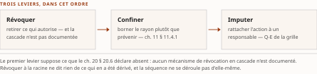

# Chapitre 39 — Le cycle de vie opérationnel : évaluation continue, dérive et incident

*Livre IV — Appliquer, exploiter, produire et composer : AgentMesh, AgentOps, fabrique d'agents et
synthèse architecturale.
Second mouvement — exploiter (ch. 38-40). Deuxième chapitre du mouvement : il traite la deuxième des
trois capacités que l'exploitation distingue — **agir sur ce qu'on voit**.*

| Champ | Valeur |
|---|---|
| **Statut** | **Brouillon de rédaction, non publiable** — rédigé sur instruction d'auteur du 27 juillet 2026, **avant** les portes **G-3**, **G-4** et **G-5**, et hors de l'ordre de rédaction du PRD §6. ⚠ **Chapitre de COMPOSITION, sans lot d'instruction propre** — il consomme les ch. 20, 37 et 38 plutôt qu'une passe de recherche —, et *un chapitre de composition est plus exposé qu'un chapitre de socle, pas moins : sans source à citer, l'inférence ne se voit pas.* **R-IV-40 et R-IV-41, ouvertes au ch. 37, valent pour tout le Livre** — ☑ *soldées depuis (TOC v0.28, PRD v0.12) ; ⚠ **D-2, qui clôt R-IV-40, a été prise par une autre passe et APRÈS cette rédaction** : un arbitrage qui suit une infraction la solde, il ne la rattrape pas* |
| **Date de gel** | **27 juillet 2026** — gel unique, **D-1 prise** ([`gel-2026-07-27.md`](../PRD/gel-2026-07-27.md)). ⚠ **Volet résiduel de G-1 non instruit PAR CETTE PIÈCE** : aucun fait périssable n'y a été repris à la source primaire. ☑ **Il l'a été depuis au socle consolidé** (v1.2, 28 juillet 2026), et ⚠ **deux entrées mobilisées ici y sont enregistrées « ☑ changée »** : Vol. III **F-70** (`S-116`) — *la version du mandataire ouvert publiée le 27 juillet 2026 n'est pas marquée pré-version*, un terme sur trois de l'entrée — et Vol. III **F-98** (`S-142`) — *la page du troisième outil nomme **quatre** dimensions, non neuf ; date du changement non établie par cette voie.* ⚠ **Le report sur le corps est DÛ et n'est pas opéré ici**, aux deux endroits qui les mobilisent (§ 39.1, § 39.3) : *l'énoncé de la pièce est celui de son entrée au gel, et le rectifier sans re-lire la source serait re-dater par procuration.* Gels de source : **21 juillet 2026** (Vol. III), **juin 2026** (Vol. I) ; *ils ne sont pas celui de la somme* |
| **Socle mobilisé** | **Aucune entrée du socle consolidé n'est citée à l'appui d'un énoncé, et le corps n'en porte aucun identifiant `S-nnn`** — *les deux que l'en-tête nomme le sont au titre du registre de re-datation, jamais d'un fait.* ⚠ **La pièce a été rédigée avant la porte G-3 — franchie depuis, le 28 juillet 2026** ([`socle-consolide.md`](../PRD/socle-consolide.md), v1.2, 159 entrées `S-001`…`S-159`) : *le report de ses renvois sur la série `S-nnn` est **dû** et n'est pas opéré ici, une re-numérotation pièce par pièce produisant une somme à deux séries.* Les énoncés résolvent contre le **Vol. III *Monographie* ch. 25**, dont les entrées **F-03**, **F-05**, **F-06**, **F-07**, **F-10**, **F-12**, **F-19**, **F-20**, **F-21**, **F-23**, **F-34**, **F-35**, **F-37**, **F-38**, **F-40**, **F-46**, **F-52**, **F-53**, **F-55**, **F-57**, **F-64**, **F-65**, **F-66**, **F-68**, **F-70**, **F-71**, **F-76**, **F-77**, **F-92**, **F-93**, **F-97**, **F-98** et les entrées héritées **H-04**, **H-07**, **H-11**, **H-12**, **H-15**, **H-23**, **H-25**, **H-26**, **H-27**, **H-28**, **H-31**, **H-33** **conservent leurs niveaux d'origine** ; et contre le **Vol. I *Monographie* §2.11.4-2.11.5**, qui entre **en [C]**. ⚠ **Cinq de ces entrées sont déclarées au périmètre du chapitre source et ne portent aucun énoncé du corps** : **F-93**, **H-23**, **H-25**, **H-27**, **H-28**. ⚠ **Une entrée porte une dette de vote non résorbée** : **F-92** est en **[B, degré 1] avec vote adversarial dû et non conduit** — *elle ne porte aucune thèse ici* — et ☑ **la refonte du socle l'a effectivement écartée** : `F-92` et `F-96` du Vol. III **n'entrent pas au socle consolidé** tant que la dette tient (Annexe B §6.1). ⚠ **Régime « source rédigée non publiable »** : G-4 non close, **aucun vote conduit**. **Aucun énoncé n'est central au sens de CA-IV-01** |
| **Garde-fous balayés** | ⚠ **Règle de comptage, décision 16 du TOC** : les cardinaux ci-dessous portent sur le **marqueur littéral de l'identifiant** dans le **corps** de la pièce — de la première section à la synthèse, **en-tête et note de statut exclus** —, et ils sont **re-mesurés sur le corpus que le commit produit**. ⚠ **Un garde-fou appliqué sans que son identifiant soit écrit voit son DOMAINE déclaré, sans cardinal** (alinéa c) : *le domaine balayé est le corps entier, et les cardinaux antérieurs — qui comptaient les **applications** et non le marqueur — n'étaient re-mesurables par aucune règle écrite.* **Les deux séries sont balayées intégralement, zéros compris.** Vol. III — **R-14 (trois degrés d'absence) : quatre occurrences**, § 39.1, § 39.2, § 39.4 et § 39.6 ; **R-09 (statut pré-normatif dit à chaque mention) : trois occurrences**, § 39.2, § 39.3 et § 39.4 ; **R-13 (échelle d'autonomie jamais nue) : deux occurrences**, § 39.2 et § 39.6 — *l'échelle à quatre paliers non numérotés y est nommée par son cardinal, jamais seule* ; **R-01 (le passeport n'existe dans aucune spécification) : une occurrence**, § 39.5 ; **R-06 (« attendu par E-23 ») : une occurrence**, § 39.2 ; **R-11 : une occurrence**, § 39.2 ; **R-12 (traitement défensif au niveau architectural) : une occurrence**, § 39.2. **R-02 : une occurrence de l'identifiant**, au bloc de collation de la thèse — ⚠ *le décompte porte sur le **marqueur littéral dans le corps**, note de statut et en-tête exclus (décision 16a) : une restriction de domaine ajoutée à la déclaration ne la rend pas vraie, elle la rend invérifiable* — ⚠ *l'identifiant paraît une fois **hors de ce domaine**, au bloc de collation de la thèse, où il nomme le garde-fou pour dire ce que la forme antérieure lui devait ; le corps, lui, est écrit sous la forme bornée* ; **R-03 à R-05, R-07, R-08, R-10 : zéro occurrence de l'identifiant** — ⚠ *R-02 est pourtant appliqué de bout en bout, chaque mécanisme étant qualifié par ce que sa spécification démontre et non par ce qu'elle promet : domaine déclaré, corps entier, sans cardinal (décision 16, alinéa c).* Vol. II — **métriques et qualifications auto-déclarées (marqueur « auto-déclaré ») : quatre occurrences**, deux au § 39.1 et deux au § 39.3, chacune attribuée. La **première du § 39.1** est une **réserve** — le rapport nommé reprend des métriques auto-déclarées d'éditeur, et *rien n'en est repris ici* ; la **seconde** porte sur les évaluateurs d'une plateforme et est attribuée à **Microsoft**, son éditeur nommé. Les **deux du § 39.3** portent sur le statut de pré-version d'un mandataire ouvert, attribué à son hébergeur nommé, la **Linux Foundation** — *une qualification de maturité n'est pas une métrique, et la décision 15, alinéa a, vaut pour l'une comme pour l'autre.* **Réserve de la préimpression (marqueur littéral « F-37 » du Vol. II) : une occurrence**, § 39.2 — *l'entrée y est nommée à côté de son identifiant hérité du Vol. III, **H-12**, sous lequel le constat était seul porté ; la réserve, elle, est écrite à chaque mobilisation, domaine déclaré, sans cardinal.* ⚠ **Le corps porte deux AUTRES occurrences littérales de « F-37 », qui sont des entrées du Vol. III** (§ 39.4), désormais préfixées de leur volume — *la collision est exactement celle que la décision 7 proscrit, et l'en-tête l'avait elle-même commise.* **R-1 à R-8 : zéro occurrence** — *les sièges versés à l'appareil pour cette série sont hors de cette pièce : R-2 et R-3 au ch. 16 § 16.2, R-8 au ch. 7 § 7.5.* ⚠ **Deux faux amis déclarés** : *(a)* le « corpus d'appui » du § 39.6 est un **marqueur conditionnel de réouverture**, jamais une source ; *(b)* le « plan de contrôle » du § 39.4.1 est celui de l'architecture de référence du **Vol. I**, dont un agent privé retombe au rang d'assistant — ⚠ *ce n'est pas le « control plane » que le PRD §8 proscrit nu, et il n'entre dans aucun cardinal ci-dessus* |
| **Volumétrie cible** | ≈ **6 500 mots** de corps (§ 39.0 à la synthèse), **cible dérivée** de l'enveloppe du Livre (**69 000 mots**, TOC v0.25) au prorata des six sections et du volume de source consommé. ☑ **Décompte publiable depuis G-2** ; **réel reporté au [`README.md`](README.md)** du Livre. ⚠ **D-4 s'applique** : *ni amputation ni gonflement* |

> **Thèse** *(citée depuis le [`TOC.md`](../PRD/TOC.md) **v0.28**, entrée du chapitre 39 — **thèse réalignée en v0.28**, décisions 8 et 14, remontée R-IV-45)* — Lecture de l'auteur — l'exploitation d'un parc d'agents **forme** une boucle — évaluer, détecter la dérive, répondre à l'incident, réviser le mandat. ⚠ **Ce que le socle établit** : l'énoncé de l'invariant à quatre termes, entré en **[C]** comme thèse à attribuer. ⚠ **Ce qu'il n'établit pas** : **que cette boucle en soit la réalisation** — *le Vol. I ne décrit aucune boucle d'exploitation*. Sans elle, **le passeport n'assemble que des pièces datées à leur émission** — *et non « certifie », verbe qui prêterait une capacité à un objet ne figurant dans aucune spécification (R-01 du Vol. III).*

⚠ **La thèse portait, à la rédaction, deux formes que sa source avait elle-même bornées — le
réalignement est FAIT, et l'histoire de l'écart se conserve** (décision 17 du TOC, alinéa c). **Forme
antérieure, v0.25** : « l'exploitation d'un parc d'agents **est** une boucle […] — **réalisation
opérationnelle du quatrième terme de l'invariant** ; sans elle, **le passeport certifie** un
comportement passé, jamais le comportement courant ». *Premièrement*, le Vol. III a **reformulé sa thèse le 21 juillet 2026**
(confrontation P4.0, écarts ÉC-11 et ÉC-12) et l'a marquée **« Lecture de l'auteur » en totalité** :
ce que le socle établit est l'**énoncé de l'invariant à quatre termes**, entré en **[C]** comme thèse
à attribuer ; ce qu'il **n'établit pas** est **que la boucle décrite en soit la réalisation** — *le
Vol. I ne décrit aucune boucle d'exploitation*. *Deuxièmement*, « le passeport **certifie** un
comportement passé » : la source écrit « le passeport **n'assemble que des pièces datées à leur
émission** ». ⚠ **La différence n'est pas de style** : *« certifier » attribue une capacité à un objet
qui ne figure dans aucune spécification à date* (R-01 du Vol. III), et qualifier un mécanisme par ce
qu'il promet plutôt que par ce qu'il démontre est ce que R-02 proscrit. **Le corps a été écrit sous la
forme bornée** et l'écart avait été **remonté** (R-IV-45, § 39.7). ☑ **La remontée est soldée par l'arbitrage v0.28 du TOC** (décisions 8 et 14), et **la citation
ci-dessus porte la forme réalignée**, reportée **par copie** depuis l'entrée courante du plan.
*Ni la v0.29 ni la v0.30 du TOC ne modifient de thèse du Livre.*

---

## § 39.0 — Introduction : agir sur ce qu'on voit

Le ch. 38 s'est arrêté sur un constat qu'il n'a pas comblé — **le legs négatif de sa synthèse, repris
ici tel qu'il l'écrit** : *l'identité serait la clé de jointure de l'observabilité agentique, et rien
ne la constitue.* ⚠ **L'énoncé est celui du chapitre amont ; il n'est pas reformulé ici.** *Ce que la
présente pièce y ajoute est borné et lui appartient : l'objet qui porterait cette clé — le passeport —
ne figure dans aucune spécification à date* (§ 39.5). Celui-ci traite la
deuxième capacité du mouvement : **agir sur ce qu'on voit**. Évaluer en continu, détecter la dérive
(*drift*), répondre à l'incident, réviser le mandat — quatre gestes que l'exploitation d'un parc
enchaîne, et dont ce chapitre demande, un à un, **ce que le socle en documente**.

⚠ **Deux des chapitres amont portent, à trois endroits, une lacune là où celui-ci les consomme, et le
fait se déclare avant la première section.** Le **ch. 20** porte un front ouvert sur l'attestation
d'intégrité à l'exécution et un autre sur la **révocation en cascade** — *aucune passe de recherche
n'a été conduite* ; le **ch. 38 § 38.5** porte le troisième, sur la **corrélation trace ↔ chaîne de
mandat**. **Le maillon « répondre à l'incident » s'appuie donc sur des chapitres qui déclarent ne pas
savoir.** *Ce n'est pas un défaut de la thèse ; c'est une contrainte de rédaction, et le § 39.3
l'écrit plutôt que de la contourner.*

⚠ **Ce que le chapitre ne traite pas.** Les **fondements de l'évaluation** ne sont pas ici : ils
restent au **ch. 6**, et le Vol. I *Monographie* §2.9 n'est pas repris ici — *son §2.9.6 arrive au
ch. 38, non dans cette pièce.* La **barrière d'évaluation au déploiement** est au **ch. 47**, au grain
de l'artefact, où se tient aussi le **grain du déploiement**. Et
la **science de l'évaluation** est hors périmètre de bout en bout : *l'évaluation n'entre dans la
somme que par la revalidation du passeport après apprentissage* (§ 39.5).

**Le chapitre se lit en six temps** : évaluer (§ 39.1), détecter (§ 39.2), répondre (§ 39.3),
versionner et revenir en arrière (§ 39.4), revalider ce qui a appris (§ 39.5), et situer le tout dans
un modèle de maturité dont **le corpus d'appui annoncé n'a jamais été déposé** (§ 39.6).

## § 39.1 — L'évaluation en production : des jeux d'essai à l'évaluation continue

**Ce que cette section vérifie est étroit et se formule ainsi** : *une évaluation conduite en
production est ce qui daterait un verdict que le mécanisme d'admission ne date pas.*

Le **ch. 20** l'a établi sur la carte d'agent signée : l'en-tête protégé n'admet **ni `nbf`, ni `iat`,
ni `exp`**, de sorte qu'**une signature ne périme que par sa clé** (Vol. III **F-03**,
**[A, degré 1]**), et les **quatorze champs** du message normatif de carte n'expriment **ni date
d'émission, ni fenêtre de validité, ni indicateur de révocation** (Vol. III **F-05**,
**[A, degré 1]**). *Un verdict sans terme exprimé est un verdict qui se prolonge par défaut.*

⚠ **Ce n'est pas une clause d'exclusivité** : **le socle ne documente pas les moyens par lesquels un
verdict d'admission pourrait être daté hors de cette boucle** — absence de documentation, non fait
négatif vérifié (R-14 du Vol. III, degré 3).

**Le corpus nomme l'exigence, et il la nomme comme exigence.** Le rapport *State of Agentic AI
Security and Governance*, **v2.01, juin 2026**, distingue l'identité non humaine — qui « verifies that
a credential is authorized to connect » — de l'identité d'agent, laquelle « has to verify what the
holder is doing with that authorization, **continuously** » (Vol. III **F-20**, **[A]**, citation en
langue originale). ⚠ **L'attributeur se nomme plutôt qu'il ne s'anonymise** (décision 15, alinéa a),
et **deux réserves voyagent avec l'entrée** : la formule est celle de ce rapport, **à sa date et à sa
version, non un consensus du domaine** ; et le rapport reprend par ailleurs des **métriques
auto-déclarées d'éditeur**, dont rien n'est repris ici. *Ce que l'entrée établit est qu'un référentiel
daté **énonce** la vérification continue comme propriété distinctive — pas qu'un mécanisme la réalise.*

**Ce que l'instrument normalisé en porte est un événement, et son statut relevé est le premier
échelon.** Sur les **deux fichiers agentiques ouverts** — et *le relevé ne documente pas le statut des
autres documents du dépôt* —, l'évaluation d'un agent est couverte par un événement dont **quatre
attributs** portent la valeur `stability: development` (Vol. III **F-77**, **[B]**) ; les deux
fichiers affichent en tête « Status: [Development] », **premier des cinq échelons** (Vol. III
**F-76**, **[B]** ; **siège ch. 38 § 38.2**, qui n'est pas reconstruit ici). ⚠ **Ce que ce constat
autorise est borné** : *un producteur de télémétrie peut consigner un résultat d'évaluation dans un
format nommé.* Il ne documente **ni ce que ce résultat mesure, ni à quelle identité il se rattache**.

**Ce que les outils d'éditeur en portent est un catalogue, et son écart au sujet est le résultat de la
section.** La page de référence des évaluateurs intégrés d'une plateforme d'éditeur nommée —
**Microsoft Foundry**, horodatée du 2 juin 2026 — nomme **onze évaluateurs d'agents, dont cinq portent
la mention « (preview) »** (Vol. III **F-97**, **[B]**). ⚠ **Qualifications auto-déclarées par cet
éditeur, attribuées à chaque occurrence, sans exception d'usage illustratif** ; l'éditeur est nommé
parce que **l'anonymiser serait une faute**, et la page est retenue comme **cas d'instanciation
documenté, jamais comme recommandation**. ⚠ **L'absence de la mention « (preview) » sur une ligne
n'est pas une déclaration de disponibilité générale** : *ne pas écrire que les six autres le
seraient.*

Deux évaluateurs de risque visent nommément l'agent, et l'un d'eux a pour finalité déclarée de
mesurer « an AI agent's ability to engage in behaviors that violate explicitly disallowed actions ».
⚠ **C'est ce que le corpus ouvert offre de plus proche d'un indicateur de mandat, et l'écart reste
entier** : *mesurer la **capacité** d'un agent à s'engager dans des comportements interdits est un
instrument d'épreuve adverse, non un indicateur de conformité d'un mandat en production.* ⚠ **Un
évaluateur n'est pas une métrique normalisée** : instrument propriétaire, **sans définition partagée
d'unité ni de cardinalité**, et **aucune page ouverte n'établit de correspondance** avec les attributs
d'instrumentation.

**Et rien ne relie un résultat d'évaluation à une identité.** Trois sources ouvertes nomment **trois
grains d'indicateur** — l'instrument normalisé au grain de l'**opération**, la plateforme d'éditeur au
grain de l'**évaluateur** avec deux niveaux déclarés, une troisième plateforme au grain de quatre
mesures et neuf dimensions de découpage, **consultée sans numéro de version, sans date et sans mention
de statut** —, et **aucun identifiant n'est commun aux trois** (Vol. III **F-98**, **[B]**). ⚠ **Trois
sources ne font pas un marché** : l'entrée ne soutient **aucun énoncé sur l'état du domaine**, et
**huit plateformes qu'elle nomme n'ont pas été instruites**.

⚠ **Report de re-datation dû sur le cardinal qui précède.** Le volet résiduel de **G-1** a été appliqué
au socle le 28 juillet 2026 et y enregistre cette entrée **changée sur un cardinal** : *la page de la
troisième plateforme nomme **quatre** dimensions, non neuf ; la date du changement n'y est pas
établie.* Le chiffre écrit ci-dessus est celui de l'entrée **à son gel**, et *sa rectification n'est
pas opérée ici* (en-tête, champ Date de gel). ⚠ **Ce que la section en tire — l'absence d'identifiant
commun aux trois sources — ne dépend pas de ce cardinal et n'est pas touché.**

Lecture de l'auteur — **ce que le socle établit** : un verdict d'admission **sans terme exprimé**
(F-03, F-05) ; un référentiel daté qui **énonce** la vérification continue (F-20) ; un événement
d'évaluation normalisé **au premier échelon** (F-77) ; onze évaluateurs dont cinq en préversion
déclarée, **le plus proche du sujet mesurant une capacité et non une conformité** (F-97) ;
l'absence d'identifiant commun entre trois sources nommées (F-98). **Ce qu'il n'établit pas** : qu'un
dispositif d'évaluation en production existe **qui daterait un verdict d'identité**, ni qu'un résultat
d'évaluation se rattache à un mandat, **ni qu'aucun outil ne le fasse ailleurs**. La lecture proposée
est que **l'évaluation continue est instrumentée comme mesure de performance et non comme acte de
vérification d'identité** : *les deux se ressemblent parce qu'elles produisent des chiffres, et elles
diffèrent parce que l'une répond d'un modèle et l'autre d'un mandataire.* Elle se réfute par la
production d'un évaluateur dont la sortie porte **un identifiant d'agent émis et vérifiable**.

## § 39.2 — La dérive agentique : dérive de modèle, dérive d'outil, dérive d'autonomie

**La dérive est ce qui rend faux, après coup, un verdict qui était vrai.** Trois dérives sont annoncées
par le plan ; ⚠ **elles ne sont pas documentées au même degré, et les présenter à parité serait la
première faute possible ici.**

### 39.2.1 La dérive d'outil est la mieux documentée, parce qu'un chapitre l'a instruite

Le **ch. 20** la traite **comme attaque** — le retournement d'un serveur d'outils (*rug-pull*), où un
serveur initialement bénin **modifie après coup la définition d'un outil approuvé**. ⚠ **Relue en
signal d'exploitation, la même mécanique pose une question de supervision : *sur quoi
comparerait-on ?*** Sur la page de description des outils de la révision du protocole agent-outil de
novembre 2025, l'énumération du type compte **huit champs, dont aucun n'exprime une version, une
empreinte cryptographique ou une signature** (Vol. III **F-52**, **[B, degré 1]** — **fait négatif
VÉRIFIÉ, borné à cette page de cette révision**).

⚠ **La borne ne se détache pas de l'énoncé** : elle ne dit rien des autres pages de la spécification,
et une **révision majeure est annoncée au brouillon sans que sa date soit confirmée à la source**
(R-09) — *le constat est à rejouer sur la révision publiée.* ⚠ **Aucun des trois tris prospectifs
n'est attribué à cette révision, et l'abstention est motivée** : le **PROGRAMMÉ exige un engagement
daté réel**, et *c'est précisément la date qui manque* (Vol. III **H-33**, **[C]**, instrument de tri
et non fait). *La motivation est celle que le ch. 38 § 38.5 pose sur la même révision, reprise ici
plutôt que supposée.*

Lecture de l'auteur — ce que le socle établit est **l'absence de ces trois champs sur une page
nommée** ; ce qu'il n'établit pas est **qu'une supervision ne puisse pas comparer hors protocole**. La
lecture proposée est qu'**une dérive ne se détecte que contre une référence conservée**, et que le
mécanisme examiné **n'offre, sur cette page, aucun champ qui tiendrait lieu de référence**.

### 39.2.2 La dérive de modèle n'est pas au socle, et le mot ne doit pas faire croire l'inverse

⚠ **Le socle ne documente pas de mécanisme de détection d'une dérive de comportement d'un modèle en
production** : absence de documentation, non fait négatif vérifié (R-14 du Vol. III, degré 3).

Ce que le corpus porte est **voisin sans être identique** : l'**empoisonnement de la mémoire longue ou
de la base de récupération** est documenté par une publication **revue par les pairs** parue dans des
actes de conférence de 2024, dont **les auteurs déclarent** des taux de réussite « ≥ 80 % » pour
« < 0,1 % » de contenu empoisonné sur trois configurations (Vol. III **F-23**, **[A]** ; siège
**ch. 19**). ⚠ **Données mesurées et déclarées par les auteurs, attribuées à eux à chaque
occurrence** ; *le présent chapitre n'en tire aucune grandeur.*

⚠ **Le traitement défensif tient l'exposé au niveau du maillon** (R-12 du Vol. III) : **le comportement
d'un agent change sans qu'aucun de ses artefacts d'identité ne change** — c'est cette phrase, et non
une recette, qui appartient à ce chapitre.

Côté instrument, la dimension de modèle existe : le groupe d'attributs qui alimente la métrique de
durée d'invocation **ne référence qu'un nom d'agent lisible par un humain et un identifiant de modèle
de requête** (Vol. III **F-92**, **[B, degré 1]**, **portée bornée aux trois fichiers nommés**).
⚠ **Entrée sur laquelle le vote adversarial est dû et n'a pas été conduit** : *elle est adossée au
relevé d'ensemble et ne porte aucune thèse ici.*

### 39.2.3 La dérive d'autonomie est nommée par les cadres, et le seul relevé d'instrumentation ne l'instrumente pas

⚠ **C'est le résultat le plus net de la section, et il tient à la superposition de deux constats
indépendants.**

**Les cadres la nomment.** Le cycle de vie **attendu par** la ligne directrice E-23 — ligne directrice
**fondée sur des principes, dont les douze énoncés numérotés sont au *should*** (Vol. III **F-64**,
**[B, degré 1]**), la forme « attendu » étant portée **au titre du document d'information de son
éditeur du 11 septembre 2025** et non du texte de la ligne directrice (Vol. III **F-66**,
**[B, degré 1]**) — comporte une **surveillance continue visant nommément la décision autonome et la
reparamétrisation autonome** (Vol. III **H-04**, **[A/B mixte]** ; **F-65**, **[B]**). ⚠ **On écrit
« attendu par E-23 », jamais « exigé par E-23 »** (R-06 du Vol. III ; siège **ch. 25**). La ligne
directrice de l'AMF formule ses attentes sur le mode « L'Autorité s'attend à ce que… », **pour effet
au 1ᵉʳ mai 2027** — échéance datée d'un texte publié, donc **PROGRAMMÉE** —, sur une définition du
système d'IA incluant des **« degrés variables d'autonomie et d'adaptabilité après déploiement »**
(Vol. III **F-68**, **[B]** ; siège **ch. 27**). Un avis d'organisme de valeurs mobilières retient une
définition incluant des **niveaux variables d'autonomie et d'adaptativité après déploiement**
(Vol. III **H-07**, **[B]**) — ⚠ **borne de l'entrée** : l'avis porte sur les marchés de capitaux, il
**déclare de lui-même ne créer ni modifier aucune exigence**, et le socle n'établit pas qu'il porte
au-delà. ⚠ **Jalons « visés », jamais « fixés »** (R-11 du Vol. III) partout où un jalon d'organisme
de normalisation est cité.

**Le seul relevé d'instrumentation versé au socle ne la mesure pas.** Un cadre empirique relève que
**quatre propriétés sur cinq sont instrumentées, l'autonomie n'en ayant aucune** (Vol. III **H-12**,
**[B]** — *entrée héritée du Vol. II **F-37**, les deux fondues au socle consolidé ; c'est ici, et non
ailleurs, que ce constat est porté*) — ⚠ **préimpression non révisée par les pairs, source unique, sans reproduction
indépendante** : *constat de cette préimpression sur les cinq propriétés qu'elle instrumente
elle-même, non propriété établie du domaine.*

⚠ **L'échelle qui permettrait de graduer cette dérive vient d'un volume antérieur, et sa mention porte
son cardinal** (R-13 du Vol. III) : l'**échelle à quatre paliers non numérotés** — *assistance →
copilote → orchestration sous revue → autonomie bornée* — (Vol. III **H-31**, **[C]**). ⚠ **Entrée non
élevable** : c'est une **construction d'auteur du Vol. I**, qui entre comme **thèse à attribuer** et
ne porte jamais un fait. **Son emploi comme instrument de graduation appartient au ch. 43 § 43.5** ;
*ce chapitre la nomme et ne la mobilise pas.*

### 39.2.4 Une quatrième source de dérive est portée par le plan, et elle n'entre pas au socle

⚠ **Relève v0.10 du TOC, citée ici à son régime et non comme fait.** Le plan porte une **quatrième
source de dérive : la mémoire**, quand le contexte de travail est **continûment réécrit par des
modèles auxiliaires** — un observateur qui extrait des observations structurées, un réflecteur qui les
compresse, déclenchés à seuil de jetons et à l'inactivité. ⚠ **Le dispositif est décrit par son
éditeur** comme parade au pourrissement de contexte ; **aucune propriété de conservation n'est
publiquement établie**, et *un état de mémoire produit par un autre modèle est un **artefact dérivé et
daté***.

⚠ **Cette relève est un repérage [C] à instruire à la source primaire ; elle n'entre pas au socle**, et
son instruction relève de **G-1**, **avec le ch. 5** — qui porte l'ancrage informationnel. **Aucun
énoncé de ce chapitre ne s'y adosse** : elle est nommée comme **front ouvert**, et le § 39.2 continue
de traiter les **trois** dérives que le plan annonce, non quatre — *et, comme l'ouverture de la section
le pose, elles ne sont pas documentées au même degré : la dérive d'outil est la seule qu'un chapitre de
la somme ait instruite.*

Lecture de l'auteur — **ce que le socle établit** : l'absence de champ de version, d'empreinte ou de
signature au type décrivant un outil, **sur une page nommée** (F-52) ; l'empoisonnement de la mémoire
avec ses taux **attribués à leurs auteurs** (F-23) ; la mention de la décision et de la
reparamétrisation autonomes par le cycle de vie **attendu par** E-23 (H-04, F-65, F-66) ; l'adaptabilité
après déploiement dans deux définitions réglementaires (F-68, H-07) ; l'absence d'instrumentation de
l'autonomie **dans une préimpression** (H-12). **Ce qu'il n'établit pas** : qu'il existe une métrique
d'autonomie, ni que les trois dérives soient les seules, ni qu'elles se détectent par les mêmes
moyens. La lecture proposée est que **des trois dérives, celle que les cadres canadiens nomment sous
les termes d'autonomie et d'adaptativité après déploiement est aussi celle que le seul relevé
d'instrumentation versé au socle n'instrumente pas**. ⚠ **Aucun balayage n'a porté sur les instruments
relevés par ailleurs** : **le socle ne documente pas s'ils mesurent l'autonomie** — absence de
documentation, non fait négatif vérifié. ⚠ **Et la conséquence pour l'exploitation n'est pas un manque
d'outillage, mais une obligation de conception** : *ce qui n'est pas instrumenté doit être borné à
l'émission, c'est-à-dire au mandat lui-même.*

## § 39.3 — La réponse à incident agentique : révoquer, confiner, imputer

**Trois leviers, et aucun n'est complet : les deux premiers butent sur une limite que leur chapitre
amont déclare, le troisième n'est fourni par aucun mécanisme documenté.**

**Révoquer en urgence, c'est agir sur un mécanisme prescrit sans être outillé.** Le **ch. 20** a relevé
l'inventaire texte par texte, et **trois formes s'en dégagent : le silence, l'interdiction sans le
moyen, l'état sans la fraîcheur**. La deuxième est celle que la réponse à incident heurte de front :
« Expired or revoked keys **MUST NOT** be used for verification » est posé au niveau normatif le plus
fort, **sans aucun mécanisme permettant au client d'établir l'expiration ou la révocation** (Vol. III
**F-07**, **[A]**), la section pertinente de la spécification agent-agent **ne mentionnant ni liste de
révocation, ni protocole d'état en ligne, ni point de terminaison de statut, ni délai de
revalidation**, et sa procédure en six étapes ne comportant **aucune étape de contrôle de fraîcheur**
(Vol. III **F-06**, **[A, degré 1]**, borné à cette seule section). ⚠ **La rotation est outillée ; le
retrait d'une clé compromise ne l'est pas** (Vol. III **F-10**, **[B]**). ⚠ **Le précédent des
infrastructures à clé publique n'offre pas le secours qu'on lui prête** (Vol. III **F-53**, **[B]**),
et un brouillon de registre **prescrit quatre états d'agent sans fixer, aux sections consultées, aucun
délai de propagation** (Vol. III **F-55**, **[C, degré 1]**, corroboration seule ; document de statut
« draft » du 27 mars 2026 hébergé dans un espace de laboratoire — **travaux émergents, non une norme
ratifiée**, Vol. III **F-38**, **[A]** ; R-09).

**Ce que le socle documente d'une réponse réelle est une révocation de masse.** Lors d'une campagne
publique **du 8 août 2025 à au moins le 18 août 2025**, des instances d'un fournisseur de gestion de
la relation client ont été atteintes au moyen de **jetons OAuth compromis d'une application tierce**,
et **l'ensemble des jetons de cette application a été révoqué le 20 août 2025** (Vol. III **F-21**,
**[A]**). **Le maillon qui cède est nommé** : le jeton porteur (*bearer token*) **n'est lié ni à
l'appelant, ni à un appareil, ni à une session**. Le **ch. 20** en tire, **sous marquage
d'inférence**, que cette invalidation indifférenciée **tient lieu de cascade faute de mécanisme
documenté qui en exercerait une** — et il écrit **au degré 3** que le socle ne documente pas de
mécanisme de révocation en cascade dans une chaîne de délégation. *Le présent chapitre reprend ce
constat de son siège et n'en dérive rien de neuf : **l'exemple daté que le socle porte d'une réponse
d'urgence est une réponse à granularité maximale.***

**Confiner, c'est déplacer le lieu de l'échec, et le point d'application le documente à sa borne.** Le
**ch. 37 § 37.5** a établi qu'une autorisation par arête possède une syntaxe documentée dans un
mandataire ouvert de la **Linux Foundation**, dont la publication la plus récente est **pré-version
auto-déclarée** (Vol. III **F-71**, **F-70**, **[B]** ; *l'attributeur d'une qualification de maturité
se nomme*), et qu'un **écart de couverture entre deux plans d'identité est déclaré
par l'éditeur lui-même** (Vol. III **F-35**, **[A, degré 2]**, fait négatif **ÉTABLI**). ⚠ **La
conséquence pour l'incident est directe, et c'est la première condition de renversement du ch. 37
§ 37.9** : *un confinement dont on ne peut pas énumérer les arêtes qu'il ne médiatise pas confine
d'une part inconnue.*

⚠ **Report de re-datation dû sur la qualification de maturité, et sur elle seule.** Le volet résiduel
de **G-1** a été appliqué au socle le 28 juillet 2026 et y enregistre **F-70** *changée sur un terme
des trois* : *la version du mandataire publiée le 27 juillet 2026 n'y est plus marquée pré-version.*
La qualification écrite ci-dessus est celle de l'entrée **à son gel**, et *sa rectification n'est pas
opérée ici* (en-tête, champ Date de gel). ⚠ **Ce dont la section tire sa conséquence est l'écart de
couverture déclaré (F-35), que ce changement ne touche pas.**

Le motif de principe est hérité : le Vol. I pose **l'injection d'invite comme non résoluble au niveau
du modèle**, le confinement relevant du **contenir** et non du **prévenir** (Vol. III **H-26**,
**[C]** ; repérage). Un manifeste de recherche enseigne de son côté que **restreindre le contexte et
les capacités limite l'impact d'un agent compromis** (Vol. III **H-11**, **[B]**), thèse que le
Vol. II reprend à son **cinquième point de contrôle obligatoire** — le confinement local (Vol. III
**H-15**, ⚠ **construction d'auteur, à attribuer, jamais un fait de socle** ; **siège ch. 43 § 43.3**).
⚠ **Le *frame* opérationnel n'est pas caractérisé par le socle** — seul le normatif l'est : *le
chapitre ne s'adosse pas à cette notion*, et la lacune est déclarée au § 39.5.

**Imputer, c'est le levier qu'aucun mécanisme documenté ne fournit.** Un référentiel de sécurité applicative
énonce que **sans identité propre et gouvernée, un agent opère dans un écart d'attribution qui rend le
moindre privilège inapplicable** (Vol. III **F-19**, **[A]**) ; le manifeste range parmi ses défis
l'**écart de responsabilité** entre le développeur, l'organisation qui impose le cadre, le fournisseur
de modèle et le comportement émergent (**H-11**, **[B]**). ⚠ **Et les répondants sont eux-mêmes des
agents** : la documentation d'un agent de triage d'hameçonnage de **Microsoft**, mise à jour le
1ᵉʳ juillet 2026, offre **deux modèles d'identité** — une identité d'agent créée pour lui, ou **un
compte utilisateur existant dont l'agent hérite les accès** — et **déclare la seconde option
incompatible** avec deux dispositifs de sécurité d'accès privilégié (Vol. III **F-57**, **[A]** ;
siège **ch. 15**). *Cas d'instanciation documenté, jamais recommandation.*

### 39.3.1 Ce que le Vol. I ajoute à ce levier, en [C]

Le Vol. I traite la fiabilité d'un agent en production **comme une propriété du système, non du
modèle**, et pose trois choses que ce chapitre reprend **en repérage [C]**, à attribuer. *Un* : les
patrons classiques de résilience restent indispensables — **temporisation exponentielle sur les appels
d'outils faillibles, disjoncteurs, budgets de réessais bornés** —, et l'**exécution durable**, qui
journalise l'état et chaque effet de bord, permet la reprise après panne **sans rejouer les actions
déjà engagées, à condition que les appels d'outils soient idempotents**. ⚠ **L'idempotence devient
ainsi une exigence de conception d'outil de premier ordre** : *sans elle, une reprise transforme un
agent en multiplicateur d'effets de bord.* ⚠ **Le versant *sémantique d'effet* de ce constat est au
ch. 48** — *non rédigé à la date de cette pièce, rédigé depuis, hors portes* : ce chapitre le nomme et
ne le développe pas. *Deux* :
l'**intervention humaine** doit être traitée comme **une primitive d'architecture et non comme un
correctif tardif** — points d'interruption où l'exécution se suspend en attendant une approbation,
modes d'approbation gradués selon la sensibilité de l'action, interruptibilité, **modélisation en
machine à états explicite** qui rend la trajectoire auditable. *Trois* : la réponse à incident exige
des primitives propres — **un dispositif d'arrêt d'urgence capable de stopper net une flotte
d'agents**, des indicateurs de délai de remédiation **adaptés à des défaillances probabilistes**, et
des analyses post-incident **nourries par les traces d'observabilité** du ch. 38.

⚠ **Repérage [C], et la conséquence est nette** : *aucun de ces trois éléments n'est central au sens
de CA-IV-01*, et **le socle du Vol. III n'en porte aucun équivalent**. C'est de nouveau une **lacune
de couverture couverte, non comblée** : les deux états sont datés, **compatibles**, et l'énoncé du
Vol. III **reste exact dans son périmètre**.

Lecture de l'auteur — **ce que le socle établit** : l'interdiction d'employer une clé révoquée **sans
moyen d'en établir le statut** (F-06, F-07) ; la rotation outillée **sans procédure de retrait**
(F-10) ; les limites déclarées du précédent des infrastructures à clé publique (F-53) ; **une
révocation de masse datée** en réponse à un incident public (F-21) ; une syntaxe d'autorisation par
arête **en pré-version auto-déclarée** (F-70, F-71) ; un **écart de couverture déclaré par un éditeur
nommé** (F-35) ; l'écart d'attribution (F-19) ; deux modèles d'identité pour un agent défensif nommé
(F-57). **Ce qu'il n'établit pas** : qu'une **révocation sélective** soit possible, qu'un confinement
couvre l'ensemble des arêtes, ni qu'une action se rattache après coup à un mandat. La lecture proposée
est que **la réponse à incident agentique dispose, à date, d'un geste à granularité maximale et d'un
geste à couverture inconnue** — *révoquer tout, ou confiner en partie* —, et que **le geste
intermédiaire — retirer un mandat précis et constater sa propagation — n'est documenté par aucune
entrée**. Elle se réfute par la production d'un mécanisme de retrait sélectif **dont la propagation
soit constatable**.

## § 39.4 — GitOps du parc d'agents : versionner le mandat protocolaire, promouvoir, revenir en arrière

**Ce que cette section vérifie.** Elle demande ce qui permettrait de restituer, après coup, **quel
mandat et quelles bornes de privilège étaient en vigueur au moment d'une action donnée** — et d'y
revenir. *C'est une question de preuve opposable avant d'être une question d'outillage : sans elle, un
dossier de diligence raisonnable porte un état courant et jamais un état daté.*

⚠ **Le socle ne documente aucune définition de « GitOps » appliqué à un parc d'agents, ni aucun
dispositif de promotion entre environnements** : absence de documentation, non fait négatif vérifié
(R-14 du Vol. III, degré 3). *Le terme est employé au vocabulaire du plan, et la section écrit ce que les
mécanismes déjà instruits portent — rien de plus.*

**Le versionnement existe, à trois endroits et à trois régimes.**

| Objet versionné | Ce que le socle établit | Ce qu'il n'établit pas |
|---|---|---|
| **Le mandat lui-même** | sérialisation en SD-JWT, **attribut de type versionné**, attributs temporels d'émission et d'expiration, **v0.2.0 du 28 avril 2026** — ⚠ **spécification de projet, non texte normatif d'un organisme de normalisation** (Vol. III **F-46**, [B] ; R-09) | qu'un **retrait** soit documenté : le **ch. 20** l'écrit au **degré 3** |
| **La spécification de la carte**, non son artefact | spécification versionnée — v1.0.0 du 12 mars 2026, champ de signatures introduit en v0.3.0 le 30 juillet 2025 (Vol. III **F-12**, [B]) ; ⚠ **écart consigné et non arbitré** : le registre affiche une étiquette **v1.0.1 du 28 mai 2026** quand l'en-tête déclare « Latest Released Version 1.0.0 », **et la v1.0.1 n'a pas été ouverte** | que l'**artefact** émis soit daté : les quatorze champs n'expriment **ni date d'émission, ni fenêtre de validité, ni indicateur de révocation** (**F-05**, [A, degré 1]) ; *le champ de version qu'il porte est la version **de l'agent**, non une date ni un numéro de série* |
| **La déclaration des bornes** | deux champs **obligatoires** au schéma de profil d'agent d'un brouillon de laboratoire — énumération des outils invocables, limites de portée (Vol. III **F-40**, [B]) ; un type de ressource d'annuaire héritant d'un type applicatif (Vol. III **F-37**, [B]) | ⚠ **que la disponibilité générale d'un produit vaille disponibilité générale de ses capacités** : plusieurs capacités nommées demeuraient étiquetées *Preview* au 21 juillet 2026 (Vol. III **F-34**, [A]) |

: Tableau 39.1 — Les trois régimes de versionnement documentés par le socle du Vol. III, et leurs bornes. ⚠ *Le mécanisme se versionne, l'artefact porte une version d'agent — et ni l'un ni l'autre ne le date.*

⚠ **Deux relevés ne couvrent pas les mêmes propriétés, et la comparaison ne se complète pas d'elle-même** :
**le socle ne documente pas si le type décrivant un outil exprime une fenêtre de validité** — absence
de documentation, non fait négatif vérifié. ⚠ **La comparaison est en outre bornée à ces trois
mécanismes nommés** : *aucun balayage des mécanismes d'émission n'a été conduit, et rien n'est affirmé
des autres.*

**Le retour arrière (*rollback*), lui, n'a pas d'objet là où cette section le cherche.** Revenir à la
définition antérieure d'un outil suppose de savoir laquelle était en vigueur : **les huit champs du
type n'en portent ni version, ni empreinte, ni signature** (F-52). Un retour arrière sur un mandat
suppose de savoir **qu'il a été retiré** : le **ch. 20** écrit au degré 3 l'absence de mécanisme de
propagation.

⚠ **Et promouvoir suppose un gabarit à promouvoir, que ce chapitre ne fournit pas.** Le plan de
production qui **fixe et corrige** ce gabarit est au **ch. 41 § 41.5** — matière neuve, **risque 16**,
et *le renvoi est un renvoi, jamais une reconstruction*.

### 39.4.1 Ce que le Vol. I ajoute, en [C] : l'exploitation qui maintient *que cela tourne*

Le Vol. I distingue deux disciplines que **la somme reprend et ne fond pas** : l'AgentOps répond du
**dossier de gouvernance** d'un agent, l'exploitation assistée par l'IA répond de la **santé de
l'infrastructure** qui l'héberge. ⚠ **Les confondre reconduit l'anti-patron d'une supervision
d'exploitation tenant lieu de piste de gouvernance, ou l'inverse.** Sa mécanique est une **boucle de
contrôle — observer, corréler, décider, agir** —, et deux notions lui donnent sa portée : la
**résilience mesurée**, qui transpose aux agents les grandeurs d'exploitation éprouvées, et
l'**auto-remédiation**, où la boucle **agit** au lieu d'alerter seulement.

⚠ **Deux bornes du Vol. I sont reprises parce qu'elles portent la matière du Livre, et non la
supervision.** *Un* : **une remédiation autonome est elle-même une action, soumise au calibrage
d'autonomie** — réversible et à faible matérialité, elle peut s'exécuter seule ; engageante, elle
reste **sous libération humaine**. La **dégradation sûre par défaut** — un agent privé de son plan de
contrôle **retombe au rang d'assistant plutôt que d'agir sans garde-fou** — est le mode de repli qui
la rend acceptable en environnement régulé. *Deux* : ⚠ **les agents d'exploitation sont des agents.**
Un agent qui observe, corrèle et remédie **possède une identité non humaine, une surface d'outils et
un pouvoir d'action sur l'infrastructure** : il relève **du même régime que les agents métier qu'il
surveille**, faute de quoi *l'exploitation auto-remédiante devient elle-même un angle mort de
gouvernance*. ⚠ **C'est exactement le constat que le ch. 20 pose du côté défensif** — les agents d'un
centre d'opérations de sécurité agentique sont les premiers à devoir porter le passeport —, et **les
deux se rejoignent ici sans se reconstruire**.

⚠ **Repérage [C]** : *le critère discriminant qu'énonce le Vol. I — **une remédiation automatique doit
porter l'identité de l'agent qui l'exécute, respecter son niveau d'autonomie et écrire sa propre
entrée d'audit*** — est une **thèse d'un volume antérieur, à attribuer**, et **aucun mécanisme ne la
réalise au socle**.

> **État de la recherche — la restitution datée du mandat et des bornes de privilège.** **Question** :
> par quel mécanisme documenté restitue-t-on, après coup, **la version du mandat et des bornes de
> privilège en vigueur au moment d'une action donnée**, et comment revient-on à un état antérieur ?
> **État** : lacune ouverte le 21 juillet 2026 chez sa source ; **aucune passe de recherche n'a été
> conduite** — ce chapitre n'a pas de lot d'instruction, et **aucun lot n'avait cet objet à son
> périmètre**. **Corpus à ouvrir** : la documentation d'exploitation des annuaires et registres nommés
> au socle (Vol. III F-37, F-40), les dispositions de conservation d'historique des spécifications de registre
> dans leurs révisions courantes, et la littérature d'exploitation déclarative **sous réserve d'une
> filiation établie explicitement plutôt que réinventée**. **Critère de clôture** : qu'un mécanisme
> documenté restitue un état daté, ou que son absence soit établie par balayage. ⚠ **La question reste
> ouverte ; aucune inférence n'est proposée ici.**

Lecture de l'auteur — la lecture proposée est que **le versionnement documenté par le socle porte sur
les descriptions et non sur les décisions** : *on sait versionner ce qu'un agent est autorisé à faire,
on ne sait pas restituer ce qu'il était autorisé à faire à l'instant où il l'a fait.* Ce que le socle
établit sont les trois régimes du tableau 39.1 ; ce qu'il n'établit pas est **qu'un dispositif
quelconque assure la seconde restitution — ni qu'il n'en existe aucun**.

## § 39.5 — L'agent qui apprend : ce que le passeport date, et ce qu'il ne date pas

**C'est par cette section que l'évaluation entre dans la somme** : *par la revalidation du passeport
après apprentissage, non par la science de l'évaluation en général.* **La question est donc étroite :
si un agent modifie son propre comportement, que devient la vérification dont il a fait l'objet ?**

**Le socle documente la distinction, et elle vient d'un manifeste de recherche.** L'auto-modification
s'y scinde en **deux régimes qu'il importe de ne pas confondre** : l'**adaptation** est **éphémère** —
elle porte sur une instance d'exécution et ne lui survit pas ; l'**évolution** est **persistante** —
elle modifie le modèle de processus lui-même et **vaut pour toutes les instances à venir** (Vol. III
**H-11**, **[B]**).

⚠ **La distinction n'est pas reconstruite ici : son siège est au ch. 22**, qui traite la capacité
d'auto-modification du paradigme dont elle vient. Ce chapitre **y renvoie** et en tire la seule
conséquence qui lui appartient — *le moment où une exception devient une règle*. Le Vol. II en tire,
**sous marquage d'auteur**, que les deux devraient emprunter **deux chemins techniques et deux régimes
d'autorisation distincts**, faute de quoi **ce moment est indétectable dans les journaux** (Vol. III
**H-15** ; siège **ch. 43 § 43.3**). ⚠ **Ce ne sont pas des faits de socle** : ils portent le marquage
« Lecture de l'auteur » dans leur volume d'origine. *La forme absolue qu'en tire la somme est une
décision d'architecture, non la reprise d'un constat.*

⚠ **Une lacune est déclarée ici pour qu'aucun développement de ce chapitre ne s'y adosse.** **Le
*frame* opérationnel du paradigme n'est pas caractérisé par le socle** — seul le *frame* **normatif**
l'est —, et la question de son articulation à l'autre **reste ouverte** : *aucune passe de recherche
n'a été conduite*. Le confinement du § 39.3 est cité **au titre du *frame* normatif** et de la
restriction de contexte et de capacités, **jamais au titre d'un *frame* opérationnel que le socle ne
caractérise pas.**

**Ce que le passeport porterait, et ce qu'il ne porterait pas.** ⚠ **Le passeport d'agent ne figure
dans aucune spécification à date : c'est un objet de synthèse construit par la somme** (R-01 du
Vol. III ; **siège ch. 16**). **Trois de ses quatre pièces sont, au regard du temps, dans le même
état** : l'en-tête protégé d'une carte signée **ne porte aucun paramètre temporel** (F-03) ; la carte
elle-même **ne porte ni validité ni indicateur de révocation** (F-05) ; les états prescrits par un
brouillon de registre le sont **sans délai de propagation** (F-55, **[C]**, corroboration).

Lecture de l'auteur — la lecture proposée est qu'un tel assemblage **n'assemble que des pièces datées
à leur émission**, et que **rien de ce qu'il assemble ne porte sur le comportement courant**. Ce que
le socle établit sont **les trois absences ci-dessus, chacune bornée à son texte** ; ce qu'il
n'établit pas est **qu'elles se composent**, ni **qu'un assemblage ne puisse pas ajouter ce que ses
pièces ne portent pas**. ⚠ *Le report est une lecture, et il est réfutable par la production d'un
mécanisme qui daterait sa propre vérification.*

**Et le mécanisme de revalidation n'est pas au socle.** ⚠ **Le socle ne documente pas de mécanisme par
lequel l'identité ou le mandat d'un agent serait revalidé après une modification de son
comportement** : absence de documentation, non fait négatif vérifié. Ce qui s'en approche a été relevé
au § 39.1 **et n'y répond pas** : un événement d'évaluation normalisé au premier échelon (F-77), onze
évaluateurs dont cinq en préversion déclarée (F-97), et **aucun identifiant commun entre les trois
sources ouvertes** (F-98) — *de sorte qu'un résultat d'évaluation, à supposer qu'il détecte une
évolution persistante, ne se rattache à aucun artefact d'identité que la somme ait instruit.*

⚠ **Relève v0.11 du TOC — l'auto-évolution ferait de la dérive une fonctionnalité, et la relève ne
l'établit pas.** Le plan porte deux relevés de synthèse de 2025 tenus à jour en 2026, décrivant des
agents qui **optimisent en production leurs invites, leurs outils et leurs mémoires** : *la dérive que
le § 39.2 veut détecter y deviendrait un comportement **recherché**, et la revalidation après
apprentissage cesserait d'être un cas limite pour devenir le régime nominal.* Une troisième
préimpression, de juillet 2026, propose d'encadrer l'auto-modification par des **certificats à
garanties d'erreur auditables**. ⚠ **Les trois sont des préimpressions dont seuls les résumés ont été
consultés : repérages [C], jamais des faits**, et leur instruction relève de **G-1**. ⚠ **Le versant
versionnement est au ch. 47** — *non rédigé à la date de cette pièce, rédigé depuis, hors portes* —,
*un artefact qui se modifie en production n'ayant plus d'horloge fixe du tout.* **Aucun énoncé de ce
chapitre ne s'y adosse.**

## § 39.6 — Cycle de vie et modèles de maturité

⚠ **Cette section est la plus courte du chapitre, et sa brièveté est un résultat.** Le plan l'annonce
adossée à un **corpus d'appui** ; ⚠ **ce corpus n'est pas une source** : sa filiation a été **retirée
le 21 juillet 2026**, arbitrage clos par **échec documenté et réversible par dépôt ultérieur**, et
**aucun des trois ouvrages n'a jamais été déposé**. Les mentions qui suivent sont des **marqueurs
conditionnels de réouverture**, jamais des appuis. *Aucun chapitre ne se rédige en s'appuyant sur ces
ouvrages sans dépôt effectif.*

⚠ **Le socle ne documente aucun modèle de maturité de l'exploitation agentique** : absence de
documentation, non fait négatif vérifié (R-14, degré 3). **Et l'énoncé qu'on écrirait spontanément à
sa place est précisément celui que le régime des trois degrés interdit** : *« aucun modèle de maturité
ne traite le non-déterminisme agentique » serait un fait négatif de corpus sur un corpus non balayé.*

**Ce que la somme peut écrire ici tient en deux renvois et une abstention.** *Renvoi premier* : le
**modèle de maturité de l'entreprise agentique** — confrontation de trois modèles et de l'échelle à
quatre paliers non numérotés — a **son siège au ch. 43 § 43.5**, où le même marqueur de corpus d'appui
est porté et où la **désambiguïsation des trois échelles homonymes du Vol. I** est tenue (R-13 du
Vol. III). ⚠ *Ce chapitre ne le reconstruit pas, et ne nomme aucune échelle nue.* *Renvoi second* : la
**feuille de route par plateaux** est au **ch. 46**, séquencée sur une entrée en vigueur datée.
*Abstention* : **ce chapitre ne propose aucun modèle de maturité propre.** *Un modèle de maturité
produit à l'endroit exact où le socle est muet est celui qu'aucune relecture ne peut réfuter, faute de
fait auquel le confronter.*

## Synthèse : ce que le chapitre lègue à la somme

*Section de sortie sans homologue direct dans la source — construction d'éditeur.*

1. **La boucle, et son statut de lecture.** Évaluer, détecter, répondre, réviser : c'est une
   **construction d'auteur**, non un fait, et *le socle n'établit pas qu'elle réalise le quatrième
   terme de l'invariant*. Les **ch. 40 et 41** la consomment comme structure, jamais comme acquis.
2. **Le constat qui commande le ch. 41.** Des trois dérives, **celle que les cadres nomment est celle
   que le seul relevé d'instrumentation n'instrumente pas**. ⚠ *Et la conséquence n'est pas un manque
   d'outillage mais une obligation de conception : ce qui n'est pas instrumenté doit être borné à
   l'émission.* Le **ch. 41 § 41.2** en tire ce qu'un gabarit gouverné doit fixer d'avance.
3. **Les deux gestes de la réponse à incident, et le geste manquant.** *Révoquer tout* ou *confiner en
   partie* ; **le geste intermédiaire n'est documenté par aucune entrée**. Le **ch. 45 § 45.10**
   instancie la mort d'un agent contre cette limite, et **ne la comble pas**.
4. **La restitution datée, posée comme question et non comme réponse.** *On sait versionner ce qu'un
   agent est autorisé à faire, on ne sait pas restituer ce qu'il était autorisé à faire à l'instant où
   il l'a fait.* Le **ch. 45 § 45.9** en dépend pour la « vie » de son agent-témoin.
5. **La récursivité de l'exploitation.** *Les agents qui maintiennent le parc sont des agents* — même
   régime, même registre, même audit. Posé ici une fois, avec le **ch. 20** pour homologue défensif.
6. **L'abstention du § 39.6.** Aucun modèle de maturité n'est produit là où le socle est muet, et
   **le siège de cette matière est au ch. 43 § 43.5**. *C'est un legs négatif, et il est opposable.*

⚠ **Ce que le chapitre ne lègue pas.** Aucun **indicateur** : ils sont au **ch. 40**. Aucune
**sémantique d'effet** : l'idempotence est nommée ici comme exigence de conception héritée en [C], et
**le ch. 48 en est le siège** — *non rédigé à la date de cette pièce, rédigé depuis, hors portes*. Aucune **quatrième dérive** : la mémoire est un **front
ouvert**, pas une dérive documentée. Et aucun **verdict sur l'auto-évolution** : trois préimpressions
non instruites ne font pas un régime nominal.

---

## § 39.7 — Note de statut *(hors plan — à retirer à la publication)*

⚠ **Cette section n'est pas au TOC et n'a pas vocation à survivre.** Elle consigne l'écart de
gouvernance sous lequel la pièce a été rédigée (PRD, Annexe A).

**Ce qui est enfreint.** Portes **G-3**, **G-4** et **G-5** ; **volet résiduel de G-1** ; **ordre de
rédaction du PRD §6**. Instruction d'auteur du **27 juillet 2026**. ⚠ **G-3 a été franchie depuis, le
28 juillet 2026** : *une porte franchie après coup ne rétablit pas la pièce écrite avant elle — elle
rend seulement mesurable ce qui lui manquait.* ⚠ **Et le volet résiduel de G-1 l'a été le même jour** :
le socle consolidé enregistre **deux entrées mobilisées ici comme « ☑ changée »** — Vol. III **F-70**
et **F-98** —, *report dû, non opéré, déclaré à l'en-tête et aux deux sections qui les mobilisent.*

1. **Aucun énoncé n'est central au sens de CA-IV-01.** ⚠ **Et une entrée mobilisée porte une dette de
   vote non résorbée** — **F-92**, sur laquelle le vote adversarial est dû et n'a pas été conduit chez
   sa source : *elle est citée à sa seule borne et ne porte aucune thèse.* ☑ **La demande de
   R-IV-47 a été exécutée** : la refonte du socle a **constaté la dette au versement** et **exclu
   `F-92` comme `F-96`** du socle consolidé (Annexe B §6.1) — *l'exclusion tient tant que la dette
   tient, et le chapitre consommateur reste enregistré au domaine de G-4.*
2. **Les décomptes sont publiables** (G-2) ; le réel est reporté au [`README.md`](README.md).
3. **Les renvois « ch. N » : état FINAL de la passe, et non ordre d'écriture.** ⚠ *La forme
   antérieure de ce point photographiait l'instant où cette pièce a été écrite et déclarait « ne
   sont pas rédigés : ch. 41, ch. 43 et ch. 45 » — alors que **la même passe les a écrits
   ensuite** ; elle est corrigée ici sur l'état que le commit produit.* **Les dix chapitres du
   Livre IV (ch. 37 à 46) sont rédigés**, comme le sont les **cinquante chapitres des cinq
   Livres** : *tous les renvois « ch. N » de cette pièce résolvent donc contre du texte.* ⚠ **Ce
   qui reste vrai de la forme antérieure, et qui est daté** : à l'heure où ce chapitre a été
   écrit, n'étaient rédigés ni les ch. 47 et 48 du Livre V, ni les chapitres du Livre III au-delà
   du ch. 26 — dont le ch. 27, siège de la ligne directrice de l'AMF —, non plus que les ch. 41,
   ch. 43 et ch. 45 — *les renvois qui les visent ont été posés comme renvois de plan et n'ont pas
   été re-vérifiés contre le texte paru après eux.* ⚠ **Et « résoudre contre du texte » ne vaut
   pas recevabilité** : *le texte visé est lui-même un brouillon hors portes.*
4. **Trois fronts sont exposés et non comblés** : la restitution datée (§ 39.4), le *frame*
   opérationnel (§ 39.5) et l'absence de modèle de maturité (§ 39.6). ⚠ *Aucun n'est rédigé : le seul
   geste admissible sur un front dont le socle est muet est d'exposer le vide et de formuler la
   question instruisible.*
5. **CA-IV-13 n'est pas satisfaite** — aucune relecture par un relecteur distinct du rédacteur.

**Remontées ouvertes par ce chapitre :**

- **R-IV-45 — non bloquante, de thèse, et déjà tranchée à la source.** La thèse du ch. 39 au TOC v0.25
  affirme à l'indicatif que l'exploitation **est** une boucle et que celle-ci **est** la « réalisation
  opérationnelle du quatrième terme de l'invariant ». Le Vol. III a **reformulé sa thèse le 21 juillet
  2026** (écarts ÉC-11, ÉC-12) et l'a marquée **« Lecture de l'auteur » en totalité** : *ce qu'il
  n'établit pas est **que la boucle décrite en soit la réalisation** — le Vol. I ne décrit aucune
  boucle d'exploitation.* S'y ajoute le verbe : le plan écrit que **le passeport « certifie » un
  comportement passé**, là où la source écrit qu'il **« n'assemble que des pièces datées à leur
  émission »**. ⚠ *« Certifier » attribue une capacité à un objet qui ne figure dans aucune
  spécification (R-01), et qualifie un mécanisme par ce qu'il promet (R-02).* **Demande remontée** :
  réalignement au titre des **décisions 8 et 14**.
  ☑ **Issue, 27 juillet 2026** — **TOC, décisions 8 et 14** — la boucle n'**est** pas la
  réalisation du quatrième terme : *la source marque sa thèse « Lecture de l'auteur » en
  totalité* ; ⚠ **et « le passeport certifie » tombe** — *R-01 : il ne figure dans aucune
  spécification.* **La citation en tête de cette pièce porte la forme réalignée** (décision 17
  du TOC).
- **R-IV-46 — non bloquante, de qualification de relève, et de la même classe que R-IV-44.** Le TOC
  porte au § 39.2 une **relève v0.10** sur la **mémoire comme quatrième source de dérive**, et au
  § 39.5 une **relève v0.11** sur l'**auto-évolution**. ⚠ **Les deux sont des repérages [C]** — la
  seconde citant des préimpressions **dont seuls les résumés ont été consultés** —, et **ni l'une ni
  l'autre n'a de point d'atterrissage rédigé** : le § 39.2 les nomme comme fronts ouverts et ne
  s'appuie sur aucune. **Demande remontée** : que les deux soient **inscrites au domaine de G-1 avec
  leur chapitre codestinataire déclaré** — le **ch. 5** pour la mémoire, le **ch. 47** pour le versant
  versionnement de l'auto-évolution —, **et que leur statut de repérage soit rappelé à leur point
  d'atterrissage**. ⚠ *Une relève dont le codestinataire n'est pas rédigé se perd deux fois : à
  l'instruction et au versement.*
  ☑ **Issue, 27 juillet 2026** — **PRD, domaine de G-1** — les relèves v0.10 (mémoire) et v0.11
  (auto-évolution) sont inscrites **avec leur chapitre codestinataire déclaré** : ch. 5 pour
  l'une, ch. 47 pour l'autre ; ⚠ *leur statut de repérage se rappelle au point d'atterrissage.*
- **R-IV-47 — non bloquante, de dette héritée.** L'entrée **F-92 du Vol. III porte une dette de vote
  adversarial déclarée et non conduite**, et le PRD du compendium §7.1 pose que **F-92 et F-96 du
  Vol. III n'entrent pas au socle consolidé avant résorption de cette dette ou reprise de la parade**.
  Cette pièce mobilise F-92 **à sa seule borne et sans lui faire porter de thèse**. **Demande
  remontée** : que **G-3 constate la dette au versement** plutôt qu'elle ne l'hérite en silence, et
  que le **domaine de G-4** enregistre le chapitre consommateur — *une dette de vote héritée qu'aucun
  chapitre ne signale à son point de consommation devient invisible au moment exact où elle
  compterait.*
  ☑ **Issue, 27 juillet 2026** — **PRD, registre des corrections dues de G-3** — la **dette de
  vote de F-92** est constatée **au versement**, et le chapitre consommateur est enregistré au
  domaine de G-4.

**Remontées ouvertes par la relecture du 28 juillet 2026.** ⚠ **Elles sont sans numéro, et le motif
est une règle du dépôt, non un oubli** : *cinquante relectures courent en parallèle sur une série
d'identifiants partagée, et c'est exactement la configuration qui a alloué dix numéros deux fois le
27 juillet 2026.* **L'allocation est due à la passe d'arbitrage** (PRD §13).

- **De désignation de siège — non bloquante.** Le **ch. 43 § 43.3** écrit que le constat de l'absence
  de métrique d'autonomie, porté par l'entrée **F-37 du Vol. II**, est « repris au **ch. 39 § 39.2**,
  **siège** ». ⚠ **Le constat est bien ici** — la présente relecture l'a vérifié et a nommé l'entrée à
  côté de son homologue hérité **H-12** —, **mais aucun siège de ce nom n'est désigné au TOC ni versé à
  [`check-sieges.py`](../PRD/check-sieges.py)**. *C'est la classe exacte du siège de la sémantique
  d'effet, qui a vécu six sections rédigées avant d'être désigné.* **Demande remontée** : que le siège
  soit **désigné au plan et versé à l'appareil**, ou que le renvoi du ch. 43 cesse de le nommer siège
  — *un siège que deux pièces tiennent pour acquis et qu'aucun instrument ne connaît diverge sans que
  rien ne le voie.*
- **De cohérence interne au plan — non bloquante.** L'entrée du ch. 39 au TOC titre sa table
  « **Table des matières détaillée du chapitre 44** », alors que la table déplie bien les § 39.1 à
  § 39.6 du chapitre 39. ⚠ *Le plan se contredit lui-même, et **aucun des quinze contrôles ne voit
  cette classe** : `check-toc.py` porte sur des motifs de ligne et ne connaît pas les tables
  détaillées.* **Demande remontée** : réalignement du titre. *Le corps de la table est exact ; c'est
  son en-tête qui désigne un autre chapitre.*
- **De report de re-datation — non bloquante, et due au-delà de cette pièce.** Le volet résiduel de
  **G-1** a été appliqué au socle consolidé le 28 juillet 2026 ; **deux entrées que cette pièce
  mobilise y sont enregistrées « ☑ changée »** — Vol. III **F-70** (un terme sur trois) et **F-98**
  (un cardinal). ⚠ **Le report sur le corps n'est pas opéré ici, et le motif est le même que pour la
  série `S-nnn`** : *rectifier un fait re-daté pièce par pièce, sans re-lire la source, c'est
  re-dater par procuration — et produire une somme où deux états d'un même fait coexistent sans qu'on
  sache lequel a été constaté.* **Demande remontée** : que le report soit **conduit en une passe
  unique sur les cinquante pièces**, avec le registre de re-datation pour domaine. ⚠ *Le changement
  de F-70 est daté du **jour même du gel unique** et n'y est pas couvert — c'est le cas que le socle
  signale comme le plus traître, et il vaut pour toute pièce qui mobilise cette entrée.*

**Ce qui n'est pas enfreint.** La structure suit la **table détaillée du TOC v0.28**, *inchangée en
v0.29 comme en v0.30* — § 39.1 à § 39.6, dans l'ordre exact —, et le § 39.0 est une introduction de
chapitre. ⚠ **Le § 39.4 porte
désormais l'intitulé exact du plan** — « versionner le **mandat protocolaire** » —, *le qualificatif
complet de la chaîne étant obligatoire à chaque occurrence (ch. 45 § 45.10)* ; **une déviation
subsiste au § 39.2**, qui développe « modèle, outil, autonomie » en « dérive de modèle, dérive d'outil,
dérive d'autonomie » — *déviation de lisibilité, sans effet de sens, déclarée ici* (décision 8). La **table de couverture
est respectée pour ses trois lignes**, y compris sa **sortie de périmètre explicite** : le Vol. I
*Monographie* §2.9 **n'est pas repris ici**, ses fondements restant au **ch. 6** et son versant
observabilité au **ch. 38**. Le §2.11.4-2.11.5 arrive **en arrivée depuis le ch. 6**, déclarée aux
deux bouts. La
**distinction adaptation éphémère / évolution persistante n'est pas reconstruite** : elle est renvoyée
au **ch. 22**, comme la ligne Fusion l'exige. Le **marqueur « corpus d'appui » est conservé** au
§ 39.6 comme **marqueur conditionnel de réouverture**, et *aucun énoncé ne s'y adosse*. ⚠ **Cardinaux re-mesurés au commit du 28 juillet 2026, sur le marqueur littéral et sur le corps seul** (décision 16 du TOC) ; *les cardinaux antérieurs comptaient les applications du garde-fou et n'étaient re-mesurables par aucune règle écrite.* Les **trois degrés d'absence** portent leur degré **à chaque énoncé négatif
du corps — domaine déclaré, sans cardinal** (alinéa c) ; le marqueur littéral « degré 3 » y compte
**sept occurrences**, **aucune n'est écrite comme un fait négatif vérifié**, et le § 39.6 refuse
explicitement l'énoncé qu'on écrirait à sa place. Les **quatre métriques ou qualifications
auto-déclarées** sont attribuées — **Microsoft** au § 39.1, la **Linux Foundation** au § 39.3, la
quatrième étant une **réserve** sur des métriques dont rien n'est repris —, et ⚠ **trois attributions
que la relecture a trouvées anonymisées sont restituées** : le rapport du § 39.1 porte désormais son
titre, le mandataire du § 39.3 son hébergeur, l'agent défensif du § 39.3 son éditeur (décision 15,
alinéa a).
Le marqueur « Lecture de l'auteur » compte **sept occurrences**, dont ⚠ **six sont des marquages** —
tous suivis de ce que le socle établit et n'établit pas — *et la septième, au § 39.5, est une
**mention** du marqueur porté par un volume source, non un marquage de cette pièce.* **Aucun siège
neuf n'est posé.** Le corps porte **douze renvois de siège** vers **dix sièges distincts** — ch. 15,
ch. 16, ch. 19, ch. 22, ch. 25, ch. 27, ch. 38 § 38.2, ch. 43 § 43.3, ch. 43 § 43.5 et ch. 48 —, dont
**cinq sont versés à l'appareil** (ch. 16, ch. 19, ch. 43 § 43.3, ch. 43 § 43.5, ch. 48) ; *aucune
matière de siège n'est reconstruite ici*, et **quatre de ces sièges n'étaient pas rédigés à l'heure
de la rédaction** — ch. 27, ch. 43 § 43.3, ch. 43 § 43.5 et ch. 48 —, ce que le point 3 déclare.
