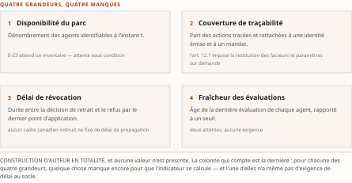
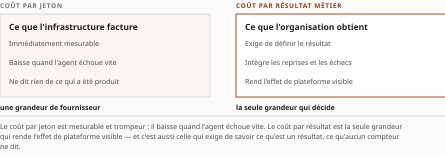

# Chapitre 40 — Les indicateurs de l'AgentOps et le FinOps des agents

*Livre IV — Appliquer, exploiter, produire et composer : AgentMesh, AgentOps, fabrique d'agents et
synthèse architecturale.
Second mouvement — exploiter (ch. 38-40). Troisième et dernier chapitre du mouvement : il traite la
troisième capacité — **mesurer un parc**.*

| Champ | Valeur |
|---|---|
| **Statut** | **Brouillon de rédaction, non publiable** — rédigé sur instruction d'auteur du 27 juillet 2026, **avant** les portes **G-3**, **G-4** et **G-5**, et hors de l'ordre de rédaction du PRD §6. ⚠ **G-3 a été franchie le 28 juillet 2026, soit APRÈS cette rédaction** (PRD v0.14 ; [`socle-consolide.md`](../PRD/socle-consolide.md), **159 entrées `S-001`…`S-159`**) : *une porte franchie ensuite ne rend pas recevable une pièce écrite avant elle* — la pièce se **relit** contre le socle consolidé, elle n'y a pas été écrite. **G-4 et G-5 demeurent ouvertes**, et **G-5 conditionne le Livre entier**. ⚠ **Ce chapitre porte le régime le plus contraignant du mouvement, et il le porte à son ouverture** : la **grille du § 40.2 est une construction d'auteur en totalité** (CA-IV-07) — *elle n'est ni une norme, ni un référentiel, ni la restitution d'un état du domaine, et rien ne l'oppose à quiconque.* **R-IV-40 et R-IV-41 valent pour tout le Livre** |
| **Date de gel** | **27 juillet 2026** — gel unique, **D-1 prise** ([`gel-2026-07-27.md`](../PRD/gel-2026-07-27.md)). ⚠ **Le volet de faits du résidu de G-1 a été instruit le 28 juillet 2026** ([`gel-2026-07-28-volet-residuel.md`](../PRD/gel-2026-07-28-volet-residuel.md)), et **son résultat est contrasté pour ce chapitre**. Le **relevé d'instrumentation tient à sa source** — `S-136`, `S-137`, `S-139` et `S-141` **☑ inchangée**, `S-138` et `S-140` **☑ inchangée (partielle)**, leurs décomptes d'outil demeurant non recomptés localement. **Un cardinal a CHANGÉ** — `S-142` : neuf dimensions relevées, **quatre constatées** (§ 40.1.6). Et **les entrées réglementaires sont revenues ☐ non établie**, l'hôte refusant l'accès : `S-114` — ⚠ **l'effet au 1ᵉʳ mai 2027 n'a pas été re-constaté**, et *un fait à échéance dont la re-datation manque se déclare, il ne se présume pas stable* —, `S-135` et `S-025` (article 12.1), `S-024` (avis 11-348), `S-042` (le seul statut de préversion, les deux réserves de fond demeurant entières). ⚠ *Instruire n'est pas confirmer* : la tentative a eu lieu, le constat manque. Gels de source : **21 juillet 2026** (Vol. III), **juin 2026** (Vol. I) |
| **Socle mobilisé** | ☑ **Le socle consolidé existe depuis le 28 juillet 2026** ([`socle-consolide.md`](../PRD/socle-consolide.md), **159 entrées**) ; ⚠ **la pièce n'y a pas été écrite et n'est pas réancrée sur la série consolidée** : elle cite ses appuis dans la série de leur volume d'origine, et **la correspondance vers `S-nnn` se lit à l'Annexe B §5, seul instrument de résolution** — *le numéro consolidé ne se dérive pas du numéro source*. Les énoncés résolvent contre le **Vol. III *Monographie* ch. 26**, dont les entrées **F-06**, **F-07**, **F-53**, **F-55**, **F-64**, **F-65**, **F-66**, **F-68**, **F-71**, **F-75**, **F-76**, **F-89**, **F-90**, **F-91**, **F-92**, **F-93**, **F-94**, **F-95**, **F-96**, **F-97**, **F-98** et les entrées héritées **H-04**, **H-06**, **H-07**, **H-08**, **H-12**, **H-14**, **H-15**, **H-23**, **H-27**, **H-28**, **H-33** **conservent leurs niveaux d'origine** ; et contre le **Vol. I *Monographie* §2.11.1 et §4.9.3-4.9.5**, qui entre **en [C]**. ⚠ **DEUX de ces entrées sont EXCLUES du socle consolidé, et l'exclusion est désormais prononcée plutôt qu'annoncée** (Annexe B §6.1) : **F-92** et **F-96**, pour **dette de vote adversarial déclarée et non conduite** — *et ce sont précisément les deux qui porteraient seules la thèse du chapitre.* Elles portent **« ⚖ vote dû, non conduit »** à chacune de leurs mobilisations, **chacune est adossée au relevé d'ensemble**, et **ce relevé, lui, est entré** : `S-136`, `S-137`, `S-139` et `S-140` portent la matière (Annexe B §6.1, alinéa d). ⚠ **H-15 n'entre pas davantage** — *hors socle factuel*, thèse du Vol. II à attribuer —, et la deuxième ligne du tableau 40.2 le déclare dans la cellule même. ⚠ **Aucun énoncé n'est central au sens de CA-IV-01, et le franchissement de G-3 n'y change rien** : la refonte **n'a conduit aucun vote adversarial** et **n'a confronté aucun énoncé à sa source primaire** |
| **Garde-fous balayés** | ⚠ **Règle de comptage, décision 16 du TOC** : les cardinaux ci-dessous portent sur le **marqueur littéral de l'identifiant** dans le **corps** de la pièce — de la première section à la synthèse, **en-tête et note de statut exclus** —, et ils sont **re-mesurés sur le corpus que le commit produit**. ⚠ **Un garde-fou appliqué sans que son identifiant soit écrit voit son DOMAINE déclaré, sans cardinal** (alinéa c) : *le domaine balayé est le corps entier, et les cardinaux antérieurs — qui comptaient les **applications** et non le marqueur — n'étaient re-mesurables par aucune règle écrite.* **Les deux séries sont balayées intégralement, zéros compris.** Vol. III — **R-09 : deux occurrences**, § 40.1 et § 40.6 ; **R-01 (le passeport n'existe dans aucune spécification) : une occurrence**, § 40.2 ; **R-03 (« AgentOps » au sens du ch. 38 § 38.0, siège unique, non redéfini) : une occurrence**, § 40.0 ; **R-06 (« attendu par E-23 », jamais « exigé ») : une occurrence**, § 40.2, ⚠ **et c'est la contrainte structurante du chapitre — deux régimes qui ne se confondent pas, appliqués à chaque rangée du tableau 40.1 sans que l'identifiant y soit répété** ; **R-07 (inférence produit ↔ réglementation) : une occurrence**, § 40.1 ; **R-13 : une occurrence**, § 40.6 — *l'autonomie graduée y est nommée par son cardinal, jamais nue* ; **R-14 (trois degrés d'absence) : une occurrence**, § 40.4. **R-02 : zéro occurrence de l'identifiant** — ⚠ *garde-fou appliqué, domaine déclaré sans cardinal (décision 16, alinéa c)* ; **R-04, R-05, R-08, R-10 à R-12 : zéro occurrence.** Vol. II — **métriques et qualifications auto-déclarées (marqueur « auto-déclaré ») : six occurrences**, § 40.1 (deux), § 40.2 (deux), § 40.5 et § 40.6, **chacune attribuée à son éditeur ou à ses auteurs nommés, sans exception d'usage illustratif** ; **R-7 : une occurrence**, § 40.1, *nommé par volume*. **R-1 à R-6, R-8 : zéro occurrence** |
| **Volumétrie cible** | ≈ **6 500 mots** de corps (§ 40.0 à la synthèse), **cible dérivée** de l'enveloppe du Livre (**69 000 mots**, TOC v0.25) au prorata des six sections et du volume de source consommé. ☑ **Décompte publiable depuis G-2** ; **réel : 6 080 mots** par [`PRD/decompte.sh`](../PRD/decompte.sh), soit **−6,5 %** — re-mesuré au terme de la **troisième** relecture du 28 juillet 2026 ; **6 075** (−6,5 %) à la deuxième, **5 993** (−7,8 %) à la première, **5 564** (−14,4 %) au commit d'arbitrage qui les a précédées. ⚠ **L'écart s'est réduit par bornage et par attribution, jamais par ajout de matière** — noms propres rétablis, re-datations portées, sièges nommés. ⚠ Le [`README.md`](README.md) du dossier porte encore **5 564** : son réalignement est **remonté**. **D-4 s'applique, et elle interdit l'amputation comme le gonflement** |

> **Thèse** *(citée depuis le [`TOC.md`](../PRD/TOC.md) **v0.28**, entrée du chapitre 40 — **thèse réalignée en v0.28**, décisions 8 et 14, remontée R-IV-48, TRIPLE)* — la discipline naissante n'a pas d'indicateur de référence **dans le corpus que le Vol. III a ouvert** ; les métriques **relevées** y sont **au grain de l'opération et auto-déclarées**, ⚠ **trois sources ne faisant pas un marché et aucun balayage de marché n'ayant été conduit** ; grille minimale dérivée de **ce que les cadres des Livres III-IV attendent ou imposent** — ⚠ **et les deux régimes ne se confondent pas : un seul des quatre instruments impose, deux attendent à échéance du 1ᵉʳ mai 2027, le quatrième déclare ne créer aucune exigence** (R-06 du Vol. III) —, présentée comme **construction d'auteur en totalité** ; le modèle de coût agentique est une contrainte d'ingénierie de premier ordre.

⚠ **La thèse portait, à la rédaction, TROIS formes que sa source avait elle-même bornées — c'était le
désalignement le plus dense de ce Livre, et le réalignement est FAIT** (décision 17 du TOC, alinéa c).
**Forme antérieure, v0.25** : « la discipline naissante n'a pas ses indicateurs de référence ; les
métriques **publiées** sont **hétérogènes** et auto-déclarées — grille minimale dérivée des
**obligations** des Livres III-IV, présentée comme construction d'auteur ; le modèle de coût agentique
est une contrainte d'ingénierie de premier ordre ». **Les trois bornes portées au plan sont
celles-ci.**

1. **« n'a pas ses indicateurs de référence », sans borne.** Le Vol. III a **réécrit sa thèse le
   21 juillet 2026** (écarts ÉC-13 à ÉC-16) et écrit : « n'a pas d'indicateur de référence **dans le
   corpus que ce volume a ouvert** ». *La forme large est un fait négatif de corpus sur un corpus non
   balayé* — la forme même que R-14 du Vol. III proscrit.
2. **« les métriques publiées sont hétérogènes ».** Le Vol. III **refuse expressément le mot
   « publiées »** comme qualification de son corpus : ce qui a été ouvert est **un corpus de
   spécification à son premier échelon de maturité et deux catalogues d'éditeurs**, et **aucun
   balayage d'un marché n'a été conduit**. *Trois sources ne font pas un marché, et « hétérogènes »
   énonce une propriété du marché.*
3. **« dérivée des obligations des Livres III-IV ».** ⚠ **C'est le désalignement qui coûte le plus
   cher, parce qu'il fabrique une obligation.** Des quatre instruments que la grille mobilise, **un
   seul impose** — l'article 12.1 — ; **deux attendent** — E-23 et la ligne directrice de l'AMF —,
   et leurs attentes sont **PROGRAMMÉES au 1ᵉʳ mai 2027**, non en vigueur ; **le quatrième déclare
   lui-même ne créer ni modifier aucune exigence**. *Écrire « obligations » confond les deux régimes
   que R-06 du Vol. III interdit expressément de confondre.*

**Le corps a été écrit sous les trois formes bornées** et l'écart avait été **remonté** (R-IV-48,
§ 40.7). ☑ **La remontée est soldée par l'arbitrage v0.28 du TOC** (décisions 8 et 14), et **la citation
ci-dessus porte la forme réalignée**, reportée **par copie** depuis l'entrée courante du plan.
*Ni la v0.29 ni la v0.30 du TOC ne modifient une thèse du Livre.*

---

## § 40.0 — Ouverture : la règle que le chapitre s'applique à lui-même

Lecture de l'auteur — **marquage porté à l'ouverture de la pièce, et il régit le chapitre entier**
(CA-IV-07). **Ce que le socle établit** : un relevé daté et borné de **seize métriques normalisées**,
de leurs types, de leurs unités, de leur statut de maturité et de leurs dimensions, plus **deux
catalogues d'éditeurs nommés** — ⚠ *l'un daté, l'autre sans date, sans version ni statut, et le
§ 40.1.6 le dit à sa mention*. **Ce qu'il n'établit pas** : **la moindre grandeur de parc**.
⚠ **Aucune des quatre grandeurs que le § 40.2 retient n'a de répondant dans les seize métriques
relevées** ; elles sont **dérivées, dans cette pièce et par elle**, de ce que les cadres du Livre III
attendent ou imposent et de ce que le ch. 37 documente au point d'application. **La grille du § 40.2
est donc une construction d'auteur en totalité** : *le lecteur peut la refuser sans qu'aucun des faits
du § 40.1 ne tombe — c'est la propriété que le chapitre revendique, et la seule.*

**Le chapitre porte enfin une règle qu'il s'applique à lui-même : il ne produit aucun chiffre qu'il ne
puisse tracer.** Chaque cardinal du § 40.1 porte son fichier, sa date de consultation et son entrée ;
le § 40.2 ne produit **aucune valeur**, seulement des questions et l'énoncé de ce qui manque pour y
répondre. ⚠ *Une grille d'indicateurs qui livrerait des seuils sans dénominateur fabriquerait
exactement ce que la somme prend pour objet.*

⚠ **Le terme « AgentOps » n'est pas redéfini ici** : son siège est au **ch. 38 § 38.0**, qui le pose
au sens du Vol. III — *discipline d'exploitation, non produit* (R-03 du Vol. III). ⚠ **Et la
frontière avec le ch. 38 tient en une phrase** : *il nomme et rattache, ce chapitre compte.*

**Le chapitre se lit en six temps** : ce que le corpus compte réellement (§ 40.1) ; la grille dérivée
et ce qui lui manque (§ 40.2) ; l'horizon de tâche déléguée, front ouvert (§ 40.3) ; les indicateurs
de la supervision humaine, et ce qu'ils ne mesurent pas (§ 40.4) ; le coût comme contrainte de
conception (§ 40.5) ; et son pilotage à l'échelle (§ 40.6).

## § 40.1 — Recension critique des métriques relevées : ce qui a été ouvert, et ce que cela compte

### 40.1.1 Le périmètre d'abord, parce que tout le reste s'y borne

**Trois fichiers** d'un dépôt dédié ont été **balayés** le 21 juillet 2026 — un document de métriques,
un document de jonction, un fichier de modèle de métriques ; **deux pages d'éditeurs ont par ailleurs
été consultées**, hors de ce périmètre de balayage.
⚠ **« Balayés » n'est pas « ouverts », et la distinction porte la borne** : les entrées mobilisées
plus bas citent en outre **deux groupes d'attributs** d'un fichier de segments et **la définition et
la note du registre d'attributs**, qui sont des **consultations ponctuelles, hors du périmètre de
balayage**. *La borne des faits négatifs qui suivent porte sur les trois fichiers balayés, non sur ces
consultations.*

**Ce que ce lot n'a pas balayé est énuméré** : les **neuf** autres fichiers Markdown du répertoire, le
fichier de segments hors deux groupes, et le fichier d'événements (Vol. III **F-96**,
**[B, degré 1]** ; ⚖ **vote dû, non conduit**).

⚠ **Aucun numéro de version n'est citable** — le dépôt dédié ne porte **ni publication ni étiquette**
(Vol. III **F-75**, **[B, degré 2]** ; **siège ch. 38 § 38.2**) —, et les conventions relevées sont au
**premier des cinq échelons** de maturité (Vol. III **F-76**, **[B]** ; même siège). *C'est le statut
le plus volatil de l'échelle, et R-09 du Vol. III impose de le dire à chaque mention.*

### 40.1.2 Ce que le corpus compte

Le document de métriques porte en tête « **Status**: Development » et définit **douze** métriques à son
tableau récapitulatif ; **les douze sont de type histogramme** et portent la stabilité `development`,
relevé **contre-vérifié au champ d'instrument du fichier de modèle** (Vol. III **F-90**, **[B]**).
⚠ **Deux marquages qui ne se fusionnent pas** : le statut du **document** est distinct de la valeur de
stabilité portée par chaque **métrique**.

**Quatre des douze portent sur l'agent ou le flux de travail**, les huit autres sur le client, le
serveur ou l'exécution d'un outil ; ⚠ **la partition est faite sur le préfixe du nom, non sur une
taxinomie déclarée par la source** (Vol. III **F-91**, **[B]**). Le document de jonction, au même
statut, en définit **quatre de plus, toutes des histogrammes** d'unité seconde (Vol. III **F-95**,
**[B, degré 1]**). **Seize au total.**

### 40.1.3 Ce qu'elles ne comptent pas, et il faut l'écrire au degré exact

Les seize sont définies **au grain d'une opération, d'une invocation ou d'une session unitaire**, et
**aucune n'est un compteur ni une jauge portant sur un ensemble d'agents** (Vol. III **F-96**,
**[B, degré 1]** ; ⚖ **vote dû, non conduit**).

⚠ **Fait négatif de degré 1, borné aux trois fichiers nommés et à cette date** : *il n'établit pas
qu'une métrique de parc n'existe nulle part* — ni ailleurs dans ce dépôt, ni dans le dépôt principal,
ni chez un éditeur. ⚠ **Écrire « le socle ne documente pas de métrique de parc, *donc* il n'en existe
pas » est proscrit.**

**La borne que la source porte elle-même est décisive** : la métrique de durée d'invocation mesure
« a single **in-process** agent invocation » (Vol. III **F-91**, **[B]**). *Une invocation en processus
n'est ni une délégation, ni une chaîne de mandat, ni un parc.*

### 40.1.4 La dimension d'agent est un nom, pas une identité

⚠ **C'est le constat qui fait entrer ce chapitre dans la somme.** Dans les deux fichiers ouverts, la
seule référence d'agent est un **nom lisible par un humain fourni par l'application** ; l'identifiant
stable — que le registre d'attributs définit pourtant comme « The unique and stable identifier of the
GenAI hosted agent resource » — compte **zéro occurrence** dans le document de métriques, et le groupe
d'attributs qui alimente la métrique d'invocation **ne référence que ce nom lisible et un identifiant
de modèle de requête** (Vol. III **F-92**, **[B, degré 1]** ; ⚖ **vote dû, non conduit**).

⚠ **Ne pas écrire « l'instrumentation ne permet pas d'identifier un agent »** : *le registre définit
l'identifiant stable* ; ce que le relevé établit est plus étroit — **les métriques relevées agrègent
par nom lisible, non par identifiant stable**.

S'y ajoute un **balayage de sept chaînes exactes** sur le même document : identité, délégation,
révocation, audit, autorisation, identifiant de conversation et identifiant d'appel d'outil comptent
**zéro occurrence chacune** (Vol. III **F-93**, **[B, degré 1]**). ⚠ **Un balayage de sept chaînes
n'est pas un balayage sémantique**, et il porte sur ce fichier seul : *deux de ces chaînes sont
définies ailleurs dans le dépôt* — **leur absence ici signifie qu'elles ne sont pas des dimensions de
métrique, non qu'elles n'existent pas.**

### 40.1.5 Deux réserves de méthode renforcent le constat au lieu de l'affaiblir

*Un* : **la dimension d'agent est facultative** — « Conditionally Required — When available » sur la
durée d'invocation, « Recommended » sur les deux compteurs d'appels. *Deux* : le nom de flux de
travail **« MUST have low cardinality »** et, selon la note du registre, **ne doit pas être capturé par
défaut si aucun nom de faible cardinalité n'est disponible** pour le cadriciel (Vol. III **F-94**,
**[B]**).

⚠ **La contrainte de cardinalité n'est pas un défaut de la spécification** : c'est une **règle
d'hygiène standard en métrologie de séries temporelles**. *Le chapitre ne la critique pas ; il
constate qu'elle **exclut** le dénombrement d'un parc par cette voie.* **Une clé d'agrégation qui peut
légitimement manquer n'est pas un dénominateur.**

Enfin, les deux compteurs d'appels comptent **les appels directs** de l'agent, ceux de sous-agents ou
d'agents auxquels la tâche est transférée étant **attribués séparément** (F-96 ; ⚖ **vote dû, non
conduit**). ⚠ **Une chaîne de délégation n'est donc pas reconstituable par sommation** — *borne à
exploiter, non à déplorer*, et elle commande le § 40.3.

### 40.1.6 Deux catalogues d'éditeurs, nommés parce que les anonymiser serait une faute

Selon la page de référence des évaluateurs intégrés de **Microsoft Foundry**, horodatée du
2 juin 2026, cet éditeur **déclare onze évaluateurs d'agents, dont cinq portent la mention de
préversion et six ne la portent pas sur cette page** ; deux évaluateurs de risque y visent nommément
l'agent (Vol. III **F-97**, **[B]**). ⚠ **Qualifications auto-déclarées par cet éditeur, sans
vérification indépendante.** ⚠ **L'absence de la mention de préversion sur une ligne n'est pas une
déclaration de disponibilité générale** : l'avertissement de la page ne régit, à la lettre, que les
éléments qui la portent — *ne pas écrire que six évaluateurs sont en disponibilité générale.*

⚠ **Un évaluateur n'est pas une métrique normalisée** : instrument propriétaire, **sans définition
partagée d'unité ni de cardinalité**, et **aucune page ouverte n'établit de correspondance** avec les
attributs d'instrumentation. ⚠ **L'évaluateur de risque le plus proche du sujet mesure une capacité
et non une conformité** — *instrument d'épreuve adverse, non indicateur de conformité d'un mandat en
production* (siège **ch. 39 § 39.1**, qui n'est pas reconstruit ici).

Selon la page de métriques de **Langfuse**, **consultée sans numéro de version, sans date et sans
mention de statut**, cet éditeur **déclarait, au relevé du 21 juillet 2026, quatre mesures et neuf
dimensions de découpage** (Vol. III **F-98**, **[B]**). ⚠ **Qualification auto-déclarée par Langfuse,
sans vérification indépendante**, et *ce sont des **catégories**, non des identifiants de métriques ;
il n'est pas établi qu'elles constituent une spécification.* ⚠ **Ce cardinal a changé, et l'entrée le
porte** : l'instruction du 28 juillet 2026 constate **quatre dimensions**, sur deux récupérations
indépendantes concordantes, le décompte des mesures demeurant **ambigu à l'instrument** — trois ou
quatre selon la lecture d'une entrée — et la page restant **sans version, sans date et sans statut**
(`S-142`, **☑ changée** ; date du changement **non établissable par cette voie**). *Une page qui ne se
date pas ne se re-date pas non plus : elle se re-lit.*

**Trois grains, aucun identifiant commun — et trois sources ne font pas un marché.** ⚠ **L'entrée ne
soutient aucun énoncé sur l'état du marché de l'observabilité agentique**, ni sur une convergence, ni
sur une divergence générale. **Huit plateformes n'ont pas été instruites par le lot, et elles se nomment** :
**Arize Phoenix**, **LangSmith**, **W&B Weave**, **Traceloop**, **Grafana**, **Elastic**, **AWS** et
**Datadog** — **Datadog étant la seule des huit dont deux pages ouvertes n'ont nommé aucun
identifiant de métrique**, et **l'échec sur Arize Phoenix un 404 sur une adresse construite par
déduction** — ⚠ *une adresse devinée qui échoue n'établit aucune absence.* ⚠ **Les nommer est
obligatoire** (décision 15 du TOC, alinéa b) : *un lot dont les sources à instruire ne sont pas
nommées a un critère de clôture inexécutable.* ⚠ **Aucune métrique d'adoption n'a été cherchée ni
relevée** pour aucun des trois.

⚠ **Et le rapprochement entre un instrument d'observabilité et une attente réglementaire demeure en
tout état de cause une inférence d'auteur** (R-07 du Vol. III ; ⚠ **et R-7 du Vol. II pour
l'instrumentation d'E-23 par le produit de gouvernance que ce garde-fou nomme — deux garde-fous
distincts sur le même geste, nommés par volume**). Le socle n'attache sa clause renforcée qu'à
**watsonx.governance**, produit de gouvernance de modèles d'**IBM** — pour lequel **cet éditeur ne
revendique aucune conformité et aucune source ne documente le lien avec E-23** : fait négatif
**ÉTABLI**, degré 2 (Vol. III **H-14**, **[B]**) ; ⚠ **pour les deux catalogues ci-dessus, le socle ne
documente aucun lien avec un cadre réglementaire** — absence de documentation, **degré 3**. *Les deux
formules ne s'échangent pas — on a cherché et consigné une réserve d'un côté, on n'a rien de l'autre ;
le tableau du ch. 38 § 38.4 en est le siège.*

**Le dernier apport vient du socle hérité, et il porte sa réserve.** Le cadre empirique de
**Rinderle-Ma, Mangler et coll.** relève que **quatre propriétés sur cinq sont instrumentées,
l'autonomie n'en ayant aucune** (Vol. III **H-12**, **[B]** — ⚠ **préimpression non révisée par les
pairs, source unique, sans reproduction indépendante**). *Constat d'une préimpression, non propriété
établie du domaine : il **corrobore** l'asymétrie que le relevé montre, il ne la fonde pas.*

## § 40.2 — La grille minimale : ce que l'architecte doit pouvoir répondre à l'auditeur

### 40.2.1 La contrainte de modalité, posée avant les grandeurs

⚠ **Elle se pose avant, sous peine de fabriquer une obligation.** Les instruments du Livre III **ne
portent pas le même mode**, et **les deux régimes ne se confondent pas** (R-06 du Vol. III).

| Instrument | Mode | Ce que le socle établit du mode | Effet |
|---|---|---|---|
| **E-23** | **attend** | ligne directrice **fondée sur des principes** : ses **douze énoncés numérotés sont au *should***, sans occurrence de *must* au corps de la version anglaise balayée (**F-64**, [B, degré 1]) ; ⚠ **la forme « attend » se prend au document d'information de l'éditeur du 11 septembre 2025**, non au texte de la ligne directrice (**F-66**, [B, degré 1]) | **PROGRAMMÉE, 1ᵉʳ mai 2027** |
| **Ligne directrice de l'AMF** | **s'attend à ce que…** | formulation relevée à son texte (**F-68**, [B]) | **PROGRAMMÉE, 1ᵉʳ mai 2027** — ⚠ **effet non re-constaté au 28 juillet 2026**, l'hôte refusant l'accès (`S-114`, ☐ non établie) |
| **Avis 11-348 des ACVM** | **n'impose pas** | ⚠ **borné aux marchés de capitaux**, le socle n'établissant pas qu'il porte au-delà, et **déclarant lui-même que ses indications ne créent ni ne modifient aucune exigence** — *rendu français, l'instrument étant en anglais* (**H-07**, [B] ; instruit au **ch. 28**) | sans effet obligatoire |
| **Article 12.1** | **impose** | obligation d'informer et, **sur demande**, de communiquer « des raisons, ainsi que des principaux facteurs et paramètres, ayant mené à la décision » (**F-89**, [B] ; **H-06**, [B]) | **en vigueur depuis le 22 septembre 2023** — ⚠ **texte non re-récupéré au 28 juillet 2026**, l'éditeur officiel refusant l'accès (`S-135` et `S-025`, ☐ non établie) |

: Tableau 40.1 — Les quatre instruments dont la grille dérive, et leur mode. ⚠ **Des quatre, un seul impose, et son obligation est la seule en vigueur à la date du gel de source.** *Une grille qui présenterait au présent ce qui n'a pas d'effet avant 2027 fabriquerait l'obligation que ce paragraphe s'emploie à ne pas fabriquer.*

⚠ **« PROGRAMMÉE » n'est pas un mot du chapitre mais une étiquette de tri** : elle vient
du **tri prospectif** hérité du Vol. I (Vol. III **H-33**, **[C]**, thèse attribuée), dont **le siège
dans la somme est au ch. 49 § 49.0** — *ce chapitre l'emploie, il ne le définit pas.*

⚠ **Le rang est borné à ces quatre instruments et ne porte pas sur le Livre III entier** — le **ch. 32**
en instruit un cinquième, dont **la loi impose une norme technique unique** fixée par un organisme
désigné (Vol. III **H-08**, **[A]**), **sans effet sur la dérivation de ce chapitre**. Et **le ch. 37
ne porte aucune obligation** : il documente une architecture et un point d'application, **non une
prescription**.

### 40.2.2 Quatre grandeurs, et le motif de chacune

⚠ **Le premier mot est ambigu, et le chapitre tranche son emploi plutôt que de le laisser flotter** :
**« disponibilité du parc » ne désigne pas ici un taux de fonctionnement** — sens que le terme a en
exploitation classique — mais le **dénombrement** : *la part du parc déclaré qui, à un instant donné,
est identifiable et énumérable.* **Le choix est de l'auteur** ; il est fait parce que **la question de
l'auditeur porte sur l'inventaire, non sur la panne**.

| Grandeur *(construction d'auteur)* | Ce qu'un instrument du Livre III attend ou impose | Ce que le ch. 37 rend au point d'application | Ce que le relevé du § 40.1 offre | Ce qui manque pour que l'indicateur se calcule |
|---|---|---|---|---|
| **Disponibilité du parc** — dénombrement des agents identifiables à l'instant *t* | E-23 **attend** — au titre de son document d'information — un **inventaire à l'échelle de l'entreprise des modèles à risque inhérent non négligeable** ; ⚠ **attente sous condition de matérialité, non inventaire universel**, et **PROGRAMMÉE** (**F-65**, [B] ; **H-04**, [A/B mixte]) | le mécanisme d'autorisation par arête **ne répond pas à Q-A** — *première question de la grille du **ch. 14*** : évaluation d'une politique, **non émission, vérification ni révocation d'un identifiant** (**F-71**, [B] ; siège ch. 37 § 37.4) | une dimension d'agent qui est un **nom lisible**, **facultative**, et un nom de flux contraint à faible cardinalité (**F-92**, ⚖ vote dû ; **F-94**) | un **dénominateur** : ⚠ **le socle ne documente aucune source d'énumération du parc opposable à l'inventaire attendu** — degré 3 |
| **Couverture de traçabilité** — part des actions tracées **et** rattachées à une identité émise et à un mandat | l'art. 12.1 **impose** la restitution des facteurs et paramètres **sur demande** (**F-89**) ; E-23 **attend** une **surveillance continue** visant la décision et la re-paramétrisation autonomes, **PROGRAMMÉE** (**H-04**, **F-65**) | ⚠ **Lecture de l'auteur reprise du ch. 37 § 37.8, qui la marque comme telle** — un point d'application que toute interaction traverse est **structurellement** producteur de trace non délégué à l'observé, **propriété d'emplacement, non de qualité**. *Ce que le socle établit s'arrête aux deux énoncés qu'elle compose* : la trace produite par le cadre (**H-15**, thèse du Vol. II, **hors socle factuel**) et la journalisation confiée aux agents « n'est généralement pas recommandée » (**H-12**, [B], préimpression, source unique) | des **durées d'opération**, **aucune dimension d'identité, de mandat ni de conversation** (**F-93**, [B, degré 1]) | la **clé de jointure** entre la trace et la chaîne de mandat — ⚠ **lacune ouverte, aucune passe conduite** (siège **ch. 38 § 38.5** ; **F-95**) |
| **Délai de révocation** — durée entre la décision de retrait et le refus par le dernier point d'application | ⚠ **Le socle ne documente pas qu'un des cadres canadiens instruits fixe un délai de propagation d'un retrait** — **aucun balayage de ces textes sur cette question n'a été conduit** : degré 3 | un point d'application **ne peut pas vérifier une fraîcheur dont aucun mécanisme ne lui fournit le moyen** (ch. 37 § 37.8) ; la révocation en cascade est au **degré 3** (ch. 20) | **zéro occurrence** de « revocation » dans le document de métriques (**F-93**) ; **aucune métrique de statut** | **les deux bornes de la mesure** : l'interdiction d'employer une clé révoquée est au **MUST NOT** **sans mécanisme d'établir ce statut** (**F-07**, [A] ; **F-06**, [A, degré 1], borné à une seule section) ; le précédent des infrastructures à clés publiques **n'offre pas le secours qu'on lui prête** (**F-53**, [B]) ; un régime d'états **prescrit sans délai de propagation** n'entre qu'en **corroboration** (**F-55**, [C, degré 1]) |
| **Fraîcheur des évaluations** — âge de la dernière évaluation de chaque agent, rapporté à un seuil | E-23 **attend** une surveillance continue (**H-04**, **F-65**) ; l'AMF **s'attend à ce que…** (**F-68**) — ⚠ **deux attentes, aucune exigence**, l'une et l'autre **PROGRAMMÉES** | ⚠ **Le socle ne documente pas ce qu'un maillage produit d'imputabilité traçable jusqu'à une personne ou une entité juridique** — **Q-E, cinquième question de la grille du ch. 14, est une case vide au degré 3** (siège **ch. 37 § 37.4**) | onze évaluateurs nommés par **Microsoft Foundry**, **cinq en préversion déclarée** (**F-97**, [B]), à deux niveaux d'évaluation (**F-98**, [B]) — ⚠ **qualifications auto-déclarées par cet éditeur** | un **horodatage d'évaluation exportable** : **aucune des seize métriques n'en porte**, et **aucune page ouverte n'établit de correspondance** entre un évaluateur d'éditeur et un attribut d'instrumentation (**F-97**) |

: Tableau 40.2 — Grille minimale d'indicateurs de l'AgentOps — **construction d'auteur en totalité**, au 21 juillet 2026. ⚠ **Aucune valeur, aucun seuil, aucun barème : la colonne de droite est le résultat.**

### 40.2.3 Trois règles d'emploi, et c'est la seule chose que la grille prescrit

*Un* : **aucune grandeur ne s'écrit en taux tant que son dénominateur n'est pas établi** — elle
s'écrit **en question**, et *l'énoncé du manque tient lieu de valeur*. *Deux* : **tout chiffre porté
dans une case porte sa source et sa date à chaque occurrence**, sans exception d'usage illustratif —
⚠ *un chiffre auto-déclaré qu'on cesse d'attribuer devient, en trois citations, un fait*. *Trois* :
**la grille ne s'oppose à personne** — elle n'est **ni une norme, ni un référentiel d'audit, ni un
engagement contractuel** ; ⚠ **le socle ne documente aucun référentiel d'indicateurs de parc agentique
opposable** : absence de documentation, non fait négatif vérifié.

**La grille est falsifiable, et il faut dire par quoi.** Une métrique normalisée **portant une
dimension d'identité stable ou de mandat** renverserait les deux premières lignes ; **un mécanisme
documenté de propagation d'un retrait avec budget de fraîcheur** renverserait la troisième ; **une
correspondance publiée entre un évaluateur d'éditeur et un attribut de convention** renverserait la
quatrième. ⚠ **Chacune de ces réfutations devrait alors être écrite, non contournée.**

⚠ **Et ce que la grille mesurerait est la fraîcheur d'un objet construit.** Les quatre grandeurs se
rattachent à la **boucle de revalidation** qui remonte de l'exploitation vers l'émetteur, laquelle
**réaliserait** le quatrième terme que le Vol. I ajoute à l'invariant (Vol. III **H-27**, **[C]** —
**thèse d'un volume antérieur, à attribuer**, ne portant ici aucun fait central ; ⚠ `S-153`, **☐ non
établie**, sa source désignée étant un fichier du Vol. I **retiré du dépôt le 22 juillet 2026** —
**D-5**). ⚠ **Le passeport d'agent ne figure dans aucune spécification à date : c'est un objet de
synthèse construit par la somme** (R-01 du Vol. III ; siège **ch. 16**). *Les quatre grandeurs
décrivent donc la fraîcheur d'un
objet construit, et le chapitre l'écrit ainsi plutôt que de laisser croire à la métrologie d'un
artefact existant.*

⚠ **Un indicateur qui ne réémet rien mesure sans corriger.** Ce que la grille **déclenche en amont du
parc** — la correction du gabarit dont l'agent est issu — est au **ch. 41 § 41.5**, matière neuve,
**risque 16 du TOC** ; **la grille elle-même reste ici**, et *le renvoi n'est pas une reconstruction*.

## § 40.3 — La métrique d'horizon de tâche déléguée : état d'un front ouvert

⚠ **L'horizon de tâche déléguée n'est pas une métrique publiée, et ce chapitre n'en fait pas une.**

Le Vol. I le range parmi ses **manques structurants** : il formule le besoin d'une science de
l'évaluation inter-fournisseurs, condition de toute certification, **et d'une métrique d'horizon de
tâche déléguée** (Vol. III **H-28**, **[C]**), et relève qu'à juin 2026 l'évaluation des systèmes
d'agents est **largement immature, sans bancs d'essai inter-fournisseurs reconnus**, l'horizon mesuré
portant sur un **agent isolé** et non sur une délégation inter-agents (Vol. III **H-23**, **[C]**).

⚠ **Les deux entrées sont des repérages** : elles entrent du Vol. I, dont la vérification porte sur
les **références** et non sur le **contenu des affirmations**, et *une affirmation tracée vers une
entrée [C] n'est pas centrale, ou n'est pas rédigée*. **Elles situent la question ; elles ne
l'établissent pas.** ⚠ **Et leurs états de re-datation diffèrent**, ce qui borne inégalement les deux
moitiés du constat : `S-149` (**H-23**) est **☑ inchangée**, ses deux références résolvant à leurs
identifiants exacts — *mais le manque structurant qu'elle nomme est un énoncé du Vol. I, non de la
source citée, et il n'a pas été instruit* ; `S-154` (**H-28**) est **☐ non établie**, sa source
désignée étant la *Synthèse* du Vol. I, **supprimée du dépôt le 22 juillet 2026** — ⚠ *une citation
non rejouable
n'est pas une citation fautive : elle cesse d'être opposable sans cesser d'être exacte* (décision
d'auteur **D-5**). ⚠ **Le chapitre n'écrit donc pas « il n'existe pas de métrique d'horizon de tâche
déléguée »** : il écrit que **deux entrées de repérage rangent cette métrique parmi les manques
déclarés d'un volume antérieur, et que rien n'a été instruit qui les confirme ou les infirme.**

**Ce que le relevé du § 40.1 permet néanmoins d'établir est étroit et il est utile.** Les deux
compteurs d'appels comptent les appels **directs**, ceux des sous-agents ou des agents auxquels la
tâche est transférée étant **attribués séparément** (F-96 ; ⚖ **vote dû, non conduit**). **Une chaîne
de délégation n'est donc pas reconstituable par sommation** — ⚠ *non par insuffisance de l'instrument,
mais par construction déclarée de sa sémantique.*

Le constat **rejoint la frontière que le ch. 17 localise** : elle ne passe pas à un rang numéroté de
sauts, mais **au premier changement de régime**. *Une grandeur d'horizon suppose de savoir jusqu'où va
une délégation ; le corpus ouvert documente le contraire — un instrument qui compte au plus près, et
qui le déclare.* ⚠ **Aucune autre voie n'est écartée** : **le socle ne documente aucun autre mécanisme
d'agrégation d'une chaîne de délégation à des fins de mesure** — degré 3.

⚠ **Partage déclaré avec le ch. 49** : **la métrique et son état se traitent ici** ; **l'énoncé de
recherche qui en sort** est transmis au **ch. 49 § 49.13**, *qui ne la reconstruit pas*. ⚠ **Le ch. 49 n'était
pas rédigé à la date de cette pièce** ; *il l'est depuis, hors portes, et le renvoi résout contre du texte* —
voir la note de statut.

## § 40.4 — Les indicateurs de la supervision humaine

⚠ **Cette section n'a aucune source externe, et le plan le montre par sa forme** : elle est la seule
du chapitre dont l'entrée au TOC ne porte **aucun marqueur de provenance**. *Ce n'est pas un oubli du
plan : il n'y a rien à marquer.*

**Deux grandeurs sont proposées, et les deux sont des constructions d'auteur** : le **délai médian de
révision** — temps écoulé entre la présentation d'un acte à un réviseur humain et sa décision — et le
**taux de renversement** — part des actes présentés que le réviseur infirme.

Lecture de l'auteur — **ce que le socle établit** : que **deux instruments du Livre III attendent une
supervision** dont ils ne définissent ni la forme ni la mesure (F-65, F-68, H-04) ; que **l'article
12.1 ménage, dans un alinéa distinct, l'occasion de présenter ses observations à un membre du
personnel *en mesure de réviser la décision*** (F-89, H-06). **Ce qu'il n'établit pas** : qu'une de ces
deux grandeurs soit mesurée, mesurable, attendue sous ce nom, ni qu'elle mesure quoi que ce soit de la
qualité de la révision.

⚠ **Et c'est ici qu'il faut être le plus net, parce que la section touche un vide déclaré ailleurs
dans la somme.** Ces deux grandeurs sont des **approximations imparfaites du tamponnage** — la supervision qui
s'exerce sans exercer de discernement. Or **le ch. 17 § 17.5 est le siège de cette matière, et il
n'écrit rien** : le plan l'a déclaré **front neuf, sources primaires à établir avant rédaction**, la
section **expose le vide et refuse de le combler**, et la décision d'auteur **D-9** a **ouvert un lot
d'instruction** en maintenant le blocage des **ch. 25 et 27**.

⚠ **Conséquence, écrite plutôt que contournée.** *Mesurer la révision n'est pas mesurer le
discernement.* **Un délai médian de révision élevé ne prouve pas l'attention**, et **un taux de
renversement bas ne prouve pas la justesse de l'acte** — il est **exactement aussi compatible avec un
agent qui a raison qu'avec un réviseur qui ne lit pas**. **Le socle ne documente aucun moyen de
distinguer les deux** : absence de documentation, non fait négatif vérifié (R-14 du Vol. III,
degré 3). *Deux indicateurs qui ne discriminent pas entre l'hypothèse favorable et l'hypothèse
défavorable ne mesurent pas ; ils rassurent.*

⚠ **Ce que la somme peut donc écrire ici est borné à trois choses**, et elles sont dites plutôt
qu'étendues : *(a)* les deux grandeurs sont **calculables** — un point d'arrêt humain outillé produit
des horodatages et des décisions ; *(b)* elles sont **des approximations dont l'écart au phénomène n'est pas
estimé**, et l'estimer suppose la littérature que le lot de **D-9** doit ouvrir ; *(c)* **aucun seuil
n'est proposé**, et *proposer un seuil ici serait produire une construction d'auteur à l'endroit exact
où le socle est muet — la faute que le ch. 17 § 17.5 s'est interdite.*

⚠ **Une remontée en découle** : le lot ouvert par D-9 nomme les **ch. 25 et 27** comme dépendants,
**et cette section l'est aussi** — voir R-IV-49 (§ 40.7).

## § 40.5 — Le modèle de coût agentique comme contrainte d'ingénierie de premier ordre

*← Vol. I* Monographie *§2.11.1 — **seule affectation** : le ch. 38 ne la revendique plus. ⚠ Section
en **[C]** de bout en bout, le socle du Vol. III n'en portant aucun équivalent.*

**Le coût d'un système agentique n'est pas une variable d'ajustement *a posteriori* mais une
contrainte de conception au même rang que la latence ou la justesse.** ⚠ **Repérage [C], thèse d'un
volume antérieur à attribuer** — *et le poser ici plutôt qu'au § 40.6 est un choix du plan, non un
constat.*

**La cause première est la forme de la boucle.** Chaque pas réinjecte l'historique croissant — invite
système, trace de raisonnement, observations d'outils — dans la fenêtre de contexte, de sorte que
**l'intensité en jetons d'une trajectoire croît au moins linéairement, souvent davantage, avec le
nombre de tours**. **Trois multiplicateurs structurels s'y ajoutent.**

1. **Les modèles de raisonnement facturent les jetons de réflexion** produits sous un budget dédié,
   **dont les rendements décroissent au-delà d'un seuil** : *le budget de raisonnement est autant un
   levier de coût qu'un levier de qualité.*
2. **La bascule vers une topologie multi-agents amplifie fortement la dépense.** ⚠ **Métrique
   auto-déclarée, attribuée à son auteur nommé et bornée à sa tâche** : la **mesure interne
   d'Anthropic** sur une tâche de recherche, publiée le **13 juin 2025** (Hadfield et coll.),
   rapporte **un gain de qualité d'environ +90 % au prix d'une consommation d'environ quinze fois les
   jetons d'un agent unique**, ⚠ **présentée par cet éditeur comme un point empirique et non comme
   une loi générale**. *Le chiffre est attribué à chaque occurrence, sans exception d'usage
   illustratif ; le § 40.6 le reprend sous la même attribution.*
3. **La latence des boucles longues a un coût d'exploitation propre** — temps d'occupation,
   expérience dégradée, fenêtres de reprise élargies.

**Le levier de réduction le plus immédiat est la mise en cache d'invite** (*prompt caching*), qui
réutilise le préfixe stable d'un contexte et **peut abattre de l'ordre de 90 % le coût des jetons
d'entrée répétés sur des boucles à préfixe constant**. ⚠ **Grandeur relevée par le Vol. I, en [C], et
elle n'est pas centrale** : *elle oriente la conception du contexte — stabiliser l'ordre des blocs,
isoler la partie volatile en fin de fenêtre — et rien de plus.*

⚠ **Et une conséquence d'évaluation en découle, qui appartient à ce chapitre.** Les **classements
coût-contrôlés** — où la justesse n'est créditée qu'à **dépense bornée**, et dont le Vol. I nomme un
exemple, la plateforme **HAL** (Kapoor et coll., 2025) — déplacent l'évaluation d'un optimum de
capacité brute vers un **optimum de frontière coût-justesse**. *C'est la condition pour qu'une
comparaison entre agents soit honnête en production* — et **le seul lien que ce chapitre établisse
entre coût et évaluation**.

## § 40.6 — FinOps des agents

*← Vol. I* Monographie *§4.9.3-4.9.5 — condensé. ⚠ Section en **[C]** de bout en bout.*

### 40.6.1 Évaluation à l'échelle de flotte, fiabilité composée, dérive

**Le patron retenu en exploitation est l'évaluation multidimensionnelle permanente par
échantillonnage** : un sous-ensemble du trafic est soumis à un juge, ⚠ **dont la version doit être
verrouillée pour que l'indicateur reste comparable dans le temps et que la dérive du juge ne se
confonde pas avec celle des agents**. *C'est la seule prescription de cette section, et elle est de
méthode.*

**La fiabilité doit se raisonner de façon *composée*** : la cible de réussite de bout en bout n'est
atteignable que si **chaque étape porte son propre objectif de service**, *le produit des fiabilités
d'étape s'érodant vite sur une trajectoire longue*. Les indicateurs pertinents **dépassent la
latence** : taux de réussite de la tâche, **adhérence à la trajectoire et au choix d'outils
attendus**, et un indicateur de sûreté mesurant **le respect des garde-fous**.

⚠ **Le budget d'erreur ainsi défini commande une autonomie graduée** — relever ou abaisser le seuil
d'intervention humaine selon la marge consommée. ⚠ **R-13 du Vol. III** : *l'échelle visée est celle
à **quatre paliers non numérotés** du Vol. I — assistance, copilote, orchestration sous revue,
autonomie bornée —, jamais nommée nue*, et **son siège dans la somme est au ch. 43 § 43.5**, où les
trois échelles homonymes sont distinguées par leur cardinal et leur numérotation.

⚠ **Une question de modélisation reste ouverte, et le Vol. I la déclare** : *la décomposition d'une
cible de bout en bout en objectifs d'étape suppose une **indépendance des défaillances** que les modes
d'échec multi-agents contredisent* — une erreur amont contaminant les étapes aval. **Calibrer un juge
stable, distinguer la dérive du système jugé de celle du juge, et borner la corrélation des erreurs le
long d'une trajectoire restent des problèmes non résolus.** ⚠ **Repérage [C], front ouvert** : *la
somme ne le comble pas, et le ch. 39 § 39.2 en dépend sans le savoir — une dérive de juge est
indiscernable d'une dérive d'agent par les instruments du § 40.1.*

### 40.6.2 Du coût par jeton au coût par résultat

**Le coût d'un parc d'agents échappe aux outils classiques parce que la consommation de jetons est
volatile, dupliquée et difficilement imputable.** Le cadre de référence relevé par le Vol. I est le
travail de la **FinOps Foundation**, dont **la spécification ouverte de format de coûts a été ratifiée
en version 1.4 le 4 juin 2026, l'économie des jetons étant cadrée pour la version suivante** ⚠ **—
ressource vivante, statut et version à re-dater au gel** (R-09 du Vol. III). ⚠ **L'auteur de
l'instrument se nomme même quand sa dénomination se périme** (décision 15 du TOC, alinéas a et b).

**Le patron d'allocation** consiste à **attacher des métadonnées — équipe, produit, centre de coûts —
à chaque appel transitant par la passerelle**, ⚠ *et c'est le point où ce chapitre rejoint le ch. 37 :
la passerelle qui applique la politique est aussi celle qui impute le coût — même arête, deux
usages.* **La progression de maturité va du *showback*** — rendre visible la dépense par unité,
première étape vers la responsabilisation — **au *chargeback*** — refacturation effective au-delà d'un
seuil justifiant la friction administrative. **Les leviers de maîtrise** restent le **routage de
modèles** vers la capacité la moins coûteuse adéquate et le **cache sémantique** des invites
redondantes.

⚠ **Le palier le plus avancé déplace la métrique** : du coût par jeton vers le **coût par résultat
métier** — coût par dossier traité, par inférence utile, par trajectoire complète —, *seule mesure
permettant de juger la rentabilité réelle*. ⚠ **Et ce coût total de trajectoire rouvre le fil que le
ch. 1 a posé** : chaque standard ouvert exigé **abaisse le coût marginal d'intégration**, donc le coût
par résultat. *C'est le seul endroit de la somme où l'argument d'interopérabilité du Livre I reçoit
une contrepartie chiffrable* — ⚠ **en [C], et sans qu'aucun chiffre ne soit produit ici**.

Le **surcoût propre au multi-agent** s'y trouve directement chiffré : **environ quinze fois plus de
jetons** qu'un agent unique, ⚠ **métrique auto-déclarée d'Anthropic (Hadfield et coll., 13 juin
2025), bornée à sa tâche, et reprise ici sous la même attribution qu'au § 40.5** — *sans exception
d'usage illustratif.* ⚠ **Le Vol. I porte la même mesure à deux de ses sections sous deux formes de
référence** — §2.11.1 et §4.9.4 —, *qui désignent le même document ; le fait est signalé, non
arbitré.*

### 40.6.3 Pré-production gouvernée

**Le critère est la promotion contrôlée entre environnements** : *un agent franchit des portes de
qualité successives avant d'atteindre la production, plutôt que d'y être exposé d'emblée.* Le patron
de **déploiement fantôme** — exécuter l'agent candidat **en parallèle du processus de référence, sur
le trafic réel, sans que ses décisions ne s'appliquent** — permet de **mesurer son comportement en
conditions authentiques tout en neutralisant le risque**.

⚠ **Un arbitrage propre à l'entreprise s'y tranche, et il est réglementaire avant d'être technique** :
recourir à des **données synthétiques**, qui contournent les contraintes mais **peuvent masquer des
cas réels**, ou à des **données réelles sous masquage et minimisation**, plus représentatives mais
**soumises aux exigences sectorielles**. *Le versant réglementaire est au Livre III ; ce chapitre ne
tranche pas.*

**La non-régression impose enfin de figer des jeux d'évaluation de référence** et d'exiger qu'**une
nouvelle version ne dégrade aucun indicateur critique avant promotion**. ⚠ **Deux notions de bac à
sable ne se confondent pas** : le **bac à sable d'ingénierie**, environnement isolé d'expérimentation,
et le **bac à sable réglementaire**, espace supervisé d'essai sous dérogation encadrée — *la première
sert la qualité, la seconde la conformité.*

⚠ **Le pont vers le ch. 47 est déclaré ici et non franchi** : ce que devient cette pré-production
quand l'objet promu est **un artefact non reproductible** est la matière du **ch. 47**, matière neuve,
⚠ **non rédigée à la date de cette pièce et rédigée depuis, hors portes**. *Ce chapitre nomme la porte ;
il ne la passe pas.*

## Synthèse : ce que le chapitre lègue à la somme

*Section de sortie sans homologue direct dans la source — construction d'éditeur.*

1. **Le relevé borné, et sa borne.** Seize métriques, **toutes au grain d'une opération**, **aucune de
   parc** ; **une dimension d'agent qui est un nom, pas une identité**. ⚠ *Et les deux entrées qui
   portent ces deux constats-là sont **exclues du socle consolidé** pour dette de vote non résorbée —
   le legs comprend la dette.*
2. **La grille minimale, et son statut.** **Construction d'auteur en totalité**, aucune valeur, aucun
   seuil ; **la colonne de droite — ce qui manque — est le résultat**. Le **ch. 41 § 41.5** en fait le
   déclencheur d'une boucle de réémission ; le **ch. 46** en fait une **instrumentation candidate** de
   programmes réglementaires, *sous le même régime d'inférence d'auteur*.
3. **La contrainte de modalité, posée une fois pour le Livre.** **Un instrument impose, deux attendent
   à échéance 2027, un quatrième ne crée rien.** ⚠ *Confondre les deux régimes fabrique l'obligation
   qu'on prétendait mesurer* — le **ch. 46 § 46.2** séquence sa feuille de route sur la même
   échéance, et **ne la requalifie pas**.
4. **Le legs négatif du § 40.4, et il est le plus opposable du chapitre.** *Mesurer la révision n'est
   pas mesurer le discernement* : deux indicateurs calculables dont **l'écart au phénomène n'est pas
   estimé**, et **aucun seuil proposé**. Les **ch. 25 et 27** prescrivent la parade dont **ce vide est
   la limite empirique**, et **le § 40.4 est le troisième dépendant du lot de D-9**.
5. **Le coût comme contrainte de conception.** Posé ici **une seule fois** pour toute la somme, en
   **[C]**. Le **ch. 41 § 41.6** en tire une condition de renversement — *un goulot de certification
   a un coût* — sans reconstruire le modèle.
6. **La fiabilité composée, et sa question ouverte.** *L'indépendance des défaillances que la
   décomposition suppose, les modes d'échec multi-agents la contredisent.* ⚠ **Front ouvert légué au
   ch. 49**, non comblé ici.

⚠ **Ce que le chapitre ne lègue pas.** Aucun **seuil**, aucun **barème**, aucun **taux** : *une
grandeur sans dénominateur s'écrit en question*. Aucune **métrique d'horizon de tâche déléguée** :
c'est un **front ouvert**, et son énoncé de recherche part au **ch. 49**. Aucun **énoncé sur le
marché** : *trois sources ne font pas un marché*, et huit plateformes n'ont pas été instruites. Et
aucune **conformité** : *le rapprochement entre un instrument d'observabilité et une attente
réglementaire reste une inférence d'auteur, à chaque occurrence.*

---

## § 40.7 — Note de statut *(hors plan — à retirer à la publication)*

⚠ **Cette section n'est pas au TOC et n'a pas vocation à survivre.** Elle consigne l'écart de
gouvernance sous lequel la pièce a été rédigée (PRD, Annexe A).

**Ce qui est enfreint.** Portes **G-3**, **G-4** et **G-5** ; **volet résiduel de G-1** ; **ordre de
rédaction du PRD §6**. Instruction d'auteur du **27 juillet 2026**. ⚠ **Deux de ces cinq écarts sont
soldés depuis, et aucun n'est rattrapé** : **G-3 est franchie le 28 juillet 2026** (PRD v0.14) et **le
volet de faits du résidu de G-1 est instruit** le même jour — *un chapitre écrit avant ses portes ne
les franchit pas, il en documente le coût.* **G-4 et G-5 demeurent ouvertes**, et **G-5 conditionne le
Livre entier**.

1. **Aucun énoncé n'est central au sens de CA-IV-01, et le franchissement de G-3 n'y change rien.**
   ⚠ **Le cas de ce chapitre est le plus dur du mouvement** : **les deux entrées qui porteraient
   seules sa thèse — F-92 et F-96 — sont précisément celles dont le vote adversarial est dû et n'a pas
   été conduit chez leur source**. Chacune est **adossée au relevé d'ensemble** et porte son marqueur
   de dette à chaque mobilisation. ⚠ **Ce que le PRD §7.1 annonçait, la refonte l'a exécuté** : les
   deux entrées sont **EXCLUES du socle consolidé** (Annexe B §6.1), *non réfutées mais non éprouvées*,
   et **le relevé d'ensemble qui les entoure est entré** — `S-136`, `S-137`, `S-139`, `S-140`. *Une
   pièce dont les deux entrées porteuses sont exclues ne devient pas recevable en le déclarant ; elle
   devient lisible.*
2. **Les décomptes sont publiables** (G-2), et **le réel est porté à l'en-tête** — re-mesuré au terme
   de chacune des trois relectures du 28 juillet 2026 ; ⚠ **le [`README.md`](README.md) du dossier
   porte encore la mesure du commit d'arbitrage**, et son réalignement est **remonté**.
3. **Les renvois « ch. N » : état FINAL de la passe, et non ordre d'écriture.** ⚠ *La forme
   antérieure de ce point photographiait l'instant où cette pièce a été écrite et déclarait « ne
   sont pas rédigés : ch. 41, ch. 43 et ch. 45 » — alors que **la même passe les a écrits
   ensuite** ; elle est corrigée ici sur l'état que le commit produit.* **Les dix chapitres du
   Livre IV (ch. 37 à 46) sont rédigés**, comme le sont les **cinquante chapitres des cinq
   Livres** : *tous les renvois « ch. N » de cette pièce résolvent donc contre du texte.* ⚠ **Ce
   qui reste vrai de la forme antérieure, et qui est daté** : à l'heure où ce chapitre a été
   écrit, n'étaient rédigés ni les ch. 47 et 49 du Livre V, ni les chapitres du Livre III au-delà
   du ch. 26 — dont les ch. 25, 27 et 32 —, non plus que les ch. 41, ch. 43 et ch. 45 — *les
   renvois qui les visent ont été posés comme renvois de plan et n'ont pas été re-vérifiés contre
   le texte paru après eux.* ⚠ **Et « résoudre contre du texte » ne vaut pas recevabilité** : *le
   texte visé est lui-même un brouillon hors portes.*
4. **Le § 40.4 ne propose aucun seuil**, et l'abstention est motivée dans le corps : *proposer un
   seuil à l'endroit exact où le socle est muet serait la faute que le ch. 17 § 17.5 s'est interdite.*
5. **CA-IV-13 n'est pas satisfaite** — aucune relecture par un relecteur distinct du rédacteur.
   ⚠ **La relecture du 28 juillet 2026 ne la satisfait pas davantage** : *D-6 ne fournit pas de tiers,
   et une lacune de socle se comble par une source quand celle-ci ne se comble que par une seconde
   personne.*

**Remontées ouvertes par ce chapitre :**

- **R-IV-48 — non bloquante, de thèse, TRIPLE, et déjà tranchée à la source pour deux de ses trois
  volets.** La thèse du ch. 40 au TOC v0.25 porte : *(a)* « n'a pas **ses** indicateurs de référence »
  sans borne, quand le Vol. III écrit « dans **le corpus que ce volume a ouvert** » — *un fait négatif
  de corpus sur un corpus non balayé* ; *(b)* « les métriques **publiées** sont **hétérogènes** »,
  quand le Vol. III **refuse expressément le mot « publiées »** comme qualification de son corpus et
  déclare qu'**aucun balayage d'un marché n'a été conduit** — *trois sources ne font pas un marché* ;
  *(c)* « grille minimale dérivée des **obligations** des Livres III-IV », quand **un seul des quatre
  instruments impose**, deux **attendent** à échéance **PROGRAMMÉE au 1ᵉʳ mai 2027**, et le quatrième
  **déclare ne créer aucune exigence**. ⚠ **Le troisième volet est le plus grave, parce qu'il n'est
  pas seulement imprécis : il enfreint R-06 du Vol. III**, qui interdit de confondre l'attente et
  l'exigence. **Demande remontée** : réalignement des trois volets au titre des **décisions 8 et 14**.
  ☑ **Issue, 27 juillet 2026** — **TOC, décisions 8 et 14 — thèse TRIPLE réalignée** : borne du
  corpus rétablie ; « métriques **publiées** … **hétérogènes** » tombe ; ⚠ **et « dérivée des
  *obligations* » tombe aussi** — *un seul des quatre instruments impose, et confondre les
  régimes enfreint R-06 du Vol. III.* **La citation en tête de cette pièce porte la forme
  réalignée** (décision 17 du TOC).
- **R-IV-49 — de périmètre de lot, et elle demande l'extension d'un blocage plutôt que sa levée.** La
  décision d'auteur **D-9** a ouvert un lot d'instruction sur le **biais d'automatisation et la
  supervision de façade** (front neuf du ch. 17 § 17.5) et l'a déclaré **bloquant pour les ch. 25 et
  27**, qui **prescriront** la parade dont ce vide est la limite empirique. ⚠ **Le § 40.4 de cette
  pièce dépend du même vide et n'est pas nommé au lot** : il **propose deux indicateurs** — délai
  médian de révision, taux de renversement — **dont l'écart au phénomène qu'ils mesurent n'est pas
  estimable sans cette littérature**, et *deux indicateurs qui ne discriminent pas entre l'hypothèse
  favorable et l'hypothèse défavorable ne mesurent pas.* **Demande remontée** : que le **§ 40.4 soit
  inscrit au périmètre du lot D-9** comme **troisième dépendant**, et que **la clôture du lot
  conditionne toute proposition de seuil** sur ces deux grandeurs. ⚠ **La pièce a écrit la section
  sans seuil** — *elle n'était pas bloquée, et elle s'est bornée d'elle-même ; c'est précisément
  pourquoi la dépendance doit être déclarée plutôt que présumée respectée par le prochain rédacteur.*
  ☑ **Issue, 27 juillet 2026** — **PRD — périmètre de D-9 ÉTENDU** : le **§ 40.4 est inscrit comme
  troisième dépendant** du lot d'instruction, avec les ch. 25 et 27 ; ⚠ **la clôture du lot
  conditionne toute proposition de seuil** sur le délai médian de révision et le taux de
  renversement.
- **R-IV-50 — non bloquante, de dette de vote, et elle prolonge R-IV-47.** Deux entrées mobilisées ici
  — **F-92 et F-96 du Vol. III** — portent une **dette de vote adversarial déclarée et non conduite**,
  et **ce sont les deux qui porteraient seules la thèse du chapitre**. Le PRD du compendium §7.1 pose
  déjà que **F-92 et F-96 n'entrent pas au socle consolidé avant résorption**. ⚠ **Ce qu'il ne dit pas
  est ce qui arrive au chapitre qui les consomme** : *si la résorption échoue, ce chapitre perd son
  relevé de périmètre, son constat de grain, sa borne de sommation — les trois portés par F-96 — et
  son constat de non-agrégation par identifiant stable, porté par F-92.* **Demande remontée** : que
  **G-3 déclare l'issue de repli** pour les pièces consommatrices — reprise à la source primaire, ou
  réécriture du § 40.1 sur les seules entrées sans dette. ⚠ *Une dette de vote dont on connaît le
  porteur mais pas le consommateur se solde en amont et se paie en aval.*
  ☑ **Issue, 27 juillet 2026** — **PRD, G-3** — **l'issue de repli est déclarée** pour les pièces
  consommatrices de F-92 et F-96 : *reprise à la source primaire, ou réécriture du § 40.1 sur
  les seules entrées sans dette.*
  ⚠ **État constaté au 28 juillet 2026, postérieur à l'issue** — la refonte a **exclu les deux
  entrées** (Annexe B §6.1) et **la dette n'est pas résorbée** ; mais elle a aussi établi **ce que le
  repli coûterait exactement** : `S-139`, **entrée et ☑ inchangée**, porte que les dimensions
  d'agrégation d'un parc sont **facultatives ou bornées en cardinalité** et **exclut le dénombrement
  par cette voie**. *Le constat de dénombrement survit donc à une réécriture sur les seules entrées
  sans dette ; le constat de grain et celui d'identifiant stable, non.*

**Ce qui n'est pas enfreint.** La structure suit la **table détaillée du TOC v0.28**, *que les v0.29
et v0.30 laissent inchangée* — § 40.1 à
§ 40.6, dans l'ordre exact ; ⚠ **deux déviations d'intitulé sont fondées et se déclarent** (décision 8)
— le § 40.3 allonge « La métrique d'horizon de tâche déléguée » de « : état d'un front ouvert », *ce
qui est le statut de la section*, et le § 40.4 porte l'article défini —, et le § 40.0 est une ouverture portant le **marquage de construction
d'auteur pour tout le chapitre** (CA-IV-07). La **table de couverture est respectée pour ses trois
lignes**, y compris ses deux régimes propres : Vol. I *Monographie* §2.11.1 en **seule affectation** —
*le ch. 38 ne la revendique plus* — et §4.9.3-4.9.5 en **condensé** ; le §26.3 de la source est
**partagé déclaré avec le ch. 49**, et le § 40.3 **transmet l'énoncé de recherche sans le
reconstruire**. **Aucune valeur, aucun seuil, aucun barème n'est produit** : *la règle que le chapitre
s'applique à lui-même est tenue de bout en bout*. ⚠ **Cardinaux re-mesurés au commit du 28 juillet 2026, sur le marqueur littéral et sur le corps seul** (décision 16 du TOC) ; *les cardinaux antérieurs comptaient les applications du garde-fou et n'étaient re-mesurables par aucune règle écrite.* Les **six métriques ou qualifications auto-déclarées** — marqueur littéral
« auto-déclaré » — sont attribuées à leur éditeur ou à leurs auteurs **nommés, à chaque occurrence,
sans exception d'usage illustratif**. ⚠ **Elles ne l'étaient pas toutes avant la relecture du
28 juillet 2026, et c'est le défaut le plus lourd qu'elle a corrigé** : la mesure du § 40.5 et du
§ 40.6.2 était attribuée à « un éditeur », la page de métriques du § 40.1.6 à « un second éditeur » —
*et la section qui la portait s'intitule « nommés parce que les anonymiser serait une faute ».* **La
parade de péremption reste en vigueur pour les dénominations commerciales** (décision 15, alinéa a) ;
**elle ne couvre ni l'attributeur d'une métrique, ni l'auteur d'un instrument repris, ni l'identifiant
d'une source qu'un lot doit instruire** (alinéa b) — d'où les huit plateformes non instruites du
§ 40.1.6, désormais nommées. ⚠ **Deux anonymats de la même classe avaient survécu à cette passe et
sont levés par la seconde relecture du 28 juillet 2026** : le produit auquel le socle attache sa clause
renforcée — **watsonx.governance**, d'IBM —, dont la forme même qu'impose R-07 du Vol. III commence par
nommer l'éditeur, et la plateforme de classement coût-contrôlé du § 40.5, **HAL** (Kapoor et coll.,
2025), que le Vol. I nomme à la section d'où ce paragraphe est condensé. ⚠ **Un TROISIÈME anonymat de
la même classe a survécu aux deux relectures et n'est levé qu'à la troisième** : le **cadre empirique
de H-12**, écrit « un cadre empirique » là où le socle du Vol. III nomme **Rinderle-Ma, Mangler et
coll.** — *un cadre est un instrument repris, et son auteur ne s'anonymise pas* (décision 15,
alinéa b). ⚠ **La deuxième relecture a retiré une exclusivité que la source ne soutient pas** : le
rapport de lot dont **F-98** procède consigne un 404 sur adresse déduite pour **deux** plateformes,
non pour la seule. Les **deux entrées en dette de vote
portent leur marqueur à chacune de leurs mobilisations**, et **aucune ne porte seule un énoncé**.
Les **trois degrés d'absence** portent leur degré **à chaque énoncé négatif du corps — domaine
déclaré, sans cardinal**
(alinéa c) ; le marqueur littéral « degré 3 » y compte **sept occurrences**. **Aucun siège neuf n'est
posé**, et ⚠ **le cardinal des sièges touchés a été porté de quatre à neuf par la première relecture
du 28 juillet 2026, puis à DIX par la seconde** — celle-ci ayant nommé le **siège du tri prospectif**,
dont le chapitre employait l'étiquette « PROGRAMMÉE » sans renvoyer nulle part ; *un cardinal qu'on ne
peut pas re-mesurer est un ornement* (décision 16). Les dix, tous nommés au corps avec leur
renvoi : l'AgentOps au **ch. 38 § 38.0** ; le statut des conventions au **ch. 38 § 38.2** ; les deux
degrés d'absence au **ch. 38 § 38.4** ; la clé de jointure au **ch. 38 § 38.5** ; l'instrument
d'épreuve adverse au **ch. 39 § 39.1** ; le verdict de grille au **ch. 37 § 37.4** ; le passeport au
**ch. 16** ; le biais d'automatisation au **ch. 17 § 17.5** ; le modèle de maturité au **ch. 43
§ 43.5** ; le tri prospectif au **ch. 49 § 49.0**. S'y ajoute la **grille des cinq questions du
ch. 14**, nommée à ses deux emplois — *un « Q-A » nu est indécidable* (décision 7).
