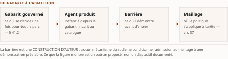
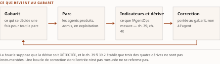

# Chapitre 41 — La fabrique d'agents : produire, certifier et réémettre le parc

*Livre IV — Appliquer, exploiter, produire et composer : AgentMesh, AgentOps, fabrique d'agents et
synthèse architecturale.
Troisième mouvement — produire (ch. 41). Chapitre unique du mouvement, **et seul chapitre de matière
neuve de ce Livre**.*

⚠ **Ce chapitre n'a pas de volume source, et le Livre le déclare avant son premier mot.** Les ch. 37-40
et 42-46 dérivent des trois monographies ; celui-ci est de la **matière neuve admise sur instruction
d'auteur du 27 juillet 2026** — **« Fusion : aucune »**, thèse marquée construction d'auteur, appuis
**internes seuls**, régime de la décision 9 du TOC étendu hors du Livre V par la **décision 12**.
**Ne pas le lire au même régime de preuve que ses voisins.**

| Champ | Valeur |
|---|---|
| **Statut** | **Brouillon de rédaction, non publiable — et sous le régime le plus dur du compendium.** Rédigé sur instruction d'auteur du 27 juillet 2026, **avant** les portes **G-3**, **G-4**, **G-5** **et G-6** — cette dernière conditionnant nommément le sort de ce chapitre —, **avant** la décision d'auteur **D-8**, qui devait trancher entre *constitution d'un socle propre depuis des sources primaires* et *retrait du chapitre* — ⚠ **elle a été prise depuis, le 27 juillet 2026, après cette rédaction et sur la remontée R-IV-51 : socle non constitué, chapitre maintenu sous réserve, retrait non exécuté** —, et **hors de l'ordre de rédaction du PRD §6**, qui le place **après** les ch. 42-46 dont il consomme les renvois. ⚠ **Le régime de preuve applicable est celui de la matière neuve** (PRD §7.2) : **vote adversarial sur TOUTES les affirmations centrales**, **sources primaires seules**, et **l'échec documenté est un résultat**. **Aucune de ces conditions n'est remplie**, et le **risque 16 du TOC** est ouvert avec son issue de retrait |
| **Date de gel** | **27 juillet 2026** — gel unique, **D-1 prise** ([`gel-2026-07-27.md`](../PRD/gel-2026-07-27.md)). ⚠ **Ce chapitre n'a aucun fait périssable à re-dater, et ce n'est pas une bonne nouvelle** : il n'en a aucun parce qu'**il ne porte aucun fait**. Le **seul relevé daté** qu'il mobilise est un **fait de dépôt** constaté sur pièce le 27 juillet 2026 (§ 41.1), qui **n'entre pas au socle** |
| **Socle mobilisé** | ⚠ **Aucun. Ni entrée du socle consolidé, ni entrée F-xx d'un volume source, ni garde-fou hérité assigné par le plan.** C'est le fait le plus important de cet en-tête, et il est **exactement conforme à ce que le TOC déclare** : « aucun volume source, aucune entrée F-xx, aucun garde-fou hérité » (risque 16). ⚠ **Depuis le 28 juillet 2026, cette absence n'est plus imputable à la porte, et l'écart se durcit** : **G-3 est franchie** et le socle consolidé compte **159 entrées `S-001`…`S-159`** — *ce chapitre n'en mobilise aucune parce qu'il n'a pas de source, non parce que le socle serait vide.* Les seuls appuis sont **internes** — **ch. 15**, **ch. 16**, **ch. 37**, **ch. 38-40**, **ch. 43**, **ch. 45**, **ch. 47**, auxquels le corps ajoute **ch. 23** et **ch. 49**, **un renvoi de périmètre chacun** — ⚠ **et les deux ne sont pas du même ordre** : le **ch. 23** est **prescrit par la table détaillée du plan** (§ 41.2, les cadriciels de composition), qui ne le porte simplement pas à sa liste d'adossements ; le **ch. 49** n'est porté **nulle part** dans l'entrée du chapitre, et *lui seul est une déviation déclarée* (décision 8) —, et ⚠ **un adossement interne est un renvoi, jamais une source**. **Tout énoncé de ce chapitre est au mieux un repérage [C] à instruire** ; **aucun n'est central au sens de CA-IV-01**, et *aucun ne peut le devenir sans une passe d'instruction que ce chapitre n'a pas eue.* |
| **Garde-fous balayés** | ⚠ **Règle de comptage, décision 16 du TOC** : les cardinaux ci-dessous portent sur le **marqueur littéral de l'identifiant** dans le **corps** de la pièce — de la première section à la synthèse, **en-tête et note de statut exclus** —, et ils sont **re-mesurés sur le corpus que le commit produit**. ⚠ **Un garde-fou appliqué sans que son identifiant soit écrit voit son DOMAINE déclaré, sans cardinal** (alinéa c) : *le domaine balayé est le corps entier, et les cardinaux antérieurs — qui comptaient les **applications** et non le marqueur — n'étaient re-mesurables par aucune règle écrite.* **Les deux séries sont balayées intégralement, zéros compris.** ⚠ **Le plan n'assigne à ce chapitre aucun garde-fou hérité** ; ceux qui suivent sont **balayés par prudence et non par assignation**, et *le résultat du balayage est lui-même un fait de méthode*. Vol. III — **R-01 : une occurrence**, § 41.4 ; **R-02 : une occurrence**, § 41.4 — *une barrière se qualifie par ce qu'elle démontre*. **R-14 : zéro occurrence de l'identifiant** — ⚠ *les trois degrés d'absence sont pourtant portés à chaque énoncé négatif du chapitre, sous la forme « absence de documentation, non fait négatif vérifié (degré 3) » : **domaine déclaré, corps entier, sans cardinal** (décision 16, alinéa c)* ; **R-03 à R-13 : zéro occurrence** — aucune qualification cryptographique, aucun emploi de « control plane » ni d'échelle d'autonomie ; ⚠ **« AgentMesh » paraît une fois au corps** (§ 41.1), **en mention et non en emploi** — *il y est cité comme l'exemple du garde-fou d'homonymie, non comme un terme dont le chapitre se sert*. Vol. II — **R-1 à R-8 : zéro occurrence** ; **métriques auto-déclarées : zéro occurrence** — *ce chapitre ne cite aucun chiffre d'éditeur, parce qu'il n'en a aucun à citer.* ⚠ **Un garde-fou PROPRE est ouvert par le plan et il est tenu de bout en bout** : la **désambiguïsation d'« agent factory »** (décision 12c du TOC), **posée au § 41.1** — *quatre emplois, dont **trois** vivent dans le plan de la somme* |
| **Volumétrie cible** | ≈ **5 000 mots** de corps (§ 41.0 à la synthèse), **cible dérivée** de l'enveloppe du Livre (**69 000 mots**, TOC v0.25) répartie sur ses **dix chapitres** — *la somme des dix cibles dérivées vaut exactement 69 000* —, ⚠ **la part de ce chapitre étant minorée parce qu'un chapitre sans source ne développe pas** : *l'ampleur serait ici l'indice du défaut, non celui du travail.* ⚠ **Le plan porte pourtant une enveloppe PROPRE à ce chapitre, et la cible dérivée s'en écarte** : la Volumétrie du TOC chiffre à **7 000 mots** la matière neuve entrée par l'insertion v0.22, quand les dix cibles dérivées du Livre n'en retiennent que **5 000** — *déviation déclarée plutôt que lissée* (décision 8), les porter à 7 000 sortant la somme des dix de l'enveloppe du Livre. ☑ **Décompte publiable depuis G-2** ; **réel reporté au [`README.md`](README.md)**. ⚠ **D-4 s'applique**, et son interdiction de gonflement porte ici plus qu'ailleurs |

> **Thèse** *(citée depuis le [`TOC.md`](../PRD/TOC.md) **v0.30**, entrée du chapitre 41 — **construction d'auteur, socle à constituer** ; ⚠ **thèse inchangée depuis la v0.25, re-collationnée mot pour mot contre la v0.30**, les v0.29 et v0.30 n'ayant touché aucune thèse — l'arbitrage du Livre IV a réaligné dix des douze thèses, celle-ci et celle du ch. 44 exceptées ; ⚠ **la rangée d'historique de la v0.28 nomme pourtant « ch. 44 et 46 », et c'est l'erratum de la v0.29 qui rétablit la paire** — *ne pas collationner cette pièce contre la rangée*)* — le maillage **admet** des agents (ch. 37) et l'AgentOps **mesure** leur comportement (ch. 38-40), mais ni l'un ni l'autre ne dit **d'où vient** l'agent admis ni **par quel geste** il est réémis quand la mesure le condamne ; la fabrique d'agents — gabarits gouvernés, catalogue interne, barrière de certification, réémission pilotée par la mesure — est le plan de production qui referme cette boucle, et sans elle « appliquer » et « exploiter » décrivent un parc que **personne n'a la responsabilité de produire**.

⚠ **La thèse est citée verbatim parce que le PRD §6 l'exige, et le TOC déclare dans le même mouvement
que la décision 8 s'y applique DOUBLEMENT : « aucune thèse ne peut se recopier telle quelle dans le
bandeau du chapitre rédigé ».** *Les deux règles ne se contredisent pas ; elles se succèdent.* La
pièce **cite** la thèse du plan et **ne la valide pas** : elle n'a **aucun fait à lui opposer ni à lui
apporter**. **Ce que ce chapitre peut faire, et ce qu'il fait, est de rendre la thèse instruisible** —
nommer, section par section, le corpus à ouvrir et le critère qui clorait l'instruction. ⚠ **Sa
réécriture appartient à la passe qui suivra D-8**, et **elle appartient au plan, non au rédacteur.**
Remontée **R-IV-51** (§ 41.9).

⚠ **Et une distinction commande la lecture de tout ce qui suit.** Ce chapitre **n'est pas un chapitre
de synthèse** — la contrepartie des garde-fous à zéro occurrence que le PRD §6 impose aux onze pièces
de synthèse **ne l'exempte de rien** : *il n'est pas long parce qu'il compose, il est court parce
qu'il n'a rien à composer.*

---

## § 41.0 — Ouverture : pourquoi ce chapitre existe, et à quelles conditions il devrait survivre

Lecture de l'auteur — **marquage porté à l'ouverture et régissant le chapitre entier** (CA-IV-07,
qui l'impose nommément aux chapitres de matière neuve). **Ce que le socle établit** : **rien**. ⚠ **Et
depuis le 28 juillet 2026, ce « rien » ne se lit plus comme le vide du socle mais comme celui de ce
chapitre** : *le socle consolidé compte 159 entrées, et aucune n'est mobilisable ici.* Aucun volume
source ne porte cette matière, et **le seul relevé daté du chapitre est un fait de dépôt** (§ 41.1).
**Ce qu'il n'établit pas** : **la totalité de ce qui suit** — l'existence d'un objet
nommé « fabrique d'agents » dans une organisation quelconque, la pertinence du découpage en huit
sections, et jusqu'à la nécessité du chapitre.

**Le motif de son insertion est un constat de couverture, et il est vérifiable.** La somme décrit le
maillage qui **admet** les agents (ch. 37) et l'exploitation qui **mesure** leur comportement
(ch. 38-40) ; elle décrit l'architecture qui les **compose** (ch. 43) et le blueprint qui les
**instancie** (ch. 45). ⚠ **Elle ne nommait nulle part le plan qui les *produit*** — constat établi
par balayage de la zone des chapitres du plan, **zéro occurrence**, et c'est ce constat, non un fait
du domaine, qui a motivé l'insertion (décision 12 du TOC, sur instruction d'auteur du 27 juillet
2026).

⚠ **Un constat de couverture d'un plan n'est pas un fait sur le monde**, et la nuance est la seule
chose que ce chapitre puisse affirmer sans réserve : *le plan ne traitait pas la production ; il ne
s'ensuit pas que la production soit un objet constitué, ni qu'elle mérite un chapitre.* **C'est
exactement ce que D-8 avait à trancher, et elle l'a fait le 27 juillet 2026, après cette
rédaction** : *chapitre maintenu sous réserve, socle non constitué,* ⚠ **le retrait demeurant l'issue
si les lots échouent.**

**Les huit sections se lisent donc comme huit questions**, dont **cinq** sont instruisibles et
assorties du corpus à ouvrir et du critère qui clorait l'instruction — § 41.2, § 41.3, § 41.4,
§ 41.5 et § 41.7. ⚠ **Les trois autres n'appellent aucun lot, et le motif diffère à chaque fois** : la
désambiguïsation (§ 41.1) tranche un emploi de mots, les conditions de réfutation (§ 41.6) énoncent ce
qui renverserait le chapitre, et la sortie de périmètre (§ 41.8) déclare une matière que la somme ne
traite pas — *aucune des trois n'attend quoi que ce soit d'une source.*

**Ce qui ne s'y trouve pas est déclaré au même titre** : **aucune recette d'organisation**, **aucun
modèle de maturité** (siège **ch. 43 § 43.5**), **aucun outil nommé**, **aucun chiffre du domaine**.

## § 41.1 — Ce que « fabrique » désigne ici, et les trois emplois dont il faut la séparer

⚠ **Le chapitre s'ouvre sur ce tri plutôt que de le renvoyer au glossaire, et le motif est celui qui a
déjà coûté une passe au corpus.** C'est le geste que la branche (f) du garde-fou d'homonymie du
Vol. III impose déjà à « AgentMesh » (ch. 37 § 37.0), et **la cause est identique** : *deux sens
incompatibles à quelques lignes d'écart.* ⚠ **Trois des quatre emplois vivent déjà dans le plan de
cette somme, et deux d'entre eux se confondraient à l'œil** — celui de ce chapitre et celui du
**ch. 43 § 43.1**.

| Emploi | Objet | Ce qu'il désigne | Où il vit |
|---|---|---|---|
| **F1** | **Fabrique d'agents** (*agent factory*) | le **plan de production d'un parc** : gabarits gouvernés, catalogue interne, barrière de certification, réémission pilotée par la mesure | **ce chapitre** — construction d'auteur |
| **F2** | **Fabrique d'identité** — et **fabrique de confiance** | l'**étage qui émet l'identité**, non celui qui produit l'agent | **ch. 43 § 43.1**, qui en est le siège |
| **F3** | **Titre d'éditeur** | un **nom de publication**, jamais un terme d'architecture | bibliographie du **Vol. I** (*Monographie* §7.10.4) |
| **F4** | **Patron *factory*** du catalogue GoF de patrons de conception | un patron qui **instancie un objet à l'exécution** — aucun rapport avec un plan de production organisationnel | **Annexe G** |

: Tableau 41.1 — Les quatre emplois du mot « fabrique » dans la somme, et le lieu de chacun. ⚠ **Aucun chapitre n'emploie le terme sans que le sens visé soit déterminable de sa phrase** (décision 12c du TOC) ; le glossaire (Annexe E) porte les quatre.

⚠ **L'emploi F3 est le seul relevé daté de tout ce chapitre, et sa borne est plus étroite que celle
que le plan lui donne.** **Constat sur pièce, 27 juillet 2026** : la bibliographie du **Vol. I** porte,
sous **Microsoft**, **une publication dont le titre contient l'expression** — *Agent Factory: Designing
the Open Agentic Web Stack* —, datée du **24 septembre 2025** ; l'entrée regroupe par ailleurs un
second document, **dont le titre ne porte pas l'expression**, et **porte le marqueur de ressource
vivante**. ⚠ **L'éditeur est nommé plutôt qu'anonymisé** : la parade de péremption couvre les
dénominations commerciales et les versions, **jamais l'attribution** (décision 15 du TOC) — *un fait
de dépôt dont l'attributeur est tu cesse d'être vérifiable.* ⚠ **Le plan écrivait « la série *Agent
Factory* » ; ce que la pièce constate est *un titre*, non une série** — *le socle ne documente pas
l'existence d'une série sous ce nom : absence de documentation, non fait négatif vérifié* (degré 3).
⚠ **La table d'appuis du TOC est alignée sur ce constat depuis la v0.28** (remontée **R-IV-52**,
§ 41.9) : *le passé de ce verbe est la trace de l'écart, non un flottement — et une pièce qui
continuerait d'opposer au plan une forme qu'il ne porte plus fabriquerait la divergence qu'elle
croit relever.*
⚠ **Et ce que ce fait de dépôt atteste s'arrête là où il commence** : **l'emploi du terme par cet
éditeur, à une date**, rien de plus. **Il n'entre pas au socle**, il **ne caractérise pas l'objet**, et
**aucun énoncé de ce chapitre ne s'y adosse**.

⚠ **La distinction F1/F2 est celle dont la confusion coûterait le plus cher, et elle tient à un
verbe** : *la fabrique d'identité **émet** ; la fabrique d'agents **produit**.* ⚠ **Le départage de
ces deux étages a son siège au ch. 43 § 43.1** : *ce chapitre y renvoie et ne le refait pas ; ce qui
lui appartient en propre est la table des quatre emplois ci-dessus.*

## § 41.2 — Le gabarit d'agent gouverné : ce qui se décide une fois pour tout le parc

*Construction d'auteur ; sources primaires à constituer.*

**La proposition est la suivante** : un **gabarit d'agent gouverné** est l'artefact par lequel une
organisation **décide une fois, pour une classe d'agents, ce qu'elle refuserait de décider à chaque
agent**. Ce qu'il fixerait — **bornes de finalité**, **outils admis**, **politique d'approbation**,
**exigences de trace** — et ce qu'il laisserait à l'agent sont deux listes ; **ni l'une ni l'autre
n'est portée par une source.**

⚠ **Un gabarit n'est pas un cadriciel**, et la distinction n'est pas verbale : les **cadriciels de
composition** — ce qui exécute une orchestration — sont au **ch. 23**, **et ce chapitre ne les
reconstruit pas**. *Un gabarit décrit ce qu'un agent a le droit d'être ; un cadriciel décrit comment
il tourne.*

**Le seul argument que ce chapitre puisse opposer à un lecteur sceptique vient d'un autre chapitre, et
il est cité comme tel.** Le **ch. 39 § 39.2** établit — *dans les bornes de son propre socle* — que
**des trois dérives qu'il traite, et qu'il déclare inégalement documentées, celle que les cadres
canadiens nomment est celle que le seul relevé d'instrumentation versé au socle n'instrumente
pas**, et il en tire une **obligation de conception** :
*ce qui n'est pas instrumenté doit être borné à l'émission.* ⚠ **Un gabarit est un candidat au lieu de
ce bornage** ; **qu'il en soit le bon lieu n'est établi par rien.**

> **Ce qu'il faudrait ouvrir pour clore la question.** **Corpus** : les référentiels d'ingénierie
> logicielle traitant du gabarit d'application gouverné (*golden path*, *paved road*) et leur
> transposition documentée à un parc d'agents ; les schémas de profil d'agent déjà relevés par le
> Livre II, **au titre de ce qu'ils rendent obligatoire à la déclaration** ; toute publication
> d'organisation décrivant un gabarit d'agent en production. **Critère de clôture** : qu'au moins un
> corpus primaire décrive un artefact fixant, pour une classe d'agents, les quatre catégories
> ci-dessus — ou que son absence soit **établie par balayage** plutôt que présumée.
> ⚠ **Identifiants du corpus, écrits parce qu'un critère de clôture qui ne nomme pas ses sources
> est inexécutable** (décision 15 du TOC, alinéa b-iii) : les **schémas de profil d'agent** à relire
> sont ceux qu'énumèrent le **ch. 15 § 15.1** (carte d'agent signée : anatomie et valeur probante) et
> le **ch. 15 § 15.3** (registres gouvernés) ; *le lot s'ouvre sur cette énumération, non sur une
> description*. ⚠ **Une instruction infructueuse est un résultat** : elle rendrait la section
> retirable, ce que D-8 prévoit.

## § 41.3 — Le catalogue interne et le registre gouverné : deux objets, deux autorités

*Adossement au **ch. 15** (registres gouvernés, carte d'agent signée) et au **ch. 16** (passeport),
**sans les reconstruire**. Construction d'auteur, marquée telle.*

⚠ **La distinction à tenir, sous peine de doublon d'autorité, est celle-ci** : le **registre gouverné**
est le lieu où une identité devient **opposable à des tiers** ; le **catalogue interne** est le lieu où
l'organisation sait **ce qu'elle produit et exploite**. ⚠ **Confondre les deux redonnerait au catalogue
une valeur probante qu'aucune spécification relevée ne lui reconnaît** — et *le ch. 15 a établi, dans
ses propres bornes, que même le registre gouverné n'a pas cette valeur au régime où le corpus le
documente.*

**Quatre propriétés distinguent les deux objets, et elles sont proposées, non relevées.**

| | Registre gouverné (**ch. 15**) | Catalogue interne (*ce chapitre*) |
|---|---|---|
| **Ce qu'il rend possible** | qu'un tiers **vérifie** une identité qu'il n'a pas émise | que l'organisation **énumère** ce qu'elle a produit |
| **À qui il est opposable** | à des tiers, dans les limites que le Livre II a bornées | **à personne** — *c'est un instrument de gestion, non de preuve* |
| **Ce qu'il porte de plus** | l'ancrage, dont le Livre II établit qu'il est le verrou | le **gabarit d'origine** de chaque agent, et son état de certification |
| **Ce qui le peuple** | l'émission | la **fabrique** |

: Tableau 41.2 — Registre gouverné et catalogue interne : deux objets, deux autorités. ⚠ **Construction d'auteur en totalité** — *aucune ligne de ce tableau n'est portée par une entrée de socle.*

⚠ **Une seule chose relie ce tableau à un constat établi ailleurs, et elle vient du ch. 40 § 40.2** :
la grille minimale y demande un **dénominateur** — *une source d'énumération du parc* — et déclare que
**le socle n'en documente aucune qui soit opposable à l'inventaire attendu** (degré 3). **Le catalogue
interne est un candidat à ce dénominateur** ; ⚠ **qu'il le fournisse effectivement n'est établi par
rien**, et *un candidat proposé à l'endroit exact où une lacune est déclarée est précisément
l'énoncé qu'aucune relecture ne peut réfuter.*

> **Ce qu'il faudrait ouvrir.** **Corpus** : les spécifications de registre déjà relevées par le
> Livre II, **relues au titre de ce qu'elles disent d'un usage interne** ; les publications décrivant
> un inventaire d'actifs applicatifs gouverné et son articulation à un annuaire d'identités.
> **Critère de clôture** : qu'un corpus primaire distingue explicitement les deux autorités, ou
> qu'aucun ne les distingue — *l'un et l'autre résultat sont exploitables.*
> ⚠ **Identifiants du corpus** (décision 15, alinéa b-iii) : les **spécifications de registre** à
> relire sont celles qu'énumère le **ch. 15 § 15.3**, et les **annuaires** ceux du **ch. 15 § 15.2** ;
> les quatre pièces dont l'autorité est en cause sont assemblées au **ch. 16 § 16.1**. *Le lot s'ouvre
> sur ces trois sections, nommées, et non sur « les spécifications déjà relevées ».*

## § 41.4 — La barrière de certification : ce qu'un agent démontre avant d'être admis au maillage

*Adossement au **ch. 37 § 37.5** (le maillage comme point d'application) et au **ch. 47 § 47.9**
(barrière d'évaluation au déploiement) ; ⚠ **le constat cité plus bas vient du ch. 37 § 37.4**, où il
est établi.*

⚠ **Le grain diffère des deux, et il se déclare.** Le **ch. 47** traite la barrière au grain de
**l'artefact et de sa mise en service** ; ce chapitre au grain du **parc et de son admission**. *Un
artefact franchit une barrière une fois ; un parc en franchit une à chaque agent, et la question
devient celle du débit autant que celle du critère.* ⚠ **Le ch. 47 n'était pas rédigé à la date de
cette pièce** : le renvoi a été posé comme **renvoi de plan**, et *il n'a pas été re-vérifié contre le
texte — rédigé depuis, hors portes — qui a paru après lui.*

**La proposition est étroite** : *le maillage vérifie l'agent qui se présente ; il ne dit rien de ce
qui l'a produit.* Le **ch. 37 § 37.4** l'établit dans ses propres bornes — la première question de la
grille qu'il applique demande un identifiant que le mécanisme **produit**, et le mécanisme documenté
**n'y répond pas** : ce qu'il porte est l'**évaluation d'une politique contre des invocations de méthodes**,
**non une émission, une vérification cryptographique ni une révocation**. ⚠ **Et la source range
l'émission ailleurs plutôt que de la déclarer manquante** : *elle en fait l'objet du Livre II et écrit
que le maillage n'a jamais prétendu s'en charger.* ⚠ **Que « produire » et « émettre » ne se
recouvrent pas est une lecture de ce chapitre, non un énoncé de sa source** — elle est posée au
§ 41.1, et *elle ne s'adosse à aucun fait.* **La barrière de certification serait le geste qui décide
de ce qui *peut* se présenter** ; ⚠ **qu'un tel geste existe, et qu'il soit distinct du point
d'application, n'est établi par rien.**

⚠ **Et une difficulté héritée s'y transporte intacte, ce qui est le seul énoncé fort de cette
section.** Le plan renvoie au **problème de l'oracle** — *comment sait-on qu'un comportement est
correct quand on ne dispose pas d'un résultat attendu de référence ?* — relevé au **ch. 47 § 47.9**.
**Une barrière de certification hérite de la même difficulté et ne s'en affranchit pas en changeant
d'échelle** : *certifier mille agents ne rend pas l'oracle plus disponible qu'il ne l'était pour un.*

⚠ **Une barrière se qualifie par ce qu'elle démontre, jamais par ce qu'elle promet** (R-02 du
Vol. III, balayé par prudence) : *une barrière qui admet sans oracle atteste un passage, non une
propriété.* Et ⚠ **le passeport d'agent ne figure dans aucune spécification à date** (R-01 du
Vol. III ; siège **ch. 16**) : une barrière ne peut donc **pas** être décrite comme « vérifiant le
passeport », et ce chapitre ne l'écrit pas.

> **Ce qu'il faudrait ouvrir.** **Corpus** : la littérature de test métamorphique et d'évaluation sans
> oracle, déjà relevée par le plan au titre du **ch. 47** ; les référentiels de certification de
> composants logiciels transposables, **sous réserve d'une filiation établie plutôt que réinventée** ;
> toute publication décrivant une porte d'admission à un maillage. **Critère de clôture** : qu'un
> critère d'admission documenté soit relevé avec **ce qu'il démontre** — et non ce qu'il annonce.
> ⚠ **Identifiants du corpus** (décision 15, alinéa b-iii) : le problème de l'oracle et la
> littérature de **test métamorphique** sont relevés par le plan à la **relève v0.19**, au titre du
> **ch. 47 § 47.9** (jeux d'essai de référence et barrière d'évaluation au déploiement), *dont le lot
> hérite le corpus sans le recopier* ; la barrière au grain du parc se lit contre le **ch. 37 § 37.5**.
> ⚠ **Ces désignations sont des points d'entrée, non des sources** : *aucune n'a été ouverte par ce
> chapitre.*

## § 41.5 — La boucle de réémission : de l'indicateur et de la dérive au gabarit corrigé

*Adossement au **ch. 39 § 39.2** (dérive), au **ch. 39 § 39.4** (versionnement du parc) et au **ch. 40
§ 40.2** (grille minimale d'indicateurs). Construction d'auteur.*

**C'est ici que l'AgentOps cesserait d'être une discipline de constat.** La proposition tient en une
phrase : ⚠ ***un indicateur qui ne réémet rien mesure sans corriger.*** Le **ch. 40 § 40.2** produit
quatre grandeurs et **une colonne de ce qui manque** ; le **ch. 39 § 39.2** produit trois dérives dont
une n'est pas instrumentée par le seul relevé d'instrumentation versé au socle. **La boucle de
réémission serait le geste qui transforme l'un et l'autre en correction du gabarit dont l'agent est
issu**, plutôt qu'en correction de l'agent lui-même.

⚠ **La distinction est la seule chose que cette section apporte, et elle est réfutable** : *corriger
l'agent traite l'occurrence ; corriger le gabarit traite la classe.* Ce que le **ch. 39 § 39.4**
établit dans ses bornes — **on sait versionner ce qu'un agent est autorisé à faire, on ne sait pas
restituer ce qu'il était autorisé à faire à l'instant où il l'a fait** — **s'applique au gabarit avec
la même force** : *une boucle de réémission dont on ne peut pas restituer l'état antérieur du gabarit
ne se documente pas, elle se raconte.*

⚠ **Le ch. 39 § 39.4 renvoie d'ailleurs à cette section** — *promouvoir suppose un gabarit à
promouvoir, et il déclare ne pas le fournir* —, et **l'adossement est donc mutuel** : *ce chapitre-ci
ne peut pas fonder la boucle sur un chapitre qui la lui renvoie.* **Le socle ne documente ni la boucle, ni le gabarit, ni leur articulation** : absence de
documentation, non fait négatif vérifié (degré 3).

> **Ce qu'il faudrait ouvrir.** **Corpus** : les publications d'exploitation décrivant une correction
> de gabarit déclenchée par un indicateur de production ; la littérature de gestion de configuration
> traitant de la **propagation d'une correction de modèle à des instances déjà déployées**. **Critère
> de clôture** : qu'un mécanisme documenté relie une mesure de production à une modification
> d'artefact d'origine, **avec son délai de propagation** — *le délai est la partie qui manque partout
> ailleurs dans ce Livre, et il manquerait ici de la même manière.*
> ⚠ **Identifiants du corpus** (décision 15, alinéa b-iii) : les trois points d'entrée internes sont
> nommés — **ch. 39 § 39.2** (les trois dérives, dont une non instrumentée), **ch. 39 § 39.4** (GitOps
> du parc) et **ch. 40 § 40.2** (la grille minimale et sa colonne de manques) ; *ce sont eux que
> l'instruction doit confronter à une publication d'exploitation, et non « la littérature ».*

## § 41.6 — La fabrique comme point de concentration : ce qu'elle centralise, ce qu'elle fragilise

⚠ **Cette section porte les conditions qui renverseraient ce chapitre, et elles sont à écrire comme
telles, non comme réserves de style** — même exigence qu'au **ch. 37 § 37.9**. *Un chapitre qui ne
peut pas être renversé n'affirme rien* ; ⚠ **et un chapitre sans socle qui ne peut pas être renversé
n'est même pas discutable.**

| # | Condition | Ce qui la rendrait constatable |
|---|---|---|
| **1** | **Gabarit unique et monoculture de parc** — un gabarit qui décide pour tout le parc **propage aussi ses défauts à tout le parc** | un incident dont la cause remonte au gabarit et non à l'agent ; ou, à l'inverse, l'absence documentée de corrélation entre agents issus d'un même gabarit |
| **2** | **File d'attente de certification comme goulot** — une barrière qui admet trop lentement **est contournée**, et un contournement documenté vide la barrière de son objet | une mesure de délai d'admission rapportée au rythme de production ; ⚠ **le socle n'en porte aucune** (degré 3), et le **ch. 40 § 40.5** établit seulement que **le coût est une contrainte de premier ordre**, en [C] |
| **3** | **Équipe-fabrique en point de défaillance unique** — la centralisation qui fait la valeur du dispositif fait aussi sa fragilité | une indisponibilité documentée, ou une mesure de dépendance ; ⚠ **c'est la troisième condition du ch. 37 § 37.9, transposée d'un point d'application à une équipe**, et *la transposition est une lecture, non un constat* |
| **4** | **L'écart entre ce que la fabrique croit produire et ce que le maillage admet réellement** | un relevé d'agents admis au maillage **sans passage par la fabrique** ; ⚠ **c'est le pendant exact de la première condition du ch. 37 § 37.9** — *un dispositif dont on ne peut pas énumérer ce qui l'a contourné ne fournit pas la garantie qu'il annonce* |

: Tableau 41.3 — Les quatre conditions de réfutation du chapitre 41. ⚠ **Construction d'auteur** ; *aucune n'est instruite, et une condition posée n'est pas une condition éprouvée.*

⚠ **La quatrième est la plus instructive, parce qu'elle rejoint le résultat du ch. 37 par l'autre
bout.** Le ch. 37 demande **quelles arêtes le maillage ne médiatise pas** ; celui-ci demande **quels
agents la fabrique n'a pas produits**. *Les deux questions ont la même forme — l'énumération du
complément —, et ni l'une ni l'autre n'a de réponse documentée.*

## § 41.7 — L'organisation de la fabrique : qui opère quoi

⚠ **Aucune revendication de provenance ici, et la forme le dit.** La source de cette matière est
portée par le **ch. 45 § 45.6**, **qui en reste le siège** ; ce chapitre n'en tire qu'un **renvoi
interne**. *C'est le motif pour lequel la table détaillée de ce chapitre ne porte aucun marqueur de
provenance : en porter un ici serait une **seconde revendication du même texte**.*

**Ce que ce chapitre peut écrire sans empiéter tient en une question, et le ch. 45 § 45.6 la pose
lui-même à son terme** : *les rôles qu'il répartit répondent de ce qui **tourne** ; qui répond de ce
qui **est produit** ?* ⚠ **Et la répartition dont elle part est bornée à sa source** : *le ch. 45
§ 45.6 déclare que le socle n'établit pas la répartition des responsabilités entre équipes, et que la
sienne est une inférence d'auteur intégrale* — **ce chapitre n'en hérite donc aucun titulaire
nommé**. ⚠ **Le socle ne documente aucune répartition des responsabilités de production d'un parc
d'agents** : absence de documentation, non fait négatif vérifié (degré 3).

⚠ **Et la question n'est pas rhétorique** : le **ch. 39 § 39.4** a établi, en [C], que **les agents qui
maintiennent le parc sont eux-mêmes des agents** et relèvent **du même régime que ceux qu'ils
surveillent**. *La même récursivité s'appliquerait à la fabrique — l'outillage qui produit les agents
serait lui-même à produire —, et rien n'établit où elle s'arrête.*

> **Ce qu'il faudrait ouvrir.** **Corpus** : les publications d'organisation décrivant une répartition
> nommée des responsabilités de **production** d'un parc logiciel gouverné, distincte de sa répartition
> d'exploitation. ⚠ **Identifiants du corpus** (décision 15 du TOC, alinéa b-iii) : le point d'entrée
> interne est le **ch. 45 § 45.6**, **siège de l'organisation de la fabrique pour toute la somme**,
> dont ce lot reprend la répartition d'exploitation **sans la reconstruire** ; la récursivité se lit
> contre le **ch. 39 § 39.4**. **Critère de clôture** : qu'une source primaire nomme un titulaire de la
> production distinct du titulaire de l'exploitation, **ou** que le balayage établisse qu'aucune ne les
> distingue — *les deux résultats sont exploitables, et le second rendrait la section retirable.*

## § 41.8 — Ce que la fabrique ne fait pas : la couche d'exécution reste hors périmètre

⚠ **Cette section est la plus importante du chapitre, et elle est entièrement négative.** Le **risque
14 du TOC n'est pas comblé par ce chapitre**, et il faut l'écrire ici plutôt que le laisser croire.

**Le harnais** — le programme qui **héberge la boucle de l'agent** et porte la persistance de session,
les modes, les sous-agents, la chaîne d'approbation d'outils, l'admission d'extensions et la
compression de contexte — **n'est traité par aucun chapitre de la somme**. ⚠ **Produire un agent n'est
pas l'exécuter** : *la fabrique décide de ce qui entre au parc ; le harnais décide, en dernier
ressort, d'exécuter l'appel.*

⚠ **Trois conséquences, et la troisième est celle qu'on oublie.** *Un* : **la porte G-5 conditionne le
Livre IV entier** et n'était pas franchie à la rédaction — **l'arbitrage du risque 14 est la décision
d'auteur D-2**, que **ce chapitre ne consomme pas**. ⚠ **La table détaillée du plan nomme encore D-7
pour ce risque** — forme antérieure à l'affectation de D-7 au risque 15 —, *et c'est le PRD qui fait
foi sur la gouvernance : déviation déclarée* (décision 8). ⚠ **Elle a été prise depuis, le
27 juillet 2026, par une autre passe et après cette rédaction** : *sections dans l'existant, sans chapitre neuf* — **des
sections que ce Livre n'a pas écrites**, et *le risque 14 n'en est pas comblé pour autant.* *Deux* :
**le ch. 37 § 37.6 le rencontre par l'autre bout** — l'admission par passerelle y est nommée comme
contrôle de chaîne d'approvisionnement, et **ce qui exécute l'appel après l'admission n'y est pas
traité davantage**. *Trois* : ⚠ **le plafond de
cinquante chapitres rend le comblement coûteux et le déclare** — *un chapitre neuf sur le harnais
serait interdit sans la fusion qui le paie* (décision 13 du TOC). **Le plafond ne tranche pas le
risque 14 ; il en rend le coût explicite.** ⚠ **Et c'est sur cette contrainte-là que D-2 a écarté
l'issue « chapitre neuf »** — *par une contrainte de plan, non par un jugement de fond*, la décision
le déclarant elle-même.

⚠ **Le socle ne documente pas la couche d'exécution agentique** : absence de documentation, non fait
négatif vérifié (degré 3). *Et cette absence-ci n'est pas de la même nature que les autres du
chapitre : les précédentes portent sur une matière que la somme prétend traiter, celle-ci sur une
matière qu'elle déclare ne pas traiter.*

## Synthèse : ce que le chapitre lègue à la somme

*Section de sortie sans homologue direct dans la source — construction d'éditeur.*

⚠ **Ce chapitre lègue moins que les autres, et le déclarer est le premier de ses legs.**

1. **La désambiguïsation d'« agent factory ».** **Quatre emplois, dont trois vivent dans le plan de la
   somme** : le plan de production ici, la fabrique d'identité au **ch. 43 § 43.1**, le patron
   *factory* à l'**Annexe G** ; le quatrième est un titre d'éditeur. **Aucun chapitre n'emploie le mot
   sans que le sens soit déterminable de sa phrase.** *C'est le seul legs du chapitre qui ne dépende
   d'aucune instruction.*
2. **Une question, posée une fois** : *d'où vient l'agent admis, et par quel geste est-il réémis quand
   la mesure le condamne ?* Les **ch. 37 à 40** ne la posent pas ; **elle est ici, et elle y est
   ouverte, non résolue**.
3. **Quatre conditions de réfutation**, dont **deux sont les transpositions déclarées de celles du
   ch. 37 § 37.9**. ⚠ *Une transposition est une lecture — le déclarer est ce qui la distingue d'un
   constat.*
4. **Le rappel que le risque 14 n'est pas comblé.** ⚠ **C'est un legs négatif, et le plus opposable du
   chapitre** : le **ch. 49 § 49.12** tient le registre des lacunes résiduelles, **et celle-ci en
   fera partie quelle que soit l'issue de D-8**.
5. **Cinq lots d'instruction formulés**, avec leur corpus et leur critère de clôture (§ 41.2, § 41.3,
   § 41.4, § 41.5, § 41.7). ⚠ **C'est ce que le chapitre produit *à la place* d'un contenu**, et *une
   instruction infructueuse resterait un résultat.*

⚠ **Ce que le chapitre ne lègue pas — et la liste est longue à dessein.** Aucun **fait**. Aucune
**entrée de socle**. Aucun **chiffre**, aucun **seuil**, aucun **délai**. Aucun **outil nommé**, aucune
**organisation nommée**. Aucun **modèle de maturité** — *son siège est au ch. 43 § 43.5*. Aucune
**recette d'organisation**. Et **aucune garantie de survie** : *D-8 a maintenu le chapitre sous
réserve et laissé le retrait comme issue si les cinq lots échouent* — **il disparaîtrait alors, et
les ch. 42-50 redeviendraient les ch. 41-49** ; la renumérotation inverse est prévue, et elle est le
prix déclaré de l'insertion. ⚠ **La fourchette « ch. 42-51 » que ce paragraphe
portait décrivait l'état v0.22 du plan, à cinquante et un chapitres** : *elle est périmée depuis la
**fusion v0.23**, qui a payé l'insertion et ramené le plan à cinquante — un retrait ferait donc
revenir neuf chapitres, non dix.* **La carte de la décision 13d se chaîne à celle de la 12b ; elle ne
la réécrit pas.**

---

## § 41.9 — Note de statut *(hors plan — à retirer à la publication)*

⚠ **Cette section n'est pas au TOC et n'a pas vocation à survivre.** Elle consigne l'écart de
gouvernance sous lequel la pièce a été rédigée (PRD, Annexe A).

**Ce qui est enfreint — et c'est l'écart le plus large du compendium à ce jour.** Portes **G-3**,
**G-4**, **G-5** et **G-6** ; **décision d'auteur D-8 non prise à cette date**, alors qu'elle
conditionne nommément l'existence de ce chapitre ; **ordre de rédaction du PRD §6**, qui place ce
chapitre **après** les ch. 42-46 — non rédigés alors — **et après G-6** ; **régime de preuve de la
matière neuve** (PRD §7.2), qui exige **le vote adversarial sur toutes les affirmations centrales et des sources
primaires seules**. Instruction d'auteur du **27 juillet 2026**.

1. **Aucun énoncé n'est central au sens de CA-IV-01, et ici ce n'est pas une conséquence de G-3 : c'est
   une propriété du chapitre.** Il n'a **aucun socle à mobiliser**, et *un chapitre écrit sur un socle
   vide n'est pas un chapitre en avance, c'est une inférence longue* — la règle cardinale du PRD §5,
   **enfreinte et déclarée telle**.
2. **Les décomptes sont publiables** (G-2) ; le réel est reporté au [`README.md`](README.md). ⚠ **Et
   la brièveté est ici un indicateur, non un défaut** : *un chapitre sans source qui atteindrait sa
   cible aurait produit du plausible.*
3. **Les renvois « ch. N » : état FINAL de la passe, et non ordre d'écriture.** ⚠ *La forme
   antérieure de ce point photographiait l'instant où cette pièce a été écrite et déclarait « ne
   sont pas rédigés : ch. 43 et ch. 45 » — alors que **la même passe les a écrits ensuite** ; elle
   est corrigée ici sur l'état que le commit produit.* **Les dix chapitres du Livre IV (ch. 37 à
   46) sont rédigés**, comme le sont les **cinquante chapitres des cinq Livres** : *tous les
   renvois « ch. N » de cette pièce résolvent donc contre du texte.* ⚠ **Les renvois vers les
   ANNEXES restent des renvois de plan** — *les annexes E et G, seules citées ici, ne sont pas
   rédigées*. ⚠ **Une annexe l'est depuis le 28 juillet 2026** — l'**Annexe B**, le socle consolidé,
   constituée au franchissement de G-3 —, *et cette pièce ne la cite pas, n'ayant aucune entrée à y
   prendre.* ⚠ **Ce qui reste vrai de la forme antérieure, et qui est daté** : à
   l'heure où ce chapitre a été écrit, n'étaient rédigés ni le ch. 23 du Livre III, ni les ch. 47
   et 49 du Livre V, non plus que les ch. 43 et ch. 45 — *les renvois qui les visent ont été posés
   comme renvois de plan et n'ont pas été re-vérifiés contre le texte paru après eux.* ⚠ **Et «
   résoudre contre du texte » ne vaut pas recevabilité** : *le texte visé est lui-même un
   brouillon hors portes.*
4. **Les cinq lots formulés ne sont pas ouverts** : ce chapitre **formule** des questions
   instruisibles, il **n'instruit rien**. *C'est le seul geste admissible sur une matière dont le plan
   déclare le socle à constituer avant rédaction.*
5. **CA-IV-13 n'est pas satisfaite** — aucune relecture par un relecteur distinct du rédacteur.

**Remontées ouvertes par ce chapitre :**

- **R-IV-51 — BLOQUANTE pour la publication de ce chapitre, de gouvernance.** La porte **G-6** et la
  décision d'auteur **D-8** conditionnent nommément le sort de ce chapitre : *constitution d'un socle
  propre depuis des sources primaires, ou retrait avec renumérotation inverse.* **Aucune des deux n'a
  eu lieu**, et le chapitre a été rédigé sur instruction d'auteur. **Demande remontée** : que **D-8
  soit prise** au vu de ce que cette pièce produit — **cinq lots formulés, zéro fait versé** —, et que
  **la thèse du plan soit réécrite ou retirée dans la même passe**, la décision 8 du TOC s'appliquant
  ici **doublement** (« aucune thèse ne peut se recopier telle quelle dans le bandeau du chapitre
  rédigé »). ⚠ **La règle d'escalade veut qu'une remontée bloquante interdise de lancer le chapitre
  qu'elle bloque** : elle est ouverte **après** la rédaction, et *l'infraction est consignée plutôt
  que rattrapée par l'arbitrage qui la suivra.*
  ☑ **Issue, 27 juillet 2026** — **D-8 PRISE** — ⚠ **socle non constitué, chapitre maintenu sous
  réserve, retrait non exécuté** : *la pièce a produit **cinq lots formulés et zéro fait
  versé**, ce qui est le résultat que la décision attendait ; le retrait reste l'issue si les
  lots échouent.* **Le blocage est levé pour la rédaction, non pour la publication.**
- **R-IV-52 — non bloquante, de fait de dépôt, et de portée plus étroite que le plan.** La table
  d'appuis du TOC qualifie l'emploi **F3** du § 41.1 — le titre d'éditeur — de **« série *Agent
  Factory* de Microsoft »**. **Le
  constat sur pièce du 27 juillet 2026 établit *un titre*, non une série** : la bibliographie du
  Vol. I porte, sous cet éditeur, **une publication dont le titre contient l'expression**, datée du
  24 septembre 2025, l'entrée regroupant un second document **dont le titre ne la porte pas**, et
  **portant le marqueur de ressource vivante**. **Demande remontée** : que la table d'appuis soit
  ramenée à ce que la pièce constate — *un fait de dépôt atteste l'emploi d'un terme par un éditeur à
  une date, jamais l'existence d'une série.* ⚠ *Le seul relevé daté d'un chapitre sans socle mérite
  d'être exact au mot près.*
  ☑ **Issue, 27 juillet 2026** — **TOC, table d'appuis** — « la **série** *Agent Factory* »
  devient « **un titre** » : *le constat sur pièce établit une publication dont le titre porte
  l'expression, non une série* ; ⚠ *le seul relevé daté d'un chapitre sans socle méritait d'être
  exact au mot près.*
- **R-IV-53 — non bloquante, de circularité d'adossement.** Le **ch. 39 § 39.4** renvoie au **§ 41.5**
  pour le gabarit à promouvoir ; le **§ 41.5** s'adosse au **ch. 39 § 39.2 et § 39.4** pour la dérive
  et le versionnement. ⚠ **L'adossement est mutuel, et aucun des deux ne porte de source** : *un
  chapitre ne peut pas fonder sa proposition sur un chapitre qui la lui renvoie.* Le cas se reproduit
  entre le **§ 41.4** et le **ch. 47 § 47.9**, non rédigé. **Demande remontée** : que la collation de
  fond (**G-4**) inscrive à son domaine **le contrôle des adossements mutuels entre chapitres de
  matière neuve et chapitres consommateurs**, et que la table des appuis du ch. 41 distingue les
  adossements **descendants** — vers un chapitre pourvu d'un socle — des adossements **circulaires**.
  ⚠ *`check-sieges.py` ne voit pas cette classe : il contrôle qu'un siège n'est pas reconstruit, non
  qu'un renvoi ne boucle pas.*
  ☑ **Issue, 27 juillet 2026** — **PRD, domaine de G-4** — le **contrôle des adossements mutuels**
  entre chapitres de matière neuve et chapitres consommateurs entre au domaine ; ⚠ **le contrôle
  inter-pièces ne voit pas cette classe** : *il vérifie qu'un siège n'est pas reconstruit, non
  qu'un renvoi ne boucle pas.*

**Ce qui n'est pas enfreint.** La structure suit la **table détaillée du TOC v0.30** — § 41.1 à
§ 41.8, dans l'ordre exact, l'entrée du chapitre étant **inchangée depuis la v0.28** (comparaison
mot à mot, 28 juillet 2026) ; ⚠ **le § 41.3 abrège l'intitulé du plan en retirant « du ch. 15 »,
déviation déclarée** (décision 8), *le renvoi au ch. 15 étant porté par le corps de la section* —, et
le § 41.0 est une ouverture portant le **marquage de construction d'auteur pour tout le chapitre**,
comme CA-IV-07 l'exige nommément des chapitres de matière neuve.
⚠ **Le régime « Fusion : aucune » est tenu de bout en bout** : **aucun marqueur de provenance vers un
volume source n'apparaît dans cette pièce**, parce qu'il n'y en a aucun à porter — *l'absence de
provenance y est rendue visible par la forme, non seulement par une mention.* La **décision 6
(couverture tracée) est sans objet** et déclarée telle. Le **garde-fou propre du chapitre — la
désambiguïsation d'« agent factory » (décision 12c) — est posé au § 41.1 et tenu partout ailleurs**.
Les **trois sièges que ce chapitre touche sans les reconstruire** portent leur renvoi : l'organisation
de la fabrique au **ch. 45 § 45.6**, le modèle de maturité au **ch. 43 § 43.5** et le départage des
deux étages de la « fabrique » au **ch. 43 § 43.1** — ⚠ *ce dernier versé à l'appareil le 28 juillet
2026, et le cardinal de « deux » que ce paragraphe portait est périmé de ce versement, non d'un ajout
de cette pièce.* ⚠ **Cardinaux re-mesurés au commit du 28 juillet 2026, sur le marqueur littéral et
sur le corps seul** (décision 16 du TOC) ; *les cardinaux antérieurs comptaient les applications du
garde-fou et n'étaient re-mesurables par aucune règle écrite.* Les **six occurrences du marqueur
littéral « degré 3 »** portent leur degré, et ⚠ **aucune n'est écrite comme un fait négatif
vérifié** — *ce qui est la seule discipline qu'un chapitre sans socle puisse réellement tenir.*
**Aucun chiffre du domaine, aucun seuil et aucun outil ne sont nommés** ; ⚠ **une seule organisation
l'est** — l'**éditeur du titre relevé au § 41.1** —, *nommée parce que la décision 15 interdit
d'anonymiser une attribution, non parce que le chapitre s'en réclame.* **Aucune section n'écrit de
contenu plausible à l'endroit où le plan déclare le socle à constituer** : *les cinq lots formulés
sont ce que la pièce produit à la place.*
