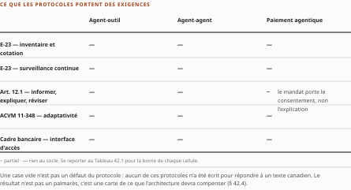
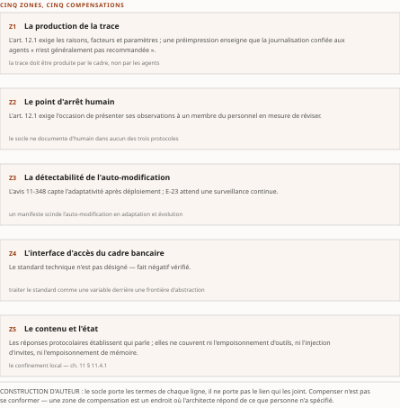

# Chapitre 42 — La matrice protocoles × exigences réglementaires

*Livre IV — Appliquer, exploiter, produire et composer : AgentMesh, AgentOps, fabrique d'agents et
synthèse architecturale.
Quatrième mouvement — composer (ch. 42-46). Premier chapitre du mouvement, **et chapitre de méthode
transversal** : il ne verse aucun fait propre, il fournit l'instrument par lequel les ch. 43 à 46
rendent leurs verdicts d'architecture.*

| Champ | Valeur |
|---|---|
| **Statut** | **Brouillon de rédaction, non publiable** — rédigé sur instruction d'auteur du 27 juillet 2026, **avant** les portes **G-3**, **G-4** et **G-5**, et hors de l'ordre de rédaction du PRD §6, qui place ce mouvement **après les Livres I et III** — *le Livre III n'était pas achevé à la rédaction.* ⚠ **R-IV-40 et R-IV-41, ouvertes au ch. 37, valent pour tout le Livre.** ⚠ **Ce chapitre est l'homologue de méthode du ch. 14** : comme lui, il ne verse rien et fournit un instrument ; **comme lui, sa recevabilité tient à son rendement, non à sa filiation** |
| **Date de gel** | **27 juillet 2026** — gel unique, **D-1 prise** ([`gel-2026-07-27.md`](../PRD/gel-2026-07-27.md)). ☑ **Le volet de FAITS de G-1 est levé le 28 juillet 2026** ([`gel-2026-07-28-volet-residuel.md`](../PRD/gel-2026-07-28-volet-residuel.md)) — **123 entrées à sensibilité temporelle portées à leur source**, domaine déclaré et clos ; ☐ **ses deux autres volets restent dus**, et ⚠ *instruire une date n'est pas reconfronter un énoncé à sa source*. ⚠ **Deux verdicts atteignent ce chapitre, et le corps les porte** : l'entrée du protocole agent-outil est ☑ **changée** — la révision annoncée a été **ratifiée le 28 juillet 2026** (§ 42.4) — et celle du protocole de paiement ☑ **inchangée (partielle)**, son décompte de soutien **n'ayant pas été ré-établi à sa page source** (§ 42.2). Gels de source : **16 juillet 2026** (Vol. II, ch. 18), **17 juillet 2026** (Vol. II, Annexe B), **21 juillet 2026** (Vol. III, Annexe B). ⚠ **Ce chapitre porte trois gels de source distincts et ne les fusionne pas** : *une matrice dont les lignes sont datées de trois jours différents n'est pas datée d'un jour.* |
| **Socle mobilisé** | ⚠ **Socle TRANSVERSAL, construit par la rédaction — et sa contrepartie est obligatoire et non négociable** (règle héritée du Vol. II, reprise par le TOC) : l'en-tête énumère **les entrées effectivement mobilisées et les garde-fous effectivement balayés, y compris ceux à zéro occurrence**. ☑ **Le socle consolidé existe depuis le 28 juillet 2026** — [`socle-consolide.md`](../PRD/socle-consolide.md) v1.2, **159 entrées**, porte **G-3 franchie**. ⚠ **Cette pièce n'a PAS été re-citée en `S-nnn`** (PRD §7.1) : elle cite les identifiants sources préfixés, que les deux tables de correspondance résolvent — **Vol. II F-01 → `S-001`**, **F-02 → `S-002`**, **F-04 → `S-004`**, **F-09 → `S-009`**, **F-10 → `S-010`**, **F-25 → `S-023`**, **F-26 → `S-024`**, **F-27 → `S-025`**, **F-35 → `S-033`**, **F-36 → `S-034`**, **F-37 → `S-035`**. Vol. II — **F-01** (MCP), **F-02** et **F-16** (A2A), **F-04** (AP2) ; **F-09** (E-23), **F-25** (AMF), **F-26** (11-348), **F-27** (art. 12.1) ; **F-11**, **F-34**, **F-35** (cadre bancaire) ; **F-36**, **F-37** ; **F-05**, **F-08**, **F-10**, **F-15** en renvoi. Vol. III — **F-01** à **F-11**, **F-33** à **F-43**, **F-46** à **F-51**, **F-55**, **F-70**, **F-71**, **F-87**, **F-89**, **F-93**, **F-95** ; **H-01** à **H-03**, **H-09**, **H-10**, **H-33**. ⚠ **Les deux séries F-xx sont préfixées de leur volume à chaque emploi** : *un « F-09 » nu est indécidable entre le socle du Vol. II et celui du Vol. III, qui portent chacun une entrée sous ce numéro et sur un objet différent* (décision 7 du TOC). ⚠ **Aucun énoncé n'est central au sens de CA-IV-01**, et le franchissement de G-3 ne le change pas : *la refonte du socle est **structurelle**, non évidentielle — aucun vote adversarial n'y a été conduit, et il reste dû pour toute entrée appelée à porter un fait central* |
| **Garde-fous balayés** | ⚠ **Règle de comptage, décision 16 du TOC** : les cardinaux ci-dessous portent sur le **marqueur littéral de l'identifiant** dans le **corps** de la pièce — de la première section à la synthèse, **en-tête et note de statut exclus** —, et ils sont **re-mesurés sur le corpus que le commit produit**. ⚠ **Un garde-fou appliqué sans que son identifiant soit écrit voit son DOMAINE déclaré, sans cardinal** (alinéa c) : *le domaine balayé est le corps entier, et les cardinaux antérieurs — qui comptaient les **applications** et non le marqueur — n'étaient re-mesurables par aucune règle écrite.* **Les deux séries sont balayées intégralement, zéros compris.** *La contrepartie du socle transversal.* Vol. II — **réserve F-09 (« attendu par E-23 », jamais « exigé » ; « documentation de modèle » / « inventaire », jamais « fiche de modèle ») : deux occurrences de l'identifiant**, § 42.1 — ⚠ *la formule imposée est employée bien au-delà, à chaque énoncé sur E-23 des § 42.1, § 42.3 et § 42.4 : **domaine déclaré, sans cardinal*** ; **réserve F-25 (jamais « en attente » ni « en projet ») : deux occurrences**, § 42.1 ; **réserve F-01 (« cadre d'autorisation », jamais « sécurisé ») : une occurrence**, § 42.2. **R-5 (aucun standard technique désigné — formulation imposée) : zéro occurrence de l'identifiant** — ⚠ *la formulation imposée est tenue aux § 42.2, § 42.3 et § 42.4, **domaine déclaré sans cardinal*** ; **soutien ≠ production (décompte AP2) : domaine déclaré, § 42.2, sans cardinal** ; **R-7 : ressort en contexte réglementaire pur, aucune correspondance produit ↔ réglementation dans ce chapitre — filtré** ; **R-1, R-2, R-3, R-4, R-6, R-8 : zéro occurrence.** Vol. III — **R-02 : une occurrence**, § 42.2 ; **R-09 : une occurrence**, § 42.2 ; **R-14 (trois degrés d'absence) : une occurrence**, § 42.0 — ⚠ *les trois espèces de vide du § 42.3 en sont l'application systématique, sans que l'identifiant y soit répété : **domaine déclaré, corps entier*** ; **R-01 : zéro occurrence de l'identifiant**, le garde-fou restant tenu au § 42.3. **R-03 à R-08, R-10 à R-13 : zéro occurrence.** ⚠ **Faux ami déclaré** : « standard technique » y désigne l'objet du cadre bancaire, **jamais un jugement de qualité** |
| **Volumétrie cible** | ≈ **4 000 mots** de corps (§ 42.0 à la synthèse), **cible dérivée** de l'enveloppe du Livre (**69 000 mots**, TOC v0.25) au prorata des quatre sections — **la deuxième plus basse du Livre**, ce chapitre ne portant aucun corpus propre. ☑ **Décompte publiable depuis G-2.** **Réel re-mesuré au commit du 28 juillet 2026 par [`PRD/decompte.sh`](../PRD/decompte.sh)**, seule autorité de décompte du volume : **3 886 mots** de corps, soit **−2,9 %** de la cible. ⚠ **La valeur portée au [`README.md`](README.md) — 3 529 mots, −11,8 % — PRÉCÈDE les deux relectures de ce jour, et son attestation « pièce inchangée » ne tient plus** : *les deux passes ont écrit dans le CORPS, non dans le seul en-tête.* **Le conspectus du Livre n'est pas réaligné ici** — *un rédacteur ne corrige ni le plan ni le conspectus, il remonte* (PRD, Annexe A) ; la remontée est portée au § 42.5. ⚠ **L'écart entre les deux mesures est intégralement de l'appareil de bornage** versé par les relectures : *un écart né d'une borne ajoutée ne s'ampute pas — la pièce serait plus courte et moins vraie.* ⚠ **D-4 s'applique** |

> **Thèse** *(citée depuis le [`TOC.md`](../PRD/TOC.md) **v0.28**, entrée du chapitre 42 — **thèse réalignée en v0.28**, décisions 8 et 14, remontée R-IV-54, DOUBLE)* — croiser la pile protocolaire (MCP/A2A/AP2) avec les exigences canadiennes (E-23, AMF, art. 12.1, 11-348, cadre bancaire) **révèle où l'architecture doit compenser** — ⚠ **et n'identifie aucun croisement où les standards suffisent : la matrice est un tableau de vides** —, **et, à date, quinze croisements sans lien documenté**. ⚠ **La mise en regard avec la grille des cinq questions est une CONSTRUCTION DU COMPENDIUM, déclarée telle** : *le Vol. II n'emploie pas la grille, le Vol. III ne croise pas ses mécanismes aux textes canadiens, et une addition de plan non déclarée est indiscernable d'une reprise de source.*

⚠ **La thèse portait, à la rédaction, un membre que sa source contredit et un autre qu'elle n'a jamais
porté — le réalignement est FAIT, et l'histoire de l'écart se conserve** (décision 17 du TOC,
alinéa c). **Forme antérieure, v0.25** : « croiser la pile protocolaire […] **et la grille des cinq
questions** révèle **où les standards suffisent** et où l'architecture doit compenser — et, à date,
quinze croisements sans lien documenté ». *Premier* : « révèle **où les standards
suffisent** et où l'architecture doit compenser ». **Le Vol. II ne trouve aucun croisement où les
standards suffisent** : sa matrice « n'est pas un tableau de correspondances, c'est un **tableau de
vides** », et sa conclusion est que les standards ne répondent pas parce qu'ils **ne répondent pas à
la question posée**. *La moitié « où les standards suffisent » n'a pas d'occurrence dans la source.*
*Second* : « **et la grille des cinq questions** ». ⚠ **Ce membre n'est pas un désalignement mais une
addition du plan** : le Vol. II n'emploie pas la grille — c'est un instrument du Vol. III —, et le
croisement des deux matrices est une **construction du compendium**, à faire et à déclarer telle. **Ce
chapitre le fait au § 42.3.3 et le marque.** ⚠ **Le troisième membre, lui, tient** : *quinze
croisements sans lien documenté* est exactement ce que la source établit, **re-mesuré ici**. L'écart
avait été remonté (**R-IV-54**, § 42.5). ☑ **La remontée est soldée par l'arbitrage v0.28 du TOC** (décisions 8 et 14), et **la citation
ci-dessus porte la forme réalignée**, reportée **par copie** depuis l'entrée courante du plan.
*Ni la v0.29 ni la v0.30 du TOC ne modifient une thèse du Livre : la citation ci-dessus reste celle de
l'entrée courante du plan.*

---

## § 42.0 — Ouverture : un instrument, et la règle qui l'empêche de fabriquer

**Deux inventaires ne se sont jamais rencontrés dans les Livres qui précèdent.** Le Livre I a établi
l'anatomie d'une pile protocolaire consolidée sous gouvernance neutre ; le Livre III a établi le
contenu d'un corpus d'exigences canadiennes, et ses limites. **Ce chapitre les croise.**

**Le résultat n'est pas celui qu'un titre de matrice laisse attendre.** ⚠ **Sur les quinze croisements
que porte la matrice — trois protocoles, cinq textes —, aucun n'est documenté par une source du
socle.** *Aucune source ne documente qu'une spécification protocolaire mentionne un texte canadien, ni
l'inverse* — **absence de documentation dans le corpus des volumes sources, non fait négatif vérifié**
(R-14 du Vol. III, degré 3). ⚠ **Cette matrice n'est donc pas un tableau de correspondances : c'est un
tableau de vides.** *Son intérêt tient à ceci que ces vides ne sont pas de même espèce, et qu'ils
désignent en négatif le lieu exact où l'architecture doit compenser.*

⚠ **Le cardinal est re-mesuré ici et non recopié**, comme le TOC l'exige : **cinq lignes** — E-23,
ligne directrice de l'AMF, avis 11-348, article 12.1, cadre bancaire — **par trois colonnes de
protocole** — MCP, A2A, AP2 — **font quinze**, recomptés ligne à ligne sur la table de la source.
☐ **La re-mesure contre la matrice consolidée de l'appareil reste due** : *cette annexe n'est pas
rédigée, et un cardinal re-mesuré sur la source n'est pas un cardinal re-mesuré sur sa consolidation.*

**Quatre propositions structurent le chapitre.** *La première* : la matrice est un objet dont il faut
fixer les **règles de remplissage**, faute de quoi elle produira de la plausibilité au lieu d'un
constat (§ 42.1). *La deuxième* : lue **par protocole**, elle montre que la couche protocolaire répond
à des questions — *qui parle, par quel format, avec quelle habilitation* — que les textes canadiens
**ne posent pas** (§ 42.2). *La troisième* : lue **par texte**, elle montre que **ceux dont le socle
porte le contenu le plus précis sont ceux auxquels les protocoles répondent le moins** (§ 42.3).
*La quatrième* : ces vides, pris ensemble, désignent **cinq zones de compensation** dont l'architecture
doit répondre (§ 42.4) — c'est le membre opératoire de la thèse, et le seul qui lègue un cahier des
charges.

⚠ **Ce que le chapitre ne refait pas.** La **traduction des exigences en cadres déterministes** est au
**ch. 29**, et le présent chapitre n'y revient pas. Les **couches, leur positionnement et les points
de contrôle obligatoires** sont au **ch. 43** ; leur **instrumentation** au **ch. 46** ; leur **instanciation** au
**ch. 45**. *La valeur propre de ce chapitre est ailleurs : la matrice comme objet, ses deux lectures,
les zones de compensation.*

## § 42.1 — Construction de la matrice

**Trois règles de remplissage, sans lesquelles l'exercice serait un exercice d'analogie.** Elles sont
**reprises de la source sans être réinventées.**

1. **Deux termes par cellule.** ⚠ Une cellule n'est renseignable que si le socle porte **les deux
   choses** : *ce que l'exigence attend*, **et** *ce que le protocole fournit*. **La condition n'est
   pas également servie d'une ligne à l'autre.**
2. **Aucune cellule ne porte un verdict de conformité.** ⚠ *Le socle ne relie aucun protocole à aucun
   texte canadien*, et il faut distinguer une **absence au socle** d'un **fait négatif vérifié** dans
   la source. **Cette matrice porte deux faits négatifs vérifiés**, l'un et l'autre **bornés à ce qui
   a été cherché**.
3. **Toute cellule non vide est une inférence d'auteur**, jamais une lecture.

⚠ **La première règle départage les lignes, et c'est elle qui produit le résultat du § 42.3.** Depuis
l'extraction du texte intégral d'E-23 — en anglais et en français —, le socle du Vol. II porte la
**définition verbatim de « modèle »** et **cinq domaines d'attentes opératoires** : cycle de vie,
inventaire d'entreprise, cotation graduée, **documentation de modèle**, surveillance continue
(Vol. II **F-09**, **[A/B mixte]**). ⚠ **« Documentation de modèle » et « inventaire », jamais « fiche
de modèle »** — *forme sans occurrence dans le texte intégral d'E-23* — et **« attendu par E-23 »,
jamais « exigé par E-23 » ni « E-23 impose »** : la ligne directrice est **fondée sur des principes**
et rédigée au conditionnel.

**La ligne directrice de l'AMF, elle, n'est au socle que par son calendrier** (Vol. II **F-25**,
**[A]**) : ⚠ **c'est la seule ligne où le premier terme manque, et ce chapitre ne le comble pas**.
⚠ **Forme imposée** : *ne jamais écrire « en attente » ni « en projet »* — **elle est finale**, et **en
vigueur au 1ᵉʳ mai 2027**. ⚠ **Sa date de finalisation, en revanche, n'est plus une divergence
tranchée mais une ABSENCE DE DATATION** : la somme écrit **avril 2026** — *un mois, non un jour* — et
**déclare les trois états** que le corpus porte ; *le Vol. III établit par extraction du 21 juillet
2026 qu'**aucune des deux dates arbitrées ne figure aux pages officielles**, de sorte que l'arbitrage
qui les départageait portait sur un objet inexistant.* **Le siège de ce constat est le ch. 27
§ 27.1**, et le registre de l'Annexe C le porte ; ⚠ **la position antérieure du cadrage — « 30 mars
2026, en faveur du Vol. II » — ne se rétablit pas.** *Seule l'entrée en vigueur est concordante entre
les trois états, et c'est elle seule que la ligne de la matrice porte.*

| Texte canadien *(traitement dans la somme)* | Ce que le socle porte de sa demande | MCP | A2A v1.0 | AP2 |
|---|---|---|---|---|
| **E-23 — attentes de risque de modèle** (**ch. 25**) | définition verbatim de « modèle », laissée *intentionally broad* ; **cinq domaines d'attentes opératoires** — inventaire d'entreprise, cotation de risque par modèle, cycle de vie à cinq volets, documentation de modèle, **surveillance continue visant la décision et la re-paramétrisation autonomes** (Vol. II **F-09**) | **fait négatif VÉRIFIÉ** (vocabulaire) : *agentique*, *agents*, *orchestration* **absents du texte intégral**, EN et FR | *idem* — **aucun agent nommé** | *idem* — **aucun agent nommé** |
| **Ligne directrice IA de l'AMF** (**ch. 27**) | ⚠ **le calendrier seul** : finale, **en vigueur le 1ᵉʳ mai 2027** (Vol. II **F-25**) | **rien de croisable** | **rien de croisable** | **rien de croisable** |
| **Avis 11-348** (**ch. 28**) | doctrine — *l'avis ne crée ni ne modifie aucune exigence* ; définition captant **autonomie et adaptativité après déploiement** (Vol. II **F-26**) | rien sur l'auto-modification | rien sur l'auto-modification | rien sur l'auto-modification |
| **Art. 12.1** (**ch. 27**) | **trois obligations, libellé officiel** : **informer**, **expliquer** sur demande, **offrir la révision** par un membre du personnel en mesure de réviser (Vol. II **F-27**) | données typées = **substrat de frontière**, non trace d'instance | cartes d'agents signées = **identité de l'appelant**, non explication | **rien au socle** (anatomie non portée) |
| **Cadre bancaire — standard technique** (**ch. 32**) | exigence d'un **standard unique** ; organisme **à désigner par arrêté ministériel** ; ⚠ **aucun standard nommé** (Vol. II **F-35**) | **fait négatif VÉRIFIÉ** : quatre chaînes cherchées, **zéro occurrence** dans les textes officiels | **rien au socle** | **rien au socle** |

: Tableau 42.1 — La matrice protocoles × textes canadiens, telle que les socles des Vol. II et III la portent. ⚠ **Quinze croisements, aucun lien documenté** ; **quatre absences cherchées dans la source**, **onze constatées au socle** — *4 + 11 = 15, re-mesuré sur cette table.*

⚠ **Deux partitions coexistent et ne se recouvrent pas** — la source les distingue, et les confondre
est le piège propre à cet objet. Par la **provenance de l'absence** : **quatre** cherchées dans la
source, **onze** constatées au socle. Par l'**état de la cellule** : **six cellules non vides** — les
trois d'E-23, article 12.1 × MCP, article 12.1 × A2A, cadre bancaire × MCP — et **neuf vides**.
*La première mesure la manière dont l'ouvrage sait qu'il ne sait pas ; la seconde ce que la cellule
donne à lire.* ⚠ **Le vide est celui du lien, jamais celui de la cellule.**

## § 42.2 — Lecture par protocole

**MCP répond à une question : comment un agent atteint un outil.** Interface client-serveur fondée sur
JSON-RPC 2.0, invocation d'outils, échange de données typées, **cadre d'autorisation** fondé sur OAuth
(Vol. II **F-01**, **[A]**). ⚠ **« Cadre d'autorisation », jamais « sécurisé »** — *la sécurité dépend
de l'implémentation*, et le **ch. 8** en est le siège. **Deux croisements méritent l'examen ; aucun ne
survit.**

*Le premier oppose le typage à l'obligation d'expliquer.* Le **ch. 8** a établi qu'un échange typé est
**déclaré à l'avance**, donc vérifiable à la frontière et opposable après coup — *sans que le socle
établisse qu'il suffise à une piste d'audit réglementaire.* Lecture de l'auteur — l'article 12.1
exige, sur demande, « les raisons, ainsi que les principaux facteurs et paramètres, ayant mené à la
décision ». *Un journal typé atteste de **la forme** de ce qui a transité par un appel d'outil ; il
n'atteste ni des raisons, ni des facteurs, ni des paramètres.* **Ce que le socle établit** : les deux
termes. **Ce qu'il n'établit pas** : leur écart, qui est de l'auteur.

*Le second croisement est le seul lexique commun de toute la matrice : OAuth.* Lecture de
l'auteur — que le fondement du cadre d'autorisation de MCP et l'anticipation d'industrie relative au
cadre bancaire **emploient le même mot** est un rapprochement de l'auteur, **que le socle ne pose
pas**. ⚠ **Il vaut d'être posé pour être aussitôt désamorcé** : **aucun organisme de normalisation
technique n'a été désigné par arrêté ministériel et aucun standard n'est nommé dans les textes
officiels** ; *la candidature d'un format d'industrie relève du **commentaire d'industrie**, attribué
comme tel.* **Cette intersection a été cherchée dans la source, et ne s'y trouve pas** (Vol. II
**F-35**, **[A]**, fait négatif **VÉRIFIÉ**).

**A2A répond à une autre question : comment un agent délègue à un autre.** Délégation de pair à pair,
cartes d'agents dont la variante signée porte une **vérification cryptographique d'identité** ;
version 1.0 que **le projet qualifie lui-même** de première spécification stable (Vol. II **F-02**,
**[A]**). ⚠ **Qualification du projet, attribuée à lui** (R-09 du Vol. III, statut dit à la mention).
*La doctrine de complémentarité déclarée par le projet — « MCP dans les agents, A2A entre les
agents » — rend les colonnes séparables* ; ⚠ **le ch. 8 a établi qu'un critère de découpage n'est pas
une contrainte**.

*Le croisement tentant est celui de la carte signée avec l'imputabilité, et il échoue deux fois.*
**D'abord** parce que le **ch. 11** l'a établi : le cadre d'autorisation de MCP et la carte signée
d'A2A établissent tous deux **qui parle**, ⚠ **non ce qui est dit ni si ce qui est dit est fondé**
(R-02 du Vol. III — *qualifier un mécanisme par ce que sa spécification démontre*). **Ensuite** parce
que **le porteur de l'obligation canadienne n'est pas l'agent** : Lecture de l'auteur — sous
l'article 12.1, l'obligation **pèse sur l'entreprise qui rend la décision**, et *aucune identité
d'agent ne déplace ce porteur.* Le **ch. 29** en fait le pivot de son argument.

**AP2 est la ligne la plus vide, et la plus instructive.** Protocole compagnon d'A2A pour les
transactions pilotées par agents ; ⚠ **plus de soixante organisations déclarent leur soutien** —
*métrique auto-déclarée, attribuée à la **Linux Foundation**, dont le **communiqué du 9 avril 2026** la
porte, et **le soutien déclaré ne vaut pas déploiement en production*** (Vol. II **F-04**, **[A]**).
⚠ **Ce décompte n'a pas été ré-établi à sa page source** au 28 juillet 2026 — *absence de
documentation, non un retrait constaté* ; **la métrique reste attribuée, elle ne se durcit pas**.
⚠ **Le socle du
Vol. II ne porte ni son anatomie technique, ni aucun transfert de gouvernance documenté, et ne le relie
à aucun rail canadien** — *la prospective de ce dernier point est au **ch. 36***.

Lecture de l'auteur — **une relation inverse apparaît**. *Des trois protocoles, celui qui touche le
plus directement l'acte réglementé — le paiement — est celui dont le socle documente le moins : ni
anatomie, ni gouvernance, ni articulation canadienne.* **Ce que le socle établit** : les trois
absences, chacune bornée à son libellé. **Ce qu'il n'établit pas** : leur convergence, qui est une
lecture — ⚠ *et elle borne cette somme avant de borner AP2* : une institution qui l'instrumenterait en
premier ne trouvera **dans cette matrice** ni sa structure de message, ni son mandat, ni sa preuve
d'intention, et **doit remonter aux sources primaires**. ⚠ **Aucune de ces absences n'établit un fait
négatif sur le protocole lui-même.**

⚠ **Le ch. 10 de la somme couvre, lui, DEUX des trois absences que le Vol. II déclare — et la mesure de
ce « partiellement » importe autant que le fait.** *(a)* De l'anatomie, il porte la **chaîne de
mandats** — *Intent Mandate*, *Cart Mandate*, *Payment Mandate* —, reprise du Vol. I au **ch. 10
§ 10.1.4** ; ⚠ **ni la structure des messages ni le modèle de preuve d'intention n'y sont portés**,
*et cette part-là de la lacune reste entière*. *(b)* Le **transfert de gouvernance** est documenté :
don à la **FIDO Alliance** le **28 avril 2026**, établi à sa source primaire et porté au **ch. 10
§ 10.1.3**. ⚠ **C'est une lacune de couverture couverte, non comblée** : les deux états sont datés,
compatibles, et **l'énoncé du Vol. II reste exact dans son périmètre**. **Cette matrice ne s'en sert
pas** : *sa cellule mesure ce que le socle du Vol. II relie à un texte canadien, et le ch. 10 n'en
relie aucun.*

## § 42.3 — Lecture par exigence

Lue par ses lignes, la matrice se réorganise en **trois espèces**. ⚠ **La distinction n'est pas
rhétorique : deux vides d'espèces différentes n'appellent pas la même conduite.**

### 42.3.1 Les trois espèces de vide

**Vide de socle — une ligne** (ligne directrice de l'AMF). ⚠ Ces cellules sont vides parce que **la
somme ne sait pas ce que le texte attend** : le contenu article par article relève d'une lacune
déclarée. *Seule ligne dont le premier terme manque, et **seul vide qu'une extraction primaire
comblerait**.*

**Vide de texte — une ligne** (cadre bancaire). ⚠ Ces cellules sont vides **pour une raison opposée** :
le socle porte l'exigence — *un standard technique unique est requis* —, mais **le texte officiel ne
désigne rien**. *Non une lacune de la somme : **un état du droit**, et il est vérifié.*

**Vide de protocole — trois lignes** (E-23, article 12.1, avis 11-348). ⚠ Ici, **le socle porte la
demande, et ce sont les protocoles qui ne portent rien.**

- **E-23** ne nomme **ni l'agentique, ni les agents, ni l'orchestration** — vérification mécanique sur
  le texte intégral, EN et FR. Sa définition de « modèle », laissée *intentionally broad*, englobe les
  méthodes d'IA et d'apprentissage automatique, et le texte vise expressément la **prise de décision
  autonome** et la **re-paramétrisation autonome** ; ⚠ **d'où une couverture *implicite*, que des
  analystes juridiques canadiens tiennent pour acquise — inférence d'analystes, jamais « le BSIF exige
  pour l'IA agentique »** (siège de l'énoncé : **ch. 25 § 25.3**). Lecture de l'auteur — *les
  champs d'un inventaire de modèles gouvernés et le typage d'un appel d'outil portent sur des objets
  différents* ; le socle porte les deux termes, leur
  non-recouvrement est de l'auteur.
- **L'article 12.1** attache **trois obligations** dont le socle porte le libellé officiel — informer,
  expliquer sur demande, offrir la révision. ⚠ **Le socle ne documente, pour aucun des trois
  protocoles, d'événement de décision, d'explication d'instance ni d'intervention humaine.**
- **L'avis 11-348** capte les systèmes dont l'autonomie et l'adaptativité varient **après
  déploiement**. ⚠ **Le socle ne documente, pour aucun protocole, de distinction entre l'adaptation
  éphémère d'une instance et l'évolution persistante du modèle de processus** — distinction que le
  **ch. 22** fournit et que le **ch. 29** érige en contrainte.

### 42.3.2 Le renversement, et c'est le résultat le plus utile du chapitre

Lecture de l'auteur — *on attendrait que les lignes vides soient celles des textes les moins
lisibles. **C'est l'inverse.*** Les deux textes dont le socle porte le contenu le plus précis — E-23,
par extraction intégrale, et l'article 12.1, par son libellé officiel — sont **ceux dont les six
croisements ne portent aucun lien documenté**, ⚠ **et ce sont eux qui obligent le plus tôt** :
*l'article 12.1 depuis 2023, E-23 au 1ᵉʳ mai 2027.*

⚠ **Pour MCP et A2A, dont le socle porte l'anatomie, ce vide n'est pas documentaire** : *les deux
spécifications décrivent des appels et des délégations, non des décisions.* ⚠ **Pour AP2, dont le
socle du Vol. II ne porte aucune structure de message, rien ne permet de trancher entre les deux
espèces.** *Un vide de socle se comble par une extraction primaire ; qu'un vide de protocole se comble
ou non, la somme le laisse ouvert.*

### 42.3.3 Le croisement avec la grille des cinq questions — construction du compendium

⚠ **Ce croisement n'est porté par aucune des deux sources, et il est marqué comme construction.** Le
Vol. II n'emploie pas la grille — *c'est un instrument du Vol. III, dont la somme pose l'exposé au
**ch. 14**, son siège ; les cinq questions ne sont pas re-dérivées ici* —, et le Vol. III ne croise pas
ses mécanismes avec les textes canadiens. **La somme met les deux matrices en regard, et c'est un geste
d'éditeur.**

Lecture de l'auteur — **ce que le socle établit** : d'un côté, **quinze croisements sans lien
documenté** (Vol. II) ; de l'autre, des **verdicts par mécanisme** sur les cinq questions, dont **aucun
« répond » plein**, plusieurs « répond partiellement » et de nombreuses **cases vides au degré 3**
(Vol. III, Annexe B). **Ce qu'il n'établit pas** : que les deux matrices mesurent le même objet — *et
elles ne le mesurent pas.*

⚠ **La mise en regard produit néanmoins un constat, et un seul.** Sur les six cellules non vides de la
matrice protocolaire, **trois seulement portent un apport du protocole** — article 12.1 × MCP,
article 12.1 × A2A, cadre bancaire × MCP ; ⚠ *les trois autres, celles de la ligne E-23, sont non vides
d'un fait négatif vérifié, ce qui n'est pas un apport.* **Ces trois-là sont exactement celles où le
protocole apporte quelque chose qui répond à Q-A** (*qui es-tu*) **et à rien d'autre** : *un substrat de
frontière typé, une identité d'appelant vérifiable, un vocabulaire d'autorisation partagé.* **Or aucune
des trois obligations canadiennes croisées ne pose la question Q-A** : elles posent *qui en répond*
(Q-E) et *sur quel fondement*. ⚠ **Le croisement des deux instruments dit donc la même chose que chacun
séparément, et il le dit plus court** : *la couche protocolaire répond à la première question de la
grille ; les textes canadiens posent la dernière.*

⚠ **Ce constat est réfutable, et par une seule chose** : la production d'une cellule où un protocole
apporterait une réponse à Q-C, Q-D ou Q-E qu'un texte canadien exigerait. **Le socle n'en porte
aucune.**

## § 42.4 — Les zones de compensation architecturale

**Appelons *zone de compensation* un point où le socle établit une demande, ou une contrainte de
conception, que la couche protocolaire ne porte pas — et que quelque chose d'autre doit donc
porter.** ⚠ **Les cinq qui suivent relèvent de la Lecture de l'auteur : le socle en porte les termes,
jamais la conclusion.**

| # | Zone | Ce que le socle porte des deux côtés | Ce qui doit compenser, et où c'est traité |
|---|---|---|---|
| **Z1** | **La production de la trace** | l'art. 12.1 exige les raisons, facteurs et paramètres de *cette* décision ; une préimpression enseigne que **la journalisation confiée aux agents « n'est généralement pas recommandée »** (Vol. II **F-37**, ⚠ *préimpression non révisée, source unique*) ; un rapport conjoint d'autorités fédérales établit que **les relations causales entrées-sorties sont souvent indéterminables** (Vol. II **F-10**) | **le cadre**, non l'agent — **ch. 29** ; ⚠ **la matrice ajoute le quatrième candidat écarté : le protocole** — *le typage donne un substrat de frontière, non une trace d'instance*. Instrumentation : **ch. 38 § 38.4** |
| **Z2** | **Le point d'arrêt humain** | l'art. 12.1 exige l'occasion de présenter ses observations à **un membre du personnel en mesure de réviser** ; ⚠ **le socle ne documente d'humain dans aucun des trois protocoles** — il le documente au niveau d'**un** cadriciel d'orchestration nommé, jamais des protocoles | **la couche d'orchestration** — **ch. 23** ; ⚠ **le flux outille un point d'arrêt humain, jamais la révision de l'article 12.1** (**ch. 45 § 45.11**) |
| **Z3** | **La détectabilité de l'auto-modification** | l'avis 11-348 capte l'adaptativité **après déploiement** ; un manifeste de recherche scinde l'auto-modification en **adaptation** et **évolution** (Vol. II **F-36**) ; E-23 **attend** une surveillance continue visant nommément la **re-paramétrisation autonome** | ⚠ **aucune ligne de la pile ne l'exécute** : la contrainte est au **ch. 29**, la distinction au **ch. 22**, le constat d'indétectabilité au **ch. 39 § 39.5** |
| **Z4** | **L'interface d'accès du cadre bancaire** | **le standard technique n'est pas désigné** — fait négatif vérifié, quatre chaînes cherchées | **traiter le standard d'accès comme une variable derrière une frontière d'abstraction** — **ch. 32** ; ⚠ **ce n'est pas un choix de protocole agentique, aucun n'étant nommé dans les textes**. Flux instancié : **ch. 45 § 45.13** |
| **Z5** | **Le contenu et l'état** | les réponses protocolaires établissent **qui parle** ; ⚠ elles **ne couvrent ni l'empoisonnement d'outils, ni l'injection d'invites, ni l'empoisonnement de mémoire** ; le même manifeste de recherche propose **le confinement local, non la prévention** (Vol. II **F-36**) | **le maillage et les garde-fous d'exécution** — **ch. 37 § 37.6** ; la menace elle-même est au **ch. 19**, la défense au **ch. 6** |

: Tableau 42.2 — Les cinq zones de compensation architecturale. ⚠ **Construction d'auteur** : le socle porte les termes de chaque ligne, **jamais la conclusion qu'elle en tire**.

Lecture de l'auteur — **les cinq zones partagent une propriété qu'aucune ne montre seule : *aucune
ne se referme en choisissant un meilleur protocole*.** ⚠ **Là où les standards ne suffisent pas, ce
n'est pas parce qu'ils seraient immatures : c'est parce qu'ils ne répondent pas à la question posée.**
*La compensation n'est donc pas un palliatif transitoire ; elle est **structurelle**, et l'architecture
de référence du **ch. 43** est l'endroit où elle se construit.*

⚠ **Lecture bornée par sa date — et la borne s'est refermée le lendemain de la rédaction.** Le socle
documentait une **révision majeure du protocole agent-outil annoncée**, postérieure au gel de sa
source ; ⚠ **elle a été ratifiée le 28 juillet 2026**, à la date même que la source annonçait, et le
socle consolidé en porte le constat. *La bascule est constatée, le texte de la révision n'est pas
extrait, et la revalidation en bloc reste ouverte, non exécutée* — **ch. 8**, siège de l'anatomie
protocolaire. ⚠ **Son contenu n'est documenté au regard d'aucune exigence canadienne** — degré 3.
*Ce que cette révision change à la matrice n'est documenté par rien, et l'inférer serait la faute que
la somme prend pour objet.*

## Synthèse : ce que le chapitre lègue à la somme

*Section de sortie sans homologue direct dans la source — construction d'éditeur.*

1. **L'instrument, et ses trois règles de remplissage.** *Deux termes par cellule ; aucun verdict de
   conformité ; toute cellule non vide est une inférence.* Les **ch. 43 à 46** les appliquent sans les
   redécider, et **l'Annexe F les consolide**.
2. **Le cardinal, re-mesuré et non recopié.** **Quinze croisements, aucun lien documenté** ;
   **4 + 11 = 15** par la provenance de l'absence, **6 + 9 = 15** par l'état de la cellule.
   ⚠ **Les deux partitions ne se recouvrent pas, et les confondre est le piège propre à cet objet.**
3. **Les trois espèces de vide.** *Vide de socle* (une ligne, comblable par extraction), *vide de
   texte* (une ligne, état du droit vérifié), *vide de protocole* (trois lignes). ⚠ **Une seule se
   comble par une passe d'instruction, et le ch. 49 enregistrera laquelle.**
4. **Le renversement.** *Les deux textes dont le socle porte le contenu le plus précis sont ceux dont
   les croisements sont les plus vides — et ce sont eux qui obligent le plus tôt.*
5. **Les cinq zones de compensation.** Elles sont **le cahier des charges du ch. 43** : *ce que
   l'architecture doit porter parce qu'aucun protocole ne le porte.* Le **ch. 45** les instancie, le
   **ch. 46** en séquence l'instrumentation.
6. **Le croisement des deux matrices, marqué comme construction.** *La couche protocolaire répond à
   la première question de la grille ; les textes canadiens posent la dernière.* ⚠ **Construction du
   compendium, réfutable par une seule cellule.**

⚠ **Ce que le chapitre ne lègue pas — et il faut l'énoncer avec la même netteté que la source.** Il ne
dit pas que **les protocoles seraient non conformes** aux exigences canadiennes : *la conformité n'est
pas une propriété qu'un format d'échange puisse porter, et aucune source ne l'évalue.* Il ne dit pas
que **ces quinze absences établissent l'absence d'un lien** : *onze sont un état de la documentation,
non un état du monde, et les quatre autres ne portent que sur les chaînes effectivement cherchées.* Il
ne dit pas **ce que la ligne directrice de l'AMF attend** : *son contenu n'est pas au socle.* Il ne dit
pas que **les cinq zones soient exhaustives** : *elles procèdent de cinq lignes dont une est vide du
côté des attentes.* ⚠ **La matrice n'établit pas que les protocoles échouent : elle établit qu'ils
répondent à une autre question — et que personne, à la date de gel, n'a écrit la phrase qui les
relierait au droit canadien.**

---

## § 42.5 — Note de statut *(hors plan — à retirer à la publication)*

⚠ **Cette section n'est pas au TOC et n'a pas vocation à survivre.** Elle consigne l'écart de
gouvernance sous lequel la pièce a été rédigée (PRD, Annexe A).

**Ce qui est enfreint.** Portes **G-3**, **G-4** et **G-5** ; **volet résiduel de G-1** ; **ordre de
rédaction du PRD §6**, qui place ce mouvement **après les Livres I et III** — ⚠ **et le Livre III
n'était pas achevé à la rédaction**, ce qui a rendu **les renvois vers les ch. 27, 28, 29 et 32
opposables au plan et non au texte**. Instruction d'auteur du **27 juillet 2026**.

⚠ **Deux de ces énoncés ont vieilli, et l'état courant se dit plutôt que se devine.** *(a)* **La porte
G-3 est franchie depuis le 28 juillet 2026** (PRD v0.14, TOC v0.30) : le socle consolidé existe et
compte **159 entrées**. ⚠ **L'infraction n'en est pas effacée** — *cette pièce a été écrite avant, et un
arbitrage qui suit une infraction la solde sans la rattraper* —, et **la pièce n'est pas re-tracée
contre le socle consolidé** : elle cite les identifiants sources, que les tables de correspondance
résolvent. *(b)* **Le Livre III est achevé**, comme les quatre autres : les renvois de cette pièce
résolvent désormais contre du texte, au régime que le point 3 précise. ⚠ **G-4 et G-5 restent
ouvertes**, et le volet résiduel de G-1 reste dû.

1. **Aucun énoncé n'est central au sens de CA-IV-01** — ⚠ **et le franchissement de G-3 ne l'a pas
   changé** : *la refonte du socle est structurelle, non évidentielle ; aucun vote adversarial n'y a
   été conduit, et il reste dû pour toute entrée appelée à porter un fait central.* ⚠ **Et ce
   chapitre est le seul du Livre dont le socle est TRANSVERSAL et construit par la rédaction** :
   *sa contrepartie — l'énumération des entrées mobilisées et des garde-fous balayés, y compris à
   zéro — est portée à l'en-tête, et c'est
   ce dispositif, non une relecture, qui a permis au Vol. II de détecter une erreur de marquage de son
   propre socle.*
2. **Les décomptes sont publiables** (G-2) ; le réel est reporté au [`README.md`](README.md).
3. **Les renvois « ch. N » : état FINAL de la passe, et non ordre d'écriture.** ⚠ *La forme
   antérieure de ce point photographiait l'instant où cette pièce a été écrite et déclarait « ne
   sont pas rédigés : ch. 43 et ch. 45 » — alors que **la même passe les a écrits ensuite** ; elle
   est corrigée ici sur l'état que le commit produit.* **Les dix chapitres du Livre IV (ch. 37 à
   46) sont rédigés**, comme le sont les **cinquante chapitres des cinq Livres** : *tous les
   renvois « ch. N » de cette pièce résolvent donc contre du texte.* ⚠ **Les renvois vers les
   ANNEXES restent des renvois de plan** — *aucune annexe du compendium n'est rédigée*, l'annexe F
   comprise. ⚠ **Ce qui reste vrai de la forme antérieure, et qui est daté** : à l'heure où ce
   chapitre a été écrit, n'étaient rédigés ni les ch. 27, 28, 29 et 32 du Livre III, ni le ch. 49
   du Livre V, non plus que les ch. 43 et ch. 45 — *les renvois qui les visent ont été posés comme
   renvois de plan et n'ont pas été re-vérifiés contre le texte paru après eux.* ⚠ **Et « résoudre
   contre du texte » ne vaut pas recevabilité** : *le texte visé est lui-même un brouillon hors
   portes.*
4. **Le cardinal de quinze est re-mesuré sur la source, non recopié** ; ☐ **la re-mesure contre la
   matrice consolidée de l'Annexe F reste due**, cette annexe n'étant pas rédigée.
5. **CA-IV-13 n'est pas satisfaite** — aucune relecture par un relecteur distinct du rédacteur.

**Remontées ouvertes par ce chapitre :**

- **R-IV-54 — non bloquante, de thèse, DOUBLE, et de deux natures différentes.** *(a)* La thèse porte
  « révèle **où les standards suffisent** et où l'architecture doit compenser ». ⚠ **Le Vol. II ne
  trouve aucun croisement où les standards suffisent** : sa matrice est **un tableau de vides**, et sa
  conclusion est que les standards **ne répondent pas à la question posée**. *Le membre est sans
  occurrence dans la source, et sa conservation ferait attendre au lecteur une colonne que la matrice
  ne porte pas.* *(b)* La thèse porte « **et la grille des cinq questions** ». ⚠ **Ce membre n'est pas
  un désalignement mais une ADDITION du plan** : le Vol. II n'emploie pas la grille, le Vol. III ne
  croise pas ses mécanismes aux textes canadiens, et **le croisement est une construction du
  compendium**. **Demande remontée** : *(a)* réalignement du premier membre sur la forme de la source
  (**décisions 8 et 14**) ; *(b)* que le second membre soit **déclaré construction d'auteur à la ligne
  Fusion**, comme le TOC le fait déjà pour le ch. 41 — *une addition de plan non déclarée est
  indiscernable d'une reprise de source.* ⚠ **La pièce l'a écrite et marquée au § 42.3.3** ; *la
  déclaration au plan reste due.*
  ☑ **Issue, 27 juillet 2026** — **TOC, décisions 8 et 14 — thèse DOUBLE** : *(a)* « révèle **où
  les standards suffisent** » tombe — *la matrice est un tableau de vides et n'en trouve aucun*
  ; *(b)* « et la grille des cinq questions » est **déclarée addition du compendium** à la ligne
  Fusion. **La citation en tête de cette pièce porte la forme réalignée** (décision 17 du TOC).
- **R-IV-55 — non bloquante, de collision d'identifiants, et elle porte sur une classe entière.** Ce
  chapitre mobilise **simultanément les deux séries F-xx** — celle du Vol. II et celle du Vol. III —,
  et **plusieurs numéros existent dans les deux sur des objets sans rapport** : *F-01, F-02, F-04,
  F-09, F-35, F-37, F-46 et F-89, entre autres, ont un porteur dans chaque volume.* La pièce préfixe
  **chaque occurrence** de son volume, comme la décision 7 l'exige. ⚠ **Mais aucun contrôle outillé ne
  vérifie ce préfixage** : `check-toc.py` ne lit pas les pièces, `check-sieges.py` contrôle les
  sièges, `verifier-piece.py` ne connaît qu'une pièce et ignore les identifiants. **Demande
  remontée** : que **`check-compendium.py`, à construire en G-3, porte un motif de balayage des
  identifiants de socle non préfixés**, validé par mutation. ⚠ *Ce chapitre est le premier du
  compendium à mobiliser les deux séries en volume, et c'est exactement le point où l'absence de
  contrôle cesse d'être théorique.*
  ☑ **Issue, 27 juillet 2026** — **PRD, spécification du contrôle de socle (G-3)** — un **motif de
  balayage des identifiants de socle non préfixés** est inscrit à construire et à valider par
  mutation ; ⚠ *ce chapitre est le premier à mobiliser les deux séries F-xx en volume.*
- **R-IV-56 — non bloquante, de divergence datée, et elle est déjà au registre.** Le socle du Vol. II
  date la version finale de la ligne directrice de l'AMF du **30 mars 2026** ; la **veille
  technologique de la racine du dépôt la date du 7 avril 2026**, sa source étant **inaccessible aux
  outils**. La pièce **signale la divergence et ne la lisse pas**, comme le régime du dépôt l'exige.
  **Demande remontée** : que **le volet résiduel de G-1 nomme cette divergence dans son domaine** —
  elle y est déjà énumérée — **et que la ligne de la matrice porte la réserve tant qu'elle n'est pas
  tranchée** ; ⚠ *le cadrage du Vol. IV a tranché en faveur du Vol. II, et cet arbitrage n'a aucune
  autorité tant que la somme n'est pas rédigée.*
  ☑ **Issue, 27 juillet 2026** — **TOC, Annexe C + PRD, domaine de G-1** — la divergence de date
  sur la ligne directrice de l'AMF est **maintenue au registre avec sa réserve**, ⚠ *l'arbitrage
  du cadrage n'ayant aucune autorité tant que la somme n'est pas rédigée.*
  ⚠ **Cette issue a été DÉPASSÉE le jour même, et la pièce s'aligne sur l'état courant** : la
  remontée **R-IV-88** du Livre III établit, par extraction du 21 juillet 2026, qu'**aucune des deux
  dates arbitrées ne figure aux pages officielles** — *une divergence dont aucun terme n'est à la
  source n'est plus une divergence : c'est une **absence de datation***. Le plan le porte depuis la
  **v0.27** et l'a réaligné à trois sites en **v0.29** ; ⚠ **le § 42.1 est le quatrième site**, et il
  écrit désormais **avril 2026** avec ses trois états déclarés. *La position antérieure — « 30 mars
  2026, en faveur du Vol. II » — ne se rétablit pas.*
- **Remontée ouverte le 28 juillet 2026, SANS IDENTIFIANT, et l'absence de numéro est le geste, non
  l'oubli.** ⚠ **Objet** : le [`README.md`](README.md) du Livre porte pour cette pièce **3 529 mots**
  et l'atteste **« inchangée »**, au motif que ses corrections seraient tombées dans l'en-tête et la
  note de statut, que la commande de décompte exclut. **Les deux relectures du 28 juillet 2026 ont
  écrit dans le CORPS** — quatrième proposition du § 42.0, paragraphe de datation du § 42.1, quatre
  ajouts au § 42.2, siège de l'inférence d'analystes au § 42.3.1, réalignement du § 42.3.3, bornes de
  socle de la table du § 42.4 —, et le réel mesuré est de **3 886 mots**. **Demande remontée** : que le conspectus du Livre **réaligne la rangée et retire
  l'attestation d'invariance**. ⚠ **Aucun numéro `R-IV-NN` n'est alloué ici, et le motif est écrit** :
  la règle du PRD §13 veut qu'une plage neuve se prenne *au-dessus du maximum **constaté** sur pièces,
  jamais au-dessus du maximum supposé* — or **des relectures concurrentes écrivent les autres pièces au
  moment où celle-ci se ferme**, et *un maximum mesuré pendant que des pièces s'écrivent est faux à la
  seconde où on le publie.* **L'identifiant se prend à la passe d'arbitrage**, sur le corpus que le
  commit produit.

**Ce qui n'est pas enfreint.** La structure suit la **table détaillée du TOC**, re-collationnée contre
la **v0.30** — § 42.1 à § 42.4, dans l'ordre exact —, et le § 42.0 est une introduction de chapitre.
La **table de couverture est respectée pour ses trois lignes** : Vol. II §18.1-18.4 en **condensé**,
Vol. II *Monographie* Annexe B comme **source des quinze croisements**, Vol. III Annexe B comme
**matrice des mécanismes**.
⚠ **Les trois règles de remplissage sont reprises sans être réinventées**, et **aucune correspondance
que la source n'a pas trouvée n'est introduite** — *c'est la discipline propre à ce chapitre, et la
seule qui l'empêche de fabriquer.* Les **deux partitions du cardinal sont maintenues distinctes**. Les
**deux faits négatifs vérifiés portent leur borne** — *le premier sur le vocabulaire agentique, les
chaînes de protocole n'ayant pas été cherchées ; le second sur quatre chaînes nommées.*
⚠ **Cardinaux re-mesurés au commit du 28 juillet 2026, sur le marqueur littéral et sur le corps
seul** (décision 16 du TOC) ; *les cardinaux antérieurs comptaient les applications du garde-fou et
n'étaient re-mesurables par aucune règle écrite.* ⚠ **Re-mesurés une SECONDE fois le même jour, par
la relecture adverse de cette pièce, sur le corpus que le commit produit.** ⚠ **Le domaine se déclare
plutôt qu'il ne se chiffre** (alinéa c) : *le balayage a porté sur **tous** les cardinaux annoncés à
l'en-tête et à cette note, et sur **toutes** les déclarations de zéro des deux séries — **aucun ne
bouge***. La **thèse est re-collationnée caractère à caractère** contre l'entrée courante du plan, et
**tout renvoi de section de cette pièce résout contre le titre qu'il vise**, dans les cinq Livres.
⚠ **Une attestation de relecture se constate sur pièce comme une autre** : *celle-ci a re-mesuré au
lieu de reconduire, et c'est ainsi qu'elle a trouvé le décompte du conspectus périmé.* Les **trois occurrences du marqueur littéral
« degré 3 »** portent leur degré, et
*les trois espèces de vide du § 42.3 en sont l'application systématique — domaine déclaré, sans
cardinal* (alinéa c). La **forme imposée « attendu par E-23 » est tenue à chaque énoncé sur E-23 —
domaine déclaré**, le marqueur littéral y comptant **une occurrence** ; et **« fiche de modèle » compte
une occurrence**, au § 42.1, **en mention de la forme proscrite** — ⚠ *re-mesuré à la relecture du
28 juillet 2026, sur les espaces normalisés : le décompte antérieur annonçait zéro parce qu'un retour à
la ligne coupait la chaîne, et **un motif qu'un retour à la ligne coupe n'est pas absent, il est
invisible**.* Le **socle transversal porte sa contrepartie obligatoire à l'en-tête**, y compris les
garde-fous à zéro occurrence. **Aucun siège neuf n'est posé.** ⚠ **Le relevé des sièges touchés est
refait et il contredit le précédent** : *aucun des trois sièges que cette note nommait — l'encadré à
quatre branches du **ch. 7 § 7.5**, l'encadré des affirmations écartées du **ch. 16 § 16.2**, le statut
projeté de la normalisation du passeport du **ch. 16 § 16.4** — n'est déclenché par la pièce, aucun de
leurs motifs n'y ayant d'occurrence.* **Deux le sont**, tous deux au ch. 43 — *le siège des cinq
points de contrôle obligatoires (§ 43.3), déclenché au § 42.0 ; le **siège de la collision « fabrique »**
(§ 43.1, décision 12c du TOC), déclenché par le motif « fabrique d'agents » de la seule ligne de
situation, qui nomme le mouvement du Livre* —, **et le renvoi au ch. 43 est porté**. ⚠ **Le second
siège se nomme par son objet et non par son motif** : *la fabrique d'agents est traitée au **ch. 41**,
le § 43.1 étant le domicile de la désambiguïsation — les confondre est exactement ce que la décision
12c interdit.* ⚠ **La
grille des cinq questions n'est PAS un siège de l'appareil** — aucune entrée ne la contrôle —, mais le
**ch. 14** en est l'exposé, et le § 42.3.3 y renvoie désormais plutôt que de la re-dériver.
