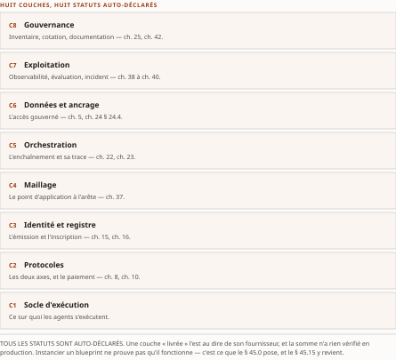
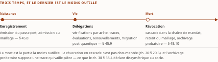
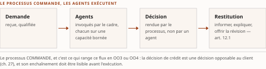
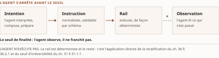
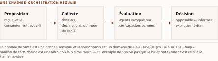

# Chapitre 45 — Le blueprint instancié et son cycle de vie : de Boréalis au portefeuille IBM, puis la naissance, la vie et la mort d'un agent d'entreprise

*Livre IV — Appliquer, exploiter, produire et composer : AgentMesh, AgentOps, fabrique d'agents et
synthèse architecturale.
Quatrième mouvement — composer (ch. 42-46). Quatrième chapitre du mouvement, **et celui dont
l'enveloppe dérivée est la plus haute du Livre** : il instancie ce que le ch. 43 a rangé et ce que le
ch. 44 a formalisé.*

⚠ **Chapitre issu de la fusion v0.20 du TOC** (décision 11) : il porte **deux mouvements** — *le
blueprint instancié* (ancien ch. 49), *le cycle de vie complet d'un agent d'entreprise* (ancien
ch. 50) — et donc **deux thèses**, conservées intégralement et **jamais fondues en une troisième**.

| Champ | Valeur |
|---|---|
| **Statut** | **Brouillon de rédaction, non publiable** — rédigé sur instruction d'auteur du 27 juillet 2026, **avant** les portes **G-3**, **G-4** et **G-5**, et hors de l'ordre de rédaction du PRD §6. ⚠ **Ce chapitre hérite en outre d'une réserve du ch. 44** : *le registre des stéréotypes dont il dépend est publié sous réserve d'un préalable non tenu* (R-IV-101). ⚠ **R-IV-40 et R-IV-41, ouvertes au ch. 37, valent pour tout le Livre.** ⚠ **Le § 45.6 est un SIÈGE pour toute la somme** — le ch. 41 § 41.7 y renvoie sans le reprendre |
| **Date de gel** | **27 juillet 2026** — gel unique, **D-1 prise** ([`gel-2026-07-27.md`](../PRD/gel-2026-07-27.md)). ⚠ **Volet résiduel de G-1 — l'état a changé le 28 juillet 2026, et le motif se déclare** : la passe du volet résiduel a **instruit à la source primaire les 123 entrées à sensibilité temporelle du socle consolidé** ([`gel-2026-07-28-volet-residuel.md`](../PRD/gel-2026-07-28-volet-residuel.md)), ⚠ **mais cette pièce ne s'y ré-adosse pas** : *ses propres faits périssables — statuts de disponibilité, versions de produits, dates d'annonce, échéances de brouillons — **n'ont pas été repris à la source primaire**, et la reprise reste due.* ⚠ **Le superlatif antérieur — « le chapitre du Livre où ces faits sont les plus nombreux » — est retiré**, *aucun balayage comparatif des dix chapitres ne le soutenant.* Gels de source : **16 juillet 2026** (Vol. II, ch. 22-23), **21 juillet 2026** (Vol. III), **juin 2026** (Vol. I) |
| **Socle mobilisé** | ⚠ **Écrite avant l'existence du socle consolidé, la pièce ne s'y ré-adosse pas.** L'Annexe B ([`PRD/socle-consolide.md`](../PRD/socle-consolide.md), **159 entrées `S-001`…`S-159`**) existe depuis le **28 juillet 2026**, **porte G-3 franchie** — *la formule « socle consolidé : zéro entrée » a cessé d'être vraie et n'est plus écrite ici* ; les énoncés ci-dessous résolvent **contre les socles des volumes, par leurs identifiants d'origine**, et **la correspondance vers les `S-nnn` reste due**. Vol. II — **F-38 à F-46** ⚠ **nommées une à une, la plage seule ne les désignant pas** : **F-38**, **F-39**, **F-40**, **F-41**, **F-42**, **F-43**, **F-44**, **F-45**, **F-46** ; plus **F-09**, **F-15**, **F-17**, **F-27**, **F-28**, **F-29**, **F-32**, **F-33**, **F-34**, **F-35**, **F-36**, **F-37**, **F-01**, **F-02**, **F-16**, **F-05**, **F-48** ; ⚠ **et le socle du second mouvement est une plage distincte, relevée sur l'en-tête de sa source** : **F-39 à F-42 et F-44 à F-46** — *ni F-38 ni F-43 n'y figurent* —, plus **F-27**, **F-28**, **F-34**, **F-35**. **PRD du Vol. II, Annexe B §B.1-B.4** (spécification du blueprint). Vol. III — **F-06**, **F-07**, **F-08**, **F-10**, **F-11**, **F-29**, **F-46**, **F-47**, **F-85**, **F-86**, **F-89** ; **H-13**, **H-30**, **H-32**. Vol. I — **Annexe B** (architecture de solutions) et *Monographie* **§6.8**, **en [C]**. ⚠ **La liste reprend l'assignation du plan, et toutes ses entrées ne sont pas citées au corps** : *Vol. II **F-02**, **F-05**, **F-09**, **F-16**, **F-27**, **F-34**, **F-35**, **F-43** et **F-48**, Vol. III **H-13**, n'y portent aucune occurrence — **déclarées mobilisables, non mobilisées***. ⚠ **Les deux séries F-xx sont préfixées de leur volume à chaque emploi** (décision 7). **Aucun énoncé n'est central au sens de CA-IV-01** — *les entrées [C] l'interdisent, et la pièce n'est adossée à aucune entrée `S-nnn` du socle consolidé* |
| **Garde-fous balayés** | ⚠ **Règle de comptage, décision 16 du TOC** : les cardinaux ci-dessous portent sur le **marqueur littéral de l'identifiant** dans le **corps** de la pièce — de la première section à la synthèse, **en-tête et note de statut exclus** —, et ils sont **re-mesurés sur le corpus que le commit produit**. ⚠ **Un garde-fou appliqué sans que son identifiant soit écrit voit son DOMAINE déclaré, sans cardinal** (alinéa c) : *le domaine balayé est le corps entier, et les cardinaux antérieurs — qui comptaient les **applications** et non le marqueur — n'étaient re-mesurables par aucune règle écrite.* **Les deux séries sont balayées intégralement, zéros compris.** Vol. II — **R-8 (sigle jamais nu, quatre branches) : trois occurrences**, § 45.2, § 45.6 et § 45.14, **renvoyées au siège du ch. 7 § 7.5** ; **R-5 (aucun standard technique désigné) : deux occurrences**, § 45.4 et § 45.13 ; **réserve F-37 (préimpression non révisée) : deux occurrences**, § 45.1 ; **R-6 (position à un classement d'analystes non vérifiée) : une occurrence**, § 45.3 ; **R-7 (instrumentation d'une attente réglementaire par un produit = inférence d'auteur) : une occurrence**, § 45.4, ⚠ **nommé par volume, à ne pas confondre avec R-07 du Vol. III** ; **réserve F-01 (« cadre d'autorisation », jamais « sécurisé ») : une occurrence**, § 45.2 ; **réserve F-29 (le rail temps réel porte quatre cibles successives) : deux occurrences**, § 45.4, ⚠ **à ne pas confondre avec F-29 du Vol. III**, *qui porte un tout autre objet au § 45.9* ; **métriques auto-déclarées (marqueur « auto-déclaré ») : quatre occurrences**, § 45.2, § 45.9 (deux) et § 45.11, **chacune attribuée à son éditeur ou à son institution nommée** ; **§8.4 (neutralité fournisseur : nommer, jamais recommander) et réserve F-09 : zéro occurrence de l'identifiant** — ⚠ *les deux sont tenus de bout en bout, la neutralité aux § 45.1 à § 45.3 et § 45.11, la formule « attendu par E-23 » au § 45.11 — le § 45.4 écrivant « **attentes** de risque de modèle » et **ne portant nulle part le mot proscrit « exigé »**, dont l'unique occurrence du corps est l'énoncé de la règle au § 45.11 : **domaine déclaré, sans cardinal** (décision 16, alinéa c)* ; **R-1 à R-4 : zéro occurrence**. Vol. III — **R-09 : trois occurrences**, § 45.5, § 45.8 et § 45.9 ; **R-01 : deux occurrences**, § 45.1 et § 45.8 ; **R-02 : une occurrence**, § 45.9 ; **R-07 (aucune conformité revendiquée : fait négatif ÉTABLI, non vérifié) : une occurrence**, § 45.4 ; **R-13 : une occurrence**, § 45.14, **renvoyée au siège du ch. 43 § 43.5** ; **R-14 : zéro occurrence de l'identifiant** — ⚠ *les trois degrés sont portés en toutes lettres aux § 45.1, § 45.2, § 45.4 à § 45.6, § 45.10, § 45.13, § 45.15 et à la synthèse : **domaine déclaré, sans cardinal***. **R-03 à R-06, R-08, R-10 à R-12 : zéro occurrence** |
| **Volumétrie cible** | ≈ **12 000 mots** de corps (§ 45.0 à la synthèse), **cible dérivée** de l'enveloppe du Livre (**69 000 mots**, TOC v0.25) au prorata des **quinze sections en deux mouvements** — **la plus haute du Livre**, devant les ≈ 11 000 mots du ch. 37 ; *les dix cibles dérivées somment exactement l'enveloppe.* ☑ **Décompte publiable depuis G-2** ; **réel reporté au [`README.md`](README.md)**. ⚠ **D-4 s'applique**, et son interdiction d'amputation porte ici plus qu'ailleurs : *un chapitre d'instanciation est long parce que chaque composant porte son statut, sa date et son éditeur* |

> **Thèse** *(citée depuis le [`TOC.md`](../PRD/TOC.md) **v0.28**, entrée du chapitre 45, premier mouvement — **thèse réalignée en v0.28**, décisions 8 et 14, remontée R-IV-105)* — le blueprint applique les six principes directeurs à un portefeuille réel documenté ; chaque couche porte **son statut de preuve daté** et, ⚠ **lorsqu'il y en a un, un positionnement d'options d'orchestration qui est SANS EXCEPTION une** Lecture de l'auteur — *aucune source du corpus ne positionne un produit sur cette échelle, et plusieurs couches n'en portent aucun*. ⚠ **Les points d'intégration avec l'existant portent sur TROIS existants nommés, non sur chaque couche**, et *deux des trois ne sont pas documentés à ce grain* — **étendre, jamais dupliquer**.

> **Thèse du second mouvement**, citée depuis le TOC **v0.28**, entrée du chapitre 45 *(thèse réalignée en v0.28, décisions 8 et 14 — remontée R-IV-103)* — le blueprint **s'éprouve** par le parcours — de l'enregistrement à la révocation, chaque transition est jouée contre l'architecture **au grain générique des mécanismes**, ⚠ **le cas financier canadien (continuité Boréalis) étant joué EN UNE PASSE UNIQUE en clôture** — *inversion que le Vol. III déclare en tête de son chapitre comme un choix de composition, non une prescription du cadrage*. ⚠ **Et l'épreuve ne « prouve » rien** : *sa confrontation ne vaut pas réfutation externe — c'est une **épreuve de cohérence interne**, le cas venant du même auteur et du même corpus.*

⚠ **Les deux thèses portaient, à la rédaction, des formes que leurs sources avaient elles-mêmes
bornées — la seconde était le désalignement le plus net du Livre, et le réalignement est FAIT**
(décision 17 du TOC, alinéa c). ⚠ **Une seule accommodation typographique a été faite au report, et
elle se déclare** : *dans la thèse du premier mouvement, la borne de gras qui se refermait sur
« Lecture de l'auteur » a été rouverte devant ce marqueur — **aucun mot n'est changé, aucun mot ne
perd son gras** —, parce que le générateur de la page reconnaît le marqueur CA-IV-07 avec sa balise
fermante et produisait sinon un gras jamais refermé* (le contrôle [2] du vérificateur l'a trouvé).
**Formes antérieures, v0.25** : *premier mouvement*, « le blueprint
applique les principes directeurs […] ; **chaque couche** porte **son positionnement OO**, son statut
de preuve et **son point d'intégration** avec l'IAM et l'observabilité en place » ; *second mouvement*,
« le blueprint **se prouve** par le parcours — […] chaque transition est jouée contre l'architecture,
**au grain d'un cas financier canadien** (continuité Boréalis) ».

- **Premier mouvement — deux bornes.** *(a)* « chaque couche porte **son positionnement OO** » : le
  Vol. II établit qu'**aucune source de son corpus ne positionne un produit sur l'échelle OO1-OO4**, et
  que **tout positionnement avancé est, sans exception, une Lecture de l'auteur**. *La thèse ne le dit
  pas ; le corps l'écrit à chaque ligne.* *(b)* « **chaque couche** porte […] son point d'intégration
  avec l'IAM et l'observabilité » : *le Vol. III traite **trois existants**, non huit couches* — **le
  quantificateur universel n'est porté par aucune des deux sources.**
- **Second mouvement — et il porte sur ce que la source déclare avoir fait.** *(a)* « **chaque
  transition est jouée** […] **au grain d'un cas financier canadien** » : ⚠ **le Vol. III déclare
  expressément l'inverse** — *« les trois transitions ci-dessous sont jouées **au grain générique des
  mécanismes**, et le cas fil rouge est joué **en une passe unique** » au terme du chapitre*, et il
  qualifie cette inversion de **choix de composition, non de prescription du cadrage**. *(b)* « le
  blueprint **se prouve** par le parcours » : ⚠ **le Vol. III écrit que sa confrontation « ne vaut pas
  réfutation externe »** — *« c'est une **épreuve de cohérence**, et l'appeler autrement serait
  exactement la faute que ce volume prend pour objet ».*

**Le corps a été écrit sous les formes bornées** et les écarts avaient été **remontés** (R-IV-103 et
R-IV-105, § 45.16). ☑ **Les deux remontées sont soldées par l'arbitrage v0.28 du TOC** (décisions 8
et 14), et **les deux citations ci-dessus portent les formes réalignées**, reportées **par copie**
depuis l'entrée courante du plan. *Ni la v0.29 ni la v0.30 du TOC ne modifient une thèse du Livre.*

---

## § 45.0 — Ouverture : ce qu'instancier veut dire, et ce qu'il ne prouve pas

**Une architecture de référence ne se déploie pas.** *Elle se choisit, se négocie, s'achète — et c'est
à ce moment, quand le principe rencontre une référence de produit et une date de disponibilité, qu'elle
cesse d'être un schéma pour devenir une décision opposable.*

**Le portefeuille retenu par le Vol. II est celui d'IBM**, ⚠ **et ce choix appelle immédiatement sa
réserve, qui gouverne tout le chapitre** : *il s'agit d'un **cas d'instanciation documenté par sources
primaires**, **non d'une recommandation d'achat ni d'un verdict comparatif**.* ⚠ **La neutralité
fournisseur interdit de recommander, non de nommer** : *anonymiser un éditeur est une faute au même
titre qu'en recommander un*, et le § 45.3 rend compte de la manière dont la règle a été tenue.

⚠ **Deux réserves de traçabilité s'imposent d'entrée, et elles sont héritées.** *La première* : **les
pages de l'éditeur refusent le récupérage automatisé**, de sorte qu'une partie des entrées du socle du
Vol. II repose sur **des extraits indexés citant l'adresse primaire plutôt que sur la lecture intégrale
de la page** — ⚠ *la réserve est signalée entrée par entrée, et une relecture humaine des annonces
clés est recommandée avant publication.* *La seconde* : ⚠ **aucune source du corpus du Vol. II ne
positionne un produit sur l'échelle des options d'orchestration** — *la taxonomie est un cadre
académique, les produits sont documentés par leur éditeur, et rien ne rapproche les deux.*

⚠ **Ce que le chapitre ne refait pas.** Les **principes de l'architecture de référence** sont au
**ch. 43** ; leur **formalisation** au **ch. 44** ; la **matrice protocoles × exigences** au **ch. 42**.
*Ce chapitre les instancie et ne les redécide pas.* ⚠ **Et il ne porte aucun flux dans son premier
mouvement** : *le ch. 22 du Vol. II est repris en entier — principes, couches, neutralité —, et les
trois flux sont au second mouvement.*

---

# Premier mouvement — Le blueprint instancié : de Boréalis au portefeuille IBM à la fabrique de confiance

*Ancien ch. 49 du plan (décision 11 du TOC). Entrée conservée intégralement.*

## § 45.1 — Les six principes directeurs

**Le blueprint repose sur six principes.** ⚠ **Aucun n'est un produit ; aucun n'est non plus une
déduction du socle.** *Ce sont des choix d'architecture, dérivés de ce que le socle établit et énoncés
pour être contestés.*

| # | Principe | Ce qui le porte | Ce que le socle n'établit pas |
|---|---|---|---|
| **1** | **L'autonomie encadrée par construction** — tout processus sous exigence réglementaire stricte s'exécute en **OO3 ou OO4** : *le processus déterministe orchestre les agents, jamais l'inverse* | une convergence à trois sources — un manifeste académique, une expérimentation, un patron de fournisseur (Vol. II **F-36**, **F-37** et **F-46**) —, ⚠ **dont le Vol. II déclare lui-même qu'elles ne sont pas trois observateurs indépendants** : *deux partagent une autrice, deux une organisation* | ⚠ *l'application d'aucune des trois au Canada ni à la finance canadienne* ; ⚠ **et « exigence réglementaire stricte » n'est pas défini par le socle**, alors que c'est le déclencheur de toute la règle |
| **2** | **Aucune interaction IA non gouvernée** — chaque appel de modèle, chaque invocation d'outil, chaque échange entre agents transite par une passerelle d'application de politiques | trois points de contrôle candidats, datés au § 45.2 (Vol. II **F-40**) | ⚠ *qu'elles interceptent toute interaction dans un déploiement réel*, ni **qu'aucune voie de contournement ne subsiste** |
| **3** | **Le contrat d'abord** — les actifs d'intégration existants sont **republiés** comme outils, non réécrits | la documentation d'une passerelle d'API décrit **la génération d'outils et de serveurs à partir des définitions d'API existantes** (Vol. II **F-40**) | ⚠ *la **fidélité** de la projection*, ni *qu'elle préserve les contrôles du contrat d'origine* |
| **4** | **Hybride et souveraineté** — charges sensibles en auto-géré, agilité par le service infonuagique, **résidence canadienne** | zones multizones datées, une offre souveraine **en disponibilité générale**, un cadre de contrôles à **565 exigences** (Vol. II **F-45**) | ⚠ **le rapprochement avec la ligne directrice B-13 est une inférence d'auteur** : *l'éditeur ne revendique aucune conformité à B-13, et aucune source ne documente ce lien* |
| **5** | **La traçabilité de bout en bout, jamais déléguée aux agents** | une préimpression enseigne que la journalisation confiée aux agents « n'est généralement pas recommandée » (Vol. II **F-37**), ⚠ **position, non résultat établi** ; instrumentation ouverte native dans deux produits datés (Vol. II **F-39**) | ⚠ *que la forme **absolue** du principe soit portée par la source* — **elle est une décision d'architecture** |
| **6** | **La gouvernance du cycle de vie des modèles et des agents** — inventaire, évaluation graduée, catalogue gouverné | un produit de gouvernance **en disponibilité générale** depuis une date nommée, et sa gouvernance agentique livrée en 2025 (Vol. II **F-44**) | ⚠ **le rapprochement avec E-23 est une inférence d'auteur** : *l'éditeur **ne revendique aucune conformité** à E-23, et aucune source ne documente ce lien* — **fait négatif ÉTABLI** |

: Tableau 45.1 — Les six principes directeurs du blueprint, avec ce qui les porte et ce que le socle n'établit pas. ⚠ **Trois énoncent une discipline d'architecture, deux imposent un point de contrôle, et le quatrième — celui de la souveraineté — pose une contrainte de territoire.** *Seul le premier dispose de trois sources convergentes ; les cinq autres sont des choix appuyés sur des capacités documentées.*

⚠ **Un élément mérite d'être relevé pour lui-même, et il vient de l'éditeur du portefeuille.** Un patron
d'architecture agentique publié par cet éditeur **recommande explicitement les enchaînements
statiques — de type notation de processus normalisée — pour les processus sous surveillance
réglementaire**, au nom de **l'auditabilité, de la conformité et de la définition des transferts**
(Vol. II **F-46**). Lecture de l'auteur — ⚠ *la recommandation est remarquable par sa provenance :
elle émane de l'éditeur dont ce chapitre instancie le portefeuille agentique, et **elle borne l'emploi
de ce qu'il vend**.* **Le socle en établit le contenu et la date** ; ⚠ *il n'établit ni son influence
sur les décisions d'architecture des institutions, ni son maintien après la date de gel.* ⚠ **La même
entrée porte une réserve inséparable** : *cet éditeur **ne publie pas d'architecture agentique
spécifique aux services financiers*** — le patron est générique, et la recherche a été menée **sans
résultat**.

⚠ **Et le premier principe touche un objet qui n'existe pas.** *Le blueprint du Vol. III pose, lui,
que **rien n'entre au maillage sans passeport*** — ⚠ **or le passeport d'agent ne figure dans aucune
spécification à date** (R-01 du Vol. III ; siège **ch. 16**). **Ce principe conditionne donc une
admission à un artefact que personne ne délivre**, et *le ch. 43 § 43.3 a établi que c'est ce qui le
distingue des cinq points de contrôle obligatoires, lesquels sont opposables sans lui.*

## § 45.2 — La vue en couches C1-C8, avec statuts datés

⚠ **Convention de lecture, et elle est la règle de cette section.** *Chaque composant porte **sa source
et sa date**. Son **statut de disponibilité** n'est indiqué **que lorsque le socle l'établit** sous
l'une des trois formes attendues — disponibilité générale, préversion, déprécié.* ⚠ **Les composants
qui n'en portent pas sont ceux pour lesquels le socle n'en établit aucun** : *l'éditeur les documente
sans le publier.* ⚠ **« Annoncé » date une communication, non une disponibilité** — *et c'est le cas
de la passerelle de médiation sur laquelle repose pourtant le principe 2.*

| # | Couche | Composants au socle, datés — **statut lorsque le socle l'établit** | Positionnement des options d'orchestration ⚠ **(Lecture de l'auteur — aucune source ne le porte)** |
|---|---|---|---|
| **C1** | **Exposition et gouvernance des interactions** | une passerelle d'API en version majeure datée ; un agent d'API **en disponibilité générale** (19 nov. 2025) ; une passerelle d'IA (2024, étendue 2025) ; une **passerelle de niveau microservice annoncée** le 19 nov. 2025 ; une **passerelle de médiation IA annoncée**, ⚠ **sans statut de disponibilité au socle** ; une passerelle et registre unifiés en logiciel libre (Vol. II **F-40**) | ⚠ **aucun** — la couche s'applique à toutes les options |
| **C2** | **Intégration applicative et B2B** | un moteur d'intégration à cadence trimestrielle ; un nœud d'appel de modèle ; une solution de messagerie financière normalisée ; une offre hybride **en disponibilité générale** (16 juin 2025) (Vol. II **F-39** et **F-38**) | flux déterministes = **cadres opérationnels**, **OO3** |
| **C3** | **Messagerie et événements** | un gestionnaire de files **en disponibilité générale** (juin 2026) — *livraison « exactly-once » **selon la documentation de l'éditeur***, haute disponibilité intra et inter-régions, **cryptographie post-quantique pour le transport** ; une gestion de points de terminaison d'événements **maintenue** ; ⚠ **deux produits dépréciés** ; ⚠ **et un pivot d'éditeur clôturé le 17 mars 2026 — écrit au passé** (Vol. II **F-39** et **F-41**) | rail déterministe **OO3** ; agents événementiels sans cadre explicite = **OO1** |
| **C4** | **Données** | un plan de contrôle unifié d'intégration de données, daté du 11 juin 2025 (Vol. II **F-38**) | ⚠ **aucun** — couche d'alimentation |
| **C5** | **Couche agentique** | un orchestrateur d'agents : trousse de développement datée, outils dès mai 2025, **protocole agent-agent depuis le 30 juin 2025**, serveurs distants sept. 2025, cadre de connexion d'agents, **six garde-fous** ; une famille de modèles **en disponibilité générale** (2 oct. 2025) (Vol. II **F-42**) | les enchaînements de l'orchestrateur = **cadre opérationnel des agents**, **OO4** |
| **C6** | **Gouvernance IA et risque de modèle** | un produit de gouvernance **en disponibilité générale** (déc. 2023) ; gouvernance agentique livrée en 2025 ; un module de conformité issu d'un accord de revente daté (Vol. II **F-44**) | ⚠ **aucun** — couche transverse |
| **C7** | **Observabilité et opérations** | une observabilité d'agents et de modèles **en préversion publique** ; une plateforme d'opérations ; instrumentation ouverte native (Vol. II **F-44** et **F-39**) | ⚠ **aucun** — instrumentation des propriétés d'évaluation |
| **C8** | **Socle d'exécution et souveraineté** | une plateforme d'intégration **en disponibilité générale** (30 juin 2026, support six ans) ; zones multizones **datées de 2021 et du 3 avril 2025** ; une offre souveraine **en disponibilité générale** (5 mai 2026) ; un cadre de contrôles à **565 exigences** (Vol. II **F-39** et **F-45**) | ⚠ **aucun** — couche d'exécution |

: Tableau 45.2 — La vue en couches C1-C8 du blueprint, avec statuts datés. ⚠ **Tous les statuts sont auto-déclarés par leur éditeur, nommé, et n'ont fait l'objet d'aucune vérification indépendante.** ⚠ **Toute la colonne de droite est une Lecture de l'auteur** : *aucune source du corpus ne positionne un produit sur l'échelle des options d'orchestration.*

**Lecture de l'auteur, sur C1 — la couche où le principe 2 devient une adresse réseau.** *La famille de
passerelles s'est diversifiée **par la taille et par l'objet** — passerelle d'API, de microservice, de
médiation IA —, ce qui suggère que **le point de contrôle unique du principe 2 est, dans les faits,
une famille de points à coordonner**.* ⚠ **Le socle n'établit ni leur intégration mutuelle, ni qu'une
politique écrite une fois s'y applique partout.** ⚠ **Et c'est exactement la première condition de
réfutation du ch. 37 § 37.9** : *un dispositif dont on ne peut pas énumérer les arêtes qu'il ne
médiatise pas fournit une opposabilité partielle dont le complément est inconnu.*

⚠ **Désambiguïsation obligatoire à C5** (R-8 du Vol. II) : *le positionnement de l'orchestrateur comme
plan de contrôle agentique est **une qualification de son éditeur, attribuée à lui***, et **l'encadré
des quatre branches siège au ch. 7 § 7.5** — *ce chapitre n'en reconstruit aucune.*

⚠ **Réserve de vocabulaire à C1** : *la passerelle porte un **cadre d'autorisation**, jamais un
protocole « sécurisé »* (réserve F-01 du Vol. II ; siège **ch. 8**).

⚠ **Deux dépréciations et un pivot d'éditeur figurent au tableau, et ils se lisent comme des faits
datés, non comme des jugements.** *Le pivot est **clôturé** — la trajectoire est écrite au passé*, et
⚠ **le socle ne documente pas ce que la clôture a produit** : absence de documentation, non fait
négatif vérifié (degré 3). *Une trajectoire de produit annoncée n'est pas une capacité livrée, et le
chapitre ne comble pas l'écart.*

## § 45.3 — La neutralité fournisseur en pratique

⚠ **Cette section n'est pas une précaution rhétorique : c'est le rendu de compte d'une règle
opposable.** *La neutralité fournisseur **interdit de recommander, non de nommer***, et elle impose
trois choses que le chapitre tient : **nommer l'éditeur à chaque occurrence**, **porter le statut à
chaque mention**, **ne jamais présenter un cas d'instanciation comme un verdict comparatif**.

**Les alternatives ne sont ni écartées ni surclassées.** *Le Vol. II documente à leur propre niveau de
preuve **trois réalisations d'orchestration** — un cadriciel d'éditeur en disponibilité générale, une
plateforme dont **le support d'un protocole n'est confirmé de première main que pour son offre
commerciale**, une orchestration événementielle **en préversion ouverte sans client ni chiffre
d'adoption à la source** — et **deux cadriciels supplémentaires en [C]*** (Vol. II **F-32**, **F-33**,
**F-15**). ⚠ **Le ch. 43 § 43.6 en est le siège** ; *ce chapitre y renvoie et ne les rejuge pas.*

⚠ **Une réserve porte sur un classement d'analystes, et elle est nommée** (R-6 du Vol. II) : *une
position à un classement d'analystes citée par le socle **n'a pas été vérifiée**, et elle ne soutient
aucun énoncé de ce chapitre.* ⚠ **Les études d'analystes commandées portent leur statut** : *une étude
commandée par l'éditeur qu'elle évalue est une donnée d'éditeur, attribuée comme telle.*

Lecture de l'auteur — ⚠ **la neutralité se mesure à un test simple, et le chapitre s'y soumet** :
*si l'on remplace le nom de l'éditeur par celui d'un autre et que le raisonnement tient encore, la
neutralité est tenue ; s'il cesse de tenir, le chapitre recommandait.* **Ce que le socle établit** :
l'existence et le statut daté de chaque composant nommé. **Ce qu'il n'établit pas** : *qu'un autre
portefeuille ne réponde pas aux mêmes principes* — ⚠ **aucun balayage comparatif n'a été conduit**, et
*l'absence de comparaison est une propriété de la méthode, non un verdict sur le marché.*

## § 45.4 — Correspondance réglementaire : le tableau B.3 développé

⚠ **La colonne décisive de ce tableau n'est pas celle de la réponse d'architecture : c'est celle du
statut du lien.**

⚠ **Et le fait qui commande tout ce qui suit est un fait négatif du socle, établi et déterminant pour
la section** : ***aucune source ne relie le portefeuille à la ligne directrice E-23 ni à la ligne
directrice B-13***. ⚠ **Ce n'est pas une lacune de recherche qu'un effort supplémentaire
comblerait** : *c'est un constat sur **ce que l'éditeur revendique**.* **Fait négatif ÉTABLI, non
vérifié** — *l'éditeur n'affirme rien, et le socle le constate ; aucun balayage n'établit qu'il ne
pourrait pas l'affirmer.*

⚠ *« Central » est le terme technique de CA-IV-01, et l'en-tête de cette pièce déclare qu'**aucun
énoncé n'est central en ce sens** ; le mot ne sert donc, ici comme aux § 45.6 et § 45.7, qu'à
**nier** — jamais à qualifier un énoncé de ce chapitre.*

⚠ **Un composant peut *outiller* une exigence sans que quiconque l'ait certifié conforme à cette
exigence** ; *le rapprochement, alors, **appartient à l'auteur du blueprint** — c'est-à-dire à
l'institution qui le porte, et qui en répondra.*

| Exigence | Réponse d'architecture (couche) | Statut du lien |
|---|---|---|
| **E-23 — attentes de risque de modèle**, effet au 1ᵉʳ mai 2027 | **C6** : inventaire, cotation graduée, cycle de vie, documentation de modèle ; **C7** : surveillance continue | ⚠ **Inférence d'auteur — fait négatif ÉTABLI** : *l'éditeur ne revendique aucune conformité, aucune source ne documente le lien* (R-7 du Vol. II ; R-07 du Vol. III) |
| **B-13 — gestion du risque technologique** | **C8** : cadre de contrôles à 565 exigences, zones multizones, offre souveraine | ⚠ **Inférence d'auteur — fait négatif ÉTABLI** : *même régime*. **Le cadre de contrôles de l'éditeur n'est pas B-13** |
| **Ligne directrice IA de l'AMF**, effet au 1ᵉʳ mai 2027 | **C6** transverse | ⚠ **Inférence d'auteur — mais le régime d'absence DIFFÈRE, et l'écart se déclare** : *le socle **n'a pas établi** l'absence de revendication sur ce point* — **absence de documentation, degré 3**, non fait négatif |
| **Art. 12.1** — informer, expliquer, offrir la révision | **C1** (trace de passerelle), **C5** (point d'arrêt), **C7** (journal) | ⚠ **Inférence d'auteur** — *et le ch. 43 § 43.3 a établi que les trois obligations deviennent **PC1, PC2 et PC3**, qui ne sont déduits d'aucune source* |
| **Avis 11-348 des autorités en valeurs mobilières** — autonomie et adaptativité | **C1** et **C7** : audit de chaque interaction à la passerelle, traçabilité par tâche | ⚠ **Inférence d'auteur, et rien de plus** : *y adjoindre une absence de revendication serait la faute symétrique — **le fait négatif est borné à E-23 et à B-13*** |
| **Cadre bancaire — standard technique** | **C1** : couche d'exposition, republication d'actifs existants | ⚠ **Sans objet à date** : *aucun organisme de normalisation technique n'a été désigné et **aucun standard n'est nommé** dans les textes officiels* (R-5 du Vol. II) |
| **Rails de paiement canadiens** — le rail de grande valeur, le rail temps réel | **C3** : messagerie et intégration à la norme financière ; continuité opérationnelle de l'éditeur au Canada | ⚠ **DOCUMENTÉ — le seul du tableau, et il porte sur un RÔLE, non sur une conformité** : *l'éditeur est partenaire technologique des deux rails à des dates nommées* (Vol. II **F-45**, **F-28**, **F-29**) ; ⚠ **la solution de messagerie normalisée reste en [C]**, élévation tentée et échouée. ⚠ **Réserve F-29 du Vol. II** : *le rail temps réel porte **quatre cibles successives**, jamais « lancé »* |

: Tableau 45.3 — La correspondance réglementaire développée, avec le statut de chaque lien. ⚠ **CA-8 hérité : chaque lien porte son statut — et un seul est documenté, pour un rôle opérationnel.** ⚠ ***Une continuité opérationnelle ne vaut pas agrément réglementaire*** : *une institution qui écrirait que sa plateforme convient aux rails canadiens **parce que** leur exploitant technologique en est l'éditeur commettrait un enchaînement que le socle ne porte pas.*

⚠ **Le régime d'absence n'est pas uniforme, et c'est le point le plus fin de la section.** *Pour E-23
et B-13, le socle a **cherché et consigné** l'absence de revendication : **fait négatif ÉTABLI, degré
2**. Pour la ligne directrice de l'AMF, **le socle n'a rien cherché** : **absence de documentation,
degré 3**.* ⚠ **Les deux formules ne s'échangent pas**, et *le ch. 38 § 38.4 en a fait le siège pour
la somme.*

Lecture de l'auteur — ⚠ *l'éditeur **revendique là où il revendique**, et son silence sur le Canada
est une donnée, non un oubli à combler.* Le socle atteste au contraire des revendications ailleurs :
*pour un module de conformité issu d'un accord de revente daté, l'éditeur **revendique** des contenus
prêts pour trois cadres nommés — **le lien est documenté comme revendication d'éditeur, et le socle
n'établit pas la conformité elle-même**.*

## § 45.5 — Points d'intégration avec l'existant : étendre, ne pas dupliquer

⚠ **L'entreprise qui déploie des agents n'ouvre pas un chantier vierge.** *Elle exploite une gestion
des identités et des accès, une chaîne d'observabilité, et elle est assujettie à des cadres.* **La
question est de savoir ce que le socle documente de l'*extension* de ces trois existants, plutôt que
de leur duplication.**

**Un énoncé documenté soutient l'extension, et il est daté.** Un *Internet-Draft* d'architecture
énonce, **du point de vue de son groupe de travail**, que *les intermédiaires d'IA sont **un cas
particulier de charges de travail déléguées*** (Vol. III **F-86**, **[B]**).

⚠ **Trois bornes, et elles ne se détachent pas.** *Un* : **c'est l'énoncé d'un *Internet-Draft* en
cours, qui ne fait autorité sur rien et peut changer à la révision suivante** (R-09 du Vol. III).
*Deux* : **c'est une section d'*architecture*, non une prescription protocolaire.** *Trois* : ⚠ *la
page des documents de ce groupe recense **sept** brouillons **dont aucune date de publication en norme
n'est annoncée***, et **l'un d'eux expire pendant la période de rédaction** (Vol. III **F-85**,
**[B]**) — *un relevé horodaté et périssable, à rejouer avant citation.*

Lecture de l'auteur — **ce que le socle établit** : qu'un groupe de travail **considère** les
intermédiaires d'IA comme un cas particulier d'un objet qu'il spécifie déjà. **Ce qu'il n'établit
pas** : *que l'extension soit techniquement possible sur un déploiement donné*, ni **qu'elle préserve
les propriétés de l'existant**. ⚠ **La lecture proposée est étroite** : *« étendre plutôt que
dupliquer » est une **règle d'économie**, non une garantie de compatibilité* — et **elle se réfute par
la production d'un cas où l'extension casse une propriété que la duplication aurait préservée**.

⚠ **Deux existants sur trois ne sont pas documentés à ce grain**, et il faut l'écrire : *le socle
documente l'extension du plan d'identité ; **il ne documente ni l'extension de la chaîne
d'observabilité, ni celle des dispositifs de conformité en place*** — absence de documentation, non
fait négatif vérifié (degré 3). ⚠ **La thèse du mouvement écrivait « chaque couche porte son point
d'intégration » ; elle est réalignée depuis la v0.28 du TOC** et porte désormais *trois existants
nommés, non chaque couche* — **le corps et la thèse concordent** (R-IV-105, soldée).

## § 45.6 — L'organisation de la fabrique : qui opère quoi

> ⚠ **SIÈGE DE L'ORGANISATION DE LA FABRIQUE POUR TOUTE LA SOMME.** Le **ch. 41 § 41.7** y **renvoie sans la
> reprendre** — *un renvoi interne, jamais une seconde revendication du même texte* (décision 6 du
> TOC). *C'est le motif pour lequel la table détaillée du ch. 41 ne porte aucun marqueur de
> provenance.*

Lecture de l'auteur — **marquage porté à l'ouverture de la section.** **Ce que le socle établit** :
*quatre propositions d'un volume antérieur sur la place d'un **plan de contrôle obligatoire*** (Vol. III
**H-30**, **[C]**) ; **un rôle nommé par une source primaire** — *celui du membre du personnel en
mesure de réviser une décision* (Vol. III **F-89**, **[B]**), ⚠ **seul de son espèce parmi les entrées
mobilisées, aucun balayage du socle n'ayant porté sur les rôles** ; et **deux absences de titulaire
documentées** dans le projet qui spécifie la signature (Vol. III **F-08**, **F-11**). **Ce qu'il
n'établit pas** : ⚠ **la répartition des responsabilités entre équipes, la conduite du changement, le
facteur humain, et la forme d'organisation qu'appellerait une fabrique de confiance** — *la
répartition proposée est une **inférence d'auteur intégrale**.*

⚠ **La section a été réaffectée à sa source le 21 juillet 2026, et le motif se déclare** : *elle
empruntait sa matière à un ouvrage d'un **corpus d'appui** dont aucun des trois n'a jamais été
déposé* — **le lot est clos par échec documenté, réversible par dépôt ultérieur**. ⚠ **Les mentions de
« corpus d'appui » sont des marqueurs conditionnels de réouverture, jamais des sources** ; *elle se
reconstruit sur le principe hérité seul.*

**Le principe hérité, et sa borne.** Le Vol. I traite la plateforme d'agents **non comme un dispositif
à gouverner après coup, mais comme un plan de contrôle obligatoire couplé à une dorsale
d'intégration**, et en résume la logique en une phrase : ⚠ ***l'agent prépare ; un humain ou un
contrôle déterministe engage l'irréversible ; toute action transite par un point d'application de
politique unique ; tout actif décisionnel est un modèle inventorié.*** ⚠ **Entrée de repérage, thèse
d'un volume antérieur, attribuée : elle ne porte aucun fait central.** ⚠ **Qualificatif obligatoire**
(R-8 du Vol. II) : *le « plan de contrôle **obligatoire** » est celui du Vol. I, distinct du « plan de
contrôle **au sens infrastructure** » du maillage* — **les quatre branches siègent au ch. 7 § 7.5**.

⚠ **Deux absences de titulaire sont documentées, et ce sont les seuls faits de la section.** *Le
fichier de sécurité du dépôt qui spécifie la signature **ne porte aucune disposition de gouvernance
des clés**, et le document de gouvernance **n'attribue à aucun organe une responsabilité de gestion
des clés**.* ⚠ Lecture de l'auteur — *une architecture dont le mécanisme de confiance n'a **aucun
titulaire nommé** ne se répartit pas en rôles : elle en manque un.* **Ce que le socle établit** : les
deux absences, bornées à ces deux documents. **Ce qu'il n'établit pas** : *qu'aucun titulaire n'existe
ailleurs* — degré 3.

⚠ **Et une question neuve s'ouvre ici, que le ch. 41 § 41.7 formule sans pouvoir la refermer** : *les
rôles répartis ci-dessus répondent de ce qui **tourne** ; **qui répond de ce qui est produit** ?* **Le
socle ne documente aucune répartition des responsabilités de production d'un parc** — degré 3.

## § 45.7 — L'architecture de solutions Boréalis, résumée

*← Vol. I **Annexe B** ; ⚠ **intégrale à l'Annexe H**, non rédigée.*

⚠ **Le cas est fictif, et il se déclare tel avant sa première ligne.** *Une coopérative de services
financiers du Québec, institution financière fédérale et assujettie à l'autorité provinciale ; cinq
sous-domaines ; **contraintes-pivots** — l'article 12.1, la résidence des renseignements personnels au
Canada, les lignes directrices de risque de modèle et de risque technologique, la ligne directrice IA
provinciale* (Vol. III **H-32**, **[C]**).

⚠ **Entrée de repérage venue d'un volume dont la vérification porte sur les références et non sur le
contenu des affirmations : elle situe le cas, elle ne porte aucun fait central.** ⚠ **Et une confusion
est à écarter d'emblée** : *ce cas fictif n'est pas le **démonstrateur logiciel** du même nom, qui est
un autre objet* — ⚠ **et ce démonstrateur a été retiré du dépôt le 25 juillet 2026** ; *il ne se lit
plus que dans l'historique, et aucun renvoi de ce chapitre n'y résout.*

⚠ **Décision de fusion, reprise du plan et déclarée** : *les deux instanciations — le cas fictif du
Vol. I et le portefeuille réel du Vol. II — sont présentées comme **deux réalisations de la même
architecture de référence**, non comme deux blueprints concurrents.* Lecture de l'auteur — *ce qui
les rend comparables est le **jeu de contraintes**, non les composants : le premier fixe les
contraintes, le second fournit des composants datés, et **aucun des deux n'établit que les seconds
satisfont les premières**.*

---

# Second mouvement — Instanciation : le cycle de vie complet d'un agent d'entreprise

*Ancien ch. 50 du plan (décision 11 du TOC). Entrée conservée intégralement.*

⚠ **Écart de grain déclaré, et il est repris de la source plutôt que corrigé.** *Le cadrage prescrivait
de jouer **chaque transition au grain du cas fil rouge** ; **les trois transitions ci-dessous sont
jouées au grain générique des mécanismes**, et le cas est joué **en une passe unique** au § 45.15.*
⚠ **L'inversion est un choix de composition, non une prescription du cadrage** — et *c'est la forme
que la thèse du mouvement porte depuis son réalignement en v0.28* (R-IV-103, soldée).

## § 45.8 — Naissance : enregistrement, émission du passeport, admission au maillage

⚠ **La naissance est le moment du parcours où le socle est le mieux garni — et c'est ce qui la rend
instructive.** *Trois actes s'y enchaînent, et **aucun des trois ne s'appuie sur ce que le précédent
était censé produire**.*

**Enregistrer.** L'agent est déclaré à un registre gouverné dont le schéma rend **obligatoires** deux
champs — *l'énumération des outils invocables et les bornes de portée*. ⚠ **Le statut du document se
dit à chaque mention** : **brouillon de laboratoire, non norme ratifiée** (R-09 du Vol. III). ⚠ **Et
le ch. 15 en est le siège** ; *ce chapitre n'y revient pas.*

**Émettre.** ⚠ **Le passeport d'agent ne figure dans aucune spécification à date** : *c'est un objet de
synthèse construit par la somme, en assemblant une carte signée, une inscription au registre, une
chaîne de mandat et des attestations* (R-01 du Vol. III ; siège **ch. 16**). ⚠ **L'acte d'émission
n'est donc pas décrit par une spécification** : *ce que les mécanismes documentent est l'émission de
**chacune de ses pièces**, séparément, et **aucune ne fournit aux autres l'ancrage qui leur manque**.*

**Admettre.** Le maillage vérifie l'agent qui se présente — ⚠ **et le ch. 37 § 37.4 a rendu le verdict
qui compte** : *le mécanisme documenté **ne répond pas** à « qui es-tu » ; il **évalue une politique**,
il n'émet, ne vérifie ni ne révoque un identifiant.* ⚠ **La barrière qui déciderait de ce qui *peut*
se présenter est au ch. 41 § 41.4** — *matière neuve, sans socle.*

Lecture de l'auteur — ⚠ ***la naissance décrite ici est une séquence de trois actes dont aucun ne
consomme la sortie du précédent*** : le registre déclare des bornes que **rien n'établit lisibles par
un point d'application** ; l'émission produit des pièces **dont aucune n'ancre les autres** ;
l'admission évalue une politique **qui ne porte ni identité ni mandat**. **Ce que le socle établit** :
les trois mécanismes, chacun dans ses bornes. **Ce qu'il n'établit pas** : *leur chaînage* — ⚠ **aucune
entrée ne met deux de ces trois actes en rapport**, et **c'est le résultat de la section**.

## § 45.9 — Vie : délégations, vérifications par arête, traces, évaluations, renouvellements, migration post-quantique

⚠ **La vie est le moment où les trois étages travaillent simultanément, et le socle y est réparti très
inégalement d'un geste à l'autre.**

**Déléguer.** Le mandat existe sous **trois formes documentées, et chacune borne ce qu'elle porte.**
*Un format de projet sérialise le mandat avec un attribut de type versionné et des attributs
temporels, à une version datée* — ⚠ **spécification de projet, non texte normatif d'un organisme de
normalisation** (R-09 du Vol. III ; Vol. III **F-46**). *Une norme de délégation définit l'attribut
qui exprime qu'une délégation a eu lieu et identifie la partie agissante, et **place explicitement
hors périmètre la syntaxe, la sémantique et les caractéristiques de sécurité des jetons
eux-mêmes*** (Vol. III
**F-47**). ⚠ **Le ch. 17 § 17.1 a repris cette norme à la source primaire au titre de G-1, et
l'extraction rapporte plus que la relève n'annonçait** — *elle **exclut** les maillons antérieurs de
toute décision d'autorisation* ; **le siège est là-bas**. *Un mécanisme de propagation est à une
révision datée d'un brouillon en cours, **expirant dans les six mois**, et **borne lui-même sa portée
à un domaine de confiance*** (Vol. III **F-29**).

**Vérifier par arête.** ⚠ **Le ch. 37 § 37.5 en est le siège** : *une syntaxe d'autorisation
documentée, **en préversion auto-déclarée**, et un **écart de couverture entre deux plans d'identité
déclaré par l'éditeur lui-même**.* *Ce chapitre n'y revient pas.*

**Tracer.** ⚠ **Le ch. 38 § 38.5 en est le siège** : *l'identité serait la clé de jointure, et **rien
dans le corpus ouvert ne la constitue**.*

**Évaluer.** ⚠ **Le ch. 39 § 39.1 en est le siège** : *l'évaluation continue est instrumentée comme
mesure de performance et **non comme acte de vérification d'identité**.*

**Renouveler.** ⚠ **La rotation est outillée ; le retrait d'une clé compromise ne l'est pas** (Vol. III
**F-10**, siège **ch. 20**). *Un renouvellement qui ne s'accompagne pas d'un retrait vérifiable
prolonge un verdict au lieu de le redater.*

**Migrer.** ⚠ **Le ch. 21 en est le siège** — *les jalons post-quantiques, leur statut et leurs
origines y sont posés **une seule fois**, et ils ne se fusionnent jamais.* **Ce chapitre en retient un
seul fait**, et il est de composant : *un gestionnaire de files du portefeuille déclare une
**cryptographie post-quantique pour le transport**, à une version datée* — ⚠ **capacité auto-déclarée
par son éditeur nommé, non vérifiée**. ⚠ **Un mécanisme se qualifie par ce que sa spécification
démontre, jamais par ce qu'un éditeur annonce** (R-02 du Vol. III) : *ce que le socle établit est
l'annonce, non la propriété.*

Lecture de l'auteur — ⚠ ***des six gestes de la vie d'un agent, quatre ont un siège ailleurs dans
la somme, un est outillé à moitié, et un ne l'est que par une annonce d'éditeur.*** *C'est ce que
l'instanciation apporte : **non des faits nouveaux, mais la mesure de la dispersion**.* **Ce qu'elle
n'apporte pas** : *aucun chaînage entre les six* — ⚠ **et le § 45.10 montre où l'absence de chaînage
coûte.**

## § 45.10 — Mort : révocation, cascade dans la chaîne de mandat, retrait du maillage, archivage probatoire

⚠ **Deux précisions d'intitulé, héritées et reportées.** *(1)* **Le qualificatif complet de la chaîne
est obligatoire à chaque occurrence** — *l'intitulé est rendu ici avec lui, et l'écart avec le plan est
signalé chez sa source.* *(2)* **Le cadrage désigne cette transition comme la plus instructive des
trois** ; ⚠ **la qualification est celle du document de cadrage, reprise et attribuée**, *non un
classement mesuré* — **et la source a elle-même retiré un superlatif voisin faute de balayage
comparatif.**

**Révoquer.** ⚠ **L'interdiction est posée au niveau normatif le plus fort — « Expired or revoked keys
MUST NOT be used for verification » — sans aucun mécanisme permettant au client d'établir l'expiration
ou la révocation** (Vol. III **F-07**). ⚠ **Deux bornes reportées** : *l'énoncé figure **sous un
intitulé de considérations de sécurité**, au milieu de recommandations plus faibles, et **il vise la
clé de signature, non la carte***. La section qui porterait le mécanisme **ne mentionne ni liste de
révocation, ni protocole d'état en ligne, ni chaîne de certificats, ni délai de revalidation**, et sa
procédure **ne comporte aucune étape de contrôle de statut ou de fraîcheur** (Vol. III **F-06**, fait
négatif **VÉRIFIÉ, borné à une seule section**).

**Cascade.** ⚠ **Le ch. 20 écrit au degré 3 l'absence de mécanisme de révocation en cascade dans une
chaîne de délégation** — *absence de documentation, non fait négatif vérifié* —, **et le ch. 39 § 39.3
a établi ce que le socle documente à la place** : *une **révocation de masse** datée, en réponse à un
incident public. **L'exemple daté que le socle porte d'une réponse d'urgence est une réponse à
granularité maximale.***

**Retirer du maillage.** ⚠ *Le retrait suppose que le point d'application **sache** que l'agent est
retiré* ; **le ch. 37 § 37.8 a établi qu'un point d'application ne peut pas vérifier une fraîcheur
dont aucun mécanisme ne lui fournit le moyen.**

**Archiver.** ⚠ **Le ch. 38 § 38.4 en est le siège**, et il porte la condition qui décide de tout :
***sans attribution fiable, un journal infalsifiable ne prouve qu'une séquence anonyme d'actions.***
⚠ **Et l'archivage probatoire hérite du § 45.8** : *si l'émission n'a produit aucune pièce qui ancre
les autres, l'archive conserve une séquence dont l'imputation n'a jamais été établie.*

Lecture de l'auteur — ⚠ ***la mort d'un agent est la transition où l'absence de chaînage constatée
au § 45.8 devient un coût mesurable***. *Naître sans chaînage produit un agent dont les pièces ne
s'ancrent pas ; mourir sans chaînage produit **un retrait dont on ne peut pas établir la
propagation**.* ⚠ **Le geste intermédiaire — retirer un mandat précis et constater sa propagation —
n'est documenté par aucune entrée** (siège **ch. 39 § 39.3**).

## § 45.11 — Flux 1 — la décision de crédit assistée par agents : le processus commande

**Le premier flux instancie le principe directeur sur l'un des cas d'usage agentiques canadiens les
mieux documentés par source primaire.** ⚠ **Métrique auto-déclarée, attribuée à l'institution nommée
et non vérifiée** : *une banque **déclare** que son premier modèle d'IA agentique effectue la
pré-adjudication d'un prêt garanti et génère des mémos de synthèse, **ramenant un traitement d'environ
quinze heures à moins de trois minutes*** (Vol. II **F-17**).

⚠ **Le flux décrit ci-dessous n'est pas celui de cette institution** — *le socle n'en documente aucun
composant d'architecture* : **c'est le flux type de la spécification du blueprint, sur le portefeuille
instancié.**

**Sa propriété structurante tient en une phrase** : ⚠ ***le processus déterministe orchestre les
agents, et c'est lui qui décide de l'enchaînement.*** *Le flux d'intégration ou l'enchaînement
d'orchestration appelle des agents de synthèse documentaire ; **il ne leur délègue ni la séquence, ni
la décision de s'arrêter, ni la production du journal**.*

Lecture de l'auteur — ⚠ **la spécification retient OO4 pour ce flux ; le socle n'établit pas que
les agents invoqués y soient conscients du processus**, *or c'est cette conscience qui sépare OO4
d'OO3.* ⚠ **Sur les seuls faits documentés, rien ne distingue les deux options** — *le positionnement
est une inférence, à vérifier sur chaque configuration.* **Ce qui est établi est ce qui compte pour la
suite : le processus commande, soit OO3 au moins.**

⚠ **Deux formes imposées se tiennent ici, et leur violation serait la faute la plus coûteuse du
chapitre.** *(1)* **« attendu par E-23 », jamais « exigé »** : *le flux outille des attentes, il ne
satisfait aucune exigence.* *(2)* ⚠ ***le flux outille un point d'arrêt humain, JAMAIS la révision de
l'article 12.1*** — le Vol. II écrit que **« le blueprint ne doit pas prétendre le contraire »**.
*L'article ménage l'occasion de présenter ses observations à un membre du personnel **en mesure de
réviser la décision** ; un point d'arrêt technique n'établit ni cette qualité, ni cette mise en
mesure.*

## § 45.12 — Flux 2 — le paiement normalisé vers le rail de grande valeur : l'agent observe, le rail exécute

**Le deuxième flux est l'inverse du premier, et c'est pour cela qu'il figure ici.**

*L'émission d'un paiement de grande valeur est un traitement transactionnel déterministe.* **Le rail a
achevé sa bascule** vers la norme de messagerie financière — *fin de la coexistence des deux formats à
une date nommée* (Vol. II **F-28**). ⚠ **Côté plateforme, le socle documente un gestionnaire de files
en disponibilité générale**, dont *la livraison « exactly-once », la haute disponibilité intra et
inter-régions et la cryptographie post-quantique pour le transport sont **déclarées par son éditeur
nommé**, non vérifiées* ; **un moteur d'intégration** assure l'intégration applicative, et l'éditeur
documente **une solution dédiée à cette messagerie**.

Lecture de l'auteur — ⚠ *la contrainte dominante y est d'une autre nature : **non d'expliquer mais
d'exécuter**, le rail imposant **une forme de message et un budget de temps**.* ⚠ **Un délai à tenir ne
se confie pas à un composant dont la durée d'exécution n'est pas bornée** — *et le ch. 40 § 40.5 a
établi, en [C], que **la latence des boucles longues a un coût d'exploitation propre**.* **La
conclusion est donc structurelle : l'agent observe, le rail exécute.**

⚠ **Et le positionnement qui en découle est le seul du chapitre qui ne soit pas ambigu** : *un agent
qui observe sans commander n'est pas au même endroit de l'échelle qu'un agent invoqué par un
enchaînement* — **mais le socle ne porte toujours aucun positionnement**, et *cette lecture-ci est
d'auteur comme les autres.*

## § 45.13 — Flux 3 — l'accès au cadre bancaire : concevoir contre une norme qui n'existe pas encore

⚠ **Le troisième flux est le plus inconfortable, et c'est là son intérêt : il faut concevoir sans
savoir contre quoi.**

**Le fait négatif est ici du degré le plus fort — VÉRIFIÉ** : ⚠ ***aucun organisme de normalisation technique n'a
été désigné par arrêté ministériel et aucun standard n'est nommé dans les textes officiels*** ; *la
candidature d'un format d'industrie relève du **commentaire d'industrie***, attribué comme tel (R-5 du
Vol. II, formulation imposée). ⚠ **Le règlement lui-même n'est que prépublié**, *et son texte final
peut changer.*

**Ce que le blueprint peut affirmer se réduit à trois propositions, dont la dernière est négative — et
il faut résister à la tentation d'en ajouter une quatrième.**

1. **La couche d'exposition existe et est documentée** — *une passerelle d'API en version majeure
   datée, avec cycle de vie, portail développeur et famille de passerelles.*
2. **Cette couche sait republier des actifs d'intégration existants en outils et serveurs**, *à partir
   des définitions d'API* — **c'est le troisième principe directeur, le contrat d'abord** : *les API du
   cadre, une fois qu'il y en aura, seront des actifs **à republier, non à réécrire**.*
3. ⚠ **Proposition négative** : *le consentement de la personne et le registre public des participants
   sont **hors du périmètre du portefeuille*** — ils relèvent du cadre et de son superviseur, non de la
   plateforme d'intégration.

⚠ **Lire la couche d'exposition comme épuisant la question de l'accès au cadre bancaire, ce serait
confondre le tuyau et le droit d'y faire passer quoi que ce soit** : ***ce qui autorise le flux ne se
configure pas dans une passerelle.***

⚠ **Et le ch. 43 § 43.6 a nommé cette situation par son nom d'architecture** : *ce n'est pas un point
de contrôle, c'est une **frontière d'abstraction** — un endroit où l'architecture doit **pouvoir
changer d'avis** sans se refaire.*

## § 45.14 — Exemple de bout en bout : souscription vie augmentée, et sa variante en sinistres

*← Vol. I* Monographie *§6.8 — **prélevé au ch. 44**, qui traite par ailleurs son chapitre d'origine en
bloc. ⚠ Section en **[C]** de bout en bout.*

⚠ **Cette section est la seule du chapitre où le formalisme du ch. 44 s'applique à un cas complet**, et
elle se lit **domaine par domaine**.

**Motivation.** *Les parties prenantes et les moteurs de conformité y produisent des exigences de
transparence, chacune devenue une **Specialization de Requirement** stéréotypée.* ⚠ **Le ch. 44 § 44.6
en est le siège** : *aucun Requirement réglementaire ne doit demeurer orphelin.*

**Strategy.** *Une **Capability** de souscription augmentée et un **Value Stream** conscient de la
coopération humain-agent.* ⚠ **La capacité est l'unité de planification, jamais l'outil** (ch. 44
§ 44.3).

**Business.** *Le processus, le **Role** de souscripteur, et — ⚠ **le point qui compte** — **le point
d'arrêt humain placé sur l'irréversible**, par Assignment.* ⚠ **Le ch. 44 § 44.1.7 en est le siège**,
et **il porte la borne** : *le formalisme atteste **l'intention** de contrôle, non son **exercice à
l'exécution***. ⚠ **R-13 du Vol. III** : *aucune échelle d'autonomie n'est nommée nue ici ; le siège de
la désambiguïsation est au **ch. 43 § 43.5**.*

**Application.** *Un agent orchestrateur, des serveurs d'outils adossés à un standard sectoriel de
données de santé, un moteur de règles de souscription.* ⚠ **Le triplet de modélisation n'est pas
renégocié** — *il est au ch. 44 § 44.1.3.*

**Technology et mise en œuvre.** *Un environnement d'exécution confiné, un plan de contrôle, un
**Plateau** de déploiement.* ⚠ **Le plan de contrôle porte son qualificatif** (R-8 du Vol. II) ; **le
Plateau renvoie au ch. 43 § 43.5.3**, où *un palier ne se franchit qu'en débloquant des contrôles
vérifiables, non en empilant des fonctionnalités.*

Lecture de l'auteur — ⚠ *l'exemple est en **[C]** de bout en bout, et son apport n'est pas
factuel* : **il montre que les cinq points de contrôle obligatoires du ch. 43 § 43.3 ont chacun un
lieu dans un modèle**, *ce qui est une propriété du formalisme et non une propriété du système
modélisé.* ⚠ **La variante en sinistres ne change ni les patrons ni les points de contrôle** — *et
c'est ce qu'elle est censée montrer.*

## § 45.15 — Confrontation : ce que l'épreuve vaut, et ce qu'elle ne vaut pas

⚠ **Cette section perd quelque chose, et elle le déclare avant d'écrire quoi que ce soit.** *Elle
rejouait, au cadrage antérieur, un cas fil rouge **externe** issu d'un corpus d'appui de trois
ouvrages ; **aucun des trois n'a jamais été déposé**, le lot est clos par **échec documenté**, et la
filiation est retirée.*

⚠ **Ce qui la remplace est le cas fil rouge du Vol. I — donc du même auteur et du même corpus.**
⚠ ***La confrontation ne vaut donc pas réfutation externe*** : *une architecture confrontée à un cas
conçu dans le même corpus **éprouve sa cohérence interne, non sa résistance à un jugement
indépendant**.* ⚠ **C'est une épreuve de cohérence, et l'appeler autrement serait exactement la faute
que la somme prend pour objet.**

⚠ **L'intitulé du plan écrivait « Confrontation externe » quand sa propre note de provenance écrivait
« confrontation *interne* au corpus »** : *le désalignement était **interne au plan***. **Il est
réaligné depuis la v0.28 du TOC**, et l'intitulé porté ici est celui du plan courant (R-IV-104,
soldée).

**Ce que l'épreuve établit malgré tout.** *Les contraintes-pivots du cas — l'article 12.1, la résidence
canadienne, les lignes directrices de risque de modèle et de risque technologique, la ligne directrice
IA provinciale — **se retrouvent une à une dans la correspondance du § 45.4**, et **aucune n'y reçoit
un lien documenté**.* ⚠ Lecture de l'auteur — *la cohérence est donc établie **par le bas** : les
mêmes contraintes produisent les mêmes vides.* **Ce que cela ne montre pas** : *que ces vides soient
ceux qu'un observateur indépendant relèverait* — ⚠ **le socle ne documente aucune confrontation
externe** : absence de documentation, non fait négatif vérifié (degré 3).

### Synthèse : ce que le chapitre lègue à la somme

*Section de sortie sans homologue direct dans la source — construction d'éditeur.*

1. **Les six principes directeurs, avec ce que chacun ne porte pas.** ⚠ *Un seul dispose de trois
   sources convergentes ; **le premier conditionne une admission à un artefact que personne ne
   délivre**.* Le **ch. 46** en séquence l'instrumentation.
2. **La vue en couches datée, et la règle qui la rend lisible.** *Statut **seulement** lorsque le socle
   l'établit ; « annoncé » date une communication.* ⚠ **Toute la colonne des positionnements est une
   Lecture de l'auteur.**
3. **La correspondance réglementaire, et ses cinq régimes.** ⚠ *Sept liens : **fait négatif établi**
   (deux), **inférence simple** (deux), **absence de documentation** (un), **sans objet** (un),
   **documenté** (un).* **CA-8 : chaque lien porte son statut, et le seul lien documenté porte sur un
   rôle opérationnel** — ⚠ *jamais sur une conformité.*
4. ⚠ **SIÈGE : l'organisation de la fabrique.** Le **ch. 41 § 41.7** y renvoie **sans la reprendre**.
   *Deux absences de titulaire documentées, et une répartition qui est une inférence intégrale.*
5. **Le parcours, et ce que sa dispersion mesure.** ⚠ ***Des six gestes de la vie d'un agent, quatre
   ont un siège ailleurs, un est outillé à moitié, un ne l'est que par une annonce.*** *Le ch. 49
   enregistrera l'état final ; le ch. 50 le registre de gel.*
6. **Les trois flux, et leur enseignement croisé.** *Le processus commande ; l'agent observe ;
   l'architecture doit pouvoir changer d'avis.* ⚠ **Et la forme imposée qui les traverse** : *le flux
   outille un point d'arrêt humain, **jamais la révision de l'article 12.1**.*

⚠ **Ce que le chapitre ne lègue pas.** Aucune **conformité** : *aucun lien de conformité n'est
documenté — le seul lien documenté du tableau porte sur un **rôle opérationnel** —, et l'inférence
appartient à l'institution qui la porte.* Aucun **verdict comparatif** :
*aucun balayage n'a été conduit, et l'absence de comparaison est une propriété de la méthode.* Aucune
**réfutation externe** : *l'épreuve est de cohérence interne, et le déclarer est le résultat.* Et
aucun **chaînage** entre les actes du parcours : *naître, vivre et mourir y sont trois séquences dont
le socle ne met jamais deux termes en rapport.*

---

## § 45.16 — Note de statut *(hors plan — à retirer à la publication)*

⚠ **Cette section n'est pas au TOC et n'a pas vocation à survivre.** Elle consigne l'écart de
gouvernance sous lequel la pièce a été rédigée (PRD, Annexe A).

**Ce qui est enfreint.** Portes **G-3**, **G-4** et **G-5** ; **volet résiduel de G-1** ; **ordre de
rédaction du PRD §6**. ⚠ **La porte G-3 a depuis été franchie — le 28 juillet 2026, TOC v0.30 et PRD
v0.14 —, et cela ne rattrape rien** : *la pièce a été écrite avant elle et n'est ré-adossée à aucune
entrée du socle consolidé ; un arbitrage qui suit une infraction la solde, il ne l'efface pas.* ⚠ **Le
superlatif antérieur sur le nombre de faits périssables est retiré**, *aucun balayage comparatif des
dix chapitres du Livre ne le soutenant.* ⚠ **S'y ajoute une dépendance héritée** : *le registre
des stéréotypes dont le § 45.14 dépend est publié sous réserve d'un préalable non tenu* (R-IV-101).
Instruction d'auteur du **27 juillet 2026**.

1. **Aucun énoncé n'est central au sens de CA-IV-01.** ⚠ **Et la lacune héritée du Vol. II est portée
   plutôt que tue** : *le portefeuille instancié porte une lacune déclarée à son PRD — position à un
   classement d'analystes sous réserve, un standard de messagerie en **[C]** après élévation tentée et
   échouée, annonces canadiennes ouvertes.* **Elle est reprise ici et renvoyée au ch. 50.**
2. **Les décomptes sont publiables** (G-2) ; le réel est reporté au [`README.md`](README.md).
3. **Les renvois « ch. N » : état FINAL de la passe, et non ordre d'écriture.** ⚠ *La forme
   antérieure de ce point photographiait l'instant où cette pièce a été écrite ; elle est corrigée
   ici sur l'état que le commit produit.* **Les dix chapitres du Livre IV (ch. 37 à 46) sont
   rédigés**, comme le sont les **cinquante chapitres des cinq Livres** : *tous les renvois « ch.
   N » de cette pièce résolvent donc contre du texte.* ⚠ **Les renvois vers les ANNEXES restent
   des renvois de plan** — *aucune annexe du compendium n'est rédigée*, l'annexe H comprise. ⚠
   **Ce qui reste vrai de la forme antérieure, et qui est daté** : à l'heure où ce chapitre a été
   écrit, n'étaient rédigés ni les ch. 25, 27, 32 et 33 du Livre III, ni les ch. 49 et 50 du Livre
   V — *les renvois qui les visent ont été posés comme renvois de plan et n'ont pas été
   re-vérifiés contre le texte paru après eux.* ⚠ **Et « résoudre contre du texte » ne vaut pas
   recevabilité** : *le texte visé est lui-même un brouillon hors portes.*
4. **Le socle du second mouvement est une plage relevée sur l'en-tête de sa source**, ⚠ **et deux
   entrées que les versions anciennes du plan y annonçaient n'y figurent pas** : *la plage est
   **F-39 à F-42 et F-44 à F-46**, ni F-38 ni F-43.* **La pièce l'écrit ainsi et ne recopie pas la
   plage large.**
5. **CA-IV-13 n'est pas satisfaite** — aucune relecture par un relecteur distinct du rédacteur.

   ☑ **STATUT ARRÊTÉ LE 2 SEPTEMBRE 2026** (décision 26 du TOC, **D-16**) : *l'**annexe H** n'est pas rédigée et **ne le sera pas** — le dépôt est clos, et **D-13** ne prévoit plus de passe de rédaction.* ☑ **Son siège est nommé aux sources** : `Annexe B - Architecture de Solutions.md` du **Vol. I**. ⚠ **Le renvoi de cette pièce n'est donc plus une attente, c'est une désignation** — *il visait un livrable à venir, il vise désormais un texte qui existe.*

**Remontées ouvertes par ce chapitre :**

- **R-IV-103 — non bloquante, de thèse, et elle porte sur ce que la source DÉCLARE AVOIR FAIT.** La
  thèse du second mouvement écrit que **« chaque transition est jouée contre l'architecture, au grain
  d'un cas financier canadien »**. ⚠ **Le Vol. III déclare expressément l'inverse en tête de son
  chapitre** : *« les trois transitions ci-dessous sont jouées **au grain générique des mécanismes**,
  et le cas fil rouge est joué **en une passe unique** »*, l'inversion étant **un choix de composition,
  non une prescription du cadrage**. S'y ajoute que la thèse écrit **« le blueprint SE PROUVE par le
  parcours »**, quand la source écrit que sa confrontation **« ne vaut pas réfutation externe »** et
  qu'elle est **« une épreuve de cohérence »**. **Demande remontée** : réalignement des deux membres au
  titre des **décisions 8 et 14**. ⚠ *Ce n'est pas une divergence d'interprétation : la source décrit
  sa propre méthode, et le plan en décrit une autre.*
  ☑ **Issue, 27 juillet 2026** — **TOC, décisions 8 et 14** — ⚠ **le désalignement le plus net du
  Livre** : la thèse écrivait « chaque transition jouée **au grain d'un cas** », *quand la
  source déclare en tête les avoir jouées **au grain générique des mécanismes***, le cas étant
  joué en une passe unique ; et « le blueprint **se prouve** » tombe — *la source écrit
  **épreuve de cohérence**, non réfutation externe.* **La citation du second mouvement porte la
  forme réalignée** (décision 17 du TOC).
- **R-IV-104 — non bloquante, de désalignement INTERNE AU PLAN.** La table détaillée du ch. 45 intitule
  sa dernière section **« § 45.15 — Confrontation externe »**, et **sa propre note de provenance**
  écrit, dans la même entrée : *« ← Vol. III* Monographie *§28.4 (**confrontation interne au
  corpus**) »*. ⚠ **Le titre et sa provenance se contredisent dans la même ligne**, et *la source
  qualifie l'écart comme la faute que le volume prend pour objet — appeler « externe » une épreuve
  interne.* **Demande remontée** : réalignement du titre sur la provenance (décision 8). ⚠ *Un
  désalignement interne à une entrée du plan ne se voit ni au contrôle de renvois ni au contrôle de
  cardinaux ; seule la lecture conjointe du titre et de sa note le montre.*
  ☑ **Issue, 27 juillet 2026** — **TOC, décision 8** — « § 45.15 — Confrontation **externe** »
  réaligné sur sa propre note de provenance, qui écrit « confrontation **interne** au corpus » ;
  ⚠ *désalignement **interne à une entrée du plan**, qu'aucun contrôle de renvoi ni de cardinal
  ne voit.*
- **R-IV-105 — non bloquante, de quantificateur, et de la même classe que R-IV-57.** La thèse du premier
  mouvement écrit que **« chaque couche porte son positionnement OO, son statut de preuve et son point
  d'intégration avec l'IAM et l'observabilité en place »**. ⚠ **Trois bornes** : *(a)* **aucune source
  ne porte de positionnement** — le Vol. II l'établit et qualifie **tout** positionnement de Lecture de
  l'auteur ; *(b)* **plusieurs couches ne portent aucun positionnement du tout**, et le tableau du
  § 45.2 le dit ligne par ligne ; *(c)* **le Vol. III traite trois existants, non huit couches**, et
  **deux des trois ne sont pas documentés à ce grain** (§ 45.5). **Demande remontée** : réalignement du
  quantificateur au titre des **décisions 8 et 14**.
  ☑ **Issue, 27 juillet 2026** — **TOC, décisions 8 et 14** — le quantificateur « **chaque**
  couche porte son positionnement OO […] et son point d'intégration » est borné : *aucune source
  ne porte de positionnement, plusieurs couches n'en portent aucun, et la source de
  l'intégration traite **trois existants**, non huit couches.* **La citation du premier
  mouvement porte la forme réalignée** (décision 17 du TOC).
- **R-IV-106 — non bloquante, de lacune héritée à porter au registre.** Le PRD du Vol. II déclare une
  lacune sur le portefeuille instancié — *classement d'analystes sous réserve, standard de messagerie
  resté en **[C]** après une élévation tentée et échouée, annonces canadiennes ouvertes*. ⚠ **La ligne
  Fusion du plan la nomme et lui assigne un renvoi vers un chapitre non rédigé.** **Demande remontée** :
  que **cette lacune entre au registre de l'Annexe C avec son identifiant d'origine**, et que **son
  chapitre porteur soit confirmé** — *une lacune héritée dont le porteur n'est pas rédigé n'a, à ce
  jour, aucun lieu où être enregistrée.*
  ☑ **Issue, 27 juillet 2026** — **TOC, Annexe C** — la **lacune héritée du PRD du Vol. II sur le
  portefeuille instancié** entre au registre **avec son identifiant d'origine**, et son chapitre
  porteur est confirmé ; ⚠ *une lacune héritée dont le porteur n'est pas rédigé n'avait aucun
  lieu où être enregistrée.*

**Ce qui n'est pas enfreint.** La structure suit la **table détaillée du TOC v0.28** — § 45.1 à
§ 45.15, dans l'ordre exact, **les deux mouvements séparés et chacun sous son ancien titre** —, et le
§ 45.0 est une introduction de chapitre. ⚠ **Six déviations d'intitulé sont fondées et se déclarent**
(décision 8, reprise en décision 15 alinéa c) : le § 45.1 précise le cardinal des principes, le § 45.7
**développe un sigle sans rien dé-nommer**, le § 45.9 abrège « évaluations continues », le § 45.11
retire le rappel « OO3 ou OO4 » que la section porte en corps, le § 45.14 francise « variante FNOL
P&C », et le § 45.12 **dé-nomme deux désignations qui ne relèvent pas du même régime** : *un rail
nommé — dénomination propre, parade de péremption couverte par la décision 15 alinéa a — et **une
norme de messagerie financière, dont l'alinéa a ne dit pas qu'elle soit une dénomination
commerciale***. ⚠ **Ce second cas est DÉCLARÉ ici, non tranché, et AUCUNE remontée numérotée ne le
porte** : *le titre du plan nomme la norme, la pièce ne la nomme nulle part, et seul l'arbitre peut
dire si la parade y était ouverte* — ⚠ **la décision 15 ne l'ordonne pas pour autant** : *aucun de
ses trois interdits n'est atteint ici, et elle écrit qu'une pièce se corrige là où l'un des trois
l'est, jamais partout.* ⚠ **Le défaut d'identifiant se déclare plutôt qu'il ne se comble** :
*l'allocation d'un numéro `R-IV-NN` relève du **PRD §13**, qui la veut écrite avant l'ouverture et
prise au-dessus du maximum constaté ; la plage de ce Livre — **R-IV-100 à R-IV-109** — est
entièrement consommée, et **en allouer un depuis une passe de relecture reproduirait la collision
que ce §13 documente**.*
⚠ **Aucune déviation ne touche une attribution** : *l'attributeur d'une métrique, l'auteur d'un
instrument et l'identifiant d'une source à instruire restent nommés partout.* Les **deux tables de
couverture sont respectées**, y compris leurs régimes propres : **le ch. 22 du Vol. II est repris en
entier** — *principes, couches, neutralité*, ⚠ **et ce chapitre ne porte aucun flux dans son premier
mouvement** ; **le §23.1 seul** alimente le § 45.4, *ses §23.2-23.4 allant au second mouvement* ; **le ch. 28 du Vol. III est repris
hors §28.5 et §28.6**, *prélevés par les ch. 49 et 50 et **non repris ici*** ; **l'Annexe B du Vol. I
est résumée**, *son intégrale allant à l'Annexe H* ; **et le §6.8 du Vol. I est prélevé au ch. 44**.
⚠ **C'est le ch. 23 du Vol. II qui est scindé, non le ch. 22** — *le ch. 22 ne porte aucun flux*, et la
pièce le tient. La **neutralité fournisseur est rendue en pratique au § 45.3**, avec **son test
explicite**. ⚠ **Une déviation de contenu se déclare en outre** : *le plan annonce **quatre statuts**
au tableau B.3 développé ; le chapitre en distingue **cinq**, le régime d'absence n'étant pas uniforme
entre E-23 et B-13 d'une part, la ligne directrice provinciale de l'autre (§ 45.4). **Sept liens de
part et d'autre** — le cardinal du plan est tenu, c'est sa granularité de statut qui est affinée*
(décision 8). ⚠ **Cardinaux re-mesurés au commit du 28 juillet 2026, sur le marqueur littéral et sur
le corps seul** (décision 16 du TOC) ; *les cardinaux antérieurs comptaient les applications du
garde-fou et n'étaient re-mesurables par aucune règle écrite.* Les **quatre métriques ou capacités
auto-déclarées** — marqueur littéral « auto-déclaré » — sont attribuées à leur éditeur ou à leur institution **nommée**, à chaque
occurrence. **Chaque lien réglementaire porte « documenté » ou « inférence »**, et **les trois régimes
d'absence sont distingués**. Le marqueur littéral **« degré 3 » compte huit occurrences**, chacune
portant son degré. ⚠ **Les faits négatifs sont TROIS, non deux comme l'écrivait la forme antérieure de
ce point, et chacun porte sa borne** : *un **ÉTABLI** — l'absence de revendication de conformité,
**bornée à E-23 et à B-13**, dont le marqueur littéral « ÉTABLI » compte **cinq occurrences au
corps**, une au § 45.1 et quatre au § 45.4 — et deux **VÉRIFIÉS** — la procédure sans étape de
contrôle de statut, **bornée à une seule section** (§ 45.10), et l'absence de standard technique
désigné (§ 45.13).* **Le pivot d'éditeur est écrit au passé**, comme le plan l'exige. **Un siège est posé et marqué** — le
§ 45.6 —, ☑ **et son versement à [`PRD/check-sieges.py`](../PRD/check-sieges.py) est FAIT**, harnais de
mutation rejoué (remontée R-IV-59). ⚠ **Le marqueur de ce siège a été renommé dans le commit
d'arbitrage même qui publiait la mesure de volumétrie** — « SIÈGE UNIQUE DE CETTE MATIÈRE… » devenu
« SIÈGE DE L'ORGANISATION DE LA FABRIQUE… », un mot de plus — *d'où l'écart d'un mot entre la
volumétrie publiée et la mesure ; il est corrigé au [`README.md`](README.md) du Livre, et la règle est
qu'**une mesure se prend sur le corpus que le commit produit**.*
