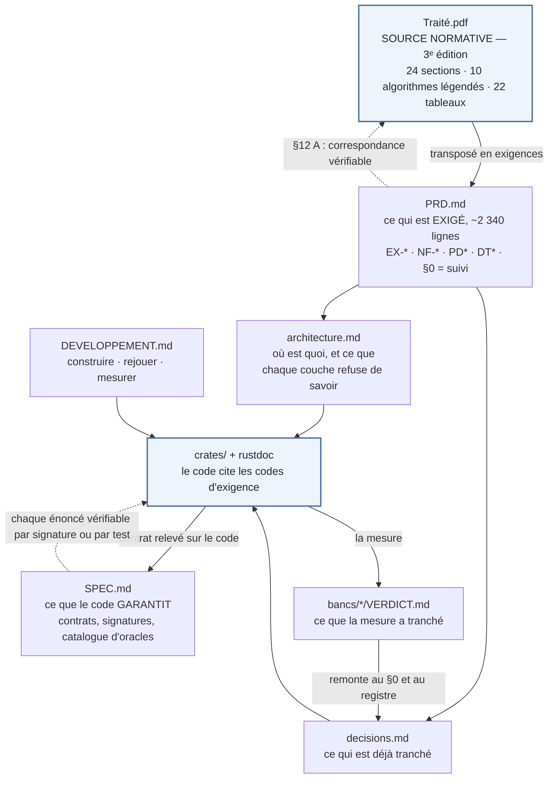

# Documentation de stigmergie-lab

Tout ce qui documente le projet vit ici, à deux exceptions près restées à la
racine du dossier parce qu'un outil les y attend — [`README.md`](../README.md),
page d'accueil, et [`CLAUDE.md`](../CLAUDE.md), chargé par Claude Code — et
à une troisième : les `VERDICT.md`, gardés sous [`bancs/`](../bancs/), à côté de
la mesure qui les produit.

⚠ **Et à une quatrième, qui n'est pas un choix : la source normative elle-même.**
Depuis l'entrée de ce dossier dans le dépôt [Agentique](../../README.md), le
14 août 2026, `Traité.md` et `Traité.pdf` sont **à la racine du dossier**, pas
ici. *Ce document et le `README.md` d'accueil les visaient sous `docs/`, où ils
vivaient du temps du dépôt autonome ; les trois renvois sont corrigés, celui de
`CLAUDE.md` depuis l'audit du 17 août 2026.* La règle « toute la documentation
vit dans `docs/` »
survit à l'exception, mais elle ne couvre plus le document dont tout le reste
dérive.

## Qui dérive de qui

Le tableau ci-dessous dit ce que chaque document contient ; ce graphe dit **d'où
il tire son autorité**. Deux boîtes seulement sont des sources — le traité, pour
ce qui est exigé, et le code, pour ce qui est garanti — et chacune a exactement
une flèche qui remonte vers elle.



Trois règles se lisent sur ce graphe et nulle part ailleurs. Un chiffre qui
n'aurait pas de chemin remontant jusqu'au `Traité.pdf` est une **grandeur sans
provenance** (F2). Un `VERDICT.md` qui ne redescendrait pas jusqu'à
`decisions.md` serait une **mesure sans conséquence**. Et un énoncé de `SPEC.md`
qui ne se vérifierait pas sur le code serait pire que faux : il ferait passer une
exigence pour une garantie, ce qui est exactement la confusion que la séparation
des deux documents existe pour empêcher.

**Pourquoi le PRD et SPEC.md sont deux documents.** Le PRD dit *le milieu doit
garantir M3*, avec le traité pour autorité. `SPEC.md` dit *`Milieu::lire` ne rend
que des enregistrements durables, et `ecrire` rend un délai que l'appelant
planifie*, avec le code pour autorité. Là où les deux divergent — et ils
divergent, les listes `hors_perimetre()` en font l'inventaire —, le PRD garde
l'exigence et `SPEC.md` dit ce que le code fait. Un document unique deviendrait
faux d'un côté à chaque changement de l'autre, sans qu'on sache lequel.

## Les documents

| Document | Ce qu'il contient | Quand le lire |
|---|---|---|
| [`Traité.pdf`](../Traité.pdf) *(⚠ à la racine du dossier, pas ici)* | **La source normative** — **troisième** édition du **15 août 2026**, 143 pages : 8 chapitres, 24 sections, 123 notices, **dix blocs d'algorithme légendés** — trois aux chapitres 1, 3 et 4, plus l'algorithme 8.1 — auxquels s'ajoutent trois algorithmes numérotés dans le corps du chapitre 2, sans ligne de légende, et 22 tableaux. Les figures se comptent de deux façons — 18 légendes numérotées pour 16 numéros distincts, la figure 2.1 se déclinant en a/b/c —, donc ce document n'en avance aucun compte. ⚠ **La pagination est celle de la troisième édition**, et c'est celle que F2 et DT5 fixent depuis le 17 août 2026. **La migration des renvois du PRD est faite** : les 75 renvois ont été repris un par un contre ce PDF — 23 justes, 41 corrigés, 10 rendus à leur édition d'origine, **1 introuvable et déclaré tel plutôt que remplacé par une page fabriquée** —, et `grep -oE 'p\. [0-9]+' docs/PRD.md` ne rend plus aucun renvoi sans mention d'édition. ⚠ **La mesure a montré qu'aucun décalage constant n'existe entre les deux éditions** : l'écart va de +1 à +35, si bien qu'une migration par arithmétique aurait produit 75 provenances fausses au lieu d'en corriger 41. Les renvois du **code** ont été réétalonnés par la même campagne, et 39 des 112 portent leur édition en propre, les autres l'héritant de leur paragraphe ; le balayage n'y a pas été refait renvoi par renvoi comme au PRD. Une page lue sans son édition est une provenance fausse, non imprécise (F2, DT5, et `CLAUDE.md`) ; le §0.2 du PRD donne le protocole de vérification. Les algorithmes, les hypothèses et les chiffres viennent de là, et de nulle part ailleurs. | Pour comprendre *pourquoi* un mécanisme est écrit ainsi |
| [`PRD.md`](PRD.md) | **Ce qui est exigé**, environ 2 340 lignes. Chaque exigence porte un code que le code source cite. Le §0 suit l'avancement, son §0.0 dit ce que la **deuxième** édition a changé — c'est de l'histoire, avec la pagination de la deuxième —, son §0.1 l'écart de la phase 6, et son §0.2 le banc d'audit du 17 août 2026 ; le §12 A donne la correspondance traité → implantation. | Pour retrouver la lettre d'une exigence, ou l'état du projet |
| [`SPEC.md`](SPEC.md) | **Ce que le code garantit** : contrat de déterminisme, contrat du moteur, catalogue des quinze oracles nommés, contrat du milieu, nomenclature des grandeurs qui ne se mêlent jamais, et ce que le contrat ne couvre pas. Chaque énoncé est vérifiable par une signature ou un test. | Avant d'écrire du code, et avant de supposer qu'une exigence est tenue |
| [`architecture.md`](architecture.md) | La vue d'ensemble des quatre crates, ce que chaque couche **refuse** de savoir, la carte des modules, et le modèle de domaine. | Pour trouver où va un changement |
| [`decisions.md`](decisions.md) | Le registre : les quatorze DT du PRD avec leur état, les verdicts tranchés par la mesure, les décisions de réalisation, les décisions **ouvertes** par l'audit du 17 août 2026, et ce que les deuxième et troisième éditions rouvrent — ou ne rouvrent pas. | Avant de refaire un choix déjà tranché |
| [`DEVELOPPEMENT.md`](DEVELOPPEMENT.md) | Chaîne d'outils, versions employées, ligne de commande exacte de chaque banc, et les trois commandes à lancer avant de committer. | Pour construire ou rejouer |

Les verdicts de banc restent avec leur mesure :
[DT1 — arithmétique](../bancs/dt1-flottant/VERDICT.md),
[NF-05 — débit](../bancs/nf05-debit/VERDICT.md) et
[EX-V12 — parité natif/WASM](../bancs/parite-wasm/VERDICT.md).

## Par où entrer

| Ce que vous cherchez | Où |
|---|---|
| Ce que le projet est, en dix lignes | [`README.md`](../README.md) à la racine |
| L'état d'avancement, les réserves ouvertes | §0 du [PRD](PRD.md) |
| Ce que la deuxième édition du traité a changé | §0.0 du [PRD](PRD.md) |
| Ce que la troisième édition change, et l'état mesuré du dépôt | §0.2 du [PRD](PRD.md) |
| Pourquoi une exigence existe | Son code dans le [PRD](PRD.md), puis §12 A pour la section du traité |
| Ce qui est réellement garanti par le code | [`SPEC.md`](SPEC.md) |
| Où poser un mécanisme nouveau | [`architecture.md`](architecture.md), dernière section |
| Si un choix a déjà été tranché | [`decisions.md`](decisions.md) |
| La commande exacte | [`DEVELOPPEMENT.md`](DEVELOPPEMENT.md) |
| Ce que le produit ne mesure **pas** | §8.3 du [PRD](PRD.md), et l'onglet « Limites » de l'interface |

## La documentation d'interface

Elle est **dans le code**, en rustdoc, et se lit avec :

```bash
cargo doc --workspace --no-deps --open
```

Les quatre crates déclarent `#![deny(missing_docs)]` : un item public sans
documentation ne compile pas. Elles déclarent aussi
`#![deny(rustdoc::broken_intra_doc_links)]`, ce qui est le seul contrôle
mécanique que le dépôt possède sur sa propre documentation — un renvoi cassé par
un renommage ne compile pas. La raison de la première est dans
[`sim-core/src/lib.rs`](../crates/sim-core/src/lib.rs) : une interface à demi
documentée ne dit pas laquelle des deux moitiés manque.

Les codes cités dans le code (`EX-C01`, `PD1`, `NF-02`, `DT9`…) se cherchent
tels quels dans [`PRD.md`](PRD.md).

## Ce qui n'existe pas, et pourquoi

Trois documents attendus dans un dépôt de cette taille sont **délibérément
absents**. Les nommer coûte moins cher que de les voir réapparaître comme
oubli :

- **`CHANGELOG.md`** — le projet n'a pas de versions publiées, et le §0 du PRD
  tient déjà l'historique par phase, avec ses critères de sortie et ses
  réserves. Un journal des versions ferait double emploi avec un tableau plus
  précis que lui.
- **`CONTRIBUTING.md`** — les règles que le dépôt fait respecter sont
  mécaniques (`clippy.toml`, `deny(missing_docs)`, les tests de sortie de
  phase) et déjà écrites dans [`CLAUDE.md`](../CLAUDE.md),
  [`DEVELOPPEMENT.md`](DEVELOPPEMENT.md) et [`SPEC.md`](SPEC.md). Un quatrième
  document ne ferait que les répéter avec un décalage.
- **`LICENCE`** — aucune n'est déclarée à ce jour. Ce n'est pas une question de
  documentation mais une décision de l'auteur, et l'inventer serait pire que
  l'absence. Les manifestes portent `publish = false` en attendant.

Deux redites sont également refusées. Un **glossaire** existe au §12 C du PRD, et
son pendant exécutable est `sim_agents::glossaire` — le recopier ici créerait une
troisième définition du même terme. Et un **document de conception de la phase
6** n'existe pas, la phase étant livrée : ce que le chapitre 8 exige est au §6 et
au §9 du PRD, où chaque mécanisme est rangé est à la dernière section
d'[`architecture.md`](architecture.md), et ce que son arrivée a changé au contrat
est au §13 de [`SPEC.md`](SPEC.md).

**Ce qui a existé et n'existe plus** : le `gauntlet-log.md` de la revue
adversariale qui avait produit la version 2.0 du PRD, retiré du dépôt. Ce qu'il
portait de durable est dans le PRD lui-même — les réserves du §0, les tensions du
§2.5 et les risques du §10 sont ce que cette revue a produit.

⚠ **Un fichier de ce nom est revenu à la racine du dossier le 17 août 2026, et ce
n'est pas celui-là** : [`../gauntlet-log.md`](../gauntlet-log.md) est le journal de
la boucle bâtisseur/critique de l'**audit complet du code** — cinq morceaux disjoints
par crate, barre tenue sur
[`bancs/dt1-flottant/VERDICT.md`](../bancs/dt1-flottant/VERDICT.md), rapports par
morceau sous `bancs/audit-2026-08/`. *Il ne couvre ni la revue du PRD, ni les boucles
de la veille, de la revue de littérature ou de l'état de l'art, dont les journaux
homonymes ont vécu ailleurs dans le dépôt et n'y sont plus.* ⚠ **Il n'est pas un
document de gouvernance** : rien n'y est exigé ni garanti, et aucun énoncé de ce
dossier ne s'y adosse. **Les deux fichiers n'ont jamais coexisté**, et c'est ce
qui lève l'ambiguïté : `git log --oneline -- gauntlet-log.md` montre le premier
retiré par le commit `4dfc0dc`, puis le second ajouté par l'audit du 17 août
2026. L'énoncé du paragraphe précédent est donc vrai de l'histoire, et il ne dit
rien du répertoire d'aujourd'hui. Ce que la campagne a produit de **durable**
n'est de toute façon pas là : c'est
[`bancs/audit-2026-08/`](../bancs/audit-2026-08/) — **dix rapports**, cinq de
morceau et cinq de critique, plus la
[consolidation](../bancs/audit-2026-08/CONSOLIDATION.md) qui les réunit et sert
de verdict de banc —, le §0.2 du [PRD](PRD.md) et le [registre](decisions.md).
