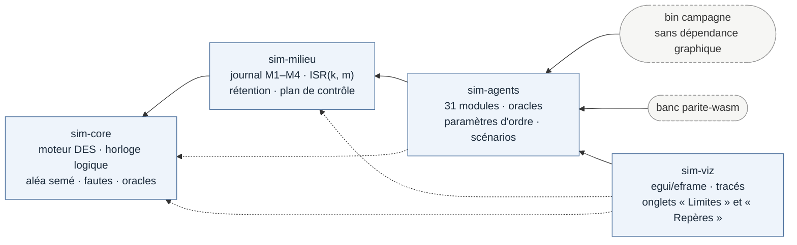
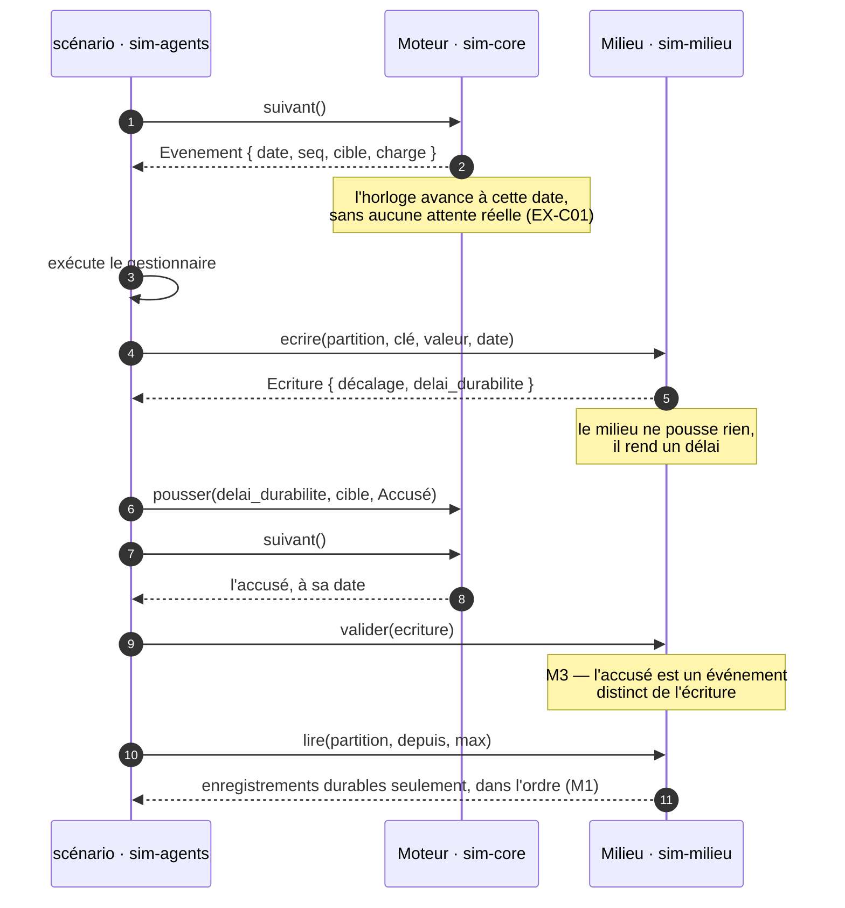
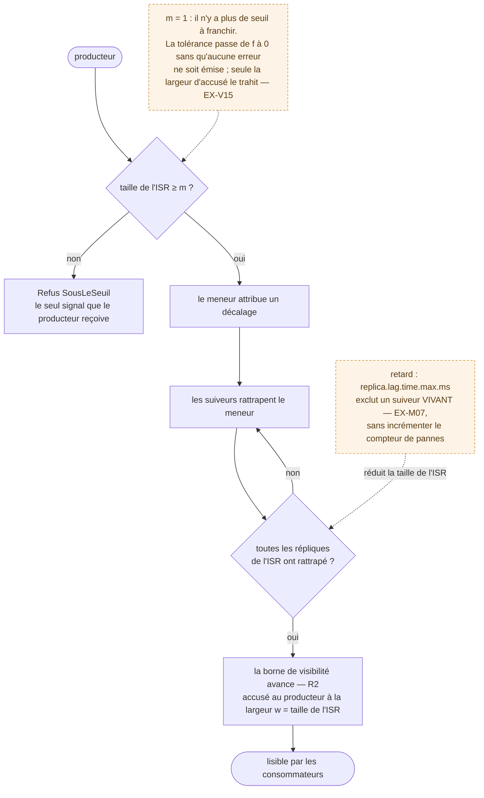
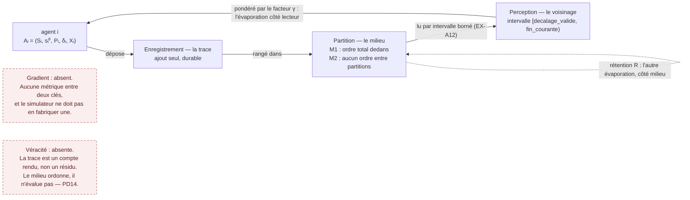

# Architecture

Ce document donne la carte du code. Trois documents décrivent le même logiciel,
et les confondre fait perdre du temps : le §5 du [PRD](PRD.md) dit **pourquoi**
le découpage est celui-là, [`SPEC.md`](SPEC.md) dit **ce que le code garantit**,
et ce document-ci dit **où est quoi** — c'est ce qu'il faut savoir avant de
modifier quoi que ce soit.

## La chaîne

Quatre crates, en chaîne linéaire, sans cycle :

**La flèche pointe vers ce dont on dépend.** Aucune flèche ne remonte, et c'est
vérifiable mécaniquement — le graphe des `[dependencies]` est acyclique par
construction de Cargo, mais l'ordre choisi, lui, est une décision.

**Les pointillés sont les dépendances déclarées vers une couche non adjacente**
— `sim-agents` nomme `sim-core` en plus de `sim-milieu`, `sim-viz` nomme les
trois. Elles ne remontent pas, donc la chaîne tient ; mais « chaîne linéaire »
décrit l'ordre des couches, pas le contenu des `Cargo.toml`.

**La ligne de coupe est le niveau de la boucle, pas le thème.** Un découpage par
sujet — `sim-consensus`, `sim-gouvernance`, `sim-securite` — produirait des
crates à un ou deux mécanismes, toutes dépendantes des trois mêmes couches
inférieures. C'est le cadriciel que le §10 du PRD surveille sous le nom RQ3, et
il est explicitement interdit.

## Ce que chaque couche refuse de savoir

C'est la partie qui compte : les responsabilités se lisent dans les noms, les
**interdits** ne se lisent nulle part ailleurs.

| Crate | Sait | **Ne sait pas, et ne doit pas apprendre** |
|---|---|---|
| `sim-core` | Boucle à événements discrets, horloge logique, aléa semé, fautes, détecteur, oracles, hypothèses fortes, vérification statistique | Ni le journal partitionné, ni les agents. Il ne peut donc pas évaluer un oracle : il en tient la déclaration, la classe et l'instant de violation, l'appelant fait le reste |
| `sim-milieu` | Journal M1–M4, réplication ISR(k, m), rétention, compactage, latences, groupe de consommation, plan de contrôle | Aucun algorithme d'agent, aucun protocole d'accord. Il ne pousse **aucun** événement lui-même — il rend un délai, l'appelant le planifie |
| `sim-agents` | Les mécanismes, leurs oracles, les paramètres d'ordre, **et les scénarios comme données** | Il ne dessine rien |
| `sim-viz` | egui/eframe, tracés, onglets « Limites » et « Repères », schémas figés | **Zéro** logique de simulation, **zéro** définition de scénario, **zéro** texte du traité — **à deux exceptions nommées, toutes deux déclarées dans l'onglet « Limites »** : le découpage du budget en tranches réimplanté par `situe_la_tranche`, et les trois valeurs d'ouverture de `VueB`. *Les six du scénario A et la provenance des bornes sont remontées dans `sim-agents` le 4 septembre 2026.* Ni export, ni parcours « le fil » : O6 n'est pas livré |

Deux conséquences pratiques, faciles à violer sans le voir :

**Le moteur est passif.** Il rend l'événement de date minimale, avance
l'horloge, et laisse l'appelant exécuter le gestionnaire puis réinjecter ce
qu'il produit. Il n'y a pas de trait « gestionnaire » à une seule implantation,
et il ne doit pas y en avoir.

**Le milieu ne planifie pas.** `Milieu::ecrire` rend une `Ecriture` portant un
`delai_durabilite` ; c'est l'appelant qui en fait un événement. Sans quoi
`sim-milieu` devrait connaître le type de charge du moteur, et la couche
remonterait d'un cran.

Les deux interdits se lisent sur le même tour de boucle — **toutes** les flèches
qui planifient partent du scénario :

Ce qui n'apparaît pas sur le diagramme est le contrat : ni `M` ni `J` n'a de
flèche sortante qu'un autre n'a pas demandée. Un moteur qui appellerait un
gestionnaire, ou un milieu qui pousserait son propre accusé, ajouterait cette
flèche — et ferait remonter la couche d'un cran.

## La règle d'ouverture d'une cinquième crate

Les **deux** conditions à la fois : plus d'une crate consommatrice, **et** une
dépendance que les autres ne doivent pas hériter.

Réévaluée à la sortie de la phase 3, sur le graphe réel : aucun candidat.
`sim-agents` fait trente et un modules, ce qui n'est pas un motif — ses
consommateurs forment une chaîne unique, et il n'introduit aucune dépendance
dont `sim-viz` devrait être protégé.

Réévaluée de nouveau à la révision 3.0 du PRD, la source normative ayant changé
et non le produit : le chapitre 8 du traité n'introduit aucune dépendance — ses
mécanismes sont un compteur par clé, une projection compactée, une statistique de
paires et une contrainte d'ordre de lecture. **Aucune cinquième crate n'est
ouverte.**

## La carte des modules

### `sim-core` — le moteur

| Module | Rôle |
|---|---|
| `moteur` | La boucle : `BinaryHeap`, horloge logique, séquence de départage, budget, trace de rejeu |
| `temps` | `Instant`, `Duree`, `Granularite`. Le temps logique, jamais mural |
| `alea` | Le générateur **unique** et semé de tout le monde clos, avec son compteur de tirages |
| `faute` | Modèle de faute versionné : omissions, partition à deux états, crashs par niveau, gigue, injections |
| `oracle` | Sûretés et vivacités bornées, portée globale ou locale, registre des violations |
| `detecteur` | Le détecteur de session et d'exclusion. **Un seul consommateur** (`pair_a_pair`), non cinq : le détecteur infectieux d'EX-A23 est un objet distinct, `sim-agents::soupcon::DetecteurInfectieux`. DT6 n'est pas tenue ; l'écart est au registre. Il soupçonne, il ne prouve pas |
| `registre` | Les hypothèses plus fortes que « Δ finie mais inconnue », avec le compteur de leurs démentis |
| `couverture` | Conditions atteintes et agrégat de campagne |
| `service` | File bornée, temps de service, latences de réponse — les **sorties** |
| `graphe` | Graphes de communication, connexité conjointe, courtiers corrélés |
| `horloge` | Horloges à dérive et domaines de panne nommés — c'est ici que vit le ρ **dérivé** |
| `famille` | Familles de décision et tirage partagé (EX-C19). Décalque de `horloge::Domaines` sur la **décision** au lieu de la panne. Le partage porte sur le **tour** de l'agent, non sur l'instant : les cycles sont décalés, donc une clé par instant serait inerte |
| `verification` | N = ⌈ln(2/δ)/(2ε²)⌉, et les trois refus d'affichage |

### `sim-milieu` — le milieu

| Module | Rôle |
|---|---|
| `journal` | Partitions, enregistrements, M1–M4, rétention, compactage, coûts propres |
| `replication` | ISR(k, m), R1, R2, troncature, marge d'accusé |
| `latence` | Distribution du chemin de durabilité, percentiles |
| `groupe` | Groupe de consommation, trois protocoles de rééquilibrage, parallélisme utile |
| `format` | Coût du lot, producteur idempotent et **la portée de son idempotence** |
| `controle` | Quorum de métadonnées et son modèle de coût — facturé **séparément** du plan de données. Les époques et les baux sont côté agent (`sim-agents::soupcon`), contrairement à ce que le §5.1 du PRD annonçait |
| `historique` | Historique vérifié par identité (EX-M25) : projection compactée du journal. **Refuse** de pondérer sur des issues non vérifiables plutôt que de rendre un poids dégradé |
| `quota` | Quota, prix croissant et seuil de concentration par clé (EX-M26). Le seul levier qui borne une **ressource** — donc sans le consentement de l'agent |

Le chemin d'une écriture porte la thèse de la phase 2 — **m − 1, jamais k − 1** —
et son mode de défaillance muet :

Trois grandeurs sont affichées côte à côte et **jamais additionnées** : la taille
courante de l'ISR, le seuil `m`, et la largeur d'accusé `w` du dernier
enregistrement validé. Elles donnent deux tolérances de provenance différente —
un enregistrement accusé à largeur `w` survit à **w − 1** disparitions (§2.1 du
traité) ; R1 tient tant qu'un réplica de l'ISR survit, soit **|ISR| − 1** (§6.1
du traité) — et une troisième, la marge d'accusé `|ISR| − m`, **dérivée du
produit** et étiquetée comme telle : le traité ne l'écrit pas.

Une asymétrie du diagramme est volontaire et se lit mal : le temporisateur ne
décide que du **retrait**, et aucune réplique retirée pour retard ne revient.
`|ISR|` est donc monotone décroissante **hors élection hors ISR** — car `elire`
en régime hors ISR réaffecte l'ensemble au seul nouveau meneur, ce qui le fait
remonter de 0 à 1 sur la trajectoire même du scénario D.
`sim_milieu::hors_perimetre()` le déclare ainsi.

### `sim-agents` — les mécanismes

Trente et un modules. Le PRD les range par section du traité ; voici le
regroupement fonctionnel :

| Thème | Modules |
|---|---|
| Stigmergie et essaim | `stigmergie`, `essaim`, `alignement`, `pair_a_pair` |
| Scénarios comme données | `scenario` (A, B), `scenario_d`, `partage` |
| Population et cycle de vie | `elasticite`, `cycle_de_vie`, `usl` |
| Propager | `propagation`, `echantillonnage`, `agregation` |
| Converger, s'accorder | `accord`, `consensus_lineaire`, `adhesion` |
| Soupçon et reconfiguration | `soupcon`, `reconfiguration`, `cascade` |
| Gouvernance et allocation | `gouvernance`, `allocation`, `directive` |
| Cas d'étude | `agregat_fenetre`, `taux_de_base`, `causalite` |
| **Le second axe (ch. 8)** | `conformite` (Φ_c), `dettes` (tableau 21), `deliberation` (algorithme 8.1), `arbitrage`, `scenario_m` |
| **Vocabulaire** | `glossaire` — le seul module qui n'est **pas** un mécanisme |

Un module = un mécanisme du traité, avec sa signature complète : modèle de
panne, hypothèse de synchronisme, condition d'arrêt, modes de défaillance. Les
tests unitaires vivent dedans, et les critères d'acceptation des scénarios
**sont** ces tests.

`glossaire` est l'exception, et elle est motivée : c'est une **donnée**, comme les
scénarios, posée ici plutôt que dans `sim-viz` parce que ce qui vient du traité ne
se recopie pas dans la couche qui dessine. Un module qui contiendrait du texte
d'interface sans venir du traité serait au mauvais endroit.

### `sim-viz` — l'interface

`lib.rs` porte l'`Application`, les deux points d'entrée — `lancer_natif` et
`lancer_web` —, l'échelle typographique (`poser_le_style`, posée à l'identique
sur les deux cibles) et les deux onglets qui ne sont pas des scénarios,
« Limites » et « Repères ». `scenario_a.rs` et `scenario_b.rs` sont les deux
vues. Le binaire `main.rs` fait seize lignes dont six de code — deux `fn main` gardés
par cible, sans logique ; il s'appelle `stigmergie-lab`.

Trois rangs de cadre, et un seul critère pour choisir : `cadre` découpe une
section numérotée, `encart` accompagne sans découper — un lecteur qui saute tous
les encarts perd le confort et garde l'argument entier —, et le cadre du bloc de
trois est posé par `bloc_pd8` lui-même. L'onglet « Repères » est **entièrement** dérivé de
`sim_agents::glossaire`, et les reformulations en langue courante viennent de
`Bloc::en_clair`. L'onglet « Limites », lui, tire trois de ses **six** listes des
`hors_perimetre` — et **écrit les trois autres ici**, vingt-deux énoncés en dur
que rien ne tient à jour. C'est ce qui a laissé passer un compte faux à l'écran
pendant toute la phase 6, et de nouveau EX-V23 pendant tout l'après-phase 6 :
le §0 du PRD écrivait que l'onglet déclarait la file d'arbitrage, il ne la
déclarait pas, et la liste ne comptait que quinze des seize `EX-V*` sans point
d'appel. Le banc du 17 août 2026 a ajouté la ligne manquante, puis la sixième
liste — « ce que cette interface décide à la place de `sim-agents` », trois
énoncés —, parce que PD6 vaut aussi dans l'autre sens : ce que la vue tient et
qu'elle affirme ailleurs ne pas tenir s'affiche au même rang que ce qu'elle n'a
pas. Le compte de vingt-deux est celui du 17 août 2026 et il n'est tenu par
rien : le seul compte qui ne puisse pas mentir est celui de l'écran, que
`section()` calcule par `lignes.len()`.

Les deux cibles traversent le **même** code : c'est la condition d'EX-V12, dont
la parité de sortie est mesurée par `bancs/parite-wasm`.

## Le modèle de domaine

La correspondance avec la stigmergie biologique est imposée par le §1.2 du
traité, et n'est pas négociable dans l'implantation :

| Stigmergie biologique | Objet du simulateur |
|---|---|
| Trace | `Enregistrement` — en ajout seul, durable |
| Milieu | `Partition` — ordre total à l'intérieur (M1), **aucun** entre partitions (M2) |
| Voisinage | Intervalle `[decalage_valide, fin_courante)` |
| Évaporation | Facteur γ < 1 appliqué par le lecteur, **ou** politique de rétention |
| Gradient | **Absent.** Il n'existe aucune métrique entre deux clés, et le simulateur ne doit pas en fabriquer une par commodité |
| Véracité de la trace | **Absente.** Une phéromone ne peut pas mentir ; un `Enregistrement` est un compte rendu, et M1–M4 ne garantissent rien de son contenu. Le milieu n'a aucun mécanisme de crédit, et le simulateur ne doit pas en fabriquer un (PD14) |
| Variance entre individus | **Fabriquée.** En robotique elle est donnée par le monde ; ici, elle est le vecteur de paramètres qui distingue δᵢ de δ. Une population qui ne l'instancie pas n'a pas n agents mais un agent exécuté n fois (PD13) |

Les trois dernières lignes sont des interdits actifs. Toute fonction qui rendrait
une « distance » entre deux clés introduirait un gradient que le milieu n'a pas ;
tout affichage qui présenterait un enregistrement comme un fait établi
introduirait une véracité que le milieu ne garantit pas ; et tout code qui
supposerait des agents décorrélés sans le déclarer supposerait une variance que
le monde clos ne fournit que parce qu'on la lui a demandée.

Le cycle que ces objets forment est la boucle stigmergique elle-même — **aucun
agent n'écrit à un autre agent** (PD4) : tout passe par le milieu.

L'intervalle borné n'est pas une optimisation de lecture : c'est **la définition
de l'essaim**. Un agent dont la perception prendrait la configuration entière est
rejeté **à la construction** par `sim-agents::essaim`, avec le message d'EX-A12 —
*ce n'est pas un membre de l'essaim, c'est un coordonnateur*.

## Les invariants que le code fait respecter

Ils ne sont pas des préférences. Chacun est linté, testé, ou les deux — et les
violer casse un critère de sortie déjà atteint. Ce que chacun **garantit
exactement** est dans [`SPEC.md`](SPEC.md).

- **PD1 — déterminisme.** Un fil, aucune horloge système dans le cœur, un
  `ChaCha8Rng` semé, aucune itération sur table de hachage dans un chemin
  d'ordonnancement. `clippy.toml` interdit `HashMap` et `HashSet`.
- **NF-02 — parité natif/WASM.** Sept méthodes de `f64` interdites par
  `clippy.toml`, remplacées par `libm`. Le verdict est mesuré, pas supposé.
- **PD2 — un oracle est `[S]` ou `[L]` borné**, jamais autre chose. La vivacité
  non bornée n'est pas représentable : le constructeur qui l'omettrait n'existe
  pas.
- **PD6 — ce qui est absent s'affiche au même rang que ce qui est présent.**
  D'où les fonctions `hors_perimetre()`, tenues à jour à chaque fin de phase :
  déclarer absent un mécanisme livré est le mensonge symétrique de celui que
  PD6 vise. **Il n'y en a que deux** — `sim-milieu` (13 entrées au 17 août 2026)
  et `sim-agents` (20) : `sim-core` n'en a pas, et les absences du cœur logent
  dans `ModeleFaute::hors_modele()`, dont ce n'est pas l'objet. Décision de
  conception ouverte, au [registre](decisions.md) — **ne pas créer la troisième
  fonction sans elle**.
- **PD12 — un détecteur soupçonne.** `Etat` n'a pas de variante `Mort`, et
  l'exactitude est un `Option<f64>` **calculé**, jamais un paramètre.
- **NF-14 — une hypothèse violée efface la borne.** Ni grisée, ni pointillée.
- **PRD §8.3 — deux paires de grandeurs ne se mêlent jamais.** Les deux ℓ₉₉ :
  celle du milieu est une **entrée** (`latence::Latence`), celle de réponse d'un
  agent est une **sortie** (`service::Service::l99_de_reponse`). Les deux
  corrélations : **ρ** corrèle les *pannes* et se dérive des domaines
  (`horloge::Domaines::rho`), **Φ_c** corrèle les *décisions* et se dérive des
  familles (`conformite::estimer`, EX-A56 — livré en phase 6). Mêler l'une ou
  l'autre paire est un défaut bloquant.

## Ce que la phase 6 a ajouté à la carte

Le chapitre 8 est **livré**, et son rangement est celui décidé d'avance — aucune
cinquième crate, aucun `sim-conformite`.

| Mécanisme | Crate · module | Pourquoi là |
|---|---|---|
| Familles de décision, tirage partagé (EX-C19) | `sim-core::famille` | C'est une propriété de l'**aléa** et de l'ordonnancement, décalque exact des domaines de panne. Dans `sim-agents`, chaque mécanisme devrait savoir qu'il est corrélé. **Le partage porte sur le tour de l'agent, non sur l'instant** : les cycles sont décalés, donc une clé par instant rendait le module inerte |
| Adversité endogène au hors-modèle (EX-C20) | `sim-core::faute` | `ModeleFaute::hors_modele()` y vit déjà |
| Identité apposée (EX-M24) | `sim-milieu::journal` | `Enregistrement::auteur`, écrit par le milieu à la réception. Garantie du même rang que M1–M4, qu'aucun agent ne peut atteindre. `Milieu::ecrire` a gagné un paramètre : un seul point d'appel hors tests |
| Historique vérifié par identité (EX-M25) | `sim-milieu::historique` | Le mécanisme d'EX-M10 appliqué à un autre objet. Aucun composant nouveau |
| Quota et prix par ressource (EX-M26) | `sim-milieu::quota` | Un compteur par clé et un refus d'écriture : politique du milieu, et le seul levier qui borne une **ressource** plutôt qu'un agent |
| Φ_c (EX-A56) | `sim-agents::conformite` | Paramètre d'ordre — même rang que φ et que les bornes de `stigmergie`. **Mesure la corrélation des décisions sans séparer ses deux causes** : constat consigné dans le module, et il a changé la conception d'EX-A58 |
| Dépôt aveugle, algorithme 8.1 (EX-A57) | `sim-agents::deliberation` | Protocole d'agent ; le milieu n'y fait qu'ordonner, ce qu'il fait déjà |
| Dettes d'indépendance (EX-A58) | `sim-agents::dettes` | Reprise sur du code existant. L'effacement suit le **réglage** — `verdicts(&Familles)` — et non Φ_c mesuré, qui ne pourrait pas le justifier |
| Demandes d'arbitrage (EX-A59) | `sim-agents::arbitrage` | Symétrique de la directive : l'essaim écrit vers l'opérateur. **Aucun émetteur** : faute de régime du §8.3 du traité dans le monde clos, la file reste vide, et `sim-viz` n'affiche donc rien |
| Journal des actions d'agent à agent, séparation des droits | **aucune** | Hors monde clos : pas de système d'exploitation, pas d'identité de session, pas de droits. Écarté avec sa raison en annexe A.1 du PRD |

La dernière ligne est celle qui compte pour qui lit cette carte : **il n'y aura
pas de couche « système d'exploitation »**, et l'escalade que le §8.3 du traité
mesure se produit précisément là. Le produit pourra refuser l'action non
journalisée ; il ne pourra jamais produire le contournement.
