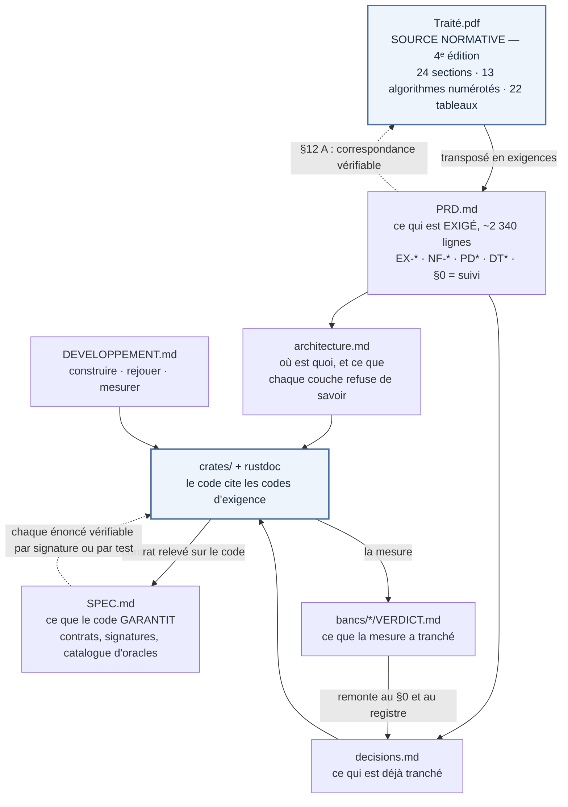

# Journal — `4 - Essais/1 - Traité/`

Ce fichier reçoit, sans un mot changé, les deux pages d'accueil de ce dossier et de ses sous-dossiers non numérotés telles qu'elles étaient écrites au commit `5cdb5bb` du
15 septembre 2026 : la chronique datée — clôtures, réouvertures, redatations, corrections de corrections — et tout ce qui
l'entourait, tables et cartes comprises. Un chiffre y vaut à la date qui l'accompagne ; un présent, au jour où il a été écrit ;
un « ci-dessous » ou un « en tête », à la page d'où il vient.

Seules les cibles de lien ont bougé, et seulement celles qui seraient mortes : elles visent ce qui existe depuis ce dossier.
Le texte d'origine se relit par `git show 5cdb5bb:"4 - Essais/1 - Traité/<page>"`, `<page>` étant le chemin que la table ci-dessous donne. Trois dossiers ont changé de nom le 5 septembre 2026 — `3 - Traité/` est
`4 - Essais/1 - Traité/`, `4 - Veille/` est `3 - Veille/`, `6 - Article/` est `4 - Essais/2 - Article/` — et un chemin écrit
avant cette date garde son ancien nom. L'état courant est à [`README.md`](README.md) et aux pages qu'il nomme ; une passe nouvelle s'ajoute à la fin de ce fichier,
datée, et rien de ce qui précède ne s'y corrige.

| Page reçue | Lignes | Sections |
|---|---|---|
| [`README.md`](#page-readme) | 399 | [Prérequis](#prérequis) · [Exécuter les simulations](#exécuter-les-simulations) · [Le déterminisme, et ce qu'il coûte](#le-déterminisme-et-ce-quil-coûte) · [Carte du dossier](#carte-du-dossier) · [État](#état) |
| [`docs/README.md`](#page-docs) | 166 | [Qui dérive de qui](#qui-dérive-de-qui) · [Les documents](#les-documents) · [Par où entrer](#par-où-entrer) · [La documentation d'interface](#la-documentation-dinterface) · [Ce qui n'existe pas, et pourquoi](#ce-qui-nexiste-pas-et-pourquoi) |

<a id="page-readme"></a>

---

*Page reçue : `README.md`, 399 lignes au commit `5cdb5bb`.*

# stigmergie-lab

Simulateur déterministe d'essaims d'agents logiciels coordonnés par le milieu.

> **Statut au 15 septembre 2026** — le *Traité sur les systèmes multiagents en essaim* (`Traité.pdf`, Vol. V) est **livrable**, un des sept que fixe la décision d'auteur [**D-18**](../../2%20-%20Compendium/PRD/PRD.md#d-18) ([registre](../../README.md#les-sept-livrables)) ; le simulateur est sa transposition, hors compte. Dépôt **rouvert** le même jour par [D-17](../../2%20-%20Compendium/PRD/PRD.md#d-17), re-clôture prévue vers le 8 décembre 2026.

> **Où ce dossier vit.** Depuis le 14 août 2026, `stigmergie-lab` n'est plus un
> dépôt autonome : c'est un dossier du dépôt
> [Agentique](../../README.md), où il **héberge le traité qu'il transpose**.
> ⚠ **Il s'est appelé `3 - Traité/`, à la racine, du 14 août au 5 septembre 2026 ;
> il est [`4 - Essais/1 - Traité/`](./) depuis** — premier dossier des *Essais*, aux
> côtés de [l'article HPC-QPU](../2%20-%20Article/) (commit `daacbec`). *La
> réorganisation est un **renommage pur** : `git` l'enregistre à 100 %, aucun
> fichier n'est touché, et **aucune commande de cette page ne change** — elles se
> lancent toutes de ce dossier, jamais de la racine.* ⚠ *Les mentions de
> `3 - Traité/` qui subsistent ici et ailleurs au dépôt datent un état et ne se
> corrigent pas ; **seuls les renvois ont été repointés le 5 septembre 2026**, le
> `../README.md` ci-dessus devenant `../../README.md`.* Deux
> conséquences, et il vaut mieux les lire avant de chercher un fichier.
> *(a)* ⚠ **`Traité.md` / `.pdf` sont à la racine de ce dossier, PAS sous
> `docs/`** — c'est là que la fusion les a posés, et les renvois qui visaient
> `docs/Traité.pdf` sont corrigés en conséquence, `CLAUDE.md` compris depuis
> le banc du 17 août 2026. *(b)* ☑ **Les 19 figures du traité sont ici depuis le
> 21 août 2026**, à [`figures/`](figures/) : elles étaient restées à la racine du
> dépôt quand le traité y est entré, et le traité les cite en chemin relatif —
> sa chaîne de rendu ne se lançait donc que de là-bas. *Elle se lance d'ici, et
> elle est écrite* : [`build/build-pdf.sh`](build/build-pdf.sh), versionné le
> même jour, la commande n'existant jusque-là nulle part au dépôt. ✎ *Cette page
> a écrit « rien de tout cela ne concerne le code : `cargo` se lance bien d'ici »
> jusqu'au 22 août 2026, et c'était trompeur : le déplacement des figures ne
> touche effectivement pas au code, mais `cargo` ne se lance **pas** d'ici sans
> `CARGO_TARGET_DIR` dérouté hors de OneDrive — c'est le premier des
> [prérequis](#prérequis).*

Le dossier transpose un traité — [`Traité.pdf`](Traité.pdf), **quatrième
édition du 2 septembre 2026 : 8 chapitres, 24 sections, 123 notices** — en logiciel exécutable,
sous une contrainte : **tout chiffre affiché doit être retrouvé par la mesure, ou
l'écart doit être consigné**. Un écart est un défaut du simulateur ou une erreur
du traité, et les deux méritent d'être trouvés (NF-15). **Cinq** écarts ont été
trouvés à ce jour, tous au [registre des décisions](docs/decisions.md), et la
troisième édition du traité confirme le compte en citant ce dépôt. ⚠ **La confirmation porte sur le CARDINAL, non sur la répartition** : la conclusion écrit *« Cinq écarts entre le livre et sa transposition y sont consignés, dont trois contre l'ouvrage »* (l. 1743, p. 129), et le reclassement du 17 août 2026 en compte **deux** contre le traité, deux absorbés par la 3ᵉ édition et un hors traité. *La 3ᵉ édition a été écrite avant le reclassement qu'elle a elle-même rendu possible en absorbant deux mesures* : sa répartition ne peut donc pas être corrigée ici, seulement datée. Précisé le 2 septembre 2026. Leur
classement a été refait le 17 août 2026 contre l'édition livrée : **deux sont
absorbés par la source** — la troisième édition écrit désormais ce que la mesure
avait rendu, sur le budget de retard du mode « moyeu » et sur la dérive de la
somme sans relance —, **deux portent contre le traité** — Φ_c, qui ne sépare pas
la conformité de la coordination, et le contrôleur d'élasticité, qui contredit
le §7.3 de la troisième édition sans être tranché —, et **un** est un constat de
mesure qui ne porte pas sur le traité, `mul_add`.

Ce que le simulateur **ne** mesure **pas** est affiché en permanence dans
l'interface, sous l'onglet « Limites » : la performance réelle, la vivacité,
tout *n*, les fautes corrélées, les événements sous le seuil d'échantillonnage.
Une méthode de validation se définit autant par ce qu'elle ne réfute pas.

## Prérequis

| Outil | Version | Pourquoi |
|---|---|---|
| Rust | stable, cible `x86_64-pc-windows-gnu` | Fixée par `rust-toolchain.toml`. Le linker MSVC n'est pas requis. |
| mingw-w64 | WinLibs POSIX/UCRT | `dlltool.exe`, exigé par `eframe`. **L'interface seule en a besoin.** |
| `CARGO_TARGET_DIR` | tout chemin hors de OneDrive | ⚠ **Exigé par toute commande `cargo` lancée d'ici** — pas seulement par l'interface. |
| `wasm-bindgen-cli` | 0.2.127 | Interface web seulement. `cargo install wasm-bindgen-cli --version 0.2.127` |
| Node | 24 | Bancs de parité seulement. |

⚠ **L'édition de liens échoue dans le `target/` du dépôt, et le message ne
nomme pas sa cause.** `ld.exe` déclare introuvables des `.o` que `rustc` vient
d'écrire et que `ls` montre à leur taille ; le crate nommé dans l'erreur est
celui qui passait là, pas le coupable. **La seule variable qui change le verdict
est la synchronisation OneDrive** — l'accent du chemin, le cache vieilli et la
longueur du chemin ont été éprouvés puis écartés le 21 août 2026, mesure à
l'appui, à [`docs/DEVELOPPEMENT.md`](docs/DEVELOPPEMENT.md). Sortir `target/` de
OneDrive répare tout ; renommer le dossier ne répare rien.

Les lignes à poser avant tout `cargo`, dans chaque terminal. `WINLIBS` désigne
le dossier `mingw64` de **votre** installation de WinLibs — la valeur ci-dessous est
celle d'une installation par `winget`, à remplacer si la vôtre est ailleurs ; la
ligne suivante met `dlltool.exe` dans le `PATH` pour l'interface, la dernière sort
`target/` de OneDrive :

```powershell
$WINLIBS = "$env:LOCALAPPDATA\Microsoft\WinGet\Packages\BrechtSanders.WinLibs.POSIX.UCRT_Microsoft.Winget.Source_8wekyb3d8bbwe\mingw64"
$env:PATH = "$WINLIBS\bin;$env:PATH"
$env:CARGO_TARGET_DIR = "$env:TEMP\cargo-conso"
```

```bash
WINLIBS="$LOCALAPPDATA/Microsoft/WinGet/Packages/BrechtSanders.WinLibs.POSIX.UCRT_Microsoft.Winget.Source_8wekyb3d8bbwe/mingw64"
export PATH="$WINLIBS/bin:$PATH"
export CARGO_TARGET_DIR="$TEMP/cargo-conso"
```

⚠ **`CARGO_TARGET_DIR` ne survit pas à la fermeture du terminal**, et un
`%TEMP%` peut être vidé par Windows — pour un réglage permanent, viser un chemin
stable, `C:\cargo-conso` par exemple. **Les commandes de cette page lisent
l'artefact par cette variable, jamais par `./target/`** : les deux se
contredisent dès qu'elle est posée, et c'est la variable qui a raison.

## Exécuter les simulations

Il y a quatre voies, et elles ne servent pas au même usage.

### 1. L'interface — scénarios A et B, interactifs

```bash
cargo run -p sim-viz --release
```

Trois onglets **numérotés**, lus dans l'ordre : **A** pose le compromis, **B**
montre ce qu'un essaim qui ne se parle pas fait de la trace, **Limites** dit ce
que ni l'un ni l'autre ne prouve. Un quatrième, **Repères**, est hors de la
numérotation parce qu'il n'est pas une étape : c'est le glossaire des trente-deux
termes que ces écrans emploient — φ, γ, τ, α, β, η, ℓ₉₉, partition, oracle — avec
la provenance de chaque définition, filtrable.

Chaque scénario s'ouvre sur quatre choses, dans cet ordre : sa thèse **reformulée
en langue courante**, désignée comme une reformulation et non comme une citation ;
un **schéma figé** du mécanisme, qui ne lit aucune donnée ; puis son **bloc de
trois**, non repliable — la thèse citée avec sa section et sa page, le mécanisme
visible, et ce que le scénario ne démontre pas. Un bandeau permanent, épinglé
hors de la zone défilante, est rempli dès l'ouverture (EX-V07).

Chaque poignée porte, sous elle, ce qu'elle déplace et le chiffre qu'elle
déplace. Le scénario B ajoute six **préréglages nommés** — `nominal`,
`verrouillage (γ = 1)`, `essaim aveugle (T < ℓ₉₉)`, `rejeu`, `incomparabilité
M2`, `trace optimiste` — et chacun produit un mode de défaillance précis, pas une
variation d'ambiance ; sous chaque bouton, ce qu'il change par rapport au
nominal, **calculé** et non décrit. Le scénario A n'en a aucun : c'est une
réserve ouverte, plus bas.

Trois provenances, trois grammaires, qui ne se mélangent dans aucun champ : la
simulation porte l'étiquette « simulé », le traité porte sa section et sa page,
et un réglage de la vue — la graine — porte la sienne. Une légende de lecture les
montre côte à côte avant le premier chiffre. La reformulation en langue courante
n'est aucune des trois, et ne porte donc **aucune** teinte ni **aucun** chiffre :
c'est de la prose du produit, et elle le dit.

### 2. L'interface web — même code, même chiffres

```bash
cargo build -p sim-viz --release --lib --target wasm32-unknown-unknown && wasm-bindgen --target web --no-typescript --out-dir web "$CARGO_TARGET_DIR/wasm32-unknown-unknown/release/sim_viz.wasm"
```

Windows PowerShell 5.1 n'a pas `&&` — l'équivalent, qui n'enchaîne que si la
construction réussit :

```powershell
cargo build -p sim-viz --release --lib --target wasm32-unknown-unknown; if ($?) { wasm-bindgen --target web --no-typescript --out-dir web "$env:CARGO_TARGET_DIR\wasm32-unknown-unknown\release\sim_viz.wasm" }
```

```bash
python -m http.server 8777 --directory web
```

Puis <http://127.0.0.1:8777>. Le `.wasm` doit être servi en `application/wasm` :
ouvrir `index.html` par `file://` ne fonctionne pas, les modules ES l'interdisent.
WebGL 2 est requis — `eframe` n'a pas de repli logiciel.

Le déploiement est un dépôt de fichiers statiques : `index.html`, `sim_viz.js`,
`sim_viz_bg.wasm` côte à côte, aucune dépendance serveur (DT4). Module compressé :
**1 447 728 octets compressés** — *1 447 704 le 2 septembre ; les phases 2 à 4 de
[`audit.md`](audit.md) laissent donc **+24 octets** compressés en tout* — pour une cible de
8 Mo (NF-08), sur **3 670 027 octets bruts**. La cible reste tenue d'un facteur
cinq et demi.

Ces deux chiffres sortent d'**une** construction, celle du **4 septembre 2026**,
et se refont par ces deux lignes et ces deux-là seulement :

```bash
cargo build -p sim-viz --release --lib --target wasm32-unknown-unknown \
  && wasm-bindgen --target web --no-typescript --out-dir web \
     "$CARGO_TARGET_DIR/wasm32-unknown-unknown/release/sim_viz.wasm"
printf "brut=%s gz9=%s\n" "$(stat -c%s web/sim_viz_bg.wasm)" \
                          "$(gzip -9 -c web/sim_viz_bg.wasm | wc -c)"
```

☑ **Re-mesuré le 4 septembre 2026, après la phase 4 du plan d'exécution de
[`audit.md`](audit.md)** : **3 670 027** octets bruts et **1 447 728** compressés,
soit **+690 et +24** sur la construction du 2 septembre. *La phase 3 était montée
à 1 448 336 ; la phase 4 en a rendu 608, les refactorisations du registre
supprimant plus de code qu'elles n'en ajoutent — deux constantes de couplage par
chaîne, leurs deux tests de garde, une structure de clé de cache et six
transcriptions de défauts.* ⚠ **Le module embarque les quatre crates, pas seulement
`sim-viz`** : les lignes de panique de `stigmergie.rs` et de `journal.rs` y sont,
donc toute édition d'une des quatre le périme — c'est plus large que ce que la
règle de péremption ci-dessous laisse entendre, et `check-empaquetage.py` le voit
puisqu'il compare des octets. ☑ `python Python/check-empaquetage.py` : **à jour,
identique à l'octet**. ☑ Le banc `bancs/parite-wasm` rejoué sur cette
construction : **six cas, six empreintes identiques**, EX-V12 tenue, et ce sont
les **mêmes six valeurs** qu'avant les trois phases.

⚠  ☑ **Re-mesuré DEUX FOIS le 2 septembre 2026.** *Au premier passage, avant toute édition du code : **3 669 337** octets bruts, **1 447 624** compressés, **inchangés**, le module refait étant **identique à l'octet** à celui du 17 août — la construction WASM est donc reproductible, ce que le dossier n'avait jamais mesuré.* ☑ **Au second, après la quatrième édition du traité** : **3 669 337** bruts et **1 447 704** compressés, soit **+80 octets** — *les marqueurs d'édition, qui vivent dans les chaînes que l'interface affiche, sont passés de « 3ᵉ éd. » à « 4ᵉ éd. ».* ⚠ **Et c'est le contrôle `check-empaquetage.py` qui l'a exigé** : il a refusé le module de la veille, sur comparaison d'octets et non de dates — *la construction WASM est donc reproductible, ce que le dossier n'avait jamais mesuré*, et l'unique commit qui a touché `sim-viz` depuis, `7a1b7f2`, ne portait que **deux lignes de commentaire de documentation**. **La règle de péremption reste juste ; elle n'était pas encore enfreinte.** ☑ Le banc `bancs/parite-wasm` est rejoué sur cette construction : **six cas, six empreintes identiques**, EX-V12 tenue.

⚠ **Ce chiffre suit la construction, pas la révision, et il n'est donc valide
que jusqu'à la prochaine édition de `crates/sim-viz/`.** `web/sim_viz.js` et
`web/sim_viz_bg.wasm` sont produits par `wasm-bindgen` et exclus du suivi de
version (`.gitignore`) : ils ne se remesurent que si l'on relance les deux
lignes ci-dessus. Le banc du 17 août a trouvé l'empaquetage vieux de deux
révisions de l'interface — 3 613 854 octets bruts, un module qui ne contenait
aucun des changements du 14 août —, puis son propre correctif périmé d'une
révision en douze minutes, la crate ayant été éditée après la construction.
**Ce qui se cite d'ici est la ligne de commande, jamais le nombre.**

Que les deux cibles donnent les **mêmes** chiffres n'est pas une intention, c'est
une mesure : le banc `bancs/parite-wasm` compare les empreintes de six cas du
scénario B, bits des flottants compris.

### 3. La campagne sans interface — scénario C

```bash
cargo run -p sim-agents --bin campagne --release -- --sortie rapports/
```

Écrit `points.csv` et `rapport.json`. La campagne injecte σ et κ dans un milieu
simulé, puis les **retrouve** par moindres carrés sur la loi d'échelle
universelle, avec intervalles de confiance par rééchantillonnage. C'est une
validation croisée : si σ̂ ne retombe pas sur σ, la mesure est fausse.

```bash
cargo run -p sim-agents --bin campagne --release -- --aide
```

Les paramètres — `--sigma`, `--kappa`, `--n-max`, `--repetitions`,
`--reechantillonnages` — permettent de refaire la validation croisée sur d'autres
jeux. Si le système normal est dégénéré sur la plage demandée, la campagne le
**publie** et sort en erreur, plutôt que de rendre un ajustement sans provenance.

### 4. Tous les scénarios — par leurs critères d'acceptation

Chaque critère d'acceptation est un test. Mais un scénario dont les mécanismes
vivent dans plusieurs modules demande plusieurs filtres : le tableau ci-dessous
donne ceux du ou des modules porteurs, **pas toujours la totalité des
critères**. Ceux des scénarios D et L passent en outre par les tests
d'intégration de sortie de phase.

```bash
cargo test -p sim-agents --release cascade::
```

Le filtre à donner à la commande ci-dessus, scénario par scénario :

| Sc. | Thèse | Filtre |
|---|---|---|
| A | Les deux régimes | `scenario::` — ou l'interface |
| B | Le fourragement stigmergique | `--test scenario_b` — ou l'interface |
| C | Le débit a un maximum, et il se mesure | `usl::` — ou le binaire `campagne` |
| D | La chute de R1 : *m* − 1, jamais *k* − 1 | `scenario_d::` |
| E | La fenêtre de divergence | `adhesion::` |
| F | Allocation comparée, six mécanismes | `allocation::` |
| G | Agrégat fenêtré et sous-compte silencieux | `agregat_fenetre::` |
| H | La valeur fausse unanime | `agregation::` |
| I | Propager, converger, s'accorder | `-- propagation:: accord:: consensus_lineaire::` |
| J | La cascade de l'agent saturé | `-- cascade:: soupcon:: elasticite::` |
| K | La fenêtre de violation | `gouvernance::` |
| L | Le taux de base | `taux_de_base::` |
| M | Le second axe : conformité, collusion, tromperie | `--test sortie_phase_6` |

Deux filtres à la fois passent après `--`, jamais avant : `cargo test` n'accepte
qu'un seul argument positionnel.

Les noms de tests disent ce qu'ils établissent :
`critere_1b_la_cascade_est_complete_en_trois_generations_sans_aucune_panne`,
`critere_5_en_asynchrone_toutes_les_fenetres_sont_non_bornees`. Pour les lister
sans les exécuter :

```bash
cargo test -p sim-agents --release -- --list
```

La suite complète — **470 tests, 0 échec**, exécutés le 4 septembre 2026.
Le compte est une mesure : il se refait par la ligne ci-dessous, il ne se cite pas.

```bash
cargo test --workspace --release
```

⚠ **Il a bougé cinq fois dans la journée** — **428 à 08 h 10, 447 à 08 h 32,
465 à 09 h 49, 466 à 10 h 26, 467 à 11 h 14** —, les crates ayant été éditées
entre chaque par le banc. `grep -r '#\[test\]' --include=*.rs crates/` rend
**467** lui aussi à 11 h 14, mais *un attribut compté n'est pas un test exécuté* :
les deux valeurs coïncident ici, et rien ne garantit qu'elles coïncideront demain.

### Bancs de mesure

```bash
cargo run -p sim-agents --example banc_nf05 --release
```

Débit de simulation en secondes simulées par seconde-cœur. **La cible NF-05
n'est pas atteinte** et l'écart est structurel : chaque agent lit ce que toute la
population écrit, donc Θ(*n*²). Le calcul est dans
[`bancs/nf05-debit/VERDICT.md`](bancs/nf05-debit/VERDICT.md).

```bash
cargo run -p sim-agents --example diagnostic_b --release
```

Effort par tranche de temps du scénario B. `diagnostic_elasticite` fait de même
pour le contrôleur de population.

Les bancs de parité natif/WASM sont dans [DEVELOPPEMENT.md](docs/DEVELOPPEMENT.md).

## Le déterminisme, et ce qu'il coûte

Une exécution se rejoue **bit à bit** à partir de sa graine et de sa
configuration. Un export porte la version du binaire et le hachage de la
configuration, et un rejeu sur une version différente est **refusé**, pas tenté.

Ce n'est pas gratuit. Un seul fil, aucune horloge système dans le cœur, un unique
générateur semé, aucune itération sur table de hachage dans un chemin
d'ordonnancement — `clippy.toml` interdit `HashMap` et `HashSet` pour cette
raison. Et les transcendantes passent par `libm` : sept méthodes de `f64`
(`ln`, `exp`, `powf`, `sin`, `cos`, `atan2`, `mul_add`) sont interdites. Six
donnent des **bits différents** en natif et en WASM, ce que le banc DT1 a mesuré
plutôt que supposé. La septième, `mul_add`, y est mesurée *identique* — elle est
interdite parce que son verdict **a changé entre deux passages du banc**, ce qui
la rend dépendante de la machine de construction.

## Carte du dossier

```
sim-core  ◄──── sim-milieu  ◄──── sim-agents  ◄──── sim-viz
moteur DES      journal M1–M4     mécanismes         interface egui,
horloge logique réplication ISR   oracles            native et web
RNG semé        rétention         scénarios (données)
modèle de faute plan de contrôle        ▲
détecteur                              └── binaire campagne (sans dépendance graphique)
```

**Toute la documentation est dans [`docs/`](docs/)**, dont
[`docs/README.md`](docs/README.md) est l'index :

| Document | Rôle |
|---|---|
| [`docs/PRD.md`](docs/PRD.md) | La spécification — ce qui est **exigé**. Le §0 suit l'avancement, les verdicts de banc et les écarts au traité. |
| [`docs/SPEC.md`](docs/SPEC.md) | Le contrat — ce que le code **garantit** : signatures, catalogue d'oracles, nomenclature, et ce que le contrat ne couvre pas. |
| [`docs/architecture.md`](docs/architecture.md) | La carte du code : les quatre couches, et ce que chacune refuse de savoir. |
| [`docs/decisions.md`](docs/decisions.md) | Le registre des décisions — ce qui a été tranché, sur quoi, et ce qu'il faudrait pour rouvrir. |
| [`docs/DEVELOPPEMENT.md`](docs/DEVELOPPEMENT.md) | Chaîne d'outils et commandes de banc. |
| [`CLAUDE.md`](CLAUDE.md) | Contraintes et conventions, pour un agent qui reprend le code. |
| `bancs/*/VERDICT.md` | Les décisions tranchées par la mesure plutôt que par le raisonnement. |
| [`build/build-pdf.sh`](build/build-pdf.sh) | La composition de `Traité.pdf`, versionnée le 21 août 2026 — elle n'existait nulle part au dépôt. Se lance **de ce dossier**, les 19 planches de [`figures/`](figures/) y étant depuis le même jour. |

La documentation d'interface est **dans le code**, en rustdoc — les quatre
crates déclarent `#![deny(missing_docs)]` :

```bash
cargo doc --workspace --no-deps --open
```

## État

Les **six** phases du PRD sont livrées : **470 tests, 0 échec**, suite rejouée le
4 septembre 2026 ; clippy à 0 et rustdoc à 0 le même jour ; **treize**
scénarios **exécutables par leurs tests**, vingt-neuf bancs pour les cinq
premières phases. La répartition est 427 unitaires — 257 `sim-agents`,
96 `sim-core`, 69 `sim-milieu`, 5 `sim-viz` — et 43 d'intégration, qui sont les
critères de sortie de phase. **Le compte a bougé cinq fois le même jour** —
428 à 08 h 10, 447 à 08 h 32, 465 à 09 h 49, 466 à 10 h 26, 467 à 11 h 14 le
17 août 2026 —, plusieurs agents d'audit écrivant en parallèle : ce qui se cite
est la ligne de commande, jamais le nombre. Les phases 1 à 4 de
[`audit.md`](audit.md) l'ont porté à 470 le 4 septembre 2026, en ajoutant six tests et en
en retirant trois avec les couplages par chaîne qu'ils gardaient.

Les réserves ouvertes sont au §0 du PRD et au [registre des
décisions](docs/decisions.md). Les principales :

- **NF-05 n'est pas atteinte** — de l'ordre de 20 à 25 s simulées par
  seconde-cœur à n = 1 000 contre une cible de 10³, remesuré après la phase 2 de
  [`audit.md`](audit.md) qui a doublé le débit. L'écart est structurel, en
  Θ(*n*²), et un facteur 1,9 ne le comble pas.
- **NF-07 n'est pas mesurée** — 30 images/s en WASM demande un navigateur en
  avant-plan avec une horloge d'images.
- **L'interface s'arrête aux scénarios A et B.** Seize exigences `EX-V*` sur
  vingt-trois ont leur producteur implanté et testé, et **aucun point d'appel** —
  dont EX-V02 (mode « enquête »), EX-V09 (partage par URL) et EX-V23 (file
  d'arbitrage). Les sept autres en ont un, mais celui d'EX-V10 est le binaire
  `campagne` et non la vue. L'onglet « Limites » nomme les seize. Le parcours
  « le fil » (O6) et l'export n'existent pas.
- **Cinq mécanismes du milieu ne sont exécutés par aucun scénario** —
  rétention, compactage, groupe de consommation, plan de contrôle, et le
  surcoût de format, que `ecrire` ne consulte pas. Ils sont
  implantés et testés unitairement ; ils n'influencent aucun résultat affiché.
- **La vue montre la conséquence du mécanisme, jamais le mécanisme.** `Mesures`
  ne porte aucune série temporelle de φ : la trace n'est rendue qu'en fin
  d'exécution, donc « lire, déposer, s'évaporer » n'est traçable nulle part. Ce
  qui se manipule dans le temps est la part d'effort par tranche.
- **Trois des sept réglages du scénario A ne déplacent aucun compte affiché** —
  `p`, le taux d'omission et la graine. `Comparaison` ne porte ni les pertes de
  messages ni les propriétés du détecteur. L'écran les groupe à part, sous ce
  titre, avec le motif de chacun ; la graine y est montrée figée à 1.
- **Le contrôleur d'élasticité ne converge pas** aux valeurs documentées.
- **Il n'y a pas d'intégration continue** : NF-13 et NF-16 nomment un mécanisme
  d'application que le dépôt ne contient pas. ✎ *Au 15 septembre 2026, un flux
  `.github/workflows/appareil.yml` est écrit pour rejouer `cargo test`,
  `clippy` et `fmt` sous Linux et Windows ; il n'a jamais tourné (`APPAREIL.md` de la racine, § 2).*

La liste vivante est dans le code — `sim_agents::hors_perimetre()`,
`sim_milieu::hors_perimetre()`, `ModeleFaute::hors_modele()` — et s'affiche dans
l'onglet « Limites » de l'interface.

<a id="page-docs"></a>

---

*Page reçue : `docs/README.md`, 166 lignes au commit `5cdb5bb`.*

# Documentation de stigmergie-lab

Tout ce qui documente le projet vit ici, à deux exceptions près restées à la
racine du dossier parce qu'un outil les y attend — [`README.md`](README.md),
page d'accueil, et [`CLAUDE.md`](CLAUDE.md), chargé par Claude Code — et
à une troisième : les `VERDICT.md`, gardés sous [`bancs/`](bancs/), à côté de
la mesure qui les produit.

⚠ **Et à une quatrième, qui n'est pas un choix : la source normative elle-même.**
Depuis l'entrée de ce dossier dans le dépôt [Agentique](../../README.md), le
14 août 2026, `Traité.md` et `Traité.pdf` sont **à la racine du dossier**, pas
ici. *Ce document et le `README.md` d'accueil les visaient sous `docs/`, où ils
vivaient du temps du dépôt autonome ; les trois renvois sont corrigés, celui de
`CLAUDE.md` depuis le banc du 17 août 2026.* La règle « toute la documentation
vit dans `docs/` »
survit à l'exception, mais elle ne couvre plus le document dont tout le reste
dérive.

## Qui dérive de qui

Le tableau ci-dessous dit ce que chaque document contient ; ce graphe dit **d'où
il tire son autorité**. Deux boîtes seulement sont des sources — le traité, pour
ce qui est exigé, et le code, pour ce qui est garanti — et chacune a exactement
une flèche qui remonte vers elle.



Trois règles se lisent sur ce graphe et nulle part ailleurs. Un chiffre qui
n'aurait pas de chemin remontant jusqu'au `Traité.pdf` est une **grandeur sans
provenance** (F2). Un `VERDICT.md` qui ne redescendrait pas jusqu'à
`decisions.md` serait une **mesure sans conséquence**. Et un énoncé de `SPEC.md`
qui ne se vérifierait pas sur le code serait pire que faux : il ferait passer une
exigence pour une garantie, ce qui est exactement la confusion que la séparation
des deux documents existe pour empêcher.

**Pourquoi le PRD et SPEC.md sont deux documents.** Le PRD dit *le milieu doit
garantir M3*, avec le traité pour autorité. `SPEC.md` dit *`Milieu::lire` ne rend
que des enregistrements durables, et `ecrire` rend un délai que l'appelant
planifie*, avec le code pour autorité. Là où les deux divergent — et ils
divergent, les listes `hors_perimetre()` en font l'inventaire —, le PRD garde
l'exigence et `SPEC.md` dit ce que le code fait. Un document unique deviendrait
faux d'un côté à chaque changement de l'autre, sans qu'on sache lequel.

## Les documents

| Document | Ce qu'il contient | Quand le lire |
|---|---|---|
| [`Traité.pdf`](Traité.pdf) *(⚠ à la racine du dossier, pas ici)* | **La source normative** — **quatrième** édition du **2 septembre 2026**, 143 pages : 8 chapitres, 24 sections, 123 notices, **treize blocs d'algorithme légendés** — trois aux chapitres 1, 2, 3 et 4, plus l'algorithme 8.1 ; ⚠ *les trois du chapitre 2 n'avaient AUCUNE légende avant la quatrième édition, et le corps les citait pourtant comme des algorithmes*, et **22 tableaux numérotés dans la source**. Les figures se comptent de deux façons — 18 légendes numérotées pour 16 numéros distincts, la figure 2.1 se déclinant en a/b/c —, donc ce document n'en avance aucun compte. ⚠ **La pagination est celle de la troisième édition**, et c'est celle que F2 et DT5 fixent depuis le 17 août 2026. **La migration des renvois du PRD est faite** : les 75 renvois ont été repris un par un contre ce PDF — 23 justes, 41 corrigés, 10 rendus à leur édition d'origine, **1 introuvable et déclaré tel plutôt que remplacé par une page fabriquée** —, et `grep -oE 'p\. [0-9]+' docs/PRD.md` ne rend plus aucun renvoi sans mention d'édition. ⚠ **La mesure a montré qu'aucun décalage constant n'existe entre les deux éditions** : l'écart va de +1 à +35, si bien qu'une migration par arithmétique aurait produit 75 provenances fausses au lieu d'en corriger 41. Les renvois du **code** ont été réétalonnés par la même campagne, et 39 des 112 portent leur édition en propre, les autres l'héritant de leur paragraphe ; le balayage n'y a pas été refait renvoi par renvoi comme au PRD. Une page lue sans son édition est une provenance fausse, non imprécise (F2, DT5, et `CLAUDE.md`) ; le §0.2 du PRD donne le protocole de vérification. Les algorithmes, les hypothèses et les chiffres viennent de là, et de nulle part ailleurs. | Pour comprendre *pourquoi* un mécanisme est écrit ainsi |
| [`PRD.md`](docs/PRD.md) | **Ce qui est exigé**, environ 2 340 lignes. Chaque exigence porte un code que le code source cite. Le §0 suit l'avancement, son §0.0 dit ce que la **deuxième** édition a changé — c'est de l'histoire, avec la pagination de la deuxième —, son §0.1 l'écart de la phase 6, et son §0.2 le banc de vérification du 17 août 2026 ; le §12 A donne la correspondance traité → implantation. | Pour retrouver la lettre d'une exigence, ou l'état du projet |
| [`SPEC.md`](docs/SPEC.md) | **Ce que le code garantit** : contrat de déterminisme, contrat du moteur, catalogue des quinze oracles nommés, contrat du milieu, nomenclature des grandeurs qui ne se mêlent jamais, et ce que le contrat ne couvre pas. Chaque énoncé est vérifiable par une signature ou un test. | Avant d'écrire du code, et avant de supposer qu'une exigence est tenue |
| [`architecture.md`](docs/architecture.md) | La vue d'ensemble des quatre crates, ce que chaque couche **refuse** de savoir, la carte des modules, et le modèle de domaine. | Pour trouver où va un changement |
| [`decisions.md`](docs/decisions.md) | Le registre : les quatorze DT du PRD avec leur état, les verdicts tranchés par la mesure, les décisions de réalisation, les décisions **ouvertes** par le banc du 17 août 2026, et ce que les deuxième et troisième éditions rouvrent — ou ne rouvrent pas. | Avant de refaire un choix déjà tranché |
| [`DEVELOPPEMENT.md`](docs/DEVELOPPEMENT.md) | Chaîne d'outils, versions employées, ligne de commande exacte de chaque banc, et les **cinq** commandes à lancer avant de committer — *trois de `cargo`, et deux de `Python/` depuis le 2 septembre 2026 : le document et son rendu, l'empaquetage et sa fraîcheur*. | Pour construire ou rejouer |

Les verdicts de banc restent avec leur mesure :
[DT1 — arithmétique](bancs/dt1-flottant/VERDICT.md),
[NF-05 — débit](bancs/nf05-debit/VERDICT.md) et
[EX-V12 — parité natif/WASM](bancs/parite-wasm/VERDICT.md).

## Par où entrer

| Ce que vous cherchez | Où |
|---|---|
| Ce que le projet est, en dix lignes | [`README.md`](README.md) à la racine |
| L'état d'avancement, les réserves ouvertes | §0 du [PRD](docs/PRD.md) |
| Ce que la deuxième édition du traité a changé | §0.0 du [PRD](docs/PRD.md) |
| Ce que la troisième édition change, et l'état mesuré du dépôt | §0.2 du [PRD](docs/PRD.md) |
| Pourquoi une exigence existe | Son code dans le [PRD](docs/PRD.md), puis §12 A pour la section du traité |
| Ce qui est réellement garanti par le code | [`SPEC.md`](docs/SPEC.md) |
| Où poser un mécanisme nouveau | [`architecture.md`](docs/architecture.md), dernière section |
| Si un choix a déjà été tranché | [`decisions.md`](docs/decisions.md) |
| La commande exacte | [`DEVELOPPEMENT.md`](docs/DEVELOPPEMENT.md) |
| Ce que le produit ne mesure **pas** | §8.3 du [PRD](docs/PRD.md), et l'onglet « Limites » de l'interface |

## La documentation d'interface

Elle est **dans le code**, en rustdoc, et se lit avec :

```bash
cargo doc --workspace --no-deps --open
```

Les quatre crates déclarent `#![deny(missing_docs)]` : un item public sans
documentation ne compile pas. Elles déclarent aussi
`#![deny(rustdoc::broken_intra_doc_links)]`, ce qui est le seul contrôle
mécanique que le dépôt possède sur sa propre documentation — un renvoi cassé par
un renommage ne compile pas. La raison de la première est dans
[`sim-core/src/lib.rs`](crates/sim-core/src/lib.rs) : une interface à demi
documentée ne dit pas laquelle des deux moitiés manque.

Les codes cités dans le code (`EX-C01`, `PD1`, `NF-02`, `DT9`…) se cherchent
tels quels dans [`PRD.md`](docs/PRD.md).

## Ce qui n'existe pas, et pourquoi

Trois documents attendus dans un dépôt de cette taille sont **délibérément
absents**. Les nommer coûte moins cher que de les voir réapparaître comme
oubli :

- **`CHANGELOG.md`** — le projet n'a pas de versions publiées, et le §0 du PRD
  tient déjà l'historique par phase, avec ses critères de sortie et ses
  réserves. Un journal des versions ferait double emploi avec un tableau plus
  précis que lui.
- **`CONTRIBUTING.md`** — les règles que le dépôt fait respecter sont
  mécaniques (`clippy.toml`, `deny(missing_docs)`, les tests de sortie de
  phase) et déjà écrites dans [`CLAUDE.md`](CLAUDE.md),
  [`DEVELOPPEMENT.md`](docs/DEVELOPPEMENT.md) et [`SPEC.md`](docs/SPEC.md). Un quatrième
  document ne ferait que les répéter avec un décalage.
- **`LICENCE`** — pas de fichier propre au dossier, et il n'en faut pas : le
  [`LICENSE`](../../LICENSE) de la racine du dépôt, posé le 21 août 2026,
  place le simulateur sous CC BY 4.0 en le nommant. Les manifestes portent
  `publish = false` : ces crates ne vont pas sur crates.io.

Deux redites sont également refusées. Un **glossaire** existe au §12 C du PRD, et
son pendant exécutable est `sim_agents::glossaire` — le recopier ici créerait une
troisième définition du même terme. Et un **document de conception de la phase
6** n'existe pas, la phase étant livrée : ce que le chapitre 8 exige est au §6 et
au §9 du PRD, où chaque mécanisme est rangé est à la dernière section
d'[`architecture.md`](docs/architecture.md), et ce que son arrivée a changé au contrat
est au §13 de [`SPEC.md`](docs/SPEC.md).

**Ce qui a existé et n'existe plus** : le **journal de la revue adversariale** qui
avait produit la version 2.0 du PRD, retiré du dépôt. Ce qu'il
portait de durable est dans le PRD lui-même — les réserves du §0, les tensions du
§2.5 et les risques du §10 sont ce que cette revue a produit.

⚠ **Un second journal a vécu à la racine du dossier du 17 au 22 août 2026, et il
n'y est plus non plus** : celui de la boucle bâtisseur/critique de la **vérification complète
du code** — cinq morceaux disjoints par crate, barre tenue sur
[`bancs/dt1-flottant/VERDICT.md`](bancs/dt1-flottant/VERDICT.md), rapports par
morceau dans un dossier de banc, sorti du dépôt le 25 août 2026. *Il ne couvrait ni la revue du PRD, ni les
boucles de la veille, de la revue de littérature ou de l'état de l'art, dont les
journaux ont vécu ailleurs dans le dépôt et n'y sont plus.* ⚠ **Aucun des deux
n'était un document de gouvernance** : rien n'y était exigé ni garanti, et aucun
énoncé de ce dossier ne s'y adosse. **Les deux n'ont jamais coexisté**, et aucun
n'est plus au dépôt : le premier en est sorti par le commit `4dfc0dc`, le second
le 22 août 2026. Ce que la campagne a produit de **durable**
n'est de toute façon pas là : c'est
le §0.2 du [PRD](docs/PRD.md) et le [registre](docs/decisions.md) — *les dix rapports,
cinq de morceau et cinq de critique, et la consolidation qui leur servait de
verdict de banc, sont sortis du dépôt le 25 août 2026*.
