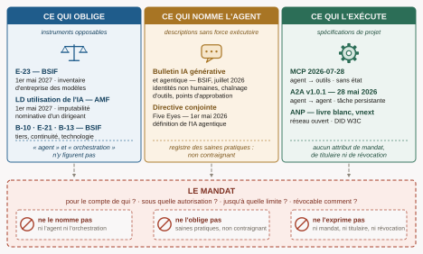
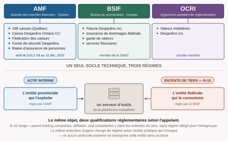
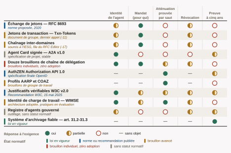
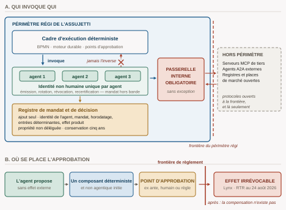
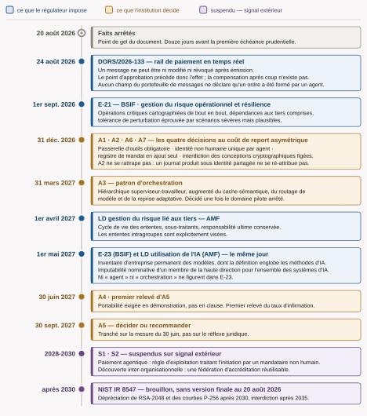

Cette planche est un abrégé. Elle reprend les cinq figures de l'état de l'art *Interopérabilité et Orchestration Agentiques — état de l'art en services financiers* (20 août 2026, 185 pages) et les explique pour qui n'a pas lu le document. Chaque section renvoie à l'endroit où l'argument est établi sur ses sources ; **rien ici n'est démontré, tout y est résumé**. Les faits sont gelés au 20 août 2026 et le périmètre est celui d'une coopérative financière canadienne régie — caisses, fédération, filiales d'assurance et de courtage.

# 1. Ce qui oblige ne nomme pas l'agent

Trois familles de textes se partagent le sujet et aucune ne le couvre.

**Ce qui oblige** — E-23 du BSIF, la ligne directrice de l'AMF sur l'utilisation de l'IA, B-10, E-21, B-13 — porte sur les *modèles* et les *systèmes d'IA*. Le mot « agent » n'y figure pas ; le mot « orchestration » non plus. **Ce qui nomme l'agent** — le bulletin du BSIF de juillet 2026, la directive conjointe des *Five Eyes* — décrit précisément l'architecture attendue : identités non humaines uniques, chaînage d'outils, points d'approbation. Ces textes sont publiés au registre des saines pratiques : ils n'obligent à rien. **Ce qui exécute l'agent** — MCP, A2A, ANP — a résolu l'appel : quel agent invoque quel outil, avec quels arguments, sous quelle version. Aucun n'exprime le mandat.

Le mandat, c'est-à-dire les quatre questions que le droit pose — pour le compte de qui, sous quelle autorisation, jusqu'à quelle limite, révocable comment —, n'a donc **aucun porteur normatif identifiable**.

La conséquence est inverse de l'intuition. Un architecte qui attend que ces trois plans convergent attendra au-delà de l'horizon utile. Et c'est précisément parce que l'instrument contraignant ignore l'agent que le bulletin non contraignant devient le meilleur prédicteur de ce qu'un examen de surveillance demandera : il est écrit par le même superviseur, il nomme le patron d'exécution, et il est daté.

# 2. Le périmètre régi n'est pas une entreprise

Une coopérative financière n'est pas une société avec des unités d'affaires : c'est un réseau de personnes morales solidaires, et trois surveillants s'y partagent un seul socle technique. L'AMF pour les caisses, la Fédération et des filiales d'assurance de personnes ; le BSIF pour l'assurance de dommages fédérale, la garde de valeurs et les services fiduciaires ; l'OCRI pour le courtage. **La délégation franchit une frontière réglementaire avant de franchir un réseau.**

De là l'arbitrage qui structure tout le reste. B-10 range explicitement les sociétés affiliées et les filiales dans les ententes de tiers, sans régime allégé pour l'intragroupe, et l'institution demeure imputable. Une plateforme agentique mutualisée est donc **un actif interne** pour l'entité provinciale qui l'exploite et **une entente de tiers** pour l'entité fédérale qui la consomme : le même serveur d'outils est deux objets réglementaires selon l'appelant, et il doit porter deux cotations si le groupe opère des deux côtés de la frontière.

Or aucun des protocoles examinés ne transporte l'entité juridique appelante dans sa trace. La qualification qui décide du régime n'est écrite nulle part dans ce que la machine produit.

# 3. Ce que la délégation doit prouver, et ce qu'aucun mécanisme ne donne

Une institution assujettie a besoin de cinq choses d'une chaîne de délégation : savoir **qui** est l'agent, **pour qui** il agit, que chaque **saut** a été autorisé et la vérification prouvée, **comment révoquer**, et pouvoir en **faire la preuve cinq ans plus tard**.

Onze mécanismes ont été relevés, du RFC à la loi. **Aucun ne remplit trois des cinq colonnes.** Les jetons de transaction répondent au mandat mais s'arrêtent au domaine de confiance ; l'*Agent Card* d'A2A identifie sans mandater et n'offre aucune révocation ; les douze brouillons de chaîne de délégation répondent par conception — et n'ont, au 20 août 2026, aucune adoption et trois modèles de révocation irréconciliables.

La seule case pleine de la colonne de droite n'est pas un mécanisme technique : c'est le système d'archivage fiable des articles 31.2 et 31.3 de la *Loi sur la preuve au Canada*, un régime de preuve, en vigueur, dont le statut ne bougera pas. Le droit canadien demande la fiabilité du **système d'enregistrement**, non la signature de chaque saut. **C'est là que l'investissement porte**, et c'est le seul élément de ce tableau sur lequel on peut s'engager sans pari.

# 4. L'architecture qui survit à l'examen

Ce n'est ni celle qui adopte le plus de protocoles, ni celle qui en adopte le moins. C'est celle qui rend **démontrable devant un tiers** la chaîne allant du mandat du client à l'effet produit, à un moment où aucune couche protocolaire ne porte cette chaîne. Cinq traits :

**Un cadre d'exécution déterministe invoque les agents, jamais l'inverse.** Le non-déterminisme du modèle est toléré partout où il est enfermé, et nulle part ailleurs. **Les protocoles ouverts restent à la frontière**, derrière une passerelle interne obligatoire — sans exception, y compris pour les serveurs publiés par le fournisseur de modèles, parce que c'est par l'exception accordée au fournisseur principal que passera le volume. **Une identité non humaine unique par agent** : c'est le seul arbitrage qui ne se rattrape pas rétroactivement, un journal produit sous identité partagée ne pouvant être ré-attribué après coup. **Un registre de mandat et de décision en ajout seul, dont la propriété n'est pas déléguée au fournisseur** — celui-là même dont on aura besoin pour se défendre, au moment précis où l'on voudra peut-être en changer.

**Et le point d'approbation avant l'effet, non après.** Depuis l'entrée en vigueur du règlement administratif du rail de paiement en temps réel, le 24 août 2026, un message ne peut être ni modifié ni révoqué après émission. La compensation après coup n'existe pas.

Cette forme n'est pas une invention d'auteur : c'est ce que le bulletin du BSIF décrit sans le nommer ainsi, ce que B-10 exige pour les tiers, ce qu'E-21 impose au titre des opérations critiques et ce qu'E-23 présuppose en exigeant un inventaire.

# 5. La fenêtre, et l'ordre où elle se referme

Quatre échéances bornent la période, dans un ordre inverse de celui qu'on suppose, **et la plus proche ne vient pas d'un régulateur prudentiel** : c'est le règlement administratif du rail de paiement, le 24 août 2026, quatre jours après le gel de ce document. Vient ensuite E-21, au 1er septembre 2026 — onze jours après le gel — avec la cartographie de bout en bout des opérations critiques. Puis la ligne directrice de l'AMF sur les tiers, au 1er avril 2027. Puis E-23 et la ligne directrice de l'AMF sur l'IA, **qui entrent en vigueur le même jour, le 1er mai 2027**.

**Aucune de ces quatre échéances n'exige quoi que ce soit au sujet des agents ; toutes les quatre s'appliqueront à eux.** La continuité oblige donc avant l'inventaire, et l'agent n'entre pas dans un cadre à construire : il entre dans un cadre en vigueur.

Face à ces dates, sept arbitrages datés. Quatre d'ici le 31 décembre 2026 — la passerelle d'outils, l'identité d'agent, le journal probatoire, l'agilité cryptographique —, parce que leur coût de report est asymétrique : ils conditionnent la valeur probatoire de tout ce qui s'exécutera ensuite. Trois en 2027, chacun attendant un intrant que l'institution produit elle-même, non un signal extérieur. Et cinq arbitrages suspendus, dont chacun nomme le signal qui le rouvrira — car sans signal nommé, « on verra » n'est pas une position d'architecture, c'est une dette.

# Où lire la suite

Chaque affirmation de cette planche est établie, datée et sourcée dans *Interopérabilité et Orchestration Agentiques — état de l'art en services financiers*, 312 références, faits arrêtés au 20 août 2026. Deux limites y sont déclarées d'entrée et valent ici : le domaine du régulateur québécois refuse la consultation automatisée, si bien que le texte de ses lignes directrices n'a cédé qu'à un service tiers d'extraction non reproductible ; et **aucune source consultée n'établit de lien documenté entre un protocole d'agents et une exigence sectorielle canadienne** — le lien reste une inférence d'architecture, signalée comme telle chaque fois qu'elle est posée.

Les cinq planches sont gravées par `figures/dessine.py` à 468 points, la largeur que le gabarit leur rend sur la page. Elles sortent en SVG : le PDF les porte en texte vectoriel, à la même fonte que le reste, et le HTML les remet à l'échelle de sa colonne sans les tramer. La même source sert au document long et à cette planche — corriger un fait se fait à un seul endroit.
