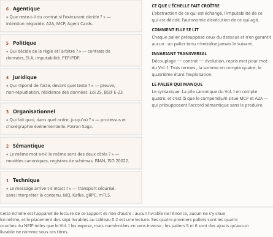
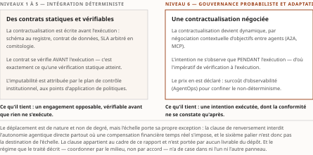

# Interopérabilité et Orchestration Agentiques en Entreprise

**État détaillé du champ, établi sur le seul contenu du dépôt *Agentique*.**
Auteur des travaux sources : André-Guy Bruneau, M.Sc. IT.
Rapport dérivé, arrêté au 16 août 2026.

*Le titre est celui du compendium (Vol. IV), à la lettre et par instruction d'auteur.* Les deux
documents se distinguent par leur cachet — **recensio** ici, **compendium** là —, non par leur
intitulé : *partager un titre n'est pas partager un régime de preuve, et celui de ce rapport est
toujours celui du livrable qui porte l'énoncé, jamais un meilleur* (ch. 0 § 3).

*Ce fichier est la seule source qui fait foi.* `État de l'art.pdf` s'en compose par
`build/rendre-recension.py`, au gabarit du compendium ; les pièces de `chapitres/` sont le brouillon
de la boucle qui l'a produit et cessent d'être lues à l'assemblage. Le déroulé de cette boucle — ses
verdicts, les écarts retenus et les coûts — était au journal `gauntlet-log.md`, ⚠ *sorti de ce
dossier le 17 août 2026 et conservé dans le seul historique `git` : le renvoi qui pointait vers lui
n'avait plus de cible, et il est retiré plutôt que réparé — le dossier ne porte plus que la source
et son rendu.*

*Ce qui précède la première pièce ne passe pas au PDF : la page de titre du gabarit le porte.*

## Ouverture — mise en contexte

### 1. Six paliers : l'appareil de lecture de ce rapport

Ce rapport lit le champ sur **six paliers**, numérotés 1 à 6, du transport de bits à la coordination
d'agents autonomes. L'échelle est son appareil de lecture et rien d'autre : elle sert à situer ce que
chaque livrable travaille, à nommer ce que le champ a réglé et à quel étage il ne l'a pas réglé.
Trois propriétés commandent son emploi, et il faut les avoir en tête avant les paliers eux-mêmes.

*Chaque palier règle une question, et une seule.* C'est la forme sous laquelle ils sont exposés
ci-dessous : une question d'affaires, ce qu'il faut installer pour y répondre, et ce qui cède quand la
réponse manque. *Chaque palier présuppose ceux du dessous et n'en garantit aucun.* Deux systèmes
peuvent échanger sans faute au palier 1 et ne s'entendre sur rien au palier 2 ; on peut s'entendre
sur les mots et travailler à contretemps ; on peut être à l'heure et hors la loi. Monter d'un palier
ne consolide pas celui d'en dessous : *un palier tenu n'entraîne jamais le suivant*. Enfin, *trois
choses croissent ensemble de 1 vers 6* : l'**abstraction** de ce qui est échangé — des octets, puis
du sens, puis une intention —, l'**imputabilité** de ce qui est décidé, et l'**autonomie
d'exécution** de ce qui agit. C'est cette troisième croissance qui fait du sixième palier autre chose
qu'une marche de plus (§ 2).

D'où vient l'échelle, et ce qui lui manque. Ses **quatre premiers paliers** sont les quatre couches
du *New European Interoperability Framework* telles que le Vol. I les expose (`1 - Corpus/1 -
InteroperabiliteAgentique/Chapitres/Chapitre 1 - Interoperabilite.md` §1.2.1.1) — ⚠ mais numérotées
en sens contraire : le NEIF énumère *juridique, organisationnelle, sémantique, technique*, l'échelle
monte de 1 (technique) à 4 (juridique) ; *la numérotation appartient donc à ce rapport, pas à sa
source*. Ses paliers **5** et **6** ne viennent de nulle part : ⚠ *aucun livrable du dépôt ne porte,
sous ces noms, un palier « politique » ni un palier « agentique » dans une échelle numérotée* — ce
sont des ajouts de ce rapport, et aucune porte ne les oppose à quoi que ce soit. ⚠ Il manque enfin un
palier que la pile canonique du Vol. I §1.1.2.1 compte et que celle-ci n'a pas : le **syntaxique**,
deuxième terme de *« technique, syntaxique, sémantique, organisationnel »* (repris au ch. 1 §1.1.2 du
compendium). C'est précisément là que le compendium situe MCP et A2A pour poser le constat le plus
lourd de son Livre I — *ces protocoles opèrent au niveau syntaxique et, partiellement, technique ;
ils ne fournissent aucun mécanisme d'accord sémantique, qu'ils **présupposent*** —, et l'échelle fait
passer les protocoles agentiques du palier 1 au palier 6 sans la case où ce constat se pose.
*Réserve nommée, non levée ; et l'énoncé du compendium reste de surcroît celui d'un brouillon non
publiable.*

**Niveau 1 — Technique.** *La question : le message arrive-t-il intact, à qui doit le recevoir ?* La
liaison matérielle, logicielle et protocolaire qui achemine des flux binaires de façon sécurisée et
intègre, **sans interprétation métier** du contenu acheminé. En clair, la tuyauterie sait livrer une
enveloppe ; elle ne sait pas la lire. Sans ce palier, rien ne circule ; avec lui seul, tout circule
et rien ne se comprend. Exemple : une passerelle asynchrone entre files transactionnelles (IBM MQ) et
dorsale événementielle distribuée (Kafka, gRPC avec mTLS).

**Niveau 2 — Sémantique.** *La question : le même mot désigne-t-il la même chose des deux côtés ?* La
préservation du sens univoque des structures échangées, par ontologies de domaine, dictionnaires et
schémas partagés. En clair, « client », « solde » et « sinistre » doivent nommer le même objet chez
l'émetteur et chez le destinataire — ce qu'aucun protocole de transport ne procure. Sans ce palier,
l'échange réussit techniquement et se trompe métier, en silence. Exemple : harmonisation bancaire et
assurantielle par modèle canonique (BIAN, ACORD, ISO 20022) validé en registre de schémas (Avro,
Protobuf).

**Niveau 3 — Chorégraphique.** *La question : qui fait quoi, dans quel ordre, et jusqu'où va sa
responsabilité ?* L'alignement des processus d'affaires, des frontières de responsabilité et de
l'ordonnancement des flux de valeur entre unités et partenaires. En clair, deux systèmes qui se
comprennent peuvent encore agir à contretemps, ou faire deux fois le même geste. Sans ce palier,
l'intégration marche et le processus ne tient pas. Exemple : chorégraphie Saga en architecture
événementielle sur le règlement d'un sinistre.

**Niveau 4 — Juridique.** *La question : qui répond de l'acte, et devant quel texte ?* La valeur
probante des transactions, la non-répudiation, la résidence territoriale des données, la conformité
aux cadres applicables. En clair, un échange peut être correct, compris, bien ordonné — et rester
interdit, ou inopposable faute de preuve. Sans ce palier, la conformité est un pari qu'on ne découvre
perdu qu'au contrôle. Exemple : encadrement des transferts de renseignements personnels et
journalisation du consentement sous la Loi 25 (Québec), BSIF E-23, RGPD.

**Niveau 5 — Politique.** *La question : qui décide de la règle, qui l'arbitre, et qui paie quand
elle cède ?* La verticalisation du plan de contrôle institutionnel, la formalisation des contrats de
données, l'arbitrage des SLA et **l'attribution de l'imputabilité**. En clair, le palier 4 dit ce que
la loi exige ; le palier 5 dit qui, dans la maison, tranche, signe et assume — et par quel point
d'application la décision s'impose aux systèmes. Sans ce palier, chaque équipe renégocie ses
interfaces au cas par cas, et l'imputabilité se dilue. Exemple : comitologie inter-domaines régissant
le cycle de vie des interfaces, les pénalités d'indisponibilité et les points d'application de
politiques (PEP/PDP).

**Niveau 6 — Agentique.** *La question : que reste-t-il du contrat quand l'exécutant décide lui-même
de la marche à suivre ?* La coordination **adaptative et probabiliste** entre agents autonomes qui
découvrent des outils et **négocient des protocoles** pour exécuter une intention. En clair, on ne
prescrit plus une séquence, on énonce un objectif : ce qui se passe entre l'énoncé et le résultat
n'est plus écrit d'avance, et ne s'observe qu'à l'exécution. Sans les cinq paliers du dessous, ce
palier n'a rien sur quoi s'appuyer — *il ne les remplace pas, il en dépend*. Exemple : maillage
d'agents où un agent d'arbitrage négocie en temps réel avec des agents de souscription, via *Agent
Cards* signées et passerelle d'IA.

**L'invariant transversal** traverse les six paliers sans appartenir à aucun, et il est à trois
termes : **découplage ── contrat ── évolution**. Il est repris mot pour mot du Vol. I. ⚠ Trois ici,
**quatre** dans la somme — découplage, contrat, évolution, **exploitation** —, et le ch. 1 §1.0.2 du
compendium déclare en toutes lettres n'en éprouver que trois, *le quatrième n'ayant pas d'objet faute
d'agent à exploiter*. Une échelle qui culmine à un palier agentique porte donc un invariant où manque
précisément le terme que l'exploitation agentique instruit.

### 2. Pourquoi le sixième palier change de nature

Le sixième palier n'est pas une marche de plus, et c'est le seul endroit où l'échelle change de
nature au lieu de changer de degré. Les paliers 1 à 5 garantissent une intégration **déterministe**,
régie par des **contrats statiques et vérifiables** ; le palier 6 introduit une gouvernance
**probabiliste et adaptative**, où la contractualisation devient dynamique par négociation
contextuelle d'objectifs. Le déplacement tient en une ligne : *un contrat de niveau 5 se vérifie avant
l'exécution ; une intention de niveau 6 ne s'observe que pendant.*

Le prix en est double, et ce rapport le pose avant d'ouvrir les chapitres. **Compromis** : surcoût
d'observabilité (*AgentOps*) et impératif de *runtime verification* pour confiner le non-déterminisme.
**Clause de renversement** : *tout système sous contrainte de compensation financière temps réel —
rails Lynx, RTR — doit interdire l'autonomie agentique directe et maintenir une contractualisation
déterministe de niveau 5.* L'échelle porte donc sa propre exception, et le sixième palier n'est pas sa
destination.

---

### 3. Les sept livrables sur ce cadre

Le placement ci-dessous est une **lecture du présent rapport**, non un énoncé d'un livrable : ⚠ aucun
des sept ne se situe lui-même sur cette échelle, et rien dans le dépôt ne les y place.

| Livrable | Niveaux travaillés | Régime de preuve | Gel |
|---|---|---|---|
| **Vol. I** — *Interopérabilité agentique* (569 p., 7 chapitres + ADS en Annexe B) | 1 à 3, **et le cadre lui-même** — la pile, les quatre couches, l'invariant | Formalisme d'ingénierie (ArchiMate, ADS « Boréalis ») ; ⚠ **ses faits entrent en [C]** au compendium — vérification portant sur les références, non sur le contenu | juin 2026 |
| **Vol. II** — *Orchestration agentique* (387 p., 29 pièces) | **4**, et l'amorce du 5 — E-23, AMF, Loi 25, ACVM, Lynx/RTR | Socle F-01…F-48 (46 entrées), niveaux **[A]/[B]/[C]**, grille CA-1…CA-8 ; publié, millésime `mono-v1.0` | 16-17 juillet 2026 |
| **Vol. III** — *L'entreprise agentique* (427 p., 34 pièces) | **5 et 6** — identité non humaine, maillage, exploitation | Socle propre de 98 entrées, double héritage codifié, CA-01…CA-14 ; ⚠ non publiable et il le déclare : quinze remontées R-G-43 à R-G-57 ouvertes, dette de vote sur F-92 et F-96, phase P5 close sans être achevée | pièces au 21 juillet 2026 (hérite de juin et de 16-17 juillet) |
| **Vol. IV** — *Compendium* (1 000 p., 50 chapitres, 5 Livres) | les six à la fois, au régime le plus faible du dépôt | Rédigé **hors portes** ; brouillon non publiable ; aucun énoncé central au sens de **CA-IV-01** ; CA-IV-11 et CA-IV-13 non satisfaits ; socle consolidé de 159 entrées ; clos par **D-13** | 27 juillet 2026 (D-1) ; volet des faits levé le 28 juillet |
| **Veille technologique** (141 p., 342 réf.) | **6**, plus les sept couches implicites qui retombent sur 1 à 5 | Deux régimes déclarés — fort (trois votants réfutateurs) et faible ; les passes d'août 2026 n'ont aucune ronde adverse, et le plus fort de l'édition du 15 août reste **plus faible** que ceux de juillet | 15 août 2026 |
| **Revue de littérature** (53 p., 192 réf., dix fronts) | **6** — ce que la littérature en sait, et ce qu'elle ne traite pas | 12 attestées, 32 autodéclarées, 145 sans revue sur 189 pièces arXiv ; plafond et plancher déclarés par la revue elle-même | 15 août 2026 |
| **Traité** — *Systèmes multiagents en essaim* (8 chapitres, 24 sections, 123 notices) | **6 par l'autre route** — coordonner par le milieu, non par accord | Chaque mécanisme sous son modèle de panne, son hypothèse de synchronisme et son coût en messages et en tours ; ☑ le seul livrable rejoué par du code — `stigmergie-lab`, 428 tests — et trois de ses énoncés y sont réfutés par la mesure | 15 août 2026, troisième édition |

: Tableau 0.1 — Les sept livrables situés sur le cadre, avec le régime dont chacun fait hériter ce rapport.

Trois remarques closent ce tableau, et chacune commande un chapitre.

La première porte sur le niveau 4. C'est le seul palier dont un livrable instruise la matière au
grain du droit — le Vol. II, sur socle daté et à niveaux de preuve nommés — et c'est aussi celui où
la veille a renvoyé au corpus deux corrections de fond que les volumes ne recevront pas : la
lecture de l'article 12.1 de la Loi 25 et celle de l'avis ACVM 11-348 (`4 - Veille/README.md`,
§ *Ce que chacun rend à l'autre*). ⚠ *Le lecteur qui cite le Vol. II sur ces deux points cite un
énoncé que la veille a réfuté* — et le dépôt étant clos, l'écart reste.

La deuxième porte sur la clause de renversement. Elle nomme Lynx et le RTR, objets que le
compendium instruit à son Livre III ch. 33 — *Lynx accompli, RTR **visé** au T4 2026, quatre cibles
successives, à attribuer et jamais à affirmer au futur catégorique*. ⚠ La clause elle-même n'est
portée par aucun livrable : elle appartient à l'appareil de lecture que le § 1 pose, et ce rapport la
tient comme cadre de lecture, non comme énoncé établi.

La troisième porte sur le traité, et c'est le cas que l'échelle ne tient pas. Le niveau 6 posé au
§ 1 est **négocié** : des agents découvrent des outils et s'accordent sur des protocoles. La thèse
du traité est l'inverse — *déplacer la coordination dans le milieu, et payer ce que le déplacement
coûte* : dès que la population dépasse quelques dizaines d'agents et que les défaillances partielles
deviennent l'état normal, le coût du consensus explicite croît plus vite que sa valeur, et les
agents déposent et lisent des traces au lieu de négocier des décisions. L'échelle n'a qu'un
palier agentique, et il a la forme de la négociation ; le régime que le traité décrit n'y a pas de
case. Le traité, du reste, ne cite aucun autre livrable et aucun ne le cite — il est l'un des deux
seuls objets du dépôt sans lien entrant ni sortant. *Le chapitre qui lui est consacré travaille donc
hors du cadre que cette ouverture pose, et le déclare en tête.*

---

### 4. Le régime des sources, et ce qu'il interdit

Le tableau 0.1 donne en une ligne le régime dont chaque livrable fait hériter ce rapport. Ce qui
suit en détaille les quatre formes que les chapitres invoquent ensuite sans les rejouer — *ils les
reconduisent, ils ne les corrigent pas*, et aucune ne s'améliore en descendant jusqu'ici (§ 3).

**Le compendium se déclare non publiable.** Ses cinquante chapitres sont rédigés **hors portes** ;
aucun de leurs énoncés n'est central au sens de **CA-IV-01** ; **CA-IV-11** et **CA-IV-13** —
l'obligation d'un relecteur distinct du rédacteur — demeurent dérogées et non satisfaites. La
matière héritée du Vol. I y entre en **[C]** : *vérification portant sur les références, non sur le
contenu des affirmations.* C'est le régime que portent tous les énoncés que les chapitres 1 à 5
tiennent de la somme.

**La veille déclare deux régimes** et dit lequel s'applique où. Le **régime fort** — trois
vérificateurs indépendants chargés de *réfuter* — couvre ses sections de fond ; le **régime faible**
— contre-vérification individuelle sur source primaire, **sans ronde adverse** — couvre le reste.
⚠ **Les passes d'août 2026 n'ont aucune ronde adverse à plusieurs votants**, et l'édition du 15 août
écrit d'elle-même que son régime le plus fort *reste plus faible* que celui des rondes à trois
votants de juillet 2026. Une seule région y échappe, et le chapitre qui en vit la déclare avec sa
réserve : le socle de la couche installée vient de la passe du 15 juillet, que le tableau des quinze
passes porte **adverse à trois votants** — ⚠ *rang que la prose du même livrable ne confirme pas, et
dont ce rapport ne se réclame donc pas* (ch. 7 § 7.1).

**La revue mesure son corpus** avant d'en rapporter le contenu. Sur **189 pièces déposées sur
arXiv** — 192 entrées au total —, **douze** portent une attestation de publication en notice,
**trente-deux** annoncent une acceptation au seul champ de commentaire libre — *rempli par l'auteur
et vérifié par personne* — et **cent quarante-cinq** ne présentent aucun signe de revue par les
pairs. ⚠ Ces cardinaux sont des **bornes**, non des mesures : **145** est un plafond du non-arbitré,
**12** un plancher de l'arbitré — une notice muette n'établit pas l'absence d'arbitrage, une
attestation absente n'établit pas l'absence de publication. *Les trois classes mesurent ce que les
notices déclarent, non ce que les comités ont fait.*

**Le traité est le seul livrable** dont les énoncés soient rejoués par du code, et la mesure lui en
réfute trois : `stigmergie-lab` consigne **cinq écarts**, dont trois contredisent le texte.
⚠ *C'est le seul contrepoids interne de ce rapport, et il ne couvre qu'un livrable sur sept* — avec
la réserve que le ch. 8 § 8.8 tient pour la plus lourde de toutes.

---

## Chapitre 1 — Le socle protocolaire

*Matière : compendium, Livre I, ch. 1, 2, 8, 9, 10 ; `4 - Veille/Veille Technologique.md` ;
`4 - Veille/Revue de littérature.md` ; les deux `README.md` pour les régimes et les gels.*

---

### 1.1 Ce que ce chapitre tient, de qui, et à quel prix

Trois livrables portent la matière protocolaire, à trois dates et sous trois régimes. Le tableau
ci-dessous conditionne tout ce qui suit : aucun énoncé de ce chapitre ne peut valoir mieux que la
ligne dont il descend.

| Livrable | Gel | Régime hérité | Ce qu'il dit de lui-même |
|---|---|---|---|
| Compendium, Livre I (ch. 1, 2, 8, 9, 10) | gel unique du 27 juillet 2026 ; sources gelées juin 2026 (Vol. I) et 16-17 juillet 2026 (Vol. II) | **[C]** pour ce qui descend du Vol. I — PRD §7.1 du compendium : la vérification y porte sur les *références*, non sur le contenu des affirmations | « **brouillon de rédaction, non publiable** » ; « aucun énoncé n'est central au sens de **CA-IV-01** » |
| Veille technologique | 15 août 2026 | source primaire rouverte par le rédacteur, **sans ronde adverse à plusieurs votants** pour les éditions d'août (veille, § 2.2, § 10) | métriques d'adoption « toutes auto-déclarées » (veille, § 10) |
| Revue de littérature | 15 août 2026 | notices arXiv : **12 pièces attestées sur 189 (6 %)**, **32 auto-déclarées (17 %)**, **145 sans signe de revue (77 %)** | « le lire comme une part du champ serait circulaire » |

**Un plafond.** L'anatomie de MCP et d'A2A, la pile et la sémantique descendent du compendium, qui les
tient du Vol. I en régime **[C]** : *une porte franchie après coup ne rétroagit pas sur un texte écrit
sans elle* (compendium, ch. 1 § 1.8). Rien ici ne le relève.

**Un écart de dates.** Dix-neuf jours séparent les deux gels, mais la matière protocolaire du
compendium porte celui de *sa source*, juin 2026 — deux mois et demi plus tôt. L'écart est de nature :
le compendium décrit un contrat, la veille décrit un dépôt et une file de demandes de tirage. *Les
deux mesurent le même objet à deux profondeurs, et c'est pour cela qu'ils se contredisent utilement.*

⚠ Les deux bornes du corpus académique — **plafond** du non-arbitré, **plancher** de l'arbitré —
sont posées pour tout le rapport aux liminaires (ch. 0 § 4) ; elles se reportent ici sans
s'améliorer. *Le chiffre reste exact de ce qu'il mesure — la notice — et faux de ce qu'on lui
faisait dire.*

---

### 1.2 Le passage du déterministe à l'agentique : ce qui ne change pas

Le chapitre 1 du compendium pose le socle **pré-agentique**, une seule fois, sur une thèse économique
avant d'être technique : *l'interopérabilité n'est pas un attribut mais une propriété à maintenir dans
le temps*. Quatre de ses acquis se transportent tels quels.

**L'explosion combinatoire et son remède.** Raccorder *N* systèmes deux à deux peut requérir jusqu'à
*N*(*N*−1)/2 liaisons ; le modèle canonique ramène le coût en 2*N* (compendium, ch. 1 § 1.0.1 et § 1.6.1 — régime
[C]). Le chapitre 8 relève que la couche de contrat agent-outil est **le même geste** transposé à
l'axe vertical : *N*×*M* ramené à *N*+*M* (compendium, ch. 8 § 8.1.1). Le patron a ses pièges — un canonique trop
ambitieux « recouple paradoxalement les parties par sa lenteur de changement ».

**Le couplage ne disparaît pas, il se déplace** (compendium, ch. 1 § 1.3) — la couche agentique le rejoue au
transport de MCP, aux passerelles multi-fournisseurs et au verrouillage inverse.

**La pile canonique est cumulative** — technique, syntaxique, sémantique, organisationnel
(compendium, ch. 1 § 1.1.2). Le compendium y accroche ce qu'il déclare « le constat le plus important du
Livre I » : MCP et A2A opèrent au niveau syntaxique et, partiellement, technique ; ils ne
fournissent aucun mécanisme d'accord sémantique, qu'ils présupposent. Il précise qu'il **ne
l'établit pas** : il le rend seulement *formulable*, l'établissement revenant aux chapitres 8 et 9.

**La gradation des contrats** — syntaxique, sémantique, comportemental (compendium, ch. 1 § 1.1.3.2) — sert de
diagnostic : les Agent Cards sont des **contrats syntaxiques dotés d'une intention sémantique**, et
aucun n'est un contrat comportemental.

S'y ajoute la distinction qui départage promesse et réalisation. Le cube ISO 11354-1:2011 oppose
l'approche **intégrée**, l'**unifiée** (méta-modèle pivot) et la **fédérée** (adaptation à l'exécution,
aucun format imposé). Le compendium écrit que l'**ambition** des protocoles agentiques relève du
fédéré et leur **réalisation de 2026** de l'unifié — schéma d'Agent Card, schéma d'outil —, et qualifie
l'écart : « ce n'est pas un défaut de mise en œuvre : c'est le prix de la vérifiabilité »
(compendium, ch. 1 § 1.2.1). Il pose la distinction et ne tranche pas le classement.

---

### 1.3 MCP : un contrat réel, et étroit

L'axe agent-outil est un **triangle hôte / client / serveur** en appels de procédure JSON. L'apport
propre à une lecture d'interopérabilité n'est pas les primitives mais la **grille de contrôle** : **outils** contrôlés par le modèle, **ressources** par l'application, **gabarits
d'invite** par l'utilisateur — « une clause du contrat, non un détail d'implémentation » (compendium,
ch. 8 § 8.1.2, tableau 8.1). Trois **primitives client** inversent le sens du dialogue :
échantillonnage, sollicitation, racines. Le compendium en porte lui-même la critique : le
protocole « ne porte pas de couche riche de négociation de capacités ni de confiance établie », et
l'appariement est conforme « au transport et au schéma, non au sens » (compendium, ch. 8 § 8.1.1). *Le contrat est réel
mais étroit : il fixe la forme de l'échange, pas son interprétation.*

La révision `2026-07-28` a périmé cette anatomie en bloc, et le compendium l'écrit à côté du texte
qu'elle périme plutôt qu'à sa place. Cinq jalons en moins de deux ans (tableau 8.3 : 2024-11-05,
2025-03-26, 2025-06-18, 2025-11-25, 2026-07-28) ; la cinquième, gelée le 21 mai 2026, ratifiée le
28 juillet 2026 — le lendemain de la rédaction du chapitre —, revalidée le 30 juillet 2026 sur
le journal des changements extrait à sa source :

- **racines**, **échantillonnage** et **journalisation** passent à l'état **déprécié** ; la requête
  serveur-vers-client cède au patron des **requêtes à tours multiples**, le serveur renvoyant un
  résultat typé `input_required` que le client rejoue (compendium, ch. 8 § 8.1.2) ;
- le cœur devient **sans état** : suppression des sessions, de la poignée de main et de la reprise de
  flux ; apparition d'une méthode de découverte (compendium, ch. 8 § 8.1.3) ;
- une **politique de cycle de vie et de dépréciation** est adoptée — *actif*, *déprécié*, *retiré*,
  préavis d'au moins **douze mois** — et s'exerce dans la même révision (compendium, ch. 8 § 8.3.1) ;
- l'**enregistrement dynamique de client** (RFC 7591) est déprécié au profit des documents de
  métadonnées d'identifiant client (compendium, ch. 8 § 8.2.2).

Le fait le plus instructif corrige la lecture d'origine. Le tableau des transports lisait la
trajectoire comme une décroissance monotone du couplage ; la dernière marche « échange un couplage
d'infrastructure contre une obligation de réémission côté client » — un flux rompu perd la requête en
vol. Le couplage ne disparaît pas davantage ici qu'ailleurs : il se déplace vers l'appelant.

La veille confirme la révision toujours courante au 15 août 2026 et ajoute ce que le compendium ne
pouvait pas porter (veille, § 4.1) : les en-têtes `Mcp-Method` et `Mcp-Name` **exigés** sur les POST,
« première concession de la couche commune au plan de contrôle d'*agent mesh* » ; **deux dérogations à
la fenêtre de douze mois**, portées ici toutes les deux parce qu'aucune ne se déduit de l'autre et que
le § 1.8 de ce chapitre en tire la conséquence — **retrait accéléré à quatre-vingt-dix jours sur risque de sécurité
actif**, et **retrait du transport HTTP+SSE trois mois après que la proposition SEP-2596 atteint le
statut *Final*** ; le fait que la révision rompt la compatibilité ; et, le 5 août 2026, la
charte du groupe
*Agents*, qui se donne pour livrable de promouvoir l'extension *Tasks* **dans le protocole de base** —
« mouvement inverse de celui que la révision venait d'opérer, huit jours plus tôt ». *En dix jours, la
frontière du protocole de base bouge deux fois.*

⚠ Une réserve de formulation est tenue partout. Ce protocole est assorti d'un **cadre
d'autorisation**, jamais qualifié de « sécurisé » (réserve F-01 du Vol. II, quatre occurrences
marquées au chapitre 8) — et la veille y arrive autrement : les principes du protocole « ne sont pas
*imposables* au niveau du protocole », l'autorisation OAuth « ne couvre que le transport HTTP ».

---

### 1.4 A2A : la carte, la tâche, et l'opacité voulue

L'axe agent-agent fixe ses structures en version 1.0 : l'**Agent Card** publiée à un emplacement bien
connu, déclarant identité, capacités et modalités d'interaction ; la **tâche** comme unité de travail
à cycle de vie défini ; la hiérarchie **message / partie / artefact**. Trois consolidations sont
relevées : **signature des cartes** liée au domaine d'origine, **multi-location**, **pluralité de
liaisons de transport** — le protocole « ne réinvente pas la couche de transport » (compendium,
ch. 8 § 8.4.2).

La qualification du compendium est le modèle du genre. Une carte signée **démontre** que la
carte a été émise par le détenteur de la clé associée au domaine déclaré et n'a pas été altérée ; elle
**ne démontre pas** que l'agent se comporte conformément aux capacités déclarées, ni que le domaine
est digne de confiance. *Signer une déclaration l'authentifie ; cela ne la rend pas vraie.*

La veille précise la mécanique et réfute un de ses propres énoncés antérieurs : la
canonicalisation RFC 8785 et les six étapes de vérification sont au niveau **MUST**, seul le
*déclenchement* étant *SHOULD* (annexe, *Énoncés réfutés*). Elle date la lignée : lancement avril
2025, transfert à la Linux Foundation le 23 juin 2025, signature des cartes en v0.3.0 (juillet
2025), v1.0.0 le 12 mars 2026, correctif v1.0.1 le 28 mai 2026, `a2a.proto` élevé en source
normative unique (veille, § 4.2).

Deux traits de conception comptent pour la suite. La **délégation** franchit la frontière
organisationnelle — « le niveau le plus élevé de l'interopérabilité conceptuelle » — sans intégration
préalable. L'**opacité voulue** fait que l'agent distant n'expose ni son raisonnement, ni ses outils,
ni son modèle : « pendant agentique du découplage », dont le compendium signale en lecture d'auteur
la tension — un exploitant tenu de démontrer devant un tiers ne peut pas produire l'état d'un
traitement délégué en bloc à un agent opaque (compendium, ch. 8 § 8.4.3).

La doctrine qui donne son titre au chapitre 8 est attribuée, et l'attribution est le fait. « Dans
les agents, entre les agents » est **déclarée par le projet A2A** dans l'annonce de sa v1.0 ; le
compendium ne dispose d'aucune source établissant que l'autre projet l'a endossée dans ces termes.
⚠ Deux réserves s'y ajoutent : la formule « de nombreux systèmes utilisent les deux » est **refusée
comme métrique** — ni chiffrée, ni datée, ni définie, et émanant du même projet ; et le **verbatim**
que le socle citait n'a pas été retrouvé à sa source le 28 juillet 2026 (compendium, ch. 8 § 8.6.3). *Le fond est
attesté, la citation littérale ne l'est pas.*

Et un critère n'est pas une contrainte. Rien n'empêche de faire transiter par des appels
d'outils ce qui est une délégation entre agents, ou l'inverse ; les **tâches asynchrones** de l'axe
vertical empiètent d'ailleurs sur le terrain de la délégation. La veille y arrive par la gouvernance :
les deux protocoles « vivent sur des **horloges de gouvernance divergentes** », leur complémentarité
« ne s'accompagne d'aucune coordination des calendriers », et *l'intégrateur qui consomme les deux
porte seul le risque de leurs révisions indépendantes* (veille, § 4.2).

Le contrôle des deux contrats est le point où la veille corrige le plus le compendium — et
elle-même. Le compendium pose, au gel de juin 2026, que la **certification par un tiers
indépendant** « n'existe qu'à l'état d'amorce » (compendium, ch. 9 § 9.5.3). La veille réfute deux de ses
propres éditions antérieures (veille, § 4.5, § 7.5 ; annexe, *Énoncés réfutés*) : « aucune suite de
conformité publique » est faux — `modelcontextprotocol/conformance` existe depuis le 10 juillet 2025,
`a2a-tck` depuis mai 2025 — et « dépôt immobile » l'est aussi : *un fait négatif de dépôt ne s'établit
pas sur la branche par défaut*. ⚠ Ce qui reste vrai est plus précis : ce
sont des suites gouvernées par le projet même qu'elles vérifient, aucune certification n'en
découle, et elles vérifient le protocole, non la sécurité — rien n'y teste l'atténuation d'un
mandat, la validation d'un émetteur ou la révocation. Une exception : depuis le 28 juillet 2026, une
proposition MCP *Standards Track* n'atteint le statut final que si un scénario a été versé à la suite
de conformité — « **premier dispositif du corpus qui subordonne la normativité à la testabilité** ».

Ce que « conforme » et « interopérable » nomment n'est pas la même chose, et le compendium en donne
l'instrument. La distinction est posée au ch. 3 § 3.4.3 du compendium — la **conformité** atteste qu'une
implémentation respecte une spécification ; l'**interopérabilité**, que deux implémentations
« échangent et utilisent **effectivement** » ce qu'elles s'échangent — et le ch. 9 § 9.5.1 du compendium en tire du
**Vol. I *Monographie* §3.12.1** une **pyramide d'évaluation à trois étages** (tableau 9.4 —
régime [C]) :

| Étage | Ce qu'il mesure | Nature |
|---|---|---|
| Conformité protocolaire | un message est-il valide ? une transition d'état légale ? | **déterministe et automatisable** |
| Interopérabilité entre implémentations | deux implémentations distinctes du même protocole se comprennent-elles ? | déterministe, plus coûteux |
| Bancs de tâches inter-agents | la collaboration produit-elle le résultat attendu ? | **intrinsèquement non déterministe** |

Aucun étage ne subsume le suivant : *franchir la poignée de main n'implique pas l'accord
sémantique sur l'intention.* C'est ce qui situe exactement les deux suites de conformité du paragraphe
précédent — elles tiennent le **premier étage**, et l'attestation par un tiers, qui validerait le
second au sens mesurable, « n'existe qu'à l'état d'amorce » (compendium, ch. 9 § 9.5.3). Le compendium ajoute le test le
plus propre à l'interopérabilité agentique : la **négociation** de version et de capacités, où il
s'agit de vérifier **rétrocompatibilité et dégradation gracieuse** lorsque deux pairs n'annoncent pas
le même jeu de fonctionnalités — enjeu qui *devient crucial* avec le cœur sans état et le cadre
d'extensions, puisqu'un client doit pouvoir interagir avec un serveur ignorant une extension sans
rompre l'échange. S'y ajoutent les **tests aller-retour**, qui éprouvent la fidélité de traduction
d'un message franchissant la frontière entre deux écosystèmes — « première mesure concrète, quoique
partielle », de la fidélité de transfert d'intention. ⚠ Le sommet, lui, porte son degré : aucun banc
standardisé véritablement inter-fournisseurs ne s'impose à juin 2026, gel de la source, et c'est une
**absence de documentation au sens de R-14**, non un fait négatif vérifié.

---

### 1.5 La sémantique : le niveau que la pile présuppose

La thèse du chapitre 2 tient en une phrase, que le chapitre 9 reprend **par copie** :
« l'interopérabilité sémantique — accord sur le sens, pas seulement sur le format — est le niveau que
les protocoles agentiques **présupposent** et que **peu savent établir** ». La forme bornée prime :
« peu savent établir » affirme moins que « ne fournissent pas » (compendium, ch. 9 § 9.4).

Le socle formel existe et il est ancien (compendium, ch. 2 § 2.3 — régime [C], aucune entrée du socle
consolidé ne couvrant le périmètre de ce chapitre) : RDF, dont deux graphes hétérogènes fusionnent
par simple union de triplets pourvu qu'ils partagent des identifiants ; RDFS, SKOS et OWL 2 pour
l'inférence ; JSON-LD comme pont vers les API existantes ; SPARQL et sa fédération ; SHACL comme
contrat sémantique vérifiable aux points d'échange. La confusion « qui se paie le plus cher » y est
nommée : OWL sert l'**inférence** sous monde ouvert, SHACL la **validation** sous monde clos ; les
confondre produit des contrôles qui ne se déclenchent jamais. ⚠ Et la borne de la couche syntaxique
est posée au même endroit : une garantie de compatibilité de schéma n'est pas une garantie de sens —
« une même colonne *montant* qui passe des dollars aux cents satisfait toutes les règles et casse ses
consommateurs » (compendium, ch. 2 § 2.1.5) —, ce que les registres n'attrapent pas relevant d'une **absence de
documentation** au sens de R-14, non d'un fait négatif vérifié.

Au plan agentique, le diagnostic vient d'une grille à trois plans appliquée à **dix-huit protocoles**
(Yuan et coll., 2026, cités au ch. 9 § 9.4.1 du compendium) : maturité correcte en communication et en syntaxe,
pauvreté en mécanismes de clarification, d'alignement et de vérification du sens, repoussés vers
la couche applicative. Le compendium en tire l'écart décisif : la description d'un outil est du
**texte libre lu par le modèle à l'inférence** ; le schéma type la forme, « c'est la prose descriptive
— non vérifiable et non contraignante — qui porte le sens de l'opération et son effet réel » (compendium, ch. 9 § 9.4.2).
*La description est à la fois le contrat d'interopérabilité de l'outil et son point de vulnérabilité.*

La revue fait passer ce constat de « défi ouvert » à résultat mesuré. Sur 856 outils de
103 serveurs MCP, **97,1 %** des descriptions portent au moins un défaut et **56 % n'énoncent pas
clairement leur objet** ; les enrichir **ne gagne que 5,85 points médians de succès**, **allonge
l'exécution de 67,46 %** et **régresse dans 16,67 % des cas**. Sur 19 200 paires description/code
issues de 2 214 serveurs réels, **9,93 %** sont incohérentes, « sans qu'aucun mécanisme du protocole
ne vérifie que la description reflète l'implémentation » (*Les protocoles d'interopérabilité*).
⚠ Ces pièces relèvent du corpus arXiv dont 77 % ne portent aucun signe de revue par les pairs à leur
notice. *Le remède mesuré coûte donc plus de deux tiers de latence pour six points de succès, et se
retourne une fois sur six : ce n'est pas un correctif, c'est un arbitrage.*

La veille tranche la question du vocabulaire par examen direct des spécifications : la réponse est
non (veille, § 4.9). Dans A2A v1.0, les `tags` de l'*AgentSkill* ne sont « qu'un ensemble de mots-clés », et
« taxonomy », « ontology », « schema.org » et « JSON-LD » sont **absents de toute la spécification**.
L'**unique taxonomie normalisée vérifiée** est l'OASF d'AGNTCY — dix-huit catégories de premier
niveau, trois niveaux, champ de compétences obligatoire —, opérationnalisée par l'annuaire `dir`.
Trois observations la bornent : **aucun commit au dépôt OASF depuis le 21 juillet 2026** ; aucune
référence à sa taxonomie dans un autre protocole du corpus ; et la surface de découverte qui a le
plus crû emploie des étiquettes libres. *Le vocabulaire normalisé existe ; le premier annuaire venu ne
l'emploie pas* — le registre MCP officiel assumant ce refus, sa recherche par sous-chaîne étant
déclarée « intentionally simple ».

La voie de sortie que le compendium examine déplace le problème plutôt qu'elle ne le résout, et il
l'écrit. Confier la réconciliation sémantique au modèle lui-même — apparier dynamiquement deux
vocabulaires plutôt que définir *a priori* un schéma pivot — offre flexibilité, tolérance aux
désalignements de surface et absence de canonique à maintenir. Ses risques sont d'une autre nature :
**hallucination d'alignement** — une correspondance **plausible mais fausse** —, **non-déterminisme de
la médiation**, et **dette technique déplacée du schéma vers les invites**, plus difficile à
versionner et à auditer (compendium, ch. 9 § 9.4.4 — régime [C]). La position tenue vient du **Vol. I
*Monographie* §3.5.4**, et le compendium la reprend « comme une position, jamais comme un fait » :
*la médiation par modèle complète, mais ne remplace pas, l'interopérabilité sémantique formelle.*
Cette **synthèse neuro-symbolique** — un raisonnement **contraint par l'ontologie** — est argumentée
par **Tuan et Sanyal (2026)**, dans une architecture où le raisonnement neuronal opère sous la
contrainte d'une ontologie de domaine : la couche formelle stabilise le contrat, la couche neuronale
absorbe l'évolution. ⚠ Deux bornes l'accompagnent, aux formes du corpus. Au sens de **R-02**, un
appariement produit par modèle **démontre une plausibilité lexicale** et **ne démontre pas une
équivalence sémantique**. Et que la fiabilité de ces appariements n'ait **aucune mesure établie hors
bancs dédiés** est une **absence de documentation au sens de R-14**. *Le débat oppose deux régimes de
garantie — la médiation purement neuronale maximise le rappel au prix de la précision vérifiable,
l'architecture contrainte par l'ontologie borne l'espace des alignements admissibles — et la question
ouverte n'est pas l'architecture, c'est la mesure* : comment propager une garantie de correction à
travers une chaîne de délégations probabilistes.

Le chapitre 2 clôt son parcours par un renversement qui appartient à ce dossier. Adosser la
génération augmentée à un **graphe structuré** extrait des sources plutôt qu'à un index vectoriel plat
(**Edge et coll., 2024** ; ch. 2 § 2.4 du compendium — régime [C]) rend trois choses : **réduction des
hallucinations** par ancrage sur des entités et relations attestées, **traçabilité** de chaque
assertion aux nœuds et arêtes qui la fondent, et — le seul volet que le socle établit — l'**ontologie
comme garde-fou**, un schéma de classes et de relations imposé qui circonscrit l'espace des
inférences admissibles. Le compendium borne aussitôt : la **hiérarchie des trois volets** et leur
réemploi en aval sont donnés comme **lecture d'auteur**, non établis. *Jusqu'ici la sémantique servait
à ce que deux systèmes se comprennent ; ici elle sert à borner ce qu'un système a le droit de
conclure* — le contrat de sens cesse d'être un instrument de coopération pour devenir un instrument
de contrainte.

---

### 1.6 Découvrir, nommer, résoudre : UDDI rejoué, et la portabilité

La proposition organisatrice du chapitre 9 contredit une lecture naturelle : la nouveauté ne tient pas
à la découverte prise isolément — l'intégration d'entreprise la pratique depuis longtemps — mais au
**couplage indissociable de la découverte, de l'identité et de la confiance** (compendium, ch. 9 § 9.1). Trois moments
sont à ne pas confondre : **découverte**, **sélection**, **résolution**. La difficulté se concentre
au deuxième : les capacités étant décrites en langage naturel assorti de schémas, la sélection devient
un **appariement sémantique, intrinsèquement probabiliste**, qui « ne peut, en l'état des protocoles,
s'appuyer sur aucune garantie déterministe d'adéquation ».

La récurrence historique est le fil de la section, et elle est bornée. Les annuaires UDDI publics
ont été retirés dès 2006 (compendium, ch. 1 § 1.3.1.2) ; le pendule est revenu vers des catalogues gouvernés ; les
registres d'agents prolongent la récurrence. Le compendium en tire deux propositions — *la découverte
sous curation surpasse le tout-dynamique*, *la fédération surpasse la centralisation* — et les
qualifie aussitôt : **inférées d'une récurrence observée, non démontrées**, soit une absence de
documentation au sens de R-14 (compendium, ch. 9 § 9.1.1). Suivent les modes d'échec propres au registre : description
mensongère, typosquattage, appropriation d'espace de noms, registre empoisonné, point unique de
défaillance recréé — contre lesquels *signer une carte mensongère produit une carte mensongère
authentifiée*. La veille en fournit la démonstration par l'incident — la version 1.8.1 du registre MCP
officiel corrige une **prise de contrôle d'espace de nommage d'organisation exploitable via
`github.io`** — et par la procédure : la normalisation du chaînon a été **tentée et refusée**, BoF
GARR écartée le 22 mai 2026 (veille, § 7.3).

Le décompte de serveurs est l'endroit où la veille est la plus utile, et son enseignement porte
sur l'instrument. Le compendium écrivait, au gel de sa source, que l'écosystème « dépasse les dix
mille serveurs publics » (compendium, ch. 8 § 8.3.2). La veille recalcule par pagination exhaustive du registre
officiel le 15 août 2026 : avec le filtre `version=latest`, **21 767 enregistrements** dont
**21 520 actifs et 247 dépréciés** ; sans filtre, **73 072** — « l'écart entre 2 000 et *plus de
10 000* qui traînait dans la littérature n'était pas une querelle de sources, c'était une querelle de
curseur » (veille, § 6.3). Trois bornes du même auteur l'accompagnent : ce sont des **enregistrements
auto-publiés**, jamais des serveurs vérifiés en exploitation ; le nombre est « daté à l'heure, non à
la journée » ; et un audit dynamique indépendant du 31 juillet 2026 annonce **plus de 21 000 instances
détectables**, **même ordre de grandeur** par une méthode distincte — « le premier recoupement
indépendant dont dispose ce domaine ».

⚠ Le compendium range ces protocoles dans une matrice, et l'instrument porte sa propre date de
péremption au front. Reprise du **Vol. I *Monographie* §3.7.5** à l'état de juin 2026
(compendium, ch. 9 § 9.2.5, tableau 9.3 — régime [C]), elle croise axe couvert, statut de maturité, gouvernance et
usage recommandé, et son en-tête déclare qu'elle **se périme en bloc** : *c'est un instantané, non un
classement durable*, et *ce qui est marqué candidat ou expérimental ne doit pas être déployé comme
acquis*. Sept lignes y tiennent les neuf de la source, par deux regroupements et aucun retrait —
la couche commerciale pour deux spécifications, la couche agent-humain pour deux également, cette
dernière retenant le statut le plus prudent des deux.

| Protocole | Axe | Statut | Gouvernance | Usage recommandé |
|---|---|---|---|---|
| Agent-outil | vertical | production ; révision stable, **candidate à venir** | fondation dédiée | socle pour exposer outils et ressources ; adopter la révision datée stable, traiter le cœur sans état comme cible |
| Agent-agent | horizontal | production ; version 1.0 stable, écosystème large | fondation faîtière | standard de fait pour la délégation ; combiner avec le précédent |
| Décentralisé | horizontal + identité | **émergent** ; conditionné à la maturité de son socle d'identité | communauté et groupe de normalisation | topologies pair-à-pair et négociation de méta-protocole ; horizon ≈ 2027 |
| Règlement (mandat) | économique | **émergent** ; version préliminaire | fondation distincte du reste de la pile | couche de mandat vérifiable ; suivre la trajectoire |
| Règlement (machine-natif) | économique | émergent **à traction réelle** | fondation dédiée | micropaiements ; la plus forte traction de production de sa couche |
| Commerce (paiement) | commercial | émergent ; spécification **mouvante** | consortium d'éditeurs | achat agentique ; à suivre par révision datée |
| Interface agent-humain | agent-humain | **expérimental** | fondation dédiée / communauté | validation et interfaces riches ; hors production critique |

⚠ Le jalon d'adoption qui l'accompagne est **auto-déclaré et attribué** : **plus de 150 organisations
de soutien au 9 avril 2026** pour l'axe agent-agent, rapporté par la Linux Foundation, qui gère le
protocole — *soutien n'est pas production*. La logique de décision qu'en tire le compendium tient en
trois temps : les deux axes principaux constituent le socle minimal d'un système interopérable de
production ; la couche agent-humain s'ajoute dès qu'un point de validation ou une interface riche est
requis ; la couche de règlement, segment le moins stabilisé et à gouvernance distincte du reste de
la pile, n'intervient que pour les cas commerciaux — les protocoles marqués émergents appelant
une veille active plutôt qu'un engagement architectural irréversible. ⚠ *Et la péremption annoncée
est déjà advenue sur une ligne au moins* : la ligne agent-outil porte « révision stable, candidate à
venir » et traite le cœur sans état comme **cible**, quand le § 1.3 de ce chapitre le donne pour courant depuis le
28 juillet 2026. L'instrument reste exact à sa date ; il ne l'est plus à celle de ce chapitre, et
c'est très exactement ce que son en-tête annonçait.

La portabilité porte le paradoxe le plus net. L'interface *Chat Completions* d'OpenAI
s'est imposée comme norme de fait sans qu'aucun organisme ne l'ait spécifiée ; elle découple
l'application du fournisseur, et cette même portabilité « instaure un verrouillage inverse — non plus
à un fournisseur mais à un **schéma** », dont l'évolution « échappe à tout contrat public » (compendium, ch. 9 § 9.3.1).
Le compendium signale la relève : dépréciation de l'*Assistants API* annoncée le 26 août 2025,
retrait fixé au 26 août 2026 — onze jours après le gel de la veille, qui ne pouvait donc pas en
constater l'exécution. Il n'a pas versé cette échéance à son tableau des événements datés et a
**ouvert une remontée** : *un rédacteur ne complète pas un cardinal contrôlé, il remonte.* Deux
manques sont enfin nommés au même rang que les acquis (compendium, ch. 9 § 9.3.4) : **aucun format d'agent portable et
neutre**, **aucune portabilité de l'état et de l'exécution durable**. *La définition voyage ;
l'exécution, elle, reste captive.*

---

### 1.7 La transaction et l'infrastructure : où l'interopérabilité devient responsabilité

Le chapitre 10 décompose sa thèse avant de l'employer : que la transaction agentique soit
l'aboutissement financier de la pile est une **lecture d'auteur** ; qu'AGNTCY soit une couche
d'infrastructure et non un concurrent est un **positionnement déclaré du projet**. *Aucune des deux
n'est un fait établi.*

Ce que le compendium établit, et ce qu'il refuse d'écrire. AP2 a été annoncé le 16 septembre
2025 comme protocole compagnon de l'axe agent-agent ; le communiqué de la Linux Foundation du
9 avril 2026 donne **plus de soixante organisations** déclarant leur soutien, dont **sept
nommées** — réseaux de paiement et émetteurs. ⚠ Chiffre auto-déclaré, que la re-datation du 28 juillet
2026 n'a pas retrouvé à sa page source : *un décompte qu'on ne retrouve plus à sa source n'est pas
devenu faux ; il est devenu invérifiable, ce qui est un état différent et qui doit se dire.* ⚠ Le compendium déclare en outre ne pas pouvoir écrire l'**anatomie
technique** d'AP2 — ni structure des messages, ni mécanique de mandat, ni modèle de preuve d'intention
au socle du Vol. II, degré 3 — et « s'y refuse plutôt que d'emprunter à une connaissance non tracée »
(compendium, ch. 10 § 10.1.4).

Le chapitre 10 porte le seul cas du corpus où deux volumes ne disent pas la même chose. Le
Vol. II, gelé aux 16-17 juillet 2026, ne documente aucun transfert de gouvernance d'AP2 ; le Vol. I, gelé
en juin 2026 — donc **antérieur** —, porte le transfert à la FIDO Alliance le 28 avril 2026, en
**v0.2**. Le compendium refuse d'arbitrer : « le socle du Vol. II ne documente pas X » et « le Vol. I
documente X » sont **logiquement compatibles**, le premier décrivant un corpus de sources, le second
un événement ; les deux entrées « coexistent sans arbitrage » au socle consolidé.

La veille y ajoute ce qui manquait : ce que le transfert a produit. AP2 est le *seul* transfert
agentique vers un organisme de normalisation établi (veille, § 5). Or **aucun commit sur sa branche principale
depuis le 29 avril 2026**, spécification inchangée et muette sur la FIDO, laquelle ne publie rien
sur ses deux groupes agentiques depuis l'annonce du 28 avril. *Trois mois et demi de silence des
deux côtés du transfert* — d'où la formule qui vaut pour toute la couche : « la migration
institutionnelle dit qui tient la plume, non si quelqu'un écrit ». Le contraste est symétrique : x402,
mis sous fondation le 2 avril 2026 (compendium, ch. 10 § 10.3.4), est celui qui bouge — et « c'est le
protocole qui bouge qui se fait trouer » : du 29 juillet au 13 août 2026, **cinq correctifs de
sécurité**, dont trois touchant l'encaissement, aucun n'ayant fait l'objet d'un avis formel
(veille, § 4.8). ⚠ Le site de sa fondation **refuse la connexion chiffrée au 15 août 2026**, ses quarante
membres étant déclarés **invérifiables**.

La couverture des deux livrables ne s'emboîte pas. Le compendium porte MPP, lancé le 18 mars
2026 (compendium, ch. 10 § 10.3.4) ; la veille le déclare, au 15 août 2026, « absent de toutes les éditions
antérieures » (veille, § 4.8). *La fraîcheur d'un gel ne prédit pas la couverture.*

Sous ces protocoles, les réseaux de cartes ont étagé plutôt que remplacé, et le compendium en donne
le tableau daté (compendium, ch. 10 § 10.3.3, tableau 10.2 — régime [C]). Même régime que la matrice du
§ 1.6 de ce chapitre, et il est déclaré tel à sa source : *instantané, ni classement ni recommandation, se périme en
bloc*.

| Initiative | Porteur | Date | Mécanique, telle que les sources la portent |
|---|---|---|---|
| Protocole d'agent de confiance (TAP) | un réseau de cartes, avec un fournisseur d'infrastructure de périphérie | 14 octobre 2025 | signe l'identité de l'agent dans des en-têtes HTTP, au moyen des signatures de message HTTP normalisées et d'une mécanique d'authentification de robot, sur clés à courbe elliptique |
| Paiement d'agent et jetons agentiques | un second réseau de cartes | 2025 | prolonge l'infrastructure de tokenisation existante, le jeton étant lié à un périmètre marchand et à un consentement |
| Groupe de travail paiements de la fondation d'authentification | coprésidé par les deux réseaux de cartes | 2026 | bâtit sur **AP2** et sur un cadre d'**intention vérifiable** |
| Authentification de robot par le web | un fournisseur d'infrastructure de périphérie, en cours de spécification à l'organisme de normalisation d'Internet | en cours, 2026 | l'agent signe ses requêtes par les signatures de message HTTP et publie sa clé publique sous un chemin de découverte normalisé |

Deux lectures s'en tirent, et elles ne pèsent pas pareil. *(1)* La convergence institutionnelle est
documentée : que le groupe de travail paiements soit coprésidé par les deux réseaux et bâtisse sur
AP2 confirme par une seconde voie ce que le transfert de gouvernance disait déjà — deux voies
indépendantes mènent au même constat, et c'est ce qui lui donne son poids. *(2)* Le mécanisme
transversal est une primitive, pas une garantie. Une signature de requête permet à un commerçant de
distinguer un agent identifiable d'un trafic automatisé indistinct et d'appliquer une politique
différenciée à la frontière ; elle ne rend le trafic ni légitime ni sûr — *une requête signée est
attribuable*, et l'attribution est un cadre d'autorisation, jamais une propriété de sécurité
(réserve F-01).

Le titre de cette section n'est pas décoratif, et le chapitre 10 pose les trois questions qu'aucun
message valide ne résout (compendium, ch. 10 § 10.4.1) : **qui est le commerçant de référence**, le rôle juridique qui
porte la vente — *les montages observés le conservent généralement tel quel* ; **comment trancher un
litige ou un impayé contesté** lorsque l'acheteur n'était pas présent ; **comment garantir la
non-répudiation** d'une transaction déclenchée par une machine. C'est là que le Livre boucle sur
son propre invariant : les chapitres précédents établissent que l'accord de protocole ne fait pas la
compréhension ; celui-ci, que *la compréhension ne fait pas l'imputation* — trois agents peuvent
parfaitement se comprendre et laisser un litige sans destinataire. La réponse documentée est le
**mandat tokenisé comme couche de preuve opposable** : la chaîne *intention → panier → paiement*,
signée et horodatée, rattache une transaction contestée à un consentement antérieur du mandant.
⚠ La réserve F-01 « mord ici plus qu'ailleurs » : un mandat signé *prouve qu'un consentement a été
émis, pas qu'il était éclairé, ni que l'agent qui l'a sollicité était intègre*. ⚠ Au plan
réglementaire, le compendium déclare son propre paragraphe le plus faible du chapitre : le
**Règlement (UE) 2024/1689** encadre notamment les modèles à usage général — obligations applicables
depuis août 2025, mise en conformité générale jusqu'au 2 août 2027 —, énoncé qui résout contre
le **Vol. I *Monographie* §3.9.5**, donc en **[C]**, central en aucune de ses parties : *une date
réglementaire reprise d'un volume à un autre ne devient pas vérifiée par le trajet*. ✎ La
re-vérification a eu lieu ailleurs qu'ici, et la seconde échéance ne tient pas : au régime de la
veille du 15 août 2026, le règlement **s'applique depuis le 2 août 2026** dans presque toute son
étendue — article 50, modèles à usage général, gouvernance et sanctions —, seul le haut risque
étant reporté, et le 2 août 2027 n'est, au compendium même, qu'une période de grâce documentaire
pour les modèles mis sur le marché avant le 2 août 2025, non une mise en conformité générale
(veille, § 8.1 ; compendium, ch. 30 § 30.1.1 ; ch. 4 § 4.12 de ce rapport pour l'instruction). ⚠ Et les sources
ne documentent aucun régime de litige propre à la transaction agentique — *absence de
documentation, R-14 degré 3*. Une preuve technique n'a de valeur que devant une procédure qui
l'admet, et l'existence de cette procédure n'est pas établie.

Le seul protocole de cette couche qui soit mort documente ce qu'un architecte achète réellement.
L'ACP protocolaire est lancé le 17 mars 2025 en version pré-alpha, d'abord conçu comme extension
de l'axe agent-outil, et confié à la fondation faîtière dès ce mois-là ; un billet du 28 mai 2025
affiche l'ambition d'en faire *le HTTP de la communication entre agents* ; la fusion dans l'axe
agent-agent est actée le 29 août 2025 — cinq mois et douze jours après le lancement,
trois mois et un jour après le billet doctrinal (compendium, ch. 10 § 10.5.1, tableau 10.3 ; intervalles
calculés à partir des seules dates portées par les sources). **Garde-fou R-1, le risque
terminologique le plus élevé du corpus source** : l'ACP protocolaire ne doit **jamais** être présenté
comme un standard vivant — son développement actif a cessé, et il ne subsiste qu'à travers le
protocole absorbant et des adaptateurs. Ce que la fusion enseigne tient en une distinction que les
dossiers de risque de tiers font rarement :

| Risque | Ce qu'il vise | Ce que la gouvernance neutre en fait, dans ce cas |
|---|---|---|
| **Le protocole peut mourir** | la pérennité de la spécification | **rien** — le développement a cessé malgré la fondation |
| **L'utilisateur peut être abandonné** | la continuité d'exploitation de qui l'avait adopté | actifs versés, adaptateurs, guides de migration |

⚠ La lecture qui l'accompagne est bornée d'un cran, et le compendium la borne lui-même : les sources
établissent les faits de la transition — actifs versés, adaptateurs livrés, guides de migration
fournis, *gestes d'une transition organisée et non ceux d'un projet qu'on éteint* — et n'établissent
pas que la gouvernance en soit la cause. *Une corrélation entre neutralité et transition ordonnée,
observée sur un cas, n'est pas un mécanisme.* Reste la formule, donnée pour lecture d'auteur : *un
architecte n'achète pas la survie d'un protocole ; il achète une sortie ordonnée si le protocole ne
survit pas.*

Et le même dossier porte l'unique péremption de prescription que le corpus mesure au calendrier.
L'article de synthèse de la période — **Ehtesham et coll., arXiv 2505.02279, mai 2025** — prescrivait
une **adoption séquentielle en quatre temps** : agent-outil, puis ACP protocolaire, puis agent-agent,
puis décentralisé. La fusion du 29 août 2025 a vidé la deuxième étape moins de quatre mois après la
publication. L'énoncé exact est plus fort qu'une péremption de contenu : *ce n'est pas qu'une
meilleure séquence soit apparue, c'est que l'un des quatre termes a cessé d'exister comme objet à
adopter* — une feuille de route dont une étape s'évanouit n'est pas à réviser, elle est sans objet sur
ce segment ; une institution qui aurait bâti sa feuille de route sur ce document au printemps 2025
aurait, à l'été, investi dans une étape devenue sans objet. ⚠ **Régime de préimpression, réserve
F-06** : la source n'est pas révisée par les pairs, et elle est reprise **à titre de jalon
historiographique, jamais comme guidance**. Le refus de généraliser est explicite au même endroit :
*une prescription protocolaire s'est périmée plus vite qu'un cycle budgétaire* — dans ce cas au
moins, « un cas ne fait pas une cadence ».

Sur AGNTCY, les deux livrables se rejoignent en changeant de registre. Le compendium établit
l'ouverture en mars 2025, le placement sous fondation le 29 juillet 2025 et un communiqué du même
jour donnant **plus de soixante-cinq entreprises** — auto-déclaré, jamais retrouvé à sa page source.
Il ajoute un refus : les sources n'en disent pas davantage — « ni spécification, ni statut de
maturité, ni version » —, et *une couche d'infrastructure dont on ne connaît ni la version ni le
statut n'est pas évaluable* (compendium, ch. 10 § 10.2.2). La veille comble ce vide par le dépôt : annuaire `dir` de la
v1.5.0 du 17 juin 2026 à la v1.6.3 du 7 août 2026, SLIM en v2.3.0 le 13 août (veille, § 4.4) — d'où un
constat que le compendium ne pouvait pas former : *le composant le plus actif du corpus protocolaire
n'est pas un protocole d'agents mais l'infrastructure qui les indexe et les achemine.*

Le verrou de la couche est nommé identiquement par les trois livrables. Le compendium cite *Debi
et coll., Whispers of Wealth, 2026*, qui soumet AP2 à une injection d'invite : « la signature des
mandats ne neutralise pas l'amont » — *un agent dont l'intention est détournée signera un mandat
malveillant parfaitement valide*. ⚠ Il borne aussitôt : ni la **fréquence de ce mode d'échec
en production**, ni le moindre **incident public daté** qui l'instancie ne sont établis — degré 3. *Un
mode d'échec démontré en laboratoire et un mode d'échec observé en exploitation sont deux faits, et un
seul des deux est ici acquis.* La revue y arrive autrement — deux injections dans le contexte d'un
agent d'achat de référence détournent le classement produit et exfiltrent des données (90 à 100 % de
réussite) — et ⚠ mesure sa propre indigence : sur les douze pièces du front, une seule porte sur un
système déployé, et aucune ne mesure de transaction réelle à valeur réelle (*La couche
transactionnelle*). La veille en tire la conséquence institutionnelle : faute de solution
inter-fournisseurs pour l'identité **des agents**, AP2 et la FIDO ancrent l'autorisation dans celle de
l'**utilisateur** — « le porteur change, le problème reste » (veille, § 9.5).

---

### 1.8 Ce que le champ a réglé, ce qu'il n'a pas réglé

**Réglé** — au sens où un contrat existe, est daté, et se vérifie. L'axe agent-outil est un fait
accompli d'écosystème : la veille le mesure à « près d'un demi-milliard de téléchargements mensuels »
de SDK, en signalant que deux publications primaires du 28 juillet 2026 — le projet et son
fondateur — « mesurent la même grandeur et divergent d'un quart, le même jour » (veille, § 6.3, § 9.2). La
consolidation institutionnelle est réelle : le compendium date la fusion de l'ACP protocolaire dans
A2A au 29 août 2025 (compendium, ch. 8 § 8.5.1), la veille corrigeant sa propre datation pour établir l'archivage au
25 août 2025 (veille, § 4.4).

Et le compendium tire du premier engagement daté d'un protocole sur sa propre évolution la seule
conséquence qu'il déclare opposable à une institution réglementée — mais elle est conditionnelle, et
ce chapitre porte cinq sections plus haut ce qui la conditionne. L'énoncé du compendium est que le
préavis de douze mois place le premier retrait possible **après juillet 2027**, soit **au-delà du
1ᵉʳ mai 2027** que l'horloge du corpus prend pour pivot (compendium, ch. 8 § 8.3.1 — régime [C], revalidé sur
source primaire le 30 juillet 2026). Il ne vaut que pour les dépréciations qu'aucune dérogation ne
saisit. La veille porte les deux dérogations à la même phrase que le plancher (veille, § 4.1) : retrait
accéléré à quatre-vingt-dix jours sur risque de sécurité actif, et retrait du transport HTTP+SSE
trois mois après que SEP-2596 atteint le statut *Final*. Comptés depuis la ratification du 28 juillet
2026, quatre-vingt-dix jours placent le premier retrait dérogatoire possible fin octobre 2026 —
calcul de ce chapitre sur les seules dates portées par la veille —, soit plus de six mois *avant* le
pivot ; et la seconde dérogation ne se borne pas du tout, son horloge démarrant à un **statut de
proposition dont aucune date n'est fixée**. *Le plancher réel n'est donc pas de douze mois : il est de
douze mois par défaut, de quatre-vingt-dix jours sous risque de sécurité actif, et indéterminé pour un
transport dont le compte à rebours commence à un événement non daté.* ⚠ La veille elle-même tient
les deux faits ensemble sans les arbitrer : son tableau d'échéances inscrit « **au plus tôt le
28 juillet 2027**, premier retrait d'une fonctionnalité MCP dépréciée — douze mois, quatre-vingt-dix
jours si risque actif » (veille, § 12.1), *un « au plus tôt » assorti de son exception dans la même ligne*. Ce
qu'une institution réglementée peut opposer est donc une **prévisibilité conditionnelle, non une
date** — et la conséquence pratique est inverse de celle qu'on lit d'ordinaire : *le seul engagement
daté du corpus protège contre la dépréciation ordinaire, c'est-à-dire contre le cas qui ne presse
pas.*

**Non réglé** — en trois degrés d'ignorance, comme le corpus s'y astreint.

*Établi comme manquant.* Aucun vocabulaire de capacités commun ne relie MCP, A2A, ANP, les registres
commerciaux et OASF (veille, § 4.9, par examen direct des spécifications) ; aucune conformité n'est
opposable par un tiers (veille, § 4.5, § 7.5) ; la sémantique reste repoussée vers la couche applicative
(compendium, ch. 9 § 9.4.1). Et le constat le plus net est le plus daté : au **15 août 2026, aucun
protocole d'interopérabilité agentique n'est une norme *de jure***, AP2 compris — deux groupes
communautaires du W3C à **zéro Recommandation et zéro livrable**, l'un sans activité depuis juin
2025 ; à l'IETF, DAWN et DMSC, chartrés en juin 2026, portent ensemble **vingt-sept brouillons et pas
un seul document adopté** (veille, § 5, § 4.10). *Le seul indicateur qui bouge dans les deux groupes
du W3C est le nombre d'inscrits.*

*Absence de documentation, degré 3 — que le corpus s'interdit de durcir.* Aucun format d'agent
portable et neutre (compendium, ch. 9 § 9.3.4) ; aucun banc inter-fournisseurs (compendium, ch. 9 § 9.5.3) ; aucune réponse
protocolaire au verrou sémantique (compendium, ch. 8 § 8.2.3) ; aucune anatomie technique d'AP2 au socle
(compendium, ch. 10 § 10.1.4). ⚠ Dans les quatre cas la formule est la même, et tenue : *le socle n'en recense
aucun, ce qui n'établit pas qu'il n'en existe pas.*

*Non vérifié, donc fait de personne.* La veille en publie la liste, « la section qui rend les autres
croyables » : le site de la fondation x402 refuse la connexion chiffrée ; la page *Agentic AI* de la
FIDO ne porte aucune date, si bien que le fait négatif « aucune spécification agentique publiée »
repose sur une absence de mention ; **trente références** du périmètre identité et délégation n'ont
été rouvertes à aucun des deux tours, leur état au 15 août 2026 étant déclaré « **inconnu**, non
*inchangé* » (annexe, *Ce qui n'a pas pu être vérifié*). *Une entrée qu'une re-datation laisse
inchangée n'en est pas confirmée.*

Trois faits de méthode s'imposent enfin. L'auto-arbitrage du corpus de la revue — 54 % des pièces
rapportant la performance d'un artefact de leurs propres auteurs — est instruit au ch. 3 § 3.9 ; ce
qui appartient à ce chapitre est que la revue range le front des protocoles parmi ses deux fronts les
moins auto-arbitrés, à 4 sur 13, le minimum revenant à la gouvernance avec 2 sur 11
(revue, *Proposer n'est pas prouver*) : *ce corpus s'auto-arbitre à moitié.* **L'instrument de mesure est le maillon faible** — les scanners MCP
et leur taux de faux positifs, mesurés au ch. 3 § 3.9 : *un pourcentage y renseigne sur un
dispositif autant que sur le monde.* Et la
lacune que ce chapitre ne peut pas combler : aucune publication ne rapporte un taux mesuré d'échec,
de latence ou de perte sémantique pour une tâche traversant deux protocoles distincts dans un système
déployé — la seule comparaison implémentée entre deux protocoles est un scénario unique dont les
auteurs récusent la généralisation, et la seule mesure contrôlée du coût oppose MCP à une ligne de
commande, ses treize rapports appariés s'étalant de **0,43× à 29×**.

Le socle protocolaire est donc **syntaxiquement acquis, sémantiquement présupposé,
institutionnellement consolidé et normativement vide** — et la formule du chapitre 1 du compendium en
reste la lecture la plus exacte : *le couplage ne disparaît pas, il se déplace*, ici du produit vers
le schéma, du protocole vers l'exploitant, et du contrat vers l'intégrateur qui consomme deux horloges
de gouvernance indépendantes.

---

## Chapitre 2 — Identité, délégation et fabrique de confiance

### 2.1 Le régime de preuve — et pourquoi il ne s'améliore pas

Trois livrables portent ce chapitre. Le Livre II du compendium en fournit la substance — dix chapitres (ch. 12-21) en trois mouvements, tous rédigés hors portes et que leur propre cadrage déclare **brouillon non publiable** ; la veille technologique dit ce que le monde déployé fait, la revue de littérature ce que la littérature académique sait.

⚠ Ce statut commande tout ce qui suit. La porte **G-4** — collation de fond contre le Vol. III rédigé — demeure ouverte, et le PRD du compendium la nomme pour ce Livre. Les obligations **CA-IV-11** et **CA-IV-13**, qui exigent un relecteur distinct du rédacteur, ne sont satisfaites pour aucune des dix pièces : *arbitrer n'est pas relire*. Il s'ensuit qu'aucun énoncé n'est central au sens de **CA-IV-01**. Le volume est arrêté depuis le 29 juillet 2026 (**D-10**), sans opposabilité, et le dépôt clos depuis le 8 août 2026 (**D-13**). Les faits du Vol. I entrent en **[C]** — vérification portant sur les références, non sur le contenu —, et une entrée **[C]** ne porte jamais un fait central ; la porte **G-3** a été franchie le 28 juillet 2026, mais sans promotion d'entrée ni vote adversarial (compendium, Livre II, `README.md`).

Les régimes de la veille et de la revue, leurs cardinaux et leurs bornes valent pour tout le rapport et sont posés aux liminaires (ch. 0 § 4). Ce qui appartient en propre à ce chapitre est la seconde réserve du même dossier : l'auto-citation, assumée et divulguée des deux côtés — la veille cite les volumes du même auteur, la revue met à l'épreuve une veille du même auteur (`4 - Veille/README.md`).

### 2.2 L'héritage étiré : où les standards conçus pour un humain cèdent

La généalogie documentée s'ouvre en octobre 2012 : le **RFC 6749** définit le détenteur de ressource comme « an entity capable of granting access to a protected resource » et réserve *end-user* au cas humain — dissymétrie lexicale, non prohibitive, l'hypothèse humaine se logeant dans la procédure, la §4.1.1 du même RFC faisant passer la redirection par un agent utilisateur. En septembre 2015, la §4 du **RFC 7643** ne comporte que trois sous-sections, dont aucune ne définit de type de ressource pour un mandataire logiciel autonome : fait négatif **vérifié**, **degré 1**, borné à cette seule énumération (compendium, Livre II, ch. 12 § 12.1). La boucle se referme onze ans plus tard : la spécification de registre d'agents de CSA Labs, publiée le 27 mars 2026, ancre son profil sur ce RFC et sur un brouillon IETF expiré le 19 avril 2026 — or au 27 mars ce brouillon était vivant, de sorte que *ce n'est pas un adossement à un texte mort, c'est un adossement non entretenu* (compendium, ch. 15 § 15.3.1).

La spécification **SPIFFE-ID** énonce qu'un justificatif est considéré valide s'il a été signé par une autorité du domaine de confiance de l'identité qu'il porte : l'énoncé est intra-domaine par construction, muet sur ce qu'une autorité d'un autre domaine devrait faire pour l'accepter. Et le groupe **WIMSE** recensait, au 21 juillet 2026, sept *Internet-Drafts* non publiés en RFC, sans date de publication annoncée (compendium, ch. 12 § 12.1). La veille prolonge : **OAuth 2.1** demeure un *Internet-Draft* alors que **MCP** et **A2A** y adossent leur autorisation, et le profil OAuth de délégation « au nom de l'utilisateur » pour agents est expiré et archivé, sans successeur (veille, *La fabrique d'identité*).

Ce que le compendium refuse de chiffrer se lit au même rang que ce qu'il établit. Sur le ratio des identités machines aux identités humaines, le socle du Vol. III ne documente rien — absence de documentation, non fait négatif vérifié, **degré 3** ; le Vol. I porte un rapport de **82 pour 1** attribué à *Rubrik Zero Labs (2025)*, qu'il marque « à re-vérifier ». Ce qui tient sans chiffre est un incident daté : la campagne **UNC6395** a donné accès, du 8 au 18 août 2025 au moins, à des instances Salesforce par des jetons OAuth compromis, révoqués le 20 août. Le maillon qui cède est architectural — *le jeton porteur n'est lié ni à l'appelant, ni à un appareil, ni à une session, et quiconque le détient est l'intégration* (compendium, ch. 12 § 12.2). ⚠ Ce que le socle établit s'arrête là : les trois dates, le mécanisme d'accès, la révocation. **Il n'établit pas que l'application compromise soit un agent** au sens de la somme — l'avis primaire ne la qualifie pas ainsi, et le rattachement de cet incident au périmètre agentique est **une lecture**, qui vaut pour ce qu'elle éclaire, la structure du justificatif, non pour une équivalence de catégorie (compendium, ch. 19 § 19.1). La réserve se reporte ici entière : c'est un incident d'identité non humaine, versé à un chapitre d'identité d'agents.

### 2.3 L'identité décentralisée : le vocabulaire est là, l'adoption reste à démontrer

Quatre documents du W3C, quatre stades au 21 juillet 2026 : le modèle de données des accréditations vérifiables v2.0, **Recommandation** du 15 mai 2025 ; sa v2.1, **brouillon de travail** du 11 mai 2026 ; les identifiants décentralisés v1.0, **Recommandation** du 19 juillet 2022 à *errata* jamais ouverts ; la v1.1, **instantané de recommandation candidate** du 5 mars 2026 (compendium, Livre II, ch. 13 § 13.1). Le quatrième tient à lui seul l'argument : le document se donnait le 5 avril 2026 pour horizon, échéance dépassée de près de quatre mois au 28 juillet, sans transition constatée — *ce qui n'autorise aucune inférence, ni retard ni présage, et interdit seulement de présenter la v1.1 comme un standard établi*.

L'extraction du 30 juillet 2026, conduite sur un constat d'arbitrage externe, rapporte deux familles de preuve, non une : incorporée et enveloppante — deux familles pour un même modèle signifient que deux implémentations conformes peuvent être mutuellement illisibles. La propriété de statut existe, mais sa vérification est renvoyée hors du document ; côté identifiants, une seule propriété est obligatoire et la résolution d'une méthode donnée est déclarée hors périmètre. La conséquence porte tout le Livre : *ce corpus spécifie un format d'attestation ; il ne fournit ni ancrage organisationnel, ni chaînage, ni statut interrogeable* (compendium, ch. 13 § 13.0).

⚠ Le fossé d'adoption s'écrit au troisième degré : le corpus consulté ne documente aucun établissement financier réglementé, nommément désigné, exploitant en production des accréditations vérifiables ou des identifiants décentralisés — absence de documentation, qui **ne soutient pas** l'énoncé « aucune banque n'emploie ces mécanismes ». L'illustration disponible est doublement bornée : un rapport d'interopérabilité énumère dix implémentations sans intitulé financier, mais le relevé porte sur des intitulés et ne recense que des participants volontaires — entrée **[C]** —, et ce rapport, régénéré à chaque exécution, périme toute date qu'on lui prête sans qu'aucun fait ait changé. Six échecs de source bornent ce chapitre autant que ses résultats (compendium, ch. 13 § 13.5). Côté normalisation, un groupe communautaire ne place ses travaux ni sur la voie des normes ni au rang de norme, et celui du registre d'identité d'agents, proposé le 22 avril 2026, n'avait publié ni rapport ni brouillon au 28 juillet (compendium, ch. 13 § 13.3).

### 2.4 La grille des cinq questions : un instrument d'auteur, jugé à son rendement

Cinq questions — *qui es-tu*, *qui t'a créé*, *pour qui agis-tu*, *que peux-tu faire*, *qui en répond* — et, pour chacune, une exigence exacte : un identifiant non seulement vérifiable mais révocable ; une provenance avec son ancrage ; une chaîne de mandat interrogeable à l'instant t et non seulement à l'admission ; des bornes de privilège explicites et opposables au point d'application ; une imputabilité remontant à une personne ou une entité juridique (compendium, Livre II, ch. 14 § 14.1).

⚠ La grille n'est pas un fait, et le chapitre qui la porte l'écrit avant tout usage : c'est une **construction d'auteur** du Vol. III, spécifiée à son PRD et dérivée d'aucun socle ; le balayage des 159 entrées confirme qu'aucune ne porte les axes du Vol. I dont elle s'inspire. *Un instrument d'analyse se juge à son rendement, jamais à sa provenance.* Ses règles d'emploi tiennent en peu : par mécanisme et non par produit, trois verdicts seulement, thèse falsifiable — et, du régime d'absence, une case vide n'est pas un verdict, c'est l'état de la preuve qui est déclaré.

L'application-témoin rend huit verdicts sur quinze cases — aucun « répond », un « ne répond pas », sept « répond partiellement » — et sept cases vides au **degré 3** (compendium, ch. 14 § 14.2). La thèse n'est ni réfutée ni établie : trois mécanismes ne sont pas le corpus des mécanismes de 2026, et conclure de trois verdicts à « aucun mécanisme de 2026 » serait le quantificateur universel négatif que le régime des trois degrés refuse. La somme tire d'un énoncé de l'OWASP, en lecture d'auteur, que sans la première question les deux dernières deviennent inapplicables plutôt que difficiles (compendium, ch. 14 § 14.3). La veille relit la même grille sur son propre relevé : aucune ligne ne porte cinq réponses, la troisième colonne est la plus vide, et « au 15 août 2026, aucun mécanisme vérifié ne répond aux cinq questions » — ses cellules reportant l'état du gel antérieur, sept des treize sources seulement ayant été rouvertes ; l'instrument venant du même cadrage, elle parle de **convergence**, non de **réplication** (veille, *La grille des cinq questions*).

### 2.5 Émettre : la carte signée, les annuaires, les registres gouvernés

La carte d'agent signée est complète sur ce qu'elle couvre et muette sur ce qu'elle ne couvre pas (compendium, Livre II, ch. 15 § 15.1.1). Le régime d'obligation décide de tout : les cartes **MAY** être signées, les clients **SHOULD** vérifier — *une chaîne entièrement conforme peut ne comporter aucune signature apposée ni aucune vérification effectuée*. La carte compte quatorze champs, dont aucun n'exprime date d'émission, expiration ni indicateur de révocation, et son en-tête protégé aucun paramètre temporel — fait négatif **vérifié**, **degré 1** : la signature ne périme que par sa clé. Le mécanisme porte sa contradiction : « Expired or revoked keys **MUST NOT** be used for verification », au niveau normatif le plus fort et privé de tout moyen d'établir cette expiration ; la borne décide du sens, l'interdiction visant la clé, non la carte (compendium, ch. 15 § 15.1.3). L'ancrage, lui, est renvoyé hors du protocole, vers un magasin de clés facultatif et non spécifié, et deux documents de projet n'attribuent à aucun organe la gestion des clés — ⚠ écrire pour autant que cette gouvernance « n'existe pas comme document » serait un négatif de corpus, forme **écartée 3-0** au vote adversarial (compendium, ch. 15 § 15.1.2). Verdict : la première question reçoit un partiel, la deuxième un « ne répond pas », les trois autres restent vides au **degré 3** (compendium, ch. 15 § 15.1.4).

Du côté des annuaires commerciaux, *une spécification se lit, un produit se date*. Microsoft situe la disponibilité générale de sa plateforme d'identité d'agent au mois d'avril 2026, par ses notes de version et sans quantième ; et la disponibilité générale d'un produit ne vaut pas celle de ses capacités, plusieurs demeurant en préversion au 21 juillet 2026. La réserve la plus lourde est énoncée par l'éditeur : une politique d'accès conditionnel ciblant des identités d'agent ne s'applique pas au compte d'utilisateur de l'agent — fait négatif **établi**, **degré 2** —, *un identifiant qui n'est pas unique au point d'application ne répond qu'à moitié à « qui es-tu »*. Le verdict rend quatre partiels et une case vide : révocabilité et ancrage de confiance excèdent le périmètre d'un annuaire, qui nomme et administre sans fonder la confiance (compendium, ch. 15 § 15.2.4) — aucune métrique d'adoption n'y étant citée, **degré 3** et omission délibérée.

Les registres gouvernés produisent, non un vide, mais un encombrement. La spécification CSA porte son statut en en-tête — « White Paper | 2026-03-27 | Status: draft » — et range parmi ses champs obligatoires la liste des outils invocables et les bornes de portée : *déclarer une borne et l'opposer sont deux actes distincts*. Une affirmation plausible y est écartée à son siège : la spécification s'appuie sur **SPIFFE** et **SPIRE** comme fondation, l'exigence stricte n'étant pas établie (compendium, ch. 16 § 16.2). Du côté du protocole agent-agent, la découverte est normalisée et aucune interface de registre n'est prescrite — fait négatif **établi**, **degré 2** ; et le cycle de vie à quatre états impose le rejet d'un agent révoqué sans aucun délai de propagation ni budget de fraîcheur (compendium, ch. 15 § 15.3.1-15.3.2). Vue depuis un cadre prudentiel, la ligne directrice **E-23** — publiée le 11 septembre 2025, en vigueur le 1ᵉʳ mai 2027 — a ses douze énoncés au *should*, sans aucune occurrence de *must* au corps de la version anglaise : on écrit « attendu par », jamais « exigé par ». Et le texte ne nomme ni l'agentique, ni les agents, ni l'orchestration, la couverture implicite étant attribuée aux analystes, jamais au régulateur (compendium, ch. 15 § 15.3.3).

### 2.6 Le passeport d'agent : un objet de synthèse, et le vide qu'il déclare

⚠ Le passeport d'agent ne figure dans aucune spécification à date : c'est un **objet de synthèse** construit par la somme — carte signée, inscription au registre, chaîne de mandat, attestations —, et le socle ne documente pas d'objet composé de ces quatre pièces — absence de documentation, non fait négatif vérifié, **degré 3** (compendium, Livre II, ch. 16 § 16.0). Chaque pièce apporte moins que son nom — intégrité sans origine, administration sans opposabilité, déclaration sans interrogeabilité, et pour l'attestation un seul nom de champ facultatif, hors socle, format et émetteur au **degré 3** (compendium, ch. 16 § 16.1) : *l'assemblage n'est pas une somme, aucune des quatre ne fournissant à une autre l'ancrage qui lui manque*.

La quatrième pièce n'a pas de chapitre : elle repose sur deux sections dont une seule est rédigée, l'asymétrie est inscrite au registre des risques sous le **risque 17**, et aucune parade n'est prise (compendium, Livre II, `README.md`). Une sous-section du 30 juillet 2026 répare un autre défaut : la thèse écrivait « rien n'entre au maillage sans lui », règle d'admission adossée à un artefact que personne n'émet — *une prescription sans régime transitoire n'est pas une exigence, c'est une interdiction générale* ; les quatre substituts recensés sont des constructions d'auteur, qui fonctionnent dans une organisation quand l'objet du passeport est l'admission entre organisations (compendium, ch. 16 § 16.1.1). Trois scénarios de normalisation sont décrits, et aucun n'est **PROGRAMMÉ** : extension d'un texte de l'IETF — **PROJETÉ**, faute d'engagement daté ; assemblage par une fondation — **PROJETÉ** puis **SPÉCULATIF**, le transfert annoncé le 28 avril 2026 n'étant pas matérialisé à trois mois ; préemption par le produit et cadrage par le régulateur — ancrages **PROGRAMMÉS** au 1ᵉʳ mai 2027, résultat **SPÉCULATIF**, ces ancrages datant les entrées en vigueur et non un format d'identité d'agent (compendium, ch. 16 § 16.4). Soumis à la grille, le passeport reçoit une réponse pleine sur le papier et quatre partielles, et la seule des cinq dont aucune pièce répondante n'a de chapitre est celle de l'imputabilité — *il reçoit une réponse aux cinq questions parce qu'il a été construit pour en recevoir une : c'est la propriété d'un objet de synthèse, pas un résultat* (compendium, ch. 16 § 16.5).

### 2.7 La chaîne de mandat au-delà de deux sauts

Trois mécanismes portent quelque chose du mandat, et les additionner serait la première faute possible (compendium, Livre II, ch. 17 § 17.1). La spécification de paiement agentique, en v0.2.0 du 28 avril 2026 — spécification de projet, non texte normatif —, définit deux types de mandats mais renvoie l'ancrage de confiance au déploiement. Le **RFC 8693**, voie des normes, janvier 2020, définit l'attribut d'acteur comme « a means within a JWT to express that delegation has occurred and identify the acting party », et place explicitement hors périmètre « the specific syntax, semantics, and security characteristics of the tokens themselves ». Les jetons de transaction, à leur révision `-09` du 6 juillet 2026, bornent leur propagation *within a trusted domain*.

L'extraction du **RFC 8693** à sa source, le 27 juillet 2026, rapporte plus que la relève n'annonçait. La chaîne s'exprime par imbrication de l'attribut d'acteur, aucune profondeur maximale n'étant spécifiée ; mais la même section exclut expressément les maillons antérieurs de toute décision d'autorisation : « the consumer of a token **MUST only** consider the token's top-level claims and the party identified as the current actor ». Le RFC documente donc l'historique d'une chaîne et proscrit qu'il fasse preuve : *la traçabilité opposable de bout en bout ne manque pas ici par omission du spécificateur, elle est écartée par prescription* — ce qui manque au second saut est ce que la spécification a délibérément placé hors de sa portée. Le versement de ces deux clauses au socle consolidé reste dû.

⚠ Le « deux sauts » n'est pas une mesure : c'est la formulation d'un front ouvert par le Vol. I, en **[C]**, et aucune entrée du socle propre ne compte de sauts ni ne définit le terme. Chaque mécanisme perd le fil ailleurs — le mandat à l'ancrage, l'échange à son propre périmètre, la propagation à la frontière du domaine, l'identité au statut d'une clé qu'elle ne sait pas établir. Le socle n'établit pas que ces quatre périmètres se composent, ni qu'ils se referment au deuxième saut : *la perte ne se produit pas à un rang numéroté, mais au premier changement de régime — lorsque le vérificateur cesse d'être celui qui a ancré le mandat, ou cesse d'appartenir au domaine où le contexte se propage* (compendium, ch. 17 § 17.6.1). Le régime de mandat, lui, laisse trois lignes au **degré 3** : révocabilité avant terme, effet d'une révocation sur les actes accomplis, et qui répond (compendium, ch. 17 § 17.3).

Une section est écrite contre une consigne du plan, et elle le déclare : le § 17.5 du compendium, sur le biais d'automatisation, était un front neuf dont les sources devaient être établies avant rédaction ; elles ne l'ont pas été, la section expose le vide plutôt que de le combler, et la conséquence porte au-delà du Livre — la parade sur laquelle reposent l'article 12.1 de la loi provinciale et la supervision attendue par **E-23** est une parade humaine, et sa limite empirique n'est documentée nulle part dans la somme. Une quatrième piste versée le 30 juillet 2026 — **Macaroons** (NDSS 2014), **Biscuit**, **GNAP** (**RFC 9635**) — déplace la lecture : l'atténuation par caveats a bien été conçue pour l'objet cherché, de sorte que *la lacune n'est pas « personne n'a pensé au problème », elle est « ce qui l'a pensé n'a pas été repris par la couche agentique »* — aucun des trois n'entrant au socle (compendium, ch. 17 § 17.6.2).

La veille reprend le même énoncé un mois plus tard et corrige son versant invention : le relevé du 15 août 2026 dénombre douze brouillons IETF de délégation agentique, datés de leur dépôt initial, du 25 mars au 7 août 2026 — rythme régulier, non croissant, l'accélération que l'édition précédente y lisait n'étant qu'un artefact de datation. L'énoncé porteur résiste pièce par pièce : les douze portent la mention « not endorsed by the IETF », aucun flux RFC assigné, aucun état IESG, et ni le groupe OAuth, ni WIMSE, ni les deux groupes chartés en juin n'ont adopté un seul document agentique. Le déficit n'est pas d'invention, il est d'adoption — et le fait neuf n'est pas que l'invention s'emballe, c'est qu'elle produit à cadence constante depuis cinq mois sans qu'un seul document franchisse l'adoption. ⚠ Le fait est **établi**, non **vérifié** — balayage par mot-clé, non exhaustif —, et les douze sont un plancher, non un inventaire (veille, *La délégation et le problème des deux sauts*).

La revue met l'énoncé à l'épreuve et rend son verdict en trois temps. Proposer est dépassé : chaîne *append-only*, chaque saut signé, vérifiable hors ligne à la seule clé publique de l'émetteur, sans borne de profondeur — « aucun mécanisme » est faux. Prouver est partagé : une vérification en **TLA+** sur 2,7 millions d'états établit, à profondeur arbitraire, rétrécissement d'autorité et reconstructibilité forensique, mais donne la préservation d'intention pratiquement infaisable de façon déterministe — *on prouve ce qui fut fait sous quelle autorité, non que cela servait le mandat*. Normaliser ne tient pas : la vérification formelle des spécifications relève 35 lacunes et 30 défaillances nées de la seule composition, et aucun protocole n'assigne l'application inter-protocoles — or deux sauts en entreprise traversent des protocoles. L'obstacle est de normalisation et d'instrumentation, non d'invention. Ce que la littérature porte seule : les mécanismes existent et sont publiés, leurs preuves s'arrêtent avant l'intention, et aucune pièce du corpus ne mesure une chaîne de délégation à plus d'un saut en exploitation — *le déficit d'adoption est donc établi par l'absence de mesure autant que par les mesures existantes* (revue, *Trois énoncés de la veille mis à l'épreuve*, énoncé 1).

Le front se ferme sur la révocation en cascade, que trois brouillons traitent par des modèles irréconciliables pour zéro adoption : *elle a cessé d'être un trou pour devenir un désaccord de conception non arbitré* (veille, *La révocation*).

### 2.8 *Know your agent* : un verrou institutionnel avant d'être cryptographique

Le sigle a son siège unique pour toute la somme, et le statut du terme est posé avant tout usage : à juin 2026, la connaissance de l'agent n'est pas un standard établi, les initiatives existantes relevant du positionnement fournisseur — thèse d'un volume antérieur, en **[C]** —, et aucun forum n'avait tranché quelle instance porterait le standard. La formule commode « terme de marché avant d'être terme de norme » ne figure pas au Vol. I : **construction d'auteur** (compendium, Livre II, ch. 18 § 18.0).

⚠ L'inventaire du 21 juillet 2026 donne neuf chantiers, six organisations, zéro texte ratifié — fait négatif **établi**, **degré 2**, porté par la réserve des sources elles-mêmes, non par un balayage exhaustif du champ. La pièce la plus instructive est la seule entrée de niveau **[A]** : l'instance qui a compilé le livre blanc de référence place hors de son périmètre la normalisation de l'identité des agents et la renvoie à un groupe de travail — le socle décrit un aiguillage, pas un abandon. Le nom lui-même n'est pas stable : il désigne au moins deux objets distincts, et aucun lien entre eux n'a été recherché — **degré 3** (compendium, ch. 18 § 18.1). À la frontière, la découverte est spécifiée, l'admission ne l'est pas ; la signature est facultative, l'ancrage renvoyé hors du protocole. L'admission d'un agent tiers ne dispose, du côté de ce protocole et de lui seul, d'aucun plancher normatif — *celui qui admet devra l'écrire lui-même* (compendium, ch. 18 § 18.2).

Trois précédents de fédération nomment les institutions manquantes, et deux des trois ne sont pas des textes réglementaires, ce qui interdit de réduire la question à une affaire de législateur. Seul le précédent réglementaire porte le triplet en entier : autorité qui évalue, rythme inscrit — au moins tous les vingt-quatre mois, aux frais du prestataire — et listes de confiance publiées ; bornes : les modifications de la révision n'ont pas été vérifiées (**degré 3**), et le texte ne vise pas les agents logiciels. Les deux autres n'en portent qu'une part — l'autorité et la liste sans le rythme, ou la seule publication d'un cadre. *La connaissance de l'agent n'est pas d'abord bloquée par un problème cryptographique, elle est bloquée par l'absence d'une instance qui réponde de la vérification* — mais écrire que ces dispositifs n'existent pas au-delà des pages ouvertes serait la faute que le régime des absences proscrit (compendium, ch. 18 § 18.3). La veille ne bouge pas d'un cran un mois plus tard : le KYC fonctionne parce qu'il repose sur une infrastructure institutionnelle — pièces d'identité étatiques, registres publics, obligations légales, sanctions —, rien de tel n'existant pour les agents ; et le document conceptuel du NCCoE sur l'identité des agents logiciels et d'IA demeure un brouillon public initial, sans version finale au 15 août 2026. Le **KYA** nomme le problème ; il ne le résout pas (veille, *Know Your Agent*).

### 2.9 L'horloge post-quantique : trois origines qui ne se fondent pas

Le ch. 21 est le seul chapitre du Livre dont l'objet propre soit une horloge, et ses trois origines y sont tenues séparément : les fondre en un calendrier unique produit un énoncé faux dans les trois cas (compendium, Livre II, ch. 21 § 21.1). Le **NIST IR 8547** écrit littéralement « Deprecated after 2030 » au niveau de sécurité de 112 bits et « Disallowed after 2035 » tous niveaux confondus. ⚠ Le statut du document n'est pas un détail de procédure : sa fiche affiche une entrée d'historique unique, de novembre 2024, et aucune version finale — fait négatif **vérifié**, borné à cette fiche. Et *deprecated* n'y signifie pas interdiction, le projet permettant aux normes de spécifier des techniques vulnérables jusqu'en 2035 : *le lecteur pressé y lit l'inverse de ce que le texte dit.* Le véhicule normatif désigné pour porter ces échéances est lui-même un projet public initial — *un projet qui renvoie ses échéances à un second projet ne devient pas exécutoire par accumulation*. Tri : **PROJETÉ**.

Le décret présidentiel **14412**, signé le 22 juin 2026, porte des échéances au 31 décembre 2030 pour l'établissement de clés et au 31 décembre 2031 pour les signatures — **PROGRAMMÉ**. Sa note d'application du 24 juin 2026 ordonne d'aligner les plans sur le **NIST IR 8547** « *or successor document* » : une obligation fédérale datée s'ancre sur un projet public initial, l'horizon de 2035 qu'elle formule au mode de la recommandation restant **PROJETÉ**. Le périmètre borne le reste : l'obligation vise des agences fédérales américaines et ne s'étend d'elle-même ni aux institutions financières canadiennes, ni à leurs fournisseurs — le socle ne documentant aucun instrument canadien équivalent, **degré 3**. La troisième origine, sectorielle, n'a pas d'échéance propre à trier : un rapport conjoint de 2026 sur les services financiers ordonne ses activités par le risque, aucune occurrence de « 2030 », « 2035 » ni « 8547 » n'étant relevée sur ses 26 pages.

L'asymétrie est le cœur de l'horloge : les normes de remplacement sont finales depuis le 13 août 2024, de sorte que *les algorithmes sont normalisés et le calendrier de retrait des anciens ne l'est pas*. Appliquée aux artefacts, l'horloge rencontre la longévité : la carte signée ne porte aucune borne temporelle, quand les mandats de paiement, eux, portent des attributs temporels ; la collecte anticipée n'étant pas documentée (**degré 3**), la lecture proposée reste réfutable — *pour un artefact d'identité, le risque n'est pas qu'il soit lu plus tard, c'est qu'il soit forgé plus tard* (compendium, ch. 21 § 21.2). La veille apporte une correction de portée que le compendium ne porte pas — un système d'authentification demeure sûr tant que les algorithmes et les clés employés pour authentifier sont sûrs au moment de l'usage, or cartes signées, jetons, certificats et mandats relèvent très majoritairement de l'authentification — et enregistre le seul acquis normatif net : le **RFC 9964** (mai 2026, norme proposée, groupe de travail COSE) enregistre trois identifiants d'algorithme de signature post-quantique — **ML-DSA-44**, **ML-DSA-65**, **ML-DSA-87** — pour les deux formats qu'il couvre, **JOSE** pour JSON et **COSE** pour CBOR, avec un type de clé générique `AKP` qui ouvre la voie à d'autres algorithmes ; les cartes d'agent d'A2A étant signées au format JSON, la brique existe désormais. Le fait négatif n'en est que plus net : la spécification agent-agent v1.0.0 ne mentionne aucun algorithme post-quantique, sans feuille de route, et aucun document normatif sur la migration post-quantique de l'identité des agents n'a été trouvé ; les douze brouillons de délégation signent tous en **Ed25519** ou en **EdDSA**, et le document qui fixe l'horloge totalise vingt et un mois sans mouvement (veille, *Crypto-agilité* et *L'horizon post-quantique*).

### 2.10 Ce que le champ ne sait pas — au même rang que ce qu'il sait

**Aucune mesure de parc.** Les échantillons de la revue se comptent en serveurs, en outils, en cas de test, en dépôts et en marchés simulés — jamais en organisations, en déploiements ni en incidents observés (revue, *Lacunes et programme de recherche*) ; et aucune pièce ne mesure une chaîne de délégation à plus d'un saut en exploitation, le seul parc d'entreprise décrit étant un rapport d'expérience de trois auteurs — des dizaines de serveurs MCP internes derrière une passerelle unique — qui, de l'aveu de la revue, atteste d'une architecture en production, pas d'un résultat (revue [179]).

**Aucune sémantique de compensation.** Toutes les pièces du front bornent la fenêtre pendant laquelle un agent révoqué agit encore ; aucune ne dit ce qu'il advient des effets et des sous-délégations déjà émis quand un saut amont est invalidé après coup, et il n'existe ni sémantique de compensation en cascade, ni critère décidant quels effets aval sont annulables. Deux constats l'aggravent, chacun tenu d'une pièce nommée. Une étude d'observabilité de l'exécution déléguée établit que des traces d'exécution identiques peuvent correspondre à plusieurs assignations de délégation mutuellement incompatibles, l'ensemble des effets à compenser n'étant alors pas calculable a posteriori (Mishra et Sharad, juin 2026 ; revue [84]). Et l'examen de la dégradation de la chaîne de consentement conclut qu'aucun des quatre régimes réglementaires européens qu'il examine — **règlement IA**, **RGPD**, **règlement Machines**, **directive Responsabilité du fait des produits** — ne définit à qui incombe cette compensation (Haklidir, avril 2026 ; revue [79]).

S'y ajoute un arbitrage que la revue qualifie de **type CAP** déguisé en question d'identité, et dont elle nomme les deux positions. La première veut borner le nombre d'opérations non autorisées indépendamment de la vitesse de l'agent ; par l'analogie même avec les modèles de cohérence mémoire qui fonde son résultat, elle suppose un point de sérialisation partagé (Parakhin, mars 2026 ; revue [75]). La seconde refuse tout aller-retour réseau au moment de la vérification — clés en cache et horloge locale du vérificateur — et assume en contrepartie une fenêtre résiduelle égale à l'intervalle de battement (Deochake, mai 2026 ; revue [80]). Nommées au vocabulaire de l'analogie qu'emploie la revue, les deux propriétés arbitrées sont la **fraîcheur de la révocation au point d'application**, que la première garantit par un point commun, et la **disponibilité de ce même point d'application** sans dépendance en ligne, que la seconde préserve au prix de cette fraîcheur. Aucune des deux pièces ne reconnaît la position adverse : *le champ n'a pas nommé l'arbitrage qu'il pratique* (revue, *L'identité, la délégation et la révocation*). ⚠ Les quatre pièces de ces deux paragraphes sont des dépôts arXiv sans revue par les pairs attestée en notice — l'une d'elles annonçant au seul champ de commentaire une acceptation non confirmée : elles portent le constat de lacune au régime de la revue, non à celui du socle.

S'y ajoutent, au même rang, les lacunes que le compendium déclare sans les combler — l'émetteur d'un passeport assemblé et son régime d'accréditation (compendium, ch. 16 § 16.3), la limite empirique de la révision humaine (compendium, ch. 17 § 17.5), l'instrument canadien équivalent à l'horloge américaine (compendium, ch. 21 § 21.1). ⚠ La dernière borne est celle de ce chapitre : il est bâti sur trois livrables dont l'un est un brouillon arrêté, non publiable et sans opposabilité, auquel manque un relecteur distinct du rédacteur, et dont les deux autres sont gelés au 15 août 2026. Rien de ce qui précède n'est central au sens du régime de preuve du compendium, et aucune passe ne le rendra tel dans un dépôt clos.

---

## Chapitre 3 — Modes de défaillance, sécurité et sûreté

Ce chapitre recense ce que le dépôt établit de la sûreté de la couche agentique : ce que les protocoles portent en matière de sécurité, d'identité et de gouvernance ; les modes de défaillance qu'ils ouvrent ; la taxonomie des attaques d'identité et de délégation ; l'usurpation après admission et la révocation ; enfin ce que l'appareil d'évaluation sait — et ne sait pas — mesurer.

**Convention de provenance.** Chaque énoncé porte le livrable qui le soutient et sa section. Trois régimes cohabitent et ne se fondent jamais.

*(1)* Les cinq chapitres du **Compendium** mobilisés — Livre I ch. 3, ch. 6, ch. 11 ; Livre II ch. 19, ch. 20 — se déclarent tous **brouillons de rédaction, non publiables**, et chacun écrit qu'aucun de ses énoncés n'est central au sens de **CA-IV-01**, faute de vote adversarial et de relecteur distinct du rédacteur. La matière héritée du Vol. I y entre en **[C]** — *vérification portant sur les références, non sur le contenu des affirmations* (compendium, ch. 19 § 19.2) ; les entrées propres des Vol. II et III gardent leurs niveaux **[A]**, **[B]** ou **[C]**. ⚠ Le ch. 3 § 3.5 du compendium durcit cela : le régime **[C]** y est dit « particulièrement inadéquat pour de la matière cryptographique » — réserve reconduite ici sans atténuation.

*(2)* Les deux régimes de la **veille technologique** — le **régime fort** à trois vérificateurs chargés de *réfuter*, le **régime faible** sans ronde adverse — et l'absence de ronde adverse aux passes d'août 2026 sont posés aux liminaires (ch. 0 § 4) ; ce chapitre les reconduit sans les rejouer — *la comparaison est déclarée, elle n'est pas corrigée* (veille, § 2.2).

*(3)* La **revue de littérature** classe ses notices par régime de preuve (revue, § *Physionomie du corpus*), et les cardinaux de ce classement — douze attestées, trente-deux autodéclarées, cent quarante-cinq sans signe de revue, avec leur plafond et leur plancher — sont eux aussi posés aux liminaires (ch. 0 § 4). Ce qui commande la lecture des taux cités plus bas : *les trois régimes mesurent ce que les notices déclarent, non ce que les comités ont fait*. Chaque taux repris d'elle est cité ici avec son artefact, son banc, ses auteurs et son numéro de source dans la revue, au même titre que la matière du **Compendium** porte les siens ; là où la revue ne nomme pas ce qu'un taux mesure, le chapitre l'écrit à cet endroit plutôt que de le taire.

### 3.1 Le socle pré-agentique : ce que la sécurité d'intégration avait déjà nommé

Le Compendium pose son socle IAM une seule fois, au Livre I ch. 3. Le **mandataire confus** y est défaut structurel des architectures déléguées, non défaut d'implémentation, et le **rejeu d'un jeton porteur** y est analytique plutôt qu'empirique — *un jeton porteur intercepté est, par définition, rejouable par quiconque le détient* (compendium, ch. 3 § 3.1.1) ; que les quatre classes recensées soient exhaustives n'est pas établi, le § 3.1.1 du compendium le donnant pour une **absence de documentation**.

Deux mécanismes intéressent la suite parce que la couche agentique les hérite sans les réparer. Le **provisionnement** : la désactivation y est **un état, non un événement**, et *rien ne garantit qu'une application consommatrice observe ce changement dans un délai borné* — *il ne ferme pas la fenêtre de révocation, il la déplace vers le calendrier de synchronisation* (compendium, ch. 3 § 3.2.3) ; lacune déclarée **absence de documentation, non fait négatif vérifié**. La **propagation de contexte** ensuite : les dispositifs d'échange de jetons visaient des chaînes courtes, prévues à l'avance, et dont les maillons sont des services — hypothèses qu'un agent composant son plan à l'exécution ne satisfait pas. Enfin, **OAuth 2.1** était encore à l'état de projet au 15 août 2026 (veille, § 7.2), alors que MCP et A2A y adossent leur autorisation.

### 3.2 Un protocole d'interopérabilité n'est pas une posture de sécurité

C'est la proposition la plus fermement établie du dépôt, inscrite comme **réserve de rédaction contraignante** au socle du Vol. II : à propos du protocole agent-outil, il faut écrire « **cadre d'autorisation** » et **jamais « sécurisé »**, *parce que la sécurité dépend de l'implémentation* (compendium, Livre I, ch. 11 § 11.0, réserve F-01 ; reprise aux ch. 19 § 19.6 et ch. 20 § 20.1).

Ce que les spécifications apportent est réel et borné. Le § 11.3.1 du compendium recense un cadre d'autorisation côté agent-outil et les **cartes d'agent signées** en version 1.0 côté agent-agent — ⚠ *qualification de « première spécification stable et de qualité de production » attribuée à l'annonce du projet lui-même, non à un tiers évaluateur*. Puis il pose la limite qu'il tient pour la plus importante du chapitre : « le cadre d'autorisation et la carte d'agent signée établissent tous deux qui parle. Ils n'établissent ni ce qui est dit, ni si ce qui est dit est fondé » — l'authentification est une condition nécessaire de la confiance, et le socle n'en fait pas une condition suffisante.

Le même paragraphe prête à la révision `2026-07-28` du protocole agent-outil des effets ambivalents sur la surface d'attaque : la suppression des sessions retire les classes d'attaque visant l'état partagé mais fait migrer l'état applicatif « comme arguments d'outil ordinaires », dans le canal même que le chapitre dit non fiable, et la dépréciation de l'échantillonnage court sur une fenêtre de douze mois — *une primitive dépréciée reste une primitive exploitable*. ⚠ Le chapitre déclare ne mesurer aucune de ces conséquences : ce sont des **lectures de l'auteur**, *savoir ce qu'une spécification dit n'étant pas savoir ce qu'elle expose*.

Enfin, le passage des protocoles sous gouvernance neutre ne change rien : le socle documente les transferts de gouvernance sans énoncer aucun rapport entre gouvernance et sûreté (compendium, ch. 11 § 11.3.1), et la veille situe le fossé du même côté — « un Agent Card déclare ce qu'un agent *peut* faire, aucun champ normalisé ce qu'il *a le droit* de faire » (veille, § 8.3).

### 3.3 Trois surfaces, et une sûreté qui ne se compose pas

Le résultat central du § 11.1.1 du compendium tient en une phrase mise en exergue : « un agent sûr et un outil sûr, une fois composés, ne donnent pas un système sûr. La sûreté n'est pas une propriété compositionnelle. » Trois mécanismes y font basculer des propriétés locales en propriétés globales — découverte à l'exécution, délégation inter-organisationnelle, fédération d'identité (tableau 11.1) —, de sorte que *la frontière de confiance n'est plus le périmètre d'un système mais chaque arête du graphe d'interaction*. L'amplification est établie au § 11.1.2 du compendium par transposition de la **triade létale**, dont le siège est le ch. 19 § 19.2 du compendium : la composition peut réunir ses trois conditions alors qu'aucun participant pris isolément ne les possède toutes — *un modèle de menace agentique doit raisonner sur le graphe de composition, pas sur l'inventaire des composants*. L'impossibilité en cause n'est pas un théorème mais un constat d'ingénierie, et sa matière vient du Vol. I en **[C]**.

Le § 11.1.4 du compendium distingue trois surfaces par ce que chacune corrompt — l'outil corrompt la capacité, l'invite corrompt l'instruction, la mémoire corrompt l'état (tableau 11.3, déclaré **construction d'éditeur, non énoncé de source**) — et pose qu'aucun contrôle ne les couvre ensemble, parce qu'aucune de ces trois choses ne circule par le même canal.

La troisième surface est celle où le dépôt sait le moins, et cela s'écrit au même rang que le reste. Le socle du Vol. II nomme l'**empoisonnement de mémoire** et « s'arrête là » : il n'en porte ni la mécanique de la corruption, ni la portée temporelle de l'atteinte — *absence de documentation, degré 3*, et aucun mécanisme de détection n'y est nommé (compendium, ch. 11 § 11.1.3). Le § 19.5 du compendium comble une part de la lacune en versant **AgentPoison** (NeurIPS 2024 ; F-23, **[A]**), ⚠ *dont les taux — succès moyen d'au moins 80 % pour un empoisonnement inférieur à 0,1 % — sont **déclarés par ses auteurs sur trois configurations*** ; puis il clôt sur l'absence : le socle ne documente aucun mécanisme normalisé de provenance des entrées de mémoire longue ni des documents récupérés — **degré 3**.

### 3.4 Les modes d'échec qui ne supposent aucun attaquant

Le § 11.2 du compendium change d'angle et le déclare : un système agentique interopérable peut échouer sans aucun attaquant, par le seul jeu de la composition d'acteurs non déterministes au-dessus de contrats imparfaitement spécifiés — *les modes d'échec recensés naissent non à l'intérieur d'un agent, mais au contrat qui le relie à ses pairs, à ses outils ou à ses délégants*.

La taxonomie de référence est **MAST** (Cemri et coll., 2025), qui impute ces échecs à la coordination plutôt qu'au modèle de base, sur plus de 1 600 traces annotées (compendium, ch. 6 § 6.4.2 ; revue [48], front *Les systèmes multi-agents*). Le § 11.2.1 du compendium en extrait **sept modes spécifiques à la frontière interopérable** — dont la perte de contexte au passage d'une frontière protocolaire et la dérive sémantique en chaîne de délégations (tableau 11.4) —, l'apport central étant un résultat : **ces défaillances sont émergentes**.

Les **défaillances en cascade** occupent le § 11.2.2 du compendium, dont le premier facteur aggravant est l'opacité sémantique d'une erreur *syntaxiquement bien formée et plausible*. L'incident cité est l'**incident 1152** de l'*AI Incident Database*, du 18 juillet 2025 ; *la notice qualifie elle-même l'exécution de rapportée*. Le point retenu n'est pas la faute du modèle mais qu'*une règle de validation prévue pour des opérateurs humains n'avait pas d'équivalent contraignant au contrat agent-système*. ⚠ Le § 11.2.2 du compendium déclare l'évaluation standardisée des cascades inter-fournisseurs question ouverte — **degré 3**.

La revue atteint le calcul qui fonde la redondance, et la pièce qui l'atteint se nomme : *Agent Behavioral Contracts II* (Bhardwaj et coll., déposée le 13 août 2026 ; revue [180], versée aux fronts *Les systèmes multi-agents* et *La chorégraphie et l'essaim*). Sur **18 000 missions** d'un banc construit par ses auteurs, notées par du code déterministe sans juge modèle, sous hypothèse enregistrée d'avance et rapportée comme nulle, deux instances d'un même modèle en relais à deux agents échouent ensemble sur **90,0 %** des missions où l'une des deux échoue — φ = 0,916, rapport de cotes logarithmique 6,66. L'hypothèse d'indépendance conditionnelle que supposent les bornes de fiabilité compositionnelle est donc démentie, et la redondance est sur-créditée quand les composants partagent un modèle : changer de modèle réduit l'association dans six contrastes sur six, changer de fournisseur à modèle déjà différent ne la réduit pas. ⚠ *La revue ne nomme ni le modèle mis en relais ni le banc de missions — elle donne le dispositif et le régime, non l'artefact : le 90,0 % ne se cite pas sans son relais à deux agents. Prépublication non révisée, banc des auteurs, non répliquée, rangée parmi les 145 pièces sans signe de revue.*

### 3.5 Le tri par le maillon qui cède : attaques d'identité et de délégation

Le ch. 19 trie les attaques par **le maillon de la chaîne d'identité ou de mandat qui cède**, non par la technique ni par la cible (compendium, ch. 19 § 19.0). La thèse qui le porte a été réalignée : elle portait « une part majoritaire » jusqu'au TOC v0.24 et a été réécrite en énoncé architectural après que sa forme quantitative eut été **réfutée au vote adversarial** (R-IV-32). *Le corps n'écrit aucune proportion*, et son legs négatif est explicite : quiconque citera cette justification comme statistique citera ce que la somme n'a pas écrit (compendium, ch. 19 § 19.6).

Les entrées du tri, avec leurs niveaux (compendium, ch. 19 § 19.1, § 19.4) :

- **Empoisonnement d'outil à la publication** — `AML.T0104` du corpus MITRE ATLAS, maturité *Realized*, créée le 30 janvier 2026 (F-13, **[A]**). *Le maillon cède en amont de toute vérification d'identité : l'agent qui installe cet outil n'a aucun élément d'identité à contrôler.*
- **Invocation d'outils inaccessibles à l'utilisateur** — `AML.T0053` (F-14, **[A]**) : ce qui cède est **l'absence de réduction de portée entre mandant et mandataire** ; la contre-mesure `AML.M0027` (F-15, **[A]**) pose le plafond. **Prescription de configuration, non mécanisme démontré.**
- **Compromission de jetons d'application tierce** — campagne **UNC6395** (F-21, **[A]**), dont le ch. 2 § 2.2 porte les dates, le mécanisme d'accès et la réserve ; le maillon est *un jeton porteur non lié à l'appelant, à l'appareil ni à la session*. ⚠ Le rattachement de cet incident au périmètre agentique reste **une lecture**.
- **Confusion de délégué** et **détournement d'un système multi-agents** — deux préimpressions non revues (F-24, F-25, **[A]**). *Des vecteurs posés par des auteurs dans leur propre modèle de menace ne font pas une taxonomie consensuelle.*

Le cas que la grille ne range pas vaut davantage qu'un tri réussi, et le § 19.4 du compendium le pose comme tel : le détournement du contrôle interne d'un système multi-agents réussit même lorsque les agents pris isolément ne sont pas vulnérables, parce qu'*une taxonomie par maillon d'identité interroge les agents un à un et laisse échapper la classe où le défaut est dans la composition*. Le même paragraphe verse la lignée qui manquait — le **mandataire confus** de Norm Hardy (1988) —, dont l'injection indirecte, l'empoisonnement d'outil et le détournement multi-saut sont trois réinstanciations. Ce versement ne change aucun régime de preuve : la référence est repérée à sa notice, non extraite, et n'entre au socle à aucun niveau.

Deux réserves de niveau bornent l'ensemble. ⚠ Quatre identifiants mobilisés — dont CVE-2025-32711 et CVE-2025-6514 — portent un vote adversarial incomplet (F-26, **[B]**) : ils illustrent, ils ne portent aucun énoncé central. ⚠ L'entrée du corpus MITRE ATLAS a été rétrogradée de **[B] en [C]** le 28 juillet 2026 (`S-102`) : elle « ne porte plus aucun fait central » (compendium, ch. 20 § 20.10).

Le Livre I porte ces identifiants comme jalons datés, jamais comme état courant d'exposition (compendium, ch. 11 § 11.1.3) : **CVE-2025-32711**, avis du 11 juin 2025, y porte une gravité de **9,3 selon Microsoft** et de **7,5 selon le NIST** — *divergence non arbitrée : écrire « gravité 9,3 » sans nommer qui la prononce, c'est trancher en silence entre deux valeurs également officielles*. Pour ce même identifiant, la source ne documente aucun correctif — **degré 3**.

### 3.6 Le moment plutôt que le maillon : dérive après admission, et révocation

Le ch. 20 isole une classe d'attaques « dont la particularité n'est pas le maillon mais le moment » : *l'attaque ne défait pas la vérification, elle attend qu'elle soit faite* (compendium, ch. 20 § 20.0). Le **retournement d'un serveur d'outils** (*rug-pull*) en est la forme nommée, et le socle l'établit sur des textes : sur la page « Tools » de la révision `2025-11-25` du protocole agent-outil, les huit champs du type décrivant un outil n'expriment ni version, ni empreinte, ni signature, et sur la page « Authorization » les chaînes de révocation sont absentes (F-52, **[B]**, fait négatif **vérifié**, degré 1, borné à ces pages de cette révision). La formulation exacte est imposée : *la spécification ne prescrit pas de contrôle d'intégrité ; écrire qu'elle « ne permet pas » d'en établir un hors protocole serait faux* (compendium, ch. 20 § 20.1).

Côté agent-agent, l'inventaire du § 20.4 du compendium est positif et borné, ses entrées en **[A]** : la carte signée ne porte **ni expiration, ni indicateur de révocation** parmi ses quatorze champs (F-05), et l'en-tête protégé **n'admet aucun paramètre temporel**, de sorte que *la signature ne périme que par sa clé* (F-03) ; la §8.4 de la spécification A2A v1.0.0, publiée le 12 mars 2026 (F-12, **[B]**), ne mentionne ni liste de révocation, ni protocole d'état en ligne, ni point de terminaison de statut (F-06), l'interdiction d'employer une clé révoquée y étant pourtant posée au niveau **MUST NOT** sans aucun moyen permettant au client de l'établir (F-07) ; et l'admission elle-même est facultative (F-04). Trois formes s'en dégagent — **le silence**, **l'interdiction sans le moyen**, **l'état sans la fraîcheur** —, la rotation étant outillée quand le retrait d'une clé compromise ne l'est pas (F-10, **[B]**). Le précédent des infrastructures à clé publique refroidit l'attente d'une réponse par la fraîcheur : Let's Encrypt a arrêté ses répondeurs de statut en ligne le 6 août 2025 (F-54, **[B]**) — *portée étroite : un opérateur, ses décisions datées*.

Sur la révocation en cascade, les deux livrables divergent, et l'écart tient à leurs dates. Le § 20.6 du compendium écrit : le socle ne documente pas de mécanisme de révocation en cascade dans une chaîne de délégation — absence de documentation, non fait négatif vérifié (**degré 3**) ; ce qui s'en rapproche le plus est la RFC 8693, dont la §1 place **hors périmètre** la sécurité des jetons eux-mêmes (F-47, **[A]**). La veille **corrige son propre constat** (veille, § 7.8) : trois brouillons individuels s'y attaquent avec des réponses incompatibles, dont l'un exclut explicitement la cascade de son périmètre — *zéro adoption : la cascade a cessé d'être un trou pour devenir un désaccord de conception non arbitré*. La revue tranche du même côté : rien ne dit ce qu'il advient des effets déjà produits quand un saut amont est invalidé après coup, et il n'existe ni sémantique de compensation en cascade, ni critère décidant quels effets aval sont annulables.

Le même écart de date joue sur l'invention. Le § 19.6 du compendium, siège de la restriction du garde-fou, écrit que le socle ne documente pas l'usurpation du justificatif propre d'un agent — **absence de documentation, non fait négatif vérifié** — et que cette absence ne constitue pas une preuve de sûreté ; une formulation plus forte y a été **écartée 3-0**. Le relevé des **douze brouillons IETF de délégation** — cadence régulière, aucun adopté — est exposé au ch. 2 § 2.7, avec sa réserve ; ce qui appartient à ce chapitre est l'énoncé porteur que la veille en tire : **aucun mécanisme *normalisé* ne maintient de traçabilité opposable au-delà de deux sauts** — ⚠ *fait **établi**, non **vérifié**, et les douze sont un plancher, non un inventaire* (veille, § 7.7). **Le déficit n'est pas d'invention, il est d'adoption** : la revue réfute « aucun mécanisme » — *SentinelAgent* (Patil, avril 2026 ; revue [76]) vérifie mécaniquement en TLA+, sur 2,7 M d'états et à profondeur arbitraire, le rétrécissement d'autorité, le confinement de cascade et la reconstructibilité forensique, *auto-évaluation sur banc maison, la préservation d'intention y étant donnée pour pratiquement infaisable de façon déterministe* — mais elle constate qu'aucune pièce du corpus ne mesure une chaîne de délégation à plus d'un saut en exploitation. La seule mesure de parc du front porte sur un saut, et elle échoue : la première étude d'authentification menée sur des serveurs MCP distants réels (Zhou et coll., mai 2026 ; revue [81]) trouve que **40,55 %** de 7 973 serveurs exposent des outils sans aucune authentification, les failles d'enregistrement dynamique de client touchant par ailleurs 96,6 % des serveurs testés.

### 3.7 La boucle défensive hérite des mêmes questions

Le second mouvement du ch. 20 pose que *l'agent défensif n'est pas d'une autre espèce que l'agent qu'il surveille* (compendium, ch. 20 § 20.9). La symétrie devient un fait documenté sur son modèle d'identité : une page d'éditeur mise à jour le 1ᵉʳ juillet 2026 documente deux modèles — identité d'agent créée dans l'annuaire, ou **compte utilisateur existant dont l'agent hérite les accès** —, le second n'étant compatible ni avec la gestion des identités privilégiées ni avec le laissez-passer d'accès temporaire (F-57, **[A]**). Ce qui cède n'est pas l'authentification — le compte est authentifié — mais le rattachement de l'acte à son auteur réel ; *le lot n'a mesuré ni la fréquence du choix en production, ni ses effets*.

Le tri des statuts d'offre est la discipline que ce chapitre impose et que la recension reconduit (compendium, ch. 20 § 20.8) : un agent de tri **en préversion** au 12 mai 2026 ; un agent d'investigation déclaré en disponibilité générale dans un billet d'éditeur du 9 juin 2026 ; un écosystème annoncé le 25 mars 2026 sans aucune date de disponibilité générale relevée (F-58, **[B]**). *Une disponibilité générale déclarée dans un billet est une déclaration d'éditeur à une date, non une capacité constatée chez un client* — et tout énoncé de la forme « le marché » est interdit (`S-104`).

Le seuil de faisabilité de l'attaque largement autonome est porté au § 20.7 du compendium en **[C]** — campagne **GTG-1002**, documentée par Anthropic en novembre 2025 —, ⚠ *le cas établissant la **faisabilité**, non la **généralisation***. Le même paragraphe encadre un chiffre qui circule : **environ 25 %** des brèches d'entreprise imputables à l'abus d'agents d'IA d'ici 2028, projection d'analyste de 2024 (H-21, **[C]**), dont *la revalidation à la source a échoué* — statut **PROJETÉ**, jamais mesure ni prémisse.

La veille verse au même dossier l'événement de juillet 2026, requalifié : ce n'est pas une cyberattaque au sens adverse, c'est un échec de confinement pendant l'évaluation d'un fournisseur, dont les effets ont atteint la production d'un tiers. Ce que la sûreté doit en retenir est un défaut d'instrument : parmi les indicateurs relevés figurent des **artefacts de journaux hallucinés** — *la trace produite dans le périmètre de l'agent a été fabriquée* (veille, § 7.1). D'où une lacune qu'aucune méthodologie n'avait cotée : **le banc d'essai lui-même comme surface de risque** (veille, § 7.5).

### 3.8 Ce que la sûreté sait mesurer

L'évaluation adversariale existe et le Compendium la nomme : **AgentDojo**, **InjecAgent**, **AgentHarm** (Debenedetti et coll., 2024 ; Zhan et coll., 2024 ; Andriushchenko et coll., 2024), avec la distinction que le § 6.4.1 du compendium tient pour cardinale — *un score élevé sur un banc de capacité ne dit rien de la robustesse*. Le verdict sur les défenses est chiffré et attribué (compendium, ch. 6 § 6.5.2) : **CaMeL** ne résout par construction qu'environ deux tiers des scénarios de son banc — proportion *indicative et dépendante du banc*, attribuée à Debenedetti et coll. (2025) — et la **règle de non-cumul** de Meta AI (31 octobre 2025) ne garantit la sûreté qu'à l'intérieur d'une session, réserve portée par son auteur. Le § 6.4.1 du compendium rappelle, sur Liu et coll. (2024), qu'aucune défense connue n'élimine la vulnérabilité — ⚠ *le corpus consulté n'en recense pas, ce qui n'établit pas leur impossibilité*.

La revue mesure la même chose plus largement et à régime plus faible ; elle nomme ses pièces, et ce chapitre les reprend sous leur nom, faute de quoi ses pourcentages circuleraient sans le dispositif qui seul leur donne un sens.

Son résultat décisif est que les scores de défense obtenus sur bancs statiques ne survivent pas à l'adaptatif. *AutoDojo* (Ma et coll., juin 2026 ; revue [71]) prend une défense mesurée à 0 % de succès d'attaque en statique et la voit remonter à 28 % au global, et à 64 % sur les tâches où l'action elle-même est déléguée à du contenu contrôlé par l'attaquant, dès qu'une optimisation en boîte noire et à bas coût vient la cibler — trois suites de tâches, cinq modèles cibles. *La revue ne nomme pas la défense ainsi retournée : le taux porte sur une défense anonyme, et il ne s'oppose donc ni à CaMeL ni à la règle de non-cumul, les deux défenses que le Compendium nomme ci-dessus.* *AgentDyn* (Li et coll., février 2026 ; revue [72]) audite dix défenses sur 60 tâches ouvertes et 560 cas d'injection et conclut que **presque aucune n'est déployable**, chacune étant soit insuffisamment sûre, soit sur-défensive au point d'entamer la fonctionnalité ; *la revue corrige ici son propre gel du 9 août, qui écrivait « aucune »*.

Côté offensif, le chiffre vient de *MCPTox* (Wang et coll., août 2025 ; revue [67]) : sur 45 serveurs MCP vivants, 353 outils authentiques et 1 312 cas de test évalués sur 20 agents, l'empoisonnement de métadonnées atteint **72,8 %** de succès sur le modèle le plus vulnérable du lot, o1-mini, le taux de refus le plus élevé restant inférieur à 3 % et la susceptibilité croissant avec la capacité du modèle — l'attaque n'employant que des outils légitimes.

Le contre-exemple du 13 août 2026 est *PIPES* (Kariyappa et coll. ; revue [185]), un filtrage des unités de réponse par provenance et par attente sémantique. Le **84,7 %** est le sien, et il ne se rapporte en rien au 72,8 % qui précède : c'est le succès moyen d'attaques adaptatives de type PAIR contre l'agent non défendu, mesuré sur six découpages de deux bancs — dont *AgentDyn* —, que la défense ramène à 2,3 %, l'utilité bénigne passant de 90,6 % sans défense à 92,5 % avec elle. *Résultat évalué par ses propres auteurs, sur un seul agent cible, et sans l'optimisation en boîte noire qui a fait tomber les autres défenses chez AutoDojo : la revue le range « à retenir, non à opposer », et il se lit ainsi.*

Le § 6.4.2 du compendium oppose enfin ***pass@k***, qui mesure le potentiel et **flatte** les systèmes capables de réussir occasionnellement, à ***pass^k*** (τ-bench, Yao et coll., 2024), qui mesure la consistance et révèle l'effondrement des agents sur les tâches longues.

### 3.9 Ce qu'elle ne sait pas mesurer

**L'instrument est le maillon faible**, et trois fronts qui ne se citent pas y aboutissent (revue, § *Ce que la littérature établit, et où elle se contredit*). Le scanner d'abord : sur 64 611 serveurs MCP uniques, dont 37 288 analysables dynamiquement, l'étude qui audite l'instrument plutôt que le parc (Chen et coll., juillet 2026 ; revue [51]) trouve que les scanners déclarant **96,89 %** des serveurs « à risque » présentent moins de 50 % de vrais positifs à la validation manuelle et se contredisent entre eux — *le 96,89 % lui-même provient de scanners appliqués à peu de cas et se propage par citation : repris, non reproduit*. Le banc ensuite : l'audit des pratiques de construction des bancs agentiques (Zhu et coll., juillet 2025 ; revue [107]) relève que les bancs les plus employés comptent des réponses vides comme succès, aux côtés de tests insuffisants et de récompenses mal spécifiées — *pièce que sa notice donne pour non arbitrée et que le recoupement de la revue place aux actes NeurIPS 2025 : le régime déclaré est ici plus sévère que le régime établi*. L'attribution enfin : sur les journaux de 127 systèmes multi-agents rassemblés par le jeu *Who&When* (Zhang et coll., avril 2025 ; revue [88]), la meilleure attribution automatique n'identifie l'agent fautif que dans **53,5 %** des cas et l'étape décisive dans 14,2 %, plusieurs méthodes faisant moins bien que le hasard. Ce plafond est celui d'un banc, non celui de la tâche : *ASCon* (Jiang et coll., 11 août 2026 ; revue [187]) rapporte 81,58 % sur l'agent fautif et 63,90 % sur l'étape — mais sur *TracerTraj* et *Aegis-Bench*, *Who&When* ne lui servant que d'épreuve hors domaine, et *ses auteurs y mesurent leur propre modèle* ; *Seeing the Whole Elephant* (Chen et coll., avril 2026 ; revue [89]) porte l'attribution jusqu'à 76 % en donnant au juge les entrées et le contexte plutôt que les seules sorties, *gain relatif sans effectif de banc ni condition nommée*. Trois mesures, trois bancs, aucun dénominateur commun — d'où la formule : *un pourcentage y renseigne sur un dispositif autant que sur le monde*. Ce qui reste ouvert n'est plus l'absence d'audit mais son absence de réplication : aucune de ces pièces n'a été reproduite par un tiers.

**Il n'existe aucun taux de base.** Aucune pièce ne mesure quoi que ce soit sur un parc d'entreprise en exploitation : les échantillons se comptent en serveurs (64 611 ; 1 360 ; 45), en outils (12 230 ; 353) ou en cas de test (1 661 ; 1 312 ; 560 ; 202) — *jamais en organisations, en déploiements ni en incidents observés*. S'y ajoute une décomposition de variance à quatre facettes, sur trois bancs ouverts de traces d'agents dont *TheAgentCompany* (Srinivasan, 11 août 2026 ; revue [190] — auteur unique, trois estimateurs concordant à trois décimales, artefacts publiés) : l'effet propre de l'agent explique **moins de 3 %** de la variance totale dans chaque jeu, quand l'interaction agent × tâche en explique de 7 à 23 %, la fiabilité agrégée s'effondrant par ailleurs sur le quartile de tâches le plus dur — *un classement d'agents ne classe pas des capacités, il classe des spécialisations*. Le seul ordre de grandeur de terrain vient de la veille — sondage du 21 avril 2026 (n = 418) : **65 %** d'organisations déclarant un incident en douze mois, 21 % seulement un processus formel de mise hors service ; ⚠ *données auto-déclarées et commanditées par un fournisseur du domaine, qui restent auto-déclarées ici* (veille, § 7.1).

**La trace ne porte pas le mandat.** Extraction exhaustive du registre d'attributs : **soixante-trois attributs `gen_ai.*`** au 15 août 2026, tous en statut de développement, et aucun ne décrit une chaîne de délégation, un mandat, une autorisation ou une identité authentifiable d'agent — *fait négatif **vérifié*** (veille, § 4.13). Le même paragraphe démontre la péremption de ce type de relevé : l'édition précédente en comptait soixante et un, *exact à son gel et faux dix jours plus tard*. La revue confirme plus durement, et elle nomme : journaux d'audit, OCSF et OpenTelemetry sont sémantiquement insuffisants pour reconstruire la propagation d'autorité, des traces identiques admettant plusieurs assignations de mandat mutuellement incompatibles (Mishra et Sharad, juin 2026 ; revue [84]) ; et *PROV-AGENT* (Souza et coll., août 2025 ; revue [112]), que la revue tient pour la seule pièce arbitrée du front — *acceptation annoncée au seul champ de commentaire, non confirmée en notice* —, étend la provenance W3C aux flux agentiques sans jamais instancier `actedOnBehalfOf`, s'en tenant à `wasAssociatedWith` et `wasInformedBy`. **Le déficit est de liaison, non de vocabulaire.** Et il n'existe aucun banc dont le critère de réussite soit : à partir de cette trace, un tiers peut-il reconstruire qui a mandaté quoi ?

**La conformité protocolaire ne teste pas la sécurité.** Deux suites publiques existent, mais aucune n'est opposable par un organisme de normalisation et aucune certification n'existe ; surtout, *elles vérifient le protocole, non la sécurité : rien n'y teste l'atténuation d'un mandat, la validation d'un émetteur ou la révocation* (veille, § 7.5). De même, au 15 août 2026 aucun mécanisme vérifié ne répond aux cinq questions de la grille — *qui es-tu, qui t'a créé, pour qui agis-tu, que peux-tu faire, qui en répond* (veille, § 7.6).

Une part des résultats est produite par ceux qu'ils servent : sur les 123 pièces des dix fronts de la revue — sa plage [51-173] —, **67, soit 54 %**, rapportent la performance d'un artefact de leurs propres auteurs, avec un maximum de **10 sur 11 en sécurité** et un minimum de 2 sur 11 en gouvernance, les protocoles suivant à 4 sur 13 (revue, § *Proposer n'est pas prouver*) ; *le décompte n'a pas été refait pour les seize pièces versées au corpus le 15 août, dont plusieurs sont citées ici*. Et six fronts neufs ne comptent aucune pièce dont la publication soit attestée en notice — dont la sécurité, l'identité et l'évaluation, ceux-là mêmes qui portent les énoncés les plus conséquents. Constat borné : de la littérature arbitrée existe **hors arXiv sur quatre de ces fronts**.

Ce que ce chapitre ne peut pas écrire, au même rang que le reste. Aucune attaque propre au protocole agent-agent : les § 11.4.2 et § 19.6 du compendium constatent que le corpus n'en porte aucune, un balayage de **170 999 caractères** de la spécification A2A v1.0.0, rejoué par un juge, n'y trouvant **aucune occurrence de neuf chaînes** relatives notamment à l'usurpation et au multi-saut (F-22, **[A]**, fait négatif **vérifié**, degré 1, *borné à ce document*). ⚠ Ce silence est une limite du corpus, en aucun cas un certificat de sûreté. Aucun mécanisme de confinement présenté comme réponse suffisante non plus : le § 11.4.1 du compendium pose les cadres locaux comme **frontière de confinement**, *non comme garantie*. Aucune proportion, enfin, d'attaques imputables à l'identité.

Reste la proposition que le Livre I lègue, marquée **lecture de l'auteur** à sa source (compendium, ch. 11 § 11.4.1) : la sûreté d'un système agentique se décide au moment où l'on décide de son architecture, non au moment où l'on choisit ses protocoles — *le socle ne la formule pas ; il en fournit les deux termes*. Avec la contrepartie du ch. 6 § 6.5.3 du compendium : **l'attaquant joue en second**, de sorte qu'une mesure de banc adversarial est *une borne inférieure sur la surface déjà connue de l'attaquant*, jamais une preuve d'absence de faille.

---

## Chapitre 4 — Orchestration en entreprise et cadre réglementaire

Ce chapitre recense ce que le dépôt établit sur trois objets solidaires : où le processus est écrit quand des agents l'exécutent, ce que l'industrie livre pour le tenir, et ce que le droit oppose aux deux — canadien pour l'essentiel, *le § 4.12 disant pourquoi et ce que l'européen y ajoute*. Sa matière vient de deux livrables aux régimes de preuve distincts, et l'écart se pose d'abord.

⚠ Le Livre III du compendium — quinze pièces, ch. 22 à 36 — est un **brouillon arrêté, non publiable**. Son `README.md` l'écrit sans détour : les quinze chapitres sont rédigés **hors portes**, la porte G-4 conditionne les ch. 25, 27 et 30 sans être franchie, les obligations CA-IV-11 et CA-IV-13 sont **dérogées et non satisfaites** faute de relecteur distinct du rédacteur, et aucun énoncé des quinze pièces n'est central au sens de **CA-IV-01**. La décision D-10 arrête le volume **sans opposabilité** ; les ch. 25 et 27 ont été rédigés en infraction nommée à la décision **D-9**, qui les bloquait tant qu'un lot d'instruction sur la supervision humaine restait ouvert.

Le régime de la veille technologique et de la revue de littérature — passes d'août 2026 sans ronde adverse à plusieurs votants — est posé pour tout le rapport aux liminaires (ch. 0 § 4) ; ce qui s'y ajoute ici est le statut des analyses juridiques que la veille mobilise sur ce périmètre, qu'elle marque **secondaires**.

### 4.1 Où le processus est écrit : OO1-OO4 et le paradigme APM

Le compendium fait de l'orchestration une question de **localisation du contrôle**, non de degré d'intelligence. Le Livre III, ch. 22 § 22.1 du compendium reprend une taxonomie à quatre options ordonnée par deux axes — qui détient la **connaissance du processus**, qui **commande l'enchaînement**. En **OO1**, des agents collaborent sans cadre explicite : le processus n'existe qu'à titre de propriété émergente de leur conversation, illisible avant l'exécution. En **OO2**, un cadre leur est transmis par l'invite ou le contexte : il est écrit, mais *le corpus ne se prononce pas sur sa force exécutoire*. En **OO3**, le processus orchestre des agents qui l'ignorent ; en **OO4**, ils le connaissent.

⚠ Le cadre entier vient d'une source unique, et le § 22.1 du compendium l'écrit avant d'en tirer quoi que ce soit : un préprint du 30 juin 2026 (Rinderle-Ma, Mangler et coll., TU Munich), **non révisé par les pairs**, dont les auteurs déclarent eux-mêmes des menaces à la validité de leurs expériences. Le cadre conceptuel est repris ; les résultats chiffrés ne le sont qu'à titre d'illustration. La seule discontinuité de la série — entre OO2 et OO3 — est donnée comme **construction d'auteur**. L'apport praticable est plus modeste : substituer à « ce système est-il agentique ? » une **question fermée à quatre réponses**.

Le second mouvement du ch. 22 repose sur un **manifeste** sur l'*Agentic Business Process Management* (Calvanese, De Giacomo, Dumas, Kampik, Montali, Rinderle-Ma, Weber et coll., dix-huit auteurs, troisième version du 12 avril 2026). Le § 22.6 du compendium en fixe le statut avant d'en citer le contenu : *confiance haute **pour l'attribution*** — ce qui est certain, c'est que ces auteurs soutiennent ces thèses. Un manifeste n'établit pas de faits ; il propose un vocabulaire. Il pose la distinction que tout le Livre reprend : **l'autonomie n'est pas l'automatisation** — automatiser, c'est fixer le comportement ; rendre autonome, c'est déléguer la décision en fixant **ce qui borne le choix**. De là les deux natures de cadres du § 22.7 du compendium : le **frame normatif**, déontique, et le **frame opérationnel**, déclaré distinct. Et c'est là que le corpus s'arrête : la distinction est établie, le second terme n'est pas caractérisé — *degré 3*. D'où la seule conclusion soutenable : *une distinction dont un terme n'est pas caractérisé se cite, elle ne s'exploite pas comme un critère.*

### 4.2 Les cadriciels d'orchestration d'entreprise

Le ch. 23 pose la question qu'un principe d'architecture ne règle pas : *que livre l'industrie, à quelle date, à quel statut ?* Sa thèse : l'offre s'est industrialisée en 2025-2026, avec un support du protocole agent-outil répandu et inégalement établi et un support agent-agent de périmètre inégal. Le jalon le mieux daté est la disponibilité générale de Microsoft Agent Framework 1.0, le 3 avril 2026 (compendium, ch. 23 § 23.1). ⚠ C'est aussi le seul fait du chapitre que l'instruction à la source primaire du 28 juillet 2026 n'a pas ré-établi : la page de l'éditeur, mise à jour le 10 juillet 2026, *ne porte pas cette date et ne la contredit pas davantage*. Une réserve porte loin : des **limites connues du magasin de points de contrôle en déploiement distribué multi-conteneurs** — le mécanisme dont dépend la reconstitution *a posteriori* d'une exécution ; *le corpus en établit l'existence et le domaine, ni la gravité ni le calendrier de résolution*. ⚠ Une convention gouverne tout le chapitre : « le socle ne documente pas » y signifie une **absence de documentation** — degré 3 —, jamais un fait négatif vérifié. Le chapitre nomme les offres sans en recommander aucune : pas de comparatif indépendant au corpus, métriques **auto-déclarées**.

La revue de littérature rend ici un verdict que la veille ne pouvait pas rendre. À sa proposition 2 — « l'arrimage entre la couche d'orchestration installée et la pile agentique est unilatéral » —, elle répond : **exact sur le déploiement, faux sur la littérature**. Quatre formalismes conçus *pour* les agents existent depuis fin 2024 — BPMN à constructions natives d'agent, graphe DCR, portes d'approbation érigées en invariants, modèles de processus typés promus composants de l'agent. Ce qui manque est l'adoption : la dissymétrie est industrielle, pas scientifique. Et la revue borne son verdict : *aucune pièce du corpus ne mesure l'adoption de ces formalismes ni leur conformité d'exécution* — « la littérature ne sait pas si la dissymétrie se referme, et elle ne s'est pas donné les moyens de le savoir ».

### 4.3 Le passage à l'échelle : quatre dettes et une prolifération d'identités

Le ch. 24 passe de l'agent isolé à **l'organisation comme système-de-systèmes**, où les composants préexistent et ne peuvent être réécrits à volonté. Il organise la matière en **quatre dettes** — données, intégration, identité, gouvernance : *l'arrivée des agents ne supprime pas la dette d'intégration classique, elle en ajoute une couche* (compendium, ch. 24 § 24.0.1). La **prolifération d'agents** y est traitée avec un appareil de sourçage qu'il faut rapporter tel quel (compendium, ch. 24 § 24.0.2) : **Rubrik Zero Labs (2025)** avance un ratio de 82 identités non humaines pour 1 identité humaine et 89 % d'organisations sondées ayant intégré des agents à leur infrastructure d'identité — ⚠ *chiffre fournisseur, enquête commanditée (Wakefield Research, 1 625 décideurs), à re-vérifier* ; **Gartner (2025)** anticipe que les agents dépasseront en nombre les vendeurs d'un facteur dix d'ici 2028 — *projection d'analyste, non une mesure* — et thématise un **écart d'autorité** entre ce qu'un agent peut techniquement faire et ce que l'organisation l'a habilité à faire. Aucun de ces chiffres n'est une mesure auditée, et le chapitre l'écrit à chaque occurrence. Le fil économique — des protocoles ouverts ramenant de **N×M** à **N+M** le coût de connecter N agents à M systèmes — est borné de même : *thèse d'architecture, non fait mesuré* (degré 3).

### 4.4 E-23 et la couverture par inférence

Le ch. 25 pose la distinction qui commande le mouvement réglementaire : *il existe deux façons pour un régulateur d'atteindre une technologie — la **nommer**, ou la **définir**.* La ligne directrice **E-23** du Bureau du surintendant des institutions financières a choisi la seconde : version finale publiée le 11 septembre 2025, **en vigueur le 1ᵉʳ mai 2027**, applicable à toutes les institutions financières fédérales.

Sa définition de « modèle » — techniques statistiques ou hypothèses théoriques, empiriques ou fondées sur un jugement, notamment des méthodes d'IA et d'AA — a été laissée « intentionally broad » en réponse aux commentaires qui demandaient de la restreindre (compendium, ch. 25 § 25.2). Le texte anticipe des modèles à apprentissage et décision autonomes et attend cinq choses : un **cycle de vie** en cinq volets « not necessarily sequential », un **inventaire** d'entreprise « accurate, evergreen, and subject to robust controls », une **cote de risque** par modèle, des normes de **documentation**, une **surveillance continue** traitant « autonomous decision making, autonomous re-parametrization ». La modalité est imposée : **« attendu par E-23 », jamais « exigé »** — douze principes au conditionnel. Et « supervision humaine » ne figure pas parmi les cinq attentes : le chapitre interdit de l'y ajouter.

L'énoncé central du chapitre est un énoncé **sur des analystes**, sourcé comme tel (compendium, ch. 25 § 25.3) : *E-23 ne nomme ni l'agentique ni les agents — **fait négatif vérifié, degré 1**, vérification mécanique en anglais et en français sur le texte intégral — ; sa définition de « modèle » englobe les méthodes d'IA et d'AA, d'où une couverture implicite que les analystes juridiques canadiens **tiennent pour acquise**.* ⚠ Le corpus établit que ces analystes la tiennent pour acquise ; il n'établit pas que la couverture existe — et l'attribution y demeure générique, aucune analyse n'étant nommée. *L'accroche par inférence n'est pas pour autant l'état universel du droit : le § 4.12 de ce chapitre porte le seul instrument du dépôt qui range les agents sous une obligation en les nommant, et il n'est pas canadien.*

La veille confirme le fait négatif au 15 août 2026 et ajoute un fait absent du compendium : le 13 juillet 2026, le BSIF publie un bulletin de risque technologique qui nomme le chaînage d'outils et l'accès surprivilégié, et attend que l'institution « assign unique non-human identities, enforce least privilege ». Mais au registre du *can consider* : **saines pratiques non contraignantes, hors E-23**. ✎ Elle y corrige aussi l'une de ses propres éditions : ce bulletin ne définit pas l'IA agentique — il cite le Centre canadien pour la cybersécurité et renvoie à la directive conjointe des *Five Eyes* du 1ᵉʳ mai 2026.

### 4.5 Le vide fédéral : de C-27 à C-36

Le ch. 26 établit un fait négatif que le corpus porte **positivement** : il n'existe pas de texte fédéral canadien régulant les systèmes d'IA en tant que tels. Le projet de loi C-27, qui réunissait une refonte du régime fédéral de protection des renseignements personnels et la **Loi sur l'intelligence artificielle et les données**, est mort au feuilleton à la **prorogation du 6 janvier 2025**, emportant les deux volets. Du 6 janvier 2025 au gel du compendium, le 27 juillet 2026, il s'écoule **dix-huit mois et vingt et un jours** sans texte fédéral. *Ce n'est pas un intervalle : c'est l'état stable du droit fédéral canadien sur toute la période que couvre la somme.*

Le projet de loi **C-36**, déposé le 15 juin 2026, ne comble pas ce vide : sous le titre *Protecting Privacy and Consumer Data Act*, c'est une réforme de la protection des renseignements personnels portant trois volets — droit à la suppression, protection des données des enfants, transparence algorithmique —, *comme composantes d'une loi sur la vie privée, non comme dispositifs d'une loi IA autonome*. ⚠ Le contenu article par article du volet de transparence algorithmique n'est pas au corpus — degré 3. La veille prolonge le constat au 15 août 2026 : C-36 **n'a enregistré aucune activité** — deuxième lecture « no activity », comité « not reached ».

La charge se déplace vers les régulateurs sectoriels, et le tableau 26.1 nomme les **quatre instruments** qui la portent : E-23 et la ligne directrice IA de l'AMF, opposables le 1ᵉʳ mai 2027 ; l'article 12.1 de la Loi 25, **en vigueur depuis le 22 septembre 2023** ; l'avis ACVM 11-348, sans date opposable. Le chapitre pose la réserve qui borne sa thèse : l'article 12.1 relève du **droit général québécois, non d'un régulateur sectoriel**.

### 4.6 Le Québec : l'article 12.1 et une correction que le corpus ne porte pas

⚠ C'est ici que le dépôt se contredit, et la contradiction y est consignée. Le `README.md` du dossier `4 - Veille` déclare que l'édition du 8 août 2026 a renvoyé au corpus **deux corrections de fond que les volumes ne recevront pas**, et l'article 12.1 est la première : *« L'article 12.1 de la Loi 25 n'exige aucune "intervention humaine déterminante" : il se déclenche quand la décision est fondée **exclusivement** sur un traitement automatisé, et borne l'absence totale d'humain sans prescrire de degré d'autonomie. »* Suit la phrase qui commande cette recension : **« Le lecteur qui cite le Vol. II sur ces deux points cite un énoncé que la veille a réfuté. »**

La version corrigée est celle de la veille, et elle est double. *Négativement* : l'article ne prescrit **aucun degré d'autonomie** — toute lecture qui lui ferait exiger une « intervention humaine déterminante » lui prête ce qu'il ne dit pas. *Positivement* : la veille rétablit ce que son édition précédente sous-lisait — l'article impose, sur demande, d'informer la personne « des raisons, ainsi que des principaux facteurs et paramètres, ayant mené à la décision ». La restitution des facteurs d'une décision n'est pas une inférence d'architecture : c'est le texte. *Réserve déclarée par la veille : `legisquebec.gouv.qc.ca` a refusé la consultation à ses deux tentatives ; le verbatim est établi par vérification indépendante, non par accès propre du rédacteur.*

Le compendium porte au ch. 27 § 27.2 une articulation compatible, établie par le relevé du texte officiel du 21 juillet 2026 : **une obligation inconditionnelle** (informer au plus tard au moment de la décision), **trois informations dues sur demande** — renseignements utilisés, raisons et facteurs, **droit de faire rectifier** —, **plus un alinéa distinct** ouvrant l'occasion de présenter ses observations à « un membre du personnel de l'entreprise en mesure de réviser la décision » ; le chapitre signale lui-même que son entrée héritée omettait le droit de rectification. Sur le critère « exclusivement », le § 27.3 du compendium rapporte la nuance du **cabinet Fasken** — une intervention humaine significative *avant* la décision écarterait l'article — et la classe **au niveau [C]**, qui ne peut porter aucun fait central ; deux pages de la Commission d'accès à l'information ont été ouvertes, la nuance n'y est portée par aucune. Une formulation y est imposée : *le flux d'un système agentique **outille un point d'arrêt humain** ; il n'outille jamais « la révision de l'article 12.1 »*.

Sur la ligne directrice de l'AMF, le dépôt ne porte pas un fait mais une réserve qui s'aggrave. Le compendium écrit « avril 2026 » et déclare que aucune des deux dates autrefois arbitrées ne figure aux pages officielles (compendium, ch. 27 § 27.1) ; la veille essuie le 15 août 2026 un **troisième refus (HTTP 403)** et conclut : *ni la date de finalisation, ni le champ d'application, ni le contenu, **ni même l'entrée en vigueur au 1ᵉʳ mai 2027** ne sont établis en source primaire.* **Seule l'échéance d'E-23 est vérifiée** — le compendium traite pourtant cette date comme un fait pour les deux textes.

### 4.7 L'avis ACVM 11-348 et la seconde correction

Le ch. 28 décrit un instrument d'une autre espèce : un avis du personnel des Autorités canadiennes en valeurs mobilières portant sur l'applicabilité des lois sur les valeurs mobilières aux systèmes d'IA dans les marchés de capitaux, publié le 5 décembre 2024, consultation close le 31 mars 2025. Sept catégories d'assujettis sont visées — dont trois qui, relevé comme *lecture de l'auteur*, ne décident de rien au sens de l'opération, étant des infrastructures. Sa doctrine tient en une proposition : les lois existantes s'appliquent, et les indications de l'avis ne créent ni ne modifient aucune exigence — *aucune obligation nouvelle n'apparaît, aucune obligation existante n'est écartée au motif qu'un système d'IA en serait l'instrument.*

⚠ C'est la seconde correction que le README du dossier `4 - Veille` renvoie au corpus — et c'est le seul endroit du dépôt où deux livrables se contredisent frontalement sur un fait de lettre. Les deux énoncés se posent côte à côte avant qu'on en tire quoi que ce soit.

**Ce que le compendium écrit.** Le ch. 28 § 28.2 bâtit son chapitre sur l'idée que la définition de l'avis — **niveaux variables d'autonomie et d'adaptativité après déploiement** — est une **accroche directe** pour l'agentique, et il oppose les deux textes : la définition de l'avis, écrit-il, ***nomme dans son texte*** ces niveaux, là où E-23 accroche par inférence d'analystes — d'où *« l'avis paraît celui dont l'application à un système agentique se démontre par le plus court chemin : il suffit de lire sa définition »*.

**Ce que la veille écrit.** L'avis **ne contient ni « agent », ni « agentique », ni « autonomie »**, et *« l'opposition que construisait cette sous-section — accroche textuelle par l'ACVM contre accroche par inférence par E-23 — tombe : **les deux accrochent par inférence** »*.

Les deux énoncés ne peuvent pas être vrais ensemble tels qu'écrits : un texte dont la définition *nomme* l'autonomie contient le mot. Une recension dont la méthode entière consiste à nommer le régime de chaque énoncé ne peut pas relayer les deux et laisser au lecteur le soin de buter dessus.

⚠ Le dépôt ne les départage pas, et l'on peut dire exactement pourquoi : **aucun livrable du dépôt n'a lu le texte anglais de l'avis**. *Les deux énoncés portent sur la lettre d'un instrument dont ni l'un ni l'autre n'établit la lettre.*

*Du côté du compendium*, la réserve de citation du § 28.2 le dit elle-même : *le socle porte cette clause **en français** alors que l'instrument est **en anglais**, et il n'en établit ni le libellé d'origine ni la provenance*. La source de ce socle avait de surcroît retiré, le 17 juillet 2026, les deux gloses anglaises qu'elle portait — « autonomy », « adaptiveness » — au motif exact que *« le chapitre restituait un original anglais qu'il n'a pas lu »*, leur rétablissement exigeant une consultation primaire d'osc.ca qui n'a pas été conduite. *Le corpus a donc lui-même écarté de son texte, trois semaines avant le balayage de la veille, les deux mots anglais que ce balayage devrait toucher ou manquer.*

*Du côté de la veille*, ⚠ le fait négatif **ne déclare pas la langue** de son balayage. Ses trois chaînes sont écrites en français, l'instrument est en anglais, et la veille dit seulement que le fait *« reste au régime du gel du 8 août, où il avait été vérifié en source primaire »*. Le contraste avec l'autre fait négatif du même mouvement est net, et il est instructif : sur E-23, la langue est déclarée — *vérification mécanique en anglais et en français sur le texte intégral* — et le décompte est publié terme à terme : « agentique » = 0, « agent(s) » = 0, « orchestration » = 0, mais **« autonom\* » = 8** (compendium, ch. 25 § 25.7). *Le balayage d'E-23 exclut donc l'autonomie de ce qu'il nie ; celui de l'avis l'y inclut, sans dire dans quelle langue il l'a cherchée.*

Le constat de cette recension est donc celui-ci : les deux livrables du dépôt s'excluent sur ce point, et rien dans le dépôt ne tranche. L'hypothèse qui les réconcilierait — des chaînes françaises balayées contre un texte anglais, où *« autonomie »* manquerait quand *« autonomy »* serait présent — est disponible et n'est établie par rien : la veille ne dit pas sa langue, le compendium n'a pas lu l'original. Et le dépôt a nommé cette limite ailleurs qu'ici : le ch. 27 § 27.7 du compendium écrit que le socle n'établit pas que la définition de l'avis ait la même provenance que celle de l'OCDE dont l'AMF tient la sienne, *« ni que les deux formulations soient comparables au mot »*, et que le rapprochement *« porte donc sur la substance des deux clauses, **jamais sur leur lettre** »*. *Ce qui lèverait l'exclusion tient en une ligne et n'a pas été obtenu : une extraction du texte anglais de l'avis — précisément ce que six routes tentées au gel du 28 juillet 2026 n'ont pas rendu.*

Reste à séparer ce que la correction emporte de ce qu'elle laisse debout — car la veille, sur ce point, va plus loin que son propre balayage. Celui-ci porte sur **trois mots**, et ⚠ ***« adaptativité » n'en est pas un***. La veille en tire pourtant que l'exigence tirée de l'adaptativité après déploiement — séparer l'*adaptation*, exception d'instance éphémère, de l'*évolution*, modification persistante du comportement, faute de quoi le moment où une exception devient une règle est indétectable — *« perd son assise textuelle et redevient une inférence d'architecture que nul texte n'impose »*. ⚠ La conclusion excède le balayage qui la porte : **un mot qu'on n'a pas cherché ne peut pas être déclaré absent**. *Cette recension rapporte donc la phrase comme un énoncé de la veille, non comme un acquis du dépôt.*

Et l'exigence ne perd rien de ce côté, parce qu'elle n'y avait rien à perdre. *Ce qui tombe*, si le balayage tient, est le comparatif — le « plus court chemin », l'accroche par la lettre, l'opposition avec E-23. *Ce qui tient* est la **séparation adaptation/évolution**, et elle tient pour une raison qu'il faut écrire : non parce qu'un texte l'imposerait, mais parce qu'aucun ne l'a jamais imposée au dépôt. Le ch. 28 § 28.2 du compendium déclarait déjà, avant toute correction, que *le rapprochement avec la distinction adaptation / évolution du ch. 22 § 22.8 du compendium est une construction de la somme, que n'énoncent ni l'avis, ni le manifeste dont la distinction est tirée*. La veille retire donc à cette exigence un appui que le compendium ne revendiquait pas. *La formule juste n'est pas « l'exigence perd son assise textuelle » : c'est qu'elle n'en a jamais eu d'établie au dépôt, et que le chapitre qui la porte l'écrivait déjà.* La conséquence est nulle sur l'architecture et entière sur la citation : le point de contrôle « séparation adaptation/évolution » du § 4.8 de ce chapitre se tient exactement comme avant — *inférence d'architecture assumée* — et cesse seulement de pouvoir se réclamer d'un texte de régulateur canadien. *L'adjectif porte tout le poids : un texte de régulateur range bien les agents sous une obligation, hors du Canada et hors du règlement lui-même — les lignes directrices européennes du 20 juillet 2026, § 4.12 de ce chapitre. La phrase que la veille écrit ici vaut donc de ses deux instruments canadiens, non du droit examiné en général.*

Trois bornes accompagnent cette correction sans l'annuler, et la troisième pèse sur l'autre plateau. *Primo*, le fait négatif lexical n'a pas pu être rouvert au 15 août 2026, le dépôt de l'avis refusant la consultation automatisée : il reste au régime du gel du 8 août. *Secundo*, **aucune version finale de l'avis n'existe au 15 août 2026**. *Tertio*, ⚠ l'entrée de socle qui porte cet avis est revenue **☐ non établie** du gel du 28 juillet 2026 — source primaire servie mais **non extractible**, les cinq autres routes en accès refusé ou introuvables. *Aucun des deux énoncés n'est adossé à une lecture du texte, et c'est le fond de l'affaire.* Le compendium déclarait au surplus ne pas savoir si l'avis formule des attentes au-delà du constat d'applicabilité (degré 3), lacune que le volet de faits du 28 juillet 2026 n'a pas comblée.

### 4.8 Le pont : des exigences réglementaires aux frames déterministes

Le ch. 29 est le pivot du Livre III, et sa précaution de méthode commande tout : *une exigence ne devient une contrainte d'architecture que si trois choses sont connues — ce que le texte impose, **à qui**, et **sur quel objet**.* Sa table compte **onze entrées, dont neuf produisent une contrainte** — cinq d'E-23, trois de l'article 12.1, une de l'avis 11-348 —, **une produit un périmètre** et **une ne produit rien** : la ligne directrice de l'AMF.

Neuf des onze liens sont marqués « inférence d'auteur », et le chapitre concède le pas ligne à ligne. *E-23 attend ces cinq choses d'un **programme** — organisation, rôles, contrôles. Elle n'attend rien d'une architecture, ne nomme ni les agents ni l'orchestration, et ne dit nulle part qu'il faille construire un cadre.* Les deux lignes les plus exposées sont la cotation — « connue au point d'invocation » ajoute un lieu que le texte ne mentionne pas — et la surveillance — le texte attend des processus, non un émetteur d'événements. Une limite structurelle n'est comblée par personne : l'objet d'E-23 est le **modèle**, or un système agentique compose plusieurs modèles, des outils et un enchaînement, et le texte ne dit pas ce qu'est « le modèle » d'un tel assemblage (degré 3).

L'argument central repose sur **trois sources**, et le § 29.2 du compendium en démonte lui-même la portée : un **verdict empirique** — sur un processus réglementé européen hors finance, l'orchestration non encadrée est jugée « inacceptable » sous exigences strictes d'exécution et de documentation, *préprint non révisé* ; le **manifeste APM**, *qui recommande et ne juge pas* ; un **patron IBM** privilégiant les flux statiques sous surveillance réglementaire, *générique*. ⚠ Le qualificatif d'« indépendantes » a été retiré de cette convergence par un correctif du 16 juillet 2026, et le motif se lit dans les entrées mêmes du corpus : une même autrice — Rinderle-Ma — cosigne les deux sources académiques, et IBM Research figure parmi les organisations dont proviennent les auteurs du manifeste. D'où la formule exacte qu'une note d'architecture peut porter : *« trois sources indépendantes recommandent l'encadrement déterministe » serait faux ; « le principe est formulé, dans la littérature de la mi-2026, par un manifeste académique, une expérimentation et un patron de fournisseur, dont deux partagent une autrice et deux une organisation » est **exact, et suffit**.* Et la convergence n'est établie pour aucun contexte canadien — *degré 3*.

La veille y arrive par une autre voie : *la journalisation par les agents est déconseillée — un agent compromis falsifie sa trace, l'incident de juillet 2026 le prouve par des journaux hallucinés —, la causalité interne des modèles est indéterminable, et les protocoles n'établissent que l'identité de l'appelant.* Reste un objet démontrable : le cadre d'orchestration, antérieur à l'exécution. D'où cinq points de contrôle — décision datée émise par l'orchestration, trace produite par le cadre et non par les agents, arrêt humain à effets défaisables, séparation adaptation/évolution, confinement local — et le patron retenu : **le cadre déterministe invoque les agents, jamais l'inverse**. *Sa thèse — « l'agent d'entreprise fiable de 2026 est un agent enveloppé » — est déclarée par elle-même comme une lecture, et **aucun élément de l'enveloppe n'est interopérable entre fournisseurs**.*

### 4.9 Maillage réglementaire et normalisation : qui écrira la règle canadienne

Le ch. 30 § 30.3 du compendium porte sur un texte qui n'est pas écrit et sur la question de savoir qui l'écrira : le cadre canadien des services bancaires axés sur les consommateurs prévoit **une norme technique unique**, fixée par un organisme **qu'un arrêté ministériel doit désigner**. L'unicité est la clause qui compte : elle exclut deux profils concurrents et transfère à une seule instance la charge de trancher ce que plusieurs corpus internationaux laissent ouvert.

Le ch. 32 § 32.4 du compendium porte le fait négatif correspondant, et il est **vérifié** : au 16 juillet 2026, aucun organisme n'a été désigné et aucun standard n'est nommé dans les textes officiels ; une recherche exhaustive de quatre chaînes dans le règlement prépublié, le communiqué du ministère et la page budgétaire a retourné **zéro occurrence**, balayage rejoué à la source le 28 juillet 2026. **Degré 1, fait négatif vérifié** — *qui cesse d'être exact dès la désignation, sans préavis*. Deux verbes y portent deux régimes distincts : ***publié*** dit ce que le balayage a constaté — degré 1 ; ***pris*** dirait l'existence de l'acte, que seul l'index officiel des textes pris établirait, et qui reste au **degré 3** faute d'avoir été balayé. La candidature qui circule relève du **commentaire d'industrie** — Fasken, Bennett Jones, la NCFA — et *une anticipation d'industrie n'est pas une désignation*.

Les critères légaux sont énoncés — organisme « **meaningfully Canadian** », gouvernance ouverte, décision indépendante — et les quatre objectifs du standard sont sécurité, concurrence, innovation, **interopérabilité mondiale** : *ils ne convergent pas spontanément, lecture du ch. 32 — le dernier tire vers des spécifications déjà déployées ailleurs, l'ancrage canadien tire ailleurs.* Les trois familles d'issue du § 30.3.2 du compendium sont **marquées SPÉCULATIVES sans exception ni hiérarchie**. La veille ajoute deux faits absents du compendium : le cadre prépublié le 27 juin 2026 **ne mentionne ni l'IA ni la décision automatisée** et ne nomme aucun standard — ni FDX, ni FAPI, ni OAuth. *Obligation certaine à implémentation indéterminée.*

### 4.10 Vertical financier, ISO 20022, Lynx et RTR

Le ch. 31 pose la thèse du mouvement canadien : la finance durcit l'agentique par des contraintes transverses — standards de données, risque-modèle, sécurité, AML-KYC, résidence — qui préexistent à l'agent et le contraignent. Il est le siège de six patrons que la somme ne repose nulle part ailleurs, dont la **libération humaine sur l'action irréversible** et le **quatre-yeux**. ⚠ *Son en-tête déclare pourtant que le socle ne porte du Vol. I que dix-sept entrées, toutes en **[C]**, dont deux seulement touchent ce chapitre : le reste entre en [C] par héritage, la vérification du Vol. I portant sur ses références et non sur le contenu des affirmations.*

Le ch. 33 établit deux états qu'il refuse de confondre. **Lynx** : le 22 novembre 2025, la coexistence des deux familles de messages prend fin sur le rail de grande valeur ; **plus de 98 %** des messages étaient déjà au format structuré en octobre 2025 — *métrique d'exploitant, attribuée à Paiements Canada à chaque occurrence*. *Ce que la date supprime n'est pas un format, c'est **l'option** : à la frontière du rail, plus de branche à maintenir ; à l'intérieur des institutions, la question relève de l'inventaire de chacune.*

**Le RTR** : à la mi-juillet 2026, le rail de paiement en temps réel **n'est pas en production**, et le chapitre interdit à toute formulation de la somme de laisser entendre qu'il serait lancé. Symétriquement, **Paiements Canada vise un lancement au T4 2026**, et la formulation imposée est : *« la cible a été successivement reportée : 2019, puis 2022, puis 2023, puis 2026 »* — **quatre cibles successives, non quatre reports**, et *un contrôle du 30 juillet 2026 borne le cardinal : les quatre millésimes viennent de la presse spécialisée, non de l'exploitant*. Le *By-law No. 10*, publié le 1ᵉʳ juillet 2026, **entre en vigueur le 24 août 2026**, après le gel : **fait annoncé, non constaté**, contenu absent du corpus. La veille reconduit ces états au 15 août 2026 — cible reconfirmée sur la page primaire, **DORS/2026-133** au 24 août, **jalon juridique, non opérationnel**, *date qui ne figure toujours pas sur la page primaire de Paiements Canada*.

Deux résultats négatifs closent ce versant. *Aucune source ne documente d'articulation entre les mandats d'AP2 et les messages ISO 20022*, dépôt d'AP2 sans commit depuis le 29 avril 2026 — c'est la thèse même du ch. 36, *qui pose les conditions de possibilité sans affirmer*. Et le croisement conduit par la veille entre trois protocoles (MCP, A2A, AP2) et cinq corpus canadiens produit **quinze croisements**, six rapprochements marqués inférences d'auteur, neuf vides, aucun lien documenté par source primaire.

### 4.11 Les études de cas de production canadienne

Le ch. 35 est le seul chapitre du Livre III qui décrive ce que les institutions font, et sa matière repose principalement sur des **déclarations d'entreprises**. Le garde-fou qui le gouverne est le plus exigeant du Livre : *toutes les métriques rapportées sont auto-déclarées, et leur attribution à leur source est obligatoire à chaque occurrence.* *Un rapport annuel, fût-il audité, demeure une déclaration d'entreprise : ce qui change est le destinataire, non l'auteur.* Sur dix institutions, seuls **quatre appuis extérieurs** existent ; un cinquième a été retiré le 28 juillet 2026, aucune page de l'organisation tierce n'ayant été consultée — *un tiers dont on n'a pas ouvert la page ne corrobore rien*.

La documentation est inégale, et l'inégalité est une donnée du chapitre : cinq institutions à sources primaires accessibles, quatre en **accès dégradé**, une **sans aucune source primaire** — *absence documentée, non absence d'activité*. Sur douze entrées portées à leur source le 28 juillet 2026, deux sont ré-établies, six confirmées partiellement, quatre ne le sont pas, et *la classe d'accès ne prédit pas l'issue*.

Le chapitre relève enfin un écart de vocabulaire qui va dans les deux sens — *« agentique » écrit là où la description dit une assistance sans délégation de décision ; une délégation réelle décrite sans que le terme paraisse* — et tranche : **la somme suit ce que les sources décrivent, non ce qu'elles proclament.** Sa chronologie sépare **2025, année de l'assistance**, de **2026, année du cœur de métier**, jusqu'au premier modèle agentique en pré-adjudication hypothécaire le 21 mai 2026 ; *la densité de la séquence est un fait, son explication n'en est pas un*. La veille résume le terrain : **l'adoption a précédé le cadre** — dix institutions canadiennes affichent des gains auto-déclarés, aucun taux d'erreur publié.

### 4.12 L'Europe : la seule accroche par le texte, et une échéance déjà échue

Les onze sections qui précèdent n'instruisent que du droit canadien, et ce n'est pas une décision de plan : c'est un héritage de lecture. Le Livre III porte bien un front européen — le ch. 30 du compendium consacre ses deux premières sections à la qualification des agents sous le règlement européen, aux normes volontaires, au régime européen de protection des données, à DORA et à l'annexe III —, mais le § 4.9 de ce chapitre n'a retenu du ch. 30 que son § 30.3, le seul canadien. Ce qu'on a laissé porte son régime écrit dans la pièce même : ⚠ *« toute la matière européenne et américaine vient du Vol. I et entre en [C] »*, le chapitre ne léguant **aucun fait au régime [B]** pour ces deux sections, et trois affirmations reprises du Vol. I y étant **exclues du socle à tout niveau** (compendium, ch. 30, *Ce que le chapitre ne lègue pas*, et note de statut § 30.4). Le Vol. III déclare de son côté que son socle ne documente ni le règlement européen de protection des données ni aucun de ses articles — degré 3 — et qu'aucun rapprochement entre le régime québécois et le régime européen n'est opéré chez lui (compendium, ch. 30 § 30.1.4). *Couverte en [C] ne vaut pas comblée* : la formule est du compendium, et elle décrit l'état exact de son versant européen.

Ce que la veille y substitue est daté, et l'échéance est passée. Le règlement (UE) 2024/1689 est en vigueur depuis le 1ᵉʳ août 2024 ; interdictions et littératie s'appliquent depuis le 2 février 2025, modèles à usage général et gouvernance depuis le 2 août 2025. Le **2 août 2026**, **l'article 50 tout entier, marquage compris, devient applicable** — l'article 113 disposant « It shall apply from 2 August 2026 » ; le **2 décembre 2026** n'est *pas une date d'entrée* mais un délai de grâce de quatre mois, ouvert par l'article 111(4) tel que modifié, aux seuls systèmes mis sur le marché avant le 2 août 2026 et **pour le seul article 50, paragraphe 2** (veille, § 8.1). ✎ La veille corrige ici l'une de ses propres éditions, qui donnait le 2 décembre pour l'échéance du marquage : *« c'est faux »*, écrit-elle d'elle-même, et le correctif figure parmi les six réfutations que l'édition du 15 août 2026 s'inflige.

Le même jour ouvre l'exécution. Depuis le 2 août 2026, le Bureau de l'IA exerce ses pouvoirs sur les fournisseurs de modèles à usage général — de la demande d'information au **retrait du marché** —, avec des amendes jusqu'à **3 % du chiffre d'affaires mondial**, et jusqu'à 15 millions d'euros ou 3 % pour les manquements de transparence. Le train de simplification n'y touche pas : le **règlement (UE) 2026/1744** du 8 juillet 2026, publié au Journal officiel le 24 et en vigueur le 27, reporte le haut risque au **2 décembre 2027** (annexe III) et au **2 août 2028** (annexe I), ajoute à l'article 5 deux interdictions applicables au 2 décembre 2026, et *ne modifie l'article 50 que par l'ajout d'un paragraphe 7 sur les codes de bonne pratique, les paragraphes 1 à 4 restant intacts*. Revérification du 15 août 2026 : la page de calendrier de la Commission, mise à jour le 3 août, porte les mêmes dates, et **aucun acte d'exécution ni report supplémentaire n'a paru dans la fenêtre du 8 au 15 août** (veille, § 8.1).

L'accroche agentique n'est pas dans le règlement, et la veille le borne au mot près. Le texte consolidé contient **une** occurrence d'*Agentic AI*, à l'annexe des codes de types de systèmes servant à désigner les organismes d'évaluation de la conformité — occurrence taxinomique, *sans obligation attachée*. La formule qu'elle en tire est celle-ci : *aucune obligation du règlement ne vise les agents ; une nomenclature administrative les nomme.* Ce qui accroche est un instrument interprétatif : les **lignes directrices sur la mise en œuvre des obligations de transparence de l'article 50**, arrêtées par la Commission le **20 juillet 2026**, cinquante et une pages, dont le point (31) range les agents sous **l'article 50(1)** dès qu'ils sont *capables* d'interagir — le critère est la capacité, non l'acte, et la qualification se fait donc à la conception — et leur impose de divulguer **leur nature artificielle et la personne pour le compte de laquelle ils agissent**. Les architectures multi-agents y sont visées explicitement ; lorsque l'interaction n'est pas déterminable à l'avance, l'obligation se reporte sur l'architecture. Le point (63) borne l'article 50(2) : il vise l'action qui produit un contenu synthétique perceptible, et **ne vise ni les étapes intermédiaires — « reasoning and chain of thought » — ni les actions non destinées à être perçues** (veille, § 8.1).

C'est le point qui déplace ce chapitre. Le § 4.4 établit qu'E-23 accroche l'agent par inférence d'analystes ; le § 4.7 rapporte que la veille fait tomber la seule accroche textuelle que le compendium revendiquait, celle de l'avis ACVM — *« les deux accrochent par inférence »*. Cette phrase reste vraie de ses deux instruments et cesse de l'être comme énoncé de portée générale : la veille fournit elle-même le contre-exemple et le range parmi ses six réfutations — **« la Commission y range explicitement les agents, première accroche par le texte et non par inférence »** (veille, sommaire exécutif). Les termes de l'opposition sont donc inversés, et déplacés deux fois : *ce n'est pas un régulateur canadien qui nomme les agents, c'est un régulateur européen, et pas dans son règlement mais dans ses lignes directrices*. Deux conséquences suivent, toutes deux de la veille. La **première obligation datée qu'un déploiement agentique puisse enfreindre** ne relève pas du haut risque, reporté, mais de la transparence, applicable. Et **aucun champ de carte d'agent, aucun attribut de convention sémantique ne porte la déclaration de nature ni celle du commettant**, ni ne permet de les vérifier (veille, § 8.3) ; le porteur que le régulateur désigne est extérieur à la couche des protocoles — attestations électroniques d'attributs et portefeuilles d'identité de l'Union, non MCP, A2A ni AP2 (veille, § 8.5).

**DORA** — règlement (UE) 2022/2554 — n'ajoute aucune échéance : applicable depuis le 17 janvier 2025, il impose aux entités financières et à leurs prestataires technologiques critiques la gestion du risque, la notification des incidents majeurs, les tests de résilience et l'encadrement des tiers, et la veille constate *aucune modification ni échéance nouvelle en 2026* (veille, § 4.11.5). Le compendium en porte l'articulation agentique, en **[C]** : tout fournisseur de modèle, de passerelle ou de serveur d'outils devient un **tiers à inscrire dans un registre opposable**, avec stratégie de sortie testée, et dix-neuf fournisseurs tiers critiques ont été désignés le 18 novembre 2025 (compendium, ch. 30 § 30.2.2). ⚠ La métrique de concentration qu'il cite — plus de 65 % des entités financières européennes appuyées sur au moins deux des trois grands fournisseurs — *n'est attribuée à aucune étude nommée, et le compendium le déclare lui-même : « une étude tierce » n'est pas une attribution*.

Une date du compendium tombe ici, et il faut l'écrire. Le ch. 30 § 30.2.3 date le marquage des contenus synthétiques du **2 décembre 2026** — *précisément l'énoncé que la veille a réfuté contre elle-même*. Le compendium porte donc la même erreur, à un régime plus faible, et il en annonce le motif : son état réglementaire est arrêté au gel du Vol. I, juin 2026. Symétriquement, la veille **referme** une réserve que le compendium laissait ouverte : le ch. 30 § 30.1.1 décrivait le report du haut risque à deux états — accord politique provisoire d'un côté, adoption sous la seule réserve de publication de l'autre — et retenait le plus récent en déclarant l'écart ; la publication du 24 juillet 2026 le tranche. *Sur l'avis ACVM, les deux livrables s'excluent et rien ne départage ; ici, le plus récent solde le plus ancien.*

⚠ Trois réserves bornent tout ce qui précède. Les lignes directrices sont **non contraignantes** — seule la Cour de justice de l'Union donne une interprétation faisant autorité —, et le document porte la mention *Commission Use*. Le verbatim de l'article 50 n'a pas été obtenu par l'outillage de la veille : le règlement consolidé lui a rendu un HTML, un PDF et un identifiant européen vides, et la rédaction en vigueur est **établie par vérification indépendante, non par l'accès propre du rédacteur** — quatre énoncés réécrits sur ce texte, provenance déclarée (veille, annexe, *Ce qui n'a pas pu être vérifié*). Et l'ensemble relève des passes d'août 2026, **sans ronde adverse à plusieurs votants** (ch. 0 § 4) : le régime le plus fort de cette édition reste, la veille l'écrit, plus faible que celui des rondes de juillet.

### 4.13 Ce que ce chapitre ne sait pas

Le contenu de la ligne directrice IA de l'AMF n'est au dépôt sous aucune forme : le ch. 29 en fait la seule entrée de sa table *qui ne produise rien du tout*, et la veille n'en tient établis en primaire ni la finalisation, ni le champ d'application, ni le contenu, ni l'entrée en vigueur.

Le corpus n'établit pas ce qu'est « le modèle » d'un assemblage agentique au sens d'E-23, ni s'il faut coter les composants, la composition, ou les deux ; l'échéance est le 1ᵉʳ mai 2027. Le frame opérationnel du manifeste APM n'est pas davantage caractérisé. Et la portée de l'article 12.1 à l'égard des institutions sous charte fédérale n'est pas établie — le corpus porte le déclencheur, « toute personne qui exploite une entreprise », et rien sur le cumul des deux régimes sur une même chaîne de décision.

Du versant européen, trois choses manquent, et aucune n'est comblée par le § 4.12. L'application des obligations de transparence et du régime des modèles à usage général à des **chaînes d'agents inter-organisationnelles** est une question que la veille laisse ouverte, non un acquis (veille, § 11, question ouverte 7). La portée juridique du seul instrument qui range les agents sous une obligation n'est pas établie : les lignes directrices du 20 juillet 2026 sont non contraignantes, et rien au dépôt ne dit ce qu'un tribunal en ferait. Et le dépôt ne porte **aucune articulation entre le régime européen et les instruments canadiens** — le compendium déclare qu'aucun rapprochement entre régime québécois et régime européen n'est opéré chez lui, et cette recension n'en construit pas.

Le dépôt ne sait pas ce que dit la lettre de l'avis ACVM 11-348, et c'est la seule ignorance de ce chapitre dont deux livrables tirent des conclusions opposées (§ 4.7 de ce chapitre) — *l'écart européen du § 4.12, lui, se solde par la date : le plus récent des deux y corrige le plus ancien*. Le compendium en porte la définition **en français**, sans en établir le libellé d'origine ; la veille en balaie trois chaînes **sans déclarer sa langue** ; l'entrée de socle qui l'adosse revient **non établie** du gel. *Ce qui manque n'est pas un arbitrage mais une extraction : le texte anglais de l'avis n'a été lu par aucune pièce du dépôt.*

Enfin, aucune des deux corrections que la veille a renvoyées au corpus n'est entrée dans les volumes, et elles ne le seront pas : la clôture du dépôt (décision D-13, 8 août 2026) reste en vigueur, et le README du dossier `4 - Veille` déclare que *« les volumes ne les recevront pas »*. Le compendium continue donc de porter, au ch. 28 § 28.2, l'opposition entre accroche textuelle et accroche par inférence que la veille tient pour réfutée — ⚠ *tient pour, et non a réfutée : le § 4.7 de ce chapitre montre que la réfutation n'est pas plus établie que ce qu'elle vise.* Et la réfutation, même admise, ne vide pas la catégorie qu'elle attaque : *elle déplace l'accroche textuelle d'un instrument à un autre, et du Canada à l'Europe* (§ 4.12 de ce chapitre). *Ce n'est pas un défaut d'appareil : c'est la seule information qu'un livrable daté puisse porter — et la raison pour laquelle cette recension nomme les deux états plutôt que d'en choisir un.*

---

## Chapitre 5 — Exploiter, produire, livrer

*Sources : `2 - Compendium` — Livre IV (ch. 37-46) et Livre V (ch. 47-50) —, et
`4 - Veille/Veille Technologique`. Aucune source hors du dépôt.*

### 5.0 Le régime de preuve avant la matière

Ce chapitre recense quatorze pièces, et **aucune n'est recevable comme publication** — *ce qui
n'est pas la même chose que sans acquis* : ce que ces pièces établissent malgré tout est inscrit au
§ 5.10 de ce chapitre, à son degré. Les dix chapitres du Livre IV ont été **rédigés hors portes** le 27 juillet 2026
et demeurent un **brouillon non publiable** ; leur écart de portes est déclaré « le plus large du compendium » : avant **G-3** (socle consolidé), avant **G-4**
(collation de fond) et avant **G-5**, *qui conditionne le Livre entier* — le ch. 41 l'étant en outre
avant **G-6** et **D-8**. Les quatre pièces du Livre V le sont avec une aggravation propre : pour les
Livres I et II, « socle vide » désignait un socle non refondu mais existant ; ici, *il n'y en a
aucun* — « Fusion : aucune » (décision 9 du TOC). La règle cardinale du PRD §5 du compendium — *un chapitre écrit
sur un socle vide n'est pas un chapitre en avance, c'est une inférence longue* — est enfreinte et
déclarée telle à chaque en-tête.

Trois conséquences se transportent ici sans s'atténuer. Les quatorze pièces tombent sous la règle
que les liminaires posent pour le compendium entier (ch. 0 § 4) : aucun énoncé central au sens de
**CA-IV-01**, CA-IV-11 et CA-IV-13 non satisfaits. Le socle consolidé existe depuis le
franchissement de **G-3** le 28 juillet 2026 — **159 entrées `S-001`…`S-159`** —, mais les quatorze
pièces, écrites avant lui, **ne s'y adossent pas** : leur re-ancrage est *dû, non fait*. Et la
publication du premier mouvement du Livre V (ch. 47-48) est bloquée par **D-3** jusqu'à clôture de
trois lots, *une instruction infructueuse valant retrait* ; le dépôt étant clos depuis le 8 août 2026
(**D-13**), ces lots ne seront pas instruits — *ce qui était dû devient un manque définitif, non une
conformité*.

La volumétrie est ici un instrument de mesure, pas un défaut de rédaction. Le Livre IV pèse
59 962 mots pour une enveloppe de 69 000 (**−13,1 %**), le Livre V 30 719 pour 34 000
(**−9,6 %**), relevés le 10 août 2026 par `PRD/decompte.sh`. Les deux `README.md` en tirent la même
lecture : *ce qu'on peut écrire sans fabriquer est borné par ce qui a été instruit — et rien ne
l'avait été.*

### 5.1 Appliquer : le maillage d'agents et le point d'application

Le ch. 37 définit le maillage d'agents **par filiation** avec le patron *service mesh* — un plan de
données qui médiatise chaque arête, un plan de contrôle qui centralise la politique —, et le statut de
cette définition est le premier fait du chapitre : elle est **posée, non héritée**. *Le socle du
Vol. III ne documente pas le patron dont elle se réclame* ; ce que la somme y ajoute est un adossement
en **[C]** par le ch. 1 § 1.3.4 du compendium, *une lacune de couverture couverte, jamais comblée*. La thèse a
été réalignée en v0.28 (R-IV-38) : sa forme antérieure affirmait que le maillage *trie le réel du
marketing*, quand la source déclare en coût de sa thèse qu'elle n'affirme rien de l'écart entre le
discours des fournisseurs et leurs réalisations.

Ce que la filiation produit est un **instrument de tri par statut** : annonce, feuille de route,
préversion, disponibilité générale documentée — et une **cinquième colonne vide**, la production
attestée par un tiers. *La disponibilité restreinte, seul statut sous lequel l'une des trois offres
se laisse ranger, n'appartient à aucune des deux nomenclatures héritées* (compendium, ch. 37 § 37.2.1). Le second
mouvement transpose le *zero trust* au graphe d'agents, PEP adossé à un PDP ; sa thèse a elle aussi
été bornée (R-IV-39) — le maillage est un lieu où le passeport du ch. 16 pourrait devenir
opposable, *et le seul que la somme instruise*, la vérification de chaque arête étant un principe
d'architecture posé par l'ouvrage, non une propriété relevée d'un maillage déployé. Le seul apport
propre du chapitre est **d'emplacement, non de qualité** — le maillage produit la trace sans la
déléguer à l'observé —, et son legs négatif est exact : **aucun fait sur le coût, la latence ou la
disponibilité**, **aucune propriété démontrée**, seulement des syntaxes documentées et des statuts
auto-déclarés.

La veille atteint le même point par l'autre bout, sous son propre régime — état vérifié au 15 août
2026 sur les dépôts primaires. *Appliquer* — passerelles, points de décision externalisés,
interception des actions autonomes — « transpose le maillage de services à chaque arête du graphe, au
prix du périmètre », et le constat porteur est négatif : aucun de ces projets ne revendique le
statut de norme, aucun des quatre projets hébergés par l'*Agentic AI Foundation* n'étant présenté
comme norme de maillage d'agents. *La gouvernance migre au bord d'un périmètre, hors de la couche
commune* — réintroduisant la frontière que l'ouverture des protocoles devait supprimer.

### 5.2 Voir : l'observabilité agentique et le chaînon manquant

Le ch. 38 dispose d'un **candidat à la standardisation** — les conventions sémantiques GenAI et agents
d'OpenTelemetry — ⚠ et sa thèse réalignée en v0.28 (R-IV-42) interdit d'en parler comme d'un socle
acquis : premier des cinq échelons de maturité, **aucune version citable**, rupture de dépôt
datée ; l'ancre unique de ses citations est une **date de consultation**.

Le legs le plus opposable du chapitre est un manque : **tracer un *appel* n'est pas tracer une
*délégation*** ; l'identité serait la clé de jointure entre la trace et la chaîne de mandat, *et rien
ne la constitue*. Sur la trace probatoire, il pose un producteur distinct de l'observé, une
infalsifiabilité en **[C]**, et la condition qui décide de tout — *sans attribution fiable, un journal
infalsifiable ne prouve qu'une séquence anonyme d'actions*. ⚠ Il pose aussi une distinction qui vaut
au-delà de lui : **fait négatif établi** et **absence de documentation** *ne s'échangent pas*.

La veille documente l'état du corpus à son propre gel. Le 12 juin 2026, la version 1.42.0 des
conventions centrales a déprécié l'ensemble des attributs, métriques, événements et étendues
`gen_ai.*` et les a transférés vers un dépôt dédié ; *ce dépôt n'a jamais rien publié*, et la
v1.44.0 des conventions centrales, parue le 4 août 2026, **ne contient aucun contenu `gen_ai`**. Tous
les documents GenAI portent « Status: Development » — niveau dont la spécification dit qu'un composant
« ne devrait pas être utilisé en production » et « peut être retiré sans préavis » ; **aucun élément
GenAI-spécifique n'est stable**, les seuls badges `Stable` portant sur trois attributs empruntés
au tronc commun. Le relevé exhaustif du registre livre le fait négatif de première importance :
aucun des soixante-trois attributs ne décrit une chaîne de délégation, un mandat, une autorisation
ou une identité authentifiable d'agent ; et **huit propositions ouvertes** du 5 mai au 3 juillet 2026
visent ce manque, aucune n'ayant été fusionnée ni fermée (« L'exploitation comme couche »).

⚠ Deux réserves que la veille s'impose à elle-même comptent autant que ses chiffres. Son propre
relevé s'est périmé en dix jours — soixante et un attributs à une édition, soixante-trois à la
suivante ; et les seules données d'adoption disponibles — 12 000 contributeurs, 1,36 milliard de
téléchargements sur douze mois — portent sur OpenTelemetry entier et émanent d'une partie
prenante, le communiqué de graduation ne conférant *aucune stabilité* aux conventions GenAI.

### 5.3 Agir : le cycle de vie opérationnel

Le ch. 39 pose la boucle — évaluer, détecter la dérive, répondre à l'incident, réviser le mandat — et
sa thèse réalignée (R-IV-45) en fixe le statut avant tout contenu : c'est une **construction
d'auteur**, marquée « Lecture de l'auteur » en totalité par sa source, et le socle n'établit pas que
cette boucle réalise le quatrième terme de l'invariant — *le Vol. I ne décrit aucune boucle
d'exploitation*. Le verbe a changé avec elle : le passeport n'assemble que des pièces datées à
leur émission — et non « certifie », qui prêterait une capacité à un objet ne figurant dans aucune
spécification (R-01 du Vol. III).

Quatre constats en sortent, chacun borné. Des trois dérives — modèle, outil, autonomie —, celle que
les cadres nomment est celle que le seul relevé d'instrumentation n'instrumente pas, d'où une
obligation de conception : *ce qui n'est pas instrumenté doit être borné à l'émission.* La réponse à
incident dispose de deux gestes — *révoquer tout*, *confiner en partie* — et le geste intermédiaire
n'est documenté par aucune entrée. La restitution datée est posée comme question : *on sait
versionner ce qu'un agent est autorisé à faire, on ne sait pas restituer ce qu'il était autorisé à
faire à l'instant où il l'a fait.* Le § 39.6 du compendium s'abstient enfin de produire un modèle de maturité
là où le socle est muet, le siège étant au ch. 43 § 43.5 du compendium : *legs négatif, et opposable.*

La veille place le même étage en dernier et le déclare **le moins outillé** : la révocation est « le
mécanisme le moins spécifié » de la pile, et ⚠ **21 %** seulement des organisations déclarent un
processus formel de mise hors service des agents — *n* = 418, **étude commanditée par une partie
prenante**.

### 5.4 Compter : les indicateurs de l'AgentOps et le FinOps des agents

Le ch. 40 commence par sa borne : trois fichiers d'un dépôt dédié balayés le 21 juillet 2026, deux
pages d'éditeurs consultées hors du périmètre de balayage, et *ce que le lot n'a pas balayé est
énuméré*. Le dénombrement vaut par cette borne : **seize métriques** — douze au document de métriques,
quatre au document de jonction —, toutes des histogrammes, dont quatre portent sur l'agent ou le
flux de travail, *la partition étant faite sur le préfixe du nom et non sur une taxinomie déclarée
par la source* (compendium, ch. 40 § 40.1.2).

Trois constats en découlent, chacun à son degré exact. Les seize sont définies au grain d'une
opération, d'une invocation ou d'une session unitaire, et aucune n'est un compteur ni une jauge
portant sur un ensemble d'agents — ⚠ *fait négatif de degré 1, borné aux trois fichiers nommés et à
cette date*, dont l'extension est proscrite : « le socle ne documente pas de métrique de parc, *donc*
il n'en existe pas » est une inférence interdite. **La dimension d'agent est un nom, pas une
identité** — l'identifiant stable que le registre définit pourtant compte **zéro occurrence** dans le
document de métriques (compendium, ch. 40 § 40.1.4). Elle est en outre facultative, et la contrainte de faible
cardinalité exclut le dénombrement d'un parc par cette voie, *règle d'hygiène standard que le
chapitre ne critique pas*. Le legs comprend une dette : les deux entrées qui portent les
constats les plus forts sont exclues du socle consolidé pour dette de vote non résorbée.

Ce que le chapitre construit par-dessus est déclaré tel : la **grille minimale** est une
**construction d'auteur en totalité**, sans valeur ni seuil, *et sa colonne de droite — ce qui manque
— est le résultat*. Il pose une contrainte de modalité pour tout le Livre : *un instrument impose,
deux attendent à échéance 2027, un quatrième ne crée rien* — les confondre « fabrique l'obligation
qu'on prétendait mesurer ». Et son legs le plus opposable tient en une phrase : ***mesurer la
révision n'est pas mesurer le discernement*** — deux indicateurs calculables dont l'écart au
phénomène n'est pas estimé, et aucun seuil proposé (compendium, ch. 40 § 40.4).

Le versant coût est en **[C]** de bout en bout, le socle du Vol. III n'en portant aucun équivalent
(compendium, ch. 40 § 40.5) : chaque pas réinjecte l'historique croissant, de sorte que l'intensité en jetons croît au
moins linéairement avec le nombre de tours. S'y ajoute ⚠ **une métrique auto-déclarée, attribuée et
bornée à sa tâche** : la mesure interne d'**Anthropic** sur une tâche de recherche, publiée le 13
juin 2025 (Hadfield et coll.), rapporte un gain de qualité d'environ **+90 %** au prix d'environ quinze
fois les jetons d'un agent unique, *présentée par cet éditeur comme un point empirique et non comme
une loi générale*. ⚠ Le dénominateur, lui, n'est pas écrit : le § 40.5 du compendium ne nomme **ni jeu
d'épreuves, ni métrique de qualité, ni effectif, ni protocole d'évaluation**, et *le seul terme de
comparaison qu'il porte — l'agent unique — porte le facteur de jetons, non le gain* ; la source ne
le donne pas, et le chapitre ne le supplée pas — *dans un chapitre qui exige partout des cardinaux
bornés, ce chiffre-là passe sans borne, et son attribution tient lieu de toute la borne qu'il a*. Côté
FinOps (compendium, ch. 40 § 40.6), le cadre est celui de la **FinOps Foundation**, dont la spécification ouverte de format de coûts a été ratifiée en **version 1.4 le 4 juin 2026**, l'économie
des jetons étant cadrée pour la version suivante — *ressource vivante, à re-dater au gel* —, et le
patron d'allocation attache des métadonnées à chaque appel transitant par la passerelle : *la
passerelle qui applique la politique est aussi celle qui impute le coût*. Reste un front ouvert légué
au ch. 49 : *la décomposition d'une cible de bout en bout en objectifs d'étape suppose une
indépendance des défaillances que les modes d'échec multi-agents contredisent* — et une dérive de
juge est indiscernable d'une dérive d'agent par les instruments du § 40.1 du compendium.

### 5.5 Produire : la fabrique d'agents, ou ce qu'un chapitre sans socle peut écrire

Le ch. 41 est le seul chapitre du Livre IV sans volume source, sans entrée de socle et sans
garde-fou hérité assigné — « Fusion : aucune » —, et son `README.md` prescrit de *ne pas le lire au
même régime de preuve que ses voisins*. Le constat qui l'a fait entrer au plan est mesuré : la somme
décrivait le maillage qui admet les agents et l'AgentOps qui les mesure, et ne nommait nulle
part le plan qui les produit. **D-8** l'a maintenu *sous réserve, socle non constitué, retrait non
exécuté* — le blocage est levé pour la rédaction, non pour la publication (R-IV-51). Ce que la
pièce produit à la place d'un contenu est déclaré tel : **cinq lots d'instruction formulés, zéro
fait versé**. Son écart de volumétrie, **−24,7 %** au 28 juillet 2026, est lu comme l'indicateur et
non le défaut : *un chapitre sans socle qui atteindrait sa cible aurait produit du plausible.*

La matière tient en une question et quelques distinctions, toutes réfutables. La question, posée une
fois : *d'où vient l'agent admis, et par quel geste est-il réémis quand la mesure le condamne ?* La
distinction centrale du § 41.5 du compendium : *corriger l'agent traite l'occurrence, corriger le gabarit traite la
classe* — ⚠ et le socle ne documente ni la boucle, ni le gabarit, ni leur articulation : **degré 3**.
La barrière de certification (compendium, ch. 41 § 41.4) hérite intacte du **problème de l'oracle** nommé au ch. 47
§ 47.9 du compendium : *certifier mille agents ne rend pas l'oracle plus disponible qu'il ne l'était pour un*, et
*une barrière qui admet sans oracle atteste un passage, non une propriété*. Le § 41.6 du compendium écrit enfin
les **conditions qui renverseraient le chapitre** — monoculture de parc, goulot de certification,
équipe-fabrique en point de défaillance unique. Un défaut de construction y est consigné plutôt
que lissé : le § 41.5 du compendium s'adosse au ch. 39 § 39.4, qui lui renvoie la matière (R-IV-53).

La veille éclaire le même objet d'un fait de marché : le premier catalogue gouverné d'agents relève
d'un exploitant, non de la couche commune, relancé le 6 août 2026 sous un nouvel espace de noms,
l'ancien fermant le 17 septembre 2026, et aucune annonce n'énonce sa disponibilité générale —
*une enveloppe louée se renomme au calendrier du bailleur*.

### 5.6 Composer : la matrice, les couches, le formalisme, le blueprint

La matrice protocoles × exigences (ch. 42) est un tableau de vides, et sa thèse a dû être bornée
pour le dire : la forme antérieure affirmait qu'elle « révèle où les standards suffisent », *quand
elle n'en trouve aucun* (R-IV-54). Le cardinal est re-mesuré et non recopié — **quinze croisements,
aucun lien documenté** —, avec deux partitions qui ne se recouvrent pas : 4 + 11 par la provenance
de l'absence, 6 + 9 par l'état de la cellule. Il distingue trois espèces de vide — de socle, de texte,
de protocole — dont **une seule se comble par une passe d'instruction**, et refuse la conclusion qu'on
lui prêterait : la matrice n'établit pas que les protocoles échouent, elle établit qu'ils
répondent à une autre question. La veille rapporte le même résultat sur la monographie compagnon,
gel des 16-17 juillet 2026, vote adversarial unanime — six rapprochements tous marqués comme
inférences d'auteur, neuf vides, aucun lien documenté par source primaire — *faits repris sans
re-vérification adverse*.

Le ch. 43 étage l'architecture de référence en **six couches**, fusion déclarée de quatre couches
et de trois étages — *le socle porte les objets rangés, jamais le rangement*. Il porte le **siège des
cinq points de contrôle obligatoires** (compendium, ch. 43 § 43.3) : les cinq zones de compensation du ch. 42 assignées
à la couche qui doit les porter, reprises du Vol. II sous marquage « Lecture de l'auteur », l'entrée
qui les transporte **n'entrant pas au socle consolidé**. Ils partagent une propriété : *chacun est un
endroit où l'exploitant doit pouvoir produire quelque chose, non un endroit où le système doit
être bon* — et **aucun ne suppose le passeport**, ce qui les rend opposables sans lui.

Le ch. 44 affronte un verrou et le pose une fois : **aucun élément natif** pour les concepts
agentiques, une seule extension défendable — *Specialization + stéréotype + Profiles*. Sa version
de référence est **ArchiMate 4** (The Open Group, document **C260**, 27 avril 2026), dont le
métamodèle substitue aux couches sept domaines pairs. ⚠ Le registre des stéréotypes est **publié
sous réserve** : la re-vérification sur le document normatif que le plan lui assigne n'a pas été
tenue (R-IV-101), *et le ch. 45 en dépend sous la même réserve*. Il pose le **siège de la conformité
traçable** — *Driver → Assessment → Requirement → réalisation → élément exécutable*, aucun maillon
facultatif, le critère d'auditabilité étant qu'aucun *Requirement* réglementaire ne demeure orphelin —
et une séparation qui tient : *un journal d'exploitation purgé ne tient pas lieu de piste d'audit*.
Ce qu'il ne lègue pas est l'exécution elle-même : *le non-déterminisme, l'état d'instance et la
découverte dynamique échappent au langage.*

Le ch. 45 instancie, et l'instanciation mesure la dispersion des sièges : son écart de volumétrie,
**−43,5 %** au 28 juillet 2026, tient à ce que huit de ses quinze sections ont leur siège ailleurs
dans la somme — *un chapitre d'instanciation renvoie là où une monographie développe*. Des six
principes directeurs, un seul dispose de trois sources convergentes, *que le Vol. II déclare
lui-même n'être pas trois observateurs indépendants* ; le premier conditionne une admission à un
artefact que personne ne délivre. Dans la vue en couches C1-C8, tous les statuts sont auto-déclarés
par leur éditeur, nommé, **sans vérification indépendante**, et toute la colonne des positionnements
d'orchestration est une **Lecture de l'auteur**. Enfin, sur sept liens de correspondance réglementaire,
le seul lien documenté porte sur un rôle opérationnel — jamais sur une conformité.

### 5.7 Livrer : l'agent comme artefact, et ses cinq horloges

Le ch. 47 opère un déplacement : les Livres I et II traitaient l'agent comme un **interlocuteur** ;
celui-ci le traite comme un **artefact** — une chose qu'une organisation assemble, signe, livre, met
en service, remplace. ⚠ Son régime de preuve est le plus dur des trois (PRD §7.2 du compendium, matière neuve) :
*toutes* les affirmations centrales au vote adversarial, plancher « sources primaires seules » —
**aucun vote n'a eu lieu, aucune source primaire n'a été extraite**.

L'inventaire des **cinq composants** — poids de modèle, serveurs d'outils, bibliothèques et hôte
d'exécution, invites, politique d'autorisation — est une construction du chapitre, *dont aucune
ligne ne résout contre une entrée de socle*. Ce qu'il établit tient en une phrase : **les cinq
horloges ne sont pas synchrones, et une seule appartient à l'exploitant** — *un agent dont la
politique n'a pas changé depuis six mois peut avoir changé quatre fois de comportement observable*. La
thèse « l'identité certifie le porteur, jamais la composition » ne se vérifie ici que par l'absence
d'une ligne dans une table rédigée (tableau 16.1 du ch. 16), ⚠ *vérification faible mais réelle, qui
ne vaut pas fait négatif : degré 3*.

L'état des nomenclatures est **relevé, non instruit** — la ligne Fusion portait « sources primaires à
constituer », *elles ne l'ont pas été*. Cinq documents sont repris avec leurs réserves d'origine
(tableau 47.2) : **SLSA v1.2**, approuvée le 24 novembre 2025 sous la Fondation Linux, *son
énumération de niveaux restant non relevée* ; l'***in-toto Attestation Framework***, hébergé par la
CNCF, *sans niveau de maturité porté* ; **CycloneDX 1.7**, publiée le 21 octobre 2025 par l'OWASP et
Ecma International, **normalisée ECMA-424 le 10 décembre 2025** ; **SPDX 3.0**, dont la réserve levée
le 30 juillet 2026 se résout contre l'énoncé du projet — *ISO/IEC 5962:2021 fixe SPDX 2.2.1, non
3.x* ; et **NIST SP 800-218A**, finale du 26 juillet 2024, **profil communautaire, non norme
imposant conformité**.

Le § 47.8 du compendium tire le versionnement à **cinq horloges** — modèle, invites, outils, politique, et le
harnais —, *et déclare que ce quintet ne se superpose pas à celui du § 47.1 du compendium plutôt que de les
fondre* : le chapitre n'a pas de socle qui l'autoriserait à trancher. La cinquième horloge est la
matière du **risque 14**, la couche d'exécution : elle modifie le comportement observable *à modèle,
invites, outils et politique constants*, et se révise au rythme d'un produit d'éditeur. **D-2** —
*sections dans l'existant, sans chapitre neuf* — a fait du § 47.8.1 du compendium l'un des deux points
d'atterrissage reconnus, avec le ch. 50 § 50.2 du compendium ; ce qu'elle ne change pas : le risque 14 est
**borné, non comblé**, **G-5 n'est pas franchie**, et *la matière a un domicile, elle n'a pas de
source*. La confrontation due au texte des ch. 37 à 40 (**J-IV-7**) n'a pas été faite.

La veille tient le contrepoint de marché, et le déclare comme lecture : ***l'agent d'entreprise
fiable de 2026 est enveloppé*** — flot durable ou moteur de processus, protocoles ouverts à la
frontière, décisions réglementées déléguées à des points de décision externalisés, supervision humaine
modélisée, traces capitalisées ; *le cadre déterministe invoque les agents, jamais l'inverse*. Sa
borne est exacte : chaque élément existe chez un fournisseur au moins, aucun n'est interopérable
entre eux — d'où la question laissée à l'acheteur : *laquelle des pièces de l'enveloppe
fournissez-vous, laquelle reste à ma charge ?*

### 5.8 La sémantique d'effet : ce qu'un rejeu produit

Le ch. 48 est le **siège de la sémantique d'effet pour toute la somme** — idempotence, compensation,
réconciliation posées une seule fois, six chapitres amont y renvoyant sans la reconstruire. Sa
taxonomie à trois classes — **lecture, écriture, engagement** — est une construction du chapitre :
aucune des trois ne résout contre une entrée numérotée. Ce qu'elle fait voir est son seul
apport : la frontière qui compte n'est pas celle du succès et de l'échec, mais celle de la reprise
— la question opérante n'est pas « l'action a-t-elle réussi » mais « que produit son rejeu ». Le
fondement est un résultat d'impossibilité acquis au ch. 1 § 1.5.2 du compendium : la livraison exactement-une-fois
est **irréalisable sous pannes**, la voie praticable étant le *traitement* exactement-une-fois.

D'où la dissymétrie qui commande le reste : l'idempotence est une propriété de l'outil invoqué,
jamais du protocole qui l'invoque, ni de l'agent qui décide de l'invoquer. Ce que la somme porte du
côté protocolaire est étroit : les tâches asynchrones du protocole agent-outil sont expérimentales
et ne fournissent pas les garanties de reprise et d'idempotence d'un moteur durable (compendium, ch. 8
§ 8.2.3). Le reste est une absence à son degré exact : ⚠ aucune spécification prescrivant
l'idempotence d'un appel d'outil, ni aucun champ qui la déclarerait, n'est documentée — **degré 3**, la
borne étant que *le balayage sur lequel le constat s'appuie portait sur l'intégrité, non sur
l'idempotence.*

Le § 48.5 du compendium prolonge le chaînon manquant du ch. 38 au seul grain qui lui appartient : *ce qui manque
n'est pas la trace de l'appel, c'est la jointure entre l'appel tracé et l'effet enregistré
ailleurs.* Deux constats hérités le cadrent — la lacune 21 du Vol. III, entrée au socle sous `S-140`
et re-datée le 28 juillet 2026 comme demeurant ouverte et non instruite ; et la sémantique des
compteurs d'appels, qui comptent les appels directs, de sorte qu'*une chaîne de délégation n'est
pas reconstituable par sommation* — non par insuffisance de l'instrument mais par construction
déclarée de sa sémantique, l'entrée qui le porte étant *exclue du socle pour dette de vote*. La
conséquence est déclarée neuve : si une chaîne d'appels n'est pas reconstituable, l'effet observé au
bout de la chaîne n'est rattachable à aucun mandat déterminé — et aucune clé rattachant un effet
enregistré à la trace de l'appel qui l'a produit n'est documentée, **degré 3**. La taxonomie candidate
de quatre divergences relevée en face vient d'une **préimpression non révisée par les pairs**, dont le
texte n'a pas été ouvert, et *dont la relève du plan ne porte ni identifiant, ni titre, ni
auteurs : établir l'identifiant est le premier acte du lot, non son résultat.*

### 5.9 Périmer et revalider

Le ch. 50 inventorie **onze événements de péremption** avec, pour chacun, sa trace, son tri prospectif
et *la partie de la somme qui tombe s'il survient* — **ce n'est pas un calendrier**. La ventilation
a été re-comptée rangée par rangée après qu'un relevé de rédaction eut écrit « quatre PROGRAMMÉS » et
sommé à douze pour un total de onze. Deux rangées ont changé de tri le 28 juillet 2026, *et le
changement est le fonctionnement du tableau, non sa réfutation* : la révision du protocole agent-outil
est survenue le jour même annoncé (`S-001`) tandis que rien n'a bougé côté agent-agent
(`S-002`) ; et le transfert de gouvernance du protocole de paiement est un **fait établi de l'annonce**
— le 28 avril 2026 — mais non de la matérialisation (`S-090`, `S-091`).

Le protocole de revalidation est repris du Vol. II : **amender le socle d'abord, les chapitres
ensuite — jamais l'inverse**, *ce qui empêche un chapitre corrigé de contredire silencieusement un
chapitre voisin qui ne l'a pas été*. Il était écrit et inapplicable tant que G-3 n'était pas
franchie (R-IV-72), et son seuil de trente jours (CA-IV-04) est **arbitraire, comme tout seuil**.
⚠ Sa limite est dite par le protocole lui-même : la passe qui l'a éprouvé a été menée **sans vote
adversarial** — *la revalidation est un filet, pas une garantie*. La première revalidation de la somme
le vérifie : **123 entrées à sensibilité temporelle portées à leur source, 91 inchangées, 10 changées,
22 non établies**, et **63 seulement intégralement ré-établies** — ***instruire n'est pas
confirmer***, et aucune des cinquante entrées à date non re-vérifiée ou partielle ne peut porter un
fait central.

Le tableau déclare son propre angle mort : la couche d'exécution — le harnais — **n'y a aucune
rangée**, alors qu'elle se révise plus vite que les protocoles. *La matière a un domicile ; elle n'a
pas de trace, et une rangée de ce tableau se paie d'une trace.*

### 5.10 Ce que le champ ne sait pas, écrit au même rang que ce qu'il sait

Deux angles morts sont **déclarés par le compendium lui-même**, et ils appartiennent à ce chapitre au
même titre que ses résultats. Le premier est **la couche d'exécution** : le harnais qui héberge la
boucle de l'agent n'a de chapitre nulle part dans la somme, le ch. 41 § 41.8 du compendium l'écrit, **D-2** l'a
tranché en *sections dans l'existant, sans chapitre neuf*, et le risque 14 est borné, non
comblé. Le second est **l'accord entre agents sous asynchronie et défaillance partielle** : **D-7**
en a fait un *périmètre assumé et déclaré* et **ferme le ch. 48** à cette matière — *y écrire
rouvrirait la décision, non le seul chapitre* —, **le risque 15 restant borné, non comblé**.

Trois manques transversaux s'y ajoutent, chacun exposé par la pièce qui aurait dû le combler : **la
corrélation trace ↔ chaîne de mandat** (compendium, ch. 38, confirmée par le relevé exhaustif du registre
d'attributs de la veille) ; **la jointure effet ↔ appel** (compendium, ch. 48 § 48.5, degré 3) ; et **l'oracle**, nommé
au ch. 47 § 47.9 du compendium, transporté intact à la barrière de certification du ch. 41 § 41.4 du compendium.

Ce que ces pièces établissent malgré tout s'écrit au même rang — le titre de cette section l'exige,
et chacun vient avec son degré. Six énoncés survivent à la non-recevabilité de leur pièce, *et pas
au même titre*. Le seul acquis
au sens fort n'appartient pas à ce chapitre : la livraison exactement-une-fois est **irréalisable
sous pannes** — instance du problème des deux généraux, *résultat d'impossibilité et non limite
d'implémentation* —, la voie praticable étant le traitement exactement-une-fois ; le § 48.1 du compendium le
reprend du ch. 1 § 1.5.2 sans le reconstruire, et c'est le seul point de la liste dont ce chapitre
n'est pas la source. Deux distinctions suivent, **à moitié portées par le socle**. **L'idempotence
est une propriété de l'outil invoqué** : *la propriété et son intérêt sont établis par le ch. 4
§ 4.4.2 du compendium ; la dissymétrie qui l'oppose au protocole et à l'agent est une lecture de l'auteur* (compendium, ch. 48 § 48.2).
Et **les deux régimes d'absence** — *fait négatif établi*, degré 2, contre *absence de documentation*,
degré 3 — sont portés par le socle du Vol. III (**H-14**, **[B]**, tableau 38.2) ; *c'est cette
distinction qui gouverne la lecture de tous les manques ci-dessus, et elle vaut hors de la pièce qui
la porte*. Restent trois constructions, réfutables et déclarées telles. **Les cinq points de contrôle
obligatoires sont opposables sans le passeport** (compendium, ch. 43 § 43.3) — ⚠ *reprise attribuée du Vol. II sous
« Lecture de l'auteur », transportée par **H-15**, qui n'entre pas au socle consolidé* : ce qui les
tient est **R-01** du Vol. III pour la clause négative — *le passeport ne figure dans aucune
spécification à date* — et, pour le seul **PC1**, un texte qui impose (art. 12.1). **Les trois
espèces de vide** du § 42.3.1 du compendium — *de socle, de texte, de protocole* —, dont une seule se comble par
une passe d'instruction : *partition re-mesurée sur la matrice du chapitre lui-même et non sur un
fait externe, réfutable par une seule cellule*. Et **les cinq horloges désynchronisées** du § 47.8 du compendium, le
plus faible des six : ⚠ ***ce que le socle en établit est : rien*** — la proposition est **entièrement
construite**, sa cinquième horloge demeurant un repérage **[C]** non extrait ; *ce qui la tient est sa
réfutabilité — un contre-exemple daté suffirait —, non une source.*

Reste le statut d'ensemble, qui gouverne tout ce qui précède. Le dépôt est **clos** depuis le 8 août
2026 (**D-13**) et le volume **arrêté** depuis le 29 juillet 2026 (**D-10**), sous un régime de
diffusion en bibliothèque personnelle — *aucune mise à disposition d'un tiers, aucune opposabilité* ;
quatre portes sont closes pour ce seul régime par dérogation nommée, *et la dérogation tombe à
la première diffusion*. Hors les six énoncés qui précèdent — chacun à son degré, et un seul d'entre
eux acquis du champ —, ce que ce chapitre recense n'est pas un acquis : c'est un état daté, porté
par des pièces qui déclarent elles-mêmes n'être ni conformes, ni publiables, ni terminées — et *une
dette qu'on cesse de suivre reste une dette ; elle change seulement de nom*.

---

## Chapitre 6 — Coordination sans coordinateur

*Matière : `3 - Traité/` — le traité et sa transposition exécutable ; `2 - Compendium/` Livre I ch. 4 et 5 ; `4 - Veille/Revue de littérature`.*

Les chapitres précédents ont recensé une pile où la coordination se négocie : on y nomme un destinataire, on y tient un registre des membres, on y conduit l'état d'un travail. Le présent chapitre recense la position inverse, que le dépôt tient dans un seul livrable — le *Traité sur les systèmes multiagents en essaim*, troisième édition du 15 août 2026, huit chapitres, vingt-quatre sections, cent vingt-trois notices (`3 - Traité/README.md`). Sa thèse est un déplacement et non une suppression : *le point partagé n'est pas détruit, il est transporté dans le milieu, qu'il faut désormais répliquer, exploiter et facturer* (introduction). Un journal ordonné, en ajout seul, durable, y remplace le protocole d'accord partout où la décision est révocable, où l'ordre partiel suffit et où l'échelle est réelle ; il y est déclaré inférieur *partout où un invariant global doit tenir à tout instant*.

Ce chapitre a une propriété qu'aucun autre de cette recension ne possède : le traité est le seul livrable du dépôt dont les énoncés soient opposés à un instrument. Depuis le 14 août 2026, `3 - Traité/` est aussi `stigmergie-lab`, un simulateur déterministe qui le transpose sous une contrainte unique — *tout chiffre affiché doit être retrouvé par la mesure, ou l'écart doit être consigné* (`README.md`, reprise de NF-15). Cinq écarts ont été trouvés ; trois contredisent un énoncé du traité, deux ne contredisent rien.

### 6.1 Le régime de preuve de ce chapitre, et pourquoi il est double

**Convention de provenance, tenue partout ici.** Ce que le traité *affirme* porte sa section (« §1.2 du traité »). Ce que la simulation *a mesuré* porte le mot **mesuré** et son scénario, son banc ou son critère de sortie de phase. Ce que ni l'un ni l'autre n'établit est dit tel, et le § 6.6 de ce chapitre en dresse la liste que le simulateur lui-même affiche en permanence. Les trois ne se mélangent dans aucune phrase : c'est la règle du dépôt d'origine — *trois provenances, trois grammaires, qui ne se mélangent dans aucun champ* (`README.md`).

Le traité s'impose une charte : *toute mesure y porte son unité, son percentile lorsqu'il s'agit d'une latence, et sa source ; un nombre sans provenance y est traité comme une faute de rédaction, et une grandeur que l'ouvrage propose lui-même n'est pas dispensée de la règle* (introduction). Chaque mécanisme y est exposé avec son modèle de panne, son hypothèse de synchronisme, son coût en messages et en tours, sa condition d'arrêt et son mode de défaillance ; le modèle de travail est **P** — crash-arrêt et omission —, la faute byzantine étant hors modèle par défaut (traité, §1.1). Le simulateur porte un régime plus étroit : déterministe par construction (PD1), et ce déterminisme coûte un **monde clos** — aucune bibliothèque tierce, aucune dépendance, aucun système d'exploitation n'est testé, et *il n'exécute aucun modèle de langage et n'appelle aucun service* (PRD du simulateur §8.3). Il compte 428 tests et treize scénarios exécutables par leurs tests.

La version fait partie de la provenance. Le PRD du simulateur est en révision 3.0 du 13 août 2026 et déclare pour source normative la **deuxième** édition du traité ; le traité publié dans le dépôt est la **troisième**, du 15 août, dont la conclusion dit ce qu'elle fait — *elle n'ajoute ni chapitre ni thèse, elle revoit l'ouvrage sur sa propre mesure et porte chaque correction à l'endroit où se trouvait l'énoncé corrigé*. Une partie des écarts du § 6.5 de ce chapitre est donc déjà absorbée par le texte qui les avait causés.

### 6.2 Stigmergie et fourragement : ce que la substitution conserve, ce qu'elle casse

La correspondance est posée terme à terme au §1.2 du traité, avant tout algorithme : la trace est un enregistrement ; le milieu est la partition ; le voisinage d'un agent est l'intervalle entre son décalage validé et la fin courante ; l'évaporation est une décroissance appliquée par le lecteur ou une rétention appliquée par le courtier. Survivent l'indirection — un producteur n'a pas de destinataire —, le découplage temporel et la persistance de la trace après la disparition de son auteur. Ne survit pas la **diffusion** : une phéromone construit un gradient qu'un insecte remonte localement ; *un journal n'a pas de gradient*, et un partitionnement par hachage détruit la proximité qu'un partitionnement par intervalle préserverait au prix d'un point chaud.

Le mécanisme central — l'algorithme 2, *renforcement stigmergique borné sur journal* — repose sur quatre hypothèses de milieu étiquetées et rappelées dans tout l'ouvrage : **M1**, ordre total dans une partition ; **M2**, aucun ordre entre partitions ; **M3**, durabilité d'un enregistrement validé ; **M4**, le compactage ne réordonne jamais. Le coût est de Θ(*n*) messages par cycle pour la population entière, contre Θ(*n·d*) pour une diffusion pair à pair portant la même information : c'est le gain topologique du milieu, payé en latence, la trace écrite au cycle *k* n'étant lisible qu'au cycle *k*+1 au plus tôt.

La convergence tient sous deux conditions lisibles sur l'algorithme : γ < 1 strictement, faute de quoi la trace est une somme cumulée qui n'oublie jamais une utilité devenue fausse ; et un écrêtage φ_min > 0, φ_max < ∞, faute de quoi la probabilité de tirage de la ressource dominante tend vers 1 et la population se verrouille. L'écrêtage achète un **plancher d'exploration** — chaque ressource est essayée une infinité de fois presque sûrement — et le paie en permanence : la fraction d'effort dépensée hors de la ressource dominante est minorée par ((*m*−1)/*m*)·(φ_min/φ_max)^α·(η_min/η_max)^β, *à jamais*. D'où la formule que le reste de l'ouvrage réutilise : *un essaim stigmergique n'atteint pas l'optimum, il campe à distance bornée de lui, et cette distance est un réglage et non un défaut à corriger*. Le traité refuse d'en faire un théorème de convergence : l'énoncé est une propriété du tirage.

Quatre modes de défaillance sont nommés au §1.2 du traité, dont trois sont des décisions de conception déguisées en détails : période *T* inférieure à ℓ₉₉ du chemin écriture-durabilité-lecture, qui rend l'essaim aveugle à ses propres dépôts ; l'ordre entre l'action et le dépôt, qui rend la trace optimiste ou pessimiste sans troisième option hors transaction ; le rejeu après reprise, inoffensif sur φ mais qui exige l'idempotence de l'action ; et l'incomparabilité inter-partitions, qui est exactement M2.

**Ce que la mesure en dit.** Le scénario B transpose l'algorithme 2 et ses quatre modes, et le critère de sortie de la phase 1 est **atteint sur ses quatre points** (§0 du PRD du simulateur) : rejeu à l'identique par graine — cent graines, deux exécutions chacune, traces et mesures égales, cent graines distinctes donnant cent traces distinctes (NF-04) ; les quatre modes provocables par préréglage, un test chacun (NF-10) ; le plancher d'exploration mesuré respectant sa borne, oracle armé en permanence sur vingt graines, aucune violation ; l'arbitrage d'arithmétique tranché sur mesure. Six préréglages nommés produisent chacun un mode précis, dont `verrouillage (γ = 1)` et `essaim aveugle (T < ℓ₉₉)`. **Les trois premiers points sont mesurés à *n* = 16 agents, *m* = 8 ressources, *p* = 8 partitions** — le quart du défaut publié du scénario B, qui est *n* = 64 (`crates/sim-agents/tests/determinisme.rs`, `tests/scenario_b.rs`, `src/stigmergie.rs`) ; le dépôt motive le choix sur le temps simulé, qu'un essaim de 16 atteint au même instant qu'un essaim de 64 pour un quart des événements. Le quatrième, DT1, est un banc d'arithmétique flottante et ne porte aucune population.

Le registre consigne d'ailleurs, sous « Les modélisations que la mesure a corrigées », que le cycle d'agent attendait d'abord l'accusé de durabilité, ce qui rendait le mode `T < ℓ₉₉` **inexprimable** : le premier mode de défaillance du traité n'était pas simulable tant que le simulateur suivait la lettre de l'algorithme.

### 6.3 Régimes et lois d'échelle : ce que la campagne retrouve, et ce qu'elle ne retrouve pas

Le §2.1 du traité pose la loi universelle de scalabilité, C(*u*, σ, κ) = *u* / (1 + σ(*u* − 1) + κ*u*(*u* − 1)), où σ mesure la contention et κ le coût de maintenir des copies mutuellement à jour. Le terme κ change la nature du résultat : dès que κ > 0, C admet un maximum en *u*\* = √((1 − σ)/κ), au-delà duquel *ajouter des unités en retire*. Le traité donne σ = 0,05 et κ = 10⁻³ pour *u*\* ≈ 30,8, et déclare aussitôt le statut de ces valeurs : *une illustration arithmétique de la formule citée, pas une mesure*.

C'est cette lacune que le scénario C attaque, et le PRD du simulateur le désigne comme *la contribution du projet au traité* (§7) : la campagne injecte σ et κ dans un milieu simulé puis les retrouve par moindres carrés, avec intervalles de confiance par rééchantillonnage — si σ̂ ne retombe pas sur σ, la mesure est fausse. **Mesuré** sur un balayage de *u* = 2 à *u* = 512, seize tailles en progression géométrique, trente répétitions par taille, sous un plafond structurel de 4 096 partitions, avec 400 rééchantillonnages (`crates/sim-agents/src/bin/campagne.rs`, valeurs reprises telles quelles par `tests/sortie_phase_2.rs`) : *u*\* ≈ 30,8 tombe donc à l'intérieur de la plage balayée. Ces *u* ne sont pas une population d'agents simulés — le débit de chaque point s'obtient en appliquant la formule du §2.1 du traité avec 5 % de bruit multiplicatif, *aucun agent n'y tirant de temps de service* (`src/usl.rs`). La conclusion du traité enregistre le verdict et refuse d'en tirer plus : *ce qui est établi est que l'estimateur est juste, non qu'un débit l'ait été : il manque toujours un journal réel*. Le libellé permanent de l'affichage le dit autrement — *paramètres du milieu simulé ; le protocole est transposable, la valeur ne l'est pas*.

Le second énoncé d'échelle est celui de la réplication. Le §2.1 du traité déroule le cas *k* = 3 répliques, seuil d'accusé *m* = 2, et conclut que *le nombre de disparitions auquel r₂ survit n'est pas k − 1 = 2, il est m − 1 = 1* : la borne s'écrit en fonction du seuil d'accusé, nulle part du facteur de réplication. Le scénario D ne porte aucune population d'agents : il déroule pas à pas *k* = 3 répliques, seuil d'accusé *m* = 2, temporisateur d'appartenance 30 s (`crates/sim-agents/src/scenario_d.rs`), et le dépôt ne publie pas de *n* pour cette mesure parce qu'elle n'en a pas. **Mesuré** : l'oracle R1 est violé *exactement* à t₄ avec élection d'un non-membre et *jamais* avec attente, le compteur de pannes affichant 2 au moment de la violation — donc *k* ≥ *f* + 1 respecté à l'égalité ; et `min.insync.replicas = 1` fait tomber la tolérance de *f* à 0 **sans qu'aucune erreur ne soit émise** (PRD du simulateur §7).

Un troisième chiffre d'échelle n'est pas retrouvé, et le dépôt l'affiche au même rang que ceux qui le sont. La cible de débit du simulateur — NF-05, 10³ secondes simulées par seconde-cœur à *n* = 1 000 — **n'est pas atteinte** : de l'ordre de 10 à 15, l'écart étant déclaré structurel en Θ(*n*²), *chaque agent lisant ce que toute la population écrit* (`3 - Traité/docs/PRD.md`, réserve NF-05). NF-05 étant une cible d'ingénierie posée sans mesure préalable, *elle est à refaire sur la mesure*. Ce n'est pas un écart au traité mais d'un document à lui-même, et le dépôt tient les deux registres séparés.

Ce verdict borne tout ce qui est rapporté ensuite, et c'est la jointure que le dépôt ne fait nulle part. Un coût par unité de temps simulé en Θ(*n*²) fixe le prix d'une campagne avant qu'elle soit conçue : le banc mesure 599 secondes simulées par seconde-cœur à *n* = 64, 61 à *n* = 256, 15,2 à *n* = 1 000, et déclare bloqué l'usage à *n* = 12 500 — celui-là même que le traité prend pour exemple d'exploitation. ⚠ *Ces quatre chiffres sont les seuls de ce chapitre dont la source ait quitté le dépôt* : le verdict qui les portait est sorti de `3 - Traité/` le 17 août 2026 avec tout son dossier de bancs, et le PRD qui lui survit ne retient que l'ordre de grandeur — *dix à quinze*. Ils ne sont pas devenus faux ; ils sont devenus invérifiables autrement que par l'historique `git`, et c'est un état différent qui doit se dire. La borne supérieure de fait est donc *n* = 64, le défaut des scénarios A et B, où une exécution complète du scénario B tient dans une fraction de seconde ; et toutes les mesures prises sur le journal partagé sont en dessous — *n* = 16 pour les trois premiers points de la phase 1, *n* = 24 pour Φ_c. Les *n* plus grands rapportés ici appartiennent tous à des mécanismes que ce banc ne mesure pas et qui ne lisent pas le journal : les 4 000 agents de la rumeur et les 256 du seuil de quorum au § 6.4 de ce chapitre, et les 512 unités du scénario C, qui sont les entrées d'une formule. Conséquence pour le tableau 6.1 : sa colonne « Ce que la mesure donne » est une colonne **petit-*n***. Aucun des cinq écarts n'y est établi au-delà de *n* = 100, et celui que le § 6.5 de ce chapitre tient pour le plus lourd l'est à *n* = 24 — ce que le § 6.6 de ce chapitre rappellera en droit, vérifier à un *n* ne disant formellement rien d'un autre, le plafond de débit l'impose ici en fait.

### 6.4 Propager, converger, s'accorder ; puis la cascade et la gouvernance

Le §4.2 du traité range trois exigences de force croissante et chiffre ce qui les sépare. La **propagation** épidémique coûte O(log *n*) tours et Θ(*n* log log *n*) messages pour le protocole push-pull, borne établie *pour les algorithmes insensibles à l'adresse* — un essaim qui laisse ses agents choisir leur pair d'après ce qu'ils savent de lui sort du modèle. Son mode de défaillance tient dans son énoncé de coût : le retrait par compteur garantit la borne en messages et **détruit la garantie de couverture**, la probabilité résiduelle qu'un agent reste susceptible tendant vers une constante fixée par K et non vers zéro ; d'où le verdict pratique, qui contredit l'élégance du schéma unique — en production, la rumeur rapide et l'anti-entropie lente cohabitent, *précisément parce qu'aucun des deux n'est acceptable seul*. La **synchronisation d'états** vise moins que l'accord. L'**accord** se heurte à FLP, dont le traité rappelle la portée exacte : une impossibilité de terminaison, non de sûreté, la borne étant un seul processus fautif par arrêt.

**Mesuré.** Le critère de sortie de la phase 3 est atteint sur trois de ses quatre points (§0 du PRD du simulateur), et les trois points ne portent pas sur la même population. Le scénario H, à *n* = 64 sur 400 cycles, produit une valeur unanime et fausse : dispersion divisée par plus de cent pendant que la somme quitte sa valeur, première rupture attribuée à la ligne 4, et l'interface ne dit jamais « convergé », le critère local restant étiqueté « heuristique ». La fraction résiduelle de susceptibles, mesurée à *n* = 4 000 sous retrait par compteur K = 3, ne décroît pas quand le budget s'allonge — identique à 60, 240 et 960 tours. La case « accord » du seuil de quorum, à *n* = 256 sur 250 tours, bascule sous partition, sur douze graines, et jamais sans. Le quatrième point est **partiellement atteint** : des tableaux et figures que le §9 du PRD du simulateur nomme, seuls le tableau 14 et la figure 5.1 existent, et *trois de ses sept colonnes sont des citations formatées, pas des mesures* — le dépôt refusant de compter une grille de citations pour une grille remplie par la mesure ; la grille est construite à *n* = 128 pour le seuil de quorum et *n* = 64 pour la moyenne locale. Aucun de ces quatre *n* n'est publié au §0 du PRD du simulateur : ils ne se lisent que dans le test qui porte le critère (`crates/sim-agents/tests/sortie_phase_3.rs`), et aucun de ces mécanismes ne s'exécute sur le journal partitionné, de sorte qu'aucun nombre de partitions n'y est défini.

La **cascade** est le mécanisme où le traité va le plus loin sans quitter son modèle de panne. Au §6.1 du traité, deux détecteurs composés — celui du groupe de consommation et celui du conteneur, à ses défauts de période 10 s et seuil d'échec 3 — transforment une charge en panne : l'agent saturé cesse de répondre, il est tué après 30 s, sa mort déclenche un rééquilibrage à 4 tours et 8*n* messages, ses partitions échoient à des agents déjà saturés, *et la cascade est complète en trois générations*. Le §2.3 du traité pose pour cette famille un modèle de panne propre : *tous les composants fonctionnent conformément à leur spécification, et le système échoue quand même.* **Mesuré** au scénario J, à *n* = 16 agents, charge offerte de 3 400 requêtes par seconde contre une capacité d'essaim intact de 3 200 (`crates/sim-agents/src/cascade.rs`) : trois générations atteintes, **compteur de pannes réelles à 0**, et la bascule « décalage seulement » la supprime à charge inchangée, alors qu'un délai plus généreux ne la supprime pas. Le dépôt ne définit pas de nombre de partitions pour ce scénario — les 8*n* messages de rééquilibrage y sont comptés sur *n* seul, un rééquilibrage par mort déclarée.

La **gouvernance**, au §5.3 du traité, borne les décisions locales *sans qu'aucun agent ne décide globalement* : elle ne produit rien, elle interdit. Ses leviers coûtent tous zéro message et zéro tour parce qu'ils s'appliquent dans le processus qui allait émettre l'appel, et chacun est publié avec ce qu'il ne borne pas — le budget de perturbation, par exemple, ne borne pas les perturbations involontaires, *qui le consomment sans pouvoir être empêchées*. La section se clôt sur un verdict qui contredit ce qu'elle vient de construire : la seule gouvernance qui tienne à tout instant s'applique en un point d'admission unique, donc en une autorité centrale ; *toute gouvernance distribuée est une gouvernance à fenêtre de violation*, et l'ingénierie honnête consiste à borner cette fenêtre plutôt qu'à la nier. **Mesuré** au scénario K : en asynchrone, les six leviers affichent « non bornée » sans aucune valeur chiffrée. Cette mesure ne porte aucune population — la fenêtre de violation d'un levier se lit sur la seule hypothèse de synchronisme, et la fonction qui l'affiche ne prend pas de *n* (`crates/sim-agents/src/gouvernance.rs`, `tests/sortie_phase_4.rs`). Le premier point du même critère de phase — *le tableau 15 se remplit par la mesure* — est **non atteint** ; ce tableau, lui, est calculé à *n* = 64.

### 6.5 Les cinq écarts : trois qui contredisent un énoncé, deux qui ne contredisent rien

NF-15 pose la règle : *un écart est un défaut du simulateur ou une erreur du traité, et les deux méritent d'être trouvés*. Cinq sont consignés (`3 - Traité/docs/decisions.md`, « Les écarts au traité relevés par la mesure »), tous écrits dans le code à l'endroit où ils se constatent.

| Écart | Ce que le traité écrit | Ce que la mesure donne | Contredit-il ? |
|---|---|---|---|
| Budget de retard du mode « moyeu » (traité, §3.1) | « moins de 7,9 × 10⁻³ à *n* = 100 », avec Δ(G) = *n* − 1 | π/(4 × 99) = **7,933 × 10⁻³**, qui dépasse la borne annoncée | **Oui** — l'ordre de grandeur est juste, l'inégalité stricte ne l'est pas |
| Dérive de la somme sans relance (traité, §4.2) | « avec C = ∞, elle dérive sans borne » | Elle **se fige** : l'unanimité installée, il n'y a plus de masse à perdre | **Oui** — et la conséquence est pire : l'erreur devient stable, donc indétectable par l'attente |
| Φ_c, paramètre d'ordre de la conformité (traité, §8.1) | La grandeur qui mesure la conformité d'une population | **0,173** au repos ; amplitude **≈ 0,055** sur tout le curseur, non monotone | **Oui** — et il porte contre le traité autant que contre le PRD du simulateur |
| Contrôleur d'élasticité (traité, §2.2) | Convergence attendue aux valeurs documentées | Il tourne autour de sa cible : gain unitaire, temps mort de deux périodes | **Non** — le §2.2 du traité le décrit déjà comme mesurant « l'effet d'une décision qu'il n'a pas fini d'appliquer » |
| `mul_add` (parité natif/WASM) | Attendu identique entre cibles | Verdict **dépendant de la machine de construction** : changé entre deux passages, après installation de mingw | **Non** — il porte sur la machine de construction |

: Tableau 6.1 — Les cinq écarts consignés au registre des décisions ; les deux premiers sont repris au §0 du PRD du simulateur, le troisième au §0.1.

Le premier écart appelle une observation que le dépôt ne fait nulle part, faite ici sur les deux fichiers. Le §3.1 du traité de la **troisième** édition du traité porte désormais *à n = 100, 7,933 × 10⁻³*, et ajoute que l'arrondi de π/(4*n*) donnerait 7,9 × 10⁻³, *que la borne réellement écrite dépasse de 0,42 % : un arrondi présenté comme une borne stricte est un énoncé faux, non une imprécision*. L'écart a été porté dans le texte qui l'avait causé, et le registre continue de le compter — il enregistre ce qui a été trouvé, non ce qui subsiste.

Le troisième est le plus lourd, et le seul relevé par la phase 6. Le §8.1 du traité propose Φ_c — la probabilité que deux agents tirés au hasard produisent la même valeur, moins ce qu'elle vaudrait sous indépendance — comme paramètre d'ordre de la conformité, valant 0 pour des tirages indépendants et 1 pour une population qui décide comme un seul agent. Le §9 du PRD du simulateur en attendait un passage de ≈ 0 à ≈ 1 sous le curseur de familles de décision. **Mesuré** sur le scénario B à *n* = 24, *m* = 6, *p* = 1 partition (`crates/sim-agents/tests/sortie_phase_6.rs`), graine 7, précision ± 0,003 sur ≈ 10⁵ paires : 0,173 — 0,180 — 0,181 — 0,228 — 0,186 aux cinq positions du curseur (§0.1 du PRD du simulateur). Trois faits, dont aucun n'était prévu : Φ_c vaut **déjà 0,17 à curseur au repos** avec un tirage par agent ; le curseur ne le déplace que de ≈ 0,055, soit dix-huit fois sa précision et un dix-huitième de l'amplitude annoncée ; et la relation **n'est pas monotone**, la position 0,75 rendant plus que 1,0.

La cause n'est pas l'estimateur : *les agents lisent tous la même trace, donc leurs décisions sont corrélées*. Φ_c mesure la somme de la corrélation due à la fonction de décision et de celle due au milieu partagé, **sans les séparer**, et sur un essaim stigmergique la seconde domine — la grandeur que le ch. 8 du traité propose pour mesurer la conformité mesure d'abord la thèse de l'ouvrage. Deux conséquences ont été appliquées. L'effacement de borne imposé par NF-14 suit désormais **le réglage** — la structure des familles, qui viole démontrablement l'indépendance des tirages — et jamais Φ_c mesuré : effacer sur une mesure de coordination afficherait comme preuve ce qui n'est qu'une fausse alarme. Et le premier point du critère de sortie de la phase 6 est **refait sur la mesure** ; ce que la phase établit est *plus fort et moins spectaculaire* que ce qu'elle annonçait — l'hypothèse d'indépendance des sept énoncés du tableau 21 était déjà portée, sans être dite, par le code livré des phases 1 à 5.

### 6.6 Ce que ni le traité ni la mesure n'établissent

Le dépôt affiche en permanence, sous un onglet « Limites », ce que le simulateur **ne** mesure **pas**, au motif qu'*une méthode de validation se définit autant par ce qu'elle ne réfute pas*. La liste est au §8.3 du PRD du simulateur ; elle borne tout ce que le présent chapitre a rapporté :

- **La performance réelle** — le temps simulé n'est pas le temps mesuré ; aucun chiffre du simulateur ne prédit la latence d'un système déployé.
- **La vivacité** — aucune trace finie ne réfute une propriété de la forme L1 ; ce qui est produit est au mieux une vivacité *conditionnelle*. Et **tout *n***, vérifier à *n* = 5 ne disant formellement rien de *n* = 5 000 : ce n'est pas une borne qu'un meilleur solveur ferait reculer.
- **Les événements de probabilité inférieure à ε** — à ε = 10⁻³, une probabilité vraie de 10⁻⁴ et une probabilité nulle produisent la même conclusion.
- **Les fautes corrélées** et, distinctement, **les décisions corrélées** — ρ se dérive des domaines de panne, Φ_c des familles de décision ; les deux sont *injectées*, aucune n'est estimée sur une population réelle, et mêler leurs champs est déclaré défaut bloquant.
- **La décision d'un modèle de langage** — le simulateur simule les *conséquences* mesurées de la variance nulle, jamais leur cause ; et **tout ce qu'un agent fait à un pair hors du milieu**, le produit mesurant le *coût* de l'exigence qui l'interdirait, jamais son efficacité.
- **La validité d'une population dans le temps**, **l'uniformité du tirage de pairs**, **la quiescence**, **le coût réel d'un rééquilibrage** — les deux dernières étant des *entrées* du modèle et non des sorties.

S'y ajoutent les réserves du dépôt sur lui-même, tenues au même rang que les résultats au titre du principe PD6 — *un module écrit qu'aucun scénario n'appelle a le même effet sur un résultat qu'un module inexistant*. Quatre mécanismes du chapitre 8 du traité et six des phases 1 à 5 n'ont **aucun appelant**, de sorte que quatre des quinze oracles du catalogue ne sont armés par aucune exécution ; l'interface s'arrête aux scénarios A et B ; il n'y a **pas d'intégration continue**, deux exigences non fonctionnelles nommant un mécanisme d'application que le dépôt ne contient pas ; et *la vue montre la conséquence du mécanisme, jamais le mécanisme*, aucune série temporelle de φ n'étant portée.

Reste la réserve qui pèse le plus, parce qu'elle porte sur le livre et l'instrument à la fois. Le tableau 21 du §8.1 du traité inventorie sept énoncés du traité qui supposent l'indépendance des tirages ou des fautes sans le dire, et qui cessent tous de tenir à conformité maximale. **Six des sept sont livrés et mesurés dans le dépôt sous une hypothèse qu'aucun réglage ne mettait en défaut** (§0.0 du PRD du simulateur) — le simulateur tournait, les bornes cessaient de tenir, et rien dans le code ne le signalait. La phase 6 comble le trou pour quatre des sept ; trois restent sans réglage — la gigue pleine du §2.3 du traité, le champ moyen du §3.1 du traité, la vérification statistique du §3.3 du traité —, d'où le constat le plus dur que le traité porte contre son propre instrument : *l'angle mort du livre et celui de l'instrument censé le vérifier tombent au même endroit*.

### 6.7 Ce que la littérature académique en sait, et à quel régime

L'apport propre de la `Revue de littérature` n'est pas la liste des résultats mais le régime auquel ils sont acquis — celui que les liminaires posent pour tout le rapport (ch. 0 § 4), où trente-deux acceptations sont annoncées au seul champ de commentaire, *rempli par l'auteur et vérifié par personne*. Le front « chorégraphie et essaim » est plus dépourvu encore : *aucune de ses seize pièces n'est publiée en comité de lecture*.

Ce front établit trois choses. **Aucune architecture n'est supérieure ; il y a un alignement architecture-tâche** — la seule comparaison contrôlée multi-bancs du corpus, 260 configurations, six bancs, cinq architectures à outils, invites et calcul normalisés, mesure un écart à l'agent unique allant de **+80,8 %** sur du raisonnement financier décomposable à **−70,0 %** sur de la planification séquentielle. **Ce que la suppression du chef achète est mesuré** : contrôle et données sérialisés sur files distribuées donnent un débit de 2 à 15 × celui de cadres à orchestrateur central, *sans écart de qualité chiffré* ; un contexte partagé vérifié plus une file où les agents réclament leurs sous-tâches gagne 10,5 points sur un banc de correction logicielle à coût par tâche réduit de moitié — et *la vérification y est déplacée vers le substrat, non supprimée*. **Le plafond de l'essaim n'est pas topologique** : une loi à deux paramètres, R² > 0,99 sur 44 cellules, mesure que trente agents en débat dense n'excèdent pas la diversité d'un seul, contre une loi logistique établie jusqu'au millier d'agents dans une autre pièce ; mais des milliers d'agents produisent 45 000 déclarations de preuve formelle sous arbitre externe dur, d'où la lecture de la revue — *le plafond frappe la délibération, non la décomposition vérifiable*.

Un quatrième résultat rejoint le § 6.5 de ce chapitre par une voie indépendante. **La redondance d'un collectif est surcréditée dès que ses agents partagent un modèle** : dans un relais à deux agents, deux instances d'un même modèle échouent ensemble sur **90,0 %** des missions où l'une échoue, φ = 0,916, sur 18 000 missions notées par code déterministe sans juge automatique ; changer de modèle réduit l'association dans six contrastes sur six, changer de fournisseur à modèle déjà différent ne la réduit pas — hypothèse enregistrée d'avance et rapportée comme nulle. *L'erreur est signée et joue contre l'exploitant.* Régime : prépublication non révisée, banc des auteurs, non répliquée, mais préenregistrée. La conclusion du traité la cite à son troisième reste et en borne la portée — elle *porte sur deux agents et un banc, non sur une flotte*.

Ce que la littérature **ne** traite **pas** est aussi net. Aucune pièce ne mesure un essaim réparti entre organisations distinctes — *tout tient sous opérateur unique, la frontière organisationnelle simulée, non franchie* —, et manquent la comparaison en production, le coût d'exploitation sans orchestrateur et l'imputation d'une défaillance. Reste un point de contact frontal avec le traité : **aucun comportement byzantin émergent n'est rapporté**, la fraction adverse étant injectée par construction dans toutes les pièces du front. Or le §8.3 du traité affirme l'inverse — une population correctement programmée engendrant l'escalade —, sur la foi d'une campagne unique, sans comité de lecture, que l'ouvrage déclare lui-même *périssable*. Le dépôt ne tranche pas ce désaccord.

### 6.8 Ce que le compendium ajoute, et le second axe

Deux chapitres du `Compendium` bordent la matière, et leur régime doit être porté avec elle : **brouillons de rédaction non publiables**, dont *aucun énoncé n'est central* au sens de leur critère d'acceptation, et dont la matière résout en régime `[C]`. Le ch. 4 § 4.1.3 du compendium restitue la lignée que l'essaim refuse : le protocole du réseau contractuel de Smith (1980), qui alloue les tâches par appel d'offres et adjudication ; les actes de langage normalisés, KQML puis FIPA-ACL et sa spécification SC00061G ; l'architecture croyances-désirs-intentions de Rao et Georgeff (1995) sur le socle de Bratman (1987). Tous nomment un destinataire ou tiennent un état global — et le §1.1 du traité les range d'un mot : *un composant dont la perception prend la configuration entière en argument n'est pas membre d'un essaim mais un coordonnateur, et sa présence ramène le système dans le régime de l'accord*. Le § 4.1.4 du compendium donne le principe symétrique, **minimiser la surface agentique** ; et le ch. 5 § 5.1.2 du compendium la contrainte que le traité n'a pas à traiter, son δ étant un programme — la perte au milieu et la dégradation progressive ruinant ensemble l'intuition qu'*un contexte plus grand serait un contexte mieux utilisé*.

Reste le second axe, qui est la conclusion de ce chapitre. La première édition du traité soutenait que le milieu rend la coordination bon marché ; le ch. 8 du traité ajoute qu'il rend tout aussi bon marché *ce que le concepteur ne veut pas* — la conformité, puisque tous lisent la même trace ; la collusion, puisqu'un tableau public suffit à s'aligner ; la tromperie, puisque déposer coûte le même prix qu'on dise vrai ou faux. Le premier axe oppose la décision révocable à l'invariant qui doit tenir à tout instant, et il se lit sur le programme ; le second oppose la population décorrélée à la population conforme, il se lit sur les agents, et le traité le propose *selon une grandeur qu'il ne sait pas seuiller*. Un système du bon côté du premier et du mauvais côté du second, écrit le §8.3 du traité, *ne tombera pas là où les sept premiers chapitres l'avaient prévu : il tombera d'un coup, partout à la fois, et aucun de ses composants n'aura fauté.*

Le dépôt a fait à cet énoncé ce qu'il a fait aux autres : il l'a transposé, puis mesuré. Huit exigences portées par le milieu sont dérivées au §8.3 du traité pour rendre ce régime gouvernable, et le traité écrit lui-même qu'*aucune de ces huit lignes n'est mesurée par une source* ; quatre des cinq mécanismes proposés au ch. 8 du traité n'ont aucun appelant dans le simulateur ; et la grandeur introduite pour rendre la conformité réfutable s'est révélée mesurer autre chose. La conclusion du traité l'écrit sans l'adoucir : *le livre n'a pas échangé une ignorance contre une dette — il a proposé, l'auteur a mesuré, et la mesure lui est revenue contre.*

---

## Chapitre 7 — La couche installée

*Matière : `4 - Veille/Veille Technologique.md`, § 4.6, § 4.11 à § 4.11.6, § 4.14, § 9.5, § 9.6, § 11, § 12 et annexe ; `4 - Veille/Revue de littérature.md`, front des processus d'affaires ; du compendium, ce que ses ch. 1, 10, 22, 23 et 45 en portent — et ce qu'ils n'en portent pas.*

---

### 7.1 Pourquoi ce chapitre ne descend pas du compendium

Les six chapitres qui précèdent suivent les Livres du compendium. Celui-ci ne le peut pas : la matière qu'il recense n'est instruite par le compendium qu'aux marges, et c'est le constat avant d'être une contrainte de plan. Une organisation qui déploie des agents exécute déjà ses processus dans une couche vieille de vingt ans — la **gestion des processus d'affaires** exécute les flots, la **robotisation** pilote par l'interface les applications sans API, la **gestion des décisions** externalise les règles, la **fouille de processus** observe ce qui s'est passé, l'**événementiel asynchrone** achemine.

Le relevé qui fondait ce chapitre avait été fait au sigle, et le sigle ne suffit pas sur ce livrable-là. Le compendium nomme ses objets par description autant que par nom : sa convention de désambiguïsation proscrit le sigle nu et impose le qualificatif complet à chaque emploi (compendium, ch. 7 § 7.5), et sa parade de péremption retire du corps les dénominations commerciales et les numéros de version (compendium, ch. 9 § 9.6, note de statut). Son propre appareil en tire la règle et l'écrit : un décompte d'occurrences y porte sur le **marqueur littéral de l'identifiant**, jamais sur l'objet (compendium, ch. 10, en-tête, *Garde-fous balayés*). Le § 7.9 de ce chapitre en donne le cas d'école : « UCP » rend zéro et l'objet est instruit. Le contrôle a donc été refait **par objet**, périphrases comprises, sur les cinquante chapitres et l'annexe bibliographique. Il donne trois résultats au lieu d'un.

**Sept des dix termes sont absents des deux façons.** *XES*, *IEEE 1849*, *OCEL*, *fouille de processus*, *process mining*, *BOAT* — sigle développé — et *Step Functions* ne rendent rien, ni sous leur nom, ni sous « format ou journal d'événements normalisé », « journal centré objet », « découverte de modèle de processus », « analyse ou reconstitution des journaux d'exécution », « vérification de conformité », « technologies d'orchestration et d'automatisation », « service géré d'orchestration ». Deux voisins existent, et ce ne sont pas ces objets-là : la **trace distribuée normalisée** du compendium, ch. 3 § 3.4.5, et ses conventions sémantiques du ch. 38 suivent un appel, elles ne reconstituent pas un processus ; son contrôle de conformité des ch. 3 § 3.4.3 et 9 § 9.5 vise l'adéquation d'une implémentation à une spécification, non celle d'une trace à un modèle.

**Deux termes désignent un objet que le compendium instruit sous périphrase.** *RPA* et *robotisation* ne s'y écrivent pas ; **le pilotage d'interface** y est instruit trois fois. L'ouverture en bêta publique du 22 octobre 2024 et sa reprise du 23 janvier 2025 y sont datées (compendium, ch. 4 § 4.0.1). L'ancrage, le jeu de marques et la fragilité des sélecteurs des agents de navigateur y sont décrits (compendium, ch. 4 § 4.4.3). Le banc **OSWorld** y porte sa trajectoire, « autour de 20 % en 2024 » puis l'approche du plafond humain (compendium, ch. 6 § 6.3.3). Ce que le § 7.6 tient du seul relevé de la veille n'est donc pas le déplacement de la main du robot vers le modèle : c'est le marché de la robotisation, ses éditeurs et leur reconversion en orchestrateurs, qui n'ont, eux, aucune ligne.

**Un décompte était faux au marqueur même.** *TCK* figure à l'annexe bibliographique, à l'entrée du kit de compatibilité du protocole agent-agent — « suite de conformance pytest, 3 transports, filtrage RFC 2119 » —, et l'objet est instruit au corps sous « une **trousse de compatibilité** » qui « filtre les exigences selon leur force normative » (compendium, ch. 9 § 9.5.2). Il y arrive après la distinction conformité/interopérabilité du compendium, ch. 3 § 3.4.3, et devant l'absence de certification par un tiers de son ch. 9 § 9.5.3. Ce que le § 7.5 apporte n'est donc pas l'instrument, que le compendium tient : c'est le seul kit adossé à une norme *de jure*, celui de DMN, et le contraste qu'il ouvre.

Le reste du relevé tient. Camunda, UiPath, Zeebe, Restate et DBOS ne figurent qu'à l'annexe bibliographique, cités par aucun chapitre. **Temporal** est la seule exception, et son régime est explicite : le ch. 23 du compendium le classe *repéré, non extrait*, en **[C]**, « ne porte aucun fait central », et refuse de lui assigner un positionnement au motif que son niveau de preuve ne le permet pas (compendium, ch. 23 § 23.4). Le constat qui fonde ce chapitre en sort réduit, non renversé : le compendium a instruit la fonction de pilotage d'interface et l'instrument de conformité sur leur seul versant agentique ; il n'a instruit ni la discipline de la fouille, ni ses normes, ni le marché de la robotisation, ni les substrats d'exécution durable au-delà d'un repérage sans fait.

Ce qu'il porte du socle, il faut le porter aussi. Trois passages. Le compendium tient **CloudEvents** pour l'enveloppe qui sépare le contrat de transport du contrat de données, et le maillage d'événements pour le pendant événementiel du maillage de services — ni date, ni version, ni statut de projet (compendium, ch. 1 § 1.5.3 et § 1.3.4). Il pose le triptyque de l'OMG — **BPMN** pour le flot, **DMN** pour la règle, **CMMN** pour le cas non structuré — et son point statutaire : seule BPMN a été reprise comme norme internationale sous **ISO/CEI 19510:2013**, « les traiter comme trois normes de même rang serait une erreur de fait » (compendium, ch. 1 § 1.6.2.3). Il décrit enfin l'exécution durable — moteurs de modèle graphique répliqués par consensus, *workflow-as-code* à **rejeu déterministe** — en **[C]** de bout en bout (compendium, ch. 22 § 22.5.1) : aucun énoncé de cette sous-section ne porte un fait central.

Le régime de la veille sur ce périmètre est, lui, l'inverse de ce qu'on attendrait. Les liminaires posent que les passes d'août 2026 n'ont aucune ronde adverse à plusieurs votants (ch. 0 § 4) ; or le socle de cette couche ne vient pas d'août. Il vient de la passe du **15 juillet 2026**, que le tableau des quinze passes porte **adverse à trois votants** : références [163] à [216] vérifiées, **147 énoncés, aucun réfuté, onze nuancés** (veille, § 2.2). C'est, avec le corpus protocolaire, la région la mieux vérifiée du livrable le plus récent du dépôt — et le chapitre qui la recense est le dernier écrit.

⚠ Une réserve porte sur le rang de cette passe, et elle vient d'une divergence de la veille avec elle-même. **La prose du § 2.2 ne compte que trois passes « à soumettre tout leur lot à la ronde adverse » — les 2, 7 et 13 juillet — et n'y range pas celle du 15.** Or le tableau de la même section donne aux deux dernières un lot partiel — *43 sur 120* le 7 juillet, *29 sur ~90* le 13 — et à celle du 15 juillet un lot entier, **147**, sans fraction. Les deux énoncés ne peuvent pas être exacts ensemble : ou la prose omet une passe intégralement adverse, ou le tableau tait une sélection. *Ce rapport ne tranche pas et ne se réclame donc d'aucun rang : il retient de la ligne ce qu'elle porte, et rien de l'appartenance.*

⚠ Deux réserves bornent cette faveur. La première tient à l'accès : `iso.org` a répondu **HTTP 403** le 15 août 2026, et les normes du périmètre orchestration « n'ont pas été rouvertes ; état reporté du gel » (veille, annexe, *Ce qui n'a pas pu être vérifié*). Le fait le mieux établi de ce chapitre — l'identité d'ISO/CEI 19510:2013 et de BPMN 2.0.1 — est donc reporté, non revérifié. La seconde tient au compte : dix-neuf numéros du périmètre orchestration n'ont été rouverts à aucun des deux tours d'août pour **dix-sept références déclarées**, et « l'écart n'est pas résolu » ; la veille le range sous *arbitrage assumé* — références figées ou de faible volatilité —, en précisant qu'aucun énoncé neuf du périmètre n'en dépend. ⚠ S'y ajoute une divergence interne qu'il vaut mieux nommer : la prose du § 4.11 de la veille écrit « socle du 15 juillet, revérifié au 15 août 2026 », quand la légende de son propre tableau écrit « revérifié le 8 août ». Les deux dates coexistent dans la même section ; ce rapport ne les arbitre pas.

### 7.2 Le socle *de jure* : achevé, et à une révision près

Le fait que ce chapitre existe pour porter tient en une ligne, et il faut l'écrire au mot. **ISO/CEI 19510:2013** est identique à **BPMN 2.0.1**, non à la version courante **2.0.2** de l'OMG : l'adoption *de jure* ne couvre pas la version courante (veille, § 4.11). La version de l'OMG est le document **formal/13-12-09**, de janvier 2014, et l'index de l'OMG ne porte ni successeur à 2.0.2, ni révision en cours. Douze ans sans révision, là où le protocole agent-outil itère par trimestre et vient de rompre la compatibilité (ch. 1 § 1.3) : la veille refuse d'y lire un retard — *cette immobilité est ce que l'industrie achète*.

Le compendium écrit le fait sans écrire la révision : il dit qu'ISO/CEI 19510:2013 reprend BPMN et s'arrête là (compendium, ch. 1 § 1.6.2.3) ; le décalage d'une révision ne se lit, dans tout le volume, qu'à une parenthèse de son annexe bibliographique — « BPMN 2.0.1 = version soumise à l'ISO et reprise en ISO/CEI 19510:2013 ; 2.0.2 = révision de maintenance ultérieure ». *Un fait vrai dans l'appareil et absent du texte n'a jamais été instruit : il a été noté.*

Les trois autres briques du socle se datent avec la même exactitude. **DMN 1.5**, document **formal/24-01-01**, août 2024 ; 1.6 et 1.7 restent en bêta à l'index des versions de l'OMG. **CMMN 1.1**, décembre 2016, aucune rencontre agentique vérifiée. **Serverless Workflow**, à la CNCF depuis juillet 2020, niveau *Sandbox* inchangé, **DSL 1.0.0** de janvier 2025, aucune rencontre agentique non plus. La seule région du champ normalisée *de jure* est aussi celle dont les normes ne bougent plus.

Reste la portée exacte de ce que la norme norme, et le § 4.11 de la veille la borne en une phrase que ce rapport reprend telle quelle : BPMN norme le *flot*, pas la *capacité* ni l'identité. Le rapprochement avec le ch. 1 § 1.5 est direct : la couche installée a résolu, et depuis longtemps, exactement le problème que la pile agentique n'a pas résolu — et elle n'a jamais prétendu résoudre celui qu'elle laisse ouvert.

### 7.3 Le moteur comme client : ce que l'industrie livre, à quel statut

L'arrimage existe, il est daté, et il ne va que dans un sens. **Camunda 8.8**, le 14 octobre 2025, porte l'orchestration agentique dans le moteur : le connecteur *AI Agent* s'adosse au **sous-processus ad hoc** de BPMN — un îlot de non-déterminisme borné où l'agent choisit à l'exécution, parmi des activités pré-modélisées, celles qu'il active. En **8.9**, le 14 avril 2026, l'agent distant devient une **tâche BPMN**, délais, escalades et compensations modélisés autour de lui. *Le moteur consomme les protocoles agentiques comme contrats externes ; la réciproque n'existe pas* (veille, § 4.11).

Le statut de cet arrimage compte plus que son existence, et la veille le décompose ligne à ligne. ⚠ Chez Camunda, le client MCP figure parmi les connecteurs standards, section *Agentic AI*, **sans énoncé de disponibilité générale et indisponible en mode infonuagique** ; le client A2A est en accès anticipé, précisément ***alpha***. Chez Pega, la version *Infinity 26* est disponible et livre conception et exécution MCP — non annoncées. Chez Appian, les documentations 26.6 et 26.7 existent, pas de 26.8, et le serveur MCP y est documenté, ni bêta ni préversion. Chez UiPath, *Maestro 2025.10* orchestre des agents tiers dans une couche **BPMN 2.0** où robots, agents et humains sont des types de tâches ; *Automation Ops* passe en disponibilité générale le 30 juillet 2026, le déclenchement de processus par files d'attente le 31 juillet. La semaine du 8 au 15 août 2026 n'ajoute, sur toute la couche, que des correctifs et un modèle de facturation : aucun moteur n'a bougé d'un cran de statut.

⚠ Ce modèle de facturation porte la seule réfutation du périmètre à la passe du 15 août : l'entrée « Transactional Billing » du 12 août 2026 n'énonce aucune disponibilité générale — la formule appartient à l'entrée voisine du même jour, « SCIM User Sync » —, et la veille, qui avait prêté la première à la seconde au premier tour, **révoque son propre énoncé au second** (veille, annexe, *Énoncés réfutés*). Une note de version se lit à l'entrée, pas à la page. Le même régime borne les chiffres de marché. Le *Magic Quadrant* **BOAT**, inaugural le 15 octobre 2025, évalue vingt éditeurs, dont quatre des sept fondateurs du protocole agent-agent. Le chiffre qu'on lui rattache — 70 % d'entreprises consolidées d'ici 2030 — est déclaré **inattribuable**. Les deux énoncés réels du voisinage disent autre chose : 70 % *déploieront* l'agentique en exploitation d'ici 2029, dans un rapport payant sans communiqué, et 45 % orchestreront à l'échelle d'ici 2030 chez un second cabinet (veille, § 12.2). Les décomptes d'éditeurs eux-mêmes ne sont pas vérifiés, les deux rapports restant payants. Ce qui reste vérifiable est le mouvement des catégories, non leur contenu chiffré.

### 7.4 Les trois portées de l'« exactly-once »

Une boucle d'agent est un calcul long, semé d'appels d'outils à effets de bord, exposé aux pannes et aux doublons. Le § 4.11.1 de la veille y oppose l'un des acquis les plus opposables de son périmètre : *à rebours du discours commercial, aucun substrat n'offre d'« exactly-once » distribué de bout en bout.* Trois portées distinctes circulent sous le même vocable, et un acheteur qui ne les distingue pas achète le mot.

**Le rejeu déterministe.** L'orchestration est un journal rejoué pas à pas après panne ; son code doit être **déterministe** — ni horloge, ni aléa, ni appel réseau hors activité —, le résultat d'une activité étant enregistré une fois puis réutilisé. C'est la portée de **Temporal**, d'**Azure Durable Functions**, de **Conductor** et de **Zeebe**. Ce qu'elle ne couvre pas : les effets externes, qui restent ***at-least-once***, à charge d'idempotence — clés dédiées, déduplication, boîte d'envoi transactionnelle.

**L'*exactly-once* co-localisé.** L'état applicatif est co-localisé avec le journal, ou versé dans la base de la transaction applicative : une étape enregistrée n'est jamais ré-exécutée. C'est la portée de **Restate** — « périmètre du journal » — et de **DBOS** — « étapes enregistrées » ; **Camunda 7**, en fin de vie, en était le représentant en gestion classique des processus. Ce qu'elle ne couvre pas : tout ce qui sort du périmètre — appel HTTP, courriel, virement —, où l'on revient à l'*at-least-once*.

**Les garanties de démarrage.** Un service géré loge trois régimes sous un même nom : **Standard**, *exactly-once* d'exécution avec état persistant entre transitions et démarrage idempotent par nom ; **Express asynchrone**, *at-least-once* ; **Express synchrone**, ***at-most-once***, sans persistance d'état. Le choix du type est **immuable après création**, et il décide si un paiement peut y être orchestré. Ce qu'elle ne couvre pas : l'exécution elle-même, la garantie portant sur le démarrage et non sur les effets.

⚠ Une quatrième ligne du tableau ne relève d'aucune des trois, et c'est la veille qui le dit contre sa propre source : pour **Zeebe**, l'*exactly-once* d'état est annoncé mais **la portée n'est pas énoncée par la page citée**, et la vue requêtable y est différée. *Une garantie dont le fournisseur ne dit pas la portée n'est pas une garantie plus faible : c'est une garantie dont on ignore le périmètre.*

Ce que les trois portées ont en commun est un substitut. Faute de transaction distribuée entre organisations, elles convergent toutes vers la ***saga***, qui sacrifie l'isolation contre la faisabilité — idiome BPMN comme en code-first. D'où le mandat révocable, le remboursement, l'annulation : des **compensations**, non des retours en arrière (ch. 1 § 1.7, ch. 5 § 5.8 pour la sémantique d'effet). Ce que ce chapitre ajoute à ces deux-là n'est pas le résultat théorique — acquis depuis longtemps (compendium, ch. 1 § 1.5.2) — mais le fait de marché : les produits vendent trois choses différentes sous le nom que le résultat d'impossibilité interdit d'employer sans borne.

Le compendium touche le point exactement une fois, et le touche bien. Sa couche C3 du blueprint instancié porte, pour un gestionnaire de files en disponibilité générale, une « livraison *exactly-once* » qualifiée « selon la documentation de l'éditeur » (compendium, ch. 45) — l'attribution y est faite, et elle est la seule borne. Le compendium range donc, à trois cents pages d'écart, le résultat qui déclare cette livraison irréalisable sous pannes et une déclaration de fournisseur qui la promet ; il attribue la seconde et ne les confronte pas. La typologie qui les réconcilierait est celle de la veille, et le compendium ne la porte pas.

La rencontre agentique de ce volet est une préversion et une seule : l'intégration entre un substrat durable et le SDK d'agents d'un éditeur de modèles fait de la boucle d'agent une suite d'étapes durables rejouables — le non-déterminisme du modèle enfermé dans des étapes journalisées, le squelette restant déterministe, soit le sous-processus ad hoc sous un autre nom. Aucun substrat n'a publié entre le 8 et le 15 août 2026, et la synthèse du § 4.11.1 est sans appel : aucune garantie documentée ne couvre les effets externes, ni MCP ni A2A ne définissent de sémantique de livraison ou de reprise — tout appel de protocole s'enveloppe dans une étape durable, d'un substrat qui, lui, ne relève d'aucune norme.

La littérature arrive au même endroit par une autre route, et y trouve un désaccord que personne ne tranche : deux ontologies incompatibles de la fiabilité agentique, non deux réglages d'un même paramètre. Sous **atomicité**, l'unité est la frontière de règlement, l'effet est invisible avant engagement, l'agent est borné par ce qu'on peut valider ; sous **réversibilité**, l'unité est la position de l'action sur l'échelle *idempotent / réversible / compensable / irréversible*, l'effet est émis puis révisé, l'agent est borné par ce qu'on peut défaire. Adopter l'un rend l'autre inatteignable, et aucune pièce du corpus ne compose les deux régimes ni ne fournit de critère pour choisir selon la classe d'effet (revue, *Les processus d'affaires et l'exécution durable*).

### 7.5 La décision externalisée : le seul kit de conformité adossé à une norme

Troisième pilier du triptyque de l'OMG, la gestion des décisions sort la logique du flot *et* du code pour l'exprimer en artefacts — tables, règles, expressions **FEEL** — versionnables et testables séparément. Son motif tient en une ligne : les chemins d'un processus changent rarement, ses seuils constamment (veille, § 4.11.3) — et c'est la fonction que le modèle prétend remplir sans artefact.

Le fait porteur est un instrument. Le **DMN TCK** — *Technology Compatibility Kit* — maintient publiquement **3 391 cas de test en 79 catégories**, dernière soumission le 30 juin 2026, sur une couverture **DMN 1.4** avec archives 1.1 à 1.3. Sa singularité est nommée : les deux protocoles agentiques ont désormais des suites publiques et exécutables, mais d'écosystème — conformité à un dépôt, qu'aucun organisme de normalisation ne rend opposable —, là où le TCK de DMN vérifie la conformité à une norme *de jure* (ch. 1 § 1.4, où ce rapport a établi qu'aucune suite agentique n'est opposable par un tiers). La comparaison s'est déplacée sans s'inverser. Et rien de tel n'existe pour BPMN, où les modèles s'échangent et les exécutions divergent.

⚠ Le décompte des implémentations, lui, ne se laisse pas fixer, et la veille publie le désaccord qui l'a fait tomber : le rédacteur tenait un « relevé identique », le nombre de dix compris ; le vérificateur a énuméré produit par produit et trouvé **huit produits à résultats publiés, trois sans aucun résultat**. Issue déclarée : le nombre ne se fixe pas — et le rédacteur reconnaît « deux poids deux mesures » (veille, annexe, *Désaccords entre vérificateurs*). Un kit de conformité dont on ne sait pas combien de produits le passent reste un instrument ; il cesse d'être une métrique.

Le partage entre la table et le modèle est mesuré, et il ne va pas dans le sens du remplacement. La table de décision est déterministe et énumérable : couverture analysable, politiques de déclenchement prouvables, explication ***par construction*** ; le modèle traite le cas qu'elle n'a pas prévu, mais son explication est ***par narration***. Sur des règles pour systèmes critiques, deux générations de modèles produisent moins de règles que les experts et manquent les seuils numériques. D'où le partage : le modèle en amont — règles candidates, cas ambigu —, la règle en aval — point de décision, garde-fou. La table reste la seule décision automatisée intégralement documentable.

Trois couches ont inventé le même geste — externaliser le point de décision : la gestion des décisions avec DMN, l'infonuagique avec **OPA** (gradué à la CNCF le 29 janvier 2021, statut inchangé), la confiance avec l'**Authorization API** d'AuthZEN (ch. 1, ch. 2). L'asymétrie que la veille en tire est le vrai résultat de la sous-section : pour l'autorisation, un brouillon projette déjà chaque appel d'outil MCP sur un point de décision AuthZEN ; pour la décision métier, rien — les moteurs s'exposent en outils MCP **sans sémantique normalisée : ni obligation de consultation, ni journalisation, ni refus remédiable**. Le chaînon manquant a un nom et pas d'artefact : un pont normalisé agent–point de décision métier. Les analystes ont d'ailleurs consacré la couche au moment où les agents prétendaient l'absorber, par un *Magic Quadrant* inaugural des *Decision Intelligence Platforms*, le 26 janvier 2026.

### 7.6 La robotisation : un marché qui tient, une autonomie qui part

La robotisation automatise « par la surface » : des scripts déterministes rejouent des interactions d'interface là où l'API manque, au prix d'un couplage aux sélecteurs qui fait de chaque changement d'écran un incident. Le marché dément les nécrologies : **3,8 milliards de dollars américains en 2024, +18 % sur un an**, treize éditeurs au *Magic Quadrant* du 23 juin 2025. Ce qui change n'est pas le volume, c'est la position architecturale, **déplacée trois fois** (veille, § 4.11.2).

*Un — la main du robot devient une capacité de modèle.* L'usage de l'ordinateur est en bêta publique depuis octobre 2024 chez un éditeur de modèles, un second lançant en janvier 2025 son agent d'interface : le robot scripté rejoue une trajectoire fixe, l'agent improvise la sienne. Sur le banc **OSWorld**, l'état de l'art passe de **12,2 %** en avril 2024 à **38,1 %**, puis **environ 66 %** en 2026, contre **72,4 %** chez l'humain.

*Deux — les éditeurs se reconvertissent en orchestrateurs.* ⚠ Un éditeur annonce le 13 mai 2025 une « automatisation agentique des processus » inter-fournisseurs, **aux gains avancés sans audit** ; un autre met MCP en disponibilité générale dans son studio le 29 mai 2025, l'absorption d'un produit d'automatisation dans ce studio, énoncée à une édition antérieure de la veille, n'étant pas soutenue par le billet cité ; le troisième fait de son orchestrateur une couche BPMN.

*Trois — le parc robotisé s'expose en outillage agentique.* Deux types de serveurs MCP passent en disponibilité générale en novembre 2025 — l'un exposant « les artefacts comme outils », l'autre raccordant des serveurs externes. ⚠ L'énumération flots robotisés / agents / flots API / processus BPMN, plus précise que la note de version, ne s'y lit pas : la veille marque l'écart entre ce qu'elle avait écrit et ce que la source porte.

Le point d'architecture est le plus dur du chapitre, et il est symétrique de tout ce qui précède. L'action d'interface est l'effet de bord par excellence : un clic « Soumettre » n'a **ni clé d'idempotence ni contre-écriture**, quand la compensation suppose une action inverse — et l'agent, contrairement au script, n'est pas rejouable. Le seul garde-fou normalisé est l'humain : le modèle d'usage de l'ordinateur exige **confirmation avant toute action à effet externe**, et la **tâche utilisateur** de BPMN réapparaît exactement là où l'idempotence est impossible. Le moteur consomme, le parc s'expose — la robotisation garde son marché en perdant son autonomie, et sa colonne de chaînon manquant est vide de tout artefact.

### 7.7 La fouille de processus : la seconde norme *de jure*

À partir des journaux d'événements, la fouille de processus **découvre** le processus réellement exécuté, **vérifie** sa conformité au modèle prescrit et l'**enrichit** de mesures. Son socle est la seconde norme *de jure* de la couche, après ISO/CEI 19510 : **XES** — *eXtensible Event Stream* — est la norme **IEEE 1849**, révisée le **9 août 2023** et active jusqu'en 2033 ; **OCEL 2.0** lui succède pour l'analyse multi-objets, en standard communautaire **sans rattachement *de jure***. Et sa portée est celle qui manque en face : elle norme les *données d'observation*, là où la pile agentique n'a normalisé ni son enveloppe d'événements ni son format de trace (veille, § 4.11.4). Le marché a suivi, et son intitulé a changé : seize éditeurs au *Magic Quadrant* du 15 avril 2025, puis une édition du 5 mai 2026 qui l'élargit en ***Process Intelligence***.

La rencontre agentique joue dans les deux sens. *La fouille pour les agents* : un produit d'intelligence de processus alimente les agents des grandes plateformes par une API de contexte, de métriques et d'actions **depuis le 23 octobre 2024**, un an avant la disponibilité générale de MCP chez la plupart d'entre elles. L'intégration s'étend en 2026 au registre d'agents d'un annuaire d'entreprise, en préversion privée au 1ᵉʳ mai 2026, statut inchangé. L'agent qui ignore le déroulement réel du processus décide sur une fiction. *La fouille des agents* : l'agent est lui-même un générateur de traces, et son non-déterminisme fait de la **vérification de conformité** son cas limite ; découverte et analyse causale sur les trajectoires rendent observable leur variabilité émergente, mais le modèle découvert n'est plus la confrontation d'une prescription — il est la description *a posteriori* d'un comportement libre. C'est le point où l'instrument le mieux normalisé du champ change de fonction en changeant d'objet.

Ce que ce volet renvoie au ch. 5 est direct et ne le répète pas. Le ch. 5 § 5.2 établit qu'aucun des soixante-trois attributs du socle d'observabilité agentique ne décrit une chaîne de mandat, et qu'aucun élément propre à l'IA générative n'y est stable. Ce chapitre ajoute qu'à côté de ce vide existe une norme IEEE publiée et maintenue jusqu'en 2033 pour la même fonction sur l'objet voisin — et que la veille en fait une question ouverte : le « **XES des agents** » viendra-t-il des normes ou d'un fournisseur ? (veille, § 11, question 14).

### 7.8 L'événementiel asynchrone : l'enveloppe, le tissu, et une ligne de stabilité qui recule

Les trois protocoles structurants sont **synchrones et orientés requête-réponse**, et l'événementiel asynchrone leur échappe — orchestration de flottes, découplage producteur-consommateur, reprise sur incident —, comme il échappe aux taxonomies du champ, qui classent par interface (veille, § 4.6). Deux briques mûres le couvrent, d'infrastructure et non d'agents ; aucun protocole d'agents ne les a adoptées.

**CloudEvents** est une enveloppe de métadonnées indépendante du transport — quatre attributs requis, `id`, `source`, `specversion`, `type` — qui fait traverser au même événement HTTP, Kafka, AMQP, MQTT ou NATS sans réécriture, routé sur ses seuls attributs. Son état est daté au jour : cœur **figé en 1.0.2 depuis février 2022**, une quarantaine d'adoptants déclarés, projet **gradué** de la CNCF depuis le **25 janvier 2024**. ☑ Revérifié le 15 août 2026 : `ce@v1.0.2` reste la dernière publication du dépôt ; A2A reste en **v1.0.1**, sans enveloppe, et le journal des changements de sa v1.0 de mars 2026 n'en mentionne aucune. L'***event mesh*** est le tissu qui l'achemine ; sa mise en œuvre ouverte principale, **Apache EventMesh**, bâtie sur CloudEvents, est **projet de haut niveau** de la fondation Apache depuis le **15 mars 2023**.

Le fait de la fenêtre est un recul, et il est instructif parce qu'il n'est pas ce qu'il paraît. Le seul projet de fondation qui code le rapprochement entre l'enveloppe et les agents vient d'en reculer la ligne de stabilité : un registre de cartes d'agent A2A avait été fusionné dans la branche principale le 11 mai 2026, une passerelle A2A le 29 juin ; **le 13 août 2026, la demande de tirage n° 5274 les en a retirés** au profit d'une branche de développement, dont la tête du 5 août porte les six fichiers nommés. ⚠ Ce n'est **ni un abandon ni un désaveu** : la branche principale conserve le greffon d'adaptation A2A — adaptateur, constantes, pont vers MCP — et ses démonstrateurs CloudEvents, et le site du projet ne promet ni passerelle ni registre ; le motif du recul reste **inconnu**, la demande de tirage portant « No description provided ». Ce qui se lit est plus étroit et plus utile : validation de carte d'agent, transport de messages et passerelle sont sortis de la branche stable après trois mois pour y être retravaillés.

Le reste du rapprochement est documenté, non normalisé. Envelopper les messages inter-agents ou les faire transiter par un courtier restent des propositions ; les bus qui émettent nativement du CloudEvents forment, *à l'insu du protocole*, le tissu sous les agents qu'ils déclenchent ; et le maillage d'agents événementiel d'un éditeur — où les cartes d'agent sont publiées **comme des événements** — est un produit intra-entreprise, non un standard, livré en v1.28.7 le 11 août 2026.

D'où la conclusion de la couche : l'asynchrone s'opérationnalise **dans une organisation, jamais entre organisations**, et l'incorporation d'un standard d'événement reste ***spéculative*** (veille, § 12.3). L'enveloppe demeure néanmoins le meilleur **substrat candidat**, et pour une raison précise : son extension de traçage distribué — attributs `traceparent` et `tracestate`, alignés sur le **W3C Trace Context** — porte la traçabilité que les protocoles d'agents n'expriment pas. Un objet gradué, figé depuis quatre ans, quarante adoptants, et pas un protocole d'agents pour le lire : c'est le cas le plus net du motif que le ch. 1 § 1.8 nomme — ce qui manque à la couche commune existe ailleurs, mûr, et n'y entre pas.

### 7.9 UCP : le standard de *checkout* que ce rapport n'avait pas nommé

Le ch. 1 § 1.7 instruit la couche transactionnelle — mandats, règlement, deux standards de *checkout* rivaux — et nomme AP2, x402, MPP et l'ACP commercial. Il ne nomme pas **UCP**, et l'omission tient à sa source : le compendium n'écrit jamais le sigle. Il instruit pourtant l'objet, sous périphrase — *« le protocole de commerce universel »* —, au titre d'une convention de nomenclature qu'il rappelle à chaque occurrence (compendium, ch. 10 § 10.3.2). *Un balayage lexical du compendium sur « UCP » rend donc zéro, et l'objet y est bel et bien traité : ce qui manquait au rapport n'était pas la matière, c'était le nom sous lequel la veille la porte.*

⚠ Ce que le compendium en écrit est court et borné : annoncé en janvier 2026 avec des distributeurs majeurs, il couvre découverte, panier, achat et suivi sur trois transports — interface applicative classique, protocole agent-agent, protocole agent-outil — en « compatibilité affichée » avec le protocole de mandat, formule que le chapitre qualifie aussitôt de **déclaration de projet** ; l'objet est mentionné en renvoi, et le chapitre déclare ne pas en porter l'anatomie.

La veille en donne l'état vérifié au 15 août 2026, et il est le symptôme inverse de celui d'ACP. Gouvernance formalisée : **conseil technique porté à seize sièges le 24 avril 2026**. Dépôt bouillonnant : extension `dev.ucp.shopping.payment_authentication` **fusionnée le 4 août 2026**, avec ses actions de collecte de données d'appareil et de **défi 3DS** ; puis, dans la fenêtre, des étapes de vente par quantité en **changement rompant** le 12 août, des paiements fractionnés et un glossaire le 13, un comité technique Hébergement le 13, des conditions de paiement le 14. ⚠ Rien de cela n'est publié : le dépôt ne porte que **trois versions**, dont la dernière, `v2026-04-08`, remonte au 9 avril — vérifié sur les étiquettes comme sur les publications. Un dépôt qui bout, une spécification figée — et le même résultat, pour qui doit implémenter sur une base stable, que le dépôt immobile d'ACP.

Deux faits négatifs le bornent, tous deux instruits au ch. 1 § 1.7 sous d'autres noms. UCP se déclare compatible avec le protocole de mandat, **et aucun des deux ne cite l'autre**. Et l'opérateur d'infrastructure qui nomme, le 6 août 2026, les normes de l'« Internet agentique » — x402, MCP, *Web Bot Auth*, PACT — n'en nomme aucun des trois : ni AP2, ni UCP, ni ACP. Souscrire à tout n'empêche pas les tiers de trancher (veille, § 9.5).

### 7.10 Ce que la couche installée oppose aux agents

Quatre invariants gouvernent la rencontre (veille, § 4.11.6). **Inversion normative** : la seule région normalisée *de jure* du champ — BPMN par l'ISO à une révision près, les journaux par l'IEEE, la décision par son kit de conformité — est celle dont les normes sont figées, quand la pile agentique itère sans en produire aucune. **Partage du déterminisme** : la même solution sous cinq noms — sous-processus ad hoc, activité durable, confirmation avant effet externe, règle en garde-fou, conformité sur trace. **Périmètre** : chaque arrimage passe par une intégration de plateforme, jamais par une couche ouverte. **Sanction réglementaire** : le droit exige les propriétés natives de l'orchestration, non celles des protocoles — matière instruite au ch. 4, que ce chapitre ne reprend pas.

Le tableau de correspondances fonctionnelles de la veille est l'instrument le plus dense du périmètre, et il tient en une ligne par fonction : à *orchestrer* correspondent le moteur BPMN et la boucle d'agent, durable seulement si elle est enveloppée ; à *compenser*, la saga BPMN et **aucun équivalent normalisé** ; à *observer*, le journal XES ou OCEL et des traces de raisonnement non normalisées ; à *prouver la conformité*, le TCK de DMN et **rien d'opposable** ; à *échanger des événements*, l'export de journaux et **CloudEvents, adopté par aucun protocole** ; à *porter la logique ailleurs*, l'échange XMI et **aucun format d'échange** (veille, annexe, *sigles et correspondances*). *Chaque écart de la colonne de droite est une fonction que la couche installée sait faire et que la couche commune ne sait pas encore nommer.*

D'où le patron que la veille déclare comme lecture, et que le ch. 4 § 4.8 et le ch. 5 § 5.7 portent déjà : *le cadre déterministe invoque les agents, jamais l'inverse*. Ce que ce chapitre y ajoute est le versant acheteur. La veille adresse trois questions au fournisseur (veille, § 9.6) : le **statut exact de chaque connecteur** — le § 7.3 de ce chapitre montre qu'aucun des quatre éditeurs ne le déclare de la même façon ; la **portée des garanties d'exécution**, *les trois régimes se vendant sous le même nom* — c'est le § 7.4 de ce chapitre ; et **ce qui sort au départ**, ⚠ *la portabilité BPMN n'ayant jamais été démontrée*. La troisième est la seule dont la réponse ne dépend d'aucune norme : la notation est normalisée, l'exécution ne l'est pas.

Reste ce que la couche installée a et que les protocoles n'ont pas. Le moteur détient l'**exécution durable** — état persistant, reprise, compensation —, quand aucun protocole n'offre de sémantique transactionnelle ; la **supervision humaine en primitive** ; la **traçabilité**, chaque instance étant un journal d'audit. Et il produit ce que l'orchestration d'agents ne produit pas : *un artefact qui précède l'exécution* — un modèle versionné, opposable, démontrable devant un tiers ; l'orchestration des agents, elle, fixe sa topologie en code mais prend la décision de transfert **par un modèle, à l'exécution**, et ne laisse qu'un appel d'outil dans un journal (veille, § 4.14). *La thèse de l'agent enveloppé tient tout entière sur cette dissymétrie : ce qui enveloppe doit être ce qui se démontre* — et le contrepoids est déclaré au même endroit, l'enveloppe se louant désormais chez un exploitant d'infonuagique quand elle est la seule pièce qu'un assujetti puisse produire devant un tiers (ch. 5 § 5.7).

Le verdict de la littérature, enfin, corrige la veille sur un point, et le ch. 4 § 4.2 le porte déjà : à la proposition « l'arrimage est unilatéral », la revue répond exact sur le déploiement, faux sur la littérature — quatre formalismes conçus *pour* les agents existent depuis fin 2024 —, et conclut : *« Ce qui manque est l'adoption : la dissymétrie est industrielle, pas scientifique. »* ⚠ Ce que ce chapitre ajoute est le **régime de ces quatre pièces**, que le ch. 4 ne donne pas : extension BPMN à constructions natives d'agent, langage de protocole érigeant les portes d'approbation en invariants, agenda neuro-symbolique et contrôleur DCR portent **quatre acceptations annoncées au seul champ de commentaire libre d'arXiv, non confirmées en notice** (revue [131], [133], [134], [137]). Le verdict tient — il porte sur l'existence de ces formalismes, non sur leur validation —, et il tient sur des notices que personne ne vérifie. Une nuance va dans l'autre sens, et elle appartient à ce chapitre. Le front des processus d'affaires est **l'un des quatre fronts neufs de la revue à porter une publication attestée en notice** : une mesure de la compétence des modèles à produire des modèles de processus valides, parue dans une revue de systèmes d'information. Le socle hérité en porte deux autres, dont une découverte de la variabilité comportementale d'agents **par fouille de processus**, en actes. La communauté qui a normalisé cette couche est aussi l'une des rares du corpus dont l'arbitrage se lit à la notice.

### 7.11 Ce que le champ ne sait pas de cette couche

**Personne ne mesure la conformité d'exécution d'un agent à un modèle de processus.** C'est la lacune la plus nette du chapitre, et elle est établie par un contrôle vérifiable plutôt que par une absence de recherche : la requête `"conformance checking" AND "LLM"`, refaite à l'API du dépôt le 15 août 2026, rend **sept entrées, la plus récente du 8 juin 2026, dont aucune ne porte sur des traces d'agents autonomes** — celles qui s'en approchent alignent des plans ou du code (revue, *Les processus d'affaires et l'exécution durable*). *Le contrôle de conformité est l'opération que la discipline sait faire depuis vingt ans ; elle n'a jamais été appliquée à l'objet dont tout ce rapport dit qu'il faut le prouver.*

Le champ ne sait pas non plus si la dissymétrie se referme. La revue le déclare contre elle-même : l'énoncé « la dissymétrie est industrielle » ne serait renversé que par **une pièce mesurant l'adoption d'un formalisme agentique par un moteur de production** — le corpus n'en contient aucune au 15 août 2026.

⚠ Une négative de la veille ne relève pas de la littérature, et la revue la lui renvoie : « aucun protocole déployé ne porte de sémantique de processus » relève du **relevé de spécifications de la veille, non de la littérature** — la pièce qu'on lui associe décrit un harnais autour d'un moteur et n'établit **aucune négative universelle**, et aucune pièce du corpus ne recense les protocoles déployés sous cet angle. Ce rapport porte donc cette négative au régime du relevé de spécifications, jamais à celui d'un résultat de littérature.

Trois chaînons manquants sont nommés sans artefact, et la veille les range au ***spéculatif*** (veille, § 12.3, septième chantier) : la **portabilité des garanties entre substrats** d'exécution durable, le **pont normalisé agent–point de décision métier**, le **format de trace d'exécution d'agents**. Chacun a son précédent dans la couche installée ; aucun n'a son artefact dans la couche agentique. S'y ajoute la question ouverte de l'événementiel — un standard d'événement asynchrone commun, ou les bus propriétaires ? (veille, § 11, questions 9, 12 et 14).

⚠ Quatre ignorances sont enfin des ignorances d'accès, et elles se déclarent au même rang que le reste (veille, annexe, *Ce qui n'a pas pu être vérifié*). Les normes du périmètre orchestration n'ont pas été rouvertes au 15 août 2026, `iso.org` ayant refusé la consultation — le socle *de jure* de ce chapitre est **reporté du gel**. Dix-neuf numéros du même périmètre n'ont été rouverts à aucun des deux tours d'août, pour dix-sept références déclarées, l'écart n'étant pas résolu. Les décomptes d'éditeurs des deux *Magic Quadrant* n'ont jamais été vérifiés sur le rapport, celui-ci restant payant. Et la documentation d'un éditeur de la couche, comme celle du maillage événementiel d'un autre, est servie en rendu côté client, non restituée : les fonctionnalités décrites au gel sont **reportées sans revérification**.

Reste l'ignorance qui appartient en propre à ce rapport, et le contrôle par objet du § 7.1 en a réduit le périmètre. Ce que le compendium n'a pas instruit, c'est la **fouille de processus** et ses deux formats, le **marché de la robotisation** et ses éditeurs, les **trois portées commerciales** de l'*exactly-once*, le **kit de conformité adossé à une norme *de jure*** et le **statut daté des projets** qui portent l'enveloppe et le tissu événementiels. Ce qu'il a instruit, et que ce chapitre ne porte donc pas seul : le **pilotage d'interface** (compendium, ch. 4 § 4.4.3 et ch. 6 § 6.3.3), la **trousse de compatibilité** du protocole agent-agent (compendium, ch. 9 § 9.5.2), et les **trois sémantiques de livraison** dont l'*exactly-once* est la troisième (compendium, ch. 1 § 1.5.2). Sur ces trois-là, deux voix existent et ce rapport les a opposées ; sur tout le reste, **il n'y a qu'une voix, et elle est datée du 15 août 2026**. Le régime de ce chapitre n'est donc pas plus faible que celui des autres : il est plus étroit, et il l'est sur moins de matière que le § 7.1 ne l'écrivait d'abord — une seule source de fond, vérifiée sous le régime le plus fort du livrable pour son socle de juillet, reportée sans revérification pour la part que l'accès a fermée. Ce qu'un second livrable en aurait dit ne le sera pas, le dépôt étant clos.

---

## Chapitre 8 — L'horizon et la frontière de la connaissance véritable

*Matière : les sept chapitres qui précèdent, et rien d'autre. Ce chapitre n'ouvre aucune source, ne
verse aucun fait et ne cite aucun livrable que les sept n'aient déjà cité. Il pose la seule question
qu'aucun d'eux ne pose de front : **jusqu'où va ce qu'on sait, et à quoi tient la borne.***

---

### 8.1 Ce que « savoir » veut dire dans ce rapport

Un rapport dérivé ne peut pas mesurer la vérité de ce qu'il rapporte ; il peut mesurer **le régime
auquel chaque énoncé est acquis**, et c'est la seule opération que celui-ci sache faire sur toute sa
surface. La gradation employée ici n'est pas neuve : le ch. 5 § 5.10 la pratique sur six énoncés — un
seul acquis au sens fort, deux distinctions à moitié portées par le socle, trois constructions
réfutables —, et le ch. 6 § 6.1 tient la sienne en trois grammaires qui ne se mélangent dans aucune
phrase : ce que le traité affirme, ce que la mesure donne, ce que ni l'un ni l'autre n'établit. Ce
chapitre reprend ces deux gradations plutôt que d'en fabriquer une troisième, et il en tire la carte
que ni l'une ni l'autre ne dessine.

Un instrument commande tout ce qui suit, et le ch. 5 § 5.10 le déclare valide hors de la pièce qui le
porte : la séparation du **fait négatif établi** — degré 2, quelqu'un a cherché, borné à ce qui a été
lu — et de l'**absence de documentation** — degré 3, personne n'a regardé —, *qui ne s'échangent pas*.
Confondre les deux est la faute que le régime des absences proscrit, et c'est aussi la faute la plus
coûteuse en gestion : l'un se comble par une décision de conception, l'autre par une heure de lecture.

: Tableau 8.1 — Les six états de la connaissance dans ce rapport, ce que chacun autorise à dire et ce qu'il interdit.

| État | Ce qu'il autorise à dire | Ce qu'il interdit | Où il se lit |
|---|---|---|---|
| **Acquis de champ** | « C'est vrai, et cela restera vrai » — un résultat d'impossibilité ne se périme pas | En tirer une garantie de produit : le résultat borne, il ne livre pas | § 8.2 |
| **Acquis de pièce** | « C'était vrai à cette date, sur ce document, dans cette langue » | Le citer sans sa date : ⚠ *exact à son gel et faux dix jours plus tard* | § 8.3 |
| **Repérage** | « L'objet est nommé et situé » | Lui prêter une existence hors de la pièce qui le nomme | ch. 2 § 2.6, ch. 5 § 5.1 |
| **Établi absent** (degré 2) | « On a cherché, et ce n'est pas là » — borné au document lu | Étendre l'absence hors du périmètre balayé | § 8.4 |
| **Non documenté** (degré 3) | « Le socle n'en recense aucun » | En conclure que cela n'existe pas | § 8.5 |
| **Désaccord non arbitré** | « Deux sources s'excluent, et rien ne départage » | Choisir en silence : ⚠ *trancher sans le dire est la faute* | § 8.6 |

⚠ Aucun de ces six états ne s'améliore en descendant de son livrable vers ce rapport. La règle est
posée à l'ouverture et vaut pour chaque ligne du tableau 8.1 : *le régime d'un énoncé est celui du
livrable qui le porte, jamais un meilleur* (ch. 0 § 3).

### 8.2 Le seul savoir qui ne se périme pas : deux impossibilités, et elles sont antérieures

Deux énoncés du rapport survivent à la pièce qui les porte, et ce sont les deux seuls. La **livraison
exactement-une-fois est irréalisable sous pannes** — instance du problème des deux généraux, *résultat
d'impossibilité et non limite d'implémentation* —, la voie praticable étant le **traitement**
exactement-une-fois (ch. 5 § 5.10). Et **FLP** est une impossibilité de terminaison, non de sûreté,
sur la borne d'un seul processus fautif par arrêt (ch. 6 § 6.4).

⚠ Les deux sont antérieurs à la couche agentique et aucun n'est son produit. *Le seul savoir atemporel
de ce rapport ne vient pas de son objet : il vient de la théorie des systèmes répartis, et il ne
concerne les agents qu'en les bornant.* C'est la première frontière, et elle est fixe.

Ce que le marché fait de la première mesure la distance entre un résultat et son emploi. Le ch. 7
§ 7.4 relève **trois portées disjointes** vendues sous le même vocable : le rejeu déterministe d'un
journal, où les effets externes restent à-au-moins-une-fois ; l'exactement-une-fois co-localisé, où
l'état est versé dans la transaction applicative ; et les garanties de démarrage d'un service géré,
qui ne portent pas sur les effets. **Aucune ne couvre les effets externes.** Une quatrième ligne ne
relève d'aucune des trois, son fournisseur n'en énonçant pas la portée — *une garantie dont on ignore
le périmètre n'est pas une garantie plus faible*. Le ch. 5 § 5.8 borne en retour : l'idempotence est
une propriété de l'outil invoqué, jamais du protocole qui l'invoque ; *aucune des trois portées ne
s'achète au niveau protocolaire*. Un résultat d'impossibilité se revend donc sous quatre
portées dont une n'est pas énoncée : **la frontière du savoir n'est pas celle du vocabulaire.**

### 8.3 Le savoir daté : ce qui se périme, et à quelle vitesse

Hors des deux impossibilités, tout ce que ce rapport porte est **daté**, et sa date n'est pas la
sienne : sept livrables portent sept gels, dix semaines séparent le plus ancien du plus récent, et
chaque énoncé vaut à son gel et pas au-delà (ch. 0 § 3, tableau 0.1). La question utile n'est pas
*est-ce vrai* mais *depuis quand, et pour combien de temps encore*.

Le rapport mesure quatre fois la vitesse de péremption, et c'est ce qui donne son échelle à la
frontière. Un relevé exhaustif s'est périmé **en dix jours** — soixante et un attributs à une édition,
soixante-trois à la suivante (ch. 5 § 5.2), *exact à son gel et faux dix jours plus tard* (ch. 3
§ 3.9). Un fait négatif de dépôt s'est révélé faux non parce que l'objet a changé, mais parce qu'il
*ne s'établit pas sur la branche par défaut* (ch. 1 § 1.4). La révocation en cascade a **changé de
régime entre deux gels**, passant du non-documenté au désaccord non arbitré (ch. 2 § 2.7, ch. 3
§ 3.6) : *le régime d'un manque est daté au même titre que le manque*. Et une dépréciation d'interface
est annoncée pour le 26 août 2026, **onze jours après le gel** de la veille, qui ne pouvait donc pas
en constater l'exécution (ch. 1 § 1.6) — le rapport peut porter l'échéance, il ne peut rien dire de
son issue.

Le prix d'une re-datation est mesuré une fois, et il est le chiffre le plus instructif du rapport sur
sa propre matière : sur **123 entrées** portées à leur source, **91 inchangées, 10 changées, 22 non
établies**, et **63 seulement intégralement ré-établies** (ch. 5 § 5.9). *Instruire n'est pas
confirmer* — une re-vérification produit autant d'indéterminé que de correction.

☑ Une seule région échappe à cette horloge, et elle n'est pas agentique. Les normes *de jure* de la
couche installée se périment en années, non en semaines : ISO/CEI 19510:2013 est identique à
BPMN 2.0.1, sans successeur ni révision en cours à l'index (ch. 7 § 7.2) ; XES est la norme
IEEE 1849, révisée le 9 août 2023 et **active jusqu'en 2033** (ch. 7 § 7.7). Douze ans sans révision
là où le protocole agent-outil itère par trimestre et vient de rompre la compatibilité (ch. 1 § 1.3) :
la veille refuse d'y lire un retard, *cette immobilité étant ce que l'industrie achète*. ⚠ Et la
réserve tombe au même endroit : `iso.org` a répondu HTTP 403 le 15 août 2026, le périmètre n'a pas été
rouvert, et **le fait le mieux établi de ce chapitre-là est reporté du gel** (ch. 7 § 7.1).

### 8.4 La frontière mesurée : ce qu'on sait absent, et jusqu'où

Le degré 2 est la seule frontière que le champ ait **mesurée**. Elle est étroite, précise, et bornée au
document lu. Côté identité et délégation : le § 4 du RFC 7643 ne comporte que trois sous-sections,
dont aucune ne définit de type de ressource pour un mandataire logiciel autonome (ch. 2 § 2.2) ; la
carte d'agent signée compte **quatorze champs, dont aucun n'exprime expiration ni révocation**, et son
en-tête protégé n'admet aucun paramètre temporel, *de sorte que la signature ne périme que par sa
clé* — l'interdiction d'employer une clé révoquée étant posée au niveau **MUST NOT sans aucun moyen
permettant de l'établir** (ch. 2 § 2.5, ch. 3 § 3.6) ; le registre d'attributs compte **soixante-trois
entrées et aucune ne décrit une chaîne de délégation, un mandat, une autorisation ou une identité
authentifiable d'agent** (ch. 3 § 3.9, ch. 5 § 5.2). Côté outils : les huit champs du type décrivant un
outil n'expriment ni version, ni empreinte, ni signature, et les chaînes de révocation sont absentes
de la page d'autorisation (ch. 3 § 3.6). Un balayage de **170 999 caractères** de la spécification
agent-agent, rejoué par un juge, n'y trouve aucune occurrence de neuf chaînes relatives notamment à
l'usurpation et au multi-saut (ch. 3, dernière section). Côté réglementaire : E-23 ne nomme ni
l'agentique ni les agents, par vérification mécanique en anglais et en français sur le texte intégral
(ch. 4 § 4.4) ; aucun organisme n'a été désigné pour porter la norme technique unique du cadre
bancaire, sur quatre chaînes retournant zéro occurrence dans trois textes nommés (ch. 4 § 4.9). Côté
normalisation, le plus daté et le plus lourd : au **15 août 2026, aucun protocole d'interopérabilité
agentique n'est une norme *de jure*** — deux groupes communautaires à zéro Recommandation, vingt-sept
brouillons IETF et pas un document adopté (ch. 1 § 1.8).

Le ch. 7 § 7.11 en verse un dernier, obtenu par un contrôle plutôt que par une absence de recherche, et
c'est celui qui situe le mieux la frontière : la requête `"conformance checking" AND "LLM"`, refaite le
15 août 2026, rend sept entrées, la plus récente du 8 juin 2026, dont **aucune ne porte sur des traces
d'agents autonomes** — *personne ne mesure la conformité d'exécution d'un agent à un modèle de
processus*, alors que l'opération est celle que la discipline voisine sait faire depuis vingt ans.

Deux règles gouvernent l'admission d'un fait à ce rang, et **chacune retire un appui à qui
l'applique**. Le ch. 4 § 4.7 pose la première : *un mot qu'on n'a pas cherché ne peut pas être déclaré
absent*, le balayage devant dire sa langue et publier son énumération — appliquée, elle valide le
balayage du ch. 3 § 3.9 et celui du ch. 4 § 4.4, et **disqualifie la conclusion qu'un livrable du
dépôt tire de son propre balayage** sur l'avis ACVM, faute de langue déclarée. Le ch. 7 § 7.9 pose la
réciproque en la payant : *un sigle qu'on a cherché et qui rend zéro ne prouve pas l'absence de
l'objet* — le standard de *checkout* que le ch. 1 § 1.7 n'avait pas nommé est instruit sous périphrase
au compendium, et le contrôle refait par objet a **réduit** la thèse du ch. 7 plutôt que de la
confirmer : sept termes sur dix absents des deux façons, deux objets instruits sous périphrase, un
décompte faux au marqueur même. *Ni le mot non cherché ni le sigle absent ne nomment un manque.*

### 8.5 La frontière non regardée : ce que personne n'a mesuré

Le degré 3 est la part la plus vaste de la frontière, et la formule qui le tient est la même partout :
*le socle n'en recense aucun, ce qui n'établit pas qu'il n'en existe pas* (ch. 1 § 1.8). Y entrent, par
matière — **protocole** : aucun format d'agent portable et neutre, aucun banc inter-fournisseurs,
aucune réponse protocolaire au verrou sémantique, aucune anatomie technique du protocole de paiement
(ch. 1 § 1.8) ; **identité** : le ratio des identités machines aux identités humaines (ch. 2 § 2.2),
l'émetteur d'un passeport assemblé et son régime d'accréditation, la limite empirique de la révision
humaine, l'instrument canadien équivalent à l'horloge post-quantique (ch. 2 § 2.10) ; **sécurité** : la
mécanique de l'empoisonnement de mémoire, sa portée temporelle et tout mécanisme de détection (ch. 3
§ 3.3) ; **réglementaire** : ce qu'est « le modèle » d'un assemblage agentique au sens d'E-23, le frame
opérationnel du manifeste, la portée de l'article 12.1 à l'égard des institutions sous charte fédérale,
le contenu entier de la ligne directrice de l'AMF (ch. 4 § 4.13), et trois questions européennes toutes
ouvertes après le § 4.12 — l'application des obligations de transparence à des chaînes d'agents
inter-organisationnelles, la portée juridique du seul instrument qui place les agents sous une
obligation, non contraignant et qu'aucun tribunal n'a interprété, et l'articulation du régime européen
avec les instruments canadiens, *qu'aucune pièce du dépôt n'opère nulle part* ; **sémantique
d'effet** : toute spécification prescrivant l'idempotence d'un appel d'outil, et toute clé rattachant un
effet enregistré à la trace de l'appel qui l'a produit (ch. 5 § 5.8).

Le ch. 7 § 7.11 y ajoute **trois chaînons** que la veille range au spéculatif, et leur symétrie est le
constat : portabilité des garanties entre substrats d'exécution durable, pont normalisé agent–point de
décision métier, format de trace d'exécution d'agents — *chacun a son précédent dans la couche
installée, et aucun son artefact dans la couche agentique*.

⚠ Deux angles morts de ce rang sont déclarés par le compendium lui-même et restent *bornés, non
comblés* : la couche d'exécution, et l'accord entre agents sous asynchronie (ch. 5 § 5.10). Le second
est le seul point de toute la frontière qui bute sur une impossibilité plutôt que sur un défaut
d'attention — et cette impossibilité est celle du § 8.2, antérieure à la couche agentique.

### 8.6 La frontière contestée : deux sources qui s'excluent, et rien qui départage

Le cas majeur est l'**avis ACVM 11-348** : le compendium écrit que sa définition *nomme* les niveaux
d'autonomie, la veille que le texte ne contient ni « agent », ni « agentique », ni « autonomie ». *Les
deux énoncés ne peuvent pas être vrais ensemble tels qu'écrits*, aucun livrable n'a lu le texte
anglais de l'avis, et le ch. 4 § 4.7 refuse d'en choisir un. ⚠ Ce qui manque ici n'est pas un
arbitrage, c'est **une extraction** (ch. 4 § 4.13) — la frontière tient à un document que personne n'a
ouvert.

La **révocation en cascade** est le second : trois brouillons la traitent par des modèles
irréconciliables pour zéro adoption, et *elle a cessé d'être un trou pour devenir un désaccord de
conception non arbitré* (ch. 2 § 2.7, ch. 3 § 3.6). S'y ajoutent une gravité d'avis portée à **9,3** par
un éditeur et à **7,5** par une agence, *écrire l'une sans nommer qui la prononce étant trancher en
silence* (ch. 3 § 3.5) ; deux publications primaires du même jour mesurant la même grandeur et
divergeant d'un quart (ch. 1 § 1.8) ; et le comportement byzantin émergent, que le traité affirme sur
une campagne unique quand aucune pièce du front correspondant n'en rapporte, la fraction adverse y
étant toujours injectée par construction (ch. 6 § 6.7).

Deux désaccords sont d'une espèce plus difficile, parce que les parties ne savent pas qu'elles
s'opposent. Le ch. 2 § 2.10 nomme un **arbitrage de type CAP déguisé en question d'identité**, dont
aucune des deux pièces en présence ne reconnaît la position adverse — *le champ n'a pas nommé
l'arbitrage qu'il pratique*. Et sous le nom de fiabilité agentique, le ch. 7 § 7.4 tient **deux
ontologies incompatibles** : sous *atomicité*, l'unité est la frontière de règlement et l'agent est
borné par ce qu'on peut valider ; sous *réversibilité*, l'unité est la position de l'action sur
l'échelle idempotent / réversible / compensable / irréversible et l'agent est borné par ce qu'on peut
défaire — ⚠ *adopter l'un rend l'autre inatteignable*, et aucune pièce du corpus ne les compose ni ne
donne de critère de choix par classe d'effet. Un dernier désaccord est interne à un livrable et publié
par lui : sur le décompte des produits conformes au kit de conformité de la décision, le rédacteur
tenait un relevé identique et le vérificateur a énuméré huit produits à résultats publiés et trois sans
aucun, l'issue déclarée étant que **le nombre ne se fixe pas** (ch. 7 § 7.5) — *un kit dont on ne sait
pas combien de produits le passent reste un instrument ; il cesse d'être une métrique.*

☑ Une précaution ferme ce compte, et elle vaut pour tout le chapitre : **une coexistence n'est pas un
désaccord**. Sur la gouvernance du protocole de paiement, « le socle du Vol. II ne documente pas X » et
« le Vol. I documente X » sont logiquement compatibles, et les deux entrées coexistent sans arbitrage
(ch. 1 § 1.7).

### 8.7 Ce que les chapitres se bornent entre eux

Un rapport dérivé n'a qu'un instrument de vérification interne : la rencontre de deux chapitres sur le
même objet. Cette section la consigne, et son résultat général est que **la borne va presque toujours
dans le sens de la restriction** — un chapitre qui rencontre un autre en réduit la portée, il ne
l'étend pas.

**Ch. 6 § 6.7 et § 6.3 contre ch. 3 § 3.4.** Le ch. 3 tire du taux de 90,0 % d'échecs conjoints —
φ = 0,916, sur 18 000 missions notées par code déterministe — que l'hypothèse d'indépendance
conditionnelle des bornes de fiabilité compositionnelle est démentie, et il porte la restriction dans
le paragraphe même du chiffre : *le 90,0 % ne se cite pas sans son relais à deux agents*. Le ch. 6
§ 6.7 atteint la même pièce par l'autre front de la même revue et la borne dans les mêmes termes :
*elle porte sur deux agents et un banc, non sur une flotte*. Ce que le ch. 6 ajoute ne pèse que sur sa
propre colonne : au § 6.3, un plafond de débit en Θ(*n*²) fixe la borne supérieure de fait à *n* = 64,
aucun des cinq écarts n'est établi au-delà de *n* = 100, et le plus lourd l'est à *n* = 24 — ce que le
§ 6.6 reprend en droit, *vérifier à n = 5 ne dit formellement rien de n = 5 000*.

**Ch. 2 § 2.7 contre ch. 1 § 1.8.** Le ch. 1 range parmi ce qui est établi comme manquant l'absence de
vocabulaire commun, de conformité opposable par un tiers et de norme *de jure*. Le ch. 2 ne conteste
aucun de ces faits, il en change le diagnostic : la revue réfute « aucun mécanisme » — chaîne en ajout
seul, chaque saut signé, vérifiable hors ligne et sans borne de profondeur ; vérification mécanique en
TLA+ sur 2,7 millions d'états. D'où l'énoncé qui déplace la lecture de tout le rapport, et que le
§ 8.9 reprend : *la lacune n'est pas « personne n'a pensé au problème », elle est « ce qui l'a pensé
n'a pas été repris par la couche agentique »*.

**Ch. 4 § 4.4 contre ch. 2 § 2.7.** Le ch. 2 adosse une lacune à deux textes : *la parade sur laquelle
reposent l'article 12.1 et la supervision attendue par E-23 est une parade humaine, et sa limite
empirique n'est documentée nulle part*. Le ch. 4 retire le second — « supervision humaine » ne figure
pas parmi les cinq attentes d'E-23, et *le chapitre interdit de l'y ajouter*. La lacune tient toujours,
sur un texte de moins.

**Ch. 4 § 4.12 contre ch. 4 § 4.4 et § 4.7.** Le seul renversement interne à un chapitre porte sur la
portée d'un énoncé, non sur sa vérité : *les deux accrochent par inférence* reste exact d'E-23 et de
l'avis ACVM, et cesse de l'être du droit examiné, puisqu'un régulateur nomme les agents — dans ses
lignes directrices, non dans son règlement, et hors du Canada. Le même § 4.12 dément le compendium sur
une date : son ch. 30 § 30.2.3 fixe le marquage des contenus synthétiques au 2 décembre 2026, quand
l'article 50 s'applique entier depuis le 2 août 2026. ☑ À la différence de l'avis ACVM, l'écart ne
reste pas ouvert : **le plus récent solde le plus ancien** (ch. 4 § 4.13).

**Ch. 4 § 4.6 et § 4.13 contre ch. 5 § 5.10.** Des trois constructions que le ch. 5 déclare réfutables,
la plus solide est celle des cinq points de contrôle opposables sans le passeport, et ce qui la tient
pour son premier point est *un texte qui impose* — l'article 12.1. Le ch. 4 en donne la lettre exacte et
deux bornes : la portée de l'article à l'égard des institutions sous charte fédérale n'est pas établie,
et la formulation imposée veut qu'un flux agentique *outille un point d'arrêt humain, jamais « la
révision de l'article 12.1 »*. Le seul appui textuel de la construction la plus solide du ch. 5 reste
donc debout, **avec un destinataire indéterminé**.

**Ch. 7 § 7.6 contre ch. 5 § 5.8.** Le ch. 5 range au degré 3 l'absence de toute spécification
prescrivant l'idempotence d'un appel d'outil. Le ch. 7 nomme une classe où cette prescription ne manque
pas : **elle est impossible**. Un clic « Soumettre » n'a ni clé d'idempotence ni contre-écriture quand
la compensation suppose une action inverse, et l'agent, contrairement au script robotisé qu'il
remplace, n'est pas rejouable ; le seul garde-fou normalisé y est humain. ⚠ *Le degré 3 du ch. 5 ne se
comblera donc pas sur toute sa surface* — et c'est le seul endroit du rapport où un manque est déclaré
définitif pour une raison de nature, non de date.

**Ch. 1 § 1.8 contre ch. 3 § 3.2.** Le ch. 3 lit la fenêtre de douze mois comme une durée
d'exposition — *une primitive dépréciée reste une primitive exploitable*. Le ch. 1 recalcule le plancher
réel : douze mois par défaut, quatre-vingt-dix jours sous risque de sécurité actif, et indéterminé pour
un transport dont le compte à rebours démarre à un événement non daté. La fenêtre peut donc être quatre
fois plus courte, et ce que le même fait devait garantir à une institution réglementée s'inverse : *le
seul engagement daté du corpus protège contre la dépréciation ordinaire, c'est-à-dire contre le cas qui
ne presse pas*.

**Ch. 7 § 7.2 et § 7.7 contre ch. 1 § 1.8.** Le ch. 7 ne dément pas l'absence de norme *de jure* ; il en
renverse la lecture : à une couche de distance, le champ en a deux — le flot par l'ISO en 2013, les
journaux d'événements par l'IEEE en 2023 —, et ce sont exactement les régions qui ne bougent plus.
*L'absence que relève le ch. 1 n'est donc pas un état d'avancement, c'est un régime.* Et la borne est
posée au même endroit : BPMN norme le flot, non la capacité ni l'identité, de sorte qu'**aucune des deux
normes ne comble ce que le ch. 1 déclare manquant** (ch. 7 § 7.2, ch. 1 § 1.5).

**Ch. 5 § 5.1, ch. 4 § 4.8 et ch. 7 § 7.3 contre le cadre de l'ouverture.** Le § 1 de l'ouverture fait
du sixième palier une coordination négociée entre agents qui découvrent des outils. Les chapitres qui
décrivent l'offre réelle portent la thèse inverse, et la déclarent comme lecture : *le cadre
déterministe invoque les agents, jamais l'inverse*, aucun élément de l'enveloppe n'étant interopérable
entre fournisseurs, et la gouvernance migrant *au bord d'un périmètre, hors de la couche commune*. Ils
instancient du même coup la thèse du ch. 1 § 1.2 sur un objet postérieur à elle : *le couplage ne
disparaît pas, il se déplace*. Le ch. 7 § 7.3 en donne le versant daté — sous-processus ad hoc en
octobre 2025, agent distant devenu tâche modélisée avec ses délais, escalades et compensations en avril
2026, *et la réciproque n'existe pas* — puis la dissymétrie que les deux autres ne portent pas : le
moteur produit un artefact qui **précède** l'exécution — un modèle versionné, opposable, démontrable
devant un tiers —, quand l'orchestration d'agents fixe sa topologie en code mais prend la décision de
transfert par un modèle, à l'exécution, et ne laisse qu'un appel d'outil dans un journal (ch. 7 § 7.10).

**Ch. 1 § 1.2 et ch. 6 contre le cadre de l'ouverture, encore.** Le palier syntaxique, absent de
l'échelle, est précisément celui où le compendium situe les deux protocoles et où il pose le constat
qu'il déclare le plus important de son Livre I — *ils ne fournissent aucun mécanisme d'accord
sémantique, qu'ils présupposent* (ch. 1 § 1.2). Et le régime que décrit le ch. 6 n'a pas de case dans
une échelle dont l'unique palier agentique a la forme de la négociation. ⚠ **Le cadre qui ouvre le
rapport est donc démenti sur deux points par les chapitres qu'il ouvre, et il l'annonçait** (ch. 0
§ 1).

### 8.8 L'angle mort de l'instrument

Un seul contrepoids interne existe dans tout le dépôt, et il couvre **un livrable sur sept** (ch. 0
§ 3, tableau 0.1). Le ch. 6 en tire ce qu'il donne et ce qu'il ne donne pas : il donne cinq écarts,
dont trois contre le texte ; il ne donne ni la performance réelle, ni la vivacité, ni aucun *n* au-delà
du sien, et son dépôt déclare que **quatre de ses quinze oracles ne sont armés par aucune exécution**
(ch. 6 § 6.6).

⚠ La réserve la plus lourde de tout le rapport porte sur le livre et l'instrument à la fois. Six des
sept énoncés qui supposent l'indépendance sont livrés sous une hypothèse qu'aucun réglage ne mettait en
défaut : *le simulateur tournait, les bornes cessaient de tenir, et rien dans le code ne le signalait*.
D'où le constat que ce chapitre ne peut ni étendre ni atténuer — ***l'angle mort du livre et celui de
l'instrument censé le vérifier tombent au même endroit***. C'est la borne la plus dure de la frontière :
non pas « on ne sait pas », mais « l'appareil qui devait le dire ne pouvait pas le voir ». **Les six
autres livrables n'ont pas d'instrument du tout.**

☑ Une nuance appartient au ch. 7 et n'est pas de la même espèce : sa matière vient de la passe du
15 juillet 2026, l'une des trois seules du livrable à soumettre tout son lot à une ronde adverse —
trois votants, 147 énoncés, aucun réfuté, onze nuancés (ch. 7 § 7.1). C'est le meilleur régime de
vérification du rapport après le rejeu du ch. 6, et il réfute **par lecture, non par exécution**.

Deux trous ont été trouvés dans le plan de ce rapport, chacun par une lecture extérieure, et leur
famille est la même : *un périmètre hérité d'un livrable au lieu de celui du champ*. Le premier est la
couche installée — seule région du champ à porter deux normes *de jure*, absente du plan jusqu'au ch. 7,
qui n'est donc pas un complément mais **la réparation d'un trou que le rapport s'était creusé
lui-même**. Le second est plus gros et son diagnostic est plus dur : le ch. 4, titré « Orchestration en
entreprise et cadre réglementaire », n'instruisait que du droit canadien et laissait dehors le seul
instrument du corpus qui nomme les agents, alors que **le compendium portait la matière** — son ch. 30 y
consacre ses deux premières sections — et que la lecture n'en avait retenu que la partie canadienne
(ch. 4 § 4.12). *Le trou n'était pas hérité du livrable : il a été creusé par la lecture.*

⚠ Et ce que deux trous trouvés par deux lectures indépendantes établissent sur le nombre de trous
restants est : **rien**. Le rapport n'a pas d'instrument qui en trouverait un troisième. *La réserve ne
s'est pas éteinte en se vérifiant ; elle s'est confirmée comme réserve.*

### 8.9 Le déficit n'est pas d'invention, il est d'adoption

C'est l'énoncé qui déplace la lecture de toute la frontière, et trois chapitres le rendent sur trois
matières indépendantes. Le ch. 2 § 2.7 le formule : *la lacune n'est pas « personne n'a pensé au
problème », elle est « ce qui l'a pensé n'a pas été repris par la couche agentique »* — **le déficit
n'est pas d'invention, il est d'adoption**, douze brouillons à cadence régulière, aucun adopté. Le ch. 4
§ 4.2 rend le même verdict sur un autre objet : *exact sur le déploiement, faux sur la littérature ; la
dissymétrie est industrielle, pas scientifique*. Le ch. 7 en donne la troisième instance, sur la matière
la plus ancienne : le kit de conformité de la décision vérifie l'adéquation à une norme *de jure* —
3 391 cas de test en 79 catégories, dernière soumission le 30 juin 2026 — là où les deux suites
agentiques vérifient une conformité à un dépôt que nul organisme ne rend opposable (ch. 7 § 7.5, ch. 1
§ 1.4) ; et une norme de format d'observation existe, maintenue jusqu'en 2033, **pour la fonction dont
le ch. 5 § 5.2 établit qu'aucun des soixante-trois attributs du socle ne la remplit** (ch. 7 § 7.7).

⚠ La borne est posée par le ch. 7 § 7.10 et elle porte sur l'appui du verdict lui-même : les quatre
formalismes qui le tiennent portent quatre acceptations annoncées au seul champ de commentaire libre du
dépôt de préimpressions, **non confirmées en notice** — le verdict porte sur leur existence, non sur
leur validation, et il repose sur des notices que personne ne vérifie.

La conséquence sur l'horizon est nette, et c'est la thèse de ce chapitre : *ce qui manque au champ
n'est pas, pour l'essentiel, à découvrir — il est à adopter.* Le temps d'un standard n'est pas le temps
d'une invention, et aucune des deux horloges ne se déduit de l'autre.

### 8.10 L'horizon : les six choses qui déplaceraient la frontière

Ce que le rapport établit permet de nommer ce qui la déplacerait, et de dire à quoi chaque
déplacement tient. **Aucun de ces six points n'est un programme de recherche** ; cinq sont des actes
d'adoption, de conception mineure ou de lecture.

1. **Une norme *de jure* pour un protocole agentique.** Aujourd'hui : zéro Recommandation, vingt-sept
   brouillons, pas un document adopté (ch. 1 § 1.8). Ce qui bloque n'est pas la conception, c'est
   l'adoption (§ 8.9) — *et la couche voisine montre à quoi ressemble l'après : douze ans sans
   révision* (ch. 7 § 7.2).
2. **La péremption et la révocation dans l'objet d'identité.** Quatorze champs, aucun temporel ; un
   MUST NOT sans moyen de l'établir (ch. 2 § 2.5, ch. 3 § 3.6). *C'est un champ à ajouter, pas une
   théorie à écrire* — mais la cascade au-delà de deux sauts est, elle, un désaccord de conception non
   arbitré (§ 8.6).
3. **Un format de trace d'exécution d'agents, et la conformité mesurée sur lui.** La norme du format
   d'observation existe et est maintenue jusqu'en 2033 ; la discipline voisine mesure la conformité
   depuis vingt ans ; personne ne le fait sur des traces d'agents (ch. 7 § 7.7, § 7.11). *Le chaînon
   manquant a son précédent et pas son artefact.*
4. **L'idempotence au niveau de l'outil, et une clé rattachant l'effet à l'appel.** Degré 3 aujourd'hui
   (ch. 5 § 5.8) — ⚠ avec la classe où la prescription est **impossible**, et qui doit être nommée comme
   telle plutôt que comptée comme manque (ch. 7 § 7.6).
5. **L'extraction du texte anglais de l'avis ACVM 11-348.** Le seul désaccord majeur du rapport où *ce
   qui manque n'est pas un arbitrage mais une extraction* (ch. 4 § 4.13) : une lecture le solde.
6. **Un instrument qui couvre plus d'un livrable sur sept.** Le seul existant a son angle mort au même
   endroit que le livre qu'il vérifie (§ 8.8), et un banc inter-fournisseurs reste au degré 3 (ch. 1
   § 1.8).

⚠ Un septième point n'appartient pas à cette liste, et c'est ce qui le rend instructif : **l'accord
entre agents sous asynchronie** bute sur une impossibilité, non sur un défaut d'attention (ch. 5
§ 5.10, § 8.2). *Aucune adoption, aucune lecture et aucun banc ne le déplaceront.* La frontière a donc
deux natures — une qui cède au travail, une qui ne cède pas —, et le champ ne les distingue nulle part.

### 8.11 Où s'arrête la connaissance véritable

Quatre énoncés closent ce chapitre, et ils tiennent lieu de réponse à sa question.

*Ce qui est su au sens fort ne vient pas de la couche agentique.* Les deux seuls acquis qui survivent à
leur pièce sont des résultats d'impossibilité antérieurs, et ils ne concernent les agents qu'en les
bornant (§ 8.2).

*Ce qui est su de la couche agentique est daté, et sa vitesse de péremption est mesurée en jours.*
Soixante et un attributs devenus soixante-trois en dix jours, un fait négatif faux pour une question de
branche, un manque qui change de régime entre deux gels (§ 8.3). ⚠ **La seule région du champ dont la
péremption se compte en années est celle qui n'est pas agentique.**

*Ce qui n'est pas su l'est majoritairement faute d'adoption ou faute d'avoir regardé, non faute de
pouvoir savoir.* Six des sept déplacements possibles ne demandent aucune découverte (§ 8.9, § 8.10) ;
le septième bute sur une impossibilité, et elle est antérieure à son objet.

*Et ce que ce rapport ne peut pas dire, c'est combien il reste de trous.* Deux lectures indépendantes en
ont trouvé deux ; aucun instrument du dépôt n'en chercherait un troisième, et le dépôt est clos
(§ 8.8). La règle qui a commandé la lecture des sept chapitres commande donc aussi cette frontière :
*une dette qu'on cesse de suivre reste une dette ; elle change seulement de nom, et le nom qu'elle
prend ici est **manque définitif*** (PRD §16 du compendium).

---

## Épilogue — sommaire exécutif

Ce sommaire s'adresse à qui décide sans lire les huit chapitres. Il ne verse aucun fait : chaque
énoncé ci-dessous est repris d'un chapitre, avec son renvoi, et **hérite du régime de preuve du
livrable qui le porte, jamais d'un meilleur** (ch. 0 § 3). Une réserve gouverne tout le reste, et elle
n'est pas de forme : *ce rapport est dérivé, ses sources portent sept gels étalés sur dix semaines, et
le dépôt est clos* — aucune des réserves nommées ici ne sera levée. La frontière exacte de ce qui est
su, et de ce qui ne l'est pas, est établie au ch. 8.

### Cinq constats, et ce qu'ils commandent

**1. Déficit d'adoption.** Le champ ne manque pas d'idées. Douze brouillons à cadence régulière et
aucun adopté sur la délégation ; vingt-sept brouillons IETF, deux groupes communautaires à zéro
Recommandation, et **aucun protocole d'interopérabilité agentique n'est une norme *de jure* au 15 août
2026** (ch. 1 § 1.8, ch. 2 § 2.7). *La lacune n'est pas « personne n'a pensé au problème », elle est
« ce qui l'a pensé n'a pas été repris ».* → **Conséquence.** Une capacité manquante ne s'attend pas
d'un laboratoire : elle se contractualise avec un fournisseur ou se construit à l'interne. Un plan
qui attend le standard attend un événement dont rien ne date l'arrivée.

**2. Révocation absente.** L'identité d'un agent ne porte ni péremption ni révocation. La carte signée compte **quatorze
champs, aucun temporel** ; l'emploi d'une clé révoquée est interdit au niveau MUST NOT **sans aucun
moyen de l'établir** ; et sur soixante-trois attributs du registre d'observabilité, *aucun ne décrit
une chaîne de délégation, un mandat ou une autorisation* (ch. 2 § 2.5, ch. 3 § 3.6, ch. 3 § 3.9). La
révocation en cascade au-delà de deux sauts est un désaccord de conception non arbitré, pour zéro
adoption (ch. 8 § 8.6). → **Conséquence.** Le contrôle d'identité et de mandat se pose **au
périmètre** — passerelle, plan de contrôle, point d'application — et ne s'attend pas de la couche
commune. Toute délégation au-delà de deux sauts est un risque assumé, non couvert.

**3. Conformité inobservée.** Personne ne mesure la conformité d'exécution d'un agent. Contrôle refait le 15 août 2026 : sept
entrées, la plus récente du 8 juin 2026, **aucune portant sur des traces d'agents autonomes** — alors
que la discipline voisine sait le faire depuis vingt ans et que la norme du format d'observation
existe et reste active jusqu'en 2033 (ch. 7 § 7.7, § 7.11). → **Conséquence.** L'auditabilité d'un
agent est un chantier interne. Aucun fournisseur ne peut aujourd'hui la produire par conformité à une
norme, et aucun tiers ne peut l'opposer.

**4. Rails financiers.** Sur les rails de paiement en temps réel, l'autonomie agentique directe est à interdire. C'est la
clause de renversement du cadre de lecture : *tout système sous contrainte de compensation financière
temps réel — Lynx, RTR — maintient une contractualisation déterministe de niveau 5* (ch. 0 § 2). Le
contexte la renforce : à la mi-juillet 2026 le RTR **n'est pas en production**, la cible du T4 2026
venant après quatre cibles successives (ch. 4 § 4.10). ⚠ Cette clause appartient au cadre de ce
rapport et **n'est portée par aucun livrable** : c'est une décision d'architecture, pas une exigence
réglementaire.

**5. Droit indirect.** Le régulateur canadien n'accroche que par inférence ; l'européen nomme les
agents, hors du droit contraignant. E-23 **ne nomme ni l'agentique ni les agents**, par vérification mécanique en anglais
et en français sur le texte intégral, et ses douze principes sont au *should* (ch. 4 § 4.4). Les
lignes directrices européennes du 20 juillet 2026 rangent les agents sous l'obligation de transparence
dès qu'ils sont *capables* d'interagir — nature artificielle et personne pour le compte de laquelle ils
agissent à divulguer — mais elles sont **non contraignantes**, aucun tribunal ne les a interprétées, et
l'unique occurrence d'*Agentic AI* au règlement est une nomenclature administrative *sans obligation
attachée* (ch. 4 § 4.12). → **Conséquence.** La conformité agentique se construit par transposition
d'exigences génériques. ⚠ L'articulation du régime européen avec les instruments canadiens **n'est
opérée par aucune pièce du dépôt**.

### Ce sur quoi on peut s'appuyer, et jusqu'à quand

: Tableau E.1 — Les appuis datés du rapport : ce que chacun autorise, ce qu'il n'autorise pas.

| Appui | Ce qu'il autorise | Validité | Ce qu'il n'autorise pas |
|---|---|---|---|
| Les deux résultats d'impossibilité — livraison exactement-une-fois, FLP | Dimensionner juste : viser le **traitement** exactement-une-fois, non la livraison | **Atemporelle** — les deux seuls énoncés du rapport sans date | Acheter une garantie portant sur les effets externes : aucune n'existe |
| Protocole agent-outil, révision `2026-07-28` ratifiée, cœur sans état, politique de cycle de vie | Intégrer sur un contrat réel, et étroit | 28 juillet 2026 ; ⚠ itère par trimestre et vient de rompre la compatibilité | En tirer une norme opposable par un tiers |
| Axe agent-agent 1.0 au 12 mars 2026 ; canonicalisation et six étapes de vérification au niveau MUST | Vérifier qu'une carte a été émise par le détenteur de la clé et n'a pas été altérée | 12 mars 2026 | Présumer l'expiration, la révocation, ou la conformité du comportement aux capacités déclarées |
| BSIF E-23 — publiée le 11 septembre 2025, **en vigueur le 1ᵉʳ mai 2027**, douze principes au *should* | Planifier la conformité sur un calendrier ferme | Jusqu'au 1ᵉʳ mai 2027, puis en vigueur | Y lire une obligation nommant les agents, ni « supervision humaine » parmi ses cinq attentes |
| Loi 25, article 12.1 — obligation inconditionnelle, trois informations dues sur demande | Outiller un **point d'arrêt humain** dans un flux agentique | En vigueur | L'étendre aux institutions sous charte fédérale : portée non établie |
| Normes *de jure* de la couche installée — BPMN/ISO 19510:2013, XES/IEEE 1849 | Adosser le flot et la trace à une norme datée et versionnée | XES **actif jusqu'en 2033** | Y chercher l'identité ou la capacité : hors périmètre |

⚠ Deux réserves valent pour tout le tableau. La ligne des normes *de jure* est **reportée du gel** :
`iso.org` a refusé la consultation le 15 août 2026 et le périmètre n'a pas été rouvert (ch. 7 § 7.1).
Et tout le reste est daté au gel de sa source : *un relevé exhaustif de ce rapport s'est périmé en dix
jours* (ch. 5 § 5.2, ch. 3 § 3.9).

### Ce qu'il faut refuser d'acheter sur parole

- **« Exactly-once ».** Trois portées disjointes se vendent sous ce mot, **aucune ne couvre les effets
  externes**, et une quatrième offre n'énonce pas la sienne — *une garantie dont on ignore le périmètre
  n'est pas une garantie plus faible* (ch. 7 § 7.4). L'idempotence est une propriété de l'outil
  invoqué, jamais du protocole qui l'invoque (ch. 5 § 5.8).
- **Les métriques d'éditeurs.** Toutes auto-déclarées ; les décomptes d'éditeurs de deux panoramas de
  marché **n'ont jamais été vérifiés**, les rapports étant payants, et un chiffre de marché largement
  cité est déclaré **inattribuable** (ch. 7 § 7.3, § 7.11).
- **La conformité attestée.** Une suite agentique vérifie l'adéquation à un dépôt *que nul
  organisme ne rend opposable*, là où le kit de la couche voisine vérifie une norme *de jure* — 3 391
  cas de test en 79 catégories (ch. 7 § 7.5, ch. 1 § 1.4).
- **Le silence documentaire.** « Le socle ne documente pas » n'établit pas que l'objet n'existe pas. Confondre le **fait
  négatif vérifié** et l'**absence de documentation** est la faute la plus coûteuse en gestion : l'un
  se comble par une décision de conception, l'autre par une heure de lecture (ch. 8 § 8.1).

### Trois décisions que ce rapport permet de trancher

**Le palier contractuel.** Aux paliers 1 à 5, le contrat est statique et se vérifie **avant**
l'exécution ; au palier 6, l'intention est négociée et ne s'observe que **pendant**. Choisir le sixième,
c'est acheter l'observabilité agentique et la vérification à l'exécution : le prix est déclaré, non
caché (ch. 0 § 2).

**Le point d'application.** Au périmètre, pas dans le protocole — c'est la conséquence directe des
constats 2 et 3, et elle vaut aussi bien pour l'identité que pour la sémantique d'effet (ch. 5 § 5.8,
ch. 8 § 8.4).

**La classe interdite.** La classe d'actions où l'idempotence est **impossible** — un clic
« Soumettre » sans clé ni contre-écriture, un agent qui, contrairement au script robotisé qu'il
remplace, n'est pas rejouable — garde un point d'arrêt humain. C'est le seul manque que le rapport
déclare définitif pour une raison de nature et non de date (ch. 7 § 7.6, ch. 8 § 8.7).

### Trois décisions qu'il ne permet pas de trancher, et leur coût de résolution

**Les chaînes inter-organisationnelles.** Le régime applicable est une question laissée ouverte par la
source, et l'articulation Europe–Canada n'est opérée nulle part (ch. 4 § 4.13). *Coût : une analyse
juridique, hors dépôt.*

**L'avis ACVM 11-348.** Sur les niveaux d'autonomie, deux livrables s'excluent et aucun n'a lu le
texte anglais. ⚠ *Ce qui manque n'est pas un arbitrage, c'est une extraction* (ch. 4 § 4.13, ch. 8
§ 8.6). *Coût : une lecture.*

**Le passage d'échelle.** Sur une flotte de plus de quelques dizaines d'agents : plafond de débit en Θ(*n*²) à
*n* = 64, aucun écart établi au-delà de *n* = 100 — *vérifier à n = 5 ne dit formellement rien de
n = 5 000* (ch. 6 § 6.3, § 6.6). *Coût : un banc inter-fournisseurs, qui reste au degré 3.*

### La valeur probante de ce sommaire

Quatre réserves le bornent, et elles sont structurelles. Ce rapport est **dérivé** : il n'ouvre aucune
source primaire et ne verse aucun fait neuf. Ses sept sources portent **sept gels étalés sur dix
semaines** (ch. 0 § 3, tableau 0.1). Les passes d'août 2026 de ses deux livrables les plus récents
n'ont **aucune ronde adverse** à plusieurs votants ; le meilleur régime de vérification par lecture
vient d'une passe de juillet, et il ne couvre qu'un chapitre (ch. 7 § 7.1). Et le seul contrepoids
exécutable du dépôt couvre **un livrable sur sept**, avec la réserve la plus lourde du rapport :
*l'angle mort du livre et celui de l'instrument censé le vérifier tombent au même endroit* (ch. 6
§ 6.6, ch. 8 § 8.8).

⚠ Deux trous ont été trouvés dans le plan de ce rapport par deux lectures extérieures, et **ce qu'ils
établissent sur le nombre de trous restants est : rien** (ch. 8 § 8.8). Le dépôt étant clos, ce
sommaire ne corrige aucune de ces réserves — il les déclare. *Une dette qu'on cesse de suivre reste une
dette ; elle change seulement de nom, et le nom qu'elle prend ici est **manque définitif***
(PRD §16 du compendium).
